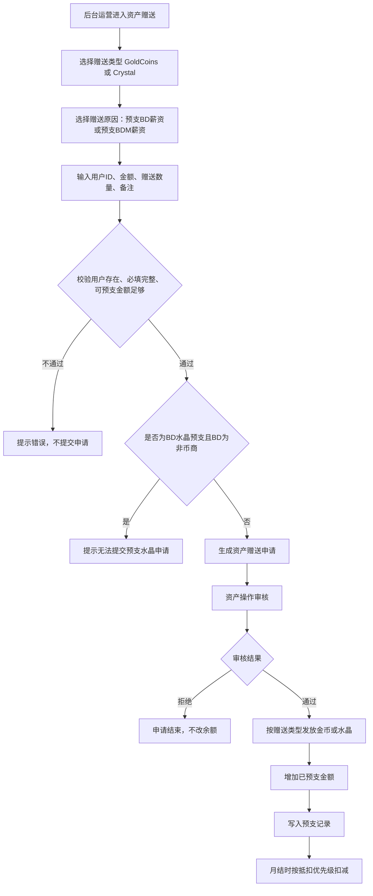
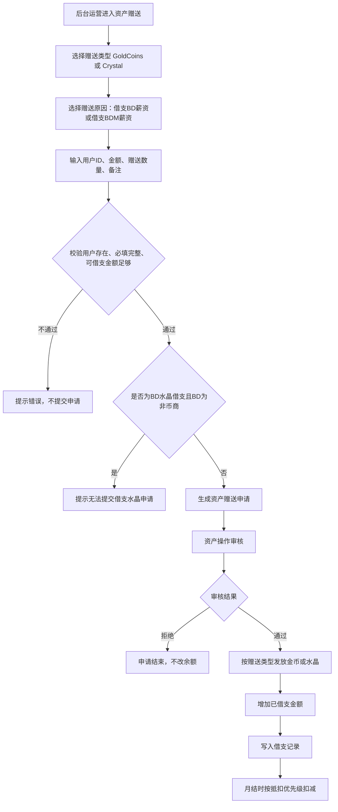
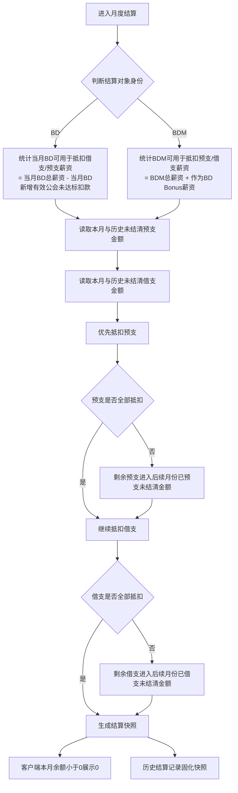
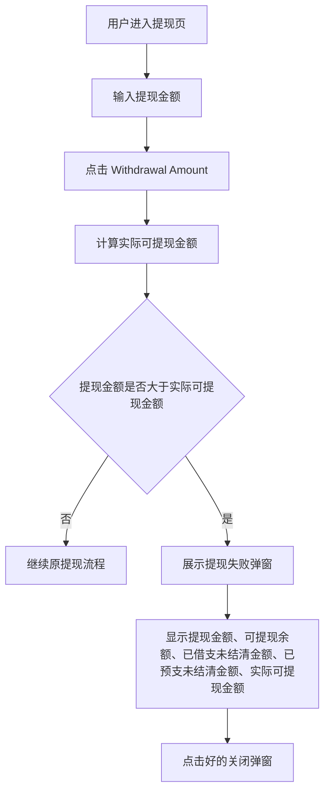

# BD2.0 需求文档

> 版本：V1.0  
> 输出时间：2026-07-09  
> 源材料：`BD2.0.xmind`、`原型图/` 目录  
> 说明：本文按 `BD2.0.xmind` 的 Sheet 2「画布 1 拷贝」作为最新口径主线，Sheet 1 仅作为旧口径对照。所有页面字段优先使用原型图可见字段命名；字段定义和计算方式按脑图业务规则补齐。

---

## 1. 产品目标与本次范围

BD2.0 本次主要补齐 BD / BDM 的预支、借支、薪资余额扣减、提现限制、后台资产赠送/扣除/审核，以及公会解绑对 BD 薪资影响提示。

本次不是重做完整 BD 系统，而是在现有 BD/BDM 薪资、绑定公会、资产操作基础上新增以下能力：

| 模块 | 本次变化 | 影响端 |
|---|---|---|
| BD 本月薪资 | 新增本月借支、本月预支金额；调整本月薪资余额公式 | 客户端、后台 |
| BD 历史结算 | 历史快照新增当月借支、当月预支；调整当月薪资余额 | 客户端、后台 |
| BDM 总薪资 | 新增「我的总薪资」汇总页，合并 BDM 薪资与 BDM 作为 BD 的 Bonus 薪资 | 客户端 |
| BDM 历史结算 | 新增我的总薪资历史结算记录，保留汇总快照 | 客户端 |
| 预支/借支记录 | BD/BDM 均可查看预支、借支、扣款记录 | 客户端 |
| 提现限制 | 提现金额超过实际可提现金额时弹窗拦截 | 客户端 |
| BD 管理 | 新增借支额度字段，新增/编辑 BD 时可配置 | 后台 |
| BD/BDM 薪资明细 | 新增预支、借支字段，并纳入导出 | 后台 |
| 资产赠送 | 新增 BD/BDM 借支、预支相关赠送原因，展示 BD/BDM 薪资信息 | 后台 |
| 资产扣除 | 新增扣除 BD 薪资可提现余额 | 后台 |
| 资产操作审核 | 审核列表、筛选、通过/拒绝逻辑补齐 BD 薪资相关原因 | 后台 |
| 公会解散 | 公会已绑定 BD 且当月有效薪资流水达标时，解散前提示收入影响 | 后台 |

---

## 2. 核心角色与账户模型

### 2.1 角色定义

| 角色 | 说明 | 本次涉及能力 |
|---|---|---|
| BD | 绑定公会、产生 BD 薪资、可预支、可借支、可提现 | 本月薪资、历史结算、预支/借支记录、提现限制 |
| BDM | 管理 BD 团队，同时可能作为 BD 产生个人 BD Bonus 薪资 | 我的总薪资、团队薪资、预支/借支记录、后台薪资明细 |
| 后台运营 | 配置 BD、处理资产赠送/扣除、审核资产操作 | BD 管理、资产赠送、资产扣除、资产操作审核 |
| 公会 | 被 BD 绑定后产生有效薪资流水，影响 BD/BDM 收入 | 公会详情、解散提示 |

### 2.2 账户与债务口径

| 对象 | 业务定义 | 关键规则 |
|---|---|---|
| 借支额度 | 后台给 BD/BDM 配置的可借支上限 | 借支额度不区分 BD/BDM 身份，额度和债务跟随用户 |
| 已借支未结清金额 | 用户历史借支中尚未通过薪资或可提现余额抵扣完成的金额 | 统计本月借支 + 历史借支未结清金额 |
| 已预支未结清金额 | 用户历史预支中尚未通过薪资或可提现余额抵扣完成的金额 | 统计本月预支 + 历史预支未结清金额 |
| 可借支金额 | 当前仍可继续借支的额度 | 可借支金额 = 借支额度 - 已借支未结清金额；小于 0 时展示为 0 |
| 可预支金额 | 当前仍可继续预支的薪资额度 | BD 与 BDM 口径不同，见后文各页面公式 |
| 实际可提现金额 | 提现时最终允许提交的金额上限 | 实际可提现金额 = 可提现余额 - 已借支未结清金额 - 已预支未结清金额；小于 0 时展示为 0 |

### 2.3 全局展示规则

1. 所有金额类统计结果小于 0 时，前端统一显示为 0。
2. 历史结算页展示的是结算快照，不随当前借支、预支状态实时重算。
3. 本月页面展示当前实时结果，需包含历史未结清金额对当前余额的影响。
4. BD/BDM 多身份用户的债务归属跟随用户，但页面展示时必须区分：BD 身份薪资、BDM 身份薪资、BDM 作为 BD 的 Bonus 薪资。

---

## 3. 核心公式与结算规则

### 3.1 BD 本月薪资余额

| 变更类型 | 字段 | 业务定义 | 计算方式 / 取值规则 | 数据来源 |
|---|---|---|---|---|
| 新增 | 本月借支 | BD 本月新发生借支与历史未结清借支合计 | 本月借支 = 本月借支金额 + 历史借支未结清金额 | 后台资产赠送与结算抵扣记录 |
| 新增 | 本月预支金额 | BD 本月新发生预支与历史未结清预支合计 | 本月预支金额 = 本月预支金额 + 历史预支未结清金额 | 后台资产赠送与结算抵扣记录 |
| 调整 | 本月薪资余额 | BD 本月薪资扣除未达标扣款、借支、预支后的结果 | 本月薪资余额 = 当月薪资 - 当月新增有效未达标扣款 - 已借支未结清金额 - 已预支未结清金额；小于 0 显示 0 | BD 薪资结算结果 |
| 调整 | 当月薪资余额（后台） | 后台 BD 薪资明细列表展示的余额 | 当月薪资余额 = 当月 BD 底薪 + 当月 BD Bonus 薪资 - 当月 BD 新增有效公会未达标 - 当月借支金额 - 当月预支金额 | 后台 BD 薪资明细 |

### 3.2 BDM 汇总总薪资余额

| 变更类型 | 字段 | 业务定义 | 计算方式 / 取值规则 | 数据来源 |
|---|---|---|---|---|
| 新增 | BD Bonus 薪资 | BDM 作为 BD 身份产生的当月 Bonus 薪资 | 读取 BDM 个人 BD 身份当月 Bonus 薪资 | BD 薪资结算结果 |
| 新增 | BDM 薪资 | BDM 管理身份当月总薪资 | 读取 BDM 身份当月总薪资 | BDM 薪资结算结果 |
| 新增 | 已借支金额 | BDM 用户本月借支与历史借支未结清合计 | 已借支金额 = 本月借支金额 + 历史借支未结清金额 | 资产赠送与结算抵扣记录 |
| 新增 | 已预支金额 | BDM 用户本月预支与历史预支未结清合计 | 已预支金额 = 本月预支金额 + 历史预支未结清金额 | 资产赠送与结算抵扣记录 |
| 新增 | 汇总总薪资 | 本月 BDM 总薪资与 BDM 作为 BD 产生的 Bonus 薪资合计 | 当月汇总总薪资 = 当月 BDM 总薪资 + 当月 BD Bonus 薪资 | BDM 汇总薪资数据 |
| 新增 | 汇总总薪资余额 | BDM 当前可展示的汇总薪资余额 | 汇总总薪资余额 = 当月汇总总薪资 - 已借支金额 - 已预支金额；小于 0 显示 0 | BDM 汇总薪资数据 |
| 调整 | 当月总薪资（后台） | 后台 BDM 薪资明细列表展示的当月总薪资 | 当月总薪资 = 当月 BDM 总薪资 + 当月 BD Bonus 薪资 | 后台 BDM 薪资明细 |

### 3.3 提现实际可提现金额

| 变更类型 | 字段 | 业务定义 | 计算方式 / 取值规则 | 数据来源 |
|---|---|---|---|---|
| 新增 | 发起提现金额 | 用户本次输入的提现金额 | 读取本次提交金额 | 提现页输入 |
| 新增 | 可提现余额 | 当前用户账户展示可提现余额 | 读取当前用户账户 BD 可提现余额 | 薪资余额账户 |
| 新增 | 已借支未结清金额 | 用户所有身份下尚未结清的借支金额 | 已借支未结清金额 = 作为 BD 未结清借支金额 + 作为 BDM 未结清借支金额 | 借支记录 |
| 新增 | 已预支未结清金额 | 用户所有身份下尚未结清的预支金额 | 已预支未结清金额 = max(0，历史预支未结清总金额 - 当前薪资可抵扣能力)；当前薪资可抵扣能力 = BD 本月总薪资 - BD 本月新增有效公会未达标扣款 + BDM 总薪资 | 预支记录与薪资结算结果 |
| 新增 | 实际可提现金额 | 用户本次最大可提现金额 | 实际可提现金额 = 可提现余额 - 已借支未结清金额 - 已预支未结清金额；小于 0 显示 0 | 提现校验结果 |

### 3.4 每月结算抵扣顺序

每月结算抵扣预支、借支时，**可提现余额不参与月结抵扣**。系统必须先判断结算对象身份，再计算该身份当月可用于抵扣预支、借支的薪资金额。

| 身份 | 可用于抵扣预支/借支薪资 | 计算方式 |
|---|---|---|
| BD | 当月 BD 可用于抵扣借支/预支薪资 | 当月 BD 总薪资 - 当月 BD 新增有效公会未达标 |
| BDM | BDM 可用于抵扣预支/借支薪资 | BDM 总薪资 + 作为 BD Bonus 薪资 |

抵扣优先级：

1. 当月预支金额。
2. 当月借支金额。
3. 历史未结清预支金额。
4. 历史未结清借支金额。

注意：当月预支金额、当月借支金额在本次 PRD 口径中，均包含当月新发生金额以及历史未结清金额。

若该身份当月可用于抵扣的薪资不足以抵扣全部金额，未抵扣完成部分进入后续月份的已预支未结清金额或已借支未结清金额，直至还清。

---

## 4. 客户端需求

### 4.1 BD 视角 - BD 本月薪资数据

#### 对应原型

#### 页面定位

BD 在客户端查看本人本月薪资、可提现薪资、本月借支、本月预支金额、本月薪资余额，并可进入历史结算和有效公会薪资明细。

#### 原型可见区块与字段

| 变更类型 | 区块 | 字段 / 控件 | 原型显示 |
|---|---|---|---|
| 新增 | 本月薪资数据 | 本月借支 | 页面本月薪资数据区展示 |
| 新增 | 本月薪资数据 | 本月预支金额 | 页面本月薪资数据区展示 |
| 调整 | 本月薪资数据 | 本月薪资余额 | 页面本月薪资数据区展示，需同步扣减本月借支与本月预支 |

#### 字段定义与计算方式

| 变更类型 | 字段 | 业务定义 | 计算方式 / 取值规则 | 数据来源 |
|---|---|---|---|---|
| 新增 | 本月借支 | 本月新发生借支与历史未结清借支合计 | 本月借支金额 + 历史借支未结清金额 | 借支记录 |
| 新增 | 本月预支金额 | 本月新发生预支与历史未结清预支合计 | 本月预支金额 + 历史预支未结清金额 | 预支记录 |
| 调整 | 本月薪资余额 | 扣除新增有效未达标扣款、已借支未结清金额、已预支未结清金额后的可展示薪资余额 | 本月薪资余额 = 当月薪资 - 当月新增有效未达标扣款 - 已借支未结清金额 - 已预支未结清金额；小于 0 显示 0 | BD 薪资结算结果 + 借支/预支记录 |

#### 交互逻辑

1. 进入页面后默认展示「薪资数据」。
2. 点击「提现」进入 Withdrawal Salary 页面。
3. 点击「本月借支」进入 BD 借支记录页。
4. 点击「本月预支金额」进入 BD 预支记录页。
5. 点击「历史结算记录」进入 BD 薪资历史结算记录。
6. 点击有效公会薪资明细卡片，进入有效公会薪资明细页。
7. 字段旁问号图标用于解释字段口径；说明文案以本文字段定义为准。

#### 系统后台核心逻辑

- 本月页面读取实时统计结果。
- 借支、预支字段必须同时包含本月新发生金额与历史未结清金额。
- 本月薪资余额不得只扣本月新发生金额，必须扣除历史未结清金额。
- 余额结果小于 0 时，页面展示 0，但系统仍需保留未结清金额用于后续月份继续抵扣。

#### 边界情况

| 场景 | 处理规则 |
|---|---|
| BD 本月薪资不足以抵扣预支 | 未抵扣部分进入后续月份已预支未结清金额 |
| BD 本月薪资不足以抵扣借支 | 未抵扣部分进入后续月份已借支未结清金额 |
| 本月薪资余额小于 0 | 页面显示 0，未结清金额继续保留 |
| BD 本月绑定公会后预支，后续解绑公会导致薪资下降 | 未抵扣预支继续进入后续月份，直到还清 |

---

### 4.2 BD 视角 - 薪资历史结算记录

#### 对应原型

#### 页面定位

展示 BD 已结算月份的薪资快照，供 BD 查看历史月份薪资构成、当月借支、当月预支金额及结算后余额。

#### 原型可见字段

| 变更类型 | 字段 | 展示说明 |
|---|---|---|
| 新增 | 当月借支 | 历史月份新增字段，读取当月借支快照 |
| 新增 | 当月预支金额 | 历史月份新增字段，读取当月预支快照 |
| 调整 | 当月薪资余额 | 历史月份调整字段，按“当月总薪资 - 当月新增有效未达标扣款 - 已借支未结清金额 - 已预支未结清金额”固化余额快照 |

#### 交互逻辑

1. 页面按结算时间倒序展示历史记录。
2. 点击单条历史记录右侧箭头，进入有效公会薪资明细页。
3. 历史页所有字段均读取结算快照，不随当前借支/预支状态实时变化。

#### 系统后台核心逻辑

- 结算完成时必须固化当月预支、当月借支、当月薪资余额快照。
- 快照中的当月预支、当月借支需要包含当月产生金额以及当月历史未结清金额。
- 历史快照不可被后续月份抵扣动作回写覆盖。

---

### 4.3 BD 视角 - 有效公会薪资明细

#### 对应原型

#### 页面定位

展示某个结算月份内，BD 名下有效公会对薪资流水的贡献明细。

#### 原型可见字段

| 变更类型 | 字段 | 说明 |
|---|---|---|
| 新增 | 当月借支 | 当前历史月份借支快照 |
| 新增 | 当月预支金额 | 当前历史月份预支快照 |
| 调整 | 当月薪资余额 | 当前历史月份薪资余额快照，按“当月总薪资 - 当月新增有效未达标扣款 - 已借支未结清金额 - 已预支未结清金额”固化 |

#### 交互逻辑

1. 从历史结算记录进入时，页面展示该历史月份的有效公会明细。
2. 页面底部按公会卡片列表展示有效公会贡献。
3. 点击返回按钮返回历史结算记录。

#### 系统后台核心逻辑

- 明细页读取历史结算快照下的公会贡献数据。
- 公会贡献数据必须与历史薪资总额保持同一结算周期，不允许读取当前实时绑定关系替换历史快照。

---

### 4.4 BD 视角 - 预支与借支记录

#### 对应原型

#### 页面定位

BD 从本月薪资页面点击「本月预支金额」或「本月借支」后，进入对应记录页，查看预支、借支及扣款记录。

#### 页面结构

| 变更类型 | 页面 | Tab | 区块 | 字段 |
|---|---|---|---|---|
| 新增 | BD预支记录 | All / 预支 / 扣款 | 预支金额 | Time、Recipient ID、Amount、Coins、Crystal、Bill ID |
| 新增 | BD预支记录 | All / 预支 / 扣款 | 预支扣款 | Time、Amount、Crystal、Bill ID |
| 新增 | BD借支记录 | All / 借支 / 扣款 | 借支金额 | Time、Recipient ID、Amount、Coins、Crystal、Bill ID |
| 新增 | BD借支记录 | All / 借支 / 扣款 | 借支扣款 | Time、Amount、Crystal、Bill ID |

#### 记录字段定义

| 变更类型 | 字段 | 适用记录 | 定义 / 展示规则 |
|---|---|---|---|
| 新增 | Crystal | 预支发放、借支发放、预支扣款、借支扣款 | 展示本条记录关联的水晶数量；若该笔记录未涉及水晶，显示 0 或 `-`，但字段位置必须保留 |
| 保留 | Time | 预支发放、借支发放、预支扣款、借支扣款 | 记录产生时间；发放记录取审核通过后的发放时间，扣款记录取月结扣款生效时间 |
| 保留 | Recipient ID | 预支发放、借支发放 | 资产接收用户 ID；扣款记录不展示该字段 |
| 保留 | Amount | 预支发放、借支发放、预支扣款、借支扣款 | 预支/借支或扣款对应的薪资金额 |
| 保留 | Coins | 预支发放、借支发放 | 展示本条发放记录关联的金币数量；若该笔记录未涉及金币，显示 0 或 `-` |
| 保留 | Bill ID | 预支发放、借支发放、预支扣款、借支扣款 | 本条预支、借支或扣款记录的账单 ID，用于对账与问题追溯 |

#### 交互逻辑

1. 进入记录页后默认展示 All。
2. 点击「预支」只展示预支发放记录。
3. 点击「借支」只展示借支发放记录。
4. 点击「扣款」只展示结算扣款记录。
5. 预支、借支发放记录展示 Time、Recipient ID、Amount、Coins、Crystal、Bill ID。
6. 扣款记录展示 Time、Amount、Crystal、Bill ID。

#### 系统后台核心逻辑

- 预支、借支发放成功后必须写入对应记录。
- 每月结算抵扣预支/借支时必须写入扣款记录。
- 发放记录展示的是审核通过后实际发放的资产与薪资金额；扣款记录展示的是月结时实际抵扣的金额。
- 记录页中的本月预支、本月借支口径需要包含本月产生金额以及历史未结清金额影响，和薪资页、后台薪资明细页保持一致。
- 记录页展示金额应与后台资产操作审核通过后的申请记录保持一致。

---

### 4.5 BD 预支记录独立页

#### 对应原型

#### 功能说明

该原型展示 BD 预支记录的三种筛选状态：All、预支、扣款。

| 变更类型 | Tab | 展示内容 | 字段 |
|---|---|---|---|
| 新增 | All | 同时展示预支金额与预支扣款 | 预支金额：Time、Recipient ID、Amount、Coins、Crystal、Bill ID；预支扣款：Time、Amount、Crystal、Bill ID |
| 新增 | 预支 | 仅展示预支发放记录 | Time、Recipient ID、Amount、Coins、Crystal、Bill ID |
| 新增 | 扣款 | 仅展示预支扣款记录 | Time、Amount、Crystal、Bill ID |

#### 字段定义

| 变更类型 | 字段 | 适用记录 | 定义 / 展示规则 |
|---|---|---|---|
| 保留 | Time | 预支发放、预支扣款 | 预支发放取资产赠送审核通过并完成发放时间；预支扣款取月结抵扣生效时间 |
| 保留 | Recipient ID | 预支发放 | 接收预支资产的 BD 用户 ID；扣款记录不展示 |
| 保留 | Amount | 预支发放、预支扣款 | 预支发放记录展示本次预支薪资金额；预支扣款记录展示本次抵扣预支金额 |
| 保留 | Coins | 预支发放 | 本次预支发放关联金币数量；未发放金币时显示 0 或 `-`；扣款记录不展示 |
| 新增 | Crystal | 预支发放、预支扣款 | 本次预支发放或预支扣款关联水晶数量；未涉及水晶时显示 0 或 `-`，字段位置必须保留 |
| 保留 | Bill ID | 预支发放、预支扣款 | 本条BD 预支发放或预支扣款记录的账单 ID，用于对账与追溯 |

---

### 4.6 BD 借支记录独立页

#### 对应原型

#### 功能说明

该原型展示 BD 借支记录的三种筛选状态：All、借支、扣款。

| 变更类型 | Tab | 展示内容 | 字段 |
|---|---|---|---|
| 新增 | All | 同时展示借支金额与借支扣款 | 借支金额：Time、Recipient ID、Amount、Coins、Crystal、Bill ID；借支扣款：Time、Amount、Crystal、Bill ID |
| 新增 | 借支 | 仅展示借支发放记录 | Time、Recipient ID、Amount、Coins、Crystal、Bill ID |
| 新增 | 扣款 | 仅展示借支扣款记录 | Time、Amount、Crystal、Bill ID |

#### 字段定义

| 变更类型 | 字段 | 适用记录 | 定义 / 展示规则 |
|---|---|---|---|
| 保留 | Time | 借支发放、借支扣款 | 借支发放取资产赠送审核通过并完成发放时间；借支扣款取月结抵扣生效时间 |
| 保留 | Recipient ID | 借支发放 | 接收借支资产的 BD 用户 ID；扣款记录不展示 |
| 保留 | Amount | 借支发放、借支扣款 | 借支发放记录展示本次借支薪资金额；借支扣款记录展示本次抵扣借支金额 |
| 保留 | Coins | 借支发放 | 本次借支发放关联金币数量；未发放金币时显示 0 或 `-`；扣款记录不展示 |
| 新增 | Crystal | 借支发放、借支扣款 | 本次借支发放或借支扣款关联水晶数量；未涉及水晶时显示 0 或 `-`，字段位置必须保留 |
| 保留 | Bill ID | 借支发放、借支扣款 | 本条BD 借支发放或借支扣款记录的账单 ID，用于对账与追溯 |

---

### 4.7 BDM 视角 - 我的总薪资数据

#### 对应原型

#### 页面定位

BDM 查看本人汇总总薪资。该页面合并 BDM 管理身份薪资与 BDM 作为 BD 身份产生的 BD Bonus 薪资；借支、预支仅影响总薪资余额，不参与汇总总薪资定义。

#### 原型可见区块与字段

| 变更类型 | 区块 | 字段 / 控件 | 原型显示 |
|---|---|---|---|
| 新增 | 二级页签 | 我的总薪资 | 我的总薪资选中 |
| 新增 | 本月总薪资数据 | BD Bonus薪资、BDM薪资、已借支、已预支金额、总薪资、总薪资余额 | 新增 BDM 汇总页核心字段 |
| 新增 | 历史结算入口 | 历史结算记录、日期、金额、右箭头 | 进入我的总薪资历史结算记录 |

#### 字段定义与计算方式

| 变更类型 | 字段 | 业务定义 | 计算方式 / 取值规则 | 数据来源 |
|---|---|---|---|---|
| 新增 | BD Bonus薪资 | BDM 作为 BD 身份产生的当月 Bonus 薪资 | 读取 BDM 个人 BD 身份当月 Bonus 薪资 | BD 薪资结算结果 |
| 新增 | BDM薪资 | BDM 管理身份当月总薪资 | 读取 BDM 身份当月总薪资 | BDM 薪资结算结果 |
| 新增 | 已借支 | 本月借支与历史借支未结清合计 | 已借支 = 本月借支金额 + 历史借支未结清金额 | 借支记录 |
| 新增 | 已预支金额 | 本月预支与历史预支未结清合计 | 已预支金额 = 本月预支金额 + 历史预支未结清金额 | 预支记录 |
| 新增 | 总薪资 | BDM 当月汇总总薪资 | 当月汇总总薪资 = 当月 BDM 总薪资 + 当月 BD Bonus 薪资 | BDM 汇总薪资 |
| 新增 | 总薪资余额 | BDM 扣除未结清借支、预支后的汇总余额 | 总薪资余额 = 当月汇总总薪资 - 已借支金额 - 已预支金额；小于 0 显示 0 | BDM 汇总薪资 |

#### 交互逻辑

1. 点击「我的总薪资」展示 BDM 汇总总薪资数据。
2. 点击「已借支」进入 BDM 借支记录。
3. 点击「已预支金额」进入 BDM 预支记录。
4. 点击「历史结算记录」进入我的总薪资历史结算记录。
5. 点击「团队薪资」或「BD薪资」切换到对应薪资维度，本文仅描述本次新增/调整口径。

#### 系统后台核心逻辑

- BDM 总薪资页不能只展示 BDM 管理身份收入，必须纳入 BDM 作为 BD 产生的 BD Bonus 薪资。
- BDM 借支、预支扣减以用户为单位汇总，页面展示时进入「我的总薪资」统一扣减。
- BDM 作为 BD 身份产生的收入仍需保留来源身份，避免团队收益与个人 BD 收益混成一个字段。

---

### 4.8 BDM 视角 - 我的总薪资本月页

#### 对应原型

#### 功能说明

该原型为 BDM 「我的总薪资」本月页面独立截图，字段与 4.7 一致。

| 变更类型 | 字段 | 展示要求 |
|---|---|---|
| 新增 | BD Bonus薪资 | 展示 BDM 作为 BD 当月的 Bonus 薪资 |
| 新增 | BDM薪资 | 展示 BDM 作为 BDM 当月总薪资 |
| 新增 | 已借支 | 支持点击进入 BDM 借支记录 |
| 新增 | 已预支金额 | 支持点击进入 BDM 预支记录 |
| 新增 | 总薪资 | 展示当月 BDM 总薪资 + 当月 BD Bonus 薪资 |
| 新增 | 总薪资余额 | 展示扣除历史未结清金额后的汇总余额 |

---

### 4.9 BDM 视角 - 我的总薪资历史结算记录

#### 对应原型

#### 页面定位

展示 BDM 历史已结算月份的汇总总薪资快照。

#### 原型可见字段

| 变更类型 | 字段 | 业务定义 |
|---|---|---|
| 新增 | BD Bonus薪资 | 历史月份 BDM 作为 BD 的 Bonus 薪资快照 |
| 新增 | BDM薪资 | 历史月份 BDM 管理身份薪资快照 |
| 新增 | 已借支 | 历史月份借支快照 |
| 新增 | 已预支金额 | 历史月份预支快照 |
| 新增 | 总薪资 | 历史月份汇总总薪资快照 |
| 新增 | 总薪资余额 | 历史月份汇总总薪资余额快照 |

#### 交互逻辑

1. 页面按历史结算时间倒序展示。
2. 每条记录展示一组汇总薪资卡片。
3. 点击返回按钮返回我的总薪资本月页。

#### 系统后台核心逻辑

- 每月结算完成后，必须生成 BDM 汇总总薪资历史快照。
- 历史快照必须保存 BD Bonus薪资、BDM薪资、已借支、已预支金额、总薪资、总薪资余额。
- 历史数据不得被后续月份扣款动作覆盖。

---

### 4.10 BDM 预支记录

#### 对应原型

#### 功能说明

BDM 预支记录用于查看 BDM 用户的预支发放与预支扣款记录。

| 变更类型 | Tab | 展示内容 | 字段 |
|---|---|---|---|
| 新增 | All | 同时展示预支金额与预支扣款 | 预支金额：Time、Recipient ID、Amount、Coins、Crystal、Bill ID；预支扣款：Time、Amount、Crystal、Bill ID |
| 新增 | 预支 | 仅展示预支发放记录 | Time、Recipient ID、Amount、Coins、Crystal、Bill ID |
| 新增 | 扣款 | 仅展示预支扣款记录 | Time、Amount、Crystal、Bill ID |

#### 字段定义

| 变更类型 | 字段 | 适用记录 | 定义 / 展示规则 |
|---|---|---|---|
| 保留 | Time | 预支发放、预支扣款 | 预支发放取资产赠送审核通过并完成发放时间；预支扣款取月结抵扣生效时间 |
| 保留 | Recipient ID | 预支发放 | 接收预支资产的 BDM 用户 ID；扣款记录不展示 |
| 保留 | Amount | 预支发放、预支扣款 | 预支发放记录展示本次预支 BDM 薪资金额；预支扣款记录展示本次抵扣预支金额 |
| 保留 | Coins | 预支发放 | 本次预支发放关联金币数量；未发放金币时显示 0 或 `-`；扣款记录不展示 |
| 新增 | Crystal | 预支发放、预支扣款 | 本次预支发放或预支扣款关联水晶数量；未涉及水晶时显示 0 或 `-`，字段位置必须保留 |
| 保留 | Bill ID | 预支发放、预支扣款 | 本条BDM 预支发放或预支扣款记录的账单 ID，用于对账与追溯 |

---

### 4.11 BDM 借支记录

#### 对应原型

#### 功能说明

BDM 借支记录用于查看 BDM 用户的借支发放与借支扣款记录。

| 变更类型 | Tab | 展示内容 | 字段 |
|---|---|---|---|
| 新增 | All | 同时展示借支金额与借支扣款 | 借支金额：Time、Recipient ID、Amount、Coins、Crystal、Bill ID；借支扣款：Time、Amount、Crystal、Bill ID |
| 新增 | 借支 | 仅展示借支发放记录 | Time、Recipient ID、Amount、Coins、Crystal、Bill ID |
| 新增 | 扣款 | 仅展示借支扣款记录 | Time、Amount、Crystal、Bill ID |

#### 字段定义

| 变更类型 | 字段 | 适用记录 | 定义 / 展示规则 |
|---|---|---|---|
| 保留 | Time | 借支发放、借支扣款 | 借支发放取资产赠送审核通过并完成发放时间；借支扣款取月结抵扣生效时间 |
| 保留 | Recipient ID | 借支发放 | 接收借支资产的 BDM 用户 ID；扣款记录不展示 |
| 保留 | Amount | 借支发放、借支扣款 | 借支发放记录展示本次借支 BDM 薪资金额；借支扣款记录展示本次抵扣借支金额 |
| 保留 | Coins | 借支发放 | 本次借支发放关联金币数量；未发放金币时显示 0 或 `-`；扣款记录不展示 |
| 新增 | Crystal | 借支发放、借支扣款 | 本次借支发放或借支扣款关联水晶数量；未涉及水晶时显示 0 或 `-`，字段位置必须保留 |
| 保留 | Bill ID | 借支发放、借支扣款 | 本条BDM 借支发放或借支扣款记录的账单 ID，用于对账与追溯 |

---

### 4.12 提现 - 未结清借支/预支提现限制

#### 对应原型

#### 页面定位

用户在金币提现或现金提现时，若发起提现金额超过实际可提现金额，系统弹出失败提示并拦截提交。

#### 原型可见页面字段

| 变更类型 | 页面 | 字段 / 控件 | 原型显示 |
|---|---|---|---|
| 新增 | 提现失败弹窗 | 提现失败、提现金额、可提现余额、已借支未结清金额、已预支未结清金额、实际可提现金额、好的 | 提现金额超过实际可提现金额时展示 |

#### 弹窗文案

| 变更类型 | 字段 | 原型示例 |
|---|---|---|
| 新增 | 提现金额 | 20$ |
| 新增 | 可提现余额 | 100$ |
| 新增 | 已借支未结清金额 | 60$ |
| 新增 | 已预支未结清金额 | 20$ |
| 新增 | 实际可提现金额 | 20$ |
| 新增 | 红色提示 | 您的提现金额超出实际可提现金额，无法提现 |
| 新增 | 按钮 | 好的 |

#### 字段定义

| 变更类型 | 字段 | 业务定义 | 计算方式 / 取值规则 |
|---|---|---|---|
| 新增 | 提现金额 | 用户本次输入的提现金额 | 读取当前提交的提现金额 |
| 新增 | 可提现余额 | 当前用户账户展示的 BD 可提现余额 | 读取当前用户账户 BD 可提现余额 |
| 新增 | 已借支未结清金额 | 作为 BD 与作为 BDM 两个身份下仍未结清的借支金额总和 | 已借支未结清金额 = 作为 BD 未结清借支金额 + 作为 BDM 未结清借支金额 |
| 新增 | 已预支未结清金额 | 所有历史预支未结清金额扣除当前薪资可抵扣能力后的剩余未结清金额 | 已预支未结清金额 = max(0，历史预支未结清总金额 - 当前薪资可抵扣能力) |
| 新增 | 当前薪资可抵扣能力 | 当前周期内可用于消化预支未结清金额的薪资能力 | 当前薪资可抵扣能力 = BD 本月总薪资 - BD 本月新增有效公会未达标扣款 + BDM 总薪资 |
| 新增 | 实际可提现金额 | 当前提现场景下最终允许提交的金额上限 | 实际可提现金额 = 可提现余额 - 已借支未结清金额 - 已预支未结清金额；小于 0 显示 0 |
| 新增 | 红色提示 | 提现失败时的拦截提示文案 | 发起提现金额 > 实际可提现金额时展示 |
| 新增 | 好的 | 关闭失败弹窗按钮 | 点击后关闭弹窗并停留在提现页 |

#### 触发规则

当发起提现金额 > 实际可提现金额时，提现失败弹窗展示并阻止提交。

#### 交互逻辑

1. 用户在提现页输入提现金额。
2. 点击 Withdrawal Amount。
3. 系统先读取可提现余额、已借支未结清金额、历史预支未结清总金额。
4. 系统计算当前薪资可抵扣能力，再计算已预支未结清金额。
5. 系统计算实际可提现金额。
6. 若发起提现金额大于实际可提现金额，展示提现失败弹窗。
7. 点击「好的」关闭弹窗，停留在提现页。
8. 若金额不超过实际可提现金额，继续原提现流程。

#### 系统后台核心逻辑

- 金币提现与现金提现均使用实际可提现金额校验。
- 可提现余额读取当前用户账户的 BD 可提现余额。
- 已借支未结清金额必须合并 BD 与 BDM 身份下未结清借支。
- 已预支未结清金额不是直接读取历史预支未结清总金额，而是要先扣减当前薪资可抵扣能力后再取剩余值。
- 当前薪资可抵扣能力按脑图口径统计：BD 本月总薪资 - BD 本月新增有效公会未达标扣款 + BDM 总薪资。
- 已预支未结清金额、实际可提现金额小于 0 时按 0 处理。
- 现金提现开放时间仍按原规则「每月3-7号」执行；本次新增逻辑只补实际可提现金额拦截。

---

## 5. 后台需求

### 5.1 BD 管理 - 借支额度

#### 对应原型

#### 页面定位

后台 BD 管理列表和新增/编辑 BD 表单中新增「借支额度$」。

#### 列表页字段

| 变更类型 | 区块 | 字段 / 控件 | 原型显示 |
|---|---|---|---|
| 新增 | 列表列 | 借支额度$ | 展示 BD 的借支额度，导出 excel 需包含 |

#### 新增 / 编辑 BD 表单字段

| 变更类型 | 字段 | 原型显示 | 本次规则 |
|---|---|---|---|
| 新增 | 借支额度$ | 输入框 | 非必填，仅可输入数字 |

#### 业务规则

1. 借支额度不区分 BD/BDM 身份，额度和债务跟随用户。
2. 新增或编辑 BD/BDM 时可配置借支额度$。
3. 借支额度$非必填；未填写时按 0 或空值处理，具体默认值需产品确认。
4. 借支额度$仅可输入数字。
5. 导出 excel 需要包含新增字段「借支额度$」。

#### 系统后台核心逻辑

- 借支额度作为用户维度额度，不随职位切换自动清零。
- 用户从 BD 升为 BDM 或 BDM 降为 BD 时，未结清借支仍跟随用户。
- 可借支金额按用户维度计算：可借支金额 = 借支额度 - 已借支未结清金额。

---

### 5.2 后台 BD 薪资明细

#### 对应原型

#### 页面定位

后台查看 BD 薪资明细，新增借支、预支字段，并调整当月薪资余额。

#### 页面字段

| 变更类型 | 区块 | 字段 / 控件 |
|---|---|---|
| 新增 | 汇总字段 | 当月总借支、当月总预支 |
| 调整 | 汇总字段 | 当月总薪资余额 |
| 新增 | 列表字段 | 当月总借支、当月总预支 |
| 调整 | 列表字段 | 当月总薪资余额 |

#### 字段定义与计算方式

| 变更类型 | 字段 | 业务定义 | 计算方式 / 取值规则 |
|---|---|---|---|
| 新增 | 当月总借支 | BD 本月借支与历史未结清借支合计 | 查询本月数据时统计本月借支 + 历史借支未结清；查询历史月份时读取当月快照 |
| 新增 | 当月总预支 | BD 本月预支与历史未结清预支合计 | 查询本月数据时统计本月预支 + 历史预支未结清；查询历史月份时读取当月快照 |
| 调整 | 当月总薪资余额 | BD 当月总薪资扣减后的余额 | 当月 BD 底薪 + 当月 BD Bonus 薪资 - 当月 BD 新增有效公会未达标 - 当月借支金额 - 当月预支金额 |

#### 交互逻辑

1. 查询本月数据时，借支、预支字段按实时统计口径展示。
2. 查询历史月份数据时，借支、预支字段按历史结算快照展示。
3. 点击导出excel时，导出文件必须包含新增字段：当月总借支、当月总预支、当月总薪资余额。

#### 系统后台核心逻辑

- 后台列表、汇总数据、导出数据三处口径必须一致。
- 本月实时数据与历史快照数据不能混用。
- 历史月份数据查询必须读取历史快照中的当月预支、当月借支，不能按当前未结清金额重算。

---

### 5.3 后台 BDM 薪资明细

#### 对应原型

#### 页面定位

后台查看 BDM 薪资明细，新增 BDM 作为 BD 的 Bonus 薪资、当月总借支、当月总预支、当月薪资余额，并调整当月总薪资。

#### 页面字段

| 变更类型 | 区块 | 字段 / 控件 |
|---|---|---|
| 新增 | 汇总字段 | 当月作为BD Bonus薪资、当月总借支、当月总预支、当月薪资余额 |
| 调整 | 汇总字段 | 当月总薪资 |
| 新增 | 列表字段 | 当月作为BD Bonus 薪资、当月总借支、当月总预支、当月薪资余额 |
| 调整 | 列表字段 | 当月总薪资 |

#### 字段定义与计算方式

| 变更类型 | 字段 | 业务定义 | 计算方式 / 取值规则 |
|---|---|---|---|
| 新增 | 当月作为BD Bonus 薪资 | BDM 作为 BD 身份产生的当月 Bonus 薪资 | 读取该 BDM 用户 BD 身份下当月 Bonus 薪资 |
| 新增 | 当月总借支 | BDM 用户本月借支与历史借支未结清合计 | 查询本月数据时统计本月借支 + 历史借支未结清；查询历史月份时读取当月快照 |
| 新增 | 当月总预支 | BDM 用户本月预支与历史预支未结清合计 | 查询本月数据时统计本月预支 + 历史预支未结清；查询历史月份时读取当月快照 |
| 调整 | 当月总薪资 | BDM 当月总薪资 | 当月总薪资 = 当月 BDM 总薪资 + 当月 BD Bonus 薪资 |
| 新增 | 当月薪资余额 | BDM 当月薪资余额 | 当月薪资余额 = 当月总薪资 - 已借支金额 - 已预支金额 |

#### 交互逻辑

1. 查询本月数据时，新增借支、预支字段按实时统计。
2. 查询历史月份数据时，新增借支、预支字段按历史快照读取。
3. 查询本月数据时，展示当月总预支、当月总借支、当月薪资余额、当月作为BD Bonus 薪资。
4. 查询历史月份数据时，展示当月预支、当月借支历史快照，不用当前实时未结清金额覆盖历史月份。
5. 导出 excel 需要包含新增字段。
6. BDM 薪资明细必须展示 BDM 作为 BD 的 Bonus 薪资，避免漏算多身份收入。

#### 系统后台核心逻辑

- BDM 管理身份薪资与 BDM 作为 BD 的 Bonus 薪资必须分字段展示。
- 查询本月数据时，当月总预支、当月总借支按“本月发生金额 + 历史未结清金额”统计。
- 查询历史月份数据时，当月预支、当月借支读取当月历史快照；若当月存在历史未结清金额，需要包含当月产生金额与当月历史未结清金额。
- 当月总薪资计算时纳入当月 BD Bonus 薪资，不扣除当月借支和当月预支；借支、预支只影响当月薪资余额。
- 当月薪资余额纳入历史未结清借支、预支影响。
- 导出 excel 必须包含：当月作为BD Bonus 薪资、当月总借支、当月总预支、当月薪资余额、当月总薪资。

---

### 5.4 后台资产赠送 - BD/BDM 预支与借支

#### 对应原型

#### 页面定位

后台资产赠送新增 BD/BDM 借支、预支原因，并在赠送弹窗中展示用户 BD/BDM 薪资信息，支持发放金币或水晶。

#### 列表与筛选字段

| 变更类型 | 区块 | 字段 / 控件 | 本次变化 |
|---|---|---|---|
| 新增 | 筛选 | 赠送原因 | 支持按新增/调整后的赠送原因筛选 |
| 新增 | 列表字段 | 预支薪资金额、借支薪资金额 | 展示 BD/BDM 预支、借支相关金额 |
| 调整 | 列表字段 | 赠送原因 | 原“借支金额/预支金额”相关原因拆分为主播、BD、BDM 薪资原因 |

#### 赠送原因枚举

| 原原因 / 新原因 | 处理方式 | 使用场景 |
|---|---|---|
| 平台奖励 | 保留 | 原有奖励发放场景 |
| 活动奖励 | 保留 | 原有奖励发放场景 |
| 家族结算 | 保留 | 原有奖励发放场景 |
| 其它 | 保留 | 原有奖励发放场景 |
| 游戏币兑换 | 保留 | 原有奖励发放场景 |
| 线下充值 | 保留 | 原有奖励发放场景 |
| 借支主播薪资 | 由原“借支金额”调整命名 | 主播薪资借支 |
| 预支主播薪资 | 由原“预支金额”调整命名 | 主播薪资预支 |
| 借支 BD薪资 | 新增 | BD 身份借支 |
| 预支BD薪资 | 新增 | BD 身份预支 |
| 借支BDM薪资 | 新增，原型弹窗可见 | BDM 身份借支 |
| 预支BDM薪资 | 新增，原型弹窗可见 | BDM 身份预支 |

#### 赠送弹窗字段

| 变更类型 | 字段 | 说明 |
|---|---|---|
| 新增 | 赠送原因 | 选择借支BD薪资、借支BDM薪资、预支BD薪资、预支BDM薪资等原因 |
| 新增 | 扣除薪资的 BDID | 输入需要扣除薪资的 BD ID；用于 BD 相关薪资操作 |
| 新增 | 借支的 BD ID | 输入借支接收相关 BD ID；用于定位接收借支资产的 BD/BDM 用户 |
| 新增 | BDM薪资 / BD/BDM薪资 | 展示当前工资余额、可提现余额、已预支、可预支、已借支、可借支 |
| 调整 | 用户信息 | 身份新增 BD、BDM；原主播/公会长相关薪资数据归类为“公会长/主播薪资” |
| 新增 | 赠送金额($) | 输入预支/借支对应薪资金额，用于债务与余额校验 |
| 新增 | 赠送数量 | 输入实际发放数量，对应金币或水晶到账数量 |
| 新增 | 赠送类型 | 选择本次预支/借支发放资产类型；借支/预支 BD 薪资、BDM 薪资均支持 GoldCoins 与 Crystal；选择 Crystal 时需额外判断 BD 是否币商身份 |

#### 用户信息展示规则

| 变更类型 | 身份区块 | 字段 | 身份 / 来源 | 统计方式 |
|---|---|---|---|---|
| 新增 | BDM薪资 / BD/BDM薪资 | 当前工资余额 | BDM 身份 | 统计 BDM 本月：BDM 总薪资 + BD Bonus 薪资 - 已借支金额 - 已预支金额；小于 0 显示 0 |
| 新增 | BDM薪资 / BD/BDM薪资 | 当前工资余额 | BD 身份 | 统计该 BD 本月的工资余额；按 BD 本月薪资余额口径：当月薪资 - 当月新增有效未达标扣款 - 已借支未结清金额 - 已预支未结清金额；小于 0 显示 0 |
| 新增 | BDM薪资 / BD/BDM薪资 | 可提现余额 | 用户合计 | 统计该用户 BD、BDM 身份账户总可提现余额；该字段用于展示账户可提现能力，不等于当前工资余额 |
| 新增 | BDM薪资 / BD/BDM薪资 | 已预支 | BDM / BD 身份 | 统计作为 BDM/BD 的本月预支 + 历史预支未结清总金额 |
| 新增 | BDM薪资 / BD/BDM薪资 | 已借支 | BDM / BD 身份 | 统计作为 BDM/BD 的本月借支 + 历史借支未结清总金额 |
| 新增 | BDM薪资 / BD/BDM薪资 | 可预支 | BDM / BD 身份 | 可预支金额 = 对应身份当前工资余额；选择预支 BDM 薪资时取 BDM 身份当前工资余额，选择预支 BD 薪资时取 BD 身份当前工资余额 |
| 新增 | BDM薪资 / BD/BDM薪资 | 可借支 | 用户维度 | 可借支金额 = 借支额度 - 已借支未结清金额；借支额度不区分 BD/BDM 身份，额度和债务跟随用户 |

#### 校验规则

点击「确定」时执行以下校验：

1. 输入用户 ID 是否存在。
2. 必填项是否都填写完毕。
3. 可借支金额 ≥ 输入借支金额。
4. 可预支金额 ≥ 输入预支金额。
5. 当赠送原因为「预支BDM薪资」时，必须用 BDM 身份当前工资余额校验可预支金额。
6. 当赠送原因为「预支BD薪资」时，必须用 BD 身份当前工资余额校验可预支金额。
7. 当赠送原因为「借支BDM薪资」或「借支BD薪资」时，必须用用户借支额度校验可借支金额。
8. 借支/预支薪资支持发放 GoldCoins 或 Crystal，不得写死为单一资产类型。
9. 赠送数量与赠送类型需匹配：金币发放走金币数量，水晶发放走水晶数量。
10. 当赠送类型选择 Crystal，且赠送原因为「预支BD薪资」或「借支BD薪资」时，必须判断该 BD 是否为币商身份；若 BD 为非币商身份，则无法提交预支/借支水晶申请。
11. 当赠送类型选择 GoldCoins 时，仍按预支/借支金额、额度、余额规则校验，不触发“非币商不可提交水晶申请”的限制。
12. 校验通过后提交资产赠送申请。

#### 系统后台核心逻辑

- 借支 BD薪资、借支 BDM薪资、预支 BD薪资、预支 BDM薪资通过资产赠送流程发起，审核通过后可发放金币或水晶；金币和水晶均支持预支/借支场景。
- 资产赠送申请提交后进入资产操作审核，不应直接到账。
- 水晶预支/借支存在币商身份限制：当赠送类型为 Crystal 且目标为 BD 薪资预支/借支时，提交前必须校验 BD 是否币商；非币商 BD 不允许提交预支/借支水晶申请。
- BDM 与 BD 的「当前工资余额」不能共用一个公式：BDM 身份按“BDM 总薪资 + BD Bonus 薪资 - 已借支金额 - 已预支金额”统计；BD 身份按“当月薪资 - 当月新增有效未达标扣款 - 已借支未结清金额 - 已预支未结清金额”统计。
- 可提现余额与当前工资余额不是同一字段：可提现余额展示账户可提现能力，当前工资余额用于预支额度校验。
- 借支额度不区分 BD/BDM 身份，额度和债务跟随用户；借支校验统一基于借支额度与已借支未结清金额。
- 审核通过后，预支/借支薪资发放需要同步完成四件事：发放金币或水晶、增加对应已预支/已借支金额、写入客户端预支/借支记录、更新后续月结可抵扣债务口径。
- 原“借支金额”“预支金额”在主播/公会长场景中调整为“借支主播薪资”“预支主播薪资”，避免与 BD/BDM 薪资混淆。

---

### 5.5 后台资产扣除 - BD 薪资可提现余额

#### 对应原型

#### 页面定位

后台资产扣除新增扣除类型与扣除原因，用于扣除 BD 薪资可提现余额。

#### 弹窗字段

| 变更类型 | 字段 | 原型显示 | 本次变化 |
|---|---|---|---|
| 新增 | 扣除类型 | BD薪资可提现余额 | 新增 BD薪资可提现余额 |
| 新增 | 扣除原因 | 扣除BD薪资可提现余额 | 新增扣除BD薪资可提现余额 |

#### 字段定义

| 变更类型 | 字段 | 业务定义 | 取值 / 处理规则 |
|---|---|---|---|
| 新增 | 扣除类型 | 本次资产扣除所作用的资产类别 | 固定为“BD薪资可提现余额” |
| 新增 | 扣除原因 | 本次扣除所对应的业务原因 | 固定为“扣除BD薪资可提现余额”，与扣除类型分开存储 |
| 新增 | 用户 ID | 被扣除 BD 薪资可提现余额的目标用户 | 输入目标用户 ID，用于读取当前 BD 薪资可提现余额 |
| 新增 | 扣除金额 | 本次需要扣减的 BD 薪资可提现余额金额 | 输入金额必须大于 0，且不得超过当前 BD 薪资可提现余额 |

#### 校验规则

点击「确定」时执行以下校验：

1. 输入用户 ID 是否存在。
2. 必填项是否都填写完毕。
3. 扣除类型为 BD薪资可提现余额时，BD 薪资可提现余额金额 ≥ 输入扣除金额。
4. 校验通过后提交资产扣除申请。

#### 系统后台核心逻辑

- 扣除 BD 薪资可提现余额只影响 BD 薪资可提现余额，不应误扣金币、钻石、水晶余额。
- 扣除申请必须进入资产操作审核，通过后才生效。
- 审核通过后需写入资产操作记录，并影响客户端提现实际可提现金额。
- 审核拒绝只更新申请状态和审核结果，不扣减任何余额。

---

### 5.6 后台资产操作审核

#### 对应原型

#### 页面定位

后台审核资产赠送与资产扣除申请。新增赠送原因筛选、申请原因字段枚举，以及 BD 薪资相关审核通过后的处理逻辑。

#### 筛选字段

| 变更类型 | 字段 | 说明 |
|---|---|---|
| 新增 | 赠送原因 | 新增筛选项，支持筛选借支BD薪资、预支BD薪资等原因 |

#### 赠送原因筛选项

平台奖励、活动奖励、家族结算、其它、游戏币兑换、借支主播薪资、预支主播薪资、线下充值、借支 BD薪资、借支BDM薪资、预支BDM薪资、预支BD薪资。

#### 列表字段

| 变更类型 | 字段 | 说明 |
|---|---|---|
| 新增 | 扣除薪资用户ID | 本次扣除薪资对应用户 ID |
| 新增 | 预支薪资金额 | BD/BDM 预支相关金额字段 |
| 新增 | 借支薪资金额 | BD/BDM 借支相关金额字段 |
| 调整 | 申请原因 | 新增借支BD薪资、借支BDM薪资、预支BD薪资、预支BDM薪资、扣除BD 薪资余额等枚举，并调整主播薪资相关命名 |

#### 审核通过规则

| 申请原因 | 通过后处理 |
|---|---|
| 借支BD薪资 | 根据申请记录，扣除 BD 可借支金额并增加已借支金额，发放申请数量的金币/水晶 |
| 借支BDM薪资 | 根据申请记录，扣除用户可借支金额并增加 BDM 身份已借支金额，发放申请数量的金币/水晶 |
| 预支BD薪资 | 根据申请记录，扣除 BD 可预支金额并增加已预支金额，发放申请数量的金币/水晶 |
| 预支BDM薪资 | 根据申请记录，扣除 BDM 身份可预支金额并增加 BDM 身份已预支金额，发放申请数量的金币/水晶 |
| 扣除BD 可提现余额 | 根据申请记录，扣除 BD 可提现余额 |

#### 拒绝规则

点击拒绝后关闭弹窗，不产生资产发放、薪资扣除、借支/预支金额变化；仅保留审核结果与备注。

#### 系统后台核心逻辑

- 审核通过是资产发放、薪资扣除、借支/预支金额变化的唯一生效点。
- 资产赠送提交时只生成申请记录，不直接改余额。
- 资产操作审核不得绕过提交校验：若申请为 BD 水晶预支/借支且 BD 为非币商身份，该申请不应被提交；若异常进入审核，应拒绝处理。
- 通过后必须同时写入：资产流水、BD/BDM 预支或借支记录、薪资可提现余额变更记录。
- 借支BDM薪资、预支BDM薪资通过后，也必须按对应身份更新 BDM 侧借支/预支债务口径。
- 审核拒绝不改变任何余额，仅更新申请状态和审核备注。

---

### 5.7 公会解散 - BD 薪资影响提示

#### 对应原型

#### 页面定位

后台公会详情中解散公会时，如果当前公会已绑定 BD，且该公会当月薪资流水达到公会有效薪资流水配置，系统弹窗提示继续解散会减少绑定 BD 收入。

#### 触发条件

同时满足以下条件时触发提示：

1. 当前公会已绑定 BD。
2. 当前公会当月薪资流水 ≥ 公会有效薪资流水配置。
3. 后台用户点击解散公会。

#### 弹窗文案

原型提示文案：

> 当前公会已绑定 BD，且当月薪资流水≥公会有效薪资流水配置，继续解绑将减少所绑定 BD 收入，建议次月再解散该公会

#### 弹窗按钮

| 按钮 | 处理规则 |
|---|---|
| 取消 | 关闭弹窗，不解散公会 |
| 继续解散 | 解散公会并解绑其绑定的 BD |

#### 系统后台核心逻辑

- 继续解散后，当前公会与 BD 的绑定关系解除。
- 解散导致 BD 本月薪资下降时，已预支、已借支未抵扣部分继续进入后续月份未结清金额。
- 提示弹窗只做风险告知，不阻止有权限用户继续解散。

---

## 6. 业务流程

### 6.1 BD/BDM 预支流程

### 6.2 BD/BDM 借支流程

### 6.3 月结抵扣流程

### 6.4 提现拦截流程

---

## 7. 状态与记录规则

### 7.1 资产操作申请状态

| 状态 | 进入条件 | 业务效果 | 可执行操作 |
|---|---|---|---|
| 审核中 | 资产赠送或资产扣除申请提交成功 | 不改余额，仅生成申请记录 | 通过、拒绝 |
| 已通过 | 审核人点击通过 | 资产发放或薪资扣除生效，写入记录 | 不可重复通过 |
| 已拒绝 | 审核人点击拒绝 | 不改余额，记录拒绝结果 | 不可再次通过 |

### 7.2 预支/借支记录类型

| 变更类型 | 类型 | 来源 | 记录字段 | 余额影响 |
|---|---|---|---|---|
| 新增 | 预支发放 | 资产赠送审核通过 | Time、Recipient ID、Amount、Coins、Crystal、Bill ID | 增加已预支金额 |
| 新增 | 预支扣款 | 月结抵扣 | Time、Amount、Crystal、Bill ID | 减少已预支未结清金额 |
| 新增 | 借支发放 | 资产赠送审核通过 | Time、Recipient ID、Amount、Coins、Crystal、Bill ID | 增加已借支金额 |
| 新增 | 借支扣款 | 月结抵扣 | Time、Amount、Crystal、Bill ID | 减少已借支未结清金额 |

#### 记录字段统一定义

| 字段 | 适用记录 | 统一定义 |
|---|---|---|
| Time | 发放记录、扣款记录 | 发放记录取审核通过并完成发放时间；扣款记录取月结抵扣生效时间 |
| Recipient ID | 发放记录 | 资产接收用户 ID，BD 记录为 BD 用户，BDM 记录为 BDM 用户；扣款记录不展示 |
| Amount | 发放记录、扣款记录 | 发放记录展示本次预支/借支薪资金额；扣款记录展示本次抵扣金额 |
| Coins | 发放记录 | 本次发放关联金币数量；未涉及金币时显示 0 或 `-`；扣款记录不展示 |
| Crystal | 发放记录、扣款记录 | 本次记录关联水晶数量；未涉及水晶时显示 0 或 `-`，字段位置必须保留 |
| Bill ID | 发放记录、扣款记录 | 预支、借支或扣款账单 ID，用于资产流水、薪资扣减和问题追溯 |

---

## 8. 边界情况与处理规则

| 编号 | 边界情况 | 处理规则 |
|---|---|---|
| B-01 | BD 本月绑定公会后产生 BD 薪资，BD 预支该部分薪资后解绑公会 | 若 BD 本月薪资无法抵扣预支，未抵扣部分进入后续月份已预支未结清金额，直到还清 |
| B-02 | BDM 本月绑定 BD 后产生薪资，BDM 预支后解绑 BD | 若 BDM 本月薪资无法抵扣预支，未抵扣部分进入后续月份已预支未结清金额，直到还清 |
| B-03 | BD/BDM 本月借支后，当月薪资不足抵扣 | 未抵扣部分进入后续月份已借支未结清金额，直到还清 |
| B-04 | 薪资余额计算结果小于 0 | 页面展示 0，未结清金额保留在债务字段中 |
| B-05 | 历史月份查询时用户当前仍有未结清金额 | 历史页读取历史快照，不用当前未结清金额覆盖历史数据 |
| B-06 | 资产赠送申请被拒绝 | 不发放资产，不增加已预支/已借支金额 |
| B-07 | 资产扣除申请被拒绝 | 不扣除 BD 薪资可提现余额 |
| B-08 | 公会解散会减少 BD 收入 | 弹窗提醒，用户确认继续解散后解除绑定，未抵扣金额按未结清规则延续 |
| B-09 | 借支额度小于已借支未结清金额 | 可借支金额展示为 0 |
| B-10 | 可预支金额小于 0 | 可预支金额展示为 0 |
| B-11 | 当月预支、当月借支字段在本月查询时存在历史未结清金额 | 查询结果需包含当月新发生金额与历史未结清金额，不得只展示本月新增值 |
| B-12 | 借支/预支薪资选择 GoldCoins 发放 | 正常进入预支/借支金额、额度、余额校验；金币和水晶均支持预支/借支 |
| B-13 | BD 借支/预支薪资选择 Crystal，但 BD 为非币商身份 | 无法提交预支/借支水晶申请；不生成资产赠送申请，不进入审核 |

---

## 9. 后台配置与导出要求

| 模块 | 导出要求 |
|---|---|
| BD 管理 | 导出 excel 必须包含借支额度$ |
| BD 薪资明细 | 导出 excel 必须包含当月总借支、当月总预支、当月总薪资余额 |
| BDM 薪资明细 | 导出 excel 必须包含当月作为BD Bonus 薪资、当月总借支、当月总预支、当月薪资余额 |
| 资产操作审核 | 导出审核记录时应包含申请原因、预支薪资金额、借支薪资金额、扣除薪资用户ID |

---

## 10. 权限与可见性

| 功能 | 可见 / 可操作对象 | 权限规则 |
|---|---|---|
| BD 本月薪资 | BD 本人 | 仅展示本人薪资数据 |
| BDM 我的总薪资 | BDM 本人 | 展示 BDM 管理身份 + 本人 BD Bonus 薪资 |
| BD/BDM 预支借支记录 | 记录所属用户本人 | 仅查看本人记录 |
| BD 管理借支额度 | 后台运营 | 具有 BD 管理权限的后台账号可新增/编辑 |
| 资产赠送 | 后台运营 | 具有资产赠送权限的后台账号可提交申请 |
| 资产扣除 | 后台运营 | 具有资产扣除权限的后台账号可提交申请 |
| 资产操作审核 | 后台审核人 | 具有审核权限的后台账号可通过/拒绝 |
| 公会解散提示 | 后台公会管理操作人 | 点击解散公会时触发提示 |

---

## 11. 待产品确认项

| 编号 | 问题 | 影响范围 | 建议默认值 | 优先级 |
|---|---|---|---|---|
| Q-01 | BD 管理新增/编辑中「借支额度$」未填写时，默认值是空、0，还是沿用历史值 | 可借支金额计算 | 新增为空按 0，编辑未改保持原值 | P1 |
| Q-02 | 资产操作审核筛选项是否需要同步展示「借支BDM薪资」「预支BDM薪资」 | 审核查询与运营筛选 | 与资产赠送原因保持一致，补齐 BDM 项 | P1 |
| Q-03 | 提现页「可提现余额」在多身份用户下是否展示 BD/BDM 合并可提现余额，还是仅展示 BD 可提现余额 | 提现弹窗与页面金额一致性 | 展示合并可提现余额，并在说明中拆分来源 | P0 |
| Q-04 | 已预支未结清金额在提现限制中的脑图公式括号缺失，需确认最终公式 | 提现拦截、实际可提现金额 | 按“总预支未结清 - 当前可抵扣薪资能力，最低为0”处理 | P0 |
| Q-05 | 借支金额与预支金额发放为 GoldCoins、Crystal 时，Amount、Coins、Crystal 的换算比例是否固定 | 资产赠送、记录页展示 | 沿用现有资产赠送换算规则，并在记录中保留 Coins、Crystal、Bill ID | P1 |
| Q-06 | 公会解散提示中“建议次月再解散”是否只是提示，不强制阻断 | 公会解散流程 | 不阻断，继续解散按钮可执行 | P1 |
| Q-07 | 资产扣除中扣除类型写“BD薪资可提现余额”，扣除原因写“扣除BD薪资可提现余额”，是否需要统一命名 | 后台字段一致性 | 统一为“扣除BD薪资可提现余额”作为原因，“BD薪资可提现余额”作为资产类型 | P2 |

---

## 12. 源材料覆盖核对

| 源材料 | 已覆盖章节 | 覆盖状态 |
|---|---|---|
| BD2.0.xmind - 客户端 BD 视角 | 4.1 - 4.6、4.12 | 已覆盖 |
| BD2.0.xmind - 客户端 BDM 视角 | 4.7 - 4.11 | 已覆盖 |
| BD2.0.xmind - 后台 BD 管理 | 5.1 | 已覆盖 |
| BD2.0.xmind - 后台 BD 薪资 | 5.2 | 已覆盖 |
| BD2.0.xmind - 后台 BDM 薪资 | 5.3 | 已覆盖 |
| BD2.0.xmind - 后台资产赠送 | 5.4 | 已覆盖 |
| BD2.0.xmind - 后台资产扣除 | 5.5 | 已覆盖 |
| BD2.0.xmind - 后台资产操作审核 | 5.6 | 已覆盖 |
| BD2.0.xmind - 公会管理解散提示 | 5.7 | 已覆盖 |
| 原型图目录 19 张图片 | 各功能章节逐图内嵌 | 已覆盖 |

---

## 13. 原型图映射表

| 原型图 | 对应章节 | 说明 |
|---|---|---|
| 原型图/bd本月薪资数据.jpg | 4.1 | BD 本月薪资数据 |
| 原型图/bd视角_bd薪资历史结算记录.jpg | 4.2 | BD 薪资历史结算记录 |
| 原型图/bd视角_bd薪资历史结算记录_有效公会薪资明细.jpg | 4.3 | BD 有效公会薪资明细 |
| 原型图/bd_视角：预支_借支.jpg | 4.4 | BD 预支/借支入口与记录关系 |
| 原型图/bd预支记录.jpg | 4.5 | BD 预支记录 |
| 原型图/bd借支记录.jpg | 4.6 | BD 借支记录 |
| 原型图/bdm视角我的总薪资数据.jpg | 4.7 | BDM 我的总薪资总览与历史入口 |
| 原型图/bdm视角_我的总薪资_本月.jpg | 4.8 | BDM 我的总薪资本月页 |
| 原型图/bdm_我的总薪资历史结算记录.jpg | 4.9 | BDM 我的总薪资历史结算记录 |
| 原型图/bdm预支记录.jpg | 4.10 | BDM 预支记录 |
| 原型图/bdm借支记录.jpg | 4.11 | BDM 借支记录 |
| 原型图/提现-未结清提现限制.jpg | 4.12 | 提现未结清限制弹窗 |
| 原型图/bd管理.jpg | 5.1 | 后台 BD 管理借支额度 |
| 原型图/bd薪资.jpg | 5.2 | 后台 BD 薪资明细 |
| 原型图/bdm薪资.jpg | 5.3 | 后台 BDM 薪资明细 |
| 原型图/后台-资产操作-增加.jpg | 5.4 | 后台资产赠送 |
| 原型图/后台-资产操作-扣除.jpg | 5.5 | 后台资产扣除 |
| 原型图/后台-资产操作审核.jpg | 5.6 | 后台资产操作审核 |
| 原型图/公会详情.jpg | 5.7 | 公会解散收入影响提示 |

---

## 14. 验收标准

| 编号 | 验收项 | 标准 |
|---|---|---|
| A-01 | BD 本月薪资字段 | 页面展示本月借支、本月预支金额、本月薪资余额，公式符合 XMind 口径 |
| A-02 | BD 历史结算 | 历史快照包含当月借支、当月预支、当月薪资余额 |
| A-03 | BDM 我的总薪资 | 页面展示 BD Bonus薪资、BDM薪资、已借支、已预支金额、总薪资、总薪资余额 |
| A-04 | BDM 历史结算 | 历史快照保留 BDM 汇总薪资字段 |
| A-05 | 预支/借支记录 | All、预支/借支、扣款三个 Tab 可正确筛选记录 |
| A-06 | 提现限制 | 提现金额大于实际可提现金额时展示失败弹窗并阻止提交 |
| A-07 | BD 管理 | 借支额度$可新增/编辑/列表展示/导出 |
| A-08 | BD 薪资明细 | 本月实时口径和历史快照口径区分正确，导出包含新增字段 |
| A-09 | BDM 薪资明细 | BDM 作为 BD 的 Bonus 薪资被纳入展示和计算 |
| A-10 | 资产赠送 | 借支/预支 BD/BDM 薪资申请经审核通过后才生效 |
| A-11 | 资产扣除 | BD 薪资可提现余额扣除经审核通过后才生效 |
| A-12 | 资产审核 | 通过/拒绝不会重复处理，拒绝不改余额 |
| A-13 | 公会解散提示 | 满足条件时弹窗提示收入影响，继续解散后解绑 BD |
| A-14 | 余额小于 0 | 前端统一展示为 0，未结清金额继续保留 |
| A-15 | 原型覆盖 | 19 张原型图均在对应章节内嵌，图片路径可打开 |
