# WeChill 三方休闲游戏接入 PRD - 房间内调起模式

> 版本：v1.6 可评审版  
> 日期：2026-05-20  
> 整合来源：v1.4 最新客户端交互与整机截图 + v1.5 高频边界、最小化、后台、数据模型  
> 整合规则：以 v1.5 的完整场景为主体，补入 v1.4 最新 Private room 快捷建房开游、国家筛选、Activity 顶部规则和整机截图；冲突处按最新原型和资产安全优先裁决。

---

## 0. 版本对比与整合结论

### 0.1 两版优劣对比

| 文档 | 优点 | 不足 | 本版处理 |
|---|---|---|---|
| v1.4 综合评审版 | 截图是最新整机样式；已补 Discover 国家筛选、Activity 只展示搜索、Private room 当前页弹休闲游戏半屏并走快捷建房开游；流程和埋点已同步该新交互 | 整体篇幅较短；全角色最小化、后台配置、断线、多端、扣费失败、结算补展示等高频边界不如 v1.5 细 | 作为客户端样式和关键交互的准绳 |
| v1.5 综合评审版 | 场景覆盖最完整；最小化专题很细；后台、数据模型、货币结算、断线恢复、多端并发、配置变更、退出/被踢等边界扎实 | Private room 仍是旧逻辑；截图引用不是最新整机图；缺少国家筛选细则；部分验收仍写“进入我的语聊房并打开游戏面板” | 作为业务规则、边界场景、后台和技术章节主体 |

### 0.2 完整度判断

综合判断：**v1.5 的场景覆盖最完整，v1.4 的客户端交互最新。**

因此 v1.6 采用：

- 以 v1.5 为主体保留完整边界场景、最小化、后台、数据、技术接入、验收。
- 用 v1.4 覆盖客户端页面截图、国家筛选、Activity 顶部、Private room 快捷入口、Private room 快捷建房开游的流程、埋点和验收。
- 冲突处按“最新可交互原型优先、资产安全优先、服务端状态可信、可灰度可回滚”裁决。

### 0.3 关键冲突裁决

| 冲突项 | v1.4 | v1.5 | v1.6 裁决 |
|---|---|---|---|
| Private room 点击行为 | 当前 Discover 页弹休闲游戏半屏，选游戏后走快捷建房开游 | 进入我的语聊房并打开游戏面板 | 采用统一路径：当前页弹半屏，选游戏后进入自己的房间并直接打开 H5；首次不展示房间页和设置页 |
| Private room 弹窗 Tab | 只保留休闲游戏 | 未单独定义，房内面板包含活动/动态表情 | Private room 只保留休闲游戏；房内面板仍保留活动/动态表情 |
| Discover Game Rooms 国家筛选 | 有国家横滑列表，搜索按钮固定在标题右侧 | 未覆盖 | 采用 v1.4 |
| 截图样式 | 整机截图，带手机外框 | 部分为裁切图 | 采用 v1.4 最新整机截图 |
| 最小化规则 | 有基础规则 | 全角色、恢复顺序、期间状态变化非常完整 | 采用 v1.5：无论房内入口还是 Private room 入口，最小化都返回 RoomGameSession 所属语聊房主界面 |
| 后台/数据模型 | 基础完整 | 字段更细，覆盖配置快照、系统托管、补偿、日志 | 采用 v1.5，并补 `source=private_room_entry` 入口来源字段 |

---

### 0.4 文档信息

| 项目 | 内容 |
|---|---|
| 产品 | WeChill 三方休闲游戏 |
| 接入模式 | 语聊房内直接调起 |
| 三方 | Bytesun |
| 目标市场 | MENA |
| 版本 | v1.6 可评审版 |
| 日期 | 2026-05-20 |
| 整合来源 | v1.4 + v1.5 |

## 1. 背景与目标

### 1.1 背景

WeChill 语聊房当前以语音社交为主，用户停留和互动方式相对单一。引入三方休闲游戏可以：

- 增加房间停留时长和互动深度。
- 提升付费转化和金币消耗场景。
- 降低用户社交冷启动门槛。

本期主路径仍是“语聊房内直接调起游戏”。同时保留 Discover `Private room` 快捷入口：用户可在 Discover 当前页先选择休闲游戏，系统随后进入用户自己的房间并直接打开 H5，用于快速私密局/快速体验；首次进入时不先展示语聊房主界面。

### 1.2 目标

| 目标 | 说明 |
|---|---|
| 快速验证 | 不改造房间模型，在现有语聊房内直接调起三方 H5 游戏 |
| 降低上线风险 | 不改房间类型，控制改造范围，支持灰度和下架 |
| 适配 MENA | 优先接入 Ludo、UNO、Domino、8 Ball、Carrom、Snake & Ladder |
| 快速体验 | Discover `Private room` 支持当前页选游戏、自动进入自己的房间并直接打开 H5，降低创建路径成本 |

## 2. 产品范围

### 2.1 V1 必做范围

| 模块 | 说明 |
|---|---|
| Discover Games 页面 | 底部 Discover 增加 Games / Activity 顶部 Tab，展示推荐游戏、Private room、国家筛选和正在玩游戏的语聊房 |
| Discover Private room 快捷入口 | 点击后在当前首页拉起休闲游戏选择半屏；选择游戏后进入自己的房间并直接进入 H5，首次不展示房间页和设置页 |
| Discover Activity 页面 | 展示游戏活动 Banner / Hot Events；右上角只展示搜索入口，不展示任务和头像占位 |
| More Games 全部游戏弹窗 | 展示全部游戏宫格，支持正常、维护、灰态、下载中等状态 |
| 房内 Games 入口 | 语聊房底部工具栏增加游戏入口，支持无游戏和有游戏两种状态 |
| 房内游戏面板 | 点击 Games 后展示半屏面板，包含休闲游戏、活动、动态表情 |
| 游戏设置页 | 选择游戏后展示对应设置页，包含人数、模式、门票、加入/开始 |
| 全屏游戏容器 | WebView / WKWebView 打开三方 H5，保留语聊房底部工具栏 |
| 游戏浮窗 | 用户最小化后回到语聊房，可通过浮窗恢复游戏 |
| 游戏状态同步 | loading、waiting、playing、settling、ended、error 全链路同步 |
| 游戏币余额与结算 | 支持 get_user_info、change_balance、游戏币不足跳转金币兑换页、walletUpdate |
| 后台配置 | 游戏上下架、地区端控制、入口开关、活动配置、接口配置 |
| 数据监控 | 核心埋点、游戏记录、结算记录、异常监控、基础看板 |
| 首批游戏 | Ludo / UNO / Domino / 8 Ball / Carrom / Snake & Ladder |

### 2.2 V1 不做范围

| 不做项 | 原因 | 后续 |
|---|---|---|
| 新增独立游戏房类型 | 改动房间模型、推荐流、权限、榜单，风险高 | V2 根据数据再评估 |
| 单房间多个游戏同时运行 | 状态和结算复杂 | V2 |
| 游戏排行榜 / 段位 | 需要长期赛季和风控 | V2 |
| 锦标赛 | 需要赛制、奖励、报名、反作弊 | V3 |
| RTC 推理游戏 | 涉及游戏内 RTC、音频权限和麦克风同步 | V3 |
| Slots / Jackpot 强推荐 | 合规风险更高 | 单独评审 |

### 2.3 V1 成功标准

| 指标 | 目标 |
|---|---|
| 游戏入口点击率 | ≥ 15% |
| 游戏加载成功率 | ≥ 95% |
| H5 gameLoaded 到达率 | ≥ 95% |
| 进入房间到可操作耗时 | P90 ≤ 8 秒 |
| 游戏完成率 | ≥ 90% |
| 结算失败率 | ≤ 0.5% |
| 白屏 / 崩溃率 | ≤ 1% |

## 3. 用户角色与权限

### 3.1 房间归属口径

WeChill 平台内每个用户都有自己的语聊房。本文中的“房主”不是平台级固定身份，而是**当前房间的归属用户**：

- 用户进入自己的房间时，该用户就是当前房间房主，可以开启游戏、关闭游戏、调整局参数。
- 用户进入其他人的房间时，无论其是否拥有自己的房间，在该房间内都按普通用户处理。
- Discover 页面进入 Game Rooms 或推荐游戏时，目标是进入“某个用户的房间里的游戏”，当前用户进入后默认是普通用户。
- Discover `Private room` 是特殊快捷入口：用户进入自己的房间，并直接开启游戏房模式。

### 3.2 角色定义

| 角色 | 判定方式 | 权限 |
|---|---|---|
| 当前房间房主 | `room.owner_user_id == current_user_id` | 可开启游戏、关闭游戏、调整局参数、踢出游戏座位 |
| 普通用户 | `room.owner_user_id != current_user_id` | 可查看、加入、观战、送礼、聊天 |
| 观战用户 | RoomGamePlayer.status=watching | 可观看游戏、公屏聊天、送礼，不可操作游戏 |
| 审核账号 | 后台策略 | 可隐藏入口、隐藏付费局和游戏币兑换入口，只展示低风险内容 |
| 被封禁用户 | 风控态 | 不展示入口，不允许进入游戏 |

说明：

- V1 游戏控制权只归当前房间房主。若平台存在房管 / 管理员能力，V1 在游戏内仍按普通用户处理，不开放 Start / Close / Kick Seat。
- Discover 匹配到游戏房后，用户一定是进入他人的房间，按普通用户状态 Join / Watch / Open。
- Private room 进入的是用户自己的房间，用户是当前房间房主，可直接创建 RoomGameSession。

权限矩阵：

| 功能 | 当前房间房主 | 普通用户 | 观战用户 | 审核账号 |
|---|---|---|---|---|
| 查看游戏入口 | 是 | 是 | 是 | 按策略 |
| 打开游戏面板 | 是 | 是 | 是 | 按策略 |
| 开启游戏 | 是 | 否 | 否 | 否 |
| 加入游戏座位 | 是 | 是 | 可从 watching 转入 | 否 |
| 观战 | 是 | 是 | 是 | 可配置 |
| 踢出游戏座位 | 是 | 否 | 否 | 否 |
| 关闭当前游戏 | 是 | 否 | 否 | 否 |
| 最小化游戏 | 是 | 是 | 是 | 按策略 |
| 再来一局 | 是 | 可 Join | 可 Join | 按策略 |

## 4. 前台页面样式截图

本章节以最新客户端 HTML 原型的整机截图展示页面样式，不再使用页面结构草图。截图中已包含 Discover 国家筛选、Private room 休闲游戏半屏、房内游戏面板和 Game coins 兑换页。

### 4.1 Discover - Games 首页


规则说明：

| 模块 | 规则 |
|---|---|
| 顶部 Tab | Games / Activity，默认选中 Games |
| 右上角入口 | Games 页展示任务、头像、搜索；Activity 页只展示搜索 |
| 用户资产 | 展示用户头像、游戏币余额、兑换入口 |
| Private room | 点击后优先在当前页弹出休闲游戏选择半屏；选中游戏后进入自己的房间，创建 RoomGameSession 并直接打开 H5 |
| 推荐游戏 | 首屏 6 个游戏位，最后一位 More Games；点击后按游戏匹配可加入的游戏房，用户进入目标房间后按普通用户处理 |
| Game Rooms | 展示当前有游戏会话的语聊房，不改变底层房间类型；点击房间后进入该房间并按普通用户 Join / Watch / Open |
| 国家筛选 | Game Rooms 标题右侧为固定搜索按钮；标题下方整行展示国家列表，可横向滑动 |
| 房间排序 | waiting 优先，其次 playing 可观战，再按热度/在线人数 |

Discover 普通游戏入口前置规则：

| 当前状态 | 处理 |
|---|---|
| 用户不在任何房间 | 直接按所选游戏 / 国家筛选匹配游戏房 |
| 用户在自己的房间最小化 | 先退出自己的房间，再按普通用户状态匹配游戏房 |
| 用户在他人的房间最小化 | 先退出当前他人房间，再按普通用户状态匹配游戏房 |
| 当前房间内有未结束游戏 | 弹窗提示进入其他游戏房将退出当前房间和当前游戏，确认后再匹配 |
| 匹配到自己的房间 | 不作为普通游戏房目标；需要开自己的游戏时走 `Private room` |

### 4.2 Discover - Private room 游戏选择半屏


规则说明：

| 模块 | 规则 |
|---|---|
| 触发入口 | Discover Games 页右侧 `Private room` 按钮 |
| 弹窗形态 | 在当前 Discover 首页上覆盖半屏弹窗，背景保留首页并加蒙层 |
| 内容范围 | 只保留 `休闲游戏` 一个分组，不展示 `游戏`、`动态表情` 两个 Tab |
| 游戏列表 | 展示 Black Jack、Ludo、Rocket、UNO、Domino、8 Ball、Snake、Carrom、Bingo、Draw、More、Help |
| 点击游戏 | 关闭半屏，进入用户自己的房间，创建 RoomGameSession，并直接进入对应 Bytesun H5 游戏页 |
| 跳转限制 | 首次不展示语聊房主界面，不进入房内游戏设置页；底层已进入用户自己的房间上下文 |
| 当前已有房间 | 若用户当前在其他房间或自己的旧房间最小化，需先退出当前房间，再进入自己的房间开局；若当前已在自己的房间且无游戏，可直接创建 RoomGameSession |
| 最小化 | 进入游戏后最小化，回到自己的房间主界面，后续恢复逻辑与房内游戏一致 |
| 关闭弹窗 | 点击关闭按钮或蒙层，返回 Discover Games 当前状态 |
| 异常状态 | 游戏维护、地区不可用、审核隐藏时在列表内灰态或隐藏；不可用时不进入 H5 |

### 4.3 Discover - Activity 活动页


规则说明：

| 模块 | 规则 |
|---|---|
| 活动列表 | 展示游戏活动 Banner / Hot Events |
| 顶部右侧 | 只展示搜索入口，不展示任务和头像占位 |
| 排序 | 默认按运营配置排序，可切换为热度/参与人数 |
| 跳转 | 支持跳活动详情、指定房间、指定游戏、金币兑换游戏币页面 |
| 结束活动 | 可灰态展示，也可后台隐藏 |

### 4.4 More Games 全部游戏弹窗


规则说明：

| 状态 | 样式 | 点击行为 |
|---|---|---|
| 正常 | 彩色 icon + 游戏名 | 打开游戏设置页 |
| 维护 | 灰态 + Maintenance | 不可点击，展示维护提示 |
| 下载中 | 进度态 | 完成后可打开 |
| 未下载 | 下载标识 | 点击后拉取游戏包 |
| 审核隐藏 | 不展示 | 对审核账号或限制地区隐藏 |

### 4.5 语聊房主界面与房内游戏面板

| 语聊房内入口 | 房内游戏半屏面板 |
|---|---|
|  |  |

规则说明：

| 模块 | 规则 |
|---|---|
| 底部游戏按钮 | 放在表情/礼物附近，作为主入口 |
| 右侧快捷入口 | 有活动或当前游戏时展示，点击打开活动或当前游戏 |
| 半屏面板 | 包含休闲游戏、活动、动态表情 Tab |
| 与 Private room 区别 | 房内面板保留活动和动态表情；Discover Private room 弹窗仅保留休闲游戏 |
| 无游戏状态 | 点击游戏进入设置页 |
| 有游戏状态 | 展示当前游戏，其他游戏不可切换 |
| 动态表情 | 保留现有能力，不与游戏互斥 |

### 4.6 游戏设置页样式

游戏设置页由具体游戏能力决定。V1 按三方返回能力展示，不强行统一所有字段。

| 8 Ball 设置 | Ludo 设置 | Snake & Ladder 设置 |
|---|---|---|
|  |  |  |

设置规则：

| 字段 | 说明 |
|---|---|
| 玩家人数 | 1v1 / 2 人 / 3 人 / 4 人，按游戏能力展示 |
| 游戏模式 | Classic / Magic / Quick 等，按游戏能力展示 |
| 门票 | 单位为游戏币；默认 0，可由当前房间房主调整，范围由后台配置 |
| 下注 | 部分游戏在 H5 内处理，不一定在设置页展示 |
| 开始按钮 | 当前房间房主可见并可点击，普通用户根据状态展示 Join / Watch |
| 退出按钮 | 返回语聊房，不关闭房间 |

### 4.7 全屏游戏主界面


规则说明：

| 模块 | 规则 |
|---|---|
| 三方游戏画面 | 高清图直接铺满 WebView，不再使用模糊底图 |
| 顶部房间信息 | 若三方游戏图已包含顶部信息，我方不重复叠加 |
| 底部工具栏 | 复用语聊房底部 icon：聊天、扬声器、麦克风、表情、消息、游戏、礼物、更多 |
| 游戏按钮 | 全屏游戏中点击底部游戏按钮，拉起房内 Games 半屏面板，默认在休闲游戏 Tab |
| 安全区 | 底部工具栏不得遮挡游戏关键操作；按 game_margin_bottom 配置 |
| 控制按钮 | 保留最小化、结算模拟、关闭按钮；线上按实际权限展示 |
| 语音 | 游戏中继续使用语聊房 RTC，默认语音优先 |
| 礼物 / 红包 | V1 保留入口，具体是否展示按后台开关 |

### 4.8 主要游戏页高清参考

| UNO | Ludo | Snake & Ladder | 8 Ball / Carrom |
|---|---|---|---|
|  |  |  |  |

### 4.9 游戏币不足与金币兑换页


页面规则：

| 模块 | 规则 |
|---|---|
| 页面入口 | 游戏币不足、游戏设置页点击游戏币余额、钱包页 Game coins Tab 均可进入 |
| 顶部 Tab | Gold coins / Diamonds / Game coins，进入时默认选中 Game coins |
| 游戏币余额卡 | 展示"我的游戏币余额"和当前游戏币数量 |
| 兑换输入 | 用户输入希望获得的游戏币数量，输入后实时计算需扣除金币数量 |
| 金币余额 | 展示当前金币余额，金币不足时引导充值或获取金币 |
| 兑换比例 | 默认展示 `100金币 = 1000游戏币`，实际比例由后台配置 |
| 风险提示 | 游戏币仅供游戏内使用，不得提现，不支持兑换回金币 |
| 立即兑换按钮 | 输入合法且金币充足时高亮；为空、低于最小值、超过金币余额时置灰 |
| 兑换成功 | 扣减金币、增加游戏币，toast 提示成功，并通过 walletUpdate 刷新游戏 H5 余额 |

游戏币不足弹窗/跳转规则：

| 场景 | 处理 |
|---|---|
| 开始游戏时门票不足 | 弹出确认：游戏币不足，去兑换；确认后打开 Game coins 页 |
| 游戏内下注不足 | H5 调 `gameRecharge`，App 直接打开 Game coins 页 |
| 结算前扣费失败 | 不允许开局，提示兑换游戏币后重试 |
| 兑换后返回游戏 | 若原游戏仍处于 waiting / playing，可回到原游戏并刷新余额 |
| 兑换后游戏已结束 | 回到语聊房，展示当前游戏已结束提示 |

## 5. 游戏接入规划

### 5.1 首批游戏

| 游戏 | 人数 | 时长 | V1 口径 | 备注 |
|---|---:|---:|---|---|
| Ludo | 2-4 | 10-20 分钟 | 强验收 | 中东强认知，优先联调 |
| UNO | 2-4 | 5-10 分钟 | 强验收 | 快局，适合破冰 |
| 8 Ball / Carrom | 2 | 3-8 分钟 | 灰度验收 | 竞技感强，需验证操作区安全 |
| Domino | 2-4 | 5-10 分钟 | 灰度验收 | MENA 熟悉度较高 |
| Snake & Ladder | 2-4 | 5-12 分钟 | 灰度验收 | 上手简单，适合普通房 |

### 5.2 游戏配置模板

| 字段 | 类型 | 说明 |
|---|---|---|
| game_id | int | Bytesun 游戏 ID |
| bytesun_name | string | ludoPlus / unoPlus 等 |
| display_name | i18n | 多语言名称 |
| icon | url | 游戏 icon |
| preview_url | url | 预览图 |
| game_version | string | 游戏版本 |
| game_url | url | H5 URL |
| zip_url | url | Zip 包下载地址 |
| orientation | enum | portrait / landscape |
| min_players | int | 最小人数 |
| max_players | int | 最大人数 |
| support_watch | bool | 是否支持观战 |
| support_ticket | bool | 是否支持门票 |
| ticket_slots | array | 可选门票档位 |
| support_hide_lobby | bool | 是否支持 hideLobby |
| status | enum | 上架 / 下架 / 维护 / 灰度 |
| region_scope | array | 展示地区 |
| audit_visible | bool | 审核账号是否可见 |

## 6. 核心业务流程

### 6.0 总体链路

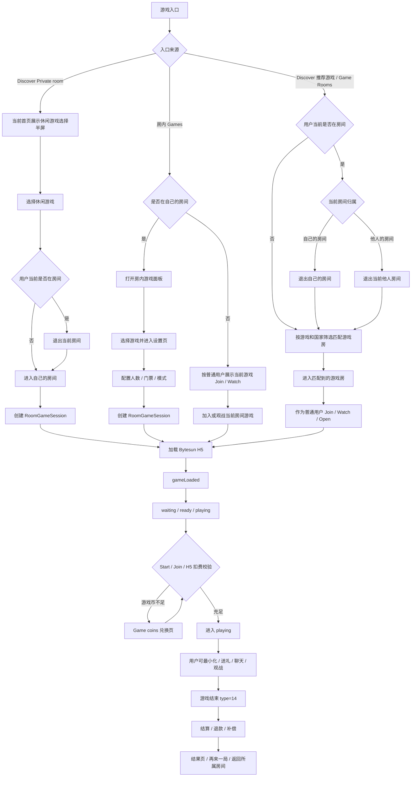

### 6.1 用户在自己的房间内开启游戏

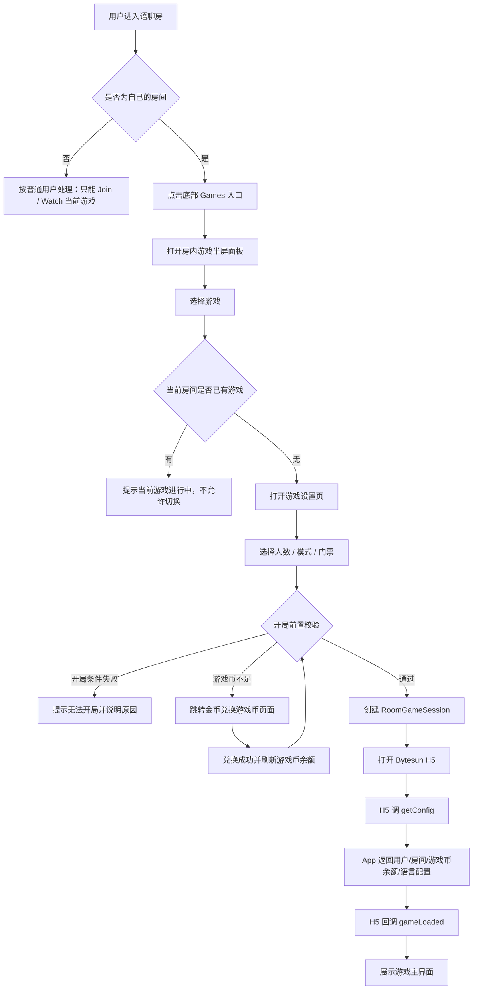

说明：

- 用户只有在自己的房间内才是当前房间房主，才允许发起游戏；在他人的房间内一律按普通用户处理。
- 用户在自己的房间内发起游戏时，不再额外做"房主权限"概念的拦截；房间归属关系在进入房间、打开房内游戏面板和展示 Start 按钮时已完成基础判断。
- 入口处先做游戏可见性、地区、审核账号、黑名单、房间类型、游戏维护状态等准入判断，不可用游戏不展示或置灰。
- 点击 Start 前的"开局前置校验"是服务端兜底，不等于重复风控。它主要校验：当前房间是否仍为用户自己的房间、房间是否仍存在、是否已有其他 RoomGameSession、游戏配置是否仍有效、门票档位是否仍有效、游戏币是否足够、用户是否仍在该房间且未被封禁。
- 若 Start 前校验失败，按具体原因提示，例如"当前房间已有游戏进行中"、"游戏维护中"、"游戏币不足，请先兑换"；不再泛化为"无权限"。

### 6.2 Discover Private room 快速开局

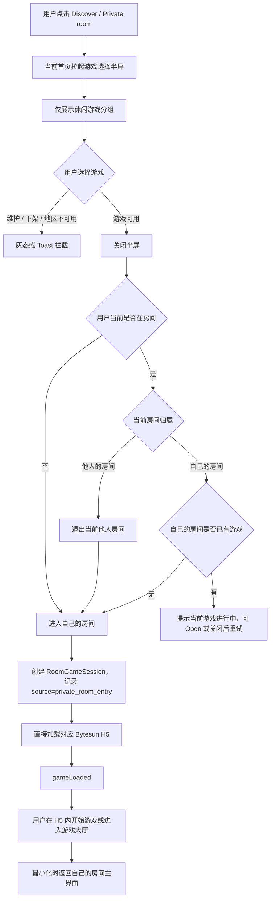

规则补充：

| 规则 | 说明 |
|---|---|
| 入口含义 | Private room 表示用户要进入自己的房间并开启游戏房模式 |
| 当前在其他房间 | 先退出当前他人房间，再进入自己的房间开局 |
| 当前在自己的房间 | 若无游戏可直接开局；若已有游戏，不允许切换，提示 Open 当前游戏或关闭后重试 |
| 首次不展示房间页 | Private room 快捷入口会进入用户自己的房间，但首次直接打开 H5，不先展示语聊房主界面 |
| 不进设置页 | 点击游戏后直接打开 H5，由 H5 或三方能力承接局内配置 |
| 仅休闲游戏 | 弹窗只展示休闲游戏列表，不展示活动和动态表情 |
| 路径统一 | RoomGameSession、最小化、恢复、退出、结算均走房内游戏逻辑 |
| 来源记录 | session / 埋点记录 `source=private_room_entry`，仅用于区分入口来源 |

### 6.2.1 Discover 推荐游戏 / Game Rooms 匹配进入

Discover 普通游戏入口的目标不是开启自己的房间，而是进入“某个用户房间里的游戏”。因此进入前必须先处理用户当前所在房间关系。

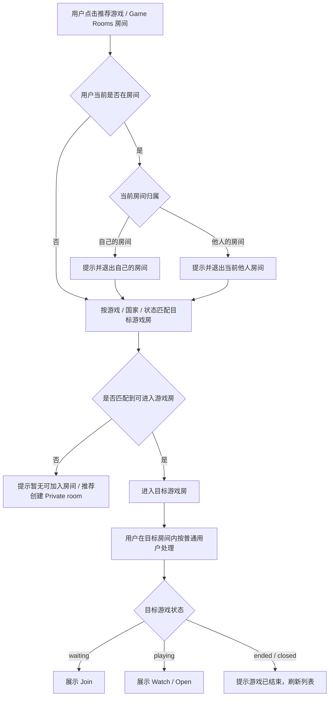

规则补充：

| 场景 | 处理 |
|---|---|
| 用户不在房间 | 直接匹配目标游戏房 |
| 用户在自己的房间最小化 | 先退出自己的房间，再作为普通用户进入目标游戏房 |
| 用户在他人的房间最小化 | 先退出当前他人房间，再作为普通用户进入目标游戏房 |
| 当前房间内有未结束游戏 | 进入其他游戏房前必须二次确认；确认后退出当前房间和当前游戏关系 |
| 匹配到自己的房间 | 不作为普通游戏房目标；用户要开启自己的游戏走 Private room |
| 进入目标游戏房后 | 不展示 Start / Close / Kick Seat，只展示 Join / Watch / Open |

### 6.3 普通用户加入游戏

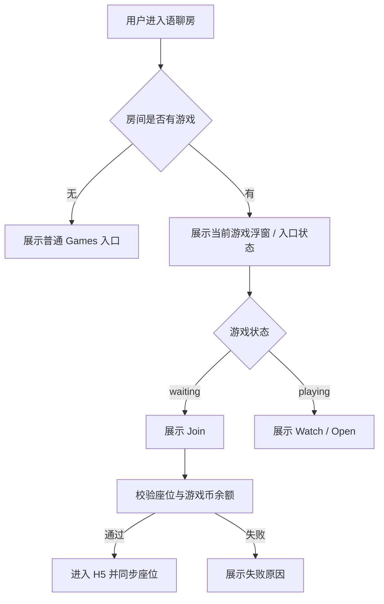

### 6.4 开局、扣费与结算

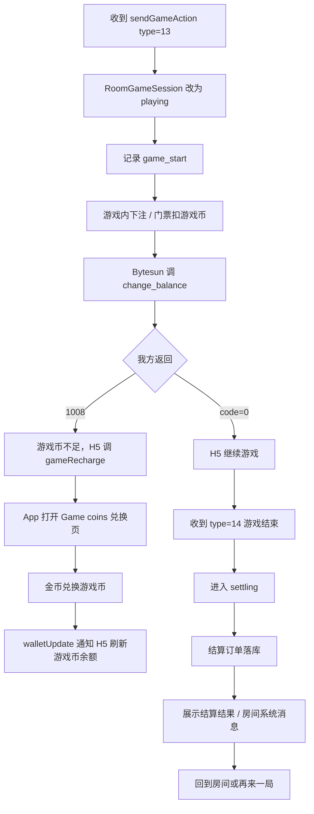

### 6.5 游戏币不足与金币兑换流程

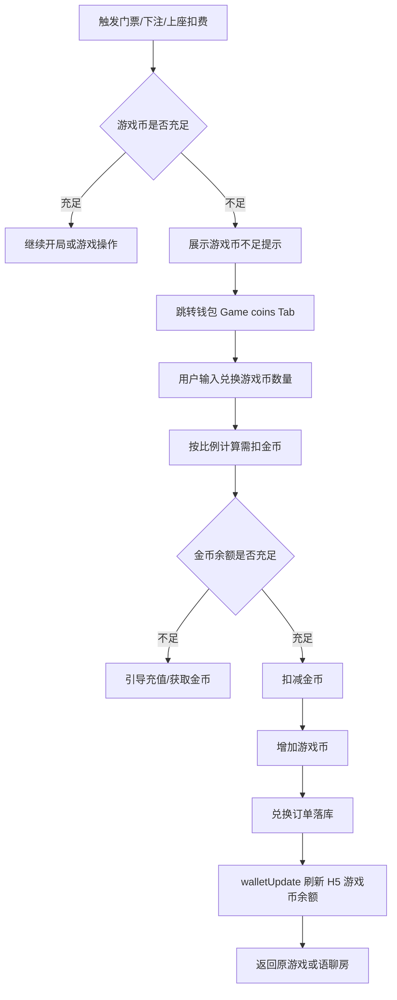

### 6.6 游戏最小化、入口保留与恢复

> 本节整合自 v1.5 全角色最小化交互场景，并统一 Private room 与房内入口的最小化路径。

游戏最小化的核心原则：**最小化后只保留游戏入口，不展示麦位信息；再次打开游戏时，必须重新拉取并同步房间最新麦位、语音、座位和游戏状态。**

Private room 只是 Discover 侧的快捷入口，不是独立的游戏返回路径。用户从 Private room 选择游戏后，系统已经进入用户自己的房间并创建 RoomGameSession；因此游戏最小化、恢复、关闭和结算都以自己的房间为返回上下文，不回到 Discover Games 首页。用户从 Discover 推荐游戏或 Game Rooms 进入时，返回上下文是匹配到的目标游戏房，用户在该房间内仍是普通用户。

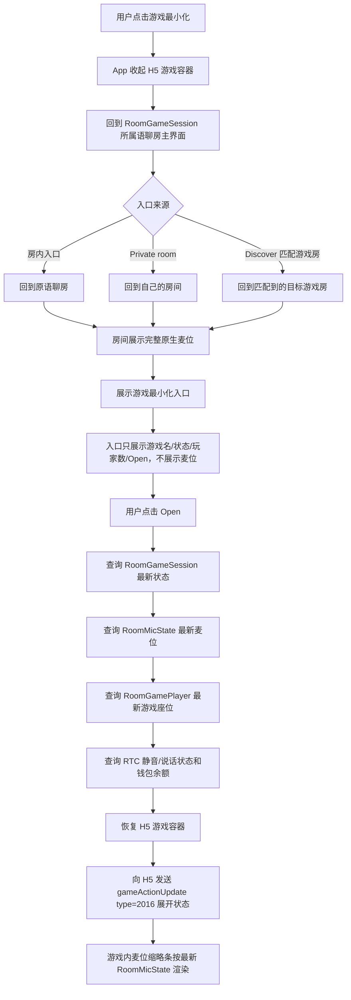

最小化入口展示规则：

| 信息 | 是否展示 | 说明 |
|---|---|---|
| 游戏名称 | 展示 | 例如 Ludo / UNO |
| 游戏状态 | 展示 | waiting / playing / settling |
| 游戏人数 | 展示 | 例如 2/4 players |
| 恢复按钮 | 展示 | Open / Continue |
| 麦位头像 | 不展示 | 避免和房间原生麦位重复 |
| 麦克风状态 | 不展示 | 最小化入口不承载语音状态 |
| 说话动效 | 不展示 | 统一由房间主界面展示 |
| 游戏座位详情 | 不展示 | 点击进入游戏后再展示 |

最小化入口示例：

```text
Ludo · Playing
2/4 players
[Open]
```

恢复游戏时必须重新同步的数据：

| 数据 | 数据源 | 用途 |
|---|---|---|
| RoomGameSession | 我方游戏会话服务 | 判断游戏是否仍在进行、是否已结算、是否异常 |
| RoomMicState | 我方语聊房服务 | 渲染游戏内麦位缩略条 |
| RoomGamePlayer | 我方游戏座位服务 + Bytesun 回调 | 恢复玩家座位 / 观战状态 |
| RTC 状态 | 我方语音服务 | 同步静音、禁麦、说话状态 |
| wallet balance | 我方钱包服务 | 刷新游戏币余额 |
| room permission | 我方房间权限服务 | 判断用户是否仍有进入房间和游戏的权限 |

恢复时的异常处理：

| 场景 | 处理 |
|---|---|
| 游戏仍在 playing | 直接恢复游戏容器，并按最新 RoomMicState 渲染麦位缩略条 |
| 游戏已 ended | 不恢复 H5，提示"当前游戏已结束"，可展示结算结果 |
| 游戏 settling 中 | 恢复结算中页面，不允许重复操作 |
| 用户已被踢出房间 | 不允许恢复游戏，提示已离开房间 |
| 用户游戏座位已被释放 | 恢复为 Watch / Join 状态 |
| 麦位状态已变化 | 以最新 RoomMicState 为准刷新，不使用最小化前缓存 |
| H5 已被系统回收 | 重新加载 H5，并通过 getConfig 返回最新状态 |

客户端实现要求：

- 游戏最小化入口只作为"恢复游戏的入口"，不承担麦位展示职责。
- 房间主界面已经有完整麦位时，游戏入口不得重复展示麦位头像或说话状态。
- 用户点击 Open 恢复游戏时，客户端不得直接使用最小化前的麦位缓存。
- 恢复游戏前必须先拉取 RoomMicState，再渲染游戏内麦位缩略条。
- 如果 RoomMicState 拉取失败，游戏可先恢复，但麦位缩略条展示 loading / retry，不展示旧数据。
- 用户最小化期间发生上麦、下麦、锁麦、禁麦、踢出房间等变化，恢复游戏后必须同步为最新状态。

### 6.7 全角色游戏最小化交互规则

> 本节沿用 v1.5 的全角色最小化交互矩阵，与 14.3 结构化规则互补。

所有已进入游戏容器的用户，包括当前房间房主、普通玩家和观战用户，均可最小化游戏。

**最小化仅代表收起游戏容器，不代表退出游戏、不代表退出房间、不释放游戏座位，也不改变房间麦位状态。**

| 角色 / 身份 | 是否可最小化 | 最小化后状态 | 再次打开后的处理 |
|---|---:|---|---|
| 当前房间房主 | 是 | 游戏继续，房主身份和游戏控制权不变 | 重新同步 session、座位、麦位、RTC、钱包和权限 |
| 普通玩家 | 是 | 游戏座位保留，当前局继续 | 恢复到玩家态；若已被移出座位，则展示 Watch / Join / Removed |
| 观战用户 | 是 | 观战关系保留，不影响玩家 | 游戏仍在进行则恢复观战，已结束则展示结束态或隐藏入口 |
| 未进入游戏的房间用户 | 不属于"最小化" | 可看到当前游戏快捷入口 | waiting 展示 Join，playing 展示 Watch / Open |
| 被踢出游戏的用户 | 否 | 不展示最小化入口 | 可按状态展示 Watch / Join 或移除入口 |
| 被踢出房间的用户 | 否 | 清理游戏入口 | 不允许恢复游戏 |

说明：

- "进入过游戏后再收起"叫游戏最小化入口。
- "未进入游戏但房间有游戏"叫当前游戏快捷入口。
- 两者可以复用 UI 样式，但埋点、恢复逻辑和按钮文案需要区分。

### 6.8 不同角色的最小化交互场景

#### 6.8.1 房主最小化

| 游戏状态 | 房主最小化后 | 房主再次打开后 |
|---|---|---|
| waiting | 游戏等待态保留，其他用户仍可 Join | 可 Start / Invite / Kick Seat / Close |
| ready | 准备态保留 | 可 Start / Kick Seat / Close |
| playing | 本局继续 | 恢复游戏画面，继续管理异常 |
| settling | 结算继续 | 展示结算中，不允许重复操作 |
| ended | 浮窗可展示 Finished 或隐藏 | 可看结果 / 再来一局，按后台配置 |

房主最小化不等于关闭游戏。关闭当前游戏必须通过游戏展开态内的关闭入口，且需按权限和游戏状态判断。

#### 6.8.2 房管 / 管理员最小化

| 场景 | 处理 |
|---|---|
| 房管 / 管理员只是观战 | V1 按普通观战用户处理，最小化后回房间，点击 Open 恢复观战 |
| 房管 / 管理员是玩家 | V1 按普通玩家处理，保留游戏座位，恢复后回到玩家态 |
| 房主在其最小化期间离开 | 不做管理员接管；按房主离开后的系统托管 / 关闭规则处理 |
| 后台配置管理员游戏权限 | V1 不开放；后续版本若开放需单独评审 |

#### 6.8.3 普通玩家最小化

普通玩家可以最小化游戏，但需要兼容回合制游戏的实时操作风险。

| 状态 | 最小化入口展示 | 点击后 |
|---|---|---|
| waiting | Waiting | 打开等待页 |
| playing | Playing | 恢复游戏 |
| 轮到自己操作 | Your turn / Playing | 恢复游戏并定位到当前操作态 |
| 即将超时 | Hurry up / Playing | 恢复游戏并展示倒计时，若三方不支持则不展示倒计时 |
| settling | Settling | 打开结算中页 |
| ended | Finished | 展示结果或隐藏入口 |

V1 如果 Bytesun 暂不支持"轮到你 / 倒计时"状态回调，最小化入口只展示 Waiting / Playing / Settling / Finished / Error。

#### 6.8.4 观战用户最小化

| 游戏状态 | 观战用户最小化后 | 再次打开后 |
|---|---|---|
| waiting | 入口展示 Waiting / Join | 有座位可 Join，无座位可 Watch |
| playing | 入口展示 Watching / Playing | 恢复观战 |
| settling | 入口展示 Settling | 展示结算中或观战结束态 |
| ended | 入口展示 Finished 或隐藏 | 可展示结果摘要，或提示游戏已结束 |

V1 默认不支持中途补位。观战用户在 playing 中恢复后默认仍为观战态，除非三方明确支持中途加入。

### 6.9 最小化入口状态与点击行为

| 状态 | 浮窗文案 | 入口按钮 | 点击行为 |
|---|---|---|---|
| waiting | Waiting | Open / Join | 打开游戏等待页 |
| ready | Ready | Open | 打开准备页 |
| playing | Playing | Open | 恢复游戏容器 |
| watching | Watching | Open | 恢复观战页 |
| your_turn | Your turn | Play | 恢复游戏并高亮当前操作 |
| timeout_warning | Hurry up | Play | 恢复游戏并展示倒计时 |
| settling | Settling | Open | 打开结算中页 |
| ended | Finished | View | 打开结果页或隐藏入口 |
| error | Error | Retry / Open | 打开异常页或重试 |
| closed | Closed | 无 | 隐藏入口 |
| kicked | Removed | OK | 展示被移出提示后隐藏入口 |

浮窗样式建议保持轻量：

```text
Ludo · Playing
2/4 players
[Open]
```

不展示麦位头像、游戏座位详情、麦克风状态和说话动效。

### 6.10 最小化恢复顺序

用户点击 Open 后，客户端不得直接恢复旧 H5 画面并使用缓存状态，必须按以下顺序恢复：

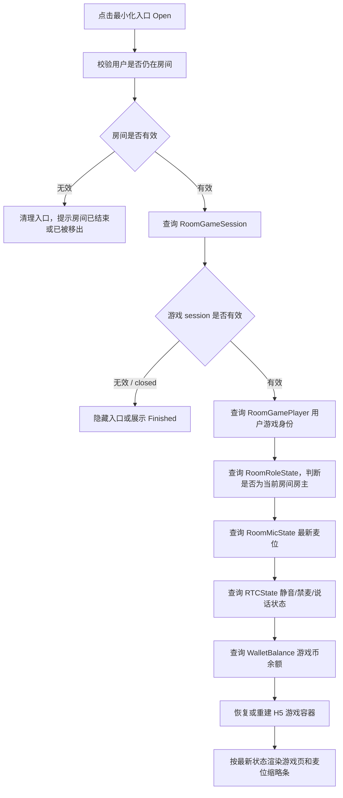

恢复优先级：

1. 先判断用户是否仍在房间。
2. 再判断游戏 session 是否有效。
3. 再判断用户是玩家、观战、被移出还是未加入。
4. 再同步房间权限、麦位、RTC、钱包。
5. 最后恢复 H5 容器。

### 6.11 最小化期间状态变化兼容

| 最小化期间发生的变化 | 浮窗表现 | 用户点击 Open 后 |
|---|---|---|
| 用户被抱上麦 | 浮窗不展示麦位变化 | 游戏内麦位缩略条展示最新麦位 |
| 用户被移下麦 | 浮窗不展示麦位变化 | 游戏内不再展示该用户在麦上 |
| 用户被禁麦 | 浮窗不展示禁麦 | 游戏内麦位缩略条展示禁麦状态 |
| 用户被禁言 | 浮窗不展示禁言 | 游戏快捷聊天按禁言策略限制 |
| 用户被移出游戏座位 | 浮窗可变为 Removed / Watch | 展示已移出座位，按状态允许 Watch / Join |
| 用户被踢出房间 | 浮窗消失 | 不允许恢复游戏 |
| 房主离开 | 普通用户浮窗不变 | playing / settling 可继续；waiting / ready 按关闭或退款规则处理 |
| 房管 / 管理员身份变化 | 浮窗不强提示 | V1 游戏内仍按普通用户处理，不展示接管权限 |
| 游戏结束 | 浮窗变为 Finished | 展示结算结果或结束提示 |
| 游戏结算中 | 浮窗变为 Settling | 展示结算中 |
| 后台强制关闭 | 浮窗隐藏或变为 Closed | 提示当前游戏已结束 |
| 用户进入其他房间 | 弹窗确认 | 确认后退出原游戏并移除浮窗 |

离开房间确认文案：

```text
你正在游戏中，进入其他房间将退出当前游戏，是否继续？
```

## 7. 游戏状态设计

### 7.1 RoomGameSession 状态机

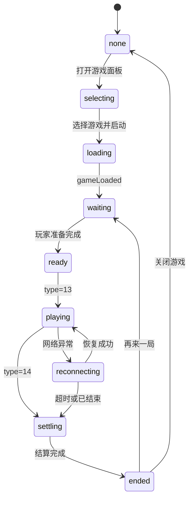

### 7.2 状态定义

| 状态 | 含义 | 用户可见动作 |
|---|---|---|
| none | 当前房间无游戏 | 打开游戏面板 |
| selecting | 浏览游戏列表 | 选择游戏 |
| loading | H5 加载中 | 等待 / 取消 |
| waiting | 游戏已创建，等待用户加入 | Join / Invite |
| ready | 达到开局条件 | Start |
| playing | 游戏进行中 | Open / Watch / Gift / Chat |
| reconnecting | 重连中 | 等待 / 退出 |
| settling | 结算中 | 等待 |
| ended | 已结束 | 再来一局 / 返回房间 |
| error | 异常 | Retry / Close |

## 8. 座位、麦位与声音规则

| 规则 | 说明 |
|---|---|
| 游戏座位独立于语聊麦位 | 用户不上麦也可以玩游戏 |
| 语聊麦位不因游戏改变 | 原有房间归属、主持、房管等语聊房身份保持；V1 游戏控制权只看当前房间归属用户 |
| 座位以 App 最终状态为准 | 与 H5 冲突时，通过 gameActionUpdate type=4 反向同步 |
| 一个用户只能占一个游戏座位 | 防重复占位和多端异常 |
| 游戏中不可随意换座 | 除非三方游戏明确支持 |
| 游戏结束释放座位 | 再来一局重新进入 waiting / preparing |

声音策略：

| 场景 | 策略 |
|---|---|
| 普通休闲游戏 | 保留我方语聊房 RTC，默认降低或关闭游戏 BGM |
| 用户静音麦克风 | 同步我方 RTC 状态，必要时通知游戏 |
| 游戏查询音效状态 | H5 发查询后，App 返回当前 sound 状态 |
| RTC 推理游戏 | V3 才接入，使用 isGameRTC=true 和 type=3001 |

## 9. 货币与结算

### 9.1 货币口径

V1 游戏内统一使用**游戏币（Game coins）**，金币只作为兑换来源，不直接参与游戏下注、门票和结算。

```text
金币 Gold coins -> 兑换 -> 游戏币 Game coins -> 游戏内门票/下注/结算
```

默认兑换比例按页面展示：

```text
100 金币 = 1000 游戏币
```

规则：

| 规则 | 说明 |
|---|---|
| 游戏内展示币种 | 只展示游戏币，不展示金币 |
| 游戏币来源 | 用户通过金币兑换获得 |
| 反向兑换 | 不支持游戏币兑换回金币 |
| 提现 | 游戏币仅供游戏内使用，不支持提现 |
| 比例配置 | 默认 100 金币 = 1000 游戏币，后台可配置并记录历史版本 |
| 审核策略 | 审核账号可隐藏付费局和游戏币兑换入口 |

### 9.2 消耗与奖励场景

| 场景 | 类型 | 币种 | 变动 |
|---|---|---|---:|
| 金币兑换游戏币 | exchange | 金币 / 游戏币 | 金币负值，游戏币正值 |
| 门票扣费 | ticket | 游戏币 | 负值 |
| 游戏下注 | bet | 游戏币 | 负值 |
| 游戏结算奖励 | result | 游戏币 | 正值 |
| 异常退款 | refund | 游戏币 | 正值 |
| 运营补偿 | compensate | 游戏币 | 正值 |

### 9.3 游戏币不足处理

| 触发点 | 判断 | 处理 |
|---|---|---|
| 设置页点击 Start / Join | 游戏币 < 门票 | 弹窗提示"游戏币不足"，跳转 Game coins 兑换页 |
| H5 内下注 | Bytesun 调 change_balance 返回 1008 | H5 调 `gameRecharge`，App 打开 Game coins 兑换页 |
| 上座校验 | 游戏币低于当前局最低要求 | 不允许上座，提示兑换后重试 |
| 兑换页金币不足 | 金币余额 < 需扣金币 | 兑换按钮置灰，引导充值或获取金币 |
| 兑换成功 | 金币扣减成功，游戏币增加成功 | 调 `walletUpdate` 通知 H5 刷新余额，并允许回到原游戏 |

### 9.4 结算安全

| 规则 | 说明 |
|---|---|
| order_id 幂等 | 同一订单重复回调只处理一次 |
| 用户级锁 | change_balance 必须做单用户并发保护 |
| 成功 code | 只有成功才能返回 code=0 |
| 游戏币不足 | 返回 1008，H5 可调 gameRecharge |
| 兑换幂等 | 金币扣减和游戏币增加必须在同一事务内完成 |
| 补偿队列 | 结算失败进入补偿和对账 |
| 对账 | 游戏订单、兑换订单、钱包流水、Bytesun 回调四方核对 |

## 10. Bytesun 技术接入要求

### 10.1 接入方式

| 方式 | 说明 | V1 建议 |
|---|---|---|
| URL 直连 | 直接加载游戏 H5 URL | 联调和灰度优先 |
| Zip 本地包 | 下载游戏 Zip 并解压本地加载 | 正式体验优化 |
| CDN 加速 | OSS 源站回源，配置 CDN | 必做 |

标准流程：

1. 我方后台同步 Bytesun 游戏列表。
2. 客户端获取游戏信息和版本。
3. 客户端按版本决定 URL 直连或 Zip 更新。
4. 打开 H5 / WebView。
5. H5 调 `getConfig`。
6. App 返回商户、用户、房间、语言、游戏币余额、金币余额、角色等配置。
7. H5 通过 JSBridge 上报游戏状态。
8. Bytesun 服务端通过我方 API 查询用户和修改余额。

### 10.2 getConfig 关键字段

| 字段 | 说明 |
|---|---|
| merchantId | Bytesun 分配 |
| appChannel | Bytesun 分配，后台配置 |
| userId | 我方用户 ID |
| roomId | 当前语聊房 ID |
| role | 用户角色 |
| language | 客户端语言 |
| gameMode | 语聊房场景固定传 `"3"` |
| balance | 当前游戏币余额，供 Bytesun 游戏内展示和扣费 |
| goldBalance | 当前金币余额，仅用于我方兑换页展示，不直接参与游戏扣费 |
| exchangeRate | 金币兑换游戏币比例，例如 `100金币=1000游戏币` |
| userType | 用户风控 / 审核类型 |
| safeArea | 顶部 / 底部安全区 |

### 10.3 H5 调 App（JSBridge 接口清单）

| 方法 / type | 用途 | V1 要求 |
|---|---|---|
| getConfig | 获取配置 | 必须 |
| destroy | 游戏主动关闭 WebView | 兼容处理 |
| gameLoaded | 游戏加载完成 | 必须 |
| gameRecharge | 游戏币不足时拉起 Game coins 兑换页 | 必须 |
| type=13 | 游戏开始 | 状态改为 playing |
| type=14 | 游戏结束 | 状态改为 settling |
| type=15 | 上 / 下游戏座位 | App 校验后同步 |
| type=16 | 座位信息同步 | 刷新座位 |
| type=18 | 上座失败 | 展示失败原因 |
| type=20 | 语聊房游戏准备完成 | 同步房间信息 |
| type=23 | 游戏基础参数 | 更新配置 |
| type=30 | 最大人数 / 门票变更 | 更新房间配置 |

### 10.4 App 调 H5（JSBridge 接口清单）

| 方法 / type | 用途 |
|---|---|
| walletUpdate | 游戏币兑换成功或游戏币余额变化后通知游戏刷新 |
| gameActionUpdate type=4 | 操作游戏座位 |
| gameActionUpdate type=6 | 返回踢人结果 |
| gameActionUpdate type=2012 | 查询音效状态 |
| gameActionUpdate type=2014 | App 聊天同步到画猜类游戏 |
| gameActionUpdate type=2016 | 最小化 / 展开状态 |

### 10.5 服务端 API

| 接口 | 用途 | 要求 |
|---|---|---|
| `/v1/api/get_sstoken` | 获取服务端 token | 签名、过期、权限校验 |
| `/v1/api/get_user_info` | 查询用户昵称、头像、游戏币余额 | 返回 game coin balance / user_type |
| `/v1/api/change_balance` | 游戏币下注、结算、退款 | 用户级锁、order_id 幂等、游戏币不足 1008 |
| 金币兑换游戏币接口 | 用户在 Game coins 页兑换 | 同事务扣金币并加游戏币，兑换订单幂等 |
| 游戏状态上报接口 | game_start / game_settle | 落库、看板、风控 |
| 房间游戏状态接口 | 查询当前房间游戏 | 客户端恢复和浮窗展示 |
| Private room 快捷建房开游接口 | 进入用户自己的房间，并创建 RoomGameSession | 用于 Discover Private room 选游后直接打开 H5；最小化后回到自己的房间 |

### 10.6 URL 特殊参数

| 参数 | 适用 | 说明 |
|---|---|---|
| `game_margin_top` | 全屏语聊房游戏 | 顶部安全区 |
| `game_margin_bottom` | 全屏语聊房游戏 | 底部工具栏安全区 |
| `game_margin_standard` | 全屏语聊房游戏 | 标准屏幕参数 |
| `hideLobby=true` | ludoPlus / unoPlus / DominoPlus | 隐藏大厅，需 Bytesun 补充快速开始 API |
| `isGameRTC=true` | RTC 推理游戏 | V3 才启用 |
| `language` | Loading 页语言 | 按 Bytesun 支持范围传值 |

## 11. 后台管理 PRD

### 11.1 菜单结构

```text
运营后台
└── 游戏中心
    ├── 游戏接入配置
    ├── 游戏配置列表
    ├── 游戏入口配置
    ├── 房间游戏监控
    ├── 游戏活动管理
    ├── 游戏记录
    ├── 结算管理
    ├── 游戏币兑换管理
    ├── 风控审核
    └── 三方接口配置
```

### 11.2 游戏接入配置

| 字段 | 说明 |
|---|---|
| merchantId | Bytesun 商户 ID |
| appKey | 仅服务端保存，不下发客户端 |
| appChannel | 游戏渠道 |
| 游戏列表同步开关 | 是否自动同步 Bytesun 游戏 |
| CDN 域名 | 游戏包回源和预热 |
| Zip 更新策略 | 自动 / 手动 / 灰度 |
| URL 直连开关 | 是否允许直连 H5 |
| 游戏币兑换比例 | 默认 100 金币 = 1000 游戏币，支持灰度和历史记录 |
| 游戏币兑换开关 | 控制 Game coins 页是否可兑换 |

### 11.3 游戏配置列表

| 字段 | 说明 |
|---|---|
| 游戏 ID | Bytesun `game_id` |
| 游戏名称 | 多语言展示名 |
| Bytesun 游戏名 | ludoPlus / unoPlus 等 |
| 游戏分类 | 桌游、卡牌、台球、休闲、画猜、RTC |
| 游戏 icon | `preview_url` |
| 游戏版本 | `game_version` |
| 游戏方向 | 竖屏 / 横屏 |
| 上下架状态 | 上架、下架、维护、灰度 |
| 地区限制 | 国家 / 区域 |
| 端限制 | iOS / Android / Web |
| 审核账号策略 | 展示 / 隐藏 / 只展示免费局 |
| 门票范围 | 单位为游戏币，配置最小、最大、默认值 |
| 是否允许观战 | 开 / 关 |

### 11.4 游戏入口配置

| 配置 | 默认 | 说明 |
|---|---|---|
| Discover Games Tab | 开 | 控制游戏大厅入口 |
| Activity Tab | 开 | 控制活动页 |
| Private room 快捷入口 | 开 | 控制 Discover 页 Private room 按钮及休闲游戏选择半屏 |
| Private room 游戏列表 | 开 | 配置 Private room 半屏内可展示的休闲游戏，默认不包含活动和动态表情 |
| 房间内 Games 按钮 | 开 | 控制房间底部工具栏 |
| 房间右侧快捷入口 | 开 | 游戏进行中或活动时展示 |
| More Games | 开 | 控制全部游戏弹窗 |
| 房间列表游戏标签 | 开 | 控制 Game Rooms 聚合 |
| 国家筛选 | 开 | 控制 Game Rooms 国家横滑筛选和固定搜索按钮 |
| 游戏中允许切换 | 关 | V1 不允许 |
| 房管 / 管理员开局 | 关 | V1 不开放；如需放开需单独评审 |

### 11.5 房间游戏监控

| 字段 | 说明 |
|---|---|
| 语聊房 ID | 当前房间 |
| 当前房间房主 ID | 房间归属用户 |
| 当前游戏 | Ludo / UNO / Domino |
| RoomGameSession ID | 我方游戏会话 |
| Bytesun roomId | 三方房间 ID |
| 游戏状态 | waiting / playing / settling / ended / error |
| 来源 | room_panel / private_room_entry；Discover 推荐游戏 / Game Rooms 作为玩家 join_source 记录，不作为新建 session 来源 |
| 玩家数 | 当前游戏座位人数 |
| 观战数 | 当前观战人数 |
| 门票 | 当前局门票，单位为游戏币 |
| 异常状态 | 白屏、加载失败、结算失败、座位异常 |

操作：

| 操作 | 说明 |
|---|---|
| 查看详情 | 查看本局玩家、座位、结算、日志 |
| 强制关闭 | 异常时关闭当前游戏 |
| 下架游戏 | 快速风控 |
| 复制日志 | 方便联调排查 |

### 11.6 结算管理

| 字段 | 说明 |
|---|---|
| 订单 ID | `order_id` |
| 用户 ID | userId |
| 游戏 ID | game_id |
| 房间 ID | room_id |
| session ID | RoomGameSession |
| 变动类型 | ticket / bet / result / refund |
| 变动金额 | 游戏币 currency_diff |
| 前后余额 | before / after |
| 状态 | success / failed / compensating |
| 回调时间 | Bytesun 回调时间 |

### 11.7 游戏币兑换管理

| 字段 | 说明 |
|---|---|
| 兑换订单 ID | exchange_order_id |
| 用户 ID | userId |
| 扣除金币 | gold_cost |
| 增加游戏币 | game_coin_add |
| 兑换比例 | exchange_rate_snapshot |
| 兑换来源 | 游戏币不足弹窗 / 钱包 Game coins Tab / 游戏设置页 |
| 原游戏会话 | 若从游戏内跳转，记录 RoomGameSession ID |
| 状态 | success / failed / compensating |
| 失败原因 | 金币不足、并发失败、风控拦截、系统异常 |
| 创建时间 | created_at |

## 12. 数据模型

### 12.1 RoomGameSession

| 字段 | 说明 |
|---|---|
| id | 游戏会话 ID |
| room_id | 语聊房 ID |
| game_id | Bytesun 游戏 ID |
| game_name | 游戏名 |
| status | none / loading / waiting / playing / settling / ended / error |
| host_user_id | 开局用户 |
| ticket | 门票，单位为游戏币 |
| max_players | 最大人数 |
| bytesun_room_id | 三方房间 ID |
| started_at | 开始时间 |
| ended_at | 结束时间 |
| created_at / updated_at | 时间戳 |
| game_creator_user_id | 本局游戏创建人，V1 等于当前房间房主 |
| game_controller_user_id | 当前游戏控制人，V1 等于当前房间房主；房主离开后进入 system 托管态 |
| controller_source | host / system，标识控制权来源 |
| controller_expire_at | V1 可为空，预留后续扩展 |
| game_config_version | 创建 session 时使用的游戏配置版本 |
| ticket_config_snapshot | 当前局门票配置快照，后台改配置不影响已创建 session |
| exchange_rate_snapshot | 当前局涉及兑换时的兑换比例快照 |
| reconnect_deadline | 断线重连保留座位的截止时间 |
| source | room_panel / private_room_entry；Discover 推荐游戏 / Game Rooms 仅进入已有游戏房，不创建自己的 session |
| return_context | room，用于最小化和结束后返回 RoomGameSession 所属语聊房 |

### 12.2 RoomGamePlayer

| 字段 | 说明 |
|---|---|
| id | 记录 ID |
| session_id | 游戏会话 |
| room_id | 语聊房 |
| user_id | 用户 |
| seat_no | 游戏座位 |
| role | host / controller / player / watcher |
| status | joined / ready / playing / watching / left / kicked / hosting / settling |
| join_source | room_panel / discover_match / game_rooms / private_room_entry / invite / restore |
| joined_at | 加入时间 |
| left_at | 离开时间 |
| last_active_at | 最近一次心跳 / 操作时间 |
| disconnect_at | 断线时间，可为空 |
| is_reconnecting | 是否处于重连保护期 |
| device_id | 最近一次参与游戏的设备 ID，用于多端控制 |

### 12.3 GameBalanceOrder

| 字段 | 说明 |
|---|---|
| order_id | 幂等订单 ID |
| session_id | 游戏会话 |
| user_id | 用户 |
| game_id | 游戏 |
| currency_type | 固定为游戏币，可扩展 |
| currency_diff | 游戏币变动金额 |
| before_balance | 变动前游戏币余额 |
| after_balance | 变动后游戏币余额 |
| status | success / failed / compensating |
| raw_payload | Bytesun 原始回调 |
| related_order_id | 关联订单 ID，用于退款、补偿、冲正 |
| refund_reason | 退款原因，可为空 |
| result_viewed | 用户是否已查看结算结果 |
| result_viewed_at | 用户查看结算结果时间 |

### 12.4 GameCoinExchangeOrder

| 字段 | 说明 |
|---|---|
| exchange_order_id | 兑换订单 ID |
| user_id | 用户 ID |
| gold_cost | 扣除金币数量 |
| game_coin_add | 增加游戏币数量 |
| exchange_rate_snapshot | 兑换比例快照 |
| source | insufficient / wallet_tab / setting_page / private_room_entry |
| source_session_id | 来源游戏会话，可为空 |
| return_context | 原游戏 session / room |
| before_gold_balance | 兑换前金币余额 |
| after_gold_balance | 兑换后金币余额 |
| before_game_coin_balance | 兑换前游戏币余额 |
| after_game_coin_balance | 兑换后游戏币余额 |
| status | success / failed / compensating |
| fail_reason | 失败原因 |

## 13. 数据埋点与指标

### 13.1 核心埋点

| 埋点 | 触发时机 |
|---|---|
| game_entry_show | Discover 或房内游戏入口曝光 |
| game_entry_click | 点击游戏入口 |
| private_room_game_picker_show | Discover `Private room` 游戏选择半屏展示 |
| private_room_game_select | Private room 半屏内选择休闲游戏 |
| game_panel_show | 房内半屏游戏面板展示 |
| game_tab_click | 点击休闲游戏 / 活动 / 动态表情 |
| game_item_click | 点击某个游戏 |
| game_setting_show | 游戏设置页展示 |
| game_start_click | 点击 Start / Join |
| game_h5_load_start | 开始加载 H5 |
| game_loaded | 收到 gameLoaded |
| game_start | 收到 type=13 |
| game_end | 收到 type=14 |
| game_result_view | 结算页曝光 |
| game_coin_insufficient | 游戏币不足 |
| game_coin_exchange_page_show | 打开 Game coins 兑换页 |
| game_coin_exchange_submit | 点击立即兑换 |
| game_coin_exchange_success | 游戏币兑换成功 |
| game_coin_exchange_failed | 游戏币兑换失败 |
| game_recharge_open | H5 拉起 Game coins 兑换页 |
| game_minimize | 游戏最小化 |
| game_restore | 游戏恢复 |
| game_error | 加载、回调、结算等异常 |

### 13.2 核心指标

| 指标 | 计算 |
|---|---|
| 游戏入口点击率 | `game_entry_click / game_entry_show` |
| 面板游戏点击率 | `game_item_click / game_panel_show` |
| Private room 选游转化 | `private_room_game_select / private_room_game_picker_show` |
| Private room 快捷开局加载成功率 | `game_loaded / private_room_game_select` |
| 设置页转化率 | `game_start_click / game_setting_show` |
| H5 加载成功率 | `game_loaded / game_h5_load_start` |
| 开局成功率 | `game_start / game_start_click` |
| 游戏完成率 | `game_end / game_start` |
| 结算失败率 | failed balance orders / all balance orders |
| 白屏率 | H5 加载失败或超时 / load_start |
| 游戏币兑换金额 | 游戏来源兑换的金币消耗与游戏币增加 |
| 游戏币不足转化率 | `game_coin_exchange_success / game_coin_insufficient` |

## 14. 异常与边界场景

本章节补充房间生命周期、房主退出、最小化、座位、麦位、H5 状态、钱包结算、后台干预、审核风控等异常场景。整体原则：

| 原则 | 说明 |
|---|---|
| 房间是主容器 | 游戏依附于语聊房，不脱离房间单独运行 |
| 游戏是插件态 | 游戏不反向改变语聊房归属、麦位和房管体系；V1 游戏控制权只看当前房间归属用户 |
| 服务端状态为准 | RoomGameSession、RoomGamePlayer、钱包订单为最终依据 |
| 已开局优先不中断 | playing / settling 状态优先保障本局完成和结算稳定 |
| 钱包订单必须幂等 | 扣费、退款、结算、补偿均需订单关联和幂等处理 |

### 14.1 房间相关

| 场景 | 处理 |
|---|---|
| 房主离开房间 | waiting / ready 未开局状态关闭或退款；playing / settling 本局继续并进入系统托管，本局结束后不可再开 |
| 房间关闭 | 强制结束游戏，按状态结算或退款 |
| 房间被封禁 | 立即关闭游戏入口和当前游戏层，当前局按风控策略结算、挂起或退款 |
| 用户被踢出房间 | 同步退出游戏，释放座位 |
| 房间切后台 | 游戏继续，前台回来恢复状态 |
| 多人同时开游戏 | 服务端只允许一个 session，后发请求失败 |
| 用户游戏中进入其他房间 | 二次确认；确认后退出当前游戏并释放座位 |
| 房间改为私密 / 加锁 | 已在房间用户不受影响，新用户按新权限校验 |
| 游戏中切换房间模式 | playing 中不允许普通切换，后台强制切换时游戏继续但权限按新模式生效 |
| 房间无人 | waiting 关闭 session；playing 按规则托管、结束或退款 |

### 14.2 当前房间房主退出与系统托管

当前房间房主退出房间不等于立即关闭已开局游戏。V1 不做管理员接管，其他用户都按普通用户处理；需要按 RoomGameSession 状态决定关闭、退款或系统托管。

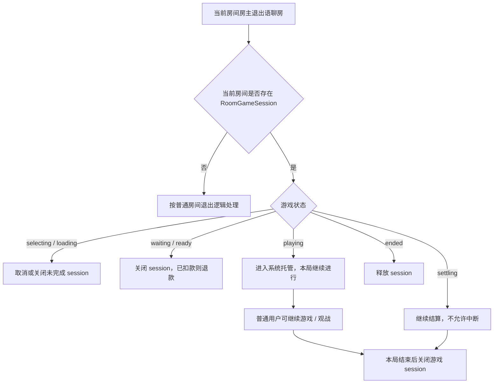

| 游戏状态 | 房主退出后的处理 |
|---|---|
| selecting | 未创建有效游戏，直接关闭面板 |
| loading | H5 未完成加载时可取消 session；已扣款需退款 |
| waiting | 未正式开局，关闭 session；已扣门票按配置退款 |
| ready | 未正式开局，关闭 session；已扣门票按配置退款 |
| playing | 本局继续，不强制中断，进入 system 托管态 |
| reconnecting | 按重连规则处理，房主身份不影响用户重连 |
| settling | 继续完成结算，不允许人为关闭 |
| ended | 释放游戏 session |
| error | 系统或后台可关闭 |

#### 14.2.1 游戏控制人规则

RoomGameSession 保留 `game_controller_user_id` 字段用于标记当前游戏控制人，但 V1 不开放管理员接管。

| 字段 | 说明 |
|---|---|
| host_user_id | 当前房间归属用户 ID，不随游戏变化 |
| game_creator_user_id | 本局游戏创建人，V1 等于当前房间归属用户 |
| game_controller_user_id | 当前游戏控制人，V1 等于当前房间归属用户；房主离开后置空或标记 system |
| controller_source | host / system |
| controller_expire_at | V1 可为空，预留后续扩展 |

控制权规则：

1. 当前房间归属用户在线时，拥有 Start / Close / Kick Seat 等游戏控制操作。
2. 其他用户即使是房管 / 管理员，在 V1 游戏内也按普通用户处理。
3. 当前房间归属用户离开后，waiting / ready 关闭；playing / settling 进入 system 托管态。
4. system 托管态只保障本局完成和结算，不允许普通用户继续开新局或修改配置。

system 托管态限制：

| 能力 | 是否允许 |
|---|---:|
| 当前 playing 局继续 | 允许 |
| 当前局结算 | 允许 |
| 普通用户观战 | 允许 |
| 修改门票 / 人数 / 模式 | 不允许 |
| 再来一局 | 不允许 |
| 切换游戏 | 不允许 |
| 关闭异常 session | 系统或后台允许 |

### 14.3 游戏最小化、房间最小化与麦位兼容

> 本节为结构化规则表格，与第 6 章 6.6-6.11 前台流程互补。6.6-6.11 侧重前台流程与交互细节，本节侧重数据边界、展示规则和兼容矩阵。

游戏座位与语聊房麦位完全独立。**所有已进入游戏容器的用户均可最小化游戏；最小化后只保留游戏入口，不展示麦位；恢复游戏后再同步房间最新麦位、权限、游戏座位、RTC 和钱包状态。**

#### 14.3.1 数据与展示边界

| 类型 | 归属 | 作用 | 数据源 |
|---|---|---|---|
| 房间麦位 Room Mic Seat | 我方语聊房 | 语音聊天、上麦、下麦、锁麦 | RoomMicState |
| 游戏座位 Game Seat | Bytesun / RoomGamePlayer | 玩游戏、观战、结算 | RoomGamePlayer + Bytesun 回调 |
| 游戏内麦位缩略条 | 我方客户端展示层 | 游戏展开态展示谁在麦上、谁在说话 | RoomMicState 镜像 |
| 游戏最小化入口 | 我方客户端展示层 | 恢复游戏入口 | RoomGameSession |
| 当前游戏快捷入口 | 我方客户端展示层 | 用户未进入过游戏时看到当前房间游戏 | RoomGameSession |

麦位展示只存在于两个地方：

1. 房间主界面的完整麦位。
2. 游戏展开态内的麦位缩略条。

游戏最小化入口不展示麦位，避免与房间主界面麦位重复。

#### 14.3.2 角色是否允许最小化

| 角色 / 身份 | 是否可最小化 | 处理 |
|---|---:|---|
| 当前房间房主 | 是 | 收起游戏容器，游戏继续，控制权不变 |
| 房管 / 管理员 | 是 | V1 按普通玩家或观战用户处理，不展示管理权限 |
| 普通玩家 | 是 | 收起游戏容器，保留游戏座位，游戏继续 |
| 观战用户 | 是 | 收起游戏容器，保留观战态 |
| 未进入游戏的房间用户 | 不属于最小化 | 展示当前游戏快捷入口，可 Join / Watch / Open |
| 被移出游戏座位的用户 | 否 | 不展示恢复到玩家态入口，可按状态展示 Watch / Join |
| 被踢出房间的用户 | 否 | 清理入口，不允许恢复游戏 |

#### 14.3.3 最小化入口展示规则

| 信息 | 是否展示 | 说明 |
|---|---|---|
| 游戏名称 | 展示 | 例如 Ludo / UNO |
| 游戏状态 | 展示 | Waiting / Playing / Settling / Finished |
| 游戏人数 | 展示 | 例如 2/4 players |
| 恢复按钮 | 展示 | Open / Continue / Watch |
| 麦位头像 | 不展示 | 避免和房间原生麦位重复 |
| 麦克风状态 | 不展示 | 最小化入口不承载语音状态 |
| 说话动效 | 不展示 | 统一由房间主界面展示 |
| 游戏座位详情 | 不展示 | 点击进入游戏后再展示 |
| 关闭游戏按钮 | 普通用户不展示 | 避免误关；V1 仅当前房间房主在展开态可见 |

入口示例：

```text
Ludo · Playing
2/4 players
[Open]
```

#### 14.3.4 入口状态与点击行为

| 状态 | 浮窗文案 | 点击行为 |
|---|---|---|
| waiting | Waiting | 打开游戏等待页 |
| ready | Ready | 打开准备页 |
| playing | Playing | 恢复游戏容器 |
| watching | Watching | 恢复观战页 |
| your_turn | Your turn | 恢复游戏并高亮当前操作；V1 可不做 |
| timeout_warning | Hurry up | 恢复游戏并展示倒计时；V1 可不做 |
| settling | Settling | 打开结算中页 |
| ended | Finished | 打开结果页或隐藏入口 |
| error | Error | 打开异常页 / 重试 |
| closed | Closed | 隐藏入口 |
| kicked | Removed | 展示被移出提示后隐藏入口 |

V1 如果 Bytesun 暂不支持回合状态回调，则只实现 Waiting / Playing / Settling / Finished / Error。

#### 14.3.5 恢复游戏同步规则

用户点击 Open 恢复游戏时，客户端不得直接使用最小化前缓存。

恢复顺序：

1. 校验用户是否仍在房间。
2. 查询 RoomGameSession，判断游戏是否仍有效。
3. 查询 RoomGamePlayer，判断用户是玩家、观战、未加入、已离开还是被踢。
4. 查询 RoomRoleState，判断用户是否仍为当前房间房主。
5. 查询 RoomMicState，刷新房间最新麦位。
6. 查询 RTCState，刷新静音、禁麦、说话状态。
7. 查询 WalletBalance，刷新游戏币余额。
8. 恢复或重建 H5 游戏容器。
9. 游戏内麦位缩略条按最新 RoomMicState 渲染。

| 恢复场景 | 处理 |
|---|---|
| 游戏仍在 playing | 恢复游戏容器，并按最新 RoomMicState 渲染麦位缩略条 |
| 游戏已 ended | 不恢复旧 H5，提示"当前游戏已结束"，可展示结算结果 |
| 游戏 settling 中 | 恢复结算中页面，不允许重复操作 |
| 用户已被踢出房间 | 不允许恢复游戏，清理入口 |
| 用户游戏座位已被释放 | 恢复为 Watch / Join / Removed 状态 |
| 麦位状态已变化 | 以最新 RoomMicState 为准刷新，不使用最小化前缓存 |
| RoomMicState 拉取失败 | 游戏可先恢复，麦位缩略条展示 loading / retry，不展示旧麦位数据 |
| H5 已被系统回收 | 重新加载 H5，并通过 getConfig 返回最新状态 |

#### 14.3.6 最小化期间兼容场景

| 场景 | 处理 |
|---|---|
| 用户在最小化期间被抱上麦 | 房间主界面立即展示；恢复游戏后麦位缩略条同步为最新状态 |
| 用户在最小化期间被移下麦 | 房间主界面立即更新；恢复游戏后不再展示该用户在麦上 |
| 用户在最小化期间被禁麦 / 禁言 | 恢复游戏后同步禁麦 / 禁言状态；游戏快捷聊天按禁言策略限制 |
| 用户在最小化期间被踢出游戏座位 | 恢复后展示 Removed / Watch / Join，不恢复玩家态 |
| 用户在最小化期间被踢出房间 | 游戏入口消失，不允许恢复游戏 |
| 房主在最小化期间离开房间 | waiting / ready 关闭或退款；playing / settling 进入 system 托管，普通用户无管理权限 |
| 房管 / 管理员身份变化 | V1 游戏内按普通用户处理，不触发接管提示 |
| 游戏在最小化期间结束 | 浮窗变为 Finished；点击后展示结果或提示已结束 |
| 游戏在最小化期间进入结算 | 浮窗变为 Settling；点击后展示结算中 |
| 后台强制关闭游戏 | 浮窗隐藏或变为 Closed；点击提示当前游戏已结束 |
| 用户最小化后进入其他房间 | 二次确认；确认后退出原房间和游戏，释放座位并移除浮窗 |
| 用户离开游戏但仍在房间 | 释放游戏座位，不影响房间麦位 |
| 用户离开房间但仍在游戏 | 不允许；离开房间时同步退出游戏 |

离开房间确认文案：

```text
你正在游戏中，进入其他房间将退出当前游戏，是否继续？
```

#### 14.3.7 房主、普通玩家、观战的交互差异

| 身份 | 最小化后 | 恢复后可见操作 |
|---|---|---|
| 当前房间房主 waiting / ready | 游戏等待态保留 | Start / Invite / Kick Seat / Close |
| 当前房间房主 playing | 本局继续 | 查看游戏、处理异常，关闭按权限和状态控制 |
| 房管 / 管理员 | 按普通用户处理 | 不展示 Start / Close / Kick Seat |
| 普通玩家 | 保留座位，当前局继续 | 继续游戏；若已被移出座位则展示 Removed / Watch / Join |
| 观战用户 | 保留观战态 | 继续观战；V1 默认 playing 中不支持补位 |
| 未进入游戏用户 | 看到当前游戏快捷入口 | waiting 可 Join，playing 可 Watch / Open |

### 14.4 游戏相关

| 场景 | 处理 |
|---|---|
| 游戏加载失败 | Retry / Close，记录 WebView 日志 |
| H5 未回调 gameLoaded | 30 秒超时，允许重试 |
| 游戏维护 | 灰态，不可点击 |
| 游戏中切换游戏 | 不允许，提示当前游戏进行中 |
| 座位满 | 提示可观战 |
| 上座失败 | 展示 Bytesun 失败原因 |
| H5 崩溃 | 展示恢复 / 关闭，保留房间 |
| 结算延迟 | 展示结算中，后台轮询或补偿 |
| H5 主动 destroy | 按当前状态决定关闭、重连或继续结算 |
| H5 与 App 状态不一致 | 以服务端 RoomGameSession 为准 |
| 重复收到游戏开始 | session_id + round_id 幂等处理，不重复扣门票 |
| 重复收到游戏结束 | order_id / round_id 幂等处理，不重复结算 |

### 14.5 用户断线、杀 App 与恢复

| 场景 | 处理 |
|---|---|
| 用户短暂断线 0-30 秒 | 保留游戏座位，标记 reconnecting |
| 用户断线 30-120 秒 | 继续保留座位，房间内标记离线中 |
| 用户断线超过 120 秒 | 若游戏支持托管则托管；不支持则标记 left |
| 用户杀 App 后重进 | 查询当前房间和 RoomGameSession，恢复游戏 |
| 用户后台返回前台 | 拉取最新游戏状态、座位、麦位和余额 |
| 用户结算后重进 | 展示结算结果或当前游戏已结束提示 |

恢复流程：

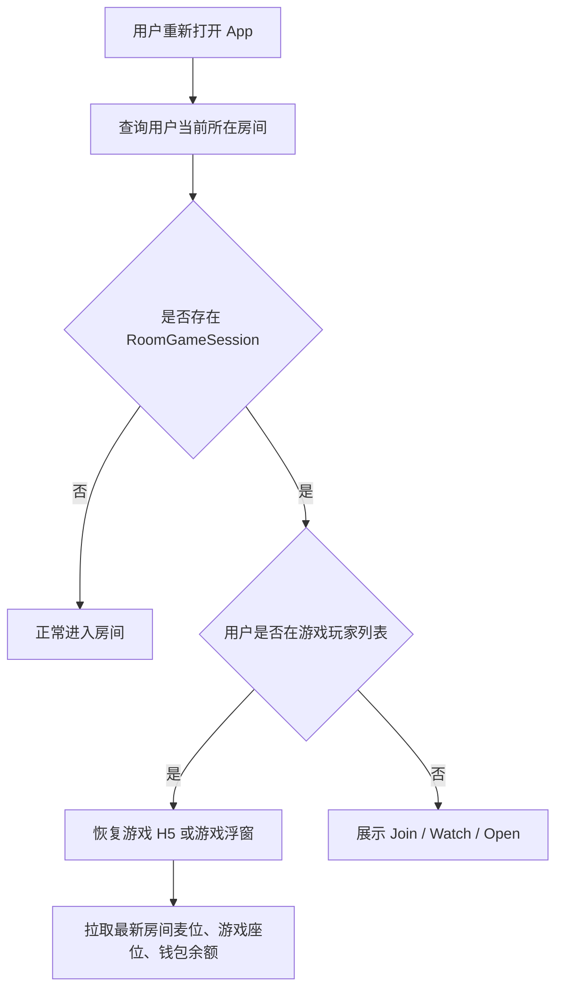

### 14.6 游戏座位与多端并发

| 场景 | 处理 |
|---|---|
| 用户已在座位上，又点击 Join | 不重复加入，返回当前 seat_no |
| 同账号 A 端已上座，B 端点击 Join | 拒绝 B 端加入，提示已在其他设备参与游戏 |
| B 端强制登录挤掉 A 端 | A 端退出游戏，B 端恢复游戏座位 |
| 同账号多端同时操作 | 以最后有效登录设备为准 |
| 玩家 waiting 中离开 | 释放座位；未扣门票则不处理，已扣则退款 |
| 玩家 playing 中离开 | 二次确认，按三方规则判负、托管或继续 |
| 玩家 settling 中离开 | 不允许取消结算，等待服务端订单完成 |
| 中途补位 | V1 默认不支持，除非三方明确支持 |

二次确认文案：

```text
Leaving now may count as giving up this round. Continue?
```

中文：

```text
现在退出可能会被视为放弃本局，是否继续？
```

### 14.7 麦位、禁麦、禁言与声音

| 场景 | 处理 |
|---|---|
| 游戏中开关麦克风 | 走语聊房 RTC，不由 H5 直接控制 |
| 用户被禁麦 | 只影响麦克风，不影响游戏座位和结算 |
| 用户被禁言 | 房间公屏和游戏快捷聊天同步限制，游戏操作不受影响 |
| 用户在麦上 | 游戏 BGM 默认降低 |
| 用户没上麦 | 游戏 BGM 正常，可手动关闭 |
| 有人正在说话 | 游戏 BGM 自动 ducking 降低 |
| 用户关闭扬声器 | 按客户端原有策略处理房间语音与游戏音效 |
| 用户只关闭游戏音效 | 房间语音不受影响 |

### 14.8 货币、扣费、退款与结算

| 场景 | 处理 |
|---|---|
| 游戏币不足 | 返回 1008，H5 调 gameRecharge，App 打开 Game coins 兑换页 |
| 兑换页金币不足 | 立即兑换按钮置灰，引导充值或获取金币 |
| 兑换中离开页面 | 不发起订单；已提交订单以服务端最终状态为准 |
| 兑换成功但游戏已结束 | 返回语聊房并提示当前游戏已结束 |
| 订单重复回调 | order_id 幂等，不重复加减钱 |
| 用户封禁 | 不允许进入游戏，游戏中封禁则踢出或挂起结算 |
| 结算失败 | 进入补偿队列，后台可补偿 |
| 审核账号 | 后台可隐藏入口或只展示免费休闲游戏 |
| 扣门票成功但开局失败 | 自动退款，生成 refund order 并关联原 ticket order |
| 扣费成功但 H5 未收到成功结果 | H5 重试查询，不重复扣费 |
| 结算成功但 App 未展示结果 | 下次进入房间或游戏时补展示结算结果 |
| walletUpdate 失败 | 余额以服务端为准，下次 get_user_info 刷新 |
| 结算前用户被风控 | 订单进入挂起或冻结状态，后台审核后处理 |

退款与补偿字段要求：

| 字段 | 说明 |
|---|---|
| related_order_id | 关联原始扣费订单 |
| refund_reason | 退款原因 |
| refund_status | success / failed / compensating |
| result_viewed | 结算结果是否已展示给用户 |
| result_viewed_at | 结果展示时间 |

### 14.9 后台干预与配置变更

| 场景 | 处理 |
|---|---|
| 后台强制关闭当前 session | 按状态关闭、结算或退款 |
| 后台下架游戏，已有 waiting 局 | 关闭 session，提示游戏维护，已扣款退款 |
| 后台下架游戏，已有 playing 局 | 允许本局完成，禁止再来一局 |
| 后台下架游戏，已有 settling 局 | 继续结算 |
| 后台修改门票配置 | 已创建 session 使用旧配置快照，新 session 使用新配置 |
| 后台修改兑换比例 | 已提交订单使用旧比例快照，新订单使用新比例 |
| 后台强制退款 | 生成退款订单，关联原始订单和 session |
| 后台强制补偿 | 生成补偿订单，记录操作人和原因 |
| 后台强制维护某游戏 | 未开局关闭，已开局完成后不可再开 |

配置快照要求：

```text
ticket_config_snapshot
exchange_rate_snapshot
game_config_version
```

### 14.10 审核、地区与账号限制

| 场景 | 处理 |
|---|---|
| 审核账号进入已有游戏房 | 不展示付费游戏浮窗、门票、下注、兑换入口 |
| 审核账号打开 Games 面板 | 只展示免费休闲游戏或隐藏入口 |
| 审核账号看到公屏消息 | 可隐藏游戏币、门票、下注相关内容 |
| 地区不可用 | 服务端拦截，客户端提示当前地区暂不支持 |
| 分享链接进入受限游戏 | 仍需重新校验地区、账号、房间状态 |
| 用户被风控限制 | 不允许进入游戏，游戏中命中则踢出或挂起结算 |
| 未成年或低龄用户 | 不展示付费局和游戏币兑换入口，仅可展示免费休闲游戏 |

### 14.11 邀请、分享与活动任务

| 场景 | 处理 |
|---|---|
| 邀请不在房间的用户 | 先进入房间，再打开 Join / Watch |
| 邀请已在房间但不在游戏的用户 | 直接打开当前游戏入口 |
| 被邀请人已在其他游戏 | 提示需先退出当前游戏 |
| 被邀请人被封禁 / 地区限制 | 邀请失败 |
| 游戏座位已满 | 被邀请人进入观战 |
| 分享链接对应 session 已结束 | 进入普通语聊房，不恢复游戏 |
| 分享链接对应房间已关闭 | 提示房间已结束 |
| 活动绑定游戏下架 | 活动自动灰态，点击提示暂不可参与 |
| 游戏结果未回传 | 任务不计完成，待结算补偿后再补发奖励 |

### 14.12 统一错误码

> 沿用 v1.5 的 20 个错误码，并补充 Private room 快捷链路的拦截提示。

| code | 含义 | 前端提示 |
|---:|---|---|
| 1001 | 无开局操作权限 | 仅当前房间房主可发起 Start / Close / Kick 等游戏控制操作 |
| 1002 | 当前房间已有游戏 | 当前房间已有游戏进行中 |
| 1003 | 游戏维护中 | 游戏维护中，请稍后再试 |
| 1004 | 地区不可用 | 当前地区暂不支持该游戏 |
| 1005 | 座位已满 | 座位已满，可进入观战 |
| 1006 | 已在其他游戏中 | 请先退出当前游戏 |
| 1007 | 房间状态不可用 | 当前房间暂不支持开启游戏 |
| 1008 | 游戏币不足 | 游戏币不足，请先兑换 |
| 1009 | 重复加入 | 你已在当前游戏中 |
| 1010 | 结算中 | 游戏结算中，请稍候 |
| 1011 | 房主已离开 | 房主已离开，当前游戏由系统托管或已关闭 |
| 1012 | 账号被限制 | 当前账号暂不能参与游戏 |
| 1013 | 设备异常 | 当前设备暂不能参与游戏 |
| 1014 | H5 加载失败 | 游戏加载失败，请重试 |
| 1015 | 订单处理中 | 订单处理中，请勿重复操作 |
| 1016 | 房间已关闭 | 当前房间已结束 |
| 1017 | 游戏已结束 | 当前游戏已结束 |
| 1018 | 控制人失效 | 当前房间房主已离开 |
| 1019 | 配置已变更 | 当前配置已更新，请重新进入 |
| 1020 | 风控挂起 | 当前订单处理中，请等待审核 |

### 14.13 用户主动退出房间的游戏处理

用户主动退出语聊房时，必须同步处理当前房间内的游戏状态。游戏不可脱离语聊房独立存在。

#### 14.13.1 基础原则

| 原则 | 说明 |
|---|---|
| 退出房间 ≠ 最小化游戏 | 最小化只收起游戏容器；退出房间会退出当前房间关系链 |
| 退出房间必须处理游戏资格 | 若用户是玩家，需释放或标记游戏座位；若是观战，需退出观战 |
| 结算状态不可打断 | settling 中不允许取消订单，用户离开后仍按服务端结果结算 |
| 房主退出走系统托管 / 关闭逻辑 | 当前房间房主主动退出房间时，按 14.2 当前房间房主退出与系统托管处理 |

#### 14.13.2 按用户身份处理

| 用户身份 | 退出房间时处理 |
|---|---|
| 普通观战用户 | 直接退出观战，移除游戏入口，不影响游戏 session |
| 普通游戏玩家 | 弹窗二次确认；确认后退出房间并退出游戏，座位按状态释放 / left / 托管 |
| 房管 / 管理员 | V1 按普通玩家或观战用户处理 |
| 当前房间房主 | 按 14.2 处理：waiting / ready 关闭或退款；playing / settling 进入系统托管 |

#### 14.13.3 按游戏状态处理

| 游戏状态 | 用户退出房间后的处理 |
|---|---|
| selecting | 关闭面板，不创建 session |
| loading | 若未扣费，取消 session；若已扣费，按开局失败退款 |
| waiting | 释放座位；若已扣门票，按配置退款 |
| ready | 释放座位；若人数不满足开局条件，状态回退 waiting |
| playing | 标记 player_status=left；是否判负 / 托管 / 继续由三方游戏规则决定 |
| reconnecting | 用户主动退出后不再保留重连资格，标记 left |
| settling | 用户可离开房间，但结算继续完成，结果通过系统消息或下次进入补展示 |
| ended | 正常退出，移除入口 |

#### 14.13.4 交互文案

普通玩家退出房间确认：

```text
你正在游戏中，离开房间将同步退出当前游戏，是否继续？
```

#### 14.13.5 服务端记录字段

| 字段 | 说明 |
|---|---|
| leave_reason | user_leave_room |
| leave_source | room_exit / switch_room / app_close |
| player_status_after_leave | left / watcher_left / hosting / settling |
| confirm_required | 是否触发二次确认 |
| confirm_result | confirm / cancel |
| affected_session_id | 当前游戏 session |

---

### 14.14 用户被踢出房间的游戏处理

用户被踢出房间属于强制行为，必须同步退出游戏，不允许继续保留游戏浮窗或通过游戏入口回到原房间。

#### 14.14.1 处理规则

| 游戏状态 | 被踢出房间后的处理 |
|---|---|
| waiting | 释放游戏座位，移除游戏入口 |
| ready | 释放游戏座位；若已扣门票，按规则退款 |
| playing | 标记 player_status=kicked_from_room；是否判负 / 托管按三方规则处理 |
| reconnecting | 取消重连资格，标记 kicked_from_room |
| settling | 不打断结算；订单继续完成，结果通过系统消息或钱包流水可查 |
| ended | 移除入口 |

#### 14.14.2 与踢出游戏座位的区别

| 行为 | 影响房间身份 | 影响麦位 | 影响游戏座位 | 是否还能留在房间 |
|---|---:|---:|---:|---:|
| 踢出游戏座位 | 否 | 否 | 是 | 是 |
| 踢出房间 | 是 | 是 | 是 | 否 |

#### 14.14.3 用户提示

```text
你已被移出房间，已同步退出当前游戏。
```

#### 14.14.4 服务端记录字段

| 字段 | 说明 |
|---|---|
| leave_reason | kicked_from_room |
| operator_user_id | 操作人 |
| room_id | 房间 ID |
| session_id | 游戏 session |
| seat_no | 游戏座位号，可为空 |
| refund_status | none / pending / success / failed / compensating |

---

### 14.15 用户主动退出游戏但不退出房间

退出游戏与最小化游戏必须区分。最小化表示用户仍在游戏中；退出游戏表示用户离开当前 RoomGameSession，但仍保留在语聊房内。

#### 14.15.1 处理规则

| 游戏状态 | 主动退出游戏处理 |
|---|---|
| waiting | 允许退出，释放座位，回到房间主界面 |
| ready | 允许退出；若已扣门票，按规则退款；人数不足则回退 waiting |
| playing | 二次确认；确认后按三方规则判负、托管或标记 left |
| reconnecting | 允许退出，取消重连资格 |
| settling | 不允许取消结算，展示"结算中，请稍候" |
| ended | 允许退出，展示结果后释放入口 |

#### 14.15.2 用户退出后的房间能力

| 能力 | 是否保留 |
|---|---:|
| 房间聊天 | 是 |
| 送礼 / 红包 | 是，按房间配置 |
| 上麦 / 下麦 | 是，按房间麦位规则 |
| 继续观战 | 可配置，V1 建议退出玩家座位后可转观战 |
| 再次加入当前游戏 | waiting 可加入；playing 默认只可观战 |

#### 14.15.3 二次确认文案

```text
现在退出可能会被视为放弃本局，是否继续？
```

#### 14.15.4 埋点

| 埋点 | 触发 |
|---|---|
| game_exit_click | 点击退出游戏 |
| game_exit_confirm_show | 展示退出确认 |
| game_exit_confirm | 确认退出 |
| game_exit_cancel | 取消退出 |
| game_exit_success | 退出成功 |
| game_exit_failed | 退出失败 |

---

### 14.16 用户被踢出游戏座位但仍在房间

踢出游戏座位仅影响 RoomGamePlayer，不影响 RoomMicState，不影响用户在语聊房内的身份、麦位、聊天和送礼能力。

#### 14.16.1 处理规则

| 游戏状态 | 被踢出游戏座位处理 |
|---|---|
| waiting | 释放座位，用户可继续观战或重新申请加入 |
| ready | 释放座位；若已扣门票，按配置退款；人数不足则回退 waiting |
| playing | 原则上不允许普通踢出，除非三方支持或异常处理；被踢后按 left / kicked 处理 |
| settling | 不允许踢出，避免影响结算 |
| ended | 无需处理 |

#### 14.16.2 权限规则

| 操作人 | 是否可踢游戏座位 |
|---|---:|
| 当前房间房主 | 是 |
| game_controller | V1 等于当前房间房主；system 托管态仅后台可处理异常 |
| 房管 / 管理员 | 否，V1 按普通用户处理 |
| 普通用户 | 否 |
| 系统 / 后台 | 异常处理时允许 |

#### 14.16.3 用户提示

```text
你已被移出游戏座位，仍可继续留在房间观战。
```

#### 14.16.4 状态变化

| 字段 | 变化 |
|---|---|
| RoomGamePlayer.status | kicked |
| RoomGamePlayer.left_at | 当前时间 |
| RoomMicState | 不变化 |
| RoomRoleState | 不变化 |
| GameBalanceOrder | 如需退款，生成 refund order |

---

### 14.17 用户断线、杀 App、重连恢复详细规则

断线恢复是游戏类场景高频问题，需要区分网络断线、App 后台、杀进程、H5 被系统回收等情况。

#### 14.17.1 断线类型

| 类型 | 判断 | 处理 |
|---|---|---|
| 短断线 | 0-30 秒内心跳恢复 | 保留座位，状态 reconnecting，用户无感恢复 |
| 中断线 | 30-120 秒 | 保留座位，房间内可显示离线中；恢复时同步最新状态 |
| 长断线 | 超过 120 秒 | 标记 left 或进入三方托管，具体按游戏能力 |
| 杀 App | 客户端进程结束，H5 销毁 | 下次启动查询 current_room_id 和 current_game_session_id 重建 |
| H5 被系统回收 | App 仍在房间，WebView 被回收 | 重新加载 H5，通过 getConfig 返回最新状态 |

#### 14.17.2 恢复顺序

```text
查询用户当前房间
→ 查询 RoomGameSession
→ 查询 RoomGamePlayer
→ 查询 RoomRoleState
→ 查询 RoomMicState
→ 查询 RTCState
→ 查询 WalletBalance
→ 判断 H5 恢复 / 重建 / 展示结果 / 提示结束
```

#### 14.17.3 恢复结果

| 查询结果 | 客户端处理 |
|---|---|
| session=playing，player=playing | 恢复游戏 H5 |
| session=playing，player=left | 展示 Watch / 已退出 |
| session=settling | 展示结算中 |
| session=ended，result_viewed=false | 补展示结算结果 |
| session=ended，result_viewed=true | 回到房间，隐藏入口 |
| room closed / kicked | 不恢复游戏，回到房间外页面 |

#### 14.17.4 字段要求

| 字段 | 说明 |
|---|---|
| last_active_at | 用户最后活跃时间 |
| disconnect_at | 断线时间 |
| reconnect_deadline | 重连截止时间 |
| reconnect_count | 当前 session 内重连次数 |
| recover_source | foreground / app_restart / h5_reload |
| recover_result | success / failed / ended / no_permission |

---

### 14.18 同账号多端登录与并发操作

同一账号不允许在同一游戏 session 中占多个游戏座位，结算必须按 user_id + order_id 幂等处理。

#### 14.18.1 处理规则

| 场景 | 处理 |
|---|---|
| A 端已在游戏，B 端点击 Join | 拒绝 B 端加入，提示已在其他设备参与游戏 |
| B 端强制登录挤掉 A 端 | A 端退出游戏容器，B 端恢复原游戏身份 |
| A 端最小化，B 端打开游戏 | 若 B 为当前有效设备，可恢复；A 端入口失效 |
| A / B 同时操作座位 | 以服务端设备会话 token 最新有效者为准 |
| 重复结算回调 | 按 order_id 幂等，只处理一次 |

#### 14.18.2 设备会话字段

| 字段 | 说明 |
|---|---|
| device_id | 当前设备 ID |
| login_session_id | 登录会话 ID |
| active_game_device_id | 当前有效游戏设备 |
| device_kick_reason | multi_device_login / token_expired / force_login |

#### 14.18.3 用户提示

```text
该账号已在其他设备参与游戏。
```

---

### 14.19 H5、App、服务端状态不一致

RoomGameSession 为游戏状态最终依据，H5 状态仅作为状态推进信号，不作为最终可信状态。

#### 14.19.1 冲突处理

| 冲突 | 处理 |
|---|---|
| H5=playing，服务端=waiting | 校验 type=13；合法则推进 playing，不合法则通知 H5 refresh |
| H5=ended，服务端=playing | 等待 type=14 或服务端结算回调；超时进入异常对账 |
| App=ended，H5=playing | App 通知 H5 refresh / close，不允许继续操作 |
| H5 destroy，服务端=playing | 展示恢复 / 重连，不直接结束 session |
| H5 无响应 | 客户端重试；超过阈值进入 error |
| App 本地缓存与服务端不一致 | 丢弃本地缓存，使用服务端状态重建视图 |

#### 14.19.2 幂等要求

| 事件 | 幂等键 | 处理 |
|---|---|---|
| 游戏开始 | session_id + round_id + type=13 | 已 playing 不重复处理 |
| 游戏结束 | session_id + round_id + type=14 | 已 ended / settling 不重复处理 |
| 扣门票 | ticket_order_id | 不重复扣费 |
| 结算 | order_id | 不重复加减钱 |
| 退款 | refund_order_id | 不重复退款 |

#### 14.19.3 后台日志

后台需能查看以下日志：

| 日志 | 说明 |
|---|---|
| h5_state_report_log | H5 上报状态日志 |
| app_state_change_log | App 状态切换日志 |
| server_session_state_log | 服务端 session 状态变更 |
| state_conflict_log | 状态冲突记录 |
| idempotent_hit_log | 幂等命中记录 |

---

### 14.20 扣费成功但开局失败

扣费成功但游戏未成功开始是资产类 P0 场景，必须自动退款或进入补偿队列。

#### 14.20.1 触发场景

| 场景 | 示例 |
|---|---|
| 门票扣费成功，H5 加载失败 | WebView 白屏、加载超时 |
| 门票扣费成功，gameLoaded 未回调 | 30 秒无回调 |
| 门票扣费成功，type=13 未回调 | H5 未真正开局 |
| 服务端创建 session 成功，三方创建房间失败 | Bytesun 返回错误 |
| 用户扣费后被风控拦截 | 开局前命中风控 |

#### 14.20.2 处理流程

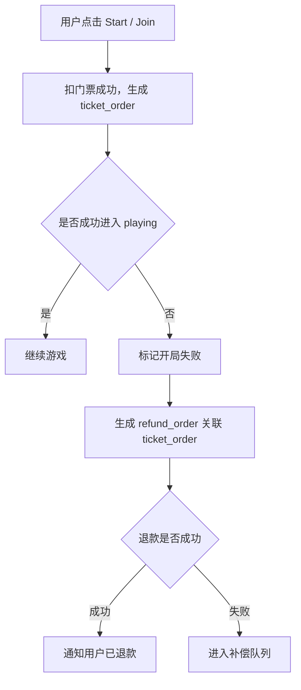

#### 14.20.3 订单字段

| 字段 | 说明 |
|---|---|
| ticket_order_id | 原门票扣费订单 |
| refund_order_id | 退款订单 |
| related_order_id | 退款关联原订单 |
| start_failed_reason | h5_timeout / game_loaded_timeout / bytesun_error / risk_block |
| refund_status | pending / success / failed / compensating |
| compensate_status | none / pending / success / failed |

#### 14.20.4 用户提示

```text
游戏启动失败，已为你退回门票。
```

退款进入补偿时：

```text
游戏启动失败，门票退款处理中，请稍后查看余额。
```

---

### 14.21 结算成功但用户未看到结果

结算结果展示失败不影响真实余额；服务端结算结果必须可补展示。

#### 14.21.1 触发场景

| 场景 | 处理 |
|---|---|
| 用户最小化期间游戏结束 | 浮窗变为 Finished，点击展示结果 |
| 用户断线期间游戏结束 | 下次重连补展示结果 |
| 用户杀 App 后游戏结束 | 下次进入房间 / 游戏补展示结果 |
| H5 结果页展示失败 | App 查询服务端结果页数据展示 |
| 用户已离开房间 | 通过钱包流水、系统消息或游戏记录查看 |

#### 14.21.2 展示规则

| 条件 | 处理 |
|---|---|
| result_viewed=false 且用户重新进入房间 | 弹出结果页 |
| result_viewed=false 且用户点击游戏浮窗 | 打开结果页 |
| result_viewed=true | 不重复弹窗，可在记录页查看 |
| 用户只是观战 | 可展示房间游戏结束提示，不展示个人收益 |

#### 14.21.3 字段

| 字段 | 说明 |
|---|---|
| result_viewed | 是否已展示 |
| result_viewed_at | 展示时间 |
| result_popup_status | pending / shown / skipped / failed |
| result_summary | 结果摘要，用于系统消息或记录页 |

---

### 14.22 后台下架、维护、配置变更与已有游戏

后台配置变更必须区分"新 session 生效"和"已有 session 生效"。V1 推荐已有 session 使用配置快照，避免结算和体验争议。

#### 14.22.1 下架 / 维护已有游戏

| 当前状态 | 后台下架 / 维护处理 |
|---|---|
| selecting | 关闭入口，提示游戏维护 |
| loading | 取消 session，已扣费则退款 |
| waiting | 关闭 session，已扣费则退款 |
| ready | 关闭 session，已扣费则退款 |
| playing | 允许本局完成，禁止再来一局 |
| settling | 继续结算 |
| ended | 不允许再次开启 |

#### 14.22.2 配置变更规则

| 配置 | 已创建 session | 新 session |
|---|---|---|
| 门票档位 | 使用 ticket_config_snapshot | 使用最新配置 |
| 兑换比例 | 已提交订单使用 exchange_rate_snapshot | 使用最新比例 |
| 地区限制 | 已进入用户本局不强制退出，风控命中除外 | 新进入用户拦截 |
| 房管 / 管理员权限 | V1 游戏内按普通用户处理 | 如后续开放游戏控制权限需单独评审 |
| 游戏上下架 | playing 本局完成 | 不允许新开 |

#### 14.22.3 操作审计

| 字段 | 说明 |
|---|---|
| operator_id | 后台操作人 |
| operation_type | off_shelf / maintenance / config_update / force_close / refund / compensate |
| operation_reason | 操作原因 |
| affected_game_id | 影响游戏 |
| affected_session_ids | 影响 session 列表 |
| config_before | 变更前配置 |
| config_after | 变更后配置 |

---

### 14.23 游戏中用户身份变化

用户身份变化会影响游戏入口和控制按钮展示，客户端不能只依赖进入游戏时的本地缓存。V1 游戏控制权只归当前房间房主。

| 身份变化 | 处理 |
|---|---|
| 普通用户升为房管 / 管理员 | V1 游戏内仍按普通用户处理，不展示 Start / Close / Kick Seat |
| 房管 / 管理员被取消 | 不影响游戏内控制权，因为 V1 未开放房管控制游戏 |
| 房间归属转让 | 新房间归属用户获得游戏控制权，RoomRoleState 推送后刷新按钮 |
| 用户被封禁 | 退出游戏或挂起结算，按风控策略处理 |

操作权限同步触发点：

> 这里的权限指房内游戏控制操作权限，不等同于入口风控。入口风控和游戏可见性在展示入口、打开游戏面板、拉取游戏列表时前置完成；Start / Close / Kick Seat 仍需要服务端实时校验，防止房间归属变化、封禁、房间关闭、已有游戏并发创建等状态变化。

| 触发点 | 要求 |
|---|---|
| 打开游戏控制面板 | 重新拉取 RoomRoleState |
| 点击 Start / Close / Kick Seat | 服务端实时校验 |
| 房间归属变化 | 推送权限变更给当前游戏用户 |
| 房管 / 管理员权限变更 | V1 不影响游戏控制按钮；只刷新普通房间身份展示 |

---

### 14.24 游戏中房间上锁、改私密、设置密码

房间权限变化只影响新进入用户，不影响已在房间内且已通过权限校验的用户。

| 场景 | 处理 |
|---|---|
| 已在房间用户 | 不受影响，可继续游戏 / 观战 |
| 新用户进入 | 先校验房间权限，再校验游戏权限 |
| 游戏邀请 | 被邀请人必须先通过房间权限校验 |
| Game Rooms 列表 | 展示锁标识或隐藏，按产品策略配置 |
| 分享链接 | 先校验房间，再校验游戏 session |
| 房间改私密后当前游戏 playing | 本局继续，不允许未授权用户进入 |

---

### 14.25 游戏中用户余额变化同步

游戏 H5 内余额展示不是最终资产依据，钱包服务端余额才是最终依据。

| 场景 | 处理 |
|---|---|
| 用户兑换游戏币成功 | walletUpdate 通知 H5，App 同步刷新 |
| 用户收到后台补偿 | walletUpdate 或下次 get_user_info 更新 |
| 用户游戏外充值金币 | 金币余额刷新，游戏币不自动变化 |
| walletUpdate 失败 | 余额以服务端为准，下次 get_user_info 刷新 |
| 用户重新打开游戏 | 必须重新拉取 WalletBalance |
| H5 余额展示异常 | 提供刷新能力，不允许基于本地余额扣费 |

---

### 14.26 Discover Private room 快捷入口边界

Private room 快捷入口是 Discover 侧的快速建房开游链路。入口不同，但底层路径与房内游戏统一：系统进入用户自己的房间，创建 RoomGameSession，并直接打开 H5。它不复用房内 Games 面板的活动和动态表情 Tab，但最小化、恢复、退出和结算均回到自己的房间上下文。

| 场景 | 处理 |
|---|---|
| 用户点击 Private room | 当前 Discover Games 页展示休闲游戏半屏 |
| 半屏内游戏维护 / 下架 | 游戏灰态或隐藏；点击不可用游戏只展示提示 |
| 地区或审核账号限制 | 服务端返回可见游戏列表，客户端不展示受限游戏 |
| 用户当前在他人房间 | 先退出当前他人房间，再进入自己的房间开局 |
| 用户当前在自己的房间 | 若无游戏，直接创建 RoomGameSession；若已有游戏，提示 Open 当前游戏或关闭后重试 |
| 用户选择游戏 | 关闭半屏，进入用户自己的房间，创建 RoomGameSession，并直接进入对应 H5 |
| H5 加载失败 | 展示 Retry / Close；Close 后回到自己的房间主界面，不回到 Discover Games |
| 游戏币不足 | 打开 Game coins 兑换页；兑换后若上下文仍有效，返回 H5 并 `walletUpdate` |
| 用户最小化 | 返回自己的房间主界面，并展示当前游戏恢复入口 |
| 用户关闭游戏 | 关闭 RoomGameSession，回到自己的房间；用户可继续留房或退出 |
| 用户进入其他语聊房 | 若自己房间游戏进行中，二次确认；确认后退出当前游戏和自己的房间 |
| 后台关闭 Private room 入口 | 新用户不展示按钮；已在 H5 的用户本局可完成或按配置关闭 |

埋点与数据要求：

| 字段 / 埋点 | 说明 |
|---|---|
| source=private_room_entry | 标识来源为 Private room 快捷入口 |
| return_context=room | 最小化、关闭、结算后回到 RoomGameSession 所属房间；Private room 来源即用户自己的房间 |
| private_room_game_picker_show | Private room 休闲游戏半屏曝光 |
| private_room_game_select | 用户在半屏中选择游戏 |

### 14.27 Discover 推荐游戏 / Game Rooms 匹配边界

Discover 推荐游戏和 Game Rooms 的目标是进入他人的游戏房，不是开启自己的房间。用户进入后按普通用户处理。

| 场景 | 处理 |
|---|---|
| 用户不在任何房间 | 直接按游戏、国家、状态匹配目标游戏房 |
| 用户在自己的房间最小化 | 进入匹配游戏房前先退出自己的房间 |
| 用户在他人的房间最小化 | 进入匹配游戏房前先退出当前他人房间 |
| 当前房间内有未结束游戏 | 二次确认；确认后退出当前房间和当前游戏关系 |
| 匹配到自己的房间 | 不作为普通游戏房目标；需要开自己的游戏时走 Private room |
| 目标房间 waiting | 进入后展示 Join |
| 目标房间 playing | 进入后展示 Watch / Open |
| 目标房间已结束 | 提示游戏已结束并刷新列表 |
| 进入目标房间后 | 不展示 Start / Close / Kick Seat，按普通用户状态处理 |

## 15. 多语言与文案

### 15.1 英文

| 中文 | 英文 |
|---|---|
| 游戏 | Games |
| 活动 | Activity |
| 更多游戏 | More Games |
| 私密房 | Private room |
| 休闲游戏 | Casual Games |
| 开始游戏 | Start Game |
| 加入游戏 | Join Game |
| 观战 | Watch |
| 游戏中 | Playing |
| 结算中 | Settling |
| 游戏币 | Game coins |
| 兑换游戏币 | Exchange game coins |
| 游戏币不足 | Not enough game coins |
| 立即兑换 | Exchange now |
| 游戏币仅供游戏内使用，不得提现及兑换金币 | Game coins can only be used in games and cannot be withdrawn or exchanged back to gold coins |
| 当前房间已有游戏进行中 | A game is already running in this room |
| 游戏加载失败 | Game failed to load |
| 只有当前房间房主可以开启游戏 | Only the current room owner can start a game |
| 选择一个休闲游戏 | Choose a casual game |

### 15.2 阿语

| 中文 | 阿语 |
|---|---|
| 游戏 | الألعاب |
| 活动 | النشاطات |
| 更多游戏 | المزيد من الألعاب |
| 私密房 | غرفة خاصة |
| 休闲游戏 | ألعاب خفيفة |
| 开始游戏 | ابدأ اللعبة |
| 加入游戏 | انضم إلى اللعبة |
| 观战 | مشاهدة |
| 游戏中 | قيد اللعب |
| 结算中 | جاري احتساب النتيجة |
| 游戏币 | عملات اللعب |
| 兑换游戏币 | استبدال عملات اللعب |
| 游戏币不足 | عملات اللعب غير كافية |
| 立即兑换 | استبدل الآن |
| 游戏加载失败 | فشل تحميل اللعبة |
| 只有当前房间房主可以开启游戏 | يمكن لمالك الغرفة الحالي فقط بدء اللعبة |
| 选择一个休闲游戏 | اختر لعبة خفيفة |

## 16. 开发周期与上线策略

### 16.1 V0 技术预研

周期：1-2 周。

| 任务 | 交付 |
|---|---|
| Bytesun 测试环境联调 | 接口连通性报告 |
| H5 / Zip 加载验证 | Android / iOS 加载方案 |
| JSBridge 验证 | getConfig、gameLoaded、gameRecharge、sendGameAction |
| 钱包接口预研 | change_balance 幂等、并发锁、金币兑换游戏币事务方案 |
| 游戏资源确认 | game_id、版本、人数、观战、门票能力清单 |

验收：

- Ludo / UNO 至少一个游戏在语聊房模式可加载。
- `getConfig`、`gameLoaded`、`change_balance`、金币兑换游戏币跑通。
- 明确 Zip / URL 直连策略和 CDN 方案。

### 16.2 V1 MVP 开发排期

周期：4-5 周。

| 周期 | 客户端 | 服务端 | 后台 / 数据 | 验收重点 |
|---|---|---|---|---|
| 第 1 周 | Discover Games / Activity、国家筛选、Private room 选游半屏、房内入口、半屏面板 | RoomGameSession 创建 / 查询 / 关闭、进入自己房间能力、Discover 匹配游戏房能力 | 游戏接入配置、入口配置 | 能从 Discover 和房内选择游戏并进入统一房间游戏链路 |
| 第 2 周 | H5 容器、Loading、getConfig、gameLoaded | code、ss_token、用户信息接口 | 游戏配置列表、游戏同步 | 能加载 Ludo / UNO |
| 第 3 周 | 设置页、上座/下座、观战、声音控制 | 座位状态、type=13/14/15/16/18 | 房间游戏监控、操作日志 | 能进入 waiting / playing |
| 第 4 周 | 结算页、再来一局、游戏币不足、金币兑换游戏币、最小化、异常提示 | change_balance、兑换接口、结算记录、补偿队列 | 结算管理、游戏币兑换管理、基础看板 | 能完整完成一局并结算 |
| 第 5 周 | 兼容、性能、灰度、埋点补齐 | 对账、风控、监控告警 | 数据验收、运营配置 | 达到上线标准 |

### 16.3 灰度策略

| 阶段 | 范围 | 目标 |
|---|---|---|
| 阶段 1 | 内部测试房间 + 白名单账号 | 验证加载、桥接、结算 |
| 阶段 2 | MENA 小流量普通语聊房 | 验证入口点击、开局转化、稳定性 |
| 阶段 3 | 扩大到重点国家 | 验证留存、充值、房间活跃 |
| 阶段 4 | 全量开放 | 按后台开关和风控持续运营 |

## 17. 验收标准

> 综合合并 v1.4 和 v1.5 的独特验收条目，并纳入 Private room、国家筛选和 Activity 页特殊规则。

### 17.1 产品验收

- 用户可以从 Discover Games 看到推荐游戏、国家筛选和正在玩游戏的语聊房。
- 用户从 Discover 推荐游戏或 Game Rooms 进入时，若当前已有最小化房间，需先退出当前房间，再进入匹配到的游戏房，并在目标房间内按普通用户处理。
- 用户点击 Discover Games 的 `Private room` 后，当前首页弹出休闲游戏选择半屏，弹窗不展示 `游戏`、`动态表情` 两个 Tab。
- 用户在 Private room 半屏中选择游戏后，系统进入用户自己的房间并直接打开对应 H5；首次不展示语聊房主界面，不进入游戏设置页。
- Private room 来源游戏最小化后，返回自己的房间主界面，恢复逻辑与房内游戏一致，不回到 Discover Games 首页。
- Activity 页只展示搜索入口，不展示任务和头像占位。
- 用户可以从房间内 Games 入口打开半屏游戏面板。
- 当前房间房主可以选择游戏并打开设置页。
- 当前房间房主可以开始 Ludo / UNO，其他首批游戏可按灰度配置进入。
- 普通用户可以加入、观战、最小化和返回房间。
- 游戏开始和结束状态能同步到 App。
- 用户可以完成一局并看到结算结果。
- 游戏币不足时可以打开 Game coins 兑换页，金币兑换成功后刷新游戏币余额。
- 最小化后可通过房间浮窗恢复游戏。
- 加载失败、上座失败、维护、封禁、地区限制均有明确提示。
- Private room 入口在 Discover 当前页弹出休闲游戏选择半屏；弹窗只保留休闲游戏，选中游戏后进入自己的房间并直接进入 H5，首次不展示房间页和设置页。
- Activity 页活动 Banner 可跳转活动详情、指定房间、指定游戏或金币兑换游戏币页面；活动绑定游戏下架后活动自动灰态。
- 全角色（当前房间房主、普通玩家、观战）均可最小化游戏并通过浮窗恢复。
- 被踢出游戏座位的用户仍可留在房间观战，被踢出房间的用户同步退出游戏。

### 17.2 技术验收

- iOS / Android WebView 能稳定加载 H5 / Zip。
- `getConfig` 返回字段满足 Bytesun 要求。
- `gameLoaded`、`sendGameAction`、`gameActionUpdate` 跑通。
- `change_balance` 支持幂等、并发锁和游戏币不足错误。
- 金币兑换游戏币接口支持同事务扣金币和加游戏币。
- 游戏开始和结算上报可落库。
- 安全区参数不会遮挡主要游戏操作区。
- 游戏包版本可后台控制。
- 恢复游戏时必须重新拉取 RoomMicState、RoomGamePlayer、RoomRoleState、WalletBalance，不得使用本地缓存。
- 幂等处理覆盖游戏开始、结束、扣门票、结算、退款全链路。

### 17.3 后台验收

- 游戏上下架、维护、灰度可配置。
- 地区、端、审核账号策略可配置。
- 房间游戏监控可查看当前局状态。
- 结算订单可查询、补偿和导出。
- 游戏币兑换订单可查询、补偿和导出。
- 活动 Banner 可配置跳转。
- 三方接口配置可审计，不泄露 appKey。
- 配置变更对已创建 session 使用快照，不影响当前局。
- 状态冲突日志、幂等命中日志、session 状态变更日志可查询。

### 17.4 数据验收

- 入口曝光、点击、加载、开局、加入、上座、结束、结算、异常均有埋点。
- 游戏记录可按房间、游戏、用户、时间查询。
- 结算记录可按订单、用户、游戏局查询。
- 看板可查看启动成功率、加载耗时、开局转化、完成率、结算失败率、上座失败率、游戏币不足转化率。

## 18. 风险与缓解

| 风险 | 影响 | 缓解 |
|---|---|---|
| Bytesun 服务不稳定 | 游戏无法加载或结算失败 | URL / Zip 双方案、重试、下架开关、监控告警 |
| 游戏包加载慢 | 进入转化下降 | CDN 预热、本地包、Loading 进度、首屏优化 |
| 结算并发 | 错账 | 用户级锁、订单幂等、补偿队列、对账 |
| 金币兑换游戏币错账 | 金币扣减或游戏币增加不一致 | 同事务、兑换订单幂等、兑换对账、补偿队列 |
| 语音和游戏声音冲突 | 体验差 | 语音优先，默认降低 BGM，用户可控制 |
| 低端机性能 | 卡顿 / 崩溃 | 机型监控、降级策略，必要时屏蔽高负载游戏 |
| 游戏操作区被遮挡 | 无法操作 | game_margin_top / bottom、安全区验收 |
| 玩法合规 | 审核风险 | 审核账号隐藏、免费局策略、Slots 单独评审 |
| 作弊串通 | 破坏经济系统 | 同设备/IP 风控、异常胜率、固定组合检测 |

## 19. 待 Bytesun 确认问题

| 问题 | 优先级 | 阶段 |
|---|---|---|
| Ludo、UNO、Domino、8 Ball、Carrom、Snake & Ladder 的准确 `game_id` 和 Bytesun 游戏名 | P0 | V0 |
| `/v1/api/gamelist` 的 `game_list_type` 真实取值 | P0 | V0 |
| 每个游戏最小人数、最大人数、是否允许中途加入、是否允许观战 | P0 | V0 |
| `type=30` 中 `ticketSlots` 的含义、取值和金额映射 | P0 | V0 |
| `hideLobby=true` 的快速开始 API 路径、参数、鉴权、返回值 | P0 | V1 |
| game_id 以 3 开头的游戏是否都必须配置安全区参数 | P0 | V1 |
| 错误码由 H5 透传还是服务端回调处理 | P1 | V1 |
| 余额不足错误码 1008 是否明确指"游戏币不足"，是否需区分金币不足 | P1 | V1 |
| 金币兑换游戏币比例是否固定为 100:1000，还是支持运营后台按地区配置 | P1 | V1 |
| Zip 包 CDN 缓存策略和版本更新机制 | P1 | V1 |
| 各游戏是否支持机器人补位 | P2 | V2 |

## 20. 评审决策项

| 决策项 | 建议结论 |
|---|---|
| V1 路径 | 采用"语聊房内直接调起游戏"，不新增游戏房类型 |
| 首批游戏 | 6 款进入产品范围，Ludo / UNO 优先强验收，其余按灰度节奏上线 |
| 普通语聊房开启游戏 | 默认支持，按地区/端/当前房间房主等级可后台限制 |
| 门票系统 | V1 启用，单位为游戏币，默认 0，范围后台配置 |
| 游戏币体系 | 游戏内统一使用游戏币；游戏币由金币兑换，不支持提现和兑换回金币 |
| 游戏中礼物和红包 | 保留入口，具体开关后台控制 |
| 房管 / 管理员是否可开局 | V1 不开放；如需放开需单独评审 |
| Slots / Jackpot 是否展示 | 不作为首批强推荐，需单独合规评审 |

## 21. 最终推荐

本期采用"现有语聊房内直接调起三方休闲游戏"的方案。

这样可以在不改造房间模型、推荐流、麦位和基础权限的情况下，最快验证游戏对房间停留、活跃和付费转化的提升。V1 重点跑通 Discover Games、国家筛选、Private room 快捷建房开游、房间内入口、设置页、H5 容器、座位同步、游戏币结算、金币兑换游戏币、最小化恢复和后台监控。待核心数据稳定后，再考虑 Game Rooms 深度运营、随机匹配、游戏房类型、任务和锦标赛等扩展能力。

**一句话总结：第一版先把三方休闲游戏做成语聊房里的"可开局插件"，让用户在原房间关系链中一起玩；等数据验证后，再升级成完整游戏房生态。**

---

## 附录：版本整合说明

| 版本 | 整合内容 | 处理方式 |
|---|---|---|
| v1.5 | 全角色最小化、后台、数据模型、技术接入、高频边界、错误码、开发排期 | 作为文档主体 |
| v1.4 | 最新客户端整机截图、国家筛选、Activity 顶部规则、Private room 半屏选游样式 | 覆盖 v1.5 中旧截图与旧 Private room 入口样式 |
| 去重 | v1.5 的 14.3 与 6.6-6.11 有重叠 | 14.3 保留结构化规则表格，6.6-6.11 保留前台流程和交互细节 |
| 冲突解决 | 错误码 | 沿用 v1.5 的 20 个错误码，并补 Private room 链路拦截 |
| 冲突解决 | 验收标准 | 合并 v1.4 和 v1.5 条目；Private room 和 Activity 页特殊规则已纳入 17.1 |
