# WeChill 三方休闲游戏接入 - 入口×场景 流程图汇总（修订版）

> 配套文档：PRD v1.6 可评审版 + v1.7 补充修订  
> 用途：基于正确的角色模型，补充从各入口进入游戏的完整路径、最小化、退出场景流程图  
> 日期：2026-05-21（修订 v2 — 调整 1.3/2.2/5.3/6.2/6.3/6.4 流程）

> 本次修订重点：推荐游戏 15s 匹配、Private room 等待与邀请链路、Discover 进入别人游戏房后的最小化承接、房主退出/关闭游戏后的系统接管、踢人不影响游戏中玩家。

---

## 核心概念说明

### 角色定义

| 角色 | 定义 | 说明 |
|---|---|---|
| 房主 | 用户在自己的房间内 = 房主 | 每个用户都有自己的房间，进入自己房间就是房主；房主离房后房间不立即关闭，其他用户可继续聊天/送礼 |
| 普通用户 | 进入别人房间的人 | 无论什么身份，进入别人的游戏房就是普通用户 |

**核心原则：**
- 每个用户都可以是房主（在自己房间时）
- 游戏房 = 某个房主在自己的房间里开启了游戏
- 其他人进入这个游戏房 = 普通用户
- 不存在独立的"管理员"游戏角色

### 入口说明

| 入口 | 说明 | 用户身份 |
|---|---|---|
| Private room | 进入自己的房间 → 开启游戏房模式 | 房主（自己开局） |
| Discover 推荐 / Game Rooms | 去别人的游戏房 → 加入游戏 | 普通用户（加入别人的局） |
| 房内 Games 面板 | 已经在自己房间内 → 开启游戏 | 房主（自己开局） |
| 在别人房间内 | 已在别人房间 → 加入该房间游戏 | 普通用户 |

---

## 一、Discover 页面入口流程

### 1.1 Discover 页面整体判断逻辑

> 核心：第一层判断用户当前是否在某个房间（最小化状态）

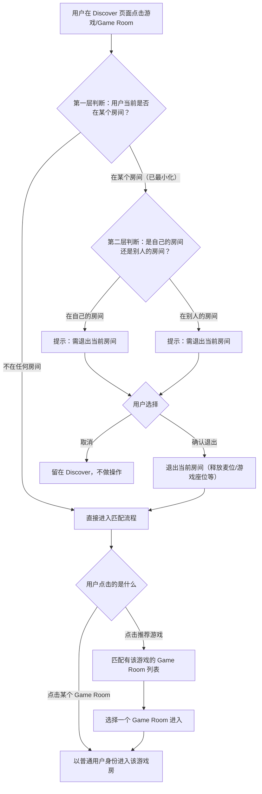
```mermaid

flowchart TD
    A["用户在 Discover 页面点击游戏/Game Room"] --> B{"第一层判断：用户当前是否在某个房间？"}
    
    B -->|"不在任何房间"| C["直接进入匹配流程"]
    B -->|"在某个房间（已最小化）"| D{"第二层判断：是自己的房间还是别人的房间？"}
    
    D -->|"在自己的房间"| E["提示：需退出当前房间"]
    D -->|"在别人的房间"| F["提示：需退出当前房间"]
    
    E --> G{"用户选择"}
    F --> G
    G -->|"确认退出"| H["退出当前房间（释放麦位/游戏座位等）"]
    G -->|"取消"| I["留在 Discover，不做操作"]
    
    H --> C
    
    C --> J{"用户点击的是什么"}
    J -->|"点击某个 Game Room"| K["以普通用户身份进入该游戏房"]
    J -->|"点击推荐游戏"| L["匹配有该游戏的 Game Room 列表"]
    L --> M["选择一个 Game Room 进入"]
    M --> K
```

### 1.2 进入别人的游戏房（普通用户身份）

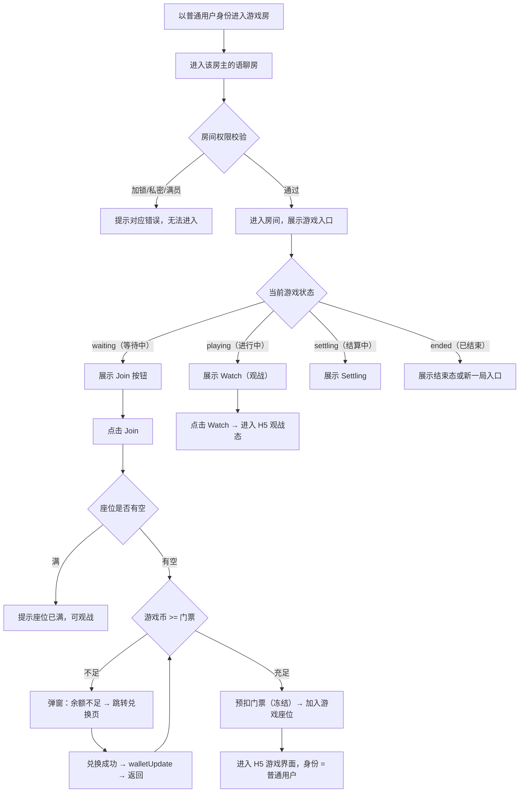
```mermaid
flowchart TD
    A["以普通用户身份进入游戏房"] --> B["进入该房主的语聊房"]
    B --> C{"房间权限校验"}
    C -->|"加锁/私密/满员"| D["提示对应错误，无法进入"]
    C -->|"通过"| E["进入房间，展示游戏入口"]
    
    E --> F{"当前游戏状态"}
    F -->|"waiting（等待中）"| G["展示 Join 按钮"]
    F -->|"playing（进行中）"| H["展示 Watch（观战）"]
    F -->|"settling（结算中）"| I["展示 Settling"]
    F -->|"ended（已结束）"| J["展示结束态或新一局入口"]
    
    G --> K["点击 Join"]
    K --> L{"座位是否有空"}
    L -->|"满"| M["提示座位已满，可观战"]
    L -->|"有空"| N{"游戏币 >= 门票"}
    N -->|"不足"| O["弹窗：余额不足 → 跳转兑换页"]
    O --> P["兑换成功 → walletUpdate → 返回"]
    P --> N
    N -->|"充足"| Q["预扣门票（冻结）→ 加入游戏座位"]
    Q --> R["进入 H5 游戏界面，身份 = 普通用户"]
    
    H --> S["点击 Watch → 进入 H5 观战态"]
```

### 1.3 Discover 推荐游戏 → 匹配 Game Room

> 调整后口径：点击推荐游戏先展示 Matching 15s 倒计时；若存在同类型、未开局、等待中的游戏房，直接进入该房间；若没有等待中的游戏房，才走原空结果链路。

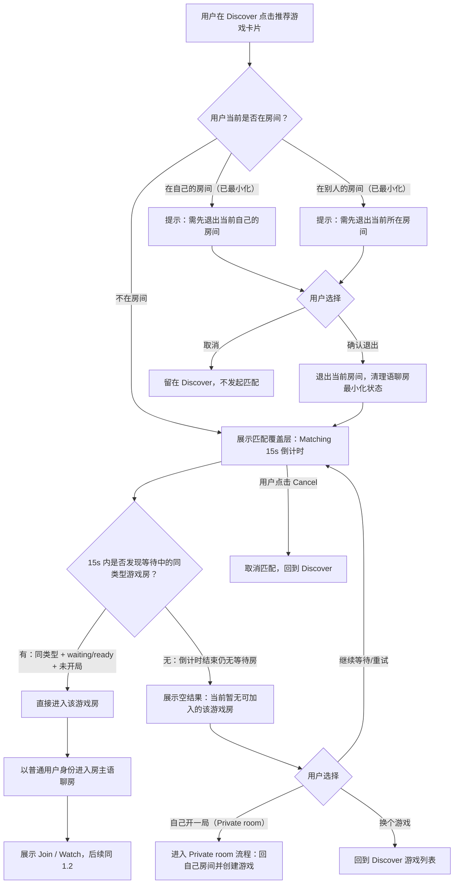
```mermaid
flowchart TD
    A["用户在 Discover 点击推荐游戏卡片"] --> B{"用户当前是否在房间？"}
    B -->|"不在房间"| C["展示匹配覆盖层：Matching 15s 倒计时"]
    B -->|"在自己的房间（已最小化）"| D["提示：需先退出当前自己的房间"]
    B -->|"在别人的房间（已最小化）"| E["提示：需先退出当前所在房间"]
    D --> F{"用户选择"}
    E --> F
    F -->|"确认退出"| G["退出当前房间，清理语聊房最小化状态"]
    F -->|"取消"| H["留在 Discover，不发起匹配"]
    G --> C

    C --> I{"15s 内是否发现等待中的同类型游戏房？"}
    I -->|"有：同类型 + waiting/ready + 未开局"| J["直接进入该游戏房"]
    J --> K["以普通用户身份进入房主语聊房"]
    K --> L["展示 Join / Watch，后续同 1.2"]

    I -->|"无：倒计时结束仍无等待房"| M["展示空结果：当前暂无可加入的该游戏房"]
    M --> N{"用户选择"}
    N -->|"自己开一局（Private room）"| O["进入 Private room 流程：回自己房间并创建游戏"]
    N -->|"换个游戏"| P["回到 Discover 游戏列表"]
    N -->|"继续等待/重试"| C
    C -->|"用户点击 Cancel"| Q["取消匹配，回到 Discover"]
```

**匹配规则：**
- 只匹配同一个 `game_id` / `game_key` 的游戏房。
- 只匹配 `waiting/ready` 且未正式开局的房间。
- 多个房间同时满足时，优先进入在线人数接近开局要求、延迟低、风险状态正常的房间。
- 推荐游戏入口进入别人房间后，用户身份始终为普通用户。


---

## 二、Private Room 入口流程

### 2.1 Private Room = 进入自己房间 + 开启游戏

> Private room 的本质：用户进入自己的房间，以房主身份直接开启游戏房模式

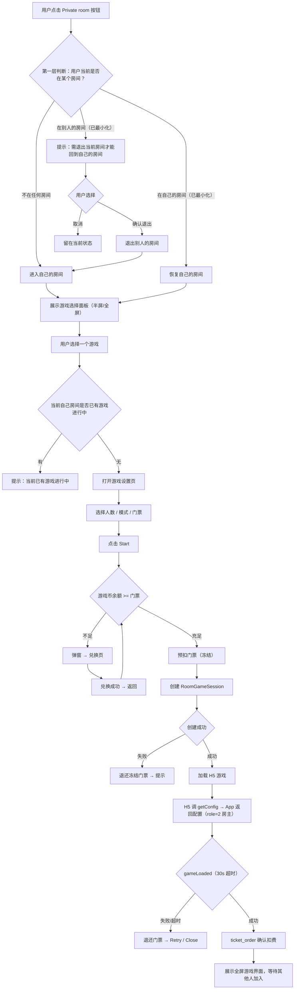
```mermaid
flowchart TD
    A["用户点击 Private room 按钮"] --> B{"第一层判断：用户当前是否在某个房间？"}
    
    B -->|"不在任何房间"| C["进入自己的房间"]
    B -->|"在自己的房间（已最小化）"| D["恢复自己的房间"]
    B -->|"在别人的房间（已最小化）"| E["提示：需退出当前房间才能回到自己的房间"]
    
    E --> F{"用户选择"}
    F -->|"确认退出"| G["退出别人的房间"]
    F -->|"取消"| H["留在当前状态"]
    G --> C
    
    C --> I["展示游戏选择面板（半屏/全屏）"]
    D --> I
    I --> J["用户选择一个游戏"]
    J --> K{"当前自己房间是否已有游戏进行中"}
    K -->|"有"| L["提示：当前已有游戏进行中"]
    K -->|"无"| M["打开游戏设置页"]
    
    M --> N["选择人数 / 模式 / 门票"]
    N --> O["点击 Start"]
    O --> P{"游戏币余额 >= 门票"}
    P -->|"不足"| Q["弹窗 → 兑换页"]
    Q --> R["兑换成功 → 返回"]
    R --> P
    P -->|"充足"| S["预扣门票（冻结）"]
    S --> T["创建 RoomGameSession"]
    T --> U{"创建成功"}
    U -->|"失败"| V["退还冻结门票 → 提示"]
    U -->|"成功"| W["加载 H5 游戏"]
    W --> X["H5 调 getConfig → App 返回配置（role=2 房主）"]
    X --> Y{"gameLoaded（30s 超时）"}
    Y -->|"失败/超时"| Z["退还门票 → Retry / Close"]
    Y -->|"成功"| AA["ticket_order 确认扣费"]
    AA --> AB["展示全屏游戏界面，等待其他人加入"]
```

### 2.2 Private Room 开启后等待其他用户

> 调整后口径：Private room 开启后先展示游戏等待状态。房主可以最小化等待页，也可以分享邀请链接。若等待页已最小化，且有人进入该房间并点击加入游戏，则房主侧弹起游戏配置页面，由房主决定是否开始；人数未达成时继续等待，过程中房主可以调整配置。

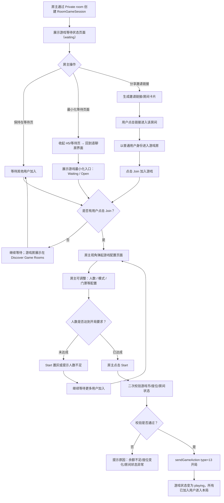
```mermaid
flowchart TD
    A["房主通过 Private room 创建 RoomGameSession"] --> B["展示游戏等待状态页面（waiting）"]
    B --> C{"房主操作"}

    C -->|"保持在等待页"| D["等待其他用户加入"]
    C -->|"最小化等待页面"| E["收起 H5/等待页 → 回到语聊房界面"]
    E --> F["展示游戏最小化入口：Waiting / Open"]

    C -->|"分享邀请链接"| G["生成邀请链接/房间卡片"]
    G --> H["用户点击链接进入该房间"]
    H --> I["以普通用户身份进入游戏房"]
    I --> J["点击 Join 加入游戏"]

    D --> K{"是否有用户点击 Join？"}
    F --> K
    J --> K
    K -->|"否"| L["继续等待；游戏房展示在 Discover Game Rooms"]
    L --> D

    K -->|"是"| M["房主视角弹起游戏配置页面"]
    M --> N["房主可调整：人数 / 模式 / 门票等配置"]
    N --> O{"人数是否达到开局要求？"}
    O -->|"未达成"| P["Start 置灰或提示人数不足"]
    P --> Q["继续等待更多用户加入"]
    Q --> M
    O -->|"已达成"| R["房主点击 Start"]
    R --> S["二次校验游戏币/座位/房间状态"]
    S --> T{"校验是否通过？"}
    T -->|"否"| U["提示原因：余额不足/座位变化/房间状态异常"]
    T -->|"是"| V["sendGameAction type=13 开局"]
    V --> W["游戏状态变为 playing，所有已加入用户进入本局"]
```

**补充规则：**
- 房主最小化等待页后，游戏房仍处于 `waiting`，可继续被 Discover / 邀请链接发现。
- 房主弹起配置页不是重新创建游戏，而是对当前 waiting session 做开局前配置确认。
- 配置变更仅在开局前生效；playing 后不允许调整本局配置。
- 若房主长时间不响应，可保留 waiting，但需有超时清理策略，避免列表中长期挂空房。


---

## 三、房内 Games 面板流程（房主在自己房间）

### 3.1 房主在自己房间内开启游戏

> 用户已经在自己的房间里（是房主），通过 Games 面板开启游戏

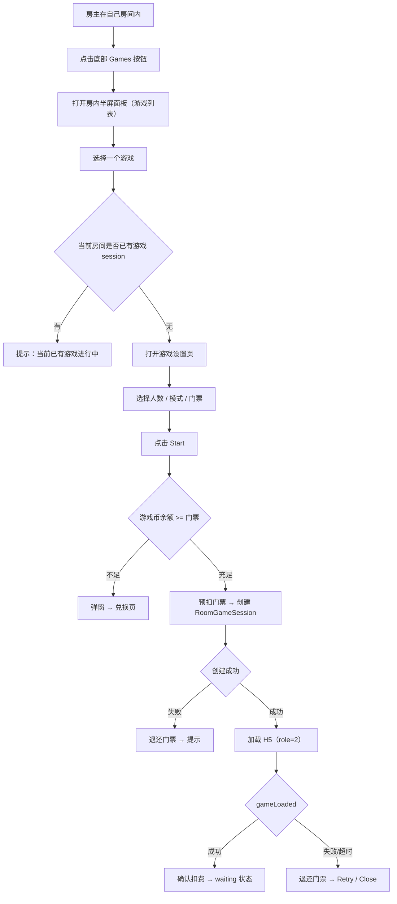
```mermaid
flowchart TD
    A["房主在自己房间内"] --> B["点击底部 Games 按钮"]
    B --> C["打开房内半屏面板（游戏列表）"]
    C --> D["选择一个游戏"]
    D --> E{"当前房间是否已有游戏 session"}
    E -->|"有"| F["提示：当前已有游戏进行中"]
    E -->|"无"| G["打开游戏设置页"]
    
    G --> H["选择人数 / 模式 / 门票"]
    H --> I["点击 Start"]
    I --> J{"游戏币余额 >= 门票"}
    J -->|"不足"| K["弹窗 → 兑换页"]
    J -->|"充足"| L["预扣门票 → 创建 RoomGameSession"]
    L --> M{"创建成功"}
    M -->|"失败"| N["退还门票 → 提示"]
    M -->|"成功"| O["加载 H5（role=2）"]
    O --> P{"gameLoaded"}
    P -->|"成功"| Q["确认扣费 → waiting 状态"]
    P -->|"失败/超时"| R["退还门票 → Retry / Close"]
```

**说明：** 房内 Games 面板流程和 Private room 流程的本质一样——都是房主在自己房间开启游戏。区别仅在于入口位置不同：
- Private room：从 Discover 页面进入自己房间再开游戏
- Games 面板：已经在自己房间内，直接开游戏

---

## 四、在别人房间内加入游戏（普通用户）

### 4.1 普通用户在别人房间内看到游戏

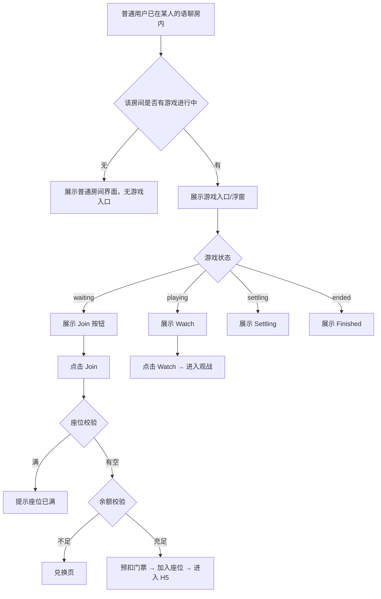
```mermaid
flowchart TD
    A["普通用户已在某人的语聊房内"] --> B{"该房间是否有游戏进行中"}
    B -->|"无"| C["展示普通房间界面，无游戏入口"]
    B -->|"有"| D["展示游戏入口/浮窗"]
    
    D --> E{"游戏状态"}
    E -->|"waiting"| F["展示 Join 按钮"]
    E -->|"playing"| G["展示 Watch"]
    E -->|"settling"| H["展示 Settling"]
    E -->|"ended"| I["展示 Finished"]
    
    F --> J["点击 Join"]
    J --> K{"座位校验"}
    K -->|"满"| L["提示座位已满"]
    K -->|"有空"| M{"余额校验"}
    M -->|"不足"| N["兑换页"]
    M -->|"充足"| O["预扣门票 → 加入座位 → 进入 H5"]
    
    G --> P["点击 Watch → 进入观战"]
```

---

## 五、最小化场景流程图

### 5.1 房主最小化游戏

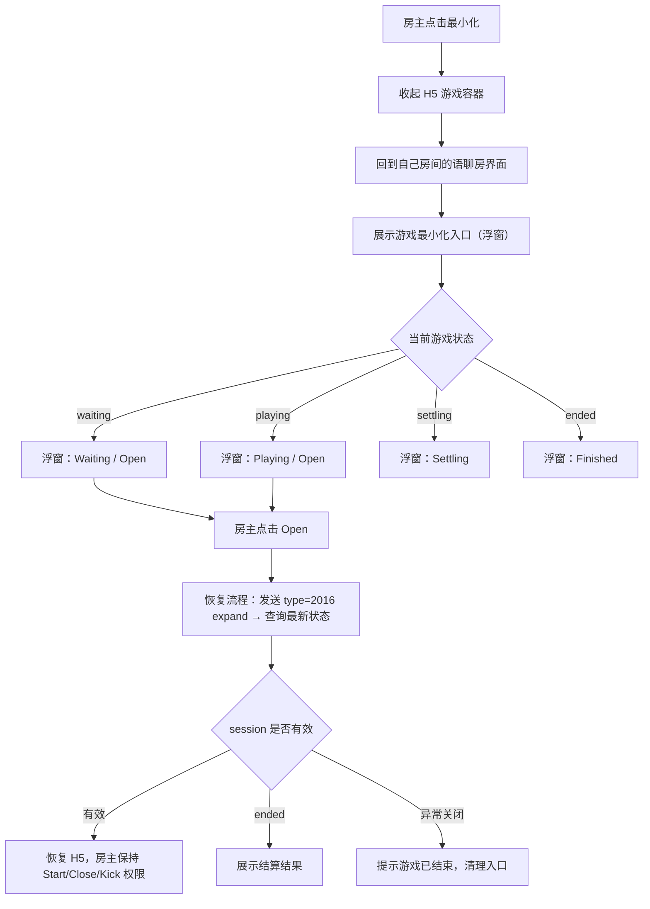
```mermaid
flowchart TD
    A["房主点击最小化"] --> B["收起 H5 游戏容器"]
    B --> C["回到自己房间的语聊房界面"]
    C --> D["展示游戏最小化入口（浮窗）"]
    
    D --> E{"当前游戏状态"}
    E -->|"waiting"| F["浮窗：Waiting / Open"]
    E -->|"playing"| G["浮窗：Playing / Open"]
    E -->|"settling"| H["浮窗：Settling"]
    E -->|"ended"| I["浮窗：Finished"]
    
    F --> J["房主点击 Open"]
    G --> J
    J --> K["恢复流程：发送 type=2016 expand → 查询最新状态"]
    K --> L{"session 是否有效"}
    L -->|"有效"| M["恢复 H5，房主保持 Start/Close/Kick 权限"]
    L -->|"ended"| N["展示结算结果"]
    L -->|"异常关闭"| O["提示游戏已结束，清理入口"]
```

**房主最小化期间的规则：**
- 游戏继续运行，房主仍是 game_controller
- 普通用户仍可继续 Join / Watch
- 房主恢复后保持完整管理权限

### 5.2 普通用户最小化游戏

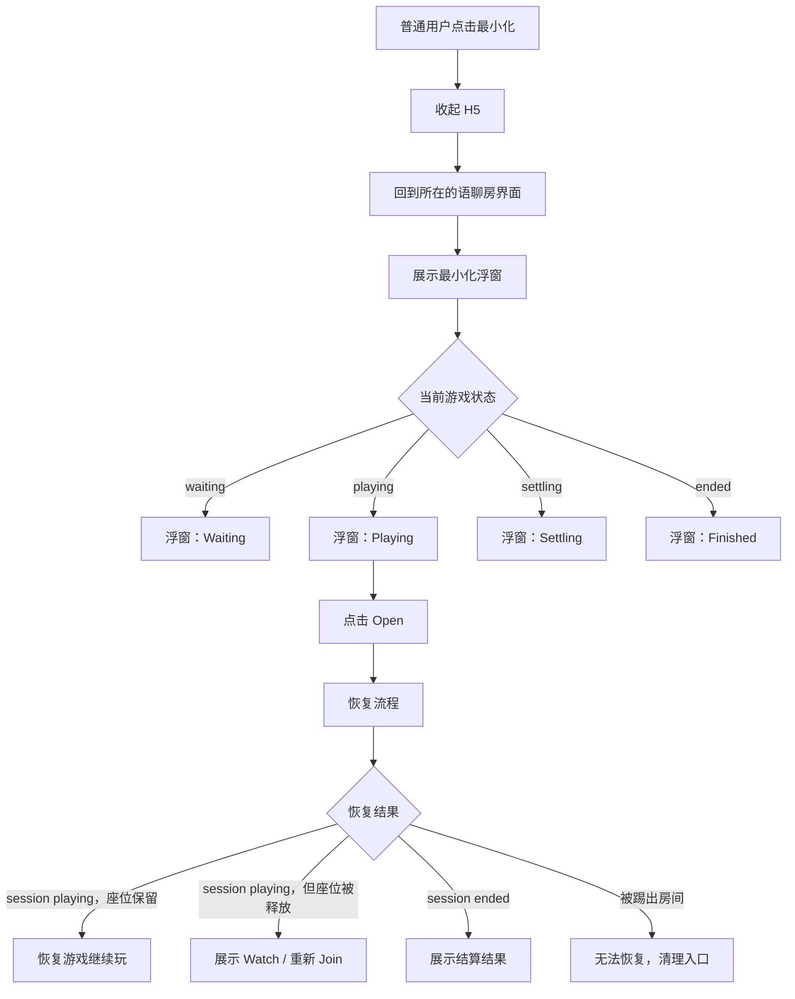
```mermaid
flowchart TD
    A["普通用户点击最小化"] --> B["收起 H5"]
    B --> C["回到所在的语聊房界面"]
    C --> D["展示最小化浮窗"]
    
    D --> E{"当前游戏状态"}
    E -->|"waiting"| F["浮窗：Waiting"]
    E -->|"playing"| G["浮窗：Playing"]
    E -->|"settling"| H["浮窗：Settling"]
    E -->|"ended"| I["浮窗：Finished"]
    
    G --> J["点击 Open"]
    J --> K["恢复流程"]
    K --> L{"恢复结果"}
    L -->|"session playing，座位保留"| M["恢复游戏继续玩"]
    L -->|"session playing，但座位被释放"| N["展示 Watch / 重新 Join"]
    L -->|"session ended"| O["展示结算结果"]
    L -->|"被踢出房间"| P["无法恢复，清理入口"]
```

**普通用户最小化期间的风险：**
- 回合制游戏可能超时判负
- 游戏可能结束

### 5.3 从 Discover 进入的用户最小化后的处理

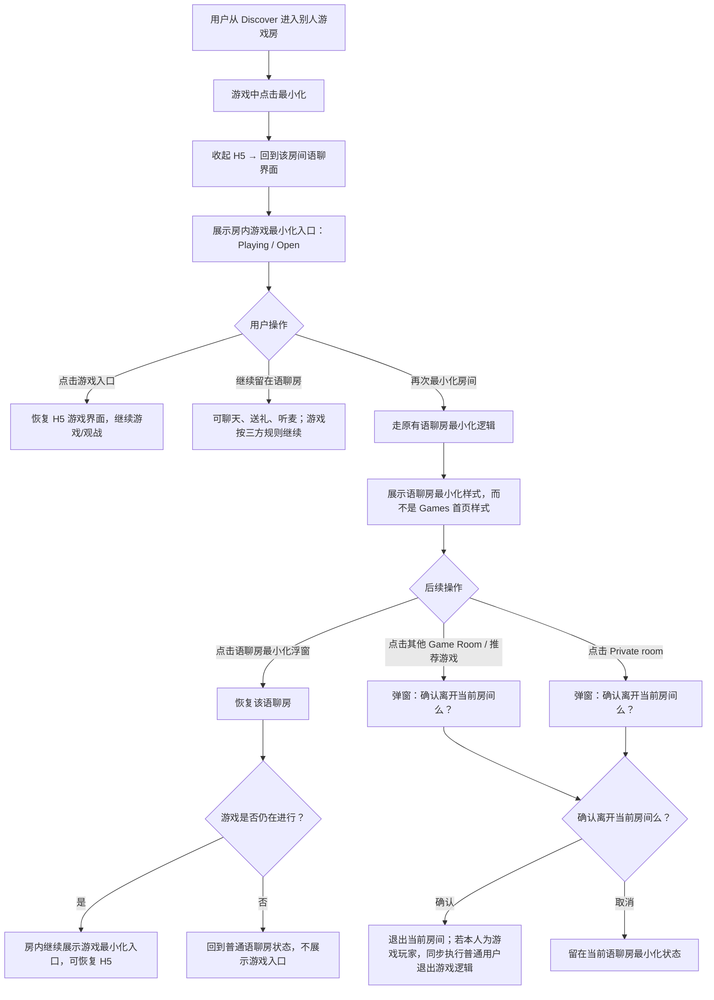
```mermaid
flowchart TD
    A["用户从 Discover 进入别人游戏房"] --> B["游戏中点击最小化"]
    B --> C["收起 H5 → 回到该房间语聊界面"]
    C --> D["展示房内游戏最小化入口：Playing / Open"]
    D --> E{"用户操作"}

    E -->|"点击游戏入口"| F["恢复 H5 游戏界面，继续游戏/观战"]
    E -->|"继续留在语聊房"| G["可聊天、送礼、听麦；游戏按三方规则继续"]
    E -->|"再次最小化房间"| H["走原有语聊房最小化逻辑"]
    H --> I["展示语聊房最小化样式，而不是 Games 首页样式"]

    I --> J{"后续操作"}
    J -->|"点击语聊房最小化浮窗"| K["恢复该语聊房"]
    K --> L{"游戏是否仍在进行？"}
    L -->|"是"| M["房内继续展示游戏最小化入口，可恢复 H5"]
    L -->|"否"| N["回到普通语聊房状态，不展示游戏入口"]

    J -->|"点击其他 Game Room / 推荐游戏"| O["弹窗：确认离开当前房间么？"]
    J -->|"点击 Private room"| P["弹窗：确认离开当前房间么？"]
    O --> Q{"确认离开当前房间么？"}
    P --> Q
    Q -->|"确认"| R["退出当前房间；若本人为游戏玩家，同步执行普通用户退出游戏逻辑"]
    Q -->|"取消"| S["留在当前语聊房最小化状态"]
```

**规则说明：**
- Discover 只是入口来源；进入别人游戏房后，用户已经处在某个房主的语聊房内。
- 游戏最小化只回到该房间语聊界面；房间再次最小化时，复用平台现有语聊房最小化样式。
- 后续恢复、退出、切房等操作都按“当前所在语聊房 + 普通用户游戏身份”处理，不回到 Games 首页承接。


---

## 六、退出场景流程图

### 6.1 普通用户主动退出游戏（不退出房间）

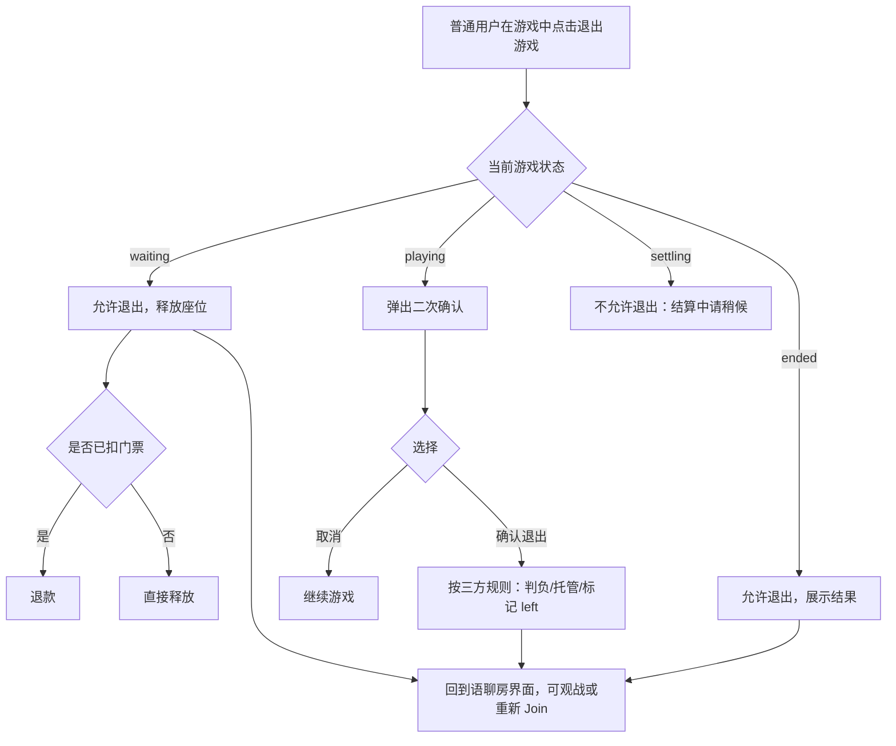
```mermaid
flowchart TD
    A["普通用户在游戏中点击退出游戏"] --> B{"当前游戏状态"}
    B -->|"waiting"| C["允许退出，释放座位"]
    C --> D{"是否已扣门票"}
    D -->|"是"| E["退款"]
    D -->|"否"| F["直接释放"]
    
    B -->|"playing"| G["弹出二次确认"]
    G --> H{"选择"}
    H -->|"确认退出"| I["按三方规则：判负/托管/标记 left"]
    H -->|"取消"| J["继续游戏"]
    
    B -->|"settling"| K["不允许退出：结算中请稍候"]
    B -->|"ended"| L["允许退出，展示结果"]
    
    C --> M["回到语聊房界面，可观战或重新 Join"]
    I --> M
    L --> M
```

### 6.2 用户退出房间（有游戏进行中）

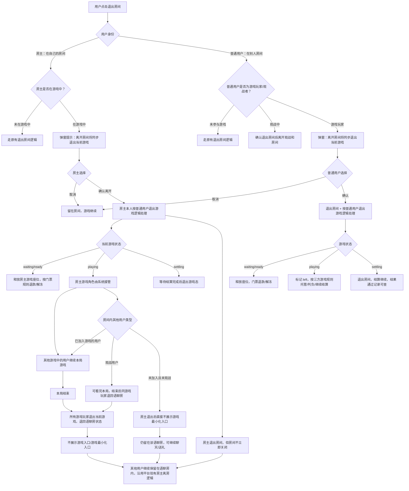
```mermaid
flowchart TD
    A["用户点击退出房间"] --> B{"用户身份"}

    B -->|"房主：在自己的房间"| C{"房主是否在游戏中？"}
    B -->|"普通用户：在别人房间"| D{"普通用户是否为游戏玩家/观战者？"}

    C -->|"未在游戏中"| E["走原有退出房间逻辑"]
    C -->|"在游戏中"| F["弹窗提示：离开房间将同步退出当前游戏"]
    F --> G{"房主选择"}
    G -->|"取消"| H["留在房间，游戏继续"]
    G -->|"确认离开"| I["房主本人按普通用户退出游戏逻辑处理"]
    I --> J{"当前游戏状态"}
    J -->|"waiting/ready"| K["释放房主游戏座位，按门票规则退款/解冻"]
    J -->|"playing"| L["房主游戏角色由系统接管"]
    J -->|"settling"| M["等待结算完成后退出游戏态"]

    L --> N["其他游戏中的用户继续本局游戏"]
    N --> O["本局结束"]
    O --> P["所有游戏玩家退出当前游戏，退回语聊房状态"]
    P --> Q["不展示游戏入口/游戏最小化入口"]

    L --> R{"房间内其他用户类型"}
    R -->|"已加入游戏的用户"| N
    R -->|"观战用户"| S["可看完本局，结束后同游戏玩家退回语聊房"]
    S --> P
    R -->|"未加入且未观战"| T["房主退出后直接不展示游戏最小化入口"]
    T --> U["仍留在该语聊房，可继续聊天/送礼"]

    I --> V["房主退出房间，但房间不立即关闭"]
    V --> W["其他用户继续保留在语聊房内，沿用平台现有房主离房逻辑"]
    U --> W
    Q --> W

    D -->|"未参与游戏"| X["走原有退出房间逻辑"]
    D -->|"观战中"| Y["确认退出房间后离开观战和房间"]
    D -->|"游戏玩家"| Z["弹窗：离开房间将同步退出当前游戏"]
    Z --> AA{"普通用户选择"}
    AA -->|"取消"| H
    AA -->|"确认"| AB["退出房间 + 按普通用户退出游戏逻辑处理"]
    AB --> AC{"游戏状态"}
    AC -->|"waiting/ready"| AD["释放座位，门票退款/解冻"]
    AC -->|"playing"| AE["标记 left，按三方游戏规则托管/判负/继续结算"]
    AC -->|"settling"| AF["退出房间，结算继续，结果通过记录可查"]
```

**规则说明：**
- 平台现有逻辑为：房主离开房间后，房间不会立刻关闭；其他用户仍可继续在语聊房内聊天、送礼。
- 房主在 playing 中离房时，不强制关闭整局；房主本人的游戏角色由系统接管，其他已加入游戏/观战用户可完成本局。
- 本局结束后，所有用户退回语聊房状态，并且不再展示该游戏入口，避免误以为房主仍在维护游戏房。
- 未加入游戏且未观战的用户，不需要看到游戏最小化入口；他们只保留普通语聊房体验。

### 6.3 房主关闭游戏（不退出房间）

> 调整后口径：房主关闭游戏不等于关闭房间。若游戏已经进行中，房主本人按“普通用户退出游戏”处理，房主游戏角色由系统接管，其他游戏玩家/观战用户完成本局；本局结束后退回语聊房，不展示游戏入口。

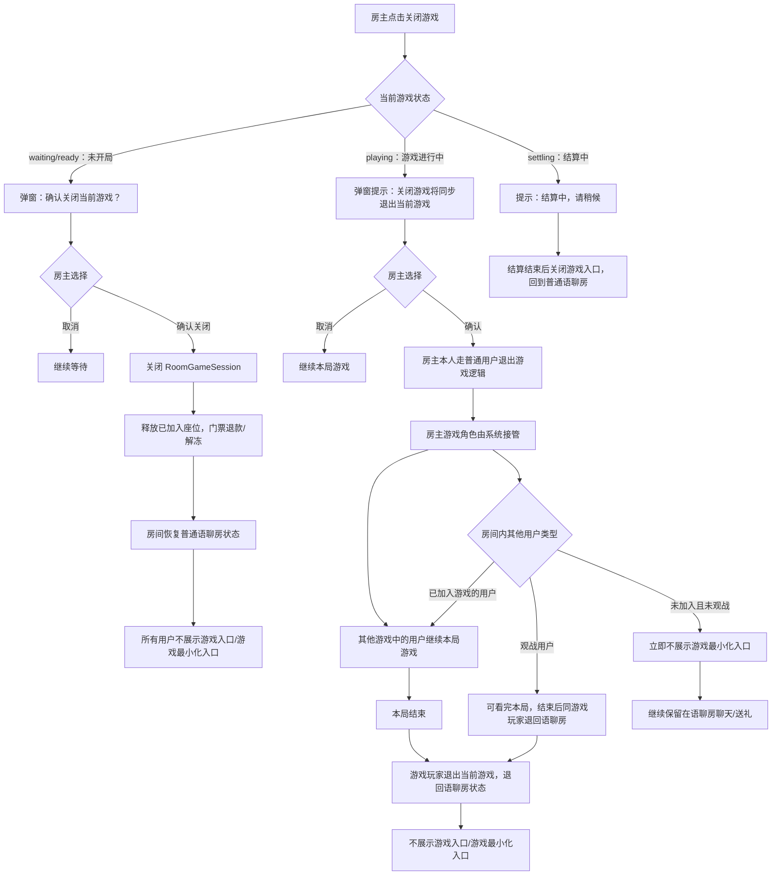
```mermaid
flowchart TD
    A["房主点击关闭游戏"] --> B{"当前游戏状态"}

    B -->|"waiting/ready：未开局"| C["弹窗：确认关闭当前游戏？"]
    C --> D{"房主选择"}
    D -->|"取消"| E["继续等待"]
    D -->|"确认关闭"| F["关闭 RoomGameSession"]
    F --> G["释放已加入座位，门票退款/解冻"]
    G --> H["房间恢复普通语聊房状态"]
    H --> I["所有用户不展示游戏入口/游戏最小化入口"]

    B -->|"playing：游戏进行中"| J["弹窗提示：关闭游戏将同步退出当前游戏"]
    J --> K{"房主选择"}
    K -->|"取消"| L["继续本局游戏"]
    K -->|"确认"| M["房主本人走普通用户退出游戏逻辑"]
    M --> N["房主游戏角色由系统接管"]
    N --> O["其他游戏中的用户继续本局游戏"]
    O --> P["本局结束"]
    P --> Q["游戏玩家退出当前游戏，退回语聊房状态"]
    Q --> R["不展示游戏入口/游戏最小化入口"]

    N --> S{"房间内其他用户类型"}
    S -->|"已加入游戏的用户"| O
    S -->|"观战用户"| T["可看完本局，结束后同游戏玩家退回语聊房"]
    T --> Q
    S -->|"未加入且未观战"| U["立即不展示游戏最小化入口"]
    U --> V["继续保留在语聊房聊天/送礼"]

    B -->|"settling：结算中"| W["提示：结算中，请稍候"]
    W --> X["结算结束后关闭游戏入口，回到普通语聊房"]
```

**规则说明：**
- 房主关闭 waiting/ready 游戏：可直接关闭 session，并释放/退款。
- 房主关闭 playing 游戏：不强制中断其他用户本局，避免已付费玩家体验被房主管理动作打断。
- “关闭游戏”只关闭游戏模式/游戏入口，不退出房间；语聊房继续保留。
- playing 中房主确认关闭后，房主本人不再作为玩家继续操作，游戏角色由系统接管。

### 6.4 普通用户被房主踢出

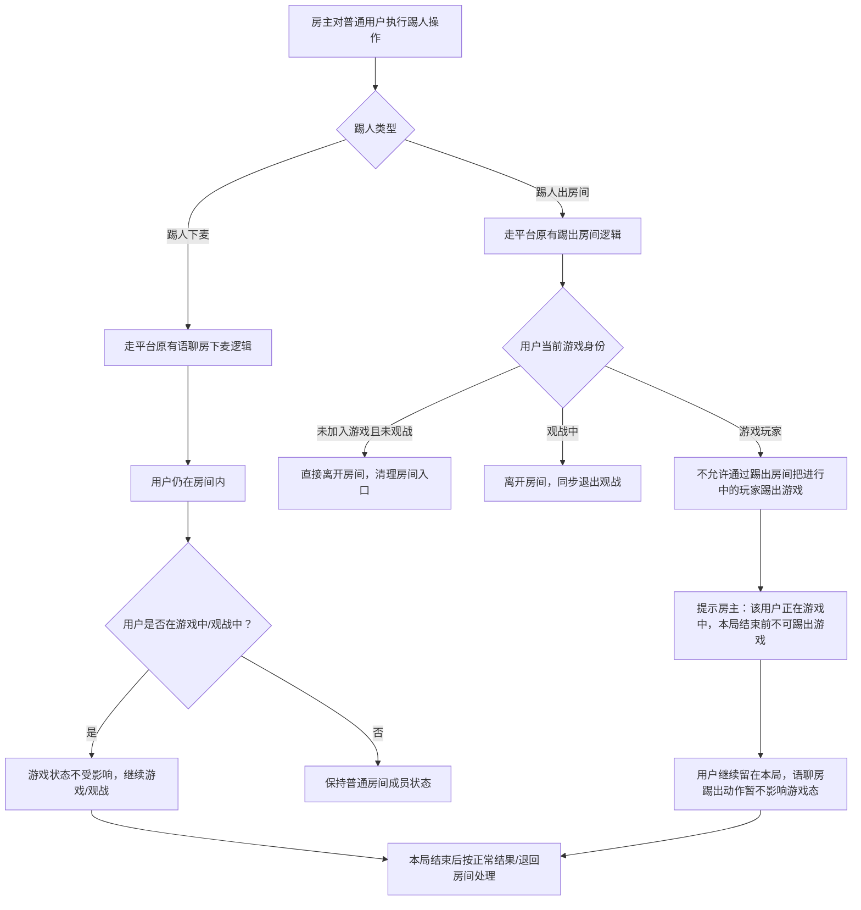
```mermaid
flowchart TD
    A["房主对普通用户执行踢人操作"] --> B{"踢人类型"}

    B -->|"踢人下麦"| C["走平台原有语聊房下麦逻辑"]
    C --> D["用户仍在房间内"]
    D --> E{"用户是否在游戏中/观战中？"}
    E -->|"是"| F["游戏状态不受影响，继续游戏/观战"]
    E -->|"否"| G["保持普通房间成员状态"]

    B -->|"踢人出房间"| H["走平台原有踢出房间逻辑"]
    H --> I{"用户当前游戏身份"}
    I -->|"未加入游戏且未观战"| J["直接离开房间，清理房间入口"]
    I -->|"观战中"| K["离开房间，同步退出观战"]
    I -->|"游戏玩家"| L["不允许通过踢出房间把进行中的玩家踢出游戏"]
    L --> M["提示房主：该用户正在游戏中，本局结束前不可踢出游戏"]
    M --> N["用户继续留在本局，语聊房踢出动作暂不影响游戏态"]

    F --> O["本局结束后按正常结果/退回房间处理"]
    N --> O
```

**规则说明：**
- 踢人下麦、踢人出房间都沿用现有语聊房权限与提示，不新增“踢出游戏”管理能力。
- 游戏中的状态不可以被房主踢出游戏，避免影响三方游戏公平性和付费结算。
- 若用户未加入游戏也未观战，踢出房间后直接清理房间入口即可。
- 若用户观战中被踢出房间，观战随房间关系结束。


---

## 七、最小化期间状态变化矩阵

### 7.1 房主最小化期间

| 期间发生的变化 | 浮窗表现 | 恢复后表现 |
|---|---|---|
| 普通用户加入 | 不变 | 看到新加入的玩家 |
| 普通用户退出 | 不变 | 看到玩家减少 |
| 游戏进入 playing | 浮窗变为 Playing | 恢复后正常游戏中 |
| 游戏结束 | 浮窗变为 Finished | 展示结算结果 |
| 后台强制关闭 | 浮窗变为 Closed | 提示游戏已被关闭 |

### 7.2 普通用户最小化期间

| 期间发生的变化 | 浮窗表现 | 恢复后表现 |
|---|---|---|
| 被踢出房间 | 浮窗消失 | 无法恢复 |
| 房主关闭游戏（playing） | 本局继续，结束后入口消失 | 退回语聊房，不展示游戏入口 |
| 游戏结束 | 浮窗变为 Finished | 展示结算结果 |
| 回合超时判负 | 不变 | 恢复后看到判负结果 |
| 被禁言 | 不变 | 恢复后聊天受限 |

---

## 八、完整入口矩阵

| 入口 | 用户身份 | 前置条件 | 流程 |
|---|---|---|---|
| Private room 按钮 | 房主 | 不在别人房间（否则先退出） | 进入自己房间 → 选游戏 → 设置 → Start |
| 房内 Games 面板 | 房主 | 已在自己房间内 | 选游戏 → 设置 → Start |
| Discover 推荐游戏 | 普通用户 | 不在任何房间（否则先退出） | 15s 匹配等待 → 有同类型 waiting 房直接进入 → 无等待房展示空结果/引导 Private room |
| Discover Game Rooms | 普通用户 | 同上 | 进入房间 → Join/Watch |
| 别人房间内浮窗 | 普通用户 | 已在别人房间内 | Join/Watch |
| 邀请链接 | 普通用户 | 不在其他房间（否则先退出） | 进入房间 → Join/Watch |

---

## 九、Discover 入口判断完整决策树

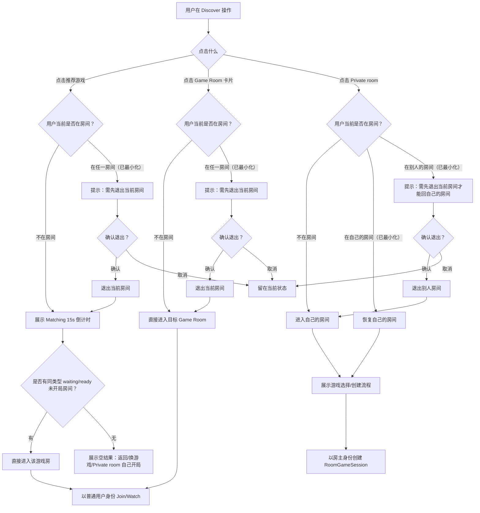
```mermaid
flowchart TD
    A["用户在 Discover 操作"] --> B{"点击什么"}

    B -->|"点击推荐游戏"| C{"用户当前是否在房间？"}
    B -->|"点击 Game Room 卡片"| D{"用户当前是否在房间？"}
    B -->|"点击 Private room"| E{"用户当前是否在房间？"}

    C -->|"不在房间"| F["展示 Matching 15s 倒计时"]
    C -->|"在任一房间（已最小化）"| G["提示：需先退出当前房间"]
    G --> H{"确认退出？"}
    H -->|"确认"| I["退出当前房间"]
    H -->|"取消"| J["留在当前状态"]
    I --> F
    F --> K{"是否有同类型 waiting/ready 未开局房间？"}
    K -->|"有"| L["直接进入该游戏房"]
    K -->|"无"| M["展示空结果：返回/换游戏/Private room 自己开局"]
    L --> N["以普通用户身份 Join/Watch"]

    D -->|"不在房间"| O["直接进入目标 Game Room"]
    D -->|"在任一房间（已最小化）"| P["提示：需先退出当前房间"]
    P --> Q{"确认退出？"}
    Q -->|"确认"| R["退出当前房间"]
    Q -->|"取消"| J
    R --> O
    O --> N

    E -->|"不在房间"| S["进入自己的房间"]
    E -->|"在自己的房间（已最小化）"| T["恢复自己的房间"]
    E -->|"在别人的房间（已最小化）"| U["提示：需先退出当前房间才能回自己的房间"]
    U --> V{"确认退出？"}
    V -->|"确认"| W["退出别人房间"]
    V -->|"取消"| J
    W --> S
    S --> X["展示游戏选择/创建流程"]
    T --> X
    X --> Y["以房主身份创建 RoomGameSession"]
```


---

## 十、待确认问题清单（修订后）

### 10.1 业务待确认项

| 编号 | 问题 | 影响 | 百顺文档是否解答 |
|---|---|---|---|
| B-01 | 游戏座位数量：是由游戏决定还是房主可配置？ | 设置页选项 | 部分解答：type=30 传 maxPlayers |
| B-02 | 百顺机器人是否接入？谁触发添加？ | 匹配速度、游戏体验 | 部分解答：is_ai 字段已支持 |
| B-03 | 每个游戏独立加载还是可预加载？ | 首屏体验 | 已解答：每个独立 download_url |
| B-04 | 游戏设置页形态（半屏/全屏）？ | 开局交互 | 未涉及（WeChill 自决） |
| B-05 | Private room 开启游戏时是否需要展示设置页？还是直接用默认配置开局？ | Private room 体验流畅度 | 未涉及 |
| B-06 | Private room 的 roomId 如何生成？是用户自己的房间 ID 吗？ | getConfig 参数 | 已解答：需传 roomId |
| B-07 | 房主退出自己房间时，游戏是否直接关闭？ | 游戏连续性 | 已裁决：playing 中不强制关闭本局，房主角色系统接管，本局结束后不展示游戏入口 |
| B-08 | 游戏中的用户可否被房主踢出房间？ | 游戏公平性、付费结算、语聊房管理权限边界 | 待业务确认；当前流程暂按“不允许踢出游戏中玩家”处理 |

### 10.2 开发待确认项

| 编号 | 问题 | 百顺文档是否解答 |
|---|---|---|
| D-01 | 各游戏 game_id | 部分（需调 API） |
| D-02 | game_list_type 取值 | 已解答（2=游戏/3=语聊房模式） |
| D-03 | 每个游戏最小/最大人数 | 部分（maxPlayers 可配） |
| D-04 | ticketSlots 取值范围 | 需确认 |
| D-05 | hideLobby 快速开始 API | 已解答（URL 参数，仅支持部分游戏） |
| D-06 | 安全区参数配置 | 已解答（game_id 以 3 开头需配） |
| D-07 | 错误码处理 | 已解答（完整错误码表） |
| D-08 | 1008 含义 | 已解答（资产不足） |

---

## 十一、竞品分析：TopTop（中东语聊房）游戏交互链路

> 基于 TopTop 竞品录屏分析，提取完整的用户路径与交互模式。TopTop 是中东市场头部语聊房产品，其休闲游戏接入方案与 WeChill 高度相关。

### 11.1 竞品与 WeChill 方案差异概览

> **说明：** TopTop 采用原生游戏包下载+浮动卡片形态，WeChill 采用全屏 H5 WebView 方案。两者技术路线不同，本章节重点参考 TopTop 的**页面跳转路径和用户交互链路**，不参考其 UI 展示形态。

| 维度 | TopTop 方案 | WeChill 方案 | 参考价值 |
|---|---|---|---|
| 游戏展示形态 | 浮动卡片（~60% 屏幕） | **全屏 H5 WebView** | 仅记录，不采用 |
| 游戏加载方式 | App 内下载游戏包（11MB） | H5 URL 直接加载 | 仅记录，不采用 |
| 页面跳转路径 | 首页→游戏详情→匹配/创建/搜索 | Discover→Game Rooms | **可参考** |
| 退出区分 | "Exit Game" vs "Close Game Mode" | 未区分 | **可参考** |
| 配置交互 | Mode+Bet 一步 Confirm | 设置页多步骤 | **可参考** |
| 最小化/召回 | Keep/Leave + 首页标签 | 浮窗+状态 | **可参考** |

### 11.2 TopTop 首页入口流程

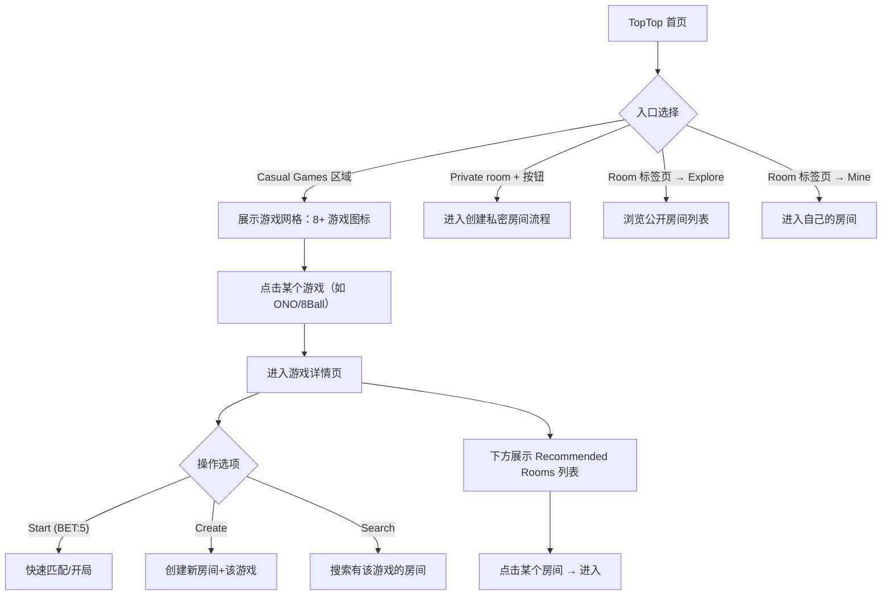
```mermaid
flowchart TD
    A["TopTop 首页"] --> B{"入口选择"}
    
    B -->|"Casual Games 区域"| C["展示游戏网格：8+ 游戏图标"]
    B -->|"Private room + 按钮"| D["进入创建私密房间流程"]
    B -->|"Room 标签页 → Explore"| E["浏览公开房间列表"]
    B -->|"Room 标签页 → Mine"| F["进入自己的房间"]
    
    C --> G["点击某个游戏（如 ONO/8Ball）"]
    G --> H["进入游戏详情页"]
    H --> I{"操作选项"}
    I -->|"Start (BET:5)"| J["快速匹配/开局"]
    I -->|"Create"| K["创建新房间+该游戏"]
    I -->|"Search"| L["搜索有该游戏的房间"]
    
    H --> M["下方展示 Recommended Rooms 列表"]
    M --> N["点击某个房间 → 进入"]
```

### 11.3 房间内开启游戏流程（房主视角）

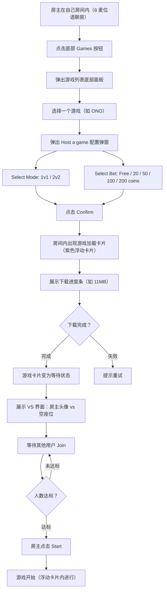
```mermaid
flowchart TD
    A["房主在自己房间内（8 麦位语聊房）"] --> B["点击底部 Games 按钮"]
    B --> C["弹出游戏列表底部面板"]
    C --> D["选择一个游戏（如 ONO）"]
    D --> E["弹出 Host a game 配置弹窗"]
    
    E --> F["Select Mode: 1v1 / 2v2"]
    E --> G["Select Bet: Free / 20 / 50 / 100 / 200 coins"]
    F --> H["点击 Confirm"]
    G --> H
    
    H --> I["房间内出现游戏加载卡片（紫色浮动卡片）"]
    I --> J["展示下载进度条（如 11MB）"]
    J --> K{"下载完成？"}
    K -->|"完成"| L["游戏卡片变为等待状态"]
    K -->|"失败"| M["提示重试"]
    
    L --> N["展示 VS 界面：房主头像 vs 空座位"]
    N --> O["等待其他用户 Join"]
    O --> P{"人数达标？"}
    P -->|"达标"| Q["房主点击 Start"]
    P -->|"未达标"| O
    Q --> R["游戏开始（浮动卡片内进行）"]
```

### 11.4 TopTop 的 UI 形态记录（仅作参考记录，WeChill 不采用）

> TopTop 采用浮动卡片样式展示游戏，此为其原生游戏包的实现方式。WeChill 采用全屏 H5 方案，不使用此形态。

```
TopTop UI结构（仅记录）：
┌─────────────────────────────────────┐
│  房间顶部：公告栏 / 房间名称          │
│  麦位区域（8 个麦位，始终可见）        │
│  ┌───────────────────────────────┐  │
│  │    游戏浮动卡片（~60%屏幕）     │  │
│  └───────────────────────────────┘  │
│  聊天消息区域（始终可见）              │
│  底部操作栏（始终可见）                │
└─────────────────────────────────────┘

WeChill UI结构（我们的方案）：
┌─────────────────────────────────────┐
│                                     │
│      全屏 H5 WebView 游戏界面        │
│      （覆盖整个屏幕）                 │
│      含最小化/退出按钮                │
│                                     │
└─────────────────────────────────────┘
→ 最小化后回到语聊房界面
```

### 11.5 "Exit Game" vs "Close Game Mode" 的区别

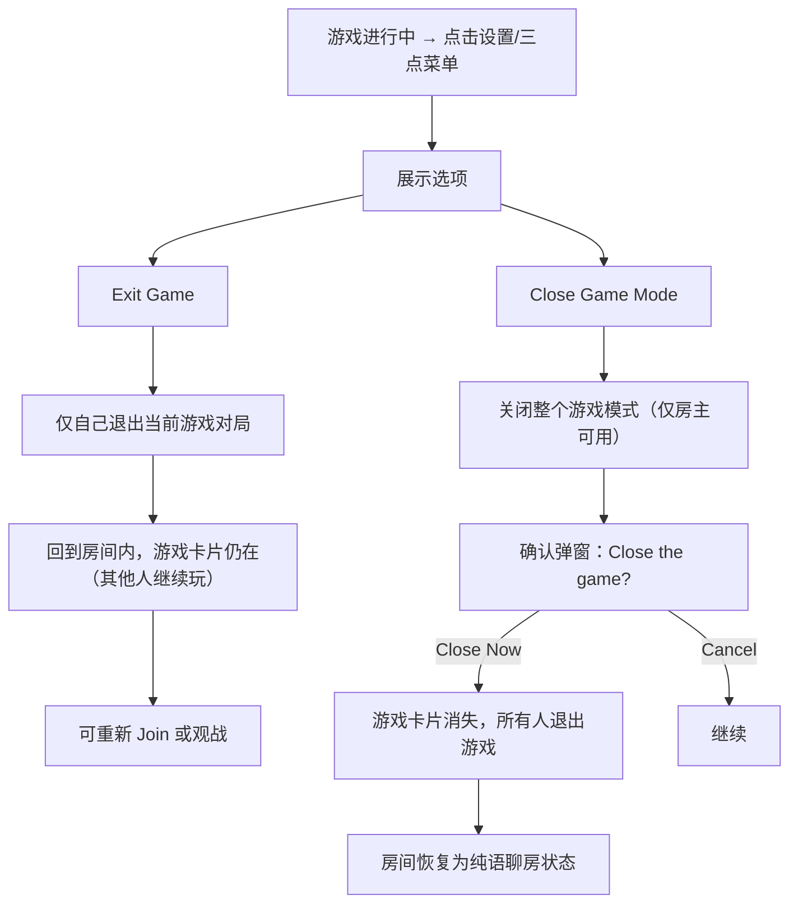
```mermaid
flowchart TD
    A["游戏进行中 → 点击设置/三点菜单"] --> B["展示选项"]
    
    B --> C["Exit Game"]
    B --> D["Close Game Mode"]
    
    C --> E["仅自己退出当前游戏对局"]
    E --> F["回到房间内，游戏卡片仍在（其他人继续玩）"]
    F --> G["可重新 Join 或观战"]
    
    D --> H["关闭整个游戏模式（仅房主可用）"]
    H --> I["确认弹窗：Close the game?"]
    I -->|"Close Now"| J["游戏卡片消失，所有人退出游戏"]
    I -->|"Cancel"| K["继续"]
    J --> L["房间恢复为纯语聊房状态"]
```

**对 WeChill 的启示：**
- 需要区分"退出游戏"（个人行为）和"关闭游戏房"（房主管理行为）
- "Exit Game" = 普通用户/房主退出当前对局，但游戏模式仍保持
- "Close Game Mode" = 房主关闭整个游戏模式，恢复普通房间

### 11.6 退出房间时的处理

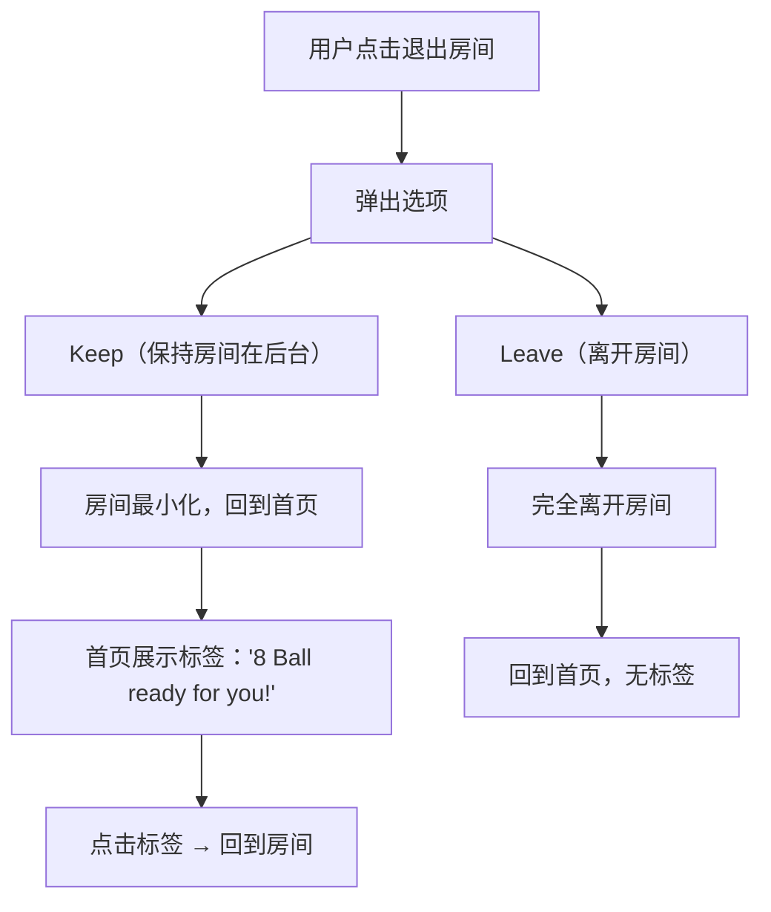
```mermaid
flowchart TD
    A["用户点击退出房间"] --> B["弹出选项"]
    B --> C["Keep（保持房间在后台）"]
    B --> D["Leave（离开房间）"]
    
    C --> E["房间最小化，回到首页"]
    E --> F["首页展示标签：'8 Ball ready for you!'"]
    F --> G["点击标签 → 回到房间"]
    
    D --> H["完全离开房间"]
    H --> I["回到首页，无标签"]
```

### 11.7 TopTop 用户完整路径总结

**路径 1：首页 → 游戏详情 → 快速匹配**
```
首页 Casual Games → 选游戏 → 游戏详情页 → Start(BET:5) → 自动匹配房间
```

**路径 2：首页 → 游戏详情 → 加入推荐房间**
```
首页 Casual Games → 选游戏 → 游戏详情页 → Recommended Rooms → 选择房间 → Join
```

**路径 3：首页 → 私密房间 → 开启游戏**
```
首页 Private room+ → 选择游戏 → 进入自己房间 → Host a game配置 → Confirm → 等待
```

**路径 4：房间内 → 开启游戏（房主）**
```
在自己房间 → Games面板 → 选游戏 → Host a game → 设置Mode+Bet → Confirm → 等待 → Start
```

**路径 5：房间内 → 加入游戏（普通用户）**
```
在别人房间 → 看到游戏卡片 → Join → 等待 → 游戏开始
```

### 11.8 可参考的页面跳转路径与交互模式

| 维度 | TopTop 做法 | WeChill 可参考点 |
|---|---|---|
| **页面跳转** | 首页→游戏详情页→快速开始/创建/搜索/推荐房间 | 参考：增加游戏详情聚合页，汇集该游戏的活跃房间列表 |
| **配置交互** | Host a game 时 Mode+Bet 一步 Confirm | 参考：精简配置步骤，减少用户决策负担 |
| **退出机制** | Exit Game（退本局）/ Close Game Mode（关游戏房）分离 | **参考采用**：区分个人退出 vs 房主关闭 |
| **最小化** | Keep/Leave选项，首页标签"8 Ball ready for you!" | 参考：增加最小化召回文案 |
| **游戏入口** | 首页游戏网格 + 游戏详情页 + Recommended Rooms | 参考：TopTop 多了游戏详情页作为中间层 |
| **状态提示** | 右侧浮动图标（游戏徽章/机器人） | 参考：增加游戏状态的视觉提示 |

### 11.9 基于竞品页面路径的设计参考点

| 编号 | 参考点 | 说明 | 建议 |
|---|---|---|---|
| C-01 | "Exit Game" vs "Close Game Mode" | 区分退出本局和关闭游戏房两种操作 | **建议采用**：提升管理灵活性 |
| C-02 | 游戏详情聚合页 | 点击游戏后先进入详情页（含快速开始/创建/搜索/活跃房间列表） | **建议增加**：提升匹配效率 |
| C-03 | 配置一步完成 | Mode+Bet 选择后一键 Confirm | **建议精简**：降低用户开局门槛 |
| C-04 | 最小化召回文案 | 首页展示"xxx game ready for you"标签引导回到游戏 | **建议增加** |
| C-05 | 游戏状态视觉提示 | 房间内展示游戏进行中的状态图标 | **建议增加** |

---

## 十二、竞品分析：Hawa（中东语聊房）游戏交互链路

> 基于 Hawa 竞品录屏分析（72秒），提取完整的用户路径与交互模式。Hawa 是中东市场语聊房+社交产品，其休闲游戏接入方案在入口路径、自动匹配、游戏内循环方面有独特设计。

### 12.1 Hawa 产品概述

| 维度 | 说明 |
|---|---|
| 产品定位 | 中东语聊房+社交产品 |
| 支持游戏 | Jackaroo(578人)、UNO(665人)、Carrom Pool(622人)、PK(120人)、Ludo(128人) |
| 覆盖地区 | SA(沙特)、YE(也门)、QA(卡塔尔)、AE(阿联酋) |
| 页面结构 | Home / Discover / Moment / Message / Me |
| 房间麦位 | 10麦位(5×2网格) |

### 12.2 Hawa 与 WeChill 方案差异概览

> **说明：** Hawa 在游戏模式下会改变房间 UI 结构（麦位缩小+游戏占据中心区域），WeChill 采用全屏 H5 WebView 方案。本章节重点参考 Hawa 的**页面入口路径、自动匹配机制、游戏内循环设计**。

| 维度 | Hawa 方案 | WeChill 方案 | 参考价值 |
|---|---|---|---|
| 游戏展示形态 | 房间 UI 重构（麦位缩小+游戏居中） | **全屏 H5 WebView** | 仅记录，不采用 |
| 游戏加载方式 | H5加载+进度条(0%→100%) | H5 URL 直接加载 | **可参考**：增加加载进度提示 |
| Discover入口 | 自动匹配（倒计时+Cancel） | Game Room列表 | **可参考**：增加自动匹配入口 |
| 房内入口 | 游戏手柄按钮→Mini Game面板 | Games面板 | 类似，可对齐 |
| 游戏结果 | WIN/OUT卡片+自动返回倒计时(7s) | 未定义 | **可参考** |
| 自动下一局 | 倒计时结束自动加载下局 | 未设计 | **可参考** |
| 房间最小化 | 通知Banner+全页面持续 | 浮窗 | **可参考** |
| Home页游戏标识 | 房间卡片显示游戏Badge | 未设计 | **可参考** |

### 12.3 Hawa Discover入口：自动匹配流程

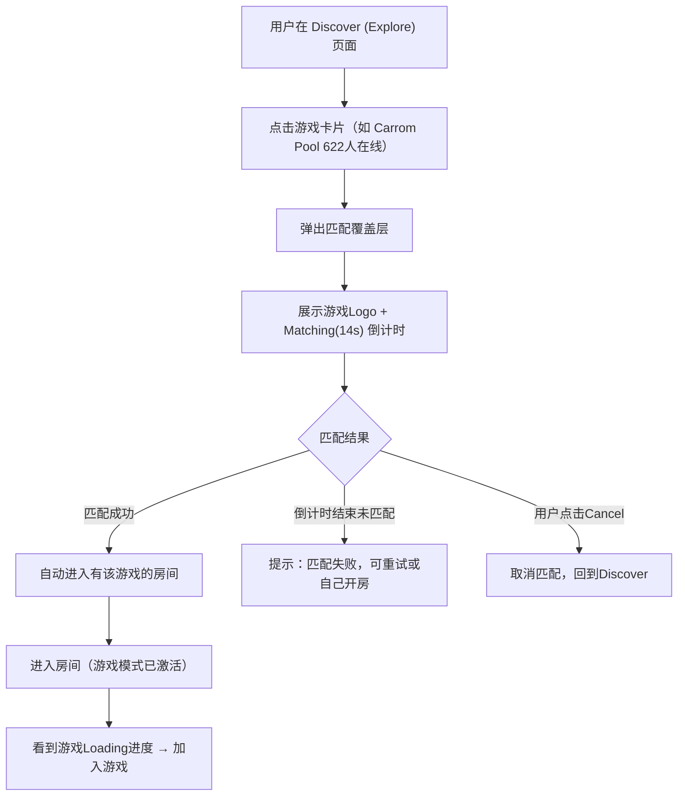
```mermaid
flowchart TD
    A["用户在 Discover (Explore) 页面"] --> B["点击游戏卡片（如 Carrom Pool 622人在线）"]
    B --> C["弹出匹配覆盖层"]
    C --> D["展示游戏Logo + Matching(14s) 倒计时"]
    D --> E{"匹配结果"}
    E -->|"匹配成功"| F["自动进入有该游戏的房间"]
    E -->|"倒计时结束未匹配"| G["提示：匹配失败，可重试或自己开房"]
    E -->|"用户点击Cancel"| H["取消匹配，回到Discover"]
    F --> I["进入房间（游戏模式已激活）"]
    I --> J["看到游戏Loading进度 → 加入游戏"]
```

**关键设计细节：**
- 匹配覆盖层在 Discover 页面上方弹出，不跳转页面
- 倒计时从14s开始递减（13s、12s...）
- 可随时Cancel取消
- 匹配成功后直接进入目标房间的游戏模式

### 12.4 Hawa 房内入口：Mini Game 面板开启游戏

```mermaid
flowchart TD
    A["房主在自己房间内（10麦位）"] --> B["点击底部游戏手柄图标"]
    B --> C["弹出 Mini Game 面板（游戏网格）"]
    C --> D["选择一个游戏（如 Carrom Pool）"]
    D --> E["弹出游戏配置弹窗"]
    
    E --> F["人数选择：2-4 players"]
    E --> G["Match players 开关"]
    E --> H["Auto-next-round 选项"]
    F --> I["点击 Create"]
    G --> I
    H --> I
    
    I --> J["房间 UI 转变为游戏模式"]
    J --> K["麦位缩小为顶部紧凑横排"]
    J --> L["游戏Logo占据中心区域"]
    J --> M["4个邀请+槽位显示"]
    J --> N["自动发送聊天消息：I created Carrom Pool, come and join"]
    
    M --> O{"等待其他玩家加入"}
    O -->|"人数达标"| P["房主点击 Start"]
    O -->|"未达标"| Q["继续等待/匹配"]
    P --> R["游戏开始加载 Loading(0%→100%)"]
```

**配置弹窗核心要素：**
| 配置项 | 选项 | 说明 |
|---|---|---|
| 人数 | 2-4 players | 滑动选择 |
| Match players | 开关toggle | 是否自动匹配陌生人加入 |
| Auto-next-round | 勾选框 | 一局结束后自动开下一局 |

### 12.5 Hawa 游戏加载与进行流程

```mermaid
flowchart TD
    A["游戏创建完成"] --> B["Loading 进度条显示"]
    B --> C["0% → 10% → 40% → 80% → 91% → 94% → 100%"]
    C --> D["加载期间："]
    D --> E["其他用户可继续加入房间"]
    D --> F["房间聊天保持活跃"]
    D --> G["礼物动画可正常播放"]
    D --> H["麦位用户发言有紫色高亮提示"]
    C --> I["加载完成 → 游戏正式开始"]
    I --> J["游戏进行中（全屏游戏区域）"]
```

### 12.6 Hawa 游戏结果与自动下一局

```mermaid
flowchart TD
    A["游戏结束"] --> B["展示 WIN/OUT 结果卡片"]
    B --> C["WIN 标题 + 星星庆祝动效"]
    B --> D["玩家列表：Winner=Win + 🏆, Loser=Out + 😞"]
    B --> E["Return on (7s) 倒计时按钮"]
    
    E --> F["7s → 6s → 5s → 4s → 3s → 2s → 1s"]
    F --> G{"倒计时结束"}
    G -->|"Auto-next-round 开启"| H["自动加载下一局"]
    G -->|"Auto-next-round 关闭"| I["返回游戏大厅/房间"]
    
    H --> J["Loading (10%) → 新一局"]
    J --> K["游戏循环继续"]
```

**关键设计：7秒倒计时自动返回**
- 倒计时期间用户可手动点击立即返回
- 如果开启了 Auto-next-round，倒计时结束后直接进入下一局
- 无需房主手动操作，形成连续游戏循环

### 12.7 Hawa 房间最小化与跨页面持续

```mermaid
flowchart TD
    A["用户在游戏房中"] --> B["点击向下箭头(∨)/最小化"]
    B --> C["房间最小化"]
    C --> D["通知Banner持续显示在页面顶部"]
    
    D --> E{"用户导航到其他页面"}
    E -->|"Discover页"| F["游戏加载进度作为覆盖层持续显示"]
    E -->|"Home页"| G["顶部Banner保持，房间状态可见"]
    E -->|"任何页面"| H["顶部通知Banner始终保持"]
    
    F --> I["点击覆盖层/Banner → 返回游戏房"]
    G --> I
    H --> I
    
    I --> J["恢复游戏状态"]
```

**与TopTop对比：**
- TopTop：Keep/Leave选项 + 首页标签
- Hawa：持续顶部Banner + 游戏覆盖层跟随导航
- Hawa 的方案更强势：游戏/房间状态始终可见，不会被遗忘

### 12.8 Hawa Home页游戏发现机制

```mermaid
flowchart TD
    A["用户在 Home 页面"] --> B["Recent/Following 标签切换"]
    B --> C["房间卡片网格展示"]
    C --> D{"房间是否有游戏进行中"}
    D -->|"有"| E["卡片显示游戏Badge（如'Carrom'红色标签）"]
    D -->|"无"| F["普通房间卡片"]
    E --> G["用户可快速识别哪些房间在玩游戏"]
    G --> H["点击卡片 → 进入游戏房"]
```

**Home页房间卡片信息：**
| 元素 | 说明 |
|---|---|
| 房间封面 | 房主头像/房间图片 |
| 游戏Badge | 红色标签如"Carrom"（仅游戏房显示） |
| 在线人数 | 如"125"/"71" |
| 房间名 | 如"لمة أحباب" |
| 国旗标识 | 如🇸🇦(沙特) |
| Friends标签 | 好友房间标识 |

### 12.9 Hawa 结束游戏确认流程

```mermaid
flowchart TD
    A["房主点击结束游戏（电源图标）"] --> B["弹出确认弹窗"]
    B --> C["Are you sure you want to end this game session?"]
    C --> D{"选择"}
    D -->|"Yes"| E["结束游戏Session"]
    D -->|"Cancel"| F["继续游戏"]
    E --> G["房间恢复普通语聊房状态"]
    G --> H["10麦位重新展示为5×2网格"]
```

### 12.10 Hawa 用户完整路径总结

**路径 1：Discover 自动匹配（最快进入）**
```
Discover → 点击游戏卡片(如Carrom 622人) → Matching(14s)倒计时 → 自动匹配进入游戏房
```

**路径 2：Home页发现游戏房**
```
Home → 看到带游戏Badge的房间卡片 → 点击进入 → 加入游戏
```

**路径 3：自己房间开启游戏（房主）**
```
进入自己房间 → 游戏手柄按钮 → Mini Game面板 → 选游戏 → 配置(人数+匹配+自动下一局) → Create → 等待 → Start
```

**路径 4：在别人房间加入游戏**
```
在别人房间 → 看到游戏模式UI → Join → 等待 → 游戏开始
```

**路径 5：游戏结果→自动循环**
```
游戏结束 → WIN/OUT卡片 → Return on(7s)倒计时 → 自动下一局 → Loading → 继续游戏
```

---

## 十三、竞品路径整合 & WeChill 游戏房优化方案

> 基于 TopTop 和 Hawa 两个中东语聊房竞品的交互链路分析，整合双方优势设计，优化 WeChill 游戏房全屏 H5 方案的页面路径与交互体验。核心保持不变：**全屏 H5 WebView + 三方休闲游戏（Bytesun）接入**。

### 13.1 两个竞品核心优势对比

| 设计维度 | TopTop 优势 | Hawa 优势 | WeChill 整合建议 |
|---|---|---|---|
| 入口层级 | 游戏详情聚合页（Start/Create/Search/Rooms） | Discover自动匹配（一键+倒计时） | **结合**：游戏详情页+快速匹配按钮 |
| 配置交互 | Mode+Bet一步Confirm | 人数+Match toggle+Auto-next | **结合**：极简配置+自动下一局选项 |
| 退出机制 | Exit Game / Close Game Mode 分离 | End game session 确认弹窗 | **采用TopTop**：区分退局/关房 |
| 结果展示 | 未展示 | WIN/OUT卡片+7s自动返回 | **采用Hawa**：结果卡+自动返回 |
| 游戏循环 | 未展示 | Auto-next-round 连续循环 | **采用Hawa**：支持自动下一局 |
| 最小化 | Keep/Leave+首页标签 | 持续Banner+覆盖层跨页面 | **整合**：浮窗+状态文案召回 |
| 游戏发现 | 游戏详情页Recommended Rooms | Home卡片游戏Badge | **采用Hawa**：房间卡片增加游戏标识 |
| 加载体验 | 下载进度(11MB) | Loading百分比(0%→100%) | **采用Hawa**：H5加载进度展示 |

### 13.2 优化后的 WeChill Discover 入口（整合版）

```mermaid
flowchart TD
    A["用户在 Discover 页面"] --> B{"入口选择"}
    
    B -->|"点击推荐游戏卡片"| C["进入游戏详情聚合页（参考TopTop）"]
    B -->|"点击 Game Room 卡片"| D["直接进入该游戏房"]
    B -->|"点击 Quick Match 按钮"| E["自动匹配流程（参考Hawa）"]
    
    C --> F["游戏详情聚合页内容："]
    F --> G["① Quick Match（倒计时自动匹配）"]
    F --> H["② Create（Private room开局）"]
    F --> I["③ Active Rooms列表（正在进行的游戏房）"]
    
    G --> J["展示匹配覆盖层：Matching(15s)+Cancel"]
    J --> K{"匹配结果"}
    K -->|"成功"| L["进入匹配到的游戏房"]
    K -->|"超时"| M["提示：未找到合适房间"]
    M --> N["引导：自己开局 / 选择Active Room"]
    K -->|"取消"| O["返回游戏详情页"]
    
    H --> P["进入自己房间 → 开启该游戏"]
    I --> Q["选择房间 → 以普通用户进入"]
    
    L --> R["以普通用户身份进入游戏房（全屏H5）"]
    Q --> R
```

### 13.3 优化后的游戏配置页（整合版）

```mermaid
flowchart TD
    A["房主选择游戏后"] --> B["展示极简配置页（一屏完成）"]
    
    B --> C["① 人数模式：1v1 / 2v2 / 多人"]
    B --> D["② 门票：Free / 10 / 50 / 100 / 200"]
    B --> E["③ Match players：开/关（是否自动匹配）"]
    B --> F["④ Auto-next-round：开/关"]
    
    C --> G["一键 Start/Create 按钮"]
    D --> G
    E --> G
    F --> G
    
    G --> H["预扣门票 → 创建Session → 加载H5"]
    H --> I["全屏H5展示Loading进度(0%→100%)"]
    I --> J["gameLoaded → 进入waiting状态"]
```

**设计来源：**
- 人数模式精简（参考TopTop的Mode选项卡）
- Match players开关（参考Hawa的Match toggle）
- Auto-next-round（参考Hawa的自动下一局勾选）
- 一键完成（参考TopTop的单Confirm按钮）

### 13.4 优化后的游戏结果与循环流程

```mermaid
flowchart TD
    A["游戏结束（收到type=14）"] --> B["全屏展示结算结果卡片"]
    B --> C["展示：胜负/排名/奖励/得分"]
    B --> D["底部按钮：Return(Xs) 倒计时"]
    
    D --> E["倒计时 7s → 0s"]
    E --> F{"Auto-next-round 设置"}
    F -->|"开启"| G["自动开始下一局"]
    F -->|"关闭"| H["返回游戏大厅/等待态"]
    
    G --> I["自动预扣门票（如余额充足）"]
    I --> J{"预扣结果"}
    J -->|"成功"| K["Loading下一局 → 游戏开始"]
    J -->|"余额不足"| L["提示充值 → 返回等待态"]
    
    H --> M["房主可选择：再来一局 / 换游戏 / Close Game Mode"]
    
    E --> N["用户可随时手动点击Return提前返回"]
    N --> F
```

**关键设计决策：**
- 7秒倒计时（参考Hawa的7s Return on设计）
- Auto-next-round时自动预扣门票（原创：结合Bytesun预扣机制）
- 倒计时期间可手动提前返回

### 13.5 优化后的退出机制（两层退出）

```mermaid
flowchart TD
    A["用户在游戏中想退出"] --> B{"用户身份"}
    
    B -->|"普通用户"| C["展示：Exit Game"]
    B -->|"房主"| D["展示：Exit Game + Close Game Mode"]
    
    C --> E["Exit Game：退出当前对局"]
    E --> F["回到全屏H5的观战/等待态"]
    F --> G["可重新Join或继续观战"]
    
    D --> H{"选择"}
    H -->|"Exit Game"| I["房主退出本局"]
    H -->|"Close Game Mode"| J["弹窗：确认关闭游戏？所有人将退出"]
    
    I --> K["房主变为观战/等待态"]
    K --> L["游戏继续（其他人还在玩）"]
    L --> M["房主可重新Join下一局"]
    
    J --> N{"确认"}
    N -->|"Yes"| O["关闭游戏Session → 所有人退出H5"]
    N -->|"Cancel"| P["继续"]
    O --> Q["房间恢复纯语聊房状态"]
```

### 13.6 优化后的最小化召回机制

```mermaid
flowchart TD
    A["用户最小化游戏/房间"] --> B["全屏H5收起"]
    B --> C["回到语聊房界面或Discover"]
    C --> D["展示浮窗：游戏状态+游戏名"]
    
    D --> E["浮窗文案规则"]
    E --> F["waiting：'Carrom Pool - Waiting for players'"]
    E --> G["playing：'Carrom Pool - Playing...'"]
    E --> H["ended：'Carrom Pool - Finished!'"]
    
    D --> I{"用户继续导航到其他页面"}
    I --> J["浮窗始终保持可见"]
    J --> K["点击浮窗 → 恢复游戏全屏"]
    
    D --> L["补充：Discover/Home页面增加状态标签"]
    L --> M["如：'Carrom Pool game ready for you!'"]
```

### 13.7 优化后的游戏房发现机制

```mermaid
flowchart TD
    A["提升游戏房可发现性"] --> B{"优化位置"}
    
    B -->|"Discover页面"| C["Game Room卡片增加："]
    C --> C1["游戏图标标识"]
    C --> C2["当前在线人数"]
    C --> C3["游戏状态：Waiting/Playing"]
    
    B -->|"Home页面"| D["房间卡片增加（参考Hawa）："]
    D --> D1["游戏Badge（红色标签如'Carrom'）"]
    D --> D2["在线人数"]
    
    B -->|"推送通知"| E["好友开启游戏时推送："]
    E --> E1["xxx 开始了 Carrom Pool，快来加入"]
```

### 13.8 优化后的 H5 加载体验

```mermaid
flowchart TD
    A["全屏H5开始加载"] --> B["展示加载占位页面"]
    B --> C["游戏Logo + 进度条 + 百分比(0%→100%)"]
    C --> D["加载期间可展示："]
    D --> E["游戏规则简介/Tips"]
    D --> F["房间聊天消息（底部可折叠）"]
    D --> G["语音通话保持（RTC不中断）"]
    
    C --> H{"加载结果"}
    H -->|"成功"| I["无缝进入游戏界面"]
    H -->|"超时(30s)"| J["展示重试按钮"]
    H -->|"失败"| K["提示网络异常 → 重试/退出"]
```

### 13.9 WeChill 优化后完整路径总结

**路径 1：Discover → 快速匹配（最快路径，参考Hawa）**
```
Discover → 点击游戏卡片 → 游戏详情聚合页 → Quick Match → Matching(15s) → 自动进入游戏房(全屏H5)
```

**路径 2：Discover → 选择Game Room（稳定路径，原有方案优化）**
```
Discover → 点击游戏卡片 → 游戏详情聚合页 → Active Rooms列表 → 选择房间 → 进入(全屏H5)
```

**路径 3：Private room（房主自开，原有方案+配置优化）**
```
Private room → 进入自己房间 → Games面板 → 选游戏 → 极简配置(Mode+Bet+Match+AutoNext) → Start → Loading → 全屏H5
```

**路径 4：房内Games面板（房主已在房间，原有方案）**
```
已在自己房间 → Games面板 → 选游戏 → 极简配置 → Start → 全屏H5
```

**路径 5：Home页发现游戏房（新增，参考Hawa）**
```
Home → 看到带游戏Badge的房间卡片 → 点击 → 进入游戏房(全屏H5)
```

**路径 6：游戏内循环（新增，参考Hawa Auto-next）**
```
游戏结束 → 结果卡片(7s倒计时) → 自动下一局 → Loading → 继续游戏 → ...循环
```

### 13.10 优化项汇总与优先级

| 编号 | 优化项 | 来源竞品 | 优先级 | 说明 |
|---|---|---|---|---|
| O-01 | 游戏详情聚合页 | TopTop | P1 | 作为Discover→游戏的中间层 |
| O-02 | Quick Match自动匹配 | Hawa | P1 | 倒计时+Cancel，最快进入路径 |
| O-03 | Exit Game / Close Game Mode分离 | TopTop | P0 | 核心退出逻辑变更 |
| O-04 | 游戏结果卡片+自动返回倒计时 | Hawa | P1 | 7s倒计时Return |
| O-05 | Auto-next-round自动下一局 | Hawa | P1 | 配置项+自动循环机制 |
| O-06 | 极简配置页（一屏一键） | TopTop+Hawa | P1 | Mode+Bet+Match+AutoNext |
| O-07 | Home页房间卡片游戏Badge | Hawa | P2 | 提升游戏房发现率 |
| O-08 | H5加载进度展示 | Hawa | P1 | Loading(x%)进度条 |
| O-09 | 最小化召回文案 | TopTop+Hawa | P2 | "xxx game ready for you" |
| O-10 | Match players开关 | Hawa | P2 | 控制是否自动匹配陌生人 |

---

*文档修订完毕（含双竞品分析+整合优化方案）*
