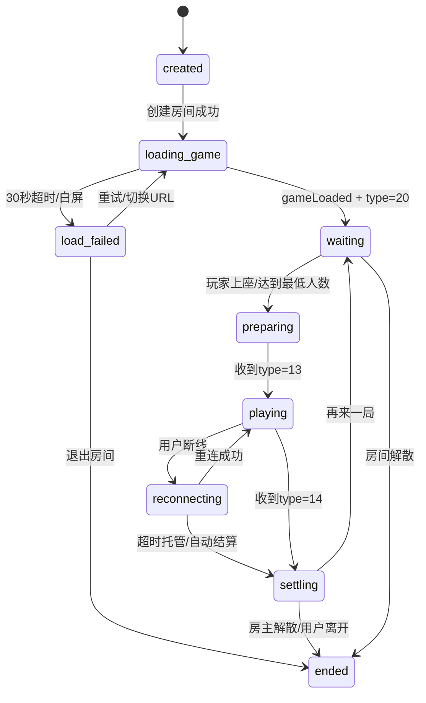
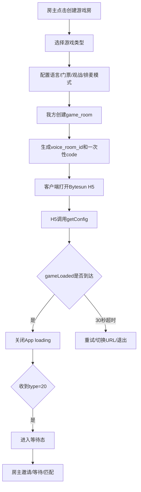
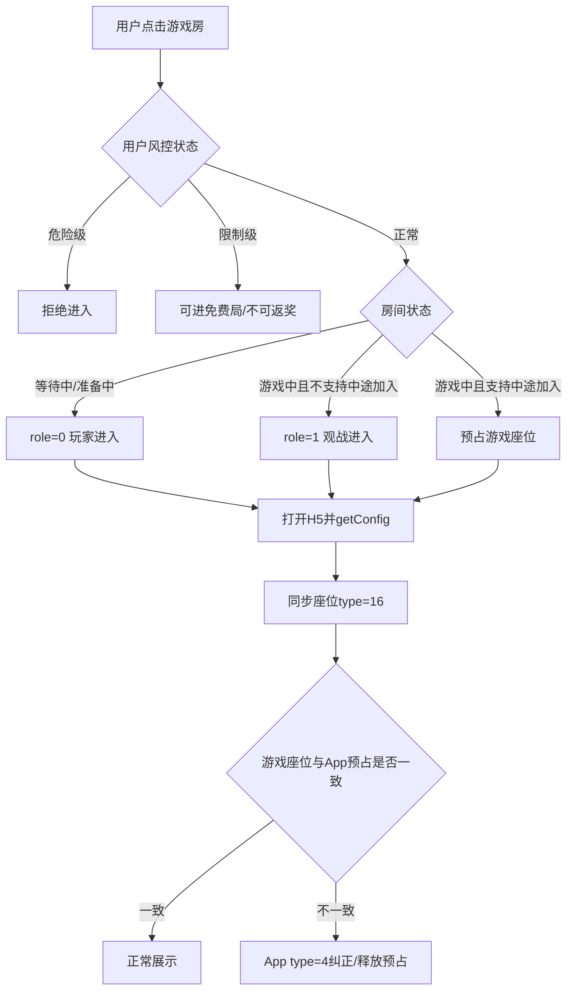
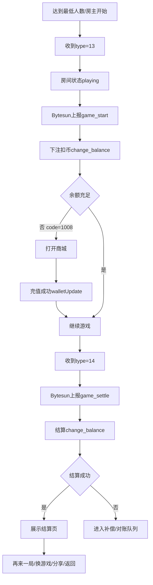
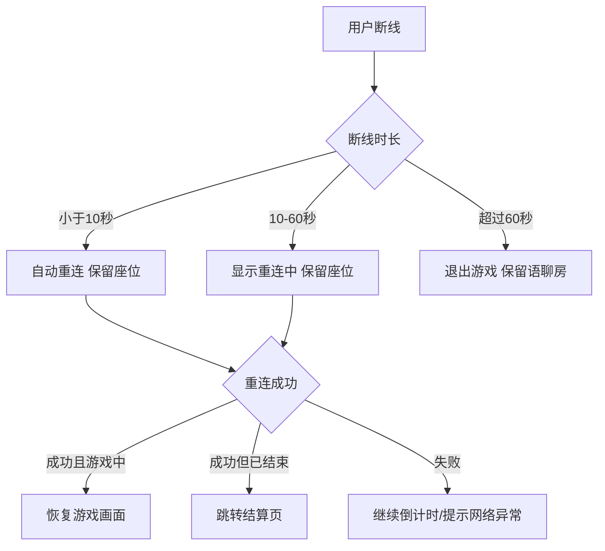
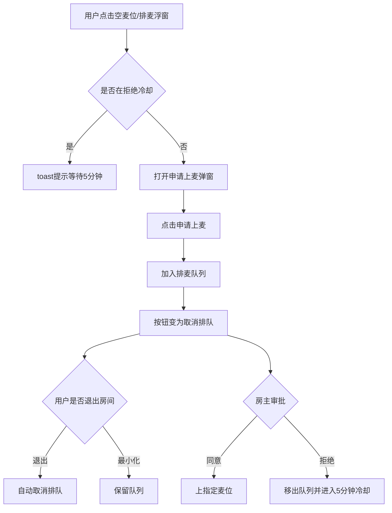
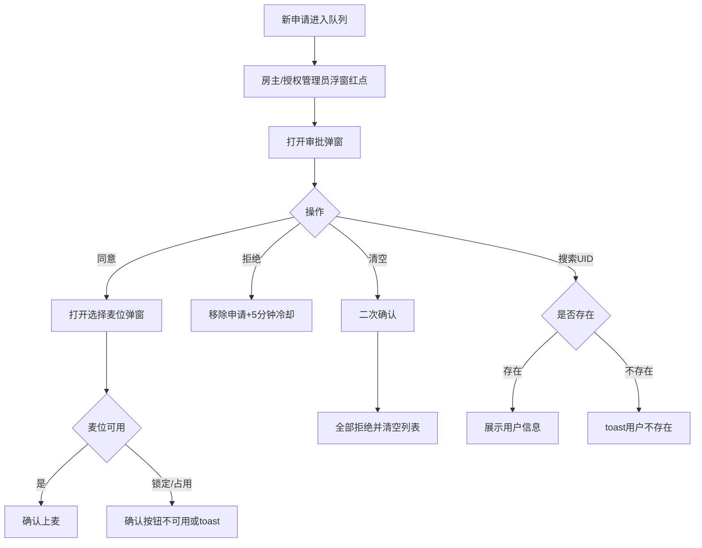
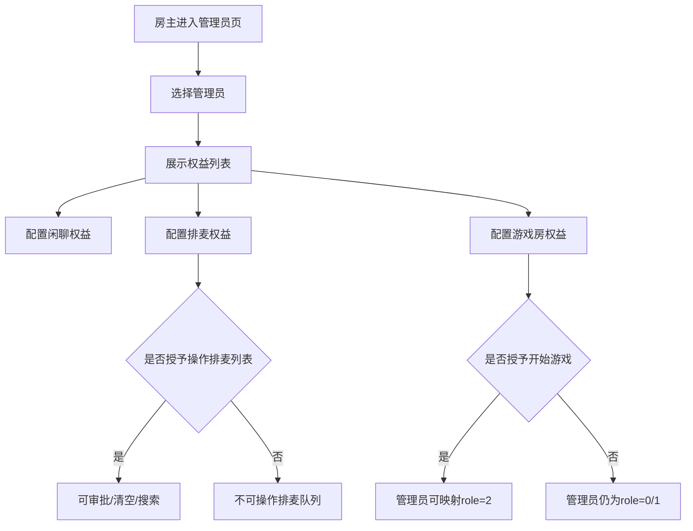
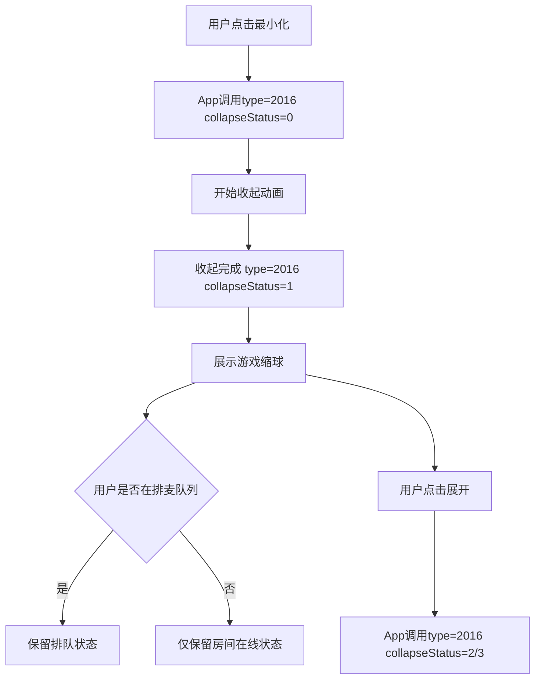

# 游戏房 PRD 评审框架 v1.1（补全版）

生成日期：2026-04-22  
面向区域：MENA / 中东语聊房  
三方能力：BytesunGame 语聊房模式 v1.0.7  
本版重点：结合 `wechill-游戏房产品设计文档PRD-v3.0.md`，补齐遗漏的流程图、场景、条件，并参考 `排麦模式.pdf` 补全游戏房内的语聊麦位、排麦、管理员权益和客户端前台设计。

## 0. 本版补全说明

v3.0 PRD 已经覆盖产品定位、房间类型、Bytesun 接入、随机匹配、现有玩法融合、后台、数据模型和验收。  
本版主要补齐 v3.0 中偏弱的客户端执行细节：

- 游戏座位和语聊麦位的关系。
- 游戏房使用排麦模式时的用户、房主、管理员视角。
- 排麦浮窗、红点、申请、审批、选择麦位、拒绝冷却、清空队列、即时刷新。
- 管理员在排麦模式下新增权益。
- 创建、进入、上座、上麦、匹配、结算、断线重连、异常处理流程图。
- 客户端原型页清单和每页关键元素。
- 测试验收条件和埋点补充。

## 1. 产品核心结论

### 1.1 游戏房定位

游戏房是语聊房的一个房间类别，不是独立游戏大厅。

核心表达：

> 游戏房 = 语音社交 + 轻量游戏组局。游戏负责破冰，语音负责留存，房间负责关系沉淀。

我方负责：

- 房间创建、房间推荐、语聊麦位、排麦队列、用户角色、风控、钱包、礼物、聊天、匹配、数据。

Bytesun 负责：

- H5 游戏、局内规则、游戏座位、开始/结束、局内结算结果、局内座位事件。

### 1.2 两类座位必须拆开

| 对象 | 含义 | 来源 | 是否等同 |
| --- | --- | --- | --- |
| 游戏座位 | 是否参与本局 Ludo / UNO / Domino。 | Bytesun H5 的 `type=15` / `type=16` 或 App `type=4`。 | 不等同语聊麦位。 |
| 语聊麦位 | 是否能在房间里发声。 | 我方语聊房麦位系统，可使用排麦模式管理。 | 不等同游戏座位。 |

规则：

- 用户坐上游戏座位，不代表自动上语聊麦。
- 用户上了语聊麦，也不代表自动参与游戏。
- 游戏中可允许观众申请上麦发言，但不自动成为玩家。
- 游戏座位冲突优先保证 Bytesun 局内一致性；语聊麦位冲突以 App 麦位状态为准。

## 2. 房间类型与前台入口

### 2.1 房间分类

| 房间类型 | 说明 | V1 支持 |
| --- | --- | --- |
| 纯语聊房 | 原有语音聊天，无游戏。 | 已有能力 |
| 游戏房 | 创建时固定一个游戏，游戏驱动 + 语音互动。 | 支持 |
| 混合房 | 普通语聊房内临时开启小游戏。 | 基础支持 |
| 专用房 | 单一游戏深度运营，如排位、锦标赛。 | 后续 |

### 2.2 前台入口

| 入口 | 位置 | 版本 | 说明 |
| --- | --- | --- | --- |
| 游戏 Tab | 首页一级 Tab | V1 | 游戏房主入口。 |
| 房间列表分类 | 原语聊房列表 | V1 | 新增“游戏”分类。 |
| 房内开启游戏 | 普通语聊房功能面板 | V1 | 房主将当前语聊房切为混合房。 |
| 好友邀请卡 | 私聊/好友在线提示 | V1.1 | 点击进入指定游戏房。 |
| WhatsApp 分享 | 房间分享和结算页 | V1.1 | 生成阿语 RTL 分享卡。 |
| 随机匹配 | 游戏 Tab 顶部 | V2 | 平台匹配队列。 |

### 2.3 游戏 Tab 页面结构

页面模块：

- 顶部 banner：Ludo / UNO 主推。
- 快捷入口：快速匹配、创建游戏房、最近玩过。
- 分类筛选：全部、Ludo、UNO、Domino、你画我猜、可观战。
- 房间卡片：
  - 游戏 icon。
  - 房间名。
  - 游戏名。
  - 当前玩家数 / 最大人数。
  - 观众数。
  - 状态：等待中、准备中、游戏中、可观战。
  - 语言 / 地区。
  - 门票档位 / 免费。
  - 好友在房标识。

## 3. 房间状态与流程图

### 3.1 游戏房状态机

### 3.2 创建游戏房流程

### 3.3 加入游戏房流程

### 3.4 开局与结算流程

### 3.5 断线重连流程

## 4. 排麦模式在游戏房中的产品规则

### 4.1 默认策略

建议游戏房默认支持排麦模式，尤其是公开房和观战人数较多的房间。

原因：

- 游戏中同时多人自由上麦会干扰局内体验。
- 房主需要控制发言秩序。
- 观战用户仍有表达诉求，需要通过申请上麦释放互动。

### 4.2 排麦入口

| 项 | 规则 |
| --- | --- |
| 切换入口 | 房主在创建房间或房间功能面板中切换。 |
| 房间类型顺序 | 闲聊、排麦模式、放映厅；游戏房创建页单独展示“语聊麦位模式”。 |
| 默认麦位 | 排麦模式默认 15 麦，其他麦位数量可手动选择。 |
| 浮窗位置 | LTR 位于底部左侧；阿语 RTL 位于底部右侧。 |
| 切换影响 | 房主切换麦位模式时，当前麦上用户自动下麦。 |

### 4.3 排麦排序

排序规则：

1. 财富等级高的用户优先。
2. 财富等级相同，按申请时间升序，越早申请越靠前。
3. 不展示用户队列排名，只展示队列列表。
4. 用户退出房间，自动取消排队。
5. 用户最小化房间，继续保留队列。
6. 任一用户更新队列，所有打开中的排麦弹窗即时刷新。

### 4.4 普通用户视角

触发入口：

- 点击未锁定空麦位。
- 点击排麦悬浮窗。

弹窗状态：

| 状态 | 页面内容 | 按钮 |
| --- | --- | --- |
| 未申请 | 展示当前排麦列表；空列表展示缺省图。 | 申请上麦 |
| 已申请 | 展示排队中状态，不展示排名。 | 取消排队 |
| 被拒绝冷却 | 展示冷却提示。 | 禁用申请或 toast 提示 |
| 已上麦 | 可在未锁定空麦位之间切换。 | 下麦 / 换麦 |

关键 toast：

- 申请成功：`已提交上麦申请`。
- 取消排队：`已取消排队`。
- 被拒绝：`上麦申请被拒绝`。
- 冷却中再次申请：`上麦被拒绝，需等待5分钟后重新申请`。
- 点击锁麦位：`该麦位已锁定`。

### 4.5 房主 / 管理员审批视角

排麦悬浮窗红点：

- 有新申请时，房主和已授权管理员的排麦浮窗出现红点。
- 当前操作者打开审批弹窗后，该操作者视角红点消失。
- 其他房主/管理员视角红点仍保留。
- 当审批列表为空时，所有房主/管理员视角红点消失。

申请列表用户标签顺序：

1. VIP，如果有。
2. 年龄。
3. 国家。
4. 财富 / 魅力等级。
5. 身份标签。如果是公会长，则展示公会长，不再展示主播标签。

审批动作：

| 动作 | 规则 |
| --- | --- |
| 同意 | 跳转选择具体麦位弹窗，选中空麦位后确认。 |
| 选择麦位 | 获取当前麦位数量、已在麦用户头像、锁麦状态；锁麦不可选。 |
| 确认 | 用户立即上指定麦位，返回审批弹窗并刷新列表。 |
| 返回 | 仅返回上一弹窗，不改变申请状态。 |
| 拒绝 | 立即移除该用户申请，并触发 5 分钟冷却。 |
| 清空所有 | 二次确认后清空排麦列表，视为全部拒绝。 |
| 搜索 | 支持 UID 和靓号搜索；不存在 toast 提示。 |

并发处理：

- 若房主和管理员同时同意同一用户，先确认者生效。
- 后确认者确认时 toast：`该成员已在麦上`。
- 若用户已取消排队，审批确认时 toast：`用户已取消排队`，并刷新列表。

### 4.6 管理员权益配置

位置：房间功能面板 - 管理员。

闲聊模式管理员权益：

- 踢人下麦。
- 踢人出房间。
- 邀请用户上麦。
- 锁麦权益，默认开启。

排麦模式新增权益：

- 自由上下麦，默认开启。
- 操作排麦用户列表。

游戏房建议补充权益：

| 权益 | 默认 | 说明 |
| --- | --- | --- |
| 踢人下麦 | 关闭，房主可开 | 将用户从语聊麦位移除，不影响其游戏座位。 |
| 踢人出房间 | 关闭，房主可开 | 将用户移出游戏房和语聊房。 |
| 邀请用户上麦 | 开启 | 可邀请观战用户发言。 |
| 锁麦权益 | 开启 | 可锁定麦位，防止用户切换。 |
| 自由上下麦 | 开启 | 管理员无需申请可上麦。 |
| 操作排麦用户列表 | 关闭，房主可开 | 可同意、拒绝、清空、搜索排麦用户。 |
| 游戏座位协助管理 | 关闭，房主可开 | 可协助踢出游戏座位或转观战，需同步 Bytesun。 |
| 开始游戏 | 关闭，房主可开 | 若授权，管理员可作为主持人 role=2。 |

管理员操作通知：

- 管理员踢人下麦：给房主发送系统消息，格式：`管理员xxx于x日x时x分将用户xxx踢下麦`。
- 管理员踢出房间：给房主发送系统消息，格式：`管理员xxx于x日x时x分将用户xxx踢出房间`。
- 管理员开始游戏：建议给房主发送系统消息，格式：`管理员xxx于x日x时x分开始了游戏`。

## 5. 游戏座位与语聊麦位同步条件

### 5.1 游戏座位操作

| 场景 | 触发 | 条件 | 处理 |
| --- | --- | --- | --- |
| 用户上游戏座 | 点击游戏空座或匹配成功。 | 房间未满，游戏允许加入，风控通过。 | App 调 `gameActionUpdate type=4` 或响应 H5 `type=15`。 |
| 用户下游戏座 | 点击离开座位。 | 游戏未开始或游戏允许中途离开。 | 同步 `optType=1`，释放游戏座位。 |
| 上座失败 | H5 返回 `type=18`。 | Bytesun 拒绝或座位被占。 | 释放我方预占座，提示重试或重新匹配。 |
| 座位同步 | H5 返回 `type=16`。 | 游戏座位变化。 | App 更新游戏位；必要时以 App 预占纠正。 |

### 5.2 语聊麦位操作

| 场景 | 触发 | 条件 | 处理 |
| --- | --- | --- | --- |
| 申请上麦 | 点击空麦位或浮窗。 | 未在冷却、未禁言、房间允许上麦。 | 加入排麦队列。 |
| 同意上麦 | 房主/授权管理员同意。 | 用户仍在队列，目标麦位可用。 | 上指定麦位。 |
| 用户换麦 | 已在麦用户点击空麦位。 | 目标麦位未锁定。 | 切换麦位。 |
| 用户下麦 | 用户点击下麦。 | 用户在麦上。 | 立即下麦。 |
| 踢人下麦 | 房主/授权管理员操作。 | 权限有效。 | 下麦并写操作日志。 |

### 5.3 冲突处理

| 冲突 | 示例 | 处理 |
| --- | --- | --- |
| 游戏玩家不在麦上 | 玩家只玩游戏但不发声。 | 允许，不自动申请上麦。 |
| 观众在麦上 | 观众申请上麦发言。 | 允许，不自动变成游戏玩家。 |
| 游戏座位被抢 | 预占后 H5 返回失败。 | 释放预占，提示重试。 |
| 管理员同时审批 | 两人同时同意同一用户。 | 先成功者生效，后者 toast。 |
| 用户取消后被审批 | 用户已取消排队。 | 审批失败，刷新列表。 |
| 锁麦位被选择 | 用户或管理员选中锁麦。 | 禁止选择并提示。 |

## 6. 客户端页面清单

### 6.1 V1 必做页面

| 页面 | 用户 | 关键元素 |
| --- | --- | --- |
| 游戏 Tab | 全部用户 | 游戏分类、房间卡片、最近玩过、可观战、创建入口。 |
| 创建游戏房 | 房主 | 游戏类型、房间名、语言、节点、门票、观战、排麦模式、麦位数量。 |
| 游戏房等待态 | 玩家/观众 | 游戏桌、游戏座位、语聊麦位、排麦浮窗、邀请、开始。 |
| 游戏中 | 玩家/观众 | 游戏 H5、安全区、麦位条、礼物、聊天、排麦浮窗、最小化。 |
| 结算页 | 玩家 | 排名、得分、金币变动、再来一局、换游戏、分享、返回房间。 |
| 排麦申请弹窗 | 普通用户 | 队列列表、申请上麦、取消排队、冷却提示。 |
| 排麦审批弹窗 | 房主/管理员 | 红点、申请列表、同意、拒绝、搜索、清空。 |
| 选择麦位弹窗 | 房主/管理员 | 当前麦位、已占用、锁麦、确认。 |
| 管理员权益页 | 房主 | 权益开关、默认值、排麦模式新增权益。 |

### 6.2 V1.1 / V2 页面

| 页面 | 版本 | 关键元素 |
| --- | --- | --- |
| WhatsApp 分享卡 | V1.1 | 阿语 RTL、房间预览、游戏名、深链。 |
| 你画我猜聊天同步 | V1.1 | 游戏消息、App 聊天、审核状态。 |
| 随机匹配等待页 | V2 | 等待时间、匹配条件、已找到人数、邀请好友、取消。 |
| 匹配失败页 | V2 | 继续等待、进入房间等人、换游戏。 |
| 游戏返奖结果 | V2.1 | 返奖状态、金币变动、记录入口。 |

## 7. 客户端流程补充

### 7.1 普通用户申请上麦流程

### 7.2 房主审批流程

### 7.3 管理员权益变更流程

### 7.4 游戏中最小化流程

## 8. 前台异常条件补充

| 编号 | 场景 | 条件 | 客户端处理 |
| --- | --- | --- | --- |
| E1 | 游戏加载失败 | WebView 白屏、30 秒未收到 `gameLoaded`。 | 重试、切换 URL、本地包，仍失败则退出房间。 |
| E2 | 上座失败 | H5 返回 `type=18`。 | 释放预占座，toast：`上座失败，请重试`。 |
| E3 | 麦位锁定 | 用户点击锁麦位。 | 禁止切换，toast：`该麦位已锁定`。 |
| E4 | 用户已取消排队 | 审批时用户已经取消。 | toast：`用户已取消排队`，刷新列表。 |
| E5 | 成员已在麦上 | 并发审批后确认。 | toast：`该成员已在麦上`。 |
| E6 | 被拒绝冷却 | 5 分钟内再次申请。 | toast：`需等待5分钟后重新申请`。 |
| E7 | 管理员未授权 | 管理员点击审批入口。 | 不展示入口或提示无权限。 |
| E8 | 结算失败 | `change_balance` 失败或超时。 | 展示处理中，进入补偿队列。 |
| E9 | 余额不足 | `1008`。 | 打开商城，充值后 `walletUpdate`。 |
| E10 | 账号受限 | `1020` / `1022` / 我方黑名单。 | 阻止进入或降级观战。 |

## 9. 后台补充配置

### 9.1 游戏房麦位配置

| 配置项 | 默认值 | 说明 |
| --- | --- | --- |
| 游戏房默认麦位模式 | 排麦模式 | 公开游戏房建议默认开启。 |
| 默认麦位数 | 15 | 可按房间类型配置。 |
| 是否允许自由上麦 | 否 | 普通用户默认需申请。 |
| 排麦排序规则 | 财富等级 + 申请时间 | 固定规则，后台可只读展示。 |
| 拒绝冷却时间 | 5 分钟 | 可配置。 |
| 是否展示队列排名 | 否 | 当前 PRD 不展示排名。 |
| 队列即时刷新 | 开 | 必须支持。 |
| 阿语 RTL 浮窗位置 | 底部右侧 | LTR 为底部左侧。 |

### 9.2 管理员权益配置

| 权益 | 闲聊模式 | 排麦模式 | 游戏房补充 |
| --- | --- | --- | --- |
| 踢人下麦 | 支持 | 支持 | 不影响游戏座位。 |
| 踢人出房间 | 支持 | 支持 | 同时退出游戏房。 |
| 邀请用户上麦 | 支持 | 支持 | 适合邀请观众发言。 |
| 锁麦权益 | 支持，默认开启 | 支持，默认开启 | 锁定后不可切麦。 |
| 自由上下麦 | 不展示 | 支持，默认开启 | 管理员可免申请上麦。 |
| 操作排麦用户列表 | 不展示 | 支持 | 可同意、拒绝、清空、搜索。 |
| 游戏座位协助管理 | 不展示 | 不展示 | 游戏房新增，可转观战/协助踢座。 |
| 开始游戏 | 不展示 | 不展示 | 游戏房新增，可映射主持人 role=2。 |

## 10. 客户端埋点补充

| 事件 | 触发 | 参数 |
| --- | --- | --- |
| `game_room_entry_click` | 点击游戏房入口。 | source, game_id, room_id |
| `game_h5_load_timeout` | 30 秒未收到 `gameLoaded`。 | game_id, url_type, retry_count |
| `game_seat_up` | 上游戏座。 | room_id, game_id, seat, source |
| `game_seat_failed` | 收到 `type=18`。 | room_id, game_id, seat, reason |
| `game_mic_queue_open` | 打开排麦浮窗。 | room_id, role, queue_count, red_dot |
| `game_mic_queue_apply` | 申请上麦。 | room_id, user_id, wealth_level |
| `game_mic_queue_cancel` | 取消排队。 | room_id, wait_time, source |
| `game_mic_queue_review` | 同意/拒绝申请。 | operator_id, target_id, result, seat |
| `game_mic_queue_clear` | 清空排麦队列。 | room_id, operator_id, queue_count |
| `game_mic_queue_reject_cooldown` | 冷却期重复申请。 | room_id, user_id, remain_seconds |
| `game_admin_permission_update` | 修改管理员权益。 | room_id, admin_id, permission_key, value |
| `game_seat_mic_sync_conflict` | 游戏座位和麦位冲突。 | room_id, game_seat, mic_seat, action |

## 11. 客户端验收标准

### 11.1 页面验收

- 游戏 Tab 能展示游戏分类、房间卡片、可观战状态。
- 创建游戏房能配置游戏、语言、节点、门票、观战、排麦模式。
- 游戏房等待态能同时展示游戏座位和语聊麦位。
- 游戏中页面保留排麦浮窗、聊天、礼物，但不遮挡关键游戏操作区。
- 结算页展示排名、金币变动、再来一局、换游戏、分享、返回。
- 管理员权益页在排麦模式下展示新增权益。

### 11.2 排麦验收

- 房主切换排麦模式时，当前麦上用户自动下麦。
- LTR 下排麦浮窗在底部左侧；阿语 RTL 下在底部右侧。
- 有新申请时，房主和授权管理员浮窗出现红点。
- 打开审批弹窗后，当前操作者红点消失。
- 同意后必须进入选择麦位弹窗。
- 锁麦不可选。
- 拒绝后用户 5 分钟内不能重新申请。
- 用户退出房间自动取消排队。
- 用户最小化房间时保留排队。
- 多端同时打开排麦弹窗时，列表实时刷新。

### 11.3 游戏座位验收

- 游戏座位变化不自动授予语聊上麦权限。
- 观众上麦不自动变成游戏玩家。
- 收到 `type=16` 后座位状态正确刷新。
- 收到 `type=18` 后释放预占座位。
- 游戏中玩家断线后在规定时间内保留座位。

## 12. 客户端 HTML 原型交付范围

本版补全后的 HTML 原型应覆盖以下页面：

1. 游戏 Tab。
2. 创建游戏房。
3. 随机匹配等待页。
4. 游戏房等待态。
5. 房主/管理员排麦审批。
6. 同意后选择麦位。
7. 普通用户申请上麦。
8. 游戏中页面。
9. 结算页。
10. 管理员权益配置页。

HTML 仅表达前台结构和关键状态，不替代最终视觉稿。

