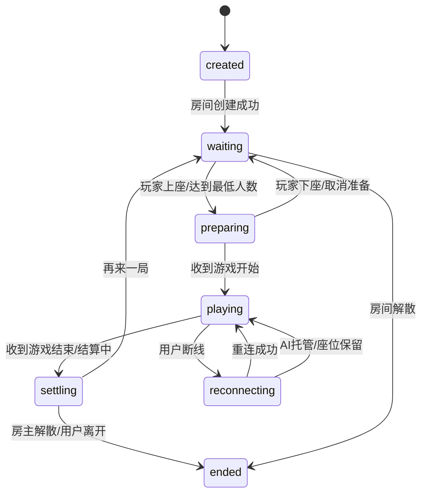
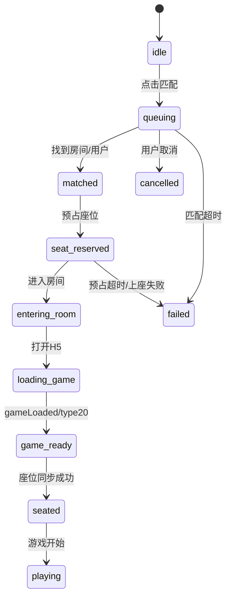
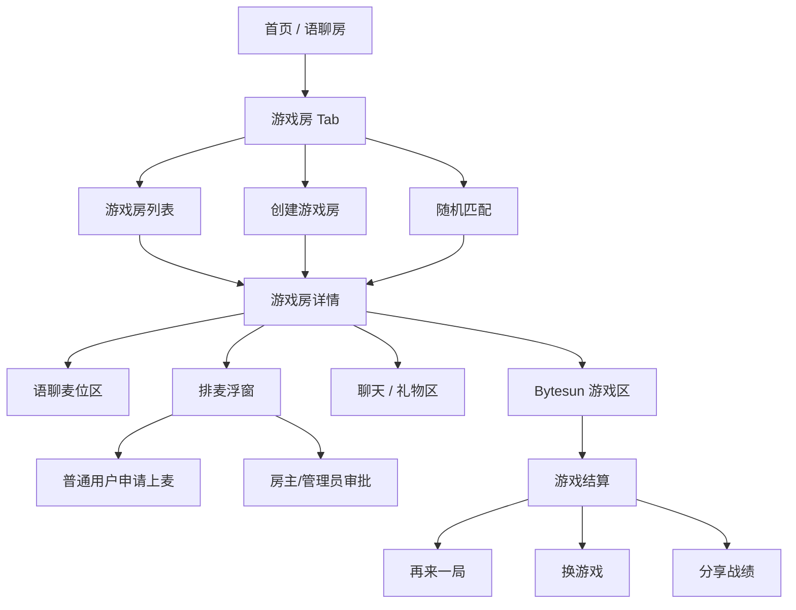
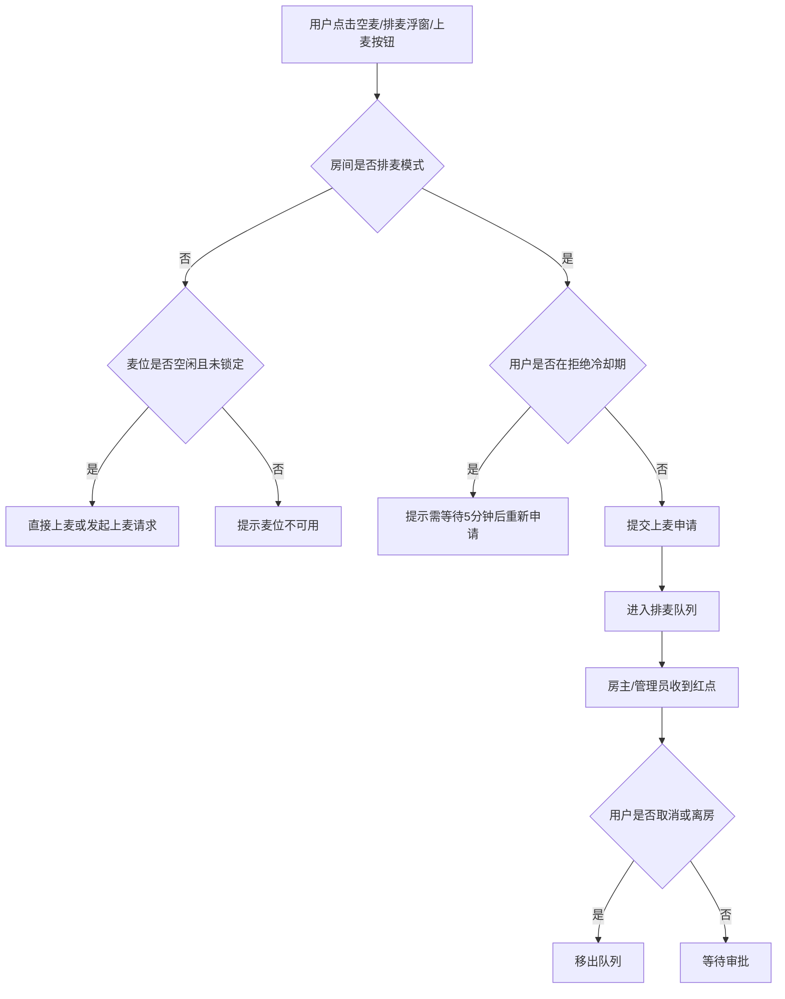
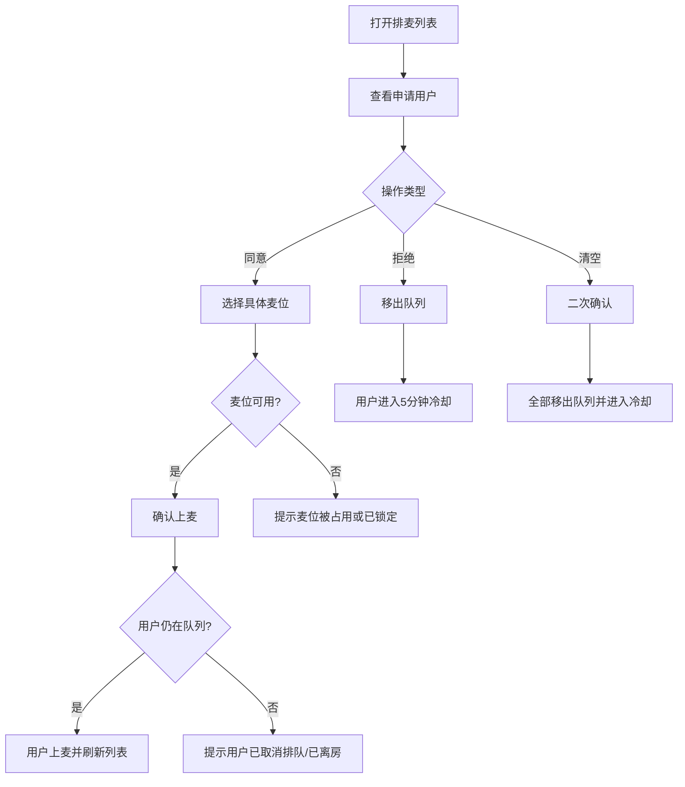
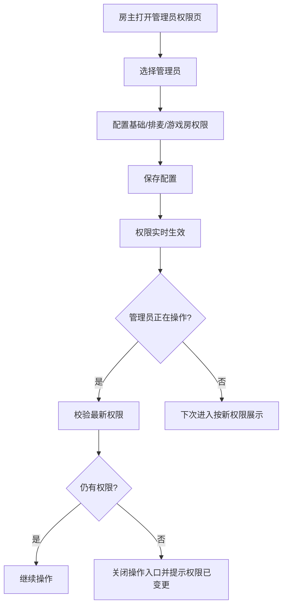
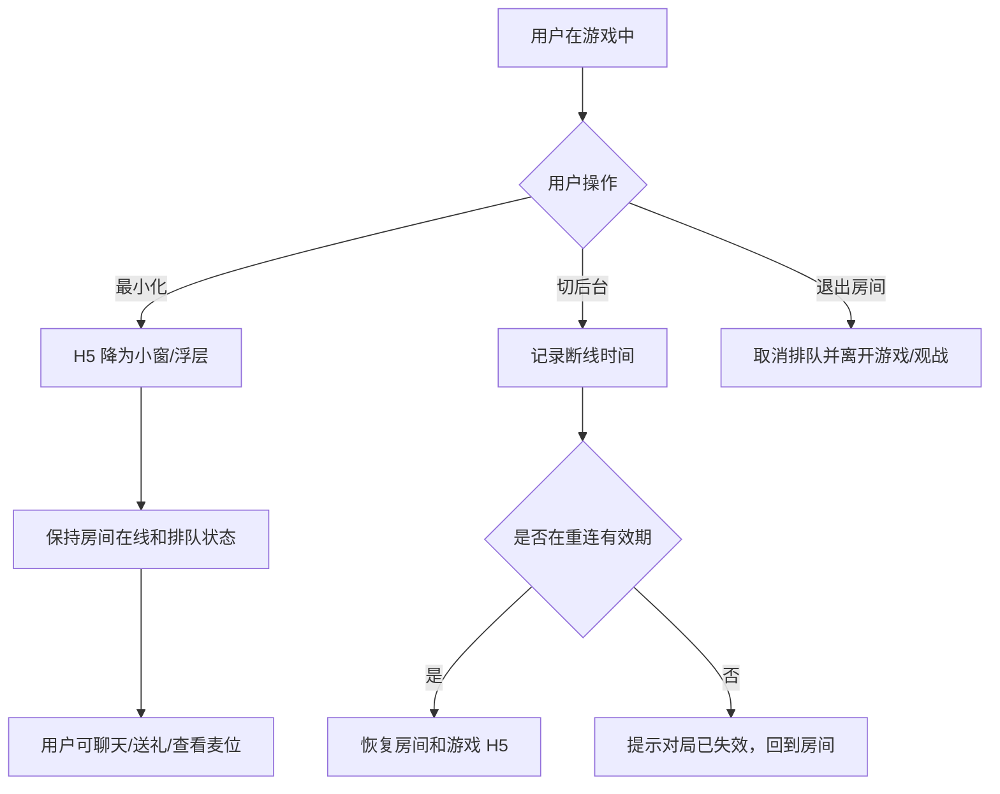
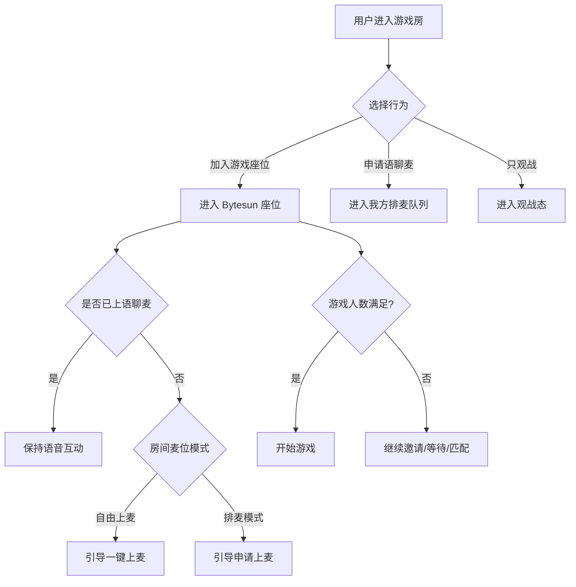

# 游戏房 PRD 评审框架 v1.2（完整合并版）

生成日期：2026-04-22  
面向区域：MENA / 中东语聊房  
三方能力：BytesunGame 语聊房模式 v1.0.7  
参考文档：

- `game-room-product-design-framework.md`
- `/Users/xinyintiaodong/Documents/游戏房/wechill-游戏房产品设计框架-v1.0.md`
- `BytesunGame（语聊房模式）对接文档1.0.7 (2).pdf`
- `/Users/xinyintiaodong/Downloads/排麦模式.pdf`
- `game-room-prd-review-framework-v1.0.md`
- 当前红包返奖、龙蛋、CP/Soul Pair 玩法记忆文档

版本处理说明：

- v1.2 完整继承 v1.0 主体内容，不用 v1.1 的补充摘编替代原文。
- v1.2 在 v1.0 基础上新增排麦模式、管理员权益、客户端前台原型、游戏座位和语聊麦位协同规则。
- 本文档可直接作为评审版 PRD 框架使用；HTML 原型文件为 `game-room-client-prd-prototype-v1.2.html`。

## 0. 两份文档的逻辑差异

### 0.1 总体差异

| 维度 | 之前生成的文档 | WeChill 文档 | 本评审版处理 |
| --- | --- | --- | --- |
| 主要视角 | 偏三方接入和平台产品架构，强调 Bytesun 约束、随机匹配边界。 | 偏产品评审全景，强调用户画像、场景矩阵、现有玩法融合、数据模型和埋点。 | 保留对接约束，补齐评审所需的场景、数据、后台、验收和决策项。 |
| 产品定位 | “语聊房 + 三方 H5 游戏”的复合房间类型。 | “边玩边聊”的社交催化剂，游戏是话题，不是目的。 | 统一定位为社交优先、游戏驱动的语聊房子类别。 |
| 房间模型 | 新增 `game_room`，描述字段和入口。 | 拆成纯语聊房、游戏房、混合房、专用房，并提供状态机。 | 采用四层房间模型，明确 MVP 先做游戏房 + 混合房。 |
| 游戏优先级 | Ludo、UNO、你画我猜为主，推理类后置。 | Ludo、Domino、UNO 为第一梯队；狼人杀、谁是卧底、你画我猜为第二梯队。 | V1 优先 Ludo / UNO / Domino 待确认；你画我猜放 V1.1；RTC 推理类放 V3。 |
| 场景覆盖 | 覆盖创建、加入、开局结算、画猜、匹配。 | 场景非常完整：创建、邀请、匹配、游戏中、观战、结算、异常边界。 | 合并成评审场景清单，便于逐项确认需求边界。 |
| 随机匹配 | 明确建议我方做；等待上限 60 秒；AI 补位需 Bytesun 确认。 | 匹配更激进：VIP 队列、AI 补位、60-120 秒兜底。 | V2 做平台匹配；AI/VIP 作为可选增强，不进 MVP 阻塞项。 |
| 三方对接 | 严格区分 Bytesun 已给接口和待确认能力，例如 `hideLobby` 快速开始 API 未给定义。 | 给了架构和接口示例，但部分如 `create_room`、`callback/room_status` 更像我方自定义。 | 明确标注：Bytesun 标准能力、我方自建能力、待 Bytesun 补充能力。 |
| 现有玩法融合 | 提到礼物、红包、CP、数据归因。 | 对红包返奖、龙蛋、CP、风控给了可配置规则。 | 纳入 V2.1，避免 MVP 过重，同时给出后台配置口径。 |
| 数据与后台 | 后台配置和看板较完整，但缺数据模型。 | 有游戏房、玩家、记录模型以及埋点事件。 | 增加数据模型、核心事件、评审验收指标。 |
| 风险边界 | 偏技术和三方风险。 | 增加涉赌、未成年、防沉迷、产品不支持边界。 | 增加合规边界和风控策略，避免评审时遗漏。 |

### 0.2 本次补齐的主要缺口

本评审版相较上一份文档，重点补齐：

- 目标用户画像。
- 房间分类：纯语聊房、游戏房、混合房、专用房。
- 完整房间状态机。
- 创建、邀请、传播、匹配、就绪、游戏中、观战、结算、异常边界场景。
- WhatsApp 分享、深链拉起、好友在线推送等 MENA 社交传播场景。
- 游戏结算后“再来一局 / 换游戏 / 成绩分享”链路。
- 游戏房与红包返奖、龙蛋、CP/Soul Pair、风控体系的融合。
- 匹配系统的队列、等待时间、AI/VIP 边界和座位预占。
- 数据模型、埋点、核心指标、错误码处理。
- 评审决策项和版本验收标准。

## 1. 产品定位与目标

### 1.1 核心定位

游戏房是语聊房的一个新房间类别，不是独立游戏大厅。

一句话定位：

> 游戏房 = 语音社交 + 轻量游戏组局。游戏负责破冰，语音负责留存，房间负责关系沉淀。

产品原则：

- 游戏是社交话题，不是唯一目的。
- 复用语聊房里的麦位、聊天、礼物、钱包、房间推荐、风控和运营体系。
- 三方 Bytesun 承接局内规则、游戏状态、结算结果；我方承接房间、用户、匹配、钱包、内容和数据。
- V1 先保证“能进房、能开局、能结算、能再来一局”；V2 再把随机匹配做成平台能力。

### 1.2 目标用户画像

| 用户画像 | 特征 | 核心诉求 | 产品机会 |
| --- | --- | --- | --- |
| 社交型玩家 | 聊天为主，游戏只是话题。 | 认识人、找话题、避免冷场。 | 低门槛游戏、语音互动、礼物互动。 |
| 休闲玩家 | 想玩游戏但不想下载重 App。 | 即开即玩、规则简单、等待短。 | Ludo / UNO / Domino / 你画我猜。 |
| 组局用户 | 喜欢拉朋友一起玩。 | 快速建房、邀请好友、分享传播。 | WhatsApp 分享、深链直达、好友在线推送。 |
| 观战用户 | 不一定参与游戏。 | 看局、聊天、送礼、等空位。 | 观战位、弹幕、观战转玩家。 |
| 竞技用户 | 更看重赢和排名。 | 连胜、排行榜、段位、奖励。 | 后续锦标赛、榜单、段位，不进 MVP 主线。 |

### 1.3 业务目标

V1 目标：

- 建立游戏房新类别。
- 跑通 Bytesun 接入。
- 支持 Ludo / UNO 等优先游戏创建、加入、观战、开局、结算。
- 验证语聊房 + 游戏的基础留存价值。

V2 目标：

- 上线随机匹配，提高从“想玩”到“开局”的转化。
- 增加游戏房运营和商业化模块。
- 与红包返奖、龙蛋、CP/Soul Pair 做可控融合。

### 1.4 非目标

当前不做：

- 真钱下注。
- 高竞技重游戏，例如 MOBA / FPS。
- 单局超过 60 分钟的重度玩法。
- 需要用户额外下载安装的游戏。
- 未经确认的机器人补位强依赖。
- 未经确认的 Bytesun 快速开始 API 强依赖。

## 2. 产品范围

### 2.1 P0 范围

- 新增游戏房房间类别。
- 游戏房创建、加入、离开、观战。
- Bytesun H5 / Zip 游戏加载。
- `getConfig`、`gameLoaded`、`gameRecharge`、`walletUpdate`、`sendGameAction`、`gameActionUpdate` 基础协议。
- 服务端 `get_sstoken`、`get_user_info`、`change_balance`、游戏状态上报接收。
- 游戏开始 / 结束 / 结算页。
- 座位同步和上座失败处理。
- Ludo / UNO 至少两个游戏完成联调。
- 游戏配置后台和基础数据看板。

### 2.2 P1 范围

- Domino 接入，前提是 Bytesun 提供游戏 ID 和资源。
- 你画我猜聊天同步。
- 游戏房邀请、分享、深链拉起。
- 随机匹配。
- 游戏记录、结算记录、对账。
- 游戏房风控和投诉处理。

### 2.3 P2 范围

- 狼人杀、谁是卧底等游戏内 RTC 玩法。
- CP 亲密值、龙蛋贡献、游戏房返奖。
- VIP 优先匹配。
- 锦标赛、排位、段位、皮肤。
- AI / 机器人补位，需 Bytesun 明确支持。

## 3. 房间类型与状态

### 3.1 房间分类

| 房间类型 | 核心功能 | 游戏支持 | 典型场景 | V1 是否支持 |
| --- | --- | --- | --- | --- |
| 纯语聊房 | 原有语音聊天。 | 无。 | 普通语聊。 | 已有能力。 |
| 游戏房 | 游戏驱动 + 语音互动。 | 固定一个游戏。 | Ludo 房、UNO 房。 | 支持。 |
| 混合房 | 语聊为主，随时开小游戏。 | 可挂起游戏。 | 聊着聊着开一局。 | 基础支持。 |
| 专用房 | 单一游戏深度运营。 | 固定游戏竞技。 | 锦标赛、排位赛。 | 后续版本。 |

### 3.2 游戏房状态机



状态定义：

| 状态 | 说明 | 用户可操作 |
| --- | --- | --- |
| `created` | 我方房间已创建，游戏资源未加载。 | 取消创建、重试加载。 |
| `waiting` | 等待玩家加入或上座。 | 邀请、匹配、上座、观战。 |
| `preparing` | 座位已有人，等待准备或开始。 | 准备、取消准备、踢人、调整门票。 |
| `playing` | 游戏进行中。 | 观战、聊天、送礼；玩家按游戏规则操作。 |
| `reconnecting` | 用户断线重连中。 | 保留座位、倒计时。 |
| `settling` | 游戏结束，结算中。 | 等待结果。 |
| `ended` | 房间或当前游戏会话结束。 | 返回、分享、重新开房。 |

### 3.3 MENA 默认配置

| 配置项 | 默认值 | 说明 |
| --- | --- | --- |
| 统计时区 | GMT+3 | 与龙蛋玩法保持一致。 |
| 默认语言 | 阿拉伯语 `7` | Bytesun `language` 参数。 |
| 默认节点 | `gsp=201` | 迪拜 AWS，面向 MENA 优先。 |
| 备用节点 | `gsp=101` | 新加坡。 |
| 视觉方向 | 星月、绿洲、灯笼、Majlis | 与现有 CP/Soul Pair 本地化方向一致。 |
| 保守分区 | 关闭公开 CP 关系动画 | CP 展示仅保留私密页或弱展示。 |

## 4. 游戏接入规划

### 4.1 游戏梯队

第一梯队，V1 优先：

| 游戏 | 人数建议 | 时长 | 适配理由 | 备注 |
| --- | --- | --- | --- | --- |
| Ludo / 飞行棋 | 2-4 | 10-20 分钟 | 中东强认知，适合语聊破冰。 | Bytesun `ludoPlus` 支持 `hideLobby`，具体 game_id 待确认。 |
| UNO | 2-4 / 2-6 | 5-15 分钟 | 规则简单，开局快。 | Bytesun `unoPlus` 支持 `hideLobby`，最大人数以实际返回为准。 |
| Domino | 2-4 | 5-15 分钟 | 中东传统桌游。 | WeChill 文档列为一梯队；需确认 Bytesun 资源和 game_id。 |

第二梯队，V1.1 / V2 候选：

| 游戏 | 人数建议 | 时长 | 特殊要求 |
| --- | --- | --- | --- |
| 你画我猜 | 3-12 | 15-30 分钟 | 需要 `type=22` / `type=2014` 聊天双向同步和内容审核。 |
| 谁是卧底 | 4-10 | 15-30 分钟 | 可能需要 `isGameRTC=true` 和麦克风同步。 |
| 狼人杀 | 6-12 | 20-40 分钟 | RTC、主持、断线重连和观战规则复杂。 |

第三梯队，暂不进入近期评审范围：

- 麻将 / 扑克：涉赌和地域合规风险更高。
- Slots / 抽奖类：商业化敏感，需要单独合规评估。
- 台球等重交互游戏：需要验证观战和延迟体验。

### 4.2 游戏参数模板

以下为产品模板，实际 `game_id`、人数、门票档位必须以 Bytesun 返回和联调结果为准。

```yaml
GameTemplate:
  ludo:
    display_name: "Ludo"
    local_name_ar: "لعبة الطيران"
    bytesun_name: "ludoPlus"
    game_id: "待Bytesun确认"
    players:
      min: 2
      max: 4
      optimal: 4
    duration: "10-20分钟"
    spectator: true
    match_enabled: true
    hide_lobby_supported: true
    ai_backup: "待Bytesun确认"
    ticket_slots: "待Bytesun确认"

  uno:
    display_name: "UNO"
    local_name_ar: "أونو"
    bytesun_name: "unoPlus"
    game_id: "待Bytesun确认"
    players:
      min: 2
      max: "以Bytesun返回peopleNum为准"
      optimal: 4
    duration: "5-15分钟"
    spectator: true
    match_enabled: true
    hide_lobby_supported: true
    ai_backup: "待Bytesun确认"

  draw_guess:
    display_name: "你画我猜"
    bytesun_name: "待Bytesun确认"
    game_id: "待Bytesun确认"
    players:
      min: 3
      max: 12
      optimal: 6
    duration: "15-30分钟"
    spectator: true
    chat_sync_required: true
    content_moderation_required: true
```

## 5. 前台产品设计

### 5.1 入口

| 入口 | 说明 | 优先级 |
| --- | --- | --- |
| 首页游戏 Tab | 展示游戏房推荐、游戏分类和随机匹配。 | P0 |
| 房间列表分类 | 在现有语聊房列表中新增“游戏”。 | P0 |
| 普通语聊房内“开启游戏” | 当前语聊房转换为混合房。 | P0 |
| 好友邀请卡 | 好友在玩时推荐加入。 | P1 |
| 结算页“再来一局” | 游戏结束后留存。 | P0 |
| WhatsApp 分享 | MENA 外部传播。 | P1 |
| 活动页 / 任务页 | 游戏活动导流。 | P2 |

### 5.2 游戏 Tab

页面模块：

- 顶部：`快速匹配`、最近玩过、好友在玩。
- 分类：全部、Ludo、UNO、Domino、你画我猜、热门、可观战。
- 房间卡片：
  - 游戏 icon。
  - 房间名。
  - 游戏名。
  - 玩家人数 / 最大人数。
  - 状态：等待中、准备中、游戏中、可观战。
  - 语言 / 地区。
  - 门票档位 / 免费。
  - 房主信息。
  - 好友在房标识。

### 5.3 创建游戏房

场景：

| 场景编号 | 场景 | 触发 | 系统响应 |
| --- | --- | --- | --- |
| S1.1 | 创建游戏房 | 点击创建房间并选择游戏房。 | 展示游戏列表和默认配置。 |
| S1.2 | 快速创建 | 点击某游戏快捷创建。 | 使用默认配置创建房间并等待玩家。 |
| S1.3 | 混合房开启游戏 | 普通语聊房房主点击开启游戏。 | 继承原房间 ID、成员、语音频道。 |
| S1.4 | 设置门票 | 创建时选择门票档。 | 写入 `ticket_slot`，并传给游戏或等待 Bytesun 同步。 |
| S1.5 | 私密房 | 勾选私密。 | 生成邀请码或密码，不进入公开匹配池。 |
| S1.6 | 选择节点 | 高级设置。 | 默认 `gsp=201`，可按地区切换。 |

创建字段：

- 游戏类型。
- 房间名称。
- 语言 / 地区。
- 公开 / 私密。
- 最大人数。
- 最低开局人数。
- 门票 / 免费。
- 观战开关。
- 随机匹配开关。
- 中途加入开关。
- 游戏中是否允许礼物。
- 游戏中是否允许红包。
- 游戏中是否计入 CP / 龙蛋任务。

### 5.4 邀请与传播

| 场景编号 | 场景 | 触发 | 系统响应 |
| --- | --- | --- | --- |
| S2.1 | 房间内邀请 | 点击邀请好友。 | 生成站内邀请卡。 |
| S2.2 | 游戏空位邀请 | 等待中或准备中出现空位。 | 空座位展示邀请入口。 |
| S2.3 | WhatsApp 分享 | 点击分享到 WhatsApp。 | 生成阿语 RTL 分享卡片和深链。 |
| S2.4 | 好友在线推送 | 房主邀请在线好友。 | 推送通知，点击直达房间。 |
| S2.5 | 深链拉起 | App 外点击链接。 | 拉起 App，校验房间状态后进入。 |

### 5.5 游戏中

| 场景编号 | 场景 | 触发 | 系统响应 |
| --- | --- | --- | --- |
| S4.1 | 游戏加载 | 进入游戏房。 | App loading，收到 `gameLoaded` 后关闭。 |
| S4.2 | 上座 | 用户点击空位。 | 调用 `gameActionUpdate type=4` 或响应 H5 `type=15`。 |
| S4.3 | 下座 | 用户离开座位。 | 同步 `optType=1`，释放座位。 |
| S4.4 | 座位同步 | H5 发送 `type=16`。 | App 更新房间座位；必要时以 App 座位为准反向同步。 |
| S4.5 | 踢人 | 房主或游戏发起踢人。 | 收到 `type=17`，App 二次确认后回 `type=6`。 |
| S4.6 | 游戏开始 | 游戏准备完成并开局。 | 收到 `type=13`，房间状态改为游戏中。 |
| S4.7 | 游戏结束 | 局内结束。 | 收到 `type=14`，进入结算页。 |
| S4.8 | 断线重连 | 用户掉线后返回。 | 保留座位一段时间，重连后恢复。 |
| S4.9 | 余额不足 | `change_balance` 返回 `1008` 或 H5 调 `gameRecharge`。 | 打开商城，充值后 `walletUpdate`。 |
| S4.10 | 聊天同步 | 你画我猜。 | `type=22` 到 App 聊天，App 审核后 `type=2014` 回游戏。 |
| S4.11 | RTC 同步 | 推理类游戏。 | `type=3001` 同步麦克风和扬声器。 |

### 5.6 观战与互动

| 场景编号 | 场景 | 触发 | 系统响应 |
| --- | --- | --- | --- |
| S5.1 | 纯观战 | 用户以 `role=1` 进入。 | 只能观战、聊天、送礼，不能上座。 |
| S5.2 | 观战转玩家 | 有玩家退出或空位。 | 点击上座，身份切为 `role=0`。 |
| S5.3 | 观战送礼 | 点击礼物。 | 弹出礼物面板。 |
| S5.4 | 观战弹幕 | 游戏允许互动。 | 展示房间聊天；画猜类需审核同步。 |

### 5.7 结算与复玩

| 场景编号 | 场景 | 触发 | 系统响应 |
| --- | --- | --- | --- |
| S6.1 | 正常结算 | 游戏按规则结束。 | 展示排名、得分、奖励、扣费/返还。 |
| S6.2 | 再来一局 | 点击再来一局。 | 保留房间和玩家，重置准备状态。 |
| S6.3 | 换游戏 | 点击换游戏。 | 房主选择新游戏，重新加载资源。 |
| S6.4 | 成绩分享 | 点击分享。 | 生成阿语 RTL 成绩卡片。 |
| S6.5 | 解散房间 | 房主结束。 | 房间结束，释放座位和匹配占位。 |
| S6.6 | 返奖触发 | 后续版本配置开启。 | 进入游戏房返奖链路。 |

### 5.8 异常与边界

| 场景编号 | 场景 | 触发 | 系统响应 |
| --- | --- | --- | --- |
| E1 | 游戏加载失败 | WebView 白屏、超时、资源失败。 | 重试、切换 URL、本地包、退出房间。 |
| E2 | 上座失败 | H5 `type=18`。 | 提示“上座失败，请重试”，释放预占座。 |
| E3 | 余额不足 | 错误码 `1008`。 | 打开商城，不扣门票或做退款。 |
| E4 | 游戏维护 | 错误码 `1019`。 | 提示维护，隐藏入口或下架游戏。 |
| E5 | 用户封禁 | 错误码 `1020` 或我方黑名单。 | 禁止进入游戏房。 |
| E6 | 账号限制 | 错误码 `1022`。 | 提示功能受限。 |
| E7 | 地区 / IP 限制 | 错误码 `1023`。 | 提示地区暂不支持。 |
| E8 | 低端设备 | 低性能、低电量。 | 降低动画、关闭特效、提示省电。 |
| E9 | 结算失败 | `change_balance` 超时或失败。 | 进入补偿队列和对账。 |
| E10 | 游戏中退房 | 玩家主动离开。 | 按游戏规则处理托管、弃权或保留座位。 |

## 6. 随机匹配设计

### 6.1 是否由我方做

结论：随机匹配应由我方做，Bytesun 负责局内游戏。

原因：

- 游戏房是我方语聊房的房间类别，房间推荐、语言、地区、风控、钱包、礼物、CP、龙蛋、红包都在我方。
- Bytesun 文档未覆盖我方房间推荐和跨房匹配。
- `hideLobby=true` 虽然支持 `ludoPlus`、`unoPlus`、`DominoPlus`，但文档未给出“快速开始游戏 API”定义。
- 我方做匹配后，才能控制等待时间、补位、邀请、降级和数据归因。

### 6.2 分期策略

| 版本 | 匹配能力 |
| --- | --- |
| V1 | 不做完整随机匹配；支持房间列表、快速加入等待中房间。 |
| V2 | 上线正式随机匹配队列、等待页、座位预占、超时降级。 |
| V2+ | 接入 `hideLobby=true` 快速开局，前提是 Bytesun 补齐 API。 |
| V3 | AI 补位、VIP 优先、技能分、锦标赛队列。 |

### 6.3 匹配入口

- 游戏 Tab：快速匹配。
- 指定游戏卡片：匹配 Ludo / UNO。
- 游戏房空位：一键补位。
- 结算页：再来一局匹配。
- 活动页：任务引导匹配。

### 6.4 匹配维度

P0 必须一致：

- `game_id`
- 语种
- 地区 / `gsp`
- 房间状态：等待中、准备中。
- 门票档位。
- 用户风控状态。
- App 版本和游戏资源版本。

P1 建议一致：

- 最大人数。
- 是否允许观战。
- 是否好友房 / 私密房。
- 用户等级。
- 新老用户。

P2 可放宽：

- 国家。
- 性别偏好。
- 胜率 / 技能分。
- 历史同桌关系。

### 6.5 等待时间

推荐目标：

- P50 匹配等待时间：8 秒以内。
- P90 匹配等待时间：25 秒以内。
- 单次等待上限：60 秒。

等待策略：

| 时间 | 策略 | 前台表现 |
| --- | --- | --- |
| 0-5 秒 | 严格匹配同游戏、同语言、同地区、同门票。 | “正在寻找同桌玩家”。 |
| 5-15 秒 | 优先补已有等待房，允许同语言跨国家。 | 展示已找到人数。 |
| 15-30 秒 | 创建新房或合并队列，提示邀请好友。 | “还差 1 人，可邀请好友”。 |
| 30-45 秒 | 提供继续等待、进入房间等人、换热门游戏。 | 轻提示，不强打断。 |
| 45-60 秒 | 兜底进入等待房或结束匹配。 | “暂时没有合适玩家”。 |

WeChill 文档中的 60-120 秒等待更适合狼人杀等长局游戏；Ludo / UNO 不建议超过 60 秒。

### 6.6 匹配状态机



### 6.7 座位预占

- 匹配成功后服务端预占座位，TTL 建议 15 秒。
- 用户进入房间并完成 H5 加载后，预占转正式座位。
- 用户取消、超时、加载失败时释放座位。
- 收到 `type=18` 上座失败，释放座位并重试或重新匹配。

### 6.8 AI / 机器人补位边界

AI 补位不进入 V1 / V2 必选项。

上线前必须确认：

- Bytesun 是否支持该游戏机器人。
- `game_start` / `game_settle` 中 `is_ai=1` 是否稳定上报。
- 机器人是否参与门票扣费、奖励池、返奖口径。
- 机器人局是否计入任务、龙蛋、CP、排行榜。

建议默认：

- AI 不计入有效真人人数。
- AI 不参与返奖。
- AI 不计入 CP 亲密值。
- AI 可计入游戏完成率，但需单独打标。

## 7. Bytesun 对接要求

### 7.1 `getConfig`

```json
{
  "appChannel": "wechill",
  "appId": 88888888,
  "userId": "534206265",
  "code": "one_time_code",
  "roomId": "voice_room_id",
  "gameRoomId": "",
  "gameMode": "3",
  "language": "7",
  "gameConfig": {
    "sceneMode": 0,
    "currencyIcon": "https://cdn.xxx.com/coin.png"
  },
  "gsp": 201,
  "role": 0
}
```

### 7.2 H5 通知 App

| type | 场景 | 产品处理 |
| --- | --- | --- |
| 7 | 点击用户头像。 | 打开用户资料卡。 |
| 13 | 游戏开始。 | 房间状态改为游戏中，记录埋点。 |
| 14 | 游戏结束。 | 进入结算页，等待服务端结算。 |
| 15 | 上 / 下座。 | 校验后同步 App 座位。 |
| 16 | 座位信息同步。 | 刷新座位；冲突时以 App 房间座位为准。 |
| 17 | 游戏发起踢人。 | App 确认并回传结果。 |
| 18 | 上座失败。 | 提示并释放座位。 |
| 20 | 语聊房游戏准备完成。 | 可执行自动上座 / 后续操作。 |
| 21 | 音乐音效状态。 | 同步设置面板。 |
| 22 | 画猜消息到 App 聊天。 | 审核后展示。 |
| 23 | 游戏基础参数。 | 更新是否有商店等配置。 |
| 30 | 最大人数 / 门票变更。 | 更新房间配置和匹配条件。 |
| 3001 | RTC 麦克风 / 扬声器同步。 | 仅 RTC 游戏启用。 |

### 7.3 App 通知 H5

| type | 场景 | 产品处理 |
| --- | --- | --- |
| 4 | 操作游戏座位。 | 上座 / 下座 / 自动同步。 |
| 5 | 变更用户身份。 | 玩家、观众、主持人切换。 |
| 6 | 返回踢人结果。 | 告知游戏是否踢人成功。 |
| 2012 | 查询音效状态。 | 游戏请求后返回 `type=21`。 |
| 2014 | App 聊天同步到画猜游戏。 | 审核通过后同步。 |
| 2016 | 语聊房最小化状态。 | 游戏适配小窗 / 展开状态。 |

### 7.4 服务端 API

Bytesun 标准要求：

- `POST /v1/api/get_sstoken`
- `POST /v1/api/get_user_info`
- `POST /v1/api/update_sstoken`
- `POST /v1/api/change_balance`
- 游戏状态上报接收接口。

我方自建服务：

- 房间创建 / 加入 / 离开。
- 匹配队列。
- 座位预占。
- 游戏记录。
- 结算记录。
- 风控审核。
- 数据看板。

待 Bytesun 补充：

- `hideLobby=true` 后的快速开始游戏 API。
- 各游戏机器人能力。
- 真实 game_id 和最大人数。
- 门票档位含义。

### 7.5 URL 参数

| 参数 | 场景 | 说明 |
| --- | --- | --- |
| `game_margin_top` | game_id 3 开头全屏语聊房游戏。 | 顶部覆盖区域比例。 |
| `game_margin_bottom` | game_id 3 开头全屏语聊房游戏。 | 底部覆盖区域比例。 |
| `game_margin_standard` | 安全区不足时对齐方式。 | 0 底部为准，1 顶部为准。 |
| `hideLobby=true` | Ludo / UNO / DominoPlus。 | 隐藏三方大厅，等待我方快速开始 API。 |
| `isGameRTC=true` | 狼人杀 / 谁是卧底。 | 启用游戏内 RTC。 |
| `language=0/2` | loading 页语言。 | 当前文档只说明中文 / 英文 loading。 |

## 8. 与现有玩法融合

### 8.1 红包返奖 / Lucky Pocket

建议 V2.1 后做，不进 V1。

触发条件建议：

| 条件 | 说明 |
| --- | --- |
| 游戏类型 | 后台开启“游戏房返奖”的游戏。 |
| 门票门槛 | A 档 200-499，B 档 >=500，金额仅为产品建议，需商业化确认。 |
| 游戏时长 | >=5 分钟，防止秒局刷奖。 |
| 有效玩家 | >=2 真人，AI 不计入。 |
| 用户状态 | 非危险级、非限制级黑名单。 |
| 结算状态 | game_settle 成功且钱包流水完整。 |

返奖分档可复用红包返奖模型：

| 档位 | 门槛 | 概率 | 比例 |
| --- | --- | --- | --- |
| A 档 | 门票 200-499 | 3% | 5% |
| B 档 | 门票 >=500 | 5% | 10% |

注意：这是“游戏房返奖”新场景，不能直接套红包金额口径。需要新建游戏返奖记录或在红包返奖后台中增加来源类型 `game_room`。

### 8.2 龙蛋玩法

V2.1 后可配置：

```yaml
DragonEggGameConfig:
  ludo:
    contribute_per_game: 10
    contribute_per_win: 30
    contribute_per_minute: 2
  uno:
    contribute_per_game: 8
    contribute_per_win: 20
    contribute_per_minute: 2
```

口径：

- 统计日：GMT+3 00:00 - 23:59:59。
- 后端结算：以游戏结束回调 / 游戏记录为准。
- AI 不计入有效贡献。
- 房主可获得房间游戏总贡献的一定比例，比例后台配置。

### 8.3 CP / Soul Pair

V2.1 后可配置：

```yaml
CPIntimacyGameConfig:
  play_together: 5
  win_together: 15
  play_duration_per_minute: 1
```

口径：

- 双方同一游戏房完成一局才计入。
- 同队获胜可额外加成，前提是游戏支持队伍关系。
- 保守分区不在游戏内公开展示 CP 关系动画。

### 8.4 风控体系

黑名单映射建议：

| 我方风控等级 | Bytesun 用户类型建议 | 游戏房影响 |
| --- | --- | --- |
| 危险级 | `user_type=3` | 禁止进入游戏房或仅提示账号受限。 |
| 限制级 | `user_type=2` | 可进入免费局；不可参与返奖、门票局或高收益活动。 |
| 观察名单 | `user_type=1` | 正常进入，记录日志并增加监控。 |

游戏房新增规则：

- 高频游戏：1 小时内 >100 局，进入观察或限制。
- 同设备多账号：同设备 3 个以上账号同局或高频同桌。
- 异常胜率：样本 >=50 局且胜率 >80%，进入观察。
- 串通作弊：同 IP / 同设备 / 固定组合高频同桌且收益异常。
- 秒退刷任务：短时间进入后退出 >=3 次降权或冷却。
- 结算异常：钱包变更失败、重复订单、退款异常进入审核。

## 9. 后台管理

一级菜单：`游戏房管理`。

二级菜单：

1. 游戏配置
2. 房间管理
3. 匹配配置
4. 门票档位
5. 游戏记录
6. 结算管理
7. 返奖配置
8. 风控审核
9. 数据看板
10. 操作日志

### 9.1 游戏配置页

字段：

- 游戏 ID。
- 游戏名称。
- Bytesun 游戏名。
- 游戏分类。
- 图标。
- 游戏版本。
- 下载地址。
- 支持语言。
- 支持地区。
- 默认 gsp。
- 支持人数。
- 是否支持观战。
- 是否支持匹配。
- 是否支持 `hideLobby`。
- 是否支持游戏内 RTC。
- 是否支持聊天同步。
- 安全区参数。
- 上下架状态。

### 9.2 房间管理页

字段：

- 房间 ID。
- 游戏 ID / 游戏名。
- 房主 UID。
- 房间类型：游戏房 / 混合房 / 专用房。
- 房间状态。
- 当前玩家数。
- 当前观众数。
- 门票档位。
- 地区 / 语言。
- game_round_id。
- 创建时间。
- 操作：查看、强制结束、封禁房间、导出记录。

### 9.3 匹配配置页

字段：

- 匹配总开关。
- 支持匹配的游戏。
- 默认等待上限。
- 严格匹配窗口。
- 放宽匹配窗口。
- 座位预占 TTL。
- 是否允许跨语言。
- 是否允许跨地区。
- 是否允许 VIP 优先。
- 是否允许 AI 补位。
- 取消冷却阈值。
- 秒退降权阈值。

### 9.4 门票档位页

示例配置：

| 档位 | 门票金额 | 返奖资格 | 说明 |
| --- | --- | --- | --- |
| 免费档 | 0 | 无 | 拉新和体验。 |
| 档位 1 | 100 | 无 | 休闲金币局。 |
| 档位 2 | 200 | A 档 | 后续返奖门槛。 |
| 档位 3 | 500 | B 档 | 高价值房间。 |

### 9.5 游戏记录页

字段：

- 游戏局 ID / game_round_id。
- 房间 ID。
- 游戏类型。
- 房主。
- 玩家人数。
- 真人 / AI 人数。
- 开始时间。
- 结束时间。
- 时长。
- 下注总额。
- 结算总额。
- 赢家。
- 返奖状态。
- 风控状态。

### 9.6 结算管理页

字段：

- 订单 ID。
- 用户 ID。
- 游戏 ID。
- 房间 ID。
- game_round_id。
- `currency_diff`。
- `diff_msg`：bet / result / refund。
- 变更前余额。
- 变更后余额。
- Bytesun 请求时间。
- 我方处理时间。
- 状态：成功、失败、重试中、补偿完成。
- 操作：查看、补偿、导出。

## 10. 数据模型

### 10.1 GameRoom

```yaml
GameRoom:
  room_id: string
  voice_room_id: string
  bytesun_room_id: string | null
  game_id: int
  game_type: string
  owner_id: string
  room_kind: enum[game_room, mixed_room, dedicated_room]
  config:
    min_players: int
    max_players: int
    ticket_slot: int
    is_private: bool
    password: string | null
    gsp: int
    language: string
    spectator_enabled: bool
    match_enabled: bool
  state: enum[created, waiting, preparing, playing, settling, ended]
  game_round_id: string | null
  created_at: timestamp
  updated_at: timestamp
```

### 10.2 GamePlayer

```yaml
GamePlayer:
  room_id: string
  game_round_id: string | null
  user_id: string
  seat: int
  role: int
  is_ready: bool
  is_online: bool
  is_ai: bool
  score: int
  rank: int
  join_source: enum[room_list, match, invite, deeplink, rejoin]
  joined_at: timestamp
  left_at: timestamp | null
```

### 10.3 GameRecord

```yaml
GameRecord:
  record_id: string
  game_round_id: string
  room_id: string
  game_id: int
  players: list[PlayerRecord]
  winner_ids: list[string]
  started_at: timestamp
  ended_at: timestamp
  duration_seconds: int
  bets_total: int
  results_total: int
  refund_total: int
  ai_count: int
  real_player_count: int
  rebate_triggered: bool
  risk_status: string
```

### 10.4 GameBalanceOrder

```yaml
GameBalanceOrder:
  order_id: string
  user_id: string
  game_id: int
  room_id: string
  game_round_id: string
  currency_diff: int
  diff_msg: enum[bet, result, refund]
  before_balance: int
  after_balance: int
  status: enum[success, failed, retrying, compensated]
  bytesun_unique_id: string
  created_at: timestamp
```

### 10.5 MatchTicket

```yaml
MatchTicket:
  ticket_id: string
  user_id: string
  game_id: int
  language: string
  gsp: int
  ticket_slot: int
  status: enum[queuing, matched, cancelled, timeout, failed]
  matched_room_id: string | null
  reserved_seat: int | null
  wait_time_ms: int
  created_at: timestamp
  updated_at: timestamp
```

## 11. 数据埋点与指标

### 11.1 核心事件

房间生命周期：

- `game_room_create`
- `game_room_join`
- `game_room_leave`
- `game_room_destroy`
- `game_room_switch_from_voice`

匹配流程：

- `game_match_enter`
- `game_match_success`
- `game_match_timeout`
- `game_match_cancel`
- `game_match_seat_reserved`
- `game_match_seat_reserve_failed`

游戏流程：

- `game_h5_load_start`
- `game_loaded`
- `game_start`
- `game_end`
- `game_reconnect`
- `game_result_view`
- `game_replay_click`

座位操作：

- `game_seat_up`
- `game_seat_down`
- `game_seat_sync`
- `game_seat_failed`
- `game_kick_player`

货币：

- `game_balance_bet`
- `game_balance_result`
- `game_balance_refund`
- `game_balance_error`
- `game_recharge_open`
- `game_wallet_update`

互动：

- `game_invite_send`
- `game_share_whatsapp`
- `game_deeplink_open`
- `game_spectator_join`
- `game_gift_send`
- `game_chat_sync_to_app`
- `game_chat_sync_to_h5`

错误：

- `game_error`
- `game_maintenance`
- `game_ip_restricted`
- `game_user_banned`
- `game_h5_crash`

### 11.2 核心指标

| 指标 | 说明 | V1 建议目标 |
| --- | --- | --- |
| 游戏房曝光人数 | 看到游戏入口人数。 | 建立基线。 |
| 游戏房点击率 | 点击 / 曝光。 | 建立基线。 |
| 游戏房创建数 | 每日创建房间数。 | 建立基线。 |
| 游戏启动成功率 | `game_loaded` / 加载开始。 | >95%。 |
| 游戏平均加载耗时 | H5 load 到 `gameLoaded`。 | <8 秒。 |
| 开局转化率 | game_start / join。 | >60%。 |
| 游戏完成率 | game_end / game_start。 | >90%。 |
| 平均游戏时长 | 每局平均时长。 | 按游戏建立基线。 |
| 匹配成功率 | 匹配成功 / 匹配请求。 | V2 >80%。 |
| 平均匹配等待 | 成功匹配平均耗时。 | V2 <30 秒。 |
| 上座失败率 | 上座失败 / 上座请求。 | <3%。 |
| 余额不足触发率 | `1008` / 扣费请求。 | 建立基线。 |
| 结算失败率 | 失败结算 / 全部结算。 | <0.5%。 |
| 投诉率 | 投诉 / 游戏局。 | 建立基线。 |

## 12. 版本规划

### V0：技术预研

周期：1-2 周。

范围：

- Bytesun 测试环境联调。
- H5 / Zip 加载验证。
- JSBridge 基础协议验证。
- 一次性 `code` 换 `ss_token`。
- 用户信息和余额查询。
- `change_balance` 幂等和并发锁方案。
- Ludo / UNO 至少一个游戏跑通。
- 梳理 Bytesun 待确认问题。

评审出口：

- 技术可行性结论。
- 游戏资源清单。
- 关键接口风险清单。

### V1：游戏房 MVP

周期：4-5 周。

范围：

- 新增游戏房类别。
- 首页游戏 Tab / 房间列表分类。
- 创建游戏房、加入游戏房、观战。
- 普通语聊房开启游戏，形成混合房。
- 接入 Ludo / UNO，Domino 视 Bytesun 确认情况进入。
- WebView 游戏加载。
- `getConfig`、`gameLoaded`、`gameRecharge`、`walletUpdate`。
- 座位同步、上座失败、踢人基础逻辑。
- 游戏开始、游戏结束、结算页。
- 用户信息、余额变更、游戏状态上报。
- 游戏配置后台、游戏记录基础页。

不包含：

- 正式随机匹配。
- 你画我猜聊天同步。
- 红包 / 龙蛋 / CP 融合。
- AI 补位。
- RTC 推理游戏。

### V1.1：你画我猜与传播补强

周期：2-3 周。

范围：

- 你画我猜接入。
- `type=22` 游戏消息到 App 聊天区。
- `type=2014` App 聊天内容同步回游戏。
- 内容审核和举报。
- 邀请好友、WhatsApp 分享、深链拉起。
- 成绩分享卡片。

### V2：随机匹配

周期：4 周。

范围：

- 随机匹配入口。
- 指定游戏匹配。
- 匹配等待页。
- 匹配队列和房间补位。
- 座位预占。
- 超时降级。
- 匹配取消、匹配失败。
- 匹配数据看板。
- 频繁取消、秒退、同设备/IP 风控。

依赖：

- 若要做 `hideLobby=true` 无感开局，需要 Bytesun 提供快速开始 API。

### V2.1：现有玩法融合

周期：3 周。

范围：

- 游戏房返奖 / Lucky Pocket。
- 龙蛋游戏贡献。
- CP / Soul Pair 游戏亲密值。
- 游戏房任务。
- 游戏房礼物和活动榜。
- 返奖、贡献、亲密值后台配置。

### V3：高级游戏与运营

周期：4-6 周。

范围：

- 狼人杀、谁是卧底等 RTC 游戏。
- `isGameRTC=true` 和 `type=3001` 麦克风同步。
- VIP 匹配。
- AI 补位。
- 技能分 / 段位。
- 锦标赛。
- 游戏房皮肤。

## 13. 风险与边界

### 13.1 技术风险

| 风险 | 影响 | 缓解 |
| --- | --- | --- |
| Bytesun 服务不稳定 | 游戏无法加载或结算失败。 | 重试、本地包、下架开关、多节点。 |
| 游戏加载慢 | 进入转化下降。 | CDN、预加载、进度提示、资源预热。 |
| 语音和游戏双通道带宽 | 卡顿、掉线。 | 语音优先、自适应、低端机策略。 |
| 座位不同步 | 用户认知混乱。 | App 房间座位为准，反向同步游戏。 |
| 结算并发 | 错账。 | 用户级锁、订单幂等、对账补偿。 |

### 13.2 业务与合规风险

| 风险 | 影响 | 缓解 |
| --- | --- | --- |
| 涉赌理解 | 审核和合规风险。 | 仅平台金币，不接真钱；门票和奖励上限可控。 |
| 未成年人沉迷 | 合规风险。 | 时长限制、提醒、地区策略。 |
| 作弊串通 | 破坏公平和经济系统。 | 同设备/IP 风控、异常胜率、固定组合检测。 |
| 内容安全 | 画猜聊天违规。 | 敏感词、审核、举报、处罚。 |
| 返奖套利 | 经济损失。 | AI 不计入、时长门槛、真人门槛、黑名单。 |

### 13.3 产品边界

支持：

- Bytesun 官方休闲游戏。
- 语聊房融合模式。
- MENA 本地化。
- 阿语 RTL 分享卡片。
- 礼物 / 观战 / 聊天。
- 后续接入红包返奖、龙蛋、CP。

不支持：

- 真钱下注。
- 高度竞技重游戏。
- 未确认授权游戏。
- 单局超长游戏。
- 无审核的聊天同步。
- 未确认能力的机器人补位作为核心链路。

## 14. 评审决策项

需要评审会上明确：

1. V1 游戏范围：Ludo + UNO 是否足够，Domino 是否进入 V1。
2. 游戏房是否进入一级 Tab，还是先作为语聊房分类。
3. V1 是否支持普通语聊房直接开启游戏形成混合房。
4. 门票是否 V1 开启，还是先免费娱乐。
5. 游戏中是否允许礼物和红包入口。
6. 观战是否 V1 开启。
7. 是否做 WhatsApp 分享和深链拉起。
8. 随机匹配是否确认放 V2。
9. `hideLobby=true` 是否作为 V2 依赖 Bytesun 快速开始 API。
10. 游戏房返奖、龙蛋、CP 是否确认放 V2.1。

## 15. Bytesun 待确认清单

1. Ludo、UNO、Domino、你画我猜准确 `game_id`、Bytesun 游戏名、是否 game_id 以 3 开头。
2. `/v1/api/gamelist` 的 `game_list_type` 到底传 2 还是 3。
3. `hideLobby=true` 的快速开始游戏 API：路径、参数、鉴权、返回值、错误码。
4. 每个游戏最小人数、最大人数、是否允许中途加入、是否允许观战。
5. `type=30` 中 `ticketSlots` 的含义和取值。
6. 游戏是否支持机器人，机器人如何上报，是否参与结算。
7. 你画我猜是否完全依赖 App 聊天同步。
8. 游戏内 RTC 的权限和兼容性要求。
9. `gameMode` 数组中 1 / 2 / 3 的差异，语聊房是否固定 3。
10. 各错误码是否由 H5 透传给 App，还是服务端回调处理。

## 16. V1 验收标准

产品验收：

- 用户可以从游戏入口创建游戏房。
- 用户可以进入游戏房并加载游戏。
- 房主、玩家、观众身份正确。
- 游戏开始和结束状态能同步到 App。
- 用户可以完成一局并看到结算页。
- 余额不足可以打开商城。
- 充值后游戏余额刷新。
- 上座失败、游戏维护、用户封禁等错误有明确提示。

技术验收：

- `getConfig` 字段完整。
- `code` 一次性消费。
- `ss_token` 获取成功。
- `get_user_info` 返回昵称、头像、余额。
- `change_balance` 支持幂等和并发锁。
- `game_start` / `game_settle` 能落库。
- WebView 加载失败有日志和重试。
- 游戏包版本可后台控制。

数据验收：

- 房间创建、加入、离开、游戏加载、游戏开始、游戏结束、结算、错误均有埋点。
- 游戏记录和结算记录可后台查询。
- 基础看板可看到启动成功率、开局转化率、完成率、结算失败率。

## 17. v1.2 补充：排麦模式、管理员权益与客户端前台原型

### 17.1 补充目标

本章节用于补齐 v1.0 中对客户端前台细节、排麦模式、管理员权益和房间管理链路的不足。

补充原则：

- 游戏房仍然是语聊房类别之一，复用语聊房的房主、管理员、麦位、聊天室、礼物、封禁和风控体系。
- 游戏局内座位由 Bytesun 承接，语聊麦位由我方承接，两者需要建立清晰的状态映射和冲突处理。
- 排麦模式优先服务语聊秩序，不强行等同于游戏座位排队。
- 管理员权益需要可配置、可追踪、可回收，避免游戏房里多人同时操作造成混乱。
- 客户端前台原型需要覆盖用户、房主、管理员、观战者四类角色的主流程。

### 17.2 两类座位模型

游戏房存在两套座位概念，评审和开发时必须区分。

| 座位类型 | 归属系统 | 用途 | 人数限制 | 是否影响开局 | 主要操作方 |
| --- | --- | --- | --- | --- | --- |
| 语聊麦位 | 我方 App | 房间语音交流、身份展示、礼物互动。 | 由房间麦位模板决定，排麦模式默认 15 麦。 | 不直接影响 Bytesun 开局，但会影响社交氛围。 | 房主、管理员、用户。 |
| 游戏座位 | Bytesun H5 | 参与 Ludo / UNO / 你画我猜等游戏对局。 | 由游戏配置决定，例如 2-4 人、2-6 人等。 | 直接影响游戏是否可开始。 | Bytesun、我方房主控制入口。 |
| 观战席 | 我方 + Bytesun | 看局、聊天、送礼、等待空位。 | 我方房间容量限制。 | 不影响开局。 | 用户自主进入，房主可管理。 |
| 队列位 | 我方 App | 申请上语聊麦或申请下一局。 | 我方配置。 | 不直接影响当前局。 | 房主、管理员审批。 |

关键规则：

- 用户可以只在语聊麦位，不参与游戏。
- 用户可以参与游戏但不在语聊麦位，此时默认以听众或观战身份留在房间。
- 对游戏强互动玩法，建议引导游戏玩家上麦，但不作为硬性条件。
- Bytesun 的玩家身份变化需要回调我方；我方麦位变化只同步给客户端和房间服务，不反向强制修改 Bytesun 座位，除非用户被踢出房间。

### 17.3 房间模式补充

| 模式 | 适用场景 | 麦位规则 | 游戏规则 | 默认版本 |
| --- | --- | --- | --- | --- |
| 普通游戏房 | 房主创建游戏房，用户边玩边聊。 | 默认自由上麦或房主控麦。 | 房主选择游戏，玩家入座后开局。 | V1 |
| 排麦游戏房 | 房间热度较高，需要控制上麦秩序。 | 普通用户申请上麦，房主/管理员审批。 | 游戏座位可独立加入；下一局可按配置优先邀请队列用户。 | V1.2 补充 |
| 混合语聊游戏房 | 原语聊房中临时开启游戏。 | 继承原房间麦位设置。 | 游戏作为房内模块浮层或半屏。 | V1 可选 |
| 随机匹配游戏房 | 用户不关心房间，直接找人开局。 | 匹配成功后进入系统创建房或存量房。 | 我方负责匹配，Bytesun 负责局内。 | V2 |
| 活动赛游戏房 | 节日、赛事、运营活动。 | 由活动配置控制上麦和观战。 | 可配置门票、奖励、排行榜。 | V3 |

### 17.4 排麦模式适配规则

排麦模式来源于现有语聊房能力。游戏房复用时，建议定位为“语聊麦位排队”，不是“游戏开局匹配队列”。

核心规则：

- 只有房主可以切换排麦模式。
- 进入排麦模式后，房间左下角展示排麦浮窗；阿语 RTL 场景展示在右下角。
- 切换麦位模式时，当前麦上用户自动下麦，避免模式切换后权限状态混乱。
- 普通用户需要申请上麦。
- 房主可以直接上任意空麦。
- 管理员是否可以自由上麦，由房主在管理员权益中单独授权。
- 排麦模式下，用户本人可以主动下麦。
- 排麦模式下，只有房主和被授权管理员可以将他人下麦。
- VIP 等级权益不覆盖排麦模式的上麦审批规则。
- 房主和被授权管理员可以锁麦。
- 已上麦用户可以切换到空闲且未锁定的麦位，不能切换到锁定麦位。
- 排麦模式默认麦位数为 15；其他麦位数需要在房间模板中手动配置。

排队排序：

| 排序优先级 | 字段 | 规则 |
| --- | --- | --- |
| 1 | 财富等级 | 财富等级高的用户排在前面。 |
| 2 | 申请时间 | 财富等级相同，申请时间早的排在前面。 |
| 3 | 用户状态 | 已离房、被封禁、取消排队的用户应实时移出列表。 |

红点提醒：

- 当有新上麦申请时，房主和具备排麦操作权限的管理员看到排麦浮窗红点。
- 某个操作者打开申请列表后，该操作者本地红点消失。
- 当申请列表为空时，所有操作者红点消失。
- 红点状态需要支持实时同步，避免多端看到过期提醒。

### 17.5 普通用户上麦流程

普通用户可以通过以下入口申请上麦：

- 点击空闲且未锁定的麦位。
- 点击排麦浮窗。
- 在游戏房底部操作区点击上麦按钮。
- 在观战状态下点击“我要上麦”。

普通用户状态规则：

| 用户状态 | 操作 | 结果 |
| --- | --- | --- |
| 未排队 | 点击申请上麦 | 打开申请确认弹窗。 |
| 已排队 | 点击排麦浮窗 | 展示已排队状态和取消按钮，不展示具体排名。 |
| 已排队 | 点击取消排队 | 从队列移除，提示“已取消排队”。 |
| 被拒绝后 5 分钟内 | 再次申请 | 阻止申请，提示“上麦被拒绝，需等待5分钟后重新申请”。 |
| 最小化游戏中 | 已排队 | 排队状态保持。 |
| 退出房间 | 已排队 | 自动取消排队。 |
| 被踢出房间 | 已排队或已上麦 | 移出队列并下麦。 |

申请弹窗字段：

- 用户头像、昵称、UID、Pretty ID。
- 当前用户标签：VIP、年龄、国家、财富等级或魅力等级、身份标签。
- 申请入口：麦位、浮窗、底部按钮、观战页。
- 操作按钮：申请上麦、取消、知道了。

用户标签优先级：

1. VIP。
2. 年龄。
3. 国家。
4. 财富等级或魅力等级。
5. 身份标签，公会长优先于主播身份。

### 17.6 房主和管理员审批流程

房主和有权限的管理员可以在排麦列表处理申请。

列表能力：

- 查看申请用户列表。
- 按 UID 或 Pretty ID 搜索。
- 同意单个用户。
- 拒绝单个用户。
- 清空全部申请。
- 查看用户资料卡。
- 选择具体麦位。

搜索规则：

| 场景 | 规则 |
| --- | --- |
| 搜索 UID 命中 | 列表只展示该用户。 |
| 搜索 Pretty ID 命中 | 列表只展示该用户。 |
| 搜索未命中 | Toast：“用户不存在，请重新输入”。 |
| 清空搜索词 | 恢复完整排队列表。 |

同意规则：

- 点击同意后，进入选择麦位弹窗。
- 选择麦位弹窗展示当前麦位布局、已占用头像、锁定状态。
- 只能选择空闲且未锁定麦位。
- 确认后用户立即上麦，申请列表实时刷新。
- 点击返回，回到上一层排队列表弹窗。

并发处理：

| 并发场景 | 处理规则 | 提示 |
| --- | --- | --- |
| 房主和管理员同时同意同一用户 | 第一个确认成功，后续确认失败。 | “该成员已在麦上”。 |
| 操作时用户主动取消排队 | 操作失败并刷新列表。 | “用户已取消排队”。 |
| 操作时用户离开房间 | 操作失败并刷新列表。 | “用户已离开房间”。 |
| 操作时麦位被占用 | 操作失败并刷新麦位状态。 | “该麦位已被占用”。 |
| 操作时麦位被锁定 | 操作失败并刷新麦位状态。 | “该麦位已锁定”。 |

拒绝规则：

- 拒绝后用户从申请列表移除。
- 被拒绝用户收到 Toast：“上麦申请被拒绝”。
- 被拒绝用户进入 5 分钟冷却。
- 冷却期再次申请时提示：“上麦被拒绝，需等待5分钟后重新申请”。

清空规则：

- 点击清空全部时，需要二次确认。
- 确认后列表内用户均按拒绝处理。
- 所有申请用户进入 5 分钟冷却。
- 清空操作需要写入管理日志。

### 17.7 管理员权益补充

游戏房管理员继承语聊房管理员能力，并增加排麦和游戏房相关能力。

管理员权益入口：

- 房主打开房间管理。
- 进入管理员列表。
- 选择某个管理员。
- 进入房间功能权限配置页。
- 配置基础管理权限、排麦权限和游戏房权限。

权益配置表：

| 权限模块 | 权限项 | 默认状态 | 是否建议 V1 开启 | 说明 |
| --- | --- | --- | --- | --- |
| 基础房间管理 | 踢下麦 | 开启 | 是 | 管理员可将用户从语聊麦位移除。 |
| 基础房间管理 | 踢出房间 | 开启 | 是 | 高风险能力，需要记录日志。 |
| 基础房间管理 | 邀请上麦 | 开启 | 是 | 普通模式可直接邀请；排麦模式按授权处理。 |
| 基础房间管理 | 锁麦 / 解锁麦 | 开启 | 是 | 排麦模式下影响可选麦位。 |
| 排麦管理 | 自由上麦 / 下麦 | 开启 | 是 | 仅排麦模式生效；未授权管理员需走申请。 |
| 排麦管理 | 操作排麦列表 | 开启 | 是 | 包括同意、拒绝、清空、搜索。 |
| 排麦管理 | 查看排麦红点 | 开启 | 是 | 没有操作权限则不展示可处理红点。 |
| 游戏房管理 | 切换游戏 | 关闭 | V1 可选 | 避免管理员误切房主选择的游戏。 |
| 游戏房管理 | 邀请入座游戏 | 开启 | 是 | 邀请观战用户成为玩家。 |
| 游戏房管理 | 移出游戏座位 | 关闭 | V1 可选 | 需要 Bytesun 能力确认。 |
| 游戏房管理 | 开始下一局 | 关闭 | V1 可选 | 默认由房主发起。 |
| 游戏房管理 | 处理异常重连 | 开启 | 是 | 帮助用户重新进入游戏 H5。 |
| 风控协助 | 禁言 | 开启 | 是 | 复用语聊房能力。 |
| 风控协助 | 举报处理入口 | 开启 | 是 | 管理员仅协助提交，不做最终处罚。 |

权限变更规则：

- 房主可以随时开启或关闭管理员权限。
- 权限变更实时生效。
- 管理员正在打开排麦弹窗时，如果权限被取消，应关闭操作能力并提示“管理员权限已变更”。
- 所有管理员关键操作需要记录操作者、目标用户、操作结果、时间、房间号、游戏局号。

### 17.8 游戏座位与语聊麦位联动条件

联动目标是减少用户困惑，而不是强行把两套座位合并。

| 场景 | 条件 | 处理规则 |
| --- | --- | --- |
| 用户成为游戏玩家 | 用户未上语聊麦 | 客户端提示“上麦聊天更方便”，提供一键申请或上麦入口。 |
| 用户成为游戏玩家 | 房间为自由上麦模式 | 可引导直接上空麦。 |
| 用户成为游戏玩家 | 房间为排麦模式 | 引导进入排麦申请，不跳过审批。 |
| 用户被踢下语聊麦 | 用户仍在游戏中 | 不影响当前游戏座位，仅关闭发言或语音展示。 |
| 用户被踢出房间 | 用户仍在游戏中 | 我方关闭 WebView，并通知 Bytesun 用户离桌或断线。 |
| 用户离开游戏座位 | 用户仍在语聊麦 | 保持语聊麦位，身份回到聊天用户。 |
| 用户断线重连 | 游戏未结束 | 优先恢复房间，再恢复 Bytesun H5 对局。 |
| 游戏结束 | 玩家在语聊麦 | 保持上麦状态，展示结算和再来一局。 |
| 游戏结束 | 玩家不在语聊麦 | 保持听众状态，展示结算和上麦/再来一局入口。 |

需要 Bytesun 确认的联动能力：

- 是否支持我方主动让用户离开游戏座位。
- 是否支持查询用户当前游戏座位。
- 是否支持观战用户一键转玩家。
- 是否支持局内断线重连的有效期。
- 是否支持局内邀请消息透传。

### 17.9 随机匹配补充决策

随机匹配建议由我方做，原因：

- Bytesun 文档主要提供语聊房 H5 游戏能力，不保证覆盖跨房间、跨用户的社交匹配策略。
- 我方掌握用户画像、语言、国家、性别、等级、黑名单、封禁、好友关系和房间热度。
- 匹配需要和房间推荐、深链拉起、Push、风控、未成年人策略协同。

V1 建议不做完整随机匹配，只提供：

- 从游戏房 Tab 进入公开房间。
- 房主邀请好友。
- 房间内邀请观战用户入座。
- 游戏结束后再来一局。

V2 做平台随机匹配：

| 阶段 | 等待时间 | 匹配范围 | 兜底策略 |
| --- | --- | --- | --- |
| 0-10 秒 | 快速匹配 | 同游戏、同语言、同地区、同人数缺口。 | 优先加入存量可开局房。 |
| 10-30 秒 | 放宽地区 | 同游戏、同语言，地区放宽。 | 可创建系统房并拉入等待用户。 |
| 30-60 秒 | 放宽语言 | 同游戏，语言偏好放宽。 | 提示可继续等待或进入热门房。 |
| 60 秒以上 | 兜底 | 不再继续静默等待。 | 展示热门房、好友邀请、自己开房。 |

匹配约束：

- 黑名单双方不能匹配。
- 被封禁、禁言、设备风险高的用户不能进入匹配池。
- 未成年人或敏感地区策略按平台规则过滤。
- 同一用户只能在一个匹配队列中。
- 进入房间后需要预占游戏座位，超时未进入则释放。
- AI 补位不进入 V2 必选项，需要 Bytesun 明确支持后再评审。

### 17.10 客户端前台页面清单

HTML 原型聚焦客户端前台，不覆盖后台管理控制台。

| 页面 / 状态 | 用户角色 | 核心内容 | 必备操作 |
| --- | --- | --- | --- |
| 游戏房 Tab | 全部用户 | 游戏分类、热门游戏房、创建入口、随机匹配入口。 | 进入房间、创建房、匹配。 |
| 游戏房卡片 | 全部用户 | 游戏名、房主、人数、是否开局、语言、麦位状态。 | 点击进入、分享。 |
| 创建游戏房 | 房主 | 选择游戏、房间名称、语言、麦位模式、是否公开、门票。 | 创建、保存模板。 |
| 房间首页 | 全部用户 | 语聊麦位、游戏 H5 容器、聊天、礼物、队列浮窗。 | 上麦、入座、聊天、送礼。 |
| 游戏加载态 | 玩家/观众 | WebView 加载、重试、退出。 | 重试、返回房间。 |
| 游戏中 | 玩家 | 游戏画面、语音、快捷表情、最小化。 | 出牌/操作、送礼、最小化。 |
| 观战态 | 观众 | 当前局信息、玩家、等待下一局。 | 申请入座、上麦、关注房主。 |
| 排麦申请弹窗 | 普通用户 | 申请说明、冷却状态。 | 申请、取消排队。 |
| 排麦列表弹窗 | 房主/管理员 | 申请用户、搜索、同意、拒绝、清空。 | 审批、选麦位。 |
| 管理员权益页 | 房主 | 管理员权限配置。 | 开关权限、保存。 |
| 结算页 | 玩家/观众 | 胜负、奖励、再来一局、分享。 | 再来、换游戏、分享。 |
| 异常提示 | 全部用户 | 余额不足、游戏维护、重连失败、席位已满。 | 充值、重试、换房。 |

客户端信息架构：



### 17.11 核心流程图补充

#### 17.11.1 普通用户申请上麦



#### 17.11.2 房主/管理员审批上麦



#### 17.11.3 管理员权限变更



#### 17.11.4 游戏房最小化与重连



#### 17.11.5 游戏开局与排麦并存



### 17.12 条件、状态与异常补充

#### 17.12.1 房间状态条件

| 状态 | 进入条件 | 退出条件 | 客户端展示 |
| --- | --- | --- | --- |
| 待开局 | 房间创建成功，游戏未开始。 | 满足开局人数并开始游戏。 | 展示入座、邀请、排麦、聊天。 |
| 游戏中 | Bytesun 回调 game_start 或客户端确认开局。 | 回调 game_settle 或异常结束。 | 展示 H5、麦位、最小化、礼物。 |
| 结算中 | Bytesun 返回结算数据，我方入库中。 | 结算成功或失败。 | 展示 loading，禁止重复结算。 |
| 已结算 | 结算入库完成。 | 再来一局、换游戏、离房。 | 展示成绩、奖励、分享、再来。 |
| 游戏维护 | 后台关闭或 Bytesun 不可用。 | 后台恢复或切换游戏。 | 展示不可玩提示和推荐房。 |
| 房间封禁 | 房间违规被封。 | 风控解除或房间关闭。 | 展示封禁原因，禁止进入。 |

#### 17.12.2 麦位状态条件

| 状态 | 可见对象 | 可执行操作 |
| --- | --- | --- |
| 空闲 | 全部用户 | 自由模式可上麦；排麦模式可申请。 |
| 占用 | 全部用户 | 查看资料、送礼、管理员可踢下麦。 |
| 锁定 | 全部用户 | 仅房主/授权管理员可解锁。 |
| 申请中 | 申请人、房主、授权管理员 | 申请人可取消；管理者可同意/拒绝。 |
| 冷却中 | 申请人 | 不可再次申请。 |
| 权限受限 | 管理员 | 权限关闭后不可审批。 |

#### 17.12.3 游戏座位状态条件

| 状态 | 说明 | 处理 |
| --- | --- | --- |
| 可加入 | 游戏未开局且有空位。 | 展示入座按钮。 |
| 已预占 | 匹配或邀请成功后短暂锁定。 | 超时释放，防止占位。 |
| 已入座 | 用户进入 Bytesun 玩家位。 | 展示玩家标签。 |
| 游戏中锁定 | 对局已开始。 | 新用户只能观战或等下一局。 |
| 断线保留 | 玩家短线离开。 | 在有效期内允许重连。 |
| 已离座 | 用户离开或被系统移除。 | 释放座位，刷新人数。 |

#### 17.12.4 前台异常提示

| 异常 | 触发条件 | 提示文案 | 后续动作 |
| --- | --- | --- | --- |
| 游戏加载失败 | WebView 超时或 H5 报错。 | “游戏加载失败，请重试” | 重试、返回房间。 |
| 游戏维护 | 后台关闭游戏或 Bytesun 返回维护。 | “当前游戏维护中，试试其他游戏” | 推荐其他游戏。 |
| 房间已满 | 房间容量达到上限。 | “房间人数已满” | 推荐相似房间。 |
| 游戏席位已满 | 游戏座位满但房间未满。 | “本局座位已满，可先观战” | 进入观战。 |
| 余额不足 | Bytesun 请求扣费或门票余额不足。 | “余额不足，请充值后继续” | 打开商城。 |
| 上麦冷却 | 用户被拒绝后 5 分钟内申请。 | “上麦被拒绝，需等待5分钟后重新申请” | 保持当前状态。 |
| 管理权限变更 | 管理员操作中被取消权限。 | “管理员权限已变更” | 关闭操作入口。 |
| 并发审批失败 | 其他管理者已处理。 | “该成员已在麦上”或对应失败原因 | 刷新列表。 |
| 用户取消排队 | 审批时用户已取消。 | “用户已取消排队” | 刷新列表。 |
| 重连失效 | 超过 Bytesun 重连有效期。 | “对局已结束或连接失效” | 回到房间。 |

### 17.13 后台与配置补充

新增后台配置：

| 配置项 | 说明 | 默认值 | 生效范围 |
| --- | --- | --- | --- |
| 游戏房是否支持排麦 | 控制游戏房能否开启排麦模式。 | 开启 | 房间模板。 |
| 排麦默认麦位数 | 排麦模式下默认麦位数。 | 15 | 房间模板。 |
| 拒绝后冷却时长 | 用户被拒绝后的再次申请限制。 | 5 分钟 | 全局 / 分区。 |
| 管理员是否可操作排麦 | 管理员权限默认值。 | 开启 | 房间。 |
| 管理员是否可切换游戏 | 防止误操作。 | 关闭 | 房间。 |
| 游戏座位预占时长 | 匹配或邀请后的占位时间。 | 30 秒 | 游戏。 |
| 游戏重连有效期 | 客户端断线可恢复时间。 | 以 Bytesun 能力为准 | 游戏。 |
| 观战转玩家 | 是否允许观战用户下一局优先入座。 | 开启 | 游戏。 |
| 最小化能力 | H5 是否支持小窗保活。 | 开启 | 客户端版本。 |

新增管理日志：

- 切换排麦模式。
- 管理员权限变更。
- 同意上麦。
- 拒绝上麦。
- 清空排麦列表。
- 踢下麦。
- 锁麦 / 解锁麦。
- 邀请进入游戏座位。
- 移出游戏座位。
- 游戏异常重连处理。

### 17.14 埋点补充

| 事件名 | 触发时机 | 关键属性 |
| --- | --- | --- |
| `game_room_queue_apply_click` | 用户点击申请上麦。 | room_id, game_id, entrance, mic_mode |
| `game_room_queue_apply_success` | 申请成功进入队列。 | room_id, user_id, wealth_level |
| `game_room_queue_cancel` | 用户取消排队。 | room_id, queue_duration |
| `game_room_queue_reject` | 管理者拒绝申请。 | room_id, operator_id, target_user_id |
| `game_room_queue_approve` | 管理者同意申请。 | room_id, operator_id, target_user_id, mic_index |
| `game_room_queue_clear` | 管理者清空列表。 | room_id, operator_id, queue_count |
| `game_room_admin_permission_change` | 房主调整管理员权限。 | room_id, admin_id, permission_key, value |
| `game_room_mic_mode_change` | 房主切换麦位模式。 | room_id, from_mode, to_mode |
| `game_room_game_seat_join` | 用户加入游戏座位。 | room_id, game_id, seat_index, source |
| `game_room_game_minimize` | 用户最小化游戏。 | room_id, game_id, game_state |
| `game_room_reconnect_result` | 重连成功或失败。 | room_id, game_id, result, duration |

### 17.15 客户端原型交付范围

本次同步生成的 HTML 原型文件：

- `game-room-client-prd-prototype-v1.2.html`

原型覆盖：

- 游戏房 Tab 和游戏房列表。
- 创建游戏房。
- 游戏房主界面。
- 玩家游戏中界面。
- 观战界面。
- 排麦申请弹窗。
- 房主/管理员排麦审批弹窗。
- 选择麦位弹窗。
- 管理员权益配置页。
- 结算页。
- 异常提示与空状态。

原型不覆盖：

- 后台运营管理控制台。
- Bytesun H5 真实游戏画面。
- 真实钱包支付流程。
- 实时多人同步的技术实现。

### 17.16 v1.2 追加验收标准

产品验收补充：

- v1.0 中的所有场景、接口、版本规划、风险和验收内容仍然存在。
- 房主可以在游戏房切换排麦模式。
- 普通用户在排麦模式下不能直接上麦，必须申请。
- 用户被拒绝后 5 分钟内不能再次申请。
- 房主和授权管理员可以审批、拒绝、清空排麦列表。
- 管理员权益可以配置，并实时影响前台操作入口。
- 游戏玩家和语聊麦位用户身份可以独立展示。
- 游戏中最小化后，房间聊天、礼物、排队状态保持。
- 退出房间时，用户排队状态自动取消。
- 客户端原型能覆盖房主、管理员、玩家、观战者四类角色。

技术验收补充：

- 排麦列表支持实时刷新。
- 排麦审批接口具备并发幂等能力。
- 管理员权限每次关键操作前都要校验。
- 麦位锁定、占用、申请中状态不能互相覆盖。
- 游戏座位和语聊麦位状态分别落库。
- 用户离房、封禁、断线、被踢时可以清理队列状态。
- 管理日志可追溯到操作者和目标用户。

评审确认项补充：

1. 游戏房 V1 是否默认开放排麦模式。
2. 排麦模式默认 15 麦是否适用于游戏房。
3. 管理员默认是否拥有排麦审批权限。
4. 管理员是否允许切换游戏和开始下一局。
5. 游戏玩家是否需要强提示上麦。
6. 观战用户是否允许优先进入下一局。
7. 随机匹配等待超过 60 秒后，是推荐房间还是继续等待。
8. Bytesun 是否支持主动移出游戏座位和局内重连查询。
