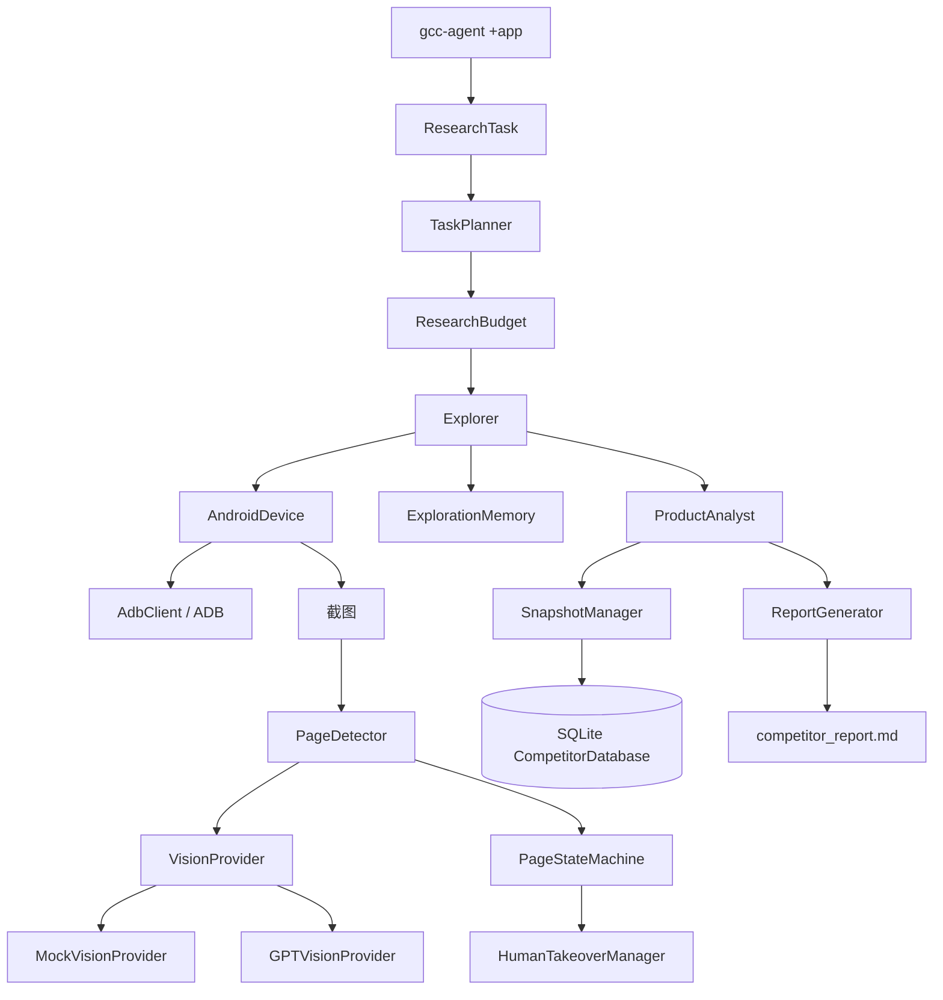

# GCC Competitor Agent 交接与复现指南

> 目的：把本项目的架构、开发阶段、安装方式、运行命令、故障处理和当前状态整理成一份可交接文档。下一个 Codex 或开发者应先完整阅读本文件，再在本项目目录执行安装和验证。
>
> 安全说明：本文件绝不保存任何真实 API Key、手机账号、验证码或设备敏感信息。API Key 只能在本地终端隐藏输入，或使用本地未提交的 `.env` 文件。

## 1. 项目目标

GCC Competitor Agent 是一个基于 Python 3.11、ADB、scrcpy 和 GPT Vision 的 Android 泛娱乐竞品自动研究 Agent。

它可以完成：

1. 通过 ADB 连接 Android 手机。
2. 启动竞品 App、点击、滑动、返回、等待和截图。
3. 用 YAML 描述固定采集流程。
4. 通过 PageState 和 PageDetector 理解页面。
5. 使用 MockVisionProvider 或 GPTVisionProvider 分析页面截图。
6. 根据研究目标生成页面采集计划。
7. 自动采集截图、Metadata 和页面识别结果。
8. 遇到登录、验证码或未知页面时暂停，等待人工通过 scrcpy/手机处理。
9. 生成产品分析、竞品快照、版本差异和 Markdown 报告。

深度采集策略：Explorer 会先穷举 Home、Discover、Moment、Message、Me/Profile
等一级导航，再进入房间列表、房间、礼物、VIP、钱包、活动和公会。它会优先
使用 Vision 返回的 `interactive_elements` 坐标；没有坐标时读取 `wm size`
并使用设备尺寸感知的兜底坐标。相同 PNG 不会重复发送给 Vision，连续画面不变
时会自动返回尝试下一条路线。

Ark Provider 对模型偶发返回的 Markdown、Python 字典、尾逗号和未加引号字段
做了容错解析；无法修复时返回 UNKNOWN，交给人工接管，不让一次格式错误终止整条任务。

当前入口：

```bash
gcc-agent +<Android包名>
```

例如：

```bash
gcc-agent +com.hawatalk.live
```

注意：`+` 后面必须是 Android package name，不是 App 显示名称。

## 2. 技术栈与运行前提

- macOS 或 Linux
- Python 3.11
- Android SDK Platform Tools（提供 `adb`）
- Android 手机或模拟器
- 手机开启 USB 调试
- scrcpy（人工接管时使用，可选但推荐）
- OpenAI API Key 和可用 API 额度（GPT 模式需要）

Python 依赖由以下文件管理：

- `requirements.txt`：运行时依赖，包括 `openai`
- `requirements-dev.txt`：运行时依赖加测试、类型检查和 lint 工具
- `pyproject.toml`：Python 3.11 约束、打包配置和 `gcc-agent` 命令入口

## 3. 当前项目结构

```text
gcc-competitor-agent/
├── src/gcc_agent/
│   ├── adb/                 # AdbClient、AndroidDevice、ADB 异常
│   ├── actions/             # Action 抽象和 launch/tap/swipe/back/wait/screenshot
│   ├── capture/             # Screenshot Metadata
│   ├── page_state/          # PageState、PageDetector、状态机
│   ├── vision/              # VisionProvider、Mock、GPT、GLM、Ark、Prompt、Factory
│   ├── workflow/             # YAML 解析和 WorkflowRunner
│   ├── tasks/                # ResearchTask、TaskPlanner、任务解析
│   ├── explorer/             # observe → decide → execute 探索循环
│   ├── memory/               # 已访问页面和截图记忆
│   ├── reporting/            # ProductAnalyst、CompetitorKnowledge、报告
│   ├── knowledge/            # SQLite、Snapshot、Diff、Score、Taxonomy
│   ├── takeover/             # 人工接管、resume/abort
│   ├── pipeline/             # ResearchPipelineRunner、ResearchBudget
│   └── cli.py                # gcc-agent CLI
├── flows/                    # YAML 固定流程示例
├── tasks/                    # full_analysis/monetization/room_ecology
├── demo/                     # Vision 分析输入示例
├── tests/                    # 单元测试
├── pyproject.toml
├── requirements.txt
├── requirements-dev.txt
├── .env.example
└── README.md
```

## 4. 整体框架



核心设计原则：

- ADB、Action、WorkflowRunner 不依赖具体 Vision 模型。
- `VisionProvider` 是模型替换边界，Mock 和 GPT 共用同一接口。
- `PageDetector` 只负责把 Vision 结果适配成 `PageDetection`。
- `Explorer` 负责观察、记忆、决策和执行，不直接实现 GPT 调用。
- 报告和数据库只消费结构化分析结果，不依赖截图采集细节。

## 5. Phase 1–8 开发历程

### Phase 1：基础工程和 Android 控制

完成内容：

- Python 3.11 项目初始化。
- `pyproject.toml`、requirements、src layout。
- `AdbClient`：执行 ADB 命令、列出设备、shell、tap、swipe、返回、启动 App、截图。
- `AndroidDevice`：设备连接检查和基础设备能力封装。
- 基础 CLI Demo。

### Phase 2：固定流程引擎

完成内容：

- YAML 流程模型和解析器。
- `Action` 抽象层。
- `LaunchAppAction`、`TapAction`、`SwipeAction`、`BackAction`、`WaitAction`、`ScreenshotAction`。
- `WorkflowRunner` 按顺序执行 YAML。
- `flows/yalla.yaml` 示例。

支持的 YAML action：

```yaml
steps:
  - action: launch_app
  - action: screenshot
    name: home
  - action: tap
    x: 540
    y: 1600
  - action: swipe
    x1: 540
    y1: 1800
    x2: 540
    y2: 600
    duration_ms: 500
  - action: back
  - action: wait
    duration_ms: 1000
```

### Phase 3：页面理解层

完成内容：

- Screenshot Metadata sidecar JSON。
- `PageState` 状态机。
- `PageDetector` 抽象接口。
- `VisionProvider` 抽象接口。
- `MockVisionProvider`。

当前页面状态枚举：

```text
UNKNOWN
HOME
ROOM_LIST
ROOM
GIFT_PANEL
VIP
WALLET
LOGIN_POPUP
CAPTCHA
ERROR
ACTIVITY
GUILD
```

每张截图旁边会生成 JSON，包含：

```json
{
  "app": "com.example.app",
  "page": "HOME",
  "timestamp": "2026-07-23T08:00:00+00:00",
  "action": "screenshot",
  "device": "<adb-serial>",
  "screenshot_path": "outputs/demo/home.png"
}
```

### Phase 4：任务规划与自主采集

完成内容：

- `ResearchTask`：app、objective、target_pages、completed_pages。
- `TaskPlanner`：根据目标选择页面顺序。
- `Explorer`：observe、decide、execute。
- `ExplorationMemory`：记录已访问页面和截图，减少重复探索。
- 三个任务模板：
  - `tasks/full_analysis.yaml`
  - `tasks/monetization.yaml`
  - `tasks/room_ecology.yaml`

当前早期导航仍使用 `Explorer.DEFAULT_NAVIGATION` 中的坐标策略。后续若要完全基于 GPT 返回的元素坐标，需要扩展 `PageDetection.elements` 为带坐标的结构，但不应破坏 ADB、Action 和 WorkflowRunner 接口。

### Phase 5：GPT Vision

完成内容：

- `GPTVisionProvider` 使用 OpenAI Responses API。
- GPT/Mock 通过 `--vision-mode mock|gpt` 切换。
- 页面分析 JSON 包含：

```json
{
  "page_type": "ROOM",
  "confidence": 0.93,
  "elements": ["gift button", "chat area"],
  "business_type": "live_room",
  "next_action": "open gift panel"
}
```

- Prompt 覆盖首页、房间、礼物、钱包、VIP、活动、公会。
- GPT Schema 使用 strict structured outputs。
- 缺少环境变量时会使用隐藏输入提示，不会在终端回显 API Key。

同时已接入 Z.AI GLM Vision：

- `GLMVisionProvider` 使用 Z.AI OpenAI-compatible Chat Completions API。
- GLM 使用独立配置：`ZAI_API_KEY`、`ZAI_BASE_URL`、`GLM_MODEL`。
- 默认视觉模型为 `glm-4.5v`；`GLM-5.2` 更适合文本/报告任务，截图识别应使用视觉模型。
- GLM 通过 `response_format={"type": "json_object"}` 获取 JSON，再由本地 Pydantic 校验。
- 运行时使用 `--vision-mode glm`，不依赖 OpenAI 服务或 `OPENAI_API_KEY`。

同时已接入火山方舟 Ark Vision：

- `ArkVisionProvider` 使用 `https://ark.cn-beijing.volces.com/api/v3` 的 Chat Completions 接口。
- 配置使用 `ARK_API_KEY`、`ARK_BASE_URL`、`ARK_MODEL`。
- `ARK_MODEL` 必须填写方舟视觉模型 ID 或控制台创建的视觉推理接入点 `ep-...`。
- 本地截图转为 `data:image/...;base64,...`，按 `image_url` 多模态消息发送。
- 运行时使用 `--vision-mode ark`。
- Ark 请求超时为 90 秒且关闭自动重试，避免 Coding Plan 网络异常时进程无限等待。

当前严格 Schema 的实现位于：

```text
src/gcc_agent/vision/gpt.py
```

其中 `_openai_page_detection_schema()` 会：

1. 为所有 property 补齐 `required`。
2. 删除 OpenAI strict schema 不接受的 `default`。

### Phase 6：竞品分析报告

完成内容：

- `CompetitorKnowledge` 数据模型。
- `ProductAnalyst`：页面目的、用户价值、商业价值、收入影响、留存影响、可复制建议。
- `ReportGenerator`：Markdown 报告。

报告章节包括：

```text
产品定位
用户路径
首页分析
房间生态
礼物体系
VIP体系
商业化模型
活动运营
GCC市场适配
对我方产品建议
```

### Phase 7：知识库和版本差异

完成内容：

- SQLite `CompetitorDatabase`。
- `SnapshotManager`。
- `DiffEngine`：新增、删除、修改功能和商业影响。
- Taxonomy：`monetization`、`retention`、`social`、`host_ecology`。
- `CompetitorScorer`：能力评分和解释。

### Phase 8：完整研究 Pipeline

完成内容：

```text
创建 ResearchTask
→ TaskPlanner
→ ResearchBudget
→ Explorer 自动采集
→ PageDetector / VisionProvider
→ ProductAnalyst
→ SnapshotManager / SQLite
→ ReportGenerator
```

额外能力：

- `--max-pages`
- `--max-screenshots`
- `--priority-module`
- 登录、验证码、未知页面人工接管。

Pipeline 在第一次截图前会先连接设备并启动研究任务中的 Android package，避免直接对启动器、锁屏或黑屏进行 Vision 分析。

## 6. 从零安装

### 6.1 获取并进入项目

```bash
cd "/path/to/gcc-competitor-agent"
```

不要在路径中混入终端提示符，例如不要复制 `(\.venv) bash-3.2$`。

### 6.2 检查 Python

```bash
python3.11 --version
```

应为 Python 3.11.x。然后创建虚拟环境：

```bash
python3.11 -m venv .venv
source .venv/bin/activate
python -m pip install --upgrade pip
```

### 6.3 安装 Python 依赖和项目

```bash
python -m pip install -r requirements-dev.txt
python -m pip install -e .
```

使用 `-e` 是为了让源码修改立即对 `gcc-agent` 生效。

验证：

```bash
which gcc-agent
gcc-agent --help
```

如果 `gcc-agent` 找不到，先确认已经执行：

```bash
source .venv/bin/activate
python -m pip install -e .
```

### 6.4 安装 ADB

macOS 推荐：

```bash
brew install --cask android-platform-tools
adb version
```

如果 Homebrew 安装异常，可以从 Android 官方 Platform Tools 下载并解压，然后通过 `--adb-path` 指定 `platform-tools/adb`。本次开发环境曾使用项目内路径：

```text
.tools/platform-tools/adb
.venv/bin/adb
```

项目内的 ADB 不是代码依赖，换机器时应重新安装或重新指定路径。

### 6.5 连接手机

手机开启开发者选项和 USB 调试，连接后执行：

```bash
adb devices
```

正常结果类似：

```text
List of devices attached
<serial>    device
```

若显示 `unauthorized`，解锁手机并确认 USB 调试授权弹窗。

查询目标 App 包名：

```bash
adb shell pm list packages | grep -i hawa
```

### 6.6 安装 scrcpy

scrcpy 用于观察和人工接管手机，不负责替代 ADB：

```bash
brew install --cask scrcpy
scrcpy -s <serial>
```

## 7. 配置 GPT Vision

### 7.1 安全推荐：运行时隐藏输入

直接运行 GPT 命令：

```bash
gcc-agent +<package> \
  --serial <serial> \
  --adb-path adb \
  --vision-mode gpt
```

没有 `OPENAI_API_KEY` 时，程序会显示：

```text
OpenAI API Key（输入时不会显示）:
```

此时在本地粘贴新 Key 并按回车。终端不会显示 Key。不要把 Key 粘贴到聊天窗口，也不要把它当作 shell 命令直接执行。

### 7.2 环境变量方式

可以复制 `.env.example` 为本地 `.env`，然后只在本机填写：

```bash
cp .env.example .env
chmod 600 .env
```

`.env` 示例格式：

```dotenv
VISION_MODE=gpt
OPENAI_API_KEY=<local-secret>
OPENAI_MODEL=gpt-4o
```

`.env` 不得提交到 Git。项目已经将 `.env` 加入忽略规则。

### 7.3 GPT 模式前提

API Key 有效并不代表账户一定有额度。若返回：

```text
429 insufficient_quota
You exceeded your current quota
```

说明代码已经成功调用到 OpenAI，但当前 API 项目没有可用余额、预算或模型权限。需要到 OpenAI Platform 检查 Billing、Project Budget 和模型权限。这个错误不是 ADB、Python 或 JSON Schema 错误。

### 7.4 Z.AI GLM 模式

GLM 模式不使用 OpenAI API Key，而使用智谱/Z.AI API Key：

```dotenv
VISION_MODE=glm
ZAI_API_KEY=<local-secret>
ZAI_BASE_URL=https://api.z.ai/api/paas/v4/
GLM_MODEL=glm-4.5v
```

运行：

```bash
gcc-agent +com.hawatalk.live \
  --serial <serial> \
  --adb-path .venv/bin/adb \
  --vision-mode glm
```

如果没有设置 `ZAI_API_KEY`，交互式终端会显示隐藏输入提示。GLM Provider 使用的是 OpenAI Python SDK 的兼容客户端，但请求目标是 `ZAI_BASE_URL`，并不是 OpenAI 服务。

截图识别推荐使用视觉模型，例如 `glm-4.5v`；纯文本 GLM 模型更适合后续报告分析，不应直接作为截图识别模型。

### 7.5 火山方舟 Ark 模式

火山方舟不使用 OpenAI API Key。配置示例：

```dotenv
VISION_MODE=ark
ARK_API_KEY=<local-secret>
ARK_BASE_URL=https://ark.cn-beijing.volces.com/api/v3
ARK_MODEL=ep-your-vision-endpoint
```

运行：

```bash
gcc-agent +com.hawatalk.live \
  --serial <serial> \
  --adb-path .venv/bin/adb \
  --vision-mode ark
```

官方接口要求 `model` 填写模型 ID 或视觉推理接入点 ID；如果没有填写 `ARK_MODEL`，程序会在启动时明确报错，不会盲猜模型。

如果 Key 来自 Coding Plan，不能使用普通的 `/api/v3` 地址。配置为：

```dotenv
VISION_MODE=ark
ARK_PLAN=coding
ARK_API_KEY=<coding-plan-secret>
ARK_BASE_URL=https://ark.cn-beijing.volces.com/api/coding/v3
ARK_MODEL=doubao-seed-2.0-code
```

代码在 `ARK_PLAN=coding` 且没有显式设置 `ARK_BASE_URL` 时，会自动选择 Coding Plan Base URL，并默认选择 `doubao-seed-2.0-code`。Coding Plan 的浏览器登录状态不等于本地 CLI 授权；CLI 仍需要读取 Coding Plan API Key。

## 8. 运行方式

### 8.1 最简完整研究命令

```bash
gcc-agent +com.hawatalk.live \
  --serial <serial> \
  --adb-path adb \
  --vision-mode gpt
```

如果使用项目内 ADB：

```bash
gcc-agent +com.hawatalk.live \
  --serial <serial> \
  --adb-path .venv/bin/adb \
  --vision-mode gpt
```

### 8.2 带预算和优先级

```bash
gcc-agent research com.hawatalk.live \
  --serial <serial> \
  --adb-path adb \
  --vision-mode gpt \
  --objective "full analysis" \
  --max-pages 8 \
  --max-screenshots 20 \
  --priority-module monetization \
  --priority-module host_ecology
```

支持的优先模块：

```text
monetization
retention
social
host_ecology
```

### 8.3 Mock 模式

Mock 模式不需要 OpenAI Key，适合测试 CLI、ADB、流程和输出目录：

```bash
gcc-agent +com.hawatalk.live \
  --serial <serial> \
  --adb-path adb \
  --vision-mode mock
```

MockVisionProvider 主要根据截图文件名识别 `home`、`room`、`gift`、`vip`、`wallet` 等状态，不是真实像素理解。因此 Mock 模式不能代替 GPT 竞品分析。

### 8.4 固定 YAML 流程

```bash
gcc-agent --flow flows/yalla.yaml \
  --serial <serial> \
  --adb-path adb \
  --vision-mode mock
```

### 8.5 直接处理已有 Vision 结果并生成报告

```bash
gcc-agent \
  --analysis-json demo/vision_results.json \
  --app-name Yalla \
  --app-package com.example.yalla \
  --report-output outputs/reports/yalla_competitor_report.md
```

## 9. 人工接管操作

当页面被识别为以下状态时会暂停：

```text
LOGIN_POPUP
CAPTCHA
UNKNOWN
```

程序会输出截图路径，并显示：

```text
takeover>
```

正确操作：

1. 通过 scrcpy 或直接操作手机完成登录、验证码或页面处理。
2. 回到当前终端输入：

```text
resume
```

3. 如果要停止任务，输入：

```text
abort
```

`takeover>` 不是 shell 提示符。不要在这里输入 `cd`、`source` 或完整的 `gcc-agent` 命令。多行 shell 命令必须先退出 takeover，再回到普通的 `$` 或 `%` 提示符执行。

## 10. 输出目录

完整研究通常输出到：

```text
outputs/research/<app>/<version>/
├── screenshots/
├── memory.json
└── competitor_report.md
```

知识库默认位置：

```text
outputs/knowledge/competitors.db
```

固定 YAML 流程的截图和 Metadata 位于对应的 `outputs/<flow-name>/` 目录。

## 11. 版本快照、差异和评分

保存一版分析：

```bash
gcc-agent \
  --analysis-json demo/vision_results.json \
  --app-name Yalla \
  --app-package com.example.yalla \
  --snapshot-version 1.0 \
  --database outputs/knowledge/competitors.db \
  --report-output outputs/reports/yalla-v1.0.md
```

保存另一版后比较：

```bash
gcc-agent \
  --app-package com.example.yalla \
  --diff-versions 1.0 1.1 \
  --database outputs/knowledge/competitors.db
```

评分：

```bash
gcc-agent \
  --app-package com.example.yalla \
  --score-version 1.1 \
  --database outputs/knowledge/competitors.db
```

## 12. 已遇到的问题与修复结果

### 问题 A：`gcc-agent: command not found`

原因：虚拟环境未激活，或项目没有执行 editable install。

修复：

```bash
source .venv/bin/activate
python -m pip install -e .
```

### 问题 B：`unrecognized arguments: Hawa`

原因：CLI 接收 Android package name，不接收随意的 App 名称；早期输入 `gcc-agent Hawa` 不符合参数定义。

修复：

```bash
gcc-agent +com.hawatalk.live
```

### 问题 C：`adb executable was not found`

原因：系统找不到 `adb`。

修复：安装 Android Platform Tools，或用 `--adb-path` 指定实际路径：

```bash
adb version
gcc-agent +com.hawatalk.live --adb-path .venv/bin/adb
```

### 问题 D：`No Android device in the ready state`

原因：手机没有连接、没有开启 USB 调试，或仍处于 `unauthorized`。

修复：

```bash
adb devices
```

确认设备状态必须是 `device`。

### 问题 E：GPT 模式缺少 `openai` 模块

原因：旧虚拟环境没有重新安装最新 requirements。

修复：

```bash
source .venv/bin/activate
python -m pip install -r requirements-dev.txt
```

当前 `requirements.txt` 已包含：

```text
openai>=1.0
```

### 问题 F：把中文占位符当成 API Key

例如把 `你的 API Key` 设置成 Key，会导致 ASCII 编码错误。

修复：代码现在会拒绝非 ASCII 占位符，并在没有 Key 时使用隐藏输入提示。必须输入真实且未泄露的 Key。

### 问题 G：GPT Schema 缺少 `required` 字段

OpenAI strict structured outputs 要求每个 property 都出现在 `required` 中。代码已增加 `_openai_page_detection_schema()` 自动补齐。

### 问题 H：GPT Schema 的 `$ref` 携带 `default`

OpenAI 不接受 `$ref` 节点旁边的 `default`。代码已递归删除发送给 OpenAI 的 Schema 中所有 `default`，本地 Pydantic 模型默认值不受影响。

### 问题 I：`429 insufficient_quota`

原因：OpenAI 请求已经到达服务端，但 API 项目没有可用额度或预算。

修复：到 OpenAI Platform 检查 Billing、Project Budget 和模型权限。换 Key 只有在新 Key 属于有额度的项目时才有用。

如果使用 GLM，则对应检查 Z.AI 账户的 API 额度、模型权限和 `ZAI_BASE_URL`，不要把 GLM Key 填入 `OPENAI_API_KEY`。

### 问题 J：人工接管时终端卡在 `takeover>`

原因：程序正在等待人工处理，不是 shell 卡死。

修复：用 scrcpy/手机处理页面，然后只输入 `resume` 或 `abort`。

## 13. 验证项目是否安装成功

在项目根目录、虚拟环境激活后运行：

```bash
.venv/bin/pytest -q
.venv/bin/ruff check .
.venv/bin/mypy src
git diff --check
```

当前开发完成后的验证结果：

```text
22 passed
Ruff: All checks passed
Mypy: Success: no issues found
```

如果测试数量发生变化，以当前代码实际输出为准。

## 14. 给下一个 Codex 的执行要求

把本文件交给其他 Codex 后，建议它按以下顺序操作：

1. 阅读本文件和 `README.md`。
2. 检查 Python、ADB、手机连接和项目文件。
3. 创建或激活 `.venv`。
4. 安装 `requirements-dev.txt` 和项目本身。
5. 先运行测试、Ruff、Mypy。
6. 先用 Mock 模式确认 CLI 和 ADB 流程。
7. 再确认 OpenAI API Key 的本地配置和账户额度。
8. 用 GPT 模式执行真实研究。
9. 遇到错误先根据本文件第 12 节判断是环境、设备、Key、额度还是代码问题。

不得要求用户把 API Key 发到聊天中，也不得把 API Key 写入 Git、README、截图、日志或本交接文档。

## 15. 当前已知限制和后续建议

- Explorer 当前仍包含早期坐标导航策略；不同 App 或屏幕分辨率需要校准坐标。
- GPT 页面识别已经接入，但账户必须有可用 API 额度。
- scrcpy 目前是人工观察和接管工具，尚未由 Agent 自动启动和关闭。
- OCR 尚未独立接入；文本理解目前由 GPT Vision 完成。
- 复杂登录、验证码、支付和权限弹窗必须人工处理。
- Android App 包名、设备序列号、页面坐标和 App 版本不应硬编码为通用配置。
- 研究结果应保留截图、Metadata、Vision JSON、快照和报告，便于版本复盘。

## 16. 最终整理版：按问题修正后的安装与运行方案

### 16.1 重要说明

本文件现在作为本 Agent 的唯一交接与复现记录。按照本次清理要求，原项目中的
源码、虚拟环境、ADB 二进制、配置文件、README、测试、输出截图和数据库都会被
删除，因此本文件本身不是可直接运行的代码备份。

如果未来要恢复 Agent，需要由新的 Codex 或开发者依据本文件重新创建 Python
项目和源码，再按下面的顺序安装。文档中所有 Key、设备序列号和路径都使用占位符，
不得把真实凭证补写进本文件。

### 16.2 推荐安装顺序

必须在每个新终端先进入项目并激活虚拟环境：

```bash
cd "/path/to/gcc-competitor-agent"
python3.11 -m venv .venv
source .venv/bin/activate
python -m pip install --upgrade pip
python -m pip install -r requirements-dev.txt
python -m pip install -e .
```

安装完成后立即验证命令入口：

```bash
which gcc-agent
gcc-agent --help
```

如果显示 `command not found`，不要直接重复执行命令，先检查：

```bash
source .venv/bin/activate
python -m pip install -e .
which gcc-agent
```

### 16.3 ADB 和设备配置

macOS 推荐安装 Android Platform Tools：

```bash
brew install --cask android-platform-tools
adb version
adb devices
```

设备必须显示为 `device`，不能是 `unauthorized` 或 `offline`。如果系统找不到
ADB，使用绝对路径运行，不要把虚拟环境中的 Python 路径误当成 ADB 路径：

```bash
gcc-agent +<android.package> \
  --serial <device-serial> \
  --adb-path "/absolute/path/to/platform-tools/adb"
```

手机需要开启开发者选项、USB 调试，并在手机上确认授权弹窗。应用名称不是 CLI
参数，必须先查包名：

```bash
adb shell pm list packages | grep -i <keyword>
```

### 16.4 火山方舟 Coding Plan 配置

Coding Plan 使用兼容接口时必须同时满足以下三项：

```bash
export ARK_PLAN="coding"
export ARK_BASE_URL="https://ark.cn-beijing.volces.com/api/coding/v3"
export ARK_MODEL="doubao-seed-2.0-code"
```

浏览器登录状态不能自动传递给本地 CLI。程序仍然需要在本地读取 Coding Plan
API Key。推荐使用隐藏输入，不要把 Key 写入命令、README、截图或聊天：

```bash
gcc-agent +<android.package> \
  --serial <device-serial> \
  --adb-path ".venv/bin/adb" \
  --vision-mode ark \
  --model "$ARK_MODEL"
```

出现以下提示时，在终端粘贴 Key 并回车，输入不会回显：

```text
火山方舟 API Key（输入时不会显示）:
```

禁止把 `你的 API Key`、带中文的占位符或已经出现在截图中的旧 Key 当作真实凭证。
如果 Key 曾经出现在聊天或截图中，应先在服务商后台撤销，再生成新 Key。

### 16.5 推荐的完整研究命令

```bash
cd "/path/to/gcc-competitor-agent"
source .venv/bin/activate

export ARK_PLAN="coding"
export ARK_BASE_URL="https://ark.cn-beijing.volces.com/api/coding/v3"
export ARK_MODEL="doubao-seed-2.0-code"

gcc-agent +<android.package> \
  --serial <device-serial> \
  --adb-path ".venv/bin/adb" \
  --vision-mode ark \
  --model "$ARK_MODEL" \
  --objective "full analysis" \
  --max-pages 16 \
  --max-screenshots 60 \
  --priority-module monetization \
  --priority-module retention \
  --priority-module social \
  --priority-module host_ecology
```

### 16.6 运行时问题判断顺序

1. 终端停在 API Key 提示：任务尚未开始，只需要在本地输入 Key。
2. `adb executable was not found`：修复 `--adb-path`，不是 Python 依赖问题。
3. `Device is not ready`：检查 `adb devices`、USB 调试和 serial。
4. `ModelNotOpen` 或 `InvalidEndpointOrModel`：Base URL、模型服务或账户权限不匹配。
5. `429 insufficient_quota`：账户额度、预算或模型权限不足，不是代码问题。
6. `Invalid JSON`：应使用带容错解析的最新 Provider；不要把模型返回文本直接交给严格 JSON 解析器。
7. 首张截图全黑：App 启动后先等待，再重截；不要马上把黑图交给 Vision。
8. 截图是正常首页但识别为 UNKNOWN：优先保留 `page_type`，丢弃格式错误的可点击元素；不要因为一个坏坐标丢掉整页结果。
9. 终端出现 `takeover>`：程序正在等待人工接管，只能输入 `resume` 或 `abort`，不能在此提示符下输入 shell 命令。

### 16.7 反复 `resume` 的真实原因与最终结论

本次真实运行中，反复 `resume` 不是因为用户没有打开 App，而是多个问题叠加：

- 初始版本首张截图发生在 App Activity 尚未渲染完成的黑屏阶段。
- 部分模型响应的 `interactive_elements` 字段格式异常，导致完整页面结果被错误降级为 UNKNOWN。
- 设备曾经从 HawaTalk 回到了 Android 启动器，Explorer 没有自动检查前台包名并重新拉起目标 App。
- 人工接管机制设计为“任何 UNKNOWN 都暂停”，因此同一轮任务可能连续要求多次 `resume`。

已完成的修复包括：启动等待、黑屏重截、页面核心字段优先解析、坏坐标丢弃、设备尺寸感知坐标、一级 Tab 规划和相同截图去重。

仍需后续实现的彻底修复是：在每次观察前读取当前前台包名；如果前台不是目标 App，自动重新启动目标 App，而不是直接触发人工接管。若要实现真正无人值守采集，必须完成这一项，并为“登录/验证码 UNKNOWN”和“启动器 UNKNOWN”建立不同处理分支。

### 16.8 删除前的最终验证记录

在清理项目之前，源码版本已完成以下本地验证：

```text
33 passed
Ruff: All checks passed
Mypy: Success: no issues found
```

已验证的能力包括：ADB、AndroidDevice、YAML Workflow、Action、PageState、VisionProvider、TaskPlanner、Explorer、人工接管、竞品分析、快照数据库、差异分析、评分和 Markdown 报告。

### 16.9 清理后的文件约定

清理完成后，`gcc-competitor-agent` 目录只保留本文件：

```text
GCC_AGENT_HANDOFF.md
```

任何未来恢复操作都应先复制或备份本文件，再重新创建代码和配置，不要期待已删除的
`.venv`、`.tools`、`outputs`、`requirements.txt` 或 `README.md` 仍然存在。
