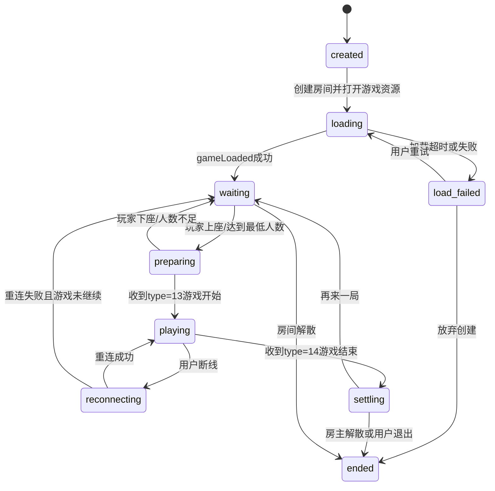
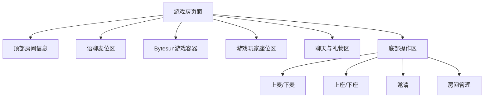
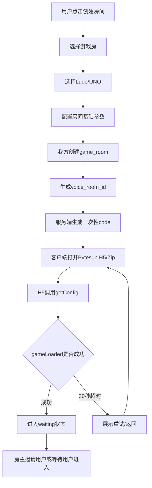
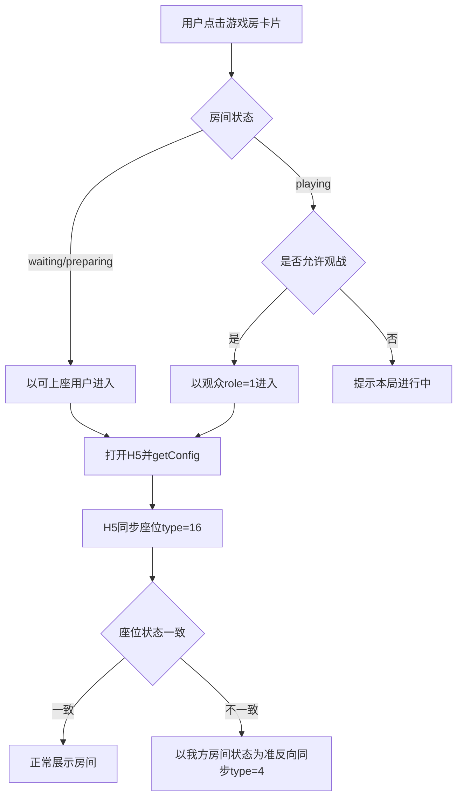
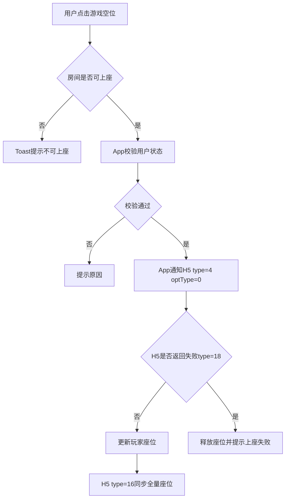
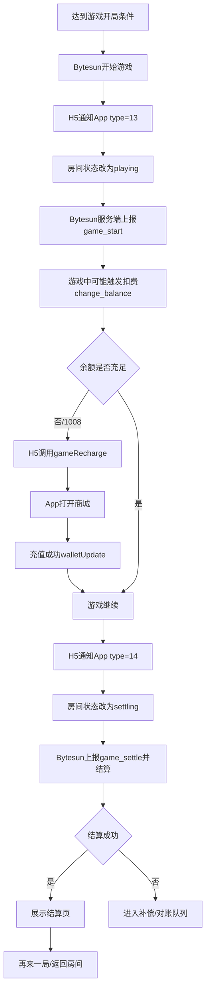
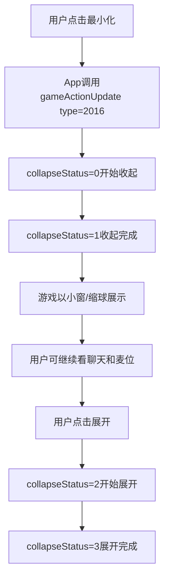
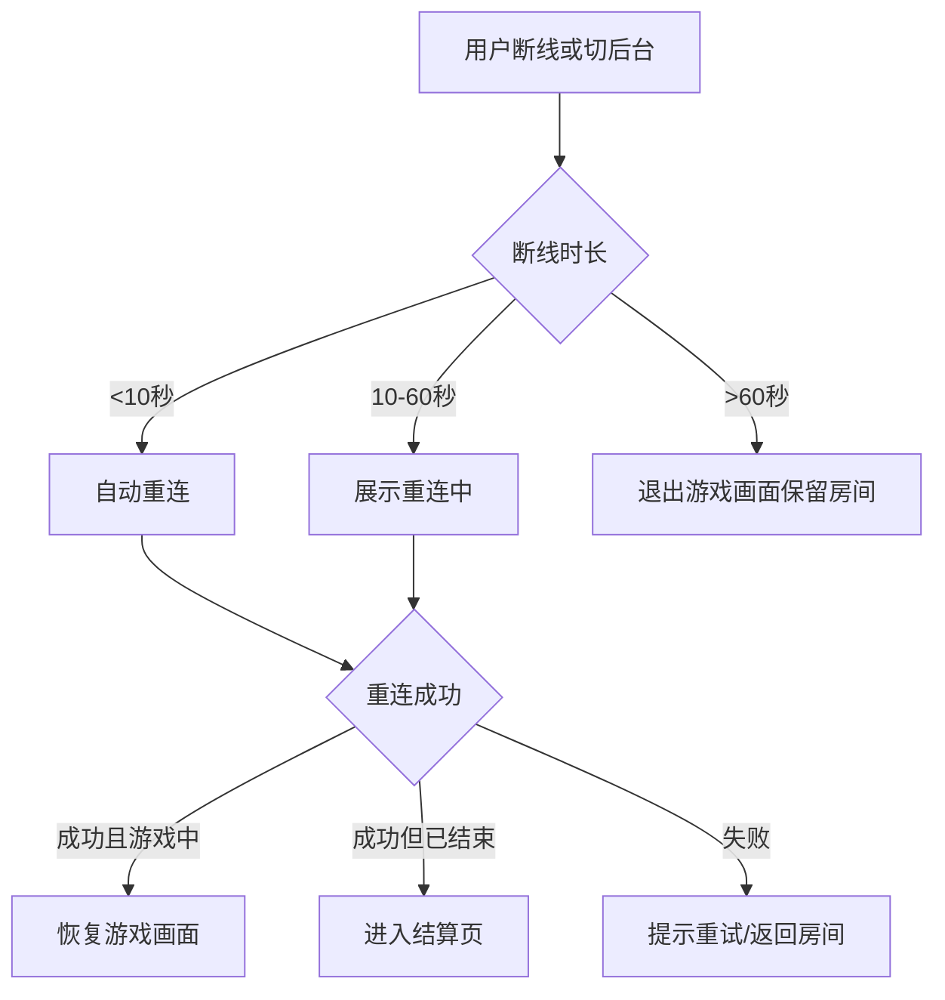

# WeChill 游戏房 MVP 产品设计框架 v2.0

生成日期：2026-04-22  
文档类型：PRD 评审框架 / MVP 重构版  
面向区域：MENA / 中东语聊房  
三方能力：BytesunGame 语聊房模式 v1.0.7  
评审重点：在原有语聊房基础上新增“游戏房”房间类别，优先跑通 Ludo / UNO 的创建、进入、语音互动、游戏开局、结算和复玩。

## 0. 本版修正说明

### 0.1 本版不做的事情

这版重新收敛 MVP，不把后续能力塞进首版。

| 能力 | 本版处理 | 原因 |
| --- | --- | --- |
| 排麦模式 | 不接入游戏房 MVP，仅参考麦位数量和管理员权限。 | 排麦是独立房间麦位模式，不能和游戏房首版混在一起。 |
| 红包返奖 / Lucky Pocket | 后续版本考虑。 | 涉及经济激励、风控和返奖口径，不能拖慢接入 MVP。 |
| 龙蛋贡献 | 后续版本考虑。 | 属于运营玩法融合，需单独配置和数据口径。 |
| CP / Soul Pair 亲密值 | 后续版本考虑。 | 属于关系玩法融合，不进入游戏房基础链路。 |
| 正式随机匹配 | V2 单独做。 | 匹配需要队列、预占、等待页、风控和降级策略，不进入 MVP。 |
| 你画我猜 | V1.1 做。 | 需要聊天双向同步、内容审核和举报链路，不作为首个 MVP 阻塞项。 |
| AI / 机器人补位 | V3 或更后。 | 依赖 Bytesun 明确支持，且涉及真人局和结算口径。 |
| RTC 推理游戏 | V3 做。 | 狼人杀、谁是卧底涉及游戏内 RTC、麦克风同步和主持规则。 |

### 0.2 本版从排麦模式文档只抽取什么

排麦文档用于理解现有语聊房能力，不用于设计“游戏房排麦模式”。

| 信息 | 从排麦文档得到的结论 | 游戏房 MVP 使用方式 |
| --- | --- | --- |
| 麦位数量 | 排麦模式默认 15 麦，其他麦位数量可手动选择。 | 证明语聊房已有麦位数量模板能力。游戏房 MVP 复用既有语聊麦位模板，不新增排麦队列。 |
| 管理员基础权限 | 闲聊模式下管理员权益包括踢人下麦、踢人出房间、邀请用户上麦、锁麦权益，锁麦默认开启。 | 游戏房 MVP 复用这四项基础管理员权限。 |
| 管理员排麦权限 | 排麦模式下才涉及自由上下麦、操作排麦用户列表。 | 不进入游戏房 MVP。后续若做游戏房排麦再评审。 |
| 管理员操作通知 | 管理员踢下麦或踢出房间时，需要给房主系统消息提醒。 | 游戏房 MVP 建议沿用，便于房主追责。 |
| 文档疑点 | PDF 中写“排麦模式下展示 5 个”，但条目实际包含基础 4 项 + 排麦 2 项。 | 后台权限项需要单独确认，不影响 MVP 只取基础 4 项。 |

### 0.3 v3.0 与旧 1.0 的查缺补漏结果

本版不是在 v1.1 / v1.2 上粘补，而是重新按评审逻辑组织。

| 来源内容 | 旧 1.0 是否充分 | 本版处理位置 |
| --- | --- | --- |
| 产品定位、目标用户、游戏房作为语聊房类别 | 基本充分 | 第 1 章 |
| P0 / P1 / P2 范围 | 旧版有，但 MVP 混入太多后续能力 | 第 2 章重新收敛 |
| 房间类型与状态机 | 有，但缺 MVP 口径 | 第 3 章 |
| 游戏梯队和游戏参数 | 有，但需要明确 Ludo / UNO 必做，画猜后置 | 第 4 章 |
| 前台入口和页面 | 有，但需要按 MVP 页面重排 | 第 5 章 |
| 创建、加入、开局、结算流程图 | v3.0 有，旧 1.0 需要汇总 | 第 6 章 |
| 声音冲突、最小化、断线重连 | v3.0 有，旧版容易漏 | 第 6.5 / 6.6 / 6.7 |
| 邀请、传播、观战、异常场景 | v3.0 有，旧版需要去掉后续玩法 | 第 7 章 |
| 麦位数量和管理员权限 | 旧版缺，排麦 PDF 可参考 | 第 8 章 |
| Bytesun JSBridge 和服务端 API | v3.0 更完整 | 第 9 章 |
| 后台管理、数据模型、埋点 | 旧版有但范围偏大 | 第 10 / 11 / 12 章 |
| MVP 周期和验收 | 旧版有，但不够拆解 | 第 13 / 16 章 |

## 1. 产品定位

### 1.1 一句话定位

游戏房是 WeChill 语聊房下的新房间类别，不是独立游戏大厅。

> 游戏房 = 语音社交 + 轻量游戏组局。游戏负责破冰，语音负责留存，房间负责关系沉淀。

### 1.2 产品原则

- 先做“房间里能玩游戏”，再做“平台级匹配和运营玩法”。
- 游戏房复用语聊房的房间、麦位、聊天、礼物、钱包、用户资料、管理员和风控体系。
- Bytesun 承接局内规则、游戏状态、H5 游戏画面和结算结果。
- 我方承接房间生命周期、用户身份、语音互动、钱包接口、座位同步、运营配置和数据归因。
- MVP 只验证基础闭环：创建房间、进入房间、加载游戏、上座开局、完成结算、再来一局。

### 1.3 MVP 业务目标

| 目标 | 衡量方式 |
| --- | --- |
| 建立游戏房新类别 | 首页 / 语聊房分类中能进入游戏房列表，用户能创建游戏房。 |
| 跑通 Bytesun 接入 | Ludo / UNO 至少两个游戏完成 H5 加载、身份传参、座位同步、开始和结束回调。 |
| 验证语聊 + 游戏的基础留存 | 游戏房停留时长、开局转化、再来一局点击率。 |
| 保证钱包和结算安全 | `change_balance` 幂等、并发锁、结算记录和补偿流程可用。 |
| 建立可运营后台 | 游戏上下架、版本配置、房间查询、游戏记录和基础看板可用。 |

### 1.4 目标用户

| 用户 | 特征 | MVP 诉求 |
| --- | --- | --- |
| 房主 / 主持人 | 熟悉语聊房，会组织用户聊天。 | 快速创建游戏房，邀请用户上座，控制房间秩序。 |
| 休闲玩家 | 想找人玩轻量游戏。 | 低门槛进入、规则简单、等待短。 |
| 社交型用户 | 聊天为主，游戏只是话题。 | 不尴尬、有话题、能边聊边看。 |
| 观战用户 | 暂时不玩，只想看和聊天。 | 能进入房间观战，能聊天送礼，等待下一局。 |
| 管理员 | 帮房主管理房间秩序。 | 复用语聊房基础管理权限，不承担复杂游戏运营权限。 |

## 2. MVP 范围

### 2.1 MVP 必做范围

| 模块 | 必做内容 |
| --- | --- |
| 房间类别 | 新增 `game_room` 游戏房类别，作为语聊房的一个分类。 |
| 入口 | 首页 / 语聊房列表新增游戏房入口；支持创建游戏房和进入公开游戏房。 |
| 游戏 | Ludo + UNO 必做；Domino 视 Bytesun 游戏 ID 和资源确认情况作为可选。 |
| 语聊能力 | 复用现有麦位、语音、聊天、礼物、用户资料、房间管理员。 |
| 麦位 | 复用语聊房麦位模板和麦位管理，不新增排麦模式。 |
| 管理员 | 复用基础管理员权限：踢人下麦、踢人出房间、邀请上麦、锁麦。 |
| 游戏加载 | 支持 Bytesun H5 / Zip 加载、loading、超时重试、版本更新。 |
| 身份 | 支持房主、玩家、观众三类游戏身份。 |
| 座位 | 支持游戏上座、下座、座位同步、上座失败提示。 |
| 开局 | 收到 `type=13` 后切换游戏中状态。 |
| 结算 | 收到 `type=14` 和服务端结算后展示结算页。 |
| 钱包 | 支持余额查询、扣费、结算、余额不足充值、充值后刷新。 |
| 复玩 | 支持再来一局、返回房间。 |
| 后台 | 支持游戏配置、游戏房查询、游戏记录、结算记录、基础数据看板。 |
| 风控 | 支持用户封禁、地区限制、游戏维护、结算异常、黑名单基础拦截。 |

### 2.2 MVP 不做范围

| 模块 | 不做内容 | 后续版本 |
| --- | --- | --- |
| 排麦 | 不做游戏房排麦队列、上麦审批、排麦浮窗。 | V2.2 或单独版本 |
| 随机匹配 | 不做跨房间随机匹配、等待队列、座位预占。 | V2 |
| 你画我猜 | 不做聊天双向同步和内容审核。 | V1.1 |
| WhatsApp 深链传播 | 不做外部分享闭环。 | V1.1 |
| 红包 / 龙蛋 / CP | 不做玩法联动和奖励加成。 | V2.1 |
| AI 补位 | 不做机器人补位。 | V3 |
| RTC 推理游戏 | 不做狼人杀、谁是卧底。 | V3 |
| 锦标赛 / 排位 | 不做榜单、段位、赛事。 | V3 |

### 2.3 MVP 成功标准

| 指标 | 建议目标 |
| --- | --- |
| 游戏加载成功率 | ≥ 95% |
| H5 `gameLoaded` 到达率 | ≥ 95% |
| 进入房间到可操作耗时 | P90 ≤ 8 秒 |
| 等待中房间开局转化率 | 首版先观察，作为后续匹配依据。 |
| 游戏完成率 | ≥ 90% |
| 结算失败率 | ≤ 0.5% |
| 上座失败率 | ≤ 3% |
| 游戏房崩溃 / 白屏率 | ≤ 1% |
| 再来一局点击率 | 首版观察，作为留存判断。 |

## 3. 房间模型

### 3.1 房间分类

| 房间类型 | 定义 | MVP 是否支持 | 说明 |
| --- | --- | --- | --- |
| 纯语聊房 | 原有语音聊天房间。 | 已有 | 不改变原能力。 |
| 游戏房 | 创建时选择游戏，房间主体验是边聊边玩。 | 支持 | MVP 主线。 |
| 混合房 | 原语聊房内临时开启游戏。 | 可选支持 | 若研发成本高，可作为 MVP 后半段灰度。 |
| 专用赛事房 | 单游戏深度运营房。 | 不支持 | 后续活动 / 锦标赛版本。 |

### 3.2 游戏房状态机



### 3.3 状态定义

| 状态 | 说明 | 用户可操作 | 系统重点 |
| --- | --- | --- | --- |
| `created` | 我方房间创建成功。 | 等待加载。 | 生成房间 ID、一次性 code。 |
| `loading` | 正在加载 Bytesun H5 / Zip。 | 可取消或等待。 | 超时检测、资源降级。 |
| `waiting` | 游戏资源已就绪，等待玩家。 | 上座、邀请、聊天、送礼。 | 展示空位和观战入口。 |
| `preparing` | 玩家已上座，等待满足开局条件。 | 准备、取消、邀请。 | 校验最小人数。 |
| `playing` | 游戏进行中。 | 玩家操作游戏；观众聊天送礼。 | 语音优先、状态同步。 |
| `reconnecting` | 用户短线断开。 | 等待重连。 | 保留房间和游戏座位。 |
| `settling` | 游戏结束，等待结算落库。 | 不允许重复操作。 | 钱包幂等、结算页展示。 |
| `ended` | 房间或当前游戏会话结束。 | 返回、重新创建。 | 释放资源。 |

### 3.4 关键字段

| 字段 | 说明 | MVP 口径 |
| --- | --- | --- |
| `room_type` | 房间类型。 | 固定 `game_room`。 |
| `voice_room_id` | 我方语聊房 ID。 | 传给 Bytesun 的 `roomId`。 |
| `game_id` | Bytesun 游戏 ID。 | V0 必须确认。 |
| `game_mode` | Bytesun 游戏模式。 | 语聊房模式固定传 `3`。 |
| `game_status` | 游戏状态。 | loading / waiting / preparing / playing / settling / ended。 |
| `voice_mic_count` | 语聊麦位数量。 | 复用现有语聊房模板，建议后台可配置。 |
| `game_min_players` | 游戏最小人数。 | 以 Bytesun 或后台配置为准。 |
| `game_max_players` | 游戏最大人数。 | Ludo 默认 4；UNO 以 Bytesun 返回为准。 |
| `spectator_enabled` | 是否允许观战。 | MVP 默认允许。 |
| `ticket_slot` | 门票档位。 | MVP 建议先免费或低风险金币档。 |
| `gsp` | 节点。 | MENA 默认 201，必要时 101。 |
| `language` | 语言。 | 阿语 `7` 优先，英语 `2` 兜底。 |

## 4. 游戏接入规划

### 4.1 MVP 游戏范围

| 游戏 | MVP 优先级 | 人数 | 时长 | 进入 MVP 条件 |
| --- | --- | --- | --- | --- |
| Ludo / 飞行棋 | P0 必做 | 2-4 | 10-20 分钟 | Bytesun 提供 game_id、资源、语聊房模式可用。 |
| UNO | P0 必做 | 2-4 或 2-6 | 5-15 分钟 | 最大人数以 Bytesun 返回为准。 |
| Domino | P1 可选 | 2-4 | 5-15 分钟 | 若资源和 game_id 提前确认，可灰度。 |
| 你画我猜 | V1.1 | 3-12 | 15-30 分钟 | 需要 `type=22` / `type=2014` 聊天同步和内容审核。 |

### 4.2 游戏参数模板

| 字段 | Ludo | UNO | Domino 可选 |
| --- | --- | --- | --- |
| Bytesun name | `ludoPlus` 待确认 | `unoPlus` 待确认 | `DominoPlus` 待确认 |
| `game_id` | 待确认 | 待确认 | 待确认 |
| 最小人数 | 2 | 2 | 2 |
| 最大人数 | 4 | 以 Bytesun 返回为准 | 4 |
| 是否允许观战 | 是 | 是 | 是 |
| 是否进入随机匹配 | MVP 不做 | MVP 不做 | MVP 不做 |
| 是否支持 `hideLobby` | 待确认 | 待确认 | 待确认 |
| 是否需要聊天同步 | 否 | 否 | 否 |
| 是否需要游戏内 RTC | 否 | 否 | 否 |

### 4.3 用户角色

| 角色 | Bytesun role | 我方身份 | MVP 权限 |
| --- | --- | --- | --- |
| 房主 | `2` | 房间 owner | 创建 / 解散房间、邀请、管理麦位、处理踢人、开始下一局。 |
| 游戏玩家 | `0` | 普通用户 | 上座、准备、参与游戏、聊天、送礼。 |
| 观众 | `1` | 听众 / 观战用户 | 观看、聊天、送礼，有空位时可转玩家。 |
| 管理员 | 不新增 Bytesun role | 房间 admin | 使用语聊房基础管理权限，不默认拥有游戏局配置权。 |

## 5. 前台产品设计

### 5.1 MVP 页面清单

| 页面 | 入口 | MVP 内容 |
| --- | --- | --- |
| 游戏房列表 | 首页 / 语聊房分类 | 游戏分类、房间卡片、创建入口。 |
| 创建游戏房 | 创建房间 | 选择游戏、房间名、语言、公开性、麦位数量、观战开关、免费 / 门票。 |
| 游戏房主界面 | 创建成功后 | 语聊麦位、游戏容器、玩家座位、邀请、房间管理。 |
| 玩家游戏中界面 | 上座后 | H5 游戏区、语音状态、聊天、礼物、最小化。 |
| 观战界面 | 游戏中进入 | 观战提示、玩家列表、聊天、送礼、等待下一局。 |
| 结算页 | 游戏结束 | 排名、得分、奖励 / 扣费、再来一局、返回房间。 |
| 异常页 / Toast | 加载、上座、结算失败 | 重试、返回、充值、换房。 |

### 5.2 入口设计

| 入口 | MVP 是否支持 | 说明 |
| --- | --- | --- |
| 首页游戏房分类 | 支持 | 作为新房间类别展示。 |
| 语聊房列表筛选 | 支持 | 增加“游戏”筛选。 |
| 创建房间选择游戏房 | 支持 | 用户创建时选择游戏房。 |
| 结算页再来一局 | 支持 | 保留房间和玩家，提升复玩。 |
| 普通语聊房内开启游戏 | 可选 | 若成本高，可放 MVP 后半段灰度。 |
| 随机匹配入口 | 不支持 | V2。 |
| WhatsApp 分享 / 深链 | 不支持 | V1.1。 |
| 活动页导流 | 不支持 | V2.1 或 V3。 |

### 5.3 游戏房卡片

卡片字段：

- 房间名。
- 游戏名和游戏 icon。
- 房主头像、昵称、等级。
- 玩家数 / 游戏最大人数。
- 房间总人数。
- 状态：等待中、准备中、游戏中、可观战、维护中。
- 语言 / 地区。
- 免费 / 门票档。
- 是否允许观战。

卡片操作：

- 等待中：进入并可上座。
- 游戏中且可观战：进入观战。
- 游戏中且不可观战：置灰或提示“本局进行中”。
- 维护中：隐藏或展示不可进入态。

### 5.4 创建游戏房

| 配置项 | MVP 默认 | 是否可编辑 | 说明 |
| --- | --- | --- | --- |
| 游戏类型 | Ludo / UNO | 必选 | Domino 可选。 |
| 房间名称 | 自动生成 | 可编辑 | 可用“昵称的 Ludo 房”。 |
| 语言 | 阿语 | 可编辑 | 支持英语兜底。 |
| 地区 / 节点 | MENA / 201 | 高级设置 | 默认不打扰用户。 |
| 公开性 | 公开 | 可编辑 | 私密房可后置。 |
| 语聊麦位数 | 沿用语聊房模板 | 可编辑 | 可参考 15 麦模板，但不启用排麦。 |
| 游戏最大人数 | 由游戏决定 | 不建议编辑 | 避免和 Bytesun 不一致。 |
| 观战开关 | 开启 | 可编辑 | MVP 建议默认开。 |
| 门票 | 免费 | 可编辑或灰度 | 首版建议免费优先，降低结算风险。 |
| 礼物 | 开启 | 可编辑 | 礼物不影响游戏结算。 |

### 5.5 房间主界面布局

MVP 信息结构：



展示规则：

- 语聊麦位和游戏座位分开展示，避免用户误以为上麦就是上座。
- 玩家可以不上麦也参与游戏。
- 上麦只影响语音互动，不直接影响 Bytesun 游戏座位。
- 上座才代表参与当前游戏。
- 房主和管理员的麦位管理权限沿用语聊房。

## 6. MVP 核心流程

### 6.1 创建游戏房



关键条件：

- `code` 必须一次性消费。
- 创建成功但 H5 加载失败时，房间可保留短时间，用户可重试。
- 若游戏处于维护或下架状态，创建入口应前置拦截。

### 6.2 加入游戏房



关键条件：

- 房间满员时，禁止进入或仅允许观战。
- 用户被封禁、地区限制、账号受限时，进入前拦截。
- 游戏资源版本过低时，先更新或降级 URL。

### 6.3 上座、下座与座位同步



座位原则：

- 游戏座位以 Bytesun 局内结果和我方房间状态共同校验。
- 发生冲突时，前台展示以我方最终确认状态为准，再通过 `gameActionUpdate type=4` 反向同步。
- 游戏进行中下座需要二次确认，避免误触导致弃权或托管。

### 6.4 开局与结算



结算原则：

- `change_balance` 必须按 `order_id` 幂等。
- 同一用户必须做并发锁，避免重复扣费或重复派奖。
- 结算页只能展示已确认或可追踪的结果。
- 结算失败不允许静默吞掉，需要进入补偿队列。

### 6.5 游戏声音与语聊语音

策略：

1. 语聊房语音优先于游戏 BGM。
2. 游戏开始时默认关闭或降低游戏 BGM，保留必要音效。
3. 用户可在游戏设置里单独控制 BGM / 音效。
4. H5 可通过 `sendGameAction type=21` 返回音效状态。
5. App 可通过 `soundUpdate` 或 `gameActionUpdate type=2012` 同步声音设置。
6. Ludo / UNO 不启用游戏内 RTC，继续使用我方语聊房语音。

### 6.6 最小化 / 缩球



MVP 最低要求：

- 至少支持 `collapseStatus=0` 和 `collapseStatus=3`。
- 最小化后不退出房间、不释放游戏座位。
- 如果 H5 不支持完整缩球动画，先做 App 容器层收起和恢复。

### 6.7 断线重连



重连原则：

- MVP 推荐保留座位 60 秒，最终以 Bytesun 实际能力为准。
- 重连成功后先恢复我方房间，再恢复 H5 游戏。
- 超过有效期后，按 Bytesun 规则处理弃权、托管或结算。

## 7. MVP 场景矩阵

### 7.1 创建与进入

| 编号 | 场景 | 触发 | 系统响应 | 异常 |
| --- | --- | --- | --- | --- |
| C1 | 创建 Ludo 房 | 选择 Ludo 并确认 | 创建 game_room，加载 H5。 | 加载失败可重试。 |
| C2 | 创建 UNO 房 | 选择 UNO 并确认 | 创建 game_room，加载 H5。 | 游戏维护则拦截。 |
| C3 | 游戏房列表进入 | 点击等待中房间 | 进入房间，可上座。 | 房间满员则提示。 |
| C4 | 游戏中进入 | 点击游戏中房间 | 允许观战则进入观众态。 | 不允许观战则不可进入。 |
| C5 | 私密房进入 | 输入邀请码或被邀请 | 校验后进入。 | 邀请失效则提示。 |

### 7.2 游戏中

| 编号 | 场景 | 触发 | 系统响应 | 异常 |
| --- | --- | --- | --- | --- |
| G1 | 上座 | 点击游戏空位 | 校验后同步 H5。 | `type=18` 提示失败。 |
| G2 | 下座 | 点击离座 | 二次确认并释放座位。 | 游戏中按规则处理。 |
| G3 | 座位同步 | H5 发送 `type=16` | 刷新玩家座位。 | 冲突时以我方确认状态为准。 |
| G4 | 点击头像 | H5 发送 `type=7` | 打开用户资料卡。 | 用户不存在则提示。 |
| G5 | 踢人 | H5 发送 `type=17` 或房主操作 | App 确认后回 `type=6`。 | 失败展示原因。 |
| G6 | 游戏开始 | H5 发送 `type=13` | 状态改为 playing。 | 未收到服务端上报时记录异常。 |
| G7 | 游戏结束 | H5 发送 `type=14` | 进入 settling。 | 结算超时进入补偿。 |
| G8 | 余额不足 | `1008` 或 `gameRecharge` | 打开商城，充值后 `walletUpdate`。 | 充值取消返回游戏。 |
| G9 | 最小化 | 点击缩球 | 收起 H5 容器。 | 不释放座位。 |
| G10 | 断线 | 网络中断 | 进入重连流程。 | 超时返回房间。 |

### 7.3 观战与互动

| 编号 | 场景 | 触发 | MVP 响应 |
| --- | --- | --- | --- |
| S1 | 纯观战 | 游戏中进入房间 | 以 `role=1` 进入，可聊天、送礼。 |
| S2 | 观战转玩家 | 等待下一局或出现空位 | 允许点击上座，身份切为 `role=0`。 |
| S3 | 观战送礼 | 点击礼物 | 复用语聊房礼物面板。 |
| S4 | 观战聊天 | 输入消息 | 进入房间聊天，不同步到 Ludo / UNO 局内。 |

### 7.4 结算与复玩

| 编号 | 场景 | 触发 | MVP 响应 |
| --- | --- | --- | --- |
| R1 | 正常结算 | game_settle 成功 | 展示排名、得分、余额变化。 |
| R2 | 再来一局 | 点击再来一局 | 保留房间，重置游戏状态。 |
| R3 | 返回房间 | 点击返回 | 关闭结算页，回到语聊房状态。 |
| R4 | 房主解散 | 房主结束房间 | 结束房间并释放游戏资源。 |
| R5 | 结算失败 | `change_balance` 超时 | 展示处理中，后台补偿。 |

### 7.5 异常与边界

| 编号 | 异常 | 触发 | 前台处理 | 后台处理 |
| --- | --- | --- | --- | --- |
| E1 | 游戏加载失败 | WebView 白屏 / 超时 | 重试、返回房间。 | 记录资源、网络和版本日志。 |
| E2 | 游戏维护 | Bytesun 返回维护或后台下架 | 提示维护，隐藏入口。 | 游戏配置置为不可用。 |
| E3 | 用户封禁 | 我方风控或 Bytesun 错误码 | 禁止进入。 | 记录拦截原因。 |
| E4 | 地区限制 | IP / 地区不支持 | 提示地区暂不支持。 | 记录地区。 |
| E5 | 上座失败 | H5 `type=18` | 释放座位，提示重试。 | 记录失败码。 |
| E6 | 结算重复 | 重复 `order_id` | 前台不重复展示。 | 幂等返回原结果。 |
| E7 | 结算失败 | 钱包接口超时 | 展示处理中。 | 补偿和对账。 |
| E8 | 低端设备 | H5 卡顿或崩溃 | 降级动画、提示重试。 | 记录机型。 |
| E9 | 房主离开 | 房主退房 | 按现有语聊房规则转让或解散。 | 清理房间状态。 |
| E10 | 管理员踢人 | 管理员操作 | 用户被下麦或踢出。 | 给房主系统消息提醒。 |

## 8. 麦位数量与管理员权限

### 8.1 麦位与游戏座位的边界

| 类型 | 归属 | 用途 | MVP 规则 |
| --- | --- | --- | --- |
| 语聊麦位 | 我方语聊房 | 语音聊天、身份展示、礼物互动。 | 复用现有语聊房能力。 |
| 游戏座位 | Bytesun / 游戏容器 | 参与 Ludo / UNO 对局。 | 由游戏人数决定。 |
| 观战身份 | 我方 + Bytesun | 看游戏、聊天、送礼。 | MVP 支持。 |

关键原则：

- 上麦不等于上游戏座位。
- 上游戏座位不强制上麦。
- 游戏人数由 Ludo / UNO 规则决定，麦位数量由语聊房模板决定。
- MVP 不新增排麦队列，也不做上麦审批弹窗。

### 8.2 麦位数量

从排麦文档确认：

- 排麦模式默认选择 15 麦。
- 其他麦位数量可以手动选择。

游戏房 MVP 建议：

| 配置 | MVP 口径 |
| --- | --- |
| 默认麦位数量 | 复用当前语聊房默认模板；如果产品需要统一游戏房默认值，可采用 15 麦。 |
| 可选麦位数量 | 复用已有语聊房可选麦位数，不新增特殊游戏麦位数。 |
| 麦位数量与游戏人数 | 两者独立。Ludo 4 人不代表房间只能 4 麦。 |
| 后台配置 | 游戏房模板需保存 `voice_mic_count`，用于前台布局和房间创建。 |

需要评审确认：

1. 游戏房默认麦位数是否沿用普通闲聊房默认值，还是统一设为 15 麦。
2. 游戏房创建页是否允许房主手动切换麦位数量。
3. 游戏进行中是否允许房主调整麦位数量，建议 MVP 不允许。

### 8.3 管理员基础权限

从排麦文档提炼的基础管理员权限：

| 权限 | 默认状态 | 游戏房 MVP 是否复用 | 说明 |
| --- | --- | --- | --- |
| 踢人下麦 | 开启 | 复用 | 管理语聊麦位。 |
| 踢人出房间 | 开启 | 复用 | 高风险操作，需要日志。 |
| 邀请用户上麦 | 开启 | 复用 | 邀请用户进入语聊麦位。 |
| 锁麦权益 | 默认开启 | 复用 | 锁定后普通用户不能上该麦位。 |

排麦专属权限不进入 MVP：

| 权限 | 处理 |
| --- | --- |
| 自由上下麦 | 排麦模式才需要，MVP 不展示。 |
| 操作排麦用户列表 | 排麦模式才需要，MVP 不展示。 |

### 8.4 游戏房管理员权限边界

| 操作 | 房主 | 管理员 | MVP 规则 |
| --- | --- | --- | --- |
| 解散游戏房 | 可 | 不可 | 避免误操作。 |
| 切换游戏 | 可 | 不可 | MVP 默认房主独占。 |
| 开始下一局 | 可 | 可选 | 默认房主操作，管理员不默认开放。 |
| 踢人下麦 | 可 | 可 | 复用语聊房权限。 |
| 踢出房间 | 可 | 可 | 需要房主系统消息和操作日志。 |
| 邀请上麦 | 可 | 可 | 复用语聊房权限。 |
| 锁麦 / 解锁麦 | 可 | 可 | 复用语聊房权限。 |
| 移出游戏座位 | 可 | 不可 | 需 Bytesun 支持，MVP 先由房主触发。 |
| 处理结算 | 不可 | 不可 | 后台系统处理。 |

管理员操作提醒：

- 管理员将用户踢下麦：给房主发送系统消息“管理员 xxx 于 x 日 x 时 x 分将用户 xxx 踢下麦”。
- 管理员将用户踢出房间：给房主发送系统消息“管理员 xxx 于 x 日 x 时 x 分将用户 xxx 踢出房间”。
- 所有关键操作记录房间 ID、游戏局 ID、操作者、目标用户、操作结果、时间。

## 9. Bytesun 对接要求

### 9.1 客户端 JSBridge

H5 通知 App：

| 方法 / type | 场景 | MVP 处理 |
| --- | --- | --- |
| `getConfig` | H5 获取配置。 | 必须实现。 |
| `gameLoaded` | 游戏加载完成。 | 关闭 App loading。 |
| `gameRecharge` | 余额不足。 | 打开商城。 |
| `sendGameAction type=7` | 点击用户头像。 | 打开资料卡。 |
| `type=13` | 游戏开始。 | 房间状态改为 playing。 |
| `type=14` | 游戏结束。 | 进入 settling / 结算页。 |
| `type=15` | 上 / 下座。 | 校验后同步。 |
| `type=16` | 座位信息同步。 | 刷新玩家座位。 |
| `type=17` | 发起踢人。 | App 二次确认并回传。 |
| `type=18` | 上座失败。 | 释放座位并提示。 |
| `type=20` | 语聊房准备完成。 | 可执行自动同步。 |
| `type=21` | 音效状态。 | 同步声音设置。 |
| `type=23` | 游戏基础参数。 | 更新配置。 |
| `type=30` | 最大人数 / 门票变更。 | 更新房间配置。 |

MVP 不启用：

- `type=22` 画猜消息到 App 聊天，V1.1。
- `type=2014` App 聊天同步到画猜，V1.1。
- `type=3001` 游戏内 RTC 同步，V3。

App 通知 H5：

| 方法 / type | 场景 | MVP 处理 |
| --- | --- | --- |
| `walletUpdate` | 充值或余额变化。 | 通知游戏刷新余额。 |
| `gameActionUpdate type=4` | 操作座位。 | 上座 / 下座 / 同步座位。 |
| `type=5` | 变更用户身份。 | 玩家 / 观众 / 主持人切换。 |
| `type=6` | 返回踢人结果。 | 告知 H5 成功或失败。 |
| `type=2012` | 查询音效。 | 返回音效状态。 |
| `type=2013` | 退出游戏房。 | 通知 H5 用户退出。 |
| `type=2016` | 最小化状态。 | 通知 H5 容器状态。 |
| `soundUpdate` | 声音开关。 | 语音优先。 |

### 9.2 getConfig 字段

```json
{
  "appChannel": "wechill",
  "appId": 88888888,
  "userId": "534206265",
  "code": "one_time_code",
  "roomId": "voice_room_id",
  "gameRoomId": "",
  "gameMode": "3",
  "language": "7",
  "gameConfig": {
    "sceneMode": 0,
    "currencyIcon": "https://cdn.xxx.com/coin.png"
  },
  "gsp": 201,
  "role": 0
}
```

字段口径：

| 字段 | MVP 要求 |
| --- | --- |
| `appChannel` | Bytesun 提供，后台配置。 |
| `appId` | Bytesun 商户 ID。 |
| `userId` | 我方用户 ID。 |
| `code` | 一次性认证令牌，必须唯一且一次性消费。 |
| `roomId` | 我方语聊房 / 游戏房 ID。 |
| `gameRoomId` | 传空字符串，保留字段。 |
| `gameMode` | 语聊房场景固定传 `3`。 |
| `language` | 语言代码，见下表。 |
| `gsp` | MENA 优先 `201`。 |
| `role` | `0` 玩家、`1` 观众、`2` 主持人。 |

**多语言优先级表：**

| 语言 | code | 优先级 | 说明 |
| --- | --- | --- | --- |
| 阿拉伯语 | `7` | ★★★★★ | MENA 主语言，RTL 布局。 |
| 英语 | `2` | ★★★★☆ | 国际通用，备用语言。 |
| 土耳其语 | `9` | ★★★☆☆ | 土耳其市场。 |
| 乌尔都语 | `10` | ★★☆☆☆ | 巴基斯坦市场。 |
| 波斯语 | `18` | ★☆☆☆☆ | 伊朗市场。 |

### 9.3 服务端 API

Bytesun 标准要求：

| 接口 | 用途 | MVP 要求 |
| --- | --- | --- |
| `/v1/api/get_sstoken` | 一次性 code 换 ss_token。 | code 一次性消费，重复使用返回错误。 |
| `/v1/api/get_user_info` | 查询昵称、头像、余额。 | 返回游戏币余额和用户状态。 |
| `/v1/api/update_sstoken` | 刷新 ss_token。 | 若 ss_token 非长期有效则必须实现。 |
| `/v1/api/change_balance` | 扣费、结算、退款。 | 用户级锁、订单幂等、余额不足返回 `1008`。 |
| 游戏状态上报接口 | game_start / game_settle。 | 落库，用于结算、记录和看板。 |

**错误码对照表：**

| 错误码 | 含义 | 场景 |
| --- | --- | --- |
| `0` | 成功 | 正常返回。 |
| `1001` | 用户不存在 | 查询用户信息失败。 |
| `1002` | 令牌无效 | ss_token 过期或错误。 |
| `1003` | 参数错误 | 请求参数缺失或格式错误。 |
| `1008` | 余额不足 | 扣费时余额不够。 |
| `1019` | 房间不存在 | 游戏房已解散。 |
| `1020` | 游戏未开始 | 操作时游戏未在进行中。 |
| `1022` | 座位已满 | 上座时无空位。 |
| `1023` | 座位不存在 | 操作无效座位。 |
| `1024` | 无权限 | 非房主/主持人执行受限操作。 |
| `1025` | 游戏进行中 | 结算前中途退出。 |
| `1026` | 用户已在座位上 | 重复上座。 |
| `1027` | 房间已满 | 加入时房间人数达上限。 |

我方自建服务：

- 创建 / 加入 / 离开游戏房。
- 游戏房状态机。
- 游戏座位状态。
- 游戏记录。
- 结算记录。
- 游戏配置后台。
- 基础风控。
- 数据埋点。

### 9.4 待 Bytesun 确认

| 问题 | 影响 |
| --- | --- |
| Ludo / UNO / Domino 准确 `game_id` 和 Bytesun 游戏名。 | V0 阻塞。 |
| `/v1/api/gamelist` 的 `game_list_type` 传 2 还是 3。 | 游戏列表同步。 |
| 每个游戏最小人数、最大人数、是否允许中途加入、是否允许观战。 | 房间配置和前台展示。 |
| `type=30` 中 `ticketSlots` 的含义和取值。 | 门票和匹配后续设计。 |
| `hideLobby=true` 的快速开始 API。 | V2 快速匹配，不阻塞 MVP。 |
| 游戏内是否支持主动移出座位。 | 房主踢人 / 异常处理。 |
| 断线重连有效期和恢复方式。 | MVP 重连策略。 |
| 错误码由 H5 透传还是服务端回调。 | 前台提示和监控。 |

## 10. 后台管理

### 10.1 MVP 菜单

```text
游戏房管理
├── 游戏接入配置
├── 游戏配置列表
├── 游戏房管理
├── 游戏记录
├── 结算记录
├── 数据看板
└── 操作日志
```

不进入 MVP 的后台菜单：

- 随机匹配配置。
- 返奖配置。
- 龙蛋贡献配置。
- CP 亲密值配置。
- 锦标赛配置。

### 10.2 游戏接入配置

| 字段 | 说明 |
| --- | --- |
| Bytesun appChannel | 渠道标识。 |
| Bytesun appId | 商户 ID。 |
| AppKey | 签名密钥，严格保密。 |
| 测试 / 正式 API 地址 | 区分环境。 |
| 游戏列表同步开关 | 是否自动同步 Bytesun 游戏。 |
| CDN 加速域名 | Zip 包回源和缓存。 |
| 默认 gsp 节点 | MENA 默认 201。 |
| 默认语言 | 阿语 7。 |
| 游戏包更新策略 | 自动 / 手动 / 灰度。 |
| URL 直连开关 | 允许直接加载 URL。 |
| 本地 Zip 加载开关 | 允许下载后本地加载。 |

### 10.3 游戏配置列表

| 字段 | MVP 要求 |
| --- | --- |
| 游戏 ID | Bytesun `game_id`。 |
| 游戏名称 | 多语言展示。 |
| 游戏 icon | 前台卡片展示。 |
| 游戏分类 | 桌游 / 卡牌。 |
| 游戏版本 | 当前线上版本。 |
| 下载地址 | `download_url` 或 URL。 |
| 上架状态 | 上架 / 下架 / 维护。 |
| 支持语言 | 阿语、英语等。 |
| 支持地区 | MENA 默认。 |
| 默认 gsp | 201。 |
| 最小 / 最大人数 | 用于前台和状态判断。 |
| 是否支持观战 | 前台进入逻辑。 |
| 是否支持中途加入 | 游戏中进入逻辑。 |
| 是否支持 hideLobby | 仅记录，MVP 不依赖。 |
| 安全区配置 | 顶部 / 底部遮挡参数。 |

### 10.4 游戏房管理

| 字段 | 说明 |
| --- | --- |
| 房间 ID | 我方 room_id。 |
| 游戏 ID / 游戏名 | 当前游戏。 |
| 房主 UID | 房主信息。 |
| 房间状态 | loading / waiting / preparing / playing / settling / ended。 |
| 玩家数 | 游戏座位人数。 |
| 观众数 | 房间观战人数。 |
| 麦位数 | 语聊麦位数量。 |
| 麦上人数 | 当前语聊麦上人数。 |
| 语言 / 地区 | MENA / 阿语等。 |
| 当前局 ID | game_round_id。 |
| 创建时间 | - |
| 操作 | 查看、强制结束、下架关联游戏、导出记录。 |

### 10.5 结算记录

| 字段 | 说明 |
| --- | --- |
| 订单 ID | `order_id`。 |
| 用户 ID | - |
| 游戏 ID | - |
| 房间 ID | - |
| 游戏局 ID | - |
| 变更金额 | `currency_diff`。 |
| 变更类型 | bet / result / refund。 |
| 变更前余额 | - |
| 变更后余额 | - |
| Bytesun 请求时间 | - |
| 我方处理时间 | - |
| 状态 | 成功 / 失败 / 重试中 / 已补偿。 |

## 11. 数据模型

### 11.1 GameRoom

```yaml
GameRoom:
  room_id: string
  voice_room_id: string
  game_id: int
  game_name: string
  owner_id: string
  room_type: game_room
  language: string
  gsp: int
  voice_mic_count: int
  spectator_enabled: bool
  ticket_slot: int
  status: enum[created, loading, waiting, preparing, playing, reconnecting, settling, ended]
  current_round_id: string | null
  created_at: timestamp
  updated_at: timestamp
```

### 11.2 GamePlayer

```yaml
GamePlayer:
  room_id: string
  round_id: string | null
  user_id: string
  game_seat: int | null
  bytesun_role: enum[player, spectator, host]
  voice_mic_index: int | null
  is_ready: bool
  is_online: bool
  join_source: enum[room_list, create, invite, rejoin]
  joined_at: timestamp
  left_at: timestamp | null
```

### 11.3 GameRecord

```yaml
GameRecord:
  round_id: string
  room_id: string
  game_id: int
  owner_id: string
  player_count: int
  spectator_count: int
  started_at: timestamp
  ended_at: timestamp | null
  duration_seconds: int
  status: enum[started, settled, abnormal, refunded]
  winner_ids: list[string]
  risk_status: string
```

### 11.4 GameBalanceOrder

```yaml
GameBalanceOrder:
  order_id: string
  user_id: string
  game_id: int
  room_id: string
  round_id: string
  currency_diff: int
  diff_msg: enum[bet, result, refund]
  before_balance: int
  after_balance: int
  status: enum[success, failed, retrying, compensated]
  created_at: timestamp
```

### 11.5 RoomAdminLog

```yaml
RoomAdminLog:
  log_id: string
  room_id: string
  round_id: string | null
  operator_id: string
  target_user_id: string
  action: enum[kick_mic, kick_room, invite_mic, lock_mic, unlock_mic, kick_game_seat]
  result: enum[success, failed]
  reason: string | null
  created_at: timestamp
```

## 12. 数据埋点

### 12.1 房间生命周期

| 事件 | 触发 |
| --- | --- |
| `game_room_create_click` | 点击创建游戏房。 |
| `game_room_create_success` | 创建成功。 |
| `game_room_join` | 用户进入游戏房。 |
| `game_room_leave` | 用户离开游戏房。 |
| `game_room_destroy` | 房间结束。 |

### 12.2 游戏加载与操作

| 事件 | 触发 |
| --- | --- |
| `game_h5_load_start` | 开始加载 H5 / Zip。 |
| `game_loaded` | 收到 `gameLoaded`。 |
| `game_h5_load_timeout` | 加载超时。 |
| `game_seat_up_click` | 点击上座。 |
| `game_seat_up_success` | 上座成功。 |
| `game_seat_up_failed` | 上座失败。 |
| `game_seat_sync` | 收到 `type=16`。 |
| `game_start` | 收到 `type=13` 或服务端上报。 |
| `game_end` | 收到 `type=14` 或服务端上报。 |
| `game_replay_click` | 点击再来一局。 |

### 12.3 钱包与结算

| 事件 | 触发 |
| --- | --- |
| `game_balance_bet` | 游戏扣费。 |
| `game_balance_result` | 游戏结算。 |
| `game_balance_refund` | 游戏退款。 |
| `game_balance_error` | 钱包失败。 |
| `game_recharge_open` | 打开商城。 |
| `game_wallet_update` | 充值后刷新。 |

### 12.4 管理与异常

| 事件 | 触发 |
| --- | --- |
| `game_room_admin_action` | 管理员踢人、锁麦、邀请上麦等。 |
| `game_error` | 前台错误。 |
| `game_maintenance` | 游戏维护。 |
| `game_user_banned` | 用户被拦截。 |
| `game_reconnect_start` | 开始重连。 |
| `game_reconnect_result` | 重连成功或失败。 |

## 13. MVP 开发周期

### 13.1 V0 技术预研

周期：1-2 周。

| 工作 | 产出 |
| --- | --- |
| Bytesun 测试环境联调 | 接口连通性报告。 |
| H5 / Zip 加载验证 | Android / iOS 加载方案。 |
| JSBridge 验证 | `getConfig`、`gameLoaded`、`sendGameAction`、`gameActionUpdate` 跑通。 |
| 一次性 code 换 ss_token | 鉴权方案和错误码。 |
| 钱包接口预研 | `change_balance` 幂等和并发锁方案。 |
| Ludo / UNO 资源确认 | game_id、版本、人数、观战能力清单。 |

V0 出口：

- Ludo 或 UNO 至少一个游戏在语聊房模式可加载。
- 服务端能完成 `get_sstoken`、`get_user_info`、`change_balance` 测试。
- 明确 Bytesun 待确认问题和绕行方案。

### 13.2 V1 MVP 开发排期

周期：4-5 周。

| 周期 | 客户端 | 服务端 | 后台 / 数据 | 验收重点 |
| --- | --- | --- | --- | --- |
| 第 1 周 | 游戏房入口、创建页、房间基础 UI。 | 房间类型、创建 / 加入 / 离开接口。 | 游戏接入配置表。 | 能创建游戏房。 |
| 第 2 周 | H5 容器、loading、getConfig、gameLoaded。 | code、ss_token、用户信息接口。 | 游戏配置列表。 | 能加载 Ludo / UNO。 |
| 第 3 周 | 上座 / 下座、座位展示、观战态、声音控制。 | 座位状态、游戏状态上报、管理员基础权限。 | 游戏房查询、操作日志。 | 能进入 waiting / playing。 |
| 第 4 周 | 结算页、再来一局、余额不足充值、异常提示。 | change_balance、结算记录、补偿队列。 | 结算管理、基础看板。 | 能完整完成一局并结算。 |
| 第 5 周 | 兼容、性能、灰度、埋点补齐。 | 对账、风控、监控告警。 | 数据验收、运营配置。 | 达到上线标准。 |

### 13.3 MVP 后续版本

| 版本 | 周期 | 范围 |
| --- | --- | --- |
| V1.1 | 2-3 周 | 你画我猜、聊天同步、内容审核、邀请分享、深链。 |
| V2 | 4 周 | 随机匹配、等待页、匹配队列、座位预占、超时降级。 |
| V2.1 | 3 周 | 红包返奖、龙蛋贡献、CP 亲密值、游戏任务。 |
| V2.2 | 2-3 周 | 若业务需要，再评审游戏房排麦模式。 |
| V3 | 4-6 周 | RTC 推理游戏、AI 补位、VIP 匹配、锦标赛、段位。 |

## 14. 随机匹配后续设计边界

随机匹配建议由我方做，但不进入 MVP。

原因：

- 我方掌握语言、地区、好友关系、黑名单、封禁、房间状态和风控。
- Bytesun 文档没有覆盖 WeChill 跨房间匹配和推荐策略。
- `hideLobby=true` 虽然对 Ludo / UNO 有价值，但快速开始 API 需要 Bytesun 补充。

后续 V2 建议：

| 阶段 | 等待时间 | 策略 |
| --- | --- | --- |
| 严格匹配 | 0-5 秒 | 同游戏、同语言、同地区、同门票。 |
| 放宽地区 | 5-15 秒 | 同语言跨国家，优先补已有房。 |
| 补位等待 | 15-30 秒 | 进入等待房或提示邀请好友。 |
| 用户选择 | 30-45 秒 | 继续等、进房等人、换热门游戏。 |
| 兜底 | 45-60 秒 | 结束匹配或推荐等待房。 |

Ludo / UNO 不建议超过 60 秒等待。60-120 秒更适合狼人杀这类长局游戏。

## 15. 风险与边界

### 15.1 技术风险

| 风险 | 影响 | MVP 缓解 |
| --- | --- | --- |
| Bytesun 服务不稳定 | 游戏加载或结算失败。 | 本地 Zip、URL 降级、下架开关、重试。 |
| 游戏包加载慢 | 进入流失。 | CDN 预热、loading 进度、超时重试。 |
| 座位状态不同步 | 用户认知混乱。 | 状态机统一，以我方最终确认状态为准。 |
| 结算并发 | 错账。 | 订单幂等、用户级锁、补偿队列。 |
| 语音和游戏声音冲突 | 体验差。 | 语音优先，默认降低 BGM。 |
| 低端机性能 | 卡顿 / 崩溃。 | 降低动画、监控机型、必要时屏蔽。 |

### 15.2 业务与合规风险

| 风险 | 影响 | MVP 缓解 |
| --- | --- | --- |
| 涉赌理解 | 审核和合规风险。 | MVP 优先免费或低风险金币，不接真钱下注。 |
| 未成年人沉迷 | 合规风险。 | 时长提醒、地区策略、账号限制。 |
| 作弊串通 | 破坏公平。 | 同设备 / IP 监控，异常胜率后续风控。 |
| 内容安全 | 聊天违规。 | 复用语聊房聊天审核；画猜后置。 |
| 管理员误操作 | 用户投诉。 | 权限边界、房主通知、操作日志。 |

### 15.3 产品边界

MVP 支持：

- Ludo / UNO 游戏房。
- 语聊麦位和聊天。
- 游戏玩家、观众、房主角色。
- 观战、送礼、结算、再来一局。
- 基础管理员权限。
- 游戏配置、记录、结算和数据看板。

MVP 不支持：

- 排麦模式。
- 正式随机匹配。
- 你画我猜。
- 红包 / 龙蛋 / CP 联动。
- AI 补位。
- RTC 推理游戏。
- 真钱下注。
- 锦标赛 / 排位。

## 16. MVP 验收标准

### 16.1 产品验收

- 用户可以从游戏房入口创建 Ludo / UNO 游戏房。
- 用户可以从房间列表进入游戏房。
- 房主、玩家、观众身份展示正确。
- 用户可以在房间内上麦聊天，且上麦和上游戏座位互不混淆。
- 房主和管理员基础权限可用：踢下麦、踢出房间、邀请上麦、锁麦。
- 管理员踢下麦或踢出房间时，房主可收到系统消息。
- 用户可以加载游戏、上座、下座、观战。
- 游戏开始和结束状态可以同步到 App。
- 用户可以完成一局并看到结算页。
- 余额不足时可以打开商城，充值后刷新余额。
- 结算页支持再来一局和返回房间。
- 加载失败、上座失败、游戏维护、用户封禁、地区限制都有明确提示。

### 16.2 技术验收

- `getConfig` 字段完整，`gameMode=3`。
- `code` 一次性消费，重复使用不可成功。
- `get_sstoken`、`get_user_info`、`change_balance` 可用。
- `change_balance` 支持订单幂等和用户级并发锁。
- `gameLoaded`、`type=13`、`type=14`、`type=16`、`type=18` 可正确处理。
- 游戏开始和结算上报可落库。
- WebView / Zip 加载失败有日志、重试和降级。
- 游戏包版本可后台控制。
- 断线重连有前台提示和服务端状态记录。

### 16.3 数据验收

- 房间创建、加入、离开、加载、开局、结束、结算、异常均有埋点。
- 游戏记录可按房间、游戏、用户、时间查询。
- 结算记录可按订单、用户、游戏局查询。
- 基础看板可查看启动成功率、加载耗时、开局转化、完成率、结算失败率、上座失败率。
- 管理员操作日志可追踪。

## 17. 评审决策项

1. MVP 游戏范围是否确定为 Ludo + UNO，Domino 是否作为可选灰度。
2. 游戏房是否进入首页一级 Tab，还是先放在语聊房分类下。
3. 普通语聊房内开启游戏是否进入 MVP，还是放到 MVP 后半段灰度。
4. 游戏房默认麦位数沿用普通语聊房，还是统一默认 15 麦。
5. 创建游戏房时是否允许房主手动选择麦位数量。
6. MVP 是否启用门票，还是先全部免费。
7. 游戏中是否允许观战，建议默认允许。
8. 管理员是否默认拥有四项基础权限：踢下麦、踢出房间、邀请上麦、锁麦。
9. 管理员是否允许开始下一局，建议 MVP 默认不开放。
10. `hideLobby=true` 是否仅作为 V2 快速匹配依赖，不阻塞 MVP。
11. 你画我猜是否确认放 V1.1。
12. 红包 / 龙蛋 / CP 是否确认放 V2.1 后续版本。

## 18. 最终推荐

MVP 要做轻，但不能做薄。

推荐评审口径：

1. 首版只做“稳定游戏房”，不做“复杂游戏生态”。
2. Ludo / UNO 是 MVP 硬范围，Domino 可灰度，画猜后置。
3. 麦位和管理员能力复用语聊房，不接排麦模式。
4. 随机匹配由我方做，但 V2 再做。
5. 红包、龙蛋、CP 属于玩法融合，V2.1 再评审。
6. MVP 的核心验收不是游戏能打开，而是用户能在语聊房里顺畅完成一局：能进房、能上座、能说话、能开局、能结算、能再来一局。
