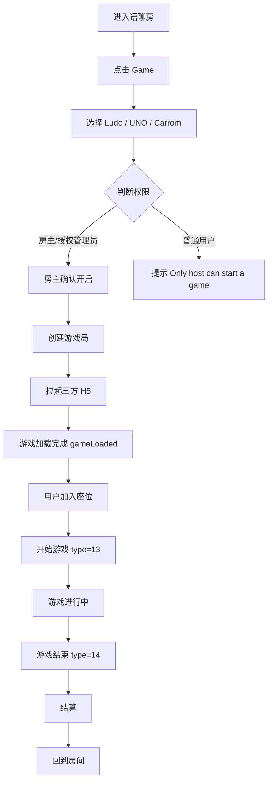
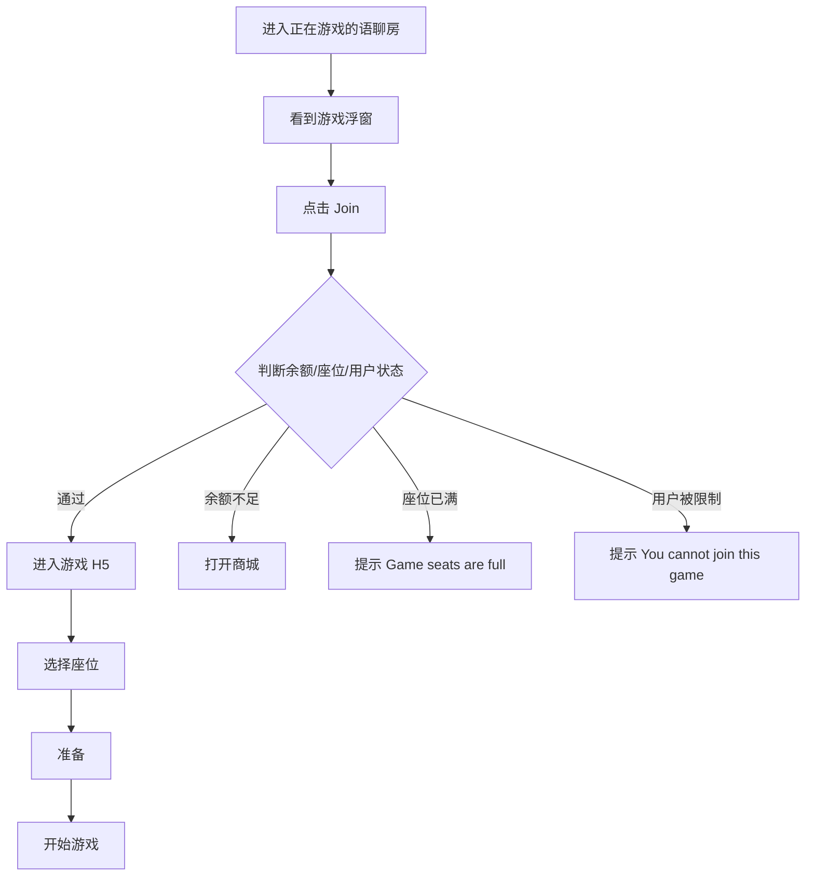
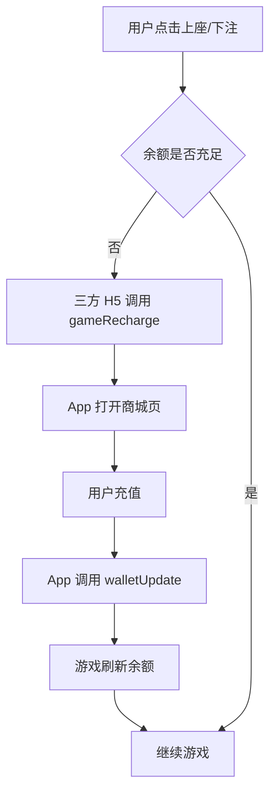
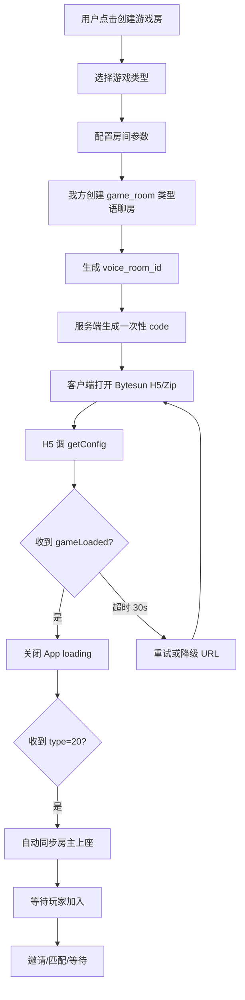
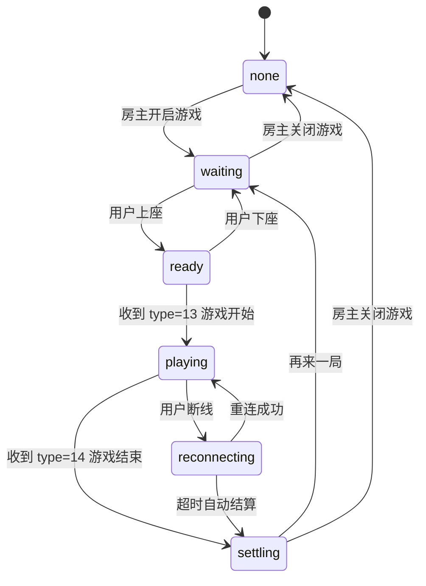

# WeChill 三方休闲游戏接入 PRD

> **产品**: wechill  
> **文档类型**: PRD（评审版）  
> **版本**: v1.1（评审决策已纳入）  
> **日期**: 2026-05-16  
> **面向**: MENA（中东）语聊房  
> **三方SDK**: BytesunGame（语聊房模式）v1.0.7  
> **接入方式**: 房间内直接调起游戏  
> **状态**: 评审决策已确认

---

## 文档摘要

本文档定义了 WeChill 语聊房接入三方休闲游戏的完整产品方案。核心思路：**在现有语聊房内直接调起游戏，不新增游戏房房间类型**。用户无需离开房间即可边聊边玩，游戏作为语聊房的互动插件，而非独立场景。

**核心价值**：
- 上线快：不改动房间类型，避免影响房间列表、推荐流、麦位、权限、榜单
- 风险低：游戏作为可选项，不影响核心语聊体验
- 体验好：保留语音聊天、送礼、关系链，边聊边玩

**推荐游戏**：Ludo / UNO / Carrom / 8 Ball / Domino / Snake & Ladder（V1 首批 6 款）

---

## 1. 产品定位与目标

### 1.1 核心定位

**游戏是语聊房的互动插件，不是独立游戏大厅。**

> 用户路径：进入语聊房 → 点击Game入口 → 选择/加入游戏 → 边语音边玩 → 游戏结束回到房间

产品原则：
- 游戏是社交话题，不是唯一目的
- 复用语聊房的麦位、聊天、礼物、钱包、房间推荐、风控和运营体系
- Bytesun 承接局内规则、游戏状态、结算结果；我方承接房间、用户、钱包、内容和数据
- V1 先保证"能进房、能开局、能结算、能再来一局"

### 1.2 目标用户画像

| 用户画像 | 特征 | 核心诉求 | 产品机会 |
|---------|------|---------|---------|
| 社交型玩家 | 聊天为主，游戏只是话题 | 认识人、找话题、避免冷场 | 低门槛游戏、语音互动、礼物互动 |
| 休闲玩家 | 想玩游戏但不想下载重App | 即开即玩、规则简单、等待短 | Ludo/UNO/Domino/你画我猜 |
| 组局用户 | 喜欢拉朋友一起玩 | 快速开局、邀请好友、分享传播 | WhatsApp分享、深链直达 |
| 观战用户 | 不一定参与游戏 | 看局、聊天、送礼、等空位 | 观战位、弹幕、观战转玩家 |

### 1.3 业务目标

| 目标 | 说明 | 衡量方式 |
|------|------|---------|
| 提升房间停留 | 游戏提供持续互动场景 | 玩游戏用户 vs 未玩游戏用户停留时长 |
| 提升房间活跃 | 房主/管理员可组织用户开局 | 游戏局数、参与人数 |
| 提升付费转化 | 游戏内消耗金币/门票，结合语聊房礼物消费 | 游戏金币消耗、充值转化率 |
| 提升中东用户适配 | Ludo、UNO、Carrom、8 Ball、Domino、Snake & Ladder 是中东/南亚用户熟悉的轻休闲游戏 | 中东地区游戏参与率 |
| 降低开发风险 | 不改房间类型，先以房间内调起方式上线 | 上线周期、Bug数 |
| 扩大游戏覆盖 | V1 首批接入 6 款游戏，满足不同用户偏好 | 各游戏日活和局数分布 |

### 1.4 非目标

当前不做：
- 新增游戏房房间类型
- 独立 Game Rooms 一级频道
- 房间类型切换为 Ludo 房/UNO 房
- 真钱下注
- 高竞技重游戏（MOBA/FPS）
- 单局超过60分钟的重度玩法

---

## 2. 产品范围

### 2.1 V1 必做范围

| 模块 | 是否包含 | 说明 |
|------|---------|------|
| Discover 增加 Games 页（一级 Tab） | 是 | 首页底部导航第二个入口 |
| 游戏大厅页 | 是 | 展示游戏列表、游戏房间列表 |
| More Games 全部游戏页 | 是 | 展示所有游戏宫格 |
| 游戏详情页 | 是 | 单个游戏信息和房间列表 |
| 房间内 Games 入口 | 是 | 底部工具栏增加 Game 按钮 |
| 游戏设置半屏弹窗 | 是 | 游戏模式、玩家选择、下注控制、门票配置 |
| 游戏加载页 | 是 | Loading 动画和进度提示 |
| 游戏主界面 | 是 | 全屏游戏 + 语音浮层 |
| 游戏浮窗 | 是 | 最小化后展示浮窗 |
| 游戏结算消息 | 是 | 房间聊天区系统消息 |
| 后台游戏配置 | 是 | 游戏上下架、入口配置 |
| 游戏状态上报 | 是 | game_start / game_settle |
| 货币扣减/结算 | 是 | change_balance 接口 |
| iOS/Android WebView 接入 | 是 | H5/Zip 包加载 |
| 游戏中礼物和红包 | 是 | 复用语聊房礼物和 Lucky Pocket |
| 门票系统 | 是 | V1 启用，默认 0，房主可调 |
| 观战 | 是 | V1 启用观战功能 |
| 普通语聊房开启游戏 | 是 | V1 支持普通语聊房直接开启游戏 |
| 首批 6 款游戏 | 是 | Ludo / UNO / Carrom / 8 Ball / Domino / Snake & Ladder |

### 2.2 V1 不做范围

| 模块 | 说明 | 后续版本 |
|------|------|---------|
| 独立 Game Rooms 一级频道 | 暂不做 | V2 |
| 房间类型切换为游戏房 | 暂不做，避免改动房间模型 | V2 |
| 多个游戏同时运行 | 一个房间同一时间只允许一个游戏 | V2 |
| 用户自由创建独立游戏房 | 本期只依附语聊房 | V2 |
| 随机匹配 | 平台级匹配能力 | V2 |
| WhatsApp 分享 | 暂不做 | V2 |
| 深链拉起 | 暂不做 | V2 |
| 你画我猜聊天同步 | 需要内容审核 | V1.1 |
| 红包返奖游戏房联动 | 涉及返奖风控 | V2.1 |
| 龙蛋游戏贡献 | 涉及任务系统 | V2.1 |
| CP/Soul Pair 游戏亲密值 | 涉及关系系统 | V2.1 |
| 游戏排行榜 | 暂不做 | V2 |
| 游戏任务系统 | 暂不做 | V2 |
| 复杂锦标赛 | 运营活动模块 | V3 |

### 2.3 V1 成功标准

| 指标 | 建议目标 |
|------|---------|
| 游戏入口点击率 | ≥ 15% |
| 游戏加载成功率 | ≥ 95% |
| H5 gameLoaded 到达率 | ≥ 95% |
| 进入房间到可操作耗时 | P90 ≤ 8 秒 |
| 游戏完成率 | ≥ 90% |
| 结算失败率 | ≤ 0.5% |
| 上座失败率 | ≤ 3% |
| 游戏崩溃/白屏率 | ≤ 1% |
| 再来一局点击率 | 首版观察 |

---

## 3. 核心方案对比

### 3.1 推荐方案

采用：**房间内调起游戏 + 游戏大厅 + 房间游戏浮窗 + 房间列表游戏标签**

不采用：**新增游戏房房间类型**

### 3.2 方案对比

| 方案 | 优势 | 劣势 | 结论 |
|------|------|------|------|
| 房间内调起游戏 | 上线快、风险低、对语聊房模型影响小、用户体验自然 | 不适合独立游戏运营 | ✅ 推荐 |
| 新增游戏房类型 | 可独立运营游戏生态 | 改动大，影响房间列表、推荐流、麦位、权限、榜单 | ❌ 暂不采用 |

---

## 4. 用户角色与权限

### 4.1 用户角色

| 角色 | Bytesun role | 权限 |
|------|-------------|------|
| 房主 | `2` (主持人) | 可开启游戏、关闭游戏、切换游戏、踢出游戏座位 |
| 管理员 | `2` (主持人) 或 `0` (正常用户) | 默认可加入；是否可开启游戏由房主/后台控制 |
| 普通用户 | `0` (正常用户) | 可查看游戏、加入游戏、观战 |
| 游客 | `1` (游客) | 本产品已取消游客模式；如果保留技术兼容，只允许观战 |
| 审核账号 | 按后台配置 | 可进入房间，但可通过后台控制是否展示游戏入口 |

### 4.2 权限规则

| 操作 | 房主 | 管理员 | 普通用户 |
|------|-----:|-----:|-----:|
| 查看游戏入口 | 是 | 是 | 是 |
| 开启游戏 | 是 | 可配置 | 否 |
| 加入游戏 | 是 | 是 | 是 |
| 观战 | 是 | 是 | 是 |
| 关闭游戏 | 是 | 可配置 | 否 |
| 踢出游戏座位 | 是 | 可配置 | 否 |
| 切换其他游戏 | 是 | 可配置 | 否 |

---

## 5. 前台页面设计

整体视觉参考附件截图：**黑色背景 + 金色高亮 + 游戏彩色图标卡片 + 房间列表卡片**

### 5.1 页面1：首页 Discover 游戏入口

#### 入口位置

底部导航中 `Discover` 页面，增加第二个入口：

```
Party | Discover | Community | Message | Mine
          ↑
        Games
```

#### 页面结构

```
--------------------------------
顶部导航：
Games   Activity

右上角：
搜索 icon | 排行榜 icon

--------------------------------
我的金币：
🪙 1466    [+]

--------------------------------
Party Room
[8 Ball] [UNO] [Bingo]
[Domino] [Golden Slot Machine] [More Games]

--------------------------------
Game Rooms
[房间卡片]
[房间卡片]
[房间卡片]
--------------------------------
```

#### 模块说明

| 模块 | 说明 |
|------|------|
| Games Tab | 展示游戏列表、游戏房间 |
| Activity Tab | 展示游戏活动、banner 活动 |
| 金币区域 | 展示当前用户金币余额，可跳转充值 |
| Party Room | 推荐游戏宫格（6个推荐游戏 + More Games） |
| Game Rooms | 正在玩游戏的房间列表 |

### 5.2 页面2：Games 游戏大厅页

#### 页面结构

```
--------------------------------
Games       Activity

金币余额：1466 [+]

Party Room
[8 Ball] [UNO] [Bingo]
[Domino] [Golden Slot Machine] [More Games]

Game Rooms
[房间卡片1]
房间名 / 房主 / 当前游戏 / 在线人数

[房间卡片2]
房间名 / 房主 / 当前游戏 / 在线人数
--------------------------------
```

#### 游戏宫格样式

```
[游戏icon]
Ludo

[游戏icon]
UNO

[游戏icon]
Carrom

[游戏icon]
8 Ball
```

#### 点击行为

| 点击对象 | 行为 |
|---------|------|
| 点击 Ludo / UNO / Carrom | 进入游戏详情页 |
| 点击 More Games | 展开全部游戏 |
| 点击 Game Rooms 房间卡片 | 进入对应语聊房 |
| 点击金币 + | 打开充值页 |

### 5.3 页面3：More Games 全部游戏页

参考附件第二张截图，展示多行游戏宫格。

#### 页面结构

```
--------------------------------
Game

[ Jackpot ] [ Dragon Tiger ] [ Crazy Fruit ] [ ShootGoal ]

[ UnderOver ] [ Slot777 ] [ Captain Bounty ] [ Teen Patti ]

[ Lucky7 ] [ GreedyCat ] [ KingLamp ] [ Wise Kingdoms ]

--------------------------------
```

#### 业务规则

| 状态 | 展示 |
|------|------|
| 游戏正常 | 正常展示 |
| 游戏维护 | 灰态 + Maintenance |
| 未下载 | 点击后下载/加载 |
| 下载中 | 展示 Loading |
| 已下载 | 直接打开 |
| 地区不支持 | 不展示或灰态 |
| iOS 审核隐藏 | 不展示 |

### 5.4 页面4：游戏详情页

用户点击某个游戏后进入。

#### 页面结构

```
--------------------------------
顶部：
返回    Ludo

--------------------------------
游戏封面 Banner

Ludo
多人棋盘休闲游戏
在线房间：258
正在游戏：1,206

[ Start in My Room ]
[ Join Active Room ]

--------------------------------
Game Rooms
[房间卡片]
[房间卡片]
--------------------------------
```

#### 按钮说明

| 按钮 | 说明 |
|------|------|
| Start in My Room | 房主/有权限管理员可见，在当前房间开启游戏 |
| Join Active Room | 普通用户可见，进入正在玩该游戏的房间列表 |

#### 权限判断

| 用户状态 | 点击 Start in My Room |
|---------|---------------------|
| 当前用户是房主 | 允许 |
| 当前用户是管理员且已授权 | 允许 |
| 普通用户 | 提示 "Only host can start a game" |
| 未登录 | 跳登录页 |
| 审核账号 | 按后台配置处理 |

### 5.5 页面5：语聊房内 Games 入口

#### 房间内底部工具栏

```
--------------------------------
[Mic] [Gift] [Game] [More]
--------------------------------
```

点击 Game 后弹出半屏游戏面板。

#### 无游戏运行时

```
--------------------------------
Games

Current Room Game:
No game is running

Popular Games
[Ludo] [UNO] [Carrom]
[8 Ball] [Domino] [More]

--------------------------------
```

#### 已有游戏运行时

```
--------------------------------
Current Game
Ludo · Waiting
Players: 2/4

[Join] [Open]

Other Games
游戏进行中，暂不可切换
--------------------------------
```

### 5.6 页面6：游戏设置半屏弹窗

参考附件截图1顶部三个界面，游戏设置半屏弹窗包含：

#### 布局结构

```
--------------------------------
游戏名称：Ludo

--------------------------------
玩家选择（部分游戏）：
[2 Players] [3 Players] [4 Players]

--------------------------------
游戏模式（部分游戏）：
[1 V 1] [4 Player]

--------------------------------
下注控制：
[-] [500 🪙] [+]

--------------------------------
门票设置（房主可见/可调）：
Ticket: [-] [0 🪙] [+]

--------------------------------
玩家座位：
[玩家1头像] [空位+] [空位+] [空位+]

--------------------------------
操作按钮：
[Leave] [Start]
--------------------------------
```

#### 门票规则

| 规则 | 说明 |
|------|------|
| 门票默认值 | 0（免费） |
| 谁可设置 | 房主/有权限管理员 |
| 设置时机 | 游戏设置弹窗中设置，开始前生效 |
| 取值范围 | 由后台配置（最小0，最大由运营设定） |
| 门票用途 | 参与游戏的入场费用，结算时按规则分配 |
| 余额不足 | 余额不足时提示充值，不可开局 |

#### 不同游戏的设置差异

| 游戏 | 玩家选择 | 游戏模式 | 下注控制 | 门票 | 特殊选项 |
|------|---------|---------|---------|------|---------|
| Ludo | 2/3/4 Players | - | 是 | 是 | - |
| UNO | - | 1V1 / 4 Player | 是 | 是 | Magic 选项 |
| Carrom | - | - | 是 | 是 | 地区选择 |
| 8 Ball | - | - | 是 | 是 | - |
| Domino | - | - | 是 | 是 | - |
| Snake & Ladder | 2/3/4 Players | - | 是 | 是 | - |

### 5.7 页面7：游戏加载页

#### 页面结构

```
--------------------------------
Ludo

Loading...
游戏资源加载中

[进度条]
--------------------------------
```

#### 加载逻辑

App 拉起 WebView/H5 后，优先展示本地加载动画；三方游戏加载完成后会通过 `gameLoaded` 通知 App，App 收到后关闭加载动画。

#### 加载失败

```
Game failed to load.
Please try again.

[Retry] [Close]
```

### 5.8 页面8：游戏主界面

参考附件截图2底部四个界面，采用 **全屏游戏 + 保留语聊房浮层**。

#### 页面结构

```
--------------------------------
顶部安全区：
房间名 / 返回 / 最小化

中间：
三方游戏画面（Ludo/UNO/Carrom棋盘）

底部安全区：
语音状态 / 聊天入口 / 送礼入口
--------------------------------
```

#### 游戏中浮层元素

| 元素 | 位置 | 功能 |
|------|------|------|
| 玩家头像和得分 | 游戏区域边缘 | 展示玩家状态 |
| 返回按钮 | 顶部左上角 | 返回语聊房 |
| 最小化按钮 | 顶部右上角 | 缩小为浮窗 |
| 语音状态 | 底部左侧 | 显示当前说话者 |
| 聊天入口 | 底部中间 | 打开聊天面板 |
| 送礼入口 | 底部右侧 | 打开礼物面板 |
| Lucky Pocket 入口 | 底部右下角 | 打开红包面板 |
| 观战列表 | 顶部右侧 | 查看观战用户 |

#### 游戏中互动功能

| 功能 | 说明 |
|------|------|
| 礼物 | V1 开启，复用语聊房礼物系统，游戏进行中可正常送礼 |
| Lucky Pocket | V1 开启，复用语聊房红包功能，游戏进行中可发/抢红包 |
| 语音聊天 | 持续可用，不因游戏状态中断 |
| 文字聊天 | 持续可用，通过聊天入口打开 |

### 5.9 页面9：游戏浮窗

用户最小化游戏后，房间内展示浮窗：

```
Ludo · Playing
4/4
[Open]
```

#### 浮窗状态

| 状态 | 文案 |
|------|------|
| 等待中 | Ludo · Waiting |
| 游戏中 | Ludo · Playing |
| 结算中 | Ludo · Settling |
| 已结束 | Ludo · Ended |

### 5.10 页面10：Activity 活动页

参考附件第三张截图。

#### 页面结构

```
--------------------------------
Games    Activity

Hot Events

[NEW] 2026 HWA
2026/01/01 - 2027/01/01

[NEW] 活动标题
2026/01/05 - 2027/01/05

[OLD] Hawa MISS
2026/01/13

--------------------------------
```

#### 活动规则

| 模块 | 说明 |
|------|------|
| Banner 活动 | 后台配置展示 |
| Hot Events | 当前进行中的游戏活动 |
| Sort by count | 按参与人数/热度排序 |
| 活动详情 | 点击进入活动详情页 |
| 多语言 | 按用户语言展示活动标题 |

---

## 6. 核心业务流程

### 6.1 用户从房间内开启游戏



### 6.2 普通用户加入游戏



### 6.3 游戏内余额不足



### 6.4 创建游戏房流程（V2 后备方案）



---

## 7. 游戏状态设计

### 7.1 房间游戏状态

| 状态 | 英文值 | 说明 | 前台展示 |
|------|-------|------|---------|
| 未开启 | none | 当前房间无游戏 | 显示游戏入口 |
| 等待中 | waiting | 已创建游戏，等待用户加入 | 显示 Join |
| 准备中 | ready | 用户已上座，等待准备 | 显示 Ready |
| 游戏中 | playing | 游戏进行中 | 显示 Open / Watching |
| 结算中 | settling | 游戏结果结算 | 显示 Settling |
| 已结束 | ended | 本局结束 | 3 秒后隐藏浮窗 |
| 异常 | error | 游戏异常中断 | 显示 Retry / Close |

### 7.2 游戏状态机



---

## 8. 游戏座位规则

### 8.1 座位规则

三方游戏 H5 会通过 `sendGameAction` 主动调用 App，包括上/下游戏座位、同步座位信息、踢人请求、游戏上座失败、游戏开始/结束等类型；App 也可以通过 `gameActionUpdate` 主动通知游戏座位操作结果。

| 规则 | 说明 |
|------|------|
| 游戏座位独立于语聊麦位 | 不强制要求上麦才能玩 |
| 一个用户只能占一个游戏座位 | 防止重复占位 |
| 房主可踢出游戏座位用户 | 管理员按权限 |
| 座位满员后只能观战 | Join 按钮变 Watching |
| 游戏中不可换座 | 防止状态错乱 |
| 游戏结束后释放座位 | 用户可重新加入下一局 |

### 8.2 上座失败原因

| 场景 | 提示 |
|------|------|
| 座位已满 | Game seats are full |
| 余额不足 | Insufficient balance |
| 游戏已开始 | Game already started |
| 用户被限制 | You cannot join this game |
| 网络异常 | Network error, try again |

---

## 9. 货币与结算规则

### 9.1 货币类型

本期建议使用 App 内现有金币作为游戏货币。

```
语聊房金币 = 游戏金币
```

后续如需独立游戏币，可通过 `currency_type` 做扩展。

### 9.2 扣费场景

| 场景 | diff_msg | 说明 |
|------|----------|------|
| 门票/上座 | ticket | 扣除门票费用（默认 0，房主可设） |
| 下注 | bet | 扣除下注金额 |
| 游戏结算奖励 | result | 游戏获胜奖励 |
| 异常退款 | refund | 游戏异常时退款 |

**门票与下注的区别**：
- 门票（Ticket）：入场费用，所有参与游戏的玩家均需支付，由房主在游戏设置弹窗中设定，默认为 0
- 下注（Bet）：部分游戏支持的对赌金额，进入游戏后在三方游戏 H5 内设置

三方 `change_balance` 货币修改接口用于游戏下注和结算，`currency_diff` 负值表示减少、正值表示增加；余额不足错误码为 `1008`。该接口需要做单用户并发保护，避免一秒内多次调用导致余额错乱。

### 9.3 结算展示

游戏结束后，在房间聊天区插入系统消息：

```
Ludo game ended.
Winner: Ahmed
Reward: 1,200 coins
```

阿语环境按 RTL 展示。

### 9.4 结算原则

- `change_balance` 必须按 `order_id` 幂等
- 同一用户必须做并发锁，避免重复扣费或重复派奖
- 结算页只能展示已确认或可追踪的结果
- 结算失败不允许静默吞掉，需要进入补偿队列

---

## 10. Bytesun 技术对接需求

### 10.1 接入方式

- 商户侧调用 Bytesun 游戏信息列表接口，拿到游戏 Zip 包下载地址或 URL 地址、游戏版本号
- 客户端按版本号处理游戏包更新，Zip 包可下载并存储到 App 本地
- 用户访问解压后的本地路径或 URL，进入游戏 H5 界面
- 游戏内下注、结算时，Bytesun 服务端调用我方服务端 API 修改用户游戏币
- 游戏结束后回到我方 App/语聊房
- Bytesun 游戏离线 Zip 包默认是 OSS 源站；建议我方配置 CDN 回源，缓存策略 > 3 天，并做预热

### 10.2 前端 JSBridge

**H5 调 App：**

| 方法 | 说明 | 语聊房注意 |
|------|------|-----------|
| `getConfig` | 获取商户、用户、房间、语言、角色、节点等配置 | 必须实现 |
| `destroy` | 非语聊房模式下游戏主动关闭 WebView | 语聊房模式通常不依赖 |
| `gameRecharge` | 余额不足时通知 App 打开商城 | 必须实现 |
| `gameLoaded` | 游戏加载完毕，App 关闭加载动画 | 必须实现 |
| `sendGameAction` | 游戏主动通知 App | 必须实现，详见 10.2.1 |

**App 调 H5：**

| 方法 | 说明 |
|------|------|
| `walletUpdate` | App 充值或货币变化后通知游戏刷新余额 |
| `gameActionUpdate` | App 通知游戏座位操作、身份变更、踢人结果、聊天同步、最小化状态 |
| `soundUpdate` | 设置游戏背景音乐和音效开关 |

### 10.2.1 sendGameAction 完整 type 清单

| type | 场景 | 参数 | 产品处理 |
|------|------|------|---------|
| 7 | 点击用户头像 | userId | 打开用户资料卡 |
| 13 | 游戏开始 | - | 房间状态改为游戏中，记录埋点 |
| 14 | 游戏结束 | - | 进入结算页，等待服务端结算 |
| 15 | 上/下座 | optType(0上/1下), userId, seat | 校验后同步 App 座位 |
| 16 | 座位信息同步 | seats[] | 刷新座位；冲突时以 App 房间座位为准 |
| 17 | 发起踢人 | userId, seat | App 二次确认后回 type=6 |
| 18 | 上座失败 | userId | 提示并释放座位 |
| 20 | 语聊房准备完成 | - | 可执行自动上座/后续操作 |
| 21 | 音乐音效状态返回 | bgmStatus, seStatus | 同步设置面板 |
| 22 | 画猜消息到 App 聊天 | isSystem, isPlayer, userId, nickName, pos, content, headImage | 审核后展示（V1.1） |
| 23 | 游戏基础参数 | isMall 等 | 更新配置 |
| 30 | 最大人数/门票变更 | platRoomID, peopleNum, ticketSlots | 更新房间配置和匹配条件 |
| 3001 | RTC 麦克风/扬声器同步 | status, roomId, users[] | 仅 RTC 游戏启用（V3） |

### 10.2.2 gameActionUpdate 完整 type 清单

| type | 场景 | 参数 | 产品处理 |
|------|------|------|---------|
| 4 | 操作游戏座位 | optType(0上/1下), seat, userId | 以我方房间座位为准 |
| 5 | 变更用户身份 | role, userId | 玩家/观众/主持人切换 |
| 6 | 返回踢人结果 | optResult(0成功/1失败), optUserId, userId, reason | 告知游戏是否踢人成功 |
| 2012 | 查询音效状态 | - | 游戏请求后返回 type=21 |
| 2014 | App 聊天同步到画猜游戏 | userId, content | 审核通过后同步（V1.1） |
| 2016 | 语聊房最小化状态 | collapseStatus(0开始收起/1收起完成/2开始展开/3展开完成) | 游戏适配小窗/展开状态 |

### 10.3 getConfig 示例

```json
{
  "appChannel": "wechill",
  "appId": 88888888,
  "userId": "534206265",
  "code": "one_time_code",
  "roomId": "voice_room_id",
  "gameRoomId": "",
  "gameMode": "3",
  "language": "7",
  "gameConfig": {
    "sceneMode": 0,
    "currencyIcon": "https://cdn.xxx.com/coin.png"
  },
  "gsp": 201,
  "role": 0
}
```

**getConfig 字段口径：**

| 字段 | 类型 | 设计口径 |
|------|------|---------|
| `appChannel` | string | Bytesun 提供，后台配置 |
| `appId` | int64 | Bytesun 提供的商户 ID |
| `userId` | string | 我方用户 ID |
| `code` | string | **一次性认证令牌，必须唯一且一次性**，换完后该 code 不可再用 |
| `roomId` | string | 我方语聊房/游戏房房间 ID |
| `gameRoomId` | string | 传空字符串，保留字段 |
| `gameMode` | string | 语聊房场景**固定传 "3"** |
| `language` | string | 英文 `2`，阿语 `7`，中文 `0` |
| `gameConfig.sceneMode` | int | 场馆级别，默认 0 |
| `gameConfig.currencyIcon` | string | 货币图标，外网可访问 URL，60×60 |
| `gsp` | int | MENA 优先 201(迪拜 AWS)，必要时降级 101(新加坡) |
| `role` | int | 0=正常用户，1=游客仅观战，2=主持人 |

### 10.4 服务端必须提供的 API

**Bytesun 标准要求：**

| 接口 | 用途 | 关键要求 |
|------|------|---------|
| `/v1/api/get_sstoken` | Bytesun 用一次性 code 换长期 ss_token | code 必须一次性消费，再次使用返回 1001 |
| `/v1/api/get_user_info` | 查询用户昵称、头像、余额、类型 | 返回 balance，可扩展 balance_list；user_type 映射风控等级 |
| `/v1/api/update_sstoken` | ss_token 过期时刷新 | 如果我方 ss_token 非长期有效，必须实现 |
| `/v1/api/change_balance` | 下注、结算、退款时修改货币 | **必须做单用户并发锁**；order_id 唯一；余额不足错误码 1008；**成功 code 才能为 0** |
| 游戏状态上报接口 | 上报 game_start、game_settle | 用于局记录、数据看板、风控和用户战绩 |

**我方自建服务：**

- 房间创建/加入/离开
- 游戏记录
- 结算记录
- 风控审核
- 数据看板

**待 Bytesun 补充：**

- hideLobby=true 后的快速开始游戏 API
- 各游戏机器人能力
- 真实 game_id 和最大人数
- 门票档位含义

**安全要求：**

- 请求双方用 `signature_nonce + AppKey + timestamp` 做 MD5 签名
- signature 15 秒内有效
- signature_nonce 15 秒内不能重复，防重放
- AppKey 必须严格保密

### 10.5 Bytesun 游戏信息接口

- `/v1/api/one_game_info`：获取单个游戏信息
- `/v1/api/gamelist`：获取游戏信息列表

返回字段：game_id, name, preview_url, game_version, download_url, game_mode, game_orientation(1竖屏/2横屏), safe_height, venue_level

### 10.6 多语言对照表（Bytesun）

| 语言 | 值 | wechill 优先级 |
|------|-----|--------------|
| 阿拉伯语 | 7 | ★★★★★（MENA 默认） |
| 英语 | 2 | ★★★★☆ |
| 土耳其语 | 9 | ★★★☆☆ |
| 乌尔都语 | 10 | ★★★☆☆ |
| 波斯语 | 18 | ★★☆☆☆ |

### 10.7 特殊游戏能力与 URL 参数

| 参数 | 适用游戏 | 说明 |
|------|---------|------|
| `hideLobby=true` | DominoPlus, ludoPlus, unoPlus | 隐藏大厅，等待我方服务端调用"快速开始游戏 API"直接开局。**该 API 在 1.0.7 文档中未给出定义，需向 Bytesun 补充确认** |
| 画猜聊天同步 | 你画我猜 | H5 通过 type=22 发消息到 App 聊天区；App 通过 type=2014 同步聊天内容回游戏 |
| `isGameRTC=true` | 狼人杀、谁是卧底 | 启用游戏内 RTC，Android 需授权音频捕获；**普通 Ludo/UNO 建议继续使用我方语聊房 RTC** |
| 安全区参数 | game_id 以 3 开头的全屏语聊房游戏 | URL 加 game_margin_top/bottom/standard，避免游戏操作区被 App 麦位/顶栏/底栏遮挡 |

---

## 11. 后台管理 PRD

### 11.1 菜单结构

```
运营管理
  └── 游戏中心
        ├── 游戏列表管理
        ├── 游戏入口配置
        ├── 游戏房间监控
        ├── 游戏活动管理
        ├── 游戏结算记录
        └── 三方接口配置
```

### 11.2 游戏列表管理

| 字段 | 类型 | 说明 |
|------|------|------|
| 游戏ID | int | 三方 game_id |
| 游戏名称 | string | Ludo / UNO / Carrom / 8 Ball / Domino / Snake & Ladder |
| 游戏 icon | image | preview_url |
| 游戏版本 | string | game_version |
| 下载地址 | string | download_url |
| 游戏方向 | enum | 竖屏 / 横屏 |
| 支持地区 | multi-select | GCC / Egypt / Iraq 等 |
| 支持端 | multi-select | iOS / Android |
| 游戏状态 | enum | 上架 / 下架 / 维护 |
| 是否推荐 | bool | 是否展示在 Party Room |
| 排序权重 | int | 越大越靠前 |
| 是否审核隐藏 | bool | iOS 审核账号隐藏 |
| 是否允许房主开启 | bool | 默认是 |
| 是否允许管理员开启 | bool | 默认否 |
| 单房间最大并发局数 | int | 默认 1 |

### 11.3 游戏入口配置

| 配置项 | 默认值 | 说明 |
|-------|------:|------|
| Discover 是否展示 Games | 开 | 控制底部发现页入口 |
| 房间内是否展示 Game 按钮 | 开 | 控制房间工具栏 |
| 新用户延迟展示 | 180 秒 | 可选 |
| 审核用户是否隐藏 | 开 | iOS 审核风险控制 |
| 房间列表展示游戏标签 | 开 | 提升点击 |
| 游戏中是否允许切换游戏 | 关 | 建议关闭 |
| 是否允许观战 | 开 | 增加参与感 |

### 11.4 游戏房间监控

#### 列表字段

| 字段 | 说明 |
|------|------|
| 房间ID | 当前语聊房 ID |
| 房主ID/昵称 | 房主信息 |
| 当前游戏 | Ludo / UNO / Carrom |
| 游戏状态 | waiting / playing / ended |
| 当前玩家数 | 2/4 |
| 当前观战数 | 10 |
| 本局ID | game_round_id |
| 开始时间 | start_at |
| 累计消耗 | bet 总和 |
| 累计奖励 | reward 总和 |
| 异常状态 | 是否异常 |

#### 操作

| 操作 | 说明 |
|------|------|
| 查看详情 | 查看本局玩家与结算 |
| 强制结束 | 异常时使用 |
| 下架游戏 | 快速风控 |
| 查看日志 | 查看三方回调 |

### 11.5 游戏结算记录

| 字段 | 说明 |
|------|------|
| 订单ID | order_id |
| 用户ID | user_id |
| 游戏ID | game_id |
| 房间ID | room_id |
| 本局ID | game_round_id |
| 变更金额 | currency_diff |
| 变更原因 | bet/result/refund |
| 前余额 | before_balance |
| 后余额 | currency_balance |
| 时间 | change_time_at |
| 状态 | 成功/失败 |

### 11.6 三方接口配置

| 配置项 | 说明 |
|------|------|
| app_id | Bytesun 分配 |
| app_channel | Bytesun 分配 |
| app_key | 签名密钥 |
| 测试服域名 | 联调使用 |
| 正式服域名 | 生产使用 |
| 获取 SSToken 接口 | `/v1/api/get_sstoken` |
| 查询用户信息接口 | `/v1/api/get_user_info` |
| 货币修改接口 | `/v1/api/change_balance` |
| 游戏状态上报接口 | 后台配置 URL |
| CDN 域名 | 游戏包加速 |

服务端通信采用 HTTP POST + JSON，并通过 `signature_nonce`、`timestamp`、`signature` 做双向身份验证；签名 15 秒内有效，nonce 15 秒内不能重复，用于防重放攻击。

---

## 12. 数据埋点

### 12.1 前台埋点

| 事件 | 触发时机 |
|------|---------|
| game_entry_show | 游戏入口曝光 |
| game_entry_click | 点击游戏入口 |
| game_list_show | 游戏大厅曝光 |
| game_click | 点击某个游戏 |
| game_start_click | 点击开启游戏 |
| game_start_success | 游戏创建成功 |
| game_join_click | 点击加入 |
| game_join_success | 加入成功 |
| game_loaded | 游戏加载完成 |
| game_recharge_click | 游戏内拉起充值 |
| game_end | 游戏结束 |
| game_float_click | 点击游戏浮窗 |
| game_replay_click | 点击再来一局 |
| game_seat_up_click | 点击上座 |
| game_seat_up_success | 上座成功 |
| game_seat_up_failed | 上座失败 |

### 12.2 业务指标

| 指标 | 说明 |
|------|------|
| 游戏入口点击率 | game_entry_click / game_entry_show |
| 开局成功率 | game_start_success / game_start_click |
| 加入成功率 | game_join_success / game_join_click |
| 游戏加载成功率 | game_loaded / game_open |
| 人均游戏时长 | 游戏总时长 / 游戏用户数 |
| 游戏金币消耗 | bet 总额 |
| 游戏金币奖励 | result 总额 |
| 游戏带动充值 | 游戏内充值金额 |
| 房间停留提升 | 玩游戏用户 vs 未玩游戏用户 |

---

## 13. 异常与边界场景

### 13.1 房间相关

| 场景 | 处理 |
|------|------|
| 房主离开房间 | 游戏继续；管理员接管；无管理员则本局结束后不可再开 |
| 房间关闭 | 强制结束游戏并结算/退款 |
| 房间被封禁 | 立即关闭游戏入口 |
| 用户被踢出房间 | 同步退出游戏 |
| 用户断线 | 保留座位 60 秒，超时释放 |

### 13.2 游戏相关

| 场景 | 处理 |
|------|------|
| 游戏加载失败 | Retry / Close |
| 游戏维护 | 灰态，不可点击 |
| 游戏进行中切换游戏 | 不允许 |
| 上座失败 | 展示失败原因 |
| 余额不足 | 拉起充值 |
| 结算失败 | 进入异常队列，后台补偿 |
| 重复扣款 | 通过 order_id 幂等处理 |
| 并发扣款 | 单用户加锁处理 |

---

## 14. 多语言文案

### 14.1 英文

| 中文 | 英文 |
|------|------|
| 游戏 | Games |
| 活动 | Activity |
| 更多游戏 | More Games |
| 开始游戏 | Start Game |
| 加入游戏 | Join Game |
| 观战 | Watch |
| 游戏中 | Playing |
| 等待中 | Waiting |
| 座位已满 | Game seats are full |
| 余额不足 | Insufficient balance |
| 游戏加载失败 | Game failed to load |
| 只有房主可以开启游戏 | Only the host can start a game |
| 再来一局 | Play Again |
| 返回房间 | Back to Room |

### 14.2 阿语

| 中文 | 阿语 |
|------|------|
| 游戏 | الألعاب |
| 活动 | الفعاليات |
| 更多游戏 | المزيد من الألعاب |
| 开始游戏 | ابدأ اللعبة |
| 加入游戏 | انضم إلى اللعبة |
| 观战 | مشاهدة |
| 游戏中 | قيد اللعب |
| 等待中 | في الانتظار |
| 座位已满 | المقاعد ممتلئة |
| 余额不足 | الرصيد غير كافٍ |
| 游戏加载失败 | فشل تحميل اللعبة |
| 只有房主可以开启游戏 | يمكن لمالك الغرفة فقط بدء اللعبة |

---

## 15. 上线策略

### 15.1 灰度节奏

| 阶段 | 范围 |
|------|------|
| 第1阶段 | 测试房间 + 内部账号 |
| 第2阶段 | Android 小流量 |
| 第3阶段 | iOS 非审核版本灰度 |
| 第4阶段 | 中东重点国家开放 |
| 第5阶段 | 全量上线 |

### 15.2 首批推荐游戏

建议首批不要上太多，先上 3–5 个：

```
Ludo
UNO
Carrom
8 Ball
Domino
```

首批游戏越少，越容易控制体验、结算和风控。

---

## 16. App Store 审核建议

因为本期是休闲游戏接入，但其中如果存在下注、金币消耗、奖励结算，仍需要谨慎处理。

| 项 | 建议 |
|------|------|
| iOS 审核账号 | 后台可隐藏游戏入口 |
| 审核备注 | 如展示游戏，应说明为 casual games |
| 金币说明 | 不强调"现金收益" |
| 玩法文案 | 避免 gambling、bet、win cash 等字眼 |
| 游戏入口 | 不要和真实货币提现关联 |
| 年龄分级 | 如涉及模拟博彩，需要同步检查 |

---

## 17. 版本规划与开发周期

### 17.1 V0：技术预研

**周期**：1-2 周

**范围**：
- 跑通 Bytesun 测试环境
- 验证 H5/Zip 加载
- 验证 JSBridge 基础链路
- 验证一次性 code 换 ss_token
- 验证用户信息、余额读取、余额变更、游戏状态上报
- 验证 Ludo / UNO / Carrom / 8 Ball / Domino / Snake & Ladder 至少 3 款游戏可在语聊房模式加载
- change_balance 幂等和并发锁方案

**产出**：

| 工作 | 产出 |
|------|------|
| Bytesun 测试环境联调 | 接口连通性报告 |
| H5 / Zip 加载验证 | Android / iOS 加载方案 |
| JSBridge 验证 | getConfig、gameLoaded、sendGameAction、gameActionUpdate 跑通 |
| 一次性 code 换 ss_token | 鉴权方案和错误码 |
| 钱包接口预研 | change_balance 幂等和并发锁方案 |
| 6 款游戏资源确认 | game_id、版本、人数、观战能力、门票能力清单 |

**V0 出口**：
- Ludo / UNO / Carrom / 8 Ball / Domino / Snake & Ladder 至少 3 款游戏在语聊房模式可加载
- 服务端能完成 get_sstoken、get_user_info、change_balance 测试
- 明确 Bytesun 待确认问题和绕行方案

### 17.2 V1 MVP 开发排期

**周期**：4-5 周

| 周期 | 客户端 | 服务端 | 后台/数据 | 验收重点 |
|------|-------|-------|----------|---------|
| 第 1 周 | Games 入口、游戏大厅页、房间内 Game 入口 | 游戏信息接口、房间游戏状态 | 游戏接入配置表 | 能进入游戏大厅 |
| 第 2 周 | H5 容器、loading、getConfig、gameLoaded、游戏设置弹窗 | code、ss_token、用户信息接口 | 游戏配置列表 | 能加载 6 款游戏 |
| 第 3 周 | 上座/下座、座位展示、观战态、声音控制、游戏浮窗 | 座位状态、游戏状态上报 | 游戏房间监控 | 能进入 waiting / playing |
| 第 4 周 | 结算页、再来一局、余额不足充值、异常提示 | change_balance、结算记录、补偿队列 | 结算管理、基础看板 | 能完整完成一局并结算 |
| 第 5 周 | 兼容、性能、灰度、埋点补齐 | 对账、风控、监控告警 | 数据验收、运营配置 | 达到上线标准 |

### 17.3 V1 后续版本

| 版本 | 周期 | 范围 |
|------|------|------|
| V1.1 | 2-3 周 | 你画我猜、聊天同步、内容审核、邀请分享优化 |
| V2 | 4 周 | 随机匹配、等待页、匹配队列、座位预占、超时降级 |
| V2.1 | 3 周 | 红包返奖、龙蛋贡献、CP 亲密值、游戏任务 |
| V3 | 4-6 周 | RTC 推理游戏、AI 补位、VIP 匹配、锦标赛、段位 |

---

## 18. 风险与边界

### 18.1 技术风险

| 风险 | 影响 | 缓解 |
|------|------|------|
| Bytesun 服务不稳定 | 游戏无法加载或结算失败 | 重试、本地包、下架开关、多节点 |
| 游戏加载慢 | 进入转化下降 | CDN、预加载、进度提示、资源预热 |
| 语音和游戏双通道带宽 | 卡顿、掉线 | 语音优先、自适应、低端机策略 |
| 座位不同步 | 用户认知混乱 | App 房间座位为准，反向同步游戏 |
| 结算并发 | 错账 | 用户级锁、订单幂等、对账补偿 |
| hideLobby 快速开始 API 未给出 | Ludo/UNO 无法无感开局 | V0 向 Bytesun 补接口；V1 不依赖 |

### 18.2 业务与合规风险

| 风险 | 影响 | 缓解 |
|------|------|------|
| 涉赌理解 | 审核和合规风险 | 仅平台金币，不接真钱；门票和奖励上限可控 |
| 未成年人沉迷 | 合规风险 | 时长限制、提醒、地区策略 |
| 作弊串通 | 破坏公平和经济系统 | 同设备/IP 风控、异常胜率、固定组合检测 |
| 内容安全 | 画猜聊天违规 | 敏感词、审核、举报、处罚 |
| 返奖套利 | 经济损失 | AI 不计入、时长门槛、真人门槛、黑名单 |

### 18.3 产品边界

**支持**：
- Bytesun 官方休闲游戏
- 语聊房融合模式
- MENA 本地化
- 阿语 RTL 分享卡片
- 礼物/观战/聊天
- 后续接入红包返奖、龙蛋、CP

**不支持**：
- 真钱下注
- 高度竞技重游戏
- 未确认授权游戏
- 单局超长游戏
- 无审核的聊天同步
- 未确认能力的机器人补位作为核心链路

---

## 19. 错误码对照表

| 错误码 | 描述 | 前端处理 |
|-------|------|---------|
| 0 | 成功 | - |
| 1001 | 数据错误（code 已使用） | 提示"数据异常" |
| 1002 | 读取数据错误 | 重试 |
| 1003 | 签名错误 | 重试 |
| 1008 | 余额不足 | 跳转充值 |
| 1019 | 游戏维护中 | 提示维护，可切换其他游戏 |
| 1020 | 用户被封禁 | 提示"账号受限" |
| 1022 | 账号功能限制 | 提示"功能受限" |
| 1023 | 地区限制 | 提示"地区不支持" |

---

## 20. 待向 Bytesun 确认的问题

| # | 问题 | 优先级 | 影响版本 |
|---|------|-------|---------|
| 1 | Ludo、UNO、Domino、你画我猜准确 game_id、Bytesun 游戏名、是否 game_id 以 3 开头 | P0 | V0 |
| 2 | gamelist 的 game_list_type 到底传 2 还是 3 | P0 | V0 |
| 3 | hideLobby=true 对 Ludo/UNO 的快速开始游戏 API 具体路径、参数、鉴权、返回值 | P0 | V1/V2 |
| 4 | 每个游戏的最小开局人数、最大人数、是否允许中途加入、是否允许观战 | P0 | V0 |
| 5 | type=30 中 ticketSlots 的含义、取值和对应金额 | P0 | V1 |
| 6 | Ludo/UNO 是否支持机器人补位，机器人是否会在 game_start/game_settle 中以 is_ai=1 上报 | P1 | V2 |
| 7 | gameMode=[1,2,3] 中各模式差异；语聊房是否所有游戏都必须使用模式 3 | P1 | V0 |
| 8 | game_id 以 3 开头的安全区参数是否所有全屏语聊房游戏都必须配置 | P1 | V1 |
| 9 | 你画我猜是否完全依赖 App 聊天同步，还是有内置聊天 | P1 | V1.1 |
| 10 | 各错误码是否由 H5 透传给 App，还是服务端回调处理 | P1 | V1 |

---

## 21. 评审决策项

### 已确认决策（2026-05-16 评审会）

| # | 决策项 | 结论 | 备注 |
|---|--------|------|------|
| 1 | V1 游戏范围 | **6 款全部进入 V1**：Ludo / UNO / Carrom / 8 Ball / Domino / Snake & Ladder | 不止 Ludo+UNO，首批 6 款全覆盖 |
| 2 | 游戏入口位置 | **首页一级 Tab（Discover）** | Discover 底部导航第二个入口，Games 作为一级子页 |
| 3 | 普通语聊房开启游戏 | **V1 支持** | 普通语聊房可直接调起游戏，不限于特定房间类型 |
| 4 | 门票系统 | **V1 启用** | 点击游戏调起游戏配置弹窗，门票默认为 0，房主可调 |
| 5 | 游戏中礼物和红包 | **V1 允许** | 游戏进行中保留礼物和 Lucky Pocket 入口 |
| 6 | 观战 | **V1 启用** | 观战功能随 V1 一起上线 |
| 7 | WhatsApp 分享和深链拉起 | **暂不做** | 放入 V2 |
| 8 | 随机匹配 | **V2 实现** | 确认放 V2 |

---

## 22. V1 验收标准

### 22.1 产品验收

- 用户可以从首页 Discover 一级 Tab 进入 Games 页
- 用户可以从游戏大厅进入游戏详情页
- 用户可以从游戏详情页进入正在玩游戏的房间
- 普通语聊房房主可以在房间内开启游戏
- 普通用户可以在房间内加入游戏
- 房主、玩家、观众身份正确
- 6 款游戏（Ludo / UNO / Carrom / 8 Ball / Domino / Snake & Ladder）均可正常加载和开局
- 游戏设置弹窗中门票可配置，默认为 0，房主可调
- 游戏开始和结束状态能同步到 App
- 用户可以完成一局并看到结算页
- 观战用户可以观看游戏进行，不影响游戏逻辑
- 余额不足可以打开商城
- 充值后游戏余额刷新
- 上座失败、游戏维护、用户封禁等错误有明确提示
- 用户可以最小化游戏并重新打开
- 用户可以在游戏中送礼和发 Lucky Pocket

### 22.2 技术验收

- getConfig 字段完整
- code 一次性消费
- ss_token 获取成功
- get_user_info 返回昵称、头像、余额
- change_balance 支持幂等和并发锁
- game_start/game_settle 能落库
- WebView 加载失败有日志和重试
- 游戏包版本可后台控制

### 22.3 数据验收

- 房间创建、加入、离开、游戏加载、游戏开始、游戏结束、结算、错误均有埋点
- 游戏记录和结算记录可后台查询
- 基础看板可看到启动成功率、开局转化率、完成率、结算失败率

---

## 23. 最终产品方案总结

本期推荐最终方案：

```
Discover 增加 Games 页
+
房间内增加 Game 入口
+
房主开启 Ludo / UNO / Carrom
+
用户在当前语聊房内加入游戏
+
游戏以 H5 / WebView 方式加载
+
保留语音房聊天、送礼、关系链
+
后台控制游戏上下架、地区、端、审核隐藏和结算监控
```

**一句话总结**：

**第一版先把三方游戏做成"语聊房插件"，不要做成"房间类型"。这样上线快、改动小、风险低，也更符合附件里的 Games / Game Rooms 样式。**

---

## 附录A：游戏参数模板

### A.1 Ludo

```yaml
Ludo:
  display_name: "Ludo"
  local_name_ar: "لعبة الطيران"
  bytesun_name: "ludoPlus"
  game_id: "待 Bytesun 确认"
  players:
    min: 2
    max: 4
    optimal: 4
  duration: "10-20 分钟"
  spectator: true
  match_enabled: true
  hide_lobby_supported: true
  ai_backup: "待 Bytesun 确认"
  ticket_slots: "待 Bytesun 确认"
```

### A.2 UNO

```yaml
UNO:
  display_name: "UNO"
  local_name_ar: "أونو"
  bytesun_name: "unoPlus"
  game_id: "待 Bytesun 确认"
  players:
    min: 2
    max: "以 Bytesun 返回 peopleNum 为准"
    optimal: 4
  duration: "5-15 分钟"
  spectator: true
  match_enabled: true
  hide_lobby_supported: true
  ai_backup: "待 Bytesun 确认"
```

### A.3 Carrom

```yaml
Carrom:
  display_name: "Carrom"
  local_name_ar: "كاروم"
  bytesun_name: "待 Bytesun 确认"
  game_id: "待 Bytesun 确认"
  players:
    min: 2
    max: 4
    optimal: 4
  duration: "5-15 分钟"
  spectator: true
  match_enabled: true
```

### A.4 8 Ball

```yaml
8Ball:
  display_name: "8 Ball"
  local_name_ar: "8 بول"
  bytesun_name: "待 Bytesun 确认"
  game_id: "待 Bytesun 确认"
  players:
    min: 2
    max: 2
    optimal: 2
  duration: "5-15 分钟"
  spectator: true
```

### A.5 Domino

```yaml
Domino:
  display_name: "Domino"
  local_name_ar: "دومينو"
  bytesun_name: "DominoPlus"
  game_id: "待 Bytesun 确认"
  players:
    min: 2
    max: 4
    optimal: 4
  duration: "5-15 分钟"
  spectator: true
  match_enabled: true
  hide_lobby_supported: true
```

### A.6 Snake & Ladder

```yaml
SnakeAndLadder:
  display_name: "Snake & Ladder"
  local_name_ar: "السلم والثعبان"
  bytesun_name: "待 Bytesun 确认"
  game_id: "待 Bytesun 确认"
  players:
    min: 2
    max: 4
    optimal: 4
  duration: "5-15 分钟"
  spectator: true
  match_enabled: true
  hide_lobby_supported: "待 Bytesun 确认"
  ticket_enabled: true
```

---

## 附录B：数据模型

### B.1 GameSession（游戏局）

```yaml
GameSession:
  session_id: string
  room_id: string
  game_id: int
  game_name: string
  status: enum[created, waiting, ready, playing, settling, ended]
  ticket_price: int  # 门票价格，默认0
  created_at: timestamp
  started_at: timestamp | null
  ended_at: timestamp | null
  players: list[Player]
  spectators: list[User]  # 观战用户列表
  bet_total: int
  ticket_total: int  # 门票总收入
  result_total: int
```

### B.2 GamePlayer（游戏玩家）

```yaml
GamePlayer:
  session_id: string
  user_id: string
  seat: int
  role: enum[player, spectator, host]
  is_ready: bool
  score: int
  rank: int
  joined_at: timestamp
  left_at: timestamp | null
```

### B.3 GameBalanceOrder（游戏结算记录）

```yaml
GameBalanceOrder:
  order_id: string
  user_id: string
  game_id: int
  room_id: string
  session_id: string
  currency_diff: int
  diff_msg: enum[bet, result, refund]
  before_balance: int
  after_balance: int
  status: enum[success, failed, retrying, compensated]
  created_at: timestamp
```

---

## 附录C：流程图汇总

### C.1 用户从房间内开启游戏流程


### C.2 普通用户加入游戏流程


### C.3 游戏状态机


---

*文档结束。*
