# WeChill 三方休闲游戏接入 PRD

> 版本：v1.3 可评审版（最小化与场景补全）
> 日期：2026-05-19
> 方案：现有语聊房内直接调起三方休闲游戏
> 基于：v1.2 补充退出与异常场景版
> 参考文档：
> - `/Users/xinyintiaodong/Documents/游戏房/wechill-三方休闲游戏接入PRD-房间内调起模式-v1.0.md`
> - `/Users/xinyintiaodong/Documents/New project/语聊房内三方休闲游戏接入PRD-可评审版.md`
> - `/Users/xinyintiaodong/Documents/New project/语聊房三方休闲游戏客户端交互原型.html`

## 0. 版本演进说明

### 0.1 v1.2 查缺补漏结论

本版在两份 PRD 的基础上做了统一口径和补齐，重点调整如下：

| 模块 | 原文差异 / 缺口 | 本版处理 |
|---|---|---|
| 产品路径 | 一份强调 P0 先 Ludo + UNO，另一份已明确 6 款全部进入 V1 | 统一为：V1 产品范围覆盖 6 款，联调与灰度可分批，首验优先 Ludo / UNO |
| 房间形态 | 旧文档仍保留“游戏房类型”后备流程 | 本期主路径固定为“普通语聊房内调起游戏”，不新增房间类型 |
| 页面表达 | 原文大量使用页面结构/线框描述 | 本版前台页面全部改为截图展示 + 规则说明，不再用结构草图表达样式 |
| 游戏态浮层 | 原文描述“顶部/底部浮层”，但高清游戏图已内含顶部信息 | 统一为：三方游戏图自带顶部/右侧游戏信息，我方只叠加底部房间工具栏和必要控制 |
| 后台能力 | 可评审版后台较完整，旧版更偏模块规划 | 合并为游戏接入配置、游戏配置、入口配置、房间监控、活动、结算、风控、接口配置 |
| 技术对接 | 旧版更简洁，可评审版补充 sendGameAction / gameActionUpdate 清单 | 保留完整 JSBridge、服务端 API、URL 参数、安全区、待 Bytesun 确认项 |
| 验收标准 | 两份文档粒度不同 | 按产品、客户端、服务端、后台、数据、灰度六类验收 |
| 货币口径 | 原文默认“金币即游戏币”，未覆盖游戏币不足兑换场景 | 调整为：游戏内统一使用游戏币，游戏币由金币兑换；游戏币不足跳转金币兑换页 |
| 房主退出与接管 | 原文仅简单说明“房主离开房间，游戏继续”，未覆盖等待态、开局态、管理员接管、系统托管、退款边界 | 补充房主退出状态机、game_controller、管理员接管、系统托管、本局结束后不可再开等规则 |
|| 麦位与游戏座位 | 原文已说明二者独立，但未定义游戏容器内麦位展示、最小化后房间麦位兼容 | 补充"房间麦位为唯一真实数据源，游戏内仅展示麦位缩略镜像，游戏浮窗不重复展示麦位" |
|| 异常场景 | 原文覆盖基础异常，未覆盖多端、断线恢复、后台干预、配置变更、H5 状态冲突、扣费成功开局失败等高频边界 | 新增 14.4-14.12 补充异常规则与统一错误码 |

### 0.2 v1.3 补充说明

v1.3 在 v1.2 基础上重点补全以下模块：

| 模块 | v1.2 状态 | v1.3 补充 |
|---|---|---|
| 游戏最小化 | 仅 14.3 一张表 6 行规则，缺少角色差异、浮窗交互、通知、多层叠加、兼容性 | 扩展为完整专题：角色权限矩阵、入口手势、浮窗形态、操作通知、游戏结束通知、多层最小化叠加、超时断线、iOS/Android 兼容性、低端机降级 |
| 观战者规则 | 仅提到"提示可观战"和"support_watch"配置 | 补充观战者完整交互：中途加入补位、人数上限、私密信息可见性、观战者最小化差异、观战者交互权限 |
| 再来一局 | 仅提到状态回流 waiting，缺少具体规则 | 补充座位继承、自动保留、超时释放、参数修改冲突、WebView 重建、单日局数限制 |
| 新用户进入游戏中的房间 | 仅提到展示 Join/Watch/Open | 补充首次进入的引导流程、房间已有游戏时的入口状态、从 Discover 和房间列表不同路径进入的差异 |
| 来电 / 切 App / 系统弹窗打断 | 仅 14.5 提到"后台返回前台拉取最新" | 补充来电打断、系统通知覆盖、切其他 App 返回的差异化处理 |
| 游戏中送礼动画覆盖 | 仅 4.6 提到"保留入口" | 补充送礼动画与游戏操作区冲突、优先级策略、动画展示降级 |
| 游戏中消息与通知 | 未覆盖 | 补充私信/系统消息/好友请求打断、公屏与游戏快捷聊天关系、通知遮挡策略 |
| 游戏中房间与权限变更 | 仅 14.1 提到"房间切后台" | 补充房主修改房间信息、管理员权限变更、黑名单对游戏中用户的影响 |
| 设置阶段异常 | 仅覆盖加载失败 | 补充已上座时修改参数冲突、房主主动关闭游戏流程、邀请按钮交互 |
| 游戏局历史与数据 | 仅提到后台结算管理 | 补充用户侧局历史查看、结果争议申诉入口 |
| 作弊与风控 | 仅风险表提到"同设备/IP 风控" | 补充固定组合异常胜率检测、游戏中风控处罚流程 |
| 兼容性与性能 | 仅风险表提到"低端机降级" | 补充弱网操作策略、WKWebView vs WebView 差异、折叠屏/大屏适配、H5 缓存更新强制刷新 |

## 1. 项目概述

### 1.1 背景

中东语聊房用户对轻社交、陪伴和多人休闲游戏接受度较高。当前房间核心互动以语音、聊天、礼物为主，长时停留场景不足。

本期通过接入 Bytesun 三方休闲游戏，在不改变现有语聊房房间模型的前提下，为房间增加游戏入口。用户可以在当前语聊关系链内直接选择游戏、加入座位、观战、最小化和结算。

### 1.2 一句话定位

让房主在当前语聊房内一键开启休闲游戏，让房间成员不离开房间即可一起玩、一起聊、一起送礼和结算。

### 1.3 核心原则

| 原则 | 说明 |
|---|---|
| 游戏是语聊房插件 | 不新增独立 game_room 房间类型作为 V1 主链路 |
| 房间关系链不变 | 麦位、房主、管理员、聊天、礼物、钱包继续复用语聊房能力 |
| Bytesun 负责游戏规则 | 游戏玩法、局内状态、开局结束由三方 H5 承接 |
| 我方负责房间与经济 | 房间状态、用户身份、余额、结算、风控、后台配置由我方承接 |
| V1 先跑通闭环 | 能打开、能开局、能上座、能结算、能最小化、能灰度 |

### 1.4 业务目标

| 目标 | 衡量指标 |
|---|---|
| 提升房间停留 | 游戏用户房间停留时长、房间平均在线时长 |
| 提升房间活跃 | 游戏入口点击率、开局数、参局人数、观战人数 |
| 提升付费转化 | 游戏币消耗、金币兑换游戏币金额、礼物消费增量 |
| 降低上线风险 | 不改房间类型，控制改造范围，支持灰度和下架 |
| 适配 MENA | 优先接入 Ludo、UNO、Domino、8 Ball、Carrom、Snake & Ladder |

## 2. 产品范围

### 2.1 V1 必做范围

| 模块 | 说明 |
|---|---|
| Discover Games 页面 | 底部 Discover 增加 Games / Activity 顶部 Tab，展示推荐游戏和正在玩游戏的语聊房 |
| More Games 全部游戏弹窗 | 展示全部游戏宫格，支持正常、维护、灰态、下载中等状态 |
| 房内 Games 入口 | 语聊房底部工具栏增加游戏入口，支持无游戏和有游戏两种状态 |
| 房内游戏面板 | 点击 Games 后展示半屏面板，包含休闲游戏、活动、动态表情 |
| 游戏设置页 | 选择游戏后展示对应设置页，包含人数、模式、门票、加入/开始 |
| 全屏游戏容器 | WebView / WKWebView 打开三方 H5，保留语聊房底部工具栏 |
| 游戏浮窗 | 用户最小化后回到语聊房，可通过浮窗恢复游戏 |
| 游戏状态同步 | loading、waiting、playing、settling、ended、error 全链路同步 |
| 游戏币余额与结算 | 支持 get_user_info、change_balance、游戏币不足跳转金币兑换页、walletUpdate |
| 后台配置 | 游戏上下架、地区端控制、入口开关、活动配置、接口配置 |
| 数据监控 | 核心埋点、游戏记录、结算记录、异常监控、基础看板 |
| 首批游戏 | Ludo / UNO / Domino / 8 Ball / Carrom / Snake & Ladder |

### 2.2 V1 不做范围

| 不做项 | 原因 | 后续 |
|---|---|---|
| 新增独立游戏房类型 | 改动房间模型、推荐流、权限、榜单，风险高 | V2 根据数据再评估 |
| 单房间多个游戏同时运行 | 状态和结算复杂 | V2 |
| 游戏排行榜 / 段位 | 需要长期赛季和风控 | V2 |
| 锦标赛 | 需要赛制、奖励、报名、反作弊 | V3 |
| RTC 推理游戏 | 涉及游戏内 RTC、音频权限和麦克风同步 | V3 |
| Slots / Jackpot 强推荐 | 合规风险更高 | 单独评审 |

### 2.3 V1 成功标准

| 指标 | 目标 |
|---|---|
| 游戏入口点击率 | ≥ 15% |
| 游戏加载成功率 | ≥ 95% |
| H5 gameLoaded 到达率 | ≥ 95% |
| 进入房间到可操作耗时 | P90 ≤ 8 秒 |
| 游戏完成率 | ≥ 90% |
| 结算失败率 | ≤ 0.5% |
| 白屏 / 崩溃率 | ≤ 1% |

## 3. 用户角色与权限

| 角色 | user_type | 权限 |
|---|---:|---|
| 房主 / 主持人 | 2 | 可开启游戏、关闭游戏、调整局参数、踢出游戏座位 |
| 管理员 | 0 或 2 | 默认可加入和观战，是否可开局由后台配置 |
| 普通用户 | 0 | 可查看、加入、观战、送礼、聊天 |
| 审核账号 | 后台策略 | 可隐藏入口、隐藏付费局和游戏币兑换入口，只展示低风险内容 |
| 被封禁用户 | 风控态 | 不展示入口，不允许进入游戏 |

权限矩阵：

| 功能 | 房主 | 管理员 | 普通用户 | 审核账号 |
|---|---|---|---|---|
| 查看游戏入口 | 是 | 是 | 是 | 按策略 |
| 打开游戏面板 | 是 | 是 | 是 | 按策略 |
| 开启游戏 | 是 | 可配置 | 否 | 否 |
| 加入游戏座位 | 是 | 是 | 是 | 否 |
| 观战 | 是 | 是 | 是 | 可配置 |
| 踢出游戏座位 | 是 | 可配置 | 否 | 否 |
| 关闭当前游戏 | 是 | 可配置 | 否 | 否 |

## 4. 前台页面样式截图

本章节以原型截图展示页面样式，不再使用页面结构草图。截图来源为客户端 HTML 原型与高清游戏素材。

### 4.1 Discover - Games 首页


规则说明：

| 模块 | 规则 |
|---|---|
| 顶部 Tab | Games / Activity，默认选中 Games |
| 用户资产 | 展示用户头像、游戏币余额、兑换入口 |
| Private room | 解释为“进入我的语聊房并开游戏”，不是独立游戏房 |
| 推荐游戏 | 首屏 6 个游戏位，最后一位 More Games |
| Game Rooms | 展示当前有游戏会话的语聊房，不改变底层房间类型 |
| 房间排序 | waiting 优先，其次 playing 可观战，再按热度/在线人数 |

### 4.2 Discover - Activity 活动页


规则说明：

| 模块 | 规则 |
|---|---|
| 活动列表 | 展示游戏活动 Banner / Hot Events |
| 排序 | 默认按运营配置排序，可切换为热度/参与人数 |
| 跳转 | 支持跳活动详情、指定房间、指定游戏、金币兑换游戏币页面 |
| 结束活动 | 可灰态展示，也可后台隐藏 |

### 4.3 More Games 全部游戏弹窗


规则说明：

| 状态 | 样式 | 点击行为 |
|---|---|---|
| 正常 | 彩色 icon + 游戏名 | 打开游戏设置页 |
| 维护 | 灰态 + Maintenance | 不可点击，展示维护提示 |
| 下载中 | 进度态 | 完成后可打开 |
| 未下载 | 下载标识 | 点击后拉取游戏包 |
| 审核隐藏 | 不展示 | 对审核账号或限制地区隐藏 |

### 4.4 语聊房主界面与房内游戏面板

| 语聊房内入口 | 房内游戏半屏面板 |
|---|---|
|  |  |

规则说明：

| 模块 | 规则 |
|---|---|
| 底部游戏按钮 | 放在表情/礼物附近，作为主入口 |
| 右侧快捷入口 | 有活动或当前游戏时展示，点击打开活动或当前游戏 |
| 半屏面板 | 包含休闲游戏、活动、动态表情 Tab |
| 无游戏状态 | 点击游戏进入设置页 |
| 有游戏状态 | 展示当前游戏，其他游戏不可切换 |
| 动态表情 | 保留现有能力，不与游戏互斥 |

### 4.5 游戏设置页样式

游戏设置页由具体游戏能力决定。V1 按三方返回能力展示，不强行统一所有字段。

| 8 Ball 设置 | Ludo 设置 | Snake & Ladder 设置 |
|---|---|---|
|  |  |  |

设置规则：

| 字段 | 说明 |
|---|---|
| 玩家人数 | 1v1 / 2 人 / 3 人 / 4 人，按游戏能力展示 |
| 游戏模式 | Classic / Magic / Quick 等，按游戏能力展示 |
| 门票 | 单位为游戏币；默认 0，可由房主调整，范围由后台配置 |
| 下注 | 部分游戏在 H5 内处理，不一定在设置页展示 |
| 开始按钮 | 房主可见并可点击，普通用户根据状态展示 Join / Watch |
| 退出按钮 | 返回语聊房，不关闭房间 |

### 4.6 全屏游戏主界面


规则说明：

| 模块 | 规则 |
|---|---|
| 三方游戏画面 | 高清图直接铺满 WebView，不再使用模糊底图 |
| 顶部房间信息 | 若三方游戏图已包含顶部信息，我方不重复叠加 |
| 底部工具栏 | 复用语聊房底部 icon：聊天、扬声器、麦克风、表情、消息、游戏、礼物、更多 |
| 安全区 | 底部工具栏不得遮挡游戏关键操作；按 game_margin_bottom 配置 |
| 控制按钮 | 保留最小化、结算模拟、关闭按钮；线上按实际权限展示 |
| 语音 | 游戏中继续使用语聊房 RTC，默认语音优先 |
| 礼物 / 红包 | V1 保留入口，具体是否展示按后台开关 |

### 4.7 主要游戏页高清参考

| UNO | Ludo | Snake & Ladder | 8 Ball / Carrom |
|---|---|---|---|
|  |  |  |  |

### 4.8 游戏币不足与金币兑换页


页面规则：

| 模块 | 规则 |
|---|---|
| 页面入口 | 游戏币不足、游戏设置页点击游戏币余额、钱包页 Game coins Tab 均可进入 |
| 顶部 Tab | Gold coins / Diamonds / Game coins，进入时默认选中 Game coins |
| 游戏币余额卡 | 展示“我的游戏币余额”和当前游戏币数量 |
| 兑换输入 | 用户输入希望获得的游戏币数量，输入后实时计算需扣除金币数量 |
| 金币余额 | 展示当前金币余额，金币不足时引导充值或获取金币 |
| 兑换比例 | 默认展示 `100金币 = 1000游戏币`，实际比例由后台配置 |
| 风险提示 | 游戏币仅供游戏内使用，不得提现，不支持兑换回金币 |
| 立即兑换按钮 | 输入合法且金币充足时高亮；为空、低于最小值、超过金币余额时置灰 |
| 兑换成功 | 扣减金币、增加游戏币，toast 提示成功，并通过 walletUpdate 刷新游戏 H5 余额 |

游戏币不足弹窗/跳转规则：

| 场景 | 处理 |
|---|---|
| 开始游戏时门票不足 | 弹出确认：游戏币不足，去兑换；确认后打开 Game coins 页 |
| 游戏内下注不足 | H5 调 `gameRecharge`，App 直接打开 Game coins 页 |
| 结算前扣费失败 | 不允许开局，提示兑换游戏币后重试 |
| 兑换后返回游戏 | 若原游戏仍处于 waiting / playing，可回到原游戏并刷新余额 |
| 兑换后游戏已结束 | 回到语聊房，展示当前游戏已结束提示 |

## 5. 游戏接入规划

### 5.1 首批游戏

| 游戏 | 人数 | 时长 | V1 口径 | 备注 |
|---|---:|---:|---|---|
| Ludo | 2-4 | 10-20 分钟 | 强验收 | 中东强认知，优先联调 |
| UNO | 2-4 | 5-10 分钟 | 强验收 | 快局，适合破冰 |
| 8 Ball / Carrom | 2 | 3-8 分钟 | 灰度验收 | 竞技感强，需验证操作区安全 |
| Domino | 2-4 | 5-10 分钟 | 灰度验收 | MENA 熟悉度较高 |
| Snake & Ladder | 2-4 | 5-12 分钟 | 灰度验收 | 上手简单，适合普通房 |

### 5.2 游戏配置模板

| 字段 | 类型 | 说明 |
|---|---|---|
| game_id | int | Bytesun 游戏 ID |
| bytesun_name | string | ludoPlus / unoPlus 等 |
| display_name | i18n | 多语言名称 |
| icon | url | 游戏 icon |
| preview_url | url | 预览图 |
| game_version | string | 游戏版本 |
| game_url | url | H5 URL |
| zip_url | url | Zip 包下载地址 |
| orientation | enum | portrait / landscape |
| min_players | int | 最小人数 |
| max_players | int | 最大人数 |
| support_watch | bool | 是否支持观战 |
| support_ticket | bool | 是否支持门票 |
| ticket_slots | array | 可选门票档位 |
| support_hide_lobby | bool | 是否支持 hideLobby |
| status | enum | 上架 / 下架 / 维护 / 灰度 |
| region_scope | array | 展示地区 |
| audit_visible | bool | 审核账号是否可见 |

## 6. 核心业务流程

### 6.1 房主在房间内开启游戏

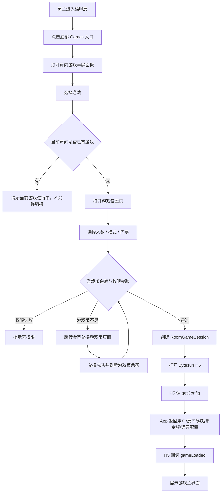

### 6.2 普通用户加入游戏

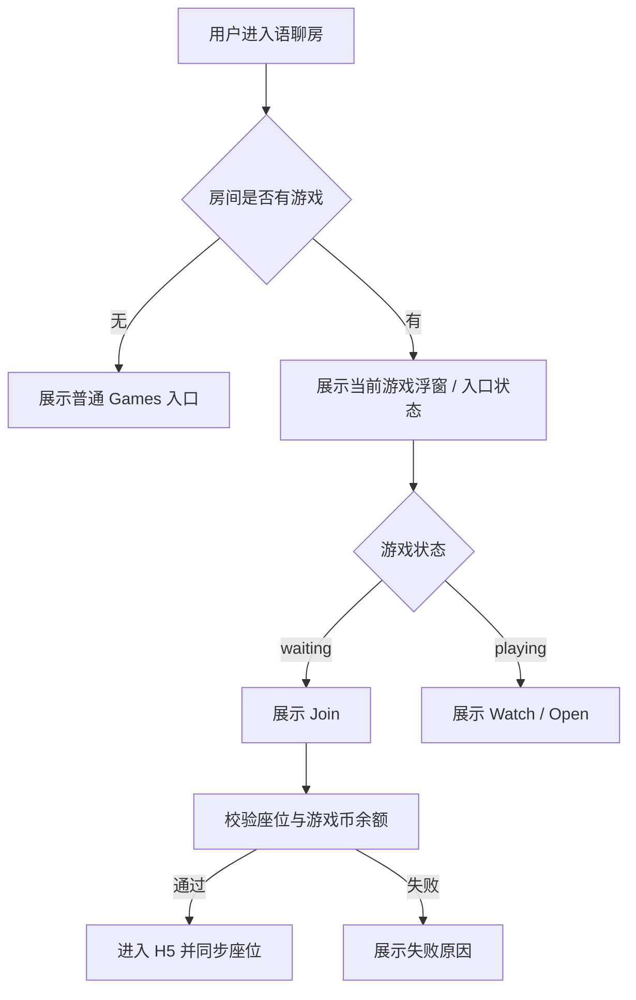

### 6.3 开局、扣费与结算

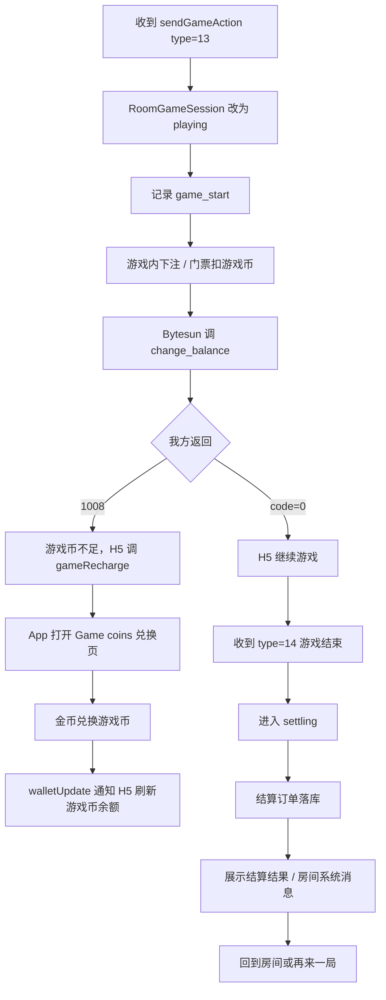

### 6.4 游戏币不足与金币兑换流程

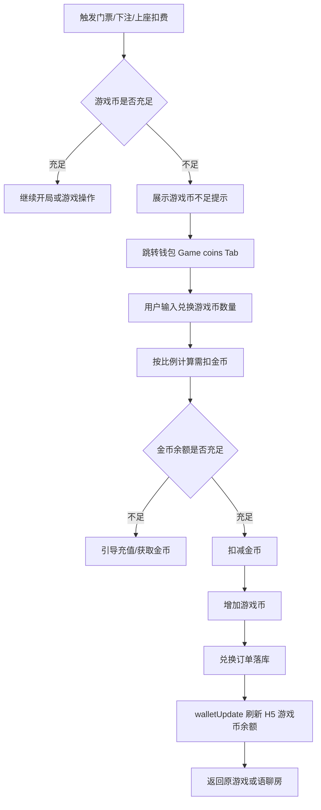

### 6.5 最小化与恢复

用户在游戏中点击最小化后，游戏画面收起，回到语聊房主界面，以浮窗形式保留游戏入口。

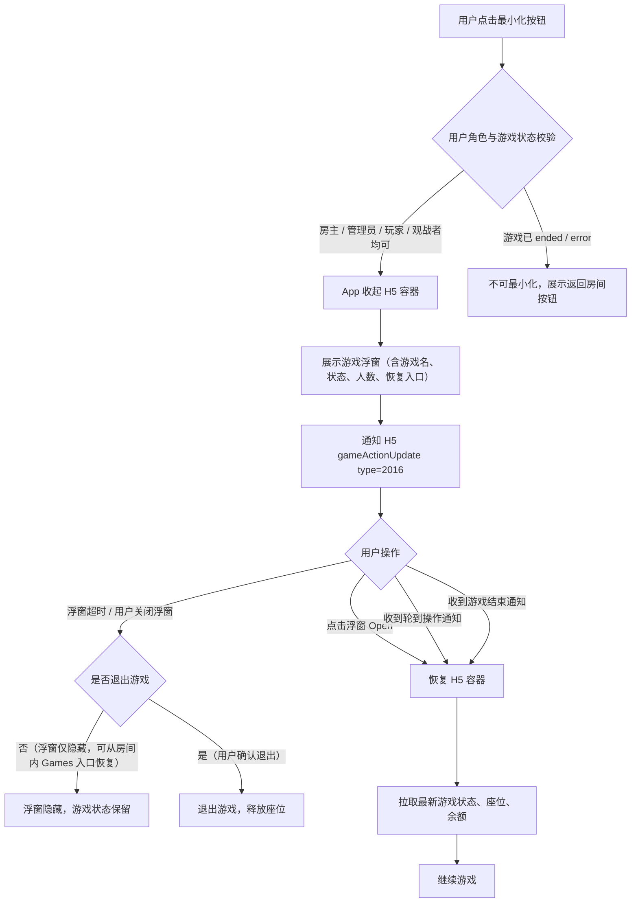

多层最小化叠加规则：

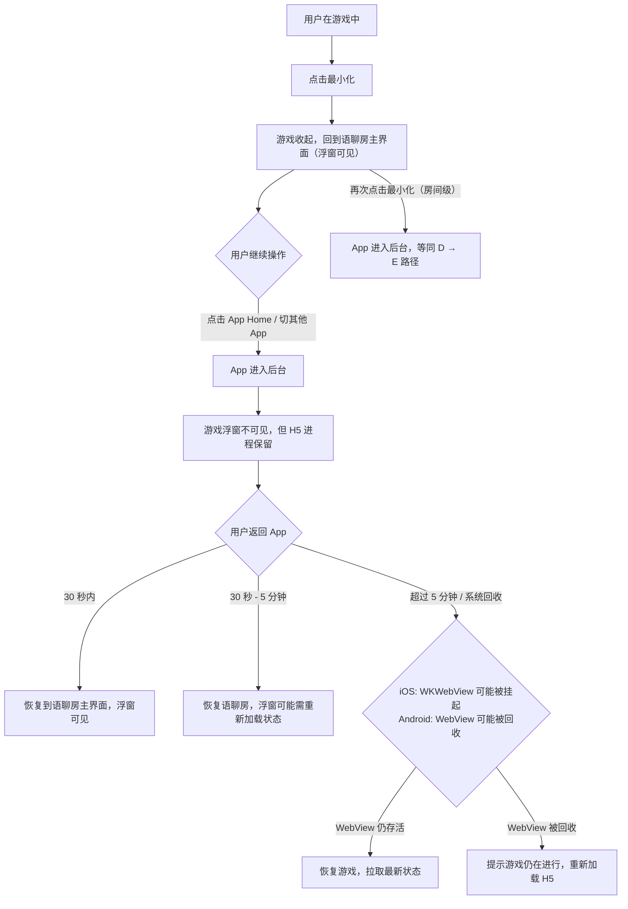

> 注意：游戏最小化和房间最小化是两个不同层级的操作。游戏最小化 = 收起游戏画面回到房间；房间最小化 = 整个 App 进入后台。两者可叠加。

## 7. 游戏状态设计

### 7.1 RoomGameSession 状态机

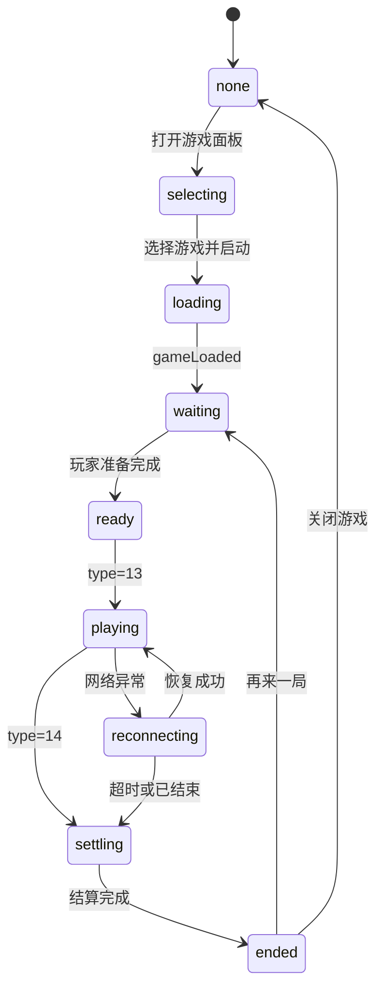

### 7.2 状态定义

| 状态 | 含义 | 用户可见动作 |
|---|---|---|
| none | 当前房间无游戏 | 打开游戏面板 |
| selecting | 浏览游戏列表 | 选择游戏 |
| loading | H5 加载中 | 等待 / 取消 |
| waiting | 游戏已创建，等待用户加入 | Join / Invite |
| ready | 达到开局条件 | Start |
| playing | 游戏进行中 | Open / Watch / Gift / Chat |
| reconnecting | 重连中 | 等待 / 退出 |
| settling | 结算中 | 等待 |
| ended | 已结束 | 再来一局 / 返回房间 |
| error | 异常 | Retry / Close |

## 8. 座位、麦位与声音规则

| 规则 | 说明 |
|---|---|
| 游戏座位独立于语聊麦位 | 用户不上麦也可以玩游戏 |
| 语聊麦位不因游戏改变 | 原有房主、主持、管理员权限保持 |
| 座位以 App 最终状态为准 | 与 H5 冲突时，通过 gameActionUpdate type=4 反向同步 |
| 一个用户只能占一个游戏座位 | 防重复占位和多端异常 |
| 游戏中不可随意换座 | 除非三方游戏明确支持 |
| 游戏结束释放座位 | 再来一局重新进入 waiting / preparing |

声音策略：

| 场景 | 策略 |
|---|---|
| 普通休闲游戏 | 保留我方语聊房 RTC，默认降低或关闭游戏 BGM |
| 用户静音麦克风 | 同步我方 RTC 状态，必要时通知游戏 |
| 游戏查询音效状态 | H5 发查询后，App 返回当前 sound 状态 |
| RTC 推理游戏 | V3 才接入，使用 isGameRTC=true 和 type=3001 |

## 9. 货币与结算

### 9.1 货币口径

V1 游戏内统一使用**游戏币（Game coins）**，金币只作为兑换来源，不直接参与游戏下注、门票和结算。

```text
金币 Gold coins -> 兑换 -> 游戏币 Game coins -> 游戏内门票/下注/结算
```

默认兑换比例按页面展示：

```text
100 金币 = 1000 游戏币
```

规则：

| 规则 | 说明 |
|---|---|
| 游戏内展示币种 | 只展示游戏币，不展示金币 |
| 游戏币来源 | 用户通过金币兑换获得 |
| 反向兑换 | 不支持游戏币兑换回金币 |
| 提现 | 游戏币仅供游戏内使用，不支持提现 |
| 比例配置 | 默认 100 金币 = 1000 游戏币，后台可配置并记录历史版本 |
| 审核策略 | 审核账号可隐藏付费局和游戏币兑换入口 |

### 9.2 消耗与奖励场景

| 场景 | 类型 | 币种 | 变动 |
|---|---|---|---:|
| 金币兑换游戏币 | exchange | 金币 / 游戏币 | 金币负值，游戏币正值 |
| 门票扣费 | ticket | 游戏币 | 负值 |
| 游戏下注 | bet | 游戏币 | 负值 |
| 游戏结算奖励 | result | 游戏币 | 正值 |
| 异常退款 | refund | 游戏币 | 正值 |
| 运营补偿 | compensate | 游戏币 | 正值 |

### 9.3 游戏币不足处理

| 触发点 | 判断 | 处理 |
|---|---|---|
| 设置页点击 Start / Join | 游戏币 < 门票 | 弹窗提示“游戏币不足”，跳转 Game coins 兑换页 |
| H5 内下注 | Bytesun 调 change_balance 返回 1008 | H5 调 `gameRecharge`，App 打开 Game coins 兑换页 |
| 上座校验 | 游戏币低于当前局最低要求 | 不允许上座，提示兑换后重试 |
| 兑换页金币不足 | 金币余额 < 需扣金币 | 兑换按钮置灰，引导充值或获取金币 |
| 兑换成功 | 金币扣减成功，游戏币增加成功 | 调 `walletUpdate` 通知 H5 刷新余额，并允许回到原游戏 |

### 9.4 结算安全

| 规则 | 说明 |
|---|---|
| order_id 幂等 | 同一订单重复回调只处理一次 |
| 用户级锁 | change_balance 必须做单用户并发保护 |
| 成功 code | 只有成功才能返回 code=0 |
| 游戏币不足 | 返回 1008，H5 可调 gameRecharge |
| 兑换幂等 | 金币扣减和游戏币增加必须在同一事务内完成 |
| 补偿队列 | 结算失败进入补偿和对账 |
| 对账 | 游戏订单、兑换订单、钱包流水、Bytesun 回调四方核对 |

## 10. Bytesun 技术接入要求

### 10.1 接入方式

| 方式 | 说明 | V1 建议 |
|---|---|---|
| URL 直连 | 直接加载游戏 H5 URL | 联调和灰度优先 |
| Zip 本地包 | 下载游戏 Zip 并解压本地加载 | 正式体验优化 |
| CDN 加速 | OSS 源站回源，配置 CDN | 必做 |

标准流程：

1. 我方后台同步 Bytesun 游戏列表。
2. 客户端获取游戏信息和版本。
3. 客户端按版本决定 URL 直连或 Zip 更新。
4. 打开 H5 / WebView。
5. H5 调 `getConfig`。
6. App 返回商户、用户、房间、语言、游戏币余额、金币余额、角色等配置。
7. H5 通过 JSBridge 上报游戏状态。
8. Bytesun 服务端通过我方 API 查询用户和修改余额。

### 10.2 getConfig 关键字段

| 字段 | 说明 |
|---|---|
| merchantId | Bytesun 分配 |
| appChannel | Bytesun 分配，后台配置 |
| userId | 我方用户 ID |
| roomId | 当前语聊房 ID |
| role | 用户角色 |
| language | 客户端语言 |
| gameMode | 语聊房场景固定传 `"3"` |
| balance | 当前游戏币余额，供 Bytesun 游戏内展示和扣费 |
| goldBalance | 当前金币余额，仅用于我方兑换页展示，不直接参与游戏扣费 |
| exchangeRate | 金币兑换游戏币比例，例如 `100金币=1000游戏币` |
| userType | 用户风控 / 审核类型 |
| safeArea | 顶部 / 底部安全区 |

### 10.3 H5 调 App

| 方法 / type | 用途 | V1 要求 |
|---|---|---|
| getConfig | 获取配置 | 必须 |
| destroy | 游戏主动关闭 WebView | 兼容处理 |
| gameLoaded | 游戏加载完成 | 必须 |
| gameRecharge | 游戏币不足时拉起 Game coins 兑换页 | 必须 |
| type=13 | 游戏开始 | 状态改为 playing |
| type=14 | 游戏结束 | 状态改为 settling |
| type=15 | 上 / 下游戏座位 | App 校验后同步 |
| type=16 | 座位信息同步 | 刷新座位 |
| type=18 | 上座失败 | 展示失败原因 |
| type=20 | 语聊房游戏准备完成 | 同步房间信息 |
| type=23 | 游戏基础参数 | 更新配置 |
| type=30 | 最大人数 / 门票变更 | 更新房间配置 |

### 10.4 App 调 H5

| 方法 / type | 用途 |
|---|---|
| walletUpdate | 游戏币兑换成功或游戏币余额变化后通知游戏刷新 |
| gameActionUpdate type=4 | 操作游戏座位 |
| gameActionUpdate type=6 | 返回踢人结果 |
| gameActionUpdate type=2012 | 查询音效状态 |
| gameActionUpdate type=2014 | App 聊天同步到画猜类游戏 |
| gameActionUpdate type=2016 | 最小化 / 展开状态 |

### 10.5 服务端 API

| 接口 | 用途 | 要求 |
|---|---|---|
| `/v1/api/get_sstoken` | 获取服务端 token | 签名、过期、权限校验 |
| `/v1/api/get_user_info` | 查询用户昵称、头像、游戏币余额 | 返回 game coin balance / user_type |
| `/v1/api/change_balance` | 游戏币下注、结算、退款 | 用户级锁、order_id 幂等、游戏币不足 1008 |
| 金币兑换游戏币接口 | 用户在 Game coins 页兑换 | 同事务扣金币并加游戏币，兑换订单幂等 |
| 游戏状态上报接口 | game_start / game_settle | 落库、看板、风控 |
| 房间游戏状态接口 | 查询当前房间游戏 | 客户端恢复和浮窗展示 |

### 10.6 URL 特殊参数

| 参数 | 适用 | 说明 |
|---|---|---|
| `game_margin_top` | 全屏语聊房游戏 | 顶部安全区 |
| `game_margin_bottom` | 全屏语聊房游戏 | 底部工具栏安全区 |
| `game_margin_standard` | 全屏语聊房游戏 | 标准屏幕参数 |
| `hideLobby=true` | ludoPlus / unoPlus / DominoPlus | 隐藏大厅，需 Bytesun 补充快速开始 API |
| `isGameRTC=true` | RTC 推理游戏 | V3 才启用 |
| `language` | Loading 页语言 | 按 Bytesun 支持范围传值 |

## 11. 后台管理 PRD

### 11.1 菜单结构

```text
运营后台
└── 游戏中心
    ├── 游戏接入配置
    ├── 游戏配置列表
    ├── 游戏入口配置
    ├── 房间游戏监控
    ├── 游戏活动管理
    ├── 游戏记录
    ├── 结算管理
    ├── 游戏币兑换管理
    ├── 风控审核
    └── 三方接口配置
```

### 11.2 游戏接入配置

| 字段 | 说明 |
|---|---|
| merchantId | Bytesun 商户 ID |
| appKey | 仅服务端保存，不下发客户端 |
| appChannel | 游戏渠道 |
| 游戏列表同步开关 | 是否自动同步 Bytesun 游戏 |
| CDN 域名 | 游戏包回源和预热 |
| Zip 更新策略 | 自动 / 手动 / 灰度 |
| URL 直连开关 | 是否允许直连 H5 |
| 游戏币兑换比例 | 默认 100 金币 = 1000 游戏币，支持灰度和历史记录 |
| 游戏币兑换开关 | 控制 Game coins 页是否可兑换 |

### 11.3 游戏配置列表

| 字段 | 说明 |
|---|---|
| 游戏 ID | Bytesun `game_id` |
| 游戏名称 | 多语言展示名 |
| Bytesun 游戏名 | ludoPlus / unoPlus 等 |
| 游戏分类 | 桌游、卡牌、台球、休闲、画猜、RTC |
| 游戏 icon | `preview_url` |
| 游戏版本 | `game_version` |
| 游戏方向 | 竖屏 / 横屏 |
| 上下架状态 | 上架、下架、维护、灰度 |
| 地区限制 | 国家 / 区域 |
| 端限制 | iOS / Android / Web |
| 审核账号策略 | 展示 / 隐藏 / 只展示免费局 |
| 门票范围 | 单位为游戏币，配置最小、最大、默认值 |
| 是否允许观战 | 开 / 关 |

### 11.4 游戏入口配置

| 配置 | 默认 | 说明 |
|---|---|---|
| Discover Games Tab | 开 | 控制游戏大厅入口 |
| Activity Tab | 开 | 控制活动页 |
| 房间内 Games 按钮 | 开 | 控制房间底部工具栏 |
| 房间右侧快捷入口 | 开 | 游戏进行中或活动时展示 |
| More Games | 开 | 控制全部游戏弹窗 |
| 房间列表游戏标签 | 开 | 控制 Game Rooms 聚合 |
| 游戏中允许切换 | 关 | V1 不允许 |
| 管理员开局 | 关 | 可后台放开 |

### 11.5 房间游戏监控

| 字段 | 说明 |
|---|---|
| 语聊房 ID | 当前房间 |
| 房主 ID | 房间归属 |
| 当前游戏 | Ludo / UNO / Domino |
| RoomGameSession ID | 我方游戏会话 |
| Bytesun roomId | 三方房间 ID |
| 游戏状态 | waiting / playing / settling / ended / error |
| 玩家数 | 当前游戏座位人数 |
| 观战数 | 当前观战人数 |
| 门票 | 当前局门票，单位为游戏币 |
| 异常状态 | 白屏、加载失败、结算失败、座位异常 |

操作：

| 操作 | 说明 |
|---|---|
| 查看详情 | 查看本局玩家、座位、结算、日志 |
| 强制关闭 | 异常时关闭当前游戏 |
| 下架游戏 | 快速风控 |
| 复制日志 | 方便联调排查 |

### 11.6 结算管理

| 字段 | 说明 |
|---|---|
| 订单 ID | `order_id` |
| 用户 ID | userId |
| 游戏 ID | game_id |
| 房间 ID | room_id |
| session ID | RoomGameSession |
| 变动类型 | ticket / bet / result / refund |
| 变动金额 | 游戏币 currency_diff |
| 前后余额 | before / after |
| 状态 | success / failed / compensating |
| 回调时间 | Bytesun 回调时间 |

### 11.7 游戏币兑换管理

| 字段 | 说明 |
|---|---|
| 兑换订单 ID | exchange_order_id |
| 用户 ID | userId |
| 扣除金币 | gold_cost |
| 增加游戏币 | game_coin_add |
| 兑换比例 | exchange_rate_snapshot |
| 兑换来源 | 游戏币不足弹窗 / 钱包 Game coins Tab / 游戏设置页 |
| 原游戏会话 | 若从游戏内跳转，记录 RoomGameSession ID |
| 状态 | success / failed / compensating |
| 失败原因 | 金币不足、并发失败、风控拦截、系统异常 |
| 创建时间 | created_at |

## 12. 数据模型

### 12.1 RoomGameSession

| 字段 | 说明 |
|---|---|
| id | 游戏会话 ID |
| room_id | 语聊房 ID |
| game_id | Bytesun 游戏 ID |
| game_name | 游戏名 |
| status | none / loading / waiting / playing / settling / ended / error |
| host_user_id | 开局用户 |
| ticket | 门票，单位为游戏币 |
| max_players | 最大人数 |
| bytesun_room_id | 三方房间 ID |
| started_at | 开始时间 |
| ended_at | 结束时间 |
| created_at / updated_at | 时间戳 |
| game_creator_user_id | 本局游戏创建人，默认等于发起游戏的房主或管理员 |
| game_controller_user_id | 当前游戏控制人，房主离开后可由管理员临时接管 |
| controller_source | host / admin_takeover / system，标识控制权来源 |
| controller_expire_at | 临时接管有效期，可为空 |
| game_config_version | 创建 session 时使用的游戏配置版本 |
| ticket_config_snapshot | 当前局门票配置快照，后台改配置不影响已创建 session |
| exchange_rate_snapshot | 当前局涉及兑换时的兑换比例快照 |
|| reconnect_deadline | 断线重连保留座位的截止时间 |
|| watcher_count | 当前观战者人数，实时更新 |
|| watcher_limit | 观战者人数上限，默认 50 |
|| daily_game_index | 本房间当日第 N 局，用于单日局数限制 |
|| is_rematch | 是否为再来一局，默认 false |
|| parent_session_id | 再来一局的上一局 session_id，可为空 |
|| minimized_user_ids | 当前最小化状态的用户 ID 列表（JSON 数组），用于浮窗展示 |

### 12.2 RoomGamePlayer

| 字段 | 说明 |
|---|---|
| id | 记录 ID |
| session_id | 游戏会话 |
| room_id | 语聊房 |
| user_id | 用户 |
| seat_no | 游戏座位 |
| role | player / watcher |
| status | joined / ready / playing / left / kicked |
| joined_at | 加入时间 |
| left_at | 离开时间 |
| last_active_at | 最近一次心跳 / 操作时间 |
| disconnect_at | 断线时间，可为空 |
| is_reconnecting | 是否处于重连保护期 |
|| device_id | 最近一次参与游戏的设备 ID，用于多端控制 |
|| is_minimized | 是否处于最小化状态，默认 false |
|| minimized_at | 最小化时间，可为空 |
|| rematch_seat_reserved | 再来一局座位保留标记，默认 false |
|| rematch_reserved_until | 再来一局座位保留截止时间 |
|| daily_game_count | 用户当日本游戏局数，用于单日局数限制 |

### 12.3 GameBalanceOrder

| 字段 | 说明 |
|---|---|
| order_id | 幂等订单 ID |
| session_id | 游戏会话 |
| user_id | 用户 |
| game_id | 游戏 |
| currency_type | 固定为游戏币，可扩展 |
| currency_diff | 游戏币变动金额 |
| before_balance | 变动前游戏币余额 |
| after_balance | 变动后游戏币余额 |
| status | success / failed / compensating |
| raw_payload | Bytesun 原始回调 |
| related_order_id | 关联订单 ID，用于退款、补偿、冲正 |
| refund_reason | 退款原因，可为空 |
| result_viewed | 用户是否已查看结算结果 |
| result_viewed_at | 用户查看结算结果时间 |

### 12.4 GameCoinExchangeOrder

| 字段 | 说明 |
|---|---|
| exchange_order_id | 兑换订单 ID |
| user_id | 用户 ID |
| gold_cost | 扣除金币数量 |
| game_coin_add | 增加游戏币数量 |
| exchange_rate_snapshot | 兑换比例快照 |
| source | insufficient / wallet_tab / setting_page |
| source_session_id | 来源游戏会话，可为空 |
| before_gold_balance | 兑换前金币余额 |
| after_gold_balance | 兑换后金币余额 |
| before_game_coin_balance | 兑换前游戏币余额 |
| after_game_coin_balance | 兑换后游戏币余额 |
| status | success / failed / compensating |
| fail_reason | 失败原因 |

## 13. 数据埋点与指标

### 13.1 核心埋点

| 埋点 | 触发时机 |
|---|---|
| game_entry_show | Discover 或房内游戏入口曝光 |
| game_entry_click | 点击游戏入口 |
| game_panel_show | 房内半屏游戏面板展示 |
| game_tab_click | 点击休闲游戏 / 活动 / 动态表情 |
| game_item_click | 点击某个游戏 |
| game_setting_show | 游戏设置页展示 |
| game_start_click | 点击 Start / Join |
| game_h5_load_start | 开始加载 H5 |
| game_loaded | 收到 gameLoaded |
| game_start | 收到 type=13 |
| game_end | 收到 type=14 |
| game_result_view | 结算页曝光 |
| game_coin_insufficient | 游戏币不足 |
| game_coin_exchange_page_show | 打开 Game coins 兑换页 |
| game_coin_exchange_submit | 点击立即兑换 |
| game_coin_exchange_success | 游戏币兑换成功 |
| game_coin_exchange_failed | 游戏币兑换失败 |
| game_recharge_open | H5 拉起 Game coins 兑换页 |
| game_minimize | 游戏最小化 |
| game_restore | 游戏恢复 |
| game_error | 加载、回调、结算等异常 |

### 13.2 核心指标

| 指标 | 计算 |
|---|---|
| 游戏入口点击率 | `game_entry_click / game_entry_show` |
| 面板游戏点击率 | `game_item_click / game_panel_show` |
| 设置页转化率 | `game_start_click / game_setting_show` |
| H5 加载成功率 | `game_loaded / game_h5_load_start` |
| 开局成功率 | `game_start / game_start_click` |
| 游戏完成率 | `game_end / game_start` |
| 结算失败率 | failed balance orders / all balance orders |
| 白屏率 | H5 加载失败或超时 / load_start |
| 游戏币兑换金额 | 游戏来源兑换的金币消耗与游戏币增加 |
| 游戏币不足转化率 | `game_coin_exchange_success / game_coin_insufficient` |

## 14. 异常与边界场景

本章节补充房间生命周期、房主退出、最小化、座位、麦位、H5 状态、钱包结算、后台干预、审核风控等异常场景。整体原则：

| 原则 | 说明 |
|---|---|
| 房间是主容器 | 游戏依附于语聊房，不脱离房间单独运行 |
| 游戏是插件态 | 游戏不反向改变语聊房房主、麦位、管理员体系 |
| 服务端状态为准 | RoomGameSession、RoomGamePlayer、钱包订单为最终依据 |
| 已开局优先不中断 | playing / settling 状态优先保障本局完成和结算稳定 |
| 钱包订单必须幂等 | 扣费、退款、结算、补偿均需订单关联和幂等处理 |

### 14.1 房间相关

| 场景 | 处理 |
|---|---|
| 房主离开房间 | 已开局游戏继续；管理员接管；无管理员则系统托管，本局结束后不可再开 |
| 房间关闭 | 强制结束游戏，按状态结算或退款 |
| 房间被封禁 | 立即关闭游戏入口和当前游戏层，当前局按风控策略结算、挂起或退款 |
| 用户被踢出房间 | 同步退出游戏，释放座位 |
| 房间切后台 | 游戏继续，前台回来恢复状态 |
| 多人同时开游戏 | 服务端只允许一个 session，后发请求失败 |
| 用户游戏中进入其他房间 | 二次确认；确认后退出当前游戏并释放座位 |
| 房间改为私密 / 加锁 | 已在房间用户不受影响，新用户按新权限校验 |
| 游戏中切换房间模式 | playing 中不允许普通切换，后台强制切换时游戏继续但权限按新模式生效 |
| 房间无人 | waiting 关闭 session；playing 按规则托管、结束或退款 |

### 14.2 房主退出与游戏接管

房主退出房间不等于立即关闭游戏。需要按 RoomGameSession 状态处理。

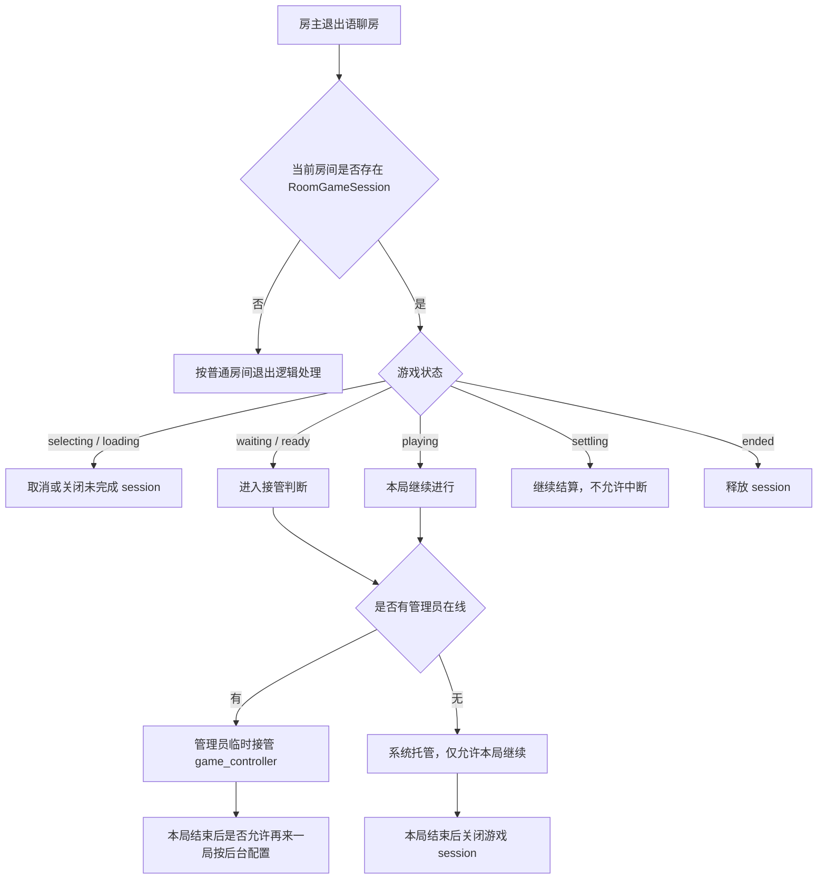

| 游戏状态 | 房主退出后的处理 |
|---|---|
| selecting | 未创建有效游戏，直接关闭面板 |
| loading | H5 未完成加载时可取消 session；已扣款需退款 |
| waiting | 有管理员则接管；无管理员且无人上座则关闭；有人上座则保留 60 秒 |
| ready | 有管理员则可 Start / Close；无管理员则 60 秒后关闭并退款 |
| playing | 本局继续，不强制中断 |
| reconnecting | 按重连规则处理，房主身份不影响用户重连 |
| settling | 继续完成结算，不允许人为关闭 |
| ended | 释放游戏 session |
| error | 管理员或系统可关闭 |

#### 14.2.1 游戏控制人规则

RoomGameSession 增加 `game_controller_user_id`，用于标记当前游戏管理人。

| 字段 | 说明 |
|---|---|
| host_user_id | 房间房主 ID，不随游戏变化 |
| game_creator_user_id | 本局游戏创建人 |
| game_controller_user_id | 当前游戏控制人 |
| controller_source | host / admin_takeover / system |
| controller_expire_at | 临时接管有效期，可为空 |

接管优先级：

1. 房间内在线管理员。
2. 游戏内已上座玩家中的管理员。
3. V1 不建议普通玩家自动接管，避免权限争议。
4. 无管理员时进入 system 托管态。

system 托管态限制：

| 能力 | 是否允许 |
|---|---|
| 当前 playing 局继续 | 允许 |
| 当前局结算 | 允许 |
| 普通用户观战 | 允许 |
| 修改门票 / 人数 / 模式 | 不允许 |
| 再来一局 | 不允许 |
| 切换游戏 | 不允许 |
| 关闭异常 session | 系统或后台允许 |

### 14.3 游戏最小化完整规则

#### 14.3.1 最小化角色权限矩阵

所有在游戏中的用户均可最小化，但不同角色的最小化后行为存在差异：

| 角色 | 能否最小化 | 最小化后游戏控制权 | 最小化后房间权限 | 恢复入口 |
|---|---|---|---|---|
| 房主（游戏中） | ✅ | 保留；最小化不等于退出游戏，控制权不转移 | 保留房主身份；房间内仍可见房主标识 | 浮窗 Open + 房间 Games 入口 |
| 管理员（游戏中） | ✅ | 若已接管 game_controller 则保留；否则无控制权 | 保留管理员权限 | 浮窗 Open + 房间 Games 入口 |
| 普通玩家（在游戏座位上） | ✅ | 无控制权 | 保留房间普通用户权限 | 浮窗 Open + 房间 Games 入口 |
| 观战者 | ✅ | 无控制权 | 保留房间普通用户权限 | 浮窗 Open + 房间 Games 入口 |

> 关键原则：**最小化 ≠ 退出游戏**。用户的最小化操作只是视觉层面的容器收起，不影响游戏座位、控制权、结算资格。退出游戏需要用户主动点击"Leave / Quit"并经过二次确认。

#### 14.3.2 最小化入口与触发方式

| 入口 | 位置 | 触发方式 | 适用状态 |
|---|---|---|---|
| 最小化按钮 | 游戏全屏态顶部右侧或底部工具栏内 | 单击 | loading / waiting / playing / settling 期间均可用 |
| 系统手势返回 | Android 返回键 / iOS 左滑返回 | 手势 | 同上，弹出确认："最小化游戏回到房间？" |
| 游戏已 ended | 自动触发 | 自动 | 结算完成后自动收起游戏层，展示结算结果卡片 |

冲突处理：

| 场景 | 冲突 | 处理 |
|---|---|---|
| 游戏正在 loading 时点击最小化 | H5 尚未回调 gameLoaded | 允许最小化；loading 继续在后台进行；gameLoaded 后浮窗状态从 Loading → Waiting |
| 游戏正在 settling 时点击最小化 | 结算进行中 | 允许最小化；结算完成后浮窗弹出"Settled"状态卡片，引导查看结果 |
| 游戏已 ended / error 时点击最小化 | 无意义 | 最小化按钮置灰或隐藏，改为展示"返回房间"按钮 |
| 重复点击最小化 | 防抖 | 300ms 内重复点击只触发一次 |

#### 14.3.3 游戏浮窗形态

游戏最小化后，在语聊房主界面展示浮窗，不同角色和状态展示不同信息：

**玩家浮窗：**

```text
┌──────────────────────────────┐
│ 🎲 Ludo · Playing    [×] [↗] │
│ Your turn! 2/4 players       │
│ 🪙 12,500 Game coins          │
└──────────────────────────────┘
```

**观战者浮窗：**

```text
┌──────────────────────────────┐
│ 👁 Ludo · Playing     [×] [↗] │
│ Watching 2/4 players         │
└──────────────────────────────┘
```

**房主/控制人浮窗：**

```text
┌──────────────────────────────┐
│ 👑 Ludo · Playing     [×] [↗] │
│ 2/4 players · Host           │
│ 🪙 12,500 Game coins          │
└──────────────────────────────┘
```

浮窗字段说明：

| 字段 | 来源 | 刷新频率 |
|---|---|---|
| 游戏名 + icon | RoomGameSession.game_name | 静态 |
| 游戏状态（Playing / Waiting / Settling / Ended） | RoomGameSession.status | 状态变更时推送 |
| 玩家数 / 总座位 | RoomGamePlayer 计数 | 座位变更时推送 |
| "Your turn!" 提示 | H5 通过 gameActionUpdate 推送 | 轮到操作时推送 |
| 游戏币余额 | get_user_info | 余额变更时 walletUpdate 推送 |
| Host / Watching 标识 | 用户角色 + game_controller 判断 | 控制权变更时推送 |

浮窗交互：

| 操作 | 行为 |
|---|---|
| 点击浮窗主体 / 点击 ↗ | 恢复 H5 容器，拉取最新状态后继续游戏 |
| 点击 × | 弹出确认："Hide game window? You can restore it from the Games button." 确认后隐藏浮窗；游戏状态不退出，可从房间底部 Games 按钮恢复 |
| 长按浮窗 | 拖拽调整位置（可选，V2） |
| 浮窗自动消失 | 不自动消失；游戏 ended 后浮窗展示结算入口，5 分钟无操作自动收起并展示系统消息 |

#### 14.3.4 最小化后的通知推送

用户最小化游戏后，仍需感知关键游戏事件，避免错过操作时机或结算结果。

| 事件 | 通知方式 | 触发条件 | 用户点击通知后 |
|---|---|---|---|
| 轮到玩家操作 | 浮窗闪烁 + 系统通知（App 内横幅） | H5 推送 gameActionUpdate 标识轮到该用户 | 直接恢复游戏画面 |
| 游戏即将结束 | 浮窗状态更新 "Ending soon" | H5 推送 type=14 前（若有预警） | 恢复游戏画面 |
| 游戏已结束 | 浮窗展示结算入口卡片 + 系统消息 | 收到 type=14 | 展示结算结果页 |
| 有玩家退出 / 加入 | 浮窗人数更新 | RoomGamePlayer 变更 | 无特殊跳转 |
| 房主/控制人变更 | 浮窗 Host 标识更新 | game_controller_user_id 变更 | 无特殊跳转 |
| 游戏币余额变化 | 浮窗余额更新 | walletUpdate | 无特殊跳转 |

通知优先级策略：

```text
轮到操作 > 游戏结束 > 玩家变更 > 余额变更
```

- 同时发生多个事件时，浮窗只展示最高优先级事件的提示文案
- 用户在房间公屏发消息、送礼等操作时，不触发游戏浮窗通知

#### 14.3.5 最小化时的轮到操作超时

用户最小化后轮到操作时，需要明确超时策略：

| 游戏状态 | 用户最小化 | 轮到操作后 | 超时处理 |
|---|---|---|---|
| Ludo | 玩家最小化 | 推送通知 + 浮窗闪烁 | 按游戏规则自动掷骰（Ludo 有默认操作） |
| UNO | 玩家最小化 | 推送通知 + 浮窗闪烁 | 按游戏规则自动摸牌（UNO 有超时摸牌机制） |
| 8 Ball / Carrom | 玩家最小化 | 推送通知 + 浮窗闪烁 | 按游戏规则判超时或跳过 |
| Snake & Ladder | 玩家最小化 | 推送通知 + 浮窗闪烁 | 按游戏规则自动掷骰 |

> 关键原则：**最小化不暂停游戏**。游戏仍按正常节奏运行，超时后果由玩家承担。通知只是辅助提示，不改变游戏规则。

#### 14.3.6 多层最小化叠加

用户可能连续触发多层最小化：

| 层级 | 操作 | 可见状态 | 进程状态 |
|---|---|---|---|
| Level 0：游戏全屏 | — | 游戏画面 + 底部房间工具栏 | H5 前台运行 |
| Level 1：游戏最小化 | 点击最小化 | 语聊房主界面 + 游戏浮窗 | H5 后台保持，WebView 未销毁 |
| Level 2：App 切后台 | 按 Home / 切其他 App | 不可见 | H5 进程可能被挂起 |
| Level 3：系统杀进程 | 内存回收 / 用户杀 App | 不可见 | H5 进程被销毁，需重连恢复 |

Level 1 → Level 0 恢复：

- 点击浮窗 Open → 恢复 H5 容器 → 拉取最新状态 → 继续游戏
- 若 H5 在后台已崩溃 → 展示恢复/关闭选项

Level 2 → Level 1 恢复：

- 用户切回 App → 恢复到语聊房主界面 → 浮窗可见
- 若超过 5 分钟（iOS WKWebView 挂起）→ 浮窗可能需重新加载 H5 状态
- H5 进程若已被系统回收 → 查询 RoomGameSession 状态 → 若游戏仍 playing 则重建 H5 容器

Level 3 → 恢复：

- 用户重新打开 App → 查询当前房间和 RoomGameSession
- 若游戏仍 playing 且用户在座位上 → 重新加载 H5 并恢复座位
- 详见 14.5 断线恢复流程

#### 14.3.7 浮窗关闭 vs 退出游戏

这两个操作必须明确区分：

| 操作 | 含义 | 游戏座位 | 控制权 | 可恢复 |
|---|---|---|---|---|
| 关闭浮窗（点击 ×） | 仅隐藏浮窗 UI | 保留 | 保留 | 可从房间 Games 按钮恢复 |
| 退出游戏（点击 Leave / Quit） | 主动离开游戏 | 释放 | 释放 | 需重新 Join |
| 被踢出游戏 | 被房主/管理员踢出 | 释放 | 释放 | 不可恢复（本局） |
| 游戏自然结束 | 结算完成 | 自动释放 | 自动释放 | 可再来一局 |

关闭浮窗后的恢复路径：

```text
房间底部 Games 按钮 → 检测到当前用户有活跃 RoomGameSession → 直接恢复游戏画面
```

> 设计原则：**浮窗仅是 UI 层面的可见性控制，不触碰游戏业务状态**。用户关闭浮窗后，游戏仍在后台运行，轮到操作时仍会通过系统通知提醒。

#### 14.3.8 iOS 与 Android 兼容性

| 场景 | iOS (WKWebView) | Android (WebView) |
|---|---|---|
| 游戏最小化后 H5 后台运行 | WKWebView 不在前台但进程存活，JS 定时器可能被暂停 | WebView 后台存活，JS 定时器可能被暂停 |
| App 切后台 0-5 分钟 | WKWebView 正常保持 | WebView 正常保持 |
| App 切后台超过 5 分钟 | WKWebView 可能被系统挂起或回收，内存不足时优先回收 | WebView 可能被系统回收，各厂商 ROM 行为不一致 |
| App 切后台后返回 | 需检查 WKWebView 是否存活，存活则恢复，被回收则重建 | 需检查 WebView 状态，部分机型需 reload |
| 内存警告 | 系统发送 didReceiveMemoryWarning，可主动释放非关键资源 | onLowMemory / onTrimMemory，可主动释放 |
| 低端机 WebView 加载 | 内存不足可能导致白屏，需降级 | 同左，部分机型 WebView 崩溃率高 |
| 浮窗渲染 | CALayer 渲染，性能影响极小 | SurfaceView / TextureView，低端机可能卡顿 |
| 返回手势冲突 | iOS 左滑返回可能与游戏内操作冲突，需在游戏全屏态禁用左滑返回 | Android 返回键弹出确认，避免误触 |

降级策略：

| 场景 | 降级方案 |
|---|---|
| WebView 被回收 | 提示"游戏仍在进行中"，提供恢复按钮重新加载 H5 |
| 内存不足导致白屏 | 记录白屏事件埋点，展示重试/关闭选项 |
| 连续 2 次加载失败 | 提示"当前设备性能不足"，建议关闭游戏，不影响房间 |
| 低端机浮窗卡顿 | 浮窗改为纯文字态（不渲染游戏 icon 和动画），只展示文字信息 |

#### 14.3.9 最小化相关埋点

| 埋点 | 触发时机 | 参数 |
|---|---|---|
| game_minimize | 用户点击最小化 | role, game_id, game_status, has_floating_window |
| game_floating_click | 用户点击浮窗恢复 | role, game_id, time_since_minimize |
| game_floating_close | 用户关闭浮窗 | role, game_id, game_status |
| game_floating_notification | 浮窗弹出通知 | notification_type, game_id |
| game_restore | 恢复游戏全屏 | restore_source (floating/notification/games_button), game_id |
| game_minimize_timeout | 最小化后超时未操作 | game_id, timeout_duration |
| game_webview_recover | WebView 被回收后重新加载 | game_id, recover_result |

#### 14.3.10 游戏座位与语聊房麦位兼容（最小化视角）

游戏座位与语聊房麦位完全独立，但最小化后存在展示层面的兼容需求：

| 类型 | 归属 | 作用 | 数据源 |
|---|---|---|---|
| 房间麦位 Room Mic Seat | 我方语聊房 | 语音聊天、上麦、下麦、锁麦 | RoomMicState |
| 游戏座位 Game Seat | Bytesun / RoomGamePlayer | 玩游戏、观战、结算 | RoomGamePlayer + Bytesun 回调 |
| 游戏内麦位缩略条 | 我方客户端展示层 | 展示谁在麦上、谁在说话 | RoomMicState 镜像 |

规则：

| 场景 | 处理 |
|---|---|
| 游戏全屏态 | 游戏为主视图，只展示麦位缩略条，不展示完整麦位盘 |
| 游戏最小化回房间 | 房间主界面展示完整麦位，游戏浮窗只展示游戏名、状态、人数、恢复入口 |
| 房间最小化但游戏仍打开 | 游戏主视图继续展示，保留底部房间工具栏和麦位缩略条 |
| 用户在游戏中被抱上麦 | RoomMicState 更新后，游戏内麦位缩略条同步刷新 |
| 用户在游戏中被移下麦 | 不影响游戏座位，游戏继续 |
| 用户被踢出房间 | 同步退出游戏，释放麦位和游戏座位 |
| 用户离开游戏但仍在房间 | 释放游戏座位，不影响房间麦位 |
| 用户离开房间但仍在游戏 | 不允许；离开房间时同步退出游戏 |

游戏浮窗不展示麦位，避免与房间主界面麦位重复。

### 14.4 游戏相关

| 场景 | 处理 |
|---|---|
| 游戏加载失败 | Retry / Close，记录 WebView 日志 |
| H5 未回调 gameLoaded | 30 秒超时，允许重试 |
| 游戏维护 | 灰态，不可点击 |
| 游戏中切换游戏 | 不允许，提示当前游戏进行中 |
| 座位满 | 提示可观战 |
| 上座失败 | 展示 Bytesun 失败原因 |
| H5 崩溃 | 展示恢复 / 关闭，保留房间 |
| 结算延迟 | 展示结算中，后台轮询或补偿 |
| H5 主动 destroy | 按当前状态决定关闭、重连或继续结算 |
| H5 与 App 状态不一致 | 以服务端 RoomGameSession 为准 |
| 重复收到游戏开始 | session_id + round_id 幂等处理，不重复扣门票 |
| 重复收到游戏结束 | order_id / round_id 幂等处理，不重复结算 |

#### 14.4.1 设置阶段参数修改冲突

游戏设置页（waiting 状态）中，房主修改参数时可能与已上座玩家产生冲突：

| 修改项 | 已上座情况 | 冲突 | 处理方案 |
|---|---|---|---|
| 人数从 4 人改为 2 人 | 已有 3 人上座 | 3 号位玩家被挤出 | 不允许减少到低于当前已上座人数；提示"已有 3 位玩家加入，最少需设为 3 人" |
| 人数从 2 人改为 4 人 | 2 人已上座 | 无冲突 | 允许，空座位增加 |
| 模式从 Classic 改为 Magic | 玩家已上座 | 玩家可能不适应新模式 | 允许修改，但需在设置页展示模式变更提示，已上座玩家收到公屏消息通知模式已变更 |
| 门票从 0 改为 500 | 玩家已上座且游戏币不足 | 玩家因余额不足被迫退出 | 允许修改；门票变更后，已上座但余额不足的玩家标记为"待补缴"，30 秒内未补缴则自动释放座位并退款（若已扣） |
| 门票从 500 改为 0 | 玩家已上座且已扣门票 | 已扣门票需退 | 允许修改；已扣门票自动退款，生成 refund order 关联原 ticket order |
| 门票从 200 改为 500 | 玩家已上座且只扣了 200 | 差额扣费 | 允许修改；需补扣 300 差额，余额不足的玩家标记"待补缴"，30 秒内未补缴则释放座位并退还原门票 |

参数修改后的客户端同步：

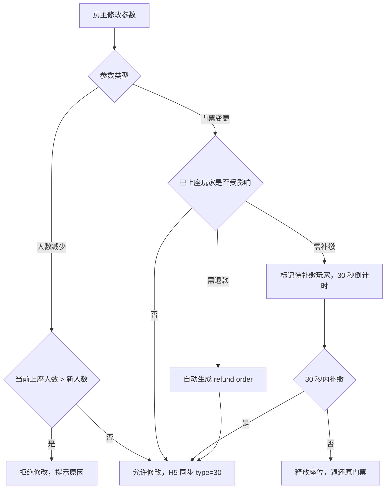

#### 14.4.2 房主主动关闭游戏

房主在游戏进行中主动点击"关闭游戏"（不同于退出房间），需要按游戏状态分别处理：

| 游戏状态 | 关闭行为 | 玩家影响 | 退款 |
|---|---|---|---|
| selecting / loading | 直接关闭，无玩家参与 | 无影响 | 未扣款则无需退款；已扣款则自动退款 |
| waiting / ready | 二次确认后关闭 | 已上座玩家退出座位 | 已扣门票全额退款 |
| playing | 二次确认后关闭，标记为异常结束 | 游戏中断，按当前分数/进度结算 | 门票退还；已下注金额按规则处理（无结果则退款） |
| settling | 不允许关闭 | 等待结算完成 | — |
| ended | 无需关闭 | — | — |

二次确认文案（waiting / ready 阶段）：

```text
Close this game? All players will be removed and tickets refunded.
```

二次确认文案（playing 阶段）：

```text
Force close this game? The current round will end and all bets will be refunded.
```

关闭后流程：

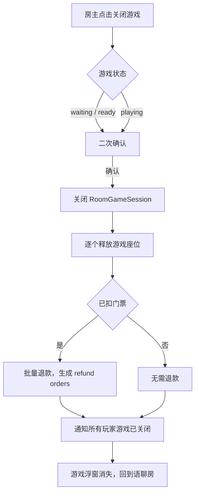

#### 14.4.3 邀请按钮交互

游戏设置页和游戏进行中均可发起邀请：

| 场景 | 邀请方式 | 被邀请人看到什么 | 被邀请人不在房间 |
|---|---|---|---|
| 设置页邀请 | 点击邀请按钮 → 房间内系统消息"XX 邀请你加入 Ludo" | 公屏消息 + 游戏入口高亮 | 先进入房间，再展示游戏入口 |
| 游戏中邀请 | 游戏浮窗/全屏态内邀请按钮 → 房间内系统消息 | 同上 | 同上 |
| 座位已满时邀请 | 邀请按钮置灰或改为"邀请观战" | "XX 邀请你观看 Ludo" | 同上 |
| 被邀请人在其他游戏 | — | 提示"需先退出当前游戏" | — |
| 被邀请人被封禁/地区限制 | — | 不可见邀请消息 | — |

> V1 邀请仅限房间内系统消息，不支持跨房间推送或离线推送。跨房间邀请放 V2。

### 14.5 用户断线、杀 App 与恢复

#### 14.5.1 基础断线恢复

| 场景 | 客户端 | 服务端 | H5 |
|---|---|---|---|
| 短暂断网 < 10 秒 | 自动重连，不展示提示 | session 保持，不做处理 | H5 JS 端自动重连 |
| 断网 10-60 秒 | 展示"网络连接中断"，自动重连 | session 保持 | H5 可能断开，恢复后重新拉取 |
| 断网 > 60 秒 | 展示"已断线"横幅，提供返回房间 | is_reconnecting = true，5 分钟内可恢复 | H5 destroy 后需重建 |
| 杀 App 重开 | 检查 RoomGameSession，展示恢复选项 | 同上 | 重建 WebView |

基础恢复流程：

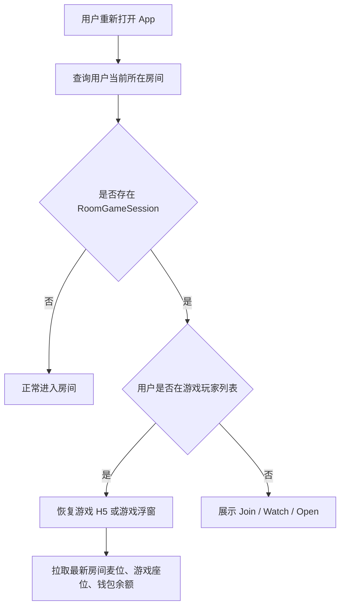

#### 14.5.2 来电打断

来电是最高优先级的系统中断，游戏必须让位：

| 来电类型 | 游戏状态 | 处理 |
|---|---|---|
| 语音来电 | 游戏全屏态 | App 自动进入后台（系统行为），等同 Level 2 最小化；游戏语音静音（系统行为），游戏音效暂停 |
| 语音来电 | 游戏已最小化（浮窗态） | 同上，浮窗不可见但游戏状态保留 |
| 语音来电结束 | — | App 恢复前台，展示"游戏进行中"横幅 + 恢复按钮；若错过操作，展示"已自动替你操作"提示 |
| 视频来电 | 同语音来电 | 同上，但需额外处理摄像头权限释放 |

冲突处理：

| 冲突点 | 处理 |
|---|---|
| 来电期间轮到操作 | 与最小化逻辑相同，按游戏规则自动操作或超时判负 |
| 来电超过 5 分钟 | 与 Level 3 最小化相同，WebView 可能被回收 |
| 用户拒绝来电返回游戏 | 直接恢复，无需额外操作 |
| 用户接听后来电界面覆盖 App | 等同 App 切后台 |

#### 14.5.3 系统通知覆盖

系统通知（闹钟、日历提醒、App 更新提示等）会短暂覆盖游戏画面：

| 通知类型 | 覆盖方式 | 游戏影响 | 处理 |
|---|---|---|---|
| iOS 横幅通知 | 顶部横幅 2-3 秒 | 可能遮挡游戏顶部状态栏 | 无需处理，横幅自动消失；若遮挡关键操作区，用户可点击横幅消除 |
| Android 通知栏 | 顶部下拉通知 | 可能遮挡更大区域 | 同上 |
| 系统弹窗（权限请求、更新） | 全屏弹窗 | 游戏暂停可见 | 用户关闭弹窗后恢复游戏，触发一次状态同步 |
| 闹钟弹窗 | 全屏弹窗 | 同上 | 同上 |

> 关键原则：**系统通知不打断游戏逻辑**。游戏仅在可见性受影响时暂停动画和音效，游戏规则（超时、AI 托管）不受影响。

#### 14.5.4 切其他 App 返回

用户主动切到其他 App（非来电、非系统通知）后返回：

| 场景 | 用户行为 | 返回后处理 |
|---|---|---|
| 短暂切出 < 30 秒 | 回消息、查看通知 | 自动恢复游戏，不展示任何横幅 |
| 切出 30 秒 - 5 分钟 | 切到微信/浏览器等 | 展示"游戏进行中"横幅，点击恢复；检查 WebView 是否存活 |
| 切出 > 5 分钟 | 忘记切回 | 展示恢复/退出选项；若游戏已 ended，展示结算结果 |
| 切出期间游戏已结束 | — | 展示结算结果，无恢复选项 |

#### 14.5.5 网络类型切换

| 切换场景 | 冲突 | 处理 |
|---|---|---|
| Wi-Fi → 4G | 短暂断网 | 触发断线检测，10 秒内自动重连 |
| 4G → Wi-Fi | 短暂断网 | 同上 |
| Wi-Fi → 无网络 | 持续断网 | 触发 14.5.1 断网流程 |
| 4G → 无网络 | 持续断网 | 同上 |
| 弱网（延迟 > 2 秒） | 操作响应慢 | H5 操作展示 loading 态，3 秒无响应提示"网络不稳定" |

### 14.6 游戏座位与多端并发

| 场景 | 处理 |
|---|---|
| 用户已在座位上，又点击 Join | 不重复加入，返回当前 seat_no |
| 同账号 A 端已上座，B 端点击 Join | 拒绝 B 端加入，提示已在其他设备参与游戏 |
| B 端强制登录挤掉 A 端 | A 端退出游戏，B 端恢复游戏座位 |
| 同账号多端同时操作 | 以最后有效登录设备为准 |
| 玩家 waiting 中离开 | 释放座位；未扣门票则不处理，已扣则退款 |
| 玩家 playing 中离开 | 二次确认，按三方规则判负、托管或继续 |
| 玩家 settling 中离开 | 不允许取消结算，等待服务端订单完成 |
| 中途补位 | V1 默认不支持，除非三方明确支持 |

二次确认文案：

```text
Leaving now may count as giving up this round. Continue?
```

中文：

```text
现在退出可能会被视为放弃本局，是否继续？
```

### 14.7 麦位、禁麦、禁言与声音

| 场景 | 处理 |
|---|---|
| 游戏中开关麦克风 | 走语聊房 RTC，不由 H5 直接控制 |
| 用户被禁麦 | 只影响麦克风，不影响游戏座位和结算 |
| 用户被禁言 | 房间公屏和游戏快捷聊天同步限制，游戏操作不受影响 |
| 用户在麦上 | 游戏 BGM 默认降低 |
| 用户没上麦 | 游戏 BGM 正常，可手动关闭 |
| 有人正在说话 | 游戏 BGM 自动 ducking 降低 |
| 用户关闭扬声器 | 按客户端原有策略处理房间语音与游戏音效 |
| 用户只关闭游戏音效 | 房间语音不受影响 |

### 14.8 货币、扣费、退款与结算

| 场景 | 处理 |
|---|---|
| 游戏币不足 | 返回 1008，H5 调 gameRecharge，App 打开 Game coins 兑换页 |
| 兑换页金币不足 | 立即兑换按钮置灰，引导充值或获取金币 |
| 兑换中离开页面 | 不发起订单；已提交订单以服务端最终状态为准 |
| 兑换成功但游戏已结束 | 返回语聊房并提示当前游戏已结束 |
| 订单重复回调 | order_id 幂等，不重复加减钱 |
| 用户封禁 | 不允许进入游戏，游戏中封禁则踢出或挂起结算 |
| 结算失败 | 进入补偿队列，后台可补偿 |
| 审核账号 | 后台可隐藏入口或只展示免费休闲游戏 |
| 扣门票成功但开局失败 | 自动退款，生成 refund order 并关联原 ticket order |
| 扣费成功但 H5 未收到成功结果 | H5 重试查询，不重复扣费 |
| 结算成功但 App 未展示结果 | 下次进入房间或游戏时补展示结算结果 |
| walletUpdate 失败 | 余额以服务端为准，下次 get_user_info 刷新 |
| 结算前用户被风控 | 订单进入挂起或冻结状态，后台审核后处理 |

退款与补偿字段要求：

| 字段 | 说明 |
|---|---|
| related_order_id | 关联原始扣费订单 |
| refund_reason | 退款原因 |
| refund_status | success / failed / compensating |
| result_viewed | 结算结果是否已展示给用户 |
| result_viewed_at | 结果展示时间 |

### 14.9 后台干预与配置变更

| 场景 | 处理 |
|---|---|
| 后台强制关闭当前 session | 按状态关闭、结算或退款 |
| 后台下架游戏，已有 waiting 局 | 关闭 session，提示游戏维护，已扣款退款 |
| 后台下架游戏，已有 playing 局 | 允许本局完成，禁止再来一局 |
| 后台下架游戏，已有 settling 局 | 继续结算 |
| 后台修改门票配置 | 已创建 session 使用旧配置快照，新 session 使用新配置 |
| 后台修改兑换比例 | 已提交订单使用旧比例快照，新订单使用新比例 |
| 后台强制退款 | 生成退款订单，关联原始订单和 session |
| 后台强制补偿 | 生成补偿订单，记录操作人和原因 |
| 后台强制维护某游戏 | 未开局关闭，已开局完成后不可再开 |

配置快照要求：

```text
ticket_config_snapshot
exchange_rate_snapshot
game_config_version
```

### 14.10 审核、地区与账号限制

| 场景 | 处理 |
|---|---|
| 审核账号进入已有游戏房 | 不展示付费游戏浮窗、门票、下注、兑换入口 |
| 审核账号打开 Games 面板 | 只展示免费休闲游戏或隐藏入口 |
| 审核账号看到公屏消息 | 可隐藏游戏币、门票、下注相关内容 |
| 地区不可用 | 服务端拦截，客户端提示当前地区暂不支持 |
| 分享链接进入受限游戏 | 仍需重新校验地区、账号、房间状态 |
| 用户被风控限制 | 不允许进入游戏，游戏中命中则踢出或挂起结算 |
| 未成年或低龄用户 | 不展示付费局和游戏币兑换入口，仅可展示免费休闲游戏 |

### 14.11 邀请、分享与活动任务

| 场景 | 处理 |
|---|---|
| 邀请不在房间的用户 | 先进入房间，再打开 Join / Watch |
| 邀请已在房间但不在游戏的用户 | 直接打开当前游戏入口 |
| 被邀请人已在其他游戏 | 提示需先退出当前游戏 |
| 被邀请人被封禁 / 地区限制 | 邀请失败 |
| 游戏座位已满 | 被邀请人进入观战 |
| 分享链接对应 session 已结束 | 进入普通语聊房，不恢复游戏 |
| 分享链接对应房间已关闭 | 提示房间已结束 |
| 活动绑定游戏下架 | 活动自动灰态，点击提示暂不可参与 |
| 游戏结果未回传 | 任务不计完成，待结算补偿后再补发奖励 |

### 14.12 统一错误码

| code | 含义 | 前端提示 |
|---:|---|---|
| 1001 | 无权限开游戏 | 只有房主可以开启游戏 |
| 1002 | 当前房间已有游戏 | 当前房间已有游戏进行中 |
| 1003 | 游戏维护中 | 游戏维护中，请稍后再试 |
| 1004 | 地区不可用 | 当前地区暂不支持该游戏 |
| 1005 | 座位已满 | 座位已满，可进入观战 |
| 1006 | 已在其他游戏中 | 请先退出当前游戏 |
| 1007 | 房间状态不可用 | 当前房间暂不支持开启游戏 |
| 1008 | 游戏币不足 | 游戏币不足，请先兑换 |
| 1009 | 重复加入 | 你已在当前游戏中 |
| 1010 | 结算中 | 游戏结算中，请稍候 |
| 1011 | 房主已离开 | 房主已离开，当前游戏将由管理员或系统托管 |
| 1012 | 账号被限制 | 当前账号暂不能参与游戏 |
| 1013 | 设备异常 | 当前设备暂不能参与游戏 |
| 1014 | H5 加载失败 | 游戏加载失败，请重试 |
| 1015 | 订单处理中 | 订单处理中，请勿重复操作 |
| 1016 | 房间已关闭 | 当前房间已结束 |
| 1017 | 游戏已结束 | 当前游戏已结束 |
| 1018 | 控制人失效 | 当前游戏控制人已离开 |
| 1019 | 配置已变更 | 当前配置已更新，请重新进入 |
| 1020 | 风控挂起 | 当前订单处理中，请等待审核 |
| 1021 | 游戏已关闭 | 房主已关闭游戏，门票已退还 |
| 1022 | 门票需补缴 | 门票已调整，请补缴差价 |
| 1023 | 门票已退还 | 门票变更，原门票已退还 |
| 1024 | 观战人数已满 | 当前观战人数已达上限，请稍后再试 |
| 1025 | 单日局数已达上限 | 今日游戏局数已达上限，明天再来 |
| 1026 | 设备性能不足 | 当前设备暂不支持该游戏 |
| 1027 | 游戏币兑换失败 | 游戏币兑换失败，请重试 |
| 1028 | 作弊检测处罚 | 检测到异常行为，已限制游戏权限 |

### 14.13 再来一局完整规则

#### 14.13.1 再来一局触发条件

游戏结算完成后，展示"Play Again"按钮，点击后进入下一局：

| 条件 | 说明 |
|---|---|
| 游戏状态 = ended | 结算已完成 |
| 当前用户在上一局中 | 玩家或观战者均可 |
| 房间仍存在 | 房间未被销毁 |
| 游戏未被下架/维护 | game_config 仍有效 |
| 用户游戏币余额 >= 门票 | 若门票 > 0 则需校验 |

#### 14.13.2 再来一局座位继承

| 角色 | 上一局状态 | 再来一局座位 | 冲突 | 处理 |
|---|---|---|---|---|
| 玩家 | 在座位上，正常结算 | 自动保留同一座位 | — | 默认保留，用户可手动离开 |
| 玩家 | 在座位上，中途退出 | 不保留 | 需重新 Join | — |
| 玩家 | 在座位上，断线后重连 | 自动保留 | — | 同正常结算 |
| 观战者 | 观战中 | 不自动上座 | 需主动 Join | "Play Again"按钮对观战者展示为"Play Again (Join)" |
| 房主 | 在座位上 | 自动保留 + 控制权保留 | — | — |
| 房主 | 不在座位上（仅观战） | 控制权保留 | 可选择上座或仅控制 | — |

#### 14.13.3 再来一局参数修改

房主在"再来一局"时可以修改游戏参数：

| 修改项 | 是否允许 | 冲突 | 处理 |
|---|---|---|---|
| 人数 | 允许 | 减少人数可能挤出已保留座位的玩家 | 同 14.4.1 设置阶段参数修改冲突规则 |
| 门票 | 允许 | 门票变更影响余额校验 | 同 14.4.1 |
| 模式 | 允许 | 无特殊冲突 | 直接修改 |
| 游戏类型 | 不允许 | 换游戏 = 新建 session | 需先关闭当前游戏，重新选择 |

> "再来一局"本质是在同一个 RoomGameSession 下创建新 round。若需换游戏类型，需房主先关闭当前 session 再新建。

#### 14.13.4 WebView 重建与复用

| 场景 | H5 容器处理 | 原因 |
|---|---|---|
| 同一游戏、同 session 再来一局 | 不销毁 WebView，调用 H5 reset 或 reload | 避免冷启动开销 |
| 同一游戏、不同 session | 销毁旧 WebView，创建新容器 | session 切换需完整初始化 |
| 不同游戏 | 销毁旧 WebView，创建新容器 | H5 URL 不同 |
| WebView 白屏/崩溃 | 强制销毁重建 | 异常恢复 |

#### 14.13.5 单日局数限制

| 限制类型 | 默认值 | 可配置 | 说明 |
|---|---|---|---|
| 单用户单日局数上限 | 100 局 | ✅ 后台可按游戏/分区调整 | 防刷；包含所有状态（正常结束、异常结束），不包含未开始的 |
| 单用户单日游戏时长上限 | 4 小时 | ✅ | 累计 playing 时长 |
| 单房间单日局数上限 | 500 局 | ✅ | 防机器人房 |
| 达到上限后 | 展示提示"今日游戏次数已达上限，明天再来"，游戏入口置灰 | — | 次日 GMT+3 00:00 重置 |

#### 14.13.6 再来一局流程图

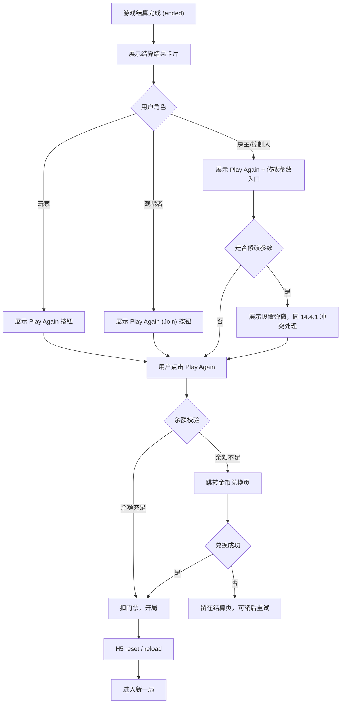

### 14.14 观战者完整规则

#### 14.14.1 观战者进入与权限

| 入口 | 条件 | 用户看到什么 |
|---|---|---|
| 游戏设置页"Watch"按钮 | 座位满 或 用户选择观战 | 全屏观战视角，可看到棋盘/牌桌，不可操作 |
| 游戏进行中"Watch"按钮 | 座位已满 或 用户不想参与 | 同上 |
| 被邀请观战 | 房主/玩家发送观战邀请 | 系统消息 + 观战入口 |

#### 14.14.2 观战者中途加入补位

观战者可以在游戏进行中加入空座位：

| 条件 | 处理 |
|---|---|
| 游戏状态 = waiting / ready | 观战者可直接上座，与普通 Join 流程一致 |
| 游戏状态 = playing | 原则上不允许中途补位（V1）；若游戏方支持中途加入（如 UNO 某些模式），则允许从观战转为玩家 |
| 游戏状态 = settling / ended | 不可补位 |

观战 → 玩家转换流程：

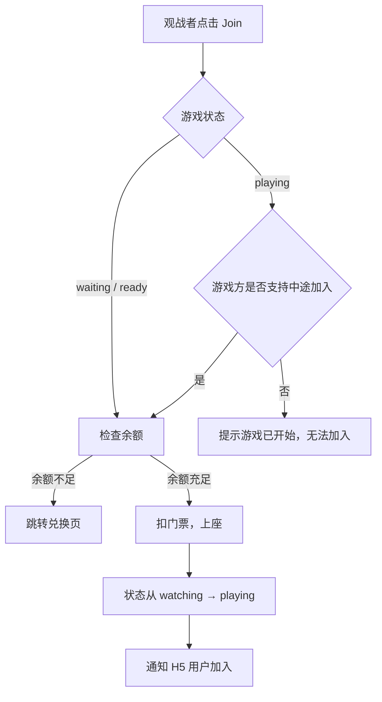

#### 14.14.3 观战者人数上限

| 限制 | 默认值 | 说明 |
|---|---|---|
| 单游戏观战者上限 | 50 人 | 防止大量观战者拖慢 H5 渲染和推送压力 |
| 超出上限 | 展示"观战人数已满，请稍后再试" | 有人退出观战后自动释放名额 |
| 观战者是否消耗房间人数 | 否 | 观战者不计入房间人数上限 |

> V1 观战者上限为 50 人；若后续发现推送压力可控，可放开至 200 人。

#### 14.14.4 观战者私密信息可见性

| 信息类型 | 观战者是否可见 | 理由 |
|---|---|---|
| 棋盘/牌桌公共状态 | ✅ 可见 | 如 Ludo 棋子位置、Carrom 棋盘、8 Ball 球桌 |
| 玩家手牌（UNO 等） | ❌ 不可见 | 公平性；观战者看到手牌可能通过语音/文字泄露 |
| 玩家游戏币余额 | ❌ 不可见 | 隐私 |
| 玩家操作提示（如"Your turn"） | ❌ 不可见 | 与观战者无关 |
| 聊天消息 | ✅ 可见 | 观战者可参与公屏聊天 |
| 送礼/打赏 | ✅ 可见并可操作 | 观战者也可送礼 |

> 手牌可见性由 game_config.support_watch_hand 控制，默认 false。若游戏方确认手牌可见不影响公平性（如已结束的牌局回放），可配置为 true。

#### 14.14.5 观战者最小化差异

| 维度 | 玩家最小化 | 观战者最小化 |
|---|---|---|
| 浮窗形态 | 展示"Your turn!"、游戏币余额 | 展示"Watching"、无余额 |
| 通知推送 | 轮到操作时推送 | 游戏结束/玩家退出时推送（无需轮到操作通知） |
| 超时策略 | 轮到操作超时按游戏规则处理 | 无超时；观战者可无限期最小化 |
| 浮窗关闭 | 关闭后仍保留游戏座位 | 关闭后退出观战状态，释放观战名额 |
| 恢复入口 | 浮窗 Open + Games 按钮 | 仅 Games 按钮（观战者浮窗关闭 = 退出观战） |

> 观战者关闭浮窗 = 退出观战，因为观战者不占游戏座位，没有"保留"的必要。

### 14.15 新用户进入游戏中的房间

新用户从不同路径进入一个已经有游戏进行的房间时，需要明确展示什么、能做什么：

#### 14.15.1 不同入口的进入体验

| 入口路径 | 进入后展示 | 游戏入口状态 |
|---|---|---|
| 房间列表 → 进入房间 | 语聊房主界面 + 游戏进行中浮窗/横幅 | 展示 Join（若有空位）/ Watch / Open |
| Discover 页 → 点击房间卡片 | 同上 | 同上 |
| 好友分享链接 → 进入房间 | 同上 | 同上 |
| 从其他房间跳转 | 同上 | 同上 |

#### 14.15.2 首次进入游戏的引导

新用户第一次进入有游戏的房间时，展示引导气泡：

| 引导项 | 文案 | 展示时机 | 消失条件 |
|---|---|---|---|
| 游戏入口引导 | "Games are here! Join or watch." | 首次进入有游戏的房间 | 3 秒后自动消失或用户点击 |
| Join 引导 | "Tap Join to play!" | 点击 Games 入口且有空位 | 用户上座后 |
| Watch 引导 | "Watch the game while chatting" | 座位满时 | 用户开始观战后 |

> 引导仅在用户首次遇到对应场景时展示一次，后续不再展示。通过 user_game_guide_state 记录已展示的引导项。

#### 14.15.3 游戏入口状态矩阵

新用户看到的 Games 入口按钮状态取决于当前游戏状态和用户身份：

| 游戏状态 | 用户身份 | 入口展示 |
|---|---|---|
| waiting / ready | 新用户 | Join（空位）/ Watch / 创建其他游戏 |
| playing | 新用户 | Watch / Join（空位 + 游戏支持中途加入） |
| settling | 新用户 | 入口灰态，提示"结算中，请稍后" |
| ended | 新用户 | Play Again / 选择其他游戏 |
| 无游戏 | 新用户 | 选择游戏（创建） |

### 14.16 游戏中消息与通知打断

#### 14.16.1 私信消息打断

用户在游戏中收到私信时的处理：

| 场景 | 冲突 | 处理 |
|---|---|---|
| 收到私信消息 | 游戏全屏态，无法查看私信 | 顶部展示私信横幅"XX sent you a message"，3 秒后自动消失；不阻断游戏操作 |
| 用户点击私信横幅 | 游戏需让位给私信界面 | 不自动跳转；仅标记未读，用户可在游戏结束后查看 |
| 收到好友请求 | 同私信 | 顶部展示"XX wants to be your friend"，3 秒后消失 |
| 收到系统消息 | 同私信 | 游戏内展示系统消息浮窗（如"游戏币兑换成功"），不阻断操作 |

> V1 游戏中不支持查看私信和好友请求，仅做通知提醒。V2 考虑最小化游戏后查看。

#### 14.16.2 公屏与游戏快捷聊天关系

语聊房公屏和游戏内聊天需要区分：

| 维度 | 房间公屏 | 游戏内快捷聊天 |
|---|---|---|
| 入口 | 房间底部输入框 | 游戏内快捷按钮（"Nice!" / "Hurry up" 等） |
| 可见范围 | 房间所有人 | 仅游戏内玩家 |
| 消息类型 | 自由文字 + 表情 + 礼物 | 预设快捷语 + 表情 |
| 展示位置 | 房间公屏区 | 游戏内气泡 |
| 是否互通 | 房间公屏消息在游戏最小化后可见 | 游戏快捷聊天不在房间公屏展示 |
| 游戏全屏时 | 游戏底部展示公屏缩略（最近 3 条） | 游戏内独立展示 |

快捷聊天预设（由 game_config.quick_chat 配置）：

| 游戏 | 预设快捷语 |
|---|---|
| Ludo | "Nice roll!" / "Hurry up!" / "Good game!" / "Lucky you!" |
| UNO | "UNO!" / "Hurry up!" / "Nice move!" / "Oops!" |
| Carrom | "Nice shot!" / "So close!" / "Good game!" / "Hurry up!" |
| 8 Ball | "Nice shot!" / "Foul!" / "Good game!" / "Hurry up!" |
| Snake & Ladder | "Lucky!" / "Oh no!" / "Good game!" / "Hurry up!" |
| Domino | "Nice play!" / "Hurry up!" / "Good game!" / "Close one!" |

#### 14.16.3 通知遮挡策略

游戏中各类通知的展示优先级和遮挡规则：

| 优先级 | 通知类型 | 展示方式 | 遮挡区域 | 持续时间 |
|---|---|---|---|---|
| 1（最高） | 来电 | 系统级，全屏 | 全屏 | 系统控制 |
| 2 | 系统弹窗（权限/更新） | 系统级，全屏 | 全屏 | 系统控制 |
| 3 | 游戏内关键通知（轮到操作/结算） | 游戏内横幅 | 游戏顶部 | 用户操作后消失 |
| 4 | 私信/好友请求 | 顶部横幅 | 游戏顶部状态栏 | 3 秒自动消失 |
| 5 | 系统消息（兑换成功等） | 顶部横幅 | 游戏顶部 | 2 秒自动消失 |
| 6 | 礼物动画 | 全屏动画覆盖 | 游戏中央区域 | 3 秒自动消失 |
| 7 | 快捷聊天气泡 | 游戏内气泡 | 不遮挡操作区 | 2 秒自动消失 |

> 同时出现多个通知时，只展示最高优先级的通知，低优先级通知排队等待。

### 14.17 游戏中房间与权限变更

#### 14.17.1 房主修改房间信息

房主在游戏中修改房间信息（房间名、背景、标签等）不影响游戏：

| 修改项 | 是否影响游戏 | 处理 |
|---|---|---|
| 房间名 | 否 | 游戏内不展示房间名，修改后仅房间层面生效 |
| 房间背景 | 否 | 游戏全屏态不展示房间背景 |
| 房间标签/分类 | 否 | — |
| 麦位数量/布局 | 否 | 游戏内仅展示麦位缩略条，布局由房间控制 |
| 上麦权限 | 否 | 但新上麦用户可能看到游戏入口 |
| 锁房 | 否 | 游戏已在进行中，锁房仅影响新用户进入 |

#### 14.17.2 管理员权限变更

| 场景 | 冲突 | 处理 |
|---|---|---|
| 房主在游戏中授予某用户管理员 | 该用户是否获得游戏控制权 | 否；game_controller 不随管理员权限自动转移，需房主手动移交或房主退出后按接管规则处理 |
| 房主在游戏中撤销某管理员的权限 | 该管理员是否有 game_controller | 若该管理员有 game_controller，则收回控制权，按 14.2 房主退出逻辑处理控制权转移 |
| 管理员在游戏中被撤销权限后退出 | — | 按普通玩家退出处理 |

#### 14.17.3 黑名单对游戏中用户的影响

| 场景 | 冲突 | 处理 |
|---|---|---|
| 房主将游戏中某玩家加入黑名单 | 该玩家正在游戏座位上 | 1）踢出房间（含游戏）；2）释放游戏座位；3）门票退还（若本局未结束则退全额）；4）公屏消息"XX has been removed" |
| 房主将游戏中某观战者加入黑名单 | 该观战者在观看 | 1）踢出房间；2）退出观战；3）释放观战名额 |
| 黑名单用户尝试进入有游戏的房间 | — | 不可进入房间，与房间现有逻辑一致 |
| 用户在游戏中将另一用户加入黑名单 | — | 不影响游戏；加入黑名单后在公屏屏蔽对方消息，游戏内快捷聊天仍可见 |

### 14.18 游戏中送礼与动画覆盖

#### 14.18.1 送礼入口保留

游戏中送礼入口始终可见：

| 位置 | 说明 |
|---|---|
| 游戏全屏态底部工具栏 | 送礼按钮 + 麦位缩略条 |
| 游戏设置页 | 不展示送礼入口（设置页为半屏弹窗，上方可见房间背景） |
| 游戏浮窗态 | 房间主界面送礼入口正常可用 |

#### 14.18.2 送礼动画与游戏操作区冲突

送礼全屏动画（大礼物特效）可能遮挡游戏操作区域：

| 冲突 | 处理 |
|---|---|
| 大礼物动画遮挡操作区 | 动画展示期间（约 3 秒），游戏操作不暂停；动画层点击穿透到游戏层 |
| 动画期间轮到操作 | 操作倒计时正常计时；动画 3 秒后消失，用户可操作 |
| 动画期间用户正在操作 | 动画层支持点击穿透，不影响当前操作 |
| 多个连续大礼物动画 | 最多排队展示 3 个；超过的转为小礼物通知（不遮挡） |

#### 14.18.3 动画展示降级

| 场景 | 降级方案 |
|---|---|
| 低端机（检测到帧率 < 24fps） | 大礼物动画降级为小礼物通知（不遮挡游戏） |
| 游戏全屏态 | 只展示小礼物通知，不展示全屏动画（V1）；V2 可考虑半屏动画 |
| 观战者视角 | 同玩家视角，动画规则一致 |

> V1 简化策略：游戏全屏态下，所有大礼物动画降级为小礼物通知（文字 + 小图标），不遮挡游戏操作区。V2 根据数据决定是否放开全屏动画。

### 14.19 游戏局历史与数据查询

#### 14.19.1 用户侧局历史查看

| 入口 | 展示内容 | 说明 |
|---|---|---|
| 个人主页 → 游戏记录 | 游戏名、时间、结果（胜/负）、金币变化 | 近 30 天记录 |
| 房间内 → Games 入口 → 历史记录 | 该房间的游戏记录 | 近 7 天记录 |
| 结算页 → 查看详情 | 本局完整结算信息 | 单局详情 |

局历史列表项：

```text
🎲 Ludo · 2nd place
   +500 Game coins
   2026-05-19 14:30 · 15 min
```

#### 14.19.2 结果争议申诉

| 场景 | 申诉入口 | 申诉流程 |
|---|---|---|
| 用户认为结算金额错误 | 结算页 → "Report Issue" 按钮 | 1）用户选择争议类型（金额错误/结果错误/其他）；2）填写描述；3）提交后台审核 |
| 用户认为对手作弊 | 结算页 → "Report Player" 按钮 | 1）选择举报对象；2）选择原因；3）提交后台审核 |
| 游戏中异常退出导致损失 | 结算页 → "Report Issue" | 同上 |

申诉处理时效：

| 争议类型 | 后台处理时效 | 临时处理 |
|---|---|---|
| 金额错误 | 24 小时内 | 无临时处理 |
| 作弊举报 | 48 小时内 | 若初步判定高风险，立即冻结对方游戏权限 |
| 异常退出 | 24 小时内 | 若系统判定为非用户原因，自动退款 |

> V1 申诉入口为简化版，仅支持选择类型 + 描述。V2 考虑截图/录屏上传。

### 14.20 作弊与风控

#### 14.20.1 固定组合异常胜率检测

| 检测维度 | 检测逻辑 | 阈值（默认） | 处罚 |
|---|---|---|---|
| 同组玩家高频组队 | 同 2-4 人组合在 N 局中频繁出现 | 同组 > 20 局/天 | 标记观察，后台人工审核 |
| 固定组合异常胜率 | 同组中某玩家胜率显著偏高 | 某玩家胜率 > 80%（样本 > 20 局） | 自动降级为限制级，本局结算暂缓 |
| 串通输牌 | 某玩家在组队时故意输牌（出牌异常/超时弃牌） | 由 Bytesun 侧行为分析判定 | 标记观察 |
| 多账号自玩 | 同设备/IP 多账号在同桌 | 同设备 2+ 账号在同一局 | 自动踢出后加入的账号，退还门票 |

#### 14.20.2 游戏中风控处罚流程

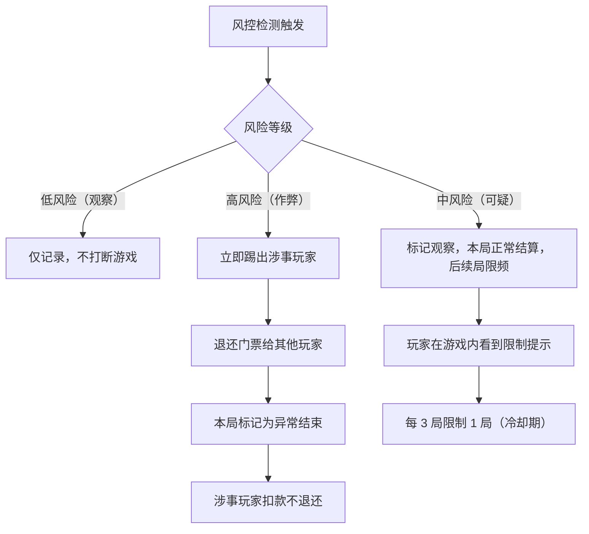

风控处罚等级：

| 等级 | 触发条件 | 处罚 | 解除条件 |
|---|---|---|---|
| 观察 | 首次触发低风险规则 | 无影响，仅后台记录 | 无需解除 |
| 限制 | 累计 2 次观察 或 1 次中风险 | 游戏频率限流（每 3 局冷却 1 局） | 7 天无新触发自动解除 |
| 冻结 | 累计 3 次限制 或 1 次高风险 | 禁止参与游戏 7 天 | 7 天后自动解冻，或人工审核提前解冻 |
| 封禁 | 累计 2 次冻结 | 永久禁止参与游戏 | 仅人工审核可解封 |

### 14.21 兼容性与性能规则

#### 14.21.1 弱网操作策略

| 场景 | 用户操作 | 服务端处理 | 客户端展示 |
|---|---|---|---|
| 操作请求超时（> 5 秒） | 用户已提交操作 | 等待服务端响应，不重复提交 | 展示 loading 态，3 秒后提示"网络不稳定" |
| 操作请求失败（网络错误） | 操作未送达 | 不扣费、不生效 | 提示"操作失败，请重试"，不自动重试 |
| 操作成功但响应丢失 | 操作已生效 | 服务端已记录 | 恢复后拉取最新状态，发现操作已生效 |
| 连续快速操作 | 用户快速点击 | 幂等处理，以最后一次为准 | 客户端 300ms 防抖，避免重复提交 |

#### 14.21.2 WKWebView vs WebView 差异

| 功能 | iOS WKWebView | Android WebView |
|---|---|---|
| JS Bridge 注入 | WKUserScript / WKScriptMessageHandler | addJavascriptInterface |
| Cookie 管理 | WKHTTPCookieStore（iOS 11+） | CookieManager |
| 本地存储 | 默认不共享 NSHTTPCookieStorage | 默认共享 CookieManager |
| 后台执行 | JS 定时器被挂起，requestAnimationFrame 暂停 | 部分机型允许后台执行 |
| 内存管理 | 独立进程，崩溃不传染主 App | 同进程，崩溃可能导致 App 崩溃 |
| 音频播放 | 需用户手势触发，后台播放需配置 | 部分机型允许自动播放 |
| H5 缓存 | 默认缓存策略，需手动清理 | 同左 |
| 截图 | 需配置 WKSnapshotConfiguration | 默认支持 |

统一封装层要求：

- 我方客户端提供统一的 JS Bridge 接口，屏蔽 iOS/Android 差异
- 所有 JS Bridge 调用需设置超时（默认 10 秒），超时后按失败处理
- JS Bridge 调用结果需统一回调格式：`{ code: 0, data: {}, message: "" }`

#### 14.21.3 折叠屏与大屏适配

| 场景 | 冲突 | 处理 |
|---|---|---|
| 折叠屏展开 | 游戏画面需重新布局 | H5 监听 resize 事件，自动适配新尺寸 |
| 折叠屏折叠 | 游戏画面压缩 | 同上，但不触发游戏暂停 |
| 平板/大屏 | 游戏画面过大 | H5 设置 max-width，两侧留白或展示房间信息 |
| 多窗口模式（Samsung/小米） | 游戏只占半屏 | 游戏缩小展示，操作区正常可用 |
| 画中画模式 | 系统支持 PiP | V1 不主动支持；若系统强制触发，等同最小化处理 |

#### 14.21.4 H5 缓存更新与强制刷新

| 场景 | 处理 |
|---|---|
| 游戏更新后用户仍加载旧版本 H5 | H5 入口 URL 添加版本号参数（`?v={game_config_version}`），版本变更时自动加载新版本 |
| H5 静态资源缓存 | CDN 缓存 + 文件名 hash，确保版本更新后不加载旧资源 |
| H5 接口缓存 | 接口返回 Cache-Control 头，客户端不额外缓存 |
| 强制刷新 | 用户可从游戏设置页"清除缓存并重新加载"；刷新后 WebView 销毁重建 |
| 缓存清理时机 | 1）游戏版本更新；2）用户手动清除；3）H5 白屏时自动触发 |

## 15. 多语言与文案

### 15.1 英文

| 中文 | 英文 |
|---|---|
| 游戏 | Games |
| 活动 | Activity |
| 更多游戏 | More Games |
| 休闲游戏 | Casual Games |
| 开始游戏 | Start Game |
| 加入游戏 | Join Game |
| 观战 | Watch |
| 游戏中 | Playing |
| 结算中 | Settling |
| 游戏币 | Game coins |
| 兑换游戏币 | Exchange game coins |
| 游戏币不足 | Not enough game coins |
| 立即兑换 | Exchange now |
| 游戏币仅供游戏内使用，不得提现及兑换金币 | Game coins can only be used in games and cannot be withdrawn or exchanged back to gold coins |
| 当前房间已有游戏进行中 | A game is already running in this room |
| 游戏加载失败 | Game failed to load |
| 只有房主可以开启游戏 | Only the host can start a game |
| 最小化 | Minimize |
| 恢复游戏 | Resume Game |
| 游戏进行中 | Game in Progress |
| 轮到你了 | Your Turn! |
| 已自动替你操作 | Auto-played for you |
| 再来一局 | Play Again |
| 再来一局（加入） | Play Again (Join) |
| 观战中 | Watching |
| 邀请你加入 | invites you to join |
| 邀请你观战 | invites you to watch |
| 关闭游戏 | Close Game |
| 门票需补缴 | Ticket adjusted, please pay the difference |
| 今日游戏次数已达上限 | Daily game limit reached, come back tomorrow |
| 观战人数已满 | Spectator limit reached, please try later |
| 举报问题 | Report Issue |
| 举报玩家 | Report Player |
| 网络不稳定 | Network unstable |
| 操作失败，请重试 | Action failed, please retry |
| 清除缓存并重新加载 | Clear cache and reload |
| 门票已退还 | Ticket refunded |

### 15.2 阿语

| 中文 | 阿语 |
|---|---|
| 游戏 | الألعاب |
| 活动 | النشاطات |
| 更多游戏 | المزيد من الألعاب |
| 休闲游戏 | ألعاب خفيفة |
| 开始游戏 | ابدأ اللعبة |
| 加入游戏 | انضم إلى اللعبة |
| 观战 | مشاهدة |
| 游戏中 | قيد اللعب |
| 结算中 | جاري احتساب النتيجة |
| 游戏币 | عملات اللعب |
| 兑换游戏币 | استبدال عملات اللعب |
| 游戏币不足 | عملات اللعب غير كافية |
| 立即兑换 | استبدل الآن |
| 游戏加载失败 | فشل تحميل اللعبة |
| 只有房主可以开启游戏 | يمكن لمالك الغرفة فقط بدء اللعبة |
| 最小化 | تصغير |
| 恢复游戏 | استئناف اللعبة |
| 游戏进行中 | اللعبة جارية |
| 轮到你了 | دورك! |
| 已自动替你操作 | تم اللعب تلقائيًا نيابةً عنك |
| 再来一局 | العب مرة أخرى |
| 再来一局（加入） | العب مرة أخرى (انضم) |
| 观战中 | مشاهدة |
| 邀请你加入 | يدعوك للانضمام |
| 邀请你观战 | يدعوك للمشاهدة |
| 关闭游戏 | إغلاق اللعبة |
| 门票需补缴 | تم تعديل الرسمة، يرجى دفع الفرق |
| 今日游戏次数已达上限 | تم بلوغ الحد اليومي للألعاب، عُد غدًا |
| 观战人数已满 | تم بلوغ الحد الأقصى للمشاهدين، حاول لاحقًا |
| 举报问题 | الإبلاغ عن مشكلة |
| 举报玩家 | الإبلاغ عن لاعب |
| 网络不稳定 | الشبكة غير مستقرة |
| 操作失败，请重试 | فشل الإجراء، يرجى إعادة المحاولة |
| 清除缓存并重新加载 | مسح ذاكرة التخزين المؤقت وإعادة التحميل |
| 门票已退还 | تم استرداد الرسمة |

## 16. 开发周期与上线策略

### 16.1 V0 技术预研

周期：1-2 周。

| 任务 | 交付 |
|---|---|
| Bytesun 测试环境联调 | 接口连通性报告 |
| H5 / Zip 加载验证 | Android / iOS 加载方案 |
| JSBridge 验证 | getConfig、gameLoaded、gameRecharge、sendGameAction |
| 钱包接口预研 | change_balance 幂等、并发锁、金币兑换游戏币事务方案 |
| 游戏资源确认 | game_id、版本、人数、观战、门票能力清单 |

验收：

- Ludo / UNO 至少一个游戏在语聊房模式可加载。
- `getConfig`、`gameLoaded`、`change_balance`、金币兑换游戏币跑通。
- 明确 Zip / URL 直连策略和 CDN 方案。

### 16.2 V1 MVP 开发排期

周期：4-5 周。

| 周期 | 客户端 | 服务端 | 后台 / 数据 | 验收重点 |
|---|---|---|---|---|
| 第 1 周 | Discover Games / Activity、房内入口、半屏面板 | RoomGameSession 创建 / 查询 / 关闭 | 游戏接入配置、入口配置 | 能在房内选择游戏 |
| 第 2 周 | H5 容器、Loading、getConfig、gameLoaded | code、ss_token、用户信息接口 | 游戏配置列表、游戏同步 | 能加载 Ludo / UNO |
| 第 3 周 | 设置页、上座/下座、观战、声音控制 | 座位状态、type=13/14/15/16/18 | 房间游戏监控、操作日志 | 能进入 waiting / playing |
| 第 4 周 | 结算页、再来一局、游戏币不足、金币兑换游戏币、最小化、异常提示 | change_balance、兑换接口、结算记录、补偿队列 | 结算管理、游戏币兑换管理、基础看板 | 能完整完成一局并结算 |
| 第 4.5 周 | 浮窗交互、观战规则、通知打断、送礼降级、新用户引导 | 观战者状态管理、局历史、风控检测 | 观战者监控、作弊风控看板 | 浮窗/观战/打断场景可用 |
| 第 5 周 | 兼容、性能、灰度、埋点补齐、参数修改冲突、邀请、房间权限变更 | 对账、风控、监控告警、申诉处理 | 数据验收、运营配置 | 达到上线标准 |

### 16.3 灰度策略

| 阶段 | 范围 | 目标 |
|---|---|---|
| 阶段 1 | 内部测试房间 + 白名单账号 | 验证加载、桥接、结算 |
| 阶段 2 | MENA 小流量普通语聊房 | 验证入口点击、开局转化、稳定性 |
| 阶段 3 | 扩大到重点国家 | 验证留存、充值、房间活跃 |
| 阶段 4 | 全量开放 | 按后台开关和风控持续运营 |

## 17. 验收标准

### 17.1 产品验收

- 用户可以从 Discover Games 看到推荐游戏和正在玩游戏的语聊房。
- 用户可以从房间内 Games 入口打开半屏游戏面板。
- 房主可以选择游戏并打开设置页。
- 房主可以开始 Ludo / UNO，其他首批游戏可按灰度配置进入。
- 普通用户可以加入、观战、最小化和返回房间。
- 游戏开始和结束状态能同步到 App。
- 用户可以完成一局并看到结算结果。
- 游戏币不足时可以打开 Game coins 兑换页，金币兑换成功后刷新游戏币余额。
- 最小化后可通过房间浮窗恢复游戏。
- 加载失败、上座失败、维护、封禁、地区限制均有明确提示。
- **v1.3 新增验收：**
  - 最小化后浮窗展示角色差异（玩家显示"Your Turn!"、观战者显示"Watching"）
  - 来电/切 App 返回后游戏状态正确恢复
  - 系统通知覆盖不影响游戏逻辑
  - 观战者不可见玩家手牌，可观战棋盘
  - 观战者人数超 50 人后提示"人数已满"
  - 观战者关闭浮窗 = 退出观战，释放名额
  - 再来一局座位自动继承，观战者需主动 Join
  - 房主修改人数/门票时正确校验冲突（减少人数不低于已上座人数）
  - 房主关闭游戏后门票自动退还
  - 邀请消息在公屏可见，被邀请人在其他游戏时提示
  - 新用户进入有游戏的房间展示引导气泡（仅首次）
  - 送礼动画在游戏全屏态下降级为小礼物通知
  - 公屏消息与游戏快捷聊天互不干扰
  - 私信/好友请求仅展示 3 秒横幅，不阻断游戏
  - 黑名单用户被踢出游戏，门票退还
  - 管理员权限变更不影响游戏控制权自动转移
  - 网络切换（Wi-Fi↔4G）后游戏自动重连
  - 弱网操作展示 loading 态，3 秒后提示
  - 单日局数达上限后游戏入口置灰
  - 用户可查看近 30 天游戏记录
  - 结算页可举报问题/举报玩家

### 17.2 技术验收

- iOS / Android WebView 能稳定加载 H5 / Zip。
- `getConfig` 返回字段满足 Bytesun 要求。
- `gameLoaded`、`sendGameAction`、`gameActionUpdate` 跑通。
- `change_balance` 支持幂等、并发锁和游戏币不足错误。
- 金币兑换游戏币接口支持同事务扣金币和加游戏币。
- 游戏开始和结算上报可落库。
- 安全区参数不会遮挡主要游戏操作区。
- 游戏包版本可后台控制。

### 17.3 后台验收

- 游戏上下架、维护、灰度可配置。
- 地区、端、审核账号策略可配置。
- 房间游戏监控可查看当前局状态。
- 结算订单可查询、补偿和导出。
- 游戏币兑换订单可查询、补偿和导出。
- 活动 Banner 可配置跳转。
- 三方接口配置可审计，不泄露 appKey。

### 17.4 数据验收

- 入口曝光、点击、加载、开局、加入、上座、结束、结算、异常均有埋点。
- 游戏记录可按房间、游戏、用户、时间查询。
- 结算记录可按订单、用户、游戏局查询。
- 看板可查看启动成功率、加载耗时、开局转化、完成率、结算失败率、上座失败率、游戏币不足转化率。

## 18. 风险与缓解

| 风险 | 影响 | 缓解 |
|---|---|---|
| Bytesun 服务不稳定 | 游戏无法加载或结算失败 | URL / Zip 双方案、重试、下架开关、监控告警 |
| 游戏包加载慢 | 进入转化下降 | CDN 预热、本地包、Loading 进度、首屏优化 |
| 结算并发 | 错账 | 用户级锁、订单幂等、补偿队列、对账 |
| 金币兑换游戏币错账 | 金币扣减或游戏币增加不一致 | 同事务、兑换订单幂等、兑换对账、补偿队列 |
| 语音和游戏声音冲突 | 体验差 | 语音优先，默认降低 BGM，用户可控制 |
| 低端机性能 | 卡顿 / 崩溃 | 机型监控、降级策略，必要时屏蔽高负载游戏 |
| 游戏操作区被遮挡 | 无法操作 | game_margin_top / bottom、安全区验收 |
| 玩法合规 | 审核风险 | 审核账号隐藏、免费局策略、Slots 单独评审 |
| 作弊串通 | 破坏经济系统 | 同设备/IP 风控、异常胜率、固定组合检测 |

## 19. 待 Bytesun 确认问题

| 问题 | 优先级 | 阶段 |
|---|---|---|
| Ludo、UNO、Domino、8 Ball、Carrom、Snake & Ladder 的准确 `game_id` 和 Bytesun 游戏名 | P0 | V0 |
| `/v1/api/gamelist` 的 `game_list_type` 真实取值 | P0 | V0 |
| 每个游戏最小人数、最大人数、是否允许中途加入、是否允许观战 | P0 | V0 |
| `type=30` 中 `ticketSlots` 的含义、取值和金额映射 | P0 | V0 |
| `hideLobby=true` 的快速开始 API 路径、参数、鉴权、返回值 | P0 | V1 |
| game_id 以 3 开头的游戏是否都必须配置安全区参数 | P0 | V1 |
| 错误码由 H5 透传还是服务端回调处理 | P1 | V1 |
| 余额不足错误码 1008 是否明确指“游戏币不足”，是否需区分金币不足 | P1 | V1 |
| 金币兑换游戏币比例是否固定为 100:1000，还是支持运营后台按地区配置 | P1 | V1 |
| Zip 包 CDN 缓存策略和版本更新机制 | P1 | V1 |
| 各游戏是否支持机器人补位 | P2 | V2 |

## 20. 评审决策项

| 决策项 | 建议结论 |
|---|---|
| V1 路径 | 采用“语聊房内直接调起游戏”，不新增游戏房类型 |
| 首批游戏 | 6 款进入产品范围，Ludo / UNO 优先强验收，其余按灰度节奏上线 |
| 普通语聊房开启游戏 | 默认支持，按地区/端/房主等级可后台限制 |
| 门票系统 | V1 启用，单位为游戏币，默认 0，范围后台配置 |
| 游戏币体系 | 游戏内统一使用游戏币；游戏币由金币兑换，不支持提现和兑换回金币 |
| 游戏中礼物和红包 | 保留入口，具体开关后台控制 |
| 管理员是否可开局 | 默认关闭，由后台配置 |
| Slots / Jackpot 是否展示 | 不作为首批强推荐，需单独合规评审 |

## 21. 最终推荐

本期采用“现有语聊房内直接调起三方休闲游戏”的方案。

这样可以在不改造房间模型、推荐流、麦位和基础权限的情况下，最快验证游戏对房间停留、活跃和付费转化的提升。V1 重点跑通房间内入口、设置页、H5 容器、座位同步、游戏币结算、金币兑换游戏币、最小化恢复和后台监控。待核心数据稳定后，再考虑 Game Rooms 聚合、随机匹配、游戏房类型、任务和锦标赛等扩展能力。

**一句话总结：第一版先把三方休闲游戏做成语聊房里的“可开局插件”，让用户在原房间关系链中一起玩；等数据验证后，再升级成完整游戏房生态。**
