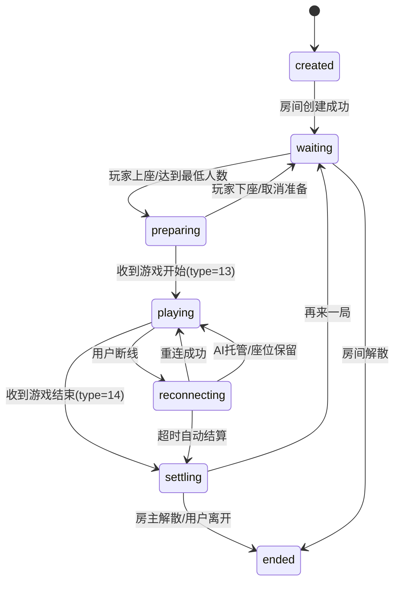
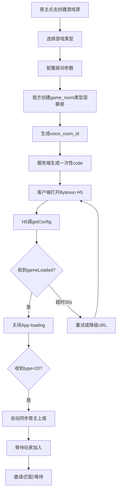
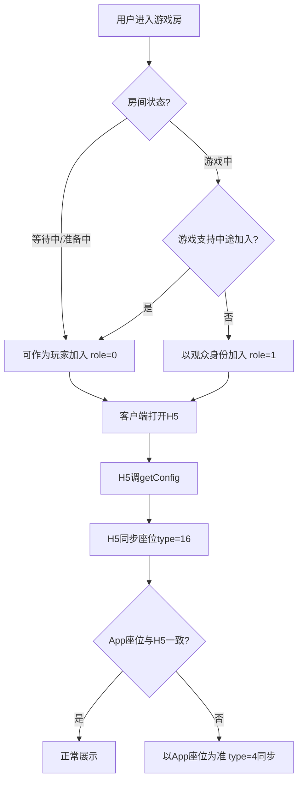
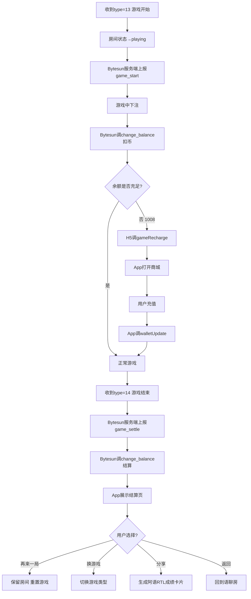
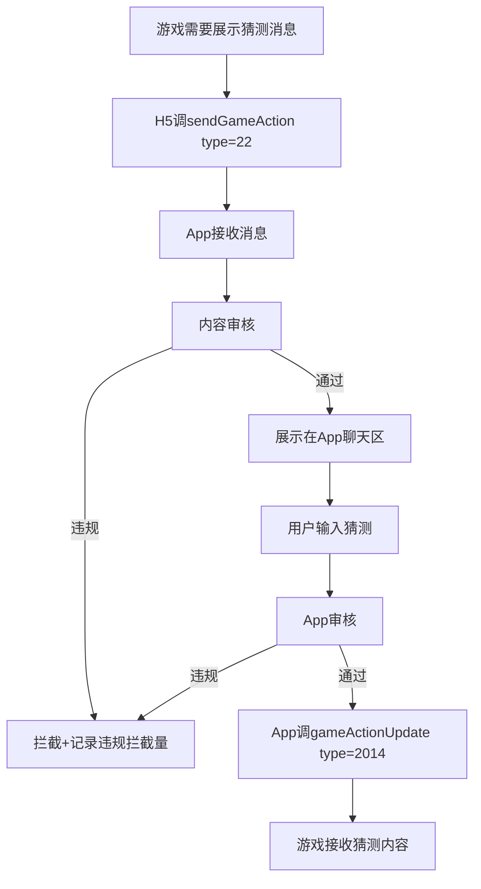
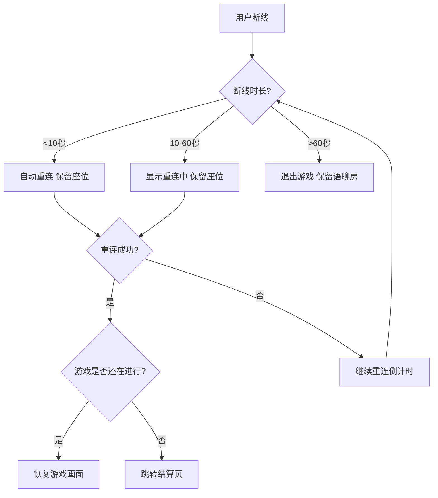
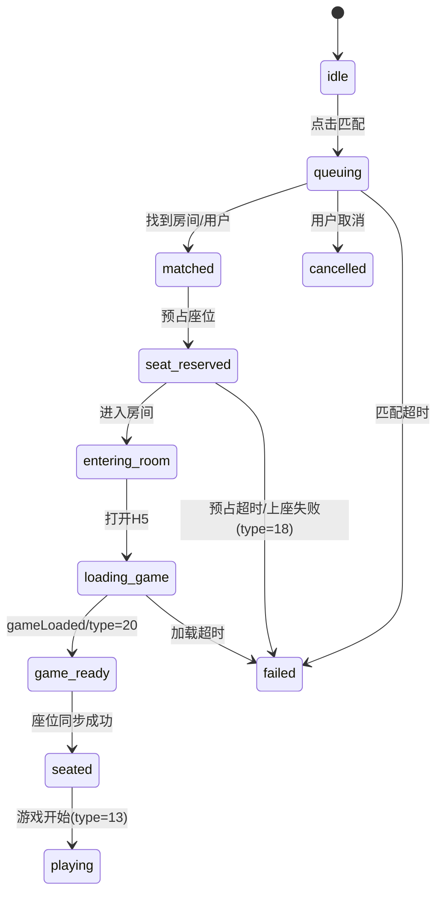

wechill 游戏房产品设计文档（PRD）

> **产品**: wechill  
> **文档类型**: PRD（评审版）  
> **版本**: v3.0  
> **日期**: 2026-04-22  
> **面向**: MENA（中东）语聊房  
> **三方SDK**: BytesunGame（语聊房模式）v1.0.7  
> **状态**: 待评审  

---

## 1. 产品定位与目标

### 1.1 核心定位

游戏房是语聊房的一个新房间类别，不是独立游戏大厅。

> 游戏房 = 语音社交 + 轻量游戏组局。游戏负责破冰，语音负责留存，房间负责关系沉淀。

产品原则：

- 游戏是社交话题，不是唯一目的。
- 复用语聊房里的麦位、聊天、礼物、钱包、房间推荐、风控和运营体系。
- 三方Bytesun承接局内规则、游戏状态、结算结果；我方承接房间、用户、匹配、钱包、内容和数据。
- V1先保证"能进房、能开局、能结算、能再来一局"；V2再把随机匹配做成平台能力。

### 1.2 目标用户画像

| 用户画像 | 特征 | 核心诉求 | 产品机会 |
|---------|------|---------|---------|
| 社交型玩家 | 聊天为主，游戏只是话题 | 认识人、找话题、避免冷场 | 低门槛游戏、语音互动、礼物互动 |
| 休闲玩家 | 想玩游戏但不想下载重App | 即开即玩、规则简单、等待短 | Ludo/UNO/Domino/你画我猜 |
| 组局用户 | 喜欢拉朋友一起玩 | 快速建房、邀请好友、分享传播 | WhatsApp分享、深链直达、好友在线推送 |
| 观战用户 | 不一定参与游戏 | 看局、聊天、送礼、等空位 | 观战位、弹幕、观战转玩家 |
| 竞技用户 | 更看重赢和排名 | 连胜、排行榜、段位、奖励 | 后续锦标赛、榜单、段位，不进MVP主线 |

### 1.3 业务目标

**V1目标**：
- 建立游戏房新类别
- 跑通Bytesun接入
- 支持Ludo/UNO等优先游戏创建、加入、观战、开局、结算
- 验证语聊房+游戏的基础留存价值

**V2目标**：
- 上线随机匹配，提高从"想玩"到"开局"的转化
- 增加游戏房运营和商业化模块
- 与红包返奖、龙蛋、CP/Soul Pair做可控融合

### 1.4 非目标

当前不做：
- 真钱下注
- 高竞技重游戏（MOBA/FPS）
- 单局超过60分钟的重度玩法
- 需要用户额外下载安装的游戏
- 未经确认的机器人补位强依赖
- 未经确认的Bytesun快速开始API强依赖

---

## 2. 产品范围

### 2.1 P0范围

- 新增游戏房房间类别
- 游戏房创建、加入、离开、观战
- Bytesun H5/Zip游戏加载
- `getConfig`、`gameLoaded`、`gameRecharge`、`walletUpdate`、`sendGameAction`、`gameActionUpdate`基础协议
- 服务端`get_sstoken`、`get_user_info`、`change_balance`、游戏状态上报接收
- 游戏开始/结束/结算页
- 座位同步和上座失败处理
- Ludo/UNO至少两个游戏完成联调
- 游戏配置后台和基础数据看板

### 2.2 P1范围

- Domino接入，前提是Bytesun提供游戏ID和资源
- 你画我猜聊天同步
- 游戏房邀请、分享、深链拉起
- 随机匹配
- 游戏记录、结算记录、对账
- 游戏房风控和投诉处理

### 2.3 P2范围

- 狼人杀、谁是卧底等游戏内RTC玩法
- CP亲密值、龙蛋贡献、游戏房返奖
- VIP优先匹配
- 锦标赛、排位、段位、皮肤
- AI/机器人补位，需Bytesun明确支持

---

## 3. 房间类型与状态

### 3.1 房间分类

| 房间类型 | 核心功能 | 游戏支持 | 典型场景 | V1是否支持 |
|---------|---------|---------|---------|----------|
| 纯语聊房 | 原有语音聊天 | 无 | 普通语聊 | 已有能力 |
| 游戏房 | 游戏驱动+语音互动 | 固定一个游戏 | Ludo房、UNO房 | ✅支持 |
| 混合房 | 语聊为主，随时开小游戏 | 可挂起游戏 | 聊着聊着开一局 | ✅基础支持 |
| 专用房 | 单一游戏深度运营 | 固定游戏竞技 | 锦标赛、排位赛 | 后续版本 |

### 3.2 游戏房状态机



状态定义：

| 状态 | 说明 | 用户可操作 |
|------|------|---------|
| `created` | 我方房间已创建，游戏资源未加载 | 取消创建、重试加载 |
| `waiting` | 等待玩家加入或上座 | 邀请、匹配、上座、观战 |
| `preparing` | 座位已有人，等待准备或开始 | 准备、取消准备、踢人、调整门票 |
| `playing` | 游戏进行中 | 观战、聊天、送礼；玩家按游戏规则操作 |
| `reconnecting` | 用户断线重连中 | 保留座位、倒计时 |
| `settling` | 游戏结束，结算中 | 等待结果 |
| `ended` | 房间或当前游戏会话结束 | 返回、分享、重新开房 |

### 3.3 游戏房关键字段

| 字段 | 说明 |
|------|------|
| `room_type` | 固定为`game_room` |
| `voice_room_id` | 我方房间ID，也是传给Bytesun的`roomId` |
| `game_id` | Bytesun游戏ID |
| `game_name` | 游戏名 |
| `game_category` | 桌游、卡牌、画猜、推理等 |
| `game_version` | 当前加载的Bytesun游戏版本 |
| `game_url` | download_url或本地解压路径 |
| `game_mode` | 语聊房模式固定`3` |
| `game_orientation` | 竖屏/横屏 |
| `safe_height` | Bytesun返回的安全高度 |
| `min_players` | 最低开局人数 |
| `max_players` | 当前游戏最大人数，可由Bytesun type=30同步 |
| `ticket_slot` | 当前门票档位，可由Bytesun type=30同步 |
| `room_privacy` | 公开、好友可见、私密 |
| `match_enabled` | 是否允许随机匹配进入 |
| `spectator_enabled` | 是否允许观战 |
| `voice_mode` | 房内语音、游戏内RTC、静音观战 |
| `settlement_mode` | 金币结算、免费娱乐、门票模式 |
| `room_kind` | game_room/mixed_room/dedicated_room |
| `status` | created/waiting/preparing/playing/reconnecting/settling/ended |

### 3.4 MENA默认配置

| 配置项 | 默认值 | 说明 |
|-------|-------|------|
| 统计时区 | GMT+3 | 与龙蛋玩法保持一致 |
| 默认语言 | 阿拉伯语`7` | Bytesun language参数 |
| 默认节点 | gsp=201 | 迪拜AWS，MENA优先 |
| 备用节点 | gsp=101 | 新加坡 |
| 视觉方向 | 星月、绿洲、灯笼、Majlis | 与CP/Soul Pair本地化一致 |
| 保守分区 | 关闭公开CP关系动画 | CP展示仅保留私密页或弱展示 |

---

## 4. 游戏接入规划

### 4.1 游戏梯队

**第一梯队，V1优先：**

| 游戏 | 人数 | 时长 | 适配理由 | 备注 |
|------|------|------|---------|------|
| Ludo/飞行棋 | 2-4人 | 10-20分钟 | 中东强认知，适合语聊破冰 | ludoPlus支持hideLobby，game_id待确认 |
| UNO | 2-4/2-6人 | 5-15分钟 | 规则简单，开局快 | unoPlus支持hideLobby，最大人数以实际返回为准 |
| Domino | 2-4人 | 5-15分钟 | 中东传统桌游 | 需确认Bytesun资源和game_id |

**第二梯队，V1.1/V2候选：**

| 游戏 | 人数 | 时长 | 特殊要求 |
|------|------|------|---------|
| 你画我猜 | 3-12人 | 15-30分钟 | type=22/2014聊天双向同步+内容审核 |
| 谁是卧底 | 4-10人 | 15-30分钟 | 可能需要isGameRTC=true和麦克风同步 |
| 狼人杀 | 6-12人 | 20-40分钟 | RTC、主持、断线重连和观战规则复杂 |

**第三梯队，暂不进入近期评审范围：**
- 麻将/扑克：涉赌和地域合规风险更高
- Slots/抽奖类：商业化敏感，需单独合规评估

### 4.2 游戏参数模板

```yaml
GameTemplate:
  ludo:
    display_name: "Ludo"
    local_name_ar: "لعبة الطيران"
    bytesun_name: "ludoPlus"
    game_id: "待Bytesun确认"
    players:
      min: 2
      max: 4
      optimal: 4
    duration: "10-20分钟"
    spectator: true
    match_enabled: true
    hide_lobby_supported: true
    ai_backup: "待Bytesun确认"
    ticket_slots: "待Bytesun确认"

  uno:
    display_name: "UNO"
    local_name_ar: "أونو"
    bytesun_name: "unoPlus"
    game_id: "待Bytesun确认"
    players:
      min: 2
      max: "以Bytesun返回peopleNum为准"
      optimal: 4
    duration: "5-15分钟"
    spectator: true
    match_enabled: true
    hide_lobby_supported: true
    ai_backup: "待Bytesun确认"

  domino:
    display_name: "Domino"
    local_name_ar: "دومينو"
    bytesun_name: "DominoPlus"
    game_id: "待Bytesun确认"
    players:
      min: 2
      max: 4
      optimal: 4
    duration: "5-15分钟"
    spectator: true
    match_enabled: true
    hide_lobby_supported: true
    ai_backup: "待Bytesun确认"

  draw_guess:
    display_name: "你画我猜"
    local_name_ar: "ارسم وخمن"
    bytesun_name: "待Bytesun确认"
    game_id: "待Bytesun确认"
    players:
      min: 3
      max: 12
      optimal: 6
    duration: "15-30分钟"
    spectator: true
    chat_sync_required: true
    content_moderation_required: true
```

### 4.3 用户角色

| 角色 | Bytesun role | 权限 |
|------|-------------|------|
| 房主/主持人 | `2` | 可参与、可观战、可开启游戏、可踢人、可调整房间配置 |
| 游戏玩家 | `0` | 可上座、准备、参与游戏、发言、送礼 |
| 观众/游客 | `1` | 可观战、聊天、送礼，默认不可上座 |
| 管理员/运营 | 后台角色 | 可封禁、关房、处理投诉、调整游戏上下架和配置 |

---

## 5. Bytesun对接关键约束

### 5.1 接入方式

- 商户侧调用Bytesun游戏信息列表接口，拿到游戏Zip包下载地址或URL地址、游戏版本号
- 客户端按版本号处理游戏包更新，Zip包可下载并存储到App本地
- 用户访问解压后的本地路径或URL，进入游戏H5界面
- 游戏内下注、结算时，Bytesun服务端调用我方服务端API修改用户游戏币
- 游戏结束后回到我方App/语聊房
- Bytesun游戏离线Zip包默认是OSS源站；建议我方配置CDN回源，缓存策略>3天，并做预热

### 5.2 前端JSBridge

**H5调App：**

| 方法 | 说明 | 语聊房注意 |
|------|------|-----------|
| `getConfig` | 获取商户、用户、房间、语言、角色、节点等配置 | 必须实现 |
| `destroy` | 非语聊房模式下游戏主动关闭WebView | 语聊房模式通常不依赖 |
| `gameRecharge` | 余额不足时通知App打开商城 | 必须实现 |
| `gameLoaded` | 游戏加载完毕，App关闭加载动画 | 必须实现 |
| `sendGameAction` | 游戏主动通知App | 必须实现，详见5.2.1 |

**App调H5：**

| 方法 | 说明 |
|------|------|
| `walletUpdate` | App充值或货币变化后通知游戏刷新余额 |
| `gameActionUpdate` | App通知游戏座位操作、身份变更、踢人结果、聊天同步、最小化状态 |
| `soundUpdate` | 设置游戏背景音乐和音效开关 |

#### 5.2.1 sendGameAction完整type清单

| type | 场景 | 参数 | 产品处理 |
|------|------|------|---------|
| 7 | 点击用户头像 | userId | 打开用户资料卡 |
| 13 | 游戏开始 | - | 房间状态改为游戏中，记录埋点 |
| 14 | 游戏结束 | - | 进入结算页，等待服务端结算 |
| 15 | 上/下座 | optType(0上/1下), userId, seat | 校验后同步App座位 |
| 16 | 座位信息同步 | seats[] | 刷新座位；冲突时以App房间座位为准 |
| 17 | 发起踢人 | userId, seat | App二次确认后回type=6 |
| 18 | 上座失败 | userId | 提示并释放座位 |
| 20 | 语聊房准备完成 | - | 可执行自动上座/后续操作 |
| 21 | 音乐音效状态返回 | bgmStatus, seStatus | 同步设置面板 |
| 22 | 画猜消息到App聊天 | isSystem, isPlayer, userId, nickName, pos, content, headImage | 审核后展示 |
| 23 | 游戏基础参数 | isMall等 | 更新配置 |
| 30 | 最大人数/门票变更 | platRoomID, peopleNum, ticketSlots | 更新房间配置和匹配条件 |
| 3001 | RTC麦克风/扬声器同步 | status, roomId, users[] | 仅RTC游戏启用 |

#### 5.2.2 gameActionUpdate完整type清单

| type | 场景 | 参数 | 产品处理 |
|------|------|------|---------|
| 4 | 操作游戏座位 | optType(0上/1下), seat, userId | 以我方房间座位为准 |
| 5 | 变更用户身份 | role, userId | 玩家/观众/主持人切换 |
| 6 | 返回踢人结果 | optResult(0成功/1失败), optUserId, userId, reason | 告知游戏是否踢人成功 |
| 2012 | 查询音效状态 | - | 游戏请求后返回type=21 |
| 2014 | App聊天同步到画猜游戏 | userId, content | 审核通过后同步 |
| 2016 | 语聊房最小化状态 | collapseStatus(0开始收起/1收起完成/2开始展开/3展开完成) | 游戏适配小窗/展开状态 |

### 5.3 getConfig示例

```json
{
  "appChannel": "wechill",
  "appId": 88888888,
  "userId": "534206265",
  "code": "one_time_code",
  "roomId": "voice_room_id",
  "gameRoomId": "",
  "gameMode": "3",
  "language": "7",
  "gameConfig": {
    "sceneMode": 0,
    "currencyIcon": "https://cdn.xxx.com/coin.png"
  },
  "gsp": 201,
  "role": 0
}
```

**getConfig字段口径：**

| 字段 | 类型 | 设计口径 |
|------|------|---------|
| `appChannel` | string | Bytesun提供，后台配置 |
| `appId` | int64 | Bytesun提供的商户ID |
| `userId` | string | 我方用户ID |
| `code` | string | **一次性认证令牌，必须唯一且一次性**，换完后该code不可再用 |
| `roomId` | string | 我方语聊房/游戏房房间ID |
| `gameRoomId` | string | 传空字符串，保留字段 |
| `gameMode` | string | 语聊房场景**固定传"3"** |
| `language` | string | 英文`2`，阿语`7`，中文`0` |
| `gameConfig.sceneMode` | int | 场馆级别，默认0 |
| `gameConfig.currencyIcon` | string | 货币图标，外网可访问URL，60×60 |
| `gsp` | int | MENA优先201(迪拜AWS)，必要时降级101(新加坡) |
| `role` | int | 0=正常用户，1=游客仅观战，2=主持人 |

### 5.4 服务端必须提供的API

**Bytesun标准要求：**

| 接口 | 用途 | 关键要求 |
|------|------|---------|
| `/v1/api/get_sstoken` | Bytesun用一次性code换长期ss_token | code必须一次性消费，再次使用返回1001 |
| `/v1/api/get_user_info` | 查询用户昵称、头像、余额、类型 | 返回balance，可扩展balance_list；user_type映射风控等级 |
| `/v1/api/update_sstoken` | ss_token过期时刷新 | 如果我方ss_token非长期有效，必须实现 |
| `/v1/api/change_balance` | 下注、结算、退款时修改货币 | **必须做单用户并发锁**；order_id唯一；余额不足错误码1008；**成功code才能为0** |
| 游戏状态上报接口 | 上报game_start、game_settle | 用于局记录、数据看板、风控和用户战绩 |

**我方自建服务：**

- 房间创建/加入/离开
- 匹配队列
- 座位预占
- 游戏记录
- 结算记录
- 风控审核
- 数据看板

**待Bytesun补充：**

- hideLobby=true后的快速开始游戏API
- 各游戏机器人能力
- 真实game_id和最大人数
- 门票档位含义

**安全要求：**
- 请求双方用`signature_nonce + AppKey + timestamp`做MD5签名
- signature 15秒内有效
- signature_nonce 15秒内不能重复，防重放
- AppKey必须严格保密

### 5.5 Bytesun游戏信息接口

- `/v1/api/one_game_info`：获取单个游戏信息
- `/v1/api/gamelist`：获取游戏信息列表

返回字段：game_id, name, preview_url, game_version, download_url, game_mode, game_orientation(1竖屏/2横屏), safe_height, venue_level

⚠️ **待确认**：game_list_type文档字段说明写"2游戏"，示例请求写的是`3`，上线前需和Bytesun确认真实取值。

### 5.6 特殊游戏能力与URL参数

| 参数 | 适用游戏 | 说明 |
|------|---------|------|
| `hideLobby=true` | DominoPlus, ludoPlus, unoPlus | 隐藏大厅，等待我方服务端调用"快速开始游戏API"直接开局。**该API在1.0.7文档中未给出定义，需向Bytesun补充确认** |
| 画猜聊天同步 | 你画我猜 | H5通过type=22发消息到App聊天区；App通过type=2014同步聊天内容回游戏 |
| `isGameRTC=true` | 狼人杀、谁是卧底 | 启用游戏内RTC，Android需授权音频捕获；**普通Ludo/UNO建议继续使用我方语聊房RTC** |
| 安全区参数 | game_id以3开头的全屏语聊房游戏 | URL加game_margin_top/bottom/standard，避免游戏操作区被App麦位/顶栏/底栏遮挡 |

---

## 6. 前台产品设计

### 6.1 入口

| 入口 | 说明 | 优先级 |
|------|------|-------|
| 首页游戏Tab | 展示游戏房推荐、游戏分类和随机匹配 | P0 |
| 房间列表分类 | 现有语聊房列表中新增"游戏" | P0 |
| 普通语聊房内"开启游戏" | 当前语聊房转换为混合房 | P0 |
| 好友邀请卡 | 好友在玩时推荐加入 | P1 |
| 结算页"再来一局" | 游戏结束后留存 | P0 |
| WhatsApp分享 | MENA外部传播 | P1 |
| 活动页/任务页 | 游戏活动导流 | P2 |

### 6.2 游戏Tab

页面模块：
- 顶部：`快速匹配`(V2)、最近玩过、好友在玩
- 分类：全部、Ludo、UNO、Domino、你画我猜、热门、可观战
- 房间卡片：
  - 游戏icon
  - 房间名
  - 游戏名
  - 玩家人数/最大人数
  - 状态：等待中、准备中、游戏中、可观战
  - 语言/地区
  - 门票档位/免费
  - 房主信息
  - 好友在房标识

### 6.3 创建游戏房

| 场景编号 | 场景 | 触发 | 系统响应 |
|---------|------|------|---------|
| S1.1 | 创建游戏房 | 点击创建房间并选择游戏房 | 展示游戏列表和默认配置 |
| S1.2 | 快速创建 | 点击某游戏快捷创建 | 使用默认配置创建房间并等待玩家 |
| S1.3 | 混合房开启游戏 | 普通语聊房房主点击开启游戏 | 继承原房间ID、成员、语音频道 |
| S1.4 | 设置门票 | 创建时选择门票档 | 写入ticket_slot，传给游戏或等待Bytesun同步 |
| S1.5 | 私密房 | 勾选私密 | 生成邀请码或密码，不进入公开匹配池 |
| S1.6 | 选择节点 | 高级设置 | 默认gsp=201，可按地区切换 |

创建字段：

| 配置项 | 说明 | 默认值(Ludo) | 默认值(UNO) |
|-------|------|-------------|------------|
| 游戏类型 | 必选 | - | - |
| 房间名称 | 可选自动生成 | - | - |
| 语言/地区 | 默认阿语/MENA | 阿语 | 阿语 |
| 公开/私密 | 公开/好友可见/私密 | 公开 | 公开 |
| 最大人数 | 根据游戏限制 | 4人 | 4人 |
| 最低开局人数 | - | 2人 | 2人 |
| 门票/免费 | 0/100/200/500 | 免费 | 免费 |
| 观战开关 | 是否允许观战 | 允许 | 允许 |
| 随机匹配开关 | 是否允许匹配进入 | 允许 | 允许 |
| 中途加入 | 游戏中是否允许加入 | 允许 | 允许 |
| 游戏中礼物 | 是否允许送礼 | 允许 | 允许 |
| 游戏中红包 | 是否允许Lucky Pocket | 允许 | 允许 |
| CP/龙蛋联动 | 是否计入任务 | 允许 | 允许 |

---

## 7. 核心用户链路

### 7.1 创建游戏房流程图



### 7.2 加入游戏房流程图



### 7.3 开局与结算流程图



### 7.4 你画我猜聊天链路流程图（V1.1）



### 7.5 游戏声音与房间语音冲突处理

```
策略：
1. 游戏开始(type=13)时，App调soundUpdate关闭游戏BGM，保留音效
2. 语聊房语音始终优先
3. 用户可手动开关游戏BGM/音效（通过type=2012查询/设置）
4. 游戏结束(type=14)后恢复用户之前的BGM偏好
5. 狼人杀等isGameRTC=true的游戏，type=3001同步麦克风状态
```

### 7.6 最小化/缩球操作

```
流程：App调用gameActionUpdate type=2016
- collapseStatus=0：开始收起
- collapseStatus=1：收起完成
- collapseStatus=2：开始展开
- collapseStatus=3：展开完成

最少支持0和3两个状态。收起后游戏以缩球形式悬浮展示。
```

### 7.7 断线重连流程图



---

## 8. 邀请与传播场景

| 场景编号 | 场景 | 触发 | 系统响应 | 异常处理 |
|---------|------|------|---------|---------|
| S2.1 | 房间内邀请 | 点击"邀请好友" | 生成站内邀请卡 | - |
| S2.2 | 游戏空位邀请 | 等待中/准备中出现空位 | 空座位展示邀请入口 | 游戏不允许中途加入→禁用 |
| S2.3 | WhatsApp分享 | 点击分享到WhatsApp | 生成阿语RTL分享卡片和深链 | - |
| S2.4 | 好友在线推送 | 房主邀请在线好友 | 推送通知，点击直达房间 | 用户关闭通知→不推 |
| S2.5 | 深链拉起 | App外点击链接 | 拉起App，校验房间状态后进入 | App未安装→引导下载 |

---

## 9. 游戏中场景

| 场景编号 | 场景 | 触发 | 系统响应 | 异常处理 |
|---------|------|------|---------|---------|
| S4.1 | 游戏加载 | 进入游戏房 | App loading，收到gameLoaded后关闭 | 超时30秒→重试/降级URL |
| S4.2 | 上座 | 用户点击空位 | 调用gameActionUpdate type=4或响应H5 type=15 | type=18失败→释放预占 |
| S4.3 | 下座 | 用户离开座位 | 同步optType=1，释放座位 | 游戏进行中下座→需确认 |
| S4.4 | 座位同步 | H5发送type=16 | App更新房间座位；冲突时以App为准反向同步 | - |
| S4.5 | 踢人 | 房主或游戏发起踢人 | 收到type=17，App二次确认后回type=6 | 踢人失败→提示 |
| S4.6 | 游戏开始 | 游戏准备完成并开局 | 收到type=13，房间状态→playing | - |
| S4.7 | 游戏结束 | 局内结束 | 收到type=14，进入结算页 | - |
| S4.8 | 断线重连 | 用户掉线后返回 | 保留座位一段时间，重连后恢复 | 超时→自动结算 |
| S4.9 | 余额不足 | change_balance返回1008或H5调gameRecharge | 打开商城，充值后walletUpdate | - |
| S4.10 | 聊天同步 | 你画我猜 | type=22到App聊天，App审核后type=2014回游戏 | 违规内容拦截 |
| S4.11 | RTC同步 | 推理类游戏 | type=3001同步麦克风和扬声器 | - |
| S4.12 | 声音冲突 | 游戏BGM vs 房间语音 | soundUpdate控制开关，语音优先 | - |
| S4.13 | 最小化/缩球 | 用户点击缩球 | type=2016变更状态 | 至少支持0和3状态 |
| S4.14 | 人数/门票变更 | 收到type=30 | 更新房间配置和匹配条件 | - |
| S4.15 | 点击用户头像 | type=7 | 打开用户资料卡 | - |
| S4.16 | 上报游戏参数 | type=23 | 更新isMall等配置 | - |
| S4.17 | 主持人变更 | 房主转让 | gameActionUpdate type=5 role=2 | - |

---

## 10. 观战与互动场景

| 场景编号 | 场景 | 触发 | 系统响应 |
|---------|------|------|---------|
| S5.1 | 纯观战 | 用户以role=1进入 | 只能观战、聊天、送礼，不能上座 |
| S5.2 | 观战转玩家 | 有玩家退出或空位 | 点击上座，身份切为role=0 |
| S5.3 | 观战送礼 | 点击礼物 | 弹出礼物面板 |
| S5.4 | 观战弹幕 | 游戏允许互动 | 展示房间聊天；画猜类需审核同步 |
| S5.5 | 游戏中送礼 | 游戏进行中送礼 | 弹窗优先级控制，不遮挡游戏操作 |
| S5.6 | 游戏中发红包 | 游戏进行中发Lucky Pocket | 复用红包交互，非遮挡式展示，受返奖风控约束 |

---

## 11. 结算与复玩场景

| 场景编号 | 场景 | 触发 | 系统响应 | 异常处理 |
|---------|------|------|---------|---------|
| S6.1 | 正常结算 | 游戏按规则结束 | 展示排名、得分、奖励、扣费/返还 | - |
| S6.2 | 返奖触发 | 后续版本配置开启 | 进入游戏房返奖链路 | 复用返奖分档和风控 |
| S6.3 | 再来一局 | 点击再来一局 | 保留房间和玩家，重置准备状态 | - |
| S6.4 | 换游戏 | 点击换游戏 | 房主选择新游戏，重新加载资源 | 需重新加载H5 |
| S6.5 | 成绩分享 | 点击分享 | 生成阿语RTL成绩卡片 | - |
| S6.6 | 解散房间 | 房主结束 | 房间结束，释放座位和匹配占位 | - |
| S6.7 | 退款 | 游戏异常中断 | Bytesun调change_balance diff_msg="refund" | 退款失败→补偿策略 |

---

## 12. 异常与边界场景

| 编号 | 场景 | 触发 | 系统响应 |
|------|------|------|---------|
| E1 | 游戏加载失败 | WebView白屏、超时、资源失败 | 重试、切换URL、本地包、退出房间 |
| E2 | 上座失败 | H5 type=18 | 提示"上座失败，请重试"，释放预占座 |
| E3 | 余额不足 | 错误码1008 | 打开商城，不扣门票或做退款 |
| E4 | 游戏维护 | 错误码1019 | 提示维护，隐藏入口或下架游戏 |
| E5 | 用户封禁 | 错误码1020或我方黑名单 | 禁止进入游戏房 |
| E6 | 账号限制 | 错误码1022 | 提示功能受限 |
| E7 | 地区/IP限制 | 错误码1023 | 提示地区暂不支持 |
| E8 | 低端设备 | 低性能、低电量 | 降低动画、关闭特效、提示省电 |
| E9 | 结算失败 | change_balance超时或失败 | 进入补偿队列和对账 |
| E10 | 游戏中退房 | 玩家主动离开 | 按游戏规则处理托管、弃权或保留座位 |
| E11 | 游戏包版本过低 | 版本检测 | 提示更新/自动下载新版本 |
| E12 | 麦位/座位不一致 | type=16检测 | 以App麦位为准，type=4同步 |

---

## 13. 随机匹配系统

### 13.1 匹配归属：为什么我方做

结论：**随机匹配由我方实现**，从V2做成平台能力。

**边界划分：**

| 职责方 | 负责内容 |
|-------|---------|
| 我方 | 随机匹配、等待队列、房间创建/路由、语言/地区/风险过滤、座位预占、超时降级、邀请好友、数据看板 |
| Bytesun | 游戏H5、游戏规则、局内状态、牌局/棋局逻辑、结算结果、局内座位事件 |
| 协作 | Ludo/UNO的hideLobby快速开局，需Bytesun提供明确server API；API未确认前V1不依赖 |

### 13.2 分期策略

| 版本 | 匹配能力 |
|------|---------|
| V1 | 不做完整随机匹配；支持房间列表、快速加入等待中房间 |
| V2 | 上线正式随机匹配队列、等待页、座位预占、超时降级 |
| V2+ | 接入hideLobby=true快速开局，前提是Bytesun补齐API |
| V3 | AI补位、VIP优先、技能分、锦标赛队列 |

### 13.3 匹配入口

| 入口 | 位置 | 版本 |
|------|------|------|
| 随机匹配 | 游戏Tab顶部 | V2 |
| 快速开始 | 游戏卡片 | V2 |
| 缺人中，加入本局 | 房间详情 | V2 |
| 再来一局 | 结算页 | V2 |
| 一起玩 | 好友邀请卡 | V2 |

### 13.4 匹配维度

**P0必须一致：**
- game_id
- 语种
- 地区/gsp
- 房间状态：等待中或准备中
- 门票档位
- 用户风控状态
- App版本和游戏资源版本

**P1建议一致：**
- 最大人数
- 是否允许观战
- 是否好友房/私密房
- 用户等级
- 新老用户

**P2可放宽：**
- 国家
- 性别偏好
- 胜率/技能分
- 历史同桌关系

### 13.5 等待时间设计

推荐目标：
- P50匹配时间：8秒以内
- P90匹配时间：25秒以内
- 单次等待上限：60秒
- 用户可随时取消，不扣门票，不进入游戏

| 时间 | 策略 | 前台表现 |
|------|------|---------|
| 0-5秒 | 严格匹配同游戏、同语言、同地区、同门票档 | 展示"正在寻找同桌玩家" |
| 5-15秒 | 优先补入已有等待房；允许匹配同语言但不同国家用户 | 展示头像占位、已找到人数 |
| 15-30秒 | 可创建新房等待补人；允许放宽门票档或人数配置 | 展示"还差1人，可邀请好友" |
| 30-45秒 | 提供选择：继续等待、进入房间先等人、切换热门游戏、邀请好友 | 弹出轻确认，不强打断 |
| 45-60秒 | 兜底：进入等待房或结束匹配 | 展示"暂时没有合适玩家" |

⚠️ Ludo/UNO不建议超过60秒。60-120秒等待更适合狼人杀等长局游戏。

### 13.6 匹配状态机



### 13.7 座位预占

- 匹配成功后服务端预占座位，**TTL=15秒**
- 用户进入房间并H5加载成功后，预占转为正式入座
- 用户取消、超时、加载失败时释放座位
- 如果H5返回type=18上座失败，App释放预占并重新匹配或提示用户

### 13.8 匹配风控

| 规则 | 阈值 | 处罚 |
|------|------|------|
| 频繁取消匹配 | 30分钟内取消≥5次 | 短时冷却（10分钟禁止匹配） |
| 秒退 | 10分钟内进游戏后30秒内退出≥3次 | 降低匹配优先级 |
| 同设备/同IP同桌 | 默认检测 | 不匹配到同一金币局（好友私密房除外） |
| 黑名单用户 | 危险级 | 只能观战，不能进入游戏房 |
| 低余额反复匹配付费局 | 余额<门票 | 提示充值，不进入匹配 |

### 13.9 AI/机器人补位边界

AI补位**不进入V1/V2必选项**。

上线前必须确认：
- Bytesun是否支持该游戏机器人
- game_start/game_settle中is_ai=1是否稳定上报
- 机器人是否参与门票扣费、奖励池、返奖口径
- 机器人局是否计入任务、龙蛋、CP、排行榜

建议默认：
- **AI不计入有效真人人数**
- **AI不参与返奖**
- **AI不计入CP亲密值**
- AI可计入游戏完成率，但需单独打标

---

## 14. 与现有玩法融合

### 14.1 红包返奖/Lucky Pocket

建议V2.1后做，不进V1。

触发条件：

| 条件 | 说明 |
|------|------|
| 游戏类型 | 后台开启"游戏房返奖"的游戏 |
| 门票门槛 | A档200-499，B档≥500，金额仅为产品建议，需商业化确认 |
| 游戏时长 | ≥5分钟，防止秒局刷奖 |
| 有效玩家 | ≥2真人，AI不计入 |
| 用户状态 | 非危险级、非限制级黑名单 |
| 结算状态 | game_settle成功且钱包流水完整 |

返奖分档（复用红包返奖模型）：

| 档位 | 门槛 | 概率 | 比例 |
|------|------|------|------|
| A档 | 门票200-499 | 3% | 5% |
| B档 | 门票≥500 | 5% | 10% |

⚠️ 这是"游戏房返奖"新场景，不能直接套红包金额口径。需新建游戏返奖记录或在红包返奖后台中增加来源类型`game_room`。

### 14.2 龙蛋玩法

V2.1后可配置：

```yaml
DragonEggGameConfig:
  ludo:
    contribute_per_game: 10
    contribute_per_win: 30
    contribute_per_minute: 2
  uno:
    contribute_per_game: 8
    contribute_per_win: 20
    contribute_per_minute: 2
```

口径：
- 统计日：GMT+3 00:00 - 23:59:59
- 后端结算：以游戏结束回调/游戏记录为准
- AI不计入有效贡献
- 房主可获得房间游戏总贡献的一定比例，比例后台配置

### 14.3 CP/Soul Pair

V2.1后可配置：

```yaml
CPIntimacyGameConfig:
  play_together: 5
  win_together: 15
  play_duration_per_minute: 1
```

口径：
- 双方同一游戏房完成一局才计入
- 同队获胜可额外加成，前提是游戏支持队伍关系
- 保守分区不在游戏内公开展示CP关系动画

### 14.4 风控体系

#### 黑名单映射

| 我方风控等级 | Bytesun user_type | 游戏房影响 |
|-------------|-------------------|-----------|
| 危险级 | 3 | 禁止进入游戏房或仅提示账号受限 |
| 限制级 | 2 | 可进入免费局；不可参与返奖、门票局或高收益活动 |
| 观察名单 | 1（正常） | 正常进入，记录日志并增加监控 |

#### 游戏房新增风控规则

| 规则 | 检测方式 | 处理 |
|------|---------|------|
| 高频游戏 | 1小时内>100局 | 进入观察或限制 |
| 同设备多账号 | 同设备3个以上账号同局或高频同桌 | 观察名单 |
| 异常胜率 | 样本≥50局且胜率>80% | 观察名单+告警 |
| 串通作弊 | 同IP/同设备/固定组合高频同桌且收益异常 | 危险级+封禁+退款 |
| 秒退刷任务 | 短时间进入后退出≥3次 | 降权或冷却 |
| 结算异常 | 钱包变更失败、重复订单、退款异常 | 进入审核 |
| 同桌套利 | 多账号互刷金币 | 危险级+封禁+退款 |

---

## 15. 后台管理配置

### 15.1 一级菜单

```
游戏房管理
├── 游戏接入配置
├── 游戏配置列表
├── 房间管理
├── 随机匹配配置（V2）
├── 门票档位
├── 游戏记录
├── 结算管理
├── 返奖配置（V2.1）
├── 风控审核
├── 数据看板
└── 操作日志
```

### 15.2 游戏接入配置

| 字段 | 说明 |
|------|------|
| Bytesun appChannel | 渠道标识 |
| Bytesun appId | 商户ID |
| AppKey | 签名密钥（严格保密） |
| 测试/正式API地址 | 服务端接口配置 |
| 游戏列表同步开关 | 是否自动同步Bytesun游戏列表 |
| CDN加速域名 | 自定义CDN回源地址 |
| 游戏包预热状态 | CDN预热状态查看 |
| 默认gsp节点 | 默认201迪拜 |
| 默认语言 | 默认7阿语 |
| 游戏包更新策略 | 自动/手动/灰度 |
| 是否允许URL直连 | 不下载Zip包直接URL加载 |
| 是否允许本地Zip包加载 | 下载到本地后加载 |

### 15.3 游戏配置列表

| 字段 | 说明 |
|------|------|
| 游戏ID | game_id |
| 游戏名称 | 多语言 |
| Bytesun游戏名 | - |
| 游戏分类 | 桌游/卡牌/画猜/推理 |
| 游戏icon | 列表展示 |
| 游戏版本 | 当前版本号 |
| 下载地址 | download_url |
| 上架状态 | 上下架 |
| 支持语言 | 多语言列表 |
| 支持地区 | 地区列表 |
| 默认gsp | - |
| 支持人数 | min-max |
| 是否支持hideLobby | 快速开局 |
| 是否支持观战 | - |
| 是否支持随机匹配 | - |
| 是否支持游戏内RTC | - |
| 是否支持聊天同步 | 画猜类 |
| 安全区配置 | game_margin参数 |
| 更新时间 | - |
| 操作 | 查看/编辑/上下架/同步Bytesun信息 |

### 15.4 房间管理

| 字段 | 说明 |
|------|------|
| 房间ID | - |
| 游戏ID/游戏名 | - |
| 房主UID | - |
| 房间类型 | 游戏房/混合房/专用房 |
| 房间状态 | waiting/preparing/playing/settling/ended |
| 当前玩家数 | - |
| 当前观众数 | - |
| 门票档位 | - |
| 地区/语言 | - |
| game_round_id | 当前局ID |
| 创建时间 | - |
| 操作 | 查看/强制结束/封禁房间/导出记录 |

### 15.5 匹配配置（V2）

| 字段 | 说明 |
|------|------|
| 匹配总开关 | - |
| 支持匹配的游戏 | 按游戏开启 |
| 默认等待上限 | 60秒 |
| 严格匹配窗口 | 5秒 |
| 放宽匹配窗口 | 15秒 |
| 进入房间等人阈值 | 30秒 |
| 座位预占TTL | 15秒 |
| 最低开局人数 | 按游戏配置 |
| 是否允许机器人补位 | 待Bytesun确认 |
| 是否允许跨国家匹配 | 默认允许 |
| 是否允许跨语言匹配 | 默认不允许 |
| 是否允许VIP优先 | V3 |
| 频繁取消冷却阈值 | 5次/30分钟 |
| 秒退降权阈值 | 3次/10分钟 |

### 15.6 门票档位

| 档位 | 门票金额 | 返奖资格 | 说明 |
|------|---------|---------|------|
| 免费档 | 0 | 无 | 拉新和体验 |
| 档位1 | 100 | 无 | 休闲金币局 |
| 档位2 | 200 | A档 | 后续返奖门槛 |
| 档位3 | 500 | B档 | 高价值房间 |

### 15.7 游戏记录

| 字段 | 说明 |
|------|------|
| 游戏局ID/game_round_id | - |
| 房间ID | - |
| 游戏类型 | - |
| 房主 | - |
| 玩家人数 | - |
| 真人/AI人数 | - |
| 开始时间 | - |
| 结束时间 | - |
| 时长 | - |
| 下注总额 | - |
| 结算总额 | - |
| 赢家 | - |
| 返奖状态 | - |
| 风控状态 | - |

### 15.8 结算管理

| 字段 | 说明 |
|------|------|
| 订单ID | - |
| 用户ID | - |
| 游戏ID | - |
| 房间ID | - |
| game_round_id | - |
| currency_diff | 变更金额 |
| diff_msg | bet/result/refund |
| 变更前余额 | - |
| 变更后余额 | - |
| Bytesun请求时间 | - |
| 我方处理时间 | - |
| 状态 | 成功/失败/重试中/补偿完成 |
| 操作 | 查看/补偿/导出 |

### 15.9 数据看板

**核心指标：**

| 分类 | 指标 |
|------|------|
| 曝光转化 | 游戏房曝光人数、游戏房点击率 |
| 房间活跃 | 游戏房创建数、游戏房进入数 |
| 游戏质量 | 游戏启动成功率(>95%)、游戏加载耗时(<8s)、gameLoaded到达率 |
| 游戏运营 | 游戏开局数、游戏完成率(>90%)、中途退出率、平均每局时长 |
| 用户深度 | 人均游戏局数、人均房内停留时长 |
| 匹配效率 | 随机匹配点击率、随机匹配成功率(V2>80%)、平均匹配等待(V2<30s)、匹配取消率 |
| 异常监控 | 上座失败率(<3%)、余额不足触发率、结算失败率(<0.5%)、H5白屏率 |
| 商业化 | 充值转化率、游戏GMV/消耗、返奖触发率、返奖中奖率 |
| 内容安全 | 画猜违规拦截量（V1.1） |
| 投诉 | 投诉率 |

---

## 16. 数据模型

### 16.1 GameRoom

```yaml
GameRoom:
  room_id: string
  voice_room_id: string
  bytesun_room_id: string | null
  game_id: int
  game_type: string
  owner_id: string
  room_kind: enum[game_room, mixed_room, dedicated_room]
  config:
    min_players: int
    max_players: int
    ticket_slot: int
    is_private: bool
    password: string | null
    gsp: int
    language: string
    spectator_enabled: bool
    match_enabled: bool
  state: enum[created, waiting, preparing, playing, reconnecting, settling, ended]
  game_round_id: string | null
  created_at: timestamp
  updated_at: timestamp
```

### 16.2 GamePlayer

```yaml
GamePlayer:
  room_id: string
  game_round_id: string | null
  user_id: string
  seat: int
  role: int
  is_ready: bool
  is_online: bool
  is_ai: bool
  score: int
  rank: int
  join_source: enum[room_list, match, invite, deeplink, rejoin]
  joined_at: timestamp
  left_at: timestamp | null
```

### 16.3 GameRecord

```yaml
GameRecord:
  record_id: string
  game_round_id: string
  room_id: string
  game_id: int
  players: list[PlayerRecord]
  winner_ids: list[string]
  started_at: timestamp
  ended_at: timestamp
  duration_seconds: int
  bets_total: int
  results_total: int
  refund_total: int
  ai_count: int
  real_player_count: int
  rebate_triggered: bool
  risk_status: string
```

### 16.4 GameBalanceOrder

```yaml
GameBalanceOrder:
  order_id: string
  user_id: string
  game_id: int
  room_id: string
  game_round_id: string
  currency_diff: int
  diff_msg: enum[bet, result, refund]
  before_balance: int
  after_balance: int
  status: enum[success, failed, retrying, compensated]
  bytesun_unique_id: string
  created_at: timestamp
```

### 16.5 MatchTicket

```yaml
MatchTicket:
  ticket_id: string
  user_id: string
  game_id: int
  language: string
  gsp: int
  ticket_slot: int
  status: enum[queuing, matched, cancelled, timeout, failed]
  matched_room_id: string | null
  reserved_seat: int | null
  wait_time_ms: int
  created_at: timestamp
  updated_at: timestamp
```

---

## 17. 数据埋点

### 17.1 核心事件

**房间生命周期：**
- `game_room_create`
- `game_room_join`
- `game_room_leave`
- `game_room_destroy`
- `game_room_switch_from_voice`

**匹配流程：**
- `game_match_enter`
- `game_match_success`
- `game_match_timeout`
- `game_match_cancel`
- `game_match_seat_reserved`
- `game_match_seat_reserve_failed`

**游戏流程：**
- `game_h5_load_start`
- `game_loaded`
- `game_start`
- `game_end`
- `game_reconnect`
- `game_result_view`
- `game_replay_click`

**座位操作：**
- `game_seat_up`
- `game_seat_down`
- `game_seat_sync`
- `game_seat_failed`
- `game_kick_player`

**货币：**
- `game_balance_bet`
- `game_balance_result`
- `game_balance_refund`
- `game_balance_error`
- `game_recharge_open`
- `game_wallet_update`

**互动：**
- `game_invite_send`
- `game_share_whatsapp`
- `game_deeplink_open`
- `game_spectator_join`
- `game_gift_send`
- `game_chat_sync_to_app`
- `game_chat_sync_to_h5`

**错误：**
- `game_error`
- `game_maintenance`
- `game_ip_restricted`
- `game_user_banned`
- `game_h5_crash`

---

## 18. 版本规划

### V0：技术预研

**周期**：1-2周

**范围**：
- 跑通Bytesun测试环境
- 验证H5/Zip加载
- 验证JSBridge基础链路
- 验证一次性code换ss_token
- 验证用户信息、余额读取、余额变更、游戏状态上报
- 验证Ludo/UNO至少一个游戏可在语聊房模式加载
- change_balance幂等和并发锁方案

**评审出口**：
- 技术可行性结论
- 游戏资源清单
- 关键接口风险清单

### V1：游戏房MVP

**周期**：4-5周

**范围**：
- 新增游戏房类别
- 首页游戏Tab/房间列表分类
- 创建游戏房、加入游戏房、观战
- 普通语聊房开启游戏，形成混合房
- 接入Ludo/UNO，Domino视Bytesun确认情况进入
- WebView游戏加载
- getConfig、gameLoaded、gameRecharge、walletUpdate
- 座位同步、上座失败、踢人基础逻辑
- 游戏开始、游戏结束、结算页
- 用户信息、余额变更、游戏状态上报
- 游戏配置后台、游戏记录基础页
- 基础数据看板

**不包含**：
- 正式随机匹配
- 你画我猜聊天同步
- 红包/龙蛋/CP融合
- AI补位
- RTC推理游戏

### V1.1：你画我猜与传播补强

**周期**：2-3周

**范围**：
- 你画我猜接入
- type=22游戏消息到App聊天区
- type=2014 App聊天内容同步回游戏
- 内容审核和举报
- 邀请好友、WhatsApp分享、深链拉起
- 成绩分享卡片（阿语RTL）

### V2：随机匹配

**周期**：4周

**范围**：
- 随机匹配入口
- 指定游戏匹配
- 匹配等待页
- 匹配队列和房间补位
- 座位预占
- 超时降级
- 匹配取消、匹配失败
- 匹配数据看板
- 频繁取消、秒退、同设备/IP风控

**依赖**：
- 若要做hideLobby=true无感开局，需要Bytesun提供快速开始API

### V2.1：现有玩法融合

**周期**：3周

**范围**：
- 游戏房返奖/Lucky Pocket
- 龙蛋游戏贡献
- CP/Soul Pair游戏亲密值
- 游戏房任务
- 游戏房礼物和活动榜
- 返奖、贡献、亲密值后台配置

### V3：高级游戏与运营

**周期**：4-6周

**范围**：
- 狼人杀、谁是卧底等RTC游戏
- isGameRTC=true和type=3001麦克风同步
- VIP匹配
- AI补位（需Bytesun确认）
- 技能分/段位
- 锦标赛
- 游戏房皮肤
- 高级风控：同桌套利、结算异常、刷金币、退款异常

---

## 19. 风险与边界

### 19.1 技术风险

| 风险 | 影响 | 缓解 |
|------|------|------|
| Bytesun服务不稳定 | 游戏无法加载或结算失败 | 重试、本地包、下架开关、多节点 |
| 游戏加载慢 | 进入转化下降 | CDN、预加载、进度提示、资源预热 |
| 语音和游戏双通道带宽 | 卡顿、掉线 | 语音优先、自适应、低端机策略 |
| 座位不同步 | 用户认知混乱 | App房间座位为准，反向同步游戏 |
| 结算并发 | 错账 | 用户级锁、订单幂等、对账补偿 |
| hideLobby快速开始API未给出 | Ludo/UNO无法无感开局 | V0向Bytesun补接口；V1不依赖 |

### 19.2 业务与合规风险

| 风险 | 影响 | 缓解 |
|------|------|------|
| 涉赌理解 | 审核和合规风险 | 仅平台金币，不接真钱；门票和奖励上限可控 |
| 未成年人沉迷 | 合规风险 | 时长限制、提醒、地区策略 |
| 作弊串通 | 破坏公平和经济系统 | 同设备/IP风控、异常胜率、固定组合检测 |
| 内容安全 | 画猜聊天违规 | 敏感词、审核、举报、处罚 |
| 返奖套利 | 经济损失 | AI不计入、时长门槛、真人门槛、黑名单 |

### 19.3 产品边界

**支持**：
- Bytesun官方休闲游戏
- 语聊房融合模式
- MENA本地化
- 阿语RTL分享卡片
- 礼物/观战/聊天
- 后续接入红包返奖、龙蛋、CP

**不支持**：
- 真钱下注
- 高度竞技重游戏
- 未确认授权游戏
- 单局超长游戏
- 无审核的聊天同步
- 未确认能力的机器人补位作为核心链路

---

## 20. 错误码对照表

| 错误码 | 描述 | 前端处理 |
|-------|------|---------|
| 0 | 成功 | - |
| 1001 | 数据错误（code已使用） | 提示"数据异常" |
| 1002 | 读取数据错误 | 重试 |
| 1003 | 签名错误 | 重试 |
| 1008 | 余额不足 | 跳转充值 |
| 1019 | 游戏维护中 | 提示维护，可切换其他游戏 |
| 1020 | 用户被封禁 | 提示"账号受限" |
| 1022 | 账号功能限制 | 提示"功能受限" |
| 1023 | 地区限制 | 提示"地区不支持" |

---

## 21. 多语言对照表（Bytesun）

| 语言 | 值 | wechill优先级 |
|------|-----|--------------|
| 阿拉伯语 | 7 | ★★★★★（MENA默认） |
| 英语 | 2 | ★★★★☆ |
| 土耳其语 | 9 | ★★★☆☆ |
| 乌尔都语 | 10 | ★★★☆☆ |
| 波斯语 | 18 | ★★☆☆☆ |

---

## 22. 待向Bytesun确认的问题

| # | 问题 | 优先级 | 影响版本 |
|---|------|-------|---------|
| 1 | Ludo、UNO、Domino、你画我猜准确game_id、Bytesun游戏名、是否game_id以3开头 | P0 | V0 |
| 2 | gamelist的game_list_type到底传2还是3 | P0 | V0 |
| 3 | hideLobby=true对Ludo/UNO的快速开始游戏API具体路径、参数、鉴权、返回值 | P0 | V1/V2 |
| 4 | 每个游戏的最小开局人数、最大人数、是否允许中途加入、是否允许观战 | P0 | V0 |
| 5 | type=30中ticketSlots的含义、取值和对应金额 | P0 | V1 |
| 6 | Ludo/UNO是否支持机器人补位，机器人是否会在game_start/game_settle中以is_ai=1上报 | P1 | V2 |
| 7 | gameMode=[1,2,3]中各模式差异；语聊房是否所有游戏都必须使用模式3 | P1 | V0 |
| 8 | game_id以3开头的安全区参数是否所有全屏语聊房游戏都必须配置 | P1 | V1 |
| 9 | 你画我猜是否完全依赖App聊天同步，还是有内置聊天 | P1 | V1.1 |
| 10 | 各错误码是否由H5透传给App，还是服务端回调处理 | P1 | V1 |

---

## 23. 评审决策项

需要评审会上明确：

1. V1游戏范围：Ludo+UNO是否足够，Domino是否进入V1
2. 游戏房是否进入一级Tab，还是先作为语聊房分类
3. V1是否支持普通语聊房直接开启游戏形成混合房
4. 门票是否V1开启，还是先免费娱乐
5. 游戏中是否允许礼物和红包入口
6. 观战是否V1开启
7. 是否做WhatsApp分享和深链拉起
8. 随机匹配是否确认放V2
9. hideLobby=true是否作为V2依赖Bytesun快速开始API
10. 游戏房返奖、龙蛋、CP是否确认放V2.1

---

## 24. V1验收标准

### 产品验收

- 用户可以从游戏入口创建游戏房
- 用户可以进入游戏房并加载游戏
- 房主、玩家、观众身份正确
- 游戏开始和结束状态能同步到App
- 用户可以完成一局并看到结算页
- 余额不足可以打开商城
- 充值后游戏余额刷新
- 上座失败、游戏维护、用户封禁等错误有明确提示
- 普通语聊房可以开启游戏形成混合房

### 技术验收

- getConfig字段完整
- code一次性消费
- ss_token获取成功
- get_user_info返回昵称、头像、余额
- change_balance支持幂等和并发锁
- game_start/game_settle能落库
- WebView加载失败有日志和重试
- 游戏包版本可后台控制

### 数据验收

- 房间创建、加入、离开、游戏加载、游戏开始、游戏结束、结算、错误均有埋点
- 游戏记录和结算记录可后台查询
- 基础看板可看到启动成功率、开局转化率、完成率、结算失败率

---

## 25. 推荐结论

1. **先把"游戏房"作为语聊房的新房间类别上线**，而不是把用户直接导到三方游戏大厅
2. **V1先做稳定接入**：Ludo、UNO、创建/加入/观战、钱包、结算、基础后台
3. **V1.1再做你画我猜**，因为它需要App聊天区和游戏双向同步，内容审核成本更高
4. **随机匹配建议由我方做**，V2单独成版本，避免MVP被复杂匹配拖慢
5. **hideLobby=true是提升Ludo/UNO快速开局体验的关键**，但必须等Bytesun补齐快速开始API后再做无感开局
6. **游戏房的核心体验不是"游戏能打开"**，而是"用户能快速找到人、能说话、能开局、能结算、能再来一局"

---

*文档结束。*
