# Wechill 用户分类与风控体系 PRD

> 版本：1.0.0  
> 更新日期：2025-05-13  
> 状态：草案  

---

## 一、背景与目标

### 1.1 背景

Wechill 是面向中东及海外市场的语聊房产品，需要建立完善的用户分类与风控体系，以：

1. **合规要求**：封控疑似大陆用户，避免国内监管风险
2. **业务安全**：识别黑产、羊毛党、欺诈用户
3. **用户体验**：保障正常用户的权益，避免误伤
4. **数据分区**：中东区与英语区独立运营，时区与统计分离

### 1.2 目标

| 目标 | 描述 |
|------|------|
| 精准识别 | 危险用户识别准确率 > 95% |
| 降低误伤 | 正常用户误判率 < 1% |
| 快速响应 | 危险用户判定响应时间 < 3秒 |
| 可申诉 | 误判用户申诉成功率 > 80% |

---

## 二、用户分类体系

### 2.1 用户分类总览

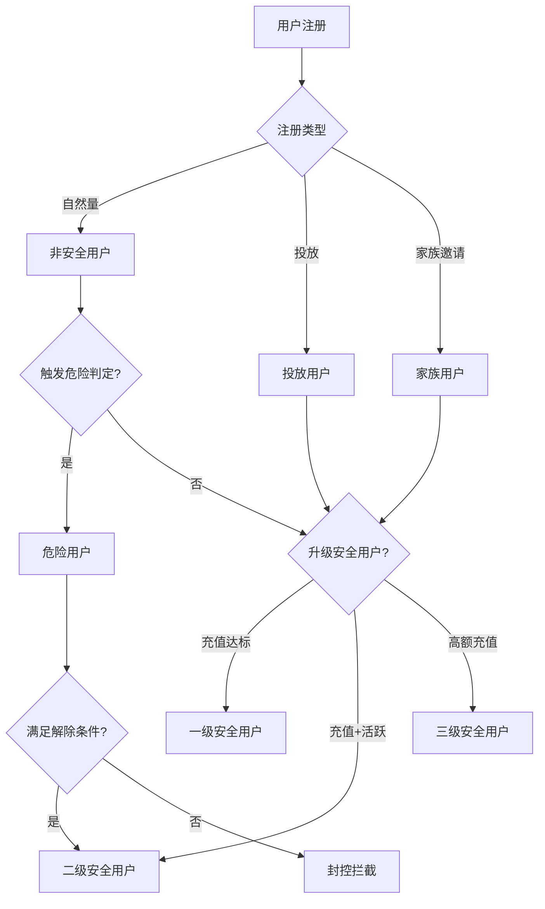

### 2.2 用户分类定义

| 分类 | 定义 | 关键条件 | 备注 |
|------|------|---------|------|
| **家族用户** | 加入家族的用户 | 男女均可加入 | 家族长也是家族成员 |
| **男新用户** | 注册7天内的男用户 | 自然+投放 | — |
| **男新付费用户** | 注册7天内+有充值 | — | — |
| **男老用户** | 注册>7天的男用户 | — | — |
| **男老付费用户** | 注册>7天+有充值 | — | — |
| **女新用户** | 注册7天内的女用户 | 自然+投放 | — |
| **女新主播** | 加入家族7天内的女用户 | — | — |
| **投放用户** | 可追踪的广告来源用户 | — | 也属于安全用户 |
| **付费用户** | 有过充值的用户 | 不限注册时间 | — |
| **非安全用户** | 默认用户状态 | 自然注册，未触发危险，未升级安全 | — |
| **安全用户** | 分三级 | 见下表 | 一级最低，三级最高 |
| **审核用户** | 审核版本登录的用户 | — | 无法自动升级安全用户 |
| **危险用户** | 疑似大陆用户 | 见判定规则 | 封控拦截 |
| **异常用户** | 异常设备登录的用户 | — | 需先升级正常用户 |

### 2.3 安全用户分级

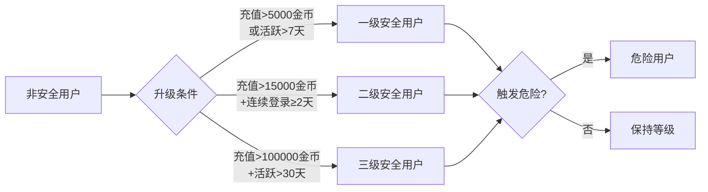

| 等级 | 条件（满足任一） | 权益 |
|------|-----------------|------|
| 一级 | 充值 > 5,000金币 或 活跃 > 7天 | 基础功能 |
| 二级 | 充值 > 15,000金币 + 连续登录 ≥ 2天 | 抽奖、游戏 |
| 三级 | 充值 > 100,000金币 + 活跃 > 30天 | 全功能、优先客服 |

**红色警告**：审核用户、危险用户**永远无法自动变为安全用户**，除非运营手动修改。

---

## 三、危险用户判定逻辑

### 3.1 判定流程

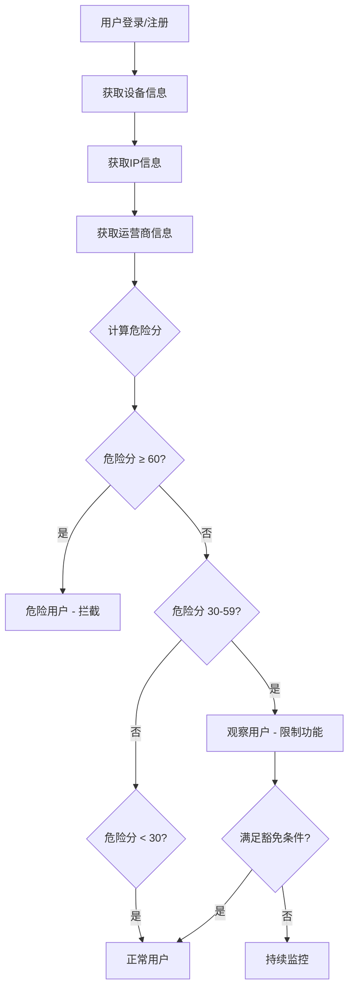

### 3.2 危险分计算规则（优化后）

| 触发项 | 分值 | 说明 |
|--------|------|------|
| 中国运营商 | +40 | 基础高风险项 |
| 国内IP | +30 | 基础高风险项 |
| 简体中文 + VPN开启 | +20 | 组合判定 |
| 简体中文 + 时区不一致 | +15 | 组合判定 |
| 绑定中国手机号 | +25 | 单独判定 |

**判定结果**：

| 危险分范围 | 用户状态 | 处理方式 |
|-----------|---------|---------|
| ≥ 60 | 危险用户 | 拦截登录 |
| 30-59 | 观察用户 | 可登录，限制提现、抽奖 |
| < 30 | 正常用户 | 正常使用 |

### 3.3 豁免规则（新增）

| 豁免项 | 减分值 | 说明 |
|--------|-------|------|
| 已认证海外手机号 | -20 | 强豁免 |
| 投放用户（可追踪） | -15 | 投放渠道验证通过 |
| 家族用户（主播） | -10 | 需直播时长验证 |
| 连续活跃 > 30天 | -10 | 活跃度证明 |

### 3.4 危险用户解除条件

满足以下**任一条件**可解除危险状态，升级为二级安全用户：

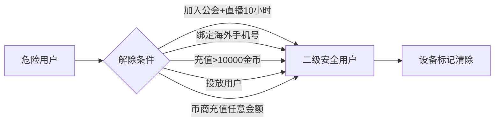

| 条件 | 原规则 | 优化规则 |
|------|--------|---------|
| 加入公会+直播 | 2小时 | **10小时** |
| 绑定海外手机号 | — | 新增 |
| 充值 | >10,000金币 | — |
| 投放用户 | 直接解除 | 需验证投放来源 |
| 币商充值 | 任意金额 | 设备同步清除 |

**重要**：一个账号、一个设备只有一次异常状态解除机会。

---

## 四、设备标记与传染机制

### 4.1 设备类型

| 设备类型 | 定义 | 影响 |
|---------|------|------|
| 正常设备 | 未触发风控的设备 | 可正常使用 |
| 危险设备 | 危险用户登录过的设备 | 禁止登录 |
| 审核设备 | 审核用户登录过的设备 | 无法升级安全用户 |
| 异常设备 | 异常用户登录过的设备 | 无法升级安全用户 |

### 4.2 传染机制

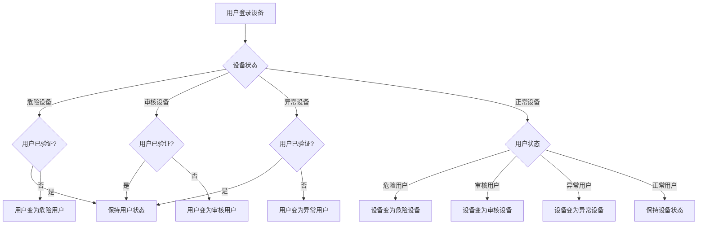

### 4.3 设备清洗机制（新增）

| 设备类型 | 清洗条件 | 清洗后状态 |
|---------|---------|-----------|
| 危险设备 | 连续30天无危险用户登录 | 正常设备 |
| 审核设备 | 连续14天无审核用户登录 | 正常设备 |
| 异常设备 | 连续14天无异常用户登录 | 正常设备 |

**设备白名单**：运营可标记公共设备（网吧、门店演示机）为白名单设备，不参与传染机制。

---

## 五、分区机制

### 5.1 分区定义

| 分区 | 统计时区 | 覆盖范围 |
|------|---------|---------|
| 中东区 | UTC+3 | 阿尔及利亚、巴林、埃及、伊朗、伊拉克、约旦、沙特、科威特、黎巴嫩、利比亚、摩洛哥、阿曼、卡塔尔、苏丹、叙利亚、突尼斯、土耳其、阿联酋、阿富汗等 |
| 英语区 | UTC+0 | 除中东区外的其他国家 |

### 5.2 分区绑定流程

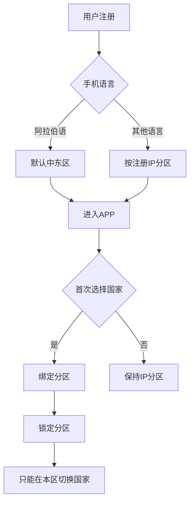

### 5.3 换区数据影响

| 数据项 | 换区影响 | 优化建议 |
|--------|---------|---------|
| 关注列表 | 清除 | 保留30天云端备份 |
| 粉丝列表 | 清除 | 保留30天云端备份 |
| 黑名单 | 清除 | — |
| 聊天记录 | 清除 | 保留30天云端备份 |
| 公会成员 | 退出公会 | 需公会同意 |
| 钻石 | 0.7:1兑换金币 | **改为1:1携带** |
| 金币 | 不变 | — |
| Boss亲密度 | 0.7:1兑换 | — |
| 榜单数据 | 迁移到新区 | — |
| 消费榜 | 清除 | — |
| 麦位值 | 清除 | — |

### 5.4 换区限制

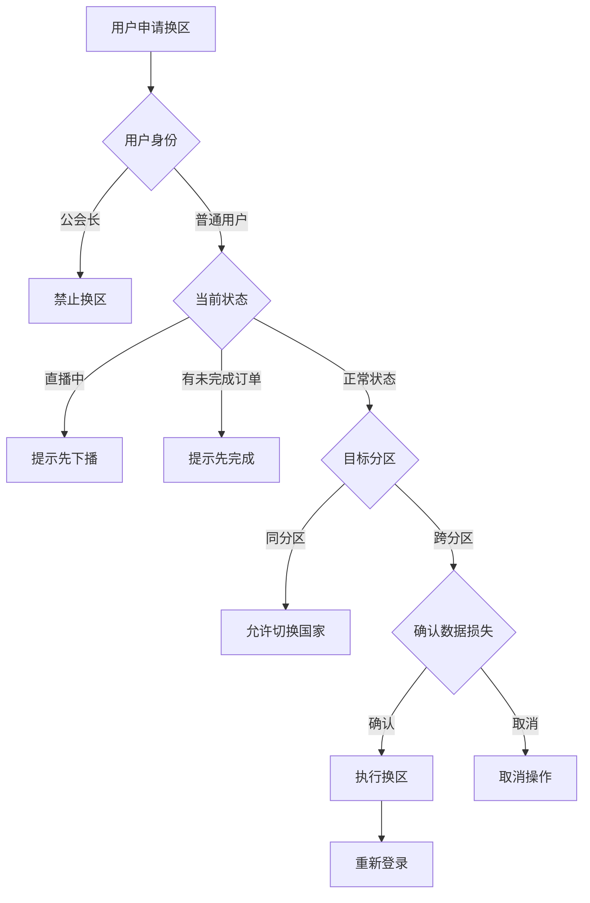

---

## 六、短信风控预警

### 6.1 监控指标

| 指标 | 预警阈值 | 统计周期 |
|------|---------|---------|
| 发送量异常 | 24小时发送量 > 7天日均 × 2倍 且 > 500条 | 每小时 |
| 注册成功率异常 | 24小时成功率 < 7天日均 - 15% 且 成功率 < 50% | 每小时 |
| 单IP发送异常 | 同一IP 24小时发送 > 50条 | 实时 |
| 单号码发送异常 | 同一号码 1小时发送 > 5条 | 实时 |

### 6.2 预警流程

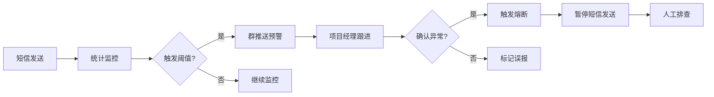

---

## 七、风险点与优化方案

### 7.1 危险用户判定优化

| 问题 | 风险等级 | 优化方案 |
|------|---------|---------|
| VPN+简体中文直接判定 | 高 | 改为评分制，单因素不直接判定 |
| 时区不一致判定 | 高 | 新增旅行豁免，连续触发>3天才判定 |
| 无申诉通道 | 高 | 新增APP内申诉入口 |
| 设备传染无清洗 | 高 | 新增30天自动清洗机制 |
| 公共设备误伤 | 中 | 新增设备白名单机制 |

### 7.2 分区机制优化

| 问题 | 风险等级 | 优化方案 |
|------|---------|---------|
| 钻石换区损失30% | 高 | 改为1:1携带 |
| 聊天记录清除 | 高 | 保留30天云端备份 |
| 公会强制退出 | 中 | 换区前需公会同意 |
| 英语区时区UTC+8 | 中 | 改为UTC+0 |

### 7.3 安全用户门槛优化

| 问题 | 风险等级 | 优化方案 |
|------|---------|---------|
| 一级门槛10,000金币 | 中 | 降至5,000金币 |
| 三级门槛500,000金币 | 中 | 降至100,000金币 |
| 无活跃度路径 | 低 | 新增活跃>30天可升级一级 |

---

## 八、核心流程图汇总

### 8.1 用户注册风控流程

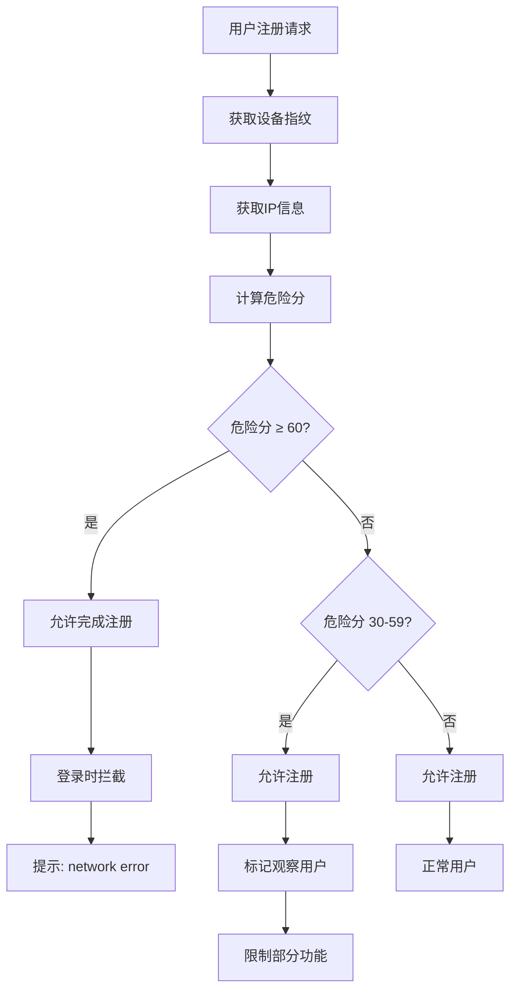

### 8.2 危险用户解除流程

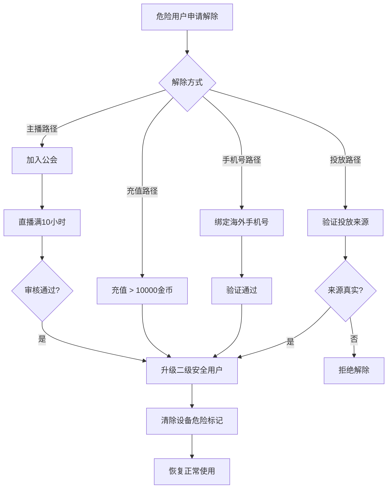

### 8.3 用户换区流程

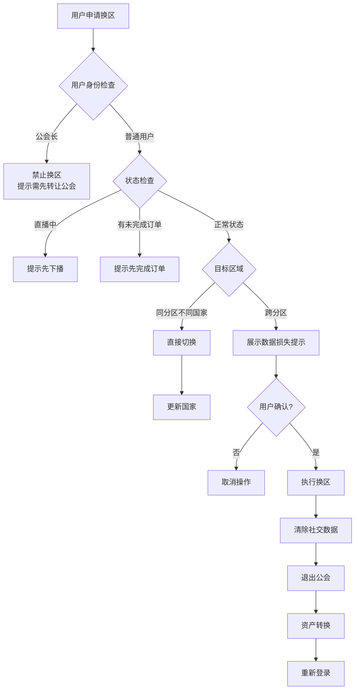

---

## 九、数据字段定义

### 9.1 用户状态枚举

| 字段名 | 枚举值 | 说明 |
|--------|-------|------|
| user_status | NORMAL | 正常用户 |
| user_status | DANGEROUS | 危险用户 |
| user_status | AUDIT | 审核用户 |
| user_status | ABNORMAL | 异常用户 |
| user_status | OBSERVED | 观察用户 |
| user_level | LEVEL_1 | 一级安全用户 |
| user_level | LEVEL_2 | 二级安全用户 |
| user_level | LEVEL_3 | 三级安全用户 |
| user_level | NONE | 非安全用户 |

### 9.2 设备状态枚举

| 字段名 | 枚举值 | 说明 |
|--------|-------|------|
| device_status | NORMAL | 正常设备 |
| device_status | DANGEROUS | 危险设备 |
| device_status | AUDIT | 审核设备 |
| device_status | ABNORMAL | 异常设备 |
| device_status | WHITELIST | 白名单设备 |

### 9.3 分区枚举

| 字段名 | 枚举值 | 说明 |
|--------|-------|------|
| region | MENA | 中东区 |
| region | ENGLISH | 英语区 |

---

## 十、接口设计概要

### 10.1 危险判定接口

```
POST /api/v1/risk/check
Request:
{
  "user_id": "8530064",
  "device_id": "xxxxx",
  "ip": "1.2.3.4",
  "carrier": "China Mobile",
  "language": "zh-CN",
  "timezone": "Asia/Shanghai",
  "vpn_enabled": true
}

Response:
{
  "risk_score": 65,
  "user_status": "DANGEROUS",
  "device_status": "DANGEROUS",
  "trigger_items": ["CARRIER_CN", "IP_CN", "LANG_VPN"]
}
```

### 10.2 设备状态查询接口

```
GET /api/v1/device/{device_id}/status
Response:
{
  "device_id": "xxxxx",
  "device_status": "DANGEROUS",
  "marked_at": "2025-05-01 10:00:00",
  "last_login": "2025-05-13 09:30:00",
  "clear_after": "2025-06-13 10:00:00",
  "whitelist": false
}
```

### 10.3 用户换区接口

```
POST /api/v1/user/{user_id}/region
Request:
{
  "target_region": "ENGLISH",
  "target_country": "US",
  "confirm_data_loss": true
}

Response:
{
  "success": true,
  "new_region": "ENGLISH",
  "new_country": "US",
  "data_changes": {
    "diamonds_converted": 7000,
    "guild_exited": true,
    "social_data_cleared": true
  }
}
```

---

## 十一、附录

### 11.1 中东区国家列表

| 国家码 | 国家名（中） | 国家名（阿语） |
|--------|-------------|---------------|
| 213 | 阿尔及利亚 | الجزائر |
| 973 | 巴林 | البحرين |
| 20 | 埃及 | مصر |
| 98 | 伊朗 | ایران |
| 964 | 伊拉克 | العراق |
| 962 | 约旦 | الأردن |
| 966 | 沙特阿拉伯 | المملكة العربية السعودية |
| 965 | 科威特 | الكويت |
| 961 | 黎巴嫩 | لبنان |
| 218 | 利比亚 | ليبيا |
| 212 | 摩洛哥 | المغرب |
| 968 | 阿曼 | عمان |
| 974 | 卡塔尔 | قطر |
| 249 | 苏丹 | السودان |
| 963 | 叙利亚 | سوريا |
| 216 | 突尼斯 | تونس |
| 90 | 土耳其 | تركيا |
| 971 | 阿联酋 | الإمارات العربية المتحدة |
| 93 | 阿富汗 | أفغانستان |

### 11.2 封控国家列表

以下国家需隐藏国家标识，不支持手机号登录：

- 伊朗
- 叙利亚
- 古巴
- 委内瑞拉
- 乌克兰克里米亚地区
- 北朝鲜（待确认）

---

## 十二、版本历史

| 版本 | 日期 | 修改内容 |
|------|------|---------|
| 1.0.0 | 2025-05-13 | 初始版本，基于运营文档整理 |

