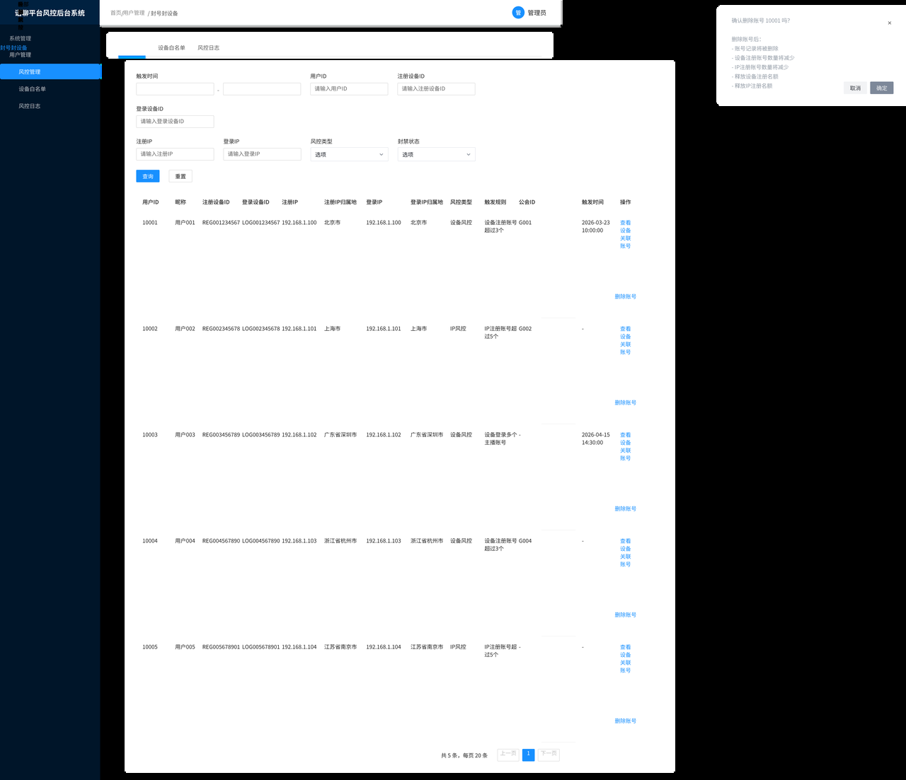

# 主播小号防控与平台风控优化 PRD

> 版本：v1.3 整合风控系统冲突决策版  
> 适用业务：语聊房 / 公会 / 主播结算 / 账号安全 / 设备与 IP 风控  
> 本版补充：在 v1.2 完整评审补充版基础上，整合《风控系统需求文档 v1.0》的客户端提示弹窗、后台删除账号原型与规则口径，补充冲突核对、决策建议和落地口径。  
> 核心目标：防止主播注册小号、同设备多主播、公会套利、批量注册、绕过封禁、异常收益结算。  
> 关键新增规则：  
> 1. 一个设备最多注册 3 个有效账号；  
> 2. 一个设备只能登录 1 个主播账号；  
> 3. 主播身份定义为：用户加入公会后才算主播；  
> 4. 一个 IP 在 24 小时内最多注册 5 个账号；  
> 5. 充值封禁从账号维度升级为设备维度：充值限额按设备累计统计，达到设备充值封禁档位后，该设备下所有账号均受限；  
> 6. 后台新增同设备账号查询、批量处理、封禁、解封、删除/注销、收益冻结和解除能力，并新增设备充值封禁管理与解封审核。  

---

## 1. 背景与问题

当前平台已有用户安全分层、危险用户、审核用户、设备风险、IP 风险、短信风控、分区策略等能力，但规则偏散，部分判断口径过粗，缺少围绕“主播小号”和“公会收益套利”的完整链路。

本次优化重点不是单点封号，而是建立从注册、登录、加入公会、主播身份识别、收益结算、后台处理、申诉解封到风控复盘的一整套闭环。

### 1.1 当前主要问题

| 问题 | 说明 |
|---|---|
| 主播小号注册成本低 | 同一设备可注册多个账号，用于刷活跃、刷礼物、刷工资、绕过处罚 |
| 主播身份口径不统一 | 有些规则把普通用户、主播、公会成员混在一起判断，容易误伤 |
| 设备维度限制不足 | 只有设备风险识别，没有明确“一个设备最多几个账号 / 几个主播账号”的硬规则 |
| IP 维度限制不足 | 批量注册可通过同一网络环境完成，缺少注册上限与周期限制 |
| 后台处理能力不完整 | 需要查看同设备账号、同步处理账号、封禁/解封、删除/注销、冻结收益等能力 |
| 封禁后解封流程不清 | 被封禁用户如何申诉、谁能解封、解封后恢复哪些能力没有明确 |
| 收益处理不够细 | 小号产生的主播收益、公会长提成、提现、预支/借支抵扣等需要和风控联动 |
| 现有风控规则有误伤风险 | 例如单独按性别、国家、家族关系判定风险，容易不合理 |
| 充值封禁口径偏账号 | 当前充值封禁按用户账号累计，用户可通过同设备切换账号继续充值，需要改为设备维度累计限额和封禁 |

### 1.2 PDF v1.0 与本 PRD 冲突核对

本节对齐附件《风控系统需求文档 v1.0》中的规则、客户端弹窗截图和后台原型。原则是：截图作为历史原型直接保留；实现口径以本 PRD 的分级风控、证据链、申诉和白名单边界为准。

| 对齐项 | PDF v1.0 口径 | 本 PRD 口径 | 是否冲突 | 决策建议 |
|---|---|---|---:|---|
| 单设备注册账号数 | 一个设备最多注册 3 个账号 | 一个设备最多注册 3 个有效账号 | 否 | 保持一致，统计口径以“有效账号”章节为准 |
| 设备识别 | 使用 Device ID，iOS 为 IDFV，Android 为 Android ID | 使用服务端聚合的 `risk_device_hash`，客户端 `device_id` 仅作为特征 | 是 | 采用 `risk_device_hash` 作为主键，避免卸载重装、清缓存、广告 ID 变化绕过 |
| IP 注册限制 | 一个 IP 最多注册 5 个账号，未说明周期 | 一个 IP 24 小时内最多注册 5 个账号，并结合 7 天观察、公共网络和 VPN 判断 | 是 | 采用 24 小时滚动阈值；长期累计只做风险分，不作为单独永久封禁依据 |
| 白名单 | 白名单设备不受任何风控规则限制 | 白名单只豁免指定规则，不覆盖法务、合规、欺诈、封禁、收益、提现、充值等高风险规则 | 是 | 采用“规则级白名单”，必须有有效期、审批、审计和适用范围 |
| 主播登录限制 | 一个设备只能登录一个主播账号；主播定义为加入公会账号 | 一个设备只能存在 1 个主播设备占用；加入公会即算主播，并加入退出/封禁/注销后的冷却期 | 轻微扩展 | 保持强规则，补充“设备主播占用”而不是只看当前是否登录 |
| 注册设备超限弹窗 | “当前设备已达到注册账号数量上限，请登录已有账号” | “当前设备注册账号数量已达上限，请使用已有账号登录” | 否 | 截图保留；最终文案可统一为本 PRD 的更标准表述 |
| IP 注册超限弹窗 | “当前网络环境注册账号数量已达上限，请更换网络后再尝试注册” | “当前网络环境注册过于频繁，请稍后再试” | 是 | 不建议直接引导“更换网络”，避免提示绕过路径；建议改为“请稍后再试，如有疑问请联系客服” |
| 主播登录失败弹窗 | “当前设备已登录主播账号，一个设备仅支持登录一个主播账号” | “当前设备已存在主播账号，为保障平台安全，暂不支持登录其他主播账号” | 是 | 采用“已存在/已占用主播账号”，覆盖已退出冷却、封禁保留、未结算收益等非当前登录场景 |
| 删除账号释放名额 | 删除账号后设备/IP 计数减少，释放注册名额 | 注销/删除保留证据，法定保留期内仍计入；合规清理或误注册可排除 | 是 | 不做物理删除后立即释放；默认软删除和证据保留，释放名额需审批并写入排除原因 |
| 后台风险等级 | 安全用户等级高/中/低 | L0-L4 风控等级 | 是 | 使用 L0-L4 为系统主状态；如后台需要高/中/低展示，可做映射字段 |

### 1.3 客户端提示弹窗与后台原型留存

以下截图来自《风控系统需求文档 v1.0》，在本版 Markdown 中直接保留展示。若截图文案与本 PRD 决策口径不一致，以第 1.2 节决策建议和第 22 章统一文案为准。

#### 设备注册数量超限弹窗


#### IP 注册数量超限弹窗


#### 主播设备登录限制弹窗


#### 后台删除账号确认原型



---

## 2. 现有风控规则取舍

### 2.1 建议保留

| 现有能力 | 保留原因 | 优化方式 |
|---|---|---|
| 安全用户 / 审核用户 / 危险用户 / 封禁用户分层 | 已经具备用户风险状态基础 | 统一收敛为 L0-L4 风控等级 |
| 设备风险识别 | 是防小号核心维度 | 增加设备注册账号数、设备主播账号数、同设备公会关系 |
| IP 风险识别 | 防止批量注册和短信滥用 | 增加 24h / 7d 注册阈值、代理/VPN 判断 |
| 后台强制风控 / 解除风控 | 运营和客服需要处理误伤 | 增加审批、原因、日志、有效期 |
| 危险用户注册/登录拦截 | 高风险用户需要直接阻断 | 拆成注册、登录、加入公会、提现等场景 |
| 短信风控预警 | 防止验证码消耗和批量注册 | 与 IP、设备、国家策略联动 |
| 分区 / 国家策略 | 海外不同地区风险差异大 | 后台配置，不建议写死 |
| 审核状态与设备状态联动 | 可防止高风险用户换号绕过 | 区分账号风险、设备风险、IP 风险 |

### 2.2 建议弱化或去掉

| 现有规则 | 建议 | 原因 |
|---|---|---|
| 按性别或性别变更直接判风险 | 弱化为辅助特征 | 容易误伤，不适合作为硬拦截 |
| 家族/公会用户直接判特殊风险 | 弱化 | 公会关系本身不是风险，应结合设备/IP/收益 |
| 单独按国家或 IP 归属判危险 | 弱化 | 跨境、VPN、公共网络用户容易误伤 |
| 命中风险直接删除账号 | 调整 | 删除不可逆，优先限制、冻结、封禁、申诉 |
| 固定阈值一刀切 | 优化 | 建议分级处理：观察、验证、审核、冻结、封禁 |

---

## 3. 核心定义

### 3.1 用户身份

| 身份 | 定义 | 是否计入主播限制 |
|---|---|---:|
| 普通用户 | 未加入公会的用户 | 否 |
| 主播候选用户 | 提交加入公会申请，但未通过 | 否 |
| 主播用户 | 已加入公会，存在有效公会关系 | 是 |
| 已退出公会用户 | 历史加入过公会，当前无有效公会关系 | 默认否，但进入风险参考 |
| 公会长 | 拥有公会管理和结算权限的用户 | 是，且重点监控 |
| 被封禁用户 | 账号被限制登录或限制关键能力 | 不允许注册/登录/加入公会/提现 |
| 审核用户 | 命中风险但未确认违规 | 限制部分能力，等待人工确认 |
| 白名单用户 | 官方测试、客服、运营、合作账号 | 按白名单规则豁免部分限制 |

### 3.2 主播身份口径

**用户加入公会后才算主播。**

判断条件：

```text
is_host = 当前存在有效 agency_user_relation
且 agency_user_relation.status = active
且 user_role in [host, agency_host]
```

不计入主播账号的情况：

```text
1. 普通注册用户；
2. 仅浏览语聊房的用户；
3. 未加入公会的普通房主；
4. 申请加入公会但未通过；
5. 历史加入过公会但当前已退出，且不在冷却期内。
```

### 3.3 设备口径

设备识别不建议只依赖客户端 device_id，应使用服务端设备指纹。

| 维度 | 说明 |
|---|---|
| device_id | 客户端生成的设备 ID |
| install_id | 安装 ID |
| advertising_id | 广告 ID，可为空 |
| android_id / idfv | 系统设备标识 |
| device_model | 设备型号 |
| os_version | 系统版本 |
| app_version | App 版本 |
| sim_country | SIM 国家 |
| timezone | 时区 |
| language | 系统语言 |
| ip_history | 历史 IP |
| risk_device_hash | 服务端聚合后的设备指纹 |

设备判断原则：

```text
设备标识完全一致 → 强关联
核心标识缺失但设备画像高度一致 → 弱关联
弱关联不直接封禁，只进入审核
```

### 3.4 IP 口径

| IP 类型 | 处理 |
|---|---|
| 普通家庭 / 移动网络 IP | 正常统计 |
| 公共网络 IP | 不直接封号，可进入强验证 |
| VPN / Proxy / 机房 IP | 降低阈值或直接限制注册 |
| 跨国频繁切换 IP | 增加风险分 |
| 同 IP 大量注册 | 注册限制、短信限制、人工审核 |

---

## 4. 强规则与软规则

### 4.1 强规则

| 规则 | 触发场景 | 处理 |
|---|---|---|
| 一个设备最多注册 3 个有效账号 | 注册 | 第 4 个账号开始拦截 |
| 一个 IP 24 小时最多注册 5 个账号 | 注册 / 发验证码 | 超过后限制注册或强验证 |
| 一个设备只能登录 1 个主播账号 | 登录 / 加入公会 / 恢复登录 | 拦截第二个主播账号 |
| 同设备已有主播，普通账号不可加入公会 | 加入公会 | 拦截加入公会 |
| 被封禁设备不可注册新账号 | 注册 | 拦截 |
| 被封禁账号不可加入公会 | 加入公会 | 拦截 |
| 高风险账号不可提现 | 提现 / 结算 | 拦截或进入人工审核 |
| 设备充值达到限制档位 | 充值发起 / 充值下单 | 按设备累计金额拦截，不再只按账号判断 |

### 4.2 软规则

| 规则 | 触发场景 | 处理 |
|---|---|---|
| 同设备注册 2 个账号 | 注册后 | 标记观察 |
| 同设备注册 3 个账号 | 注册后 | 标记关注设备 |
| 同 IP 24 小时注册 3-5 个账号 | 注册 | 加强验证 |
| 同公会出现多个同设备账号 | 加入公会 / 结算 | 标记公会风险 |
| 同设备账号互相送礼 | 送礼 / 结算 | 标记套利风险 |
| 同设备账号收益集中到同公会长 | 结算 | 冻结公会长提成待审 |
| 单设备充值接近限制阈值 | 充值前 / 充值后 | 标记观察，进入设备充值风险列表 |

---

## 5. 注册风控流程

### 5.1 注册校验顺序

```text
用户发起注册
→ 校验设备是否封禁
→ 校验设备有效账号数是否 < 3
→ 校验 IP 24 小时注册数是否 ≤ 5
→ 校验手机号/验证码风险
→ 校验国家/地区策略
→ 注册成功
→ 生成用户、设备、IP 风控记录
```

### 5.2 注册规则明细

| 校验项 | 通过条件 | 不通过处理 | 用户提示 |
|---|---|---|---|
| 设备封禁状态 | device_status != banned | 拦截注册 | 当前设备存在安全风险，暂不支持注册 |
| 设备账号数量 | active_account_count < 3 | 拦截注册 | 当前设备注册账号数量已达上限，请使用已有账号登录 |
| IP 注册数量 | register_count_24h <= 5 | 强验证或拦截 | 当前网络环境注册过于频繁，请稍后再试 |
| 短信发送频次 | 未超过短信限制 | 限制验证码 | 验证码发送过于频繁，请稍后再试 |
| 国家限制 | 当前国家允许注册 | 拦截 | 当前地区暂不支持注册 |
| 代理/VPN | 未命中高危代理 | 强验证或拦截 | 当前网络环境异常，请切换网络后重试 |

### 5.3 有效账号统计口径

计入设备注册数：

```text
1. 正常账号；
2. 审核账号；
3. 危险账号；
4. 临时封禁账号；
5. 当前仍保留用户数据的封禁账号。
```

不计入设备注册数：

```text
1. 已完成注销且过法定保留期的账号；
2. 官方后台合规清理的垃圾账号；
3. 明确误注册并由后台标记排除的账号；
4. 官方测试账号。
```

---

## 6. 登录风控流程

### 6.1 登录校验顺序

```text
用户登录
→ 校验账号状态
→ 校验设备状态
→ 绑定当前登录设备
→ 判断用户是否为主播
→ 若是主播，校验设备是否已有其他主播账号
→ 通过后进入 App
```

### 6.2 登录场景处理

| 场景 | 处理 |
|---|---|
| 普通用户登录普通设备 | 正常登录 |
| 普通用户登录风险设备 | 允许登录，但标记观察 |
| 主播用户登录普通设备 | 校验同设备主播数量 |
| 主播用户登录已有主播设备 | 拦截主播身份登录 |
| 被封禁账号登录 | 拦截登录 |
| 被封禁设备登录任何账号 | 根据策略拦截或进入审核 |
| 多端登录同一主播账号 | 按现有多端策略处理，不属于小号规则 |
| 官方白名单账号登录 | 放行并记录日志 |

### 6.3 同设备多主播拦截逻辑

```text
当前登录账号 A 是主播
→ 查询当前设备下 active_host_account_count
→ 如果 active_host_account_count = 0，允许
→ 如果 active_host_account_count = 1 且为 A 自己，允许
→ 如果 active_host_account_count ≥ 1 且不是 A，拦截
```

用户提示：

```text
当前设备已存在主播账号，为保障平台安全，暂不支持登录其他主播账号。
```

后台记录：

```text
risk_code = DEVICE_MULTI_HOST_LOGIN
risk_level = L3
action = block_host_login
```

---

## 7. 加入公会风控流程

### 7.1 加入公会前校验

加入公会是普通账号变成主播账号的关键节点，因此必须做强校验。

```text
用户申请加入公会 / 公会长邀请用户
→ 校验账号状态
→ 校验设备账号数
→ 校验设备是否已有主播账号
→ 校验 IP 注册/登录风险
→ 校验公会风险
→ 通过后建立公会关系
→ 用户正式变成主播
```

### 7.2 加入公会规则

| 校验项 | 通过条件 | 不通过处理 |
|---|---|---|
| 用户账号状态 | normal / low_risk | 拦截或进入审核 |
| 设备主播数量 | 当前设备无其他主播账号 | 拦截加入公会 |
| 设备账号数量 | <= 3 | 超过则拦截 |
| 公会风险等级 | 公会未处于冻结/高风险 | 拦截或进入审核 |
| 公会长风险等级 | 公会长未命中严重风险 | 拦截或进入审核 |
| 同设备是否已有该公会成员 | 无 | 拦截或人工审核 |
| 同 IP 是否批量加入同一公会 | 未命中 | 人工审核 |

### 7.3 主播退出公会冷却期

| 配置项 | 默认值 | 说明 |
|---|---:|---|
| 主播退出公会冷却期 | 7 天 | 同设备其他账号在冷却期内不可加入公会 |
| 冷却期豁免 | 后台可配置 | 需填写原因 |
| 冷却期内再次加入原公会 | 可配置 | 默认允许原账号恢复，不允许换号 |

---

## 8. 主播收益与结算风控

### 8.1 收益处理原则

| 风险等级 | 收益处理 |
|---|---|
| L0 正常 | 正常结算 |
| L1 观察 | 正常结算，记录风险 |
| L2 审核 | 收益进入待审核，可暂缓发放 |
| L3 危险 | 冻结主播工资和公会长提成 |
| L4 封禁 | 停止结算，异常收益可扣回 |

### 8.2 主播工资处理

| 场景 | 处理 |
|---|---|
| 主播命中同设备多账号 | 本周期收益进入审核 |
| 主播命中同设备多主播 | 冻结收益 |
| 主播被封禁 | 停止发放未结算收益 |
| 主播解封 | 根据解封结论恢复或部分恢复收益 |
| 主播申诉成功 | 恢复收益，生成补发记录 |
| 主播申诉失败 | 维持冻结或扣回 |

### 8.3 公会长提成处理

| 场景 | 处理 |
|---|---|
| 公会下出现多个同设备主播 | 公会长提成进入审核 |
| 公会长参与小号套利 | 冻结公会长提成 |
| 公会长账号被封禁 | 停止公会长提成发放 |
| 公会长申诉成功 | 恢复提成或补发 |
| 公会长申诉失败 | 扣回异常提成 |

### 8.4 提现处理

| 用户状态 | 提现处理 |
|---|---|
| normal | 正常提现 |
| review | 提现进入人工审核 |
| risk | 禁止提现 |
| banned | 禁止提现 |
| unbanned_pending | 需完成观察期后恢复提现 |
| whitelist | 按白名单规则处理 |

---

## 9. 风控等级与处罚动作

### 9.1 风控等级

| 等级 | 名称 | 定义 | 主要动作 |
|---|---|---|---|
| L0 | 正常用户 | 未命中风险 | 正常使用 |
| L1 | 观察用户 | 轻微风险或接近阈值 | 记录、看板展示 |
| L2 | 审核用户 | 有较明显风险但未确认违规 | 限制加入公会、收益审核 |
| L3 | 危险用户 | 命中强规则或高度疑似套利 | 拦截、冻结收益、限制提现 |
| L4 | 封禁用户 | 已确认违规或严重风险 | 禁止登录、禁止结算、可清退 |

### 9.2 处罚动作

| 动作 | 说明 | 是否可解除 |
|---|---|---:|
| mark_review | 标记审核 | 是 |
| block_register | 禁止注册 | 是 |
| block_login | 禁止登录 | 是 |
| block_join_agency | 禁止加入公会 | 是 |
| freeze_host_salary | 冻结主播工资 | 是 |
| freeze_agent_salary | 冻结公会长提成 | 是 |
| block_withdraw | 禁止提现 | 是 |
| kick_from_agency | 移出公会 | 是，需重新加入 |
| ban_account | 封禁账号 | 是，走解封流程 |
| ban_device | 封禁设备 | 是，需高权限 |
| ban_ip | 限制 IP | 是，通常有有效期 |
| delete_account | 删除/注销账号 | 否或部分不可逆 |

---

## 9A. 设备维度充值封禁规则（本次新增）

### 9A.1 调整背景

原充值封禁按账号累计充值金额判断，例如账号达到充值上限后限制继续充值。该口径存在明显绕过空间：

```text
同一设备注册/登录多个账号
→ 账号 A 达到充值限制
→ 切换账号 B / C 继续充值
→ 规避账号维度充值封禁
```

本次改造将充值封禁主口径从 `user_id` 升级为 `risk_device_hash`。原先配置在账号上的充值限定金额，全部改为按设备累计统计；命中设备充值封禁后，该设备下所有账号在对应支付渠道继续充值时均受限。

### 9A.2 设备充值封禁档位

| 档位 | 设备累计充值金额口径 | 设备状态 | 前台处理 | 后台展示 |
|---|---:|---|---|---|
| 未限制充值 | < 200 美金 | normal | 正常发起充值 | 展示设备累计金额 |
| 充值上限 200 美金 | >= 200 美金且 < 1000 美金 | recharge_limited_200 | 继续充值时拦截 | 蓝色可点击字段，支持调整 |
| 充值上限 1000 美金 | >= 1000 美金 | recharge_limited_1000 | 继续充值时拦截 | 蓝色可点击字段，支持调整 |
| 全面限制充值 | 人工选择 / 高风险策略 | recharge_blocked | 不允许继续充值 | 红色高危标签 |

说明：

- 200 美金、1000 美金为现有需求图中的充值限制档位，后台配置应支持调整。
- 统计维度为设备，不再按单个账号累计；同设备下账号 A、B、C 的充值金额合并计入设备累计充值金额。
- 设备充值封禁只限制充值能力，不等同于账号封禁、设备登录封禁、设备注册封禁。
- 若设备被全面限制充值，该设备下所有账号均不可通过苹果、Google 或三方渠道继续充值。

### 9A.3 充值金额统计口径

计入设备累计充值金额：

```text
1. 苹果内购成功订单；
2. Google Play 成功订单；
3. 三方支付成功订单；
4. 后台补单且计入用户资产的订单；
5. 同设备下所有账号的成功充值订单；
6. 退款中但平台未确认扣回的订单，默认仍计入，避免退款套利。
```

不计入设备累计充值金额：

```text
1. 支付失败订单；
2. 用户取消订单；
3. 风控拒付且资产未到账订单；
4. 官方测试订单；
5. 后台明确标记为误单且不计入风控的订单。
```

设备绑定口径：

| 场景 | 设备统计处理 |
|---|---|
| 用户换设备充值 | 充值金额计入新设备，同时保留账号历史订单 |
| 设备指纹强关联一致 | 合并统计到同一 `risk_device_hash` |
| 设备弱关联 | 不直接合并限额，进入人工审核 |
| 多账号共用同设备 | 所有账号充值金额合并计入设备限额 |
| 设备指纹变更但系统判定为同设备 | 需保留合并证据，后台展示合并前后指纹 |

### 9A.4 充值发起校验流程

```text
用户点击充值
→ 获取当前 user_id、device_id、risk_device_hash、支付渠道
→ 校验账号状态是否允许充值
→ 校验设备充值封禁状态
→ 查询设备累计充值金额 device_recharge_amount_usd
→ 判断设备充值档位
→ 未命中限制：正常创建充值订单
→ 命中 200 / 1000 / 全面限制：拦截充值并展示 Toast
→ 写入充值风控事件和操作日志
```

前台 Toast：

| 场景 | 文案 |
|---|---|
| 设备已达 200 美金限制 | 当前设备充值金额已达安全限制，暂不支持继续充值 |
| 设备已达 1000 美金限制 | 当前设备充值金额已达高风险限制，暂不支持继续充值 |
| 设备全面限制充值 | 当前设备存在充值风险，暂不支持充值 |
| 账号白名单豁免 | 无提示，正常充值 |

### 9A.5 白名单与豁免

充值封禁白名单分为账号白名单和设备白名单：

| 白名单类型 | 豁免范围 | 生效优先级 | 说明 |
|---|---|---:|---|
| 账号白名单 | 指定 user_id 可绕过充值限制 | 高 | 适用于官方账号、测试账号、特殊合作账号 |
| 设备白名单 | 指定 risk_device_hash 下账号可绕过设备充值限制 | 高 | 适用于误判设备、内部测试设备 |
| 渠道白名单 | 指定渠道订单不计入限额 | 中 | 仅限运营测试，默认关闭 |

白名单要求：

- 添加白名单必须填写原因、有效期和审批人。
- 白名单变更必须记录操作日志。
- 白名单只影响充值封禁，不默认影响注册、登录、公会、提现风控。

### 9A.6 后台操作与解封

设备充值封禁支持以下后台动作：

| 操作 | 说明 | 是否审批 |
|---|---|---:|
| 设置未限制充值 | 恢复设备充值能力 | 是 |
| 设置充值上限 200 美金 | 将设备限制在 200 美金档 | 是 |
| 设置充值上限 1000 美金 | 将设备限制在 1000 美金档 | 是 |
| 设置全面限制充值 | 禁止该设备继续充值 | 是 |
| 设备充值解封 | 将设备充值状态恢复为未限制 | 是 |
| 加入充值白名单 | 豁免充值限制 | 是 |
| 移出充值白名单 | 取消豁免 | 是 |
| 调整设备累计金额 | 修正误计入金额 | 是，高危 |

解封规则：

- 设备充值解封只解除充值限制，不自动解除账号封禁、登录封禁、注册封禁。
- 若设备下存在 L4 封禁账号，设备充值解封需二审。
- 解封后进入 7 天观察期，观察期内再次触发充值风险直接恢复原限制档位。
- 解封原因、处理人、审批人、处理前后设备状态必须写入审计日志。

### 9A.7 与账号封禁的关系

| 状态 | 账号维度 | 设备维度 | 处理 |
|---|---|---|---|
| 账号封禁 | user_id=banned | 设备正常 | 该账号不可登录/充值，其他账号按设备状态判断 |
| 设备充值封禁 | 账号正常 | recharge_blocked / limited | 该设备下所有账号不可继续充值或按档位限制 |
| 设备登录封禁 | 账号正常 | device_status=banned | 该设备禁止登录/注册，充值自然不可发起 |
| 账号白名单 | user whitelist | 设备受限 | 按白名单配置决定是否可充值 |
| 设备白名单 | 账号正常 | device recharge whitelist | 该设备充值限制豁免，但仍受账号状态控制 |

---

## 10. 后台功能设计

### 10.1 菜单结构

```text
风控中心
├── 风控概览
├── 用户风险管理
├── 设备风险管理
├── 设备充值封禁管理
├── IP 风险管理
├── 公会风险管理
├── 主播收益审核
├── 封禁与解封管理
├── 同设备账号处理
├── 风控配置
├── 白名单管理
├── 充值白名单管理
├── 申诉管理
└── 操作审计
```

---

## 11. 风控概览页

### 11.1 指标卡

| 字段 | 说明 |
|---|---|
| 今日注册账号数 | 当天新增注册数 |
| 今日设备注册拦截数 | 因设备账号数超限被拦截 |
| 今日 IP 注册拦截数 | 因 IP 超限被拦截 |
| 今日同设备多主播命中数 | 设备下出现多个主播账号的次数 |
| 当前审核用户数 | risk_status=review |
| 当前危险用户数 | risk_status=risk |
| 当前封禁用户数 | risk_status=banned |
| 今日冻结收益金额 | 主播工资 + 公会长提成 |
| 今日设备充值拦截数 | 因设备累计充值达到限制档位被拦截 |
| 当前充值受限设备数 | recharge_limit_status != normal 的设备数 |
| 今日解封申请数 | 用户申诉或后台发起的解封申请 |
| 解封通过率 | 解封通过 / 解封申请 |

### 11.2 风险事件列表

| 字段 | 说明 |
|---|---|
| 风险事件 ID | 唯一事件 ID |
| 事件类型 | 注册超限、同设备多主播、IP 超限等 |
| 用户 ID | 触发用户 |
| 设备 ID | 触发设备 |
| IP | 触发 IP |
| 风险等级 | L1-L4 |
| 处理状态 | 未处理、已处理、已忽略、已升级 |
| 命中时间 | 事件时间 |
| 操作 | 查看详情、处理、忽略 |

---

## 12. 用户风险详情页

### 12.1 基础信息

| 字段 | 说明 |
|---|---|
| 用户 ID | 平台用户 ID |
| 用户昵称 | 当前昵称 |
| 手机号 | 脱敏展示 |
| 国家 / 地区 | 注册国家、当前 IP 国家 |
| 注册时间 | 账号创建时间 |
| 最近登录时间 | 最近一次登录 |
| 当前账号状态 | normal / review / risk / banned |
| 当前风控等级 | L0-L4 |
| 是否主播 | 是否存在有效公会关系 |
| 所属公会 | 公会 ID、名称 |
| 公会长 | 公会长 ID、昵称 |
| 是否白名单 | 是 / 否 |
| 充值白名单 | 是 / 否 |
| 当前设备充值状态 | 未限制 / 200 美金限制 / 1000 美金限制 / 全面限制充值 |
| 当前设备累计充值 | 按 risk_device_hash 合并后的成功充值金额 |
| 最近处理人 | 后台操作人 |
| 最近处理原因 | 最近一次风控原因 |

### 12.2 设备关联信息

| 字段 | 说明 |
|---|---|
| 当前设备 ID | 当前登录设备 |
| 当前设备状态 | normal / watch / risk / banned |
| 同设备账号数 | 当前设备有效账号数量 |
| 同设备主播数 | 当前设备主播账号数量 |
| 同设备封禁账号数 | 当前设备被封禁账号数 |
| 同设备公会数 | 同设备账号关联公会数量 |
| 同设备累计充值金额 | 同一 risk_device_hash 下所有账号充值成功金额 |
| 同设备充值限制状态 | normal / limit_200 / limit_1000 / blocked |
| 最近设备列表 | 最近登录过的设备 |
| 首次设备 | 注册时设备 |
| 设备风险原因 | 超限、多主播、模拟器等 |

### 12.3 IP 关联信息

| 字段 | 说明 |
|---|---|
| 注册 IP | 注册时 IP |
| 最近登录 IP | 最近登录 IP |
| 24h 同 IP 注册数 | 统计值 |
| 7d 同 IP 注册数 | 统计值 |
| 同 IP 账号数 | 关联账号总数 |
| IP 风险类型 | VPN、代理、机房、公共网络 |
| IP 风险等级 | normal / watch / risk / banned |

### 12.4 收益信息

| 字段 | 说明 |
|---|---|
| 本周期主播工资 | 当前周期主播收入 |
| 本周期公会长提成 | 当前周期相关提成 |
| 待发放金额 | 未结算金额 |
| 已冻结金额 | 因风控冻结金额 |
| 已扣回金额 | 确认违规后扣回 |
| 是否可提现 | 是 / 否 |
| 提现限制原因 | 风控、封禁、审核中 |
| 预支/借支状态 | 是否有待抵扣金额 |
| 充值限制影响 | 当前账号是否因设备充值限制无法继续充值 |

### 12.5 操作按钮

| 操作 | 说明 | 权限 |
|---|---|---|
| 标记审核 | 将用户置为 review | 风控运营 |
| 标记危险 | 将用户置为 risk | 风控运营 |
| 封禁账号 | 设置 banned | 高级风控 |
| 解封账号 | 从 banned 恢复 | 高级风控 + 审批 |
| 冻结收益 | 冻结主播工资/提成 | 财务/风控 |
| 解除收益冻结 | 恢复收益 | 财务/风控 + 审批 |
| 禁止加入公会 | 设置 block_join_agency | 风控运营 |
| 允许加入公会 | 解除限制 | 风控运营 |
| 加入白名单 | 豁免部分规则 | 管理员 |
| 移出白名单 | 取消豁免 | 管理员 |
| 调整充值封禁 | 打开设备充值封禁弹窗，可设置未限制/200/1000/全面限制 | 高级风控 + 审批 |
| 设备充值解封 | 解除当前设备充值限制 | 高级风控 + 审批 |
| 查看同设备账号 | 跳转设备详情 | 风控角色 |
| 查看操作日志 | 查看历史操作 | 风控角色 |

---

## 13. 设备风险详情页

### 13.1 设备基础字段

| 字段 | 说明 |
|---|---|
| 设备 ID | device_id |
| 设备指纹 Hash | risk_device_hash |
| 设备型号 | iPhone / Android 型号 |
| 系统版本 | OS version |
| App 版本 | 最近登录 App 版本 |
| 首次出现时间 | first_seen_at |
| 最近出现时间 | last_seen_at |
| 设备状态 | normal / watch / risk / banned |
| 是否模拟器 | 是 / 否 / 未知 |
| 是否 Root / 越狱 | 是 / 否 / 未知 |
| 设备风险等级 | normal / watch / risk / banned |
| 设备风险原因 | 注册超限、多主播、关联封禁账号等 |
| 设备累计充值金额 | device_recharge_amount_usd |
| 设备充值限制状态 | normal / limit_200 / limit_1000 / blocked |
| 充值限制原因 | 自动触发 / 人工设置 / 白名单豁免 |
| 充值观察期结束时间 | recharge_unban_observe_until |

### 13.2 关联账号列表字段

| 字段 | 说明 |
|---|---|
| 用户 ID | 关联用户 |
| 昵称 | 用户昵称 |
| 手机号 | 脱敏 |
| 注册时间 | 用户注册时间 |
| 最近登录时间 | 最近登录 |
| 是否主播 | 是 / 否 |
| 公会 | 所属公会 |
| 公会长 | 对应公会长 |
| 账号状态 | normal / review / risk / banned |
| 风控等级 | L0-L4 |
| 本周期收益 | 主播收益 |
| 设备累计充值贡献 | 该账号在当前设备下贡献的充值金额 |
| 充值状态 | 正常 / 受限 / 白名单 |
| 提现状态 | 正常 / 限制 |
| 操作 | 查看、冻结、封禁、解封、删除/注销 |

### 13.3 设备操作能力

| 操作 | 说明 | 是否需要审批 |
|---|---|---:|
| 标记关注设备 | 设置 watch | 否 |
| 标记风险设备 | 设置 risk | 是 |
| 封禁设备 | 设置 banned，禁止新注册/主播登录 | 是 |
| 解封设备 | 恢复设备状态 | 是 |
| 限制设备注册 | 不允许该设备继续注册 | 是 |
| 限制设备主播登录 | 不允许该设备登录主播账号 | 是 |
| 设置设备充值封禁 | 设置未限制 / 200 美金 / 1000 美金 / 全面限制 | 是 |
| 解除设备充值封禁 | 恢复设备充值能力，进入观察期 | 是 |
| 加入设备充值白名单 | 设备维度豁免充值限制 | 是 |
| 批量处理关联账号 | 对同设备账号批量处理 | 是 |
| 导出关联账号 | 导出 CSV/Excel | 否 |
| 添加备注 | 风控备注 | 否 |

---

## 13A. 设备充值封禁管理页（本次新增）

### 13A.1 页面定位

设备充值封禁管理页用于查询、处理、解封设备维度充值限制。页面不替代用户风险详情页，而是面向充值风控的专门工作台：

```text
充值封禁列表
→ 查看设备累计充值与关联账号
→ 调整充值封禁档位
→ 设备充值解封 / 加白
→ 审批与操作审计
```

### 13A.2 查询条件

| 条件 | 说明 |
|---|---|
| 设备 ID / risk_device_hash | 精确查询设备 |
| 用户 ID | 反查用户最近设备 |
| 手机号 | 脱敏查询关联账号 |
| 充值状态 | 未限制 / 200 美金限制 / 1000 美金限制 / 全面限制 |
| 支付渠道 | Apple / Google / 三方支付 |
| 国家 / 地区 | 用户注册国家或最近 IP 国家 |
| 累计充值区间 | 按设备累计充值金额筛选 |
| 触发来源 | 自动触发 / 人工设置 / 白名单 / 申诉解封 |
| 处理状态 | 待处理 / 已限制 / 已解封 / 审批中 |
| 命中时间 | 时间范围 |

### 13A.3 列表字段

| 字段 | 说明 |
|---|---|
| 设备 ID | device_id，可复制 |
| 设备指纹 | risk_device_hash，默认脱敏展示 |
| 设备信息 | 系统、型号、App 版本、国家 |
| 关联账号数 | 当前设备有效账号数 |
| 关联主播数 | 当前设备主播账号数 |
| 设备累计充值 | 同设备所有账号成功充值金额 |
| 设备充值状态 | 未限制 / 200 美金 / 1000 美金 / 全面限制 |
| 最近充值账号 | 最近一次充值成功的 user_id |
| 最近充值时间 | 最近成功充值时间 |
| 触发原因 | 自动触发 / 人工设置 / 申诉恢复 |
| 处理人 | 最近一次后台处理人 |
| 操作 | 查看详情、调整、解封、加白、日志 |

### 13A.4 调整充值封禁弹窗

字段：

| 字段 | 必填 | 说明 |
|---|---:|---|
| 封禁类型 | 是 | 设备充值封禁 |
| 充值封禁选项 | 是 | 未限制充值 / 充值上限 200 美金 / 充值上限 1000 美金 / 全面限制充值 |
| 封禁范围 | 是 | 默认当前设备；可勾选强关联设备 |
| 处理原因 | 是 | 设备累计充值超限 / 人工确认 / 误封恢复 / 其他 |
| 备注 | 否 | 运营补充说明 |
| 是否通知用户 | 否 | 默认不通知；如通知则使用统一 Toast/系统消息 |
| 审批人 | 高危必填 | 全面限制充值、解封 L4 关联设备、调整累计金额需审批 |

弹窗规则：

- 单击列表中“充值封禁”蓝色字段，可打开调整弹窗。
- 弹窗默认展示当前设备的充值档位和累计金额。
- 从 1000 美金 / 全面限制改为未限制，必须走解封审批。
- 调整后立即刷新列表、设备详情和用户详情中的充值状态。

### 13A.5 设备充值解封

解封表单字段：

| 字段 | 说明 |
|---|---|
| 解封对象 | 当前设备 / 强关联设备组 |
| 当前充值状态 | 系统自动带出 |
| 当前设备累计充值 | 系统自动带出 |
| 关联账号摘要 | 账号数、主播数、封禁账号数 |
| 解封原因 | 误判设备 / 客服申诉通过 / 运营确认 / 测试设备 |
| 观察期 | 默认 7 天，可配置 |
| 审批方式 | 一审 / 二审 |
| 备注 | 必填 |

解封后：

- `recharge_limit_status` 恢复为 normal。
- 写入 `recharge_unban_observe_until`。
- 不自动恢复账号封禁、提现限制、收益冻结。
- 观察期内再次命中设备充值限制，直接恢复原限制档位。

---

## 14. IP 风险详情页

### 14.1 IP 基础字段

| 字段 | 说明 |
|---|---|
| IP 地址 | 公网 IP |
| IP 国家 | GeoIP 国家 |
| IP 城市 | GeoIP 城市 |
| ISP / ASN | 网络服务商 |
| 是否 VPN | 是 / 否 / 未知 |
| 是否代理 | 是 / 否 / 未知 |
| 是否机房 | 是 / 否 / 未知 |
| IP 状态 | normal / watch / risk / banned |
| 24h 注册数 | 过去 24 小时注册账号数 |
| 7d 注册数 | 过去 7 天注册账号数 |
| 24h 登录账号数 | 过去 24 小时登录账号数 |
| 关联设备数 | 使用该 IP 的设备数 |
| 关联主播数 | 使用该 IP 的主播数 |

### 14.2 IP 操作

| 操作 | 说明 |
|---|---|
| 标记风险 IP | 提高该 IP 的风险等级 |
| 限制注册 | 该 IP 不允许注册 |
| 限制短信 | 该 IP 不允许发送验证码 |
| 加入 IP 白名单 | 公共办公网络等可加入白名单 |
| 解除 IP 限制 | 恢复正常 |
| 查看关联账号 | 查看该 IP 下账号 |
| 查看关联设备 | 查看该 IP 下设备 |

---

## 15. 同设备账号批量处理页

### 15.1 查询条件

| 条件 | 说明 |
|---|---|
| 设备 ID | 精确查询 |
| 用户 ID | 反查设备 |
| 手机号 | 脱敏查询 |
| 公会 ID | 查询公会内同设备账号 |
| 公会长 ID | 查询公会长关联风险 |
| 账号状态 | normal / review / risk / banned |
| 是否主播 | 是 / 否 |
| 注册时间 | 时间范围 |
| 最近登录时间 | 时间范围 |
| 收益区间 | 本周期收益范围 |
| 风控等级 | L0-L4 |

### 15.2 批量操作

| 操作 | 说明 | 适用场景 |
|---|---|---|
| 批量标记审核 | 设置 review | 疑似小号但未确认 |
| 批量冻结收益 | 冻结工资/提成 | 疑似套利 |
| 批量限制加入公会 | 禁止成为主播 | 同设备普通小号 |
| 批量移出公会 | 清退风险主播 | 确认公会小号 |
| 批量封禁账号 | 设置 banned | 确认违规 |
| 批量解封账号 | 恢复账号 | 误封/申诉通过 |
| 批量删除/注销 | 清理违规垃圾账号 | 严重违规且确认 |
| 批量解除设备关联 | 处理误关联 | 换机/设备误识别 |

### 15.3 批量处理确认弹窗

```text
你即将对以下账号执行【封禁账号】操作：

影响账号数：6
其中主播账号：2
涉及公会数：1
预计冻结收益：$128.50

请确认是否继续？
```

必填项：

| 字段 | 说明 |
|---|---|
| 处理原因 | 必填 |
| 风控证据 | 必填，选择设备超限/多主播/IP异常/人工确认等 |
| 备注 | 可选 |
| 是否通知用户 | 可选 |
| 是否冻结收益 | 可选 |
| 是否同步限制设备 | 可选 |
| 审批人 | 高危操作必填 |

---

## 16. 封禁与解封管理

### 16.1 封禁类型

| 类型 | 说明 | 影响范围 |
|---|---|---|
| 账号封禁 | 限制单个用户账号 | 禁止登录/提现/加入公会 |
| 主播身份封禁 | 不封账号，只封主播能力 | 禁止加入公会、禁止结算主播收益 |
| 设备封禁 | 限制设备 | 禁止注册、限制主播登录 |
| 设备充值封禁 | 限制设备充值能力 | 同设备下所有账号按设备累计限额限制充值 |
| IP 限制 | 限制网络环境 | 限制注册、短信、登录 |
| 公会封禁 | 限制公会 | 禁止新增主播、冻结结算 |
| 公会长封禁 | 限制公会长能力 | 禁止借支/预支/提成/邀请主播 |

### 16.2 封禁原因枚举

| code | 原因 |
|---|---|
| DEVICE_REGISTER_LIMIT | 设备注册账号超限 |
| DEVICE_MULTI_HOST | 同设备多主播 |
| DEVICE_RECHARGE_LIMIT_200 | 设备累计充值达到 200 美金限制 |
| DEVICE_RECHARGE_LIMIT_1000 | 设备累计充值达到 1000 美金限制 |
| DEVICE_RECHARGE_BLOCKED | 设备被人工设置为全面限制充值 |
| IP_REGISTER_LIMIT | IP 注册超限 |
| AGENCY_FAKE_HOST | 公会疑似小号主播 |
| SALARY_ABUSE | 主播收益套利 |
| MULTI_ACCOUNT_ABUSE | 多账号违规 |
| BAN_EVASION | 绕过封禁 |
| SMS_ABUSE | 短信验证码滥用 |
| MANUAL_CONFIRMED | 人工确认违规 |
| OTHER | 其他 |

### 16.3 解封入口

| 入口 | 说明 |
|---|---|
| 用户申诉 | 用户端提交申诉 |
| 客服工单 | 客服代用户提交 |
| 后台用户详情 | 风控人员主动解封 |
| 设备详情页 | 解封设备 |
| 设备充值封禁管理页 | 解封设备充值限制或调整充值档位 |
| 批量处理页 | 批量解封账号 |
| 公会申诉 | 公会长提交公会/主播解封 |

### 16.4 解封申请字段

| 字段 | 说明 |
|---|---|
| appeal_id | 申诉 ID |
| user_id | 申请用户 |
| appeal_type | 账号解封/设备解封/设备充值解封/主播身份解封/收益解冻 |
| 当前封禁原因 | 系统记录 |
| 用户申诉说明 | 用户填写 |
| 上传凭证 | 图片/视频/设备证明，可选 |
| 关联设备 | 当前设备 |
| 关联 IP | 最近 IP |
| 当前账号状态 | banned / risk / review |
| 处理状态 | pending / approved / rejected / need_more_info |
| 处理人 | 后台人员 |
| 处理时间 | 审核时间 |
| 处理备注 | 必填 |

### 16.5 解封审核流程

```text
用户/客服/后台提交解封申请
→ 系统展示封禁原因、关联设备、关联账号、收益影响
→ 一审风控人员审核
→ 普通封禁：一审可通过或拒绝
→ 高危封禁/批量封禁/收益冻结：需要二审
→ 审核通过后执行解封动作
→ 更新账号/设备/IP/收益状态
→ 记录操作日志
→ 通知用户结果
```

### 16.6 解封后的状态恢复

| 解封对象 | 恢复内容 | 不自动恢复内容 |
|---|---|---|
| 账号解封 | 登录、普通使用能力 | 主播身份、提现、冻结收益 |
| 主播身份解封 | 加入公会、主播功能 | 已扣回收益 |
| 设备解封 | 注册/登录限制恢复 | 账号封禁不自动解除 |
| 设备充值解封 | 充值能力恢复，进入观察期 | 账号封禁、提现限制、收益冻结不自动解除 |
| IP 解封 | 注册/短信限制恢复 | 账号/设备风险不自动解除 |
| 收益解冻 | 待发收益恢复发放 | 已确认违规扣回金额 |
| 公会解封 | 公会新增主播、结算能力恢复 | 已清退主播不自动恢复 |

### 16.7 解封观察期

| 配置项 | 默认值 | 说明 |
|---|---:|---|
| 解封观察期 | 7 天 | 观察期内再次命中风险直接升级 |
| 观察期提现限制 | 开 | 观察期内提现需审核 |
| 观察期加入公会限制 | 可配置 | 主播身份类解封建议开启 |
| 观察期收益发放 | 人工审核 | 避免刚解封立即套利 |

---

## 17. 删除/注销账号规则

### 17.1 删除/注销适用场景

| 场景 | 是否允许删除 |
|---|---:|
| 明确垃圾注册账号 | 允许 |
| 批量注册未活跃小号 | 允许 |
| 已确认用于套利的小号 | 允许或封禁保留证据 |
| 有未结算收益账号 | 不建议删除，先冻结 |
| 有申诉中账号 | 不允许删除 |
| 涉及财务纠纷账号 | 不允许删除 |
| 官方测试账号 | 不允许误删 |

### 17.2 删除前校验

```text
1. 是否存在未完成订单；
2. 是否存在未结算收益；
3. 是否存在提现/预支/借支；
4. 是否存在申诉中工单；
5. 是否为公会长；
6. 是否为当前有效主播；
7. 是否为白名单账号；
8. 是否涉及审计证据保留。
```

### 17.3 删除操作要求

| 要求 | 说明 |
|---|---|
| 二次确认 | 必须 |
| 高权限 | 仅高级管理员 |
| 审批 | 批量删除必须审批 |
| 备注 | 必填 |
| 操作日志 | 必须记录 |
| 证据保留 | 风控证据保留，不可直接清空 |
| 可恢复性 | 建议先做软删除 |

建议优先软删除：

```text
status = deleted
login_disabled = true
profile_hidden = true
agency_relation_invalid = true
```

### 17.4 删除后是否释放设备 / IP 名额

PDF v1.0 的后台原型中，删除账号后会同步减少设备注册计数和 IP 注册计数，从而释放注册名额。该逻辑在初期可降低运营处理成本，但存在被滥用后反复清号、重新注册、破坏证据链的风险。

最终决策：

| 账号处理类型 | 是否减少设备注册计数 | 是否减少 IP 注册计数 | 是否释放注册名额 | 审批要求 |
|---|---:|---:|---:|---|
| 风险账号软删除 | 否 | 否 | 否 | 操作日志必填 |
| 封禁账号保留 | 否 | 否 | 否 | 风控原因必填 |
| 已注销但仍在法定保留期 | 否 | 否 | 否 | 自动处理 |
| 官方测试账号清理 | 是 | 可配置 | 是 | 需标记测试账号 |
| 明确误注册且无风控收益链路 | 是 | 可配置 | 是 | 需审批和备注 |
| 合规清理的垃圾账号 | 是 | 可配置 | 是 | 需批量审批 |
| 涉及收益、提现、拒付、申诉中账号 | 否 | 否 | 否 | 不允许释放 |

补充要求：

```text
1. 删除/注销不等于立即释放名额；
2. 释放名额必须写入 exclude_from_device_account_count / exclude_from_ip_register_count；
3. 排除原因必须可追溯，至少保留操作人、审批人、时间、原因和关联工单；
4. 被排除账号仍需保留审计索引，避免证据链断裂；
5. 批量释放名额属于高危操作，纳入二次审批和风控日志。
```

---

## 18. 数据模型

### 18.1 UserRiskProfile

| 字段 | 说明 |
|---|---|
| user_id | 用户 ID |
| risk_level | L0-L4 |
| risk_status | normal / review / risk / banned |
| risk_reason | 风险原因 |
| device_id | 最近设备 |
| ip | 最近 IP |
| exclude_from_device_account_count | 是否排除设备账号数统计 |
| exclude_from_ip_register_count | 是否排除 IP 注册数统计 |
| count_exclusion_reason | 计数排除原因 |
| count_exclusion_approval_id | 计数排除审批单 ID |
| is_host | 是否主播 |
| agency_id | 当前公会 ID |
| salary_freeze_status | 收益冻结状态 |
| withdraw_status | 提现状态 |
| recharge_status | 账号充值状态，受账号状态和设备充值状态共同影响 |
| last_recharge_device_hash | 最近充值设备指纹 |
| ban_status | 封禁状态 |
| unban_observe_until | 解封观察期结束时间 |
| last_login_at | 最近登录时间 |
| updated_by | 操作人 |
| updated_at | 更新时间 |

### 18.2 DeviceRiskProfile

| 字段 | 说明 |
|---|---|
| device_id | 设备 ID |
| risk_device_hash | 设备指纹 |
| registered_account_count | 注册账号数 |
| active_account_count | 有效账号数 |
| excluded_account_count | 已审批排除计数的账号数 |
| host_account_count | 主播账号数 |
| agency_count | 关联公会数 |
| banned_account_count | 封禁账号数 |
| risk_level | 设备风险等级 |
| device_status | normal / watch / risk / banned |
| recharge_limit_status | normal / limit_200 / limit_1000 / blocked |
| device_recharge_amount_usd | 设备累计充值金额 |
| recharge_limit_reason | 充值限制原因 |
| recharge_unban_observe_until | 充值解封观察期结束时间 |
| first_seen_at | 首次出现时间 |
| last_seen_at | 最近出现时间 |

### 18.3 DeviceRechargeRiskProfile（新增）

| 字段 | 说明 |
|---|---|
| risk_device_hash | 设备指纹主键 |
| device_id_list | 合并统计的设备 ID 列表 |
| total_recharge_amount_usd | 设备累计成功充值金额 |
| apple_recharge_amount_usd | Apple 渠道累计金额 |
| google_recharge_amount_usd | Google 渠道累计金额 |
| third_party_recharge_amount_usd | 三方支付累计金额 |
| related_user_count | 关联账号数 |
| related_host_count | 关联主播数 |
| latest_recharge_user_id | 最近充值账号 |
| latest_recharge_at | 最近充值时间 |
| recharge_limit_status | normal / limit_200 / limit_1000 / blocked |
| trigger_source | auto / manual / whitelist / appeal |
| trigger_reason | 触发原因 |
| whitelist_status | none / user_whitelist / device_whitelist |
| observe_until | 解封观察期结束时间 |
| updated_by | 最近处理人 |
| updated_at | 最近更新时间 |

### 18.4 DeviceRechargeActionOrder（新增）

| 字段 | 说明 |
|---|---|
| order_id | 操作单 ID |
| risk_device_hash | 设备指纹 |
| action_type | set_limit / unblock / whitelist / remove_whitelist / adjust_amount |
| before_status | 操作前充值状态 |
| after_status | 操作后充值状态 |
| before_amount_usd | 操作前设备累计充值金额 |
| after_amount_usd | 操作后设备累计充值金额 |
| reason | 操作原因 |
| remark | 备注 |
| approval_id | 审批单 ID |
| operator_id | 操作人 |
| created_at | 创建时间 |

### 18.5 IPRiskProfile

| 字段 | 说明 |
|---|---|
| ip | IP 地址 |
| country | 国家 |
| asn / isp | 网络服务商 |
| register_count_24h | 24 小时注册数 |
| register_count_7d | 7 天注册数 |
| register_count_lifetime | 历史注册总数，仅用于风险观察和证据链 |
| excluded_register_count | 已审批排除计数的注册账号数 |
| login_account_count_24h | 24 小时登录账号数 |
| is_proxy | 是否代理/VPN/机房 |
| risk_level | IP 风险等级 |
| ip_status | normal / watch / risk / banned |

---

## 19. 风控配置项

| 配置项 | 默认值 | 是否支持按国家配置 | 说明 |
|---|---:|---:|---|
| 单设备注册账号上限 | 3 | 是 | 超过拦截注册 |
| 单设备主播账号上限 | 1 | 否 | 强规则 |
| 单 IP 24h 注册上限 | 5 | 是 | 超过强验证或拦截 |
| 单 IP 7d 注册上限 | 15 | 是 | 超过标记风险 |
| 单设备充值限制档位 1 | 200 美金 | 是 | 设备累计充值达到后限制继续充值 |
| 单设备充值限制档位 2 | 1000 美金 | 是 | 设备累计充值达到后进入高风险限制 |
| 设备充值全面限制 | 关闭 | 是 | 支持人工对设备设置全面限制充值 |
| 主播退出公会冷却期 | 7 天 | 是 | 防换号加入公会 |
| 解封观察期 | 7 天 | 是 | 防反复违规 |
| 设备充值解封观察期 | 7 天 | 是 | 解封后再次命中直接恢复原限制档位 |
| 收益冻结阈值 | L3 | 否 | L3 及以上冻结 |
| 提现审核阈值 | L2 | 否 | L2 及以上提现审核 |
| 批量删除审批阈值 | 2 个账号 | 否 | 超过需审批 |
| 设备封禁审批 | 开 | 否 | 高危操作 |

---

## 20. 操作审计

### 20.1 审计字段

| 字段 | 说明 |
|---|---|
| log_id | 日志 ID |
| operator_id | 操作人 |
| operator_role | 操作角色 |
| action_type | 操作类型 |
| object_type | user / device / ip / agency |
| object_id | 操作对象 |
| before_status | 操作前状态 |
| after_status | 操作后状态 |
| reason | 操作原因 |
| evidence | 风控证据 |
| approval_id | 审批 ID |
| created_at | 操作时间 |
| ip | 操作人 IP |

### 20.2 必须审计的操作

```text
1. 封禁账号；
2. 解封账号；
3. 封禁设备；
4. 解封设备；
5. 设置设备充值封禁；
6. 解除设备充值封禁；
7. 调整设备累计充值金额；
8. 冻结收益；
9. 解除收益冻结；
10. 删除/注销账号；
11. 批量处理同设备账号；
12. 加入/移出白名单；
13. 加入/移出充值白名单；
14. 修改风控阈值。
```

---

## 21. 权限设计

| 角色 | 可操作范围 |
|---|---|
| 客服 | 查看风险、提交申诉、备注，不可封禁/解封 |
| 风控运营 | 标记审核、限制加入公会、冻结收益 |
| 高级风控 | 封禁账号、解封账号、设备处理、设备充值封禁处理 |
| 财务 | 查看收益、冻结/解冻收益、补发 |
| 超级管理员 | 删除/注销账号、修改风控配置、批量高危操作 |
| 审计员 | 只读审计日志 |

高危操作必须审批：

```text
1. 批量封禁超过 2 个账号；
2. 批量删除/注销账号；
3. 解封 L4 封禁账号；
4. 解封设备；
5. 设备充值解封；
6. 设备累计充值金额调整；
7. 解除超过 $100 的收益冻结；
8. 修改核心风控阈值。
```

---

## 22. 用户侧提示文案

本章为最终实现文案。第 1.3 节中的截图作为 PDF v1.0 原型留存；若截图文案与下表不一致，客户端、服务端错误码和多语言翻译均以下表为准。

### 22.1 客户端弹窗 / Toast 文案

| 场景 | 展示形式 | 标题 | 内容 | 主按钮 | 说明 |
|---|---|---|---|---|---|
| 注册设备超限 | 弹窗 | 注册失败 | 当前设备注册账号数量已达上限，请使用已有账号登录。 | 确定 | 与 PDF 截图含义一致，统一“使用已有账号登录”表述 |
| IP 注册过频 | 弹窗 | 注册失败 | 当前网络环境注册过于频繁，请稍后再试。如有疑问，请联系客服。 | 确定 | 替代 PDF 中“请更换网络”表述，避免引导绕过 |
| 同设备多主播 | 弹窗 | 登录失败 | 当前设备已存在主播账号，为保障平台安全，暂不支持登录其他主播账号。 | 确定 | 覆盖已登录、冷却期、封禁保留、收益未结算等设备主播占用场景 |
| 加入公会拦截 | Toast / 弹窗 | 申请失败 | 当前账号暂不支持加入公会，请联系客服处理。 | 确定 | 公会入口强拦截时使用弹窗，弱审核时使用 Toast |
| 收益冻结 | 系统消息 | 安全审核中 | 当前收益正在安全审核中，审核完成后将更新结算状态。 | 查看详情 | 跳转收益审核说明或申诉入口 |
| 设备充值 200 美金限制 | Toast | - | 当前设备充值金额已达安全限制，暂不支持继续充值。 | - | 充值下单前拦截 |
| 设备充值 1000 美金限制 | Toast | - | 当前设备充值金额已达高风险限制，暂不支持继续充值。 | - | 充值下单前拦截 |
| 设备全面限制充值 | Toast | - | 当前设备存在充值风险，暂不支持充值。 | - | 可引导申诉 |
| 账号封禁提示 | 封禁页 / 弹窗 | 账号受限 | 当前账号存在安全风险，已被限制使用。如有疑问，可提交申诉。 | 提交申诉 | 登录被拦截时展示封禁页 |
| 解封成功 | 系统消息 | 限制已解除 | 你的账号限制已解除，请遵守平台规则，避免再次触发安全限制。 | 我知道了 | 不代表收益、提现、主播身份、设备充值限制全部恢复 |
| 风控服务异常 | Toast | - | 当前服务繁忙，请稍后再试。 | - | 普通低风险场景 |
| 充值风控异常 | Toast | - | 当前充值校验失败，请稍后重试。 | - | 充值链路 fail-close |

---

## 23. 埋点与看板

### 23.1 关键埋点

| 埋点 | 触发时机 |
|---|---|
| risk_register_device_limit_hit | 注册命中设备上限 |
| risk_register_ip_limit_hit | 注册命中 IP 上限 |
| risk_host_multi_login_hit | 登录命中同设备多主播 |
| risk_join_agency_device_host_hit | 加入公会命中设备已有主播 |
| risk_salary_freeze | 收益被冻结 |
| risk_account_ban | 账号被封禁 |
| risk_account_unban | 账号被解封 |
| risk_device_ban | 设备被封禁 |
| risk_device_unban | 设备被解封 |
| risk_device_recharge_limit_hit | 充值命中设备累计限额 |
| risk_device_recharge_ban_update | 后台调整设备充值封禁 |
| risk_device_recharge_unban | 设备充值限制被解除 |
| risk_device_recharge_whitelist_update | 充值白名单变更 |
| risk_appeal_submit | 用户提交申诉 |
| risk_appeal_approved | 申诉通过 |
| risk_appeal_rejected | 申诉拒绝 |
| risk_batch_action | 后台批量处理 |

### 23.2 看板指标

| 指标 | 说明 |
|---|---|
| 设备注册拦截数 | 设备超限触发量 |
| IP 注册拦截数 | IP 超限触发量 |
| 同设备多主播命中数 | 核心小号指标 |
| 加入公会拦截数 | 普通账号转主播被拦截 |
| 封禁账号数 | 每日/每周封禁 |
| 解封账号数 | 申诉通过或后台解封 |
| 设备充值拦截数 | 设备累计充值超限触发量 |
| 充值受限设备数 | 当前充值限制设备规模 |
| 设备充值解封数 | 后台或申诉通过的设备充值解封数量 |
| 解封后复犯率 | 解封用户再次命中风险比例 |
| 冻结收益金额 | 主播/公会长冻结金额 |
| 误伤率 | 申诉通过 / 总封禁 |
| 公会风险排行 | 风险主播数最多的公会 |

---

## 24. 验收标准

### 24.1 注册验收

- 同一设备注册第 1-3 个账号成功；
- 同一设备注册第 4 个账号被拦截；
- 同一 IP 24 小时注册第 6 个账号被拦截或强验证；
- 后台能看到设备注册账号数和 IP 注册账号数；
- 白名单账号按配置豁免。

### 24.2 登录验收

- 同设备登录普通账号正常；
- 同设备登录第 1 个主播账号正常；
- 同设备登录第 2 个主播账号被拦截；
- 被封禁账号无法登录；
- 解封后账号可恢复登录。

### 24.3 加入公会验收

- 普通用户加入公会前触发设备校验；
- 设备无主播账号时可加入；
- 设备已有主播账号时不可加入；
- 公会长批量邀请同设备账号时后台产生风险事件。

### 24.3A 设备充值封禁验收

- 同一设备下多个账号充值金额合并统计；
- 设备累计充值达到 200 美金后，继续充值被拦截；
- 设备累计充值达到 1000 美金后，进入高风险限制档位；
- 后台可将设备充值状态调整为未限制、200 美金、1000 美金、全面限制充值；
- 设备充值解封后，账号封禁、提现限制、收益冻结不自动解除；
- 设备充值解封进入 7 天观察期，观察期内再次命中可恢复限制；
- 账号白名单、设备白名单按配置豁免充值限制；
- 所有充值限制、解封、白名单和金额调整均记录审计日志。

### 24.4 后台验收

- 可查询用户风险详情；
- 可查询设备关联账号；
- 可查询 IP 关联账号；
- 可查询设备充值封禁列表和设备充值详情；
- 可批量冻结、封禁、解封、删除/注销；
- 可调整设备充值封禁档位、解除充值封禁、加入充值白名单；
- 高危操作有二次确认和审批；
- 所有操作有审计日志。

### 24.5 解封验收

- 用户可提交申诉；
- 客服可代提交申诉；
- 后台可审核通过、拒绝、要求补充材料；
- 解封后账号状态正确恢复；
- 解封后进入观察期；
- 解封操作记录日志。

### 24.6 收益验收

- L2 用户收益进入审核；
- L3 用户收益被冻结；
- 封禁用户不可提现；
- 解封后收益按审核结果恢复或继续冻结；
- 财务可查看冻结/解冻记录。

---

## 25. 上线策略

### 25.1 阶段一：观察期

周期：3-7 天。

只记录风险，不前台拦截，用于观察命中量和误伤率。

### 25.2 阶段二：软拦截

周期：7-14 天。

开始拦截设备第 4 个注册账号、IP 超限注册、同设备第 2 个主播账号登录。

### 25.3 阶段三：强拦截

正式执行：

```text
一个设备最多 3 个账号；
一个设备最多 1 个主播账号；
一个 IP 24 小时最多 5 个注册账号；
设备充值限额按设备累计统计；
风险收益进入冻结和审核；
后台支持批量处理和解封。
```

### 25.4 阶段四：复盘优化

上线后每周复盘：

```text
1. 拦截量；
2. 误伤率；
3. 申诉通过率；
4. 解封后复犯率；
5. 被冻结收益金额；
6. 设备充值拦截量和解封量；
7. 公会风险排名；
8. 规则是否需要按国家调整。
```

---

## 26. 最终推荐结论

本期建议采用“设备 + IP + 公会关系 + 主播身份 + 收益结算”五层联动策略。

核心执行规则：

1. 注册阶段防批量：设备 3 个账号上限，IP 24 小时 5 个账号上限；
2. 登录阶段防多主播：一个设备只允许一个主播账号；
3. 加入公会阶段防身份转换：已有主播设备不允许其他账号加入公会；
4. 充值阶段防绕过：充值封禁从账号维度升级为设备维度，原充值限制金额按设备累计统计；
5. 结算阶段防套利：风险主播和公会长收益进入审核或冻结；
6. 后台阶段可处理：支持同设备账号查询、批量封禁、解封、删除/注销、收益处理、设备充值封禁处理；
7. 申诉阶段防误伤：被封禁用户可申诉，后台可解封并设置观察期。

一句话总结：

**这套方案不是简单限制注册，而是把“注册小号 → 登录切号 → 充值绕过 → 加入公会 → 产生收益 → 提现/结算 → 被封禁后绕过”的完整风险链路全部纳入后台可配置、可审计、可复核的风控体系。**
---

# 27. 设备生命周期与绕过场景处理（补充）

## 27.1 章节目标

本章节用于补齐设备规则在实际业务中的边界场景，避免用户通过卸载重装、清缓存、换广告 ID、换设备、游客转正、注销重注册等方式绕过“单设备账号上限”和“单设备主播上限”。

设备风控的核心原则：

```text
只要服务端能够稳定识别为同一风险设备，则不因客户端重装、缓存清理、广告 ID 变化、设备 ID 重置而重置风控统计。
```

## 27.2 设备生命周期场景

| 场景 | 识别方式 | 处理规则 | 是否重置设备账号数 |
|---|---|---|---:|
| 卸载重装 App | risk_device_hash 一致 | 仍视为同一设备 | 否 |
| 清除缓存 | 核心设备指纹一致 | 仍视为同一设备 | 否 |
| 更换广告 ID | advertising_id 变化但设备画像一致 | 不重置风控统计 | 否 |
| 更换 SIM 卡 | 设备核心标识一致 | 记录 SIM 变化，增加风险参考 | 否 |
| 更换手机号注册 | 同设备新账号 | 计入设备账号数 | 否 |
| 游客账号转正式账号 | visitor_id 与设备绑定 | 转正后计入设备账号数 | 否 |
| 注销后重新注册 | 原账号仍在保留期 | 注销账号仍计入设备账号数 | 否 |
| 换设备登录 | 新设备绑定账号 | 计入账号设备历史 | 不影响旧设备统计 |
| 二手设备 | 用户申诉证明 | 可人工释放部分设备占用 | 需审批 |
| 维修换机 | 用户申诉证明 | 可人工调整设备关联 | 需审批 |
| 模拟器 / 云手机 | 设备环境识别 | 默认进入审核，不建议成为主播 | 否 |
| Root / 越狱设备 | 系统环境识别 | 标记风险，限制主播/提现能力 | 否 |

## 27.3 游客账号转正规则

如果平台支持游客模式，游客账号转为正式账号时应纳入设备账号统计。

```text
游客首次进入 App
→ 生成 visitor_id
→ 绑定 risk_device_hash
→ 游客转手机号/三方登录账号
→ 生成正式 user_id
→ visitor_id 与 user_id 合并
→ 正式账号计入该设备有效账号数
```

处理规则：

| 场景 | 处理 |
|---|---|
| 游客未转正 | 不计入正式账号数，但进入设备行为记录 |
| 游客转正成功 | 计入设备有效账号数 |
| 同设备多个游客频繁转正 | 增加设备风险分 |
| 游客产生充值 | 充值金额计入设备累计充值 |
| 游客申请加入公会 | 必须先转正式账号，并执行主播风控校验 |

## 27.4 设备指纹缺失处理

| 异常 | 处理 |
|---|---|
| device_id 为空 | 使用 install_id、系统标识、设备画像补充识别 |
| install_id 为空 | 允许普通浏览，限制注册和主播身份转换 |
| risk_device_hash 生成失败 | 注册、加入公会、提现、充值等高风险操作 fail-close |
| 设备核心字段频繁变化 | 标记设备指纹异常，进入人工审核 |
| 设备弱关联 | 不直接封禁，进入审核列表并展示关联证据 |

## 27.5 设备绕过风险事件

| risk_code | 场景 | 风险等级 | 默认动作 |
|---|---|---|---|
| DEVICE_REINSTALL_EVASION | 卸载重装后继续注册 | L2 | 标记审核 |
| DEVICE_ID_RESET | 设备 ID 重置但指纹一致 | L2 | 标记审核 |
| DEVICE_AD_ID_CHANGED | 广告 ID 变化 | L1 | 记录 |
| DEVICE_SIM_CHANGED | SIM 卡变化 | L1 | 记录 |
| DEVICE_EMULATOR_DETECTED | 模拟器环境 | L3 | 限制加入公会/提现 |
| DEVICE_ROOT_JAILBREAK | Root/越狱 | L2/L3 | 按配置限制 |
| DEVICE_FINGERPRINT_MISSING | 设备指纹缺失 | L2 | 限制高风险操作 |

---

# 28. 主播设备占用与释放规则（补充）

## 28.1 章节目标

“一个设备只能登录 1 个主播账号”不仅要在登录时校验，还需要明确主播退出公会、被封禁、注销、换设备、申诉成功后的主播设备名额是否释放。

核心原则：

```text
主播设备名额默认不因退出公会、封禁、注销而立即释放，避免用户通过退会/注销/换号绕过单设备单主播限制。
```

## 28.2 主播设备占用定义

当用户满足以下条件之一时，视为占用当前设备的主播名额：

```text
1. 当前为有效主播；
2. 近 7 天内曾为有效主播；
3. 主播账号被封禁但仍在风控保留期；
4. 主播账号注销但仍在数据保留期；
5. 主播账号存在未结算收益、提现、预支/借支、申诉中的任一状态。
```

## 28.3 主播设备占用字段

| 字段 | 说明 |
|---|---|
| host_device_occupy_status | none / occupied / cooling / released |
| host_device_occupy_user_id | 占用该设备主播名额的用户 ID |
| host_device_occupy_agency_id | 占用时所属公会 |
| host_device_occupy_start_at | 占用开始时间 |
| host_device_occupy_until | 占用结束时间 |
| host_device_release_reason | 释放原因 |
| host_device_release_operator | 释放操作人 |
| host_device_release_approval_id | 释放审批单 ID |

## 28.4 占用与释放场景

| 场景 | 是否释放主播设备名额 | 说明 |
|---|---:|---|
| 主播仍在公会 | 不释放 | 正常占用 |
| 主播主动退出公会 | 不立即释放 | 进入默认 7 天冷却期 |
| 主播被公会长移出 | 不立即释放 | 进入默认 7 天冷却期 |
| 主播被平台封禁 | 不释放 | 防止换号继续做主播 |
| 主播账号注销 | 不立即释放 | 保留期内仍占用 |
| 主播申诉成功 | 继续由原主播占用 | 恢复原主播能力 |
| 确认误判设备 | 可人工释放 | 需审批和备注 |
| 二手设备用户申诉成功 | 可人工释放 | 需上传证明 |
| 主播永久清退且无财务纠纷 | 可释放 | 高级风控审批 |

## 28.5 换设备登录主播账号

| 场景 | 处理 |
|---|---|
| 主播 A 首次换新设备登录 | 允许登录，但新设备绑定主播占用 |
| 主播 A 在多设备频繁切换 | 标记账号共享风险 |
| 主播 A 的旧设备仍有其他账号申请做主播 | 冷却期内默认不允许 |
| 新设备已有其他主播占用 | 拦截主播登录或进入人工审核 |

## 28.6 账号共享风险

| 触发条件 | 处理 |
|---|---|
| 同一主播账号 24h 内登录 3 个以上设备 | 标记审核 |
| 同一主播账号跨国家频繁登录 | 标记风险 |
| 同一主播账号被多个 IP/设备交替登录 | 限制提现，进入人工审核 |
| 主播账号在高风险设备登录 | 触发设备与账号双向风险记录 |

---

# 29. 公共 IP / VPN / 代理网络误伤处理（补充）

## 29.1 章节目标

IP 风控用于辅助识别批量注册和异常登录，但中东、南亚等地区存在共享网络、公共 Wi-Fi、公会办公网络、移动运营商 NAT 等场景，不能仅凭 IP 直接封禁用户。

原则：

```text
IP 风险优先作为辅助证据，不建议单独作为永久封禁依据。
```

## 29.2 IP 类型与处理策略

| IP 类型 | 场景 | 处理方式 |
|---|---|---|
| 家庭宽带 IP | 少量账号注册/登录 | 正常统计 |
| 移动运营商 NAT | 多用户共用出口 IP | 不直接封禁，结合设备判断 |
| 公共 Wi-Fi | 学校、商场、咖啡厅 | 强验证，不直接封号 |
| 公会办公网络 | 公会集中运营地点 | 可加 IP 白名单，但不豁免设备规则 |
| VPN / Proxy | 隐藏真实网络 | 降低注册阈值，限制短信 |
| 机房 IP | 云服务器、数据中心 | 默认拦截注册或强验证 |
| 跨国频繁切换 IP | 账号共享/代理风险 | 标记风险，限制提现 |

## 29.3 IP 白名单规则

| 规则 | 说明 |
|---|---|
| IP 白名单只豁免 IP 限制 | 不豁免设备、账号、公会、收益、充值风控 |
| 必须设置有效期 | 默认最长 30 天 |
| 必须填写适用原因 | 如办公网络、客服测试、公会场地 |
| 公会场地 IP 加白需绑定公会 | 避免被其他账号滥用 |
| 白名单 IP 异常增长时自动复核 | 如注册数、提现数、同设备数异常 |

## 29.4 IP 风险联动事件

| 场景 | 风险事件 | 默认动作 |
|---|---|---|
| 同 IP 24h 注册超过 5 个 | IP_REGISTER_LIMIT | 强验证/拦截注册 |
| 同 IP 多账号加入同一公会 | IP_AGENCY_JOIN_CLUSTER | 公会进入审核 |
| 同 IP 多账号提现 | IP_WITHDRAW_CLUSTER | 财务审核 |
| 同 IP 多账号互送礼 | IP_GIFT_CLUSTER | 收益审核 |
| 机房 IP 注册 | IDC_IP_REGISTER | 拦截或人工审核 |
| VPN/Proxy 登录主播账号 | HOST_PROXY_LOGIN | 限制提现/标记审核 |

---

# 30. 公会风险处罚梯度（补充）

## 30.1 章节目标

公会是主播收益产生和结算的组织载体。若仅处理单个账号，可能无法覆盖公会长组织小号、批量注册主播、刷收益、套提现等链路，因此需要单独定义公会风险等级与处罚梯度。

## 30.2 公会风险等级

| 等级 | 名称 | 定义 | 默认处理 |
|---|---|---|---|
| A0 | 正常公会 | 未命中风险 | 正常运营 |
| A1 | 观察公会 | 少量疑似风险主播 | 后台观察 |
| A2 | 审核公会 | 多个主播命中同设备/IP/收益异常 | 新主播加入审核 |
| A3 | 高风险公会 | 存在批量小号或收益套利 | 暂停新增主播，冻结部分提成 |
| A4 | 封禁公会 | 确认组织套利或严重违规 | 停止结算，清退风险主播 |

## 30.3 公会处罚梯度

| 风险程度 | 触发条件 | 公会处理 | 公会长处理 |
|---|---|---|---|
| 轻微 | 1-2 个疑似同设备主播 | 记录观察 | 提醒 |
| 中等 | 多个同设备主播 / 同 IP 批量加入 | 新主播加入人工审核 | 提成进入审核 |
| 较高 | 收益集中、互刷明显 | 暂停新增主播 | 冻结对应提成 |
| 严重 | 公会长参与或默许小号套利 | 公会结算冻结 | 限制邀请主播/借支/预支 |
| 极严重 | 批量提现、欺诈、绕过封禁 | 公会封禁 | 公会长封禁并扣回异常收益 |

## 30.4 公会风险字段

| 字段 | 说明 |
|---|---|
| agency_risk_level | A0-A4 |
| agency_risk_status | normal / watch / review / risk / banned |
| agency_risk_reason | 公会风险原因 |
| agency_join_review_status | 是否开启新主播加入审核 |
| agency_settlement_status | normal / review / frozen / stopped |
| agent_commission_freeze_amount | 公会长被冻结提成 |
| agency_punish_until | 公会处罚结束时间 |
| agency_risk_operator | 最近处理人 |
| agency_risk_updated_at | 最近处理时间 |

## 30.5 公会风险联动

```text
单个主播命中风险
→ 判断是否关联同公会其他账号
→ 若同公会多账号命中设备/IP/收益风险
→ 生成公会风险事件
→ 公会进入 A1-A4 风险等级
→ 触发新主播加入审核、提成冻结、结算暂停等动作
```

---

# 31. 收益冻结金额计算口径（补充）

## 31.1 章节目标

收益冻结不能只写“冻结收益”，必须明确冻结范围、金额计算、是否影响普通余额、是否影响充值金币、是否影响公会长提成。

原则：

```text
优先冻结风险链路相关收益，不建议直接冻结用户全部资产，除非确认严重违规。
```

## 31.2 冻结范围

| 风险场景 | 冻结范围 |
|---|---|
| 单账号风险 | 冻结该账号本周期未结算主播收益 |
| 同设备多主播 | 冻结同设备相关主播本周期收益 |
| 同公会批量小号 | 冻结相关主播收益 + 对应公会长提成 |
| 同设备账号互刷礼物 | 冻结互刷链路产生的收益 |
| 账号被封禁 | 停止发放未结算收益 |
| 提现单进行中 | 暂停提现单，进入财务审核 |
| 已结算未提现 | 冻结余额中风险收益部分 |
| 已提现成功 | 生成扣回/追回记录，人工处理 |

## 31.3 冻结金额公式

```text
风险冻结金额 = 风险周期内主播工资
           + 风险周期内对应公会长提成
           + 风险链路产生的活动奖励
           + 未提现余额中的风险收益部分
```

如无法准确拆分风险收益：

```text
优先冻结本周期未结算收益；
不直接冻结用户充值金币；
需冻结普通余额时必须走高危审批。
```

## 31.4 收益状态

| 状态 | 说明 |
|---|---|
| normal | 正常结算 |
| pending_review | 待审核 |
| frozen | 已冻结 |
| partially_released | 部分解冻 |
| released | 已解冻 |
| clawback_pending | 待扣回 |
| clawback_done | 已扣回 |
| forfeited | 确认违规不予发放 |

## 31.5 收益解冻规则

| 场景 | 处理 |
|---|---|
| 申诉成功且收益来源正常 | 全额解冻 |
| 仅部分收益异常 | 部分解冻，异常部分继续冻结或扣回 |
| 证据不足 | 延长审核，不直接扣回 |
| 确认违规 | 异常收益不予发放或扣回 |
| 公会长参与违规 | 主播收益、公会长提成分别处理 |

## 31.6 财务后台补充字段

| 字段 | 说明 |
|---|---|
| freeze_order_id | 冻结单 ID |
| freeze_object_type | host_salary / agent_commission / withdraw / balance |
| freeze_amount | 冻结金额 |
| freeze_currency | 币种 |
| freeze_reason | 冻结原因 |
| risk_event_id | 关联风控事件 |
| related_agency_id | 关联公会 |
| related_device_hash | 关联设备 |
| release_amount | 已解冻金额 |
| clawback_amount | 已扣回金额 |
| finance_operator | 财务处理人 |

---

# 32. 充值订单币种、退款与拒付处理（补充）

## 32.1 章节目标

设备充值封禁按设备累计金额判断，因此必须明确不同币种、不同支付渠道、退款、拒付、补单等情况下如何累计。

## 32.2 币种换算规则

| 项目 | 规则 |
|---|---|
| 统计币种 | 统一折算 USD |
| 汇率时间 | 订单支付成功时间 |
| 汇率来源 | 平台统一汇率服务或财务配置汇率 |
| 汇率锁定 | 订单入账后锁定，不随汇率变化重算 |
| 统计金额 | 建议按用户实际支付金额折算 USD |
| 平台到账净额 | 可单独记录，但不作为设备累计充值主口径 |

## 32.3 充值订单字段补充

| 字段 | 说明 |
|---|---|
| payment_order_id | 支付订单 ID |
| user_id | 充值用户 |
| risk_device_hash | 充值设备指纹 |
| payment_channel | Apple / Google / third_party |
| original_currency | 原始支付币种 |
| original_amount | 原始支付金额 |
| usd_amount | 折算美元金额 |
| fx_rate | 汇率 |
| fx_rate_time | 汇率时间 |
| payment_status | success / failed / canceled / refunded / chargeback |
| refund_status | none / pending / success / failed |
| chargeback_status | none / pending / confirmed |
| included_in_device_recharge | 是否计入设备充值累计 |
| include_reason | 计入/不计入原因 |

## 32.4 退款处理

| 场景 | 是否扣减设备累计充值 | 说明 |
|---|---:|---|
| 用户申请退款中 | 否 | 平台未确认资产扣回前仍计入 |
| 退款成功且金币已扣回 | 可扣减 | 按配置扣减累计金额 |
| 退款成功但金币已消耗 | 不建议自动扣减 | 标记风险 |
| 恶意频繁退款 | 不扣减，进入支付风险 | 增加风控等级 |
| 官方误单退款 | 可扣减 | 需后台审批 |

## 32.5 拒付 / Chargeback 处理

| 场景 | 处理 |
|---|---|
| 出现拒付申请 | 标记支付风险，限制提现 |
| 拒付确认成功 | 计入高风险事件，可冻结相关收益 |
| 拒付金额涉及主播收益 | 关联主播收益审核 |
| 设备多账号拒付 | 设备进入充值高风险 |
| 拒付后再次充值 | 可拦截或强审核 |

## 32.6 后台补单处理

后台补单必须选择是否计入设备充值累计。

| 补单类型 | 是否默认计入 |
|---|---:|
| 用户真实支付漏单 | 是 |
| 官方活动补偿 | 否 |
| 客服手动补偿 | 默认否，可配置 |
| 测试补单 | 否 |
| 风控修正补单 | 需人工选择 |

---

# 33. 白名单使用边界与滥用防控（补充）

## 33.1 章节目标

白名单用于处理官方测试、误伤、合作账号等特殊场景，但不能变成全局免风控。需要明确白名单只豁免指定规则，并且有有效期、审批和审计。

## 33.2 白名单基本原则

```text
白名单只豁免指定规则，不默认豁免全部风控。
白名单不应覆盖法务、合规、欺诈、严重违规封禁。
白名单账号产生充值、收益、提现异常时，仍进入审计看板。
```

## 33.3 白名单类型

| 类型 | 豁免范围 | 默认有效期 | 是否审批 |
|---|---|---:|---:|
| 账号白名单 | 指定 user_id 的指定规则 | 30 天 | 是 |
| 设备白名单 | 指定 risk_device_hash 的指定规则 | 30 天 | 是 |
| IP 白名单 | 指定 IP 的注册/短信限制 | 30 天 | 是 |
| 公会白名单 | 指定公会部分审核规则 | 30 天 | 是 |
| 充值白名单 | 指定账号/设备充值限制 | 30 天 | 是 |
| 测试白名单 | 内部测试账号 | 7-30 天 | 是 |

## 33.4 白名单必填字段

| 字段 | 说明 |
|---|---|
| whitelist_id | 白名单 ID |
| whitelist_type | user / device / ip / agency / recharge |
| object_id | 白名单对象 |
| exempt_rule_codes | 豁免规则列表 |
| effective_start_at | 生效时间 |
| effective_end_at | 失效时间 |
| reason | 加白原因 |
| applicant_id | 申请人 |
| approver_id | 审批人 |
| status | active / expired / removed |
| created_at | 创建时间 |

## 33.5 白名单防滥用规则

| 风险 | 控制方式 |
|---|---|
| 长期不清理 | 到期自动失效 |
| 运营随意加白 | 必须审批和备注 |
| 白名单账号参与结算 | 收益仍进入审计 |
| 测试账号混入真实收益 | 测试账号收益不计入真实结算 |
| 设备白名单被外部账号使用 | 设备白名单可绑定账号范围 |
| 公会长要求加白 | 公会长不可自行生效，必须官方审批 |
| 白名单对象再次严重违规 | 自动移出白名单并升级风险 |

## 33.6 与 PDF v1.0 白名单口径的决策

PDF v1.0 中“白名单设备不受任何风控规则限制”的表述不直接采纳，调整为“白名单设备只豁免被配置的规则”。

| PDF 场景 | 最终实现口径 |
|---|---|
| 设备在白名单，允许超过 3 个账号注册 | 仅当白名单包含 `EXEMPT_DEVICE_REGISTER_LIMIT` 时允许，并记录真实注册数 |
| 设备在白名单，允许绕过 IP 注册限制 | 仅当白名单包含 `EXEMPT_IP_REGISTER_LIMIT` 时允许，不豁免设备、账号、收益、充值规则 |
| 设备在白名单，允许多个主播登录 | 默认不允许；如测试需要，必须配置 `EXEMPT_HOST_DEVICE_LIMIT`，且限定测试账号范围 |
| 白名单跳过全部风控 | 禁止；法务、合规、欺诈、严重封禁、拒付、收益异常、提现异常均不被白名单覆盖 |
| 白名单设备删除账号不影响计数 | 删除不影响真实审计计数；是否释放风控名额按第 17.4 节审批结果处理 |

---

# 34. 风险证据链与时间轴（补充）

## 34.1 章节目标

后台处理封禁、解封、收益冻结时，需要清晰展示“为什么命中风险”。单纯显示风险等级不够，必须提供可审核、可复核的证据链。

## 34.2 证据链模块

| 模块 | 展示内容 |
|---|---|
| 设备证据 | 同设备账号数、同设备主播数、设备指纹命中字段、设备变更记录 |
| IP 证据 | 同 IP 注册数、登录数、IP 类型、VPN/Proxy 状态 |
| 公会证据 | 同设备账号是否进入同一公会、公会风险等级、公会长关系 |
| 收益证据 | 主播收益、提成、互刷链路、提现记录 |
| 充值证据 | 设备累计充值、关联账号充值明细、退款/拒付 |
| 登录证据 | 多账号切换、跨设备登录、跨国家登录 |
| 操作证据 | 历史封禁、解封、白名单、审批记录 |
| 申诉证据 | 用户提交材料、客服备注、审核结论 |

## 34.3 证据链时间轴示例

```text
2026-05-01 10:00 设备 D 注册账号 A
2026-05-01 10:12 设备 D 注册账号 B
2026-05-01 10:30 设备 D 注册账号 C
2026-05-02 09:00 账号 B 加入公会 G
2026-05-02 09:20 账号 C 申请加入同一公会 G，被拦截
2026-05-03 18:00 同 IP 多账号登录
2026-05-04 20:00 账号 B 产生主播收益 $80
2026-05-05 12:00 账号 B 发起提现，命中收益审核
```

## 34.4 后台证据链字段

| 字段 | 说明 |
|---|---|
| evidence_id | 证据 ID |
| risk_event_id | 关联风险事件 |
| evidence_type | device / ip / agency / salary / recharge / login / appeal |
| evidence_summary | 证据摘要 |
| evidence_detail | 证据详情 JSON |
| evidence_snapshot_url | 证据快照，可选 |
| evidence_created_at | 证据生成时间 |
| evidence_expire_at | 证据保留到期时间 |

## 34.5 证据链操作

| 操作 | 说明 |
|---|---|
| 查看证据链 | 查看所有关联证据 |
| 导出证据 | 导出供财务/客服/审计使用 |
| 添加人工备注 | 风控人员补充判断 |
| 标记证据无效 | 误判时标记，不删除原始记录 |
| 关联申诉单 | 将证据链挂到用户申诉 |

---

# 35. 用户端申诉入口与材料要求（补充）

## 35.1 章节目标

为降低误伤风险，需要明确用户端申诉入口、申诉类型、材料要求、处理状态和用户提示文案。

## 35.2 申诉入口

| 入口 | 适用场景 |
|---|---|
| 登录封禁页 | 账号无法登录时提交 |
| 充值拦截 Toast | 设备充值受限时提交 |
| 提现失败页 | 提现受限时提交 |
| 主播/公会申请失败页 | 加入公会或主播能力受限时提交 |
| 客服中心 | 通用申诉入口 |
| 系统消息 | 封禁/解封结果通知 |

## 35.3 申诉类型与材料

| 申诉类型 | 用户需提交材料 |
|---|---|
| 账号封禁申诉 | 账号 ID、手机号、申诉说明、联系方式 |
| 设备封禁申诉 | 设备截图、登录账号说明、是否二手设备/维修换机 |
| 设备充值封禁申诉 | 支付订单截图、支付凭证、充值账号说明 |
| 主播身份限制申诉 | 公会信息、主播身份说明、公会长证明 |
| 收益冻结申诉 | 收益来源说明、公会证明、相关房间/活动说明 |
| 提现限制申诉 | 提现单号、收款方式、账号归属说明 |
| IP 限制申诉 | 网络环境说明，如办公/学校/公共网络 |

## 35.4 申诉状态

| 状态 | 说明 |
|---|---|
| draft | 草稿 |
| submitted | 已提交 |
| pending_review | 审核中 |
| need_more_info | 需补充材料 |
| approved | 已通过 |
| rejected | 已拒绝 |
| closed | 已关闭 |

## 35.5 用户端提示文案

| 场景 | 文案 |
|---|---|
| 申诉提交成功 | 申诉已提交，我们会尽快处理，请勿重复提交。 |
| 需要补充材料 | 当前申诉信息不足，请补充相关证明后再次提交。 |
| 申诉通过 | 相关限制已解除，部分收益或提现能力可能仍需审核。 |
| 申诉拒绝 | 经核实，当前限制暂不解除。如有新证明，可重新提交。 |
| 重复申诉 | 你已有申诉正在处理中，请等待审核结果。 |
| 解封观察期 | 账号已恢复使用，观察期内再次触发风险将重新限制。 |

## 35.6 申诉处理 SLA

| 申诉类型 | 建议处理时效 |
|---|---:|
| 账号封禁申诉 | 1-3 个工作日 |
| 设备充值封禁申诉 | 1-3 个工作日 |
| 收益冻结申诉 | 3-7 个工作日 |
| 公会/公会长申诉 | 3-7 个工作日 |
| 高危欺诈申诉 | 不承诺固定时效，需人工复核 |

---

# 36. 风控规则优先级（补充）

## 36.1 章节目标

当账号、设备、IP、公会、充值、收益等多条规则同时命中时，需要明确优先级，避免后台“一键解封”误恢复全部能力。

## 36.2 规则优先级

```text
法务/合规强制封禁
> 严重欺诈/支付拒付/安全封禁
> 账号封禁
> 设备封禁
> 设备充值封禁
> 主播身份限制
> 收益冻结
> 提现限制
> IP 限制
> 普通观察规则
> 白名单特殊配置
```

说明：

```text
白名单不能覆盖法务、合规、严重欺诈类封禁。
白名单只对指定规则生效。
```

## 36.3 状态恢复优先级

| 解封动作 | 会恢复 | 不会自动恢复 |
|---|---|---|
| 账号解封 | 登录、普通使用 | 主播身份、设备封禁、充值限制、收益冻结、提现限制 |
| 设备解封 | 设备注册/登录限制 | 账号封禁、充值封禁、收益冻结 |
| 设备充值解封 | 当前设备充值能力 | 账号封禁、设备登录封禁、提现限制、收益冻结 |
| 主播身份解封 | 申请/恢复主播能力 | 已扣回收益、公会关系自动恢复 |
| 收益解冻 | 指定冻结收益 | 账号风险等级、设备风险等级 |
| IP 解封 | IP 注册/短信限制 | 账号/设备/收益/充值限制 |

## 36.4 冲突处理示例

| 场景 | 最终处理 |
|---|---|
| 账号白名单 + 设备封禁 | 设备封禁优先，账号不可在该设备使用 |
| 设备充值解封 + 账号封禁 | 账号仍不可充值 |
| IP 白名单 + 设备注册超限 | 设备注册超限仍拦截 |
| 主播身份恢复 + 收益冻结 | 主播可恢复能力，但收益仍需财务审核 |
| 账号解封 + 观察期再次命中 | 恢复原限制或升级风险等级 |
| 设备白名单 + 法务/欺诈封禁 | 法务/欺诈封禁优先，白名单不生效 |
| 删除账号 + 设备注册名额释放 | 默认不释放，只有审批排除计数后释放 |
| IP 历史注册超过 5 个 + 24h 未超过 5 个 | 不直接拦截，进入风险观察或加强验证 |
| PDF 原型文案 + 本 PRD 统一文案不一致 | 截图保留，最终实现以第 22 章文案为准 |

---

# 37. 风险等级升级 / 降级机制（补充）

## 37.1 章节目标

L0-L4 风险等级需要有自动升级、人工升级、自动降级和人工降级规则，避免用户长期停留在不合理状态。

## 37.2 风险升级规则

| 行为 | 账号风险 | 设备风险 | 默认动作 |
|---|---|---|---|
| 同设备注册第 2 个账号 | L1 | L1 | 观察 |
| 同设备注册第 3 个账号 | L1/L2 | L2 | 标记关注 |
| 同设备注册第 4 个账号 | L2 | L3 | 拦截注册 |
| 同设备第 2 个主播登录 | L3 | L3 | 拦截主播登录 |
| 同设备账号申请加入同公会 | L2/L3 | L3 | 拦截或审核 |
| 同设备账号互刷礼物 | L3 | L3 | 冻结收益 |
| 封禁后换号注册 | L4 | L4 | 拦截/封禁 |
| 多账号批量提现 | L3/L4 | L3/L4 | 财务审核/冻结 |
| 设备充值达到限制档位 | 按账号状态 | L2/L3 | 拦截充值 |
| 拒付/恶意退款 | L3/L4 | L3/L4 | 限制充值/提现 |

## 37.3 风险降级规则

| 场景 | 降级处理 |
|---|---|
| 申诉通过 | 降至 L0/L1 |
| 观察期无复犯 | 自动降一级 |
| 误判确认 | 恢复 L0，并记录误伤原因 |
| 收益审核通过 | 解除收益相关风险，不自动解除设备风险 |
| 设备释放审批通过 | 降低设备主播占用风险 |
| 白名单到期 | 不降级，只恢复正常规则校验 |

## 37.4 风险分字段

| 字段 | 说明 |
|---|---|
| risk_score | 风险分 |
| risk_score_reason | 风险分来源 |
| risk_level_before | 变更前等级 |
| risk_level_after | 变更后等级 |
| risk_change_type | auto_upgrade / manual_upgrade / auto_downgrade / manual_downgrade |
| auto_downgrade_at | 自动降级时间 |
| manual_override | 是否人工覆盖 |
| operator_id | 操作人 |

## 37.5 自动降级建议

| 当前等级 | 无复犯观察期 | 降级目标 |
|---|---:|---|
| L1 | 7 天 | L0 |
| L2 | 14 天 | L1 |
| L3 | 30 天 | L2 |
| L4 | 不自动降级 | 需申诉/人工审核 |

---

# 38. 用户能力限制矩阵（补充）

## 38.1 章节目标

不同风控状态下，用户能否登录、注册、加入公会、开播、提现、充值、申诉需要有统一矩阵，方便客户端、服务端、后台按同一口径实现。

## 38.2 用户能力矩阵

| 用户/设备状态 | 登录 | 注册新号 | 加入公会 | 主播登录/开播 | 收益结算 | 提现 | 充值 | 申诉 |
|---|---|---|---|---|---|---|---|---|
| normal | 可 | 可 | 可 | 可 | 可 | 可 | 可 | 可 |
| L1 观察 | 可 | 可 | 可 | 可 | 可 | 可 | 可 | 可 |
| L2 审核 | 可 | 受限 | 审核 | 可配置 | 待审核 | 审核 | 可 | 可 |
| L3 危险 | 可配置 | 不可 | 不可 | 受限 | 冻结 | 不可 | 可配置 | 可 |
| L4 封禁 | 不可 | 不可 | 不可 | 不可 | 停止 | 不可 | 不可 | 可 |
| device_banned | 不可或审核 | 不可 | 不可 | 不可 | 按账号处理 | 不可 | 不可 | 可 |
| recharge_limited | 可 | 按账号状态 | 按账号状态 | 按账号状态 | 可 | 可 | 不可 | 可 |
| unbanned_pending | 可 | 受限 | 审核 | 可配置 | 审核 | 审核 | 可配置 | 可 |
| whitelist | 可 | 按白名单 | 按白名单 | 按白名单 | 仍需审计 | 仍需审计 | 按白名单 | 可 |

## 38.3 能力恢复说明

```text
1. 账号解封不代表主播能力恢复；
2. 主播能力恢复不代表收益解冻；
3. 收益解冻不代表提现一定放行；
4. 设备充值解封不代表设备登录封禁解除；
5. 设备解封不代表账号封禁解除；
6. IP 解封不代表设备和账号风险清零。
```

---

# 39. 异常兜底与服务降级策略（补充）

## 39.1 章节目标

风控链路涉及注册、登录、加入公会、充值、提现、结算等关键动作，必须明确风控服务异常时是放行还是拦截。

原则：

```text
低风险浏览场景可 fail-open；
高风险资金、主播身份、提现、结算场景应 fail-close。
```

## 39.2 异常处理策略

| 异常场景 | 业务场景 | 处理策略 |
|---|---|---|
| 设备指纹服务超时 | 普通浏览 | 放行，记录异常 |
| 设备指纹服务超时 | 注册 | 拦截或稍后重试 |
| 设备指纹服务超时 | 加入公会 | 拦截，提示稍后重试 |
| 风控服务超时 | 登录普通账号 | 可放行，标记待补判 |
| 风控服务超时 | 主播登录 | 拦截或进入审核 |
| 充值风控超时 | 创建订单 | 不创建订单，提示稍后重试 |
| 提现风控超时 | 提现申请 | 不提交或进入人工审核 |
| 收益结算风控超时 | 结算发放 | 暂缓发放 |
| 后台操作失败 | 封禁/解封 | 回滚状态，记录失败 |
| 审批通过但执行失败 | 高危操作 | 审批单保持待执行，支持重试 |
| 批量处理部分失败 | 批量封禁/解封 | 展示成功/失败明细 |

## 39.3 重试与补偿机制

| 场景 | 机制 |
|---|---|
| 风控事件写入失败 | 消息队列重试 |
| 审计日志写入失败 | 操作不生效或进入待补偿 |
| 充值累计金额更新失败 | 订单成功但设备金额待补算，禁止继续充值直到补算完成 |
| 收益冻结失败 | 结算暂停，财务待处理 |
| 解封执行失败 | 保持原限制状态，不通知解封成功 |

## 39.4 用户提示

| 场景 | 文案 |
|---|---|
| 风控服务异常 | 当前服务繁忙，请稍后再试。 |
| 充值风控异常 | 当前充值校验失败，请稍后重试。 |
| 提现审核异常 | 当前提现申请正在审核中，请耐心等待。 |
| 加入公会校验异常 | 当前账号安全校验未完成，请稍后再试。 |

---

# 40. 补充验收用例（补充）

## 40.1 设备生命周期验收

| 用例 | 预期结果 |
|---|---|
| 同设备卸载重装后注册第 4 个账号 | 被拦截 |
| 清缓存后重新注册 | 不重置设备账号数 |
| 更换广告 ID 后注册 | 仍按同设备统计 |
| 游客转正式账号 | 计入设备有效账号数 |
| 注销账号后立即重新注册 | 注销账号仍计入设备账号数 |
| 模拟器申请加入公会 | 进入审核或被拦截 |

## 40.2 主播设备占用验收

| 用例 | 预期结果 |
|---|---|
| 主播 A 退出公会后，账号 B 立即申请加入公会 | 被拦截或进入审核 |
| 主播 A 被封禁后，同设备账号 B 登录主播身份 | 被拦截 |
| 主播 A 申诉成功 | 原主播能力恢复，不释放给其他账号 |
| 二手设备申诉通过 | 后台可释放主播设备占用 |
| 主播账号 24h 登录多个设备 | 触发账号共享风险 |

## 40.3 公共 IP 验收

| 用例 | 预期结果 |
|---|---|
| 公共 Wi-Fi 下多个设备注册 | 不直接封号，触发强验证 |
| 机房 IP 注册账号 | 拦截或进入审核 |
| IP 白名单下设备注册第 4 个账号 | 仍被设备规则拦截 |
| 公会办公 IP 加白 | 只豁免 IP 限制，不豁免设备/收益规则 |

## 40.4 公会风险验收

| 用例 | 预期结果 |
|---|---|
| 同公会出现多个同设备主播 | 公会风险等级提升 |
| 公会长邀请同设备多个账号 | 生成公会风险事件 |
| 公会 A3 风险 | 暂停新增主播，冻结部分提成 |
| 公会申诉通过 | 恢复对应能力，但已清退主播不自动恢复 |

## 40.5 收益冻结验收

| 用例 | 预期结果 |
|---|---|
| L2 用户产生收益 | 收益进入待审核 |
| L3 用户产生收益 | 收益被冻结 |
| 同设备互刷礼物 | 冻结风险链路收益 |
| 主播申诉成功 | 收益可全额或部分解冻 |
| 收益解冻 | 账号风险等级不自动清零 |

## 40.6 充值与退款验收

| 用例 | 预期结果 |
|---|---|
| 多币种充值 | 按支付成功时汇率折算 USD |
| Apple + Google + 三方支付 | 合并计入设备累计充值 |
| 退款申请中 | 不扣减设备累计充值 |
| 退款成功且金币扣回 | 按配置扣减设备累计充值 |
| 拒付确认 | 标记支付风险，限制提现或充值 |
| 后台补单 | 必须选择是否计入设备累计充值 |

## 40.7 白名单验收

| 用例 | 预期结果 |
|---|---|
| 白名单到期 | 自动失效 |
| 账号白名单遇到设备封禁 | 设备封禁仍生效 |
| IP 白名单遇到设备超限 | 设备超限仍生效 |
| 白名单账号产生异常收益 | 进入审计看板 |
| 移出白名单 | 立即恢复正常规则校验 |

## 40.8 规则优先级验收

| 用例 | 预期结果 |
|---|---|
| 账号解封但设备仍封禁 | 该设备仍不可使用 |
| 设备充值解封但账号封禁 | 账号仍不可充值 |
| 主播身份解封但收益冻结 | 主播能力恢复，收益仍需审核 |
| IP 解封但设备注册超限 | 注册仍被设备规则拦截 |

## 40.9 异常兜底验收

| 用例 | 预期结果 |
|---|---|
| 充值风控接口超时 | 不创建充值订单 |
| 提现风控接口超时 | 提现进入审核或失败 |
| 普通浏览风控接口超时 | 可放行并记录异常 |
| 后台批量封禁部分失败 | 展示成功/失败明细 |
| 审批通过但执行失败 | 不通知用户成功，进入待执行 |

---

# 41. 补充后的最终落地说明

补充后，本 PRD 的风控体系从原来的“设备/IP/主播/充值/收益”主链路，进一步补齐到以下完整闭环：

```text
设备识别
→ 注册限制
→ 主播身份转换限制
→ 主播设备占用
→ 公会风险联动
→ 充值设备累计限制
→ 收益冻结与财务审核
→ 用户申诉与解封
→ 白名单与规则优先级
→ 客户端提示统一文案
→ 异常兜底
→ 审计复盘
```

最终执行原则：

1. 防小号不能只看账号，要以设备、IP、公会、收益、充值多维联动；
2. 一个设备最多 3 个有效账号，一个设备最多 1 个主播账号仍是核心强规则；
3. 主播退出公会、封禁、注销后不应立即释放设备主播名额；
4. 设备充值封禁按 risk_device_hash 累计，覆盖同设备所有账号；
5. 收益冻结应优先冻结风险链路收益，不默认冻结全部资产；
6. 白名单只豁免指定规则，不是全局免风控；
7. 解封动作必须拆分账号、设备、充值、主播身份、收益、IP，不允许一键恢复所有能力；
8. 高风险资金链路异常时应 fail-close，避免充值、提现、结算绕过风控；
9. 所有高危动作必须有审批、证据链、操作日志和可复核记录；
10. PDF v1.0 原型截图作为视觉与交互留存，最终规则和文案以本 PRD 决策口径为准。
