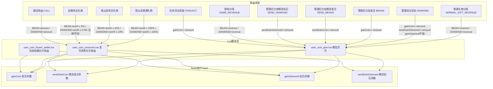
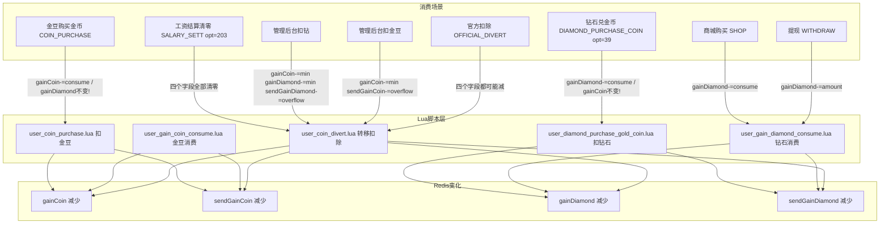
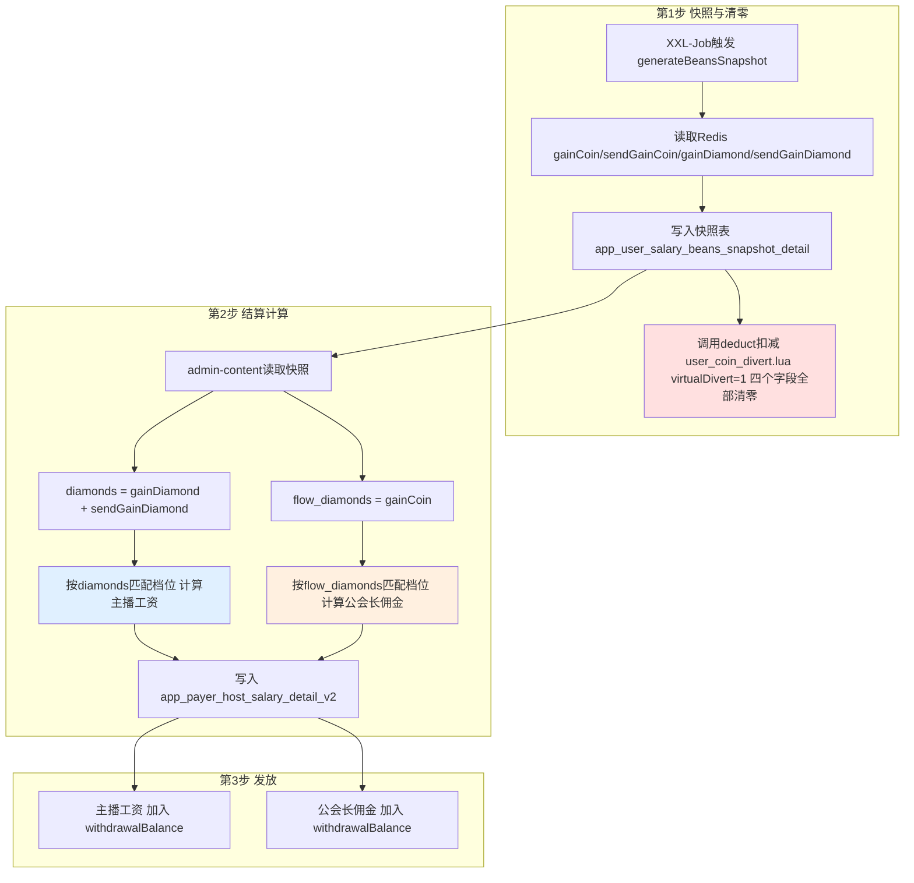
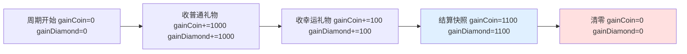
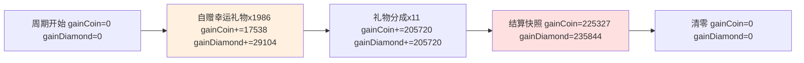
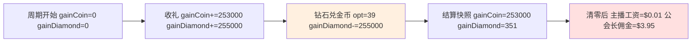

# 主播/公会长货币经济链路全景分析

> 生成时间：2026-05-09，基于代码和生产数据分析

## 一、货币字段总览

| Redis 字段 | DB 字段 | 含义 | 性质 | 薪资结算角色 |
|---|---|---|---|---|
| `gainCoin` | `gain_coin` | 收益金豆 | **余额**（可加可减） | → `flow_diamonds`：公会长佣金档位 |
| `sendGainCoin` | `send_gain_coin` | 赠送收益金豆 | **余额** | V2不参与计算，仅结算时清零（V1旧版合并到 `beans` 即 `flow_diamonds`） |
| `gainDiamond` | `gain_diamond` | 收益钻石 | **余额**（可加可减） | → `diamonds`：主播工资档位 |
| `sendGainDiamond` | `send_gain_diamond` | 赠送收益钻石 | **余额** | → `diamonds`：合并计算主播工资 |
| `coin` | `coin` | 充值金币 | 余额 | 不参与薪资 |
| `sendCoin` | `send_coin` | 赠送金币 | 余额 | 不参与薪资 |
| `totalGainCoin` | `total_gain_coin` | 历史累计金豆 | **只增不减** | 仅统计 |
| `totalGainDiamond` | `total_gain_diamond` | 历史累计钻石 | **只增不减** | 仅统计 |

> **重要**：`gainCoin` / `gainDiamond` 不是"只加不减的流水"，它们是**当前结算周期的余额**，工资结算时会被清零。真正的累计流水是 `totalGainCoin` / `totalGainDiamond`。

## 二、完整经济链路图

### 2.1 主播收益入账链路



### 2.2 主播消费扣减链路



### 2.3 工资结算完整链路



### 2.4 Lua脚本 x 货币字段变化矩阵

| Lua 脚本 | gainCoin | sendGainCoin | gainDiamond | sendGainDiamond | 触发场景 |
|---|---|---|---|---|---|
| `coin_give` | +giveBean | +giveSendBean | +giveDiamond | +giveSendDiamond | 收礼/管理奖励 |
| `coin_consume` | +giveBean(对方) | +giveSendBean(对方) | +giveDiamond(对方) | +giveSendDiamond(对方) | 金币消费送礼 |
| `frozen_settle` | +giveBean(对方) | — | +giveDiamond(对方) | — | 冻结结算 |
| `gain_coin_consume` | **-consume** | **-overflow** | — | — | 金豆消费 |
| `gain_diamond_consume` | — | — | **-consume** | **-overflow** | 钻石消费 |
| `coin_purchase` | **-consume** | **-overflow** | — | — | 金豆买金币 |
| `diamond_purchase` | — | — | **-consume** | **-overflow** | 钻石兑金币 opt=39 |
| `coin_divert` | **-minus** | **-minus** | **-minus** | **-minus** | 工资结算/官方扣除 |
| `frozen_settle_rollback` | -giveBean(对方) | — | -giveDiamond(对方) | — | 冻结结算回滚 |
| `coin_purchase_rollback` | +revert | — | — | — | 金豆购买回滚 |
| `diamond_purchase_rollback` | — | — | +revert | — | 钻石兑换回滚 |

### 2.5 管理后台操作对货币字段的影响

**加操作** (`determineAmounts`)：

| 后台操作类型 | gainCoin | sendGainCoin | gainDiamond | sendGainDiamond |
|---|---|---|---|---|
| COIN 加金币 | — | — | — | — |
| SEND_COIN 加赠送金币 | — | — | — | — |
| BEANS 加金豆 | **+amount** | — | — | — |
| SEND_BEANS 加赠送金豆 | — | **+amount** | — | — |
| DIAMOND 加钻石 | **+amount** | — | — | **+amount** |
| SEND_DIAMOND 加赠送钻石 | — | — | — | **+amount** |

> 注意：后台加钻(DIAMOND)增加的是 `gainCoin` + `sendGainDiamond`，**不增加 `gainDiamond`**！

**扣操作** (`determineAmountsMinus`)：

| 后台操作类型 | gainCoin | sendGainCoin | gainDiamond | sendGainDiamond |
|---|---|---|---|---|
| BEANS 扣金豆 | **-min(amt,bal)** | **-overflow** | — | — |
| DIAMOND 扣钻石 | **-min(amt,bal)** | — | **-min(amt,bal)** | **-overflow** |
| SEND_DIAMOND 扣赠送钻石 | **-min(amt,bal)** | — | — | **-amount** |

## 三、导致 gainDiamond 大于 gainCoin 的场景穷举

### 3.1 自赠幸运礼物（已确认，生产数据验证）

```
SelfGiveGiftProperties:
  luckyGiftCharmRatio:   0.05   gainCoin  += worth x 5%
  luckyGiftDiamondRatio: 0.099  gainDiamond += worth x 9.9%

差异倍率: 0.099 / 0.05 = 1.98 倍
```

**生产实例**（用户 1361507，自赠 Rose x 7，worth=350）：

| 字段 | 计算 | 实际入账 |
|---|---|---|
| gainCoin (BEAN) | 350 x 0.05 = 17.5 | 17（截断） |
| gainDiamond (DIAMOND) | 350 x 0.099 = 34.65 | 34（小数累积） |

本月 1986 笔自赠幸运礼物累积差异：gainDiamond 多 11,566

### 3.2 管理后台扣钻操作

后台有两种扣钻，区别在于是否影响 `gainDiamond`：

**扣普通钻石（DIAMOND）**— gainDiamond 会减：
```kotlin
ContentOfficialCoinType.DIAMOND -> ContentCoinBaseDto(
    gainCoin = minOf(amount, account.gainCoin),         // gainCoin 减
    gainDiamond = minOf(amount, account.gainDiamond),    // gainDiamond 减
    sendGainDiamond = amount - minOf(amount, account.gainDiamond) // 不够部分从 sendGainDiamond 扣
)
```

**扣免费钻石（SEND_DIAMOND）**— gainDiamond 不减：
```kotlin
ContentOfficialCoinType.SEND_DIAMOND -> ContentCoinBaseDto(
    gainCoin = minOf(amount, account.gainCoin),  // gainCoin 减
    sendGainDiamond = amount                     // 只扣 sendGainDiamond
)
```

因为免费钻石存在 `sendGainDiamond` 而非 `gainDiamond`，扣免费钻石时 `gainDiamond` 不变。
但两种操作都会减 `gainCoin`，所以扣免费钻石会导致 `gainCoin` 减而 `gainDiamond` 不减，可能造成 `gainDiamond > gainCoin`。

### 3.3 gainCoin 与钻石字段的同步设计

`gainCoin` 的设计意图是作为"收益总流水"，跟踪所有钻石相关收益的变化。大部分操作中 `gainCoin` 确实与 `gainDiamond + sendGainDiamond` 保持同步。

**增加操作 — gainCoin 是否与钻石同步：**

| 场景 | gainCoin | gainDiamond | sendGainDiamond | 是否同步 |
|---|---|---|---|---|
| 收普通礼物 | +worth | +worth | — | 同步，金额相等 |
| 收幸运礼物（他人送） | +worth x 10% | +worth x 10% | — | 同步，金额相等 |
| **收幸运礼物（自赠）** | **+worth x 5%** | **+worth x 9.9%** | — | **不同步！比例不同** |
| 礼物分成 | +revenue | +revenue | — | 同步 |
| 后台加钻 DIAMOND | +amount | — | +amount | 同步（钻石加到sendGainDiamond） |
| 后台加金豆 BEANS | +amount | — | — | 仅gainCoin，无钻石变化 |
| 通话/游戏收益 | +amount | +amount | — | 同步 |

**减少操作 — gainCoin 是否与钻石同步：**

| 场景 | gainCoin | gainDiamond | sendGainDiamond | 是否同步 |
|---|---|---|---|---|
| 后台扣钻 DIAMOND | -min | -min | -overflow | 同步 |
| 后台扣免费钻石 SEND_DIAMOND | -min | — | -amount | 同步（对sendGainDiamond） |
| 工资结算 | -ALL | -ALL | -ALL | 同步，全部清零 |
| **钻石兑金币 opt=39** | **不变** | **-consume** | — | **不同步！** |
| **钻石消费（商城等）** | **不变** | **-consume** | — | **不同步！** |
| 金豆消费 | -consume | — | — | 仅gainCoin |

**设计规律总结：**

- **收益类操作**（收礼、分成、管理奖励）：gainCoin 与钻石字段同步变化
- **消费类操作**（兑金币、商城购买）：只减对应货币余额，gainCoin 不变
- **管理修正操作**（后台扣钻）：gainCoin 同步减少（对称撤销之前的加操作）

所以正常情况下 `gainCoin >= gainDiamond + sendGainDiamond`，因为钻石被消费时只减钻石不减金豆。**唯一能打破这个规律让 gainDiamond 反超的，就是自赠幸运礼物的差异化比例。**

### 3.4 场景汇总表

| 场景 | gainCoin 变化 | gainDiamond 变化 | 是否导致 Diamond 大于 Coin |
|---|---|---|---|
| 收普通礼物 | +worth | +worth | 否，相等 |
| 收幸运礼物（他人送） | +worth x 10% | +worth x 10% | 否，相等 |
| **收幸运礼物（自赠）** | **+worth x 5%** | **+worth x 9.9%** | **是！钻石约2倍** |
| 普通礼物分成 | +revenue | +revenue | 否，相等 |
| 管理后台加钻 | +amount | 不变(加sendGainDiamond) | 否，反而 Coin 更大 |
| 管理后台加金豆 | +amount | 不变 | 否 |
| 钻石兑金币 opt=39 | 不变 | -consume | 否，反而让 Coin 更大 |
| 金豆购买金币 | -consume | 不变 | 可能，但场景少 |
| 工资结算 opt=203 | -ALL清零 | -ALL清零 | 清零后重新累积 |
| 通话收益 | +amount | +amount | 否，相等 |
| 游戏分成 | +revenue | +revenue | 否，相等 |

## 四、对薪资结算的影响

### 4.1 公会长佣金 vs 主播工资的输入字段

```kotlin
// ContentSalaryCalculationV2ServiceImpl.kt:139-141
val diamonds = snapshot.gainDiamond + snapshot.sendGainDiamond  // 主播工资
val coinDiamonds = snapshot.gainCoin                            // 公会长佣金
```

### 4.2 钻石兑金币导致的薪资失衡实例

**用户 1361507，上一周期（4/16 - 4/30）流水：**

| 操作 | gainCoin | gainDiamond |
|---|---|---|
| 幸运礼物收入 opt=5 | +15,696 | +17,410 |
| 普通礼物分成 opt=403 | +237,600 | +237,600 |
| **钻石兑金币 opt=39** | **不变** | **-255,000** |
| **结算前快照值** | **约253,296** | **约10** |

**结算记录（ID=3706）：**

| 字段 | 值 | 说明 |
|---|---|---|
| diamonds (gainDiamond) | 351 | 主播工资 = $0.01 |
| flow_diamonds (gainCoin) | 253,681 | 公会长佣金 = $3.95 |

主播把钻石兑换成金币继续循环送礼，导致 gainDiamond 被消费殆尽，但 gainCoin 完好无损。

### 4.3 当前周期（自赠导致 Diamond 大于 Coin）

| 字段 | 值 | 结算时角色 |
|---|---|---|
| gainCoin | 225,327 | flow_diamonds 公会长佣金 |
| gainDiamond | 235,844 | diamonds 主播工资 |

如果现在结算，主播工资档位会按 235,844 匹配（更高），公会长佣金按 225,327 匹配（更低）。

## 五、完整时间线示例

### 正常主播的一个结算周期



### 自赠主播的一个结算周期（gainDiamond 大于 gainCoin）



### 钻石兑金币主播的一个结算周期（gainCoin 远大于 gainDiamond）



## 六、结论

### 这是业务设计问题，不是代码 Bug

`gainDiamond > gainCoin` 的**唯一常规来源**是 `SelfGiveGiftProperties` 中自赠幸运礼物的差异化比例：

```yaml
# 当前生产配置
luckyGiftCharmRatio:   0.05   # 金豆 5%
luckyGiftDiamondRatio: 0.099  # 钻石 9.9%（金豆的 1.98 倍）
```

### 建议

如果业务预期 `gainCoin >= gainDiamond` 恒成立，有两个修复方向：

1. **统一自赠比例**：将 `luckyGiftDiamondRatio` 调整为小于或等于 `luckyGiftCharmRatio`
2. **解耦流水和余额**：让 `flow_diamonds`（公会长佣金）和 `diamonds`（主播工资）使用独立的只增不减累计字段，而不是用余额字段
