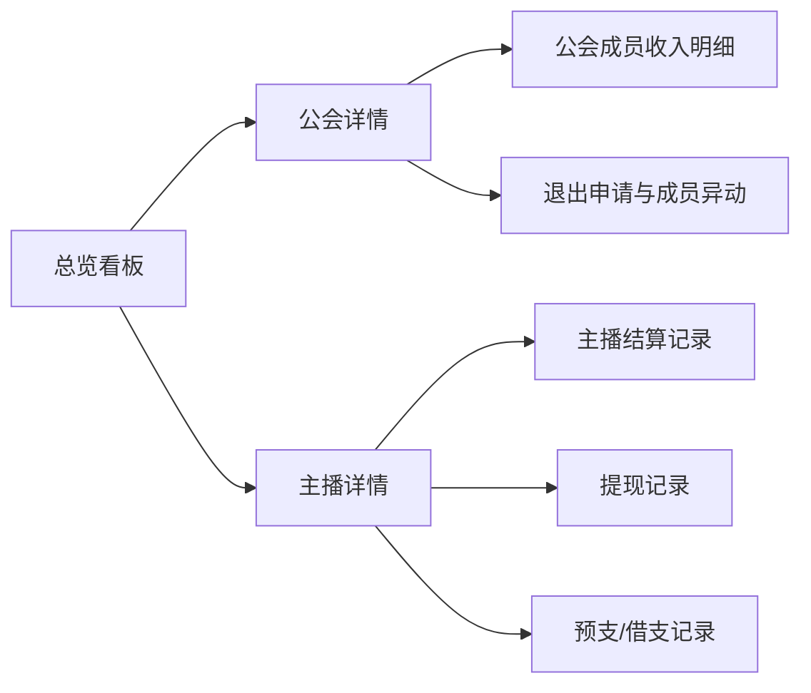

# 公会后台产品 PRD

## 1. 文档信息

| 项目 | 内容 |
| --- | --- |
| 文档名称 | 公会后台产品 PRD |
| 版本 | v1.0 |
| 输出形式 | Markdown |
| 需求来源 | `/Users/xinyintiaodong/Downloads/公会.pdf` + 用户补充截图 |
| 目标读者 | 产品、设计、后端、前端、测试、运营、财务 |

## 2. 项目背景

当前公会业务已从原“家族”体系切换为“公会”体系，业务重点覆盖以下几类场景：

1. 公会成员加入、退出、公会内角色管理。
2. 主播与公会长在双周政策/自由政策下的工资结算、TG 奖励结算。
3. 钱包、提现、预支、借支等财务链路。
4. 运营后台对主播、公会、薪资、提现、退出风险、健康度的统一查询与管理。

现阶段的主要问题：

1. 后台薪资详情页字段口径不清，例如“本期总钻石”“本期剩余钻石”容易被误解为流水或累计值。
2. 查询维度不完整，无法高效按公会、公会长、主播、政策、结算周期等维度快速筛查。
3. 缺少一套面向运营/财务的后台数据看板，难以直观看到公会经营情况、主播收入情况与异常情况。

本 PRD 目标是将 PDF 需求整理为结构化产品文档，并补全一套可执行的后台数据看板方案。

## 3. 产品目标

### 3.1 业务目标

1. 让运营可快速查询任意公会、主播在任意结算周期内的核心收入数据。
2. 让财务可准确核对工资、TG 奖励、提现、预支、借支、余额等财务数据。
3. 让管理者可通过总览看板识别高收入公会、高风险主播、退出异常、提现异常等重点对象。

### 3.2 产品目标

1. 统一后台数据口径，区分“流水”“余额”“已结算”“未结算”“可提现”。
2. 统一结算周期查询体验，支持按自然时间与按结算周期双维度查看。
3. 提供“总览 -> 公会详情 -> 主播详情 -> 明细记录”的下钻路径。

### 3.3 非目标

1. 本期不重新设计双周政策梯度表、TG 奖励梯度表本身。
2. 本期不改动 App 端整体交互，仅在 PRD 中同步后台支持要求。
3. 本期不设计新的财务提现渠道规则，仅承接现有渠道。

## 4. 角色定义

| 角色 | 说明 |
| --- | --- |
| 超级管理员 | 可查看全部公会、主播、财务和风控数据 |
| 运营 | 可查看公会、主播、退出申请、预支借支、健康度等数据 |
| 财务 | 可查看结算、钱包、提现、预支借支、账变明细 |
| 公会长 | App 端角色；后台主要作为查询对象 |
| 公会管理员 | App 端角色；后台主要作为查询对象 |
| 主播/公会成员 | App 端角色；后台主要作为查询对象 |

## 5. 核心业务口径

### 5.1 基础口径

| 指标 | 定义 |
| --- | --- |
| 钻石流水 | 当前筛选周期内，通过礼物获得并纳入结算口径的钻石累计值 |
| 钻石余额 | 当前时点或周期边界时点，账号内可纳入公会结算口径的钻石余额 |
| 起始钻石余额 | 所筛选时间范围起点的钻石余额 |
| 最终钻石余额 | 所筛选时间范围终点的钻石余额 |
| 钻石变化 | `最终钻石余额 - 起始钻石余额` |
| 主播工资 | 按主播结算政策与后台薪资梯度/公式计算出的工资 |
| TG 奖励 | 按后台 TG 奖励配置计算出的奖励金额 |
| 总工资 | 主播工资 + TG 奖励 |
| 工资余额 | 当前周期总工资扣减预支/借支后，尚未提现的余额 |
| 可提现余额 | 已结算、可发起提现的余额 |
| 未结算余额 | 自由政策下尚未执行“结算”动作的工资余额 |

### 5.2 礼物换算口径

1. 普通礼物、礼物福袋：收礼方获得礼物价值 100% 的钻石与魅力值；送礼方获得 100% 财富值。
2. 幸运礼物：收礼方获得礼物价值 10% 的钻石与魅力值；送礼方获得 10% 财富值。
3. 自赠礼物场景存在特殊折算。
4. BD、公会长工资、TG 奖励结算使用的钻石流水，需以后台结算引擎口径为准；涉及自赠时，按需求文档中的“未按自赠比例折算的结算流水”统计。

### 5.3 结算政策

#### 双周政策

1. 每月 16 日结算当月 1-15 日。
2. 每月 1 日结算上月 16 日至自然月最后一天。
3. 主播工资按钻石余额和后台梯度档位结算。
4. TG 奖励、公会长工资按钻石流水和后台梯度档位结算。
5. 周期任务要求为每周期完成 `6 天 * 2 小时`；未完成则主播工资扣 30%，公会长对应部分同步扣减 30%。

#### 自由政策

1. 主播可随时结算。
2. 主播工资公式：`钻石余额 / 16026 * 75%`，结果保留两位小数并向下取整。
3. 结算金额不足 1 美元不可结算。
4. 提现最低金额为 10 美元。
5. 公会长工资与公会长奖励仍按双周规则结算。

### 5.4 退出与流转规则

需求文档中存在旧版退出规则和“更新版”退出规则。产品落地时应以“更新版主播退出逻辑”为准，并保留规则生效时间配置。

#### 更新版主播退出逻辑

1. 主播加入公会后有 72 小时保护期，保护期内可无责退出。
2. 保护期后申请自由身份赎回，需向公会长支付不少于当期钻石收入 15% 的金额，且最低 50000 钻石、最高 1000000 钻石，并需公会长同意。
3. 若公会长连续两次拒绝，或超过 48 小时未审核视为拒绝，则主播可一次性支付 `500000 钻石` 或 `上周期收钻数的 30%（上限 3000000 钻石）` 后直接退出。
4. 退出后需等待 72 小时才能加入其他公会。
5. 30 天内退出公会次数 >= 3 次，则 15 天内不可再加入其他公会。
6. 主播存在未归还预支金额时，不可申请退出公会。

### 5.5 钱包、提现、预支、借支

1. 双周政策页面展示可提现余额。
2. 自由政策页面展示未结算余额、结算按钮、可提现余额和提现按钮。
3. 普通政策公会成员均可预支，仅公会长可借支。
4. 预支上限为“当期未结算工资 + 当期 TG 奖励”。
5. 借支额度由后台配置。
6. 预支、借支发生后，结算时按“应发工资 + 奖励 - 已预支 - 已借支”计算实发工资。

### 5.6 健康度

1. 健康度按月统计。
2. 后台需同时展示“健康度等级”和“构成健康度的原始指标值”。
3. 由于 PDF 截图未完整给出各指标定义，后台需按既有规则引擎输出最终等级及明细项。

## 6. 产品范围

### 6.1 本期范围

1. 整理完整 PRD。
2. 重构后台“公会/主播薪资详情页”字段与筛选逻辑。
3. 新增后台数据看板信息架构。
4. 支持按公会、主播、周期、政策、财务状态、退出状态等多维查询。

### 6.2 不在本期范围

1. App 端完整 UI 重绘。
2. 新结算公式设计。
3. 新提现渠道接入。

## 7. 后台信息架构

建议后台以一级导航组织为以下 8 个模块：

1. 总览看板
2. 公会看板
3. 主播看板
4. 结算与薪资
5. 钱包与提现
6. 预支与借支
7. 退出与审核
8. 健康度与风控

建议下钻链路：

## 8. 后台数据看板方案

## 8.1 总览看板

### 8.1.1 使用目标

给运营、财务、管理层一个“本周期/今日/本月”的经营总览，第一眼看到收入、活跃、公会增长、提现和风险。

### 8.1.2 顶部筛选条件

| 条件 | 说明 |
| --- | --- |
| 时间范围 | 支持自然时间、自定义区间、结算周期 |
| 快捷时间 | 今天、本周、上周、本周期、上一周期 |
| 大区 | 例如中东区、印度区，替代原按国家筛选 |
| 公会 ID / 公会名 | 精准查询 |
| 公会长 ID / 昵称 | 精准查询 |
| 主播 ID / 昵称 | 精准查询 |
| 政策 | 双周政策、自由政策 |
| 成员状态 | 在会、退出中、已退出、被踢出、封禁 |
| 健康度 | Healthy、Fine、Not Fine |

### 8.1.3 核心总览卡片

| 卡片 | 口径 |
| --- | --- |
| 公会数 | 当前筛选范围内有数据的公会数量 |
| 主播数 | 当前筛选范围内有数据的主播数量 |
| 活跃主播数 | 当前筛选周期内有开播或收入的主播数量 |
| 钻石流水总额 | 当前筛选范围内的结算口径钻石流水总和 |
| 钻石净变化 | 所有查询对象的钻石变化之和 |
| 主播工资总额 | 当前筛选周期内主播工资合计 |
| TG 奖励总额 | 当前筛选周期内 TG 奖励合计 |
| 公会长工资总额 | 当前筛选周期内公会长工资合计 |
| 可提现余额总额 | 当前筛选时点所有对象可提现余额合计 |
| 预支未还总额 | 当前时点未归还预支金额合计 |
| 借支未还总额 | 当前时点未归还借支金额合计 |
| 退出申请数 | 当前筛选范围内退出申请数量 |

### 8.1.4 图表区

1. 收入趋势图：按天/周期展示主播工资、TG 奖励、公会长工资趋势。
2. 公会排名图：按钻石流水、主播工资、公会长收入排序 Top 10。
3. 主播排名图：按钻石流水、总工资、提现额排序 Top 10。
4. 提现方式分布图：Coins / Cash / 转公会长 / 其他方式占比。
5. 异常概览图：退出异常、提现失败、负工资余额、健康度异常数量。

## 8.2 公会看板

### 8.2.1 目标

聚焦“一个公会经营得怎么样”，方便运营判断公会质量和风险。

### 8.2.2 公会列表字段

| 字段 | 说明 |
| --- | --- |
| 公会 ID | 支持复制 |
| 公会名称 | 支持跳转详情 |
| 公会长 ID / 昵称 | 支持跳转主播详情 |
| 大区 | 中东区、印度区等 |
| 成员数 | 当前在会成员数 |
| 主播数 | 当前在会主播数 |
| 管理员数 | 当前管理员数 |
| 当前周期钻石流水 | 公会成员流水合计 |
| 起始钻石余额 | 周期起点余额合计 |
| 最终钻石余额 | 周期终点余额合计 |
| 钻石变化 | `最终 - 起始` |
| 当前周期主播工资 | 公会成员主播工资合计 |
| 当前周期 TG 奖励 | 公会成员 TG 奖励合计 |
| 当前周期公会长工资 | 公会长工资 + 公会长 TG 奖励 |
| 当前周期总工资 | 公会所有工资合计 |
| 公会总预支未还 | 当前未归还预支 |
| 公会长借支未还 | 当前未归还借支 |
| 当前可提现余额 | 公会长及成员可提现余额合计，默认只读汇总 |
| 本周期新增成员 | 新加入人数 |
| 本周期退出成员 | 退出人数 |
| 健康度异常人数 | Fine + Not Fine 数量 |

### 8.2.3 公会详情页模块

1. 公会基础信息：公会 ID、名称、大区、公会长信息、创建时间、成员数、主播数、管理员数。
2. 当前周期经营卡片：流水、余额、工资、TG、提现、预支、借支、退出人数。
3. 成员结构图：按政策、角色、健康度、状态分布。
4. 收入趋势图：按天或按周期看流水/工资变化。
5. 成员收入明细表：支持进一步下钻到主播详情。
6. 成员异动记录：加入、退出、被踢、管理员任命/取消。

## 8.3 主播看板

### 8.3.1 目标

聚焦“一个主播赚了多少、结了多少、提了多少、是否有风险”。

### 8.3.2 主播列表字段

| 字段 | 说明 |
| --- | --- |
| 主播 ID | 支持复制 |
| 昵称 | 支持跳转详情 |
| 头像 | 缩略图 |
| 公会 ID / 公会名 | 当前所属公会 |
| 公会长 ID | 当前所属公会长 |
| 角色 | 公会长 / 管理员 / 普通成员 |
| 结算政策 | 双周 / 自由 |
| 大区 | 所属业务区 |
| 起始钻石余额 | 周期起点 |
| 最终钻石余额 | 周期终点 |
| 钻石变化 | `最终 - 起始` |
| 钻石流水 | 周期累计 |
| 主播工资 | 当前周期 |
| TG 奖励 | 当前周期 |
| 总工资 | 工资 + TG |
| 已预支金额 | 当前周期或当前未归还，支持切换口径 |
| 已借支金额 | 公会长适用 |
| 工资余额 | 当前周期实时余额 |
| 可提现余额 | 当前时点 |
| 本周期任务达成 | 达成 / 未达成 |
| 健康度 | Healthy / Fine / Not Fine |
| 成员状态 | 在会 / 退出中 / 已退出 / 封禁 |
| 近 30 天退出次数 | 风险字段 |

### 8.3.3 主播详情页模块

1. 基础信息：主播 ID、昵称、头像、设备关联风险标识、所属公会、所属大区、政策、角色。
2. 当前周期收入卡片：钻石流水、起始/最终余额、工资、TG、总工资、可提现余额。
3. 趋势图：按日展示收钻、工资、提现、预支变化。
4. 结算记录：每次结算时间、政策、结算金额、扣减项、到账金额。
5. 提现记录：提现方式、提现金额、状态、手续费、到账账户。
6. 预支/借支记录：时间、金额、操作人、借款人、归还情况。
7. 公会流转记录：加入、退出、回归、冷静期、审批结果。
8. 健康度与风控：封禁次数、小号数量、异常提现、异常退出等。

## 8.4 结算与薪资看板

### 8.4.1 目标

对“工资怎么算、差额在哪里、为什么和上次不同”给出明确解释。

### 8.4.2 页面结构

建议拆为三个 Tab：

1. 主播薪资明细
2. 公会薪资汇总
3. 结算异常

### 8.4.3 公会/主播薪资详情页字段调整

该部分为对用户截图需求的正式化与优化。

#### 一、时间筛选优化

1. 新增快捷时间：今天、本周、上周、本周期、上一周期。
2. 默认时间段为“当前结算周期”。
3. 日期选择器支持到秒，结束时间默认补到 `23:59:59`。
4. 当用户切换“本周期/上一周期”时，页面标题右侧展示周期标签，例如：
   - `2026-03 第1周期（03-01 00:00:00 ~ 03-15 23:59:59）`
   - `2026-03 第2周期（03-16 00:00:00 ~ 03-31 23:59:59）`

#### 二、筛选条件优化

在原有筛选条件基础上，新增或调整以下条件：

| 条件 | 调整内容 |
| --- | --- |
| 公会长 ID | 新增精确搜索输入框 |
| 公会 ID | 新增精确搜索输入框 |
| 公会名 | 支持模糊搜索 |
| 主播 ID / 昵称 | 支持精确或模糊搜索 |
| 政策 | 双周 / 自由 |
| 大区 | 原按国家筛选改为按业务大区筛选，如中东区、印度区 |
| 成员状态 | 在会、退出中、已退出、封禁 |
| 健康度 | Healthy、Fine、Not Fine |
| 是否有预支/借支 | 是 / 否 |

#### 三、顶部汇总区优化

页面列表上方新增汇总指标，展示当前查询结果的整体规模：

| 汇总指标 | 说明 |
| --- | --- |
| 主播总数 | 当前筛选结果中的主播数量 |
| 公会总数 | 当前筛选结果中的公会数量 |
| 钻石流水总额 | 当前结果的钻石流水合计 |
| 钻石净变化 | 当前结果的钻石变化合计 |
| 主播工资总额 | 当前结果的主播工资合计 |
| TG 奖励总额 | 当前结果的 TG 奖励合计 |
| 总工资金额 | 当前结果总工资合计 |
| 预支金额总额 | 当前结果已预支金额合计 |
| 可提现余额总额 | 当前结果可提现余额合计 |

#### 四、列表字段标准化

截图中的字段调整建议正式落地如下：

1. 将“本期总钻石”改为“起始钻石余额”。
2. 将“本期剩余钻石”改为“最终钻石余额”。
3. 新增“钻石变化”字段，公式为 `最终钻石余额 - 起始钻石余额`。
4. 明确区分“钻石流水”和“钻石余额”，避免将累计收入与时点余额混淆。

建议最终字段顺序如下：

| 字段 | 说明 |
| --- | --- |
| 序号 | 默认按钻石流水或总工资排序 |
| 主播 ID | 支持复制 |
| 昵称 | 支持跳转主播详情 |
| 头像 | 缩略图 |
| 公会 ID | 支持复制 |
| 公会名称 | 支持跳转公会详情 |
| 公会长 ID | 支持跳转主播详情 |
| 政策 | 双周 / 自由 |
| 大区 | 业务大区 |
| 起始钻石余额 | 所选时间起点余额 |
| 最终钻石余额 | 所选时间终点余额 |
| 钻石变化 | `最终 - 起始` |
| 钻石流水 | 周期累计 |
| 主播工资（USD） | 周期工资 |
| TG 奖励（USD） | 周期奖励 |
| 总工资（USD） | 工资 + TG |
| 已预支金额（USD） | 当前周期或未归还金额 |
| 已借支金额（USD） | 仅公会长适用 |
| 工资余额（USD） | 实时余额 |
| 可提现余额（USD） | 已结算可提现金额 |
| 任务完成状态 | 达成 / 未达成 |
| 健康度 | Healthy / Fine / Not Fine |
| 成员状态 | 在会 / 退出中 / 已退出 / 封禁 |
| 更新时间 | 本行数据最后更新时间 |

#### 五、排序与导出

1. 默认按“钻石流水 DESC”排序。
2. 支持按“总工资、主播工资、TG 奖励、钻石变化、可提现余额”排序。
3. 导出字段与列表字段保持一致。
4. 导出文件名包含时间范围与筛选条件摘要。

#### 六、异常提示

列表中出现以下情况时需显式标红或打标签：

1. 起始余额 > 最终余额且无结算/提现记录。
2. 有收入但总工资为 0。
3. 有预支未归还且仍处于可退出状态。
4. 30 天退出次数 >= 3。
5. 健康度为 Not Fine。

## 8.5 钱包与提现看板

### 8.5.1 目标

让财务快速核对“谁可以提、提了多少、提到哪里、是否成功、是否异常”。

### 8.5.2 列表字段

| 字段 | 说明 |
| --- | --- |
| 记录时间 | 精确到秒 |
| 用户 ID / 昵称 | 提现发起人 |
| 公会 ID / 公会名 | 归属公会 |
| 提现类型 | Coins / Cash / 转公会长 / 预支到他人 |
| 提现渠道 | Payoneer / USDT / Bank / Vodafone / Sham cash 等 |
| 提现金额（USD） | 本次提现金额 |
| 手续费（USD） | 按渠道规则展示 |
| 到账金额（USD） | 实际到账金额 |
| 收款账户信息 | 脱敏展示 |
| 状态 | 处理中 / 成功 / 失败 / 驳回 |
| 操作来源 | App / 后台 |

### 8.5.3 顶部指标

1. 今日提现金额
2. 本周期提现金额
3. 提现成功率
4. 提现失败笔数
5. 转公会长金额
6. Coins 兑换金额

## 8.6 预支与借支看板

### 8.6.1 目标

给运营和财务一个清晰的欠款视图，避免出现“已预支未归还但继续退出/提现”的问题。

### 8.6.2 列表字段

| 字段 | 说明 |
| --- | --- |
| 时间 | 记录时间 |
| 类型 | 预支 / 借支 |
| 发起人 | 操作人 |
| 借款人 | 主播或公会长 |
| 公会 ID | 所属公会 |
| 金额（USD） | 本次金额 |
| 已归还金额（USD） | 累计归还 |
| 未归还金额（USD） | 剩余欠款 |
| 当前周期应发工资（USD） | 用于校验可预支额度 |
| 状态 | 未结清 / 已结清 |
| 备注 | 后台操作备注 |

### 8.6.3 预警规则

1. 未归还预支 > 当前周期应发工资。
2. 公会长借支额度接近上限。
3. 有未归还预支但发起退出申请。
4. 连续多个周期未还清借支。

## 8.7 退出与审核看板

### 8.7.1 目标

让运营快速识别退出原因、赔付金额、审批节点和高频跳会主播。

### 8.7.2 列表字段

| 字段 | 说明 |
| --- | --- |
| 申请时间 | 提交时间 |
| 主播 ID / 昵称 | 申请人 |
| 当前公会 ID / 名称 | 当前所属公会 |
| 公会长 ID | 当前公会长 |
| 入会时长 | 自动计算 |
| 退出规则类型 | 保护期退出 / 15% 赎回 / 二次拒绝强退 |
| 应赔付钻石 | 按规则计算 |
| 当前钻石余额 | 用于判断是否可退出 |
| 是否有未归还预支 | 是 / 否 |
| 公会长审批状态 | 待审 / 同意 / 拒绝 / 超时拒绝 |
| 当前状态 | 待处理 / 已通过 / 已驳回 / 已退出 |
| 近 30 天退出次数 | 风险字段 |
| 备注 | 退出原因、运营说明 |

### 8.7.3 看板重点

1. 退出申请趋势。
2. 高频跳会主播 Top N。
3. 被拒两次后强退主播列表。
4. 有未归还预支但申请退出的异常列表。

## 8.8 健康度与风控看板

### 8.8.1 目标

让运营在后台集中识别风险成员，辅助公会管理和主播治理。

### 8.8.2 列表字段

| 字段 | 说明 |
| --- | --- |
| 主播 ID / 昵称 | 查询对象 |
| 公会 ID / 公会名 | 当前所属公会 |
| 政策 | 双周 / 自由 |
| 健康度等级 | Healthy / Fine / Not Fine |
| 指标 1 | 由规则引擎输出 |
| 指标 2 | 由规则引擎输出 |
| 指标 3 | 由规则引擎输出 |
| 指标 4 | 若该政策适用则展示 |
| 封禁次数 | 月维度 |
| 同设备账号数 | 风险字段 |
| 近 30 天退出次数 | 风险字段 |
| 备注 | 运营处理说明 |

## 9. 数据口径与技术要求

### 9.1 页面口径约束

1. 所有页面需显式展示“数据更新时间”。
2. 所有金额字段统一展示币种单位：
   - 钻石相关字段：`钻石`
   - 工资/TG/提现/预支/借支：`USD`
   - Coins 兑换结果：`Coins`
3. 所有聚合页默认展示“当前筛选范围汇总”，点击明细后展示“单对象数据”。
4. 所有实时字段与结算字段需明确区分：
   - 实时字段：余额、可提现余额、未归还预支、未归还借支
   - 结算字段：工资、TG、周期流水、周期任务达成状态

### 9.2 数据刷新建议

| 数据类型 | 刷新频率 |
| --- | --- |
| 流水、余额、提现状态 | 5 分钟内增量刷新 |
| 周期汇总指标 | 每小时重算一次 |
| 结算结果 | 结算任务完成后刷新 |
| 健康度 | 每日凌晨批量更新，支持手动刷新 |

### 9.3 权限建议

| 页面 | 超管 | 运营 | 财务 |
| --- | --- | --- | --- |
| 总览看板 | 是 | 是 | 是 |
| 公会看板 | 是 | 是 | 只读 |
| 主播看板 | 是 | 是 | 只读 |
| 结算与薪资 | 是 | 是 | 是 |
| 钱包与提现 | 是 | 只读 | 是 |
| 预支与借支 | 是 | 是 | 是 |
| 退出与审核 | 是 | 是 | 否 |
| 健康度与风控 | 是 | 是 | 否 |

## 10. 验收标准

### 10.1 查询体验

1. 默认打开薪资详情页时，时间筛选自动定位到当前结算周期。
2. 支持通过公会 ID、公会长 ID、主播 ID 精准查到对应数据。
3. 支持通过大区、政策、状态、健康度等条件组合筛选。

### 10.2 字段准确性

1. “起始钻石余额”“最终钻石余额”“钻石变化”在列表、导出、详情口径一致。
2. 主播工资、TG 奖励、总工资、工资余额、可提现余额字段口径一致。
3. 自由政策与双周政策字段在相同页面中可共存展示，但需通过政策字段明确区分。

### 10.3 下钻能力

1. 总览可跳公会详情与主播详情。
2. 公会详情可跳成员收入明细。
3. 主播详情可跳提现记录、预支记录、结算记录、退出记录。

### 10.4 异常可识别

1. 健康度异常、退出异常、财务异常均可通过标签或异常列表识别。
2. 导出数据中包含异常标识字段。

## 11. 风险与待确认项

1. PDF 中“双周政策工资梯度”“TG 奖励梯度”的具体配置未完整体现，实际开发需对接现有配置表。
2. 健康度 3 项/4 项指标的原始定义在 PDF 截图中未完整露出，需确认现网规则。
3. 旧版退出规则与更新版退出规则共存时，需要明确规则切换时间与历史数据回溯策略。
4. “钻石流水”在自赠场景下的统计口径必须与结算引擎保持一致，避免后台展示与实际结算不一致。

## 12. 结论

本期后台不应只做“字段微调”，而应升级为一套围绕“公会经营 + 主播收入 + 财务结算 + 风险治理”的后台数据体系。  
在实现上，建议优先落地以下顺序：

1. 优先改造“结算与薪资”页面字段与筛选。
2. 同步补齐“总览看板”与“公会/主播详情”下钻。
3. 最后补完“提现、预支借支、退出、健康度”四类专项看板。

