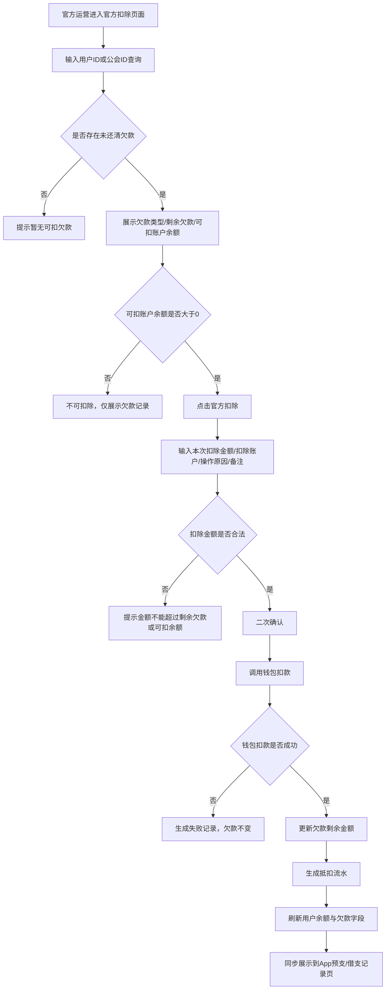
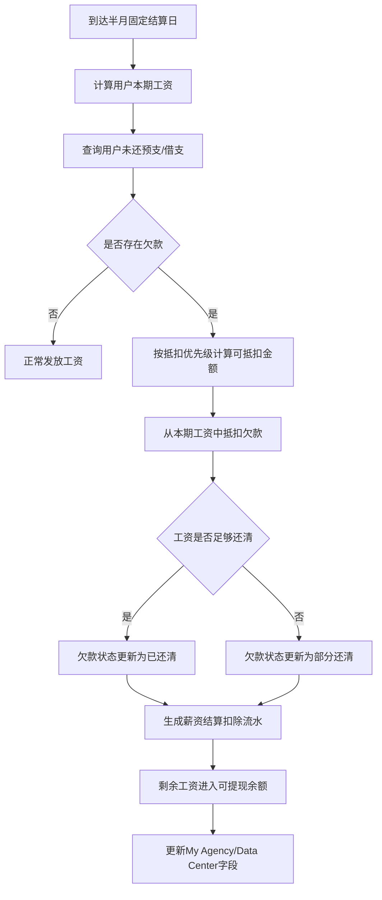
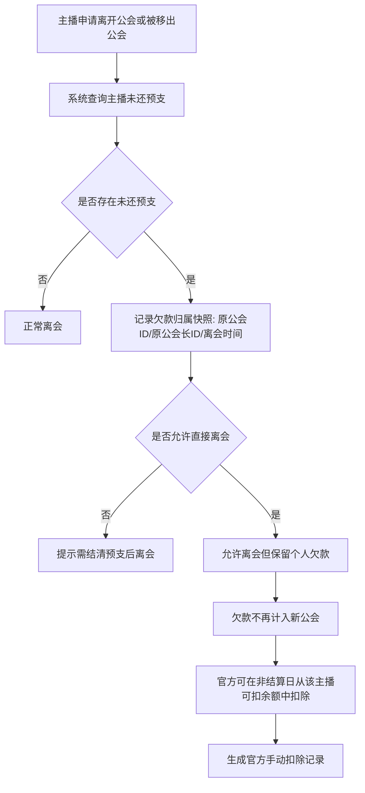

# 预支 / 借支欠款官方扣除功能 PRD

## 1. 文档信息

| 项目 | 内容 |
|---|---|
| 文档名称 | 预支 / 借支欠款官方扣除功能 PRD |
| 适用端 | App 端、管理后台、结算系统、钱包系统 |
| 涉及角色 | 官方运营、财务、公会长、主播 |
| 版本 | V1.0 |
| 核心目标 | 在固定半月结算日之外，支持官方主动扣除用户账户余额，用于抵扣未还清的预支 / 借支欠款，并形成完整可追溯记录 |

---

## 2. 背景说明

当前平台存在两类提前支取资金：

### 2.1 预支 Advance Salary

预支相当于用户提前预支自己的薪资。

- 支持对象：主播、公会长
- 资金来源：用户未来可结算薪资
- 还款方式：在半月结算周期内，优先使用用户薪资抵扣
- 典型场景：
  - 主播提前预支本周期工资
  - 公会长作为主播身份提前预支自己的主播工资
  - 公会长提前预支自己的公会长工资

### 2.2 借支 Loan / Borrowed Amount

借支相当于官方根据公会长信用关系、合作关系、历史表现等，给予公会长一定额度的借款。

- 支持对象：仅公会长
- 资金性质：官方借款，不等同于个人薪资预支
- 借支额度：由官方配置
- 可借支金额 = 公会长借支额度 - 当前未还借支金额
- 还款方式：优先在固定结算日通过公会长工资抵扣，也可由官方在非结算日手动扣除账户余额

---

## 3. 现有字段口径继承

本功能需要沿用现有 My Agency / Data Center 中的字段口径，并补充“官方扣除”场景。

### 3.1 公会层字段

| 字段 | 建议展示名 | 口径说明 |
|---|---|---|
| Agency total Salary | 公会总工资 | 主播工资 + 主播 TG + 公会长工资 + 公会长 TG |
| Agency Advance Salary | 公会预支欠款 | 公会长预支欠款 + 主播预支欠款 |
| Agent borrowed amount | 公会长借支欠款 | 仅统计公会长当前未还借支金额 |
| Agency total Salary Balance | 公会工资余额 | 公会总工资 - 公会预支欠款 - 公会长借支欠款 |
| Agent borrowable amount | 公会长可借支金额 | 公会长借支额度 - 公会长已借支欠款 |

### 3.2 主播层字段

| 字段 | 建议展示名 | 口径说明 |
|---|---|---|
| Host Salary | 主播工资 | 当前周期主播基础工资 |
| TG Reward | 主播 TG 奖励 | 当前周期主播 TG 奖励 |
| Host total Salary | 主播总工资 | 主播工资 + 主播 TG 奖励 |
| Host Advance Salary | 主播预支欠款 | 当前主播未抵扣的预支金额 |
| Salary balance | 主播工资余额 | 主播工资 + 主播 TG - 主播预支欠款 |

### 3.3 公会长个人层字段

| 字段 | 建议展示名 | 口径说明 |
|---|---|---|
| Agent total salary | 公会长总工资 | 公会长工资 + 公会长 TG + 公会长作为主播工资 + 作为主播 TG |
| Agent borrowed amount | 公会长借支欠款 | 公会长当前未还借支金额 |
| Agent as host Advance Salary | 公会长作为主播预支欠款 | 公会长以主播身份产生的未抵扣预支 |
| Agent Salary Balance | 公会长工资余额 | 公会长总工资 - 公会长借支欠款 - 公会长预支欠款 |
| Withdrawable balance | 可提现余额 | 往期已结算工资余额 + 往期已结算 TG 余额 + 其他可提现余额 |

---

## 4. 本次新增能力

### 4.1 新增功能名称

**官方余额扣除**

用于在非固定结算日，由官方从用户账户可扣余额中扣除金额，抵扣用户当前未还清的预支 / 借支欠款。

### 4.2 功能适用场景

| 场景 | 示例 | 是否支持官方扣除 |
|---|---|---|
| 主播未到结算日离开公会 | 主播已预支 100 美元，但离会后本期工资不足以抵扣 | 支持 |
| 公会长工资不足 | 公会长工资余额不足以还借支 / 预支 | 支持 |
| 主播被移出公会 | 被移出前存在未还预支 | 支持 |
| 公会解散 / 公会长更换 | 原公会长存在未还借支 | 支持 |
| 用户主动还款 | 用户账户余额充足，官方协助扣除 | 支持 |
| 风控追缴 | 平台识别异常预支或借支 | 支持，建议需要更高权限 |

---

## 5. 核心业务规则

### 5.1 欠款类型

| 类型 | code | 可产生对象 | 是否可官方扣除 |
|---|---|---|---|
| 预支 | advance | 主播、公会长 | 是 |
| 借支 | loan | 公会长 | 是 |

### 5.2 抵扣来源

| 抵扣来源 | code | 说明 |
|---|---|---|
| 薪资结算扣除 | payroll_settlement | 固定半月结算日，由系统用本期薪资自动抵扣 |
| 官方手动扣除 | official_manual | 非固定结算日，由官方后台操作扣除用户账户余额 |
| 系统自动追缴扣除 | auto_recovery | 可选能力，满足规则后由系统自动扣除可用余额 |
| 用户主动还款 | user_repayment | 可选能力，用户主动使用余额归还欠款 |

> V1.0 建议先做 `payroll_settlement` 和 `official_manual` 两种，其他类型预留。

### 5.3 抵扣账户范围

官方扣除时，建议从以下账户中扣除：

| 账户类型 | 是否建议纳入 | 说明 |
|---|---:|---|
| 可提现余额 Withdrawable balance | 是 | 优先扣除，属于用户可提现资产 |
| 已结算工资余额 | 是 | 可作为 Withdrawable balance 的组成部分 |
| 已结算 TG 余额 | 是 | 可作为 Withdrawable balance 的组成部分 |
| 未结算本期工资 | 否 | 应在固定结算日统一处理，不建议非结算日直接扣 |
| 钻石余额 Diamond Balance | 不建议直接扣 | 钻石与美元薪资存在换算关系，容易引发争议；如要支持需单独配置汇率与授权 |
| 充值金币余额 | 谨慎 | 用户充值资产与薪资欠款性质不同，建议 V1.0 不纳入，避免资金争议 |

### 5.4 扣除优先级

#### 5.4.1 用户同时存在预支和借支

建议默认抵扣顺序：

1. 借支 Loan
2. 公会长个人预支 Agent Advance
3. 公会长作为主播预支 Agent as Host Advance
4. 主播预支 Host Advance

原因：

- 借支是官方对公会长的信用借款，风险最高，应优先追回
- 预支是对未来薪资的提前领取，可按身份和归属分开抵扣
- 主播预支只影响主播个人，不应混入公会长借支记录

#### 5.4.2 单笔官方扣除金额不足以还清

允许部分抵扣。

示例：

- 用户欠款 100 美元
- 可扣余额 40 美元
- 官方扣除 40 美元
- 欠款剩余 60 美元
- 生成一条官方扣除记录，状态为“部分抵扣”

#### 5.4.3 单笔官方扣除金额超过欠款

不允许扣除超过欠款金额。

系统应限制：

```text
本次可扣金额 <= min(用户可扣余额, 用户当前欠款总额)
```

---

## 6. 字段设计

## 6.1 App 端字段展示

### 6.1.1 My Agency / Data Center 需要调整的字段

| 模块 | 字段 | 当前口径 | 新增说明 |
|---|---|---|---|
| Agency current salary | Agency total Salary Balance | 公会总工资 - 公会预支欠款 - 公会长借支欠款 | 扣除成功后实时刷新 |
| Agency current salary | Agency Advance Salary | 公会长预支欠款 + 主播预支欠款 | 官方扣除预支后减少 |
| Agency current salary | Agent borrowed amount | 公会长未还借支 | 官方扣除借支后减少 |
| Agency current salary | Agent borrowable amount | 借支额度 - 已借支欠款 | 借支还款后实时恢复可借额度 |
| Wallet | Withdrawable balance | 可提现余额 | 官方扣除后减少 |
| Streamer Details | Host Advance Salary | 主播未抵扣预支 | 主播被扣除余额后减少 |
| Streamer Details | Salary balance | 主播工资余额 | 预支欠款变化后实时刷新 |

### 6.1.2 新增展示字段

建议在预支 / 借支记录页增加以下字段。

#### A. 预支 / 借支金额表

| 字段 | 是否必填 | 说明 |
|---|---:|---|
| 时间 | 是 | 预支 / 借支发放时间 |
| 收款 ID | 是 | 收款用户 ID |
| 收款身份 | 是 | 主播 / 公会长 / 公会长作为主播 |
| 金额 | 是 | 美元金额 |
| 金币 / 钻石 | 否 | 如当前发放链路有金币或钻石折算则展示 |
| 类型 | 是 | 预支 / 借支 |
| 账单 ID | 是 | 原始发放流水 ID |
| 当前状态 | 是 | 未还清 / 部分还清 / 已还清 |
| 剩余欠款 | 是 | 当前仍未抵扣金额 |

#### B. 预支 / 借支抵扣表

| 字段 | 是否必填 | 说明 |
|---|---:|---|
| 扣除时间 | 是 | 抵扣发生时间 |
| 被扣用户 ID | 是 | 实际账户被扣除的用户 ID |
| 被扣用户身份 | 是 | 主播 / 公会长 / 公会长作为主播 |
| 抵扣金额 | 是 | 本次抵扣金额 |
| 欠款类型 | 是 | 预支 / 借支 |
| 抵扣来源 | 是 | 官方手动扣除 / 薪资结算扣除 |
| 扣除账户 | 是 | 可提现余额 / 结算工资余额 / TG 余额等 |
| 关联原账单 ID | 是 | 被抵扣的预支 / 借支发放单 |
| 抵扣流水 ID | 是 | 本次抵扣生成的唯一流水 |
| 抵扣前欠款 | 是 | 本次操作前该笔欠款剩余金额 |
| 抵扣后欠款 | 是 | 本次操作后该笔欠款剩余金额 |
| 抵扣前账户余额 | 是 | 本次操作前用户账户余额 |
| 抵扣后账户余额 | 是 | 本次操作后用户账户余额 |
| 操作人 | 官方后台必填 | 官方运营 / 财务账号 |
| 操作原因 | 官方后台必填 | 离会追缴 / 工资不足 / 风控追缴 / 用户主动还款 / 其他 |
| 备注 | 否 | 人工填写说明 |
| 状态 | 是 | 成功 / 失败 / 冲正 / 部分成功 |

---

## 7. 记录展示设计

### 7.1 主播身份

主播只展示自己的预支和预支抵扣。

#### Tab 结构

| Tab | 内容 |
|---|---|
| 全部 | 预支金额 + 预支抵扣 |
| 预支 | 主播预支发放记录 |
| 预支抵扣 | 主播预支被抵扣记录 |

#### 主播预支金额表

| 时间 | 收款 ID | 金额 | 金币 | 当前状态 | 剩余欠款 | 账单 ID |
|---|---|---:|---:|---|---:|---|
| 2026-05-10 12:30:00 | 5508457 | $100.00 | 1600 | 部分还清 | $60.00 | ADV-20260510-123000 |

#### 主播预支抵扣表

| 时间 | 金额 | 原因 | 扣除账户 | 抵扣前欠款 | 抵扣后欠款 | 账单 ID |
|---|---:|---|---|---:|---:|---|
| 2026-05-12 15:20:00 | $40.00 | 官方手动扣除 | 可提现余额 | $100.00 | $60.00 | AD-D-20260512-152000 |
| 2026-05-15 23:59:59 | $60.00 | 薪资结算扣除 | 本期工资 | $60.00 | $0.00 | AD-D-20260515-235959 |

---

### 7.2 公会长身份

公会长需要同时展示自己的预支、借支，以及抵扣记录。

#### Tab 结构

| Tab | 内容 |
|---|---|
| 全部 | 预支 / 借支金额 + 预支 / 借支抵扣 |
| 借支预支 | 发放记录 |
| 借支预支抵扣 | 抵扣记录 |

#### 公会长预支 / 借支金额表

| 时间 | 收款 ID | 金额 | 金币 | 类型 | 当前状态 | 剩余欠款 | 账单 ID |
|---|---|---:|---:|---|---|---:|---|
| 2026-05-08 11:00:00 | 8531008 | $500.00 | - | 借支 | 部分还清 | $300.00 | LOAN-20260508-110000 |
| 2026-05-10 18:00:00 | 8531008 | $100.00 | 1600 | 预支 | 已还清 | $0.00 | ADV-20260510-180000 |

#### 公会长预支 / 借支抵扣表

| 时间 | 金额 | 类型 | 原因 | 扣除账户 | 抵扣前欠款 | 抵扣后欠款 | 账单 ID |
|---|---:|---|---|---|---:|---:|---|
| 2026-05-12 14:02:51 | $200.00 | 借支 | 官方手动扣除 | 可提现余额 | $500.00 | $300.00 | LOAN-D-20260512-140251 |
| 2026-05-15 23:59:59 | $100.00 | 预支 | 薪资结算扣除 | 本期工资 | $100.00 | $0.00 | ADV-D-20260515-235959 |

---

## 8. 管理后台 PRD

### 8.1 菜单结构

建议新增或改造：

```text
财务管理
├── 预支 / 借支管理
│   ├── 预支记录
│   ├── 借支记录
│   ├── 抵扣记录
│   └── 官方扣除
├── 公会财务
│   ├── 公会工资
│   ├── 公会欠款
│   └── 公会长额度管理
└── 操作审计
    ├── 财务操作日志
    └── 异常扣除记录
```

---

### 8.2 官方扣除页面

#### 8.2.1 查询区

| 字段 | 类型 | 说明 |
|---|---|---|
| 用户 ID | 输入框 | 支持主播 / 公会长 ID 查询 |
| 公会 ID | 输入框 | 支持按公会查询欠款 |
| 用户身份 | 下拉 | 全部 / 主播 / 公会长 |
| 欠款类型 | 下拉 | 全部 / 预支 / 借支 |
| 欠款状态 | 下拉 | 未还清 / 部分还清 / 已还清 |
| 是否离会 | 下拉 | 全部 / 已离会 / 未离会 |
| 时间范围 | 日期选择 | 预支 / 借支发放时间 |
| 查询按钮 | 按钮 | 查询符合条件的欠款用户 |

#### 8.2.2 列表字段

| 字段 | 说明 |
|---|---|
| 用户 ID | 欠款用户 ID |
| 用户昵称 | 欠款用户昵称 |
| 用户身份 | 主播 / 公会长 / 公会长作为主播 |
| 公会 ID | 当前或欠款产生时所属公会 |
| 公会名称 | 当前或欠款产生时所属公会名称 |
| 公会长 ID | 公会负责人 |
| 欠款类型 | 预支 / 借支 |
| 原始金额 | 原始预支 / 借支金额 |
| 已抵扣金额 | 已还金额 |
| 剩余欠款 | 当前未还金额 |
| 可扣账户余额 | 当前可扣余额 |
| 本期预计工资 | 当前周期预计可结算工资 |
| 离会状态 | 未离会 / 已离会 |
| 欠款产生时间 | 原始发放时间 |
| 最近抵扣时间 | 最近一次抵扣时间 |
| 状态 | 未还清 / 部分还清 / 已还清 / 异常 |
| 操作 | 查看明细 / 官方扣除 |

---

### 8.3 官方扣除弹窗

#### 8.3.1 弹窗字段

| 字段 | 类型 | 说明 |
|---|---|---|
| 用户 ID | 只读 | 被扣用户 |
| 用户身份 | 只读 | 主播 / 公会长 |
| 欠款类型 | 只读或可选 | 预支 / 借支 |
| 剩余欠款 | 只读 | 当前待还金额 |
| 可扣账户余额 | 只读 | 当前可用于扣除的账户余额 |
| 本次最大可扣金额 | 只读 | min(剩余欠款, 可扣账户余额) |
| 本次扣除金额 | 输入框 | 不可大于最大可扣金额 |
| 扣除账户 | 下拉 | 可提现余额 / 已结算工资余额 / TG 余额 |
| 操作原因 | 下拉 | 主播离会 / 公会长工资不足 / 用户主动还款 / 风控追缴 / 其他 |
| 备注 | 文本框 | 必填或按原因控制 |
| 二次确认 | 弹窗 | 展示扣除前后金额变化 |

#### 8.3.2 二次确认文案

```text
确认从用户【{user_id}】的【{account_type}】中扣除【${deduct_amount}】吗？

扣除后：
- 账户余额：${before_balance} → ${after_balance}
- {debt_type} 欠款：${before_debt} → ${after_debt}

该操作将生成官方扣除流水，不可直接删除。
```

---

## 9. 状态流转

### 9.1 欠款单状态

| 状态 | code | 说明 |
|---|---|---|
| 未还清 | unpaid | 原始欠款尚未发生任何抵扣 |
| 部分还清 | partial_paid | 已抵扣一部分，仍存在剩余欠款 |
| 已还清 | paid | 剩余欠款为 0 |
| 冲正中 | reversing | 财务发起冲正或异常处理 |
| 已冲正 | reversed | 抵扣记录被冲正，欠款恢复 |
| 异常 | abnormal | 扣款失败、账务不平或人工标记 |

### 9.2 抵扣单状态

| 状态 | code | 说明 |
|---|---|---|
| 成功 | success | 扣款和欠款抵扣均成功 |
| 失败 | failed | 钱包扣款失败或账务处理失败 |
| 部分成功 | partial_success | 多笔欠款分摊时，部分欠款抵扣成功 |
| 已冲正 | reversed | 该抵扣流水被财务冲正 |
| 待复核 | pending_review | 高风险或大额扣除需复核 |

---

## 10. 核心流程图

### 10.1 官方手动扣除主流程



---

### 10.2 半月结算自动抵扣流程



---

### 10.3 主播离会后欠款处理流程



---

## 11. 数据表建议

### 11.1 预支 / 借支主表：finance_debt_order

| 字段名 | 类型 | 说明 |
|---|---|---|
| id | bigint | 主键 |
| debt_order_no | varchar | 欠款单号 |
| user_id | bigint | 欠款用户 ID |
| user_role | varchar | host / agent / agent_as_host |
| agency_id | bigint | 欠款产生时公会 ID |
| agent_id | bigint | 欠款产生时公会长 ID |
| debt_type | varchar | advance / loan |
| original_amount | decimal | 原始金额 |
| paid_amount | decimal | 已抵扣金额 |
| remaining_amount | decimal | 剩余欠款 |
| currency | varchar | USD |
| coin_amount | bigint | 金币数量，可为空 |
| source_bill_no | varchar | 预支 / 借支发放单号 |
| status | varchar | unpaid / partial_paid / paid / abnormal |
| issue_time | datetime | 发放时间 |
| due_settlement_cycle | varchar | 预计抵扣结算周期 |
| leave_agency_flag | tinyint | 是否已离会 |
| leave_time | datetime | 离会时间 |
| created_at | datetime | 创建时间 |
| updated_at | datetime | 更新时间 |

---

### 11.2 抵扣流水表：finance_debt_deduction_record

| 字段名 | 类型 | 说明 |
|---|---|---|
| id | bigint | 主键 |
| deduction_no | varchar | 抵扣流水号 |
| debt_order_no | varchar | 关联欠款单号 |
| user_id | bigint | 被扣用户 ID |
| user_role | varchar | host / agent / agent_as_host |
| agency_id | bigint | 欠款产生时公会 ID |
| agent_id | bigint | 欠款产生时公会长 ID |
| debt_type | varchar | advance / loan |
| deduction_source | varchar | official_manual / payroll_settlement |
| account_type | varchar | withdrawable_balance / salary_balance / tg_balance |
| deduction_amount | decimal | 本次抵扣金额 |
| before_debt_amount | decimal | 抵扣前欠款 |
| after_debt_amount | decimal | 抵扣后欠款 |
| before_account_balance | decimal | 抵扣前账户余额 |
| after_account_balance | decimal | 抵扣后账户余额 |
| wallet_transaction_no | varchar | 钱包扣款流水号 |
| operator_id | bigint | 后台操作人 ID |
| operator_name | varchar | 后台操作人名称 |
| operation_reason | varchar | 离会追缴 / 工资不足 / 风控追缴 / 用户主动还款 / 其他 |
| remark | varchar | 操作备注 |
| status | varchar | success / failed / reversed |
| fail_reason | varchar | 失败原因 |
| created_at | datetime | 创建时间 |

---

### 11.3 钱包流水表字段补充

官方扣除必须进入钱包流水，不能只在欠款流水中记录。

| 字段 | 说明 |
|---|---|
| wallet_transaction_no | 钱包流水号 |
| user_id | 被扣用户 |
| change_type | official_debt_deduction |
| change_amount | 负数金额 |
| before_balance | 扣除前余额 |
| after_balance | 扣除后余额 |
| related_deduction_no | 关联抵扣流水 |
| description | 官方扣除预支 / 借支欠款 |
| created_at | 创建时间 |

---

## 12. 抵扣金额计算规则

### 12.1 单笔欠款扣除

```text
可扣金额 = min(输入扣除金额, 剩余欠款, 可扣账户余额)
```

扣除成功后：

```text
抵扣后欠款 = 抵扣前欠款 - 本次扣除金额
抵扣后账户余额 = 抵扣前账户余额 - 本次扣除金额
```

### 12.2 多笔欠款自动分摊

如果官方选择“按优先级自动抵扣”，系统按以下顺序分摊：

```text
借支 > 公会长预支 > 公会长作为主播预支 > 主播预支
```

同类型多笔欠款：

```text
按发放时间从早到晚抵扣
```

### 12.3 示例

用户有以下欠款：

| 欠款单 | 类型 | 剩余欠款 |
|---|---|---:|
| LOAN-001 | 借支 | $300 |
| ADV-001 | 预支 | $100 |

用户可扣余额：$250

官方选择自动抵扣 $250：

| 抵扣对象 | 抵扣金额 | 抵扣后剩余 |
|---|---:|---:|
| LOAN-001 | $250 | $50 |
| ADV-001 | $0 | $100 |

生成 1 条或多条抵扣流水：

- 建议生成 1 条总扣款钱包流水
- 按欠款单生成多条抵扣明细
- 前端记录页可按欠款单展示，也可聚合展示

---

## 13. 权限与风控

### 13.1 后台权限

| 权限 | 说明 |
|---|---|
| 查看欠款 | 可查看预支 / 借支欠款 |
| 官方扣除 | 可执行官方余额扣除 |
| 大额扣除复核 | 超过阈值需要二次审批 |
| 冲正 | 可对错误扣除发起冲正 |
| 导出 | 可导出抵扣记录 |

### 13.2 建议风控规则

| 规则 | 建议 |
|---|---|
| 单笔扣除金额 > 500 美元 | 需要主管复核 |
| 单日同一用户扣除次数 > 3 次 | 触发风险提示 |
| 可扣余额不足 | 禁止提交 |
| 用户存在提现中订单 | 扣除前冻结或重新计算可扣余额 |
| 用户已注销 / 封禁 | 仅允许财务高级权限操作 |
| 公会长变更 | 欠款归属于产生时的用户，不因公会变更转移 |
| 主播离会 | 欠款仍归属主播个人，不计入新公会欠款 |

---

## 14. 异常场景

| 场景 | 系统处理 |
|---|---|
| 钱包扣款成功，但欠款更新失败 | 标记异常，进入补偿队列，禁止重复扣款 |
| 欠款更新成功，但记录生成失败 | 标记异常，补写抵扣流水 |
| 后台重复点击扣除 | 使用 deduction_no 幂等，禁止重复执行 |
| 扣除后用户投诉 | 可通过抵扣流水、钱包流水、操作日志追溯 |
| 误扣 | 走冲正流程，恢复账户余额和欠款金额 |
| 欠款已被结算任务抵扣 | 官方扣除提交时重新校验剩余欠款 |
| 用户余额发生变化 | 提交前实时校验最新余额 |
| 多管理员同时扣除 | 对欠款单加锁，串行处理 |

---

## 15. 冲正流程

### 15.1 适用场景

- 官方误操作
- 金额输入错误
- 用户身份或欠款类型选择错误
- 财务复核判定需要撤销

### 15.2 冲正规则

冲正不是删除记录，而是生成反向流水。

```text
账户余额 + 已扣金额
欠款剩余金额 + 已冲正金额
原抵扣流水状态 = 已冲正
新增冲正流水 = 成功
```

### 15.3 冲正记录字段

| 字段 | 说明 |
|---|---|
| reverse_no | 冲正流水号 |
| original_deduction_no | 原抵扣流水号 |
| reverse_amount | 冲正金额 |
| before_debt_amount | 冲正前欠款 |
| after_debt_amount | 冲正后欠款 |
| before_account_balance | 冲正前账户余额 |
| after_account_balance | 冲正后账户余额 |
| operator_id | 操作人 |
| reverse_reason | 冲正原因 |
| created_at | 冲正时间 |

---

## 16. 前端交互说明

### 16.1 App 端

#### 记录页展示原则

- 主播身份：只展示个人预支和预支抵扣
- 公会长身份：展示预支 / 借支发放和抵扣
- 所有记录按时间倒序
- 字段较多时支持左右滑动
- 抵扣原因使用标签区分：
  - A 官方手动扣除
  - B 薪资结算扣除

#### 建议文案

| 场景 | 文案 |
|---|---|
| 官方扣除成功 | 官方已从你的账户余额中扣除 ${amount}，用于抵扣${debt_type}欠款 |
| 薪资抵扣成功 | 系统已从本期薪资中抵扣 ${amount}，用于归还${debt_type}欠款 |
| 欠款已还清 | 当前${debt_type}欠款已还清 |
| 部分抵扣 | 本次已抵扣 ${amount}，剩余欠款 ${remaining_amount} |
| 无记录 | 暂无预支 / 借支记录 |

---

### 16.2 后台端

#### 操作提示

| 场景 | 文案 |
|---|---|
| 可扣余额不足 | 当前可扣账户余额不足，无法提交扣除 |
| 金额超过欠款 | 扣除金额不能超过当前剩余欠款 |
| 金额超过余额 | 扣除金额不能超过当前可扣账户余额 |
| 二次确认 | 请确认扣除金额和抵扣对象，提交后将生成财务流水 |
| 扣除成功 | 扣除成功，已生成抵扣流水 |
| 扣除失败 | 扣除失败，请查看失败原因或联系技术处理 |

---

## 17. 接口建议

### 17.1 查询欠款列表

```http
GET /admin/finance/debt-orders
```

请求参数：

| 参数 | 说明 |
|---|---|
| user_id | 用户 ID |
| agency_id | 公会 ID |
| debt_type | advance / loan |
| status | unpaid / partial_paid / paid |
| leave_agency_flag | 是否离会 |
| start_time | 开始时间 |
| end_time | 结束时间 |

---

### 17.2 官方扣除

```http
POST /admin/finance/debt-deduction/manual
```

请求示例：

```json
{
  "user_id": 8531008,
  "debt_order_no": "LOAN-20260508-110000",
  "debt_type": "loan",
  "account_type": "withdrawable_balance",
  "deduction_amount": 200,
  "operation_reason": "agent_salary_insufficient",
  "remark": "公会长本期工资不足，官方从可提现余额扣除抵扣借支"
}
```

返回示例：

```json
{
  "success": true,
  "deduction_no": "LOAN-D-20260512-140251",
  "wallet_transaction_no": "WALLET-20260512-140251",
  "before_debt_amount": 500,
  "after_debt_amount": 300,
  "before_account_balance": 260,
  "after_account_balance": 60
}
```

---

### 17.3 查询抵扣记录

```http
GET /admin/finance/debt-deduction-records
```

---

### 17.4 冲正抵扣流水

```http
POST /admin/finance/debt-deduction/reverse
```

---

## 18. 埋点与数据看板

### 18.1 核心指标

| 指标 | 说明 |
|---|---|
| 当前总欠款金额 | 所有未还预支 + 借支 |
| 当前预支欠款金额 | 所有未还预支 |
| 当前借支欠款金额 | 所有未还借支 |
| 官方手动扣除金额 | 非结算日官方扣除总金额 |
| 薪资结算抵扣金额 | 固定结算日薪资抵扣总金额 |
| 欠款还清率 | 已还清欠款单 / 总欠款单 |
| 离会用户欠款金额 | 已离会但仍未还清金额 |
| 公会长借支逾期金额 | 超过指定周期仍未还借支 |
| 扣除失败次数 | 钱包扣款或账务处理失败次数 |
| 冲正金额 | 被撤销扣除的总金额 |

### 18.2 建议看板

| 看板 | 内容 |
|---|---|
| 欠款总览 | 总欠款、预支欠款、借支欠款、已还金额、剩余金额 |
| 官方扣除分析 | 按日期、操作人、原因、欠款类型统计扣除金额 |
| 离会欠款追踪 | 已离会主播 / 公会长的未还欠款 |
| 公会维度欠款 | 各公会欠款排名、还款进度 |
| 风险用户 | 大额欠款、频繁预支、离会未还、扣款失败用户 |
| 操作审计 | 官方扣除、冲正、失败记录 |

---

## 19. 验收标准

### 19.1 功能验收

- 支持查询主播 / 公会长未还预支、借支
- 支持官方在非结算日从可扣账户余额中扣除金额
- 扣除金额不能超过剩余欠款和可扣余额
- 扣除成功后，用户账户余额减少
- 扣除成功后，欠款剩余金额减少
- 扣除成功后，App 端记录页展示官方扣除记录
- 扣除成功后，My Agency / Data Center 欠款字段实时刷新
- 支持薪资结算扣除和官方手动扣除两种原因区分
- 支持抵扣流水、钱包流水、后台操作日志三方对账
- 支持异常失败记录和冲正流程

### 19.2 数据验收

- 欠款主表 remaining_amount 与抵扣流水累计金额一致
- 钱包余额变化与钱包流水一致
- App 展示金额与后台金额一致
- 公会工资余额计算正确
- 公会长可借支金额在还款后恢复
- 主播离会后，欠款仍归属原用户，不自动转移到新公会

---

## 20. V1.0 建议实现范围

### 必做

- 官方手动扣除
- 抵扣记录表
- 钱包流水联动
- App 端预支 / 借支抵扣记录展示
- 管理后台扣除页面
- 操作日志
- 金额校验
- 半月结算抵扣与官方扣除的并发校验

### 可后置

- 用户主动还款
- 自动追缴扣除
- 大额扣除审批流
- 钻石余额抵扣
- 多账户自动组合扣款
- 风控自动识别离会欠款用户

---

## 21. 结论

本次功能的核心不是新增一种欠款，而是新增一种**非结算日还款 / 抵扣渠道**。

因此产品设计上需要坚持三个原则：

1. **字段实时刷新**：所有欠款字段、工资余额、可提现余额、可借支额度都要在扣除成功后实时更新。
2. **流水不可删除**：官方扣除必须同时记录欠款抵扣流水、钱包流水和后台操作日志。
3. **原因清晰区分**：用户侧和后台侧都要明确区分“官方手动扣除”和“薪资结算扣除”，避免财务和用户理解混乱。
