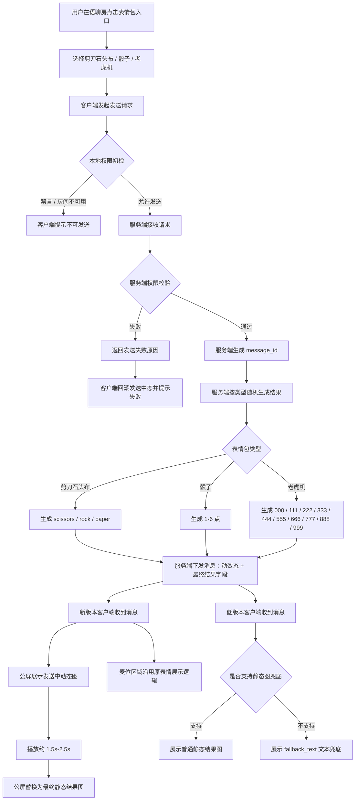
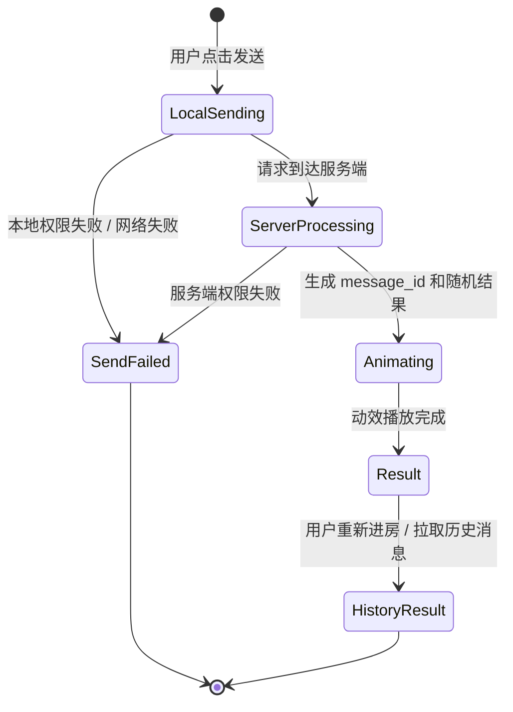

# 剪刀石头布 / 骰子 / 老虎机表情包 PRD

## 1. 文档信息

| 项目 | 内容 |
| --- | --- |
| 文档名称 | 剪刀石头布 / 骰子 / 老虎机表情包产品需求文档 |
| 版本 | v1.0 评审版 |
| 需求场景 | 语聊房表情包互动 |
| 目标读者 | 产品、设计、客户端、后端、测试、运营 |
| 需求摘要 | 用户在语聊房内可发送“剪刀石头布”“骰子”或“老虎机”表情包；发送后先展示动态图，最终随机生成静态结果图，并同步展示在房间聊天公屏中 |

## 2. 需求背景

当前语聊房表情包仅在麦位区域展示，互动反馈偏弱，房间内其他未关注麦位的用户不一定能及时看到互动结果。

本次新增“剪刀石头布”“骰子”和“老虎机”三类互动表情包，用户发送后需要在房间聊天公屏展示，形成更强的房间可见性和游戏氛围。

## 3. 产品目标

1. 提升语聊房内轻量互动趣味性。
2. 让表情包发送过程和最终结果在公屏可见，增强围观参与感。
3. 统一“发送中动效”和“最终随机结果图”的展示规则。
4. 保留现有麦位展示能力，不影响当前表情包链路。
5. 新增老虎机三位数随机结果展示，最终静态结果为 `000、111、222、333、444、555、666、777、888、999`。

## 4. 需求范围

### 4.1 本期范围

1. 新增剪刀石头布表情包。
2. 新增骰子表情包。
3. 新增老虎机表情包，最终静态结果为 `000、111、222、333、444、555、666、777、888、999`。
4. 发送过程中展示动态图。
5. 动效结束后随机生成最终静态结果图。
6. 最终结果展示在语聊房聊天公屏。
7. 兼容现有麦位展示逻辑。

### 4.2 非本期范围

1. 不做多人对战结算。
2. 不做输赢判定、积分、金币奖励或惩罚。
3. 不做历史战绩记录。
4. 不做付费概率控制。
5. 不做自定义骰子面数或自定义手势。
6. 不做老虎机中奖、下注、赔率、倍率、奖励或惩罚结算。
7. 不做自定义老虎机数字范围或概率配置。

## 5. 用户角色

| 角色 | 说明 |
| --- | --- |
| 发送用户 | 在语聊房内发送剪刀石头布、骰子或老虎机的用户 |
| 房间内用户 | 在当前语聊房内观看公屏消息和互动结果的用户 |
| 麦位用户 | 当前在麦上的用户，可看到现有麦位表情展示 |
| 房主 / 管理员 | 与普通用户展示一致，本期不增加管理操作 |

## 6. 入口与交互流程

### 6.1 入口位置

沿用语聊房现有表情包入口，在表情包面板中新增三类表情：

| 表情包 | 入口名称 | 图标建议 |
| --- | --- | --- |
| 剪刀石头布 | 剪刀石头布 | 手势 / RPS 图标 |
| 骰子 | 骰子 | 骰子图标 |
| 老虎机 | 老虎机 | 老虎机 / 777 图标 |

### 6.2 用户流程

1. 用户进入语聊房。
2. 用户点击输入区或互动区的表情包入口。
3. 用户选择“剪刀石头布”“骰子”或“老虎机”。
4. 客户端发送表情包消息。
5. 房间内展示发送中动态图。
6. 动效播放完成后，系统随机生成最终结果。
7. 公屏展示最终静态结果图。
8. 麦位区域按现有表情包展示逻辑继续展示。

### 6.3 完整流转链路图



### 6.4 消息状态流转图



说明：

1. `Animating` 阶段展示动态图，但结果建议已由服务端提前生成并下发，客户端只延迟展示。
2. `Result` 阶段展示最终静态图，剪刀石头布为 3 种结果，骰子为 6 种结果，老虎机为 10 种豹子号三位数字结果。
3. `HistoryResult` 阶段不再补播动态图，只展示最终静态结果或文本兜底。
4. 低版本客户端不进入完整动效链路，直接走静态图或文本兜底。

## 7. 展示规则

### 7.1 公屏展示规则

本期新增要求：剪刀石头布、骰子和老虎机的最终结果必须展示在房间聊天公屏。

公屏消息建议结构：

| 元素 | 说明 |
| --- | --- |
| 用户头像 | 发送用户头像 |
| 用户昵称 | 发送用户昵称 |
| 表情类型 | 剪刀石头布 / 骰子 / 老虎机 |
| 动态展示 | 发送后短时间播放动态图 |
| 最终结果 | 动效结束后替换为静态结果图 |
| 发送时间 | 沿用公屏消息时间规则 |

### 7.2 麦位展示规则

1. 保留现有麦位表情包展示能力。
2. 用户在麦位发送时，麦位区域仍可展示表情动画。
3. 新增公屏展示不应影响麦位动画展示。
4. 如果当前用户不在麦位，也可以发送并在公屏展示，具体是否允许由现有房间权限决定。

### 7.3 动态图展示规则

| 表情包 | 发送中动效 | 动效含义 |
| --- | --- | --- |
| 剪刀石头布 | 手势快速切换 / 倒计时动画 | 表示系统正在随机生成结果 |
| 骰子 | 骰子滚动动画 | 表示系统正在随机生成点数 |
| 老虎机 | 三列数字滚动 / 闪烁停靠动画 | 表示系统正在随机生成三位数字 |

动效建议时长：

| 场景 | 时长 |
| --- | --- |
| 公屏消息动效 | 1.5s - 2.5s |
| 麦位动效 | 沿用现有表情包动效时长，建议与公屏保持一致 |

### 7.4 静态结果展示规则

| 表情包 | 结果范围 | 静态结果图 |
| --- | --- | --- |
| 剪刀石头布 | 剪刀 / 石头 / 布 | 对应 3 张静态结果图 |
| 骰子 | 1 / 2 / 3 / 4 / 5 / 6 点 | 对应 6 张静态结果图 |
| 老虎机 | 000 / 111 / 222 / 333 / 444 / 555 / 666 / 777 / 888 / 999 | 对应三位数字静态结果图 |

动效结束后，公屏中的动图替换为最终静态结果图。

## 8. 随机结果规则

### 8.1 随机生成原则

1. 结果由服务端生成，避免客户端篡改结果。
2. 同一条表情包消息只能有一个最终结果。
3. 结果生成后需要同步给房间内所有在线用户。
4. 客户端只负责展示服务端返回的结果。

### 8.2 剪刀石头布结果

| 结果值 | 展示文案 | 静态图 |
| --- | --- | --- |
| scissors | 剪刀 | 剪刀结果图 |
| rock | 石头 | 石头结果图 |
| paper | 布 | 布结果图 |

默认概率：三种结果等概率，各约 33.33%。

### 8.3 骰子结果

| 结果值 | 展示文案 | 静态图 |
| --- | --- | --- |
| 1 | 1 点 | 骰子 1 点图 |
| 2 | 2 点 | 骰子 2 点图 |
| 3 | 3 点 | 骰子 3 点图 |
| 4 | 4 点 | 骰子 4 点图 |
| 5 | 5 点 | 骰子 5 点图 |
| 6 | 6 点 | 骰子 6 点图 |

默认概率：六种结果等概率，各约 16.67%。

### 8.4 老虎机结果

| 结果值 | 展示文案 | 静态图 |
| --- | --- | --- |
| 000 | 000 | 000 静态结果图 |
| 111 | 111 | 111 静态结果图 |
| 222 | 222 | 222 静态结果图 |
| 333 | 333 | 333 静态结果图 |
| 444 | 444 | 444 静态结果图 |
| 555 | 555 | 555 静态结果图 |
| 666 | 666 | 666 静态结果图 |
| 777 | 777 | 777 静态结果图 |
| 888 | 888 | 888 静态结果图 |
| 999 | 999 | 999 静态结果图 |

默认概率：10 种结果等概率，各 10%。

结果规则：

1. 结果必须按三位字符串展示，保留 `000` 的前导 0。
2. 服务端返回建议使用 string 类型，避免 `000` 被解析成 `0`。
3. 结果仅允许出现 `000、111、222、333、444、555、666、777、888、999`。
4. 本期不配置中奖、赔付、倍率或奖励逻辑，仅作为随机互动表情结果展示。

## 9. 消息状态

| 状态 | 说明 | 客户端表现 |
| --- | --- | --- |
| sending | 用户已点击发送，本地发送中 | 可展示本地 loading 或置灰 |
| animating | 消息已进入房间，播放动态图 | 公屏展示动态图 |
| result | 服务端返回最终结果 | 公屏替换为静态结果图 |
| failed | 发送失败 | 展示发送失败提示，可重试 |

## 10. 公屏消息形态

### 10.1 发送中

```text
[用户昵称] 发送了 [剪刀石头布]
[动态图：剪刀 / 石头 / 布快速切换]
```

```text
[用户昵称] 发送了 [骰子]
[动态图：骰子滚动]
```

```text
[用户昵称] 发送了 [老虎机]
[动态图：三列数字滚动]
```

### 10.2 最终结果

```text
[用户昵称] 发送了 [剪刀石头布]
[静态结果图：石头]
```

```text
[用户昵称] 发送了 [骰子]
[静态结果图：6 点]
```

```text
[用户昵称] 发送了 [老虎机]
[静态结果图：777]
```

## 11. 交互细节

### 11.1 点击发送

1. 用户点击表情包后立即触发发送。
2. 发送后关闭表情面板，或保持现有表情包面板关闭逻辑。
3. 若当前网络较慢，客户端可先展示本地发送中态。

### 11.2 房间内同步

1. 房间内所有用户应看到同一条消息。
2. 房间内所有用户看到的最终结果必须一致。
3. 后进入房间的用户是否看到历史结果，沿用当前公屏历史消息策略。

### 11.3 重复发送

1. 用户可连续发送多个剪刀石头布、骰子或老虎机表情。
2. 连续发送时，每条消息独立生成结果。
3. 若房间已有公屏消息频控，本功能沿用现有频控。

## 12. 权限与限制

| 场景 | 规则 |
| --- | --- |
| 普通用户 | 可发送，若现有房间限制普通用户发言，则沿用原规则 |
| 禁言用户 | 不可发送，提示“当前无法发送消息” |
| 被踢出房间 | 不可发送 |
| 房间关闭 | 不可发送 |
| 网络异常 | 发送失败，可提示重试 |

## 13. 异常场景

| 异常 | 处理 |
| --- | --- |
| 动图资源加载失败 | 展示兜底静态 loading 图，等待结果返回 |
| 静态结果图加载失败 | 展示结果文案，例如“骰子 6 点” |
| 老虎机静态结果图加载失败 | 展示结果文案，例如“老虎机 777” |
| 服务端结果超时 | 客户端展示发送失败或重试态 |
| 用户快速切房 | 当前房间消息不再强制展示，新房间不展示旧房间结果 |
| 公屏消息被清屏 | 结果消息按现有清屏逻辑处理 |
| 客户端版本过低 | 展示普通表情消息或文本兜底 |
| 用户重复点击发送 | 客户端做点击防抖；服务端按 `message_id` 去重，避免同一次点击生成多条结果 |
| 服务端重复下发结果 | 客户端以同一 `message_id` 的首次有效结果为准，后续重复包忽略 |
| 动效未播放完就收到结果 | 客户端继续播放到最短动效时长后再展示结果，避免用户感知突兀 |
| 动效播放完但结果未到 | 最多等待约定超时时间，超时后展示失败或文本兜底 |
| 用户处于禁言但本地入口未刷新 | 服务端拒绝发送，客户端回滚本地发送中态并提示不可发送 |
| 房间被封禁 / 关闭 | 服务端拒绝发送，客户端展示房间不可用提示 |
| 用户被拉黑或踢出后仍点击发送 | 服务端拒绝发送，客户端不展示公屏结果 |
| 资源 CDN 缓存未命中新版本 | 客户端展示文本兜底，后台监控资源加载失败率 |
| 客户端进入后台后再回到房间 | 若消息已结束，直接展示最终静态结果，不补播完整动效 |
| 公屏快速滚动导致动效不可见 | 消息进入视口时若已超过结果时间，直接展示静态结果 |

## 14. 版本兼容策略

### 14.1 兼容目标

本需求上线后，同一语聊房内可能同时存在新版本客户端和旧版本客户端。需要保证：

1. 新版本用户可看到完整“动效 + 最终结果图”体验。
2. 旧版本用户不会崩溃、不会展示异常空白消息。
3. 同一条消息在所有客户端上的最终结果语义一致。
4. 服务端消息结构向下兼容，不破坏旧表情包展示链路。

### 14.2 客户端版本分层

| 客户端版本 | 支持能力 | 展示策略 |
| --- | --- | --- |
| 新版本 | 支持互动表情包消息类型、动图、静态结果图、公屏展示 | 展示完整效果 |
| 中间版本 | 不支持新消息类型，但支持普通图片 / 普通表情消息 | 展示静态结果图或普通图片消息 |
| 旧版本 | 不支持新消息类型，也不支持结果图资源 | 展示文本兜底，例如“用户投出了骰子：6 点”或“用户发送了老虎机：777” |
| 极旧版本 | 无法识别扩展字段 | 服务端下发兼容文本消息或旧表情类型，避免消息解析异常 |

### 14.3 消息协议兼容

建议服务端消息采用“新字段扩展 + 旧字段兜底”的方式。

| 字段 | 新版本用途 | 旧版本兜底 |
| --- | --- | --- |
| message_type | 标识互动表情包消息 | 旧版本不识别时按普通消息处理 |
| emoji_game_type | rps / dice / slot | 旧版本忽略 |
| result | 最终结果值 | 旧版本忽略 |
| result_text | 结果文本，例如“骰子 6 点”“老虎机 777” | 旧版本可展示文本 |
| fallback_image | 最终静态结果图 | 中间版本可展示普通图片 |
| fallback_text | 文本兜底 | 极旧版本展示文本 |

### 14.4 新老版本混房场景

| 场景 | 预期表现 |
| --- | --- |
| 新版本用户发送，新版本用户观看 | 公屏先展示动效，再展示最终静态结果图 |
| 新版本用户发送，旧版本用户观看 | 旧版本展示文本兜底或普通静态结果图 |
| 旧版本用户进入房间 | 旧版本看不到新入口，但能看到别人发送的兜底结果 |
| 旧版本用户发送普通表情 | 新版本按原普通表情逻辑展示，不进入随机结果流程 |
| 新版本和旧版本同时在麦位 | 新版本公屏展示结果；旧版本麦位按原能力展示或忽略扩展效果 |
| 用户升级客户端后重新进入房间 | 历史消息只展示最终结果，不补播历史动效 |

### 14.5 版本控制与灰度

1. 服务端增加功能开关：按国家 / 语言 / 房间类型 / 客户端版本灰度。
2. 客户端入口展示受版本能力和服务端开关共同控制。
3. 若线上出现异常，服务端可关闭入口，并将已发送消息降级为文本兜底。
4. 灰度期间重点观察发送成功率、资源加载失败率、公屏消息错误率和客户端崩溃率。

### 14.6 历史消息兼容

1. 公屏历史消息中只展示最终静态结果或兜底文本，不展示发送中动效。
2. 用户重新进入房间后，已完成的互动表情包直接展示最终结果。
3. 如果历史消息缺少结果字段，展示“结果加载失败”或隐藏该条互动结果，避免随机补结果造成前后不一致。

## 15. 风险点与规避方案

| 风险点 | 影响 | 规避方案 |
| --- | --- | --- |
| 新旧版本协议不兼容 | 旧版本可能看不到消息或解析异常 | 消息增加 `fallback_text` 和 `fallback_image`，旧版本按普通消息兜底 |
| 结果由客户端生成 | 可能作弊或不同用户结果不一致 | 结果必须由服务端生成，客户端只负责展示 |
| 动效和结果不同步 | 用户看到动效结束但无结果，体验割裂 | 服务端一次下发结果，客户端本地控制动效时长 |
| 多端重复发送 | 同一次点击生成多条消息 | 客户端防抖，服务端按请求 ID / message_id 去重 |
| 弱网导致结果延迟 | 公屏长时间 loading | 设置最大等待时间，超时展示失败或兜底文本 |
| 资源加载失败 | 公屏展示空白或破图 | 预加载核心资源，加载失败展示结果文本 |
| 公屏刷屏 | 多人连续发送影响聊天阅读 | 沿用公屏频控，必要时对互动表情增加单独冷却 |
| 麦位与公屏展示冲突 | 同一表情展示两套动画导致干扰 | 公屏必须展示结果；麦位展示沿用原规则，可只展示轻量动效 |
| 历史消息重复播放动效 | 用户回房后体验混乱 | 历史消息只展示最终结果 |
| 概率被质疑不公平 | 用户认为结果被操控 | 明确等概率，服务端统一随机，必要时可记录随机结果日志 |
| 审核 / 合规风险 | 骰子或老虎机可能被误解为赌博玩法 | 本期不做输赢、下注、倍率、奖励、惩罚，仅为娱乐互动表情；必要时按国家 / 地区配置入口开关和名称图标 |
| 性能风险 | 动图过大造成卡顿 | 控制资源大小，优先使用 WebP / Lottie / SVGA 等现有支持格式 |

## 16. 场景补全

### 16.1 发送者场景

| 场景 | 说明 | 预期 |
| --- | --- | --- |
| 普通用户发送骰子 | 用户在表情面板点击骰子 | 公屏展示骰子动效并最终展示 1-6 点 |
| 普通用户发送剪刀石头布 | 用户在表情面板点击剪刀石头布 | 公屏展示手势动效并最终展示剪刀 / 石头 / 布 |
| 普通用户发送老虎机 | 用户在表情面板点击老虎机 | 公屏展示三列数字滚动动效并最终展示 000 / 111 / 222 / 333 / 444 / 555 / 666 / 777 / 888 / 999 之一 |
| 麦上用户发送 | 用户正在麦位上 | 麦位保留原表情展示，公屏新增结果展示 |
| 非麦上用户发送 | 用户在房间内但不在麦位 | 若有发言权限，则公屏展示结果；麦位不展示或按现有规则处理 |
| 用户连续发送 | 用户短时间多次点击 | 每条消息独立随机；频控范围内正常发送，超出频控提示稍后再试 |
| 用户发送后立刻退出房间 | 发送成功后离开 | 房间内其他用户仍可看到该条消息最终结果 |

### 16.2 观看者场景

| 场景 | 说明 | 预期 |
| --- | --- | --- |
| 新版本观看者实时在房间 | 发送时已在房间内 | 看到动效和最终结果 |
| 新版本观看者稍后进入房间 | 结果已生成 | 只看到最终静态结果，不补播动效 |
| 旧版本观看者实时在房间 | 不支持新消息类型 | 看到文本兜底或普通静态图 |
| 观看者公屏停留在历史位置 | 当前未在最新消息位置 | 消息按现有公屏未读 / 滚动策略处理 |
| 观看者网络断开后恢复 | 中途错过结果广播 | 通过消息同步拉取最终结果，展示静态结果 |

### 16.3 房间状态场景

| 场景 | 说明 | 预期 |
| --- | --- | --- |
| 房间正常 | 可聊天 | 正常发送和展示 |
| 房间禁言 | 普通用户不可发言 | 不展示发送入口或发送失败提示 |
| 用户被单独禁言 | 当前用户不可发言 | 点击发送后提示不可发送 |
| 房间关闭 | 房间不可用 | 发送失败，不生成结果 |
| 房间切换 | 用户从 A 房切到 B 房 | A 房消息不带到 B 房展示 |

### 16.4 资源与网络场景

| 场景 | 说明 | 预期 |
| --- | --- | --- |
| 动图未下载完成 | 首次使用资源未缓存 | 展示 loading 或静态兜底，结果回来后展示最终图 |
| 静态图加载失败 | CDN 或本地资源异常 | 展示结果文本 |
| 弱网发送 | 请求超时或失败 | 本地消息显示失败，可重试 |
| 服务端广播延迟 | 房间内用户收到时间不同 | 最终结果一致，展示时机可有轻微差异 |
| App 切后台 | 动效过程中切后台 | 回前台后直接展示最终结果 |

## 17. 资源需求

### 17.1 剪刀石头布资源

| 资源 | 数量 | 说明 |
| --- | --- | --- |
| 发送中动态图 | 1 | 剪刀 / 石头 / 布循环动效 |
| 剪刀结果静态图 | 1 | 最终结果 |
| 石头结果静态图 | 1 | 最终结果 |
| 布结果静态图 | 1 | 最终结果 |

### 17.2 骰子资源

| 资源 | 数量 | 说明 |
| --- | --- | --- |
| 发送中动态图 | 1 | 骰子滚动动效 |
| 1 点静态图 | 1 | 最终结果 |
| 2 点静态图 | 1 | 最终结果 |
| 3 点静态图 | 1 | 最终结果 |
| 4 点静态图 | 1 | 最终结果 |
| 5 点静态图 | 1 | 最终结果 |
| 6 点静态图 | 1 | 最终结果 |

### 17.3 老虎机资源

| 资源 | 数量 | 说明 |
| --- | --- | --- |
| 发送中动态图 | 1 | 三列数字滚动动效 |
| 静态结果图 | 10 | 对应 000 / 111 / 222 / 333 / 444 / 555 / 666 / 777 / 888 / 999 十种最终结果 |

## 18. 服务端要求

### 18.1 消息字段建议

| 字段 | 类型 | 说明 |
| --- | --- | --- |
| message_id | string | 表情包消息唯一 ID |
| room_id | string | 房间 ID |
| sender_uid | string | 发送用户 ID |
| sender_nickname | string | 发送用户昵称 |
| emoji_game_type | enum | rps / dice / slot |
| result | string / number | 最终结果；老虎机需使用三位字符串，仅允许 000 / 111 / 222 / 333 / 444 / 555 / 666 / 777 / 888 / 999 |
| result_text | string | 结果文案兜底，例如“骰子 6 点”“老虎机 777” |
| fallback_image | string | 低版本可展示的静态结果图 |
| fallback_text | string | 极低版本文本兜底 |
| status | enum | animating / result |
| created_at | timestamp | 发送时间 |

### 18.2 结果生成

1. 服务端收到发送请求后生成 `message_id`。
2. 服务端按表情类型随机生成结果。
3. 服务端广播消息进入 `animating` 状态。
4. 服务端在约定时间后广播最终 `result` 状态，或一次下发消息中包含结果，由客户端延迟展示。

推荐方案：服务端一次返回结果，客户端先播放动效，再展示结果。这样可以降低二次广播延迟和丢包风险。

### 18.3 服务端兼容要求

1. 服务端需识别客户端版本能力，决定是否下发表情互动消息完整结构。
2. 对不支持新消息类型的客户端，至少提供 `fallback_text`。
3. 同一条消息的 `message_id` 和 `result` 必须稳定，重复拉取不能变化。
4. 支持功能开关，必要时可关闭发送入口或将展示降级为普通消息。

## 19. 客户端要求

### 19.1 语聊房公屏

1. 支持展示互动表情包消息。
2. 支持发送中动态图。
3. 支持结果态静态图。
4. 支持结果文案兜底。
5. 公屏滚动、消息合并、清屏逻辑沿用现有能力。
6. 支持基于客户端能力做展示降级。
7. 历史消息只展示最终结果，不补播动效。

### 19.2 麦位区域

1. 保留现有麦位表情展示。
2. 新需求不取消麦位表情。
3. 同一条表情可同时在麦位区域和公屏展示，但公屏必须展示最终结果。

### 19.3 客户端兼容要求

1. 新版本客户端展示完整动效和结果图。
2. 旧版本客户端展示 `fallback_text` 或 `fallback_image`。
3. 如果不识别 `emoji_game_type`，不得崩溃，不得阻塞后续公屏消息。
4. 资源加载失败时展示文本兜底。

## 20. 埋点需求

| 事件 | 触发时机 | 核心参数 |
| --- | --- | --- |
| emoji_game_panel_click | 用户打开表情面板 | room_id, uid |
| emoji_game_send_click | 用户点击发送 | room_id, uid, emoji_game_type |
| emoji_game_send_success | 发送成功 | room_id, uid, emoji_game_type, message_id |
| emoji_game_result_show | 最终结果展示 | room_id, uid, emoji_game_type, result |
| emoji_game_send_fail | 发送失败 | room_id, uid, emoji_game_type, fail_reason |
| emoji_game_fallback_show | 展示降级兜底 | room_id, uid, emoji_game_type, fallback_type, client_version |
| emoji_game_resource_fail | 资源加载失败 | room_id, uid, emoji_game_type, resource_type, client_version |

## 21. 验收标准

### 21.1 功能验收

1. 用户可在语聊房表情包入口看到剪刀石头布、骰子和老虎机。
2. 用户点击剪刀石头布后，公屏展示发送中动效。
3. 动效结束后，公屏展示剪刀 / 石头 / 布之一的静态结果图。
4. 用户点击骰子后，公屏展示骰子滚动动效。
5. 动效结束后，公屏展示 1-6 点之一的静态结果图。
6. 用户点击老虎机后，公屏展示三列数字滚动动效。
7. 动效结束后，公屏展示 000 / 111 / 222 / 333 / 444 / 555 / 666 / 777 / 888 / 999 之一的三位数字静态结果图。
8. 同一条消息在所有用户端展示的最终结果一致。
9. 表情包仍可在麦位区域展示，不影响原有麦位动效。
10. 禁言、网络失败、资源加载失败等异常场景有兜底提示。

### 21.2 随机验收

1. 剪刀石头布只会生成剪刀、石头、布三类结果。
2. 骰子只会生成 1-6 点结果。
3. 老虎机只会生成 000 / 111 / 222 / 333 / 444 / 555 / 666 / 777 / 888 / 999 十种三位数字结果，并保留 `000` 的前导 0。
4. 刷新房间或重新拉取消息后，同一条消息结果不变化。
5. 客户端不能自行修改结果。

### 21.3 兼容验收

1. 新版本用户可看到完整动效和最终静态结果。
2. 旧版本客户端至少可看到文本兜底或普通静态结果图。
3. 极低版本客户端不崩溃，不影响后续公屏消息展示。
4. 新版本发送、旧版本观看时，旧版本能看到结果语义。
5. 旧版本进入房间时，不展示新入口，但可看到别人发送的兜底结果。
6. 用户升级后重新进入房间，历史消息只展示最终结果，不补播动效。
7. 弱网下不会出现同一条消息多个不同结果。
8. 公屏展示不遮挡核心房间操作。
9. 连续发送多条时，公屏消息顺序正确。

### 21.4 风险验收

1. 关闭服务端开关后，新入口不再展示。
2. 资源加载失败时，不出现空白消息或破图。
3. 服务端重复下发同一结果时，客户端不会重复插入多条公屏消息。
4. 结果字段缺失时，客户端能展示兜底文本或失败态。
5. 禁言、踢出、房间关闭等权限场景不会生成有效结果消息。

## 22. 待确认问题

| 问题 | 建议 |
| --- | --- |
| 是否所有用户都能发送 | 建议沿用当前房间发言权限 |
| 是否需要发送频控 | 建议沿用当前公屏消息频控，必要时增加单用户 1s 冷却 |
| 动效时长是否固定 | 建议统一 2s 左右，便于用户形成预期 |
| 结果是否服务端生成 | 建议必须服务端生成，避免作弊和结果不一致 |
| 公屏历史是否保留结果 | 建议沿用现有公屏历史策略，但历史中只展示最终静态结果 |
| 老虎机静态结果资源如何落地 | 建议客户端最终展示为静态图，本期只需覆盖 000 / 111 / 222 / 333 / 444 / 555 / 666 / 777 / 888 / 999 十种结果 |
| 老虎机入口是否需要按国家 / 地区灰度 | 建议支持配置，降低赌博联想和地区合规风险 |
