# 幸运礼物 ABC 方案流程图与流程表

> **产品**：Wechill / Lucky Gift / هدية الحظ  
> **文档用途**：评审会流程说明，不使用页面布局稿样式  
> **版本**：v1.0  
> **更新日期**：2026-06-17  
> **关联文档**：
> - `幸运礼物玩法方案-A基础版（无奖池）.md`
> - `幸运礼物玩法方案-B完整版（含奖池）.md`
> - `幸运礼物玩法方案-C共享奖池版（Greedy式）.md`

---

## 0. 三个方案一句话区别

| 方案 | 核心逻辑 | 奖励资金来源 | 适合场景 |
|---|---|---|---|
| **A 基础版（无奖池）** | 用户送幸运礼物后，按固定 RTP/概率即时返奖 | 平台直接承担返奖成本 | 日常常驻、快速上线、低合规风险 |
| **B 房间奖池版** | 用户送礼给所在房间奖池蓄水，房间内触发爆奖 | 房间独立奖池 + 平台保底/补贴 | 大主播房、活动房、强房间氛围 |
| **C 共享奖池版（Greedy式）** | 所有 Lucky Gift 按比例注入玩法级共享奖池，所有爆奖从共享池出 | 活动/国家共享奖池 + 有限补贴 | 节日活动、全平台玩法、成本可控爆奖 |

---

## 1. 总体入口流程（三版共用）

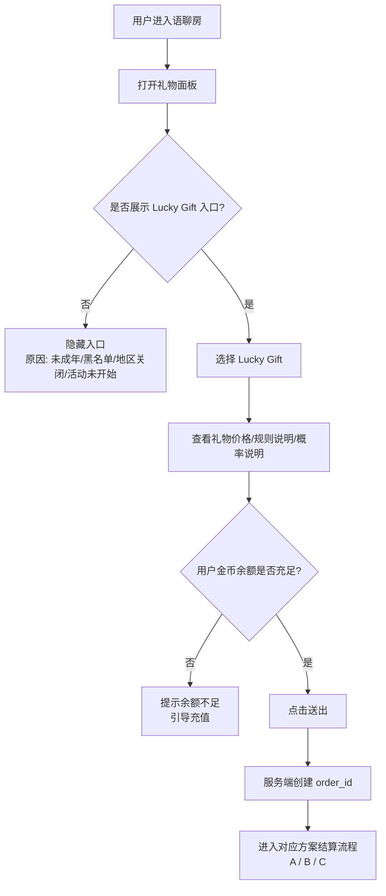

### 共用入口流程表

| 步骤 | 操作方 | 节点 | 系统处理 | 用户看到 | 异常处理 |
|---:|---|---|---|---|---|
| 1 | 用户 | 进入房间 | 拉取房间、用户、活动配置 | 房间正常展示 | 房间关闭则不展示入口 |
| 2 | 用户 | 打开礼物面板 | 判断 Lucky Gift 是否可见 | 幸运礼物入口 | 黑名单/未成年/地区关闭则隐藏 |
| 3 | 用户 | 选择礼物 | 展示价格、奖励说明、概率说明 | 礼物详情弹层 | 配置异常则下架该礼物 |
| 4 | 用户 | 点击送出 | 前端预校验余额 | 送礼确认 | 余额不足引导充值 |
| 5 | 服务端 | 创建订单 | 生成唯一 order_id，做幂等校验 | Loading / 动画准备 | 重复请求返回同一结果 |
| 6 | 服务端 | 分流方案 | 按后台配置进入 A/B/C | 无感知 | 配置缺失默认降级 A 或关闭 |

---

## 2. A 方案流程：基础版（无奖池）

### 2.1 A 方案主流程图

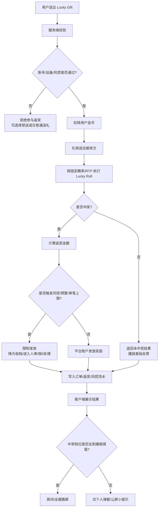

### 2.2 A 方案流程表

| 阶段 | 节点 | 输入 | 处理规则 | 输出 | 成本归属 |
|---|---|---|---|---|---|
| 资格校验 | 用户准入 | user_id、device_id、room_id | 注册≥3天、非危险级黑名单、非未成年 | 可参与/不可参与 | 无 |
| 扣款 | 扣用户金币 | gift_cost | 扣除礼物面值 | 用户金币减少 | 用户支付 |
| 送礼 | 礼物送达 | gift_id、receiver_id | 礼物100%送达接收方 | 主播/接收方获得礼物收益 | 用户支付已覆盖 |
| 抽奖 | Lucky Roll | gift_id、RTP配置、概率表 | 按固定概率抽取 0x/R1/R2/R3... | 抽奖结果 | 无 |
| 发奖 | 平台返奖 | reward_amount | 平台直接发金币/券 | 用户获得奖励 | **平台承担** |
| 风控 | 发奖限制 | user_risk_level、budget_state | 限制级封顶，危险级无资格 | 降档/人审/拒发 | 降低平台支出 |
| 记录 | 审计日志 | order_id、hash、result | 记录订单、开奖、发奖 | 可追溯 | 无 |

### 2.3 A 方案异常分支

| 异常场景 | 处理方式 | 用户展示 |
|---|---|---|
| 余额不足 | 不创建订单，引导充值 | `Coins are not enough` |
| 扣款成功但开奖失败 | 回滚订单或退还金币 | `Order failed, coins returned` |
| 开奖成功但发奖失败 | 进入 pending，自动重试；失败转人工 | `Reward is processing` |
| 触发日预算熔断 | 当日 Lucky Roll 关闭或强制 0x | `Today's lucky bonus has ended` |
| 限制级用户中奖高档 | 奖励封顶 1x 或降为 R1 | 正常展示最终结果，不展示降级原因 |
| 危险级用户 | 隐藏入口/禁止参与 | 不展示入口 |

---

## 3. B 方案流程：房间独立奖池版

> 注意：B 是**房间奖池**，不是小太阳最新想要的 Greedy 式共享池。这里保留用于评审对比。

### 3.1 B 方案主流程图

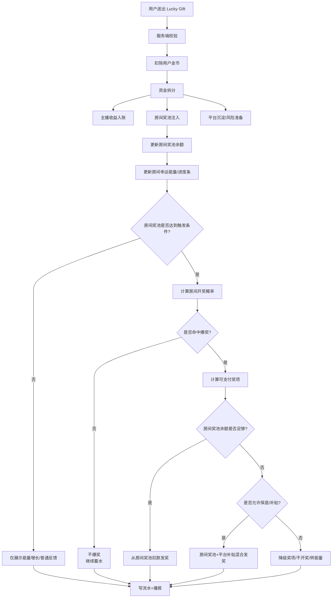

### 3.2 B 方案流程表

| 阶段 | 节点 | 输入 | 处理规则 | 输出 | 成本归属 |
|---|---|---|---|---|---|
| 准入 | 用户/房间校验 | user_id、room_id | 用户、房间、主播均需通过风控 | 可送/不可送 | 无 |
| 扣款 | 扣用户金币 | gift_cost | 扣除幸运礼物面值 | 用户金币减少 | 用户支付 |
| 三拆 | 资金分流 | gift_cost、比例配置 | 主播/房间奖池/平台沉淀 | 三笔流水 | 用户支付 |
| 蓄水 | 房间奖池增加 | pool_in_amount | 加到当前房间奖池 | 房间奖池余额增加 | 用户支付转入池 |
| 进度 | 房间能量增长 | gift_cost、energy_ratio | 前端展示进度条 | 房间氛围增强 | 无现金成本 |
| 触发 | 判断是否开奖 | pool_balance、触发条件 | 金额阈值/概率/时间/活动配置 | 开/不开 | 无 |
| 支付 | 发放奖励 | reward_cost | 优先房间池出，不足再看保底 | 用户得奖 | 房间池/平台补贴 |
| 结算 | 财务对账 | pool_in、pool_out、subsidy | 期初+注入-支出=期末 | 对账报表 | 无 |

### 3.3 B 方案房间奖池触发流程

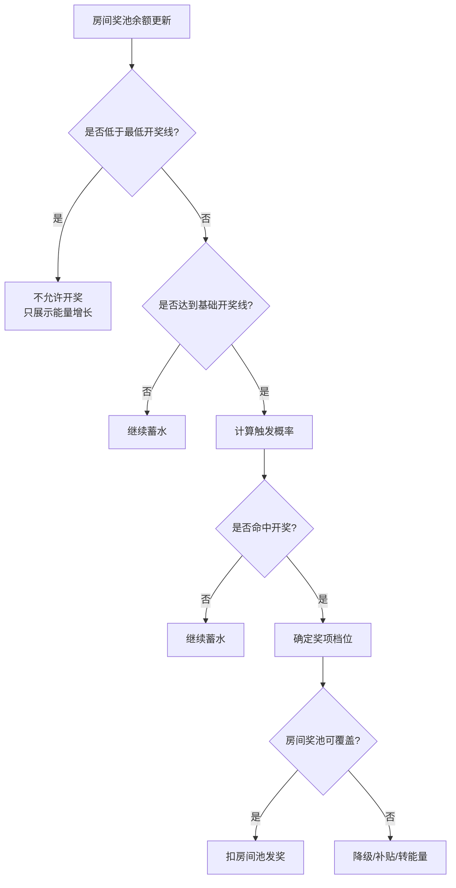

### 3.4 B 方案异常分支

| 异常场景 | 处理方式 | 用户展示 |
|---|---|---|
| 小房间长期奖池不足 | 只展示能量，关闭高档奖项 | 进度条慢慢增长 |
| 大房间频繁爆奖 | 降低触发概率，提高保护线 | 用户只感知爆奖变少 |
| 房间疑似刷流水 | 房间奖池冻结，R3+关闭 | 不解释具体风控原因 |
| 主播被封禁 | 房间奖池冻结，未发奖励人审 | `Activity is under review` |
| 房间解散 | 已产生奖励正常，房间池按规则回流/结算 | 无额外展示 |
| 奖池不足以爆大奖 | 降级到可支付档位或不开奖 | 只展示最终奖励 |

---

## 4. C 方案流程：共享奖池版（Greedy 式）

> C 是小太阳最新要求的核心版本：**不是房间池，是单个玩法/活动/国家共享奖池**。  
> 示例：送礼 10 金币 → 主播 3 金币 → 平台 2 金币 → 5 金币进入奖池；所有爆奖都从这个共享奖池出。

### 4.1 C 方案主流程图

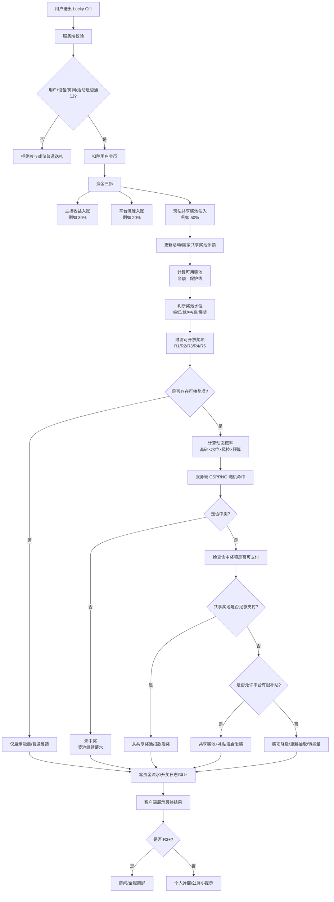

### 4.2 C 方案资金三拆流程表

| 用户送礼金额 | 主播收益 | 平台沉淀 | 共享奖池注入 | 说明 |
|---:|---:|---:|---:|---|
| 10 金币 | 3 金币 | 2 金币 | 5 金币 | 用户给的示例，可作为激进蓄水模式 |
| 100 金币 | 30 | 20 | 50 | 同比例放大 |
| 1,000 金币 | 300 | 200 | 500 | 适合活动期快速蓄水 |

> 后台配置字段：`host_income_ratio=0.30`、`platform_margin_ratio=0.20`、`pool_in_ratio=0.50`。  
> 强校验：三者之和必须 = 1。

### 4.3 C 方案奖池水位流程图

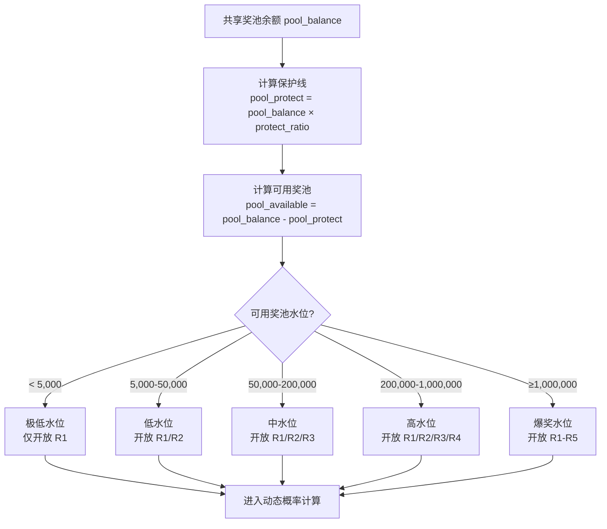

### 4.4 C 方案奖项准入表

| 水位 | 可用奖池范围 | 可开放档位 | 不开放档位 | 原因 |
|---|---:|---|---|---|
| 极低 | < 5,000 | R1 | R2-R5 | 池子太浅，先蓄水 |
| 低 | 5,000-50,000 | R1、R2 | R3-R5 | 可发小奖，不发大奖 |
| 中 | 50,000-200,000 | R1、R2、R3 | R4-R5 | 可开放大奖，但不爆超级奖 |
| 高 | 200,000-1,000,000 | R1-R4 | R5 | 可做强氛围，不开放终极爆奖 |
| 爆奖 | ≥1,000,000 | R1-R5 | 无 | 全档开放 |

### 4.5 C 方案动态概率流程图

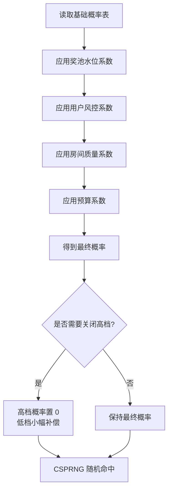

### 4.6 C 方案动态概率表

| 奖项 | 基础概率 | 极低水位 | 低水位 | 中水位 | 高水位 | 爆奖水位 |
|---|---:|---:|---:|---:|---:|---:|
| R1 小奖 | 15.00% | ×1.0 | ×1.0 | ×1.0 | ×1.0 | ×1.0 |
| R2 中奖 | 5.00% | ×0 | ×0.5 | ×1.0 | ×1.0 | ×1.0 |
| R3 大奖 | 1.00% | ×0 | ×0 | ×0.5 | ×1.0 | ×1.0 |
| R4 超级奖 | 0.20% | ×0 | ×0 | ×0 | ×0.5 | ×1.0 |
| R5 爆奖 | 0.02% | ×0 | ×0 | ×0 | ×0 | ×0.5-1.0 |
| 未中奖 | 78.78% | 自动承接关闭档位概率 | 自动承接 | 自动承接 | 自动承接 | 自动承接 |

### 4.7 C 方案开奖支付流程图

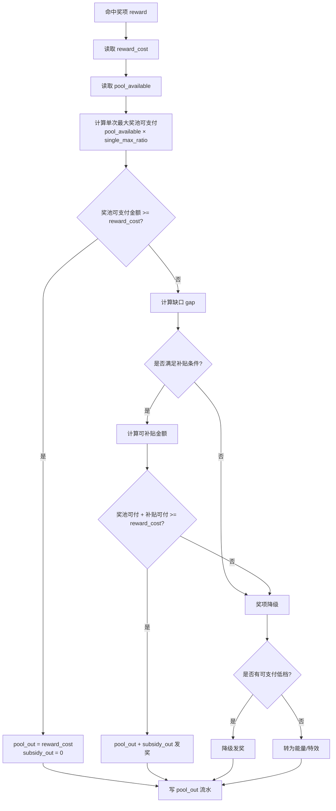

### 4.8 C 方案奖项降级表

| 命中档位 | 不可支付时降级顺序 | 最终兜底 |
|---|---|---|
| R5 爆奖 | R5 → R4 → R3 → R2 → R1 | 能量/特效 |
| R4 超级奖 | R4 → R3 → R2 → R1 | 能量/特效 |
| R3 大奖 | R3 → R2 → R1 | 能量/特效 |
| R2 中奖 | R2 → R1 | 能量/特效 |
| R1 小奖 | R1 | 若 R1 也不可支付，则只给特效 |

### 4.9 C 方案流程表（完整链路）

| 阶段 | 节点 | 输入 | 判断/处理 | 输出 | 资金影响 |
|---|---|---|---|---|---|
| 准入 | 用户校验 | user_id、device_id | 未成年/黑名单/风控 | 可参与/不可参与 | 无 |
| 扣款 | 用户支付 | gift_cost | 扣除金币 | 用户余额减少 | +gift_cost |
| 三拆 | 资金分流 | gift_cost、三拆比例 | 主播/平台/奖池 | 三笔流水 | 主播+平台+奖池入账 |
| 入池 | 奖池注入 | pool_in_amount | 写 pool_in 流水 | pool_balance 增加 | +pool_in |
| 水位 | 判断奖池水位 | pool_balance、protect_ratio | 计算可用奖池 | water_level | 无 |
| 准入 | 过滤奖项 | water_level、single_max_ratio | 关闭不可支付档位 | reward_candidates | 无 |
| 概率 | 动态概率 | 基础概率、系数 | 计算 final_probability | 概率表 | 无 |
| 开奖 | 随机命中 | CSPRNG、order_id | 命中/未中 | reward_result | 无 |
| 支付 | 奖励支付 | reward_cost、pool_available | 池出/补贴/降级 | 用户奖励 | -pool_out / -subsidy |
| 展示 | 结果反馈 | reward_result | 弹窗/公屏/飘屏 | 用户感知 | 无 |
| 审计 | 写日志 | 全链路字段 | 可追溯 | 订单/资金/风控流水 | 无 |

### 4.10 C 方案异常分支

| 异常场景 | 处理方式 | 用户展示 |
|---|---|---|
| 奖池极低水位 | 仅开放 R1，不开放大奖 | 正常小奖/能量反馈 |
| 命中高奖但池子不足 | 降级到可支付档位 | 只展示最终结果 |
| 补贴预算不足 | 关闭补贴，奖项降级 | 不展示补贴原因 |
| 总成本达到 85% | 关闭 R5 | 用户无感，只是爆奖减少 |
| 总成本达到 95% | 关闭 R4/R5 | 用户无感 |
| 总成本达到 100% | 关闭概率返奖，仅保留特效/能量 | `Lucky Energy +X` |
| 奖池余额异常为负 | 冻结该国家奖池，关闭高档奖项 | 活动维护提示 |
| 用户风控异常 | 仅可中 R1 或不参与 | 正常展示最终结果 |
| 主播关联账号 | 风控系数=0，不参与高奖 | 不提示具体原因 |
| 并发扣池冲突 | CAS/行锁重试，失败降级 | 无感 |

---

## 5. A → C 迭代流程

> 结论：**C 可以在 A 的基础上迭代**。A 是基础链路，C 是在 A 上增加资金三拆、共享奖池、动态概率、奖项降级和补贴熔断。

### 5.1 A 到 C 的演进流程图

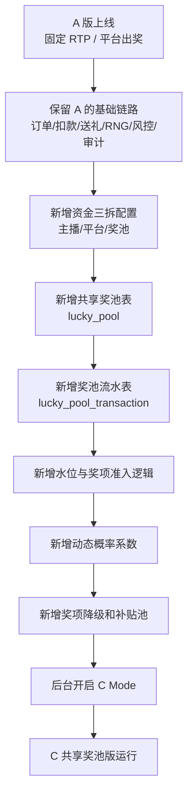

### 5.2 A → C 能复用的模块

| 模块 | A 是否已有 | C 是否复用 | 说明 |
|---|---:|---:|---|
| 礼物面板入口 | ✅ | ✅ | 入口不变，只多展示规则/能量 |
| 用户资格校验 | ✅ | ✅ | 黑名单/未成年/注册天数继续用 |
| 扣款订单 | ✅ | ✅ | order_id 幂等继续用 |
| 礼物送达 | ✅ | ✅ | 接收方收益逻辑不变 |
| RNG 开奖 | ✅ | ✅ | CSPRNG + seed 继续用 |
| 审计日志 | ✅ | ✅ | C 额外加水位/奖池字段 |
| 客服查询 | ✅ | ✅ | 查询 order_id 不变 |
| 灰度/回滚 | ✅ | ✅ | C 增加降级为 A 的回滚路径 |

### 5.3 A → C 需要新增的模块

| 新增模块 | 作用 | 是否必须一期做 |
|---|---|---:|
| 资金三拆配置 | 定义主播/平台/奖池比例 | ✅ |
| 共享奖池表 | 记录活动/国家奖池余额 | ✅ |
| 奖池流水表 | 记录 pool_in / pool_out / subsidy_out | ✅ |
| 水位判断 | 决定开放哪些奖项 | ✅ |
| 奖项准入 | 防止池子不够爆大奖 | ✅ |
| 动态概率 | 根据水位/风控/预算调节概率 | ✅，可先简化 |
| 补贴池 | 池不足时有限兜底 | 二期可开 |
| 房间能量 | 前端氛围展示 | ✅ |
| 榜单奖励 | 活动增强 | 二期可开 |

### 5.4 推荐迭代节奏

| 阶段 | 目标 | 开启能力 | 风险控制 |
|---|---|---|---|
| Phase 1：A 版日常 | 跑通基础链路 | 固定概率/平台出奖 | RTP 锁定、日预算熔断 |
| Phase 2：A 架构内预埋 C 字段 | 为 C 做准备 | order 表加 pool 字段，后台配置三拆但 pool_ratio=0 | 不改变用户体验 |
| Phase 3：C 小流量灰度 | 验证共享池 | 开启 pool_in，开放 R1-R3 | 不开补贴，不开 R4/R5 |
| Phase 4：C 活动版 | 做爆点 | 开 R4，少量补贴 | 日预算/国家预算/奖池水位控制 |
| Phase 5：C 完整版 | 节日大促 | 开 R5、榜单、飘屏 | 人审+熔断+法务确认 |

---

## 6. 三版流程差异总表

| 流程节点 | A 基础版 | B 房间池版 | C 共享池版 |
|---|---|---|---|
| 用户送礼 | 扣金币 | 扣金币 | 扣金币 |
| 主播收益 | 正常收益 | 正常收益 | 正常收益 |
| 奖池注入 | 无 | 注入当前房间池 | 注入活动/国家共享池 |
| 前端进度 | 无或弱展示 | 房间奖池/能量 | 房间能量（不等于真实池） |
| 开奖依据 | 固定概率/RTP | 房间池余额+触发条件 | 共享池水位+动态概率 |
| 奖项开放 | 全部按配置 | 房间池决定 | 共享池水位决定 |
| 奖金来源 | 平台支出 | 房间池/保底基金 | 共享池/有限补贴 |
| 奖池不足 | 不存在 | 降级/补贴/不开 | 降级/补贴/转能量 |
| 成本控制 | RTP + 日预算 | 蓄水率 + 保底基金 | 三拆比例 + 水位 + 熔断 |
| 风控介入 | 发奖前限制 | 房间/用户限制 | 动态概率系数限制 |
| 财务对账 | 流水 - 返奖 | 房间池期初+入-出 | 共享池期初+入-出 |
| 回滚方式 | 关闭入口 | 降级为 A 或关闭房间池 | 降级为 A 或关闭高档 |

---

## 7. 评审会建议只看这 3 张图

### 7.1 老板看：三版资金路径

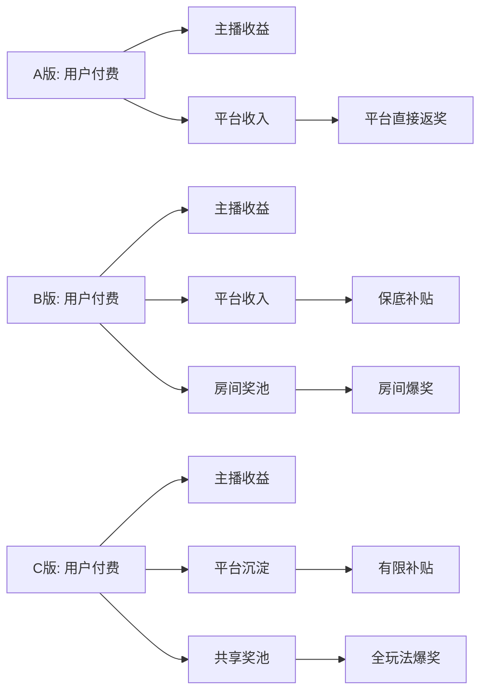

### 7.2 财务看：C 版对账闭环

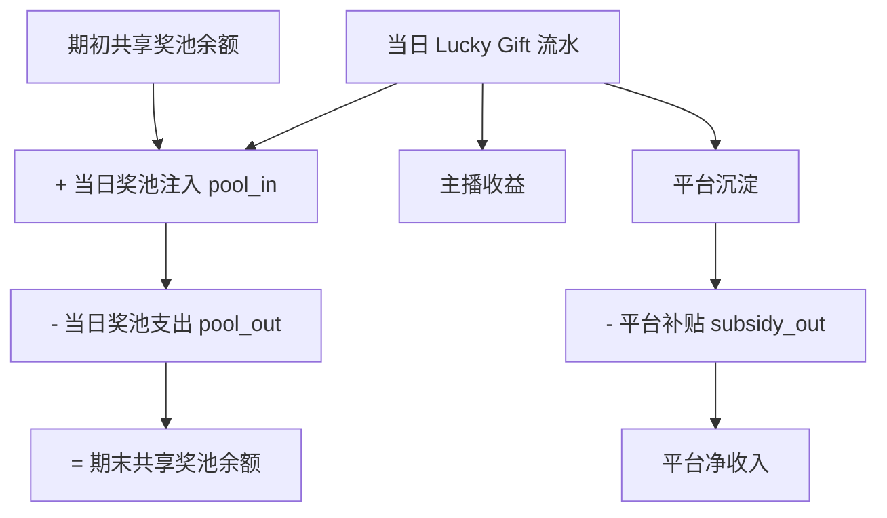

### 7.3 风控看：C 版奖项准入

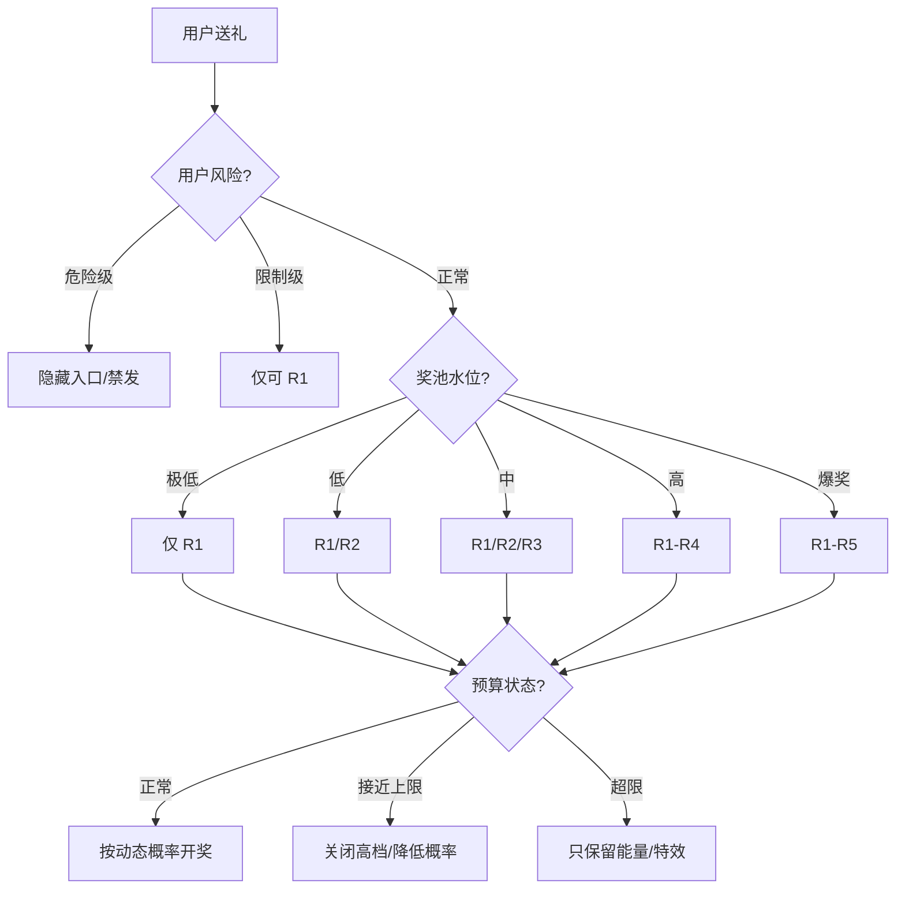

---

## 8. 不使用页面布局稿的输出建议

评审材料建议组合：

| 材料 | 用途 |
|---|---|
| 本文档 | 讲流程、讲资金、讲风控 |
| A/B/C 完整 PRD | 细节规则、字段、异常、验收 |
| README 三版对比 | 老板快速决策 |
| 后续如需 HTML | 只做流程图汇总页，不做 App 页面布局 |

---

## 9. 结论

1. **A 是基础能力**：适合先上，验证链路。
2. **B 是房间奖池**：不推荐作为主方向，合规和体验不均问题明显。
3. **C 是目标玩法**：最符合"Greedy 式共享奖池"，成本闭环最好。
4. **C 可以基于 A 迭代**：复用订单、扣款、RNG、风控、审计，只新增资金三拆、共享池、水位、动态概率和降级。

---

## 10. 待确认事项（评审会拍板点）

> 这 4 个是评审前必须老板/法务/财务过一遍的关键决策点。决策结果会直接影响 ABC 三份正式 PRD 的对应规则，**评审通过后必须回写到正式 PRD**。

### 10.1 待确认事项一览表

| # | 拍板点 | 涉及方案 | 选项 | 合规风险 | 财务影响 | 我的推荐默认 | 决策签字方 |
|---|---|---|---|:---:|:---:|---|---|
| ① | **活动结束剩余奖池金额归属** | C 版（§9.6.11） | A. 默认归平台运营成本<br>B. 转入下次活动池<br>C. 按比例慈善捐赠 | A 高 / B 中 / C 低 | A 收入+ / B 中性 / C 收入- | **C+A 混合**：60% 转下次活动，40% 慈善 | 老板 + 法务 |
| ② | **礼物券能否叠加/转赠** | C 版（§9.6.19） | A. 严格禁止（不叠不转不提现）<br>B. 可叠加但不可转赠<br>C. 全开放 | A 低 / B 中 / C 高 | A 体验弱 / B 平衡 / C 体验强 | **A 严格禁止**（合规优先） | 法务 + 产品 |
| ③ | **房主分成税务归口** | B 版（§9.6.11） | A. 平台代扣预提税<br>B. 主播自申报<br>C. 公会代扣 | A 低 / B 高 / C 中 | A 平台成本+ / B 平台无 / C 公会承担 | **A 平台代扣**（避免雷踩到平台） | 财务 + HR + 法务 |
| ④ | **概率是否公示具体数字** | A/B/C（§7.5.6 / 9.6.6） | A. 全部公示具体百分比<br>B. 仅公示理论 RTP 不公示分档<br>C. 按渠道差异化（iOS 强制公示，其他更隐晦） | A 低 / B 高 / C 中 | A 对成本无影响 / B 风险 / C 中性 | **C 渠道差异化** | 法务 + 产品 |

### 10.2 决策点流程图（评审会现场用）

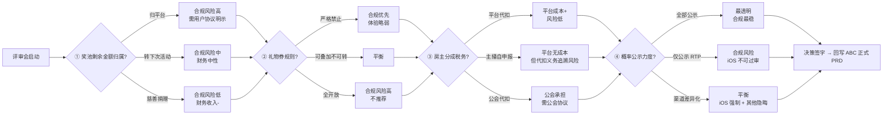

### 10.3 推荐组合（小龙虾视角）

> 嘴贱总结：合规优先 > 财务收入。MENA 监管不是过家家，亏点钱总比下架强。

| 拍板点 | 推荐选项 | 理由 |
|---|---|---|
| ① 剩余金额 | **60% 转下次活动 + 40% 慈善** | 用户协议好写、监管观感好、不直接当收入 |
| ② 礼物券 | **严格禁止叠加/转赠/提现** | 防黄牛、防被定性金融工具，体验弱一点能扛 |
| ③ 房主税务 | **平台代扣预提税** | 平台兜底比让主播自己跑税务局靠谱多了 |
| ④ 概率公示 | **渠道差异化（iOS 全公示，其他仅 RTP）** | iOS 不公示直接拒审，安卓/Web 适度灰度 |

### 10.4 决策回写流程

```
评审会决策 → 在本表"实际决定"列签字 → 产品同步到 ABC 正式 PRD 对应章节 → 通知开发/法务/财务 → 灰度上线
```

| 拍板点 | 实际决定 | 签字方 | 签字日期 | 已回写到 PRD |
|---|---|---|---|:---:|
| ① 奖池剩余金额归属 | _________ | _________ | _________ | ☐ |
| ② 礼物券规则 | _________ | _________ | _________ | ☐ |
| ③ 房主分成税务 | _________ | _________ | _________ | ☐ |
| ④ 概率公示力度 | _________ | _________ | _________ | ☐ |

---

## 11. 文档维护说明

- 本文档（流程图与流程表）= 评审会讲解材料
- ABC 三份正式 PRD = 开发对接材料
- 待确认事项决策后，**必须回写正式 PRD**，不能只留在本文档
- 决策记录建议同步到飞书/项目看板，避免后续找不到
