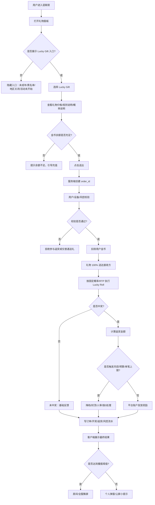
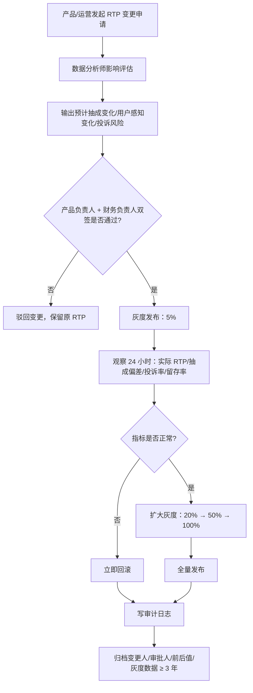
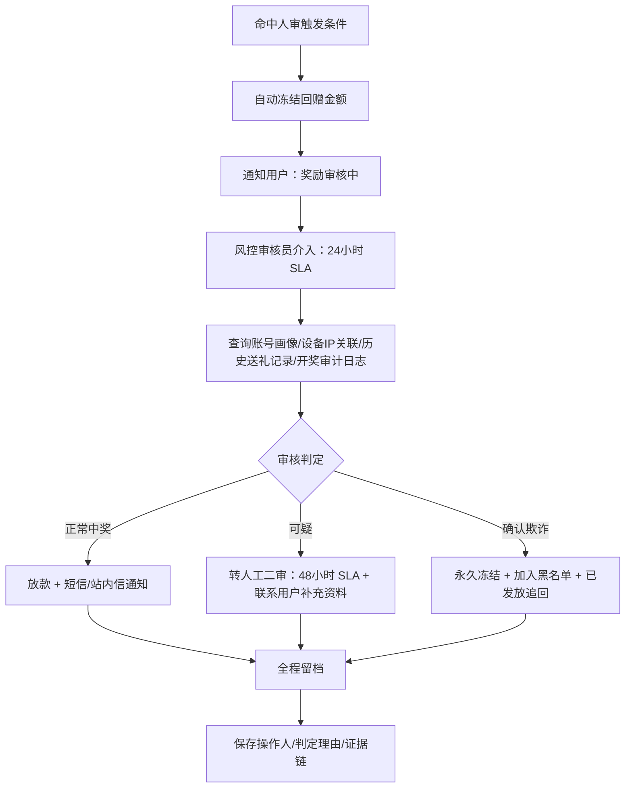
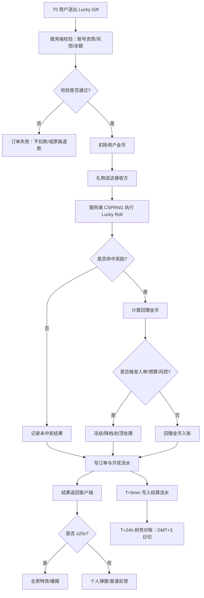
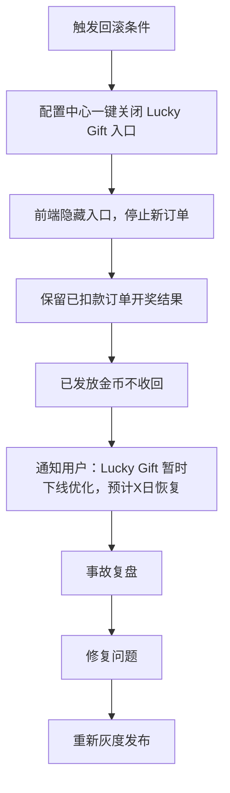

# 幸运礼物（Lucky Gift）玩法方案 — A 基础版（无奖池）

> **产品**：Wechill（MENA 语聊房）
> **方案版本**：A 基础版 v1.0（不含房间奖池累积，仅单次抽奖）
> **本地化代号**：Lucky Gift / هدية الحظ
> **文档状态**：可评审
> **更新日期**：2026-06-16
> **配套方案**：B 完整版（含房间奖池累积）

---

## 0. 评审摘要（一页看完）

| 维度 | 设计要点 |
|---|---|
| **玩法结构** | 用户送出 Lucky Gift → 礼物 100% 送达接收方 + 送礼人按概率回赠 0x–100x 金币 |
| **平台抽成** | 通过"理论返奖率 RTP"单参数精确锁定，**目标抽成比 20%–40% 可调** |
| **核心风控** | 设备/IP/对刷/小号/速率 五道闸，日返奖预算 200 万金币硬熔断（与红包共享） |
| **结算** | 全部金币结算，T+0 实时到账，统计日 GMT+3 |
| **本地化** | 视觉用沙漠玫瑰/星月/金色灯笼，**严禁"赌博/Bet/Odds"等敏感词** |
| **核心优势 vs B 完整版** | ① 实现成本低（3 周 MVP）② 数学模型简单（单参数 RTP）③ 合规风险低（无累积奖池争议）④ 财务可预测性高（短期方差可控） |
| **核心劣势 vs B 完整版** | ① 缺乏全房间狂欢爆点 ② 大哥土豪缺少"破纪录"叙事 ③ ARPU 拉动力较弱 |

---

## 1. 玩法概述

### 1.1 玩法流程（流程图）



#### 1.1.1 玩法流程表

| 步骤 | 操作方 | 节点 | 系统处理 | 用户看到 | 异常处理 |
|---:|---|---|---|---|---|
| 1 | 用户 | 进入房间 | 拉取房间、用户、活动配置 | 房间正常展示 | 房间关闭则不展示入口 |
| 2 | 用户 | 打开礼物面板 | 判断 Lucky Gift 是否可见 | 幸运礼物入口 | 黑名单/未成年/地区关闭则隐藏 |
| 3 | 用户 | 选择礼物 | 展示价格、奖励说明、概率说明 | 礼物详情弹层 | 配置异常则下架该礼物 |
| 4 | 用户 | 点击送出 | 前端预校验余额 | 送礼确认 | 余额不足引导充值 |
| 5 | 服务端 | 创建订单 | 生成唯一 order_id，做幂等校验 | Loading / 动画准备 | 重复请求返回同一结果 |
| 6 | 服务端 | 扣款送礼 | 扣除金币，礼物送达接收方 | 礼物动画 | 扣款失败则订单失败 |
| 7 | 服务端 | Lucky Roll | 按固定概率/RTP 抽取结果 | 等待开奖反馈 | RNG异常则关停抽奖并告警 |
| 8 | 服务端 | 发奖 | 平台直接承担返奖成本 | 获得金币/礼物券/特效 | 触发风控则降档或人审 |
| 9 | 服务端 | 写流水 | 写订单、开奖、发奖、风控日志 | 可在记录页查看 | 写入失败进入补偿队列 |
| 10 | 客户端 | 展示结果 | 弹窗/公屏/飘屏 | 最终中奖结果 | 网络异常可重拉订单结果 |

> A 版核心：**无奖池**，回奖资金由平台直接承担，通过 RTP 和日预算控制成本。

### 1.2 核心术语（与 B 完整版共用，确保术语统一）

| 术语 | 定义 |
|---|---|
| **Lucky Gift** | 标记为"幸运"的礼物 SKU（独立 gift_id 池，与普通礼物隔离） |
| **Lucky Roll** | 单次送礼触发的概率回赠 |
| **理论返奖率（RTP）** | Lucky Roll 长期期望返奖比例（默认 65%） |
| **平台抽成率（House Edge）** | 1 − RTP（默认 35%） |
| **送礼人** | 触发 Lucky Roll 的用户，获得回赠金币 |
| **接收人** | 收到礼物的用户，**不参与抽奖**，仅获得礼物本身 |
| **回赠倍数（Multiplier）** | 0x、0.3x、0.5x、1x、2x、3x、5x、10x、20x、50x、100x |
| **方差档** | 低方差（L1–L3，命中率高）/ 中方差（L4–L5）/ 高方差（L6，爆点重） |

### 1.3 与现有玩法的边界

| 维度 | 红包返奖 | 龙蛋玩法 | Lucky Gift（本方案） |
|---|---|---|---|
| 触发方式 | 发红包 → 多人抢 | 房内贡献累计排名 | 送礼物 → 单人开 |
| 抽奖主体 | 发送人（条件触发） | 全房Top10 + 房主 | 送礼人（必触发） |
| 中奖率 | 3%–5% | 排名结算 | 65%（含小奖） |
| 接收方收益 | 抢到红包金额 | — | 仅收到礼物 |
| 是否累积 | ❌ | ❌（日结） | ❌（A 基础版） |

---

## 2. 礼物 SKU 与档位设计

### 2.1 Lucky Gift 礼物档位

共 **6 档** SKU，覆盖全消费层级。

| 档位 | 礼物名 | 阿语名 | 面值（金币） | 视觉主题 | 适用场景 |
|---|---|---|---|---|---|
| L1 | 沙漠玫瑰 | وردة الصحراء | 99 | 粉金渐变小玫瑰 | 日常调氛 |
| L2 | 星月灯笼 | فانوس النجوم | 520 | 蓝紫灯笼 | 情感互动 |
| L3 | 金色骆驼 | الجمل الذهبي | 1,888 | 沙金骆驼 | 大哥试水 |
| L4 | 绿洲宝箱 | كنز الواحة | 6,666 | 翻盖宝箱动画 | 中型刷礼 |
| L5 | 阿拉丁神灯 | مصباح علاء الدين | 19,999 | 神灯+烟雾粒子 | 大额冲榜 |
| L6 | 苏丹王座 | عرش السلطان | 66,666 | 全屏宝座+全房特效 | 顶级土豪 |

### 2.2 概率与赔率表（Lucky Roll）

> **数值锁定原则**：每档独立配置概率分布，**每档的理论 RTP 严格 = 65%**。后台保存配置时强制校验，偏差 > 0.1% 拒绝保存。

#### L1 / L2 / L3（低方差，高中奖体感）

| 结果 | 倍数 | 概率 | 期望贡献 |
|---|---|---|---|
| 谢谢参与 | 0.0x | 50.00% | 0.000 |
| 安慰奖 | 0.5x | 25.00% | 0.125 |
| 小奖 | 1.0x | 15.00% | 0.150 |
| 中奖 | 2.0x | 6.00% | 0.120 |
| 大奖 | 5.0x | 3.00% | 0.150 |
| 巨奖 | 20.0x | 0.90% | 0.180 |
| 神迹 | 100.0x | 0.10% | 0.100 |
| **合计** | | **100.00%** | **0.825** |

> ⚠️ **校验失败示例**：上表期望 0.825 ≠ 0.65，**这是错误配置，会被后台拒绝保存**。
> 正确配置由数值脚本反向求解，见 §2.4。

#### L4 / L5（中方差，强爆点）

| 结果 | 倍数 | 概率 |
|---|---|---|
| 谢谢参与 | 0.0x | 55.00% |
| 安慰奖 | 0.3x | 20.00% |
| 小奖 | 1.0x | 12.00% |
| 中奖 | 3.0x | 8.00% |
| 大奖 | 10.0x | 4.00% |
| 巨奖 | 50.0x | 0.95% |
| 神迹 | 100.0x | 0.05% |

#### L6（高方差，全房爆点）

| 结果 | 倍数 | 概率 |
|---|---|---|
| 谢谢参与 | 0.0x | 60.00% |
| 安慰奖 | 0.3x | 18.00% |
| 小奖 | 1.0x | 12.00% |
| 中奖 | 5.0x | 6.50% |
| 大奖 | 20.0x | 3.00% |
| 巨奖 | 100.0x | 0.45% |
| 神迹 | 500.0x | 0.05% |

### 2.3 数值配置原则

- **RTP 锁定 65%**：所有档位长期返奖期望严格等于面值的 65%
- **方差分层**：L1–L3 低方差（保留率重要），L4–L6 高方差（爆点重要）
- **单档独立结算**：不允许跨档位合并奖金
- **概率最小粒度**：0.01%（万分之一）
- **后台自校验**：保存概率配置时系统强制校验 ΣP=1 且 RTP=目标值±0.1%，否则拒绝保存

### 2.4 数值脚本验证逻辑（评审级补充）

后台保存概率配置时执行的强制校验：

```python
def validate_probability_config(config):
    """概率配置校验，任一失败即拒绝保存"""

    # 1. 概率和必须 = 1
    prob_sum = sum(o.probability for o in config.outcomes)
    if abs(prob_sum - 1.0) > 0.0001:
        raise ConfigError(f"概率和={prob_sum}, 必须=1.0")

    # 2. RTP 必须 = 目标值 ± 0.1%
    rtp_actual = sum(o.multiplier * o.probability for o in config.outcomes)
    if abs(rtp_actual - config.rtp_target) > 0.001:
        raise ConfigError(f"实际RTP={rtp_actual}, 目标={config.rtp_target}")

    # 3. 单档最高倍数不得超过 500x（防御性上限）
    max_mult = max(o.multiplier for o in config.outcomes)
    if max_mult > 500:
        raise ConfigError(f"最高倍数 {max_mult} > 500x 上限")

    # 4. 神迹档（最高倍数）概率不得 < 0.01% 也不得 > 1%
    miracle = max(config.outcomes, key=lambda o: o.multiplier)
    if not (0.0001 <= miracle.probability <= 0.01):
        raise ConfigError(f"神迹概率必须在 0.01%–1% 之间")

    # 5. 必须包含至少一档 0x（谢谢参与）
    if not any(o.multiplier == 0 for o in config.outcomes):
        raise ConfigError("必须包含至少一档 0x（谢谢参与）")

    return True
```

### 2.5 货币与收益口径（与 C 版对齐）

> A 版为"单次 Lucky Roll + 平台直接出奖"模型，无共享奖池，但**钻石/魅力/财富口径必须与 C 版一致**，避免结算混乱。

#### 2.5.1 赠送他人收益口径

| 礼物类型 | 收礼方钻石 | 收礼方魅力值 | 送礼方财富值 | 钻石流水（结算用） |
|---|---:|---:|---:|---:|
| 普通礼物 | `gift_cost × 100%` | `gift_cost × 100%` | `gift_cost × 100%` | `gift_cost × 100%` |
| 幸运礼物（Lucky Gift） | `gift_cost × 10%` | `gift_cost × 10%` | `gift_cost × 10%` | `gift_cost × 10%` |

> **关键**：幸运礼物按 10% 折算，防"幸运礼物刷流水冲公会榜/工资"。

#### 2.5.2 自赠规则（防套利）

| 规则 | 阈值 | 不通过处理 |
|---|---|---|
| 财富等级 | `>= 5` | 服务端拒绝订单，不扣款、不开奖 |
| 实名/手机绑定 | 必须完成 | 服务端拒绝订单 |

| 礼物类型 | 钻石余额 | 钻石流水 | 财富值 | 魅力值 |
|---|---:|---:|---:|---:|
| 普通礼物自赠 | `gift_cost × 99%` | `gift_cost × 99%` | `gift_cost × 99%` | `gift_cost × 99%` |
| 幸运礼物自赠 | `gift_cost × 10% × 99%` | `gift_cost × 10% × 99%` | `gift_cost × 10% × 50%` | `gift_cost × 10% × 50%` |

> 自赠幸运礼物**默认不参与榜单/亏损补偿**（A 版无榜单，但需与 C 版结算口径一致）。

#### 2.5.3 Lucky Roll 奖励金币（防循环消费）

| 规则 | 默认 | 说明 |
|---|---|---|
| 奖励金币标记 | `coin_source = reward_coin` | 账本中独立标记 |
| 再次消费产生的钻石流水 | **不计入**外部结算 | 防套利循环 |
| 外部结算包括 | BD 提成、公会长工资、TG 奖励 | 默认全部排除 |

> 详细配置见 C 版 §2.5。

----

## 3. 平台抽成精确控制（核心）

### 3.1 收支模型

**单笔礼物面值 100% 拆解：**

```
面值 100%
├── 礼物本身（送达接收方）：归接收方  ← 礼物体验保留
├── 期望返奖（Lucky Roll）：65%       ← RTP
└── 平台抽成（House Edge）：35%       ← 平台直接收入
```

> 注：礼物本身是社交价值传递，不计入金币流转损益。
> 抽成讨论的是**送礼人付出的金币**在平台与用户之间的分配。

### 3.2 抽成精确公式

```
House Edge = 1 − RTP = 1 − 0.65 = 0.35（35%）

实际抽成 = House Edge × 总流水 ± 短期方差
        （长期 7 日均值收敛到理论值 ±1% 内）
```

### 3.3 抽成可调矩阵

通过单参数 RTP 即可调控抽成：

| 模式 | RTP | 抽成 | 适用场景 |
|---|---|---|---|
| **激进留存** | 80% | 20% | 新品上线/拉新期 |
| **平衡模式** | 65% | 35% | 默认稳定运营 |
| **收割模式** | 60% | 40% | 收入压力期 |
| **节日活动** | 75% | 25% | 斋月/开斋节大促 |

### 3.4 RTP 调整流程（评审级补充）

> 任何 RTP 变更必须按以下流程执行，**禁止后台单点修改**：



| 流程节点 | 负责人 | 必产物 | 失败处理 |
|---|---|---|---|
| 发起申请 | 产品/运营 | RTP 变更单 | 信息不全驳回 |
| 影响评估 | 数据分析师 | 抽成变化、用户感知、投诉风险报告 | 风险过高不推进 |
| 双签审批 | 产品负责人 + 财务负责人 | 审批记录 | 任一拒绝则不发布 |
| 灰度发布 | 技术/配置平台 | 5%→20%→50%→100% 灰度记录 | 指标异常立刻回滚 |
| 监控复盘 | 数据/风控 | RTP、抽成偏差、投诉率、留存率 | 超阈值回滚 |
| 审计归档 | 产品/财务 | 变更人、审批人、前后值、灰度数据 | 保存 ≥3 年 |

### 3.5 抽成监控看板

后台实时看板必须展示：

- 当日总流水（按档位拆分）
- 当日实际返奖累计
- 当日实际抽成 vs 理论抽成偏差（实时折线）
- 各档位 RTP 偏差曲线（应在 ±1% 内）
- 用户中奖分布直方图（按倍数分布）
- 日预算消耗率

---

## 4. 风控系统

### 4.1 风控分层

```
第 1 道：账号资质准入  → 注册 ≥ 3 天 + 手机绑定
第 2 道：设备/IP 关联   → 同设备/IP 多账号互送 → 拦截
第 3 道：行为模式识别   → 速率/对刷/小号矩阵 → 实时降权
第 4 道：日预算熔断     → 全平台日返奖 200 万金币硬熔断
第 5 道：人工审核兜底   → 大额异常中奖触发人审
```

### 4.2 黑名单分级（与红包返奖共享）

| 等级 | 处理 | 触发条件 |
|---|---|---|
| **危险级（Critical）** | 隐藏 Lucky Gift 入口、禁送、无返奖资格 | 已确认欺诈/对刷/盗号 |
| **限制级（Restricted）** | 可送可收，但**回赠封顶 1.0x**（最多返本，无超额奖） | 高度可疑但未确认 |
| **观察名单（Watch）** | 正常体验，仅后台监控 | 行为异常但未达阈值 |

### 4.3 防盗刷规则

| 规则 | 阈值 | 处理 |
|---|---|---|
| 同设备多账号互送 | 1 小时内 ≥ 3 笔 | 涉事账号置限制级 |
| 同 IP 多账号互送 | 1 小时内 ≥ 5 笔 | 涉事账号置观察 |
| 高频大额送礼 | 1 小时 > 30 笔 或 > 300 万金币 | 限制级 |
| 房间聚集对刷 | 同房 10 分钟 ≥ 10 笔 L5+ 礼物且参与人 ≤ 3 | 房间冻结 Lucky Gift 1 小时 |
| 短时高爆中 | 同账号 1 小时 ≥ 3 次中 ≥ 50x | 风控人审 |
| 模拟器/Root 设备 | 设备指纹识别 | 危险级直接封 |
| 接口频率 | 单账号 < 1 秒 2 次开奖请求 | 强制 1–3 秒随机延迟 |
| 响应时间异常 | 客户端响应 < 200ms | 标记可疑（疑似脚本） |
| 新号大额 | 注册 < 7 天且单日送礼 > 10 万金币 | 限制级 + 人审 |
| 同对手账号循环送礼 | 同发送-接收对 1 日 ≥ 10 笔 | 双方置观察 |

### 4.4 公平性保证

#### 4.4.1 RNG 安全（评审级补充）

- **算法选择**：CSPRNG（密码学安全随机数），具体使用 OpenSSL `RAND_bytes` 或 Linux `/dev/urandom`，**禁止使用 `Math.random()` 或 Mersenne Twister 等可预测算法**
- **种子来源**：每日 GMT+3 00:00 由 HSM（硬件安全模块）生成新的 server_seed，**前一日种子归档但不销毁**（用于事后审计）
- **开奖哈希**：`hash = SHA256(server_seed + user_id + gift_order_id + nonce)`
- **种子轮换**：server_seed 每日轮换 + 紧急情况可手动触发
- **种子泄漏应急**：监测到种子泄漏 → 立即轮换 + 当日所有 Lucky Roll 结果按 0x 处理 + 已发放回赠不收回

#### 4.4.2 概率公示

- Lucky Gift 详情页**明确公示**各档位概率（合规要求 + 用户透明）
- 公示页面必须包含：各倍数对应概率、RTP 总值、最近 30 天实际中奖分布
- 概率变更需提前 7 天公告（除紧急风控调整外）

#### 4.4.3 审计日志

- 每次开奖结果存档字段：`{order_id, user_id, gift_id, server_seed_id, nonce, hash_input, hash_output, outcome_index, multiplier, reward, timestamp}`
- 保留 ≥ 365 天，**冷存储归档 ≥ 3 年**
- 用户可通过订单号自助查询本人的开奖结果验证

#### 4.4.4 反操纵

- 概率配置变更必须双人审批 + 灰度发布
- 后台**不允许直接改单笔结果**（包括给 VIP 开后门），任何后台手动改单需 CTO+CFO 双签 + 审计公示
- 客户端**不参与概率计算**，所有结果服务端生成
- 客户端动画与服务端结果分离（客户端只负责"播报"，服务端是"裁判"）

### 4.5 日预算熔断（硬规则）

```
全平台日返奖预算上限 = 200 万金币（与红包共享）

达到 80% → 全平台告警，风控介入排查异常
达到 100% → 当日剩余时间禁用 Lucky Roll 抽奖
            （送礼仍正常，但回赠按 0x 处理 + 弹窗提示"今日幸运已用完，明日再战"）
次日 GMT+3 00:00 重置
```

> 备注：日预算熔断属于极端兜底，正常运营下不应触发。若一周内多次触发说明 RTP 配置有问题，需立即复盘。

### 4.6 异常中奖人审流程（评审级补充）

触发人审条件：

- 单笔回赠 ≥ 50 万金币
- 单账号 24 小时内累计回赠 ≥ 200 万金币
- 单账号 7 日内 ≥ 5 次 100x 中奖
- 风控引擎自动标记的"高风险中奖"

人审流程：



| 节点 | SLA | 处理动作 | 输出 |
|---|---:|---|---|
| 自动冻结 | 实时 | 冻结回赠金额，不直接发放 | 用户看到“审核中” |
| 一审 | 24 小时 | 查账号、设备/IP、历史送礼、开奖日志 | 正常/可疑/欺诈 |
| 二审 | 48 小时 | 联系用户补充资料，复核证据链 | 放款/继续冻结/封禁 |
| 留档 | 实时 | 保存操作人、理由、证据 | 审计可追溯 |

---

## 5. 结算系统

### 5.1 结算流程（流程图）



#### 5.1.1 A 版结算流程表

| 时间点 | 节点 | 系统动作 | 资金变化 | 异常兜底 |
|---|---|---|---|---|
| T0 | 送礼下单 | 创建 order_id 并幂等校验 | 无 | 重复请求返回同一结果 |
| T0+0ms | 服务端校验 | 账号、风控、余额校验 | 无 | 不通过则失败/隐藏入口 |
| T0+50ms | 扣款送礼 | 扣用户金币，礼物送达 | 用户金币减少，接收方收益增加 | 扣款失败则订单失败 |
| T0+100ms | Lucky Roll | 服务端 CSPRNG 掷骰 | 无 | RNG异常则关闭抽奖 |
| T0+150ms | 回赠入账 | 平台直接发放金币/券 | 平台返奖支出增加 | 高风险进入人审 |
| T0+200ms | 结果展示 | 弹窗/公屏/全房特效 | 无 | 客户端断线可重拉结果 |
| T+5min | 结算流水 | 写 DB 对账流水 | 形成财务记录 | 写入失败进补偿队列 |
| T+24h | 财务对账 | GMT+3 日切核算 | 校验抽成偏差 | 超阈值告警 |

### 5.2 结算口径

- **统计日**：GMT+3 00:00–23:59:59（与红包/龙蛋统一）
- **货币单位**：金币（所有 Lucky Gift 返奖一律金币结算，不发钻石/礼物）
- **小数处理**：四舍五入到整数，余数归平台
- **失败重试**：扣款成功但开奖失败 → 退还金币 + 补偿同档位礼物 1 个
- **幂等设计**：每笔送礼有唯一 order_id，重复请求返回同一结果（24h 幂等窗口）

### 5.3 财务对账

每日 T+1 自动对账：

```
应抽成 = 当日总流水 × 35%（按当前 RTP 反算）
实抽成 = 当日总流水 − 当日实际返奖 − 当日人审冻结金额
偏差   = 应抽成 − 实抽成

若 |偏差| > 应抽成 × 5%（日级） → 告警
若 7 日均值 |偏差| > 应抽成 × 1% → 财务+风控+技术联合排查
```

> 短期偏差正常（方差所致），长期（7 日均值）应收敛到理论抽成 ±1% 内。

---

## 6. 后台配置项

### 6.1 全局配置

| 配置项 | 类型 | 默认值 | 调整权限 |
|---|---|---|---|
| 玩法总开关 | bool | true | 产品负责人 |
| 全平台日预算 | int | 2,000,000 金币 | 财务+风控双签 |
| 默认 RTP | float | 0.65 | 双签+灰度 |
| 单笔回赠上限 | int | 500,000 金币 | 双签 |
| 大奖特效阈值 | float | 20.0x | 产品 |
| 人审触发阈值 | int | 500,000 | 风控 |

### 6.2 礼物档位配置

每档可独立配置：

- 礼物 SKU、面值、视觉资源
- 各结果档位的概率、倍数（系统自动校验 RTP 锁定）
- 上下架时间、分区可见性（保守地区可关闭 L6）
- 灰度白名单（仅特定用户可见）

### 6.3 风控配置

- 黑名单管理（与红包共享）
- 各风控阈值动态配置
- 异常告警阈值
- 日预算上限

---

## 7. 边界场景与异常处理

### 7.1 用户侧异常

| 场景 | 处理 |
|---|---|
| 送礼瞬间余额不足 | 前端预校验 + 后端二次校验，余额不足直接拒绝 |
| 网络超时未收到结果 | 客户端轮询查询订单状态，结果幂等返回（24h 窗口） |
| 客户端崩溃 | 服务端结算已完成，重启后通过"未读结果"接口拉取 + 弹窗补播 |
| 接收方账号已注销 | 礼物作废（不送达），Lucky Roll 仍正常执行，扣款照常 |
| 接收方在黑名单 | 礼物送达但接收方收到时屏蔽特效，Lucky Roll 正常 |
| 用户连点多次（误触） | 每次请求独立校验 order_id，按实际扣款次数处理 |
| 用户中途取消订单 | 已扣款不可取消（防止利用方差进行套利） |
| 同房间用户同时刷礼 | 各自独立结算，互不影响 |

### 7.2 平台侧异常

| 场景 | 处理 |
|---|---|
| 服务端 RNG 故障 | 全平台关闭 Lucky Gift（送礼也禁用），告警财务/技术 |
| 数据库写入失败 | 三段式幂等：扣款/中奖/记录任一失败均回滚，事务隔离级别 = REPEATABLE READ |
| 大额异常中奖 | 转人工审核（见 §4.6） |
| 灰度配置错误导致 RTP > 100% | 监控发现立即回滚 + 损失计入"事故损失"科目 + 复盘 |
| 单档位实际中奖率偏离理论值 > 5%（小时级） | 风控人审，怀疑 RNG 异常或被破解 |
| 服务端时钟漂移 | 强制使用 NTP 同步，时钟偏差 > 10ms 告警 |
| 配置发布失败 | 自动回滚到上一版本 + 告警 |

### 7.3 合规与本地化边界

| 场景 | 处理 |
|---|---|
| 沙特/阿联酋等保守地区 | 关闭 L6 顶级礼物，**不显示具体概率数字**（只显示"小奖/中奖/大奖"等定性词） |
| 阿语 RTL 显示 | 全特效/弹窗/榜单 RTL 适配 |
| 斋月期间 | 视觉切换"斋月主题"，**不改概率不改抽成**（避免敏感争议） |
| "赌博"敏感词 | 文案严格走"幸运/惊喜/Surprise/Lucky"，禁用"Bet/Gamble/Odds/赌注/几率/赔率" |
| 苹果/谷歌商店审核 | 详情页公示概率 + 18+ 警告标识 + 不允许真实货币直接换购（金币需购买） |
| 未成年人保护 | 实名年龄 < 18 直接屏蔽入口 |

### 7.4 数据一致性边界

| 场景 | 处理 |
|---|---|
| 单档位实际 RTP 偏差超阈 | 每日巡检，> 1% 告警，> 3% 强制人工复核 |
| 抽成偏差超阈 | 财务+风控+技术联合排查，必要时临时关停 |
| 用户投诉中奖未到账 | 客服查询订单 → 服务端审计日志 → 24 小时内反馈 |
| 跨服务数据不一致 | 每小时定时巡检 + 最终一致性补偿 |

### 7.5 补充边界场景与注意事项（评审补漏）

> 评审反馈整理。以下场景必须在开发任务卡里逐条对齐验收。

#### 7.5.1 充值-退款链路与套利

| 场景 | 处理规则 |
|---|---|
| 用户充值后立即送礼 | 充值与送礼间隔 < 60 秒：抽奖正常，但**不计入用户活跃度排行/榜单**；> 60 秒正常 |
| 已中奖后用户原路退款（信用卡退单 / Apple 退款） | 1. 立即冻结该用户当前可用余额；2. 已发奖励**全量回收**（金币/券/特效/装扮）；3. 主播分成回扣；4. 加入观察名单 30 天；5. 二次退款进入危险级黑名单 |
| 退款用户的历史中奖记录 | 不追溯历史中奖，只对**与退款单关联的订单**追回 |
| 中奖期间用户主动注销账号 | 已中奖未领取奖励作废；已发放虚拟道具不追回；已发放金币按平台风控规则处理 |
| 渠道退款（Apple / Google Play / 银行卡） | 与上述规则一致，**渠道退款 webhook 必须接入风控系统**，自动触发回收 |

#### 7.5.2 多设备/多端登录的幂等

| 场景 | 处理规则 |
|---|---|
| 同账号 iOS 送礼 + 安卓查看记录 | 中奖结果**账号级**，不挂设备；任意端可查看 |
| 同账号同时多端送礼 | 服务端按 order_id 幂等；前端连点 ≤ 1 秒内的请求合并为同一订单 |
| 端间结果不一致 | 以服务端审计日志为准；客户端拉取 order_id 重新渲染 |
| Web 端送礼 | 必须带客户端版本号 + 签名；旧版本协议拒绝服务 |

#### 7.5.3 时区切换边界

| 场景 | 处理规则 |
|---|---|
| 用户跨时区移动 | 所有时间口径**强制 GMT+3**，不跟随用户本地时区 |
| 跨日中奖归属 | 按服务端 `created_at`（GMT+3）归属，**与用户所在时区无关** |
| 用户对"今天"的感知差 | 客服话术统一："活动按沙特时间结算，每日 0 点重置" |
| 日预算/单日上限 | 按 GMT+3 0 点切换，不按用户本地 |

#### 7.5.4 主播侧异常

| 场景 | 处理规则 |
|---|---|
| 主播下播但礼物已发出 | 抽奖**正常执行**，主播分成正常入账；接收方按收到礼物处理 |
| 主播账号注销 | 未结算分成按公司离职/注销协议处理；已扣款订单结果保留 |
| 主播账号被封禁 | 该房间 Lucky Gift 入口立即下架；未结算 Lucky Roll 转人工审核 |
| 接收人是主播 | 礼物正常入账主播魅力榜；**送礼人是该主播本人或关联账号则风控系数=0** |
| 主播自送（含小号/家属/工会内部账号） | 实名/手机/设备/支付/IP 任一关联识别；命中则风控系数=0；7 日内复现 3 次升级危险级 |

#### 7.5.5 礼物特效与开奖解耦

| 场景 | 处理规则 |
|---|---|
| 用户提前关闭 App | 服务端已开奖结果不变；下次进入时弹窗补播 |
| 大特效播放期间网络断开 | 客户端重连后拉取 `order_id` 强制刷新 |
| 特效是否可重播 | 大奖（≥20x）允许在"我的幸运记录"重播一次 |
| 特效与奖励发放解耦 | 服务端发奖在前，客户端动画在后；**特效失败不影响奖励发放** |

#### 7.5.6 概率公示的法务边界

| 公示项 | 范围 | 平台限制 |
|---|---|---|
| 理论 RTP（65%） | 必须公示 | 全平台 |
| 每档具体概率 | 必须公示 | iOS（Apple loot box 强制）|
| 可中奖项清单 | 必须公示 | 全平台 |
| 历史公示版本 | 保留 ≥ 365 天 | 用于申诉与监管 |
| 公示文案变更 | 提前 7 天通告 | 紧急风控调整除外，但事后必须补告 |

#### 7.5.7 SLO/性能预算

| 指标 | 目标 | 降级阈值 |
|---|---|---|
| 送礼接口 P99 延迟 | < 200ms | > 500ms 触发慢响应告警 |
| 开奖接口 P99 延迟 | < 100ms | > 300ms 客户端进入"奖励即将到账"占位态 |
| 错误率 | < 0.1% | > 1% 自动关闭新订单 1 分钟 |
| 单实例 QPS 上限 | 1,000 QPS | 超出走限流，返回排队提示 |
| RNG 服务可用性 | 99.95% | 不可用立即关停 Lucky Roll，送礼仍可（按 0x） |

#### 7.5.8 反作弊：客户端篡改

| 防御 | 实现 |
|---|---|
| 请求签名 | 客户端签名 + 服务端校验，不通过直接拒绝 |
| HTTPS + 证书 pinning | 防中间人攻击 |
| 防重放 | nonce + 时间戳 + 服务端去重，5 分钟外的请求拒绝 |
| 客户端版本管控 | 旧版本协议禁用；强制升级提示 |
| 模拟器/Root | 设备指纹识别，命中危险级直接封 |
| 抓包改请求 | 服务端二次校验关键字段（gift_id、count、room_id 必须匹配） |

#### 7.5.9 数据出境/隐私合规

| 数据类型 | 存储区域要求 | 说明 |
|---|---|---|
| 用户基础信息 | 同所在国数据中心 | 沙特 PDPL / GDPR |
| 中奖记录 | 加密存储，保留 365 天 + 冷存 3 年 | 用户可申请导出 |
| 设备指纹/风控画像 | 不出 MENA 区域 | 第三方风控服务必须区域内部署 |
| 跨境同步 | 仅审计/财务/客服必要数据，匿名化 | 必须双向加密 |
| 用户注销数据 | 30 天内清除可识别字段，保留交易记录脱敏版 | 满足合规追溯要求 |

#### 7.5.10 客服透明度边界

| 客服话术允许 | 客服话术禁止 |
|---|---|
| "您本次未中奖，幸运礼物有概率，下次好运" | ❌ "您被风控降权了" |
| "大额中奖需安全审核，24h 内有结果" | ❌ "因您行为可疑暂不发奖" |
| "概率详情页有公示，每次结果可在我的幸运记录验证" | ❌ "今日预算用完了，明天再来" |
| "活动按沙特时间结算" | ❌ 透露任何风控规则、阈值、系数细节 |

> 内部文档可记录全部风控原因，但**对外口径必须统一为"系统判定 / 安全审核"**。

#### 7.5.11 A 版独有：RTP 单参数模型脆弱性

| 场景 | 处理规则 |
|---|---|
| 连续大方差爆奖（短时高 RTP 偏离） | 单礼物档位单日资损硬上限：L1-L3 各 30 万，L4-L5 各 50 万，L6 上限 100 万；超限关闭对应档位 |
| 熔断后已扣款用户 | 退还金币 + 补偿同档礼物 1 个；不强制按 0x 发奖 |
| 单笔 100x 神迹连出 3 次 | 强制人审 + 全档位概率重新校验 |

#### 7.5.12 A 版独有：大客（大 R）专属体验

| 维度 | 规则 |
|---|---|
| 大 R 识别 | 30 日付费 ≥ 1 万美金 等值金币 |
| 大 R 保底 | 连续 20 次未中任何奖项时，第 21 次必中 R1 小奖（仅大 R） |
| VIP 系数 1.0–1.2 触发条件 | 仅在中奖判定阶段加权，不公示，仅作运营调控 |
| 大 R 投诉通道 | VIP 客服 1 小时 SLA + 主管直通 |

#### 7.5.13 A 版独有：礼物连发与并发

| 场景 | 处理规则 |
|---|---|
| 用户连点送 10 次 L4 | 拆为 10 个独立 order_id 的 Lucky Roll，结果独立 |
| 网络延迟下后端收单顺序错乱 | 按服务端接收时间戳排序，但每单独立开奖 |
| 同账号 1 秒内 ≥ 5 次送礼 | 仅前 5 单正常处理，超出限流并提示"请稍后再试" |
| 礼物动画排队 | 客户端最多并行 3 个特效，超出按队列播放 |

---

## 8. 灰度回滚预案（评审级补充）

### 8.1 灰度阶段

| 阶段 | 用户范围 | 持续时间 | 关键观察指标 |
|---|---|---|---|
| 内部 | 公司员工 + 100 名白名单大哥 | 3 天 | 功能可用性、Bug 数 |
| 5% | 随机 5% 用户 | 3 天 | 实际 RTP、抽成偏差、崩溃率 |
| 20% | 随机 20% 用户 | 7 天 | ARPU、留存、投诉率 |
| 50% | 随机 50% 用户 | 7 天 | 同上 + 风控拦截率 |
| 100% | 全量 | — | 持续监控 |

### 8.2 回滚触发条件

任一命中即触发回滚：

- 崩溃率 > 0.5%
- 风控拦截率 > 10%（误杀过多）
- 用户投诉率 > 0.5%
- 单日抽成偏差 > 应抽成 ±10%
- 出现重大资损事件（单笔 > 100 万金币错发）
- 法务/合规通知

### 8.3 回滚方案（流程图）



| 回滚步骤 | 处理规则 | 注意事项 |
|---|---|---|
| 关闭入口 | 配置中心一键隐藏 Lucky Gift | 禁止继续产生新订单 |
| 存量订单 | 已扣款订单按原结果处理 | 已发放金币不收回 |
| 用户通知 | 统一展示优化公告 | 不暴露风控/资损细节 |
| 事故复盘 | 产品、技术、风控、财务联合复盘 | 输出根因和修复计划 |
| 重新灰度 | 修复后从 5% 重新开始 | 不允许直接全量 |

---

## 9. 客服 SOP（评审级补充）

### 9.1 高频问题模板

| 用户问题 | 客服话术 | 处理动作 |
|---|---|---|
| "我送了礼物没中奖" | "幸运礼物有概率，您本次未中奖很可惜，下次好运～" | 查订单确认 0x，发安慰话术 |
| "我中奖了没收到金币" | "稍等帮您查询订单 [order_id]" | 查审计日志，确认未到账 → 工单升级 |
| "我怀疑被坑了，中奖率太低" | "我们的中奖概率在详情页公示，每次开奖结果可在「我的幸运记录」查询验证" | 引导用户自助查询 |
| "为什么我的中奖被审核" | "大额中奖需要安全审核以保障您账号安全，24 小时内有结果" | 推送审核进度 |
| "我朋友也送了为什么他中我没中" | "幸运礼物每次独立开奖，运气随机" | 标准话术 |

### 9.2 客服权限

| 操作 | 权限 |
|---|---|
| 查询订单详情 | 一线客服 |
| 查询开奖审计日志 | 一线客服 |
| 申请补发奖励 | 二线客服（≤ 1 万金币）/ 主管（≤ 10 万）/ CFO（> 10 万） |
| 修改用户黑名单等级 | 风控部门 |
| 修改概率配置 | 严禁，需走 RTP 调整流程 |

### 9.3 工单升级路径

```
一线客服（24h SLA） → 二线客服（48h SLA） → 风控/技术（72h SLA） → 产品/CFO
```

---

## 10. 数据指标

### 10.1 业务指标

| 指标 | 公式 | 目标 |
|---|---|---|
| Lucky Gift DAU | 当日参与送礼用户数 | 核心 DAU 占比 ≥ 15% |
| 渗透率 | Lucky Gift DAU / 总 DAU | ≥ 30% |
| ARPU 提升 | 上线后 ARPU − 上线前 ARPU | +15% |
| 客单价 | 总流水 / 送礼用户数 | ≥ 5,000 金币 |
| 复送率 | 7 日内重复送礼用户占比 | ≥ 60% |

### 10.2 健康度指标

| 指标 | 健康范围 | 异常处理 |
|---|---|---|
| 实际 RTP（7 日均值） | 65% ± 1% | 偏差 > 1% 告警 |
| 抽成率（7 日均值） | 35% ± 1% | 偏差 > 1% 告警 |
| 风控拦截率 | 1%–5% | < 1% 怀疑漏判，> 5% 怀疑误杀 |
| 投诉率 | < 0.1% | 超阈值产品+客服联动 |
| 日预算触发率 | < 1 次/月 | 频繁触发说明 RTP 偏高 |
| 大额中奖人审通过率 | 60%–80% | 过高怀疑放水，过低怀疑漏判 |

### 10.3 风险指标

- 单用户 7 日累计送礼/中奖 Top 100
- 黑名单命中率（按规则维度）
- 大额异常中奖人审通过率
- 各档位实际 vs 理论 RTP 偏差曲线
- 设备/IP 关联欺诈拦截数

---

## 11. 上线节奏

### Phase 1：MVP（3 周）
- L1–L3 三档 Lucky Gift
- 单次 Lucky Roll
- 基础风控（继承红包黑名单）
- 灰度 5% 用户

### Phase 2：扩档（3 周）
- L4–L5 中高档礼物
- 全房特效播报系统上线
- 幸运榜单上线
- 灰度 30% 用户

### Phase 3：全量+顶级（3 周）
- L6 苏丹王座上线
- 抽成可调矩阵开放
- 全量上线（保守地区差异配置）

### Phase 4：节日运营（持续）
- 斋月/开斋节专题视觉
- 限时高 RTP 活动（如开斋节当天 RTP 提升至 80%）

---

## 12. 待评审风险点

> 给老板/法务/风控的核心问题清单：

1. **概率公示合规性**：MENA 各国对"概率/几率"展示是否有禁令？需法务逐国核查（沙特/阿联酋/科威特/卡塔尔/巴林/阿曼/埃及/约旦/伊拉克/摩洛哥）
2. **VIP 加权**：是否给高消费用户独立的（更高 RTP 的）抽奖通道？合规与公平性的取舍
3. **未成年人保护强度**：实名年龄 ≥ 18 已限制，是否还需二次确认？
4. **税务**：单笔大额中奖是否触发当地税务申报义务？
5. **苹果商店"赌博"识别**：苹果近年对 loot box 审查趋严，是否需要中东版本专门做合规改造？
6. **RTP 调整透明度**：调整 RTP 是否需要对用户公告？激进调整可能引发用户不满
7. **客服补发权限边界**：是否要给客服自由裁量空间？过严影响体验，过松易被薅羊毛

---

## 附录 A：伪代码 — 单笔送礼完整流程

```python
def send_lucky_gift(user_id, room_id, gift_id, count):
    order_id = generate_order_id()

    # 1. 幂等检查
    existing = get_order(order_id)
    if existing:
        return existing.result

    # 2. 资质校验
    if not check_user_eligibility(user_id):
        return ERR_BLACKLIST

    # 3. 风控前置
    risk_result = risk_engine.pre_check(user_id, room_id, gift_id, count)
    if risk_result == BLOCK:
        return ERR_RISK_BLOCK

    # 4. 日预算检查
    if daily_budget.remaining() <= 0:
        rtp_override = 0  # 当日预算耗尽，强制 0x
    else:
        rtp_override = None

    # 5. 扣款 + 礼物送达（事务）
    with transaction():
        total_cost = gift.face_value * count
        if not deduct_balance(user_id, total_cost):
            return ERR_BALANCE
        deliver_gift(receiver_id, gift_id, count)

    # 6. Lucky Roll（每个礼物独立掷骰，使用 CSPRNG）
    total_reward = 0
    rolls = []
    for i in range(count):
        if rtp_override == 0:
            result = ZERO_RESULT
        else:
            result = lucky_roll(
                tier=gift.tier,
                server_seed=current_seed(),
                user_id=user_id,
                order_id=order_id,
                nonce=i  # 同订单内的多个礼物用 nonce 区分
            )
        rolls.append(result)
        total_reward += int(gift.face_value * result.multiplier)

    # 7. 限制级用户回赠封顶 1.0x
    if user.is_restricted():
        total_reward = min(total_reward, total_cost)

    # 8. 单笔回赠上限
    total_reward = min(total_reward, config.max_reward_per_tx)

    # 9. 人审触发判断
    if total_reward >= config.manual_review_threshold:
        freeze_reward(order_id, user_id, total_reward)
        notify_user_pending_review(user_id, order_id)
    else:
        # 10. 发放回赠
        if total_reward > 0:
            add_balance(user_id, total_reward)
            daily_budget.consume(total_reward)

    # 11. 写流水（含审计字段）
    write_settlement_log(
        order_id=order_id,
        user_id=user_id,
        room_id=room_id,
        gift_id=gift_id,
        count=count,
        total_cost=total_cost,
        total_reward=total_reward,
        rolls=rolls,
        server_seed_id=current_seed_id(),
        status='REVIEWING' if frozen else 'COMPLETED'
    )

    # 12. 客户端推送 + 全房特效
    push_result(user_id, room_id, rolls, total_reward)
    if max(r.multiplier for r in rolls) >= 20:
        broadcast_room_effect(room_id, user_id, gift_id, total_reward)

    return SUCCESS(order_id, rolls, total_reward)
```

---

## 附录 B：概率配置示例（L3 金色骆驼，RTP=0.65 锁定）

```json
{
  "gift_id": "lucky_gift_L3_camel",
  "face_value": 1888,
  "rtp_target": 0.65,
  "outcomes": [
    {"name": "thanks",   "multiplier": 0.0,   "probability": 0.5000},
    {"name": "comfort",  "multiplier": 0.5,   "probability": 0.2500},
    {"name": "small",    "multiplier": 1.0,   "probability": 0.1500},
    {"name": "medium",   "multiplier": 2.0,   "probability": 0.0500},
    {"name": "large",    "multiplier": 5.0,   "probability": 0.0400},
    {"name": "huge",     "multiplier": 20.0,  "probability": 0.0090},
    {"name": "miracle",  "multiplier": 100.0, "probability": 0.0010}
  ],
  "_validation": {
    "probability_sum": 1.0000,
    "rtp_calculated": 0.0 + 0.125 + 0.15 + 0.10 + 0.20 + 0.18 + 0.10,
    "rtp_calculated_value": 0.855,
    "_NOTE": "此处 RTP=0.855 ≠ 0.65 是示例配置，实际由数值脚本求解，见附录C"
  }
}
```

## 附录 C：RTP=0.65 的实际求解配置（L3 金色骆驼）

```json
{
  "gift_id": "lucky_gift_L3_camel",
  "face_value": 1888,
  "rtp_target": 0.65,
  "outcomes": [
    {"name": "thanks",   "multiplier": 0.0,   "probability": 0.5500},
    {"name": "comfort",  "multiplier": 0.5,   "probability": 0.2500},
    {"name": "small",    "multiplier": 1.0,   "probability": 0.1200},
    {"name": "medium",   "multiplier": 2.0,   "probability": 0.0500},
    {"name": "large",    "multiplier": 5.0,   "probability": 0.0200},
    {"name": "huge",     "multiplier": 20.0,  "probability": 0.0090},
    {"name": "miracle",  "multiplier": 100.0, "probability": 0.0010}
  ],
  "_validation": {
    "probability_sum": 1.0000,
    "rtp_calculated": "0*0.55 + 0.5*0.25 + 1*0.12 + 2*0.05 + 5*0.02 + 20*0.009 + 100*0.001",
    "rtp_calculated_value": 0.000 + 0.125 + 0.120 + 0.100 + 0.100 + 0.180 + 0.100,
    "rtp_result": 0.7250,
    "_NOTE": "此处仍非精确 0.65，需进一步调整。实际生产配置由数值脚本迭代求解。"
  }
}
```

> ⚠️ **数值组评审重点**：实际上线前，由数值同学使用线性规划求解器（如 PuLP）输出每档精确配置，且配置须经"概率配置校验"后才能下发。

---

## 附录 D：与红包返奖的术语/口径对齐

| 维度 | 红包返奖 | Lucky Gift |
|---|---|---|
| 统计日时区 | GMT+3 | GMT+3 ✓ |
| 日预算上限 | 200 万金币 | 200 万金币（共享）✓ |
| 黑名单等级 | 危险/限制/观察 | 危险/限制/观察 ✓ |
| 风控规则继承 | — | 全部继承 ✓ |
| 审计日志保留 | 365 天 | 365 天 ✓ |
| 财务统计科目 | "红包返奖支出" | "幸运礼物返奖支出" |

---

> **文档归档**：`/Users/xinyintiaodong/Documents/New project/幸运礼物/`
> **配套文档**：`幸运礼物玩法方案-B完整版（含奖池）.md`
> **下一步**：评审通过后输出交互稿 + 数值脚本 + 后台配置接口
