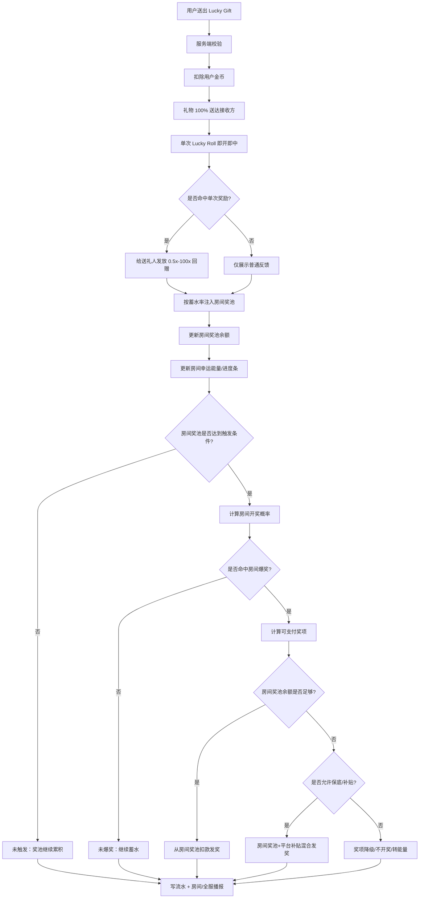
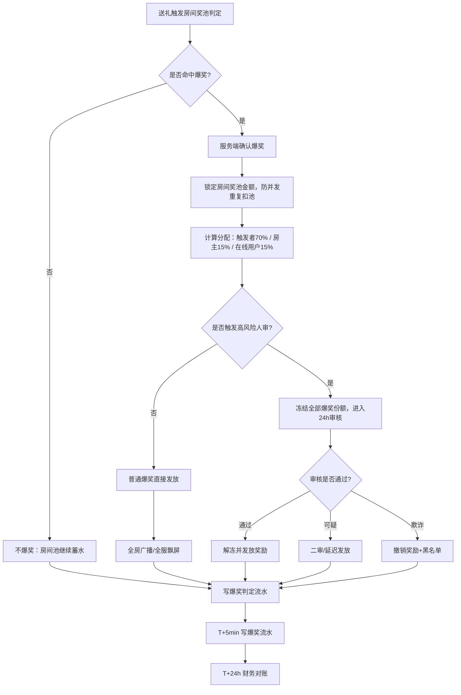
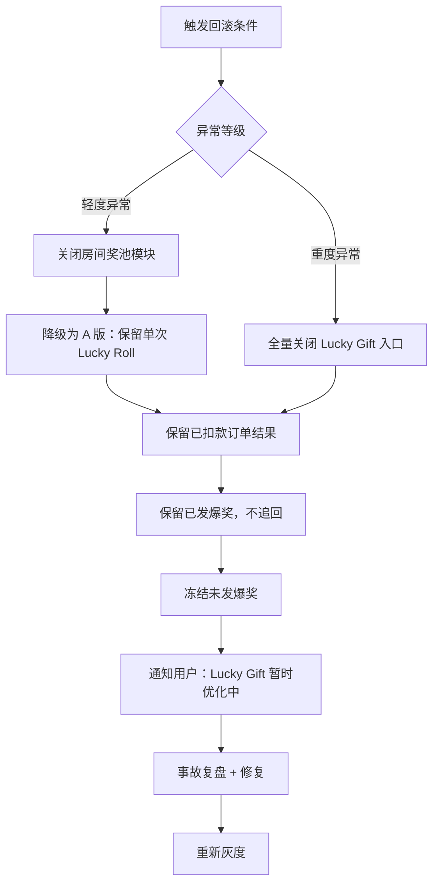

# 幸运礼物（Lucky Gift）玩法方案 — B 完整版（含奖池）

> **产品**：Wechill（MENA 语聊房）
> **方案版本**：B 完整版 v1.0（单次抽奖 + 房间奖池累积）
> **本地化代号**：Lucky Gift / هدية الحظ
> **文档状态**：可评审
> **更新日期**：2026-06-16
> **配套方案**：A 基础版（无奖池累积）

---

## 0. 评审摘要

| 维度 | 设计要点 |
|---|---|
| **玩法结构** | 双层：① 单次 Lucky Roll（即开即中）+ ② 房间奖池累积（达阈爆奖） |
| **平台抽成** | 通过 RTP + 蓄水率双参数精确控，**目标抽成比 15%–35% 可调** |
| **奖池模型** | 每房间独立奖池，单池上限 500 万金币，超出进溢出池 |
| **核心兜底** | 平台保底基金（≥5000万）+ 最低爆奖保证（按房间等级） |
| **核心风控** | 五道闸 + 奖池专属风控（防房间对刷养池）+ 日预算 200 万熔断 |
| **结算** | 全金币结算，T+0 实时，统计日 GMT+3 |
| **核心优势 vs A 基础版** | ① 全房狂欢爆点（爆奖时全房瓜分） ② 大哥破纪录叙事强 ③ 留存房间锁定（奖池=用户资产）④ ARPU 拉动力强 |
| **核心劣势 vs A 基础版** | ① 实现成本高（11 周）② 数学模型复杂 ③ 合规风险高（"奖池"接近彩票概念）④ 财务可预测性低 |

---

## 1. 玩法概述

### 1.1 玩法分层（流程图）



#### 1.1.1 B 方案流程表

| 阶段 | 节点 | 输入 | 处理规则 | 输出 | 成本归属 |
|---|---|---|---|---|---|
| 准入 | 用户/房间校验 | user_id、room_id | 用户、房间、主播均需通过风控 | 可送/不可送 | 无 |
| 扣款 | 扣用户金币 | gift_cost | 扣除幸运礼物面值 | 用户金币减少 | 用户支付 |
| 送礼 | 礼物送达 | gift_id、receiver_id | 礼物 100% 送达 | 接收方获得礼物收益 | 用户支付 |
| 单抽 | Lucky Roll | RTP=60%、概率表 | 给送礼人即时回赠 | 0x-100x 结果 | 平台承担/预算控制 |
| 蓄水 | 房间奖池增加 | gift_cost × 蓄水率 | 默认 8% 注入当前房间池 | 房间奖池余额增加 | 用户支付转入池 |
| 进度 | 房间能量增长 | gift_cost、energy_ratio | 前端展示进度条 | 房间氛围增强 | 无现金成本 |
| 触发 | 判断是否开奖 | pool_balance、触发条件 | 金额阈值/概率/时间/活动配置 | 开/不开 | 无 |
| 支付 | 发放房间爆奖 | reward_cost | 优先房间池出，不足再看保底 | 用户/房主/在线用户得奖 | 房间池/平台补贴 |
| 结算 | 财务对账 | pool_in、pool_out、subsidy | 期初+注入-支出=期末 | 对账报表 | 无 |

> B 版核心：**房间独立奖池**。该方案保留用于对比，但不等于 C 版的 Greedy 式玩法级共享奖池。

### 1.2 核心术语（与 A 基础版共用 + 奖池专属）

**通用术语**：见 A 基础版 §1.2

**奖池专属术语**：

| 术语 | 定义 |
|---|---|
| **Jackpot Pool** | 房间维度累积的奖池金额 |
| **蓄水率（Funding Rate）** | 单笔礼物面值注入奖池的比例（默认 8%） |
| **触发者** | 送出导致爆奖那笔礼物的用户，主获奖者 |
| **保底基金（Insurance Fund）** | 平台预存基金，用于奖池不足时垫付 |
| **溢出池（Overflow Pool）** | 奖池超过上限后，超出部分计入平台收入 |
| **最低爆奖保证（Min Burst）** | 按房间等级保证的最小爆奖金额 |

### 1.3 与 A 基础版的差异

| 维度 | A 基础版 | B 完整版 |
|---|---|---|
| 抽奖 | 仅单次 Lucky Roll | 单次 Lucky Roll + 奖池爆奖 |
| 抽成参数 | 仅 RTP | RTP + 蓄水率 |
| 实现成本 | 3 周 MVP | 4 周 MVP（仅奖池单层）+ 7 周完整版 |
| 全房特效 | ≥20x 大奖播报 | ≥20x + 奖池爆奖播报 |
| 房主收益 | ❌ | ✅（爆奖瓜分 15%） |
| 房间留存效应 | 弱 | 强（奖池=用户共同资产） |

---

## 2. 礼物 SKU 与档位（与 A 基础版完全一致）

> **设计原则**：礼物 SKU/档位/概率配置与 A 基础版完全相同，确保两个方案可平滑互切。

详见 A 基础版 §2.1–§2.4。本节只补充 B 版差异：

### 2.1 B 版差异：单次 Lucky Roll 的 RTP 调整

由于增加了奖池蓄水（8%），且奖池长期会回流给用户，**单次 Lucky Roll 的 RTP 可适当下调至 60%**，给奖池让出空间：

```
单笔面值 100% 拆解（B 完整版）：
├── 礼物本身（送达接收方）：归接收方
├── 单次 Lucky Roll 期望返奖：60%（vs A 版 65%）
├── 蓄水进奖池（长期回流用户）：8%
└── 平台抽成：32%
```

> 长期视角：用户实际拿回 = 60% (Lucky Roll) + 8% (奖池回流) = 68% > A 版的 65%
> 但平台抽成 32% < A 版 35%，**B 版略让利换取更强爆点和留存**。

### 2.2 单次 Lucky Roll 概率表（B 版，RTP=60%）

#### L1 / L2 / L3（低方差）

| 结果 | 倍数 | 概率 |
|---|---|---|
| 谢谢参与 | 0.0x | 55.00% |
| 安慰奖 | 0.5x | 25.00% |
| 小奖 | 1.0x | 12.00% |
| 中奖 | 2.0x | 5.00% |
| 大奖 | 5.0x | 2.00% |
| 巨奖 | 20.0x | 0.90% |
| 神迹 | 100.0x | 0.10% |

#### L4 / L5（中方差）/ L6（高方差）

> 数值脚本反向求解，确保 RTP=0.60 ± 0.001。配置示例略，求解逻辑同 A 版 §2.4。

### 2.3 货币与收益口径（与 C 版对齐）

> B 版为"房间独立奖池"模型，但**钻石/魅力/财富口径必须与 C 版一致**，避免结算混乱。

#### 2.3.1 赠送他人收益口径

| 礼物类型 | 收礼方钻石 | 收礼方魅力值 | 送礼方财富值 | 钻石流水（结算用） |
|---|---:|---:|---:|---:|
| 普通礼物 | `gift_cost × 100%` | `gift_cost × 100%` | `gift_cost × 100%` | `gift_cost × 100%` |
| 幸运礼物（Lucky Gift） | `gift_cost × 10%` | `gift_cost × 10%` | `gift_cost × 10%` | `gift_cost × 10%` |

> **关键**：幸运礼物按 10% 折算，防"幸运礼物刷流水冲公会榜/工资"。

#### 2.3.2 自赠规则（防套利）

| 规则 | 阈值 | 不通过处理 |
|---|---|---|
| 财富等级 | `>= 5` | 服务端拒绝订单，不扣款、不开奖 |
| 实名/手机绑定 | 必须完成 | 服务端拒绝订单 |

| 礼物类型 | 钻石余额 | 钻石流水 | 财富值 | 魅力值 |
|---|---:|---:|---:|---:|
| 普通礼物自赠 | `gift_cost × 99%` | `gift_cost × 99%` | `gift_cost × 99%` | `gift_cost × 99%` |
| 幸运礼物自赠 | `gift_cost × 10% × 99%` | `gift_cost × 10% × 99%` | `gift_cost × 10% × 50%` | `gift_cost × 10% × 50%` |

> 自赠幸运礼物**默认不参与榜单/亏损补偿**（B 版有房间榜单，但需与 C 版结算口径一致）。

#### 2.3.3 Lucky Roll 奖励金币（防循环消费）

| 规则 | 默认 | 说明 |
|---|---|---|
| 奖励金币标记 | `coin_source = reward_coin` | 账本中独立标记 |
| 再次消费产生的钻石流水 | **不计入**外部结算 | 防套利循环 |
| 外部结算包括 | BD 提成、公会长工资、TG 奖励 | 默认全部排除 |

> 详细配置见 C 版 §2.5。

---

## 3. 奖池系统（核心创新模块）

### 3.1 奖池模型

**每房间独立奖池**，金额来源：

```
奖池增量 = Σ(每笔 Lucky Gift 面值 × 蓄水率)
默认蓄水率 = 8%
```

> 例：用户 A 在房间 R001 送 1 个 L5 神灯（19,999 金币），R001 奖池增加 19,999 × 8% = 1,599.92 金币。

### 3.2 奖池规格

| 参数 | 默认值 | 说明 |
|---|---|---|
| 奖池上限 | 5,000,000 金币 | 超出进入溢出池（平台收入） |
| 奖池起始值 | 50,000 金币 | 平台保底基金注入，避免空池冷启动 |
| 蓄水率 | 8% | 后台可配置 5%–15% |
| 触发阈值 | 见 §3.3 | 多条件联合触发 |
| 衰减机制 | 见 §3.6 | 长期不爆的房间奖池缩水回收 |

### 3.3 爆奖触发条件（任一满足即触发）

| 触发类型 | 条件 | 触发概率 | 适用场景 |
|---|---|---|---|
| **金额触发** | 奖池 ≥ 500 万 | 100%（强制开奖） | 防止无限累积 |
| **概率触发** | 单笔送礼时按概率掷骰，奖池越大概率越高 | 0.01%–2%（sigmoid 曲线） | 主要爆奖路径 |
| **幸运数字触发** | 累计送礼笔数命中 7777 / 8888 / 9999 | 命中即触发 | 增加体感惊喜 |
| **时间触发** | 奖池累积 ≥ 7 天且金额 ≥ 100 万未爆 | 24:00 GMT+3 强制开奖 | 防止僵尸奖池 |

### 3.4 概率触发曲线（核心算法）

```
P_trigger(x) = P_max × sigmoid(k × (x − x0))
            = P_max × 1 / (1 + e^(−k(x − x0)))

参数：
  x  = 当前奖池金额
  x0 = 2,000,000（拐点）
  k  = 0.000003（陡度系数）
  P_max = 0.02（封顶概率，即每笔最高 2%）
```

| 奖池金额 | 单笔触发概率 |
|---|---|
| 50,000 | ~0.01% |
| 500,000 | ~0.05% |
| 1,000,000 | ~0.20% |
| 2,000,000 | ~1.00% |
| 3,000,000 | ~1.70% |
| 4,000,000 | ~1.95% |
| 5,000,000 | 100%（强制） |

### 3.5 爆奖分配规则

| 角色 | 占比 | 说明 |
|---|---|---|
| **触发者** | 70% | 主获奖者，全屏特效 + 全房广播 |
| **房主** | 15% | 激励主播开播 |
| **房间在线用户** | 15% 平分 | 爆奖时刻房内 ≥ 5 分钟在线者 |

**边界处理**：
- 在线用户 < 3 人：房主吃掉 15% + 在线 15% = 30%
- 房间无人（仅触发者）：触发者拿 100%（极端边界）
- 房主已注销：房主份额顺延给在线用户平分
- 触发者已注销/封禁：奖池保留 7 天等待申诉，否则回流保底基金

### 3.6 奖池衰减机制

防止"僵尸资产"占用资金：

| 条件 | 处理 |
|---|---|
| 房间连续 30 天无 Lucky Gift 流水 | 奖池每日扣 5%，回流保底基金 |
| 房间被封禁/房主注销 | 奖池立即冻结 7 天，期满回流保底基金 |
| 奖池金额 < 起始值 50,000 | 平台补足到 50,000（一次性） |

---

## 4. 平台抽成精确控制

### 4.1 收支模型

```
单笔面值 100%
├── 礼物本身（送达接收方）：归接收方
├── 单次 Lucky Roll 期望返奖：60%（RTP）
├── 蓄水进奖池：8%（长期回流用户）
└── 平台抽成：32%（House Edge）
```

### 4.2 抽成精确公式

```
House Edge_短期 = 1 − RTP − 蓄水率 = 1 − 0.60 − 0.08 = 0.32（32%）

实际抽成（含奖池效应）= 流水 × 32%
                    + 奖池溢出收入（超 500 万部分）
                    + 衰减回收（30 天不活跃房间回流）
                    − 兜底基金垫付（最低爆奖保证）

长期均值收敛到 32% ± 2%
```

### 4.3 抽成可调矩阵（双参数）

| 模式 | RTP | 蓄水率 | 抽成 | 适用场景 |
|---|---|---|---|---|
| **激进留存** | 70% | 10% | 20% | 新品/拉新 |
| **奖池强化** | 55% | 15% | 30% | 主推奖池爆点 |
| **平衡模式** | 60% | 8% | 32% | 默认 |
| **收割模式** | 55% | 5% | 40% | 收入压力期 |
| **节日活动** | 75% | 12% | 13% | 斋月/开斋节 |

> ⚠️ 双参数调整必须**双签 + 灰度 + 审计**，且**不允许同时调整**（一次只调一个参数，观察 7 天后再调下一个）。

### 4.4 抽成监控看板

实时展示（B 版增加奖池维度）：

- 当日总流水（按档位拆分）
- 当日单次 Lucky Roll 返奖累计
- 当日蓄水累计
- 当日奖池爆奖累计
- 当日溢出池收入
- 当日兜底基金垫付
- 当日实际抽成 vs 理论抽成偏差
- 各房间奖池存量 Top 50
- 保底基金余额曲线

---

## 5. 兜底机制（B 版核心，A 版无此模块）

### 5.1 核心问题

**场景**：奖池只有 30 万，但因"幸运数字触发"或"7天强制开奖"被迫爆奖，30 万对土豪用户体感不够爽。

### 5.2 平台保底基金（Insurance Fund）

| 维度 | 设计 |
|---|---|
| 基金来源 | 每日抽成的 5% 自动注入 |
| 基金规模 | 长期维持 ≥ 5,000 万金币 |
| 作用 | 奖池不足时垫付差额，事后由蓄水补回 |
| 财务科目 | "用户激励准备金"（递延负债） |

### 5.3 最低爆奖保证（Min Burst Guarantee）

按房间过去 30 天 Lucky Gift 流水分级：

| 房间等级 | 30 天流水 | 最低爆奖金额 | 不足时来源 |
|---|---|---|---|
| S 级（顶级） | ≥ 5,000 万 | 100 万金币 | 保底基金垫付 |
| A 级 | 1,000 万–5,000 万 | 50 万金币 | 保底基金垫付 |
| B 级 | 100 万–1,000 万 | 10 万金币 | 保底基金垫付 |
| C 级（小房间） | < 100 万 | 不兜底，奖池实际值 | — |

**设计意图**：只兜底"够格"的房间，避免小房间薅平台羊毛。

### 5.4 垫付回收规则

```
实际爆奖 = max(奖池实际值, 最低爆奖保证)

若发生垫付：
  - 该房间未来蓄水率自动调到 12%（默认 8%）直到回本
  - 单房间累计垫付 ≤ 500 万（硬上限，超出转人工）
  - 垫付记录归档 + 财务月度复盘
```

### 5.5 保底基金熔断

当保底基金余额 < 500 万时：
- 关闭"幸运数字触发"和"7 天强制开奖"
- 仅保留"金额触发"和"概率触发"
- 全平台告警，财务+产品+风控联合介入
- 必要时临时提高蓄水率回血

---

## 6. 风控系统

### 6.1 风控分层（B 版增加奖池专属层）

```
第 1 道：账号资质准入
第 2 道：设备/IP 关联
第 3 道：行为模式识别
第 4 道：奖池专属风控（B 版新增）
第 5 道：日预算 200 万熔断
第 6 道：人工审核兜底
```

### 6.2 黑名单分级（继承红包，与 A 版一致）

| 等级 | Lucky Gift 处理 | 奖池处理（B 版） |
|---|---|---|
| 危险级 | 隐藏入口、禁送 | 不计入蓄水、不参与爆奖瓜分 |
| 限制级 | 回赠封顶 1.0x | 不计入蓄水、不参与爆奖瓜分 |
| 观察名单 | 正常 | 正常但后台标记 |

### 6.3 防盗刷规则（继承 A 版 + B 版新增）

**继承 A 版的全部规则**（同设备/IP互送、高频大额、模拟器、接口频率等），**B 版新增**：

| 规则 | 阈值 | 处理 |
|---|---|---|
| 房间养池对刷 | 同房 1 小时内 ≥ 5 个新注册账号送 L5+ 礼物 | 房间冻结 + 涉事账号风控人审 |
| 爆奖前异常进房 | 爆奖前 10 分钟内有 ≥ 5 名同设备/IP 用户进房 | 该房间该次爆奖触发人审 + 暂停发放 |
| 爆奖后立即退房 | 触发者获奖后 1 小时内退出房间且未活跃 | 加入观察名单 |
| 触发者与房主关联 | 触发者与房主同设备/IP/支付账号 | 该次爆奖人审 + 暂停发放 |
| 房间奖池突增 | 单房间 1 小时内蓄水 ≥ 50 万 | 自动告警 + 风控介入 |
| 同 IP 多账号瓜分在线奖 | 爆奖时刻同 IP ≥ 3 账号在房 | 这些账号份额并入房主 |

### 6.4 公平性保证（与 A 版一致 + 奖池增强）

继承 A 版的全部公平性设计（CSPRNG、种子机制、概率公示、审计日志、反操纵），**B 版新增**：

- **奖池实时公示**：详情页公示当前奖池金额、距上次爆奖时长、爆奖历史
- **触发者信息脱敏**：爆奖广播只显示昵称首字母+尾字母（如 "M\*\*\*d"）
- **爆奖审计**：每次爆奖完整记录 `{trigger_user, trigger_order, pool_before, pool_after, distribution, online_users, server_seed_id}`
- **奖池快照**：每小时全量快照所有房间奖池，用于事后审计

### 6.5 日预算熔断（与 A 版共享 200 万上限）

```
全平台日返奖预算 = 200 万金币
  ├── Lucky Roll 单次回赠累计
  └── 奖池爆奖累计

达到 80% → 全平台告警
达到 100% →
  • 当日剩余时间禁用 Lucky Roll（送礼仍可，回赠按 0x）
  • 当日剩余时间禁用奖池触发判定
  • 已触发未结算的爆奖正常发放
次日 GMT+3 00:00 重置
```

### 6.6 异常爆奖人审（B 版关键）

**触发人审条件**：

- 单次爆奖金额 ≥ 50 万
- 触发者 7 日内 ≥ 2 次触发爆奖
- 风控引擎自动标记的"高风险爆奖"

**人审流程**：
1. 自动冻结全部爆奖发放（包括房主 + 在线用户份额）
2. 房间公告"爆奖审核中，预计 24 小时内发放"
3. 风控审核员核查（设备/IP/送礼链路/在线用户合理性）
4. 通过 → 全员发放；可疑 → 二审；确认欺诈 → 撤销+黑名单
5. 全程留档

---

## 7. 结算系统

### 7.1 单次 Lucky Roll 结算（同 A 版）

详见 A 基础版 §5.1。

### 7.2 奖池爆奖结算流程（B 版新增）



#### 7.2.1 B 版爆奖结算流程表

| 时间点 | 节点 | 系统动作 | 资金变化 | 异常兜底 |
|---|---|---|---|---|
| T0 | 触发判定 | 判断房间池是否命中爆奖 | 无 | 未命中继续蓄水 |
| T0+50ms | 确认爆奖 | 生成 burst_id | 无 | burst_id 幂等防重复发奖 |
| T0+100ms | 锁池 | 锁定房间奖池可发金额 | 房间池预冻结 | 并发失败则重试/降级 |
| T0+150ms | 分配 | 触发者70%/房主15%/在线15% | 计算待发奖励 | 小数余数归保底基金 |
| T0+200ms | 风控 | 判断是否人审 | 高风险冻结 | 24h SLA |
| T0+300ms | 发放 | 普通爆奖直接发放 | 房间池扣减/补贴扣减 | 发放失败重试3次 |
| T+5min | 写流水 | 写爆奖流水与资金流水 | 形成对账记录 | 写入失败进补偿队列 |
| T+24h | 对账 | 财务核对房间池期初+入-出 | 校验偏差 | 偏差>0.1%告警 |

### 7.3 爆奖结算口径

- **统计日**：GMT+3
- **货币**：金币
- **小数处理**：四舍五入到整数，余数归保底基金
- **失败重试**：分发失败的份额重试 3 次，仍失败转人工补发
- **幂等**：每次爆奖唯一 burst_id，幂等保证

### 7.4 财务对账（B 版增加奖池维度）

```
应抽成 = 总流水 × 32%
实抽成 = 总流水 − Lucky Roll 返奖 − 奖池爆奖发放 + 蓄水净增 + 溢出池收入 − 保底垫付

奖池一致性校验：
  Σ(房间奖池余额) = Σ(蓄水) − Σ(爆奖发放) + Σ(垫付) − Σ(衰减回流)

每小时定时巡检，偏差 > 0.1% 告警
```

---

## 8. 后台配置项

### 8.1 全局配置（在 A 版基础上新增奖池相关）

| 配置项 | 默认值 | 调整权限 |
|---|---|---|
| 玩法总开关 | true | 产品负责人 |
| 全平台日预算 | 2,000,000 | 财务+风控双签 |
| 默认 RTP | 0.60 | 双签+灰度 |
| 默认蓄水率 | 0.08 | 双签+灰度 |
| 单笔回赠上限 | 500,000 | 双签 |
| 奖池上限 | 5,000,000 | 双签 |
| 奖池起始值 | 50,000 | 财务 |
| 保底基金阈值 | 5,000,000 | 财务 |
| 奖池衰减系数 | 5%/天 | 双签 |
| 概率触发拐点 x0 | 2,000,000 | 数值组双签 |
| 概率触发陡度 k | 0.000003 | 数值组双签 |
| 大奖特效阈值 | 20.0x | 产品 |

### 8.2 礼物档位配置

同 A 版。

### 8.3 奖池配置

每个房间或房间等级可独立配置：

- 奖池上限、起始值、衰减系数
- 触发阈值、爆奖分配比例
- 最低爆奖保证（按房间等级）
- 个性化蓄水率（默认 8%，可针对特定房间调整）

### 8.4 风控配置

同 A 版 + 奖池专属规则。

---

## 9. 边界场景与异常处理

### 9.1 用户侧异常（继承 A 版 + 奖池新增）

**继承 A 版全部场景**，B 版新增：

| 场景 | 处理 |
|---|---|
| 触发爆奖瞬间用户掉线 | 仍按触发者发放，金币入账即可 |
| 在线用户在结算前退房 | 已满足"在线 ≥ 5 分钟"则正常分配 |
| 在线用户未满 5 分钟 | 不参与瓜分，份额顺延给房主 |
| 多人同时触发同一房间 | 服务端加锁，先到先得，后来者按未触发处理 |
| 触发者所发礼物退款 | 该次触发作废，奖池回滚，已发份额追回（追回失败计入资损） |

### 9.2 房间侧异常（B 版新增）

| 场景 | 处理 |
|---|---|
| 爆奖瞬间房主下线 | 房主份额仍发放（按账号归属，非在线归属） |
| 房间被封禁 | 当前奖池冻结 3 日审核：清白解冻，违规全额回流保底基金 |
| 房主注销 | 奖池保留 7 天等待新房主接管，否则回流 |
| 房间合并/分裂 | 不允许继承奖池，新房间从 50,000 起始 |
| 房间长期低活跃 | 30 天无流水触发衰减（见 §3.6） |
| 房间拥有者变更 | 奖池保留，新房主继承 |

### 9.3 平台侧异常（继承 A 版 + 奖池新增）

继承 A 版全部场景，B 版新增：

| 场景 | 处理 |
|---|---|
| 奖池余额异常（如负数） | 立即冻结该房间奖池 + 自动审计 + 通知财务 |
| 多个房间同时爆奖（资金压力） | 串行结算，按触发时间戳排队 |
| 保底基金不足以兜底 | 立即关闭最低爆奖保证 + 全平台告警 |
| 奖池数据库主从不一致 | 主库为准 + 从库重建 + 期间禁用爆奖触发 |

### 9.4 合规与本地化边界（B 版风险更高，需更严）

继承 A 版全部边界，B 版**额外注意**：

| 场景 | 处理 |
|---|---|
| 沙特/阿联酋等保守地区 | **整个奖池模块需法务单独评估**，可能需关闭奖池仅保留 Lucky Roll（即降级为 A 版） |
| "彩票"概念识别 | "奖池累积+爆奖瓜分"在某些司法辖区接近彩票，需法务出具白名单国家清单 |
| 苹果/谷歌商店审核 | 奖池玩法可能触发更严格审核，需准备"非赌博"合规材料 |
| 文案严禁 | "Jackpot/累计奖金/中大奖"等彩票相关表达，统一用"Lucky Pool/惊喜池/Surprise Pool" |

### 9.5 数据一致性边界（B 版增强）

| 场景 | 处理 |
|---|---|
| 奖池总额 ≠ Σ(蓄水) − Σ(爆奖) | 每小时一致性巡检，偏差 > 0.1% 告警 |
| 单档位实际 RTP 偏差 | 同 A 版 |
| 抽成偏差 | 同 A 版 |
| 保底基金余额异常波动 | > 单日 100 万变动 → 财务复核 |
| 跨房间奖池数据不一致 | 最终一致性补偿 |

### 9.6 补充边界场景与注意事项（评审补漏）

> 评审反馈整理。下面 14 条必须在开发任务卡里逐条对齐验收。前 10 条与 A/C 共用；后 4 条为 B 版独有（房间池/房主分成/在线用户瓜分相关）。

#### 9.6.1 充值-退款链路与套利

| 场景 | 处理规则 |
|---|---|
| 用户充值后立即送礼 | 充值与送礼间隔 < 60 秒：抽奖正常，但**不计入榜单**；充值金币不入房间奖池蓄水（防对刷养池） |
| 已中奖后用户原路退款 | 1. 冻结余额；2. 已发奖励**全量回收**；3. 主播分成回扣；4. **房间奖池蓄水部分回退**；5. 房主/在线用户分到的爆奖**不收回**（已发出公开信息）；6. 进入观察名单 30 天 |
| 退款用户分到的房间池爆奖 | 仅追回触发者自己那 70%；房主 15% 与在线 15% 已发出不收回 |
| 中奖期间用户主动注销 | 已发未领奖励作废；房间池蓄水部分不回退；爆奖分配照常 |
| 渠道退款（Apple/Google/银行卡） | 渠道退款 webhook 必须接入风控；自动触发回收 |

#### 9.6.2 多设备/多端登录的幂等

| 场景 | 处理规则 |
|---|---|
| 同账号多端送礼 | 服务端按 order_id 幂等；连点 ≤1 秒合并 |
| 端间结果不一致 | 以服务端审计日志为准 |
| Web 端送礼 | 必须带客户端版本号 + 签名；旧版本拒绝服务 |
| 多端查看房间奖池余额 | 余额读取走主从一致性 + 5 秒缓存 |

#### 9.6.3 时区切换边界

| 场景 | 处理规则 |
|---|---|
| 跨日蓄水/爆奖归属 | 按服务端 GMT+3 |
| 房间奖池每日衰减 | 按 GMT+3 0 点结算，不按用户本地 |
| 客服话术 | "活动按沙特时间结算，每日 0 点" |

#### 9.6.4 主播侧异常

| 场景 | 处理规则 |
|---|---|
| 主播下播但礼物已发 | 抽奖正常；房间奖池蓄水正常 |
| 主播自送（含小号/家属/工会内部账号） | 实名/手机/设备/IP 任一关联识别；命中风控系数=0；7 日 3 次升级危险级 |
| 主播账号封禁 | 房间立即关闭 Lucky Gift 入口；房间奖池冻结待处理（见 9.6.13） |
| 接收人是主播 | 礼物入账魅力榜；自送链路风控触发 |
| 主播退出公会/转会 | 旧公会房间池保留至活动结束；新公会房间重新建池 |

#### 9.6.5 礼物特效与开奖解耦

| 场景 | 处理规则 |
|---|---|
| 用户提前关闭 App | 服务端开奖结果不变；下次进入弹窗补播 |
| 大特效播放期间断网 | 客户端重连后拉 order_id 强制刷新 |
| 全房爆奖广播失败 | 服务端重试 3 次；失败转 push 推送 + 站内信 |
| 爆奖中奖弹窗时机 | 服务端发奖在前，前端动画在后；动画失败不影响发奖 |

#### 9.6.6 概率公示的法务边界

| 公示项 | 范围 |
|---|---|
| 单次 Lucky Roll RTP（60%） | 必须公示 |
| 房间奖池**单笔注入比例**（蓄水率 8%） | 必须公示 |
| 爆奖触发条件 | **不公示具体阈值**，仅写"奖池金额达到一定阈值时触发" |
| 爆奖分配比例（70/15/15） | 必须公示 |
| 历史公示版本 | 保留 ≥ 365 天 |

#### 9.6.7 SLO/性能预算

| 指标 | 目标 | 降级阈值 |
|---|---|---|
| 送礼接口 P99 | < 200ms | > 500ms 慢响应告警 |
| 开奖接口 P99 | < 100ms | > 300ms 客户端进入"奖励到账中"占位 |
| 爆奖广播延迟 | < 1s | > 3s 仅个人弹窗，不全房广播 |
| 错误率 | < 0.1% | > 1% 自动关闭新订单 1 分钟 |
| RNG 服务可用性 | 99.95% | 不可用关 Lucky Roll；蓄水仍可（保证奖池继续增长） |

#### 9.6.8 反作弊：客户端篡改

| 防御 | 实现 |
|---|---|
| 请求签名 | 客户端签名 + 服务端校验 |
| HTTPS + 证书 pinning | 防中间人 |
| 防重放 | nonce + 时间戳 + 5 分钟去重 |
| 客户端版本管控 | 旧版本协议禁用 |
| 模拟器/Root | 设备指纹识别，命中危险级直接封 |
| 服务端二次校验 | gift_id/count/room_id 必须与客户端匹配 |

#### 9.6.9 数据出境/隐私合规

| 数据 | 存储区域 |
|---|---|
| 用户基础信息 | 同所在国数据中心（沙特 PDPL/GDPR） |
| 中奖与房间奖池记录 | 加密存储 365 天 + 冷存 3 年 |
| 设备指纹/风控画像 | 不出 MENA |
| 用户注销 | 30 天内清除可识别字段，交易记录脱敏保留 |

#### 9.6.10 客服透明度边界

| 允许 | 禁止 |
|---|---|
| "您本次未中奖" | ❌ "您被风控降权了" |
| "大额爆奖需安全审核 24h 内有结果" | ❌ "您行为可疑" |
| "活动按沙特时间结算" | ❌ 透露阈值/系数 |
| "房主和在线用户也分得部分爆奖，结果可在我的幸运记录查询" | ❌ 透露具体房主收益金额（隐私） |

#### 9.6.11 B 版独有：房主权益的法律风险

| 场景 | 处理规则 |
|---|---|
| 房主未实名 | 不能拿爆奖分成；分成转入房间公积金或退还 |
| 房主未签房主协议 | 强制弹窗签署后才显示 Lucky Gift 入口 |
| 房主是公会签约主播 | 收益归属按公会协议（公会扣 X% 后再到主播） |
| 房主是个人独立主播 | 平台代扣预提税（按当地税法） |
| 房主跨国（注册地 vs 实际经营地） | 以**实名国家**为税务归口 |

#### 9.6.12 B 版独有：在线用户分配边界

| 维度 | 规则 |
|---|---|
| 在线定义 | 房间内停留 ≥ 5 分钟 + 至少 1 次互动（送礼/弹幕/上麦） |
| 上麦优先 | 上麦用户分配权重 = 普通在线 × 1.5 |
| 潜水/挂机过滤 | 5 分钟内无任何客户端事件（页面切换/心跳）= 不计在线 |
| 在线人数上限 | 单次爆奖在线分配最多 50 人，超过按权重抽签 |
| 单人最低分配 | < 10 金币不发，余数归保底基金 |
| 接收人/送礼人 | 不参与"在线用户瓜分"，已在主分配中 |

#### 9.6.13 B 版独有：房间封禁/解散爆奖处理

| 场景 | 处理规则 |
|---|---|
| 房间正在蓄水时房间封禁 | 蓄水奖池**冻结 30 天**；30 天内房间恢复则解冻继续；30 天后未恢复则按比例退还所有送礼用户 |
| 主播离职/解约 | 房间奖池转入公会公积金或退还（按公会协议） |
| 房间被举报后封禁 | 奖池冻结，待审；确认违规则**奖池清零**，所有送礼用户按"已享受社交价值"不退款 |
| 在线用户预期 15% 分账 | 房间封禁前已蓄水的 15% 不发；用户可通过站内信申诉 |
| 平台方误封 | 误封 7 日内恢复，奖池正常解冻；误封超 7 日按用户损失补偿（同档位礼物 1 个） |

#### 9.6.14 B 版独有：房间间互刷

| 场景 | 处理规则 |
|---|---|
| 用户 A 在房间 1 大额送礼 + 房间 2 小号同步刷流水推爆奖 | 房间间设备/IP/支付/实名关联识别；命中则两房间奖池**蓄水回退** |
| 同设备 1 小时内跨 ≥ 3 个房间送礼 | 标记可疑账号，风控系数 0.3 |
| 跨房间金额相关性（短时间内大额来回送） | 风控引擎实时检测；命中冻结待审 |
| 公会矩阵房间互刷 | 公会维度风控；命中则全公会观察名单 |

---

## 10. 灰度回滚预案

### 10.1 灰度阶段（B 版更谨慎，分两段）

**第一段：仅单次 Lucky Roll（同 A 版）**

| 阶段 | 用户范围 | 持续 | 关键指标 |
|---|---|---|---|
| 内部 | 员工+白名单大哥 | 3 天 | 功能可用性 |
| 5% | 随机 5% | 7 天 | RTP/抽成偏差 |
| 20% | 随机 20% | 7 天 | ARPU/留存 |
| 50% | 随机 50% | 14 天 | 全指标 |

**第二段：开启奖池模块**

| 阶段 | 范围 | 持续 | 重点观察 |
|---|---|---|---|
| 房间灰度 | 100 个 S/A 级房间 | 14 天 | 奖池机制、爆奖体感、对刷风险 |
| 房间扩量 | 1000 个房间 | 14 天 | 保底基金消耗、奖池一致性 |
| 全量 | 全房间 | — | 持续监控 |

### 10.2 回滚触发条件（B 版增加奖池相关）

任一命中即触发回滚：

- 崩溃率 > 0.5%
- 风控拦截率 > 10%
- 投诉率 > 0.5%
- 单日抽成偏差 > 应抽成 ±10%
- 单笔异常资损 > 100 万
- **奖池一致性偏差 > 1%**（B 版新增）
- **保底基金 7 日消耗 > 1000 万**（B 版新增）
- **奖池对刷风控拦截率突增**（B 版新增）
- 法务/合规通知

### 10.3 回滚方案（B 版分级流程图）



| 异常等级 | 回滚动作 | 存量订单 | 存量爆奖 |
|---|---|---|---|
| 轻度异常 | 关闭奖池模块，降级为 A 版 | 已扣款订单继续结算 | 已发不追回，未发按风控审核 |
| 重度异常 | 关闭 Lucky Gift 入口 | 已扣款订单保留结果 | 已发不追回，未发冻结 |
| 资损异常 | 关闭入口 + 冻结所有待发奖励 | 人工复核 | 风控/财务联合判定 |

---

## 11. 客服 SOP（在 A 版基础上新增）

### 11.1 高频问题模板（奖池相关）

| 用户问题 | 客服话术 | 处理 |
|---|---|---|
| "为什么我送礼没爆奖" | "奖池爆奖按概率触发，金额越大概率越高，请耐心累积" | 引导查看奖池公示 |
| "爆奖了为什么我没分到" | "需爆奖时刻在房 ≥ 5 分钟才能瓜分" | 查在线日志确认 |
| "我是房主，为什么没拿到 15%" | 查房主资格+爆奖时间 | 异常则补发 |
| "奖池消失了/被偷了" | "请提供房间ID，帮您查询奖池流水" | 查奖池审计日志 |
| "爆奖审核什么时候完成" | "24 小时内有结果，请耐心等待" | 推送进度 |

### 11.2 客服权限（B 版增加奖池）

| 操作 | 权限 |
|---|---|
| 查询奖池流水 | 一线 |
| 查询爆奖审计 | 一线 |
| 补发爆奖份额 | 二线（≤1万） / 主管（≤10万） / CFO（>10万） |
| 修改奖池金额 | 严禁（需 CTO+CFO 双签 + 审计公示） |

---

## 12. 数据指标

### 12.1 业务指标（在 A 版基础上新增）

| 指标 | 公式 | 目标 |
|---|---|---|
| 同 A 版 全部指标 | — | — |
| 房间奖池活跃率 | 30 日内有蓄水的房间 / 总房间 | ≥ 40% |
| 平均奖池规模 | Σ奖池 / 活跃房间数 | 50 万 – 200 万 |
| 月度爆奖次数 | — | 200 – 500 次 |
| 房间留存率提升 | B 版上线后留存提升 | +10% |

### 12.2 健康度指标（B 版新增）

| 指标 | 健康范围 | 异常处理 |
|---|---|---|
| 奖池一致性偏差 | < 0.1% | > 0.1% 告警 |
| 保底基金月消耗 | < 30% | 超阈调高蓄水率或下调最低保证 |
| 平均爆奖间隔 | 7–30 天/房间 | < 7 天怀疑薅羊毛，> 30 天体感差 |
| 触发者人审通过率 | 70%–90% | 过低怀疑放水，过高怀疑漏判 |

### 12.3 风险指标（B 版新增）

- 单房间奖池存量 Top 10
- 单用户 7 日触发爆奖次数 Top 10
- 房间养池对刷拦截数
- 同 IP/设备瓜分爆奖拦截数
- 保底基金日消耗曲线

---

## 13. 上线节奏（B 版分阶段更长）

### Phase 1：单次 Lucky Roll MVP（4 周）
- 等同于 A 版 MVP
- L1–L5 礼物（不含 L6）
- 内部+5% 灰度

### Phase 2：奖池模块 MVP（4 周）
- 奖池累积+蓄水
- 仅"金额触发"和"概率触发"两种触发器
- 保底基金启动
- 房间灰度 100 个 S/A 级

### Phase 3：奖池完整功能（3 周）
- 增加"幸运数字触发"和"7 天强制开奖"
- 最低爆奖保证全功能
- 衰减机制启用
- 房间扩量 1000 个

### Phase 4：全量 + 顶级礼物（4 周）
- L6 苏丹王座上线
- 抽成可调矩阵开放
- 全量上线（保守地区评估降级为 A 版）

### Phase 5：节日运营（持续）
- 同 A 版

---

## 14. 待评审风险点

> 给老板/法务/风控/财务的核心问题：

1. **奖池玩法的法律定性**：MENA 各国对"累积奖池+概率爆奖"是否定性为彩票/博彩？需法务逐国出具意见，**部分国家可能必须降级为 A 版**
2. **保底基金会计处理**：5,000 万金币保底基金在财务报表上的归类（递延负债 vs 准备金）
3. **跨房间联合奖池**：v2 是否引入"全平台超级奖池"？合规风险更高，**本方案暂不引入**
4. **VIP 加权抽奖**：是否给 VIP 独立 RTP 通道？合规与公平性取舍
5. **未成年人保护**：实名 ≥ 18 已限制，是否还需二次确认？
6. **大额爆奖税务**：单笔爆奖（如 100 万金币 ≈ X 美元）是否触发当地税务申报？
7. **奖池继承/转移**：房间合并/转手是否允许奖池继承？本方案默认禁止，需评审
8. **苹果商店"loot box"识别**：奖池玩法可能被识别为 loot box，需准备合规材料

---

## 附录 A：核心算法伪代码

### A.1 单笔送礼完整流程（B 版）

```python
def send_lucky_gift_with_pool(user_id, room_id, gift_id, count):
    order_id = generate_order_id()

    # 1. 幂等
    if get_order(order_id):
        return get_order(order_id).result

    # 2-5. 同 A 版（资质/风控/预算/扣款/送达）
    ...

    # 6. 单次 Lucky Roll（与 A 版一致，但 RTP=0.60）
    rolls, total_reward = execute_lucky_roll(user_id, gift, count)

    # 7. 蓄水进奖池
    pool_increment = total_cost * config.funding_rate
    new_pool = add_to_pool(room_id, pool_increment)

    # 8. 溢出处理
    if new_pool > config.pool_max:
        overflow = new_pool - config.pool_max
        pool_overflow_to_platform(room_id, overflow)
        new_pool = config.pool_max

    # 9. 奖池触发判定（按顺序检查）
    burst = check_jackpot_trigger(room_id, new_pool, user_id)
    if burst:
        execute_jackpot_burst(room_id, user_id, order_id)

    # 10. 限制级回赠封顶 + 单笔上限
    total_reward = apply_caps(user_id, total_reward, total_cost)

    # 11. 人审判断（单次回赠 + 爆奖份额合并判断）
    if needs_review(user_id, total_reward, burst):
        freeze_and_review(...)
    else:
        add_balance(user_id, total_reward)
        daily_budget.consume(total_reward)

    # 12. 写流水（含奖池+爆奖审计字段）
    write_settlement_log(...)
    if burst:
        write_burst_log(...)

    # 13. 推送 + 全房广播
    push_result(user_id, room_id, rolls, total_reward, burst)

    return SUCCESS
```

### A.2 奖池触发判定

```python
def check_jackpot_trigger(room_id, pool_amount, user_id):
    # 1. 金额触发（强制）
    if pool_amount >= config.pool_max:
        return BurstTrigger.AMOUNT

    # 2. 幸运数字触发
    total_count = get_room_lucky_count(room_id)
    if total_count in [7777, 8888, 9999]:
        return BurstTrigger.LUCKY_NUMBER

    # 3. 时间触发（每天定时检查，非送礼时检查）
    # 此处不检查，由定时任务处理

    # 4. 概率触发（sigmoid）
    if not is_emergency_paused():  # 保底基金熔断时跳过
        x0 = config.trigger_x0
        k = config.trigger_k
        p_max = config.trigger_p_max
        p = p_max * (1 / (1 + math.exp(-k * (pool_amount - x0))))
        if csprng_roll() < p:
            return BurstTrigger.PROBABILITY

    return None
```

### A.3 爆奖分配

```python
def execute_jackpot_burst(room_id, trigger_user, order_id):
    burst_id = generate_burst_id()

    # 1. 加锁奖池
    with pool_lock(room_id):
        pool_amount = get_pool(room_id)

        # 2. 兜底处理（最低爆奖保证）
        room_level = get_room_level(room_id)  # S/A/B/C
        min_burst = config.min_burst_by_level[room_level]
        if pool_amount < min_burst and room_level != 'C':
            shortage = min_burst - pool_amount
            if insurance_fund.balance() >= shortage:
                insurance_fund.draw(shortage)
                actual_amount = min_burst
                record_subsidy(room_id, shortage)
                # 该房间未来蓄水率提升至 12% 直到回本
                set_room_funding_rate(room_id, 0.12, recovery_target=shortage)
            else:
                actual_amount = pool_amount
        else:
            actual_amount = pool_amount

        # 3. 重置奖池为起始值
        reset_pool(room_id, config.pool_initial)

    # 4. 计算分配
    online_users = get_online_users(room_id, min_duration=300)  # ≥5min
    trigger_share = int(actual_amount * 0.70)
    owner_share = int(actual_amount * 0.15)
    online_share_total = actual_amount - trigger_share - owner_share

    # 5. 边界处理
    online_users_filtered = filter_blacklist(online_users)
    online_users_filtered = dedupe_by_ip_device(online_users_filtered)  # 同IP/设备只算一份并入房主

    if len(online_users_filtered) < 3:
        owner_share += online_share_total
        per_user_share = 0
    else:
        per_user_share = online_share_total // len(online_users_filtered)

    # 6. 风控人审判定
    if needs_burst_review(burst_id, trigger_user, actual_amount, online_users):
        freeze_burst(burst_id)
        return

    # 7. 发放
    add_balance(trigger_user, trigger_share)
    if room_owner_active(room_id):
        add_balance(room_owner(room_id), owner_share)
    else:
        # 房主注销/封禁，份额并入在线用户
        ...
    for user in online_users_filtered:
        add_balance(user, per_user_share)

    # 8. 全房广播 + 写流水
    broadcast_burst(room_id, trigger_user, actual_amount)
    write_burst_log(burst_id, ...)
```

---

## 附录 B：奖池数学模型推导

### B.1 单房间长期均衡分析

设：
- 房间日均流水 = V
- 蓄水率 = f = 0.08
- 概率触发期望间隔 = T 天
- 平均爆奖金额 = B

长期均衡时：
```
日蓄水 = V × f
爆奖周期 T 天累积奖池 ≈ V × f × T
长期 B ≈ V × f × T

若期望 B = 100 万，V = 100 万/天，则 T ≈ 100/(100×0.08) = 12.5 天
```

### B.2 全平台抽成期望

```
E[抽成率] = (1 - RTP - 蓄水率) + 溢出率 + 衰减回收率 - 兜底垫付率

代入参数：
E[抽成率] = (1 - 0.60 - 0.08) + 1.5% + 0.8% - 1.0%
        = 32% + 1.3%
        = 33.3%
```

### B.3 保底基金压力测试

最坏场景：所有 S 级房间同月集中触发最低爆奖保证

```
假设 100 个 S 级房间，平均奖池 30 万（< 100 万保证）
单房间垫付 = 70 万
总垫付 = 100 × 70 万 = 7000 万

需保底基金 ≥ 7000 万 ⇒ 当前 5000 万配置偏紧
建议：保底基金阈值上调至 8000 万，或 S 级最低保证下调至 80 万
```

> 此项作为评审遗留问题，需财务/数值组联合评估。

---

## 附录 C：与红包返奖/龙蛋玩法的口径对齐

| 维度 | 红包返奖 | 龙蛋玩法 | Lucky Gift B 版 |
|---|---|---|---|
| 统计日 | GMT+3 ✓ | GMT+3 ✓ | GMT+3 ✓ |
| 日预算 | 200 万（共享）✓ | — | 200 万（共享）✓ |
| 黑名单 | 危险/限制/观察 ✓ | 同左 ✓ | 同左 ✓ |
| 风控规则继承 | — | 部分 | 全部 ✓ |
| 审计日志保留 | 365 天 ✓ | 365 天 ✓ | 365 天 ✓ |
| 财务科目 | "红包返奖支出" | "龙蛋奖励支出" | "幸运礼物返奖支出" + "幸运奖池支出" |
| 单用户多玩法叠加 | 各自独立 | 各自独立 | 各自独立 ✓ |

---

## 附录 D：与 A 基础版的迁移路径

如果先上 A 版，后续要升级 B 版：

| 维度 | 迁移操作 |
|---|---|
| 用户数据 | 无需迁移，A 版用户直接享受 B 版 |
| 礼物 SKU | 同一套 SKU，只需开启奖池模块 |
| RTP 调整 | A 版 65% → B 版 60%（让 8% 给奖池），需提前 7 天公告 |
| 奖池启动 | 全平台房间从奖池起始值 50,000 开始累积 |
| 风控规则 | 增量启用奖池专属风控 |
| 数据迁移 | 无需历史数据迁移 |

如果 B 版降级到 A 版（合规要求等）：

| 维度 | 降级操作 |
|---|---|
| 奖池模块 | 关闭，所有房间奖池冻结 |
| 已有奖池金额 | 按"剩余蓄水"等比退还给该房间最近 30 天送礼用户 |
| RTP 调整 | B 版 60% → A 版 65%（取消蓄水率） |
| 用户公告 | 提前 14 天公告 |

---

> **文档归档**：`/Users/xinyintiaodong/Documents/New project/幸运礼物/`
> **配套文档**：`幸运礼物玩法方案-A基础版（无奖池）.md`
> **下一步**：评审通过后输出交互稿 + 数值脚本 + 后台配置接口
