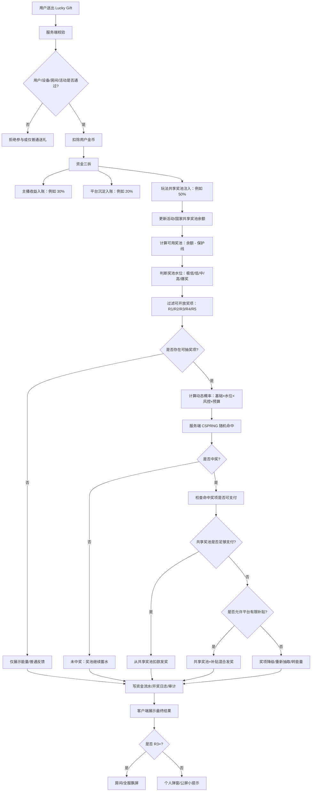
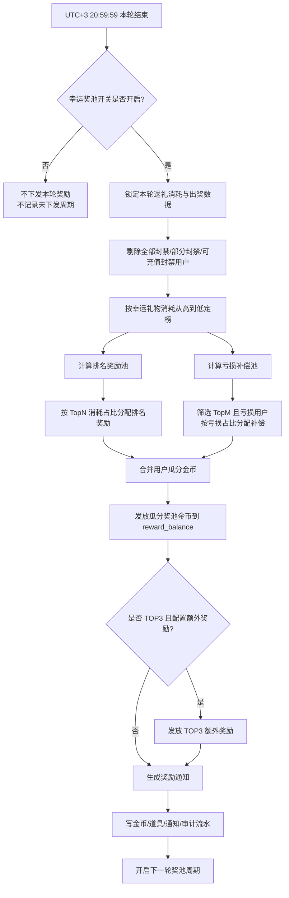
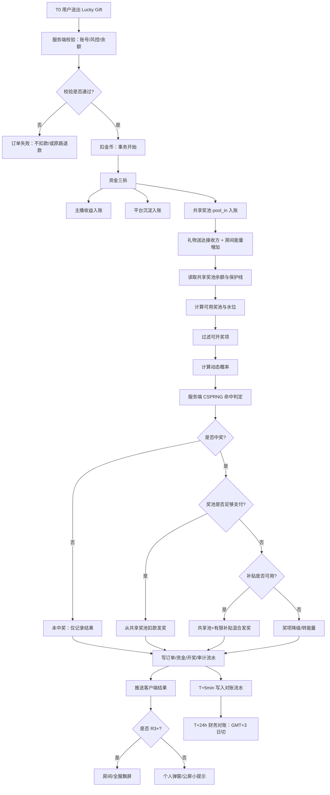
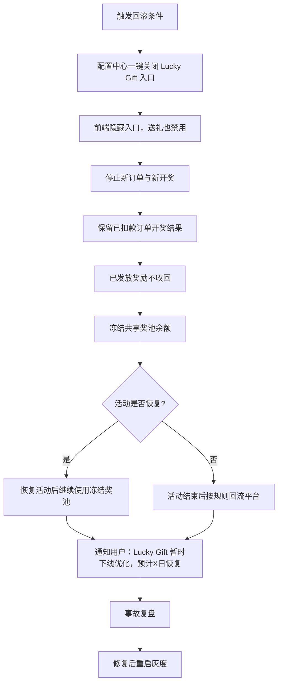
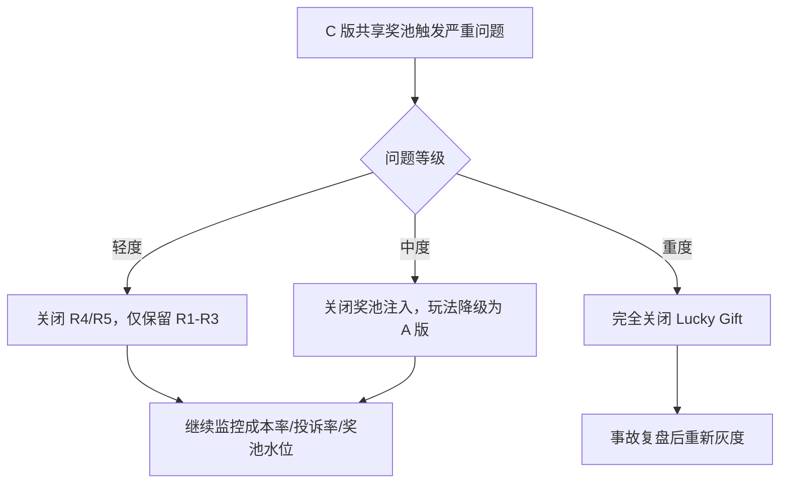

# 幸运礼物（Lucky Gift）玩法方案 — C 共享奖池版（Greedy 式）

> **产品**：Wechill（MENA 语聊房）
> **方案版本**：C 共享奖池版 v1.0（玩法级共享奖池，所有爆奖从池中出）
> **本地化代号**：Lucky Gift / هدية الحظ / Lucky Treasure
> **文档状态**：可评审
> **更新日期**：2026-06-16
> **配套方案**：A 基础版（无奖池）/ B 完整版（房间奖池）

---

## 0. 评审摘要（一页看完）

| 维度 | 设计要点 |
|---|---|
| **玩法结构** | 用户送礼 → 资金三拆（主播分成/奖池注入/平台沉淀）→ 概率触发奖项 → **所有爆奖金币从共享奖池出** |
| **奖池维度** | **活动 × 国家** 双维度（同一活动每个国家独立奖池），全平台不做单一巨池 |
| **核心创新** | 奖池水位决定开放档位 + 动态概率系数 + 平台有限补贴 + 四档熔断 |
| **资金拆分（默认）** | 主播 50% / 奖池 25% / 平台 25%（按礼物面值分档可调） |
| **奖项档位** | R1 小奖 / R2 中奖 / R3 大奖 / R4 超级奖 / R5 爆奖（虚拟为主，礼物券/装扮/座驾） |
| **目标返奖成本率** | 总成本率 8%–15%（含奖池+补贴+保底+榜单），可配置 |
| **核心风控** | 黑名单/对刷/速率/熔断 五道闸 + 动态概率风控系数 |
| **本地化** | 严禁"赌博/Bet/Jackpot"敏感词，统一用"Lucky Treasure / Lucky Bonus / Room Energy" |
| **核心优势** | ① 平台成本严格可控（奖池 = 用户钱）② 无房间贫富差距 ③ 大奖叙事感强 ④ 财务可预测 |
| **核心难点** | ① 奖池水位算法复杂 ② 动态概率需精细调参 ③ 跨国家活动调度 ④ 合规需虚拟化奖励 |

---

## 1. 玩法概述

### 1.1 玩法流程（流程图）



#### 1.1.1 资金三拆流程表

| 用户送礼金额 | 主播收益 | 平台沉淀 | 共享奖池注入 | 说明 |
|---:|---:|---:|---:|---|
| 10 金币 | 3 金币 | 2 金币 | 5 金币 | 用户给定示例，可作为激进蓄水模式 |
| 100 金币 | 30 | 20 | 50 | 同比例放大 |
| 1,000 金币 | 300 | 200 | 500 | 适合活动期快速蓄水 |

> 后台配置字段：`host_income_ratio=0.30`、`platform_margin_ratio=0.20`、`pool_in_ratio=0.50`。  
> 强校验：三者之和必须 = 1。

#### 1.1.2 C 方案完整流程表

| 阶段 | 节点 | 输入 | 判断/处理 | 输出 | 资金影响 |
|---|---|---|---|---|---|
| 准入 | 用户校验 | user_id、device_id | 未成年/黑名单/风控 | 可参与/不可参与 | 无 |
| 扣款 | 用户支付 | gift_cost | 扣除金币 | 用户余额减少 | +gift_cost |
| 三拆 | 资金分流 | gift_cost、三拆比例 | 主播/平台/奖池 | 三笔流水 | 主播+平台+奖池入账 |
| 入池 | 奖池注入 | pool_in_amount | 写 pool_in 流水 | pool_balance 增加 | +pool_in |
| 水位 | 判断奖池水位 | pool_balance、protect_ratio | 计算可用奖池 | water_level | 无 |
| 准入 | 过滤奖项 | water_level、single_max_ratio | 关闭不可支付档位 | reward_candidates | 无 |
| 概率 | 动态概率 | 基础概率、系数 | 计算 final_probability | 概率表 | 无 |
| 开奖 | 随机命中 | CSPRNG、order_id | 命中/未中 | reward_result | 无 |
| 支付 | 奖励支付 | reward_cost、pool_available | 池出/补贴/降级 | 用户奖励 | -pool_out / -subsidy |
| 展示 | 结果反馈 | reward_result | 弹窗/公屏/飘屏 | 用户感知 | 无 |
| 审计 | 写日志 | 全链路字段 | 可追溯 | 订单/资金/风控流水 | 无 |

> C 版核心：**不是房间池，是玩法级/活动国家级共享奖池**。所有爆奖优先从共享池出，池不足才走有限补贴或降级。

### 1.2 核心术语（与 A/B 版对齐 + C 版新增）

| 术语 | 定义 |
|---|---|
| **Lucky Gift** | 标记为"幸运"的礼物 SKU |
| **Shared Pool（共享奖池）** | 活动 × 国家维度的资金池，**所有爆奖资金来源** |
| **资金三拆** | 礼物面值拆分为主播/奖池/平台三份 |
| **奖池水位（Water Level）** | 当前可用奖池余额对应的档位（极低/低/中/高/爆奖） |
| **奖池保护线（Protect Line）** | 不允许消耗的最低奖池余额（防大奖打空池子） |
| **可用奖池（Available Balance）** | 奖池余额 − 保护线 |
| **单次最大消耗比例** | 单次奖励最多消耗"可用奖池"的比例（防一发打穿） |
| **奖项准入** | 当前水位决定开放哪些奖项档位 |
| **动态概率** | 基础概率 × 水位系数 × 风控系数 × 预算系数 |
| **奖项降级** | 命中高档但不可支付时降到可支付档位 |
| **平台补贴** | 池不足时平台有限垫付，有总预算/单次/单日上限 |
| **熔断（Circuit Breaker）** | 总成本达到预算阈值时分级关闭高档奖项 |
| **房间能量（Room Energy）** | 前端展示的进度条，仅视觉激励，不直接 = 真实奖池 |

### 1.3 与 A/B 版的核心差异

| 维度 | A 基础版 | B 房间奖池版 | **C 共享奖池版（本方案）** |
|---|---|---|---|
| 奖池维度 | 无 | 每房间独立 | **活动 × 国家共享** |
| 中奖资金来源 | 平台直接出 | 房间奖池+保底 | **奖池+有限补贴** |
| 平台成本可控性 | RTP 单参锁定 | 双参+保底基金 | **池子 = 用户钱，结构性可控** |
| 房间贫富差距 | 无 | 大房间体验远好于小房间 | **无差距（共享）** |
| 概率模型 | 固定概率 | 固定概率+触发条件 | **动态概率（4 系数加权）** |
| 奖励形态 | 金币 | 金币 | **以虚拟奖励为主**（券/框/车），少量金币 |
| 合规风险 | 低 | 高（房间奖池=赌博争议） | **中**（虚拟奖励降低风险） |
| 实现复杂度 | 低 | 中 | **高** |
| ARPU 拉动 | 中 | 强 | **强**（榜单+大奖叙事） |

### 1.4 与现有玩法的边界（与 A/B 版口径完全一致）

| 维度 | 红包返奖 | 龙蛋玩法 | Lucky Gift（C 版） |
|---|---|---|---|
| 触发方式 | 发红包 → 多人抢 | 房内贡献累计排名 | 送礼物 → 概率开 |
| 抽奖主体 | 发送人 | Top10+房主 | 送礼人 |
| 奖池 | 无 | 无（日结） | **活动×国家共享** |
| 接收方收益 | 抢到金额 | — | 仅收到礼物 |
| 统计日 | GMT+3 | GMT+3 | GMT+3（一致） |
| 黑名单 | 共享 | 共享 | 共享（一致） |

---

## 2. 礼物 SKU 与档位设计

### 2.1 Lucky Gift 礼物档位

共 **6 档** SKU。

| 档位 | 礼物名 | 阿语名 | 面值（金币） | 视觉主题 | 适用场景 |
|---|---|---|---|---|---|
| L1 | 沙漠玫瑰 | وردة الصحراء | 99 | 粉金渐变小玫瑰 | 日常 |
| L2 | 星月灯笼 | فانوس النجوم | 520 | 蓝紫灯笼 | 情感互动 |
| L3 | 金色骆驼 | الجمل الذهبي | 1,888 | 沙金骆驼 | 大哥试水 |
| L4 | 绿洲宝箱 | كنز الواحة | 6,666 | 翻盖宝箱动画 | 中型刷礼 |
| L5 | 阿拉丁神灯 | مصباح علاء الدين | 19,999 | 神灯+烟雾粒子 | 大额冲榜 |
| L6 | 苏丹王座 | عرش السلطان | 66,666 | 全屏宝座+全房特效 | 顶级土豪 |

### 2.2 货币与收益口径（评审级硬通货）

> 这是评审会的核心争议点。需对齐**钻石、魅力值、财富值、钻石流水**四个维度，并区分**赠送他人**与**自赠**。

#### 2.2.1 用户支付公式

```text
gift_cost = gift_price * count
```

所有金额以**整数金币**入账。小数计算统一在服务端 `round()` 四舍五入后入账，余数进入平台误差调节账户。
如财务要求向下取整，必须**全系统统一切换**，不允许不同模块混用。

#### 2.2.2 赠送他人的收益口径

所有用户都可以收礼，不再按收礼身份拆收益。仅按礼物类型区分。

| 礼物类型 | 收礼方钻石 | 收礼方魅力值 | 送礼方财富值 | 钻石流水（结算用） |
|---|---:|---:|---:|---:|
| 普通礼物 | `gift_cost * 100%` | `gift_cost * 100%` | `gift_cost * 100%` | `gift_cost * 100%` |
| 幸运礼物（Lucky Gift） | `gift_cost * 10%` | `gift_cost * 10%` | `gift_cost * 10%` | `gift_cost * 10%` |

示例：

| 场景 | 实际入账 |
|---|---|
| A 送 B 100 金币普通礼物 | B 得 100 钻石 + 100 魅力；A 得 100 财富；钻石流水 100 |
| A 送 B 1,000 金币幸运礼物 | B 得 100 钻石 + 100 魅力；A 得 100 财富；钻石流水 100 |

> **关键设计**：幸运礼物按 **10% 折算**，避免"幸运礼物刷流水冲公会榜/工资"。
> 平台让出的部分 = 注入共享奖池，做长期回流。

#### 2.2.3 自赠规则（防套利核心）

自赠（self-gift）：`sender_user_id == receiver_user_id`。

**准入硬规则**：

| 规则 | 阈值 | 不通过处理 |
|---|---|---|
| 财富等级 | `>= 5` | **服务端拒绝订单，不扣款、不开奖** |
| 实名/手机绑定 | 必须完成 | 服务端拒绝订单 |
| 黑名单 | 危险级禁止自赠 | 服务端拒绝订单 |

**自赠折算口径**：

| 礼物类型 | 钻石余额 | 钻石流水（结算用） | 财富值 | 魅力值 |
|---|---:|---:|---:|---:|
| 普通礼物自赠 | `gift_cost * 99%` | `gift_cost * 99%` | `gift_cost * 99%` | `gift_cost * 99%` |
| 幸运礼物自赠 | `gift_cost * 10% * 99%` | `gift_cost * 10% * 99%` | `gift_cost * 10% * 50%` | `gift_cost * 10% * 50%` |

示例：

| 场景 | 实际入账 |
|---|---|
| 用户自赠 100 金币普通礼物 | 99 钻石 + 99 财富 + 99 魅力，钻石流水 99 |
| 用户自赠 1,000 金币幸运礼物 | 99 钻石 + 50 财富 + 50 魅力，钻石流水 99 |

**自赠口径关键点**：

1. 自赠普通礼物：四维统一 99% 折损
2. 自赠幸运礼物：钻石/流水按 `10%×99%`，**财富/魅力按 `10%×50%`**（双重折损防冲榜套利）
3. 自赠幸运礼物**默认不计入幸运奖池榜单、排名奖励、亏损补偿**
4. 工资/BD/公会长/TG 奖励等外部结算**统一使用"自赠折算后的钻石流水"**，禁止用财富值或魅力值替代

#### 2.2.4 Lucky Roll 奖励金币（防循环消费）

命中 Lucky Roll 时，送礼方获得**钱包金币**：

```text
sender_reward_coin = gift_cost * hit_multiplier
```

示例：送 100 金币礼物命中 20 倍 → 用户得 2,000 金币。

**防循环消费口径（极重要）**：

| 规则 | 默认 | 说明 |
|---|---|---|
| 奖励金币标记 | `coin_source = reward_coin` | 账本中独立标记来源 |
| 再次消费产生的钻石流水 | **不计入**外部结算 | 防"中奖→刷流水→拿工资/奖励→再送礼"套利循环 |
| 外部结算包括 | BD 提成、公会长工资、TG 奖励、运营奖励 | 默认全部排除 |
| 单独开启 | 必须财务 + 风控双签 | 仅限特定活动 |
| 奖励金币用途 | 可送礼、可购买道具/VIP/装扮，不可提现 | 站内消费闭环 |

**实现方式**：用户金币账户拆分为两个池：

```text
user_coin_balance = main_balance + reward_balance

- main_balance：充值/普通获取的金币
- reward_balance：Lucky Roll 奖励 + 榜单奖励金币

扣款顺序：默认 reward_balance 优先（先消耗奖励金币）
消费时记录 coin_source，进入对账与结算
```

### 2.3 主播收益口径

| 项 | 普通礼物 | 幸运礼物 |
|---|---|---|
| 主播收益（钻石/魅力/财富） | 100% 计入 | **10% 计入** |
| 主播魅力榜 | 全额 | 按 10% 折算 |
| 公会贡献值 | 全额 | 按 10% 折算 |
| 工资结算 | 按钻石流水 | **按 10% 折算后的钻石流水** |
| 主播自送（关联账号识别命中） | 不可参与 | 不可参与，风控系数 = 0 |

> **关键说明**：幸运礼物按 10% 折算到主播侧，**平台让出的 90% 部分用于注入共享奖池 + 平台沉淀**，不是从主播分成里扣（避免主播抵触幸运礼物）。

### 2.4 接收人侧

- 100% 收到礼物本身（社交价值不变）
- **不参与抽奖**（仅送礼人 Lucky Roll）
- 接收人是主播 → 按 §2.3 主播侧规则
- 接收人账号已注销 → 礼物作废，但 Lucky Roll 流程正常执行
- 接收人是黑名单 → 礼物送达但屏蔽公屏展示，Lucky Roll 正常

### 2.5 配置项汇总

| 字段 | 默认 | 说明 |
|---|---:|---|
| `normal_gift_ratio` | 1.00 | 普通礼物的钻石/魅力/财富基础折算 |
| `lucky_gift_ratio` | 0.10 | 幸运礼物的钻石/魅力/财富基础折算（核心：10%） |
| `self_gift_balance_ratio` | 0.99 | 自赠时钻石余额与钻石流水折算 |
| `self_gift_value_ratio` | 0.50 | 自赠幸运礼物时财富/魅力额外折损 |
| `self_gift_min_wealth_level` | 5 | 允许自赠的最低财富等级 |
| `self_gift_rank_eligible` | false | 自赠幸运礼物是否参与榜单/亏损补偿 |
| `reward_coin_settlement_eligible` | false | 奖励金币再次消费是否纳入外部结算 |
| `diamond_flow_settlement_rule` | `after_self_ratio` | 工资/BD/公会长/TG 奖励使用自赠折算后的钻石流水 |

> 涉及工资/BD/公会长/TG 奖励等结算口径的字段变更，必须 **财务 + 数据 + 风控** 三方双签。

---

## 3. 共享奖池设计（核心）

### 3.1 奖池维度

```
真实资金池：活动 × 国家
   ├── 活动 A × 沙特 → Pool_A_SA
   ├── 活动 A × 阿联酋 → Pool_A_AE
   ├── 活动 A × 埃及 → Pool_A_EG
   └── ...

前台展示池：房间能量进度（与真实奖池脱钩，仅视觉激励）
```

**为什么不做"全平台单一池"**：
- 不同国家消费力差距大，统一池会导致小国家长期看不到大奖
- 单一巨池触发大奖时财务波动剧烈
- 监管合规上"按国家"更易调整

**为什么不做"纯房间独立池"**（B 版的方案）：
- 小房间流水低，奖池长期空，体验差
- 大房间频繁爆奖，平台压力大
- 房间间体验严重不均

### 3.2 奖池 4 账本拆分（评审级）

每个活动国家奖池拆成 **4 个独立账本**，所有账本必须有资金流水，不允许只改余额。

| 账本 | 用途 | 资金来源 | 出账场景 |
|---|---|---|---|
| `instant_reward_pool` | 即时 Lucky Roll 金币奖励 | 幸运礼物流水 × 即时奖池注入比例 | 命中 Lucky Roll 时扣减 |
| `rank_reward_pool` | 每轮榜单排名奖励 | 幸运礼物总消耗 × 排行奖励比例 | 每轮 21:00 结算时扣减 |
| `loss_comp_pool` | 每轮亏损补偿 | 幸运礼物总消耗 × 亏损补偿比例 | 每轮 21:00 结算时扣减 |
| `subsidy_budget` | 平台有限补贴 | 活动预算预留 | 即时奖池不足时混合支付 |

> **设计意图**：
> 1. 4 个账本独立核算，避免"即时返奖把榜单奖池吃光"
> 2. 4 个账本独立熔断，互不影响
> 3. 财务可独立对账，4 个 `期初 + 入 − 出 = 期末` 等式

### 3.3 奖池资金参数（默认配置）

| 参数 | 默认值 | 说明 |
|---|---:|---|
| `instant_pool_in_ratio` | 35% | 即时奖池注入比例（= 目标 RTP + 5% 缓冲） |
| `target_instant_rtp` | 30% | 即时返奖目标 RTP |
| `instant_pool_buffer_ratio` | 5% | 即时返奖安全缓冲（吸收短期方差） |
| `rank_reward_ratio` | 3.00% | 排名奖励比例（支持 4 位小数） |
| `loss_comp_ratio` | 2.00% | 亏损补偿比例（支持 4 位小数） |
| `subsidy_budget_ratio` | ≤ 3% | 单活动平台补贴预算占活动预期流水比例 |
| `top3_extra_reward_ratio` | ≤ 1% | TOP3 额外奖励占活动预期流水比例 |
| `initial_pool` | 100,000 金币/国家 | 冷启动注入 |
| `protect_ratio` | 30% | 奖池保护线 |
| `single_reward_max_ratio` | 30% | 单次最大支付"可用奖池"比例 |
| `pool_soft_cap` | 5,000,000 | 奖池软上限 |
| `allow_negative_pool` | false | 严禁负奖池 |

**财务校验公式**：

```text
玩法返奖理论成本率
  = target_instant_rtp                # 30%
  + rank_reward_ratio                 # 3%
  + loss_comp_ratio                   # 2%
  + top3_extra_reward_ratio           # ≤ 1%
  + subsidy_budget_ratio              # ≤ 3%
  = ≤ 39%

资金占用率
  = instant_pool_in_ratio             # 35%
  + rank_reward_ratio                 # 3%
  + loss_comp_ratio                   # 2%
  + top3_extra_reward_ratio           # ≤ 1%
  + subsidy_budget_ratio              # ≤ 3%
  = ≤ 44%

全量财务成本率
  = 玩法返奖理论成本率
  + 收礼钻石折算成本率（按 §2.2 钻石口径）
  + 财富/魅力/钻石流水带来的结算成本率（工资/BD/公会长/TG）
```

如财务要求资金占用率不超过 40%：降档为 `target_instant_rtp = 25%`、`instant_pool_in_ratio = 30%`。

### 3.4 5% 缓冲机制（评审重点）

**核心：注入比例 ≠ 实际支出**

```text
instant_pool_in       = lucky_gift_cost × 35%   # 注入
expected_reward_out   = lucky_gift_cost × 30%   # 长期理论支出
instant_buffer_in     = lucky_gift_cost × 5%    # 缓冲沉淀
```

**5% 缓冲的作用**：

1. 吸收短期方差（连续命中 1000 倍时不至于直接打穿）
2. 实际 RTP 低于 30% 时多沉淀进奖池，反哺后续大奖
3. 活动结束时未消耗的缓冲按 §10.x 规则回流

**缓冲消耗示例**：

| 当日流水 | 理论返奖 | 实际注入 | 实际返奖 | 缓冲结果 |
|---:|---:|---:|---:|---|
| 100,000 | 30,000 | 35,000 | 25,000 | 未消耗，奖池沉淀 +10,000 |
| 100,000 | 30,000 | 35,000 | 34,000 | 消耗 4,000 缓冲，仍在安全范围 |
| 100,000 | 30,000 | 35,000 | 38,000 | 缓冲不足，超出 3,000 → 触发预算收紧或倍率降级 |

**缓冲水位控制**：

| buffer_usage_rate | 系统动作 |
|---:|---|
| 0% – 50% | 正常开奖 |
| 50% – 80% | 关闭 500/1000 倍，观察小时级 RTP |
| 80% – 100% | 关闭 250/500/1000 倍，`budget_coef` 降至 0.4 |
| ≥ 100% | 仅开放 5/10 倍；若奖池仍低于保护线，关闭即时 Lucky Roll |

其中 `prior_unconsumed_buffer` 为历史周期未消耗的缓冲沉淀，活动首日按 0 计算。

### 3.5 奖池水位（按倍率开放）

**水位 = f(可用奖池余额)**

```text
available_pool   = pool_balance × (1 − protect_ratio)   # 默认 70%
single_pay_limit = available_pool × single_reward_max_ratio   # 默认 30%
```

| 水位档位 | 可用奖池范围 | 开放倍率 |
|---|---:|---|
| **极低水位** | < 5,000 | 仅 0/5 倍 |
| **低水位** | 5,000 – 50,000 | 0/5/10 倍 |
| **中水位** | 50,000 – 200,000 | 0/5/10/20/100 倍 |
| **高水位** | 200,000 – 1,000,000 | 0/5/10/20/100/250/500 倍 |
| **爆奖水位** | ≥ 1,000,000 | 全部倍率，含 1000 倍 |

**单笔可支付约束**（即使水位允许仍必须满足）：

```text
gift_cost × multiplier ≤ single_pay_limit
```

否则该倍率关闭，概率并入 0 倍。

**水位 hysteresis 迟滞**（防 1 秒内频繁跳档）：

- 低 → 中：可用奖池需 ≥ 55,000（+10% 缓冲）
- 中 → 低：可用奖池需 ≤ 45,000（-10% 缓冲）
- 中 → 高：可用奖池需 ≥ 220,000
- 高 → 中：可用奖池需 ≤ 180,000
- 其他档位同理 ±10% 缓冲带

**示例**：

| 礼物消耗 | 命中倍率 | 奖励金额 | 理论最低奖池余额 | 说明 |
|---:|---:|---:|---:|---|
| 100 | 1000x | 100,000 | `100,000 / 21% = 476,191` | 低于该余额不可支付 |
| 1,000 | 1000x | 1,000,000 | `1,000,000 / 21% = 4,761,905` | 水位不足时必须降级 |

5% 缓冲只负责吸收常规方差，**不负责无条件兜住所有 1000 倍大奖**；高倍奖必须同时满足水位、单笔上限、预算系数、风控系数四道闸。

### 3.6 动态概率模型

#### 3.6.0 关键合规原则

1. **不对正常用户做个人化提奖**：禁止 VIP、大 R 等正常用户群的概率正向加权（合规底线）
2. **只允许对高风险用户降权或关闭高倍**：风控系数 ≤ 1.0
3. **被关闭的概率统一并入 0 倍**，不做完全归一化（避免低水位时整体 RTP 反弹）
4. **奖励金币不可提现**，仅站内消费

#### 3.6.1 原型基础概率表（理论 RTP = 90.07%）

原型默认倍率与概率（非 0 倍合计 9.294555%，理论 RTP 90.069375%）：

| 结果 | 原型概率 | 期望贡献 |
|---:|---:|---:|
| 0 倍 | 90.705445% | 0 |
| 5 倍 | 7.045875% | 35.229375% |
| 10 倍 | 1.562500% | 15.625000% |
| 20 倍 | 0.503125% | 10.062500% |
| 100 倍 | 0.140000% | 14.000000% |
| 250 倍 | 0.027000% | 6.750000% |
| 500 倍 | 0.015305% | 7.652500% |
| 1000 倍 | 0.000750% | 0.750000% |
| **合计** | **100%** | **90.069375%** |

> 此表为"倍率分布上限"或短期强刺激活动参数，**不作为常态默认上线参数**（成本会失控）。

#### 3.6.2 预算化 RTP 公式（核心算法）

```text
base_rtp = Σ(base_probability(multiplier) * multiplier) = 90.069375%

rtp_factor = target_instant_rtp / base_rtp

final_probability(multiplier)
  = base_probability(multiplier)
    × rtp_factor              # RTP 缩放
    × water_level_coef        # 奖池水位
    × risk_coef               # 用户风控（≤ 1.0）
    × room_coef               # 房间风控（≤ 1.0）
    × budget_coef             # 预算熔断
```

**默认 `target_instant_rtp = 30%`**：

```text
rtp_factor = 30% / 90.069375% = 0.3330765868
```

所有非 0 倍概率按 `rtp_factor` **等比例缩小**，**被缩小出来的概率统一并入 0 倍**，保证倍率叙事不变、成本可控。

#### 3.6.3 默认上线概率表（target_instant_rtp = 30%）

| 结果 | 默认概率 | 说明 |
|---:|---:|---|
| 0 倍 | 96.904201% | 未中奖，礼物正常送达 |
| 5 倍 | 2.346816% | 高频小奖，约每 43 笔 1 次 |
| 10 倍 | 0.520432% | 中低频 |
| 20 倍 | 0.167579% | 中频爆点 |
| 100 倍 | 0.046631% | 大奖 |
| 250 倍 | 0.008993% | 超级奖 |
| 500 倍 | 0.005098% | 超级奖 |
| 1000 倍 | 0.000250% | 爆奖 |
| **非 0 倍合计** | **3.095799%** | 每约 32 笔 1 次非 0 倍 |
| **理论 RTP** | **≈ 30%** | 长期理论值 |

> 30% 是**长期理论值**，不承诺单个用户、单房间、单小时回到 30%；短期波动由奖池水位、5% 缓冲、预算系数和熔断机制控制。

#### 3.6.4 可配置 RTP 档位

| 档位 | target_instant_rtp | 使用场景 | 是否默认 | 签字要求 |
|---|---:|---|---|---|
| 保守档 | 25% | 新国家、新活动、风控压力大 | 否 | 产品 |
| **常态档** | **30%** | **默认上线** | **是** | 产品 + 财务 |
| 强刺激档 | 35% | 节日、运营活动、短期冲榜 | 否 | 产品 + 财务 |
| 高强刺激档 | 45% | 仅限大型节日 + 短周期 + 小流量 | 否 | 产品 + 财务 + 风控 |
| 原型兼容档 | 90.069375% | 白名单压测 / 纯奖池再分配 | 否 | 产品 + 财务 + 风控 + 老板 |

#### 3.6.5 为什么不使用 90%+ RTP 作为常态

本方案不是纯老虎机，而是"送礼 + 收礼钻石 + Lucky Roll + 榜单 + 亏损补偿 + TOP3 + 工资结算"的叠加玩法。以 1,000 金币幸运礼物为例：

| 成本项 | 30% RTP 档 | 90% RTP 档 |
|---|---:|---:|
| 即时返奖 | 300 | 901 |
| 收礼钻石（10%） | 100 | 100 |
| 排名奖励池（3%） | 30 | 30 |
| 亏损补偿池（2%） | 20 | 20 |
| TOP3 额外奖励（≤1%） | ≤10 | ≤10 |
| 平台补贴（≤3%） | ≤30 | ≤30 |
| **不含财富/魅力的小计** | **≤490** | **≤1,091** |

90%+ RTP 叠加后**理论成本接近或超过礼物流水本身**，结算还会带来 BD/公会工资/TG 奖励等额外成本，因此 90%+ 仅作为短期/白名单档使用。

#### 3.6.6 水位系数（按倍率开放）

| 水位 | 5x | 10x | 20x | 100x | 250x | 500x | 1000x |
|---|---:|---:|---:|---:|---:|---:|---:|
| 极低 | 1.0 | 0 | 0 | 0 | 0 | 0 | 0 |
| 低 | 1.0 | 1.0 | 0 | 0 | 0 | 0 | 0 |
| 中 | 1.0 | 1.0 | 1.0 | 1.0 | 0 | 0 | 0 |
| 高 | 1.0 | 1.0 | 1.0 | 1.0 | 1.0 | 1.0 | 0 |
| 爆奖 | 1.0 | 1.0 | 1.0 | 1.0 | 1.0 | 1.0 | 1.0 |

水位档位详细见 §3.3。

#### 3.6.7 风控系数（仅可降权，禁止提权）

| 用户状态 | risk_coef | 备注 |
|---|---:|---|
| 正常用户 | 1.0 | 不允许提到 > 1.0 |
| 观察名单 | 0.7 | 后台标记 |
| 新注册用户（< 7 天） | 0.3 – 0.5 | 仅 0/5 倍 |
| 退款用户（30 天内） | 0 – 0.3 | 关闭高倍 |
| 同设备多账号 | 0 – 0.5 | 风控自动识别 |
| 收送礼强关联 | 0 – 0.3 | 实名/设备/IP/支付任一关联 |
| 异常自赠 | 0 – 0.5 | 自赠占比高/集中冲榜 |
| 主播关联账号 | 0 | 完全禁止 |
| 黑名单（限制级） | 仅 0/5 倍 | 其他倍率概率=0 |
| 黑名单（危险级） | 0 | 全部不参与 |

> **合规底线**：删除原 VIP 1.0–1.2 的正向加权设计。任何对正常用户的概率正向操作都视为博彩歧视性行为，**严禁实现**。

#### 3.6.8 房间质量系数

| 房间状态 | room_coef |
|---|---:|
| 优质活跃房间 | 1.0 |
| 普通房间 | 1.0 |
| 新房间（< 7 天） | 0.5（仅限制 20 倍以上） |
| 风控观察房间 | 0.3 |
| 异常房间（聚集对刷） | 0 |

#### 3.6.9 预算系数（熔断前置）

| 总成本预算使用率 | budget_coef | 系统动作 |
|---|---:|---|
| 0% – 50% | 1.0 | 正常 |
| 50% – 70% | 0.7 | 收紧非 0 倍概率 |
| 70% – 85% | 0.4 | 关闭 500/1000 倍 |
| 85% – 95% | 0.2 | 关闭 250/500/1000 倍 |
| 95% – 100% | 0.1 | 仅开放 5/10 倍 |
| ≥ 100% | 0 | 关闭即时返奖，仅普通送礼 + 榜单结算 |

#### 3.6.10 概率归一化策略

被关闭的倍率概率**统一并入 0 倍**，不做完全归一化、不补偿到其他中奖倍率。

```text
if final_probability(multiplier) == 0:
    final_probability(0倍) += base_probability(multiplier) × rtp_factor
```

**意图**：奖池低或预算紧张时整体 RTP 自然下降，保护平台成本，避免"关掉高倍反而被低倍吃光"。

### 3.7 奖项降级规则

命中高倍但不可支付时按以下顺序降级：

```text
1000x → 500x → 250x → 100x → 20x → 10x → 5x → 0x（特效）
```

**降级触发条件**：
- 命中倍率超过当前水位开放范围
- `gift_cost × multiplier > single_pay_limit`（单笔上限）
- 即时奖池余额 + 补贴预算不足
- 用户/房间命中风控/单日上限

**前端表达**：
- 用户**不可见**降级过程，只看到最终结果
- 即使降级到 5x，公屏文案统一为"幸运奖励"，不暴露"原本是 1000x"
- 审计日志必须记录 `downgrade_from`、`downgrade_to`、`downgrade_reason`

---

## 4. 平台补贴池（有限浮动垫付）

### 4.1 设计原则

补贴 ≠ 无限垫付，是**运营工具**，用于关键时刻保证体验。必须有：

- 总预算上限
- 单次/单日上限
- 触发条件（水位/用户类型）
- 熔断回退

### 4.2 补贴池配置（默认）

| 参数 | 默认值 | 说明 |
|---|---|---|
| 总补贴预算 | 活动预期流水的 5% | 不超过 8% |
| 单次最大补贴 | 单次奖励成本的 30% | 不超过 50% |
| 单日补贴上限 | 总补贴预算的 25% | 防一天打爆 |
| 触发最低水位 | 中水位以上 | 极低/低水位禁止补贴 |
| 高风险用户 | 不补贴 | 防套利 |
| 新房间/新主播 | 默认不补贴 R4/R5 | 防自刷 |
| 黑名单用户 | 100% 禁止补贴 | 硬规则 |

### 4.3 补贴计算公式

```python
def compute_subsidy(reward_cost, pool_available, subsidy_state, user, room):
    # Step 1: 奖池能承担多少
    pool_pay = min(reward_cost, pool_available * single_max_ratio)

    # Step 2: 缺口
    gap = reward_cost - pool_pay
    if gap <= 0:
        return SubsidyResult(pool_pay=reward_cost, subsidy_pay=0)

    # Step 3: 补贴资格校验
    if water_level < MIN_SUBSIDY_LEVEL:  return DOWNGRADE
    if user.is_high_risk():              return DOWNGRADE
    if room.is_new() and reward.level >= R4: return DOWNGRADE
    if subsidy_state.daily_used >= subsidy_state.daily_limit: return DOWNGRADE

    # Step 4: 实际可补金额
    max_subsidy = min(
        gap,                                          # 实际缺口
        subsidy_single_limit,                         # 单次上限
        subsidy_state.daily_remaining,                # 单日剩余
        subsidy_state.total_remaining,                # 总剩余
        reward_cost * subsidy_ratio_limit             # 比例上限
    )

    if max_subsidy < gap:
        return DOWNGRADE  # 补不齐则降级

    return SubsidyResult(pool_pay=pool_pay, subsidy_pay=max_subsidy)
```

### 4.4 补贴示例

**场景 A：补贴足够**
```
R4 大奖成本 = 50,000 金币
当前可用奖池 = 120,000，单次最大消耗 30%
奖池可承担 = 36,000
缺口 = 14,000
补贴单次上限 = 20,000，剩余预算 = 100,000
→ 补贴 14,000，实际发放 50,000 ✓
```

**场景 B：补贴不足，降级**
```
同上场景，但补贴剩余预算只有 5,000
→ 36,000（池）+ 5,000（补贴）= 41,000 < 50,000
→ R4 降级为 R3，按 R3 重新计算
```

---

## 5. 熔断分级（硬规则）

### 5.1 总成本预算

```text
总成本率 = 即时返奖成本率 + 榜单成本率 + 补贴成本率 + 收礼钻石/财富/魅力结算成本率

建议上线初期：
- 即时返奖成本率：25% – 30%（对应 target_instant_rtp）
- 榜单成本率：3% + 2% + ≤1% TOP3 = ≤ 6%
- 补贴成本率：≤ 3%
- 总成本率预警：≥ 40%
- 总成本率熔断：≥ 45%

最大总成本 = 活动预期流水 × 总成本率上限
```

> 最终阈值需财务按金币、钻石、财富值、魅力值，以及 BD/公会长工资/TG 奖励的实际结算成本确认。

### 5.2 熔断分级

| 活动预算使用率 | budget_coef | 系统动作 |
|---|---:|---|
| 0% – 50% | 1.0 | 正常运行 |
| 50% – 70% | 0.7 | 收紧非 0 倍概率，告警值班运营 |
| 70% – 85% | 0.4 | 关闭 500/1000 倍 |
| 85% – 95% | 0.2 | 关闭 250/500/1000 倍 |
| 95% – 100% | 0.1 | 仅开放 5/10 倍 |
| ≥ 100% | 0 | 关闭即时 Lucky Roll，仅保留普通送礼 + 榜单结算 |

### 5.3 单日成本熔断

```text
日成本预算 = 总预算 / 活动天数 × 1.5（允许 50% 浮动）
日成本超限 → 当日关闭 250/500/1000 倍，次日 UTC+3 21:00 重置（与榜单周期对齐）
```

### 5.4 单房间/单用户熔断

| 触发条件 | 处置 |
|---|---|
| 单房间 1 小时 ≥ 3 次 100 倍及以上 | 房间冷却 6 小时，关闭 100 倍及以上 |
| 单用户 24 小时 ≥ 5 次 100 倍及以上 | 用户冷却 24 小时 |
| 单用户 7 日 ≥ 2 次 1000 倍 | 强制人审，后续 1000 倍关闭 7 天 |
| 单国家 1 小时即时返奖成本率 > 50% | 国家级 budget_coef 降至 0.4 |
| 奖池余额低于保护线 | 关闭所有非 0 倍，直到恢复 |

### 5.5 与红包共享日预算

```text
全平台日返奖预算硬上限 = 200 万金币（与红包/龙蛋共享）
此熔断独立于活动级熔断，触发 100% 时全平台 Lucky Gift 抽奖当日关闭
```

---

## 6. 幸运奖池榜单系统（评审级新增）

> 这是评审版方案的核心叙事增强模块。即时 Lucky Roll 之外，叠加榜单瓜分 + 亏损补偿 + TOP3 额外奖励，给大 R 留出冲榜价值、给亏损用户留出补偿出口。

### 13.1 统计周期

```text
UTC+3 每日 21:00:00 – 次日 20:59:59
```

- 与 MENA 语聊房黄金时段对齐（晚 21:00 是 MENA 流量峰值），避免凌晨切日截断热度
- 每轮结束开启下一轮，榜单和奖池周期重新计算
- **与 §5.3 日成本熔断重置时点对齐**

> 注意：§7 结算系统中的 `created_at` 仍按 GMT+3，但**榜单周期专用 21:00 切日**，两者均在 UTC+3 时区，仅切日时点不同。

### 13.2 榜单排名规则

#### 6.2.1 排名依据

```text
user_eligible_lucky_gift_cost
  = 用户本轮非自赠幸运礼物金币总和
  + (self_gift_rank_eligible ? 用户本轮自赠幸运礼物金币总和 : 0)
```

**规则**：
1. 从高到低排序
2. 金币数相同 → 先达到该数值者优先
3. 时间也相同 → 服务端随机
4. 封禁用户剔除，后面用户补位
5. **自赠幸运礼物默认不计榜**（防自刷套利）
6. 若运营活动必须允许自赠计榜 → 开启 `self_gift_rank_eligible=true`，并同步开启自赠占比上限、人审、成本监控
7. 后台可配置客户端展示前 N 名（建议 `1 – 999`）

#### 6.2.2 不上榜用户

| 状态 | 处理 |
|---|---|
| 全部封禁用户 | 剔除榜单，后面用户补位，不下发奖励 |
| 部分封禁用户 | 剔除榜单，不下发奖励 |
| 可充值封禁用户 | 剔除榜单，不下发奖励 |
| 危险级黑名单 | 不参与 |
| 限制级黑名单 | 上榜但不参与亏损补偿 |
| 自赠占比 ≥ 80% | 剔除榜单，进入人审 |

### 13.3 三个奖池金额公式

```text
rank_reward_pool = round(total_lucky_gift_cost × rank_reward_ratio)
loss_comp_pool   = round(total_lucky_gift_cost × loss_comp_ratio)
total_daily_pool = rank_reward_pool + loss_comp_pool
```

| 池 | 默认比例 | 用途 |
|---|---:|---|
| `rank_reward_pool` | 3.00% | 排名奖励池（TOP N 瓜分） |
| `loss_comp_pool` | 2.00% | 亏损补偿池（TOP M 中亏损用户瓜分） |
| `top3_extra_reward` | ≤ 1% | TOP3 额外奖励预算（按配置发放） |

比例配置支持 **4 位小数**。

### 13.4 排名奖励（按消耗占比瓜分）

后台配置奖励前 N 名（默认 `rank_reward_top_n = 50`）：

```text
user_rank_reward
  = user_eligible_lucky_gift_cost / topN_eligible_lucky_gift_cost_sum
  × rank_reward_pool
```

结果**四舍五入保留整数**。

### 13.5 亏损补偿（保护大 R 体验）

#### 6.5.1 亏损定义

```text
user_loss = user_eligible_lucky_gift_cost - user_eligible_instant_reward_coin

user_eligible_instant_reward_coin
  = 用户本轮非自赠幸运礼物的 Lucky Roll 奖励金币
  + (self_gift_rank_eligible ? 自赠 Lucky Roll 奖励金币 : 0)
```

#### 6.5.2 补偿准入条件

| 条件 | 必须满足 |
|---|---|
| 排名 | 在补偿前 M 名内（默认 `loss_comp_top_n = 100`） |
| 亏损金额 | `user_loss > 0` |
| 用户状态 | 非封禁、非危险风控 |
| 自赠 | 默认不计入（除非 `self_gift_rank_eligible=true`） |

#### 6.5.3 补偿公式

```text
user_loss_comp
  = user_loss / eligible_topM_loss_sum
  × loss_comp_pool
```

结果四舍五入保留整数。

> **设计意图**：大 R 投入大但运气差时仍有补偿出口，降低投诉率和流失率。同时**严格用 loss_comp_top_n 限制范围**，防全平台普惠成本失控。

### 13.6 用户最终榜单奖励

```text
user_daily_pool_reward = user_rank_reward + user_loss_comp
```

发放后**生成独立金币收入记录**：
1. 瓜分奖池金币 → `coin_source = rank_pool_reward`
2. TOP3 额外奖励金币 → `coin_source = top3_extra_reward`
3. 道具/VIP/勋章/礼物等奖励 → 对应资产记录
4. **金币部分进 `reward_balance`**，再次消费不计入外部结算（与 §2.2.4 一致）

### 13.7 TOP3 额外奖励

#### 6.7.1 可配置奖励类型

| 类型 | 展示与发放 |
|---|---|
| 金币 / 钻石 / 水晶 | 图标 + 数量 |
| 道具商品 | 静态图 + 名称 + 类型 + 有效期 |
| VIP | VIP 等级图 + 名称 + 有效期 |
| 礼物 | 礼物图 + 名称 + 个数 |
| 勋章 / 金勋章 | 勋章图 + 名称 + 有效期 |
| 自定义奖励 | 小图 + 名称 + 有效期，可点开大图 |

#### 6.7.2 配置规则

1. TOP3 **非必填**
2. 可只配置 TOP1 或 TOP1/TOP2，未配置部分不展示
3. 下发时按**周期结束时**的配置执行
4. 周期结束时**幸运奖池开关关闭** → 不下发本轮奖励
5. 数量必须为大于 0 的整数
6. 时效天数必须为 `1 – 999999999` 的整数
7. 自定义奖励需配置阿语和英语名称、小图、大图
8. 图片支持 PNG/JPG，单张不超过 2M

### 13.8 榜单结算流程图



### 13.9 用户通知文案

```text
【奖励通知】恭喜你，在上一轮幸运奖池活动中排名第{排名}，瓜分获得{金币数}金币
```

若有 TOP3 额外奖励：

```text
【奖励通知】恭喜你，在上一轮幸运奖池活动中排名第{排名}，获得 top{排名} 额外奖励：{奖励道具信息}
```

### 13.10 我的奖励页状态

| 场景 | 展示 |
|---|---|
| 前一天未参与或奖池未开启 | "暂未获得奖励" |
| 前一天参与但未中奖 | "很遗憾，上一轮未获得奖励" |
| 前一天有奖励 | 排名、瓜分金币、TOP3 额外奖励 |

---

## 7. 风控系统

### 13.1 风控分层

```
第 1 道：账号资质准入  → 注册 ≥ 3 天 + 手机绑定
第 2 道：设备/IP 关联   → 同设备/IP 多账号互送 → 拦截
第 3 道：行为模式识别   → 速率/对刷/小号矩阵 → 实时降权
第 4 道：动态概率调节   → 风控系数实时介入抽奖
第 5 道：预算/水位熔断  → 多档自动收紧
第 6 道：人工审核兜底   → 大额异常中奖触发人审
```

### 13.2 黑名单分级（与 A/B/红包/龙蛋完全共享）

| 等级 | 处理 |
|---|---|
| **危险级** | 隐藏 Lucky Gift 入口、禁送、无返奖资格 |
| **限制级** | 可送可收，但**风控系数仅 R1 可用**（其他档位概率=0） |
| **观察名单** | 正常体验，仅后台监控 |

### 13.3 防盗刷规则（与 A/B 一致 + C 版新增）

| 规则 | 阈值 | 处理 |
|---|---|---|
| 同设备多账号互送 | 1 小时内 ≥ 3 笔 | 涉事账号置限制级 |
| 同 IP 多账号互送 | 1 小时内 ≥ 5 笔 | 涉事账号置观察 |
| 高频大额送礼 | 1 小时 > 30 笔 或 > 300 万金币 | 限制级 |
| 房间聚集对刷 | 同房 10 分钟 ≥ 10 笔 L5+ 礼物且参与人 ≤ 3 | 房间冻结 + 风控系数 = 0 |
| 短时高爆中 | 同账号 1 小时 ≥ 3 次 R3+ | 风控人审 |
| 模拟器/Root 设备 | 设备指纹识别 | 危险级直接封 |
| 接口频率 | 单账号 < 1 秒 2 次开奖请求 | 强制 1–3 秒随机延迟 |
| 响应时间异常 | 客户端响应 < 200ms | 标记可疑 |
| 主播关联账号 | 实名/手机/设备/IP 关联识别 | 风控系数 = 0 |
| 退款用户 | 30 天内有退款记录 | 风控系数 0 – 0.3 |
| **C 版新增**：奖池注入异常房间 | 房间 1 小时贡献 > 国家奖池 30% | 房间冷却 + 风控人审 |

### 13.4 公平性保证

#### 6.4.1 RNG 安全（与 A/B 版一致）

- **算法**：CSPRNG（OpenSSL `RAND_bytes` 或 Linux `/dev/urandom`）
- **种子**：每日 GMT+3 00:00 由 HSM 生成新 server_seed，前一日归档不销毁
- **开奖哈希**：`hash = SHA256(server_seed + user_id + order_id + nonce)`
- **客户端不参与计算**，仅播报结果
- **种子泄漏应急**：立即轮换 + 当日所有抽奖结果回滚为 0x + 已发放不收回

#### 6.4.2 概率公示

- 详情页公示**基础概率**（不公示动态系数）
- 公示页面包含：基础概率、奖励内容、有效期、是否可转让/提现、异常账号说明
- 概率/系数变更需提前 7 天公告（紧急风控调整除外）

#### 6.4.3 审计日志

- 字段：`{order_id, user_id, gift_id, server_seed_id, nonce, water_level, base_prob, water_coef, risk_coef, room_coef, budget_coef, final_prob, hit_reward, pool_pay, subsidy_pay, downgrade_from, downgrade_to, timestamp}`
- 保留 365 天，冷存储 3 年
- 用户可自助验证开奖哈希

#### 6.4.4 反操纵

- 概率/系数配置变更必须双签 + 灰度
- 后台不允许直接改单笔结果
- 单档位实际中奖率偏离理论值 > 5%（小时级）→ RNG 异常告警

### 13.5 异常中奖人审

触发条件：

- 单笔奖励等值 ≥ 50,000 金币
- 单账号 24 小时累计中奖等值 ≥ 200,000 金币
- 单账号 7 日 ≥ 5 次 R3+ 中奖
- 命中 R5 必触发人审（金额大且影响传播）

人审流程同 A/B 版：自动冻结 → 24h SLA → 放款/二审/封号。

---

## 8. 结算系统

### 13.1 结算流程（流程图）



#### 8.1.1 C 版结算流程表

| 时间点 | 节点 | 系统动作 | 资金变化 | 异常兜底 |
|---|---|---|---|---|
| T0 | 送礼下单 | 创建 order_id，校验幂等 | 无 | 重复请求返回同一结果 |
| T0+0ms | 服务端校验 | 账号、风控、余额校验 | 无 | 不通过则失败/隐藏入口 |
| T0+50ms | 扣款 | 扣用户金币，开启事务 | 用户金币减少 | 扣款失败则订单失败 |
| T0+100ms | 资金三拆 | 主播/平台/奖池分别入账 | 主播收益+平台沉淀+pool_in | 三拆失败整单回滚 |
| T0+150ms | 送礼与能量 | 礼物送达，房间能量增加 | 无新增现金流 | 接收方异常则按规则作废 |
| T0+200ms | 开奖判定 | 水位、准入、动态概率、CSPRNG | 无 | 无可开奖项则转能量/普通反馈 |
| T0+250ms | 命中处理 | 池出/补贴/降级/转能量 | pool_out/subsidy_out | 池不足禁止平台无限垫付 |
| T0+300ms | 写流水 | 写订单、资金、开奖、审计日志 | 形成对账记录 | 写入失败进补偿队列 |
| T0+350ms | 结果展示 | 弹窗、公屏、R3+飘屏 | 无 | 客户端断线可重拉结果 |
| T+5min | 对账流水 | 写入财务对账表 | 形成财务记录 | 失败重试/人工补偿 |
| T+24h | 财务对账 | GMT+3 日切核算 | 校验池余额与成本率 | 偏差超阈值告警 |

### 13.2 结算口径

- **统计日**：GMT+3 00:00–23:59:59
- **货币单位**：金币（虚拟奖励按等值成本入账）
- **小数处理**：四舍五入到整数，余数归奖池
- **失败重试**：扣款成功但派奖失败 → 退还金币 + 补偿同档礼物 1 个
- **幂等设计**：每笔送礼唯一 order_id，24h 幂等窗口

### 13.3 财务对账

每日 T+1 自动对账：

```
期初奖池余额 + 当日奖池注入 − 当日奖池支出 = 期末奖池余额（等式必须成立）

当日总成本 = 奖池支出 + 补贴支出 + 保底奖励 + 榜单奖励
当日返奖成本率 = 当日总成本 / 当日 Lucky Gift 流水

应抽成（平台沉淀）= 当日流水 × 平均平台沉淀比例
实抽成 = 平台沉淀入账 − 补贴支出 − 保底成本 − 榜单成本
偏差   = 应抽成 − 实抽成

|奖池余额偏差| > 0.1% → 立即告警
|总成本率偏差| > 配置上限 → 财务+风控+技术联合排查
```

### 13.4 财务对账表字段（评审级补充）

| 字段 | 说明 |
|---|---|
| date | 日期 |
| country | 国家 |
| activity_id | 活动 ID |
| gift_cost_total | 流水 |
| host_income_total | 主播分成 |
| pool_in_total | 奖池注入 |
| pool_out_total | 奖池支出 |
| subsidy_out_total | 补贴支出 |
| platform_margin_total | 平台沉淀 |
| pool_balance_start | 期初奖池 |
| pool_balance_end | 期末奖池 |
| reward_cost_rate | 返奖成本率 |
| downgrade_count | 降级次数 |
| manual_review_count | 人审次数 |

---

## 9. 后台配置

### 13.1 活动基础配置

| 字段 | 类型 | 默认/示例 | 说明 |
|---|---|---|---|
| activity_id | string | LG_2026_RAMADAN | 活动 ID |
| activity_name | string | 斋月幸运盛典 | 活动名 |
| country_scope | array | [SA, AE, EG, KW] | 生效国家 |
| start_time / end_time | datetime | — | 起止时间 |
| timezone | string | GMT+3 | 时区固定 |
| status | enum | 未开始/进行中/暂停/已结束 | — |
| lucky_gift_ids | array | [L1..L6] | 参与玩法的礼物 |

### 13.2 资金拆分配置（按礼物分档）

| 字段 | 类型 | 默认 | 说明 |
|---|---|---|---|
| host_income_ratio | decimal[L1..L6] | 0.50/0.50/0.50/0.50/0.48/0.45 | 各档主播分成 |
| pool_in_ratio | decimal[L1..L6] | 0.15/0.20/0.25/0.28/0.30/0.32 | 各档奖池注入 |
| platform_margin_ratio | decimal[L1..L6] | 0.35/0.30/0.25/0.22/0.22/0.23 | 各档平台沉淀 |

**校验**：每档三比例之和必须 = 1.00。

### 13.3 奖池配置

| 字段 | 默认 | 说明 |
|---|---|---|
| pool_type | activity_country | 奖池维度 |
| initial_pool_balance | 100,000 | 初始注入 |
| protect_ratio | 0.30 | 保护线比例 |
| single_reward_max_pool_ratio | 0.30 | 单次最大消耗 |
| pool_soft_cap | 5,000,000 | 软上限 |
| allow_negative_pool | false | 是否允许负池 |
| reset_type | activity | 重置周期 |
| carry_over | false | 是否继承 |

### 13.4 补贴配置

| 字段 | 默认 | 说明 |
|---|---|---|
| enable_subsidy | true | 启用补贴 |
| subsidy_budget_ratio | 0.05 | 总预算占活动预期流水比例 |
| subsidy_daily_limit_ratio | 0.25 | 单日上限占总预算比例 |
| subsidy_single_limit | 20,000 | 单次上限 |
| subsidy_ratio_limit | 0.30 | 单次奖励中平台最多承担比例 |
| subsidy_min_water_level | medium | 触发最低水位 |
| subsidy_for_high_risk_user | false | 高风险用户是否补贴 |

### 13.5 奖项配置

| 字段 | 类型 | 示例 |
|---|---|---|
| reward_id | string | R3_LIMITED_FRAME_30D |
| reward_level | enum | R1/R2/R3/R4/R5 |
| reward_name | string | 30 日限定头像框 |
| reward_type | enum | coupon/frame/car/effect/coin/title |
| reward_cost | int | 8,000 |
| base_probability | decimal | 0.01 |
| max_daily_trigger（全平台） | int | 100 |
| max_user_daily_trigger | int | 3 |
| cooldown_seconds | int | 300 |
| need_broadcast | bool | true（R3+） |
| enabled | bool | true |

### 13.6 风控配置

继承 A/B/红包/龙蛋的风控配置，**新增**：

| 字段 | 默认 | 说明 |
|---|---|---|
| host_related_user_block | true | 主播关联禁止参与 |
| refund_user_max_coef | 0.3 | 退款用户最大风控系数 |
| new_user_days_limit | 7 | 新用户限制天数 |
| new_user_max_level | R2 | 新用户最高可中档位 |

---

## 10. 边界场景与异常处理

### 13.1 用户侧异常

| 场景 | 处理 |
|---|---|
| 余额不足 | 前端预校验 + 后端二次校验，拒绝 |
| 网络超时 | 客户端轮询 order_id，幂等返回 |
| 客户端崩溃 | 服务端结算完成，重启拉取"未读结果"补播 |
| 接收方注销 | 礼物作废，资金三拆+抽奖正常执行 |
| 接收方黑名单 | 礼物送达但屏蔽特效，抽奖正常 |
| 用户连点 | order_id 幂等，按实际扣款次数处理 |
| 用户中途取消 | 已扣款不可取消（防方差套利） |
| 中奖时被封号 | 已发放奖励冻结，未发放不发 |
| 中奖结果未弹窗 | 个人中心"幸运记录"可补查 |

### 13.2 奖池侧异常

| 场景 | 处理 |
|---|---|
| 奖池余额计算异常（如负数） | 立即冻结该国家奖池 + 自动审计 + 风控人审 |
| 资金三拆失败 | 整笔回滚，退还用户金币 |
| 奖池扣减成功但派奖失败 | 记录 pending，5 分钟内重试，失败转人工 |
| 并发扣池冲突 | 数据库行锁 + 乐观锁，CAS 失败重试 ≤ 3 次 |
| 奖池被打到接近保护线 | 自动收紧动态概率（水位系数下调） |
| 奖池软上限超出 | 该国家提高 R4/R5 触发概率（每笔送礼 +5% R5 概率） |

### 13.3 平台侧异常

| 场景 | 处理 |
|---|---|
| RNG 故障 | 全平台关停 Lucky Gift 抽奖（送礼仍可），告警 |
| 数据库写入失败 | 三段式幂等：扣款/三拆/中奖任一失败均回滚 |
| 大额异常中奖 | 自动转人审 |
| 配置错误（如概率 > 100%） | 监控发现立即回滚 + 损失计入"事故损失" |
| 单档实际中奖率偏离 > 5%（小时级） | 风控人审，怀疑 RNG/破解 |
| 服务端时钟漂移 | NTP 强制同步，> 10ms 告警 |
| 配置发布失败 | 自动回滚到上版 + 告警 |
| 主播被封禁 | 房间能量进度冻结，未结榜单奖励人审 |
| 活动被暂停 | 停止新送礼，已产生奖励继续可领 |
| 跨国家奖池数据错乱 | 立即冻结所有国家奖池 + 全局审计 |

### 13.4 合规与本地化边界

| 场景 | 处理 |
|---|---|
| 沙特/阿联酋等保守地区 | 关闭 L6 + R4/R5；不显示具体概率数字 |
| 阿语 RTL 显示 | 全特效/弹窗/榜单 RTL 适配 |
| 斋月期间 | 视觉切换，**不改概率不改抽成** |
| 敏感词 | 严禁 Jackpot/Bet/Gamble/Win Cash/Cash Out/赌注/赢现金/翻倍 |
| 苹果商店审核 | 详情页公示概率 + 18+ + 不允许真实货币直接换购金币之外的物品 |
| 未成年人 | 实名年龄 < 18 屏蔽入口 |
| 奖励是否可提现 | **R1 金币券可在站内消耗**，**虚拟道具不可提现**（关键合规设计）|

### 13.5 数据一致性边界

| 场景 | 处理 |
|---|---|
| 奖池总额 ≠ Σ注入 − Σ支出 | 每小时巡检，偏差 > 0.1% 告警 |
| 单档实际 RTP/中奖率偏差 | 每日巡检，> 1% 告警，> 3% 强制人审 |
| 跨服务数据不一致 | 每小时定时巡检 + 最终一致性补偿 |
| 用户投诉中奖未到账 | 客服查 order_id → 服务端审计日志 → 24h 反馈 |
| 财务对账偏差 | 5% 单日 / 1% 7 日均 → 财务+风控+技术联合排查 |

### 13.6 补充边界场景与注意事项（评审补漏）

> 评审反馈整理。下面 19 条必须在开发任务卡里逐条对齐验收。前 10 条与 A/B 共用；后 9 条为 C 版独有（共享奖池/资金三拆/活动维度）。

#### 10.6.1 充值-退款链路与套利

| 场景 | 处理规则 |
|---|---|
| 用户充值后立即送礼 | 充值与送礼间隔 < 60 秒：抽奖正常，但**不计入榜单**；充值金币的**奖池注入部分（pool_in）暂记预扣账户**，T+24h 通过反洗钱校验后才入主奖池 |
| 已中奖后用户原路退款 | 1. 冻结余额；2. 已发奖励**全量回收**（金币/券/装扮/座驾）；3. 主播分成回扣；4. **奖池注入部分回退到对应国家奖池**（不增加平台损失）；5. 补贴部分由平台承担坏账；6. 进入观察名单 30 天 |
| 退款用户的 R5 大奖 | 强制人审 + 全额回收；广播过的飘屏不撤回（已是历史信息），但用户记录中标注"已撤销" |
| 中奖期间用户主动注销 | 已中未领奖励作废；奖池注入部分**不回退**（视为正常消费）；奖励虚拟道具不追回 |
| 渠道退款（Apple/Google/银行卡） | 渠道退款 webhook 必须接入风控系统；自动触发回收；记入"渠道退款损失"成本科目 |

#### 10.6.2 多设备/多端登录的幂等

| 场景 | 处理规则 |
|---|---|
| 同账号 iOS 送礼 + 安卓查看 | 中奖结果**账号级**；任意端可查看 |
| 同账号同时多端送礼 | 服务端按 order_id 幂等；连点 ≤ 1 秒合并 |
| 端间结果不一致 | 以服务端审计日志为准 |
| Web 端送礼 | 必须带版本号 + 签名；旧版本拒绝 |
| 多端读奖池水位 | 5 秒缓存 + 主从一致；爆奖瞬间强制走主库 |

#### 10.6.3 时区切换边界

| 场景 | 处理规则 |
|---|---|
| 用户跨时区移动 | 所有时间口径**强制 GMT+3** |
| 跨日中奖归属 | 按服务端 `created_at`（GMT+3） |
| 日预算/单日上限 | 按 GMT+3 0 点切换 |
| 客服话术 | "活动按沙特时间结算，每日 0 点重置" |

#### 10.6.4 主播侧异常

| 场景 | 处理规则 |
|---|---|
| 主播下播但礼物已发 | 抽奖正常；资金三拆正常；奖池注入正常 |
| 主播自送（含小号/家属/工会内部账号） | 实名/手机/设备/支付/IP 任一关联识别；命中则风控系数=0；7 日内 3 次升级危险级 |
| 主播账号封禁 | 该房间立即下架 Lucky Gift 入口；未结算分成进入人审 |
| 接收人是主播 | 礼物正常入账魅力榜；自送链路风控触发 |
| 主播退会/转会 | 在已存在的活动期间，原公会房间池注入数据保留；新公会按新主播身份重新计算 |

#### 10.6.5 礼物特效与开奖解耦

| 场景 | 处理规则 |
|---|---|
| 用户提前关闭 App | 服务端开奖结果不变；下次进入弹窗补播 |
| 大特效播放期间断网 | 客户端重连后拉 order_id 强制刷新 |
| 全服 R5 飘屏失败 | 服务端重试 3 次；失败转 push + 站内信广播 |
| 中奖弹窗与发奖时序 | 服务端发奖在前，前端动画在后；动画失败不影响奖励 |
| 大奖（≥R3）重播 | 允许在"我的幸运记录"重播 1 次 |

#### 10.6.6 概率公示的法务边界

| 公示项 | 范围 | 平台限制 |
|---|---|---|
| 各档基础概率 | 必须公示 | iOS（loot box 强制） |
| 资金三拆比例 | 必须公示 | 全平台（信任建立的关键） |
| 奖池水位/动态系数 | **不公示** | 仅运营内部 |
| 奖项清单 | 必须公示 | 全平台 |
| 历史公示版本 | 保留 ≥ 365 天 | 用于申诉 |
| 公示文案变更 | 提前 7 天通告 | 紧急风控调整除外，事后必须补告 |

#### 10.6.7 SLO/性能预算

| 指标 | 目标 | 降级阈值 |
|---|---|---|
| 送礼接口 P99 | < 200ms | > 500ms 慢响应告警 |
| 开奖接口 P99 | < 100ms | > 300ms 客户端进入"奖励即将到账"占位态 |
| 资金三拆事务 | 必须强一致 | 失败立即整单回滚 |
| 奖池余额读取 | < 50ms | 缓存失效时直接走主库，不允许超时 |
| 错误率 | < 0.1% | > 1% 自动关闭新订单 1 分钟 |
| RNG 服务可用性 | 99.95% | 不可用立即关停 Lucky Roll；送礼仍可（按 0x） |

#### 10.6.8 反作弊：客户端篡改

| 防御 | 实现 |
|---|---|
| 请求签名 | 客户端签名 + 服务端校验 |
| HTTPS + 证书 pinning | 防中间人攻击 |
| 防重放 | nonce + 时间戳 + 5 分钟去重 |
| 客户端版本管控 | 旧版本协议禁用 |
| 模拟器/Root | 设备指纹识别，命中危险级直接封 |
| 服务端二次校验 | gift_id/count/room_id/user_id 必须匹配 |

#### 10.6.9 数据出境/隐私合规

| 数据 | 存储区域要求 |
|---|---|
| 用户基础信息 | 同所在国数据中心（沙特 PDPL/GDPR） |
| 中奖记录与奖池流水 | 加密存储 365 天 + 冷存 3 年 |
| 设备指纹/风控画像 | 不出 MENA |
| 跨境同步 | 仅审计/财务/客服必要数据，匿名化 |
| 用户注销 | 30 天内清除可识别字段，交易记录脱敏保留 |

#### 10.6.10 客服透明度边界

| 允许 | 禁止 |
|---|---|
| "您本次未中奖，幸运礼物有概率" | ❌ "您被风控降权了" |
| "大额中奖需安全审核 24h 内有结果" | ❌ "因您行为可疑暂不发奖" |
| "活动按沙特时间结算" | ❌ 透露奖池水位/动态系数 |
| "活动结束后未爆出资金按规则归平台运营成本" | ❌ "您送礼的钱拿不回" |
| "大奖需要奖池蓄水时机" | ❌ "你朋友中是因为他运气好" |

> 内部文档可记录全部风控原因，但**对外口径必须统一为"系统判定 / 安全审核"**。

#### 10.6.11 C 版独有：奖池冷启动与活动结束

| 场景 | 处理规则 |
|---|---|
| 活动开始：初始注入 10 万/国家 | 平台预算项"活动启动金"，记入活动总成本，**不计入返奖成本率** |
| 活动期间冷启动失败（送礼少） | 第 7 天若奖池余额 < 初始值的 50%，平台**追加注入**最多 2 倍初始值 |
| 活动结束剩余金额归属 | **必须在用户协议明示**：① 默认归平台运营成本 ② 可选转入下一次活动池（运营决策） ③ 可选按比例慈善捐赠（提升合规） |
| 用户协议措辞 | "活动期间送礼已享受幸运体验、主播分成、礼物本身价值。活动结束后未爆出的奖池资金归平台运营。" |
| 法务底线 | 严禁出现"押注/赌注/赢现金"等表述，统一用"幸运回赠/惊喜奖励" |

#### 10.6.12 C 版独有：多活动并行

| 场景 | 处理规则 |
|---|---|
| 同国家同期多活动 | 礼物 SKU 不重叠：每个活动有独立的 lucky_gift_ids |
| 用户送同一礼物到不同活动 | 后台配置时礼物只能归属 1 个活动；冲突时报错不允许保存 |
| 跨活动概率冲突 | 单笔送礼只触发归属活动的概率表 |
| 活动重叠期 | 老活动正常结束，新活动 GMT+3 0 点开启 |
| 紧急切活动 | 关闭老活动入口 → 已扣款订单结算 → 24h 后冻结老奖池 → 新活动启动金注入 |

#### 10.6.13 C 版独有：国家奖池余额迁移

| 场景 | 处理规则 |
|---|---|
| 用户跨国送礼（沙特 IP 切阿联酋 IP） | 按**房间所在国家**归属奖池，与用户 IP 无关 |
| 房间国家与主播国家不一致 | 以**房主注册国**为准（开房间时已锁定） |
| 用户中奖时国家与送礼时国家不一致 | 以送礼时归属奖池为准；奖励发放无国家限制 |
| VPN 跨国 | 风控识别 VPN 后强制按 GPS/SIM/支付国家校正 |
| 跨国家奖池借调 | **严禁**；每个国家奖池独立运作 |

#### 10.6.14 C 版独有：小数与精度

| 场景 | 处理规则 |
|---|---|
| 11 金币礼物三拆（30/20/50） | 优先按**整数算法**：主播 = floor(11×0.3)=3；平台 = floor(11×0.2)=2；奖池 = 11 − 3 − 2 = 6 |
| 奖池支付小数（如 R3 命中 8,888.5） | 服务端**只用整数金币**，向下取整发放，余数归奖池 |
| 风控系数为浮点（如 0.7） | 仅用于概率计算；最终金币结算前必须取整 |
| 多币种活动（金币 vs 钻石） | C 版仅支持金币结算，钻石礼物**不参与 Lucky Gift** |
| 三拆精度对账 | 每日 T+1 对账时校验 `Σ(host) + Σ(platform) + Σ(pool_in) = Σ(gift_cost)` |

#### 10.6.15 C 版独有：共享奖池 vs 房间能量的体感落差

| 场景 | 处理规则 |
|---|---|
| 房间能量满了但奖池水位低 | 房间能量**仅是房间氛围视觉**，与真实奖池无关；前端文案明示 |
| 文案禁词 | ❌ "奖池快爆了" / ❌ "马上要中大奖了" / ❌ "再送一笔就爆" |
| 文案推荐用语 | ✅ "幸运能量上升" / ✅ "房间氛围爆棚" / ✅ "Lucky Energy 增加" |
| 房间能量动画的运营意图 | 仅用于增强社交感，不暗示概率提升 |
| 房间能量与奖池关系公示 | 详情页必须有 1 行小字："房间能量是社交氛围进度，不直接反映中奖概率" |

#### 10.6.16 C 版独有：跨房间用户感知不公

| 场景 | 处理规则 |
|---|---|
| 用户 A 小房间送 1000 → R3，用户 B 大房间送 1000 → R1 | 客服解释统一话术："幸运是随机的，每次开奖都独立。奖池水位随时间变化，不同时刻送礼概率不同" |
| 用户对比朋友中奖结果 | 不允许客服透露具体水位/系数；只说"运气不同"和"奖池随时间波动" |
| 用户截图比对投诉 | 客服查 order_id 比对哈希；如果哈希正常则按客服话术回复，不补偿 |
| 长期低中奖率投诉 | 后台查个人 RTP；如确实低于均值 30% 则给同档礼物补偿 1 个 |

#### 10.6.17 C 版独有：奖池水位震荡与迟滞

| 场景 | 处理规则 |
|---|---|
| 水位边界（如 50,000）频繁跳档 | 引入 **hysteresis（迟滞）**：从低水位升到中水位需要 ≥ 55,000；从中水位降到低水位需要 ≤ 45,000 |
| 1 秒内并发开奖跨水位 | 锁奖池余额时一并锁水位档位；同窗口期内水位不变 |
| 大爆奖瞬间水位跳跌 | 服务端事务内重新计算水位；后续抽奖按新水位执行 |
| 投诉"我朋友刚中我就不中" | 客服话术："水位会因爆奖瞬间下降，下次水位回升后再次有机会" |

#### 10.6.18 C 版独有：虚拟奖励到期

| 维度 | 规则 |
|---|---|
| 7 日/30 日座驾、头像框到期起算 | 按**用户首次使用时刻**起算（避免发放后用户没看到就到期） |
| 用户到期前 3 天 | 站内信 + push 提醒 |
| 道具续期 | 不允许直接续期；可在商城重新获取 |
| 道具未使用即过期 | 平台不补发；可在"我的奖励记录"查询 |
| 用户账号注销 | 道具立即作废 |

#### 10.6.19 C 版独有：礼物券的合规

| 维度 | 规则 |
|---|---|
| 券的可用范围 | 仅站内消费（送礼/装扮/服务），**严禁充值打折** |
| 券是否可叠加 | 单次消费仅可使用 1 张券 |
| 券是否可转赠 | **不可转赠**（防黄牛/合规） |
| 券是否可提现 | **绝对不可提现** |
| 券过期 | 30 天有效期；过期作废，不补发 |
| 券与法务定性 | 用户协议明示"幸运券为站内服务凭证，不构成可兑现金的金融工具" |

---

## 11. 灰度回滚预案

### 13.1 灰度阶段（10 周完整周期）

| 阶段 | 用户范围 | 持续 | 关键观察 |
|---|---|---|---|
| 内部 | 员工 + 100 名白名单 | 3 天 | 功能/Bug |
| 单国家 5% | 选 1 国家（建议沙特或埃及） 5% 用户 | 7 天 | 奖池水位、概率分布、崩溃率 |
| 单国家 30% | 30% 用户 | 7 天 | ARPU、留存、投诉率 |
| 单国家 100% | 全量 | 14 天 | 跨日水位稳定性、补贴消耗 |
| 多国家扩散 | 逐国家开放 | 每国 7 天 | 跨国奖池调度 |
| 全量 | 全 MENA | — | 持续监控 |

### 13.2 回滚触发条件

任一命中即回滚：

- 崩溃率 > 0.5%
- 风控拦截率 > 10%
- 用户投诉率 > 0.5%
- 单日总成本率 > 配置上限 × 1.5
- 奖池余额负数（不允许且非白名单负池）
- 重大资损（单笔 > 100 万错发）
- 法务/合规通知

### 13.3 回滚方案（流程图）



| 回滚步骤 | 处理规则 | 注意事项 |
|---|---|---|
| 关闭入口 | 配置中心一键关闭 Lucky Gift | 同时禁止送礼和开奖 |
| 存量订单 | 已扣款订单结果保留 | 已发放奖励不收回 |
| 奖池余额 | 立即冻结共享奖池 | 活动恢复继续用，活动结束按规则回流 |
| 用户通知 | 统一展示优化公告 | 不暴露风控、资损、奖池细节 |
| 重启灰度 | 修复后从小流量开始 | 不允许直接全量恢复 |

### 13.4 降级路径（紧急场景）



| 降级等级 | 降级动作 | 用户影响 | 资金影响 |
|---|---|---|---|
| 轻度 | 关闭 R4/R5，仅保留 R1-R3 | 大奖变少，小奖仍有 | 控制奖池支出 |
| 中度 | 关闭奖池注入，降级为 A 版 | 仍可送礼和单次开奖 | 不再新增 pool_in |
| 重度 | 完全关闭 Lucky Gift | 入口隐藏 | 停止所有新流水 |

---

## 12. 客服 SOP

### 13.1 高频问题模板

| 用户问题 | 客服话术 | 处理动作 |
|---|---|---|
| "我送礼没中奖" | "幸运礼物有概率，每次独立开奖，下次好运～" | 查 order_id 确认未中 |
| "我中奖了没收到" | "稍等帮您查询订单 [order_id]" | 查审计日志，未到账→工单升级 |
| "中奖率太低被坑了" | "概率详情页有公示，每次结果可在「我的幸运记录」查询验证" | 引导自助查询 |
| "为什么我的中奖被审核" | "大额中奖需安全审核以保障账号安全，24h 内有结果" | 推送审核进度 |
| "为什么有时候有大奖有时候没" | "幸运能量充满时大奖更容易出现哦~" | 引导关注房间能量 |
| "朋友中我没中" | "每次独立开奖，运气随机" | 标准话术 |
| "活动结束我的奖池能拿回吗" | "活动期间送礼已享受幸运体验+主播分成+礼物本身价值，活动结束未爆出资金回平台" | 标准话术（合规很重要） |

### 13.2 客服权限

| 操作 | 权限 |
|---|---|
| 查询订单详情/审计日志 | 一线客服 |
| 申请补发奖励 ≤ 1 万金币 | 一线客服 |
| 申请补发 1 万 – 10 万 | 二线客服 |
| 申请补发 > 10 万 | 主管+CFO 双签 |
| 修改用户黑名单等级 | 风控部门 |
| 修改概率/补贴/水位系数 | **严禁**，需走配置变更流程 |

### 13.3 工单升级路径

```
一线（24h SLA）→ 二线（48h SLA）→ 风控/技术（72h SLA）→ 产品/CFO
```

---

## 13. 数据指标

### 13.1 业务指标

| 指标 | 目标 |
|---|---|
| Lucky Gift DAU | DAU 占比 ≥ 15% |
| 渗透率 | ≥ 30% |
| ARPU 提升 | +20%（vs 上线前） |
| 客单价 | ≥ 5,000 金币 |
| 复送率（7 日） | ≥ 60% |
| R3+ 大奖飘屏带房 | 大奖发生后 30 分钟该房间新增进房 ≥ 20% |

### 13.2 健康度指标

| 指标 | 健康范围 | 异常处理 |
|---|---|---|
| 总返奖成本率（7 日均） | 8% – 15% | 超阈值告警 |
| 各国家奖池水位 | 中-高水位 | 长期低水位 → 提高初始注入 |
| 补贴使用率 | < 80%/活动 | 超阈值收紧 |
| R4/R5 触发频率 | 符合预期 ±20% | 偏离 → 概率/系数调整 |
| 风控拦截率 | 1% – 5% | 误杀/漏判排查 |
| 投诉率 | < 0.1% | 超阈值客服联动 |
| 降级触发率 | < 10% | 过高 → 池子配置不合理 |

### 13.3 风控指标

- 同设备/同 IP 中奖用户分布
- 主播关联中奖识别
- 退款用户中奖统计
- 单用户中奖/消费比异常 Top 100
- 单房间中奖/流水比异常 Top 50

### 13.4 财务指标（评审重点）

- 各国家每日奖池余额曲线
- 各国家每日资金三拆构成
- 总成本率分国家对比
- 补贴预算消耗率曲线
- 降级次数统计（按档位）

---

## 14. 上线节奏

### Phase 1：单国家 MVP（4 周）
- 选 1 国家（建议埃及或沙特）
- L1–L3 三档礼物
- 仅开放 R1–R3 奖项
- 不开补贴
- 内部 + 5% 灰度

### Phase 2：单国家全档（4 周）
- L4–L5 礼物上线
- 开放 R4 奖项
- 开启补贴池（小预算 3%）
- 30% – 100% 灰度

### Phase 3：多国家扩散（4 周）
- 逐国家开放（沙特/阿联酋/科威特/卡塔尔等）
- L6 苏丹王座 + R5 爆奖（仅大型活动）
- 补贴预算上调到 5%
- 跨国家奖池调度系统稳定

### Phase 4：常态运营 + 节日活动（持续）
- 斋月/开斋节专题（高水位策略 + 提高初始注入）
- 国家差异化运营（保守国家关闭 R4+）
- 国家奖池策略持续调优

### Phase 5：扩展（评估后）
- 公会奖池（agency 维度）
- 主播任务集成
- AI 风控模型上线

---

## 15. 待评审风险点

> 给老板/法务/风控的核心问题清单：

1. **奖池合规性（最大风险）**：MENA 各国对"奖池+概率开奖"的法律定性——是博彩还是营销活动？需法务逐国核查
2. **奖励虚拟化是否足够**：R1 金币券是否会被视为"返现"？是否需要全部改为不可消费的装扮券
3. **国家奖池策略**：保守国家（沙特）是否完全关闭奖池，仅做能量+榜单？
4. **苹果商店审查**：loot box 政策趋严，是否需要中东版本完全移除 R4/R5 概率公示
5. **未成年人保护强度**：除实名外是否需要二次验证
6. **大额中奖税务**：单笔 R5 等值 30 万金币 ≈ 多少美元，是否触发当地税务申报
7. **平台补贴的合规争议**：补贴是否会被视为"诱导消费"？
8. **降级前端透明度**：用户感知与监管要求的平衡（不能欺骗"原本中了 R5"）
9. **奖池剩余金额归属**：活动结束未爆出资金是否需要在用户协议中明示归平台
10. **跨国家奖池调度**：是否考虑国家间奖池借调（不推荐，但需明确禁止）

---

## 附录 A：伪代码 — 单笔送礼完整流程

```python
def send_lucky_gift(user_id, room_id, gift_id, count):
    order_id = generate_order_id()

    # 1. 幂等检查
    if existing := get_order(order_id):
        return existing.result

    # 2. 资质 + 风控前置
    if not check_user_eligibility(user_id):
        return ERR_BLACKLIST
    if risk_engine.pre_check(user_id, room_id, gift_id, count) == BLOCK:
        return ERR_RISK_BLOCK

    # 3. 扣款 + 资金三拆 + 礼物送达（事务）
    with transaction():
        total_cost = gift.face_value * count
        if not deduct_balance(user_id, total_cost):
            return ERR_BALANCE

        host_income = total_cost * gift.host_ratio
        pool_in = total_cost * gift.pool_ratio
        platform_margin = total_cost - host_income - pool_in

        add_host_income(get_room_host(room_id), host_income)
        add_pool_balance(get_pool_id(activity, country_of(room_id)), pool_in)
        add_platform_margin(platform_margin)

        deliver_gift(get_receiver(room_id), gift_id, count)

    # 4. 房间能量 +
    increment_room_energy(room_id, gift.energy_value * count)

    # 5. 抽奖判定（每个礼物独立掷骰）
    rewards = []
    for i in range(count):
        result = lucky_roll(
            user=get_user(user_id),
            room=get_room(room_id),
            activity=current_activity,
            country=country_of(room_id),
            order_id=order_id,
            nonce=i
        )
        rewards.append(result)

    # 6. 发奖（含降级处理）
    final_rewards = []
    for r in rewards:
        if r.is_no_hit:
            final_rewards.append(NO_HIT)
            continue

        payment = compute_payment(r, get_pool(country), subsidy_state, user)
        if payment.can_pay:
            deduct_pool(payment.pool_pay)
            deduct_subsidy(payment.subsidy_pay)
            grant_reward(user_id, r.reward)
            final_rewards.append(r.reward)
        else:
            downgraded = downgrade(r, available_rewards)
            if downgraded:
                grant_reward(user_id, downgraded)
                final_rewards.append(downgraded)
            else:
                # 转能量补偿
                increment_room_energy(room_id, r.reward.cost * 0.5)
                final_rewards.append(ENERGY_ONLY)

    # 7. 写流水
    write_settlement_log(order_id, user_id, room_id, gift_id, count,
                        total_cost, host_income, pool_in, platform_margin,
                        rewards, final_rewards)

    # 8. 客户端推送 + 大奖飘屏
    push_result(user_id, room_id, final_rewards)
    if any(r.level >= 'R3' for r in final_rewards):
        broadcast_global(country_of(room_id), user_id, room_id, max_reward(final_rewards))

    return SUCCESS(order_id, final_rewards)


def lucky_roll(user, room, activity, country, order_id, nonce):
    # 读取奖池
    pool = get_pool(activity, country)
    available = pool.balance * (1 - pool.protect_ratio)
    water_level = compute_water_level(available)

    # 准入过滤
    candidates = filter_rewards_by_pool(available, single_max_ratio=0.30)
    if not candidates:
        return NO_HIT

    # 计算动态概率
    probabilities = {}
    for r in candidates:
        base = r.base_probability
        water_coef = WATER_COEF[water_level][r.level]
        risk_coef = compute_risk_coef(user)
        room_coef = compute_room_coef(room)
        budget_coef = compute_budget_coef(activity)

        final_prob = base * water_coef * risk_coef * room_coef * budget_coef
        probabilities[r] = final_prob

    # CSPRNG 掷骰（事后可验证）
    seed = current_seed()
    hash_val = sha256(seed + user.id + order_id + nonce)
    rand = hash_to_unit_float(hash_val)

    # 命中判定
    cumulative = 0
    for r, p in probabilities.items():
        cumulative += p
        if rand < cumulative:
            return RollResult(reward=r, hash_input=..., final_prob=p)

    return NO_HIT  # 未中奖
```

---

## 附录 B：与 A/B 版的口径完全对齐表

| 维度 | A 基础版 | B 房间池版 | C 共享池版 |
|---|---|---|---|
| 统计日时区 | GMT+3 ✓ | GMT+3 ✓ | GMT+3 ✓ |
| 日预算硬上限 | 200 万金币（共享） | 200 万（共享） | 200 万（共享） |
| 黑名单等级 | 危险/限制/观察 ✓ | 同 | 同 |
| 风控规则继承 | 红包黑名单 ✓ | 同 | 同 |
| 审计日志 | 365 天 + 3 年冷存 | 同 | 同 |
| RNG 算法 | CSPRNG + HSM 种子 | 同 | 同 |
| 财务对账偏差阈值 | 5%/日，1%/7 日均 | 同 | 同 |
| 客服补发权限分级 | ≤1万一线/≤10万二线/>10万双签 | 同 | 同 |
| 灰度回滚规则 | 5 阈值任一触发 | 同 | 同（含 C 版降级路径） |

---

## 附录 C：三版对比一览（决策辅助）

| 维度 | A 基础版 | B 房间池版 | **C 共享池版** |
|---|---|---|---|
| 实现成本 | 3 周 | 11 周 | **16 周（含多国家）** |
| 数学复杂度 | 低（单参 RTP） | 中（双参） | **高（多系数动态）** |
| 平台成本可控性 | 高（RTP 锁定） | 中（保底基金压力） | **高（结构性）** |
| 用户体感（爆点） | 中 | 强 | **强** |
| 房间公平性 | 高（无房间差） | 低（贫富差大） | **高（全国共享）** |
| ARPU 拉动 | +15% | +25% | **+20%** |
| 留存效应 | 弱 | 强（房间共同资产） | **中**（活动维度） |
| 合规风险（MENA） | 低 | 高（房间池=赌博争议） | **中**（虚拟奖励降险） |
| 苹果商店审核 | 易过 | 难（loot box） | **中**（依赖虚拟化） |
| 财务可预测性 | 高 | 中 | **高** |
| 推荐场景 | 长期常态运营 | 直播大主播玩法 | **斋月/开斋节大型活动** |

---

## 附录 D：推荐落地路线（决策建议）

> 给小太阳的明牌建议：

```
Phase 1（M1-M2）：上 A 基础版
  • 验证用户接受度、付费意愿、风控基础
  • 跑通运营/财务/客服全链路

Phase 2（M3-M5）：升级到 C 共享奖池版
  • A 版作为"日常底盘"保留
  • C 版作为"活动玩法"叠加（斋月/开斋节/国庆）
  • 不要做 B 房间奖池版（合规风险大且体验不均）

Phase 3（M6+）：常态化运营
  • A 版日常 + C 版节日
  • 公会、主播任务、AI 风控等扩展
```

**理由**：
1. A → C 升级路径清晰，C 版的资金三拆兼容 A 版的 RTP 模型
2. B 版（房间奖池）有不可调和的"贫富差距"问题和合规风险
3. 共享奖池在 MENA 节日营销场景下传播效应最强

---

> **文档归档**：`/Users/xinyintiaodong/Documents/New project/幸运礼物/`
> **配套文档**：
> - `幸运礼物玩法方案-A基础版（无奖池）.md`
> - `幸运礼物玩法方案-B完整版（含奖池）.md`
> - `幸运礼物玩法方案-C共享奖池版（Greedy式）.md`（本文档）
> **下一步**：
> 1. 评审会决定 A/B/C 选型（建议 A+C 组合）
> 2. 数值组输出各档精确概率配置（线性规划求解）
> 3. 法务逐国合规核查
> 4. 输出交互稿+后台配置接口
