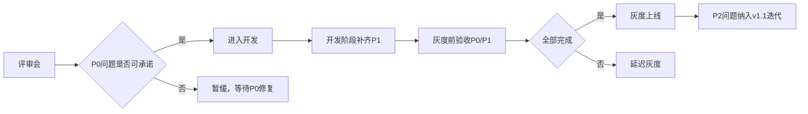

# 幸运礼物玩法方案 - 四维度评审报告

> 评审对象：幸运礼物玩法方案-共享奖池评审版 v1.0  
> 评审日期：2026-06-27  
> 评审方式：四维度子代理并行评审  
> 评审人：小龙虾（Hermes Agent）

---

## 评审摘要

### 总体评分

| 维度 | 评分 | 核心问题 |
|------|:----:|---------|
| **产品维度** | 85/100 ⭐⭐⭐⭐ | 本地化合规缺失、社交裂变不足 |
| **研发维度** | 80/100 ⭐⭐⭐⭐ | 数据模型缺失、幂等细节不足 |
| **风控/财务维度** | 75/100 ⭐⭐⭐⭐ | 成本边界不明确、套利路径未堵死 |
| **文案/多语言维度** | 60/100 ⭐⭐⭐ | 阿语术语缺失、RTL适配不全 |

**综合评估**：逻辑闭环、风控严谨、财务可控，但本地化合规和成本边界需补齐。

---

## 高风险点（多个代理指出）

### 🔴 P0 - 必须修复（阻塞上线）

| # | 问题 | 影响 | 涉及维度 | 负责人 |
|---|------|------|---------|--------|
| 1 | **沙特合规缺失** | 500/1000倍可能被认定为赌博 | 产品+文案 | 法务+产品 |
| 2 | **文化禁忌清单缺失** | 礼物/勋章可能含敏感元素 | 产品+文案 | 产品+设计 |
| 3 | **单用户日返奖上限未定义** | 成本失控风险 | 风控+财务 | 财务+风控 |
| 4 | **平台日预算硬约束缺失** | 补贴可能无限兜底 | 风控+财务 | 财务 |
| 5 | **主播自赠能否触发大奖未明确** | 套利路径未堵死 | 风控+产品 | 风控+产品 |
| 6 | **核心数据模型缺失** | 开发无法启动 | 研发 | 研发 |
| 7 | **阿语关键术语表缺失** | 阿语用户无法理解核心玩法 | 文案 | 本地化 |

### 🟡 P1 - 强烈建议（上线前补齐）

| # | 问题 | 影响 | 涉及维度 |
|---|------|------|---------|
| 8 | 充值后24h冻结期缺失 | 退款套现风险 | 风控 |
| 9 | 退款追溯机制缺失 | 已发奖励无法追回 | 风控+财务 |
| 10 | 社交裂变机制缺失 | 无法形成传播闭环 | 产品 |
| 11 | 斋月模式缺失 | 错过MENA黄金运营期 | 产品+文案 |
| 12 | 保底机制缺失 | 用户挫败感强，投诉率高 | 产品 |
| 13 | 结算提醒缺失 | 用户错过结算时间投诉 | 产品 |
| 14 | 幂等键规范缺失 | 重复订单风险 | 研发 |
| 15 | 降级推送机制缺失 | 客户端无法感知高倍开关 | 研发 |

---

## 详细评审报告

### 一、产品评审报告

**评分：85/100 ⭐⭐⭐⭐**

#### ✅ 产品逻辑完整度

**闭环设计优秀：**
- 送礼→即时开奖→榜单结算→奖励下发形成完整闭环
- 自赠/赠送他人、普通礼物/幸运礼物四象限场景均有明确口径
- 奖池生命周期（冷启动→注入→消耗→结束/回流）清晰

**待补充的点：**

| 缺失项 | 具体问题 | 风险等级 |
|--------|---------|---------|
| 用户退费后债务追缴机制 | 用户中奖后退款、已消耗奖励金币形成负债记录，但"如何追缴"未说明 | 🔴 P0 |
| 充值后60秒送礼的预扣账户逻辑 | T+24反洗钱校验失败后，预扣资金是退回用户还是进入平台坏账？ | 🔴 P0 |
| 榜单结算异常兜底方案 | 周期结束时如果结算服务失败，是否有重试队列？超时怎么处理？ | 🟡 P1 |
| 虚拟奖励发放失败补救流程 | TOP3的VIP/道具发放失败，是否有人工补发通道？ | 🟡 P1 |

#### ⚠️ 竞品差异化风险

**差异化亮点：**
- "共享奖池"概念与竞品独立奖池有明显区分
- 亏损补偿机制是创新点，降低了用户"送了没中"的挫败感
- 自赠强约束（财富等级≥5、不计榜、不补偿）防套利设计比竞品更严谨

**差异化风险：**

| 风险点 | 现状 | 竞品可能的攻击角度 |
|--------|------|-------------------|
| 倍率叙事同质化 | 5x/10x/20x/100x/250x/500x/1000x | "这个我们也有，没什么新鲜" |
| "共享奖池"概念模糊 | 前端展示的是"本轮奖池"（榜单奖池），不是即时奖池 | 用户无法感知"共享"价值 |
| 缺少社交裂变设计 | 仅房间飘屏，没有分享激励 | 竞品可做"分享榜单抽额外奖励" |
| 本地化特色不足 | 未提及斋月、开斋节等MENA特色玩法 | 竞品可做"斋月特别奖池" |

#### 🔥 本地化体验风险

**已有本地化设计：**
- 时区固定UTC+3（符合MENA主流）
- 规则图区分阿语/英语
- 禁用Jackpot/Bet/Gamble等敏感词

**严重缺失：**

| 缺失项 | 风险等级 | 具体问题 |
|--------|----------|---------|
| 沙特宗教合规 | 🔴 高 | 未提及沙特SAMA/游戏委员会审核要求；500x/1000x是否会被认定为"赌博"？ |
| 阿语RTL适配 | 🟡 中 | 文档只说"规则图区分阿语"，未说明客户端UI的RTL布局、数字显示方向、飘屏文案的阿语适配 |
| 文化禁忌 | 🔴 高 | 未提及是否排除"骷髅、十字架、酒杯、猪"等敏感元素；礼物图标和TOP3奖励的勋章/道具是否做了文化审核？ |
| 概率公示法律效力 | 🟡 中 | 只说"规则页需公示概率"，但未说明是否需要本地律师确认、是否需要阿拉伯语公证 |
| 斋月影响 | 🟡 中 | 未考虑斋月期间用户活跃时间变化对奖池水位和RTP的影响 |

#### 💬 评审会会被 diss 的点

**预判TOP 5攻击点及防守建议：**

##### 1. "25% RTP太低了，用户会觉得被骗"
**现有防守**：文档说明"保留倍率叙事、概率等比例缩小"，但用户无法感知这个设计  
**建议补充**：
- 增加透明化选项：在前端展示"当前奖池水位"和"本轮已发大奖数量"
- 设计保底机制：连续N笔未中，下一笔概率提升x%

##### 2. "房间能量≠真实奖池，会不会被用户告虚假宣传？"
**现有防守**：文档写了"规则页必须写明房间能量是社交氛围进度"  
**建议补充**：
- 正面话术设计：将"房间能量"改名为"幸运氛围值"
- 增加互动奖励：能量值达到100时，全房间用户获得一个"幸运红包"

##### 3. "自赠不计榜，主播会不满意"
**现有防守**：文档说明"自赠可开启计榜但需审批"  
**建议补充**：
- 设计"主播专属榜单"：区分"送礼榜"和"收礼榜"
- 增加"房间贡献榜"：统计主播房间内所有送礼

##### 4. "榜单周期是UTC+3 21:00-20:59，用户感知弱"
**现有防守**：半屏页有倒计时  
**建议补充**：
- 结算前30分钟推送提醒
- 结算后立即弹窗+推送

##### 5. "竞品有VIP专属倍率，我们没有会不会流失大R？"
**现有防守**：文档明确"不做正常用户正向提奖"  
**建议补充**：
- 设计"大R专属奖励"：100x以上中奖时额外获得"金勋章"等荣誉奖励
- VIP榜单：TOP3额外奖励配置为"VIP专属礼物框"

#### 📋 产品改进建议清单

##### 🔴 必须补充（P0）

| 序号 | 问题 | 建议补充内容 |
|------|------|-------------|
| P0-1 | 沙特合规缺失 | 增加第20章"本地化合规清单"，明确沙特游戏/博彩监管边界 |
| P0-2 | 文化禁忌清单缺失 | 增加附录"礼物和奖励素材文化禁忌清单" |
| P0-3 | 退费后债务追缴 | 补充"退费用户追缴流程"：余额扣减→负余额记录→限制充值提现→人工介入 |
| P0-4 | 概率公示法律效力 | 明确"概率公示是否需要本地律师确认" |

##### 🟡 强烈建议（P1）

| 序号 | 问题 | 建议补充内容 |
|------|------|-------------|
| P1-1 | 缺少社交裂变 | 增加"分享榜单得额外抽奖机会"机制 |
| P1-2 | 斋月模式缺失 | 设计"斋月模式"：调整周期时间、奖池注入、TOP3奖励 |
| P1-3 | 保底机制缺失 | 增加连续N笔未中后概率提升机制 |
| P1-4 | 结算提醒缺失 | 补充榜单结算前30分钟推送和结算后即时弹窗 |
| P1-5 | 主播权益设计 | 增加"收礼榜"或"房间贡献榜" |
| P1-6 | 大R差异化 | 增加"大R专属荣誉奖励" |

---

### 二、研发评审报告

**评分：80/100 ⭐⭐⭐⭐**

#### ✅ 技术可行性

**总体评估：方案技术可行，设计较为完整**

| 模块 | 评估 | 说明 |
|------|------|------|
| 单笔送礼+即时开奖 | ✅ 可行 | 幂等设计、事务模型、开奖流程清晰 |
| 共享奖池模型 | ✅ 可行 | 活动×国家维度建账，水位迟滞设计合理 |
| 概率计算 | ✅ 可行 | 预算化概率、多系数叠加、服务端开奖 |
| 榜单结算 | ✅ 可行 | 周期制、封禁剔除、批量结算 |
| 风控分层 | ✅ 可行 | 黑名单分级、风险系数降权、人审机制 |
| 熔断降级 | ✅ 可行 | 多级预算系数、水位准入、补贴约束 |
| 审计追踪 | ✅ 可行 | 30+审计字段，支持回放 |

**亮点**：
1. 文档冲突裁决表清晰，解决了多文档不一致问题
2. 财务模型完整：4账本拆分（即时奖池、排名池、亏损补偿池、补贴预算）
3. 降级链路明确：从关闭高倍到完全下线有分级策略

#### ⚠️ 接口设计风险

##### 1. 幂等设计细节不足

| 问题 | 风险等级 | 说明 |
|------|----------|------|
| `client_request_id` 格式未定义 | 🟡 中 | 需明确是 UUID、timestamp+seq 还是其他格式 |
| 幂等窗口期未定义 | 🟡 中 | 5分钟？24小时？永久？ |
| 幂等键冲突处理 | 🟡 中 | 不同用户同一 client_request_id 如何处理？ |

**建议**：补充幂等键设计规范：
```text
order_id = 服务端生成的全局唯一ID
client_request_id = user_id + timestamp_ms + random_nonce
幂等窗口 = 24小时（订单保留期）
幂等存储 = Redis SETEX + DB unique index
```

##### 2. 重试机制缺失

| 场景 | 文档描述 | 风险 |
|------|----------|------|
| 扣款成功但开奖失败 | "进入补偿队列，最多重试3次" | 重试间隔未定义 |
| 奖池扣款成功但派奖失败 | "5分钟内重试" | 重试失败后的补偿流程不完整 |
| 大额人审超时 | 未定义 | 审核超时如何处理？自动发还是自动拒绝？ |

**建议**：
```text
扣款成功开奖失败：
- 重试策略：指数退避 1s, 2s, 4s, 8s, 16s
- 超时兜底：3次失败后退还礼物金币，记录异常日志

大额人审：
- 审核超时阈值：24小时
- 超时策略：自动拒绝并退款到奖池，发站内信告知用户
```

##### 3. 降级接口缺失

| 降级场景 | 触发条件 | 接口设计 | 风险 |
|----------|----------|----------|------|
| 关闭高倍 | 水位不足 | ❌ 未定义 | 客户端如何感知？ |
| 关闭即时Lucky Roll | 成本率超限 | ❌ 未定义 | 需要配置推送机制 |
| 完全下线 | 严重事故 | ❌ 未定义 | 需要全局开关API |

**建议**：增加配置推送接口：
```json
GET /lucky/config?activity_id=xxx&country_code=xxx
{
  "lucky_enabled": true,
  "available_multipliers": [0, 5, 10, 20, 100],
  "water_level_display": "normal",
  "maintenance": false
}
```

#### 🔥 数据模型风险

##### 1. 核心表结构缺失

文档定义了审计字段，但**未给出完整的数据库表设计**，存在以下风险：

| 表 | 缺失内容 | 风险等级 |
|----|----------|---------|
| 订单表 | 主键设计、分区策略、归档策略 | 🔴 高 |
| 奖池账本表 | 并发更新锁机制、余额精度 | 🔴 高 |
| 榜单表 | 排名更新频率、索引设计 | 🟡 中 |
| 用户风控表 | 分级标识更新延迟 | 🟡 中 |
| 配置表 | 版本化、灰度发布支持 | 🟡 中 |

**建议补充的核心表结构**：

```sql
-- 订单表（建议按activity_id + country_code分区）
CREATE TABLE lucky_gift_orders (
    order_id VARCHAR(64) PRIMARY KEY,
    client_request_id VARCHAR(128) NOT NULL,
    user_id BIGINT NOT NULL,
    room_id BIGINT NOT NULL,
    gift_id VARCHAR(64) NOT NULL,
    gift_cost BIGINT NOT NULL,
    gift_count INT NOT NULL,
    is_self_gift TINYINT NOT NULL,
    activity_id VARCHAR(64) NOT NULL,
    country_code VARCHAR(8) NOT NULL,
    probability_version VARCHAR(64) NOT NULL,
    random_value DECIMAL(38, 20) NOT NULL,
    hit_multiplier INT DEFAULT 0,
    reward_coin BIGINT DEFAULT 0,
    pool_pay BIGINT DEFAULT 0,
    subsidy_pay BIGINT DEFAULT 0,
    downgrade_from INT,
    downgrade_to INT,
    downgrade_reason VARCHAR(64),
    manual_review_status VARCHAR(32),
    created_at_utc3 DATETIME NOT NULL,
    UNIQUE KEY uk_client_req (user_id, client_request_id),
    KEY idx_activity_country_time (activity_id, country_code, created_at_utc3),
    KEY idx_user_time (user_id, created_at_utc3)
) ENGINE=InnoDB;

-- 奖池账本表（需要行锁或乐观锁）
CREATE TABLE lucky_pool_balance (
    pool_id VARCHAR(64) PRIMARY KEY,
    instant_pool_balance BIGINT NOT NULL DEFAULT 0,
    rank_pool_balance BIGINT NOT NULL DEFAULT 0,
    loss_comp_pool_balance BIGINT NOT NULL DEFAULT 0,
    subsidy_budget_balance BIGINT NOT NULL DEFAULT 0,
    protect_balance BIGINT NOT NULL DEFAULT 0,
    version BIGINT NOT NULL DEFAULT 0,
    updated_at DATETIME NOT NULL,
    KEY idx_update_time (updated_at)
) ENGINE=InnoDB;
```

##### 2. 索引设计建议

| 查询场景 | 建议索引 | 说明 |
|----------|----------|------|
| 幂等检查 | `(user_id, client_request_id)` UNIQUE | 防止重复下单 |
| 榜单排名 | `(activity_id, country_code, period_start, eligible_cost DESC)` | 高效取TopN |
| 用户开奖记录 | `(user_id, created_at_utc3 DESC)` | 我的奖励页查询 |
| 风控审计 | `(activity_id, country_code, hit_multiplier, created_at_utc3)` | 高倍中奖分析 |
| 对账 | `(activity_id, country_code, DATE(created_at_utc3))` | 每日成本统计 |

##### 3. 并发安全问题

| 场景 | 风险 | 建议方案 |
|------|------|----------|
| 奖池余额扣减 | 高并发下超扣 | 行锁 + 乐观锁双重保护，余额预扣 + 异步确认 |
| 水位计算时机 | 大奖并发导致水位跳变 | 开奖事务开始时锁定水位版本号 |
| 榜单排名实时更新 | 频繁更新性能问题 | 使用Redis Sorted Set实时排名，DB异步持久化 |

#### 💬 研发会问的问题

##### 架构层面

1. **奖池存储方案**：即时奖池是单机内存、Redis还是DB？高并发扣减如何保证一致性？
2. **RNG服务独立部署还是内嵌**：如果独立部署，网络延迟如何保证开奖P99 < 100ms？
3. **配置中心依赖**：水位、预算系数、风控系数变更频率？
4. **榜单结算时机**：UTC+3 20:59:59 周期结束，结算批量任务预估多久？

##### 性能层面

5. **QPS预估**：单国家峰值送礼QPS预期？开奖接口QPS？
6. **奖池扣减热点**：同一活动×国家奖池是单点热点吗？
7. **大额人审队列**：如果高峰期大量1000倍命中，审核队列如何处理？

##### 边界场景

8. **充值后60秒送礼的预扣账户**：预扣账户是独立表还是同一奖池加标记？
9. **退款用户中奖后的回收逻辑**：用户余额不足时如何处理？
10. **跨国家场景**：用户在SA房间送礼后，房间切换到AE，榜单归属哪个国家？

##### 合规与审计

11. **审计日志保留周期**：核心审计日志保留多久？
12. **概率版本切换**：活动中途修改概率配置，已下单未开奖订单用哪个版本？

#### 📋 研发改进建议清单

##### 🔴 必须补充（阻塞上线）

| 编号 | 项目 | 建议内容 |
|------|------|----------|
| M1 | 完整数据模型 | 补充订单表、奖池表、榜单表、风控表的DDL，含分区策略和索引 |
| M2 | 幂等键规范 | 定义 `client_request_id` 格式、幂等窗口期、冲突处理策略 |
| M3 | 并发扣减方案 | 明确奖池余额扣减的锁机制（行锁/乐观锁/Redis原子操作） |
| M4 | 降级推送机制 | 定义配置变更推送接口，客户端如何感知高倍开关 |
| M5 | 大额人审超时处理 | 定义审核超时阈值和超时策略 |

##### 🟡 建议优化（上线前完成）

| 编号 | 项目 | 建议内容 |
|------|------|----------|
| O1 | 接口SLO细化 | 补充各接口P50/P99/P999延迟目标 |
| O2 | 压测指标 | 定义压测场景：单国家峰值QPS、持续时间、水位压力 |
| O3 | 预扣账户设计 | 充值后60秒送礼的预扣账户需要完整状态机 |
| O4 | 退款追缴逻辑 | "负债记录"需要明确追缴策略和坏账处理 |
| O5 | 榜单结算性能 | 大规模榜单（如Top1000）的结算耗时预估 |

---

### 三、风控/财务评审报告

**评分：75/100 ⭐⭐⭐⭐**

#### ✅ 风控规则严密性

**优点：**

| 维度 | 规则覆盖 | 评价 |
|------|----------|------|
| 用户维度 | 新用户(1-3天限制)、退款用户、黑名单、高频异常、同设备多账号、同IP多账号 | ✅ 全面 |
| 房间/主播维度 | 关联账号送礼、短时异常冲池、低活跃房高额送礼、同公会互刷、违规房间冻结 | ✅ 全面 |
| 奖池阈值 | 保护线30%、单次最大发放50%、单日最大发放70%、用户日奖励/消费比限制 | ✅ 设计合理 |

**核心优势：**
- 先判断奖池余额，再生成可参与奖项池，最后抽取（正确顺序）
- 大奖必须有最低奖池余额门槛，余额不足时直接不进入抽取范围
- 概率可按奖池健康度动态调整（低健康度降低大奖概率）

**⚠️ 缺失项：**

| 缺失规则 | 风险等级 | 建议 |
|----------|----------|------|
| 自赠幸运礼物差异化比例导致的套利 | 🔴 P0 | 文档未明确限制主播自赠触发大奖 |
| 充值后冻结期 | 🔴 P0 | 缺少"充值后24h内禁止参与返奖" |
| 领取接口并发幂等 | 🔴 P0 | 文档只提了"返奖幂等"，未提"领取幂等" |
| 关联账号识别机制 | 🟡 P1 | 只提了"识别主播关联账号"，未给具体方法 |
| 退款追溯机制 | 🟡 P1 | 缺少退款后追溯已发奖励的机制 |

#### ⚠️ 成本核算风险

##### 1. 参数边界不明确

文档给出的是区间值，缺少明确上限：

| 参数 | 文档建议值 | 财务需确认 |
|------|-----------|-----------|
| 奖池注入比例 | 10%-35% | 日常值？活动上限？ |
| 平台补贴 | 0%-30% | 需审批的阈值是？ |
| 单用户日返奖上限 | ❌ 未明确 | **缺失关键参数** |

**风险：** 如果单用户日返奖无上限，大R可能通过高频送礼触发多次高倍，导致成本失控。

##### 2. 自赠比例差异导致成本漏算

根据文档，自赠幸运礼物：
- 钻石余额和钻石流水：10% × 99%
- 财富值和魅力值：10% × 50%

**问题：** 自赠礼物入账比例与被送礼不同，可能导致：
- BD/公会长工资结算时，自赠流水计算错误
- 薪资结算时主播工资档位虚高

##### 3. 奖池回收模型存在隐藏成本

文档建议：
```text
可发奖金额 = 当前奖池余额 × 可发放比例 + 平台浮动补贴
```

**财务风险：**
- 平台浮动补贴缺乏"单日预算上限"硬性约束
- 建议改为：`可发奖金额 ≤ min(公式值, 平台日预算剩余额)`

##### 4. 结算周期风险

文档建议日常玩法"每日00:00 GMT+3"重置，但：
- 未明确跨周期大奖如何处理
- 未说明奖池结转30%-70%时是否需要财务确认

#### 🔥 合规风险

##### 1. 高风险设计需谨慎

| 设计 | 风险 | 文档建议 | 评价 |
|------|------|----------|------|
| 金币随机返还 | 博彩感强 | 不建议 | ✅ 正确 |
| 高倍数返奖 | 审核关注 | 控制倍数 | ✅ 正确 |
| 可提现奖励 | 极高风险 | 不建议 | ✅ 正确 |
| 大奖可返金币 | 需概率披露 | 需规则页 | ⚠️ 未给概率披露模板 |

##### 2. 用语规范

文档明确不建议使用：中奖、下注、赢金币、Jackpot、大奖池、翻倍赢钱、Cash out

**建议补充：**
- 后台配置字段也不能用"jackpot"命名（已发现 pool_protection_rate 等字段，✅）
- 接口命名需检查是否含有 gamble/bet/win 等敏感词

##### 3. 概率披露合规

文档要求前台规则页展示：
- 各奖励对应概率
- 奖励是否可提现
- 奖励有效期

**⚠️ 缺失：**
- 概率动态调整时是否需要实时更新前台展示？
- 建议增加："当前处于[低/中/高]能量阶段，对应概率见下方"

#### 💬 财务会问的问题

| # | 问题 | 文档现状 |
|---|------|----------|
| 1 | 单用户单日最大返奖金额是多少？ | ❌ 未明确（仅有比例限制） |
| 2 | 平台单日活动预算上限是多少？ | ❌ 未明确 |
| 3 | 奖池亏空时谁兜底？ | ⚠️ 提到平台补贴，但无上限 |
| 4 | 主播自赠能否触发大奖？ | ❌ 未明确禁止 |
| 5 | 返奖金币是否计入主播收益？ | ⚠️ 需确认结算口径 |
| 6 | 奖池结转比例谁审批？ | ⚠️ 建议财务审批 |
| 7 | 充值退款后奖励如何追回？ | ❌ 未设计追溯机制 |
| 8 | 实际中奖率与理论值偏差多少触发告警？ | ❌ 未明确阈值 |
| 9 | 奖池资金归属（平台or活动）？ | ❌ 未明确 |
| 10 | 审计日志保留多久？ | ❌ 未明确 |

#### 📋 风控/财务改进建议清单

##### 🔴 P0 - 必须修复

| # | 改进项 | 具体建议 |
|---|--------|----------|
| P0-1 | 明确单用户日返奖上限 | 建议不超过用户当日消费金额的30%-50%，且绝对值不超过20,000金币 |
| P0-2 | 禁止主播自赠触发大奖 | 主播在自己房间发送幸运礼物，取消返奖资格 |
| P0-3 | 充值冻结期 | 首充/大额充值后24h内禁止参与返奖 |
| P0-4 | 领取接口并发安全 | 明确使用Redis原子操作+请求幂等 |
| P0-5 | 明确平台日预算上限 | 配置`platform_daily_subsidy_limit`字段 |

##### 🟡 P1 - 建议补充

| # | 改进项 | 具体建议 |
|---|--------|----------|
| P1-1 | 退款追溯机制 | 触发退款时，追溯近7天发出的返奖，冻结领取人对应金额 |
| P1-2 | 关联账号识别 | 增加同设备、同IP、同支付方式的关联账号图谱 |
| P1-3 | 中奖率偏差告警 | 实际中奖率/理论中奖率 > 1.5 时自动告警 |
| P1-4 | 审计日志保留 | 建议≥180天，符合财务审计要求 |
| P1-5 | 财务审批流程 | 奖池结转比例、平台补贴比例需财务审批后生效 |

---

### 四、文案/多语言评审报告

**评分：60/100 ⭐⭐⭐**

#### ✅ 文案表达准确性

**已做得较好的部分：**

1. **禁用词清单明确**：文档已建立禁用词对照表
   | 禁用 | 替代 |
   |---|---|
   | Jackpot | Lucky Bonus / Lucky Treasure |
   | Bet / Gamble | Send Gift / Try Your Luck |
   | Win Cash | Get Coins / Get Reward |

2. **合规定性清晰**：
   - 金币奖励仅可站内消费，不可提现 ✅
   - 未成年人和实名不完整用户不得参与 ✅

3. **客服话术规范**：已定义客服禁止行为

4. **房间能量文案规范**：
   - 禁止："奖池快爆了""再送一笔就爆"
   - 建议："幸运能量上升""Lucky Energy 增加"

#### ⚠️ 多语言适配风险

**发现的问题：**

##### 1. 关键术语缺少阿语翻译定义

文档中大量核心术语仅有中文/英文，未提供阿语参考：

| 术语 | 英文 | 建议阿语 |
|------|------|---------|
| Lucky Roll | 即时开奖 | `سحب المحظوظين` |
| 幸运礼物 | Lucky Gift | `هدية المحظوظين` |
| 幸运奖池 | Lucky Pool | `صندوق الجوائز` |
| 亏损补偿 | Loss Compensation | `مكافأة الحظ`（避免"亏损"） |

##### 2. 奖励通知文案未提供阿语版本

原文：
```
【奖励通知】恭喜你，在上一轮幸运奖池活动中排名第{排名}，瓜分获得{金币数}金币
```

**问题：** 缺少阿语版本，需RTL排版考虑

##### 3. 概率公示文案未提供阿语翻译

原文：
```
以下为当前活动正常状态下的基础概率。系统会根据活动预算、奖池状态和账号安全状态进行限制；被限制的高档奖励概率将并入未中奖结果。
```

**问题：** 阿语用户无法理解概率说明

##### 4. 文档内部存在英文/中文混用

- "Lucky Roll" vs "即时开奖" 不统一
- "Lucky Gift" vs "幸运礼物" 混用
- **建议：** 建立术语对照表

#### 🔥 文化禁忌风险

**已规避的风险：** ✅

1. **博彩属性规避**：
   - 明确禁用 Jackpot/Bet/Gamble/赢现金
   - 明确"金币奖励仅可站内消费，不可提现"
   - 明确"不做用户下注式奖池"

**需要补充的风险：** ⚠️

##### 1. 缺少保守分区配置差异表

参考 mena-localization-guide，应补充：

| 功能 | 沙特（SA） | 阿联酋（AE） | 埃及（EG） |
|---|---|---|---|
| 500/1000倍高返奖 | 关闭或降档 | 正常 | 正常 |
| 高倍飘屏展示 | 可选隐藏 | 正常 | 正常 |
| 亲密礼物特效 | 隐藏或替换 | 正常 | 部分替换 |

##### 2. 视觉主题未定义

文档未定义视觉设计规范，需补充：
- ✅ 推荐主题：星月、绿洲、金色/绿色（吉祥色）
- ❌ 禁用元素：猪、狗、酒精相关内容、过度亲密图片

##### 3. Ramadan/斋月特殊配置缺失

- 未提及斋月期间白天/夜间运营策略差异
- 建议：斋月白天降档，夜间（Iftar后）正常或增强

#### 💬 本地化会问的问题

**文案翻译相关问题：**

1. **"亏损补偿"如何翻译？**
   - 阿语直译可能涉及博彩敏感词
   - 建议：使用"运气守护奖励"或"幸运保障"

2. **"爆奖"如何表达？**
   - 文档使用"爆奖"描述1000倍中奖
   - 禁用"爆奖池"，但"爆奖"是否也需替换？
   - 建议：使用"超级幸运奖"或"大奖"

3. **倍率表达方式**
   - 阿语数字为LTR，但文案为RTL
   - "5x" 需要考虑混排方向

**技术实现相关问题：**

4. **RTL 布局适配细节**
   - 榜单排名从哪侧开始排列？
   - 倒计时数字方向？
   - 进度条方向？
   - 飘屏文字滚动方向？

5. **阿语长文本溢出**
   - 阿语文本通常比英文长30%-50%
   - UI 需预留足够空间

6. **时区表述**
   - 客服话术统一使用 UTC+3
   - 用户端是否显示本地时区转换？

#### 📋 文案/多语言改进建议清单

##### 🔴 P0 - 高优先级

| 序号 | 问题 | 建议改进 |
|------|------|----------|
| P0-1 | 缺少阿语关键术语表 | 补充核心术语中/英/阿三语对照表 |
| P0-2 | 奖励通知缺少阿语版本 | 补充阿语版本通知文案 |
| P0-3 | 保守分区配置缺失 | 补充沙特/阿联酋/埃及配置差异表 |
| P0-4 | 概率公示文案缺阿语 | 补充阿语版本概率公示模板 |

##### 🟡 P1 - 中优先级

| 序号 | 问题 | 建议改进 |
|------|------|----------|
| P1-1 | 术语不统一 | 建立术语表：Lucky Roll→即时开奖，统一使用 |
| P1-2 | "亏损补偿"翻译敏感 | 建议改用"幸运保障奖励" |
| P1-3 | RTL适配规范缺失 | 补充RTL布局规范：列表方向、进度条、飘屏等 |
| P1-4 | 视觉主题规范缺失 | 补充推荐/禁用视觉元素清单 |

##### 🟢 P2 - 低优先级

| 序号 | 问题 | 建议改进 |
|------|------|----------|
| P2-1 | 阿语文本长度预留 | UI设计需预留30%-50%额外空间 |
| P2-2 | 斋月特殊配置 | 补充斋月期间运营策略建议 |
| P2-3 | 倍率数字方向 | 明确阿语环境下"5x"等倍率的展示方向 |

---

## 评审会准备建议

### 老板会问的问题

| # | 问题 | 建议回答 |
|---|------|----------|
| 1 | "25% RTP太低了，用户会不会投诉？" | 已设计保底机制和透明化展示，同时预留活动增强档（30% RTP） |
| 2 | "竞品有VIP专属倍率，我们不做会流失大R吗？" | 设计了大R专属荣誉奖励（金勋章、专属礼物框），不提升概率但强化身份感 |
| 3 | "成本可控吗？会不会超预算？" | 设计了多级熔断机制：成本率超40%预警、超45%自动熔断 |
| 4 | "沙特合规吗？会不会被认定为赌博？" | 需要法务确认；已准备保守分区配置（500/1000倍降档或关闭） |

### 技术会问的问题

| # | 问题 | 建议回答 |
|---|------|----------|
| 1 | "数据库表结构是什么？" | 已设计核心表DDL（见研发评审报告），需补充分区策略 |
| 2 | "高并发下奖池扣减如何保证不超扣？" | 使用行锁+乐观锁双重保护，Redis原子操作预扣 |
| 3 | "配置变更如何实时生效？" | 设计配置推送接口，客户端轮询或长连接获取 |
| 4 | "压测指标是什么？" | 待补充：单国家峰值QPS、持续时间、水位压力场景 |

### 财务会问的问题

| # | 问题 | 建议回答 |
|---|------|----------|
| 1 | "单用户日返奖上限是多少？" | 建议不超过消费金额的30%-50%，绝对值不超过20,000金币，需财务确认 |
| 2 | "平台日预算上限是多少？" | 需财务审批后配置到系统 |
| 3 | "退款后已发奖励如何追回？" | 需补充追溯机制，冻结用户对应金额 |
| 4 | "奖池结转比例谁审批？" | 建议财务审批后生效 |

### 法务会问的问题

| # | 问题 | 建议回答 |
|---|------|----------|
| 1 | "500/1000倍是否构成赌博？" | 需要本地律师确认；已准备降档方案 |
| 2 | "概率公示是否需要公证？" | 需要本地律师确认 |
| 3 | "礼物图标是否含敏感元素？" | 需补充文化禁忌清单，交设计团队审核 |

---

## 改进优先级总表

### 🔴 P0 - 必须修复（阻塞上线）

| # | 维度 | 问题 | 负责人 | 截止日期 |
|---|------|------|--------|----------|
| 1 | 产品+文案 | 沙特合规缺失 | 法务+产品 | 开发前 |
| 2 | 产品+文案 | 文化禁忌清单缺失 | 产品+设计 | 开发前 |
| 3 | 风控+财务 | 单用户日返奖上限未定义 | 财务+风控 | 开发前 |
| 4 | 风控+财务 | 平台日预算硬约束缺失 | 财务 | 开发前 |
| 5 | 风控+产品 | 主播自赠能否触发大奖未明确 | 风控+产品 | 开发前 |
| 6 | 研发 | 核心数据模型缺失 | 研发 | 开发启动前 |
| 7 | 文案 | 阿语关键术语表缺失 | 本地化 | 开发前 |

### 🟡 P1 - 强烈建议（上线前补齐）

| # | 维度 | 问题 | 负责人 |
|---|------|------|--------|
| 8 | 风控 | 充值后24h冻结期缺失 | 风控 |
| 9 | 风控 | 退款追溯机制缺失 | 风控+财务 |
| 10 | 产品 | 社交裂变机制缺失 | 产品 |
| 11 | 产品 | 斋月模式缺失 | 产品+文案 |
| 12 | 产品 | 保底机制缺失 | 产品 |
| 13 | 产品 | 结算提醒缺失 | 产品 |
| 14 | 研发 | 幂等键规范缺失 | 研发 |
| 15 | 研发 | 降级推送机制缺失 | 研发 |

### 🟢 P2 - 建议优化（迭代优化）

| # | 维度 | 问题 |
|---|------|------|
| 16 | 产品 | "共享奖池"价值不清晰 |
| 17 | 研发 | 压测指标未定义 |
| 18 | 文案 | 阿语文本长度预留 |
| 19 | 文案 | 倍率数字方向 |

---

## 评审结论

### 通过条件

建议在以下条件满足后通过评审：

1. ✅ P0问题全部修复完成
2. ✅ P1问题有明确方案和负责人
3. ✅ 财务确认成本边界参数
4. ✅ 法务确认沙特合规边界

### 建议节奏



---

**评审完成日期**：2026-06-27  
**评审人**：小龙虾（Hermes Agent）  
**下一步**：等待产品确认P0问题修复方案