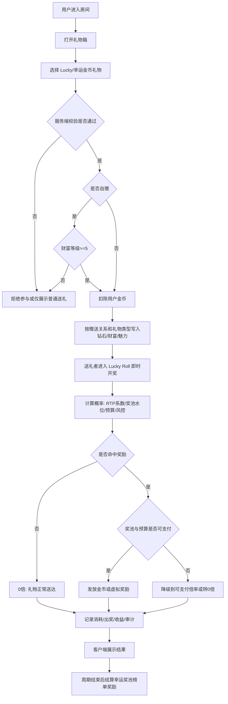
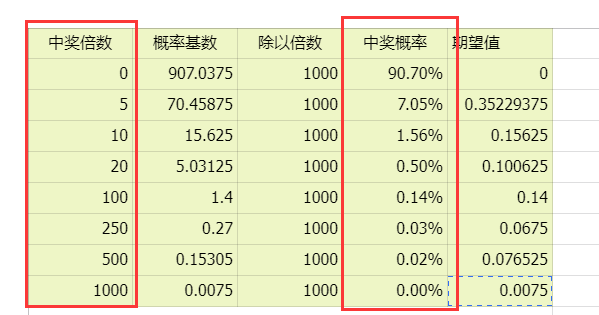
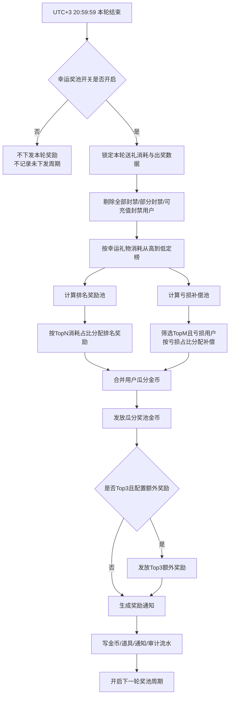
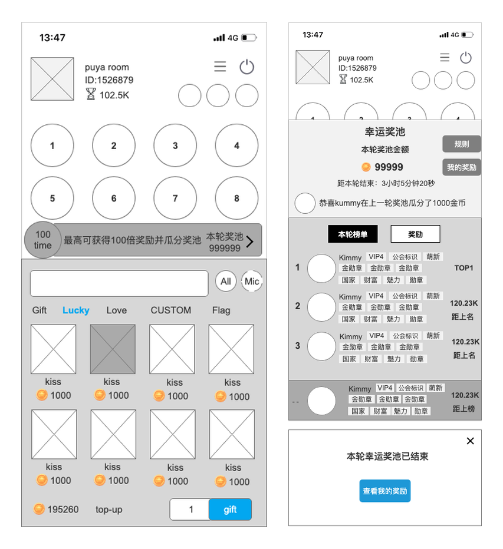
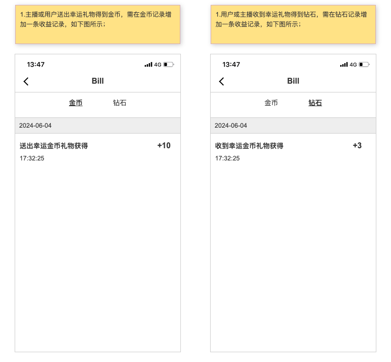
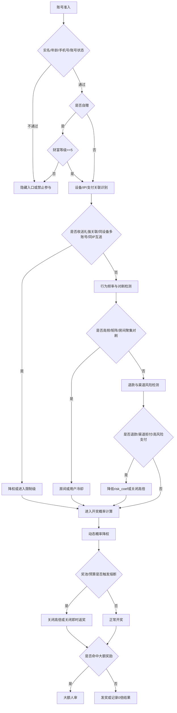
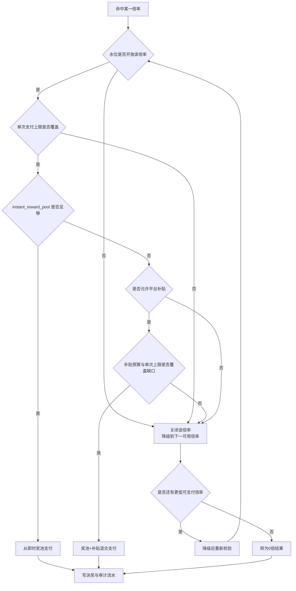
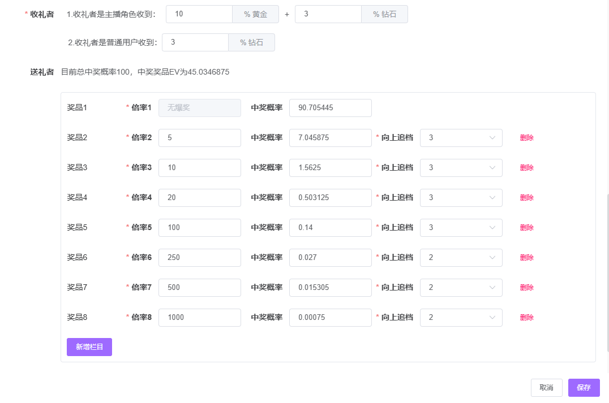
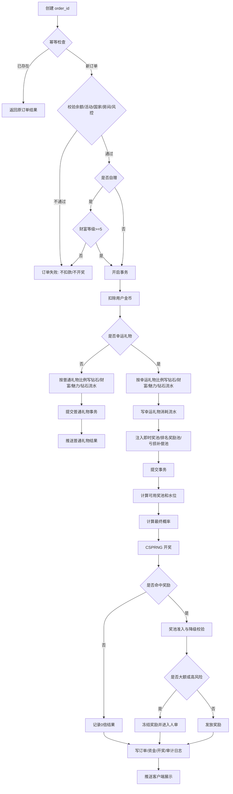
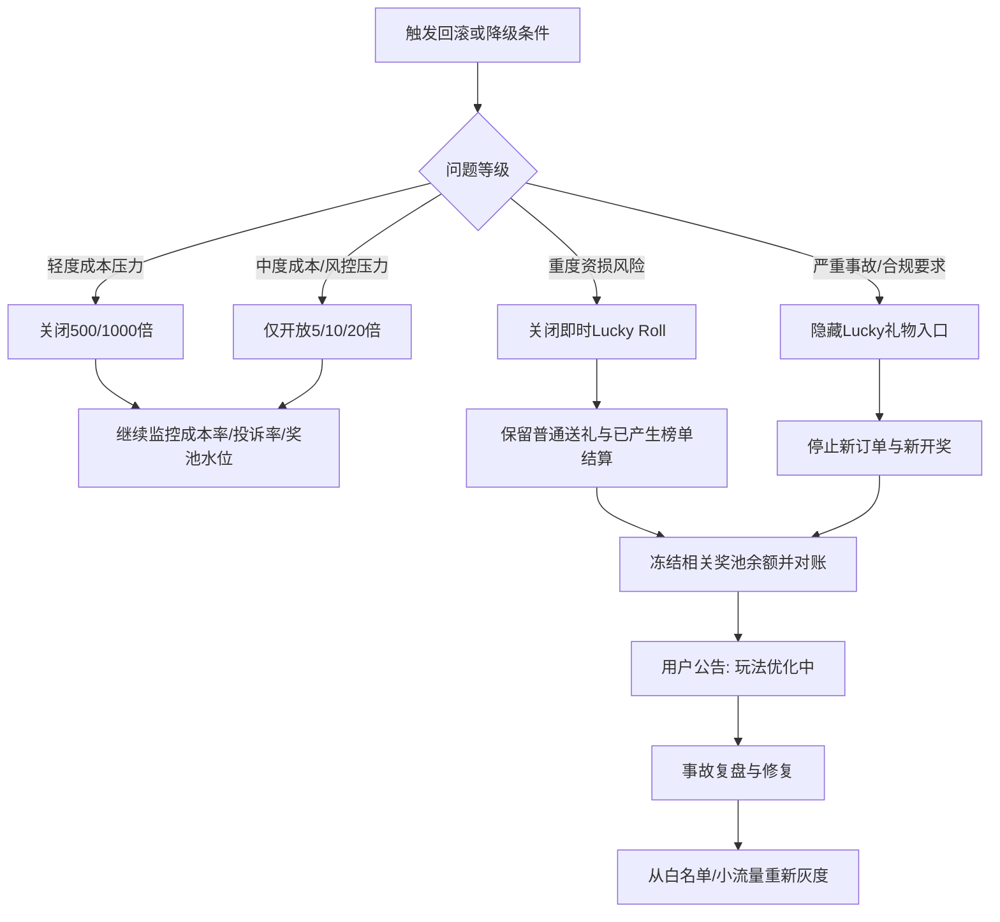

# 幸运礼物玩法方案 - 共享奖池评审版

> 产品：Wechill / SABA 语聊房  
> 文档状态：可评审  
> 方案版本：v1.0  
> 日期：2026-06-18  
> 参考来源：Axure 原型《SABA需求原型-1》、参考文档《幸运礼物玩法方案-C共享奖池版（Greedy式）》  

---

## 1. 评审摘要

本方案把“幸运礼物”定义为一个**送礼后触发幸运反馈的付费互动玩法**，同时保留现有原型中的核心口径：

1. 用户送出幸运金币礼物后，送礼者有机会获得金币奖励。
2. 不再按收礼身份拆分收益；所有用户均可收礼，仅区分**赠送他人**与**自赠**。
3. 赠送他人时，普通礼物按 100% 计入钻石、魅力值、财富值；幸运礼物按 10% 计入。
4. 自赠仅财富等级 `>= 5` 可用；自赠时钻石余额和钻石流水按 99% 折算，幸运礼物的财富值和魅力值额外按 50% 折损。
5. 自赠幸运礼物默认不参与幸运奖池榜单、排名奖励和亏损补偿。
6. Lucky Roll 奖励金币再次消费默认不纳入 BD、公会长工资、TG 奖励等外部结算。
7. 每日 UTC+3 `21:00:00 ~ 次日 20:59:59` 形成一轮幸运奖池榜单。
8. 榜单奖励由排名奖励和亏损补偿两部分组成。
9. TOP3 可配置额外奖励。

在此基础上，本方案引入**活动 × 国家共享奖池**、**预算化概率**、**奖池水位准入**、**风控系数**和**熔断机制**，避免“固定高 RTP 返金币”导致平台成本不可控。

### 1.1 评审结论

| 评审方 | 关注点 | 本方案口径 |
|---|---|---|
| 产品 | 用户是否有爽感 | 保留 5x/10x/20x/100x/250x/500x/1000x 倍率叙事，增加房间飘屏、榜单、TOP3 奖励 |
| 研发 | 是否可实现 | 单笔送礼强幂等，开奖服务端完成；奖池按活动国家维度建账；概率、风控、熔断均后台可配置 |
| 财务 | 成本是否可控 | 不常态使用 90.069375% 即时 RTP；默认使用 30% 预算化 RTP，奖池不足则关闭高倍 |
| 风控 | 是否可套利 | 自赠异常、收送礼强关联、同设备/IP、退款、模拟器、短时高频、对刷房间均降权或禁中高倍 |
| 法务/合规 | 是否像博彩 | 奖励限定为站内虚拟资产，不可提现；禁用 Jackpot/Bet/Gamble/赢现金等表达 |
| 客服 | 投诉怎么解释 | 每笔 order_id 可查；概率公示基础表；高额奖励进入安全审核；不透露风控系数和水位 |

### 1.2 关键设计原则

1. **概率可以有，但成本必须有上限**：每个高倍奖都必须经过奖池水位、预算、风控三重准入。
2. **金币奖励不可提现**：金币仅可站内消费，避免形成现金博彩属性。
3. **不做用户正向差别提奖**：正常用户不因 VIP 身份被单独提高中奖概率；仅允许对高风险用户降权或关闭高档位。
4. **房间能量不等于真实奖池**：前端可做氛围进度，但不得暗示“再送一笔必爆”。
5. **封禁和异常用户剔除榜单奖励**：全部封禁、部分封禁、可充值封禁用户不参与榜单奖励下发。
6. **自赠不默认参与榜单补偿**：避免自己刷榜、亏损补偿和外部结算形成循环套利。

---

## 2. 玩法范围

### 2.1 用户流程



### 2.2 玩法模块

| 模块 | 说明 | 是否本期必做 |
|---|---|---|
| 幸运礼物送礼 | 用户送出 Lucky 类型礼物 | 是 |
| 即时 Lucky Roll | 送礼者按概率获得金币奖励 | 是 |
| 活动国家共享奖池 | 即时返奖和榜单奖励的资金约束 | 是 |
| 幸运奖池榜单 | 按周期内送出的幸运礼物价值排行 | 是 |
| 亏损补偿 | 对榜单内亏损用户进行补偿 | 是 |
| TOP3 额外奖励 | 后台配置额外奖励，周期结束下发 | 是 |
| 房间能量 | 氛围展示，不等于真实奖池 | 建议做 |
| 大奖飘屏 | 高倍中奖时触发圆球/横幅/全服飘屏 | 是 |
| 我的奖励 | 查看上一轮奖励和历史记录 | 是 |

### 2.3 不做范围

| 不做项 | 原因 |
|---|---|
| 现金提现 | 合规风险高 |
| 用户下注式奖池 | 容易被定性为博彩 |
| 房间独立真实奖池 | 小房间体验差，大房间成本波动大 |
| 客户端参与开奖计算 | 有篡改风险，开奖必须服务端完成 |
| 中奖结果后台人工改写 | 审计风险高，只允许补发/撤销走工单 |

---

## 3. 货币与收益口径

### 3.1 用户支付

用户送出礼物时，按礼物金币价值扣除钱包金币：

```text
gift_cost = gift_price * count
```

所有金额以整数金币入账。小数计算默认统一在服务端 `round()` 四舍五入后入账，余数进入平台误差调节账户；如财务要求向下取整，必须全系统统一切换，不允许不同模块混用。

### 3.2 赠送他人收益

所有用户都可以收礼，不再按收礼身份拆收益。赠送他人时，仅按礼物类型区分普通礼物与幸运礼物。

| 礼物类型 | 收礼方获得钻石 | 收礼方魅力值 | 送礼方财富值 | 钻石流水 |
|---|---:|---:|---:|---:|
| 普通礼物 | `gift_cost * 100%` | `gift_cost * 100%` | `gift_cost * 100%` | `gift_cost * 100%` |
| 幸运礼物 | `gift_cost * 10%` | `gift_cost * 10%` | `gift_cost * 10%` | `gift_cost * 10%` |

示例：

| 场景 | 实际获得 |
|---|---|
| A 给 B 赠送 100 金币普通礼物 | B 获得 100 钻石、100 魅力值；A 获得 100 财富值；钻石流水 100 |
| A 给 B 赠送 1000 金币幸运礼物 | B 获得 100 钻石、100 魅力值；A 获得 100 财富值；钻石流水 100 |

### 3.3 自赠收益

自己给自己赠送礼物时，必须满足：

```text
sender_user_id = receiver_user_id
sender_wealth_level >= 5
```

财富等级 `< 5` 时，不允许自赠，服务端直接拒绝订单，不扣款、不开奖。

自赠折算口径如下：

| 礼物类型 | 获得钻石数 | 钻石流水 | 财富值 | 魅力值 |
|---|---:|---:|---:|---:|
| 普通礼物 | `gift_cost * 99%` | `gift_cost * 99%` | `gift_cost * 99%` | `gift_cost * 99%` |
| 幸运礼物 | `gift_cost * 10% * 99%` | `gift_cost * 10% * 99%` | `gift_cost * 10% * 50%` | `gift_cost * 10% * 50%` |

关键口径：

1. 自赠普通礼物时，钻石余额、钻石流水、财富值、魅力值均按 99% 折算。
2. 自赠幸运礼物时，钻石余额和钻石流水按 `10% * 99%` 折算。
3. 自赠幸运礼物时，财富值和魅力值按 `10% * 50%` 折算。
4. BD、公会长工资、TG 奖励结算时，应使用**自赠比例折算后的钻石流水**，不能使用财富值或魅力值折损后的数值替代。

示例：

| 场景 | 实际获得 |
|---|---|
| 用户给自己赠送 100 金币普通礼物 | 99 钻石、99 财富值、99 魅力值，钻石流水 99 |
| 用户给自己赠送 1000 金币幸运礼物 | 99 钻石、50 财富值、50 魅力值，钻石流水 99 |

### 3.4 Lucky Roll 送礼者奖励

命中 Lucky Roll 奖励时，送礼方获得**钱包金币**或站内虚拟奖励。自赠和赠送他人都可以触发 Lucky Roll，但会继续经过奖池水位、预算和风控准入。

金币口径：

```text
sender_reward_coin = gift_cost * reward_multiplier
```

例如送出 100 金币礼物，命中 20 倍，则送礼者获得 2,000 金币。

防循环口径：

1. Lucky Roll 产生的奖励金币需在账本中标记为 `reward_coin` 来源。
2. `reward_coin` 可用于站内消费，但再次送礼产生的钻石流水默认不纳入 BD、公会长工资、TG 奖励等外部结算。
3. 若某国家或活动需要将奖励金币消费纳入外部结算，必须单独开启配置，并经财务、风控双签。

### 3.5 配置要求

| 配置项 | 默认值 | 说明 |
|---|---:|---|
| normal_gift_ratio | 100% | 普通礼物对钻石、财富值、魅力值的基础折算比例 |
| lucky_gift_ratio | 10% | 幸运礼物对钻石、财富值、魅力值的基础折算比例 |
| self_gift_balance_ratio | 99% | 自赠时钻石余额和钻石流水折算比例 |
| self_gift_value_ratio | 50% | 自赠幸运礼物时财富值和魅力值折损比例 |
| self_gift_min_wealth_level | 5 | 允许自赠的最低财富等级 |
| self_gift_rank_eligible | false | 自赠幸运礼物默认不参与幸运奖池榜单、排名奖励和亏损补偿 |
| reward_coin_settlement_eligible | false | 奖励金币再次消费默认不纳入外部工资/奖励结算 |

配置变更需记录操作人、变更前后值、生效时间和适用国家/活动范围。涉及工资、BD、公会长、TG 奖励结算口径的字段变更，需要财务和数据负责人双签。

---

## 4. 概率方案

### 4.1 原型概率表

Axure 原型给出的默认倍率与概率如下。该表的非 0 倍中奖概率合计为 **9.294555%**，理论即时返奖 RTP 为 **90.069375%**。



| 结果 | 原型概率 | 期望贡献 |
|---:|---:|---:|
| 0 倍 | 90.705445% | 0 |
| 5 倍 | 7.045875% | 35.229375% |
| 10 倍 | 1.562500% | 15.625000% |
| 20 倍 | 0.503125% | 10.062500% |
| 100 倍 | 0.140000% | 14.000000% |
| 250 倍 | 0.027000% | 6.750000% |
| 500 倍 | 0.015305% | 7.652500% |
| 1000 倍 | 0.000750% | 0.750000% |
| **合计** | **100.000000%** | **90.069375%** |

> 结论：原型表适合作为“倍率分布上限”或短期强刺激活动参数，不建议作为全量常态参数直接上线。否则在叠加收礼钻石、财富值、魅力值、榜单奖励、亏损补偿、TOP3 奖励后，总成本会过高。

### 4.2 本方案默认上线概率

默认使用“保留倍率分布形状 + RTP 系数缩放”的预算化概率。

```text
base_rtp = Σ(base_probability(multiplier) * multiplier)
base_rtp = 90.069375%

rtp_factor = target_instant_rtp / 90.069375%
```

默认：

```text
target_instant_rtp = 30%
rtp_factor = 0.3330765868
```

计算说明：

1. `base_rtp` 是原型概率表的理论即时返奖率，即每个倍率的“原型概率 * 倍率”求和。
2. 原型表的 `base_rtp = 90.069375%`，表示长期看每消耗 100 金币幸运礼物，理论即时返奖约 90.069375 金币。
3. 常态上线不直接使用原型 RTP，而是用 `target_instant_rtp=30%` 做预算约束。
4. `rtp_factor = 30% / 90.069375% = 0.3330765868`，所有非 0 倍概率按该系数等比例缩小。
5. 被缩小出来的概率不分配给其他中奖倍率，统一并入 0 倍，保证倍率叙事不变、总成本下降。
6. 30% 是长期理论值，不承诺单个用户、单个房间、单小时都回到 30%；短期波动由奖池水位、5% 缓冲、预算系数和熔断机制控制。

预算化后概率：

| 结果 | 默认概率 | 说明 |
|---:|---:|---|
| 0 倍 | 96.904201% | 未中奖，礼物正常送达 |
| 5 倍 | 2.346816% | 高频小奖 |
| 10 倍 | 0.520432% | 中低频 |
| 20 倍 | 0.167579% | 中频爆点 |
| 100 倍 | 0.046631% | 大奖 |
| 250 倍 | 0.008993% | 超级奖 |
| 500 倍 | 0.005098% | 超级奖 |
| 1000 倍 | 0.000250% | 爆奖 |
| **非 0 倍合计** | **3.095799%** | 每约 32 笔 1 次非 0 倍 |
| **理论即时 RTP** | **约 30%** | 常态上线建议值，实际以未四舍五入配置计算 |

### 4.3 为什么常态不使用 90%+ RTP

90%+ RTP 不是数学上不可行，而是不适合本方案的**默认常态口径**。原因在于幸运礼物不是纯抽奖机，而是“送礼消费 + 收礼收益 + 即时 Lucky Roll + 榜单奖励 + 亏损补偿 + TOP3 奖励”的叠加玩法。

#### 4.3.1 90%+ RTP 适用的前提

高 RTP 通常适用于以下模型：

| 模型 | 90%+ 是否合理 | 前提 |
|---|---|---|
| 纯博彩/老虎机模型 | 合理 | 用户支付几乎只对应一次下注，平台只赚 house edge；无收礼钻石、无榜单补贴、无额外工资结算 |
| 纯奖池再分配模型 | 可以 | 用户付费大部分进入奖池，所有奖励都从奖池出；平台只拿小比例抽成 |
| Greedy 共享奖池模型 | 可以阶段性接近高返奖 | 必须有足够奖池注入、奖池水位准入、奖项降级和熔断；不是固定无条件 90% |
| 本方案幸运礼物模型 | 不建议常态 90%+ | 因为还叠加收礼钻石、财富值、魅力值、榜单奖励、亏损补偿、TOP3 和外部结算影响 |

参考的 Greedy 共享奖池文档中，核心是“资金三拆 + 水位决定开放档位 + 动态概率 + 熔断”，并且目标返奖成本率写的是 `8%–15%`，不是常态固定 `90%+`。因此不能把原型倍率表的 `90.069375%` 直接理解成 Greedy 方案的上线成本口径。

#### 4.3.2 如果本方案使用 90%+ 会发生什么

以 `1,000` 金币幸运礼物为例：

| 成本项 | 30% 即时 RTP | 90.069375% 即时 RTP |
|---|---:|---:|
| 即时 Lucky Roll 理论返奖 | 300 | 900.69375 |
| 收礼方钻石 | 100 | 100 |
| 排名奖励池 3% | 30 | 30 |
| 亏损补偿池 2% | 20 | 20 |
| TOP3 额外奖励 <=1% | <=10 | <=10 |
| 平台补贴 <=3% | <=30 | <=30 |
| 不含财富/魅力的理论成本小计 | <=490 | <=1,090.69375 |

结论：

1. 90%+ 即时 RTP 叠加收礼钻石、榜单、亏损补偿、TOP3 和补贴后，理论成本会接近或超过礼物流水本身。
2. 如果钻石流水还会影响 BD、公会长工资、TG 奖励，则全量财务成本会进一步上升。
3. 对自赠场景，若再允许奖励金币循环消费、计榜或进入外部结算，会形成“自赠刷流水 + 抽奖返币 + 榜单补偿”的套利链条。
4. 因此本方案把 90.069375% 定义为“原型兼容档/白名单压测/短期强刺激档”，不作为默认常态档。

#### 4.3.3 幸运礼物建议 RTP 区间

不同玩法形态的建议区间如下：

| 玩法形态 | 建议即时 RTP | 适用说明 |
|---|---:|---|
| 新国家/新活动灰度 | 20%–25% | 先验证流水、投诉、风控和奖池水位 |
| 常态幸运礼物 | 25%–35% | 推荐默认 30%，配合 35% 奖池注入和 5% 缓冲 |
| 节日强刺激活动 | 35%–45% | 短期使用，需要预算上限、倍率降级和人审 |
| 超强刺激/白名单压测 | 45%–60% | 仅限小流量、短周期、财务审批 |
| 90%+ 原型兼容档 | 不常态使用 | 只能在纯奖池再分配、无额外结算成本、或白名单压测场景使用 |

如果业务坚持做 90%+，必须同时满足：

1. 即时奖池注入比例至少覆盖目标 RTP，例如 `target_instant_rtp=90%` 时，`instant_pool_in_ratio` 需接近或高于 `95%`。
2. 收礼钻石、财富值、魅力值、榜单、亏损补偿、TOP3、外部工资/奖励结算必须从同一总预算中扣减，不能额外叠加。
3. 奖励金币再次消费默认不参与外部结算。
4. 自赠默认不计榜、不参与亏损补偿。
5. 高倍奖必须强依赖奖池水位，不允许“命中即无条件发放”。

### 4.4 可配置 RTP 档位

| 档位 | target_instant_rtp | 使用场景 | 是否默认 |
|---|---:|---|---|
| 保守档 | 25% | 新国家、新活动、风控压力大 | 否 |
| 常态档 | 30% | 默认上线 | 是 |
| 强刺激档 | 35% | 节日、运营活动、短期冲榜 | 否 |
| 原型兼容档 | 90.069375% | 白名单压测、纯奖池再分配、短期强刺激验证 | 否，需财务/负责人/风控三签 |

### 4.5 最终概率计算

每笔送礼最终使用概率：

```text
final_probability(multiplier)
  = base_probability(multiplier)
  * rtp_factor
  * water_level_coef(multiplier)
  * risk_coef(user, device, room)
  * budget_coef(activity, country)
```

其中：

1. `base_probability` 使用 4.1 原型概率表。
2. `rtp_factor` 默认把理论 RTP 控制在 30%。
3. `water_level_coef` 根据共享奖池水位关闭高倍奖。
4. `risk_coef` 只允许对高风险用户降权，不允许对正常用户个人化提奖。
5. `budget_coef` 在预算接近上限时收紧全部非 0 倍概率。

关闭档位的概率统一并入 0 倍，不做完全归一化。

### 4.6 奖池水位与倍率准入

真实奖池按**活动 × 国家**维度建立。房间能量只做前端氛围，不作为真实奖池。

```text
available_pool = pool_balance - protect_balance
protect_balance = pool_balance * protect_ratio
single_pay_limit = available_pool * single_reward_max_ratio
```

默认：

| 参数 | 默认值 |
|---|---:|
| protect_ratio | 30% |
| single_reward_max_ratio | 30% |

水位与倍率开放规则：

| 水位 | 可用奖池 | 开放倍率 |
|---|---:|---|
| 极低 | `< 5,000` | 仅 0/5 倍 |
| 低 | `5,000 ~ 50,000` | 0/5/10 倍 |
| 中 | `50,000 ~ 200,000` | 0/5/10/20/100 倍 |
| 高 | `200,000 ~ 1,000,000` | 0/5/10/20/100/250/500 倍 |
| 爆奖 | `>= 1,000,000` | 全部倍率，含 1000 倍 |

即使水位允许，仍需满足：

```text
gift_cost * multiplier <= single_pay_limit
```

否则该倍率关闭，概率并入 0 倍。

### 4.7 追档配置

原型中存在“向上追档”配置，现有资料有两处口径：

| 来源 | 口径 |
|---|---|
| 后台幸运礼物配置文字 | `3 3 3 3 3 2 1 1` |
| 新增默认填充配置截图 | 5/10/20/100 倍为 `3`，250/500/1000 倍为 `2`，0 倍无追档 |

本方案建议：

1. 以**后台实际配置**为准，不在客户端写死。
2. 默认采用较新的新增默认填充截图：`5/10/20/100 = 3`，`250/500/1000 = 2`。
3. 追档仅作为服务端算法字段，不对外展示。
4. 若追档会改变最终中奖率，必须纳入概率审计和公示口径。

---

## 5. 共享奖池设计

### 5.1 奖池维度

真实资金池：

```text
pool_key = activity_id + country_code
```

示例：

| 活动 | 国家 | 奖池 |
|---|---|---|
| Ramadan Lucky | SA | Pool_Ramadan_SA |
| Ramadan Lucky | AE | Pool_Ramadan_AE |
| Ramadan Lucky | EG | Pool_Ramadan_EG |

归属规则：

1. 以**房间所在国家/房主注册国**归属奖池。
2. 用户 IP、GPS、SIM 只作为风控辅助，不决定奖池归属。
3. 国家间奖池严禁互相借调。

### 5.2 奖池账本

每个活动国家奖池拆成 4 个账本：

| 账本 | 用途 | 来源 |
|---|---|---|
| `instant_reward_pool` | 即时 Lucky Roll 金币奖励 | 幸运礼物流水按比例注入 |
| `rank_reward_pool` | 每轮榜单排名奖励 | 幸运礼物总消耗 * 排行奖励比例 |
| `loss_comp_pool` | 每轮亏损补偿 | 幸运礼物总消耗 * 亏损补偿比例 |
| `subsidy_budget` | 平台有限补贴 | 活动预算预留 |

所有账本均需要资金流水，不允许只改余额。

### 5.3 默认资金参数

建议默认参数：

| 项目 | 默认值 | 说明 |
|---|---:|---|
| 即时返奖目标 RTP | 30% | 对应 4.2 概率表 |
| 即时奖池注入比例 | 35% | 覆盖 30% 目标 RTP，并保留 5% 水位缓冲 |
| 即时返奖安全缓冲 | 5% | 用于吸收短期波动和高倍奖尾部风险 |
| 排行奖励比例 | 3% | 可配置，支持 4 位小数 |
| 亏损补偿比例 | 2% | 可配置，支持 4 位小数 |
| 单活动补贴预算 | 预期幸运礼物流水的 3% | 不建议超过 5% |
| 初始奖池 | 每国家 100,000 金币 | 冷启动资金 |

财务校验：

```text
玩法返奖理论成本率 = 即时返奖目标 RTP + 排行奖励比例 + 亏损补偿比例 + TOP3额外奖励成本率 + 补贴成本率
全量财务成本率 = 玩法返奖理论成本率 + 收礼钻石/财富/魅力/外部结算折算成本率
资金占用率 = 即时奖池注入比例 + 排行奖励比例 + 亏损补偿比例 + TOP3额外奖励成本率 + 补贴成本率
```

默认估算：

```text
玩法返奖理论成本率 = 30% + 3% + 2% + <=1% + <=3% = <=39%
资金占用率 = 35% + 3% + 2% + <=1% + <=3% = <=44%
```

说明：

1. 即时奖池注入比例高于目标 RTP 的 5% 不直接等于支出，而是作为奖池水位缓冲。
2. 活动结束后的即时奖池剩余金额按活动规则回流平台或转入下一期。
3. 若财务要求资金占用率不超过 40%，默认降档为 `target_instant_rtp=25%`、`instant_pool_in_ratio=30%`。
4. 上线前需财务确认各货币成本折算。如果钻石流水会影响 BD、公会长工资、TG 奖励或其他结算，必须按自赠后的钻石流水计入总成本。

### 5.4 奖池比例详解

以 `100,000` 金币幸运礼物流水为例，默认资金拆分如下：

| 项目 | 公式 | 金额 | 是否理论支出 |
|---|---:|---:|---|
| 即时 Lucky Roll 理论返奖 | `100,000 * 30%` | 30,000 | 是 |
| 即时奖池注入 | `100,000 * 35%` | 35,000 | 否，先进入奖池 |
| 即时返奖安全缓冲 | `100,000 * (35% - 30%)` | 5,000 | 否，实际超出理论返奖时才消耗 |
| 排名奖励池 | `100,000 * 3%` | 3,000 | 是 |
| 亏损补偿池 | `100,000 * 2%` | 2,000 | 是 |
| TOP3 额外奖励预算 | `100,000 * <=1%` | <=1,000 | 是，按配置折算 |
| 平台补贴预算 | `100,000 * <=3%` | <=3,000 | 是，实际使用才确认 |

因此默认口径下：

```text
玩法返奖理论成本率
  = 30% 即时返奖
  + 3% 排名奖励
  + 2% 亏损补偿
  + <=1% TOP3额外奖励
  + <=3% 补贴
  = <=39%

资金占用率
  = 35% 即时奖池注入
  + 3% 排名奖励
  + 2% 亏损补偿
  + <=1% TOP3额外奖励
  + <=3% 补贴
  = <=44%
```

关键区别：

1. **理论成本率**看长期预计真正发给用户或消耗掉的奖励成本。
2. **资金占用率**看活动期间需要先锁进奖池或预算的金额。
3. `35%` 注入不是说即时返奖成本变成 35%，而是 30% 作为长期理论返奖，额外 5% 做短期波动缓冲。
4. 如果活动结束时即时奖池有剩余，剩余部分不算已发生成本，按活动规则回流平台或转入下一期。

5% 缓冲的计算：

```text
instant_pool_in = lucky_gift_cost * instant_pool_in_ratio
expected_instant_reward = lucky_gift_cost * target_instant_rtp
instant_buffer_in = lucky_gift_cost * (instant_pool_in_ratio - target_instant_rtp)

默认：
instant_pool_in_ratio = 35%
target_instant_rtp = 30%
instant_buffer_in = lucky_gift_cost * 5%
```

缓冲消耗口径：

```text
available_buffer = prior_unconsumed_buffer + instant_buffer_in
instant_reward_variance = actual_instant_reward_out - expected_instant_reward
buffer_used = max(instant_reward_variance, 0)
buffer_usage_rate = buffer_used / available_buffer
```

其中 `prior_unconsumed_buffer` 是历史周期中未被实际返奖消耗的缓冲余额；若为活动首日且没有历史沉淀，则按 `0` 计算。

示例：

| 当日幸运礼物流水 | 理论即时返奖 | 即时奖池注入 | 缓冲注入 | 实际即时返奖 | 缓冲结果 |
|---:|---:|---:|---:|---:|---|
| 100,000 | 30,000 | 35,000 | 5,000 | 25,000 | 未消耗，奖池多沉淀 10,000 |
| 100,000 | 30,000 | 35,000 | 5,000 | 34,000 | 消耗 4,000 缓冲，仍在安全范围 |
| 100,000 | 30,000 | 35,000 | 5,000 | 38,000 | 缓冲不够，超出 3,000，触发预算收紧或倍率降级 |

缓冲水位控制：

| buffer_usage_rate | 系统动作 |
|---:|---|
| `0% ~ 50%` | 正常开奖 |
| `50% ~ 80%` | 关闭 500/1000 倍，观察小时级 RTP |
| `80% ~ 100%` | 关闭 250/500/1000 倍，`budget_coef` 降至 `0.4` |
| `>= 100%` | 仅开放 5/10 倍；若奖池仍低于保护线，关闭即时 Lucky Roll |

单笔大奖水位控制：

```text
available_pool = pool_balance - protect_balance
protect_balance = pool_balance * protect_ratio
single_pay_limit = available_pool * single_reward_max_ratio

命中奖励可支付条件：
gift_cost * multiplier <= single_pay_limit
```

默认 `protect_ratio=30%`、`single_reward_max_ratio=30%`，所以单笔奖励最多只能使用奖池余额的：

```text
(1 - 30%) * 30% = 21%
```

也就是说，奖池余额不足时，即使概率命中了高倍，也会按 9.4 的降级规则降到可支付倍率或转 0 倍。

示例：

| 礼物消耗 | 命中倍率 | 奖励金额 | 理论最低奖池余额 | 说明 |
|---:|---:|---:|---:|---|
| 100 | 1000 倍 | 100,000 | `100,000 / 21% = 476,191` | 低于该余额不可支付 |
| 1,000 | 1000 倍 | 1,000,000 | `1,000,000 / 21% = 4,761,905` | 水位不足时必须降级 |

因此 5% 缓冲只负责吸收常规波动，不负责无条件兜住所有 1000 倍大奖；高倍奖还必须同时满足水位阈值、单笔支付上限、预算系数和风控系数。

### 5.5 奖池冷启动和活动结束

| 场景 | 处理 |
|---|---|
| 活动启动 | 每国家注入初始奖池，记入活动预算 |
| 冷启动失败 | 第 3 天低于初始值 50% 时，运营可手动追加，需预算审批 |
| 活动暂停 | 停止新送礼和新开奖，已发奖励不回收 |
| 活动结束 | 停止新送礼；未结算榜单完成结算；剩余奖池按活动规则回流平台或转下期 |
| 剩余奖池归属 | 必须在用户规则中说明，不得模糊 |

---

## 6. 幸运奖池榜单

### 6.1 周期

沿用原型周期：

```text
UTC+3 每日 21:00:00 ~ 次日 20:59:59
```

每轮结束后开启下一轮，榜单和奖池周期重新计算。

### 6.2 榜单排名

排名依据：

```text
user_eligible_lucky_gift_cost
  = 用户本轮非自赠幸运礼物价值金币总和
  + (self_gift_rank_eligible ? 用户本轮自赠幸运礼物价值金币总和 : 0)
```

规则：

1. 从高到低排序。
2. 金币数相同，先达到该数值者优先。
3. 达到时间也相同，则服务端随机。
4. 封禁用户剔除，后面用户补位。
5. 自赠幸运礼物默认不参与幸运奖池榜单、排名奖励和亏损补偿。
6. 若运营活动必须允许自赠计榜，需要开启 `self_gift_rank_eligible=true`，并同步开启自赠占比上限、人审和成本监控。
7. 后台可配置客户端展示前 N 名，输入范围建议 `1 ~ 999`。

### 6.3 奖池金额

```text
rank_reward_pool = round(total_lucky_gift_cost * rank_reward_ratio)
loss_comp_pool = round(total_lucky_gift_cost * loss_comp_ratio)
total_daily_pool = rank_reward_pool + loss_comp_pool
```

比例配置支持 4 位小数。

### 6.4 排名奖励

后台配置奖励消耗前 N 名，假设 N=50：

```text
user_rank_reward
  = user_eligible_lucky_gift_cost / topN_eligible_lucky_gift_cost_sum * rank_reward_pool
```

结果四舍五入保留整数。

### 6.5 亏损补偿

亏损定义：

```text
user_loss = user_eligible_lucky_gift_cost - user_eligible_instant_reward_coin
```

仅满足以下条件才可获得补偿：

1. 用户最终排名在补偿前 M 名范围内。
2. `user_loss > 0`。
3. 用户非封禁、非危险风控。
4. 自赠幸运礼物默认不参与亏损补偿口径。

补偿公式：

```text
user_loss_comp
  = user_loss / eligible_topM_loss_sum * loss_comp_pool
```

结果四舍五入保留整数。

### 6.6 用户最终榜单奖励

```text
user_daily_pool_reward = user_rank_reward + user_loss_comp
```

金币记录：

1. 瓜分奖池金币生成一条金币收入记录。
2. TOP3 额外奖励中的金币单独生成一条金币收入记录。
3. 道具/VIP/勋章/礼物等奖励生成对应资产记录。

### 6.7 TOP3 额外奖励

可配置奖品类型：

| 类型 | 展示与发放 |
|---|---|
| 金币/钻石/水晶 | 图标 + 数量 |
| 道具商品 | 静态图 + 名称 + 类型 + 有效期 |
| VIP | VIP 等级图 + 名称 + 有效期 |
| 礼物 | 礼物图 + 名称 + 个数 |
| 勋章/金勋章 | 勋章图 + 名称 + 有效期 |
| 自定义奖励 | 小图 + 名称 + 有效期，可点开大图 |

配置规则：

1. TOP3 非必填。
2. 可只配置 TOP1 或 TOP1/TOP2，未配置部分不展示。
3. 下发时按周期结束时配置执行。
4. 周期结束时幸运奖池开关关闭，则不下发本轮奖励。

### 6.8 榜单结算流程



---

## 7. 前端展示与交互

### 7.0 客户端原型参考

下图基于 Axure 导出的客户端样式，左侧为礼物箱入口 banner，右侧为幸运奖池半屏页及本轮结束弹窗。



### 7.1 礼物箱入口

显示条件：

1. 选中任意幸运礼物。
2. 幸运奖池功能开关开启。
3. 当前活动和国家命中配置。

若开启幸运奖池，则礼物箱上方展示幸运奖池 banner；若关闭，则展示普通礼物 banner。

banner 内容：

| 元素 | 口径 |
|---|---|
| 最高倍率 | 取当前礼物可开放的最高倍率，不展示被关闭高倍 |
| 本轮奖池 | 展示本轮榜单奖池金额，不展示真实即时返奖池余额 |
| 文案 | “最高可获得 X 倍奖励并瓜分奖池” |

### 7.2 即时开奖展示

| 命中结果 | 展示 |
|---|---|
| 0 倍 | 仅普通送礼动画，不强调未中奖 |
| 5/10/20 倍 | 个人弹窗 + 房间小提示 |
| 100 倍 | 圆球动效，仅送礼者看到；其他用户按横幅策略展示 |
| 250/500/1000 倍 | 房间横幅/全服飘屏，按阈值和风控策略展示 |

沿用原型后续调整：

1. 圆球飘屏只给赠送者看到。
2. 其他用户无论在赠送房间或其他地方，看到横幅飘屏样式。
3. 公屏消息不展示爆出的金币倍数和次数，仅显示送出礼物信息。

Axure 特效参考：


### 7.3 幸运奖池半屏页

页面包含：

1. 活动名称和背景。
2. 本轮奖池金额。
3. 本轮结束倒计时。
4. 上一轮获奖用户轮播。
5. 本轮榜单。
6. “奖励”tab，展示金币奖励说明和 TOP3 额外奖励。
7. “规则”弹窗，规则图由后台配置，区分阿语和英语。
8. “我的奖励”弹窗。

### 7.4 我的奖励

状态：

| 场景 | 展示 |
|---|---|
| 前一天未参与或奖池未开启 | 暂未获得奖励 |
| 前一天参与但未中奖 | 很遗憾，上一轮未获得奖励 |
| 前一天有奖励 | 排名、瓜分金币、TOP3 额外奖励 |

通知：

```text
【奖励通知】恭喜你，在上一轮幸运奖池活动中排名第{排名}，瓜分获得{金币数}金币
```

若有 TOP3 额外奖励：

```text
【奖励通知】恭喜你，在上一轮幸运奖池活动中排名第{排名}，获得top{排名}额外奖励：{奖励道具信息}
```

金币/钻石记录原型参考：



---

## 8. 风控方案

### 8.1 风控分层



### 8.2 黑名单分级

| 等级 | 入口 | 送礼 | 即时开奖 | 榜单奖励 |
|---|---|---|---|---|
| 正常 | 显示 | 允许 | 正常 | 正常 |
| 观察 | 显示 | 允许 | `risk_coef=0.7` | 正常，后台标记 |
| 限制 | 显示 | 允许 | 仅 0/5 倍，关闭 10 倍及以上 | 不参与亏损补偿 |
| 危险 | 隐藏 | 禁止 | 不参与 | 不参与 |

### 8.3 风控规则

| 场景 | 阈值 | 处理 |
|---|---:|---|
| 新注册用户 | 注册 < 3 天 | 隐藏入口或仅 0/5 倍 |
| 未绑定手机号 | 未绑定 | 禁止参与 |
| 财富等级不足自赠 | 财富等级 < 5 且 sender=receiver | 禁止自赠，不扣款、不开奖 |
| 异常自赠刷流水 | 自赠占比高、短时高频或集中冲榜 | 限制级，不参与高倍；必要时剔除榜单 |
| 同设备多账号互送 | 1 小时 >= 3 笔 | 限制级 |
| 同 IP 多账号互送 | 1 小时 >= 5 笔 | 观察级 |
| 高频送礼 | 1 小时 > 30 笔 | 观察级，R4+ 关闭 |
| 大额高频 | 1 小时消耗 > 300 万金币 | 限制级 + 人审 |
| 收送礼强关联账号 | 实名/设备/IP/支付任一强关联 | `risk_coef=0 ~ 0.3`，不参与即时高倍 |
| 公会内部对刷 | 7 日内命中 >= 3 次 | 危险级，人审 |
| 退款用户 | 30 天内有退款 | `risk_coef=0 ~ 0.3` |
| 模拟器/Root | 命中设备指纹 | 危险级 |
| 接口重放 | nonce 或签名重复 | 拒绝请求 |
| 单账号短时高爆 | 1 小时 >= 3 次 100 倍及以上 | 冷却 24 小时 + 人审 |
| 单房间高爆集中 | 1 小时 >= 3 次 100 倍及以上 | 房间冷却 6 小时 |

### 8.4 风控系数

| 状态 | risk_coef |
|---|---:|
| 正常 | 1.0 |
| 观察 | 0.7 |
| 新用户 | 0.3 ~ 0.5 |
| 退款用户 | 0 ~ 0.3 |
| 同设备多账号 | 0 ~ 0.5 |
| 收送礼强关联 | 0 ~ 0.3 |
| 异常自赠 | 0 ~ 0.5 |
| 危险黑名单 | 0 |

说明：

1. `risk_coef=0` 表示非 0 倍概率全部关闭。
2. 高风险用户关闭的概率并入 0 倍，不补偿到低倍。
3. 不对正常用户做个人化提奖，避免公平性争议。

### 8.5 大额奖励人审

触发条件：

| 条件 | 处理 |
|---|---|
| 单笔奖励 >= 50,000 金币 | 冻结奖励，24h 内审核 |
| 单账号 24 小时累计奖励 >= 200,000 金币 | 冻结后续高倍奖励 |
| 单账号 7 日 >= 5 次 100 倍及以上 | 人审 |
| 命中 1000 倍 | 必触发人审 |
| 命中用户近期有退款 | 必触发人审 |

人审结果：

| 结果 | 处理 |
|---|---|
| 通过 | 发放奖励，记录审核人 |
| 二审 | 延长冻结，通知用户安全审核中 |
| 拒绝 | 不发放奖励，恢复奖池，用户进入限制/危险名单 |

---

## 9. 预算与熔断

### 9.1 成本率定义

```text
即时返奖成本率 = 即时 Lucky Roll 发放金币 / 幸运礼物总消耗
榜单成本率 = (排名奖励 + 亏损补偿 + TOP3额外奖励等值成本) / 幸运礼物总消耗
总成本率 = 即时返奖成本率 + 榜单成本率 + 补贴成本率 + 收礼钻石及结算权益成本率
```

建议上线初期：

| 指标 | 建议值 |
|---|---:|
| 即时返奖成本率 | 25% ~ 30% |
| 即时奖池注入比例 | 目标 RTP + 5% |
| 榜单成本率 | 3% ~ 6% |
| 补贴成本率 | <= 3% |
| 总成本率预警 | >= 40% |
| 总成本率熔断 | >= 45% |

最终阈值需财务按金币、钻石、财富值、魅力值以及 BD/公会长工资/TG 奖励的实际结算成本确认。

### 9.2 预算系数

| 活动预算使用率 | budget_coef | 系统动作 |
|---|---:|---|
| 0% ~ 50% | 1.0 | 正常 |
| 50% ~ 70% | 0.7 | 收紧非 0 倍概率 |
| 70% ~ 85% | 0.4 | 关闭 500/1000 倍 |
| 85% ~ 95% | 0.2 | 关闭 250/500/1000 倍 |
| 95% ~ 100% | 0.1 | 仅开放 5/10 倍 |
| >= 100% | 0 | 关闭即时返奖，仅普通送礼和榜单结算 |

### 9.3 单用户/单房间熔断

| 条件 | 动作 |
|---|---|
| 单用户 24 小时 >= 5 次 100 倍及以上 | 用户冷却 24 小时 |
| 单用户 7 日 >= 2 次 1000 倍 | 强制人审，后续 1000 倍关闭 7 天 |
| 单房间 1 小时 >= 3 次 100 倍及以上 | 房间冷却 6 小时，关闭 100 倍及以上 |
| 单国家 1 小时即时返奖成本率 > 50% | 国家级预算系数降至 0.4 |
| 奖池余额低于保护线 | 关闭所有非 0 倍，直到恢复 |

### 9.4 奖池不足处理

命中倍率后，按以下顺序处理：



降级过程用户不可见，审计日志必须记录：

```text
downgrade_from
downgrade_to
downgrade_reason
```

---

## 10. 后台配置

### 10.1 幸运礼物配置

后台默认配置原型参考：



| 字段 | 类型 | 默认 | 说明 |
|---|---|---:|---|
| gift_id | string | - | 礼物 ID |
| gift_price | int | - | 礼物金币价值 |
| lucky_enabled | bool | true | 是否幸运礼物 |
| normal_gift_ratio | decimal | 1.00 | 普通礼物钻石、财富值、魅力值基础折算比例 |
| lucky_gift_ratio | decimal | 0.10 | 幸运礼物钻石、财富值、魅力值基础折算比例 |
| self_gift_balance_ratio | decimal | 0.99 | 自赠时钻石余额和钻石流水折算比例 |
| self_gift_value_ratio | decimal | 0.50 | 自赠幸运礼物财富值和魅力值折损比例 |
| self_gift_min_wealth_level | int | 5 | 允许自赠的最低财富等级 |
| self_gift_rank_eligible | bool | false | 自赠幸运礼物是否参与榜单、排名奖励、亏损补偿 |
| reward_coin_settlement_eligible | bool | false | 奖励金币再次消费是否纳入外部工资/奖励结算 |
| diamond_flow_settlement_rule | enum | after_self_ratio | BD/公会长工资/TG 奖励使用自赠折算后的钻石流水 |
| target_instant_rtp | decimal | 0.30 | 即时返奖目标 RTP |
| base_probability_template | enum | axure_default | 倍率概率模板 |
| chase_level_config | json | - | 向上追档配置 |

### 10.2 活动奖池配置

| 字段 | 类型 | 默认 | 说明 |
|---|---|---:|---|
| activity_id | string | - | 活动 ID |
| country_scope | array | - | 生效国家 |
| timezone | string | UTC+3 | 固定 |
| start_time/end_time | datetime | - | 活动时间 |
| pool_dimension | enum | activity_country | 奖池维度 |
| initial_pool | int | 100000 | 初始奖池 |
| protect_ratio | decimal | 0.30 | 保护线比例 |
| single_reward_max_ratio | decimal | 0.30 | 单次最大支付比例 |
| instant_pool_in_ratio | decimal | 0.35 | 即时奖池注入比例，默认比目标 RTP 高 5% |
| instant_pool_buffer_ratio | decimal | 0.05 | 即时返奖安全缓冲 |
| rank_reward_ratio | decimal | 0.0300 | 排名奖励比例，支持 4 位小数 |
| loss_comp_ratio | decimal | 0.0200 | 亏损补偿比例，支持 4 位小数 |
| leaderboard_display_count | int | 100 | 客户端展示榜单人数 |
| rank_reward_top_n | int | 50 | 排名奖励前 N 名 |
| loss_comp_top_n | int | 100 | 亏损补偿前 N 名 |

### 10.3 概率与风控配置

| 字段 | 默认 | 说明 |
|---|---:|---|
| water_level_config | 见 4.6 | 水位和开放倍率 |
| budget_coef_config | 见 9.2 | 预算系数 |
| risk_coef_config | 见 8.4 | 风控系数 |
| max_user_daily_high_reward | 5 | 单用户每日高倍上限 |
| max_room_hourly_high_reward | 3 | 单房间每小时高倍上限 |
| manual_review_threshold | 50000 | 单笔人审阈值 |

### 10.4 TOP3 奖励配置

支持类型：

```text
金币、钻石、水晶、道具商品、VIP、礼物、勋章、金勋章、自定义奖励
```

限制：

1. 数量必须为大于 0 的整数。
2. 时效天数必须为 `1 ~ 999999999` 的整数。
3. 自定义奖励需配置阿语和英语名称、小图、大图。
4. 图片支持 PNG/JPG，单张不超过 2M。

---

## 11. 服务端流程

### 11.1 单笔送礼流程



### 11.2 幂等要求

| 场景 | 处理 |
|---|---|
| 客户端重复点击 | 同一 client_request_id 只生成一笔订单 |
| 网络超时重试 | 返回原 order_id 结果 |
| 多端同时送礼 | 以服务端生成 order_id 为准 |
| 开奖成功但推送失败 | 用户可在“我的幸运记录”重拉 |

### 11.3 RNG 要求

1. 开奖必须服务端完成。
2. 使用 CSPRNG。
3. 每笔记录 `server_seed_id`、`nonce`、`order_id`、`probability_version`。
4. 后台不允许直接修改开奖结果。
5. 单档实际中奖率小时级偏离理论值超过 5%，自动告警。

审计字段：

```text
order_id
user_id
room_id
gift_id
gift_cost
gift_type
sender_user_id
receiver_user_id
is_self_gift
self_gift_balance_ratio
self_gift_value_ratio
receiver_diamond_amount
sender_wealth_value
receiver_charm_value
diamond_flow_for_settlement
activity_id
country_code
probability_version
target_instant_rtp
base_probability
rtp_factor
water_level
water_level_coef
risk_level
risk_coef
budget_coef
random_value
hit_multiplier
reward_coin
pool_pay
subsidy_pay
downgrade_from
downgrade_to
downgrade_reason
manual_review_status
created_at_utc3
```

---

## 12. 财务与对账

### 12.1 每日对账公式

```text
期初即时奖池 + 当日即时奖池注入 - 当日即时奖池支出 = 期末即时奖池

当日排行奖励池 = 当日幸运礼物总消耗 * 排行奖励比例
当日亏损补偿池 = 当日幸运礼物总消耗 * 亏损补偿比例

当日总成本
  = 即时返奖金币
  + 排名奖励金币
  + 亏损补偿金币
  + TOP3额外奖励等值成本
  + 补贴支出
  + 收礼钻石折算成本
  + 财富值/魅力值及钻石流水带来的结算成本
```

### 12.2 对账表字段

| 字段 | 说明 |
|---|---|
| date_utc3 | 统计日 |
| activity_id | 活动 ID |
| country_code | 国家 |
| gift_cost_total | 幸运礼物总消耗 |
| instant_pool_in | 即时奖池注入 |
| instant_pool_out | 即时奖池支出 |
| rank_reward_pool | 排名奖励池 |
| loss_comp_pool | 亏损补偿池 |
| rank_reward_out | 实际排名奖励支出 |
| loss_comp_out | 实际亏损补偿支出 |
| top3_extra_cost | TOP3 额外奖励等值成本 |
| subsidy_out | 平台补贴 |
| receiver_diamond_cost | 收礼钻石折算成本 |
| diamond_flow_for_settlement | BD/公会长工资/TG 奖励使用的钻石流水 |
| sender_wealth_value | 发放财富值 |
| receiver_charm_value | 发放魅力值 |
| self_gift_cost | 自赠礼物消耗 |
| self_gift_diamond_flow | 自赠折算后的钻石流水 |
| self_gift_rank_eligible_cost | 计入榜单的自赠幸运礼物消耗，默认 0 |
| reward_coin_reconsume_cost | 奖励金币再次消费金额 |
| reward_coin_settlement_flow | 奖励金币再次消费纳入外部结算的钻石流水，默认 0 |
| total_cost_rate | 总成本率 |
| downgrade_count | 降级次数 |
| manual_review_count | 人审次数 |

### 12.3 异常告警

| 异常 | 阈值 | 处理 |
|---|---:|---|
| 奖池余额偏差 | > 0.1% | 财务+技术告警 |
| 即时 RTP 偏差 | 单日 > 3%，小时 > 5% | 检查 RNG 和配置 |
| 总成本率超限 | > 45% | 自动熔断 |
| 补贴预算使用过快 | 单日 > 25% | 关闭 250 倍以上 |
| 负奖池 | 任意出现 | 立即冻结活动国家奖池 |

---

## 13. 合规与文案

### 13.1 奖励定性

1. 金币奖励仅可站内消费，不可提现。
2. 礼物券、装扮、座驾、头像框等均为虚拟服务权益。
3. 活动规则页需说明概率、奖励有效期、不可提现、异常账号限制。
4. 未成年人和实名不完整用户不得参与。

### 13.2 禁用词

| 禁用 | 替代 |
|---|---|
| Jackpot | Lucky Bonus / Lucky Treasure |
| Bet / Gamble | Send Gift / Try Your Luck |
| Win Cash | Get Coins / Get Reward |
| 下注 | 送礼 |
| 赢现金 | 获得金币奖励 |
| 赔率 | 概率 |
| 爆奖池 | 幸运奖励 |

### 13.3 概率公示

规则页需要公示：

1. 倍率奖励的基础概率或当前活动概率表。
2. 奖励内容和有效期。
3. 金币不可提现。
4. 高风险账号、异常设备、退款用户可能无法参与或无法获得高档奖励。
5. 高额奖励可能进入安全审核。

推荐公示口径：

```text
以下为当前活动正常状态下的基础概率。系统会根据活动预算、奖池状态和账号安全状态进行限制；被限制的高档奖励概率将并入未中奖结果。
```

---

## 14. 客服 SOP

| 用户问题 | 回复口径 | 后台动作 |
|---|---|---|
| 我送了没中奖 | 幸运礼物为概率玩法，每次结果独立，可在记录中查看 | 查 order_id |
| 为什么朋友中了我没中 | 每次开奖独立，结果与时间、活动状态有关 | 不透露水位和风控 |
| 中奖没到账 | 帮您查询订单，若发放失败会补发 | 查审计和派奖流水 |
| 为什么大奖审核 | 大额奖励需要安全审核，24 小时内完成 | 查人审状态 |
| 为什么公屏没显示倍数 | 当前版本仅展示送礼信息，奖励结果在个人弹窗/记录中查看 | 无 |
| 活动结束剩余奖池呢 | 活动期间已提供礼物、互动和奖励体验，剩余资金按活动规则处理 | 引导规则页 |

客服禁止：

1. 透露用户风控等级。
2. 透露真实奖池余额。
3. 承诺“再送会中”。
4. 手动修改概率或开奖结果。

---

## 15. 边界场景

| 场景 | 处理 |
|---|---|
| 余额不足 | 不扣款，不开奖 |
| 扣款成功但开奖失败 | 进入补偿队列，最多重试 3 次；失败则退还本笔礼物金币 |
| 奖池扣款成功但派奖失败 | 奖励 pending，5 分钟内重试，失败转人工 |
| 用户断网 | 服务端结果不变，重连后拉取 |
| 活动关闭时用户已在页面 | 刷新后显示活动未开启，不再允许送礼 |
| 周期结束时用户停留页面 | 弹窗提示“本轮幸运奖池已结束”，关闭后刷新 |
| 用户被封禁 | 不上榜，不下发未发奖励 |
| 用户中奖后退款 | 冻结/回收奖励，进入观察或限制名单 |
| 收礼方或房间被封禁 | 房间隐藏入口，未结算的钻石流水、榜单奖励进入人审 |
| 财富等级不足用户自赠 | 前端置灰，服务端拒绝；不扣款、不开奖 |
| 自赠幸运礼物 | 钻石余额和钻石流水按 99% 自赠比例折算，财富值和魅力值按 50% 自赠比例折损 |
| 国家切换 | 以送礼时房间归属国家奖池为准 |
| 配置发布错误 | 自动回滚上一版本，冻结新开奖 1 分钟 |

---

## 16. 数据指标

### 16.1 业务指标

| 指标 | 目标 |
|---|---:|
| Lucky Gift 使用率 | 礼物 DAU 中 >= 15% |
| 幸运礼物流水占比 | >= 8% |
| 复送率 7 日 | >= 45% |
| 榜单页点击率 | >= 20% |
| R3+ 飘屏后房间进房提升 | >= 10% |

### 16.2 成本与健康指标

| 指标 | 健康范围 |
|---|---:|
| 即时 RTP | 目标值 ± 3% |
| 总成本率 | <= 40% |
| 补贴使用率 | <= 80% |
| 降级率 | <= 10% |
| 人审通过率 | >= 90% |
| 投诉率 | <= 0.1% |

### 16.3 风控指标

1. 同设备/同 IP 中奖分布。
2. 收送礼强关联账号中奖金额。
3. 退款用户中奖和回收金额。
4. 单用户奖励/消耗比 Top 100。
5. 单房间奖励/消耗比 Top 50。
6. 各国家奖池水位分布。
7. 自赠订单占比、自赠钻石流水、自赠异常拦截量。

---

## 17. 灰度与回滚

### 17.1 灰度节奏

| 阶段 | 范围 | 时长 | 关键观察 |
|---|---|---:|---|
| 内部白名单 | 员工/测试账号 | 3 天 | 概率、流水、幂等 |
| 单国家 5% | 建议 EG 或 SA | 7 天 | 成本率、投诉、风控 |
| 单国家 30% | 同国家扩量 | 7 天 | 奖池水位、榜单结算 |
| 单国家 100% | 单国家全量 | 14 天 | 稳定性和财务对账 |
| 多国家 | 逐国家开放 | 每国 7 天 | 国家奖池差异 |

### 17.2 回滚条件

任一命中即回滚或降级：

1. 单日总成本率 > 45%。
2. 奖池出现负数。
3. 单笔错发 > 100,000 金币。
4. RNG 或审计日志异常。
5. 投诉率 > 0.5%。
6. 风控拦截率 > 10% 且误杀明显。
7. 法务/平台审核要求下线。

### 17.3 降级方案



| 等级 | 动作 | 用户感知 |
|---|---|---|
| 轻度 | 关闭 500/1000 倍 | 大奖减少 |
| 中度 | 仅开放 5/10/20 倍 | 保留小奖 |
| 重度 | 关闭即时 Lucky Roll，仅保留送礼和榜单 | 无即时金币奖励 |
| 完全回滚 | 隐藏 Lucky 礼物入口 | 玩法下线 |

---

## 18. 评审需确认项

以下事项建议在评审会上直接定口径：

1. 常态上线即时 RTP 是否按 30%，还是需要 25%/35%。
2. 原型 90.069375% RTP 是否只作为白名单/短期活动参数。
3. 即时奖池注入比例是否采用 `目标 RTP + 5%`，即默认 35%；若资金占用需压到 40% 内，则降为 `25% RTP + 30% 注入`。
4. 排行奖励比例和亏损补偿比例默认值是否采用 `3% + 2%`。
5. 自赠幸运礼物默认不参与榜单、排名奖励和亏损补偿，是否作为上线硬口径。
6. Lucky Roll 奖励金币再次消费默认不纳入 BD、公会长工资、TG 奖励等外部结算，是否作为上线硬口径。
7. 普通礼物、幸运礼物、自赠礼物折算结果默认全量采用服务端 `round()`，评审确认是否接受该默认值。
8. 自赠时钻石余额和钻石流水均按 99%，自赠幸运礼物的财富值和魅力值按 50% 折损，此口径是否同步给财务、数据和结算系统。
9. 1000 倍奖励是否必须人审后发放。
10. 沙特等保守国家是否关闭 500/1000 倍。
11. 活动结束剩余奖池是回流平台还是转入下一期。
12. 追档配置最终以后端哪一版为准。

---

## 19. 附录：关键公式

```text
gift_cost = gift_price * count

is_self_gift = sender_user_id == receiver_user_id

if gift_type == normal and is_self_gift == false:
  receiver_diamond_amount = round(gift_cost * 100%)
  receiver_charm_value = round(gift_cost * 100%)
  sender_wealth_value = round(gift_cost * 100%)
  diamond_flow_for_settlement = round(gift_cost * 100%)

if gift_type == lucky and is_self_gift == false:
  receiver_diamond_amount = round(gift_cost * 10%)
  receiver_charm_value = round(gift_cost * 10%)
  sender_wealth_value = round(gift_cost * 10%)
  diamond_flow_for_settlement = round(gift_cost * 10%)

if is_self_gift == true:
  require sender_wealth_level >= 5

if gift_type == normal and is_self_gift == true:
  receiver_diamond_amount = round(gift_cost * 99%)
  receiver_charm_value = round(gift_cost * 99%)
  sender_wealth_value = round(gift_cost * 99%)
  diamond_flow_for_settlement = round(gift_cost * 99%)

if gift_type == lucky and is_self_gift == true:
  receiver_diamond_amount = round(gift_cost * 10% * 99%)
  receiver_charm_value = round(gift_cost * 10% * 50%)
  sender_wealth_value = round(gift_cost * 10% * 50%)
  diamond_flow_for_settlement = round(gift_cost * 10% * 99%)

rtp_factor = target_instant_rtp / 90.069375%

final_probability(multiplier)
  = base_probability(multiplier)
  * rtp_factor
  * water_level_coef
  * risk_coef
  * budget_coef

sender_reward_coin = gift_cost * hit_multiplier

rank_reward_pool = round(total_lucky_gift_cost * rank_reward_ratio)
loss_comp_pool = round(total_lucky_gift_cost * loss_comp_ratio)

user_eligible_lucky_gift_cost
  = user_non_self_lucky_gift_cost
  + (self_gift_rank_eligible ? user_self_lucky_gift_cost : 0)

user_rank_reward
  = user_eligible_lucky_gift_cost / topN_eligible_lucky_gift_cost_sum * rank_reward_pool

user_eligible_instant_reward_coin
  = user_non_self_instant_reward_coin
  + (self_gift_rank_eligible ? user_self_instant_reward_coin : 0)

user_loss = user_eligible_lucky_gift_cost - user_eligible_instant_reward_coin

user_loss_comp
  = user_loss / eligible_topM_loss_sum * loss_comp_pool

user_daily_pool_reward = user_rank_reward + user_loss_comp
```
