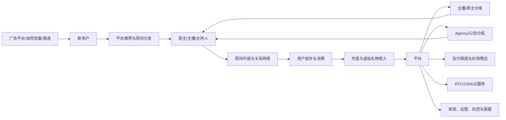
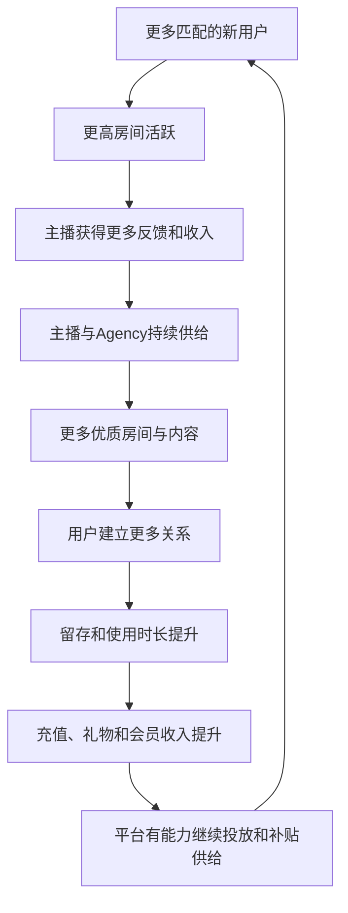
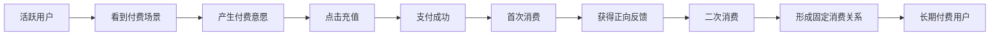
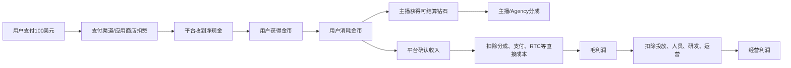
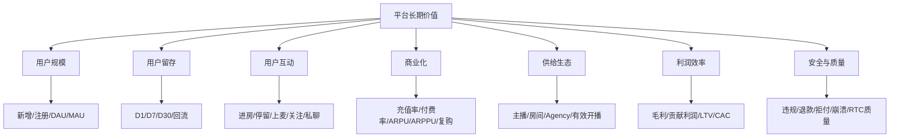
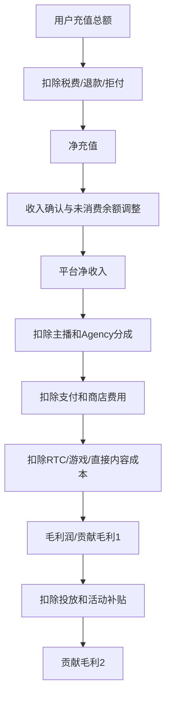

# 语聊泛娱乐行业全景手册
## 用户路径、产品架构、商业化、收入利润与数据指标体系

> **版本**：V1.0  
> **更新时间**：2026-07-16  
> **适用对象**：产品、运营、数据、商业化、市场投放、公会/Agency 运营、财务及管理层  
> **行业范围**：多人语音房、音频社交、语音直播、轻视频社交、线上娱乐社区、社交+休闲游戏。本文不讨论真实货币赌博等受严格监管业务。

---

## 0. 阅读这份手册前，先记住 8 个核心结论

1. **语聊平台卖的不是“语音通话”，而是关系、身份、氛围和被看见的机会。**
2. **用户留存的核心不是活动奖励，而是用户是否在前 1～7 天建立了有效关系。**
3. **用户消耗的核心不是礼物数量，而是“给谁送、为什么送、送完获得了什么反馈”。**
4. **平台流水不等于收入，收入不等于毛利，毛利也不等于最终利润。**
5. **房间数量不是供给质量，开播时长不是有效供给，主播数量也不是主播生态。**
6. **公会/Agency 模式可以快速做大供给和流水，但也会提高分成、风控和生态治理难度。**
7. **语聊行业的健康增长需要同时看用户、房间、主播、公会、支付和利润六套数据。**
8. **真正的北极星不是单纯 DAU 或充值流水，而是“可持续产生关系和贡献利润的活跃用户”。**

---

# 1. 行业定义与业务本质

## 1.1 什么是语聊泛娱乐平台

语聊泛娱乐平台，是以实时语音互动为核心载体，结合陌生人社交、兴趣社区、主播内容、虚拟礼物、会员权益、小游戏和线上娱乐活动的移动互联网平台。

它通常处于以下几类产品的交叉位置：

| 产品类型 | 用户主要目的 | 内容生产方式 | 主要商业化 |
|---|---|---|---|
| 多人语音房 | 聊天、陪伴、交友、群体归属 | 房主、主播、普通用户共同生产 | 虚拟礼物、会员、特权 |
| 语音直播 | 观看主播、互动、支持主播 | 主播主导 | 礼物、订阅、粉丝权益 |
| 陌生人社交 | 找人、聊天、建立关系 | 用户关系驱动 | 会员、增值权限、礼物 |
| 游戏社交 | 边玩边聊、组队、房间互动 | 游戏机制+用户互动 | 游戏付费、礼物、会员 |
| 视频直播 | 内容观看、主播互动 | 主播中心化 | 礼物、广告、订阅 |
| 社区型产品 | 兴趣、身份和群体归属 | UGC、群组和话题 | 会员、广告、礼物 |

语聊房与传统直播最大的不同是：

- 传统直播通常是“一对多观看”；
- 语聊房通常是“多人共同参与”；
- 语聊房中，用户既可能是观众，也可能随时上麦成为内容的一部分；
- 房间氛围、麦位关系和熟人圈层，往往比单一主播更重要。

---

## 1.2 行业价值链



### 主要参与方

| 参与方 | 核心作用 | 主要诉求 |
|---|---|---|
| 普通用户 | 浏览、聊天、互动、消费 | 找到有趣的人、被接纳、获得陪伴 |
| 付费用户 | 为关系、身份、内容和体验付费 | 被关注、获得反馈、彰显身份 |
| 主播/主持人 | 生产内容、维持房间氛围 | 收入、流量、粉丝和稳定排班 |
| 房主 | 建立房间品牌和关系场 | 房间活跃、收入、管理权限 |
| Agency/公会 | 招募和管理主播、组织流水 | 分成、规模、主播稳定性 |
| 平台 | 提供产品、分发、支付和治理 | 用户增长、收入、利润、生态安全 |
| 支付渠道 | 完成充值和结算 | 支付手续费 |
| RTC/CDN 服务商 | 提供实时音视频能力 | 按量收费 |
| 广告平台 | 提供用户获取 | 广告消耗 |
| 内容审核与风控 | 控制违规、欺诈和支付风险 | 安全、合规、降低损失 |

---

## 1.3 语聊行业的四个核心资产

### 1. 用户关系资产

包括关注、好友、私聊、CP、家族、粉丝团、房间熟人、固定陪伴关系。

它决定：

- 用户为什么回来；
- 用户回来后找谁；
- 用户消费时给谁送；
- 用户离开平台的迁移成本。

### 2. 内容供给资产

包括优质房主、主播、主持人、活动房、兴趣房、国家/语言房和小游戏房。

它决定：

- 新用户进入后有没有房间可去；
- 高峰和低谷时段是否都有内容；
- 不同国家和兴趣用户能否找到匹配内容。

### 3. 虚拟经济资产

包括金币、钻石、礼物、等级、会员、勋章、座驾、头像框、特权、主播收益和公会结算。

它决定：

- 平台如何收费；
- 消费如何被展示和反馈；
- 平台如何在用户、主播、公会和支付渠道之间分配价值。

### 4. 安全与信任资产

包括实名认证、未成年人保护、内容审核、账号风控、支付风控、反作弊、申诉和客服。

它决定：

- 平台能否长期运营；
- 应用商店和监管风险；
- 用户是否愿意充值；
- 优质主播和公会是否愿意留下。

---

# 2. 行业增长飞轮



增长飞轮成立需要四个前提：

1. 新用户不是只有安装，而是能快速进入合适的房间；
2. 房间不是只有人头，而是有人说话、有人回应；
3. 主播不是只完成时长，而是能建立关系和带来留存；
4. 消费不是单次活动刺激，而是建立在真实互动和稳定价值反馈上。

一旦其中任何一环失效，就会形成反向循环：

> 低质量流量 → 房间沉默 → 主播收益下降 → 主播流失 → 用户找不到内容 → 留存下降 → 付费下降 → 平台只能加大补贴 → 毛利恶化。

---

# 3. 用户全生命周期路径

## 3.1 总体用户路径

```mermaid
flowchart LR
    A[广告曝光/自然发现] --> B[安装]
    B --> C[注册登录]
    C --> D[选择国家、语言、性别、兴趣]
    D --> E[首次进入首页]
    E --> F[首次进入房间]
    F --> G[首次有效停留]
    G --> H[首次互动]
    H --> I[首次建立关系]
    I --> J[次日/七日回访]
    J --> K[首次充值]
    K --> L[首次礼物或会员消费]
    L --> M[重复消费]
    M --> N[高价值用户/房主/主播/Agency成员]
    N --> O[召回、续费与长期经营]
```



---

## 3.2 从安装到留存：用户激活路径

一个语聊用户不能只用“完成注册”定义激活。建议将激活拆为四层。

| 激活层级 | 建议定义 | 价值 |
|---|---|---|
| 产品激活 | 注册成功并进入首页 | 用户完成基本进入 |
| 内容激活 | 进入至少 1 个房间，并有效停留 | 用户看到平台内容 |
| 社交激活 | 完成上麦、关注、私聊、被关注或收到回应中的至少一项 | 用户产生关系反馈 |
| 价值激活 | 在 1～7 天内形成固定关系、固定房间或首次付费 | 用户开始形成迁移成本 |

### 推荐的“有效激活”定义

新用户注册后 24 小时内满足以下任意 3 项：

- 进入不少于 3 个房间；
- 单房间停留超过 3～5 分钟；
- 完成一次上麦或文字互动；
- 关注至少 2 个用户；
- 被至少 1 个真实用户关注或私聊；
- 次日再次打开；
- 完成首次礼物、会员或充值行为。

不同国家和产品阶段应通过数据验证阈值，不应永久使用固定数字。

---

## 3.3 新用户 0～30 天理想路径

### Day 0：完成“找到人”

目标不是让用户浏览更多页面，而是尽快找到合适的人和房间。

关键动作：

1. 快速完成注册；
2. 识别国家、语言和兴趣；
3. 推荐正在真实互动的房间；
4. 用户在 30～60 秒内听到有效对话；
5. 用户获得一次回应；
6. 引导关注或加入关系链。

### Day 1～3：完成“有人记得我”

关键动作：

- 收到关注、私聊或房间邀请；
- 再次遇到熟悉主播或房间；
- 完成第一次上麦；
- 形成至少一个弱关系；
- 系统推荐与第一次行为一致。

### Day 4～7：完成“我属于这里”

关键动作：

- 固定访问 1～3 个房间；
- 加入家族、粉丝团或兴趣群；
- 参与周期活动；
- 拥有初始身份标识；
- 产生首次充值或首次礼物；
- 建立稳定回访时间。

### Day 8～30：完成“关系和身份沉淀”

关键动作：

- 形成固定联系人；
- 形成固定消费对象；
- 获得等级、勋章、会员等身份资产；
- 参与房间经营、主持或上麦；
- 可能转化为主播、房主、公会成员或核心付费用户。

---

## 3.4 用户留存的六层机制

| 留存机制 | 用户为什么回来 | 常见产品能力 |
|---|---|---|
| 内容留存 | 房间有趣、主播有能力 | 推荐、榜单、活动房、主题房 |
| 关系留存 | 有人在等我、有人认识我 | 关注、私聊、好友、CP、家族 |
| 身份留存 | 我在这里有等级和地位 | 财富等级、魅力等级、勋章、会员 |
| 资产留存 | 已经积累了虚拟资产 | 金币、礼物、装扮、座驾、收藏 |
| 习惯留存 | 每天固定时间回来 | 签到、日常任务、定时活动 |
| 收益留存 | 主播或房主可以获得收入 | 主播任务、结算、公会管理 |

### 判断留存质量时，不要只看总留存

应至少拆分：

- 自然量与付费量；
- 国家、语言、渠道；
- 男性与女性；
- 主播用户与普通用户；
- 首日有社交行为与无社交行为；
- 首日进入优质房与普通房；
- 首日收到回应与未收到回应；
- 首日付费与未付费；
- 公会主播与非公会主播。

通常，“完成社交激活”的用户留存会显著高于只完成注册或房间浏览的用户。

---

# 4. 用户消费路径

## 4.1 用户为什么付费

语聊产品中的主要付费动机，不应简单理解为“买礼物”。

| 付费动机 | 典型行为 | 产品承载 |
|---|---|---|
| 关系表达 | 支持喜欢的主播、朋友、CP | 礼物、红包、专属礼物 |
| 获取回应 | 希望被点名、感谢或互动 | 礼物动效、广播、榜单 |
| 身份展示 | 展示财富、等级和地位 | 财富等级、座驾、头像框 |
| 群体竞争 | 房间榜、活动榜、家族榜 | 榜单、PK、任务 |
| 权益购买 | 获得进房、麦位、隐身等权限 | VIP、会员、特权 |
| 娱乐体验 | 参与互动玩法或休闲游戏 | 道具、游戏权益 |
| 关系维护 | 节日、生日、纪念日表达 | 定制礼物、礼物墙 |
| 主播经营 | 房主或主播购买经营工具 | 房间装扮、推广、管理能力 |

---

## 4.2 付费漏斗



### 每一层的关键影响因素

| 漏斗节点 | 关键影响因素 |
|---|---|
| 看到付费场景 | 礼物入口、会员入口、活动入口是否自然出现 |
| 产生意愿 | 用户是否已经建立关系，是否理解付费价值 |
| 点击充值 | 价格展示、充值档位、本地货币、优惠认知 |
| 支付成功 | 支付方式、失败率、3DS、渠道稳定性 |
| 首次消费 | 是否知道给谁送、如何送、送后有什么反馈 |
| 正向反馈 | 主播回应、动效、榜单、关系值、权益 |
| 二次消费 | 余额设计、活动节奏、关系延续 |
| 长期付费 | 稳定关系、身份成长、权益持续性 |

---

## 4.3 首充与首消不是一回事

需要分别监控：

- 首次点击充值；
- 首次支付成功；
- 首次到账；
- 首次金币消费；
- 首次礼物消费；
- 首充到首消时长；
- 首次充值未消费余额；
- 首次消费对象；
- 首次消费后的次日、七日和三十日留存；
- 首次消费后的二次充值率。

典型问题：

- **充值成功但不消费**：用户不理解金币用途、找不到消费对象或担心误操作；
- **有免费币消费但不充值**：付费价值不足，免费奖励替代了真实付费；
- **首充高、复充低**：首充优惠强，但关系和权益价值不持续；
- **充值高、礼物低**：金币沉淀过多，消费场景不足；
- **礼物高、平台收入低**：分成、渠道费或优惠成本过高。

---

## 4.4 付费用户分层

| 分层 | 建议口径 | 经营目标 |
|---|---|---|
| 首充用户 | 第一次完成真实支付 | 完成首消并获得反馈 |
| 轻度付费 | 小额、低频充值 | 建立稳定消费场景 |
| 中度付费 | 稳定月度充值 | 提升关系深度和会员渗透 |
| 高价值付费 | 高 ARPPU、高频消费 | 专属服务、风险保护、长期留存 |
| 超高价值用户 | 收入贡献极高 | 防止过度依赖单个用户 |
| 流失付费用户 | 曾付费但近期未付费 | 识别关系断裂或支付问题 |
| 回流付费用户 | 沉默后重新充值 | 评估召回质量和长期价值 |

高价值用户运营必须与消费者保护、退款政策、异常充值监控和未成年人保护同时建设。

---

# 5. 平台基础产品功能结构

## 5.1 C 端产品结构

```mermaid
flowchart TD
    A[语聊泛娱乐平台] --> B[账号与新手]
    A --> C[发现与分发]
    A --> D[房间与实时互动]
    A --> E[社交关系]
    A --> F[虚拟经济]
    A --> G[成长与留存]
    A --> H[主播与Agency]
    A --> I[互动玩法]
    A --> J[安全与客服]

    B --> B1[注册登录]
    B --> B2[国家语言兴趣]
    B --> B3[资料与头像]
    B --> B4[新手引导]

    C --> C1[首页推荐]
    C --> C2[国家/语言频道]
    C --> C3[搜索]
    C --> C4[榜单与活动]
    C --> C5[房间卡片]

    D --> D1[麦位系统]
    D --> D2[上麦申请]
    D --> D3[房主/管理员权限]
    D --> D4[房间类型]
    D --> D5[公屏与表情]
    D --> D6[最小化与多任务]
    D --> D7[实时音频质量]

    E --> E1[关注与好友]
    E --> E2[私聊]
    E --> E3[CP/关系]
    E --> E4[家族/群组]
    E --> E5[粉丝团]

    F --> F1[充值]
    F --> F2[金币/钻石钱包]
    F --> F3[礼物]
    F --> F4[会员与特权]
    F --> F5[等级]
    F --> F6[提现与结算]

    G --> G1[签到任务]
    G --> G2[活动中心]
    G --> G3[勋章装扮]
    G --> G4[Push与召回]

    H --> H1[主播申请]
    H --> H2[Agency加入退出]
    H --> H3[主播任务]
    H --> H4[收入与结算]
    H --> H5[房间经营]

    I --> I1[休闲游戏]
    I --> I2[互动礼物]
    I --> I3[房间活动]
    I --> I4[排行榜]

    J --> J1[举报拉黑]
    J --> J2[内容审核]
    J --> J3[账号与支付风控]
    J --> J4[客服工单]
    J --> J5[申诉]
```



---

## 5.2 房间系统必须具备的能力

### 房间基础

- 房间 ID、房间名称、房主、封面、标签；
- 国家、语言、地区；
- 公开房、密码房、私密房；
- 闲聊、派对、排麦、游戏、活动等房间类型；
- 在线人数、麦上人数、真实活跃人数；
- 房间公告和规则；
- 房间搜索和分享；
- 房间最小化；
- 断线重连与状态恢复。

### 麦位系统

- 固定麦位数量；
- 自由上麦、申请上麦、邀请上麦；
- 房主和管理员权限；
- 锁麦、禁麦、踢下麦；
- 排麦队列；
- 麦位状态同步；
- 麦位动效和音量提示；
- 断网、切后台、来电和权限异常处理。

### 房间治理

- 禁言、踢出、封禁；
- 管理员配置；
- 敏感词与内容审核；
- 房间举报；
- 黑名单；
- 主播和房主违规处置；
- 申诉和处罚记录；
- 房间风险等级。

### 房间商业化

- 礼物面板；
- 礼物连送、全麦礼物、专属礼物；
- 房间榜、日榜、周榜；
- 会员和特权展示；
- 房间活动；
- 房间装扮；
- 房主或主播收益展示。

---

## 5.3 后台管理系统结构

| 后台模块 | 关键功能 |
|---|---|
| 用户管理 | 用户资料、设备、IP、登录记录、身份、封禁、申诉 |
| 房间管理 | 房间状态、房主、在线、麦位、标签、违规、关停 |
| 主播管理 | 主播身份、任务、时长、收益、评级、处罚 |
| Agency 管理 | Agency资料、席位、主播、分成、预支/借支、结算 |
| 礼物管理 | 礼物配置、价格、动效、上下架、分成口径 |
| 充值管理 | 订单、渠道、档位、汇率、到账、失败、退款 |
| 钱包管理 | 金币、钻石、冻结余额、补发、扣除、审计 |
| 会员与等级 | 等级规则、权益、升级、降级、补偿 |
| 活动管理 | 活动配置、任务、榜单、奖励、预算 |
| 内容审核 | 文本、图片、语音、昵称、头像和房间审核 |
| 风控管理 | 设备/IP、批量账号、刷量、支付、提现、关联图谱 |
| 客服系统 | 工单、用户历史、订单、处罚、补偿、回访 |
| 数据看板 | 用户、房间、主播、付费、收入、利润、风险 |
| 系统配置 | 国家、语言、版本、灰度、开关、白名单 |
| 权限审计 | 角色权限、操作日志、敏感操作审批 |

所有涉及金币、钻石、收入、分成、冻结、扣款和结算的操作，都应保留不可篡改的操作日志。

---

# 6. 平台收入结构

## 6.1 常见收入来源

| 收入来源 | 说明 | 特点 |
|---|---|---|
| 虚拟礼物 | 用户购买金币并向主播或用户赠送礼物 | 通常是核心收入 |
| 会员订阅 | 月度、季度、年度会员 | 收入稳定、毛利通常较高 |
| 身份特权 | 座驾、头像框、进房特效、昵称特效 | 强身份展示 |
| 关系产品 | CP、粉丝团、关系升级相关权益 | 与关系留存联动 |
| 房间经营工具 | 房间装扮、推广、经营权限 | 面向房主和主播 |
| 休闲游戏 | 道具、增值服务或第三方分成 | 增加时长和收入多样性 |
| 广告 | 开屏、激励视频、信息流或品牌合作 | 适合大流量、低付费用户 |
| B2B/技术服务 | RTC、内容或平台能力输出 | 非典型但可扩展 |
| 联运与品牌合作 | 活动赞助、IP合作、渠道联运 | 波动较大 |

公开公司案例显示，收入多元化正在增强：JOYY 2025 年全年直播收入为 15.297 亿美元，同时广告收入达到 4.427 亿美元；Yalla 2025 年聊天服务收入为 2.164 亿美元，游戏服务收入为 1.240 亿美元。[R1][R2]

---

## 6.2 流水、充值、消耗和收入的区别

### 1. 充值金额

用户实际支付的法币金额。

### 2. 到账金币

充值后进入用户钱包的虚拟货币，包括购买金币和赠送金币。

### 3. 消耗流水

用户实际消耗的金币价值。

### 4. 礼物流水

消耗中用于礼物的部分。

### 5. 平台确认收入

按照会计政策确认的平台收入，可能与充值和消耗发生时间不同。

### 6. 净收入

扣除税费、退款或需要净额确认的渠道和合作方金额后，平台确认的收入。

### 7. 毛利润

净收入减去直接收入成本。

```text
充值金额 ≠ 消耗流水 ≠ 平台收入 ≠ 毛利润 ≠ 经营利润
```

---

## 6.3 虚拟币收入链路示例

假设用户支付 100 美元：



必须明确以下问题：

- 赠送金币是否计入充值金额；
- 金币购买后未消费如何处理；
- 礼物消费时确认收入还是充值时确认；
- 主播分成按照礼物价值、钻石价值还是结算美元计算；
- 退款后金币是否回收；
- 汇率波动由谁承担；
- 不同支付渠道是否使用相同金币价格；
- 税费和应用商店佣金是否按总额或净额展示。

---

# 7. 商业化模式

## 7.1 礼物驱动型

**核心逻辑**：用户建立关系后，通过送礼表达支持、身份和情绪。

适合：

- 房间关系强；
- 主播供给稳定；
- 用户愿意进行公开社交展示的市场。

优势：

- 收入天花板高；
- 礼物可快速迭代；
- 容易与榜单、等级和活动结合。

风险：

- 收入集中于少数高价值用户；
- 主播和 Agency 分成压力大；
- 活动过度会透支未来消费；
- 容易形成刷量和虚假流水。

---

## 7.2 会员订阅型

**核心逻辑**：用户为持续权益付费，而不是每次互动单独付费。

常见权益：

- 身份标识；
- 进房特效；
- 专属头像框；
- 隐身或访客能力；
- 更高私聊、匹配或房间权限；
- 每月虚拟权益包。

优势：

- 收入稳定；
- 可预测性强；
- 复购不完全依赖单个主播。

风险：

- 权益同质化；
- 会员价值不足导致续费低；
- 权益过强会破坏普通用户体验。

---

## 7.3 Agency/公会驱动型

**核心逻辑**：平台通过 Agency 批量招募、培训和管理主播，Agency 根据主播收入获得分成。

优势：

- 快速建立本地供给；
- 降低平台直接管理成本；
- 便于覆盖多国家和多语言。

风险：

- Agency 与平台目标不一致；
- 虚假主播、挂机和刷时长；
- 主播被绑定，退出和结算复杂；
- 头部 Agency 议价能力过强；
- 平台对主播关系和数据失去控制。

平台必须保留：

- 主播直接申诉通道；
- 透明结算；
- 退出机制；
- 欠款和预支处理；
- 同设备和关联账号风控；
- Agency 风险评级；
- 主播归属变更日志。

---

## 7.4 社交+休闲游戏型

**核心逻辑**：游戏解决“没话题”和“缺少共同任务”的问题，语音提高游戏社交和回访。

常见形式：

- 房内直接打开休闲游戏；
- 游戏主题房；
- 组队和观战；
- 游戏结果同步到房间；
- 游戏中保留 RTC 语音；
- 游戏结束后回流房间。

优势：

- 提高使用时长；
- 降低纯聊天的社交压力；
- 增加用户间共同经历；
- 扩展收入来源。

风险：

- 游戏和房间状态不同步；
- 用户进入游戏后脱离主产品；
- 第三方费用和收入分成压缩毛利；
- 游戏内容可能带来额外审核与合规要求。

---

## 7.5 广告+增值服务型

适合大 DAU、低付费率产品。

常见组合：

- 免费用户看广告；
- 付费会员去广告；
- 激励广告换取少量虚拟权益；
- 品牌活动和房间冠名；
- 广告收入补充低付费市场。

广告不应明显破坏房间实时互动，否则可能用短期广告收入换取长期留存下降。

---

## 7.6 混合商业模式

成熟平台通常采用：

> 虚拟礼物 + 会员 + 身份特权 + Agency 供给 + 休闲游戏 + 广告/品牌合作

混合模式的目标不是“入口越多越好”，而是降低对单一付费场景、单一国家、单一渠道和少数大 R 用户的依赖。

---

# 8. 成本结构与行业毛利

## 8.1 收入成本

通常直接进入成本的项目：

- 主播、房主和礼物接收者分成；
- Agency 分成；
- 支付通道手续费；
- 应用商店佣金；
- RTC、CDN、带宽和云资源；
- 第三方游戏或内容分成；
- 退款、拒付和支付坏账；
- 与收入直接相关的运营奖励；
- 部分内容审核成本，取决于会计口径。

不应只看主播分成，还需要按国家和渠道计算完整收入成本。

---

## 8.2 三层利润口径

### 账面毛利

```text
毛利润 = 净收入 - 收入成本
毛利率 = 毛利润 ÷ 净收入
```

### 贡献毛利

```text
贡献毛利1 =
净收入
- 主播/Agency分成
- 支付渠道费用
- RTC/CDN直接成本
- 退款拒付
- 第三方内容成本
```

```text
贡献毛利2 =
贡献毛利1
- 可归因的投放成本
- 新用户奖励
- 活动补贴
- 渠道返佣
```

### 经营利润

```text
经营利润 =
毛利润
- 市场销售费用
- 研发费用
- 运营与客服
- 管理费用
- 其他经营费用
```

产品和运营在评估活动时，至少应使用“贡献毛利2”，不能只看充值流水或礼物流水。

---

## 8.3 公开公司观察

| 公司/业务样本 | 时间 | 公开指标 | 可得到的行业启示 |
|---|---:|---:|---|
| Yalla Group | 2025 全年 | 收入 3.419 亿美元；收入成本 1.119 亿美元；推算毛利率约 67.3%；净利率 43.3% | 区域化语聊+游戏、支付渠道优化和较轻的内容成本，可实现较高毛利 |
| JOYY | 2025 Q4 | 毛利率 35.3% | 主播分成、内容成本和流量合作成本较重时，毛利明显降低 |
| Agora | 2025 全年 | 毛利率 66.4% | RTC 技术服务本身可有较高毛利，但它是 B2B 技术公司，不能直接等同于语聊平台 |
| Hello Group | 2025 Q4 | 海外收入同比增长 70.3%；成本变化受主播/礼物接收者分成影响 | 海外音视频社交增长快，但主播分成仍是核心成本变量 |

数据来源见文末 [R1]～[R4]。

---

## 8.4 如何理解“行业毛利标准”

语聊泛娱乐没有统一毛利标准，因为以下因素差异非常大：

- 收入按总额还是净额确认；
- 主播和 Agency 分成比例；
- iOS、Google Play、第三方支付占比；
- 语音和视频流量占比；
- 自营主播与 Agency 主播占比；
- 游戏和广告收入占比；
- 国家税费、汇率和拒付率；
- 活动奖励是否计入收入成本。

基于公开公司和行业经营模型，可以将以下区间作为**内部诊断参考，而不是审计意义上的行业平均值**：

| 毛利率区间 | 一般含义 | 需要重点检查 |
|---:|---|---|
| 低于 30% | 收入成本非常重 | 分成、渠道费、补贴、游戏成本、总额/净额口径 |
| 30%～45% | 内容和主播分成较重 | Agency议价、头部主播成本、渠道结构 |
| 45%～60% | 相对健康 | 是否仍有增长空间，活动和投放是否可持续 |
| 60%～70% | 较强 | 是否存在低估主播成本、递延结算或供给投入不足 |
| 高于 70% | 非常高 | 需要确认收入确认、未结算负债和长期供给质量 |

### 建议的管理目标

对成熟语聊平台，不能只追求高毛利。更合理的目标是：

- 保证优质主播获得有竞争力的收入；
- 逐步降低高费率充值渠道占比；
- 提升会员和身份权益等高毛利收入；
- 降低无效补贴和刷量；
- 按国家、平台、渠道和 Agency 计算贡献利润；
- 保证用户安全、退款和客服投入。

---

## 8.5 单用户经济模型

```text
用户LTV =
用户生命周期内净收入
- 主播/Agency分成
- 支付与退款成本
- RTC与内容成本
- 用户奖励
- 可归因服务成本
```

```text
LTV/CAC = 用户生命周期贡献利润 ÷ 获客成本
```

常见判断：

- LTV/CAC < 1：规模越大，亏损越大；
- LTV/CAC 约 1～2：回收压力大；
- LTV/CAC 约 2～3：具备一定扩量条件；
- LTV/CAC > 3：通常较健康，但仍要检查归因和长期留存；
- 回收周期过长时，即使 LTV/CAC 较高也会造成现金流压力。

---

# 9. 数据指标体系

## 9.1 北极星指标

不建议仅使用 DAU、充值或流水作为唯一北极星。

推荐采用双北极星：

### 用户价值北极星

**有效关系活跃用户数（ERAU）**

建议定义：

当日满足以下条件中的至少两项：

- 在房间有效停留；
- 上麦或发言；
- 关注、私聊、被关注；
- 与同一用户重复互动；
- 进入固定房间；
- 完成礼物或会员消费。

### 商业价值北极星

**月度贡献利润（Monthly Contribution Profit）**

即净收入扣除主播/Agency、支付、RTC、退款、活动可变成本和可归因投放后的利润。

---

## 9.2 指标树



---

## 9.3 获客指标

| 指标 | 计算方式 | 说明 |
|---|---|---|
| 广告曝光 | 广告展示次数 | 顶层流量 |
| CTR | 点击数 ÷ 曝光数 | 素材吸引力 |
| CVR | 安装数 ÷ 点击数 | 商店页和下载转化 |
| CPI | 投放费用 ÷ 安装数 | 单安装成本 |
| 注册率 | 注册用户 ÷ 安装用户 | 登录和注册阻力 |
| 激活率 | 有效激活用户 ÷ 注册用户 | 新手体验质量 |
| CAC | 投放费用 ÷ 新增目标用户 | 目标可用付费用户、有效用户等 |
| 自然量占比 | 自然新增 ÷ 总新增 | 品牌与口碑能力 |
| 渠道作弊率 | 无效设备或异常用户 ÷ 渠道新增 | 流量真实性 |

所有获客指标都必须继续追踪到 D7、D30、付费和贡献利润，不能只优化 CPI。

---

## 9.4 激活指标

| 指标 | 推荐定义 |
|---|---|
| 首次首页到达率 | 注册后成功进入首页的比例 |
| 首次进房率 | 注册当日进入过房间的比例 |
| 首房进入时长 | 注册到首次进房的中位时长 |
| 首房有效停留率 | 首次房间停留达到阈值的比例 |
| 首次上麦率 | 注册当日完成上麦的比例 |
| 首次互动率 | 发言、关注、私聊、送礼任一行为比例 |
| 首次被回应率 | 新用户获得主播或用户真实回应的比例 |
| 社交激活率 | 完成定义的社交激活用户比例 |
| 首日固定房形成率 | 当日重复进入同一房间的用户比例 |

---

## 9.5 活跃与互动指标

| 指标 | 公式/口径 |
|---|---|
| DAU | 当日活跃去重用户 |
| WAU | 7 天活跃去重用户 |
| MAU | 30 天或自然月活跃去重用户 |
| DAU/MAU | DAU ÷ MAU，反映使用频率 |
| 人均启动次数 | 总启动次数 ÷ DAU |
| 人均在线时长 | 总在线时长 ÷ DAU |
| 人均房间时长 | 房间总停留时长 ÷ 进房用户 |
| 进房渗透率 | 进房用户 ÷ DAU |
| 上麦渗透率 | 上麦用户 ÷ 进房用户 |
| 发言渗透率 | 发言用户 ÷ 进房用户 |
| 关注渗透率 | 关注用户 ÷ DAU |
| 私聊渗透率 | 私聊用户 ÷ DAU |
| 有效互动用户 | 达到互动阈值的去重用户 |
| 关系重复率 | 与历史互动对象再次互动的用户比例 |
| 房间跳失率 | 进入后短时间退出的次数 ÷ 进房次数 |

---

## 9.6 留存指标

### 标准 N 日留存

```text
D1留存 =
某日新增用户中，第1天再次活跃的用户
÷ 某日新增用户
```

常看：

- D1、D3、D7、D14、D30；
- 周留存和月留存；
- 滚动留存；
- 付费留存；
- 主播留存；
- 房主留存；
- Agency 主播留存；
- 固定房间留存；
- 关系留存。

### 外部参考

Adjust 的全行业参考显示，全球应用平均 D1、D7、D30 留存约为 26%、13% 和 7%；MENA 全品类 D1 约 24%，D30 约 4%，MENA 社交类 D1 约 23%。这些数据是跨应用统计，不能直接当作语聊产品标准。[R5]

Adjust 对 2025 年约会类应用的统计为 D1 26%、D7 12%、D30 6%，可以作为陌生人关系类产品的旁参考，但产品形态和人群仍有明显差异。[R6]

### 语聊平台内部目标参考

以下为运营诊断区间，不是公开行业平均值：

| 指标 | 偏弱 | 可接受 | 较好 |
|---|---:|---:|---:|
| 新增 D1 | <20% | 20%～28% | >28% |
| 新增 D7 | <8% | 8%～15% | >15% |
| 新增 D30 | <3% | 3%～7% | >7% |
| 社交激活用户 D7 | <15% | 15%～25% | >25% |
| 首日进房率 | <55% | 55%～75% | >75% |
| 首日有效互动率 | <15% | 15%～30% | >30% |

必须以本平台历史数据、国家、渠道和用户结构校准。

---

## 9.7 充值与消费指标

| 指标 | 公式 |
|---|---|
| 充值用户数 | 当期完成真实支付的去重用户 |
| 付费率 | 付费用户 ÷ 活跃用户 |
| 首充率 | 首充用户 ÷ 新增用户 |
| 首充成功率 | 支付成功首充用户 ÷ 发起首充用户 |
| ARPU | 收入 ÷ 活跃用户 |
| ARPPU | 收入 ÷ 付费用户 |
| 充值 ARPPU | 充值金额 ÷ 充值用户 |
| 消费 ARPPU | 消耗金额 ÷ 消费用户 |
| 复充率 | 当期再次充值用户 ÷ 历史充值用户 |
| 次月付费留存 | 上月付费用户中本月继续付费的比例 |
| 礼物渗透率 | 送礼用户 ÷ 活跃用户 |
| 会员渗透率 | 有效会员用户 ÷ 活跃用户 |
| 充值到消耗率 | 当期真实消耗价值 ÷ 当期充值价值 |
| 钱包沉淀率 | 未消费余额 ÷ 累计到账虚拟币 |
| 退款率 | 退款金额 ÷ 支付金额 |
| 拒付率 | 拒付金额 ÷ 支付金额 |
| 大 R 收入集中度 | Top N 付费用户收入 ÷ 总收入 |

### 必须同时看人数和金额

例如：

- 付费人数下降、ARPPU 上升：收入依赖更少的大 R；
- 付费人数上升、ARPPU 下降：可能扩大了轻付费层；
- 收入上升、复充率下降：可能被短期大额活动拉高；
- 礼物流水上升、贡献利润下降：分成和奖励过重。

---

## 9.8 房间生态指标

| 指标 | 说明 |
|---|---|
| 活跃房间数 | 当日有真实用户互动的房间 |
| 有效开房数 | 达到时长和互动人数阈值的房间 |
| 房间开播时长 | 房间开启总时长 |
| 有效房间时长 | 有真实互动的开房时长 |
| 房间平均在线 | 总房间在线人次 ÷ 房间时长 |
| 房间峰值在线 | 房间同时在线峰值 |
| 麦位利用率 | 麦上总时长 ÷ 可用麦位总时长 |
| 房间互动率 | 有发言/上麦用户 ÷ 进房用户 |
| 房间付费率 | 房间付费用户 ÷ 房间活跃用户 |
| 房间人均消耗 | 房间消耗 ÷ 房间活跃用户 |
| 房间新用户承接率 | 新用户有效停留人数 ÷ 新用户进房人数 |
| 房间新用户留存贡献 | 进入该房用户的 D1/D7 相对提升 |
| 空房率 | 无有效互动房间 ÷ 开启房间 |
| 房间流失率 | 本期活跃房间下期不再活跃的比例 |

“房间流水高”不一定代表房间质量高。优质房间还应带来：

- 新用户留存；
- 用户关系沉淀；
- 主播稳定；
- 低投诉；
- 可持续贡献利润。

---

## 9.9 主播与 Agency 指标

### 主播指标

| 指标 | 说明 |
|---|---|
| 新增主播数 | 新获得主播身份用户 |
| 活跃主播数 | 当期达到有效开播/上麦条件 |
| 有效主播率 | 有效主播 ÷ 注册主播 |
| 主播开播天数 | 当期有有效供给的天数 |
| 主播有效时长 | 有真实互动的主播时长 |
| 主播人均流水 | 主播礼物流水 ÷ 活跃主播 |
| 主播人均收入 | 主播可结算收入 ÷ 活跃主播 |
| 主播 D7/D30 留存 | 新主播后续持续有效开播比例 |
| 主播粉丝转化 | 新增关注 ÷ 主播房间访客 |
| 主播新用户承接 | 主播接待新用户后的留存 |
| 主播违规率 | 违规主播 ÷ 活跃主播 |
| 主播收益集中度 | Top主播收入 ÷ 主播总收入 |

### Agency 指标

| 指标 | 说明 |
|---|---|
| 活跃 Agency 数 | 当期有有效主播的 Agency |
| Agency 主播规模 | Agency 下主播人数 |
| 有效主播占比 | 有效主播 ÷ Agency主播 |
| Agency 流水 | Agency主播产生的有效流水 |
| Agency 贡献利润 | 扣除分成、奖励和风险损失后的利润 |
| Agency 主播留存 | 主播在 Agency 的持续活跃比例 |
| 席位利用率 | 实际有效主播 ÷ 可用席位 |
| 退出处理时长 | 申请退出到完成结算的时间 |
| 欠款率 | 未结清预支/借支 ÷ 应结算金额 |
| 异常账号率 | 设备、IP、支付或行为异常主播占比 |
| 申诉率 | 主播申诉数 ÷ Agency主播数 |

---

## 9.10 收入与利润指标

| 指标 | 说明 |
|---|---|
| 充值 GMV | 用户实际支付总额 |
| 净充值 | 充值扣除退款、拒付和税费 |
| 消耗流水 | 用户虚拟币消耗价值 |
| 礼物流水 | 礼物相关消耗 |
| 平台净收入 | 会计确认净收入 |
| Take Rate | 平台净收入 ÷ 交易或消耗流水，需统一口径 |
| 主播分成率 | 主播及 Agency 分成 ÷ 相关收入 |
| 支付成本率 | 支付和商店费用 ÷ 充值金额 |
| RTC成本/千分钟 | RTC直接成本 ÷ 使用分钟数 × 1000 |
| 毛利率 | 毛利润 ÷ 净收入 |
| 贡献利润率 | 贡献利润 ÷ 净收入 |
| 营销费用率 | 市场费用 ÷ 净收入 |
| 经营利润率 | 经营利润 ÷ 净收入 |
| LTV | 生命周期贡献利润 |
| CAC | 获取目标用户的成本 |
| LTV/CAC | 用户价值效率 |
| Payback Period | 回收获客成本所需时间 |

---

## 9.11 安全、风控和体验指标

| 类别 | 指标 |
|---|---|
| 稳定性 | Crash-free 用户率、Crash-free Session、ANR |
| RTC | 进房成功率、首帧/首音时长、卡顿率、断线率、重连成功率 |
| 内容安全 | 举报率、有效举报率、违规房间率、违规主播率 |
| 账号安全 | 盗号率、异常登录率、设备关联账号数 |
| 支付安全 | 支付失败率、退款率、拒付率、异常充值率 |
| 提现安全 | 异常提现率、冻结率、审核时长 |
| 客服 | 工单率、首次响应时间、解决率、重复投诉率 |
| 处罚质量 | 误封率、申诉率、申诉成功率 |
| 用户保护 | 未成年人拦截、异常高额消费预警、冷静期触发 |

---

# 10. 核心数据看板

## 10.1 管理层日报

建议只放最关键的 20 项：

1. DAU、MAU、DAU/MAU；
2. 新增、注册率、有效激活率；
3. D1、D7、D30；
4. 进房用户、有效互动用户；
5. 活跃房间、有效房间；
6. 活跃主播、有效主播；
7. 充值用户、充值金额；
8. 消耗用户、消耗流水；
9. 平台净收入；
10. 毛利润、贡献利润；
11. 付费率、ARPU、ARPPU；
12. 主播/Agency 分成率；
13. 支付成本率；
14. 投放费用、CAC、D7 ROAS、D30 ROAS；
15. 退款、拒付和违规异常。

---

## 10.2 新用户漏斗看板

```text
曝光
→ 点击
→ 安装
→ 注册
→ 进入首页
→ 首次进房
→ 有效停留
→ 首次互动
→ 首次关系
→ D1
→ D7
→ 首充
→ 首消
→ 复充
```

每层必须可按以下维度筛选：

- 日期和 Cohort；
- 国家、地区和语言；
- iOS/Android；
- 投放渠道、广告系列、素材；
- 性别、年龄段；
- 首房类型；
- 首次接触主播/房间；
- 新老版本；
- 支付渠道。

---

## 10.3 房间生态看板

需要支持从国家到房间再到主播逐级下钻：

```text
国家
→ 语言频道
→ 房间类型
→ 房间
→ 房主
→ 主播
→ 用户
→ 互动与消费明细
```

核心页面：

- 房间供需分布；
- 每小时活跃房间与用户；
- 空房和低互动房；
- 新用户承接房；
- 高留存房；
- 高流水低利润房；
- 高投诉房；
- 主播和房间迁移。

---

## 10.4 商业化与利润看板

必须同时呈现：

- 充值金额；
- 消耗流水；
- 平台收入；
- 主播/Agency 成本；
- 支付成本；
- RTC和第三方成本；
- 活动奖励；
- 退款拒付；
- 贡献利润；
- 国家、渠道、版本和活动对比。

建议建立“收入瀑布”：



---

# 11. 常见业务问题诊断

## 11.1 新增高，D1 低

可能原因：

- 广告素材与真实产品不一致；
- 注册流程长；
- 首屏没有有效房间；
- 房间语言不匹配；
- 新用户进入后没人回应；
- 首次体验被强制任务或充值打断；
- 低质量或作弊流量。

应检查：

- 渠道分 cohort D1；
- 首房跳失；
- 首次被回应率；
- 首次有效停留；
- 房间真实活跃；
- 广告素材和落地页。

---

## 11.2 D1 可以，D7 很差

可能原因：

- 新手奖励只能支撑一天；
- 用户没有建立固定关系；
- 推荐结果每天变化过大；
- 主播排班不稳定；
- Push 没有关系上下文；
- Day 2～7 缺少成长目标。

应检查：

- 重复访问同一房间；
- 重复互动同一用户；
- 关注后回访；
- 主播在线稳定性；
- 社交激活 cohort D7；
- 新用户第 2～7 天关键行为。

---

## 11.3 使用时长高，付费低

可能原因：

- 用户把产品当免费聊天工具；
- 礼物和会员价值不清晰；
- 主播不会进行健康的付费转化；
- 充值档位不适合本地支付能力；
- 免费金币过多；
- 付费反馈不足；
- 支付方式缺失。

应检查：

- 付费入口曝光；
- 点击充值率；
- 支付成功率；
- 首充到首消；
- 首礼后的主播回应；
- 不同房间的付费渗透；
- 免费币与真实币消耗占比。

---

## 11.4 流水上涨，利润下降

可能原因：

- 活动奖励过高；
- 主播和 Agency 临时加成；
- 高费率充值渠道占比上升；
- 第三方游戏分成增加；
- 汇率变化；
- 退款和拒付上升；
- 通过补贴制造虚假流水。

应检查：

- 活动增量收入与增量贡献利润；
- 不同渠道支付成本；
- 分成率；
- 真实付费和平台赠送；
- 用户、主播和 Agency 关联；
- 活动结束后的收入回落。

---

## 11.5 主播数量增加，用户体验变差

可能原因：

- 主播考核只看时长；
- 大量空房和挂机；
- 主播质量没有分层；
- 用户被过度分散；
- 新主播没有流量承接能力；
- Agency 批量导入低质量主播。

应检查：

- 有效主播率；
- 主播平均真实互动人数；
- 空房率；
- 每小时供需比；
- 新用户承接率；
- 主播 D30；
- 主播违规和投诉。

---

## 11.6 收入高度依赖大 R

需要监控：

- Top 1、Top 10、Top 100 收入占比；
- 单一大 R 对单一主播或房间的贡献；
- 大 R 流失后的收入压力测试；
- 大 R 退款和异常支付；
- 大 R 关系对象是否稳定；
- 是否存在主播诱导、账号共享或关联充值。

健康方向：

- 扩大中度付费用户；
- 提升会员和身份收入；
- 增加多个稳定关系场景；
- 避免活动只服务极少数用户；
- 建立高价值用户保护和异常消费预警。

---

# 12. 事件埋点与数据仓库

## 12.1 核心数据主题

建议至少建设以下主题表：

- 用户主题；
- 设备与登录主题；
- 渠道与归因主题；
- Session 主题；
- 房间主题；
- 麦位主题；
- 社交关系主题；
- 私聊主题；
- 主播主题；
- Agency 主题；
- 礼物与消耗主题；
- 充值与支付主题；
- 钱包与虚拟币主题；
- 会员与等级主题；
- 活动主题；
- 风控与处罚主题；
- 客服与申诉主题；
- 财务收入与结算主题。

---

## 12.2 关键事件清单

| 事件 | 关键属性 |
|---|---|
| app_open | user_id、device_id、version、country、channel |
| register_success | register_method、country、language |
| home_view | recommendation_strategy、ab_group |
| room_impression | room_id、position、room_type |
| room_enter | room_id、source、online_count、language |
| room_leave | duration、leave_reason、network |
| mic_apply | room_id、queue_position |
| mic_join | room_id、mic_index、role |
| mic_leave | duration、reason |
| follow_user | target_user_id、source |
| private_message | target_user_id、first_message |
| gift_panel_view | room_id、receiver_id |
| gift_send | gift_id、coin_amount、receiver_id、balance_type |
| recharge_click | package_id、currency、channel |
| payment_result | order_id、amount、result、fail_reason |
| membership_purchase | plan、price、duration |
| report_submit | target_type、reason |
| agency_join | agency_id、role |
| agency_exit_apply | debt_status、settlement_status |

---

## 12.3 埋点必须遵守的口径

1. 用户 ID、设备 ID、订单 ID、房间 ID、主播 ID 和 Agency ID 必须可关联；
2. 统一 UTC 存储，并保留业务本地时区；
3. 金额同时保存原币、本位币和汇率；
4. 区分真实充值币、赠送币、活动币和后台补发币；
5. 区分充值、到账、冻结、消费、回退和结算；
6. 所有钱包变化必须有 transaction_id；
7. 所有后台人工变更必须记录操作人和审批人；
8. 留存使用 Cohort 计算，不能用简单 DAU 比例替代；
9. 流水、收入、成本和利润必须与财务对账；
10. A/B 实验需要固定用户分组和实验污染检查。

---

# 13. 产品、运营和数据的职责边界

| 团队 | 核心职责 |
|---|---|
| 产品 | 用户路径、功能机制、规则、权限、异常场景和需求优先级 |
| 用户运营 | 新手承接、活动、召回、关系和用户分层 |
| 主播运营 | 主播招募、培训、排班、质量和留存 |
| Agency运营 | Agency准入、目标、分成、结算、风险和退出 |
| 商业化 | 礼物、会员、价格、权益、付费转化 |
| 市场投放 | 流量获取、素材、渠道和归因 |
| 数据 | 指标口径、埋点、看板、实验和分析 |
| 风控 | 账号、支付、提现、刷量和关联作弊 |
| 内容安全 | 审核、举报、处罚和申诉 |
| 财务 | 收入确认、成本、结算、税务和对账 |
| 客服 | 用户问题、支付、账号、处罚和补偿 |
| 研发 | 稳定性、性能、系统能力和数据准确性 |

产品负责人需要确保每个需求都回答：

- 提升哪一个用户阶段；
- 影响哪一个核心指标；
- 是否影响主播和 Agency；
- 是否改变收入确认或分成；
- 是否增加风控和合规风险；
- 是否具备数据验证方式；
- 是否有灰度、回滚和异常处理。

---

# 14. 90 天行业理解与业务落地计划

## 第 1～2 周：统一行业和财务口径

输出：

- 用户角色地图；
- 用户生命周期；
- 平台功能架构；
- 充值、消耗、收入和结算链路；
- 指标字典 V1；
- 现有业务问题清单。

重点访谈：

- 产品、运营、主播运营；
- Agency运营；
- 财务；
- 支付；
- 风控；
- 客服；
- 数据团队。

---

## 第 3～4 周：完成数据审计

检查：

- 埋点是否完整；
- 留存口径是否统一；
- 真实币和赠送币是否分开；
- 用户、主播、房间和 Agency 是否可关联；
- 收入和流水是否能对账；
- 活动是否能计算增量贡献利润；
- 支付失败、退款和拒付是否完整。

输出：

- 埋点缺口；
- 数据质量报告；
- 核心看板原型；
- 财务对账差异。

---

## 第 5～8 周：建立用户和房间模型

完成：

- 新用户漏斗；
- 社交激活模型；
- 用户分层；
- 房间质量评分；
- 主播质量评分；
- Agency质量评分；
- 付费用户分层；
- 留存驱动因素分析。

---

## 第 9～12 周：建立利润模型和增长实验

完成：

- 国家级收入成本模型；
- 渠道级贡献利润；
- Agency级利润；
- 用户 LTV/CAC；
- 活动增量利润；
- 新手路径 A/B；
- 首房分发 A/B；
- 社交激活实验；
- 会员和礼物价值实验。

---

# 15. 推荐的业务评审模板

每次产品或运营评审应包含：

## 15.1 背景

- 当前数据；
- 用户问题；
- 业务问题；
- 影响人群。

## 15.2 目标

- 主指标；
- 护栏指标；
- 不做什么。

## 15.3 用户路径

- 进入前；
- 操作中；
- 成功；
- 失败；
- 中断；
- 退出；
- 申诉。

## 15.4 商业影响

- 充值；
- 消耗；
- 收入；
- 分成；
- 成本；
- 贡献利润；
- 现金流。

## 15.5 生态影响

- 普通用户；
- 付费用户；
- 主播；
- 房主；
- 管理员；
- Agency；
- 客服；
- 风控。

## 15.6 数据验证

- 埋点；
- A/B；
- Cohort；
- 国家和渠道拆分；
- 观察周期；
- 成功阈值；
- 回滚条件。

---

# 16. 行业常见误区

1. **把在线人数当真实活跃**：挂机、机器人和房间重复进入都会放大数据。
2. **把开房时长当内容供给**：没有互动的房间不构成有效供给。
3. **把礼物流水当收入**：分成、渠道费、赠送币和退款会造成巨大差异。
4. **把首充率当商业化成功**：复充、首消和付费留存更重要。
5. **把活动期间增长当自然增长**：必须计算活动结束后的回落。
6. **只看整体留存**：渠道、国家和社交激活差异会被平均值掩盖。
7. **只管理 Agency，不管理主播体验**：平台最终会失去主播和内容控制权。
8. **只追求大 R**：收入集中度过高会造成巨大波动。
9. **只做用户侧功能，不做后台和审计**：最终无法运营和对账。
10. **只看毛利率，不看供给健康**：过度压低主播收入会损害长期生态。
11. **只看 DAU，不看有效关系**：用户打开但没有关系沉淀，长期价值很低。
12. **只看充值，不看钱包沉淀**：大量未消耗余额可能掩盖消费场景不足。

---

# 17. 关键术语表

| 术语 | 含义 |
|---|---|
| DAU | 日活跃用户 |
| MAU | 月活跃用户 |
| Retention | 用户留存 |
| Cohort | 同一时间或同一来源用户群 |
| ARPU | 每活跃用户平均收入 |
| ARPPU | 每付费用户平均收入 |
| GMV | 交易或充值总额，需明确口径 |
| Take Rate | 平台从交易中确认的收入比例 |
| LTV | 用户生命周期价值 |
| CAC | 用户获取成本 |
| ROI | 投资回报 |
| ROAS | 广告支出回报 |
| RTC | 实时音视频通信 |
| Agency | 主播公会或经纪组织 |
| Host | 主播、主持人或房主，需按平台定义 |
| Gross Margin | 毛利率 |
| Contribution Margin | 贡献毛利率 |
| Chargeback | 支付拒付 |
| Wallet Breakage | 长期未使用虚拟余额，需按会计政策处理 |
| Social Activation | 用户完成有效社交行为 |
| Valid Room | 达到真实互动和时长标准的房间 |
| Valid Host | 达到真实供给标准的主播 |

---

# 18. 最终判断框架

判断一个语聊平台是否健康，可以用以下十个问题：

1. 新用户能否在 1 分钟内进入合适房间？
2. 新用户能否在首日获得至少一次真实回应？
3. 用户是否在 7 天内建立固定关系或固定房间？
4. 优质主播能否获得稳定、透明和可持续的收入？
5. Agency 是否创造真实供给，而不是刷时长和流水？
6. 付费是否来自持续价值，而不是一次性补贴和刺激？
7. 收入是否能够转化为贡献利润和现金流？
8. 平台是否过度依赖少数大 R、主播、Agency 或国家？
9. 数据是否能从用户行为追溯到收入、成本和结算？
10. 安全、合规、退款和用户保护是否与商业化同步建设？

如果这十个问题中有三项以上无法回答，说明平台当前仍缺乏完整的行业经营体系。

---

# 19. 公开数据参考

> 下列公开数据用于校准行业结构和财务区间。不同公司的产品结构、会计口径和地区不同，不应机械横向比较。

- **[R1] Yalla Group Limited，2025 年第四季度及全年业绩公告，2026-03-09。**  
  2025 年收入 3.419 亿美元，其中聊天服务 2.164 亿美元、游戏服务 1.240 亿美元；收入成本 1.119 亿美元，占收入 32.7%；净利率 43.3%。第四季度平均 MAU 4480 万、付费用户 1044 万。

- **[R2] JOYY Inc.，2025 年第四季度及全年业绩公告，2026-03-11。**  
  2025 年全年收入 21.242 亿美元，其中直播收入 15.297 亿美元、广告收入 4.427 亿美元；2025 年第四季度毛利率 35.3%。公司披露收入分成、内容和流量合作成本是重要成本项。

- **[R3] Agora, Inc.，2025 财年业绩公告，2026-03-02。**  
  2025 年收入 1.411 亿美元，毛利率 66.4%。该样本反映 RTC 技术服务成本结构，不等同于消费者语聊平台。

- **[R4] Hello Group Inc.，2025 年第四季度及全年业绩公告，2026-03-18。**  
  2025 年第四季度海外收入同比增长 70.3%；价值增值服务主要包括音频、视频、文本场景中的虚拟礼物和会员订阅；成本变化与主播及礼物接收者分成密切相关。

- **[R5] Adjust，User Retention Guide，2026 年页面数据。**  
  全球应用参考 D1 26%、D7 13%、D30 7%；MENA 全品类 D1 约 24%、D30 约 4%；MENA 社交类 D1 约 23%。

- **[R6] Adjust，The State of Dating Apps 2026。**  
  2025 年约会类应用参考 D1 26%、D7 12%、D14 9%、D30 6%；该数据仅作为陌生人关系产品旁参考。

---

## 附录：一句话理解整套业务

> 语聊泛娱乐平台通过“合适的流量 + 稳定的房间供给 + 可沉淀的用户关系”，形成留存；再通过礼物、会员、身份和互动权益实现商业化，并在主播、Agency、支付渠道、技术成本和平台利润之间建立可持续的价值分配。
