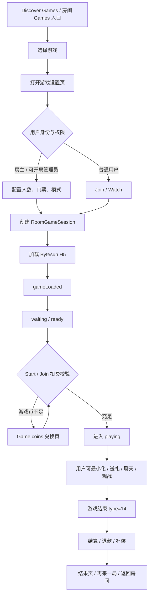
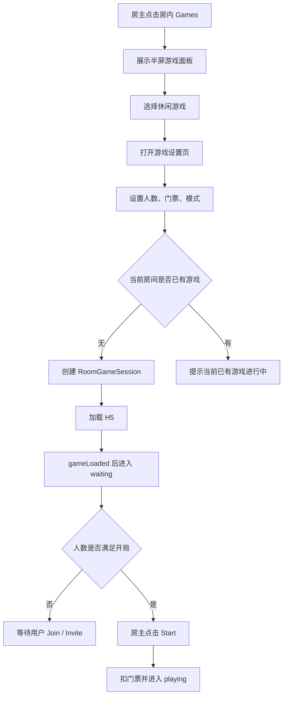
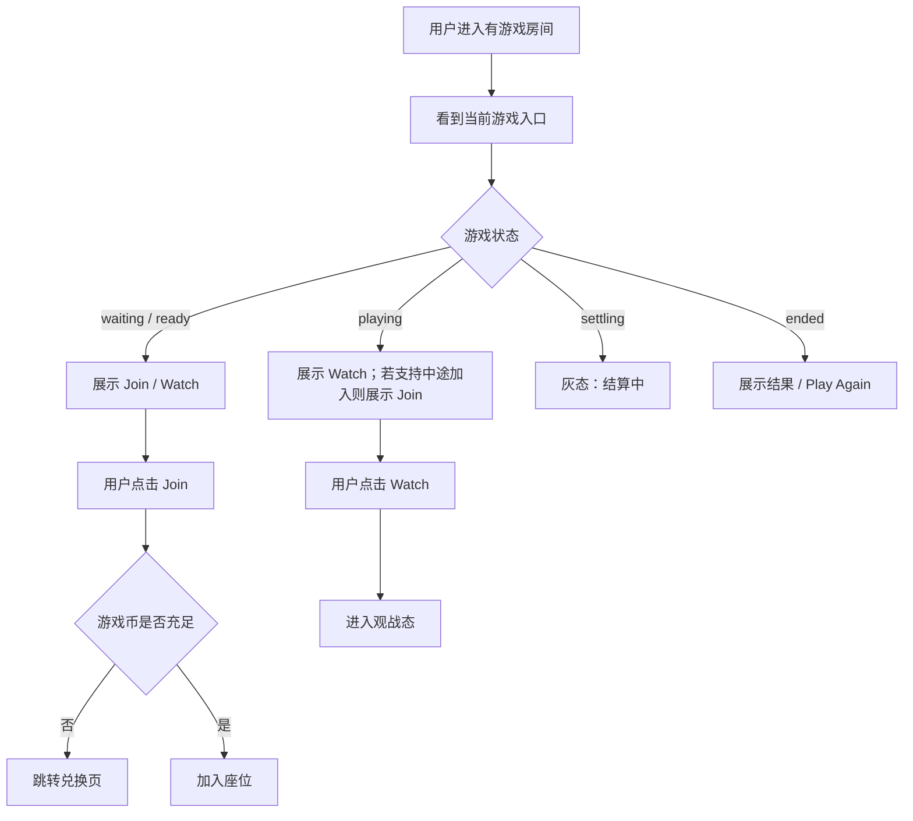
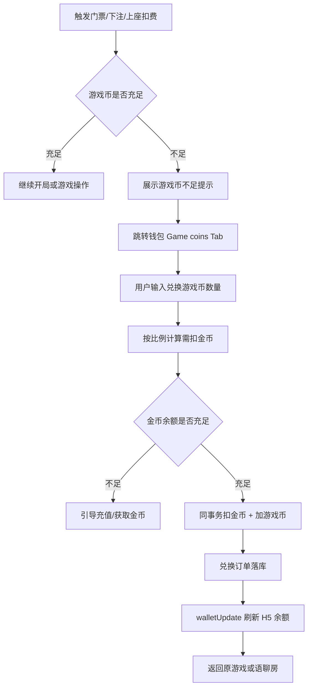
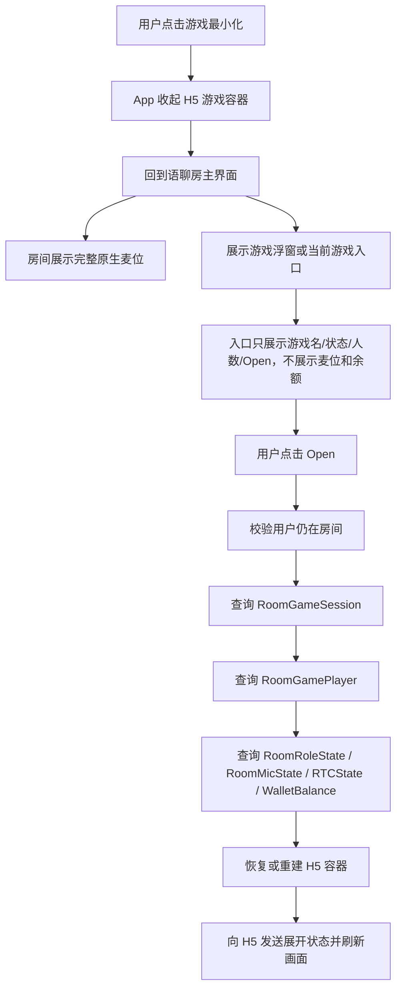
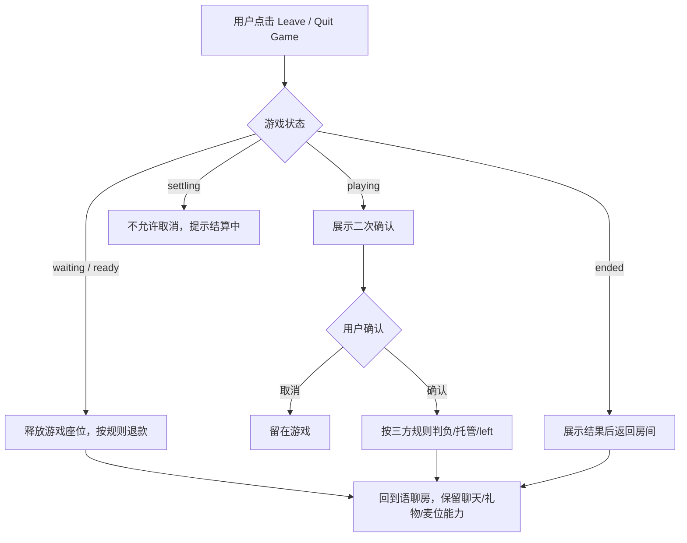
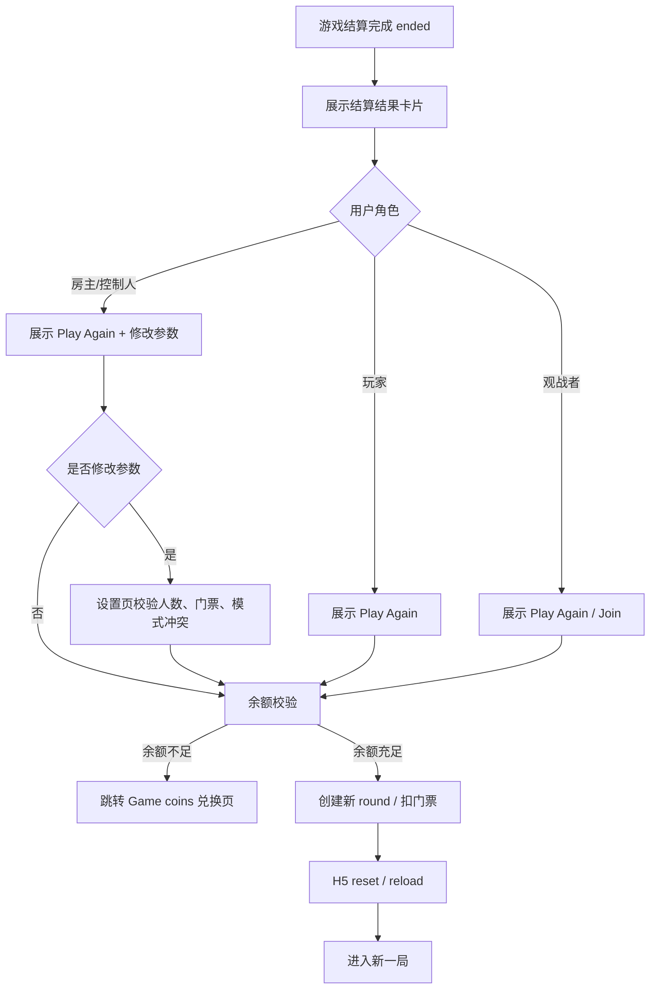
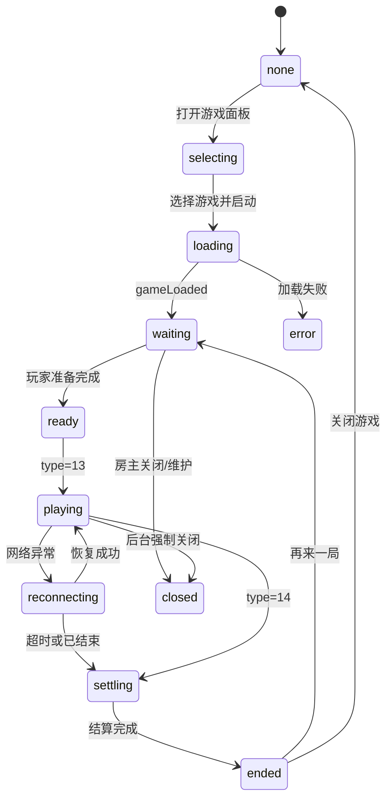
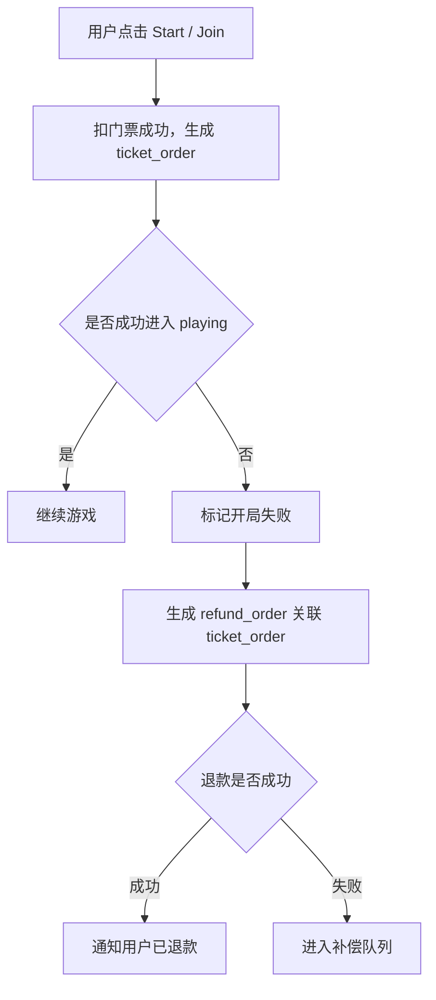

# WeChill 三方休闲游戏接入 PRD

> 版本：v1.4 综合评审版  
> 日期：2026-05-19  
> 方案：现有语聊房内直接调起三方休闲游戏  
> 产物范围：产品方案、客户端交互、后台配置、技术接入、边界场景、埋点验收、开发排期  
> 参考文档：
> - `/Users/xinyintiaodong/Documents/New project/wechill-三方休闲游戏接入PRD-房间内调起模式-v1.1-含原型截图.md`
> - `/Users/xinyintiaodong/Downloads/WeChill-三方休闲游戏接入PRD-房间内调起模式-v1.2.3-补充高频边界详细场景.md`
> - `/Users/xinyintiaodong/Documents/游戏房/wechill-三方休闲游戏接入PRD-房间内调起模式-v1.3-最小化与场景补全.md`
> - `/Users/xinyintiaodong/Documents/New project/语聊房三方休闲游戏客户端交互原型.html`

---

## 0. 三份文档对比结论

### 0.1 优劣分析

| 文档 | 优点 | 不足 | 适合作为 |
|---|---|---|---|
| v1.1 含原型截图 | 基础结构完整，截图引用清晰，适合评审快速理解页面形态；范围、后台、接入、埋点、排期都有骨架 | 高频边界不够细；最小化、观战、再来一局、打断、风控等规则偏薄；部分细节停留在概述 | 页面截图与基础章节来源 |
| v1.2.3 补充高频边界 | 退出房间、被踢、退出游戏、踢出游戏座位、断线恢复、多端并发、H5/App/服务端状态冲突、扣费成功开局失败、结算补展示、后台配置变更等 P0/P1 边界最扎实 | 最小化专题覆盖较完整但不如 v1.3 体系化；观战、再来一局、送礼遮挡、消息打断、作弊风控等场景不足 | 高频异常和资产安全规则来源 |
| v1.3 最小化与场景补全 | 覆盖面最广，补齐最小化、通知打断、观战者、再来一局、新用户进入、房间权限变化、送礼动画、局历史、申诉、作弊风控、性能兼容 | 高频退出/被踢/扣费异常等部分不如 v1.2.3 细；个别浮窗展示字段偏重，和“房间主界面不重复展示麦位/资产”的轻量设计有冲突 | 主骨架和新增场景来源 |

### 0.2 哪个最完整

综合判断：**v1.3 是覆盖面最完整的版本，但 v1.2.3 的高频边界更成熟。**

因此本 v1.4 采用：

- 以 v1.3 为主结构。
- 吸收 v1.2.3 的 P0/P1 高频边界详细规则。
- 保留 v1.1 的截图式表达与基础评审章节。
- 对冲突点按“体验清晰、资产安全、服务端可信、客户端可实现、测试可验收”原则重新裁决。

### 0.3 冲突裁决

| 冲突项 | 备选方案 | 本版裁决 |
|---|---|---|
| 游戏浮窗是否展示游戏币余额 | v1.3 建议展示余额；v1.2.3 倾向轻量入口 | V1 浮窗只展示游戏名、状态、人数、Open/Close，不展示游戏币余额；余额在游戏页和兑换页展示 |
| 观战者关闭浮窗是否退出观战 | v1.2.3 倾向最小化不退出；v1.3 提到观战者关闭浮窗释放名额 | 最小化不退出观战；主动点击关闭浮窗时二次确认，确认后退出观战并释放观战名额 |
| playing 中观战者是否可补位 | v1.2.3 默认不支持；v1.3 支持按游戏能力 | V1 默认 playing 中不可补位；仅当 Bytesun 明确返回 `support_join_mid_game=true` 且后台开启时可补位 |
| 游戏 ended 后是否自动收起游戏 | v1.3 提到自动收起；v1.2.3 倾向展示结果/补展示 | 收到结算后优先展示结果页；用户确认后返回房间。若用户已最小化，则浮窗变为 Finished |
| 送礼动画是否覆盖游戏 | v1.3 给出点击穿透和降级；基础文档只说保留入口 | V1 全屏游戏态大礼物降级为小礼物通知，不遮挡操作区；房间态仍走现有礼物动画 |
| 后台配置变更是否影响已开局游戏 | v1.2.3 强调快照；v1.3 强调配置变更兼容 | 使用配置快照：已创建 session 使用创建时快照，新 session 使用最新配置 |
| 房主退出后是否关闭游戏 | 旧文档简单说明继续；补充版有接管 | playing/settling 不关闭，管理员或系统托管接管；waiting/ready 可按门票规则退款后关闭 |

---

## 1. 项目概述

### 1.1 背景

中东语聊房用户对轻社交、陪伴和多人休闲游戏接受度较高。当前房间核心互动以语音、聊天、礼物为主，缺少强协作、强陪伴的长时互动场景。

本期通过接入 Bytesun 三方休闲游戏，在不改变现有语聊房房间模型的前提下，为房间增加游戏入口。用户可在当前语聊关系链内完成选游戏、开局、上座、观战、最小化、聊天、送礼、结算和再来一局。

### 1.2 一句话定位

让房主在当前语聊房内一键开启休闲游戏，让房间成员不离开房间即可一起玩、一起聊、一起送礼和结算。

### 1.3 核心原则

| 原则 | 说明 |
|---|---|
| 游戏是语聊房插件 | V1 不新增独立游戏房类型，不改变语聊房底层房间模型 |
| 房间关系链不变 | 房主、管理员、麦位、聊天、礼物、钱包、风控继续复用语聊房能力 |
| Bytesun 负责玩法 | 游戏规则、局内操作、回合、胜负由三方 H5 承接 |
| 我方负责房间与资产 | 房间状态、权限、游戏币、扣费、结算、配置、风控、审计由我方承接 |
| 服务端状态可信 | H5 状态只作为推进信号，RoomGameSession 与订单状态为最终依据 |
| V1 先跑闭环 | 能打开、能开局、能上座、能观战、能最小化、能结算、能灰度、能回滚 |

### 1.4 业务目标

| 目标 | 衡量指标 |
|---|---|
| 提升房间停留 | 游戏用户房间停留时长、房间平均在线时长 |
| 提升房间活跃 | 游戏入口点击率、开局数、参局人数、观战人数 |
| 提升付费转化 | 游戏币消耗、金币兑换游戏币金额、礼物消费增量 |
| 降低上线风险 | 不改房间类型，支持灰度、下架、维护、风控拦截 |
| 适配 MENA | 优先 Ludo、UNO、Domino、8 Ball、Carrom、Snake & Ladder |

---

## 2. 产品范围

### 2.1 V1 必做范围

| 模块 | 说明 |
|---|---|
| Discover Games 页面 | 底部 Discover 增加 Games / Activity 顶部 Tab，展示推荐游戏、国家筛选和正在玩游戏的语聊房 |
| Discover Activity 页面 | 展示游戏活动 Banner / Hot Events，支持跳活动、房间、游戏、兑换页 |
| More Games 全部游戏弹窗 | 展示全部游戏宫格，支持正常、维护、灰态、审核隐藏等状态 |
| 房内 Games 入口 | 语聊房底部工具栏增加游戏入口，支持无游戏、已有游戏、用户已最小化等状态 |
| 房内游戏面板 | 点击 Games 后展示半屏面板，包含休闲游戏、游戏活动、动态表情 |
| 游戏设置页 | 展示游戏人数、模式、门票、座位、Join / Start / Watch / Leave |
| 全屏游戏容器 | WebView / WKWebView 打开三方 H5，保留语聊房底部工具栏和必要控制 |
| 游戏最小化 | 用户可收起游戏回到房间，并通过浮窗或 Games 入口恢复 |
| 观战 | 座位满或用户不参与时可观战，V1 默认 playing 中不可补位 |
| 再来一局 | 结算后支持 Play Again，座位继承、门票重校验、WebView 复用/重建 |
| 游戏币与兑换 | 游戏内统一使用游戏币；游戏币由金币兑换；游戏币不足跳转 Game coins 页 |
| 结算与退款 | 支持扣门票、结算、退款、补偿队列、对账与结果补展示 |
| 后台配置 | 游戏上下架、地区端灰度、入口开关、门票、活动、接口、风控、监控 |
| 数据监控 | 埋点、看板、游戏记录、结算记录、异常监控、申诉入口 |

### 2.2 V1 不做范围

| 不做项 | 原因 | 后续 |
|---|---|---|
| 新增独立游戏房类型 | 改动房间模型、推荐流、权限、榜单，风险高 | V2 根据数据评估 |
| 单房间多个游戏同时运行 | 会话、座位、结算复杂 | V2 |
| 游戏排行榜 / 段位 / 赛季 | 需要长期赛季、反作弊和奖励体系 | V2 |
| 锦标赛 | 需要报名、赛制、奖励、申诉、风控 | V3 |
| RTC 推理类游戏 | 涉及游戏内 RTC、音频权限和麦克风同步 | V3 |
| Slots / Jackpot 强推荐 | 合规风险更高 | 单独评审 |

### 2.3 V1 成功标准

| 指标 | 目标 |
|---|---:|
| 游戏入口点击率 | ≥ 15% |
| 游戏加载成功率 | ≥ 95% |
| H5 `gameLoaded` 到达率 | ≥ 95% |
| 进入房间到可操作耗时 | P90 ≤ 8 秒 |
| 开局成功率 | ≥ 90% |
| 游戏完成率 | ≥ 90% |
| 结算失败率 | ≤ 0.5% |
| 白屏 / 崩溃率 | ≤ 1% |
| 游戏币不足后兑换转化率 | 首期观察，灰度后定目标 |

---

## 3. 用户角色与权限

### 3.1 角色定义

| 角色 | user_type / 来源 | 权限 |
|---|---|---|
| 房主 / 主持人 | 语聊房房主 | 可开启、关闭、调整局参数、踢出游戏座位、接管当前游戏 |
| 管理员 | 房间管理员 | 默认可加入和观战；是否可开局、踢座由后台配置 |
| 普通用户 | 房间成员 | 可查看、加入、观战、最小化、送礼、聊天 |
| 观战用户 | RoomGamePlayer.status=watching | 可观看游戏、公屏聊天、送礼，不可操作游戏 |
| 审核账号 | 后台策略 | 可隐藏付费局、游戏币兑换、风险游戏 |
| 被封禁用户 | 风控态 | 不展示入口，不允许进入游戏 |

### 3.2 权限矩阵

| 功能 | 房主 | 管理员 | 普通用户 | 观战用户 | 审核账号 |
|---|---:|---:|---:|---:|---:|
| 查看游戏入口 | 是 | 是 | 是 | 是 | 按策略 |
| 打开游戏面板 | 是 | 是 | 是 | 是 | 按策略 |
| 开启游戏 | 是 | 可配置 | 否 | 否 | 否 |
| 加入游戏座位 | 是 | 是 | 是 | 可从 watching 转入 | 否 |
| 观战 | 是 | 是 | 是 | 是 | 可配置 |
| 踢出游戏座位 | 是 | 可配置 | 否 | 否 | 否 |
| 关闭当前游戏 | 是 | 可配置 | 否 | 否 | 否 |
| 最小化游戏 | 是 | 是 | 是 | 是 | 按策略 |
| 再来一局 | 是 | 是 | 是 | 可 Join | 按策略 |

---

## 4. 客户端页面与原型截图

本章节使用既有客户端交互原型截图样式展示，不再用纯结构图代替页面。截图来源为客户端 HTML 原型和高清游戏素材。

### 4.1 Discover - Games 首页


| 模块 | 规则 |
|---|---|
| 顶部 Tab | Games / Activity，默认选中 Games |
| 右上角入口 | Games 页展示任务、头像、搜索；Activity 页只展示搜索 |
| 资产入口 | 展示用户头像、游戏币余额、兑换入口 |
| 推荐游戏 | 首屏 6 个游戏位，最后一位 More Games |
| Game Rooms | 展示当前有游戏会话的语聊房，不改变底层房间类型 |
| 国家筛选 | Game Rooms 标题右侧为搜索按钮；标题下方整行展示国家列表，可横向滑动 |
| 房间排序 | waiting 优先，其次 playing 可观战，再按热度/在线人数 |

### 4.2 Discover - Activity 活动页


| 模块 | 规则 |
|---|---|
| 活动列表 | 展示游戏活动 Banner / Hot Events |
| 顶部右侧 | 只展示搜索入口，不展示任务和头像占位 |
| 排序 | 默认按运营配置排序，可切换为热度/参与人数 |
| 跳转 | 支持活动详情、指定房间、指定游戏、Game coins 兑换页 |
| 结束活动 | 可灰态展示，也可后台隐藏 |

### 4.3 More Games 全部游戏弹窗


| 状态 | 样式 | 点击行为 |
|---|---|---|
| 正常 | 彩色 icon + 游戏名 | 打开游戏设置页 |
| 维护 | 灰态 + Maintenance | 不可点击，展示维护提示 |
| 下载中 | 进度态 | 完成后可打开 |
| 未下载 | 下载标识 | 点击后拉取游戏包 |
| 审核隐藏 | 不展示 | 对审核账号或限制地区隐藏 |

### 4.4 语聊房主界面与房内游戏面板

| 语聊房内入口 | 房内游戏半屏面板 |
|---|---|
|  |  |

| 模块 | 规则 |
|---|---|
| 底部游戏按钮 | 放在表情/礼物附近，作为主入口 |
| 当前游戏快捷入口 | 有游戏或最小化游戏时展示，点击恢复或打开当前游戏 |
| 半屏面板 | 包含休闲游戏、游戏、动态表情 Tab |
| 无游戏状态 | 点击游戏进入设置页 |
| 有游戏状态 | 展示当前游戏，其他游戏按配置禁用或仅展示 |
| 动态表情 | 保留现有能力，不与游戏互斥 |

### 4.5 游戏设置页

| 8 Ball 设置 | Ludo 设置 | Snake & Ladder 设置 |
|---|---|---|
|  |  |  |

| 字段 | 说明 |
|---|---|
| 玩家人数 | 1v1 / 2 人 / 3 人 / 4 人，按游戏能力展示 |
| 游戏模式 | Classic / Magic / Quick 等，按游戏能力展示 |
| 门票 | 单位为游戏币；默认 0，可由房主调整，范围由后台配置 |
| 下注 | 部分游戏在 H5 内处理，不一定在设置页展示 |
| Join / Start | 房主可 Start，普通用户按状态展示 Join / Watch |
| Quit / Leave | 返回语聊房，不关闭房间；若已上座按退出游戏规则处理 |

### 4.6 全屏游戏主界面


| 模块 | 规则 |
|---|---|
| 三方游戏画面 | 高清图直接铺满 WebView，不使用模糊底图 |
| 顶部房间信息 | 若三方图已包含顶部信息，我方不重复叠加 |
| 底部工具栏 | 复用语聊房底部 icon：聊天、扬声器、麦克风、表情、消息、游戏、礼物、更多 |
| 游戏按钮 | 全屏游戏中点击底部游戏按钮，拉起房内 Games 半屏面板，默认在休闲游戏 Tab |
| 安全区 | 底部工具栏不得遮挡游戏关键操作；按 `game_margin_bottom` 配置 |
| 语音 | 游戏中继续使用语聊房 RTC，语音优先，游戏 BGM 可降音 |
| 礼物 | V1 全屏游戏态大礼物降级为小礼物通知，避免遮挡操作区 |

### 4.7 主要游戏高清参考

| UNO | Ludo | Snake & Ladder | 8 Ball / Carrom |
|---|---|---|---|
|  |  |  |  |

### 4.8 游戏币不足与 Game coins 兑换页


| 模块 | 规则 |
|---|---|
| 页面入口 | 游戏币不足、游戏设置页点击游戏币余额、钱包页 Game coins Tab |
| 顶部 Tab | Gold coins / Diamonds / Game coins，进入时默认选中 Game coins |
| 余额卡 | 展示“我的游戏币余额”和当前游戏币数量 |
| 兑换输入 | 用户输入希望获得的游戏币数量，实时计算需扣金币 |
| 金币余额 | 展示当前金币余额，金币不足时引导充值或获取金币 |
| 兑换比例 | 默认 `100金币 = 1000游戏币`，实际由后台配置 |
| 风险提示 | 游戏币仅供游戏内使用，不得提现，不支持兑换回金币 |
| 兑换成功 | 扣减金币、增加游戏币，toast 提示成功，并通过 `walletUpdate` 刷新 H5 |

---

## 5. 游戏接入规划

### 5.1 首批游戏

| 游戏 | V1 角色 | 备注 |
|---|---|---|
| Ludo | P0 强验收 | MENA 区域认知强，优先联调 |
| UNO | P0 强验收 | 多人轻休闲，重点验证回合与余额不足 |
| Domino | P1 灰度 | 本地化认知强 |
| 8 Ball | P1 灰度 | 操作区安全区重点验收 |
| Carrom | P1 灰度 | 物理操作和礼物遮挡重点验收 |
| Snake & Ladder | P1 灰度 | 适合多人轻量玩法 |

### 5.2 游戏配置模板

| 字段 | 示例 | 说明 |
|---|---|---|
| game_id | bytesun_ludo | 我方游戏 ID |
| bytesun_game_id | 待确认 | Bytesun 游戏 ID |
| game_name | Ludo | 展示名 |
| status | online / maintenance / offline | 游戏状态 |
| support_watch | true | 是否支持观战 |
| support_join_mid_game | false | playing 中是否允许补位，V1 默认 false |
| min_players / max_players | 2 / 4 | 人数范围 |
| ticket_slots | 0, 500, 1000 | 门票档位，单位游戏币 |
| default_ticket | 0 | 默认门票 |
| game_margin_top / bottom | 0 / 88 | 安全区 |
| region_allowlist | SA, AE, IQ | 国家/地区策略 |
| audit_visible | false | 审核账号是否可见 |
| quick_chat | JSON | 快捷聊天预设 |
| version | 1.0.0 | H5 / Zip 版本 |

---

## 6. 核心业务流程

### 6.1 总体链路



### 6.2 房主在房间内开启游戏



### 6.3 普通用户加入或观战



### 6.4 游戏币不足与兑换



### 6.5 最小化与恢复



### 6.6 主动退出游戏但不退出房间



### 6.7 再来一局



---

## 7. 游戏状态设计

### 7.1 RoomGameSession 状态机



### 7.2 状态定义

| 状态 | 含义 | 用户可见动作 |
|---|---|---|
| none | 当前房间无游戏 | 打开游戏面板 |
| selecting | 浏览游戏列表 | 选择游戏 |
| loading | H5 加载中 | 等待 / 取消 / 最小化 |
| waiting | 游戏已创建，等待用户加入 | Join / Invite / Close |
| ready | 达到开局条件 | Start / Join / Watch |
| playing | 游戏进行中 | Open / Watch / Gift / Chat / Minimize |
| reconnecting | 重连中 | 等待 / 退出 |
| settling | 结算中 | 等待 / 查看进度 |
| ended | 已结束 | 结果 / 再来一局 / 返回房间 |
| error | 异常 | Retry / Close |
| closed | 已关闭 | 返回房间 |

---

## 8. 座位、麦位、声音规则

| 规则 | 说明 |
|---|---|
| 游戏座位和语聊麦位独立 | 上游戏座位不等于上麦，上麦不等于加入游戏 |
| RoomMicState 是麦位唯一真实数据源 | 游戏内只展示麦位缩略镜像，恢复时必须重新拉取 |
| 最小化入口不展示麦位 | 避免和房间原生麦位重复 |
| 游戏内语音复用语聊房 RTC | 不在 H5 中另建 RTC |
| 语音优先级高于游戏 BGM | 用户说话时游戏音效可降音 |
| 禁麦/禁言沿用房间规则 | 禁麦影响语音，禁言影响公屏和快捷聊天 |
| 耳机/外放切换 | 按 App 现有音频路由处理，H5 不直接管理 |

---

## 9. 货币与结算

### 9.1 货币口径

| 货币 | 用途 | 是否可逆 |
|---|---|---|
| 金币 | 平台通用资产，可兑换游戏币 | 金币可兑换游戏币 |
| 游戏币 | 游戏内门票、下注、奖励、结算展示 | 不可提现，不可兑换回金币 |
| 钻石 | 与本期游戏结算无关 | 不参与 |

默认兑换比例：`100 金币 = 1000 游戏币`。实际比例、最小兑换额、最大兑换额、地区策略由后台配置。

### 9.2 消耗与奖励

| 场景 | 处理 |
|---|---|
| Join / Start 门票 | 开局前扣游戏币，生成 `ticket_order` |
| 游戏内下注 | H5 调用我方 `change_balance`，单位游戏币 |
| 游戏奖励 | 结算回调加游戏币 |
| 开局失败 | 生成 `refund_order`，自动退款或补偿 |
| 用户主动退出 playing | 按游戏规则判负/托管，通常不退门票 |
| 被踢出房间/座位 | waiting/ready 按规则退款；playing 按三方规则 |
| 结算失败 | 进入补偿队列，后台可人工补偿 |

### 9.3 结算安全

- 所有资产订单必须有幂等键。
- 扣费、退款、补偿必须可追踪原订单。
- 游戏币余额以服务端钱包为准，H5 展示余额只作为 UI。
- `change_balance` 必须使用用户级锁，避免并发重复扣减。
- 游戏开始、结束、结算回调需按 `session_id + round_id + order_id` 幂等。

---

## 10. Bytesun 技术接入要求

### 10.1 接入方式

| 项 | 要求 |
|---|---|
| 容器 | iOS WKWebView / Android WebView |
| 加载 | URL 直连或 Zip 包，两种方案需可切换 |
| 鉴权 | 我方服务端生成 code / ss_token / user payload |
| 桥接 | H5 调 App、App 调 H5 统一封装 |
| 状态上报 | H5 通过 `sendGameAction` 上报开始、结束、异常 |
| App 下发 | App 通过 `gameActionUpdate` 下发钱包、状态、最小化、恢复 |
| 安全区 | 支持 `game_margin_top`、`game_margin_bottom` |

### 10.2 `getConfig` 关键字段

| 字段 | 说明 |
|---|---|
| app_id / app_key | Bytesun 应用配置 |
| room_id | WeChill 语聊房 ID |
| user_id | WeChill 用户 ID |
| user_type | 房主/普通用户等身份 |
| ss_token / code | 三方鉴权 |
| game_id | Bytesun 游戏 ID |
| language | 语言，至少支持 en / ar |
| currency | game_coin |
| balance | 当前游戏币余额 |
| hideLobby | true，房内直达游戏 |
| game_margin_top / bottom | 安全区 |
| room_mic_state | 游戏内麦位缩略信息 |
| ticket_config_snapshot | 门票配置快照 |

### 10.3 H5 调 App

| 方法 | 场景 | App 处理 |
|---|---|---|
| `gameLoaded` | H5 加载完成 | 更新 session=waiting |
| `gameRecharge` | 游戏币不足 | 打开 Game coins 兑换页 |
| `sendGameAction(type=13)` | 游戏开始 | 推进 playing，记录 start |
| `sendGameAction(type=14)` | 游戏结束 | 进入 settling / 结算 |
| `sendGameAction(type=15/16/18)` | 座位/状态变化 | 同步 RoomGamePlayer |
| `change_balance` | 扣减/增加游戏币 | 钱包幂等处理 |
| `openUserProfile` | 点击用户头像 | 打开用户资料 |
| `closeGame` | H5 请求关闭 | 按权限和状态判断 |

### 10.4 App 调 H5

| 方法 | 场景 |
|---|---|
| `gameActionUpdate(type=walletUpdate)` | 余额变更 |
| `gameActionUpdate(type=roomMicUpdate)` | 麦位/禁麦/说话状态变化 |
| `gameActionUpdate(type=sessionUpdate)` | session 状态变化 |
| `gameActionUpdate(type=2016)` | 最小化/恢复状态 |
| `gameActionUpdate(type=close)` | 后台关闭/维护 |
| `gameActionUpdate(type=refresh)` | 状态冲突时要求 H5 刷新 |

### 10.5 服务端 API

| API | 说明 |
|---|---|
| `POST /room-game/session/create` | 创建房间游戏 session |
| `GET /room-game/session/current` | 查询当前房间游戏 |
| `POST /room-game/session/close` | 关闭游戏 |
| `POST /room-game/player/join` | 加入游戏座位 |
| `POST /room-game/player/watch` | 观战 |
| `POST /room-game/player/leave` | 退出游戏 |
| `POST /wallet/game-coin/exchange` | 金币兑换游戏币 |
| `POST /wallet/game-coin/change-balance` | 游戏币扣减/增加 |
| `GET /room-game/result` | 查询结算结果 |
| `POST /room-game/report` | 申诉/举报 |

---

## 11. 后台管理 PRD

### 11.1 菜单结构

```text
游戏中心
├─ 游戏接入配置
├─ 游戏配置列表
├─ 游戏入口配置
├─ 游戏活动配置
├─ 房间游戏监控
├─ 结算管理
├─ 游戏币兑换管理
├─ 风控与处罚
├─ 申诉处理
└─ 三方接口配置
```

### 11.2 关键后台能力

| 模块 | 能力 |
|---|---|
| 游戏接入配置 | app_id、app_key、base_url、Zip URL、版本、密钥、回调白名单 |
| 游戏配置列表 | game_id、名称、icon、状态、排序、人数、门票、观战、地区、端、审核策略 |
| 入口配置 | Discover 推荐位、More Games、房内入口、国家筛选、活动入口 |
| 房间游戏监控 | 当前 session、状态、玩家、观战、门票、控制人、异常、日志 |
| 结算管理 | 订单查询、退款、补偿、导出、对账、幂等记录 |
| 游戏币兑换管理 | 兑换订单、金币扣减、游戏币增加、补偿、比例配置 |
| 风控与处罚 | 同设备/IP、多账号自玩、固定组合胜率、限频、冻结、封禁 |
| 申诉处理 | 金额争议、作弊举报、异常退出，支持审核和处理结果 |
| 操作审计 | 配置变更前后、操作人、原因、影响 session |

---

## 12. 数据模型

### 12.1 RoomGameSession

| 字段 | 说明 |
|---|---|
| session_id | 房间游戏会话 ID |
| room_id | 房间 ID |
| game_id / bytesun_game_id | 游戏 ID |
| round_id | 当前局 ID |
| status | none / loading / waiting / ready / playing / reconnecting / settling / ended / error / closed |
| host_user_id | 房主 |
| game_controller_user_id | 当前游戏控制人 |
| config_snapshot | 游戏配置快照 |
| ticket_config_snapshot | 门票配置快照 |
| player_count / watcher_count | 玩家数 / 观战数 |
| created_at / started_at / ended_at | 时间 |
| close_reason | user_close / host_leave / maintenance / risk / system |

### 12.2 RoomGamePlayer

| 字段 | 说明 |
|---|---|
| session_id / round_id | 归属局 |
| user_id | 用户 |
| seat_no | 游戏座位号，可为空 |
| status | joined / ready / playing / watching / left / kicked / hosting / settling |
| role | host / controller / player / watcher |
| ticket_order_id | 门票订单 |
| join_source | room_panel / discover / invite / restore |
| leave_reason | user_leave_game / user_leave_room / kicked_from_game / kicked_from_room / disconnect |
| last_active_at | 最后活跃时间 |
| device_id / login_session_id | 多端控制 |

### 12.3 GameBalanceOrder

| 字段 | 说明 |
|---|---|
| order_id | 订单 ID |
| user_id | 用户 |
| session_id / round_id | 归属局 |
| order_type | ticket / bet / reward / refund / compensate |
| amount | 游戏币变化 |
| status | pending / success / failed / compensating |
| idempotent_key | 幂等键 |
| related_order_id | 关联订单 |
| fail_reason | 失败原因 |

### 12.4 GameCoinExchangeOrder

| 字段 | 说明 |
|---|---|
| exchange_order_id | 兑换订单 |
| user_id | 用户 |
| gold_amount | 扣减金币 |
| game_coin_amount | 增加游戏币 |
| exchange_rate_snapshot | 兑换比例快照 |
| status | pending / success / failed / compensating |
| source | game_insufficient / wallet / setting |
| return_context | 原游戏 session / room |

---

## 13. 埋点与指标

### 13.1 核心埋点

| 埋点 | 触发时机 |
|---|---|
| game_entry_show / game_entry_click | 入口曝光/点击 |
| game_panel_show / game_tab_click | 房内半屏面板展示/Tab 点击 |
| game_item_click | 点击游戏 |
| game_setting_show | 设置页展示 |
| game_start_click / game_join_click / game_watch_click | 开始/加入/观战 |
| game_h5_load_start / game_loaded | H5 开始加载/加载完成 |
| game_start / game_end | 收到 type=13 / type=14 |
| game_minimize / game_restore / game_float_close | 最小化/恢复/关闭浮窗 |
| game_coin_insufficient | 游戏币不足 |
| game_coin_exchange_page_show / submit / success / failed | 兑换页链路 |
| game_exit_click / confirm / cancel / success | 退出游戏链路 |
| game_leave_room_confirm | 游戏中离开房间确认 |
| game_reconnect_start / success / failed | 重连 |
| game_refund_success / failed | 退款 |
| game_result_view / game_result_supplement_show | 结算结果展示/补展示 |
| game_error | 加载、回调、结算、状态冲突等异常 |

### 13.2 核心指标

| 指标 | 计算 |
|---|---|
| 游戏入口点击率 | `game_entry_click / game_entry_show` |
| 面板游戏点击率 | `game_item_click / game_panel_show` |
| 设置页转化率 | `game_start_click / game_setting_show` |
| H5 加载成功率 | `game_loaded / game_h5_load_start` |
| 开局成功率 | `game_start / game_start_click` |
| 游戏完成率 | `game_end / game_start` |
| 结算失败率 | failed balance orders / all balance orders |
| 白屏率 | H5 加载失败或超时 / load_start |
| 游戏币兑换金额 | 游戏来源兑换的金币消耗与游戏币增加 |
| 游戏币不足转化率 | `game_coin_exchange_success / game_coin_insufficient` |
| 最小化恢复率 | `game_restore / game_minimize` |
| 观战转加入率 | watching_to_join / watcher_count |

---

## 14. 异常与边界场景

### 14.1 房间关闭、切房、锁房

| 场景 | 处理 |
|---|---|
| 房间关闭 | 关闭游戏 session；playing/settling 走结算或异常结束 |
| 用户切到其他房间 | 若在游戏中弹二次确认；确认后退出原游戏 |
| 房间上锁/私密 | 已在房间用户不受影响；新用户先校验房间权限，再校验游戏权限 |
| 分享链接进入 | 先校验房间权限，再进入游戏入口状态 |

### 14.2 房主退出与游戏接管

| 状态 | 房主退出后的处理 |
|---|---|
| selecting / loading 未扣费 | 取消 session |
| waiting / ready | 若无人上座可关闭；已扣门票按规则退款 |
| playing | 游戏继续，优先管理员接管；无管理员则系统托管 |
| settling | 结算继续，不能中断 |
| ended | 正常结束，房主退出不影响结果 |

接管优先级：

1. 当前游戏中有管理员且后台允许管理员接管。
2. 房间内在线管理员。
3. 系统托管。
4. 本局结束后不允许再来一局，需新房主重新创建。

### 14.3 最小化完整规则

| 角色 | 是否可最小化 | 最小化后状态 | 恢复入口 |
|---|---:|---|---|
| 房主 | 是 | 控制权保留，不转移 | 浮窗 Open + Games 入口 |
| 管理员 | 是 | 权限保留；若接管则恢复后展示控制权 | 浮窗 Open + Games 入口 |
| 普通玩家 | 是 | 座位保留，游戏继续 | 浮窗 Open + Games 入口 |
| 观战者 | 是 | 观战保留；关闭浮窗需确认是否退出观战 | 浮窗 Open + Games 入口 |

浮窗字段：

| 字段 | 是否展示 | 说明 |
|---|---:|---|
| 游戏名 + icon | 是 | Ludo / UNO |
| 游戏状态 | 是 | Waiting / Playing / Settling / Finished |
| 玩家数 | 是 | 2/4 players |
| Open / View | 是 | 恢复入口 |
| Your turn | 可选 | Bytesun 支持时展示 |
| 游戏币余额 | 否 | V1 不在浮窗展示，避免拥挤和隐私问题 |
| 麦位头像/麦克风状态 | 否 | 由房间原生麦位展示 |

最小化后关键事件通知：

| 事件 | 通知 |
|---|---|
| 轮到玩家操作 | 浮窗高亮 + App 内横幅；不暂停游戏 |
| 游戏结束 | 浮窗变 Finished，点击展示结果 |
| 玩家加入/退出 | 浮窗人数更新 |
| 控制人变更 | 展开后刷新权限，必要时提示 |
| 余额变化 | 游戏展开后刷新；不在浮窗展示 |

### 14.4 设置阶段参数修改冲突

| 场景 | 处理 |
|---|---|
| 已有玩家上座后房主减少人数 | 不允许低于已上座人数 |
| 房主提高门票 | 已上座用户需确认补缴；不确认则释放座位 |
| 房主降低门票 | 已扣部分按规则退差额或下一局生效，V1 建议下一局生效 |
| 修改游戏模式 | waiting/ready 允许；playing 不允许 |
| 普通用户同时 Join 与房主改配置 | 服务端以配置版本号校验，不一致提示重试 |

### 14.5 用户主动退出房间

| 用户身份 | 退出房间时处理 |
|---|---|
| 观战用户 | 退出观战，移除入口，不影响 session |
| 游戏玩家 | 二次确认；确认后退出房间并退出游戏 |
| 管理员非接管人 | 按玩家/观战处理 |
| game_controller 管理员 | 提示离开后放弃管理权，确认后重新计算接管人 |
| 房主 | 按 14.2 接管逻辑处理 |

确认文案：

```text
你正在游戏中，离开房间将同步退出当前游戏，是否继续？
```

### 14.6 用户被踢出房间

| 状态 | 处理 |
|---|---|
| waiting / ready | 释放游戏座位，按规则退款 |
| playing | 标记 `kicked_from_room`，是否判负/托管按三方规则 |
| reconnecting | 取消重连资格 |
| settling | 不打断结算，结果通过流水/系统消息可查 |
| ended | 移除入口 |

提示：

```text
你已被移出房间，已同步退出当前游戏。
```

### 14.7 用户主动退出游戏但留在房间

| 状态 | 处理 |
|---|---|
| waiting / ready | 允许退出，释放座位；若已扣门票按规则退款 |
| playing | 二次确认；确认后按三方规则判负/托管/left |
| reconnecting | 允许退出，取消重连资格 |
| settling | 不允许取消，提示结算中 |
| ended | 允许退出，展示结果后释放入口 |

### 14.8 用户被踢出游戏座位但留在房间

| 状态 | 处理 |
|---|---|
| waiting / ready | 释放座位，可继续观战或重新申请加入 |
| playing | 原则上不允许普通踢出，除非异常处理或三方支持 |
| settling | 不允许踢出，避免影响结算 |
| ended | 无需处理 |

踢出游戏座位不影响 RoomMicState、房间身份、聊天和送礼能力。

### 14.9 断线、杀 App、重连恢复

| 类型 | 判断 | 处理 |
|---|---|---|
| 短断线 | 0-30 秒内恢复 | 保留座位，无感恢复 |
| 中断线 | 30-120 秒 | 保留座位，状态 reconnecting |
| 长断线 | 超过 120 秒 | 标记 left 或进入三方托管，按游戏能力 |
| 杀 App | 客户端进程结束 | 下次启动查询当前房间和 session 重建 |
| H5 被回收 | App 仍在房间，WebView 被回收 | 重新加载 H5，通过 getConfig 恢复状态 |
| 来电打断 | 系统来电覆盖 | 不暂停游戏；返回后拉取最新状态 |
| 切 App 返回 | 前后台切换 | 按后台时长恢复或重建 WebView |
| 网络切换 | Wi-Fi / 4G 切换 | 触发重连，不重复提交操作 |

恢复顺序：

```text
查询当前房间 → 查询 RoomGameSession → 查询 RoomGamePlayer → 查询 RoomRoleState
→ 查询 RoomMicState → 查询 RTCState → 查询 WalletBalance → 恢复/重建 H5
```

### 14.10 同账号多端登录

| 场景 | 处理 |
|---|---|
| A 端已在游戏，B 端点击 Join | 拒绝 B 端加入，提示已在其他设备参与 |
| B 端强制登录挤掉 A 端 | A 端退出游戏容器，B 端恢复原游戏身份 |
| A 端最小化，B 端打开游戏 | 以最新有效设备 session 为准 |
| A/B 同时操作座位 | 服务端设备会话 token 校验 |
| 重复结算回调 | 按 order_id 幂等 |

### 14.11 H5、App、服务端状态不一致

| 冲突 | 处理 |
|---|---|
| H5=playing，服务端=waiting | 校验 type=13，合法则推进；非法则通知 H5 refresh |
| H5=ended，服务端=playing | 等待 type=14 或结算回调，超时对账 |
| App=ended，H5=playing | App 通知 H5 refresh / close，不允许继续操作 |
| H5 无响应 | 客户端重试，超过阈值进入 error |
| 本地缓存与服务端不一致 | 丢弃本地缓存，使用服务端状态重建 |

### 14.12 扣费成功但开局失败



触发场景：H5 白屏、`gameLoaded` 超时、type=13 未回调、Bytesun 创建房间失败、开局前风控拦截。

### 14.13 结算成功但用户未看到结果

| 场景 | 处理 |
|---|---|
| 用户最小化期间游戏结束 | 浮窗变 Finished，点击展示结果 |
| 用户断线期间游戏结束 | 下次重连补展示结果 |
| 用户杀 App 后游戏结束 | 下次进入房间/游戏补展示结果 |
| H5 结果页展示失败 | App 查询服务端结果数据展示 |
| 用户已离开房间 | 钱包流水、系统消息或游戏记录查看 |

### 14.14 后台下架、维护、配置变更

| 当前状态 | 后台下架/维护处理 |
|---|---|
| selecting / loading | 取消 session，已扣费则退款 |
| waiting / ready | 关闭 session，已扣费则退款 |
| playing | 允许本局完成，禁止再来一局 |
| settling | 继续结算 |
| ended | 不允许再次开启 |

配置快照规则：

| 配置 | 已创建 session | 新 session |
|---|---|---|
| 门票档位 | 使用 `ticket_config_snapshot` | 使用最新配置 |
| 兑换比例 | 已提交订单用快照 | 使用最新比例 |
| 地区限制 | 本局不强退，风控除外 | 新进入拦截 |
| 管理员权限 | 下次权限校验生效 | 即时生效 |

### 14.15 观战者规则

| 规则 | 说明 |
|---|---|
| 进入观战 | 座位满或用户选择 Watch 时进入 |
| watching 中可聊天送礼 | 可参与公屏和礼物，但不可操作游戏 |
| playing 中补位 | V1 默认不允许；仅 per-game 支持且后台开启时可用 |
| 观战人数上限 | 默认 50，可后台配置 |
| 手牌隐私 | UNO 等手牌默认对观战者不可见 |
| 观战最小化 | 保留观战关系；关闭浮窗需确认退出观战 |

### 14.16 新用户进入游戏中的房间

| 游戏状态 | 新用户入口展示 |
|---|---|
| waiting / ready | Join（有空位）/ Watch |
| playing | Watch；支持中途加入时展示 Join |
| settling | 灰态“结算中，请稍后” |
| ended | Play Again / 选择其他游戏 |
| 无游戏 | 选择游戏 |

首次进入有游戏房间时，展示一次性引导气泡：

```text
Games are here! Join or watch.
```

### 14.17 消息、通知、礼物遮挡

| 场景 | 处理 |
|---|---|
| 私信/好友请求 | 顶部横幅 3 秒，不阻断游戏 |
| 系统消息 | 顶部横幅，不遮挡操作区 |
| 公屏消息 | 游戏全屏态展示最近 3 条缩略 |
| 游戏快捷聊天 | 与房间公屏不互通，仅游戏内展示 |
| 大礼物动画 | V1 全屏游戏态降级为小礼物通知 |
| 低端机卡顿 | 降级动画、降低帧率、关闭非必要动效 |

### 14.18 房间与权限变更

| 场景 | 处理 |
|---|---|
| 房主修改房间名/背景/标签 | 不影响游戏 |
| 麦位数量/布局变化 | 游戏内缩略条按最新 RoomMicState 渲染 |
| 授予管理员 | 不自动获得 game_controller |
| 撤销管理员 | 若其为 game_controller，则重新计算接管人 |
| 加黑名单 | 被加黑用户按踢出房间处理 |
| 房主转让 | 新房主获得最高游戏控制权，重新计算 game_controller |

### 14.19 局历史、申诉、风控

| 模块 | 规则 |
|---|---|
| 用户侧局历史 | 个人主页近 30 天；房间内近 7 天 |
| 结算详情 | 展示游戏名、时间、名次、收益、玩家列表 |
| 申诉 | 金额错误、结果错误、作弊举报、异常退出 |
| 固定组合胜率 | 同组高频、异常胜率、多账号自玩检测 |
| 风控等级 | 观察、限制、冻结、封禁 |
| 高风险处理 | 可踢出涉事玩家、退还其他玩家门票、本局异常结束 |

### 14.20 统一错误码

| code | 场景 | 用户提示 |
|---:|---|---|
| 1001 | 游戏维护 | 游戏维护中，请稍后再试 |
| 1002 | 地区不可用 | 当前地区暂不支持该游戏 |
| 1003 | 无权限开局 | 只有房主可以开启游戏 |
| 1004 | 房间已有游戏 | 当前房间已有游戏进行中 |
| 1005 | 座位已满 | 游戏座位已满，可先观战 |
| 1006 | 游戏已开始 | 游戏已开始，暂不可加入 |
| 1007 | 游戏加载失败 | 游戏加载失败，请重试 |
| 1008 | 游戏币不足 | 游戏币不足，请先兑换 |
| 1009 | 扣费失败 | 扣费失败，请稍后重试 |
| 1010 | 结算失败 | 结算处理中，请稍后查看 |
| 1011 | 被移出房间 | 你已被移出房间 |
| 1012 | 被移出游戏座位 | 你已被移出游戏座位 |
| 1013 | 多端冲突 | 该账号已在其他设备参与游戏 |
| 1014 | 风控限制 | 当前账号暂不可参与游戏 |

---

## 15. 多语言与文案

### 15.1 英文

| 中文 | 英文 |
|---|---|
| 游戏 | Games |
| 活动 | Activity |
| 更多游戏 | More Games |
| 休闲游戏 | Casual Games |
| 开始游戏 | Start Game |
| 加入游戏 | Join Game |
| 观战 | Watch |
| 游戏中 | Playing |
| 结算中 | Settling |
| 游戏币 | Game coins |
| 兑换游戏币 | Exchange game coins |
| 游戏币不足 | Not enough game coins |
| 立即兑换 | Exchange now |
| 最小化 | Minimize |
| 恢复游戏 | Resume Game |
| 轮到你了 | Your Turn! |
| 再来一局 | Play Again |
| 门票已退还 | Ticket refunded |

### 15.2 阿语

| 中文 | 阿语 |
|---|---|
| 游戏 | الألعاب |
| 活动 | النشاطات |
| 更多游戏 | المزيد من الألعاب |
| 休闲游戏 | ألعاب خفيفة |
| 开始游戏 | ابدأ اللعبة |
| 加入游戏 | انضم إلى اللعبة |
| 观战 | مشاهدة |
| 游戏中 | قيد اللعب |
| 结算中 | جاري احتساب النتيجة |
| 游戏币 | عملات اللعب |
| 兑换游戏币 | استبدال عملات اللعب |
| 游戏币不足 | عملات اللعب غير كافية |
| 立即兑换 | استبدل الآن |
| 最小化 | تصغير |
| 恢复游戏 | استئناف اللعبة |
| 轮到你了 | دورك! |
| 再来一局 | العب مرة أخرى |
| 门票已退还 | تم استرداد الرسمة |

---

## 16. 开发周期与上线策略

### 16.1 V0 技术预研

周期：1-2 周。

| 任务 | 交付 |
|---|---|
| Bytesun 测试环境联调 | 接口连通性报告 |
| H5 / Zip 加载验证 | Android / iOS 加载方案 |
| JSBridge 验证 | getConfig、gameLoaded、gameRecharge、sendGameAction |
| 钱包接口预研 | change_balance 幂等、并发锁、金币兑换游戏币事务方案 |
| 游戏资源确认 | game_id、版本、人数、观战、门票能力清单 |

### 16.2 V1 MVP 开发排期

周期：4.5-5 周。

| 周期 | 客户端 | 服务端 | 后台 / 数据 | 验收重点 |
|---|---|---|---|---|
| 第 1 周 | Discover Games / Activity、房内入口、半屏面板 | RoomGameSession 创建 / 查询 / 关闭 | 游戏接入配置、入口配置 | 能在房内选择游戏 |
| 第 2 周 | H5 容器、Loading、getConfig、gameLoaded | 鉴权、用户信息、状态上报 | 游戏配置列表、版本管理 | 能加载 Ludo / UNO |
| 第 3 周 | 设置页、上座/下座、观战、声音控制 | 座位状态、type=13/14/15/16/18 | 房间游戏监控、操作日志 | 能进入 waiting / playing |
| 第 4 周 | 结算页、再来一局、游戏币不足、兑换、最小化 | change_balance、兑换、退款、补偿队列 | 结算管理、兑换管理、基础看板 | 能完整完成一局并结算 |
| 第 4.5 周 | 浮窗、通知打断、送礼降级、新用户引导 | 观战状态、局历史、风控检测 | 观战监控、风控看板 | 浮窗/观战/打断可用 |
| 第 5 周 | 兼容、性能、灰度、埋点补齐 | 对账、监控告警、申诉处理 | 数据验收、运营配置 | 达到上线标准 |

### 16.3 灰度策略

| 阶段 | 范围 | 目标 |
|---|---|---|
| 阶段 1 | 内部测试房间 + 白名单账号 | 验证加载、桥接、结算 |
| 阶段 2 | MENA 小流量普通语聊房 | 验证入口点击、开局转化、稳定性 |
| 阶段 3 | 扩大到重点国家 | 验证留存、充值、房间活跃 |
| 阶段 4 | 全量开放 | 按后台开关和风控持续运营 |

---

## 17. 验收标准

### 17.1 产品验收

- 用户可从 Discover Games 看到推荐游戏、国家筛选和正在玩游戏的语聊房。
- Activity 页只展示搜索入口，不展示任务和头像占位。
- 用户可从房间内 Games 入口打开半屏游戏面板。
- 房主可选择游戏、设置门票、创建 session、开始游戏。
- 普通用户可加入、观战、最小化、恢复和退出游戏。
- 游戏币不足时可打开 Game coins 兑换页，兑换成功后刷新余额。
- 游戏全屏态底部复用语聊房 icon，游戏按钮可打开房内 Games 面板。
- 最小化后浮窗不展示麦位和余额，可恢复当前游戏。
- 来电、切 App、弱网、断线、WebView 回收后可恢复或给出明确提示。
- 退出房间、退出游戏、被踢房间、被踢游戏座位均有明确提示和状态处理。
- 扣费成功但开局失败必须自动退款或进入补偿队列。
- 结算结果未展示时可补展示或从记录页查看。
- 观战者看不到手牌和玩家余额，观战人数超过上限有提示。
- 送礼动画在游戏全屏态不遮挡操作区。
- 后台维护/下架后已有 playing 本局可完成，新局被拦截。

### 17.2 技术验收

- iOS / Android WebView 能稳定加载 H5 / Zip。
- `getConfig` 字段满足 Bytesun 要求。
- `gameLoaded`、`sendGameAction`、`gameActionUpdate` 跑通。
- `change_balance` 支持幂等、并发锁和余额不足错误。
- 金币兑换游戏币接口支持同事务扣金币和加游戏币。
- 游戏开始、结束、座位、结算上报可落库。
- 安全区参数不会遮挡主要游戏操作区。
- 配置快照、订单快照、兑换比例快照可追溯。
- 状态冲突时以服务端 RoomGameSession 为准。

### 17.3 后台验收

- 游戏上下架、维护、灰度可配置。
- 地区、端、审核账号策略可配置。
- 房间游戏监控可查看当前局状态。
- 结算订单可查询、补偿、导出和对账。
- 游戏币兑换订单可查询、补偿和导出。
- 风控、处罚、申诉可配置和审计。
- 三方接口配置可审计，不泄露 appKey。

### 17.4 数据验收

- 入口曝光、点击、加载、开局、加入、观战、上座、结束、结算、异常均有埋点。
- 游戏记录可按房间、游戏、用户、时间查询。
- 结算记录可按订单、用户、游戏局查询。
- 看板可查看启动成功率、加载耗时、开局转化、完成率、结算失败率、上座失败率、游戏币不足转化率、最小化恢复率。

---

## 18. 风险与缓解

| 风险 | 影响 | 缓解 |
|---|---|---|
| Bytesun 服务不稳定 | 游戏无法加载或结算失败 | URL / Zip 双方案、重试、下架开关、监控告警 |
| 游戏包加载慢 | 进入转化下降 | CDN 预热、本地包、Loading 进度、首屏优化 |
| 结算并发 | 错账 | 用户级锁、订单幂等、补偿队列、对账 |
| 金币兑换游戏币错账 | 金币扣减或游戏币增加不一致 | 同事务、兑换订单幂等、兑换对账、补偿队列 |
| 语音和游戏声音冲突 | 体验差 | 语音优先，默认降低 BGM，用户可控制 |
| 低端机性能 | 卡顿 / 崩溃 | 机型监控、动画降级、必要时屏蔽高负载游戏 |
| 游戏操作区被遮挡 | 无法操作 | 安全区参数、礼物降级、全屏验收 |
| 玩法合规 | 审核风险 | 审核账号隐藏、免费局策略、Slots 单独评审 |
| 作弊串通 | 破坏经济系统 | 同设备/IP 风控、异常胜率、固定组合检测 |
| 状态冲突 | 用户看到错误状态 | 服务端可信、H5 refresh、冲突日志和补偿 |

---

## 19. 待 Bytesun 确认问题

| 问题 | 优先级 | 阶段 |
|---|---|---|
| Ludo、UNO、Domino、8 Ball、Carrom、Snake & Ladder 的准确 `game_id` 和游戏名 | P0 | V0 |
| `/v1/api/gamelist` 的 `game_list_type` 真实取值 | P0 | V0 |
| 每个游戏最小人数、最大人数、是否允许中途加入、是否允许观战 | P0 | V0 |
| `type=30` 中 `ticketSlots` 的含义、取值和金额映射 | P0 | V0 |
| `hideLobby=true` 的快速开始 API 路径、参数、鉴权、返回值 | P0 | V1 |
| game_id 以 3 开头的游戏是否都必须配置安全区参数 | P0 | V1 |
| 余额不足错误码 1008 是否明确指“游戏币不足”，是否需区分金币不足 | P1 | V1 |
| H5 是否支持 Your turn、倒计时、自动操作等最小化通知字段 | P1 | V1 |
| 各游戏是否支持中途补位和机器人托管 | P1 | V1 |
| H5 结果页失败时是否提供服务端结果查询接口 | P1 | V1 |
| Zip 包 CDN 缓存策略和版本更新机制 | P1 | V1 |

---

## 20. 评审决策项

| 决策项 | 建议结论 |
|---|---|
| V1 路径 | 采用“语聊房内直接调起游戏”，不新增游戏房类型 |
| 首批游戏 | 6 款进入产品范围，Ludo / UNO 优先强验收，其余按灰度上线 |
| 普通语聊房开启游戏 | 默认支持，按地区/端/房主等级可后台限制 |
| 门票系统 | V1 启用，单位为游戏币，默认 0，范围后台配置 |
| 游戏币体系 | 游戏内统一使用游戏币；游戏币由金币兑换，不支持提现和兑换回金币 |
| 游戏最小化浮窗 | 轻量展示游戏名、状态、人数、Open，不展示麦位和余额 |
| 观战补位 | V1 playing 中默认不可补位，按游戏能力和后台开关放开 |
| 游戏中礼物 | 保留入口，全屏态大礼物降级为小通知 |
| 管理员是否可开局 | 默认关闭，由后台配置 |
| Slots / Jackpot 是否展示 | 不作为首批强推荐，需单独合规评审 |

## 21. 最终推荐

推荐以本 v1.4 作为评审基线：

1. 产品路径固定为“现有语聊房内调起三方休闲游戏”。
2. V1 以 Ludo / UNO 完整闭环强验收，其余 4 款按配置灰度上线。
3. 资产安全以游戏币为统一口径，所有扣费、退款、兑换、补偿必须有订单和幂等。
4. 最小化、退出、被踢、断线、多端、状态冲突、后台变更等高频边界纳入 P0 测试范围。
5. 后台必须支持上下架、灰度、维护、风控、对账、补偿和审计，保证可控上线与可回滚。
