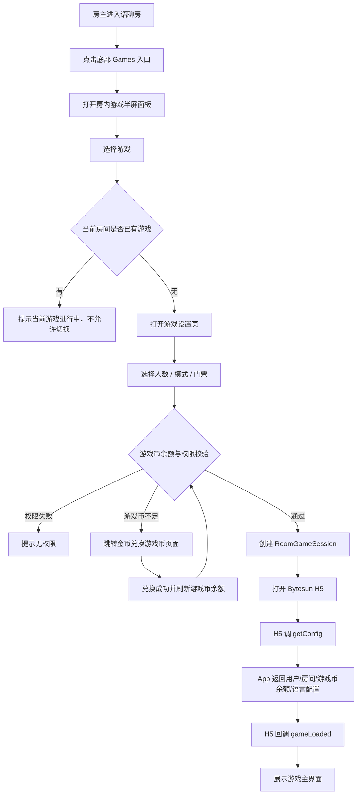
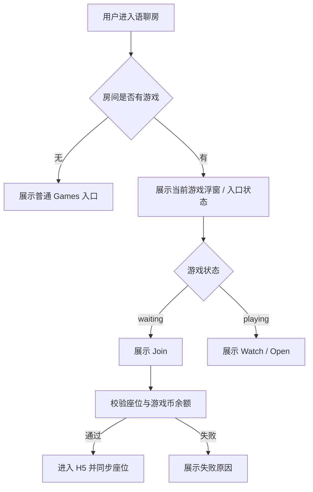
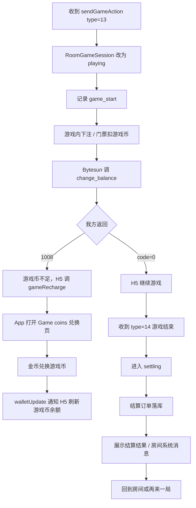
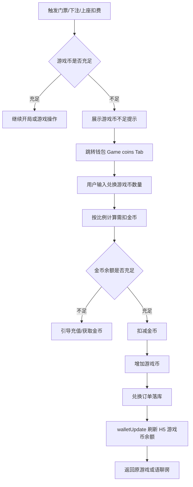
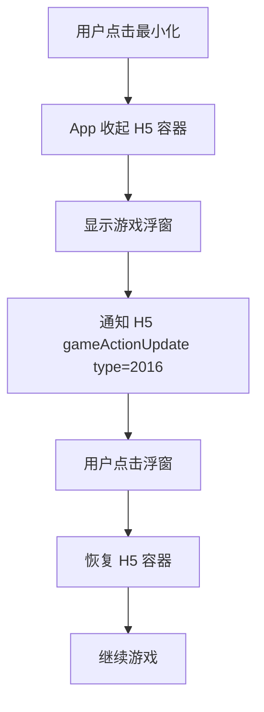
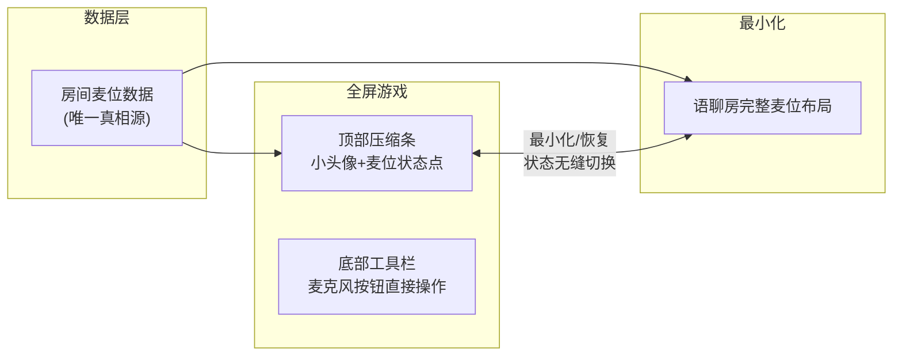
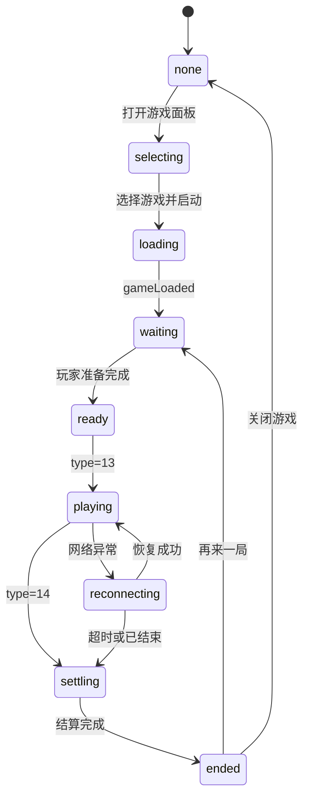

# WeChill 三方休闲游戏接入 PRD

> 版本：v1.1 可评审版  
> 日期：2026-05-16  
> 方案：现有语聊房内直接调起三方休闲游戏  
> 参考文档：
> - `/Users/xinyintiaodong/Documents/游戏房/wechill-三方休闲游戏接入PRD-房间内调起模式-v1.0.md`
> - `/Users/xinyintiaodong/Documents/New project/语聊房内三方休闲游戏接入PRD-可评审版.md`
> - `/Users/xinyintiaodong/Documents/New project/语聊房三方休闲游戏客户端交互原型.html`

## 0. 查缺补漏结论

本版在两份 PRD 的基础上做了统一口径和补齐，重点调整如下：

| 模块 | 原文差异 / 缺口 | 本版处理 |
|---|---|---|
| 产品路径 | 一份强调 P0 先 Ludo + UNO，另一份已明确 6 款全部进入 V1 | 统一为：V1 产品范围覆盖 6 款，联调与灰度可分批，首验优先 Ludo / UNO |
| 房间形态 | 旧文档仍保留“游戏房类型”后备流程 | 本期主路径固定为“普通语聊房内调起游戏”，不新增房间类型 |
| 页面表达 | 原文大量使用页面结构/线框描述 | 本版前台页面全部改为截图展示 + 规则说明，不再用结构草图表达样式 |
| 游戏态浮层 | 原文描述“顶部/底部浮层”，但高清游戏图已内含顶部信息 | 统一为：三方游戏图自带顶部/右侧游戏信息，我方只叠加底部房间工具栏和必要控制 |
| 后台能力 | 可评审版后台较完整，旧版更偏模块规划 | 合并为游戏接入配置、游戏配置、入口配置、房间监控、活动、结算、风控、接口配置 |
| 技术对接 | 旧版更简洁，可评审版补充 sendGameAction / gameActionUpdate 清单 | 保留完整 JSBridge、服务端 API、URL 参数、安全区、待 Bytesun 确认项 |
| 验收标准 | 两份文档粒度不同 | 按产品、客户端、服务端、后台、数据、灰度六类验收 |
| 货币口径 | 原文默认“金币即游戏币”，未覆盖游戏币不足兑换场景 | 调整为：游戏内统一使用游戏币，游戏币由金币兑换；游戏币不足跳转金币兑换页 |

## 1. 项目概述

### 1.1 背景

中东语聊房用户对轻社交、陪伴和多人休闲游戏接受度较高。当前房间核心互动以语音、聊天、礼物为主，长时停留场景不足。

本期通过接入 Bytesun 三方休闲游戏，在不改变现有语聊房房间模型的前提下，为房间增加游戏入口。用户可以在当前语聊关系链内直接选择游戏、加入座位、观战、最小化和结算。

### 1.2 一句话定位

让房主在当前语聊房内一键开启休闲游戏，让房间成员不离开房间即可一起玩、一起聊、一起送礼和结算。

### 1.3 核心原则

| 原则 | 说明 |
|---|---|
| 游戏是语聊房插件 | 不新增独立 game_room 房间类型作为 V1 主链路 |
| 房间关系链不变 | 麦位、房主、管理员、聊天、礼物、钱包继续复用语聊房能力 |
| Bytesun 负责游戏规则 | 游戏玩法、局内状态、开局结束由三方 H5 承接 |
| 我方负责房间与经济 | 房间状态、用户身份、余额、结算、风控、后台配置由我方承接 |
| V1 先跑通闭环 | 能打开、能开局、能上座、能结算、能最小化、能灰度 |

### 1.4 业务目标

| 目标 | 衡量指标 |
|---|---|
| 提升房间停留 | 游戏用户房间停留时长、房间平均在线时长 |
| 提升房间活跃 | 游戏入口点击率、开局数、参局人数、观战人数 |
| 提升付费转化 | 游戏币消耗、金币兑换游戏币金额、礼物消费增量 |
| 降低上线风险 | 不改房间类型，控制改造范围，支持灰度和下架 |
| 适配 MENA | 优先接入 Ludo、UNO、Domino、8 Ball、Carrom、Snake & Ladder |

## 2. 产品范围

### 2.1 V1 必做范围

| 模块 | 说明 |
|---|---|
| Discover Games 页面 | 底部 Discover 增加 Games / Activity 顶部 Tab，展示推荐游戏和正在玩游戏的语聊房 |
| More Games 全部游戏弹窗 | 展示全部游戏宫格，支持正常、维护、灰态、下载中等状态 |
| 房内 Games 入口 | 语聊房底部工具栏增加游戏入口，支持无游戏和有游戏两种状态 |
| 房内游戏面板 | 点击 Games 后展示半屏面板，包含休闲游戏、活动、动态表情 |
| 游戏设置页 | 选择游戏后展示对应设置页，包含人数、模式、门票、加入/开始 |
| 全屏游戏容器 | WebView / WKWebView 打开三方 H5，保留语聊房底部工具栏 |
| 游戏浮窗 | 用户最小化后回到语聊房，可通过浮窗恢复游戏 |
| 游戏状态同步 | loading、waiting、playing、settling、ended、error 全链路同步 |
| 游戏币余额与结算 | 支持 get_user_info、change_balance、游戏币不足跳转金币兑换页、walletUpdate |
| 后台配置 | 游戏上下架、地区端控制、入口开关、活动配置、接口配置 |
| 数据监控 | 核心埋点、游戏记录、结算记录、异常监控、基础看板 |
| 首批游戏 | Ludo / UNO / Domino / 8 Ball / Carrom / Snake & Ladder |

### 2.2 V1 不做范围

| 不做项 | 原因 | 后续 |
|---|---|---|
| 新增独立游戏房类型 | 改动房间模型、推荐流、权限、榜单，风险高 | V2 根据数据再评估 |
| 单房间多个游戏同时运行 | 状态和结算复杂 | V2 |
| 游戏排行榜 / 段位 | 需要长期赛季和风控 | V2 |
| 锦标赛 | 需要赛制、奖励、报名、反作弊 | V3 |
| RTC 推理游戏 | 涉及游戏内 RTC、音频权限和麦克风同步 | V3 |
| Slots / Jackpot 强推荐 | 合规风险更高 | 单独评审 |

### 2.3 V1 成功标准

| 指标 | 目标 |
|---|---|
| 游戏入口点击率 | ≥ 15% |
| 游戏加载成功率 | ≥ 95% |
| H5 gameLoaded 到达率 | ≥ 95% |
| 进入房间到可操作耗时 | P90 ≤ 8 秒 |
| 游戏完成率 | ≥ 90% |
| 结算失败率 | ≤ 0.5% |
| 白屏 / 崩溃率 | ≤ 1% |

## 3. 用户角色与权限

| 角色 | user_type | 权限 |
|---|---:|---|
| 房主 / 主持人 | 2 | 可开启游戏、关闭游戏、调整局参数、踢出游戏座位 |
| 管理员 | 0 或 2 | 默认可加入和观战，是否可开局由后台配置 |
| 普通用户 | 0 | 可查看、加入、观战、送礼、聊天 |
| 审核账号 | 后台策略 | 可隐藏入口、隐藏付费局和游戏币兑换入口，只展示低风险内容 |
| 被封禁用户 | 风控态 | 不展示入口，不允许进入游戏 |

权限矩阵：

| 功能 | 房主 | 管理员 | 普通用户 | 审核账号 |
|---|---|---|---|---|
| 查看游戏入口 | 是 | 是 | 是 | 按策略 |
| 打开游戏面板 | 是 | 是 | 是 | 按策略 |
| 开启游戏 | 是 | 可配置 | 否 | 否 |
| 加入游戏座位 | 是 | 是 | 是 | 否 |
| 观战 | 是 | 是 | 是 | 可配置 |
| 踢出游戏座位 | 是 | 可配置 | 否 | 否 |
| 关闭当前游戏 | 是 | 可配置 | 否 | 否 |

## 4. 前台页面样式截图

本章节以原型截图展示页面样式，不再使用页面结构草图。截图来源为客户端 HTML 原型与高清游戏素材。

### 4.1 Discover - Games 首页


规则说明：

| 模块 | 规则 |
|---|---|
| 顶部 Tab | Games / Activity，默认选中 Games |
| 用户资产 | 展示用户头像、游戏币余额、兑换入口 |
| Private room | 解释为“进入我的语聊房并开游戏”，不是独立游戏房 |
| 推荐游戏 | 首屏 6 个游戏位，最后一位 More Games |
| Game Rooms | 展示当前有游戏会话的语聊房，不改变底层房间类型 |
| 房间排序 | waiting 优先，其次 playing 可观战，再按热度/在线人数 |

### 4.2 Discover - Activity 活动页


规则说明：

| 模块 | 规则 |
|---|---|
| 活动列表 | 展示游戏活动 Banner / Hot Events |
| 排序 | 默认按运营配置排序，可切换为热度/参与人数 |
| 跳转 | 支持跳活动详情、指定房间、指定游戏、金币兑换游戏币页面 |
| 结束活动 | 可灰态展示，也可后台隐藏 |

### 4.3 More Games 全部游戏弹窗


规则说明：

| 状态 | 样式 | 点击行为 |
|---|---|---|
| 正常 | 彩色 icon + 游戏名 | 打开游戏设置页 |
| 维护 | 灰态 + Maintenance | 不可点击，展示维护提示 |
| 下载中 | 进度态 | 完成后可打开 |
| 未下载 | 下载标识 | 点击后拉取游戏包 |
| 审核隐藏 | 不展示 | 对审核账号或限制地区隐藏 |

### 4.4 语聊房主界面与房内游戏面板

| 语聊房内入口 | 房内游戏半屏面板 |
|---|---|
|  |  |

规则说明：

| 模块 | 规则 |
|---|---|
| 底部游戏按钮 | 放在表情/礼物附近，作为主入口 |
| 右侧快捷入口 | 有活动或当前游戏时展示，点击打开活动或当前游戏 |
| 半屏面板 | 包含休闲游戏、活动、动态表情 Tab |
| 无游戏状态 | 点击游戏进入设置页 |
| 有游戏状态 | 展示当前游戏，其他游戏不可切换 |
| 动态表情 | 保留现有能力，不与游戏互斥 |

### 4.5 游戏设置页样式

游戏设置页由具体游戏能力决定。V1 按三方返回能力展示，不强行统一所有字段。

| 8 Ball 设置 | Ludo 设置 | Snake & Ladder 设置 |
|---|---|---|
|  |  |  |

设置规则：

| 字段 | 说明 |
|---|---|
| 玩家人数 | 1v1 / 2 人 / 3 人 / 4 人，按游戏能力展示 |
| 游戏模式 | Classic / Magic / Quick 等，按游戏能力展示 |
| 门票 | 单位为游戏币；默认 0，可由房主调整，范围由后台配置 |
| 下注 | 部分游戏在 H5 内处理，不一定在设置页展示 |
| 开始按钮 | 房主可见并可点击，普通用户根据状态展示 Join / Watch |
| 退出按钮 | 返回语聊房，不关闭房间 |

### 4.6 全屏游戏主界面


规则说明：

| 模块 | 规则 |
|---|---|
| 三方游戏画面 | 高清图直接铺满 WebView，不再使用模糊底图 |
| 顶部房间信息 | 若三方游戏图已包含顶部信息，我方不重复叠加 |
| 底部工具栏 | 复用语聊房底部 icon：聊天、扬声器、麦克风、表情、消息、游戏、礼物、更多 |
| 安全区 | 底部工具栏不得遮挡游戏关键操作；按 game_margin_bottom 配置 |
| 控制按钮 | 保留最小化、结算模拟、关闭按钮；线上按实际权限展示 |
| 语音 | 游戏中继续使用语聊房 RTC，默认语音优先 |
| 麦位展示（全屏） | 顶部压缩条：一排小头像+说话动画+麦位状态点。若三方H5已包含玩家头像区域则不叠加，避免冲突 |
| 麦位操作（全屏） | 底部工具栏麦克风按钮直接操作，与普通语聊房一致 |
| 礼物 / 红包 | V1 保留入口，具体是否展示按后台开关 |

### 4.7 主要游戏页高清参考

| UNO | Ludo | Snake & Ladder | 8 Ball / Carrom |
|---|---|---|---|
|  |  |  |  |

### 4.8 游戏币不足与金币兑换页


页面规则：

| 模块 | 规则 |
|---|---|
| 页面入口 | 游戏币不足、游戏设置页点击游戏币余额、钱包页 Game coins Tab 均可进入 |
| 顶部 Tab | Gold coins / Diamonds / Game coins，进入时默认选中 Game coins |
| 游戏币余额卡 | 展示“我的游戏币余额”和当前游戏币数量 |
| 兑换输入 | 用户输入希望获得的游戏币数量，输入后实时计算需扣除金币数量 |
| 金币余额 | 展示当前金币余额，金币不足时引导充值或获取金币 |
| 兑换比例 | 默认展示 `100金币 = 1000游戏币`，实际比例由后台配置 |
| 风险提示 | 游戏币仅供游戏内使用，不得提现，不支持兑换回金币 |
| 立即兑换按钮 | 输入合法且金币充足时高亮；为空、低于最小值、超过金币余额时置灰 |
| 兑换成功 | 扣减金币、增加游戏币，toast 提示成功，并通过 walletUpdate 刷新游戏 H5 余额 |

游戏币不足弹窗/跳转规则：

| 场景 | 处理 |
|---|---|
| 开始游戏时门票不足 | 弹出确认：游戏币不足，去兑换；确认后打开 Game coins 页 |
| 游戏内下注不足 | H5 调 `gameRecharge`，App 直接打开 Game coins 页 |
| 结算前扣费失败 | 不允许开局，提示兑换游戏币后重试 |
| 兑换后返回游戏 | 若原游戏仍处于 waiting / playing，可回到原游戏并刷新余额 |
| 兑换后游戏已结束 | 回到语聊房，展示当前游戏已结束提示 |

## 5. 游戏接入规划

### 5.1 首批游戏

| 游戏 | 人数 | 时长 | V1 口径 | 备注 |
|---|---:|---:|---|---|
| Ludo | 2-4 | 10-20 分钟 | 强验收 | 中东强认知，优先联调 |
| UNO | 2-4 | 5-10 分钟 | 强验收 | 快局，适合破冰 |
| 8 Ball / Carrom | 2 | 3-8 分钟 | 灰度验收 | 竞技感强，需验证操作区安全 |
| Domino | 2-4 | 5-10 分钟 | 灰度验收 | MENA 熟悉度较高 |
| Snake & Ladder | 2-4 | 5-12 分钟 | 灰度验收 | 上手简单，适合普通房 |

### 5.2 游戏配置模板

| 字段 | 类型 | 说明 |
|---|---|---|
| game_id | int | Bytesun 游戏 ID |
| bytesun_name | string | ludoPlus / unoPlus 等 |
| display_name | i18n | 多语言名称 |
| icon | url | 游戏 icon |
| preview_url | url | 预览图 |
| game_version | string | 游戏版本 |
| game_url | url | H5 URL |
| zip_url | url | Zip 包下载地址 |
| orientation | enum | portrait / landscape |
| min_players | int | 最小人数 |
| max_players | int | 最大人数 |
| support_watch | bool | 是否支持观战 |
| support_ticket | bool | 是否支持门票 |
| ticket_slots | array | 可选门票档位 |
| support_hide_lobby | bool | 是否支持 hideLobby |
| status | enum | 上架 / 下架 / 维护 / 灰度 |
| region_scope | array | 展示地区 |
| audit_visible | bool | 审核账号是否可见 |

## 6. 核心业务流程

### 6.1 房主在房间内开启游戏



### 6.2 普通用户加入游戏



### 6.3 开局、扣费与结算



### 6.4 游戏币不足与金币兑换流程



### 6.5 最小化与恢复



### 6.6 麦位兼容：全屏游戏 vs 最小化

> 核心原则：麦位只有一套数据（房间级），全屏和最小化是两种展示形态。



| 状态 | 麦位展示 | 麦位操作 |
|---|---|---|
| 全屏游戏中 | 顶部压缩条：一排小头像 + 说话动画 + 麦位状态点。若三方 H5 已包含玩家头像区域则我方不叠加 | 底部工具栏麦克风按钮直接操作，与普通语聊房一致 |
| 最小化后 | 回到语聊房正常麦位布局 | 麦位完全正常展示和操作，与未开游戏时一致 |

**关键规则**：

- 语音通道只有一条：全屏和最小化共用同一 RTC 频道，不切换
- 麦位状态是房间级数据：谁在麦上、谁闭麦、谁被抱麦，都是房间层面的事，与游戏 session 无关
- 状态实时同步：游戏中有人上麦/下麦/闭麦，全屏和最小化两侧均实时收到房间事件
- 切换无缝：最小化→恢复时，麦位从完整布局压缩回顶部条，状态不丢失

## 7. 游戏状态设计

### 7.1 RoomGameSession 状态机



### 7.2 状态定义

| 状态 | 含义 | 用户可见动作 |
|---|---|---|
| none | 当前房间无游戏 | 打开游戏面板 |
| selecting | 浏览游戏列表 | 选择游戏 |
| loading | H5 加载中 | 等待 / 取消 |
| waiting | 游戏已创建，等待用户加入 | Join / Invite |
| ready | 达到开局条件 | Start |
| playing | 游戏进行中 | Open / Watch / Gift / Chat |
| reconnecting | 重连中 | 等待 / 退出 |
| settling | 结算中 | 等待 |
| ended | 已结束 | 再来一局 / 返回房间 |
| error | 异常 | Retry / Close |

## 8. 座位、麦位与声音规则

| 规则 | 说明 |
|---|---|
| 游戏座位独立于语聊麦位 | 用户不上麦也可以玩游戏 |
| 语聊麦位不因游戏改变 | 原有房主、主持、管理员权限保持 |
| 座位以 App 最终状态为准 | 与 H5 冲突时，通过 gameActionUpdate type=4 反向同步 |
| 一个用户只能占一个游戏座位 | 防重复占位和多端异常 |
| 游戏中不可随意换座 | 除非三方游戏明确支持 |
| 游戏结束释放座位 | 再来一局重新进入 waiting / preparing |

声音策略：

| 场景 | 策略 |
|---|---|
| 普通休闲游戏 | 保留我方语聊房 RTC，默认降低或关闭游戏 BGM |
| 用户静音麦克风 | 同步我方 RTC 状态，必要时通知游戏 |
| 游戏查询音效状态 | H5 发查询后，App 返回当前 sound 状态 |
| RTC 推理游戏 | V3 才接入，使用 isGameRTC=true 和 type=3001 |

## 9. 货币与结算

### 9.1 货币口径

V1 游戏内统一使用**游戏币（Game coins）**，金币只作为兑换来源，不直接参与游戏下注、门票和结算。

```text
金币 Gold coins -> 兑换 -> 游戏币 Game coins -> 游戏内门票/下注/结算
```

默认兑换比例按页面展示：

```text
100 金币 = 1000 游戏币
```

规则：

| 规则 | 说明 |
|---|---|
| 游戏内展示币种 | 只展示游戏币，不展示金币 |
| 游戏币来源 | 用户通过金币兑换获得 |
| 反向兑换 | 不支持游戏币兑换回金币 |
| 提现 | 游戏币仅供游戏内使用，不支持提现 |
| 比例配置 | 默认 100 金币 = 1000 游戏币，后台可配置并记录历史版本 |
| 审核策略 | 审核账号可隐藏付费局和游戏币兑换入口 |

### 9.2 消耗与奖励场景

| 场景 | 类型 | 币种 | 变动 |
|---|---|---|---:|
| 金币兑换游戏币 | exchange | 金币 / 游戏币 | 金币负值，游戏币正值 |
| 门票扣费 | ticket | 游戏币 | 负值 |
| 游戏下注 | bet | 游戏币 | 负值 |
| 游戏结算奖励 | result | 游戏币 | 正值 |
| 异常退款 | refund | 游戏币 | 正值 |
| 运营补偿 | compensate | 游戏币 | 正值 |

### 9.3 游戏币不足处理

| 触发点 | 判断 | 处理 |
|---|---|---|
| 设置页点击 Start / Join | 游戏币 < 门票 | 弹窗提示“游戏币不足”，跳转 Game coins 兑换页 |
| H5 内下注 | Bytesun 调 change_balance 返回 1008 | H5 调 `gameRecharge`，App 打开 Game coins 兑换页 |
| 上座校验 | 游戏币低于当前局最低要求 | 不允许上座，提示兑换后重试 |
| 兑换页金币不足 | 金币余额 < 需扣金币 | 兑换按钮置灰，引导充值或获取金币 |
| 兑换成功 | 金币扣减成功，游戏币增加成功 | 调 `walletUpdate` 通知 H5 刷新余额，并允许回到原游戏 |

### 9.4 结算安全

| 规则 | 说明 |
|---|---|
| order_id 幂等 | 同一订单重复回调只处理一次 |
| 用户级锁 | change_balance 必须做单用户并发保护 |
| 成功 code | 只有成功才能返回 code=0 |
| 游戏币不足 | 返回 1008，H5 可调 gameRecharge |
| 兑换幂等 | 金币扣减和游戏币增加必须在同一事务内完成 |
| 补偿队列 | 结算失败进入补偿和对账 |
| 对账 | 游戏订单、兑换订单、钱包流水、Bytesun 回调四方核对 |

## 10. Bytesun 技术接入要求

### 10.1 接入方式

| 方式 | 说明 | V1 建议 |
|---|---|---|
| URL 直连 | 直接加载游戏 H5 URL | 联调和灰度优先 |
| Zip 本地包 | 下载游戏 Zip 并解压本地加载 | 正式体验优化 |
| CDN 加速 | OSS 源站回源，配置 CDN | 必做 |

标准流程：

1. 我方后台同步 Bytesun 游戏列表。
2. 客户端获取游戏信息和版本。
3. 客户端按版本决定 URL 直连或 Zip 更新。
4. 打开 H5 / WebView。
5. H5 调 `getConfig`。
6. App 返回商户、用户、房间、语言、游戏币余额、金币余额、角色等配置。
7. H5 通过 JSBridge 上报游戏状态。
8. Bytesun 服务端通过我方 API 查询用户和修改余额。

### 10.2 getConfig 关键字段

| 字段 | 说明 |
|---|---|
| merchantId | Bytesun 分配 |
| appChannel | Bytesun 分配，后台配置 |
| userId | 我方用户 ID |
| roomId | 当前语聊房 ID |
| role | 用户角色 |
| language | 客户端语言 |
| gameMode | 语聊房场景固定传 `"3"` |
| balance | 当前游戏币余额，供 Bytesun 游戏内展示和扣费 |
| goldBalance | 当前金币余额，仅用于我方兑换页展示，不直接参与游戏扣费 |
| exchangeRate | 金币兑换游戏币比例，例如 `100金币=1000游戏币` |
| userType | 用户风控 / 审核类型 |
| safeArea | 顶部 / 底部安全区 |

### 10.3 H5 调 App

| 方法 / type | 用途 | V1 要求 |
|---|---|---|
| getConfig | 获取配置 | 必须 |
| destroy | 游戏主动关闭 WebView | 兼容处理 |
| gameLoaded | 游戏加载完成 | 必须 |
| gameRecharge | 游戏币不足时拉起 Game coins 兑换页 | 必须 |
| type=13 | 游戏开始 | 状态改为 playing |
| type=14 | 游戏结束 | 状态改为 settling |
| type=15 | 上 / 下游戏座位 | App 校验后同步 |
| type=16 | 座位信息同步 | 刷新座位 |
| type=18 | 上座失败 | 展示失败原因 |
| type=20 | 语聊房游戏准备完成 | 同步房间信息 |
| type=23 | 游戏基础参数 | 更新配置 |
| type=30 | 最大人数 / 门票变更 | 更新房间配置 |

### 10.4 App 调 H5

| 方法 / type | 用途 |
|---|---|
| walletUpdate | 游戏币兑换成功或游戏币余额变化后通知游戏刷新 |
| gameActionUpdate type=4 | 操作游戏座位 |
| gameActionUpdate type=6 | 返回踢人结果 |
| gameActionUpdate type=2012 | 查询音效状态 |
| gameActionUpdate type=2014 | App 聊天同步到画猜类游戏 |
| gameActionUpdate type=2016 | 最小化 / 展开状态 |

### 10.5 服务端 API

| 接口 | 用途 | 要求 |
|---|---|---|
| `/v1/api/get_sstoken` | 获取服务端 token | 签名、过期、权限校验 |
| `/v1/api/get_user_info` | 查询用户昵称、头像、游戏币余额 | 返回 game coin balance / user_type |
| `/v1/api/change_balance` | 游戏币下注、结算、退款 | 用户级锁、order_id 幂等、游戏币不足 1008 |
| 金币兑换游戏币接口 | 用户在 Game coins 页兑换 | 同事务扣金币并加游戏币，兑换订单幂等 |
| 游戏状态上报接口 | game_start / game_settle | 落库、看板、风控 |
| 房间游戏状态接口 | 查询当前房间游戏 | 客户端恢复和浮窗展示 |

### 10.6 URL 特殊参数

| 参数 | 适用 | 说明 |
|---|---|---|
| `game_margin_top` | 全屏语聊房游戏 | 顶部安全区 |
| `game_margin_bottom` | 全屏语聊房游戏 | 底部工具栏安全区 |
| `game_margin_standard` | 全屏语聊房游戏 | 标准屏幕参数 |
| `hideLobby=true` | ludoPlus / unoPlus / DominoPlus | 隐藏大厅，需 Bytesun 补充快速开始 API |
| `isGameRTC=true` | RTC 推理游戏 | V3 才启用 |
| `language` | Loading 页语言 | 按 Bytesun 支持范围传值 |

## 11. 后台管理 PRD

### 11.1 菜单结构

```text
运营后台
└── 游戏中心
    ├── 游戏接入配置
    ├── 游戏配置列表
    ├── 游戏入口配置
    ├── 房间游戏监控
    ├── 游戏活动管理
    ├── 游戏记录
    ├── 结算管理
    ├── 游戏币兑换管理
    ├── 风控审核
    └── 三方接口配置
```

### 11.2 游戏接入配置

| 字段 | 说明 |
|---|---|
| merchantId | Bytesun 商户 ID |
| appKey | 仅服务端保存，不下发客户端 |
| appChannel | 游戏渠道 |
| 游戏列表同步开关 | 是否自动同步 Bytesun 游戏 |
| CDN 域名 | 游戏包回源和预热 |
| Zip 更新策略 | 自动 / 手动 / 灰度 |
| URL 直连开关 | 是否允许直连 H5 |
| 游戏币兑换比例 | 默认 100 金币 = 1000 游戏币，支持灰度和历史记录 |
| 游戏币兑换开关 | 控制 Game coins 页是否可兑换 |

### 11.3 游戏配置列表

| 字段 | 说明 |
|---|---|
| 游戏 ID | Bytesun `game_id` |
| 游戏名称 | 多语言展示名 |
| Bytesun 游戏名 | ludoPlus / unoPlus 等 |
| 游戏分类 | 桌游、卡牌、台球、休闲、画猜、RTC |
| 游戏 icon | `preview_url` |
| 游戏版本 | `game_version` |
| 游戏方向 | 竖屏 / 横屏 |
| 上下架状态 | 上架、下架、维护、灰度 |
| 地区限制 | 国家 / 区域 |
| 端限制 | iOS / Android / Web |
| 审核账号策略 | 展示 / 隐藏 / 只展示免费局 |
| 门票范围 | 单位为游戏币，配置最小、最大、默认值 |
| 是否允许观战 | 开 / 关 |

### 11.4 游戏入口配置

| 配置 | 默认 | 说明 |
|---|---|---|
| Discover Games Tab | 开 | 控制游戏大厅入口 |
| Activity Tab | 开 | 控制活动页 |
| 房间内 Games 按钮 | 开 | 控制房间底部工具栏 |
| 房间右侧快捷入口 | 开 | 游戏进行中或活动时展示 |
| More Games | 开 | 控制全部游戏弹窗 |
| 房间列表游戏标签 | 开 | 控制 Game Rooms 聚合 |
| 游戏中允许切换 | 关 | V1 不允许 |
| 管理员开局 | 关 | 可后台放开 |

### 11.5 房间游戏监控

| 字段 | 说明 |
|---|---|
| 语聊房 ID | 当前房间 |
| 房主 ID | 房间归属 |
| 当前游戏 | Ludo / UNO / Domino |
| RoomGameSession ID | 我方游戏会话 |
| Bytesun roomId | 三方房间 ID |
| 游戏状态 | waiting / playing / settling / ended / error |
| 玩家数 | 当前游戏座位人数 |
| 观战数 | 当前观战人数 |
| 门票 | 当前局门票，单位为游戏币 |
| 异常状态 | 白屏、加载失败、结算失败、座位异常 |

操作：

| 操作 | 说明 |
|---|---|
| 查看详情 | 查看本局玩家、座位、结算、日志 |
| 强制关闭 | 异常时关闭当前游戏 |
| 下架游戏 | 快速风控 |
| 复制日志 | 方便联调排查 |

### 11.6 结算管理

| 字段 | 说明 |
|---|---|
| 订单 ID | `order_id` |
| 用户 ID | userId |
| 游戏 ID | game_id |
| 房间 ID | room_id |
| session ID | RoomGameSession |
| 变动类型 | ticket / bet / result / refund |
| 变动金额 | 游戏币 currency_diff |
| 前后余额 | before / after |
| 状态 | success / failed / compensating |
| 回调时间 | Bytesun 回调时间 |

### 11.7 游戏币兑换管理

| 字段 | 说明 |
|---|---|
| 兑换订单 ID | exchange_order_id |
| 用户 ID | userId |
| 扣除金币 | gold_cost |
| 增加游戏币 | game_coin_add |
| 兑换比例 | exchange_rate_snapshot |
| 兑换来源 | 游戏币不足弹窗 / 钱包 Game coins Tab / 游戏设置页 |
| 原游戏会话 | 若从游戏内跳转，记录 RoomGameSession ID |
| 状态 | success / failed / compensating |
| 失败原因 | 金币不足、并发失败、风控拦截、系统异常 |
| 创建时间 | created_at |

## 12. 数据模型

### 12.1 RoomGameSession

| 字段 | 说明 |
|---|---|
| id | 游戏会话 ID |
| room_id | 语聊房 ID |
| game_id | Bytesun 游戏 ID |
| game_name | 游戏名 |
| status | none / loading / waiting / playing / settling / ended / error |
| host_user_id | 开局用户 |
| ticket | 门票，单位为游戏币 |
| max_players | 最大人数 |
| bytesun_room_id | 三方房间 ID |
| started_at | 开始时间 |
| ended_at | 结束时间 |
| created_at / updated_at | 时间戳 |

### 12.2 RoomGamePlayer

| 字段 | 说明 |
|---|---|
| id | 记录 ID |
| session_id | 游戏会话 |
| room_id | 语聊房 |
| user_id | 用户 |
| seat_no | 游戏座位 |
| role | player / watcher |
| status | joined / ready / playing / left / kicked |
| joined_at | 加入时间 |
| left_at | 离开时间 |

### 12.3 GameBalanceOrder

| 字段 | 说明 |
|---|---|
| order_id | 幂等订单 ID |
| session_id | 游戏会话 |
| user_id | 用户 |
| game_id | 游戏 |
| currency_type | 固定为游戏币，可扩展 |
| currency_diff | 游戏币变动金额 |
| before_balance | 变动前游戏币余额 |
| after_balance | 变动后游戏币余额 |
| status | success / failed / compensating |
| raw_payload | Bytesun 原始回调 |

### 12.4 GameCoinExchangeOrder

| 字段 | 说明 |
|---|---|
| exchange_order_id | 兑换订单 ID |
| user_id | 用户 ID |
| gold_cost | 扣除金币数量 |
| game_coin_add | 增加游戏币数量 |
| exchange_rate_snapshot | 兑换比例快照 |
| source | insufficient / wallet_tab / setting_page |
| source_session_id | 来源游戏会话，可为空 |
| before_gold_balance | 兑换前金币余额 |
| after_gold_balance | 兑换后金币余额 |
| before_game_coin_balance | 兑换前游戏币余额 |
| after_game_coin_balance | 兑换后游戏币余额 |
| status | success / failed / compensating |
| fail_reason | 失败原因 |

## 13. 数据埋点与指标

### 13.1 核心埋点

| 埋点 | 触发时机 |
|---|---|
| game_entry_show | Discover 或房内游戏入口曝光 |
| game_entry_click | 点击游戏入口 |
| game_panel_show | 房内半屏游戏面板展示 |
| game_tab_click | 点击休闲游戏 / 活动 / 动态表情 |
| game_item_click | 点击某个游戏 |
| game_setting_show | 游戏设置页展示 |
| game_start_click | 点击 Start / Join |
| game_h5_load_start | 开始加载 H5 |
| game_loaded | 收到 gameLoaded |
| game_start | 收到 type=13 |
| game_end | 收到 type=14 |
| game_result_view | 结算页曝光 |
| game_coin_insufficient | 游戏币不足 |
| game_coin_exchange_page_show | 打开 Game coins 兑换页 |
| game_coin_exchange_submit | 点击立即兑换 |
| game_coin_exchange_success | 游戏币兑换成功 |
| game_coin_exchange_failed | 游戏币兑换失败 |
| game_recharge_open | H5 拉起 Game coins 兑换页 |
| game_minimize | 游戏最小化 |
| game_restore | 游戏恢复 |
| game_error | 加载、回调、结算等异常 |

### 13.2 核心指标

| 指标 | 计算 |
|---|---|
| 游戏入口点击率 | `game_entry_click / game_entry_show` |
| 面板游戏点击率 | `game_item_click / game_panel_show` |
| 设置页转化率 | `game_start_click / game_setting_show` |
| H5 加载成功率 | `game_loaded / game_h5_load_start` |
| 开局成功率 | `game_start / game_start_click` |
| 游戏完成率 | `game_end / game_start` |
| 结算失败率 | failed balance orders / all balance orders |
| 白屏率 | H5 加载失败或超时 / load_start |
| 游戏币兑换金额 | 游戏来源兑换的金币消耗与游戏币增加 |
| 游戏币不足转化率 | `game_coin_exchange_success / game_coin_insufficient` |

## 14. 异常与边界场景

### 14.1 房间相关

| 场景 | 处理 |
|---|---|
| 房主离开房间（游戏中） | 游戏session不中断，当前局继续。语聊房按现有逻辑转房主给最早上麦的管理员，游戏管理权（开新局/踢人/改设置）自动跟随新房主。无管理员在线则标记 host_absent=true，当前局正常打完，但设置页和 Start 按钮置灰、不可开新局，直到有人被设为房主或管理员。房间只剩1人时局后自动关闭游戏session |
| 房主被踢/被封 | 强制结束游戏，按状态结算或退款 |
| 房间关闭 | 强制结束游戏，按状态结算或退款 |
| 房间被封禁 | 立即关闭游戏入口和当前游戏层 |
| 用户被踢出房间 | 同步退出游戏，释放座位 |
| 房间切后台 | 游戏继续，前台回来恢复状态 |
| 多人同时开游戏 | 服务端只允许一个 session，后发请求失败 |

### 14.2 游戏相关

| 场景 | 处理 |
|---|---|
| 游戏加载失败 | Retry / Close，记录 WebView 日志 |
| H5 未回调 gameLoaded | 30 秒超时，允许重试 |
| 游戏维护 | 灰态，不可点击 |
| 游戏中切换游戏 | 不允许，提示当前游戏进行中 |
| 座位满 | 提示可观战 |
| 上座失败 | 展示 Bytesun 失败原因 |
| H5 崩溃 | 展示恢复 / 关闭，保留房间 |
| 结算延迟 | 展示结算中，后台轮询或补偿 |

### 14.3 货币与账号

| 场景 | 处理 |
|---|---|
| 游戏币不足 | 返回 1008，H5 调 gameRecharge，App 打开 Game coins 兑换页 |
| 兑换页金币不足 | 立即兑换按钮置灰，引导充值或获取金币 |
| 兑换中离开页面 | 不发起订单；已提交订单以服务端最终状态为准 |
| 兑换成功但游戏已结束 | 返回语聊房并提示当前游戏已结束 |
| 订单重复回调 | order_id 幂等，不重复加减钱 |
| 用户封禁 | 不允许进入游戏，游戏中封禁则踢出 |
| 结算失败 | 进入补偿队列，后台可补偿 |
| 审核账号 | 后台可隐藏入口或只展示免费休闲游戏 |

## 15. 多语言与文案

### 15.1 英文

| 中文 | 英文 |
|---|---|
| 游戏 | Games |
| 活动 | Activity |
| 更多游戏 | More Games |
| 休闲游戏 | Casual Games |
| 开始游戏 | Start Game |
| 加入游戏 | Join Game |
| 观战 | Watch |
| 游戏中 | Playing |
| 结算中 | Settling |
| 游戏币 | Game coins |
| 兑换游戏币 | Exchange game coins |
| 游戏币不足 | Not enough game coins |
| 立即兑换 | Exchange now |
| 游戏币仅供游戏内使用，不得提现及兑换金币 | Game coins can only be used in games and cannot be withdrawn or exchanged back to gold coins |
| 当前房间已有游戏进行中 | A game is already running in this room |
| 游戏加载失败 | Game failed to load |
| 只有房主可以开启游戏 | Only the host can start a game |

### 15.2 阿语

| 中文 | 阿语 |
|---|---|
| 游戏 | الألعاب |
| 活动 | النشاطات |
| 更多游戏 | المزيد من الألعاب |
| 休闲游戏 | ألعاب خفيفة |
| 开始游戏 | ابدأ اللعبة |
| 加入游戏 | انضم إلى اللعبة |
| 观战 | مشاهدة |
| 游戏中 | قيد اللعب |
| 结算中 | جاري احتساب النتيجة |
| 游戏币 | عملات اللعب |
| 兑换游戏币 | استبدال عملات اللعب |
| 游戏币不足 | عملات اللعب غير كافية |
| 立即兑换 | استبدل الآن |
| 游戏加载失败 | فشل تحميل اللعبة |
| 只有房主可以开启游戏 | يمكن لمالك الغرفة فقط بدء اللعبة |

## 16. 开发周期与上线策略

### 16.1 V0 技术预研

周期：1-2 周。

| 任务 | 交付 |
|---|---|
| Bytesun 测试环境联调 | 接口连通性报告 |
| H5 / Zip 加载验证 | Android / iOS 加载方案 |
| JSBridge 验证 | getConfig、gameLoaded、gameRecharge、sendGameAction |
| 钱包接口预研 | change_balance 幂等、并发锁、金币兑换游戏币事务方案 |
| 游戏资源确认 | game_id、版本、人数、观战、门票能力清单 |

验收：

- Ludo / UNO 至少一个游戏在语聊房模式可加载。
- `getConfig`、`gameLoaded`、`change_balance`、金币兑换游戏币跑通。
- 明确 Zip / URL 直连策略和 CDN 方案。

### 16.2 V1 MVP 开发排期

周期：4-5 周。

| 周期 | 客户端 | 服务端 | 后台 / 数据 | 验收重点 |
|---|---|---|---|---|
| 第 1 周 | Discover Games / Activity、房内入口、半屏面板 | RoomGameSession 创建 / 查询 / 关闭 | 游戏接入配置、入口配置 | 能在房内选择游戏 |
| 第 2 周 | H5 容器、Loading、getConfig、gameLoaded | code、ss_token、用户信息接口 | 游戏配置列表、游戏同步 | 能加载 Ludo / UNO |
| 第 3 周 | 设置页、上座/下座、观战、声音控制 | 座位状态、type=13/14/15/16/18 | 房间游戏监控、操作日志 | 能进入 waiting / playing |
| 第 4 周 | 结算页、再来一局、游戏币不足、金币兑换游戏币、最小化、异常提示 | change_balance、兑换接口、结算记录、补偿队列 | 结算管理、游戏币兑换管理、基础看板 | 能完整完成一局并结算 |
| 第 5 周 | 兼容、性能、灰度、埋点补齐 | 对账、风控、监控告警 | 数据验收、运营配置 | 达到上线标准 |

### 16.3 灰度策略

| 阶段 | 范围 | 目标 |
|---|---|---|
| 阶段 1 | 内部测试房间 + 白名单账号 | 验证加载、桥接、结算 |
| 阶段 2 | MENA 小流量普通语聊房 | 验证入口点击、开局转化、稳定性 |
| 阶段 3 | 扩大到重点国家 | 验证留存、充值、房间活跃 |
| 阶段 4 | 全量开放 | 按后台开关和风控持续运营 |

## 17. 验收标准

### 17.1 产品验收

- 用户可以从 Discover Games 看到推荐游戏和正在玩游戏的语聊房。
- 用户可以从房间内 Games 入口打开半屏游戏面板。
- 房主可以选择游戏并打开设置页。
- 房主可以开始 Ludo / UNO，其他首批游戏可按灰度配置进入。
- 普通用户可以加入、观战、最小化和返回房间。
- 游戏开始和结束状态能同步到 App。
- 用户可以完成一局并看到结算结果。
- 游戏币不足时可以打开 Game coins 兑换页，金币兑换成功后刷新游戏币余额。
- 最小化后可通过房间浮窗恢复游戏。
- 加载失败、上座失败、维护、封禁、地区限制均有明确提示。

### 17.2 技术验收

- iOS / Android WebView 能稳定加载 H5 / Zip。
- `getConfig` 返回字段满足 Bytesun 要求。
- `gameLoaded`、`sendGameAction`、`gameActionUpdate` 跑通。
- `change_balance` 支持幂等、并发锁和游戏币不足错误。
- 金币兑换游戏币接口支持同事务扣金币和加游戏币。
- 游戏开始和结算上报可落库。
- 安全区参数不会遮挡主要游戏操作区。
- 游戏包版本可后台控制。

### 17.3 后台验收

- 游戏上下架、维护、灰度可配置。
- 地区、端、审核账号策略可配置。
- 房间游戏监控可查看当前局状态。
- 结算订单可查询、补偿和导出。
- 游戏币兑换订单可查询、补偿和导出。
- 活动 Banner 可配置跳转。
- 三方接口配置可审计，不泄露 appKey。

### 17.4 数据验收

- 入口曝光、点击、加载、开局、加入、上座、结束、结算、异常均有埋点。
- 游戏记录可按房间、游戏、用户、时间查询。
- 结算记录可按订单、用户、游戏局查询。
- 看板可查看启动成功率、加载耗时、开局转化、完成率、结算失败率、上座失败率、游戏币不足转化率。

## 18. 风险与缓解

| 风险 | 影响 | 缓解 |
|---|---|---|
| Bytesun 服务不稳定 | 游戏无法加载或结算失败 | URL / Zip 双方案、重试、下架开关、监控告警 |
| 游戏包加载慢 | 进入转化下降 | CDN 预热、本地包、Loading 进度、首屏优化 |
| 结算并发 | 错账 | 用户级锁、订单幂等、补偿队列、对账 |
| 金币兑换游戏币错账 | 金币扣减或游戏币增加不一致 | 同事务、兑换订单幂等、兑换对账、补偿队列 |
| 语音和游戏声音冲突 | 体验差 | 语音优先，默认降低 BGM，用户可控制 |
| 低端机性能 | 卡顿 / 崩溃 | 机型监控、降级策略，必要时屏蔽高负载游戏 |
| 游戏操作区被遮挡 | 无法操作 | game_margin_top / bottom、安全区验收 |
| 玩法合规 | 审核风险 | 审核账号隐藏、免费局策略、Slots 单独评审 |
| 作弊串通 | 破坏经济系统 | 同设备/IP 风控、异常胜率、固定组合检测 |

## 19. 待 Bytesun 确认问题

| 问题 | 优先级 | 阶段 |
|---|---|---|
| Ludo、UNO、Domino、8 Ball、Carrom、Snake & Ladder 的准确 `game_id` 和 Bytesun 游戏名 | P0 | V0 |
| `/v1/api/gamelist` 的 `game_list_type` 真实取值 | P0 | V0 |
| 每个游戏最小人数、最大人数、是否允许中途加入、是否允许观战 | P0 | V0 |
| `type=30` 中 `ticketSlots` 的含义、取值和金额映射 | P0 | V0 |
| `hideLobby=true` 的快速开始 API 路径、参数、鉴权、返回值 | P0 | V1 |
| game_id 以 3 开头的游戏是否都必须配置安全区参数 | P0 | V1 |
| 错误码由 H5 透传还是服务端回调处理 | P1 | V1 |
| 余额不足错误码 1008 是否明确指“游戏币不足”，是否需区分金币不足 | P1 | V1 |
| 金币兑换游戏币比例是否固定为 100:1000，还是支持运营后台按地区配置 | P1 | V1 |
| Zip 包 CDN 缓存策略和版本更新机制 | P1 | V1 |
| 各游戏是否支持机器人补位 | P2 | V2 |

## 20. 评审决策项

| 决策项 | 建议结论 |
|---|---|
| V1 路径 | 采用“语聊房内直接调起游戏”，不新增游戏房类型 |
| 首批游戏 | 6 款进入产品范围，Ludo / UNO 优先强验收，其余按灰度节奏上线 |
| 普通语聊房开启游戏 | 默认支持，按地区/端/房主等级可后台限制 |
| 门票系统 | V1 启用，单位为游戏币，默认 0，范围后台配置 |
| 游戏币体系 | 游戏内统一使用游戏币；游戏币由金币兑换，不支持提现和兑换回金币 |
| 游戏中礼物和红包 | 保留入口，具体开关后台控制 |
| 管理员是否可开局 | 默认关闭，由后台配置 |
| Slots / Jackpot 是否展示 | 不作为首批强推荐，需单独合规评审 |

## 21. 最终推荐

本期采用“现有语聊房内直接调起三方休闲游戏”的方案。

这样可以在不改造房间模型、推荐流、麦位和基础权限的情况下，最快验证游戏对房间停留、活跃和付费转化的提升。V1 重点跑通房间内入口、设置页、H5 容器、座位同步、游戏币结算、金币兑换游戏币、最小化恢复和后台监控。待核心数据稳定后，再考虑 Game Rooms 聚合、随机匹配、游戏房类型、任务和锦标赛等扩展能力。

**一句话总结：第一版先把三方休闲游戏做成语聊房里的“可开局插件”，让用户在原房间关系链中一起玩；等数据验证后，再升级成完整游戏房生态。**
