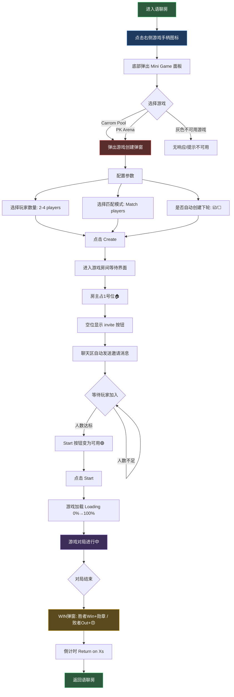
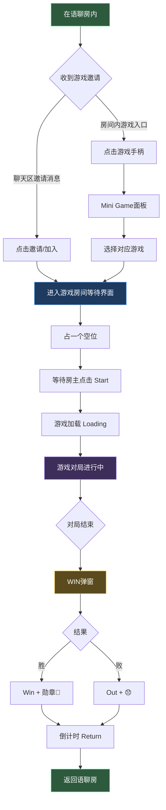
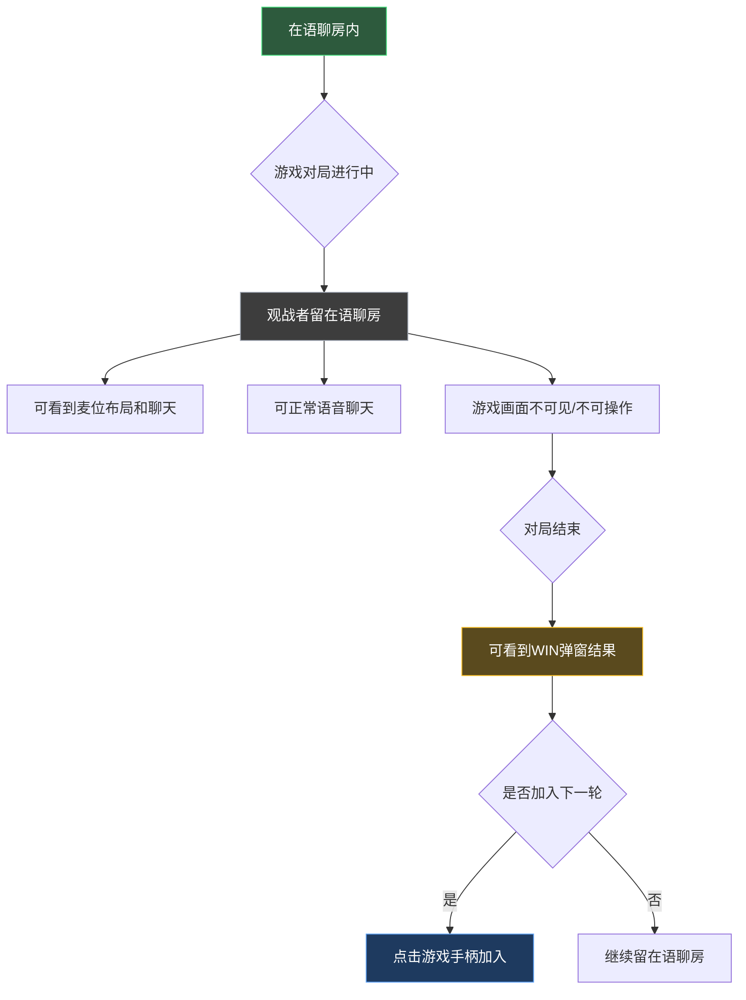
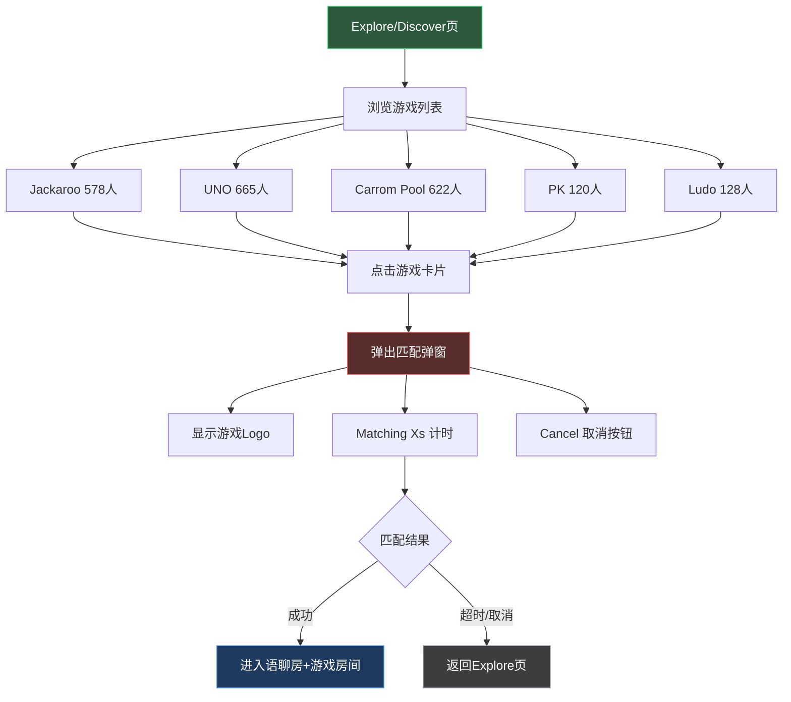

# 竞品交互路径分析 — Hawa 三方休闲游戏

> 版本：v1.0 | 日期：2026-05-20 | 来源：Hawa App 录屏（71s，iOS模拟器）  
> 分析范围：房间内调起游戏模式（Carrom Pool）完整交互路径

---

## 1. 竞品概览

| 项目 | 内容 |
|---|---|
| 竞品名称 | Hawa（هاوا） |
| 目标市场 | MENA（中东/北非），阿拉伯语为主 |
| 产品形态 | 语聊房 + 休闲游戏社交平台 |
| 游戏列表 | Jackaroo、UNO、Carrom Pool、PK Arena、Ludo、Catch Gift、Lucky Box、Lucky Dice、Lucky Number |
| 核心模式 | 语音聊天房内调起三方休闲游戏，游戏期间语音不中断 |

---

## 2. 全局交互路径（两条入口）

```
┌─────────────────────────────────────────────────────┐
│                    Hawa App                         │
│                                                     │
│  ┌──────────────┐         ┌──────────────────────┐  │
│  │  路径A        │         │  路径B                │  │
│  │  Explore页    │         │  语聊房内              │  │
│  │  直接匹配     │         │  游戏手柄→创建→对局    │  │
│  └──────┬───────┘         └──────────┬───────────┘  │
│         │                            │              │
│         ▼                            ▼              │
│    匹配弹窗(Matching)          Mini Game面板         │
│         │                            │              │
│    成功/取消                     选择游戏            │
│         │                            │              │
│         └──────────┬─────────────────┘              │
│                    ▼                                │
│             游戏房间(等待)                           │
│                    │                                │
│                    ▼                                │
│             游戏加载(0→100%)                        │
│                    │                                │
│                    ▼                                │
│             游戏对局                                │
│                    │                                │
│                    ▼                                │
│             结算(WIN弹窗)                           │
│                    │                                │
│                    ▼                                │
│             返回语聊房                              │
└─────────────────────────────────────────────────────┘
```

---

## 3. 按用户身份的交互流程图

### 3.1 房主（Room Owner）流程

房主 = 创建游戏房间的用户，拥有最高权限。



**房主独有权限/操作：**
- 创建游戏（选择人数、匹配模式、自动创建选项）
- 点击 Start 开始游戏
- 结束游戏会话（系统提示："Room owners and administrators can now end game sessions!"）

---

### 3.2 普通玩家（Player）流程

普通玩家 = 通过邀请或匹配加入游戏房间的用户。



**普通玩家限制：**
- 不可点击 Start（需等待房主）
- 不可修改游戏参数
- 可点击 invite 邀请其他用户

---

### 3.3 观战者（Spectator）流程

观战者 = 在语聊房内但未加入游戏对局的用户。



**观战者特征：**
- 语聊房功能不受影响（可上麦、聊天、送礼）
- 游戏进行期间无法看到游戏画面（全屏游戏覆盖）
- 对局结束后可看到结果
- 可随时通过游戏手柄加入下一轮

---

### 3.4 Explore页匹配用户流程（路径A）



---

## 4. 关键界面交互细节

### 4.1 Mini Game 面板（Bottom Sheet）

```
┌────────────────────────────────────┐
│          Mini Game                  │
│  ┌──────┐  ┌──────┐  ┌──────┐     │
│  │Jacka-│  │Carrom│  │ UNO  │     │
│  │ roo  │  │ Pool │  │[灰色]│     │
│  └──────┘  └──────┘  └──────┘     │
│  ┌──────┐  ┌──────┐  ┌──────┐     │
│  │  PK  │  │ Ludo │  │Catch │     │
│  │Arena │  │      │  │Gift  │     │
│  └──────┘  └──────┘  └──────┘     │
│  ┌──────┐  ┌──────┐  ┌──────┐     │
│  │Lucky │  │Lucky │  │Lucky │     │
│  │ Box  │  │Dice  │  │Number│     │
│  └──────┘  └──────┘  └──────┘     │
└────────────────────────────────────┘
```

- **布局**：3列网格，从底部滑出
- **状态**：彩色=可点击，灰色=不可用（灰度/白名单控制）
- **关闭**：点击面板外区域或下滑关闭

### 4.2 游戏创建弹窗（Modal）

```
┌────────────────────────────────────┐
│                           [✕ 关闭] │
│                                    │
│        🎯 CARROM POOL              │
│        (3D Logo)                   │
│                                    │
│  ┌──────────────────────┐          │
│  │  👥 2-4 players  ▼  │          │
│  └──────────────────────┘          │
│                                    │
│  ◉ Match players                  │
│                                    │
│  ┌──────────────────────┐          │
│  │     🟢 Create       │          │
│  └──────────────────────┘          │
│                                    │
│  ☑ Whether to automatically       │
│    create the game in the          │
│    next round                      │
└────────────────────────────────────┘
```

- **玩家数量**：下拉选择（2-4人）
- **匹配模式**：Match players（系统匹配）
- **自动创建**：Checkbox，勾选后本局结束自动创建下一局
- **关闭**：右上角 ✕ 按钮

### 4.3 游戏等待房间

```
┌────────────────────────────────────┐
│  房间号: 23078RKD5C                │
│  ┌─────────────────────────────┐   │
│  │ 🏠21642 │  + │  + │  +    │   │
│  │ [房主]  │[inv]│[inv]│[inv] │   │
│  └─────────────────────────────┘   │
│         [ Start ⬜ 灰色禁用 ]       │
│  ─────────────────────────────     │
│  All | Chat                        │
│  "21642 enter the room"            │
│  "I created 🎯, come and join"     │
└────────────────────────────────────┘
```

- **房主标识**：🏠 图标
- **空位**：+ 号 + 金色 invite 按钮
- **Start按钮**：人数不足时灰色禁用，达标后绿色可用
- **自动邀请**：创建成功后聊天区自动发送邀请消息

### 4.4 游戏加载界面

- 全屏覆盖语聊房
- 中央显示游戏3D Logo
- 金色进度条：Loading..(0%) → Loading..(100%)
- 背景红色丝绒纹理
- 左侧显示用户头像+ID
- 底部仍可见聊天消息

### 4.5 结算弹窗（WIN弹窗）

```
┌────────────────────────────────────┐
│       🌟 ⭐ WIN ⭐ 🌟             │
│    ═════════════════════════       │
│                                    │
│  🏅 نوي ا MN        Win          │
│  😞 دنو 🦋          Out          │
│                                    │
│     [ Return on (5s) 🔴 ]         │
└────────────────────────────────────┘
```

- **胜者**：头像 + 昵称 + Win + 勋章🏅
- **败者**：头像 + 昵称 + Out + 😞
- **倒计时返回**：红色按钮，倒计时结束自动返回语聊房
- **可手动点击**：不用等倒计时完

---

## 5. 语音连续性设计

游戏全屏覆盖期间，语聊房**不中断**：

| 游戏阶段 | 语聊房状态 | 可见元素 |
|---|---|---|
| 游戏等待房间 | ✅ 持续 | 麦位、聊天区、礼物按钮 |
| 游戏加载中 | ✅ 持续 | 底部聊天消息、左侧用户头像 |
| 游戏对局中 | ✅ 持续 | （被游戏画面覆盖但语音不中断） |
| 结算弹窗 | ✅ 持续 | 背景可见麦位布局 |
| 返回语聊房 | ✅ 持续 | 完整恢复 |

---

## 6. 与WeChill PRD的关键差异对比

| 维度 | Hawa | WeChill PRD（当前） | 可借鉴点 |
|---|---|---|---|
| 游戏入口 | 右侧悬浮游戏手柄图标 | PRD有定义，需确认位置一致性 | ✅ 悬浮图标位置合理 |
| 游戏列表形式 | 底部Bottom Sheet，3列网格 | PRD有定义，需确认展示形式 | ✅ Bottom Sheet比全屏页轻量 |
| 创建弹窗参数 | 人数+匹配模式+自动创建下轮 | PRD缺少"自动创建下轮"选项 | ⚠️ 可考虑增加此选项 |
| 匹配模式 | Match players（系统匹配） | PRD有定义 | 基本一致 |
| 等待房间 | 房主+空位invite+灰色Start | PRD有定义 | 基本一致 |
| 游戏加载 | 全屏Logo+进度条 | PRD有定义 | 基本一致 |
| 结算弹窗 | WIN弹窗+倒计时自动返回 | PRD有定义 | ✅ 倒计时返回可参考 |
| 双入口设计 | Explore页匹配 + 房内创建 | PRD仅定义房内入口 | ⚠️ Explore页入口可评估 |
| 灰度控制 | 游戏列表部分灰色不可用 | PRD有定义 | 基本一致 |
| 观战者处理 | 留在语聊房，无法看游戏画面 | PRD有观战模式定义 | 需确认是否允许观战者看游戏 |
| 语音连续性 | 游戏全程语音不中断 | PRD有定义 | 基本一致 |
| 房主权限 | 可结束游戏会话 | PRD有定义 | 基本一致 |

---

## 7. 可直接复用的设计建议

### 7.1 高优先级（建议采纳）

1. **自动创建下轮选项**：游戏创建弹窗增加"Whether to automatically create the game in the next round"复选框，减少房主重复操作
2. **结算倒计时自动返回**：WIN弹窗增加倒计时（5-7秒），避免用户卡在结算页
3. **创建成功自动邀请**：游戏创建成功后聊天区自动发送邀请消息"I created 🎯, come and join"

### 7.2 中优先级（建议评估）

4. **Explore页游戏匹配入口**：除房内入口外，增加Explore页直接匹配入口，降低使用门槛
5. **观战者结果可见**：对局结束后，观战者也可看到WIN弹窗结果，增强参与感

### 7.3 低优先级（备选参考）

6. **游戏列表3列网格布局**：比列表更紧凑，适合多游戏场景
7. **玩家数量下拉选择**：2-4人灵活配置，而非固定人数

---

## 8. 视频帧关键截图索引

| 帧编号 | 时间点 | 页面状态 |
|---|---|---|
| frame_001 | 0s | Explore页浏览游戏列表 |
| frame_003 | 3s | 点击Carrom → 匹配弹窗(Matching 14s) |
| frame_008 | 8s | 进入语聊房（10空麦位） |
| frame_011 | 11s | 点击游戏手柄 → Mini Game面板弹出 |
| frame_014 | 14s | 点击Carrom → 游戏创建弹窗 |
| frame_017 | 17s | 游戏房间等待界面（1人+3空位） |
| frame_020 | 20s | 等待中，聊天区显示邀请消息 |
| frame_050 | 50s | 游戏加载 Loading 40% |
| frame_054 | 54s | 游戏加载 Loading 91% |
| frame_058 | 58s | 结算WIN弹窗（胜/败+倒计时7s） |
| frame_060 | 60s | WIN弹窗倒计时3s |
| frame_064 | 64s | 返回语聊房 |
| frame_072 | 72s | 回到首页浏览 |

> 抽帧文件目录：`/tmp/game_prd_frames/`
