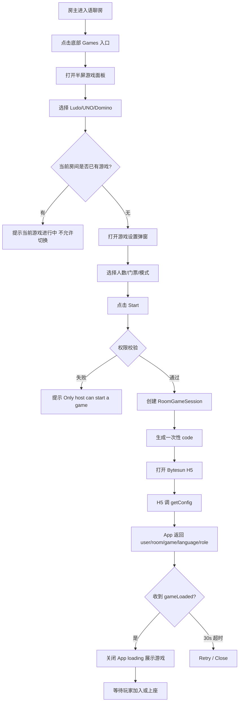
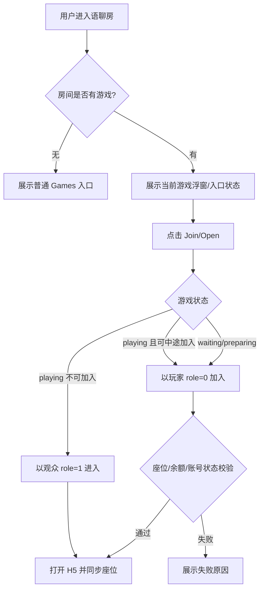
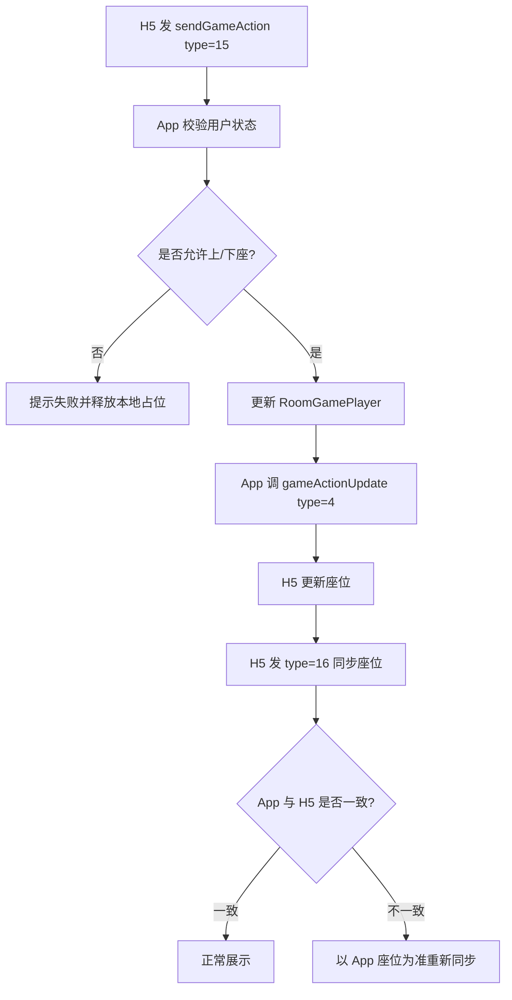
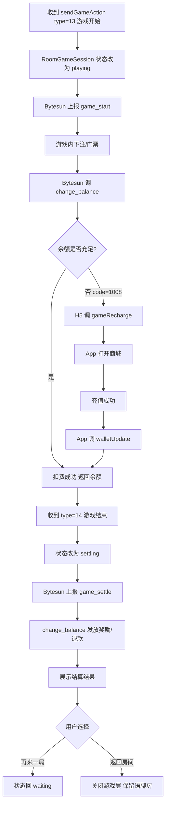
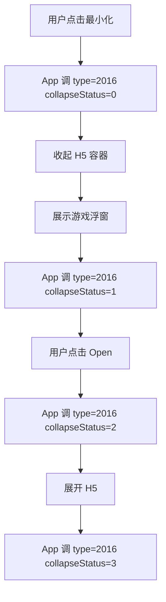
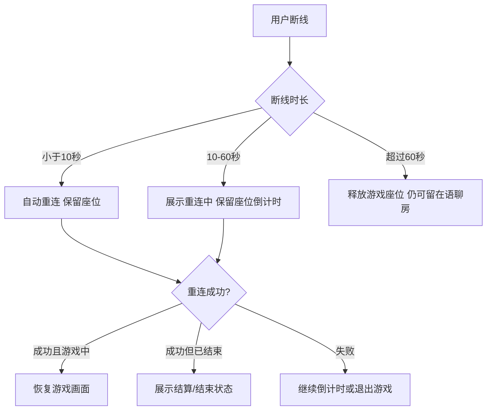
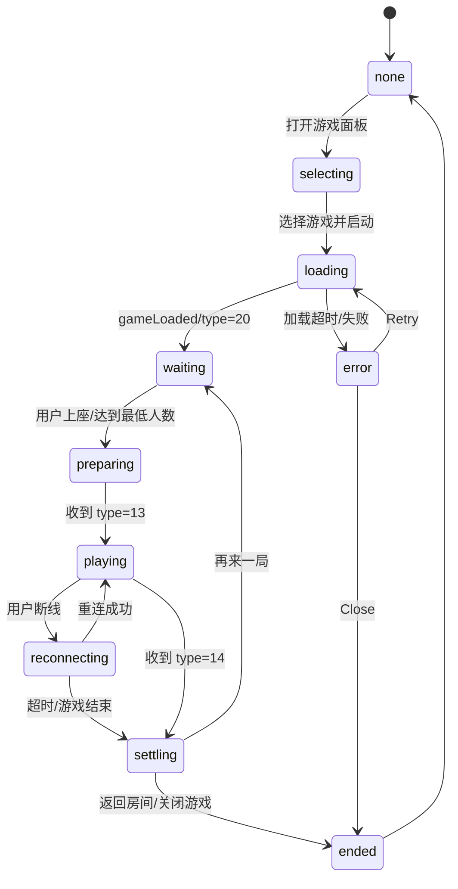

# WeChill 语聊房内三方休闲游戏接入 PRD

> 版本：v1.0 可评审版  
> 方案口径：在现有语聊房内直接调起 Bytesun 三方休闲游戏，不以新增独立游戏房类型作为本期主路径  
> 适用区域：MENA / 中东语聊房场景  
> 适用游戏：Ludo、UNO、Domino、8 Ball、Carrom、Snake & Ladder、Bingo 等，最终以 Bytesun 可提供游戏清单为准  
> 参考资料：产品方案、BytesunGame 语聊房模式对接文档 1.0.7、两份游戏房 PRD、附件页面截图

---

## 1. 项目概述

### 1.1 背景

中东语聊房用户对轻社交、陪伴、多人休闲游戏接受度较高。当前语聊房主要围绕语音聊天、送礼、房间互动展开，用户在房间内的持续互动方式较单一。

本期通过接入 Bytesun 三方休闲游戏，在不改变现有语聊房基础模型的前提下，在房间内增加游戏入口。用户可在当前语聊关系链中直接打开、加入、观战和最小化游戏，实现：

```text
进入语聊房 -> 点击游戏入口 -> 选择游戏 -> 设置局参数 -> 全屏进入游戏 -> 边语音边玩 -> 结算后回到房间
```

本方案重点是把三方游戏做成语聊房内的互动插件，而不是第一阶段重做独立游戏房频道或独立游戏 App。

### 1.2 一句话定位

让房主在当前语聊房内一键开启休闲游戏，让房间成员不离开房间即可一起玩、一起聊、一起结算。

### 1.3 产品目标

| 目标 | 说明 |
|---|---|
| 提升房间停留 | 游戏补充语聊房持续互动场景，提升用户留房时长 |
| 提升房间活跃 | 房主、管理员可组织用户开局，普通用户可加入和观战 |
| 提升付费转化 | 游戏内可消耗金币或门票，并承接余额不足充值 |
| 降低接入风险 | 不改现有语聊房主链路，优先以 WebView/H5 插件方式落地 |
| 适配中东市场 | 优先接入 Ludo、UNO、Domino 等区域认知强的游戏 |

### 1.4 核心结论

本期采用：

```text
Discover Games/Activity 导流
+
语聊房内 Games 入口
+
房内半屏游戏列表
+
单游戏设置弹窗
+
全屏三方 H5 游戏层
+
最小化浮窗
```

本期不采用：

```text
新增独立 game_room 房间类型作为主链路
```

后续可以在数据验证后，把“正在玩游戏的语聊房”沉淀为 Game Rooms 列表、随机匹配、专用游戏房、锦标赛等能力。

---

## 2. 产品范围

### 2.1 P0 本期必做

| 模块 | 范围 |
|---|---|
| Discover Games 页面 | 底部 Discover 第二 Tab 下新增 Games / Activity 顶部 Tab，展示推荐游戏和正在游戏的房间 |
| Activity 页面 | 展示游戏活动 Banner / Hot Events，支持后台配置 |
| 房间内游戏入口 | 语聊房底部工具栏增加 Games 入口，右侧可保留快捷入口 |
| 房内游戏面板 | 点击入口后展示半屏游戏面板，包含休闲游戏、活动、动态表情等 Tab |
| 游戏设置弹窗 | 选择游戏后展示该游戏的设置页，由游戏配置决定参数项 |
| 游戏全屏容器 | WebView/WKWebView 全屏打开 Bytesun H5，保留语聊房顶部/底部安全区浮层 |
| 游戏状态同步 | 处理加载、开始、结束、座位同步、上座失败、踢人、最小化 |
| 余额与结算 | 支持 get_user_info、change_balance、余额不足拉起充值、walletUpdate |
| 后台配置 | 游戏上下架、地区端控制、入口开关、活动配置、接口配置 |
| 数据与监控 | 核心埋点、游戏记录、结算记录、异常监控 |
| 首批游戏联调 | Ludo + UNO 至少 2 个游戏跑通，Domino/8 Ball 视资源进入灰度 |

### 2.2 P1 后续增强

| 模块 | 范围 |
|---|---|
| More Games 全量游戏库 | 按分类展示更多游戏，支持下载态/维护态/灰态 |
| 邀请与分享 | 房内邀请、好友邀请、WhatsApp 分享、深链拉起 |
| 你画我猜 | 支持 type=22 / type=2014 聊天双向同步与内容审核 |
| 随机匹配 | 按游戏、语言、地区、门票匹配用户，进入已有语聊房或等待房 |
| 玩法融合 | Lucky Pocket、龙蛋贡献、CP 亲密值、游戏任务 |

### 2.3 P2 暂不进入本期

| 模块 | 原因 |
|---|---|
| 独立游戏房房间类型 | 改动房间模型、推荐流、榜单和权限，风险较高 |
| AI/机器人补位 | 需 Bytesun 明确支持能力和结算上报方式 |
| RTC 推理游戏 | 涉及游戏内 RTC、麦克风同步、音频权限和更复杂风控 |
| 锦标赛/排位/段位 | 需要完整赛制、风控、排行榜、奖励体系 |
| 真钱下注或提现 | 合规风险高，本期仅平台金币/免费娱乐 |

---

## 3. 用户角色与权限

### 3.1 用户角色

| 角色 | Bytesun role | 权限 |
|---|---:|---|
| 房主/主持人 | 2 | 可开启游戏、关闭游戏、切换下一局、踢出游戏座位、调整局参数 |
| 管理员 | 0 或 2 | 默认可加入和观战；是否可开启/关闭由后台配置 |
| 普通用户 | 0 | 可查看游戏、加入、上座、准备、观战、送礼、聊天 |
| 观众/游客 | 1 | 可观战、聊天、送礼，默认不可上座 |
| 审核账号 | 按后台策略 | 可隐藏入口、隐藏金币局、只展示低风险内容 |

### 3.2 权限矩阵

| 操作 | 房主 | 管理员 | 普通用户 | 观众 |
|---|---:|---:|---:|---:|
| 查看房内 Games 入口 | 是 | 是 | 是 | 是 |
| 打开游戏面板 | 是 | 是 | 是 | 是 |
| 开启游戏 | 是 | 可配置 | 否 | 否 |
| 加入游戏座位 | 是 | 是 | 是 | 否 |
| 观战 | 是 | 是 | 是 | 是 |
| 踢出游戏座位 | 是 | 可配置 | 否 | 否 |
| 关闭当前游戏 | 是 | 可配置 | 否 | 否 |
| 充值 / 刷新余额 | 是 | 是 | 是 | 是 |

### 3.3 权限提示

| 场景 | 文案建议 |
|---|---|
| 普通用户尝试开局 | Only the host can start a game |
| 座位已满 | Game seats are full |
| 游戏已开始不可上座 | Game already started |
| 余额不足 | Insufficient balance |
| 游戏维护 | Game is under maintenance |
| 地区不支持 | This game is not available in your region |

---

## 4. 游戏接入规划

### 4.1 游戏梯队

| 梯队 | 游戏 | 人数 | 时长 | 接入理由 | 备注 |
|---|---|---:|---|---|---|
| P0 | Ludo | 2-4 | 10-20 分钟 | 中东强认知，适合房间破冰 | ludoPlus 支持 hideLobby，game_id 待确认 |
| P0 | UNO | 2-4/6 | 5-15 分钟 | 规则简单，开局快 | 最大人数以 Bytesun 返回为准 |
| P0 可选 | Domino | 2-4 | 5-15 分钟 | 中东传统桌游 | 需确认资源和 game_id |
| P1 | 8 Ball / Carrom | 2 | 5-10 分钟 | 适合短局与观战 | 横竖屏和安全区需验证 |
| P1 | Snake & Ladder | 2-4 | 5-15 分钟 | 附件中已有设置和展示样式参考 | 需确认资源 |
| P1.1 | 你画我猜 | 3-12 | 15-30 分钟 | 适合语聊互动 | 需要聊天双向同步和审核 |
| P2 | 谁是卧底 / 狼人杀 | 4-12 | 15-40 分钟 | 深互动 | 需要 isGameRTC=true 和麦克风同步 |

### 4.2 游戏配置模板

```yaml
GameTemplate:
  game_id: int
  bytesun_name: string
  display_name:
    en: string
    ar: string
  category: enum[board, card, billiards, casual, drawing, rtc]
  icon_url: string
  download_url: string
  game_version: string
  game_mode: [3]
  orientation: enum[portrait, landscape]
  min_players: int
  max_players: int
  duration: string
  spectator_enabled: bool
  hide_lobby_supported: bool
  ticket_slots: list[int]
  region_enabled: list[string]
  platform_enabled: list[iOS, Android]
  review_hidden: bool
  maintenance: bool
  safe_area:
    game_margin_top: float
    game_margin_bottom: float
    game_margin_standard: int
```

### 4.3 MENA 默认参数

| 配置项 | 默认值 | 说明 |
|---|---|---|
| 默认语言 | 阿拉伯语 `7` | Bytesun 多语言表中阿语为 7 |
| 备用语言 | 英语 `2` | 资源缺失时降级 |
| 默认节点 | `gsp=201` | 迪拜 AWS，MENA 优先 |
| 备用节点 | `gsp=101` | 新加坡 |
| 默认货币 | App 金币 | `currencyIcon` 使用外网可访问 60x60 图标 |
| 默认观战 | 开启 | 提升房间围观和送礼 |
| 默认门票 | 免费 | P0 降低合规和转化风险 |

---

## 5. 前台产品设计

### 5.1 整体视觉原则

参考附件截图，采用：

| 元素 | 设计要求 |
|---|---|
| 主背景 | 黑色 / 深色，延续现有 App 内 Games / Activity 样式 |
| 强调色 | 金色高亮，用于选中 Tab、标题、金币和重点按钮 |
| 游戏图标 | 彩色圆角方形图标，4 列宫格 |
| 房间卡片 | 深色卡片，展示房间名、标签、人数、头像队列 |
| 阿语适配 | 文案支持 RTL，数字和游戏英文名保留可读性 |
| 弹窗 | 房内列表使用半屏底部弹窗，单游戏设置使用全屏/近全屏游戏方样式 |

### 5.2 Discover - Games 首页

#### 入口位置

底部导航增加 Discover，位置为第二个：

```text
Party | Discover | Community | Messages | Mine
```

进入 Discover 后顶部使用二级 Tab：

```text
Games | Activity
```

右上角入口：

| 入口 | P0 处理 |
|---|---|
| 游戏任务入口 | 占位，可进入后续任务页 |
| 排行榜入口 | 2.0 做 |
| 搜索入口 | P0 支持搜索用户 ID / 房间 ID，游戏搜索 P1 |

#### 页面结构

```text
Games        Activity                         [任务] [榜单] [搜索]

[用户头像]  金币余额 1466 [+]                 [Private room]

Party Room
[8 Ball] [UNO] [Bingo]
[Domino] [Golden Slot Machine] [More Games]

Game Rooms
[正在玩游戏的语聊房卡片]
[正在玩游戏的语聊房卡片]
[正在玩游戏的语聊房卡片]
```

#### 模块规则

| 模块 | 规则 |
|---|---|
| 用户资产区 | 左侧展示头像，旁边展示游戏金币余额，点击 `+` 打开充值 |
| Private room | P0 解释为“创建/进入我的语聊房并开游戏”，不是独立游戏房类型 |
| Party Room | 默认展示 6 个游戏位，最后一个为 More Games 聚合入口 |
| Game Rooms | 展示当前有游戏会话的语聊房，不改变底层房间类型 |
| 房间排序 | 优先等待中，其次游戏中可观战，再按热度/在线人数排序 |

#### 房间卡片字段

| 字段 | 说明 |
|---|---|
| 房间封面/头像 | 房主或房间封面 |
| 房间名 | 支持阿语/英语 |
| 当前游戏 | Ludo / UNO / Domino |
| 状态标签 | Waiting / Playing / Watching |
| 语言标签 | Arabic / English |
| 玩家数 | 2/4 |
| 在线人数 | 当前房间在线 |
| 麦位头像队列 | 展示活跃用户头像 |

### 5.3 More Games 全部游戏弹窗

点击 Party Room 的 More Games 后，弹出底部游戏列表，参考附件第二张截图。

```text
Game                                      [?]

[Jackpot] [Dragon Tiger] [CrazyFruit] [ShootGoal]
[UnderOver] [Slot777] [Captain Bounty] [Teen Patti]
[Lucky77] [GreedyCat] [KingLamp] [Wise Kingdoms]
```

#### 游戏状态样式

| 状态 | 展示 |
|---|---|
| 未下载 | 正常图标 + 轻量下载标识，点击后开始下载/加载 |
| 下载中 | 图标蒙层 + 进度或 Loading |
| 已下载 | 正常图标，可直接打开 |
| 维护中 | 灰态 + Maintenance |
| 地区不支持 | 默认不展示；运营需要时可灰态 |
| 审核隐藏 | 不展示 |

### 5.4 Activity 活动页

参考附件 Activity 样式，展示平台所有游戏活动和宣传 Banner。

```text
Games       Activity

Hot Events                                      Sorted by count

[NEW] 2026 活动标题
2026/01/01 - 2027/01/01

[NEW] 活动标题
2026/01/05 03:00 - 2027/02/01 05:00

[OLD] Hawa MISS
2026/01/01 - 2026/12/31
```

| 规则 | 说明 |
|---|---|
| 活动来源 | 后台配置游戏活动、平台活动、宣传 Banner |
| 展示顺序 | 若运营配置排序则按排序；否则同数量按时间倒序 |
| 活动状态 | NEW / HOT / OLD / Ended |
| 点击行为 | 进入活动详情页或指定语聊房/游戏 |
| 多语言 | 标题、说明、按钮按用户语言展示 |

### 5.5 房间内 Games 入口

#### 入口位置

在语聊房内增加两个可触达位置：

| 入口 | 说明 |
|---|---|
| 底部工具栏 Games 图标 | 主入口，放在表情/礼物附近，参考附件底部紫色游戏图标 |
| 房间右侧快捷入口 | 当有活动或游戏进行中时展示，点击打开当前游戏或游戏面板 |

#### 无游戏进行时

点击 Games 入口，弹出半屏面板：

```text
休闲游戏 | 活动 | 动态表情

[Black Jack] [Rocket] [Ludo] [UNO]
[Domino] [8 Ball] [Carrom] [More]
```

面板规则：

| 规则 | 说明 |
|---|---|
| 默认 Tab | 休闲游戏 |
| 游戏数量 | 首屏 8-12 个，按后台排序 |
| 活动 Tab | 展示当前房间可参与游戏活动 |
| 动态表情 Tab | 保留现有能力，不与游戏状态互斥 |
| 关闭方式 | 下滑、点击遮罩、返回键 |

#### 有游戏进行时

```text
当前游戏
Ludo · Waiting
Players 2/4

[Join] [Open]

其他游戏
当前房间已有游戏进行中，暂不可切换
```

| 状态 | 主按钮 |
|---|---|
| waiting | Join / Open |
| preparing | Ready / Open |
| playing | Watch / Open |
| settling | Settling |
| ended | Play again / Close |
| error | Retry / Close |

### 5.6 游戏设置弹窗

用户选择某个游戏后，打开该游戏对应设置页。设置页样式由游戏方 H5 或我方容器按游戏配置展示，参考附件中的 8 Ball、UNO、Snake & Ladder 设置页。

#### 通用设置项

| 设置项 | 说明 | P0 |
|---|---|---:|
| 玩家人数 | 1v1 / 2人 / 4人 / 按游戏返回 | 是 |
| 门票/消耗 | Free / 100 / 200 / 500 | 默认 Free |
| 游戏模式 | 经典 / Magic / 快速局等 | 按游戏能力 |
| 是否观战 | 开关 | 默认开 |
| 开始按钮 | 房主/主持人可点 | 是 |
| 退出/离开 | 未开始可退出设置页 | 是 |

#### 权限处理

| 用户 | 设置页展示 |
|---|---|
| 房主 | 可调整参数并 Start |
| 授权管理员 | 可调整参数并 Start |
| 普通用户 | 只读参数，可 Join / Watch |
| 观众 | 只读参数，仅 Watch |

### 5.7 游戏主界面

游戏设置完成后进入全屏 H5 游戏。布局遵循“游戏画面全屏 + 语聊房浮层”的模式。

```text
顶部安全区：
房间名 / 房主头像 / 麦位头像 / 在线人数 / 最小化

中间：
Bytesun 游戏 H5 画面

底部安全区：
语音状态 / 聊天输入 / 礼物 / 表情 / 游戏金币
```

#### 安全区要求

| 区域 | 规则 |
|---|---|
| 顶部 | 避免覆盖麦位头像、房间标题、网络状态 |
| 底部 | 避免覆盖聊天输入、礼物、语音按钮 |
| 游戏操作区 | 对 game_id 以 3 开头的全屏语聊房游戏，URL 需追加 `game_margin_top`、`game_margin_bottom`、`game_margin_standard` |
| 横屏游戏 | P0 谨慎接入，需单独验证旋转、聊天浮层和返回 |

### 5.8 游戏最小化 / 浮窗

用户点击最小化后回到语聊房，游戏以浮窗展示。

```text
Ludo · Playing
4/4
[Open]
```

客户端需通过 `gameActionUpdate type=2016` 通知 H5 容器状态：

| collapseStatus | 说明 |
|---:|---|
| 0 | 开始收起 |
| 1 | 收起完成 |
| 2 | 开始展开 |
| 3 | 展开完成 |

P0 至少支持 0 和 3。

---

## 6. 核心业务流程

### 6.1 房主在房间内开启游戏



### 6.2 普通用户加入当前房间游戏



### 6.3 上座与座位同步



### 6.4 开局、扣费与结算



### 6.5 最小化与恢复



### 6.6 断线重连



### 6.7 关闭与切换游戏

| 场景 | 处理 |
|---|---|
| waiting/preparing 阶段房主关闭 | 关闭 RoomGameSession，释放座位 |
| playing 阶段房主关闭 | 默认不允许；异常时后台或房主二次确认强制结束 |
| 结算完成后换游戏 | 允许从房内面板选择新游戏 |
| 同一房间同时开多个游戏 | P0 不允许，单房间同时只允许一个 RoomGameSession |

---

## 7. 游戏状态设计

### 7.1 RoomGameSession 状态机



### 7.2 状态定义

| 状态 | 英文值 | 说明 | 用户可见操作 |
|---|---|---|---|
| 无游戏 | none | 当前房间没有游戏 | 打开游戏面板 |
| 选择中 | selecting | 用户浏览游戏列表 | 选择游戏 |
| 加载中 | loading | WebView/H5 加载 | 取消、等待 |
| 等待中 | waiting | 游戏已加载，等待加入 | Join、Invite、Open |
| 准备中 | preparing | 用户已上座或准备 | Ready、Cancel、Kick |
| 游戏中 | playing | 游戏进行中 | Open、Watch、Gift、Chat |
| 重连中 | reconnecting | 用户或游戏连接恢复 | 等待、退出 |
| 结算中 | settling | 等待结算结果 | 等待 |
| 已结束 | ended | 本局结束 | 再来一局、返回房间 |
| 异常 | error | 加载或同步异常 | Retry、Close |

### 7.3 房间内展示规则

| 状态 | 房内入口展示 |
|---|---|
| none | 展示 Games 图标，无状态角标 |
| loading | 展示 Loading 小标 |
| waiting/preparing | 展示游戏名 + Join |
| playing | 展示游戏名 + Playing / Watch |
| settling | 展示 Settling |
| ended | 3 秒后隐藏，或展示 Play again |
| error | 展示 Retry / Close |

---

## 8. 座位、麦位与声音规则

### 8.1 游戏座位与语聊麦位

| 规则 | 说明 |
|---|---|
| 游戏座位独立于语聊麦位 | 用户不上麦也可以上游戏座位 |
| 语聊麦位不因游戏改变 | 原有麦位、主持、管理员权限保持 |
| 游戏座位以 App 最终状态为准 | 与 H5 冲突时，App 通过 type=4 反向同步 |
| 一个用户只能占一个游戏座位 | 防重复占位和多端异常 |
| 座位满员后可观战 | Join 变为 Watch |
| 游戏中不可随意换座 | 除非游戏本身明确支持 |
| 游戏结束释放座位 | 再来一局重新进入 waiting/preparing |

### 8.2 上座失败原因

| 原因 | 前端提示 |
|---|---|
| 座位已满 | Game seats are full |
| 游戏已开始 | Game already started |
| 余额不足 | Insufficient balance |
| 用户被封禁 | Account restricted |
| 地区受限 | Region not supported |
| 网络异常 | Network error, try again |
| 重复上座 | You are already seated |

### 8.3 声音策略

| 场景 | 策略 |
|---|---|
| Ludo/UNO 等普通休闲游戏 | 保留我方语聊房 RTC，默认降低或关闭游戏 BGM，保留音效 |
| 用户手动开关 | 使用 `soundUpdate` 控制 `bgmStatus`、`seStatus` |
| 游戏查询音效状态 | H5 发 `gameActionUpdate type=2012` 后，App 通过 `sendGameAction type=21` 返回 |
| RTC 推理游戏 | P2 才接入，使用 `isGameRTC=true` 和 `type=3001` 同步麦克风/扬声器 |

---

## 9. 货币与结算规则

### 9.1 货币口径

P0 建议使用 App 现有金币作为游戏货币：

```text
语聊房金币 = 游戏金币
```

后续如需独立游戏币，可通过 `currency_type` 和 `balance_list` 扩展。

### 9.2 消耗场景

| 场景 | diff_msg | currency_diff |
|---|---|---:|
| 上座门票 / 下注 | bet | 负值 |
| 游戏结算奖励 | result | 正值 |
| 异常退款 | refund | 正值 |

### 9.3 余额不足

```text
用户操作需要扣费
-> Bytesun 调 change_balance
-> 我方余额不足返回 code=1008
-> H5 调 gameRecharge
-> App 打开商城
-> 用户充值成功
-> App 调 walletUpdate
-> H5 刷新余额
```

### 9.4 结算展示

游戏结束后，在房间聊天区插入系统消息，并在游戏层展示结算页。

英文示例：

```text
Ludo game ended.
Winner: Ahmed
Reward: 1,200 coins
```

阿语环境按 RTL 展示，数字、金币图标和英文游戏名需保持可读。

### 9.5 结算安全

| 要求 | 说明 |
|---|---|
| 订单幂等 | `order_id` 唯一，同一订单重复请求必须返回同一结果 |
| 用户级锁 | `change_balance` 需对单用户加锁，避免一秒内多次扣款错账 |
| 成功码 | 只有真正成功时 code 才能返回 0 |
| 错误码 | 余额不足必须返回 1008 |
| 补偿队列 | 结算失败进入后台补偿和对账 |

---

## 10. Bytesun 技术接入要求

### 10.1 接入方式

Bytesun 文档支持两种加载方式：

| 方式 | 说明 | P0 建议 |
|---|---|---|
| URL 直连 | 直接加载游戏 H5 URL | 联调和灰度优先 |
| Zip 本地包 | 下载 Zip、按版本解压到本地路径打开 | 稳定后用于性能优化 |

标准流程：

```text
我方调用 gamelist / one_game_info
-> 获取 game_id、preview_url、game_version、download_url、orientation、safe_height
-> 客户端按版本判断是否更新
-> 打开 URL 或本地解压路径
-> H5 调 getConfig
-> 游戏内通过 JSBridge 与 App 通信
```

### 10.2 getConfig

H5 调用 App `getConfig`，App 返回 JSON 字符串。

```json
{
  "appChannel": "wechill",
  "appId": 88888888,
  "userId": "534206265",
  "code": "one_time_code",
  "roomId": "voice_room_id",
  "gameRoomId": "",
  "gameMode": "3",
  "language": "7",
  "gameConfig": {
    "sceneMode": 0,
    "currencyIcon": "https://cdn.xxx.com/coin.png"
  },
  "gsp": 201,
  "role": 0
}
```

| 字段 | 要求 |
|---|---|
| `appChannel` | Bytesun 分配，后台配置 |
| `appId` | Bytesun 商户 ID |
| `userId` | 我方用户 ID |
| `code` | 一次性认证令牌，必须唯一；换取 ss_token 后不可再次使用 |
| `roomId` | 当前语聊房 ID |
| `gameRoomId` | 保留字段，传空字符串 |
| `gameMode` | 语聊房场景固定传 `"3"` |
| `language` | 阿语 `7`，英语 `2` |
| `gameConfig.sceneMode` | 场馆级别，默认 0 |
| `gameConfig.currencyIcon` | 货币图标，外网可访问 URL，60x60 |
| `gsp` | MENA 默认 201，备用 101 |
| `role` | 0 正常用户，1 游客/观众，2 主持人 |

### 10.3 H5 调 App

| 方法 / type | 场景 | P0 处理 |
|---|---|---|
| `getConfig` | 获取配置 | 必须 |
| `destroy` | 游戏主动关闭 WebView | 语聊房模式通常不依赖，兼容处理 |
| `gameRecharge` | 余额不足或点击金币 | 打开商城 |
| `gameLoaded` | 游戏加载完毕 | 关闭 App loading |
| `sendGameAction type=7` | 点击用户头像 | 打开资料卡 |
| `type=13` | 游戏开始 | 状态改为 playing |
| `type=14` | 游戏结束 | 状态改为 settling，等待结算 |
| `type=15` | 上/下游戏座位 | 校验后同步 |
| `type=16` | 座位信息同步 | 刷新座位；冲突时以 App 为准 |
| `type=17` | 发起踢人 | 房主/管理员二次确认后回传 |
| `type=18` | 上座失败 | 释放座位并提示 |
| `type=20` | 语聊房游戏准备完成 | 可执行自动同步 |
| `type=21` | 音乐音效状态返回 | 同步设置面板 |
| `type=22` | 画猜消息到 App 聊天 | P1.1，需审核 |
| `type=23` | 游戏基础参数 | 更新 isMall 等配置 |
| `type=30` | 最大人数/门票变更 | 更新 peopleNum、ticketSlots |
| `type=3001` | RTC 麦克风/扬声器同步 | P2 RTC 游戏 |

### 10.4 App 调 H5

| 方法 / type | 场景 | P0 处理 |
|---|---|---|
| `walletUpdate` | 充值或余额变化 | 通知游戏刷新余额 |
| `gameActionUpdate type=4` | 操作游戏座位 | 上座、下座、同步座位 |
| `type=5` | 变更用户身份 | 玩家、观众、主持人切换 |
| `type=6` | 返回踢人结果 | 告知 H5 成功或失败 |
| `type=2012` | 查询音效状态 | 游戏请求后返回 type=21 |
| `type=2014` | App 聊天同步到画猜 | P1.1 |
| `type=2016` | 最小化状态 | 通知 H5 收起/展开 |
| `soundUpdate` | 设置背景音乐和音效 | 语音优先 |

### 10.5 服务端 API

我方需按 Bytesun 规范提供以下接口：

| 接口 | 用途 | 关键要求 |
|---|---|---|
| `/v1/api/get_sstoken` | Bytesun 用一次性 code 换长期 ss_token | code 一次性消费，重复使用返回 1001 |
| `/v1/api/get_user_info` | 查询用户昵称、头像、余额、用户类型 | 返回 balance，可扩展 balance_list |
| `/v1/api/update_sstoken` | ss_token 过期时刷新 | 若 ss_token 非长期有效则必须实现 |
| `/v1/api/change_balance` | 下注、结算、退款 | 用户级锁、order_id 幂等、余额不足 1008 |
| 游戏状态上报接口 | 接收 game_start / game_settle | 落库，用于记录、结算、风控、看板 |

### 10.6 签名与安全

服务端通信使用 HTTP POST + JSON，双方通过公共参数鉴权：

| 参数 | 说明 |
|---|---|
| `signature_nonce` | 随机字符串，15 秒内不能重复 |
| `timestamp` | 请求时间戳，超过 15 秒报错 |
| `signature` | `md5(signature_nonce + AppKey + timestamp)`，小写 32 位 |
| `provider_name` | 请求者身份描述，可选 |

AppKey 必须严格保密，不能下发客户端。

### 10.7 游戏信息接口

| 接口 | 用途 |
|---|---|
| `/v1/api/one_game_info` | 获取单个游戏信息 |
| `/v1/api/gamelist` | 获取游戏信息列表 |

返回字段需落入后台游戏配置：

```text
game_id, name, preview_url, game_version, download_url,
game_mode, game_orientation, safe_height, venue_level
```

待确认：Bytesun 文档字段说明中 `game_list_type` 写 2，示例传 3，V0 必须确认真实取值。

### 10.8 URL 特殊参数

| 参数 | 适用 | 说明 |
|---|---|---|
| `game_margin_top` | game_id 以 3 开头的全屏语聊房游戏 | 顶部覆盖区域百分比 |
| `game_margin_bottom` | 同上 | 底部覆盖区域百分比 |
| `game_margin_standard` | 同上 | 0 以底部为准，1 以顶部为准 |
| `hideLobby=true` | DominoPlus / ludoPlus / unoPlus | 隐藏游戏大厅，需要我方服务端调用快速开始 API，API 需 Bytesun 补充 |
| `antiAddictionImg=true` | 中文公告/版号 | MENA 默认不启用 |
| `isGameRTC=true` | 狼人杀、谁是卧底 | P2，需音频权限 |
| `language=0/2` | Loading 页面语言 | Bytesun 文档说明目前 Loading 支持中文/英文 |

### 10.9 系统要求

| 平台 | 要求 |
|---|---|
| iOS | iOS 11+，建议 WKWebView |
| Android | Android 5+，WebView 允许必要的本地资源加载 |
| 调试 | 白屏、停留 Loading 需输出具体 WebView 日志和错误截图 |

---

## 11. 后台管理 PRD

### 11.1 菜单结构

```text
运营管理
└── 游戏中心
    ├── 游戏接入配置
    ├── 游戏配置列表
    ├── 游戏入口配置
    ├── 房间游戏监控
    ├── 游戏活动管理
    ├── 游戏记录
    ├── 结算管理
    ├── 风控审核
    ├── 数据看板
    └── 操作日志
```

### 11.2 游戏接入配置

| 字段 | 说明 |
|---|---|
| Bytesun appChannel | 渠道标识 |
| Bytesun appId | 商户 ID |
| AppKey | 签名密钥，严格保密 |
| 测试 API 地址 | 联调环境 |
| 正式 API 地址 | 生产环境 |
| 游戏列表同步开关 | 是否自动同步 Bytesun 游戏 |
| CDN 加速域名 | 游戏包回源和预热 |
| 默认 gsp 节点 | MENA 默认 201 |
| 默认语言 | 阿语 7 |
| 游戏包更新策略 | 自动 / 手动 / 灰度 |
| URL 直连开关 | 是否允许直接打开 H5 URL |
| Zip 本地包开关 | 是否允许下载本地包 |

### 11.3 游戏配置列表

| 字段 | 说明 |
|---|---|
| 游戏 ID | Bytesun `game_id` |
| 游戏名称 | 多语言展示名 |
| Bytesun 游戏名 | 如 ludoPlus / unoPlus |
| 游戏分类 | 桌游、卡牌、台球、休闲、画猜、RTC |
| 游戏 icon | `preview_url` |
| 游戏版本 | `game_version` |
| 下载地址 | `download_url` |
| 游戏方向 | 竖屏 / 横屏 |
| 支持模式 | 是否包含 `game_mode=3` |
| 安全高度 | `safe_height` |
| 安全区参数 | top / bottom / standard |
| 最小/最大人数 | 可由 type=30 更新 |
| 门票档位 | Free / 100 / 200 / 500 |
| 是否支持观战 | 是 / 否 |
| 是否支持 hideLobby | 是 / 否 |
| 是否支持聊天同步 | 画猜类 |
| 是否支持 RTC | 推理类 |
| 支持地区 | GCC / Egypt / Iraq 等 |
| 支持端 | iOS / Android |
| 上架状态 | 上架 / 下架 / 维护 |
| 是否推荐 | 是否展示在 Party Room |
| 排序权重 | 越大越靠前 |
| 审核隐藏 | iOS 审核账号隐藏 |

### 11.4 游戏入口配置

| 配置项 | 默认值 | 说明 |
|---|---:|---|
| Discover 展示 Games | 开 | 控制底部发现页入口 |
| Activity Tab 展示 | 开 | 控制活动页 |
| 房间内 Games 按钮 | 开 | 控制房间底部工具栏 |
| 房间右侧快捷入口 | 开 | 游戏进行中或活动时展示 |
| 新用户延迟展示 | 180 秒 | 可选，降低干扰 |
| 审核用户隐藏入口 | 开 | iOS 审核风险控制 |
| 房间列表展示游戏标签 | 开 | Game Rooms 列表聚合 |
| 游戏中允许切换游戏 | 关 | P0 不允许 |
| 允许观战 | 开 | 增加参与感 |

### 11.5 房间游戏监控

| 字段 | 说明 |
|---|---|
| 语聊房 ID | 当前房间 ID |
| 房主 ID/昵称 | 房主信息 |
| 当前游戏 | Ludo / UNO / Domino |
| RoomGameSession ID | 我方游戏会话 ID |
| game_round_id | Bytesun 本局 ID |
| 游戏状态 | waiting / preparing / playing / settling / ended / error |
| 当前玩家数 | 2/4 |
| 当前观战数 | 10 |
| 开始时间 | start_at |
| 累计消耗 | bet 总额 |
| 累计奖励 | result 总额 |
| 异常状态 | 白屏、加载失败、结算失败、座位异常 |

操作：

| 操作 | 说明 |
|---|---|
| 查看详情 | 查看本局玩家、座位、结算、日志 |
| 强制结束 | 异常时使用，需二次确认和操作日志 |
| 下架游戏 | 快速风控 |
| 查看回调日志 | 查看 Bytesun 与我方请求 |
| 导出记录 | 运营和财务对账 |

### 11.6 游戏活动管理

| 字段 | 说明 |
|---|---|
| 活动标题 | 多语言 |
| 活动 Banner | 按端上传 |
| 活动时间 | 开始/结束 |
| 活动状态 | NEW / HOT / OLD / Ended |
| 关联游戏 | 一个或多个 game_id |
| 关联地区 | 地区/语言 |
| 跳转目标 | 活动详情、房间、游戏、充值 |
| 排序权重 | 与 Activity 列表排序相关 |

### 11.7 结算管理

| 字段 | 说明 |
|---|---|
| 订单 ID | `order_id` |
| 用户 ID | `user_id` |
| 游戏 ID | `game_id` |
| 房间 ID | `room_id` |
| 本局 ID | `game_round_id` |
| 变更金额 | `currency_diff` |
| 变更原因 | bet / result / refund |
| 前余额 | before_balance |
| 后余额 | currency_balance |
| Bytesun 请求时间 | change_time_at |
| 我方处理时间 | processed_at |
| 状态 | 成功 / 失败 / 重试中 / 补偿完成 |
| 操作 | 查看、补偿、导出 |

---

## 12. 数据模型

### 12.1 RoomGameSession

```yaml
RoomGameSession:
  session_id: string
  voice_room_id: string
  game_id: int
  game_name: string
  game_version: string
  game_url: string
  game_mode: "3"
  owner_id: string
  status: enum[loading, waiting, preparing, playing, reconnecting, settling, ended, error]
  config:
    min_players: int
    max_players: int
    ticket_slot: int
    spectator_enabled: bool
    gsp: int
    language: string
    safe_area:
      game_margin_top: float
      game_margin_bottom: float
      game_margin_standard: int
  game_round_id: string | null
  started_at: timestamp | null
  ended_at: timestamp | null
  created_at: timestamp
  updated_at: timestamp
```

### 12.2 RoomGamePlayer

```yaml
RoomGamePlayer:
  session_id: string
  voice_room_id: string
  game_round_id: string | null
  user_id: string
  seat: int | null
  role: int
  is_ready: bool
  is_online: bool
  is_ai: bool
  score: int
  rank: int
  join_source: enum[room_panel, discover_game_rooms, invite, deeplink, rejoin]
  joined_at: timestamp
  left_at: timestamp | null
```

### 12.3 GameRecord

```yaml
GameRecord:
  record_id: string
  session_id: string
  game_round_id: string
  voice_room_id: string
  game_id: int
  players: list[PlayerRecord]
  winner_ids: list[string]
  started_at: timestamp
  ended_at: timestamp
  duration_seconds: int
  bets_total: int
  rewards_total: int
  refund_total: int
  ai_count: int
  real_player_count: int
  risk_status: string
```

### 12.4 GameBalanceOrder

```yaml
GameBalanceOrder:
  order_id: string
  user_id: string
  game_id: int
  voice_room_id: string
  session_id: string
  game_round_id: string
  currency_diff: int
  diff_msg: enum[bet, result, refund]
  before_balance: int
  after_balance: int
  status: enum[success, failed, retrying, compensated]
  bytesun_unique_id: string
  created_at: timestamp
  updated_at: timestamp
```

### 12.5 GameConfig

```yaml
GameConfig:
  game_id: int
  bytesun_name: string
  display_name: object
  category: string
  preview_url: string
  download_url: string
  game_version: string
  game_mode: list[int]
  game_orientation: int
  safe_height: int
  venue_level: list[int]
  status: enum[online, offline, maintenance]
  region_enabled: list[string]
  platform_enabled: list[string]
  sort_weight: int
  review_hidden: bool
  created_at: timestamp
  updated_at: timestamp
```

---

## 13. 数据埋点与指标

### 13.1 核心埋点

| 事件 | 触发时机 |
|---|---|
| `game_entry_show` | Discover 或房内游戏入口曝光 |
| `game_entry_click` | 点击游戏入口 |
| `game_panel_show` | 房内半屏游戏面板展示 |
| `game_tab_click` | 点击休闲游戏/活动/动态表情 |
| `game_item_click` | 点击某个游戏 |
| `game_setting_show` | 游戏设置弹窗展示 |
| `game_start_click` | 点击 Start |
| `game_start_success` | RoomGameSession 创建成功 |
| `game_h5_load_start` | WebView 开始加载 |
| `game_loaded` | 收到 gameLoaded |
| `game_join_click` | 点击 Join |
| `game_join_success` | 加入成功 |
| `game_seat_up` | 上座成功 |
| `game_seat_failed` | 上座失败 |
| `game_start` | 收到 type=13 |
| `game_end` | 收到 type=14 |
| `game_result_view` | 结算页曝光 |
| `game_replay_click` | 点击再来一局 |
| `game_recharge_open` | 游戏拉起充值 |
| `game_wallet_update` | 充值后刷新余额 |
| `game_minimize` | 游戏最小化 |
| `game_restore` | 游戏恢复 |
| `game_error` | 加载、回调、结算等异常 |

### 13.2 业务指标

| 指标 | 口径 |
|---|---|
| 游戏入口点击率 | `game_entry_click / game_entry_show` |
| 面板游戏点击率 | `game_item_click / game_panel_show` |
| 开局成功率 | `game_start_success / game_start_click` |
| H5 加载成功率 | `game_loaded / game_h5_load_start` |
| 平均加载耗时 | `gameLoaded 时间 - load_start 时间` |
| 加入成功率 | `game_join_success / game_join_click` |
| 上座失败率 | `game_seat_failed / game_seat_up_attempt` |
| 游戏完成率 | `game_end / game_start` |
| 人均游戏局数 | 总游戏局数 / 游戏用户数 |
| 人均房间停留 | 游戏用户房内停留时长 |
| 游戏消耗 | bet 总额 |
| 游戏奖励 | result 总额 |
| 游戏带动充值 | 来源为 gameRecharge 的充值金额 |
| 结算失败率 | failed balance orders / all balance orders |
| 白屏率 | H5 加载失败或超时 / load_start |

### 13.3 看板目标

| 指标 | V1 目标 |
|---|---:|
| H5 加载成功率 | > 95% |
| gameLoaded 8 秒内到达率 | > 90% |
| 游戏完成率 | > 90% |
| 上座失败率 | < 3% |
| 结算失败率 | < 0.5% |
| 白屏率 | < 1% |

---

## 14. 异常与边界场景

### 14.1 房间相关

| 场景 | 处理 |
|---|---|
| 房主离开房间 | 游戏继续；管理员接管；无管理员则本局结束后不可再开 |
| 房间关闭 | 强制结束游戏，按状态结算或退款 |
| 房间被封禁 | 立即关闭游戏入口和当前游戏层 |
| 用户被踢出房间 | 同步退出游戏，释放座位 |
| 用户断线 | 保留座位 60 秒，超时释放 |
| 房间切后台 | 游戏继续，前台回来恢复状态 |
| 房间内多人同时开游戏 | 服务端只允许一个 session，后发请求失败 |

### 14.2 游戏相关

| 场景 | 处理 |
|---|---|
| 游戏加载失败 | Retry / Close，记录 WebView 日志 |
| 游戏维护 | 灰态，不可点击 |
| 游戏中切换游戏 | 不允许，提示当前游戏进行中 |
| H5 未回调 gameLoaded | 30 秒超时，允许重试 |
| type=16 座位冲突 | 以 App 座位为准，type=4 反向同步 |
| type=18 上座失败 | 提示失败原因并释放本地占位 |
| H5 崩溃 | 展示恢复/关闭，保留房间 |
| 结算上报延迟 | 展示结算中，后台轮询或补偿 |

### 14.3 货币与账号

| 场景 | 处理 |
|---|---|
| 余额不足 | 返回 1008，H5 调 gameRecharge |
| 重复扣款 | order_id 幂等，同订单不重复扣 |
| 并发扣款 | 用户级锁 |
| 结算失败 | 进入补偿队列，后台可补偿 |
| 用户黑名单 | get_user_info 返回限制状态，前端提示账号受限 |
| 受限 IP | 返回错误码，提示地区/网络受限 |

### 14.4 审核与合规

| 场景 | 处理 |
|---|---|
| iOS 审核账号 | 后台可隐藏 Games 入口或只展示免费休闲游戏 |
| 涉博彩误解 | 避免 gambling、bet、win cash 等文案 |
| Slots 类游戏 | P0 不推荐公开展示，需单独合规评审 |
| 未成年人 | 可配置时长提醒、地区限制、账号限制 |

---

## 15. 多语言与文案

### 15.1 常用英文

| 中文 | 英文 |
|---|---|
| 游戏 | Games |
| 活动 | Activity |
| 更多游戏 | More Games |
| 休闲游戏 | Casual Games |
| 开始游戏 | Start Game |
| 加入游戏 | Join Game |
| 观战 | Watch |
| 再来一局 | Play Again |
| 游戏中 | Playing |
| 等待中 | Waiting |
| 结算中 | Settling |
| 座位已满 | Game seats are full |
| 余额不足 | Insufficient balance |
| 游戏加载失败 | Game failed to load |
| 只有房主可以开启游戏 | Only the host can start a game |

### 15.2 常用阿语

| 中文 | 阿语 |
|---|---|
| 游戏 | الألعاب |
| 活动 | الفعاليات |
| 更多游戏 | المزيد من الألعاب |
| 休闲游戏 | ألعاب خفيفة |
| 开始游戏 | ابدأ اللعبة |
| 加入游戏 | انضم إلى اللعبة |
| 观战 | مشاهدة |
| 再来一局 | العب مرة أخرى |
| 游戏中 | قيد اللعب |
| 等待中 | في الانتظار |
| 结算中 | جاري احتساب النتيجة |
| 座位已满 | المقاعد ممتلئة |
| 余额不足 | الرصيد غير كافٍ |
| 游戏加载失败 | فشل تحميل اللعبة |
| 只有房主可以开启游戏 | يمكن لمالك الغرفة فقط بدء اللعبة |

### 15.3 Bytesun 语言代码

| 语言 | code | P0 优先级 |
|---|---:|---|
| 阿拉伯语 | 7 | 高 |
| 英文 | 2 | 高 |
| 土耳其语 | 10 | 中 |
| 乌尔都语 | 11 | 中 |
| 波斯语 | 19 | 低 |

---

## 16. 开发周期与版本规划

### 16.1 V0 技术预研

周期：1-2 周。

| 工作 | 产出 |
|---|---|
| Bytesun 测试环境联调 | 接口连通性报告 |
| H5 / Zip 加载验证 | Android / iOS 加载方案 |
| JSBridge 验证 | `getConfig`、`gameLoaded`、`sendGameAction`、`gameActionUpdate` 跑通 |
| 一次性 code 换 ss_token | 鉴权方案和错误码 |
| 钱包接口预研 | `change_balance` 幂等和并发锁方案 |
| 安全区验证 | game_margin 参数配置方案 |
| Ludo / UNO 资源确认 | game_id、版本、人数、观战能力清单 |

V0 出口：

- Ludo 或 UNO 至少一个游戏在语聊房模式可加载。
- 服务端能完成 `get_sstoken`、`get_user_info`、`change_balance` 测试。
- 明确 Bytesun 待确认问题和绕行方案。

### 16.2 V1 MVP 开发排期

周期：4-5 周。

| 周期 | 客户端 | 服务端 | 后台 / 数据 | 验收重点 |
|---|---|---|---|---|
| 第 1 周 | Discover Games/Activity、房内 Games 入口、半屏面板 | RoomGameSession 创建/查询/关闭 | 游戏接入配置、入口配置 | 能在房内选择游戏 |
| 第 2 周 | H5 容器、Loading、getConfig、gameLoaded | code、ss_token、用户信息接口 | 游戏配置列表、游戏同步 | 能加载 Ludo/UNO |
| 第 3 周 | 设置弹窗、上座/下座、观战、声音控制 | 座位状态、type=13/14/15/16/18 处理 | 房间游戏监控、操作日志 | 能进入 waiting/playing |
| 第 4 周 | 结算页、再来一局、充值、最小化、异常提示 | change_balance、结算记录、补偿队列 | 结算管理、基础看板 | 能完整完成一局并结算 |
| 第 5 周 | 兼容、性能、灰度、埋点补齐 | 对账、风控、监控告警 | 数据验收、运营配置 | 达到上线标准 |

### 16.3 后续版本

| 版本 | 周期 | 范围 |
|---|---|---|
| V1.1 | 2-3 周 | 你画我猜、聊天同步、内容审核、邀请分享、深链 |
| V2 | 4 周 | 随机匹配、等待页、匹配队列、座位预占、超时降级 |
| V2.1 | 3 周 | Lucky Pocket、龙蛋贡献、CP 亲密值、游戏任务 |
| V3 | 4-6 周 | RTC 推理游戏、AI 补位、VIP 匹配、锦标赛、段位 |

---

## 17. 上线策略

### 17.1 灰度节奏

| 阶段 | 范围 | 目标 |
|---|---|---|
| 第 1 阶段 | 内部测试房间 + 白名单账号 | 验证加载、桥接、结算 |
| 第 2 阶段 | Android 小流量 | 验证性能、白屏率、完成率 |
| 第 3 阶段 | iOS 非审核版本灰度 | 验证审核策略和 WebView |
| 第 4 阶段 | 中东重点国家 | 验证阿语、gsp=201、转化 |
| 第 5 阶段 | 全量开放 | 运营活动放量 |

### 17.2 首批推荐游戏

建议首批上线 3-5 个，控制体验和结算风险：

```text
Ludo
UNO
Domino
8 Ball
Carrom
```

若 Slots / Jackpot 类游戏进入列表，需单独合规评审，默认不作为首批强推荐。

---

## 18. 验收标准

### 18.1 产品验收

- 用户可以从 Discover Games 看到推荐游戏和正在玩游戏的语聊房。
- 用户可以从房间内 Games 入口打开半屏游戏面板。
- 房主可以选择游戏并打开设置弹窗。
- 房主可以开始 Ludo / UNO 至少一个游戏。
- 普通用户可以加入、观战和返回房间。
- 游戏开始和结束状态能同步到 App。
- 用户可以完成一局并看到结算结果。
- 余额不足时可以打开商城，充值后刷新游戏余额。
- 最小化后可在语聊房内通过浮窗恢复游戏。
- 加载失败、上座失败、游戏维护、用户封禁、地区限制均有明确提示。

### 18.2 技术验收

- `getConfig` 字段完整，`gameMode=3`。
- `code` 一次性消费，重复使用不可成功。
- `/v1/api/get_sstoken`、`get_user_info`、`change_balance` 可用。
- `change_balance` 支持订单幂等和用户级并发锁。
- `gameLoaded`、`type=13`、`type=14`、`type=15`、`type=16`、`type=18` 可正确处理。
- 游戏开始和结算上报可落库。
- WebView / Zip 加载失败有日志、重试和降级。
- 游戏包版本可后台控制。
- 安全区参数不会遮挡游戏主要操作区。

### 18.3 数据验收

- 入口曝光、点击、加载、开局、加入、上座、结束、结算、异常均有埋点。
- 游戏记录可按房间、游戏、用户、时间查询。
- 结算记录可按订单、用户、游戏局查询。
- 看板可查看启动成功率、加载耗时、开局转化、完成率、结算失败率、上座失败率。
- 管理员操作日志可追踪。

---

## 19. 风险与缓解

| 风险 | 影响 | 缓解 |
|---|---|---|
| Bytesun 服务不稳定 | 游戏无法加载或结算失败 | URL/Zip 双方案、重试、下架开关、监控告警 |
| 游戏包加载慢 | 进入转化下降 | CDN 预热、本地包、Loading 进度、首屏资源优化 |
| 座位不同步 | 用户认知混乱 | App 状态为准，type=4 反向同步 |
| 结算并发 | 错账 | 用户级锁、订单幂等、补偿队列、对账 |
| 语音和游戏声音冲突 | 体验差 | 语音优先，默认降低 BGM，用户可控制 |
| 低端机性能 | 卡顿 / 崩溃 | 机型监控、降级策略、必要时屏蔽高负载游戏 |
| 涉赌理解 | 审核和合规风险 | P0 免费/低风险金币局，避免博彩文案，不展示真钱收益 |
| 作弊串通 | 破坏公平和经济系统 | 同设备/IP、异常胜率、固定组合检测 |
| 内容安全 | 聊天或画猜违规 | 复用语聊房审核，画猜放 V1.1 并加审核 |

---

## 20. 待 Bytesun 确认问题

| # | 问题 | 优先级 | 影响 |
|---|---|---|---|
| 1 | Ludo、UNO、Domino、8 Ball、Carrom 的准确 `game_id`、Bytesun 游戏名 | P0 | V0 联调 |
| 2 | `/v1/api/gamelist` 的 `game_list_type` 真实取值是 2 还是 3 | P0 | 游戏同步 |
| 3 | 每个游戏最小人数、最大人数、是否允许中途加入、是否允许观战 | P0 | 设置弹窗和状态 |
| 4 | `type=30` 中 `ticketSlots` 的含义、取值和金额映射 | P0 | 门票和结算 |
| 5 | `hideLobby=true` 后快速开始 API 的路径、参数、鉴权、返回值 | P1 | 快速开局/随机匹配 |
| 6 | Ludo/UNO 是否支持机器人补位，机器人是否以 `is_ai=1` 上报 | P1 | 匹配兜底 |
| 7 | game_id 以 3 开头的游戏是否都必须配置安全区参数 | P0 | 全屏展示 |
| 8 | 画猜类是否完全依赖 App 聊天同步，还是有内置聊天 | P1.1 | 内容审核 |
| 9 | 错误码由 H5 透传还是服务端回调处理 | P0 | 前台提示 |
| 10 | Zip 包 CDN 缓存、版本更新和回滚建议 | P0 | 上线稳定性 |

---

## 21. 评审决策项

评审会上需要明确：

1. V1 首批游戏是否确定为 Ludo + UNO，Domino / 8 Ball 是否进入灰度。
2. Discover Games 是否 P0 全量上线，还是先灰度给重点国家。
3. 房内 Games 入口是否所有语聊房默认开启，还是按房主等级/地区开关。
4. P0 是否启用门票，还是先全部免费。
5. 管理员是否允许开始游戏和关闭游戏，建议默认关闭，由后台配置。
6. 游戏中是否允许礼物和聊天入口，建议保留。
7. 是否允许观战，建议默认允许。
8. Slots / Jackpot 类游戏是否进入 More Games，建议单独合规评审。
9. `hideLobby=true` 是否作为 P1/V2 能力，不阻塞 V1。
10. 随机匹配、你画我猜、玩法融合是否按 V1.1/V2/V2.1 排期推进。

---

## 22. 最终推荐

本期推荐采用“现有语聊房内直接调起游戏”的方案。

核心原因：

- 对现有房间模型影响小，不需要改造房间类型、排麦、推荐流和基础权限。
- 与附件中的房间内入口、半屏游戏列表、游戏设置弹窗、全屏游戏样式一致。
- 能完整复用 Bytesun 语聊房模式 `gameMode=3` 的接入能力。
- 可以先用 Ludo / UNO 验证房间活跃、留存、充值、结算稳定性。
- 后续再根据数据扩展 Game Rooms 聚合、随机匹配、专用游戏房和运营玩法。

一句话总结：

**第一版先把三方休闲游戏做成语聊房里的“可开局插件”，让用户在原房间关系链中一起玩；等数据验证后，再升级成更完整的游戏房生态。**
