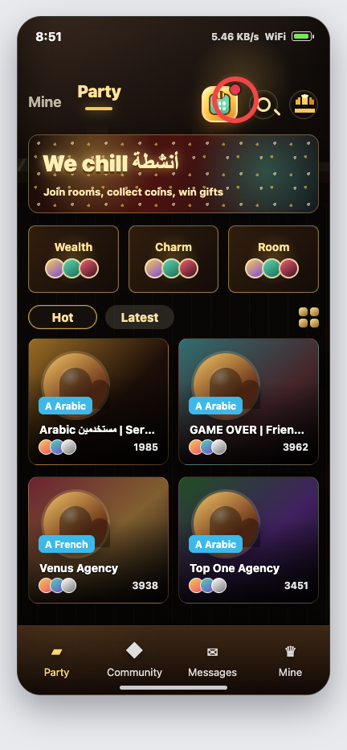
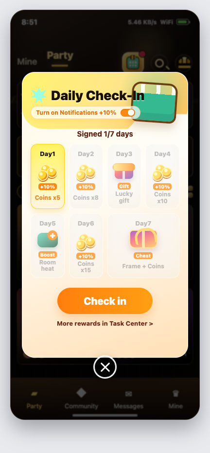
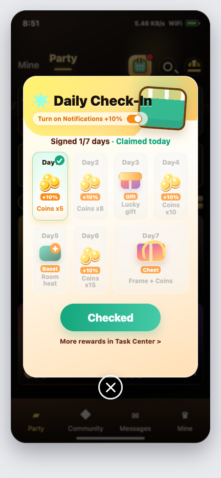

# WeChill 7日签到活动 PRD

> 版本：v1.0 可评审版  
> 日期：2026-06-05  
> 原型源文件：[wechill-7day-checkin-client-prototype.html](wechill-7day-checkin-client-prototype.html)  
> 截图资产：`assets/checkin_room_entry.png`、`assets/checkin_popup_day1.png`、`assets/checkin_popup_claimed.png`

## 1. 项目概述

### 1.1 背景

WeChill 当前核心场景是 Party 房间、房间推荐、财富/魅力/房间榜、金币与礼物消费。首页首屏已有高频功能区，用户进入 App 后会快速浏览 Party 房间并进入语聊房。

本期新增 7 日签到活动，用轻量福利提升新老用户每日打开率，并通过金币、幸运礼物、房间热度卡、第 7 天宝箱等奖励，把签到行为和平台的房间互动、送礼、房间热度绑定起来。

### 1.2 一句话定位

用户每天进入 App 即可领取一次签到奖励，并可从 Party 房间首页固定入口随时打开签到弹窗，连续 7 天领取更高价值奖励。

### 1.3 产品目标

| 目标 | 指标口径 | V1 参考目标 |
|---|---|---:|
| 提升日活留存 | 次日留存、7日连续签到完成率 | 7日完成率 >= 12% |
| 提升房间回流 | 签到后进入 Party 房间/语聊房比例 | >= 25% |
| 提升金币与礼物链路触达 | 签到奖励使用率、礼物背包使用率 | >= 18% |
| 提升推送授权 | 通知加成开关点击率、授权成功率 | 点击率 >= 20% |

## 2. 产品范围

### 2.1 V1 必做

| 模块 | 说明 |
|---|---|
| App 进入自动弹窗 | 用户进入 App 后，满足条件时自动弹出 7 日签到弹窗 |
| Party 房间首页固定入口 | 按附件 1 圈选位置，在顶部功能区增加签到固定入口 |
| 签到弹窗 | 展示 7 日奖励、当前可领取日、通知加成、领取按钮、已领取态 |
| 奖励发放 | 支持金币、幸运礼物、房间热度卡、第 7 天宝箱 |
| 后台配置 | 支持活动开关、地区/版本、人群、奖励、文案、入口图标、弹窗优先级配置 |
| 数据埋点 | 覆盖入口曝光、弹窗曝光、领取、关闭、通知加成、奖励到账 |

### 2.2 V1 不做

| 不做项 | 说明 |
|---|---|
| 复杂任务中心改版 | 本期仅保留“更多奖励进入 Task Center”的跳转 |
| 补签卡体系 | V1 先不支持补签，后续可结合付费/任务扩展 |
| 排行榜玩法 | 签到不做单独排行榜，避免和 Wealth/Charm/Room 榜混淆 |
| 多套皮肤主题 | V1 使用暗金活动风格，适配现有 Party 首页 |

## 3. 客户端原型截图

### 3.1 Party 房间首页固定入口

入口放在 Party 房间首页顶部功能区，位置贴近附件 1 圈出区域。未签到时展示红点；点击后打开签到弹窗。

### 3.2 用户进入 App 后自动弹出签到弹窗

用户进入 App 且当天未签到时，首页加载完成后自动弹出签到弹窗。弹窗参考竞品 2 的 7 日奖励格与通知加成，同时结合竞品 3 的活动标题、日历和宝箱视觉。

### 3.3 今日已领取状态

领取成功后，Day1 显示完成标记，按钮变为已领取态；用户仍可查看后续奖励，并可跳转任务中心获取更多奖励。

## 4. 用户路径

### 4.1 自动弹窗路径

1. 用户打开 App 并完成登录态校验。
2. 客户端请求签到状态接口。
3. 若活动有效、用户当天未签到、未命中屏蔽策略，则在首页首屏加载完成后延迟 0.8 秒弹出签到弹窗。
4. 用户点击 `Check in`。
5. 服务端发放奖励，客户端刷新签到进度和用户资产。
6. 用户关闭弹窗后回到 Party 首页，可继续进入房间。

### 4.2 固定入口路径

1. 用户进入 Party 房间首页。
2. 顶部功能区展示签到入口。
3. 未签到：入口展示红点，点击打开待领取弹窗。
4. 已签到：入口不展示红点，点击打开已领取弹窗。
5. 活动结束/地区不支持/版本不支持：入口隐藏。

## 5. 触发与展示规则

### 5.1 自动弹窗条件

| 条件 | 规则 |
|---|---|
| 登录态 | 仅登录用户参与；进入 App 后完成登录态校验再请求签到状态 |
| 账号切换 | 自动弹频次、红点、签到进度均按 user_id 维度计算，切换账号后重新请求 |
| 活动状态 | 后台活动开关开启，且当前时间在活动周期内 |
| 地区/语言 | 默认覆盖 MENA 重点地区；后台可按国家、语言、端版本配置 |
| 签到状态 | 当天未签到才自动弹；当天已签到不自动弹 |
| 频次控制 | 每个用户每天最多自动弹 1 次；关闭后当天不再自动弹 |
| 页面时机 | 首页首屏渲染完成后延迟 0.8 秒；避免和启动页白屏、骨架屏重叠 |
| 弹窗优先级 | 低于强制更新、实名/风控、充值结果弹窗；高于普通运营 Banner |
| 弹窗互斥 | 若更高优先级弹窗正在展示，签到弹窗排队；高优弹窗关闭后仍在 Party 首页才继续弹 |
| 深链进入 | 用户通过分享、Push、房间链接直接进入非首页时，不立即自动弹；回到 Party 首页或切回首页后再按规则触发 |
| 切回前台 | 用户当天未签到且当天未自动弹过，从后台切回前台时可重新请求状态；若当前在房间/私聊等沉浸场景，不自动打断 |

### 5.2 固定入口展示规则

| 状态 | 入口样式 | 点击行为 |
|---|---|---|
| 未签到 | 日历/礼物图标 + 红点 | 打开待领取弹窗 |
| 已签到 | 日历/礼物图标，无红点 | 打开已领取弹窗 |
| 关闭弹窗未领取 | 入口继续展示红点 | 再次点击仍打开待领取弹窗 |
| 领取成功 | 立即去掉红点 | 再次点击打开已领取弹窗 |
| 跨天刷新 | 到达重置时间后重新请求状态 | 若可领取则恢复红点 |
| 多端领取后 | 本端下次请求状态时去掉红点 | 打开弹窗展示已领取 |
| 活动不可用 | 不展示 | 无 |
| 缓存过期 | 首页展示前重新请求状态；接口返回前可沿用上次状态但最多缓存 5 分钟 | 请求完成后以服务端状态刷新 |
| 接口异常 | 展示入口但不展示红点 | 点击后请求状态，失败则 Toast |

### 5.3 时间口径

| 项 | 规则 |
|---|---|
| 重置时区 | 默认 GMT+3 00:00，贴合中东主要运营时区 |
| 签到周期 | V1 默认连续 7 日签到；用户按自然日连续领取 Day1-Day7 |
| 断签处理 | 漏掉任意一个重置日未签到，下一次领取从 Day1 重新开始 |
| 超过 7 天 | Day7 领取成功当日展示本轮完成；次日继续签到进入新一轮 Day1 |
| 活动超过 7 天 | 活动期内允许多轮 7 日循环，不限制用户只完成 1 轮 |
| 多端处理 | 以服务端状态为准，同一用户当天仅可领取一次 |

### 5.4 连续签到、断签与超过 7 天规则

V1 采用“连续签到 7 日”口径。连续的定义为：用户在活动重置时区内，每个自然日完成 1 次签到，且最近一次签到日期与本次签到日期之间没有漏掉任何重置日。

服务端按 `last_claim_date` 和当前服务端日期判断是否连续：

- 若用户首次参与，或最近一次签到日期不是上一个重置日，则本次领取 Day1。
- 若最近一次签到日期是上一个重置日，则本次领取上一天数 +1。
- 若上一天数为 Day7，且最近一次签到日期是上一个重置日，则本次进入下一轮 Day1。
- 已发放奖励不追回；断签只影响下一次可领取天数。

| 场景 | 示例 | 处理规则 | 弹窗展示 |
|---|---|---|---|
| 首次签到 | 6月1日首次进入 | 领取 Day1 | Day1 高亮 |
| 正常连续 | 6月1日领 Day1，6月2日进入 | 6月2日可领取 Day2 | Day1 已领取，Day2 高亮 |
| 当天重复打开 | 6月2日已领 Day2，当天再次点击入口 | 不可再次领取 | Day2 已领取，按钮为 `Checked` |
| 漏签 1 天 | 6月1日领 Day1，6月2日未签到，6月3日进入 | 6月3日从 Day1 重新开始；Day1 奖励再次按新一轮发放 | Day1 高亮，可展示 `Streak reset` 提示 |
| 漏签多天 | 6月1日领 Day1，6月5日进入 | 6月5日从 Day1 重新开始 | Day1 高亮，可展示 `Streak reset` 提示 |
| 连续领到 Day7 当天 | 6月1日-Day7 连续领取，6月7日领 Day7 | 本轮完成，当天不能再领取 | Day7 已领取，按钮为 `Checked` |
| 连续第 8 天 | 6月1日-Day7 连续领取，6月8日继续签到 | 进入第 2 轮 Day1，不发“Day8 奖励” | Day1 高亮，轮次内部重新从 1/7 展示 |
| 连续第 10 天 | 6月1日-Day7 连续领取，6月8日领 Day1，6月9日领 Day2，6月10日进入 | 领取第 2 轮 Day3 | Day1-Day2 已领取，Day3 高亮 |
| Day7 后断签 | 6月1日-Day7 连续领取，6月8日未签到，6月9日进入 | 6月9日从新一轮 Day1 开始；不补发 6月8日的新一轮 Day1 | Day1 高亮，可展示 `Streak reset` 提示 |
| 活动期超过 7 天 | 活动配置为 30 天 | 用户可在活动期内完成多轮 7 日签到 | 每轮按 Day1-Day7 循环展示 |
| 活动到期 | 活动结束时用户处于第 2 轮 Day4 | 活动结束后不再发放未领取的 Day5-Day7 | 入口隐藏或展示活动结束态 |

### 5.5 活动开始、结束与跨天刷新

| 场景 | 规则 |
|---|---|
| 活动未开始 | 不自动弹，不展示固定入口；接口返回 `is_active=false` 和开始时间 |
| 活动刚开始 | 用户已在 App 内停留时，客户端下一次刷新首页、切回前台或定时状态刷新后展示入口 |
| 活动结束前已打开弹窗 | 用户点击领取时若服务端判定已结束，则不发奖，弹窗切换为活动结束态 |
| 活动结束后 | 不自动弹；固定入口隐藏；通过旧弹窗或旧链接进入时展示活动结束态 |
| App 不重启跨天 | 到达 GMT+3 00:00 后，客户端需重新请求签到状态并刷新红点，不依赖用户重启 App |
| 设备时间不准 | 不使用客户端本地时间判断领奖资格；所有可领状态以服务端时间为准 |
| 用户跨国家/时区 | 仍按活动配置的 GMT+3 重置，不随用户设备时区变化 |

第 8 天及以后不新增 Day8、Day9 奖励位，统一按 7 日奖励表循环。研发可按以下口径计算当前奖励天数：

`reward_day = ((current_streak_days - 1) % 7) + 1`

示例：连续第 1 天为 Day1，连续第 7 天为 Day7，连续第 8 天为新一轮 Day1，连续第 15 天为第 3 轮 Day1。

## 6. 奖励方案

### 6.1 默认奖励配置

| 天数 | 奖励 | 平台结合点 | 备注 |
|---|---|---|---|
| Day1 | 金币 x5 | 新用户可立即体验送礼/房间互动 | 开启通知后可 +10% |
| Day2 | 金币 x8 | 提升连续回访动力 | 开启通知后可 +10% |
| Day3 | Lucky gift x1 | 引导用户进入房间使用背包礼物 | 有效期 7 天 |
| Day4 | 金币 x10 | 增加中段奖励 | 开启通知后可 +10% |
| Day5 | Room Heat Card x1 | 用户可给当前房间增加热度 | 有效期 7 天 |
| Day6 | 金币 x15 | 接近宝箱前提升留存 | 开启通知后可 +10% |
| Day7 | Chest x1 | 随机金币、头像框、入场特效、礼物 | 后台配置奖池权重 |

### 6.2 通知加成规则

| 项 | 规则 |
|---|---|
| 展示位置 | 弹窗标题下方展示 `Turn on Notifications +10%` |
| 生效条件 | 用户在领取前开启推送授权，且授权成功 |
| 服务端校验 | 领取接口传入 `notification_bonus=true` 时，服务端仍需校验用户真实授权状态 |
| 加成范围 | 仅对金币类奖励生效；礼物、热度卡、宝箱不加成 |
| 取整规则 | 加成金币向上取整 |
| 已授权用户 | 直接展示已开启状态，可按后台配置默认给加成 |
| 授权失败 | 用户拒绝授权或系统权限不可用时，不给加成；仍允许领取基础奖励 |
| 领取后授权 | 用户已领取当天奖励后再开启通知，不补发当天加成 |

### 6.3 奖励发放与配置变更

| 场景 | 规则 |
|---|---|
| 奖励配置中途变更 | 不影响已领取奖励；后续领取按服务端当前生效版本发放 |
| 奖励下架 | 若礼物、头像框、热度卡下架，服务端按后台配置的兜底奖励发放 |
| 奖励库存不足 | 进入补发队列或发放兜底金币；前端提示稍后到账 |
| 奖励有效期 | 礼物、热度卡、头像框等非金币奖励需返回 `expire_at`，背包内按现有规则展示 |
| 宝箱随机 | 宝箱奖励在服务端开奖，客户端只展示开奖结果，不在本地随机 |

## 7. 弹窗交互规则

| 交互点 | 规则 |
|---|---|
| 领取按钮 | 未领取时展示 `Check in`；领取成功后展示 `Checked` |
| 关闭按钮 | 关闭后回到当前页面；当天不再自动弹，但固定入口仍可打开 |
| Day 格点击 | V1 不支持单独点击领奖，只展示奖励详情气泡或 Toast |
| 断签提示 | 当 `streak_reset=true` 时，弹窗可展示 `Streak reset, start again from Day1` 提示 |
| 超过 7 天展示 | 第 2 轮及以后仍展示 Day1-Day7，不新增 Day8 视觉位 |
| Task Center 链接 | 跳转任务中心；若任务中心未上线，先跳活动说明页 |
| 弱网加载 | 弹窗可先展示骨架；领取请求中按钮 loading 且防重复点击 |
| 失败提示 | 领取失败 Toast：`Network error, please try again` |
| 奖励到账 | 成功后展示轻 Toast，并刷新金币/背包/房间热度卡资产 |

## 8. 后台配置需求

| 配置项 | 字段说明 |
|---|---|
| 活动开关 | 全局开关、国家/语言/端版本开关 |
| 活动时间 | 开始时间、结束时间、重置时区 |
| 连续规则 | 固定连续签到；断签后下一次从 Day1 重新开始 |
| 循环规则 | Day7 后次日进入新一轮 Day1；活动期内允许多轮循环 |
| 弹窗策略 | 自动弹开关、每日自动弹次数、弹窗优先级 |
| 入口配置 | 入口图标、红点规则、入口排序、入口隐藏策略 |
| 奖励配置 | Day1-Day7 奖励类型、数量、有效期、宝箱奖池权重 |
| 奖励版本 | 奖励配置变更生成新版本；用户领取时按服务端当前生效版本发放 |
| 通知加成 | 是否开启、加成比例、适用奖励类型 |
| 风控配置 | 黑名单、异常设备限制、同设备多账号领取限制 |
| 多语言文案 | 英文、阿语、法语等文案配置 |
| 操作日志 | 配置人、配置时间、变更前后内容 |

## 9. 接口建议

### 9.1 查询签到状态

`GET /activity/checkin/status`

返回字段建议：

| 字段 | 类型 | 说明 |
|---|---|---|
| activity_id | string | 活动 ID |
| is_active | boolean | 活动是否有效 |
| today_claimed | boolean | 今日是否已领取 |
| current_day | number | 当前可领取或已领取的奖励天数，1-7 |
| current_streak_days | number | 当前展示状态对应的连续签到总天数；未领取今日时为本次领取成功后将达到的天数，已领取今日时为已达到的天数，可大于 7 |
| cycle_round | number | 当前连续签到轮次，从 1 开始 |
| streak_reset | boolean | 本次进入是否因断签发生重置 |
| reset_reason | string | 重置原因，例如 `missed_day` / `first_join` |
| last_claim_date | string | 用户最近一次领取日期，按活动重置时区返回 |
| cycle_completed | boolean | 当前 7 日轮次是否完成 |
| auto_popup | boolean | 本次进入 App 是否需要自动弹 |
| notification_bonus_available | boolean | 是否可展示通知加成 |
| rewards | array | 7 日奖励列表 |
| server_time | number | 服务端时间戳 |

### 9.2 领取签到奖励

`POST /activity/checkin/claim`

请求字段：

| 字段 | 类型 | 说明 |
|---|---|---|
| activity_id | string | 活动 ID |
| source | string | `auto_popup` / `fixed_entry` / `task_center` |
| notification_bonus | boolean | 是否申请通知加成 |

返回字段建议：

| 字段 | 类型 | 说明 |
|---|---|---|
| success | boolean | 是否领取成功 |
| claimed_day | number | 本次领取天数 |
| current_streak_days | number | 领取后连续签到总天数，可大于 7 |
| cycle_round | number | 领取后所处连续签到轮次 |
| streak_reset | boolean | 本次领取是否为断签后重置 Day1 |
| reward_items | array | 实际发放奖励 |
| next_day | number | 下一次可领取天数 |
| today_claimed | boolean | 今日领取状态 |
| balance | object | 最新金币等资产 |

### 9.3 错误码与前端处理

| error_code | 场景 | 前端处理 |
|---|---|---|
| ACTIVITY_NOT_STARTED | 活动未开始 | 不展示入口或展示活动未开始态 |
| ACTIVITY_ENDED | 活动已结束 | 隐藏入口；旧弹窗切换活动结束态 |
| ALREADY_CLAIMED_TODAY | 当天重复领取 | 刷新状态为已领取，按钮展示 `Checked` |
| NOT_ELIGIBLE | 地区、版本、人群不满足 | 隐藏入口，不自动弹 |
| RISK_BLOCKED | 命中风控限制 | 不发奖；Toast 提示不可参与 |
| REWARD_STOCK_EMPTY | 奖励库存不足 | 展示稍后到账或兜底奖励结果 |
| REWARD_DELIVERY_PENDING | 发奖进入补发队列 | 展示领取成功但稍后到账；当天状态仍记为已领取，避免重复领取 |
| NETWORK_ERROR | 网络异常或请求超时 | 保持未领取状态，允许用户重试 |

## 10. 埋点需求

| 事件名 | 触发时机 | 关键属性 |
|---|---|---|
| checkin_entry_expose | 固定入口曝光 | user_id、scene、claimed_status、activity_id |
| checkin_entry_click | 点击固定入口 | user_id、scene、claimed_status |
| checkin_popup_show | 弹窗展示 | trigger_scene、current_day、current_streak_days、cycle_round、today_claimed、streak_reset、popup_priority |
| checkin_popup_close | 关闭弹窗 | trigger_scene、current_day、current_streak_days、duration_ms |
| checkin_claim_click | 点击领取 | current_day、current_streak_days、cycle_round、notification_bonus_selected |
| checkin_claim_result | 领取结果 | success、claimed_day、current_streak_days、cycle_round、streak_reset、reward_type、reward_value、error_code |
| checkin_notification_click | 点击通知加成 | auth_before、auth_after |
| checkin_task_center_click | 点击更多奖励 | current_day、today_claimed |

## 11. 异常与边界

| 场景 | 处理 |
|---|---|
| 用户多端同时点击领取 | 服务端幂等；第二次返回已领取状态 |
| 多端状态不同步 | 以最新状态接口为准；其他端领取后，本端刷新时去掉红点并展示已领取 |
| 领取过程中跨天 | 以服务端接收请求时间判断 |
| App 常驻不重启跨天 | 客户端按服务端时间刷新状态和红点，不依赖重启 |
| 从深链直接进入房间 | 不立即弹签到，避免打断进入房间；回到 Party 首页后再按规则触发 |
| 非连续签到 / 断签 | 下一次领取从 Day1 重新开始；已发奖励不追回 |
| 连续超过 7 天 | 不新增 Day8 奖励；按 Day1-Day7 循环进入下一轮 |
| 活动期超过 7 天 | 用户可完成多轮 7 日签到；每轮奖励按同一张奖励表循环 |
| Day7 后断签 | 下一次进入仍从新一轮 Day1 开始，不补发断签日奖励 |
| 活动未开始 | 不自动弹，不展示入口 |
| 弹窗打开后活动结束 | 领取请求以服务端结果为准，返回活动结束态 |
| 奖励配置中途变更 | 已领取不受影响，后续领取按当前生效版本发放 |
| 通知授权失败 | 不给加成，不影响基础签到奖励领取 |
| 通知状态造假 | 服务端不信任客户端单独传参，需校验真实推送授权状态 |
| 奖励发放失败 | 进入补发队列，前端提示稍后到账 |
| 宝箱奖池下架 | 服务端兜底发金币补偿 |
| 用户被风控限制 | 不自动弹，不展示入口或点击后提示不可参与 |
| 活动结束后仍打开弹窗 | 返回活动结束态，按钮不可点击 |
| 阿语 RTL | 弹窗整体支持 RTL，奖励格顺序仍按 Day1-Day7 从视觉起点排列 |

## 12. 验收标准

| 模块 | 验收点 |
|---|---|
| 自动弹窗 | 未签到用户进入 App 后只自动弹 1 次；关闭后当天不再自动弹 |
| 弹窗互斥 | 高优先级弹窗展示期间不弹签到；高优弹窗关闭且仍在 Party 首页时再弹 |
| 账号切换 | 切换账号后按新 user_id 重新请求状态，红点和自动弹不沿用旧账号 |
| 固定入口 | Party 房间首页顶部功能区展示入口；未签到有红点；点击打开弹窗 |
| 红点同步 | 关闭未领取仍有红点；领取成功立即去红点；其他端领取后本端刷新去红点 |
| 签到领取 | 点击领取后奖励到账，状态变为已领取，按钮变为 `Checked` |
| 连续签到 | GMT+3 00:00 后可领取下一天奖励；Day1 后连续签到进入 Day2 |
| 断签重置 | 任意漏签后再次进入，领取天数重置为 Day1，并展示重置提示 |
| 超过 7 天 | 连续第 8 天进入第 2 轮 Day1；连续第 10 天进入第 2 轮 Day3 |
| 跨天刷新 | App 不重启跨天时，入口红点和可领取状态按服务端状态刷新 |
| 活动边界 | 未开始不展示；结束后不发奖；旧弹窗领取返回活动结束态 |
| 奖励配置 | 后台修改奖励后，客户端展示与服务端发放一致 |
| 奖励异常 | 库存不足、奖励下架、补发队列均有明确前端提示或兜底奖励 |
| 通知加成 | 授权成功后金币奖励按 +10% 发放，非金币奖励不加成 |
| 通知失败 | 拒绝授权或系统权限不可用时不加成，但基础奖励可正常领取 |
| 多语言 | 英文/阿语/法语文案不溢出，不遮挡奖励格和按钮 |
| 数据埋点 | 入口、弹窗、领取、关闭、通知加成事件均可在数据平台查询 |

## 13. 后续可扩展

| 方向 | 说明 |
|---|---|
| 补签卡 | 可通过任务、付费或活动兑换获得 |
| 房间联动任务 | 签到后进入房间、送出背包礼物、停留 3 分钟可得额外奖励 |
| 主播/房主权益 | 房主连续签到可获得房间热度、房间封面框、房间榜加成 |
| 节日皮肤 | 斋月、开斋节、国庆等节日可替换签到弹窗主题 |
| 成就勋章 | 连续完成多轮 7 日签到可获得长期展示勋章 |
