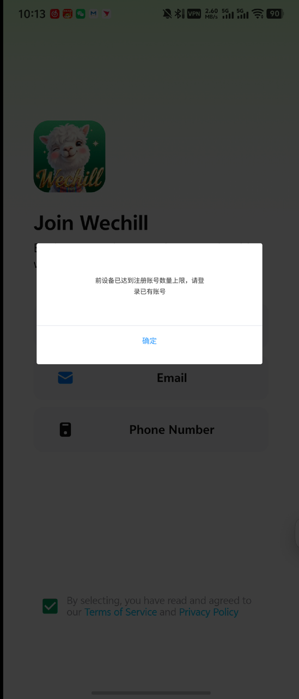
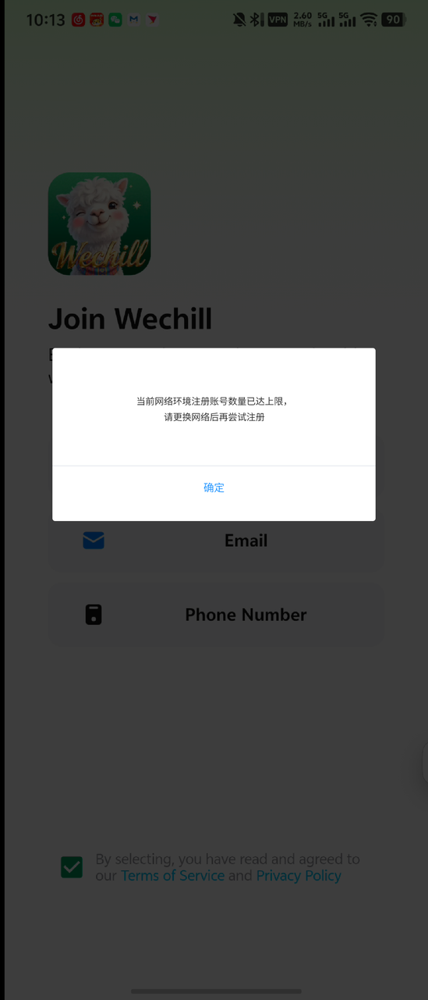
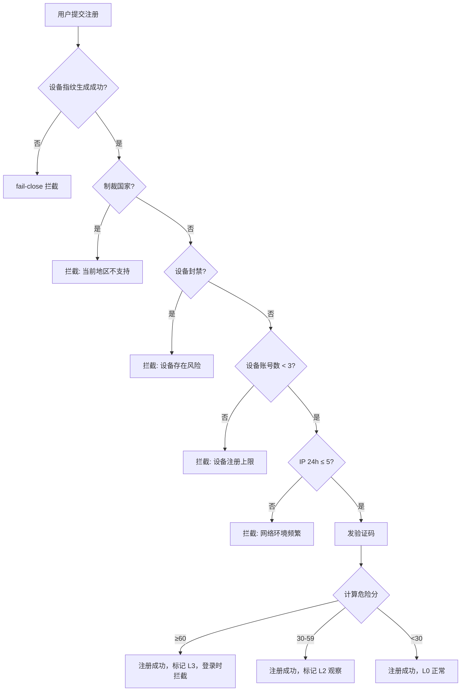
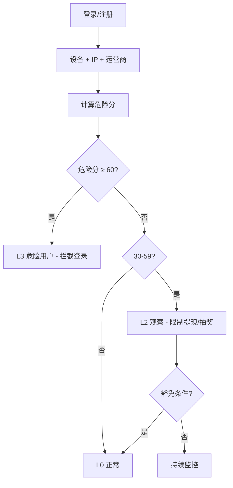
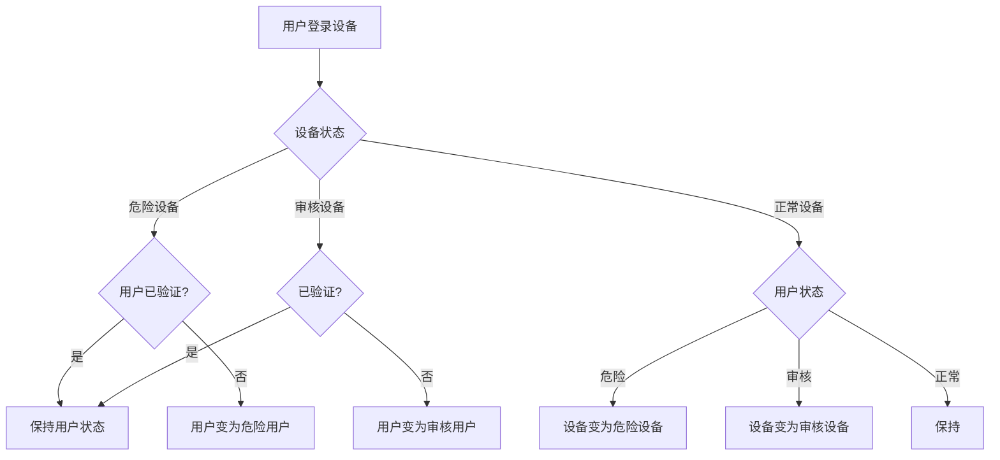
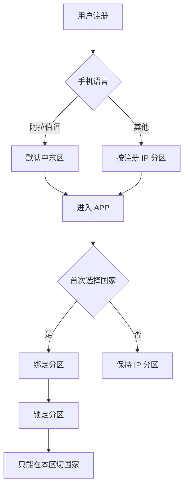
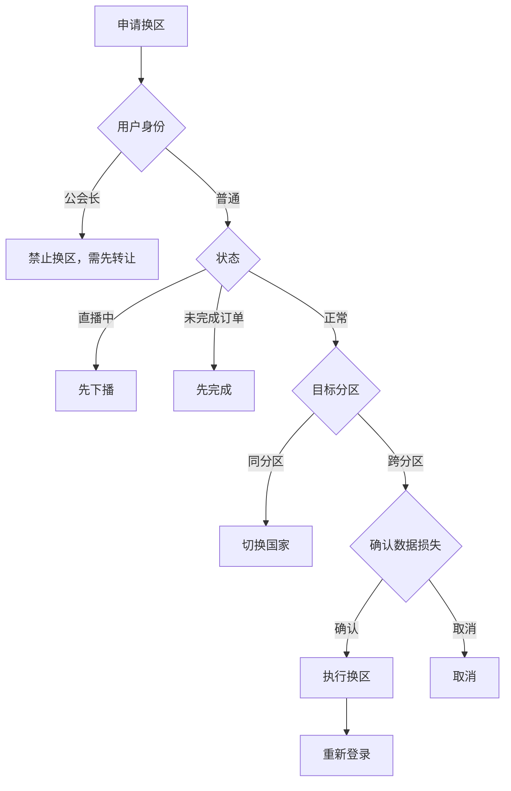
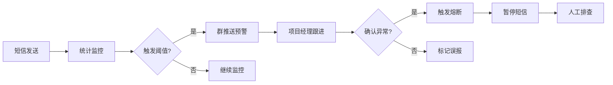

# WeChill 风控体系 PRD（终审评审版 v2.2）

> 文档名称：WeChill 平台风控体系需求文档（评审版）
> 版本：v2.2 终审评审版
> 适用业务：MENA 语聊房 / 公会 / 主播结算 / 账号安全 / 设备与 IP 风控 / 用户分类与封控
> 发布日期：2026-06-11
> 文档状态：评审版（Review Draft）
> 责任产品：Ace
> 关联文档：
> - 《风控系统需求文档 v1.0》（龙子，2026-03-13 / 03-16 修订）—— 客户端弹窗与后台原型来源
> - 《Wechill 用户分类与风控体系 PRD v1.0.0》（2025-05-13）—— 用户分类、危险用户判定、分区机制
> - 《主播小号防控与平台风控优化 PRD v1.3 整合风控系统冲突决策版》—— 设备/IP/主播/充值/收益全链路
> - 后台原型 HTML：`风控管理后台-设备充值封禁原型.html`
>
> **本终审版在 v2.0/v2.1 基础上继续对齐 v1.3 最新决策版，补齐客户端弹窗样式留存、章节引用、危险用户解除、设备指纹降级、币商充值、模拟器充值、批量处理与跨区边界，目标是一次性通过评审。**

---

## 文档导读

本 PRD 在评审视角上覆盖以下角色关切：

| 角色 | 关注点 | 对应章节 |
|---|---|---|
| 业务/运营 | 防小号、防套利、防绕过、保收益 | 4 / 5 / 6 / 7 / 8 / 9 / 10 / 13 / 14 / 35 / 36 |
| 法务/合规 | 个人信息保护、未成年人、自动化决策、申诉权 | 2.3 / 15 / 18 / 20 / 36 |
| 安全/反欺诈 | 设备指纹强度、IP 风险、模拟器对抗 | 3 / 4 / 11 / 12 / 15 / 24 / 27 / 36 |
| 财务/结算 | 收益冻结、扣回、退款、拒付、税务 | 10 / 14 / 35 |
| 客服/申诉 | 误伤、申诉入口、SLA、客服权限 | 17 / 20 / 21 / 22.8 |
| 技术/架构 | 服务可用性、降级、一致性、接口 | 25 / 26 / 27 / 35.7 / 36 |
| 数据/BI | 看板、误伤率、复犯率、灰度 | 28 / 31 / 35.9 |
| 测试/QA | 验收用例、边界、回归 | 30 / 35.8 / 36.7 |

---

## 1. 背景与目标

### 1.1 业务背景

WeChill 面向 MENA（中东与北非）市场提供语聊房、公会主播、礼物打赏、Lucky Pocket 红包返奖、龙蛋玩法、CP/Soul Pair 等社交玩法。当前平台已经具备的风控能力散落在以下几条线：

1. 用户分类与危险用户判定（疑似大陆用户、分区机制、设备传染、短信预警）；
2. 设备 / IP / 公会 / 主播身份 / 收益结算的多层联动；
3. Lucky Pocket 红包返奖的黑白名单与日预算熔断；
4. 龙蛋、CP 玩法的分区与等级独立配置。

但是从黑产对抗实战来看，存在以下系统性问题：

| 问题 | 影响 |
|---|---|
| 风控规则散落在多份文档，对外口径不一致 | 评审与开发反复对齐，容易漏实现 |
| 设备识别只依赖客户端 device_id（IDFV / Android ID） | 卸载重装、清缓存、广告 ID 变化即可绕过 |
| 充值封禁按账号维度累计 | 同设备切号继续充值，账号封禁无效 |
| 主播身份退出/封禁后设备名额立即释放 | 同设备其他账号立刻顶上做主播，规则形同虚设 |
| 申诉链路不闭环 | 误伤无法快速恢复，客服压力大 |
| 白名单边界模糊（"白名单设备不受任何风控规则限制"） | 法务、合规、欺诈、严重封禁全部失守 |
| 删除账号即释放注册名额 | 黑产清号→重注册→再做小号，证据链断裂 |
| 未覆盖未成年人、跨境数据、自动化决策合规要求 | 合规风险（沙特 PDPL、阿联酋 DPL、欧盟 GDPR） |

### 1.2 目标

| 目标维度 | 指标 | 验收口径 |
|---|---|---|
| 精准识别 | 设备多账号、同设备多主播、设备多账号充值套利识别准确率 | ≥ 95% |
| 降低误伤 | 正常用户被强拦截误判率 | < 1% |
| 快速响应 | 注册/登录/加入公会/充值的风控判定 RT（P95） | < 500ms |
| 可申诉 | 用户申诉响应 SLA（首次回复） | ≤ 24h |
| 可申诉 | 申诉成功后的能力恢复时间（自动 → 人工二审） | ≤ 72h |
| 可解释 | 后台对任何一次风险判定可回溯证据链 | 100% |
| 合规 | 个人信息留存、跨境传输、自动化决策人工复核权 | 100% 符合所在地法规 |

### 1.3 本评审版相对历史文档的变更摘要

| 变更项 | 历史口径 | 评审版口径 | 决策理由 |
|---|---|---|---|
| 设备识别主键 | client `device_id`（IDFV / Android ID） | 服务端聚合 `risk_device_hash`，客户端 ID 仅作特征 | 防卸载重装、清缓存、广告 ID 重置绕过 |
| IP 注册限制 | "一个 IP 最多 5 个账号"（未限定周期） | "一个 IP 24h 内 ≤ 5 个；7d 内 ≤ 15 个" | 历史累计只作风险分，不作永久封禁 |
| IP 注册超限弹窗文案 | "请更换网络后再尝试注册" | "请稍后再试，如有疑问请联系客服" | 不引导黑产换 IP 绕过 |
| 白名单豁免范围 | "白名单设备不受任何风控规则限制" | 规则级白名单，明确豁免清单；法务/合规/欺诈/严重封禁不可豁免 | 防止白名单被滥用为全局免风控 |
| 删除账号释放名额 | 删除即释放设备/IP 注册计数 | 默认软删除、证据保留；释放需审批 + 排除原因 | 防止黑产清号再注册破坏证据链 |
| 主播设备占用 | 主播退出公会即释放设备主播名额 | 主播退出/封禁/注销后进入 7 天冷却期，名额不立即释放 | 防换号顶替 |
| 充值封禁主键 | `user_id` | `risk_device_hash` | 防同设备切号继续充值 |
| 后台风险等级 | 安全用户等级"高/中/低" | 系统主状态 L0-L4；展示层可映射 | 与风控引擎统一 |
| 用户分类 | "危险用户/审核用户/异常用户"（v1.0 用户分类） | 收敛为 L0-L4，原分类作为可选 tag 共存 | 减少状态枚举混乱 |
| 主播登录失败文案 | "当前设备已登录主播账号..." | "当前设备已存在主播账号..." | 覆盖未登录但仍占用名额场景（冷却/封禁/未结算） |
| 危险用户判定（疑似大陆） | 单因子直接判定 | 改为评分制，单因素不直接判 | 防误伤海外华人 |
| 钻石换区折损 | 0.7:1 兑换 | 1:1 携带 | 用户体验，参考 v1.0 用户分类优化方案 |
| 申诉通道 | 无 APP 内入口 | 全场景申诉入口 + SLA + 工单状态 | 合规与误伤恢复 |

---

## 2. 适用范围、合规与原则

### 2.1 适用业务范围

| 业务模块 | 是否在本期范围 | 说明 |
|---|:--:|---|
| 注册 / 登录 / 加入公会 | 是 | 强制接入设备 + IP + 公会 + 主播身份联动 |
| 充值 / 退款 / 拒付 | 是 | 充值封禁主键升级为设备维度 |
| 主播工资结算 / 公会长提成 | 是 | 与风控等级联动，支持冻结、解冻、扣回 |
| 提现 / 借支 / 预支 | 是 | 提现按风险等级走审核或拦截 |
| Lucky Pocket 红包返奖 | 联动 | 复用账号风险等级与黑名单，规则细节走红包专项 PRD |
| 龙蛋 / CP / 三方游戏（Bytesun） | 联动 | 主播身份与账号状态强一致，玩法细节走玩法专项 PRD |
| 礼物消费、麦位、房间在线 | 联动 | 风险账号产生的礼物收益进入收益审核流程 |
| 客服侧操作、运营后台、财务后台 | 是 | 权限矩阵、操作审计、二次审批 |

### 2.2 设计原则

1. **结构化风险等级优先**：所有风险用户、设备、IP、公会都归一到 L0-L4 等级；其它历史枚举（危险/审核/异常/观察/正常）作为业务展示层映射存在，不再作为系统主状态。
2. **设备维度优先于账号维度**：注册、主播身份、充值都按 `risk_device_hash` 累计与封禁；账号维度只在精确处罚和申诉粒度上保留。
3. **强规则 + 软规则分层**：强规则直接拦截，软规则触发观察、审核、收益冻结、人工复核。
4. **fail-close 优先于 fail-open**：充值、提现、加入公会、主播登录在风控服务不可用时必须拦截，普通浏览可放行。
5. **白名单只豁免被显式配置的规则**：默认不豁免法务、合规、欺诈、严重封禁、收益异常、拒付。
6. **删除/封禁/解封必须留证据**：默认软删除，证据保留时长按所在地法规上限；任何释放计数必须有审批和排除原因。
7. **可解释、可申诉、可复核**：每一次风险判定要能回溯证据链；用户必须有 APP 内申诉入口；高危操作要二审。
8. **国家差异化配置**：阈值默认中东区配置，英语区与其他高风险区可独立覆写。

### 2.3 合规底线

| 合规项 | 要求 | 落地动作 |
|---|---|---|
| 个人信息分类 | 区分一般信息、敏感信息（手机号、设备指纹、IP、支付信息） | 数据字典标注；最小化采集 |
| 用户告知 | 在隐私政策中明确风控会采集设备/IP/支付信息 | 隐私政策更新 + APP 启动同意书 |
| 数据保留期 | 风控证据默认保留 180 天；财务相关保留期按所在地财税法规上限（沙特 ZATCA、阿联酋 FTA 默认 5 年） | 数据生命周期任务 |
| 跨境传输 | 中东用户数据存储优先选用阿联酋/沙特节点；跨境出境需要 SCC / 用户同意 | 部署架构与隐私政策对齐 |
| 自动化决策 | 用户对自动化封禁/限制有要求人工复核权 | 申诉入口 + 客服工单 + SLA |
| 被遗忘权 | 用户可申请账号注销与数据清除 | 注销流程区分软删除/合规删除 |
| 未成年人保护 | 限制疑似未成年人充值与打赏 | 实名 / 年龄判断辅助标记，疑似未成年人直接进入审核档位 |
| 反洗钱 / 反恐融资 | 高额充值、跨境提现命中名单库 | 与财务联动，命中阻断或人工审核 |
| 制裁国家 | 注册国家列表和手机号区号列表不提供入口，并在服务端拦截（伊朗、叙利亚、古巴、委内瑞拉、克里米亚、北朝鲜） | 注册前置拦截 + 名单库定期更新 |
| 阿语 RTL 适配 | 所有客户端弹窗、申诉表单 RTL 渲染 | 客户端实现规范 |

---

## 3. 名词与角色定义

### 3.1 用户身份口径

| 身份 | 定义 | 主播名额占用 |
|---|---|:--:|
| 普通用户 | 未加入任何公会 | 否 |
| 主播候选用户 | 已申请加入公会但未通过 | 否 |
| 主播用户 | 当前存在有效公会关系（`agency_user_relation.status=active`） | 是 |
| 已退出公会用户 | 历史加入过、当前无有效关系，且过冷却期 | 否 |
| 退出冷却期内用户 | 退出/被踢/封禁 ≤ 7 天 | 是（仍占名额） |
| 公会长 | 拥有公会管理与结算权限 | 是，重点监控 |
| 审核用户 | 命中风险但未确认违规 | 按业务规则 |
| 封禁用户 | 已确认违规或严重风险 | 不可注册、登录、加入公会、提现、充值 |
| 白名单用户 | 内部测试/客服/运营/合作账号 | 按白名单配置 |

### 3.2 风险等级（系统主状态）

| 等级 | 名称 | 定义 | 主要动作 | 展示层映射（v1.0 历史口径） |
|---|---|---|---|---|
| L0 | 正常 | 未命中风险 | 全功能开放 | 正常用户 |
| L1 | 观察 | 轻微风险或接近阈值 | 记录、不前台拦截 | 观察用户 |
| L2 | 审核 | 命中较明显风险但未确认违规 | 收益审核、加入公会审核、提现审核 | 审核用户 / 异常用户 |
| L3 | 危险 | 命中强规则或高度疑似套利 | 拦截关键动作、冻结收益、禁止提现 | 危险用户 |
| L4 | 封禁 | 已确认违规或严重风险 | 禁登录、停结算、可清退 | 封禁 |

> 安全用户分级（一级 / 二级 / 三级）作为**用户成长档位**继续保留，定义不变（充值 + 活跃门槛），但**不再用于风险判定主状态**，仅用于功能权益（如抽奖、游戏、优先客服）。

### 3.3 设备口径

| 维度 | 字段 | 来源 |
|---|---|---|
| 设备主键 | `risk_device_hash` | 服务端聚合下列因子生成 |
| 客户端 ID | `device_id` | iOS IDFV / Android Android ID |
| 安装 ID | `install_id` | App 安装时生成 |
| 广告 ID | `advertising_id` | IDFA / GAID（可为空） |
| 系统硬件指纹 | `device_model` / `os_version` / `cpu_arch` / `screen_resolution` | 客户端上报 |
| 网络环境 | `sim_country` / `carrier` / `timezone` / `language` / `locale` | 客户端上报 |
| 运行环境 | `is_emulator` / `is_root_jailbreak` / `apple_devicecheck_token` / `play_integrity_verdict` | 系统 API |
| 历史 | `ip_history` / `first_seen_at` / `last_seen_at` | 服务端记录 |

设备识别原则：

```text
强关联（核心标识完全一致）            → 视为同一设备，合并统计
弱关联（核心标识缺失但画像高度一致）  → 不直接合并限额，进入审核
完全不同                              → 视为新设备
设备指纹生成失败                      → 注册/加入公会/充值/提现 fail-close
```

### 3.4 IP 口径

| IP 类型 | 识别方式 | 处理 |
|---|---|---|
| 家庭宽带 / 普通移动网络 | ASN + GeoIP | 正常统计 |
| 移动运营商 CGNAT / NAT | ASN 标识 + 共享出口判定 | 阈值放宽，不直接封禁 |
| 公共 Wi-Fi | 已知公共 IP 库 | 强验证，不直接封号 |
| 公会办公网络 | 后台手工加白（绑定公会） | IP 限制豁免，但不豁免设备/账号规则 |
| VPN / Proxy | 第三方 IP 信誉库 + 自有规则 | 降阈值、限制短信、强验证 |
| 机房 / IDC | IP2Proxy / ASN 黑名单 | 默认拦截注册或强验证 |
| 跨国频繁切换 | 24h 内国家变化次数 ≥ 3 | 标记账号共享风险，限制提现 |

### 3.5 业务术语

| 术语 | 定义 |
|---|---|
| Lucky Pocket | 红包返奖玩法对外名（内部口径"红包返奖"） |
| Soul Pair / Partner Bond | CP 玩法对外名 |
| 设备主播占用 | 该设备在主播名额上的占用状态，无论账号当前是否在线 |
| 设备充值累计 | 同 `risk_device_hash` 下所有账号的成功充值金额（USD 折算） |
| 风险证据链 | 设备、IP、公会、收益、充值、登录、申诉等多源证据的时间轴聚合 |
| 解封观察期 | 解封后 7 天，再次命中同类风险直接恢复原限制档位 |
| 主播退出冷却期 | 主播退出公会后 7 天，同设备其他账号不可加入公会 |
| 风险设备名额释放 | 删除/注销账号是否减少设备/IP 注册计数；默认不减，需审批 |
| fail-close | 风控服务异常时高风险动作直接拦截 |
| fail-open | 风控服务异常时低风险动作放行并记录 |


---

## 4. 历史原型截图与冲突决策

### 4.1 客户端弹窗与后台原型留存

以下截图来自《风控系统需求文档 v1.0》，作为视觉交互留存。**最终实现文案以本 PRD 第 21 章统一文案和第 35.6 节设备充值文案为准，截图与正文文案不一致时以正文为准。**

#### 4.1.1 设备注册数量超限弹窗



- 原 PDF 触发条件：设备已注册账号 ≥ 3
- 原 PDF 文案：标题"注册失败" / 内容"当前设备已达到注册账号数量上限，请登录已有账号" / 按钮"确认"
- 评审版决策：保留触发条件，统一文案为"当前设备注册账号数量已达上限，请使用已有账号登录"
- 替代场景：白名单设备豁免；老账号被释放计数后，重新允许注册

#### 4.1.2 IP 注册数量超限弹窗



- 原 PDF 触发条件：IP 已注册账号 ≥ 5
- 原 PDF 文案：标题"注册失败" / 内容"当前网络环境注册账号数量已达上限，请更换网络后再尝试注册" / 按钮"确认"
- **评审版决策：弃用"请更换网络"引导，改为"当前网络环境注册过于频繁，请稍后再试。如有疑问，请联系客服"**，理由是引导换网会教黑产绕过；同时把限制周期明确为"24h 内 ≤ 5"，长期累计仅用于风险分。

#### 4.1.3 主播设备登录限制弹窗


- 原 PDF 触发条件：设备已有主播账号登录
- 原 PDF 文案：标题"登录失败" / 内容"当前设备已登录主播账号，一个设备仅支持登录一个主播账号" / 按钮"确认"
- **评审版决策：文案改为"当前设备已存在主播账号，为保障平台安全，暂不支持登录其他主播账号"**，覆盖"已退出但在 7 天冷却期内 / 已封禁但未结算 / 已注销但未过保留期"等"账号当前并未登录但仍占用设备主播名额"的场景。

#### 4.1.4 后台删除账号确认原型


- 原 PDF 流程：管理员点击"删除账号" → 弹窗确认 → 删除后释放设备 / IP 注册名额
- **评审版决策**：
  1. 删除操作默认为**软删除**（`status=deleted` + `login_disabled=true` + `profile_hidden=true`），原始数据按 180 天 / 财税法规上限保留；
  2. **删除/注销不自动释放设备和 IP 的注册计数**，释放必须勾选"排除计数"复选框并填写排除原因（关联工单 / 备注 / 二级审批）；
  3. 删除前置校验：未结算收益、未完成订单、提现/预支/借支、申诉中工单、公会长身份、白名单账号、官方测试账号均阻断删除；
  4. 弹窗文案补充警示："该操作会同时清退主播身份与公会关系，请确认是否有未结算收益"。

### 4.2 PDF v1.0 与评审版口径冲突核对（汇总表）

| 对齐项 | PDF v1.0 口径 | 评审版口径 | 是否冲突 | 决策理由 |
|---|---|---|:--:|---|
| 单设备注册账号数 | ≤ 3 | ≤ 3 有效账号 | 否 | 统计口径以"有效账号"为准 |
| 设备识别 | IDFV / Android ID | 服务端 `risk_device_hash` | 是 | 防卸载重装、清缓存、广告 ID 重置绕过 |
| IP 注册限制 | ≤ 5（无周期） | 24h ≤ 5；7d ≤ 15；历史累计只作风险分 | 是 | 防止永久封禁误伤 CGNAT |
| 白名单豁免范围 | 不受任何风控规则限制 | 规则级豁免，法务/合规/欺诈/严重封禁不豁免 | 是 | 防全局免风控滥用 |
| 主播登录限制 | 一个设备一个主播账号 | 一个设备一个主播**名额占用**（含冷却/封禁/未结算） | 扩展 | 防换号顶替 |
| 注册设备超限弹窗 | "请登录已有账号" | "请使用已有账号登录" | 否 | 文案统一 |
| IP 注册超限弹窗 | "请更换网络" | "请稍后再试，如有疑问请联系客服" | 是 | 不教黑产绕过 |
| 主播登录失败弹窗 | "已登录主播账号" | "已存在主播账号" | 是 | 覆盖非登录占用场景 |
| 删除账号释放名额 | 删除后立即释放 | 默认不释放；释放需排除计数 + 审批 | 是 | 防清号再注册 |
| 后台风险等级 | 安全用户高/中/低 | L0-L4 主状态；展示层可映射 | 是 | 与风控引擎统一 |
| 充值封禁主键 | `user_id` | `risk_device_hash` | 新增（v1.0 未覆盖） | 防同设备切号继续充值 |
| 危险用户判定 | 单因子直接判（运营商 / IP / 语言 / VPN） | 评分制（≥60 危险，30-59 观察） | 是 | 防误伤海外华人 |

### 4.3 v1.3 最新决策版与 v2.0 评审版冲突核对

本节对齐《主播小号防控与平台风控优化 PRD v1.3 整合风控系统冲突决策版》和本终审版。若同一规则出现差异，以本表决策为准。

| 对齐项 | v1.3 口径 | v2.0 / v2.1 口径 | 终审决策 |
|---|---|---|---|
| IP 注册上限 | 24h ≤ 5，7d 作为观察 | 24h ≤ 5，7d ≤ 15 | 24h 第 6 个强验证或拦截；7d > 15 仅升级风险和短信限制，不单独永久封禁 |
| 设备指纹故障降级 | 高风险动作 fail-close | 灾备中可 30 分钟降级使用客户端 device_id | 只允许普通浏览、只读查询和待补判使用客户端 ID；注册、主播、充值、提现、换区等高风险动作不得因降级放行 |
| 危险用户判定 | 弱化国家/IP等单因子 | 加入疑似大陆评分制 | 采用评分制，但任何单因子不得直接永久封禁；L3 拦截必须有证据链、申诉入口和人工复核 |
| 危险用户解除 | v1.3 未包含币商充值解除 | v2.0 写有“币商充值任意金额，设备同步清除” | 废弃自动解除。充值只能作为辅助证明，需官方认证渠道、无拒付/退款/收益异常、人工复核通过 |
| 充值拦截文案 | “当前设备充值金额已达...” | 第 35.6 节改为“您当前的设备暂时无法进行充值...” | 充值场景以第 35.6 节为准，主语必须是“您当前的设备”，不暗示换账号可解决 |
| 登录高危拦截文案 | 安全风险提示 | “网络错误” | 改为“当前登录环境异常，请稍后再试。如有疑问请联系客服。”，避免虚假错误但仍不暴露具体风控因子 |
| 模拟器 / Root 充值 | v1.3 限制主播/提现 | v2.1 存在“默认不允许充值”和“0-200 可放行”混写 | 统一为：主播、提现、充值默认强验证或拦截；普通低额体验可配置小额上限，默认 $20，最高 $50，且不允许主播账号使用 |
| 二手设备 / 维修换机 | 申诉通过可释放占用 | 充值累计可重置为 0 | 仅移出当前设备活跃风控统计，原订单和财务台账不删除，必须保留 `is_transferred=true` 证据链 |
| 版本与章节 | v1.3 独立成稿 | v2.0 标题与 v2.1 增量并存 | 本文件统一为 v2.2 终审评审版，历史版本只保留在版本历史中 |

### 4.4 客户端弹窗样式保留与变更说明

历史截图中的客户端弹窗样式继续保留，作为注册、登录类强拦截弹窗的基础样式。文案、触发条件和多语言 key 可更新，但视觉层不另起一套，避免客户端实现出现两个风格。

| 样式项 | 原 PDF 样式 | 终审保留/调整 |
|---|---|---|
| 遮罩 | 全屏半透明黑色遮罩，背景页面保留可见 | 保留；遮罩点击不关闭高风险弹窗 |
| 弹窗容器 | 居中白色矩形卡片，圆角较小，宽度约屏幕 75% | 保留；适配小屏时宽度 78%-84%，阿语 RTL 下保持居中 |
| 标题 | PDF 截图未展示显著标题，正文写有“注册失败/登录失败” | 实现时必须展示标题，字号 16-18，居中或按系统 Dialog 规范 |
| 内容 | 居中文案，2 行以内 | 保留；超过 2 行优先调整文案，不挤压按钮区 |
| 分割线 | 内容区与按钮区之间 1px 分割线 | 保留 |
| 按钮 | 单按钮“确定”，蓝色文字，居中 | 保留；申诉类可增加“联系客服/提交申诉”主 CTA，但必须保留关闭/确定路径 |
| Toast | PDF 未提供 Toast 样式 | 采用第 35.5 节：默认 2.2 秒，底部居中，成功绿色、失败红色、普通深灰 |
| 多语言 | PDF 只有中文 | 客户端必须提供中文 / 英文 / 阿语 / 法语 / 土耳其语；阿语使用 RTL，不改变弹窗结构 |
| 无障碍 | PDF 未覆盖 | 按钮可被读屏识别，标题和内容进入 accessibility label |

弹窗样式优先级：

```text
历史截图视觉样式
> 当前 App 全局 Dialog 组件规范
> 第 21 章最终文案
> 第 35.6 节设备充值专项文案
> 多语言翻译与 RTL 适配
```

---

## 5. 用户分类、风险等级与能力矩阵

### 5.1 用户分类（业务标签，可与风险等级共存）

| 分类 | 定义 | 关键条件 |
|---|---|---|
| 家族用户 | 加入家族的用户（男女均可） | 家族长也是家族成员 |
| 男新用户 | 注册 ≤ 7 天的男用户 | 自然 + 投放 |
| 男新付费用户 | 注册 ≤ 7 天 + 有充值 | — |
| 男老用户 | 注册 > 7 天的男用户 | — |
| 男老付费用户 | 注册 > 7 天 + 有充值 | — |
| 女新用户 | 注册 ≤ 7 天的女用户 | — |
| 女新主播 | 加入家族 ≤ 7 天的女用户 | — |
| 投放用户 | 可追踪的广告来源用户 | — |
| 付费用户 | 有过任意充值 | — |
| 非安全用户 | 默认状态，自然注册未升级安全用户 | — |
| 一级安全用户 | 充值 > 5,000 金币 或 活跃 > 7 天 | 基础功能 |
| 二级安全用户 | 充值 > 15,000 金币 + 连续登录 ≥ 2 天 | 抽奖、游戏 |
| 三级安全用户 | 充值 > 100,000 金币 + 活跃 > 30 天 | 全功能、优先客服 |

### 5.2 风险等级升级 / 降级规则

| 行为 | 账号风险 | 设备风险 | 默认动作 |
|---|---|---|---|
| 同设备注册第 2 个账号 | L1 | L1 | 观察 |
| 同设备注册第 3 个账号 | L1/L2 | L2 | 标记关注 |
| 同设备注册第 4 个账号 | L2 | L3 | 拦截注册 |
| 同设备第 2 个主播登录 | L3 | L3 | 拦截主播登录 |
| 同设备账号申请加入同公会 | L2/L3 | L3 | 拦截或审核 |
| 同设备账号互刷礼物 | L3 | L3 | 冻结收益 |
| 封禁后换号注册 | L4 | L4 | 拦截 / 封禁 |
| 多账号批量提现 | L3/L4 | L3/L4 | 财务审核 / 冻结 |
| 设备累计充值达档位 | 按账号状态 | L2/L3 | 拦截充值 |
| 拒付 / 恶意退款 | L3/L4 | L3/L4 | 限制充值/提现 |
| 命中疑似大陆用户（危险分 ≥ 60） | L3 | — | 拦截登录 |
| 命中观察分（危险分 30-59） | L2 | — | 限制提现 / 抽奖 |
| 模拟器 / 云手机 | — | L2/L3 | 限制加入公会 / 提现 |
| Root / 越狱设备 | — | L2/L3 | 按配置限制 |
| 疑似未成年人 | L2 | — | 限制充值 / 打赏 |

自动降级规则：

| 当前等级 | 无复犯观察期 | 降级目标 |
|---|---:|---|
| L1 | 7 天 | L0 |
| L2 | 14 天 | L1 |
| L3 | 30 天 | L2 |
| L4 | 不自动降 | 申诉 / 人工 |

### 5.3 用户能力矩阵

| 状态 | 登录 | 注册新号 | 加入公会 | 主播开播 | 收益结算 | 提现 | 充值 | 申诉 |
|---|:--:|:--:|:--:|:--:|:--:|:--:|:--:|:--:|
| L0 正常 | ✓ | ✓ | ✓ | ✓ | ✓ | ✓ | ✓ | ✓ |
| L1 观察 | ✓ | ✓ | ✓ | ✓ | ✓ | ✓ | ✓ | ✓ |
| L2 审核 | ✓ | 受限 | 审核 | 配置 | 待审 | 审核 | ✓ | ✓ |
| L3 危险 | 配置 | ✗ | ✗ | 受限 | 冻结 | ✗ | 配置 | ✓ |
| L4 封禁 | ✗ | ✗ | ✗ | ✗ | 停止 | ✗ | ✗ | ✓ |
| 设备封禁 | ✗ / 审 | ✗ | ✗ | ✗ | 按账号 | ✗ | ✗ | ✓ |
| 充值封禁 | ✓ | 按账号 | 按账号 | 按账号 | ✓ | ✓ | ✗ | ✓ |
| 解封观察期 | ✓ | 受限 | 审核 | 配置 | 审核 | 审核 | 配置 | ✓ |
| 白名单 | ✓ | 按白名单 | 按白名单 | 按白名单 | 仍审计 | 仍审计 | 按白名单 | ✓ |
| 疑似未成年人 | ✓ | ✗ | ✗ | ✗ | — | ✗ | ✗ | ✓ |
| 制裁国家用户 | ✗ | ✗ | — | — | — | — | — | ✓ |

> **能力恢复说明**：账号解封不代表主播能力恢复；主播能力恢复不代表收益解冻；收益解冻不代表提现一定放行；设备充值解封不代表设备登录封禁解除；IP 解封不代表账号风险清零。


---

## 6. 强规则与软规则

### 6.1 强规则（直接拦截）

| 规则 ID | 规则 | 触发场景 | 处理 |
|---|---|---|---|
| HR-001 | 一个设备最多注册 3 个有效账号 | 注册 | 第 4 个起拦截 |
| HR-002 | 一个 IP 24h 最多注册 5 个账号 | 注册 / 发验证码 | 超过强验证或拦截 |
| HR-003 | 一个设备最多 1 个主播名额占用 | 登录 / 加入公会 / 恢复登录 | 拦截第二个主播 |
| HR-004 | 同设备已有主播名额，普通账号禁止加入公会 | 加入公会 | 拦截 |
| HR-005 | 封禁设备禁止注册新账号 | 注册 | 拦截 |
| HR-006 | 封禁账号禁止加入公会 | 加入公会 | 拦截 |
| HR-007 | 高风险账号禁止提现 | 提现 / 结算 | 拦截或进入人工 |
| HR-008 | 设备充值累计达 200/1000/全面限制档位 | 充值发起 / 下单 | 设备维度拦截 |
| HR-009 | 制裁国家禁止手机号注册 | 注册 | 拦截 |
| HR-010 | 疑似未成年人禁止充值与打赏 | 充值 / 送礼 | 拦截 |
| HR-011 | 命中危险分 ≥ 60 拦截登录 | 登录 | 拦截 |
| HR-012 | 同账号 24h 内登录设备数 ≥ 3 | 主播提现 | 强验证 + 提现冻结 |
| HR-013 | 拒付确认 / Chargeback 后立即冻结收益与提现 | 财务回调 | 冻结 |

### 6.2 软规则（观察、审核、冻结）

| 规则 ID | 规则 | 触发场景 | 处理 |
|---|---|---|---|
| SR-001 | 同设备注册第 2 个账号 | 注册后 | 标记观察 |
| SR-002 | 同设备注册第 3 个账号 | 注册后 | 标记关注设备 |
| SR-003 | 同 IP 24h 注册 3-5 个账号 | 注册 | 加强验证 |
| SR-004 | 同公会出现多个同设备账号 | 加入公会 / 结算 | 公会风险 +1 |
| SR-005 | 同设备账号互相送礼 | 送礼 / 结算 | 套利风险标记 |
| SR-006 | 同设备账号收益集中到同公会长 | 结算 | 冻结公会长提成待审 |
| SR-007 | 单设备充值接近 80% 阈值 | 充值前 / 后 | 进入观察列表 |
| SR-008 | 危险分 30-59 | 登录 | 观察用户，限制提现 / 抽奖 |
| SR-009 | 跨国 24h 切换 IP ≥ 3 次 | 登录 | 账号共享风险 |
| SR-010 | 退款率高、退款金额大 | 退款回调 | 进入支付风险列表 |
| SR-011 | 同账号在多设备频繁切换 | 登录 | 账号共享标记 |

### 6.3 规则优先级（命中冲突时）

```text
法务/合规强制封禁
> 严重欺诈 / 支付拒付 / 安全封禁
> 制裁国家拦截
> 账号封禁（L4）
> 设备封禁
> 设备充值封禁
> 主播身份限制
> 收益冻结
> 提现限制
> IP 限制
> 危险用户判定
> 普通观察规则
> 白名单特殊配置
```

特别说明：

- 白名单不能覆盖法务、合规、严重欺诈类封禁；
- 白名单只对显式配置的规则生效；
- "账号解封"不自动恢复"主播身份/收益/提现/设备充值/设备登录"；
- "设备充值解封"不自动恢复"账号封禁/提现限制/收益冻结"。

---

## 7. 注册风控流程

### 7.1 校验顺序

```text
用户发起注册
→ 设备指纹生成（失败 fail-close）
→ 校验制裁国家 / 国家黑名单
→ 校验设备封禁状态
→ 校验设备有效账号数 < 3
→ 校验 IP 24h 注册数 ≤ 5
→ 校验手机号 / 验证码风险
→ 校验运营商 / 网络环境（VPN / Proxy / 机房）
→ 计算危险分（疑似大陆用户）
→ 注册成功
→ 生成用户 + 设备 + IP 风控记录
```

### 7.2 注册规则明细

| 校验项 | 通过条件 | 不通过处理 | 用户提示 |
|---|---|---|---|
| 制裁国家 | 不在制裁名单 | 拦截 | 当前地区暂不支持注册 |
| 设备指纹生成 | 成功 | fail-close | 当前设备校验失败，请稍后再试 |
| 设备封禁状态 | `device_status != banned` | 拦截 | 当前设备存在安全风险，暂不支持注册 |
| 设备账号数量 | `active_account_count < 3` | 拦截 | 当前设备注册账号数量已达上限，请使用已有账号登录 |
| IP 24h 注册数 | `register_count_24h ≤ 5` | 强验证或拦截 | 当前网络环境注册过于频繁，请稍后再试 |
| 短信发送频次 | 未超频 | 限制验证码 | 验证码发送过于频繁，请稍后再试 |
| 国家限制 | 当前国家允许注册 | 拦截 | 当前地区暂不支持注册 |
| VPN / 代理 | 未命中高危代理 | 强验证或拦截 | 当前网络环境异常，请切换网络后重试 |
| 危险分 | < 60 | 危险分 ≥ 60 允许完成注册，登录时拦截 | （注册成功，登录时提示）当前登录环境异常，请稍后再试 |
| 危险分 30-59 | — | 允许注册，标记观察用户 | 无 |

### 7.3 有效账号统计口径

**计入设备/IP 注册数：**

```text
1. 正常账号；
2. 审核账号；
3. 危险账号；
4. 临时封禁账号；
5. 仍保留用户数据的封禁账号；
6. 已申请注销但仍在保留期内的账号。
```

**不计入：**

```text
1. 已完成注销且过法定保留期；
2. 后台合规清理的垃圾账号（需勾选排除计数 + 备注 + 审批）；
3. 明确误注册且后台手工排除计数（需备注 + 审批）；
4. 官方测试账号（标记 is_test_account=true）。
```

### 7.4 注册拦截流程图



---

## 8. 登录风控流程

### 8.1 校验顺序

```text
用户登录
→ 校验账号状态（未封禁、未注销）
→ 校验账号危险分（登录拦截）
→ 校验设备状态（未封禁）
→ 绑定当前登录设备
→ 判断用户是否主播
→ 主播身份：校验当前设备主播名额占用
→ 通过 → 进入 APP
```

### 8.2 同设备多主播拦截逻辑

```text
当前登录账号 A 是主播
→ 查询当前设备 host_device_occupy_status
→ 若 status=none：占用名额，允许登录
→ 若 status=occupied 且 user_id=A：原占用，允许登录
→ 若 status=occupied 且 user_id!=A：拦截
→ 若 status=cooling 且 user_id!=A：拦截（7 天冷却期内）
→ 若 status=released：占用名额，允许登录
```

弹窗：`当前设备已存在主播账号，为保障平台安全，暂不支持登录其他主播账号。`

后台事件：

```text
risk_code = DEVICE_MULTI_HOST_LOGIN
risk_level = L3
action = block_host_login
evidence = {occupy_user_id, occupy_agency_id, occupy_start_at, occupy_status}
```

### 8.3 多端登录主播账号

| 场景 | 处理 |
|---|---|
| 主播 A 单设备登录 | 正常 |
| 主播 A 跨设备 24h 切换 ≤ 2 次 | 正常 |
| 主播 A 跨设备 24h 切换 ≥ 3 次 | 标记账号共享，限制提现 |
| 主播 A 跨国 24h 切换 ≥ 3 次 | 标记 + 人工审核 |
| 主播 A 同时在 ≥ 2 个设备产生收益 | 收益审核 |

---

## 9. 加入公会风控流程

### 9.1 校验顺序

```text
用户申请加入 / 公会长邀请用户
→ 校验账号状态
→ 校验账号风险等级（L0/L1 允许，L2 审核，L3+ 拦截）
→ 校验设备账号数 ≤ 3
→ 校验设备主播名额是否被占用
→ 校验设备主播退出冷却期
→ 校验公会风险等级（A3/A4 不可加新主播）
→ 校验公会长风险等级
→ 校验同 IP 是否批量加入同一公会
→ 通过 → 建立 active 公会关系
→ 用户正式成为主播，设备主播名额绑定
```

### 9.2 主播退出冷却期

| 配置项 | 默认值 | 国家差异化 |
|---|---:|:--:|
| 退出公会冷却期 | 7 天 | 是 |
| 冷却期内同设备其他账号不可加入公会 | 是 | 否 |
| 冷却期内原主播账号可恢复 | 是 | 否 |
| 冷却期豁免（后台配置） | 需填写原因 + 审批 | — |

### 9.3 公会长邀请异常检测

```text
公会长 24h 内邀请加入用户 ≥ 10
→ 触发批量邀请观察
公会长邀请用户中同设备账号 ≥ 2
→ 触发公会风险 +1
公会长邀请用户中同 IP 账号 ≥ 5
→ 触发公会风险 +1
```

---

## 10. 充值风控（设备维度封禁）

### 10.1 设备充值封禁档位

| 档位 | 设备累计充值（USD） | 设备状态 | 前台处理 |
|---|---:|---|---|
| 未限制 | < 200 | normal | 正常发起 |
| 200 美金档 | ≥ 200 且 < 1000 | recharge_limited_200 | 拦截，提示安全限制 |
| 1000 美金档 | ≥ 1000 | recharge_limited_1000 | 拦截，提示高风险限制 |
| 全面限制 | 人工设置 / 高风险策略 | recharge_blocked | 全部拦截 |

> 200 美金、1000 美金为现有需求图档位，后台支持调整阈值。统计按设备 `risk_device_hash` 合并，账号 A/B/C 充值金额合并。

### 10.2 充值金额统计口径

**计入：**

```text
1. Apple 内购成功订单；
2. Google Play 成功订单；
3. 三方支付成功订单；
4. 后台补单且金币入账的订单；
5. 同设备所有账号的成功充值订单；
6. 退款中但平台未确认扣回的订单（默认计入，防退款套利）。
```

**不计入：**

```text
1. 支付失败 / 用户取消订单；
2. 风控拒付且资产未到账订单；
3. 官方测试订单（is_test_order=true）；
4. 后台明确标记为误单且不计入风控的订单。
```

### 10.3 设备绑定与合并规则

| 场景 | 设备统计处理 |
|---|---|
| 用户换设备充值 | 计入新设备，保留账号历史订单 |
| 设备指纹强关联一致 | 合并到同 `risk_device_hash` |
| 设备指纹弱关联 | 不直接合并限额，进入人工审核 |
| 多账号共用同设备 | 所有账号充值合并 |
| 设备指纹变更但系统判定为同设备 | 保留合并证据，后台展示合并前后指纹 |

### 10.4 币种与汇率

| 项目 | 规则 |
|---|---|
| 统计币种 | 统一折算 USD |
| 汇率时间 | 订单支付成功时间 |
| 汇率来源 | 平台统一汇率服务或财务配置汇率 |
| 汇率锁定 | 订单入账后锁定，不随汇率重算 |
| 统计金额 | 按用户实际支付金额折算 USD |
| 平台净收入 | 单独记录，不作为设备充值主口径 |
| 多渠道合并 | Apple + Google + 三方支付合并 |

### 10.5 退款处理

| 场景 | 是否扣减设备累计 | 说明 |
|---|:--:|---|
| 用户申请退款中 | 否 | 平台未确认扣回前仍计入 |
| 退款成功且金币已扣回 | 可扣减 | 按配置 |
| 退款成功但金币已消耗 | 否 | 标记风险，不扣减 |
| 恶意频繁退款 | 否 | 标记支付风险 |
| 官方误单退款 | 可扣减 | 需审批 |

### 10.6 拒付（Chargeback）处理

| 场景 | 处理 |
|---|---|
| 出现拒付申请 | 标记支付风险，限制提现 |
| 拒付确认成功 | 高风险事件，冻结相关收益 |
| 拒付金额涉及主播收益 | 关联主播收益审核 |
| 设备多账号拒付 | 设备进入充值高风险 |
| 拒付后再次充值 | 可拦截或强审核 |

### 10.7 后台补单

| 补单类型 | 是否默认计入 |
|---|:--:|
| 用户真实支付漏单 | ✓ |
| 官方活动补偿 | ✗ |
| 客服手动补偿 | ✗（可配置） |
| 测试补单 | ✗ |
| 风控修正补单 | 人工选择 |

### 10.8 充值发起校验流程

```text
用户点击充值
→ 获取 user_id, device_id, risk_device_hash, 支付渠道
→ 校验账号状态是否允许充值（L4/封禁/未成年人 → 拦截）
→ 校验设备充值封禁状态
→ 查询 device_recharge_amount_usd
→ 判断设备充值档位
→ 未命中：创建订单
→ 200/1000/全面：拦截并 Toast
→ 写入充值风控事件
```

---

## 11. 设备生命周期与绕过场景

### 11.1 场景与处理

| 场景 | 识别方式 | 处理 | 重置账号数? |
|---|---|---|:--:|
| 卸载重装 App | `risk_device_hash` 一致 | 同设备 | 否 |
| 清缓存 | 核心指纹一致 | 同设备 | 否 |
| 更换广告 ID | 设备画像一致 | 不重置统计 | 否 |
| 更换 SIM 卡 | 设备一致 | 记录 SIM 变化 + 风险参考 | 否 |
| 更换手机号注册 | 同设备新账号 | 计入设备账号数 | 否 |
| 游客 → 正式账号 | `visitor_id` 与设备绑定 | 转正后计入 | 否 |
| 注销后立即重注册 | 原账号仍在保留期 | 原账号仍计入 | 否 |
| 换设备登录 | 新设备绑定 | 新设备计入；旧设备保留 | 否 |
| 二手设备 | 用户申诉 | 可人工释放部分占用 | 需审批 |
| 维修换机 | 用户申诉 | 可人工调整关联 | 需审批 |
| 模拟器 / 云手机 | 环境识别 | 进入审核，不建议成为主播 | 否 |
| Root / 越狱 | 系统环境识别 | 标记风险，限制主播/提现 | 否 |

### 11.2 游客转正规则

```text
游客首次进入 App
→ 生成 visitor_id
→ 绑定 risk_device_hash
→ 游客转手机号/三方登录账号
→ 生成正式 user_id
→ visitor_id 与 user_id 合并
→ 正式账号计入该设备有效账号数
```

### 11.3 设备指纹缺失/异常

| 异常 | 处理 |
|---|---|
| `device_id` 为空 | 用 install_id + 系统标识 + 画像补齐 |
| `install_id` 为空 | 允许普通浏览，限制注册和主播 |
| `risk_device_hash` 生成失败 | 注册/加入公会/提现/充值 fail-close |
| 设备核心字段频繁变化 | 标记设备指纹异常，进入人工审核 |
| 设备弱关联 | 不直接封禁，进入审核列表展示证据 |

### 11.4 设备绕过风险事件

| risk_code | 场景 | 等级 | 默认动作 |
|---|---|:--:|---|
| DEVICE_REINSTALL_EVASION | 卸载重装后继续注册 | L2 | 标记审核 |
| DEVICE_ID_RESET | 设备 ID 重置但指纹一致 | L2 | 标记审核 |
| DEVICE_AD_ID_CHANGED | 广告 ID 变化 | L1 | 记录 |
| DEVICE_SIM_CHANGED | SIM 变化 | L1 | 记录 |
| DEVICE_EMULATOR_DETECTED | 模拟器 | L3 | 限制加入公会/提现 |
| DEVICE_ROOT_JAILBREAK | Root/越狱 | L2/L3 | 按配置 |
| DEVICE_FINGERPRINT_MISSING | 指纹缺失 | L2 | 限制高风险 |

### 11.5 主播设备占用与释放

**占用条件（满足之一即占用名额）：**

```text
1. 当前为有效主播；
2. 近 7 天内曾为有效主播；
3. 主播账号被封禁但仍在风控保留期；
4. 主播账号已注销但仍在数据保留期；
5. 主播账号存在未结算收益/提现/借支/申诉中。
```

**占用与释放场景：**

| 场景 | 是否释放? | 说明 |
|---|:--:|---|
| 主播仍在公会 | ✗ | 正常占用 |
| 主播主动退出 | ✗ | 7 天冷却 |
| 主播被踢出 | ✗ | 7 天冷却 |
| 主播被平台封禁 | ✗ | 防换号继续 |
| 主播账号注销 | ✗ | 保留期内仍占用 |
| 主播申诉成功 | 原主播继续占用 | 恢复原能力 |
| 确认误判设备 | ✓ | 需审批 + 备注 |
| 二手设备申诉通过 | ✓ | 需上传证明 |
| 永久清退且无财务纠纷 | ✓ | 高级风控审批 |


---

## 12. IP 风险与公共网络处理

### 12.1 IP 类型与处理策略

| IP 类型 | 场景 | 处理 |
|---|---|---|
| 家庭宽带 | 少量账号 | 正常统计 |
| 移动 CGNAT | 多用户共用出口 | 不直接封禁，结合设备判 |
| 公共 Wi-Fi | 学校 / 商场 / 咖啡厅 | 强验证，不直接封号 |
| 公会办公网络 | 公会集中地点 | 加 IP 白名单，但不豁免设备规则 |
| VPN / Proxy | 隐藏真实网络 | 降阈值，限制短信 |
| 机房 / IDC | 云服务器 | 默认拦截注册或强验证 |
| 跨国频繁切换 | 账号共享 | 限制提现 |

### 12.2 IP 白名单规则

| 规则 | 说明 |
|---|---|
| 只豁免 IP 限制 | 不豁免设备/账号/公会/收益/充值规则 |
| 默认最长 30 天 | 到期自动失效 |
| 必须填写原因 | 办公网络 / 客服测试 / 公会场地 |
| 公会场地 IP 必须绑定公会 | 防滥用 |
| 异常增长自动复核 | 注册数/提现数/同设备数异常 |

### 12.3 IP 风控事件

| risk_code | 场景 | 默认动作 |
|---|---|---|
| IP_REGISTER_LIMIT | 同 IP 24h 注册 ≥ 5 | 强验证 / 拦截 |
| IP_AGENCY_JOIN_CLUSTER | 同 IP 多账号加入同公会 | 公会审核 |
| IP_WITHDRAW_CLUSTER | 同 IP 多账号提现 | 财务审核 |
| IP_GIFT_CLUSTER | 同 IP 多账号互送礼 | 收益审核 |
| IDC_IP_REGISTER | 机房 IP 注册 | 拦截 / 人工 |
| HOST_PROXY_LOGIN | VPN/Proxy 登录主播账号 | 限制提现 / 审核 |

---

## 13. 公会风险与处罚梯度

### 13.1 公会风险等级

| 等级 | 名称 | 定义 | 默认处理 |
|---|---|---|---|
| A0 | 正常 | 未命中 | 正常运营 |
| A1 | 观察 | 少量疑似风险主播 | 后台观察 |
| A2 | 审核 | 多主播命中同设备/IP/收益异常 | 新主播加入审核 |
| A3 | 高风险 | 批量小号或收益套利 | 暂停新增主播，冻结部分提成 |
| A4 | 封禁 | 确认组织套利或严重违规 | 停止结算，清退风险主播 |

### 13.2 公会处罚梯度

| 风险程度 | 触发条件 | 公会处理 | 公会长处理 |
|---|---|---|---|
| 轻微 | 1-2 个疑似同设备主播 | 观察 | 提醒 |
| 中等 | 多个同设备 / 同 IP 批量加入 | 新主播人工审核 | 提成审核 |
| 较高 | 收益集中、互刷明显 | 暂停新增主播 | 冻结对应提成 |
| 严重 | 公会长参与或默许小号套利 | 公会结算冻结 | 限制邀请/借支/预支 |
| 极严重 | 批量提现、欺诈、绕过封禁 | 公会封禁 | 公会长封禁 + 扣回 |

### 13.3 公会风险字段

| 字段 | 说明 |
|---|---|
| agency_risk_level | A0-A4 |
| agency_risk_status | normal / watch / review / risk / banned |
| agency_risk_reason | 风险原因 |
| agency_join_review_status | 是否开启新主播审核 |
| agency_settlement_status | normal / review / frozen / stopped |
| agent_commission_freeze_amount | 公会长冻结提成 |
| agency_punish_until | 处罚结束时间 |
| agency_risk_operator | 最近处理人 |
| agency_risk_updated_at | 最近处理时间 |

---

## 14. 收益冻结与结算

### 14.1 收益处理原则

| 等级 | 收益处理 |
|---|---|
| L0 正常 | 正常结算 |
| L1 观察 | 正常结算，记录风险 |
| L2 审核 | 收益进入待审，可暂缓发放 |
| L3 危险 | 冻结主播工资和公会长提成 |
| L4 封禁 | 停止结算，异常收益可扣回 |

### 14.2 冻结范围

| 场景 | 冻结范围 |
|---|---|
| 单账号风险 | 该账号本周期未结算主播收益 |
| 同设备多主播 | 同设备相关主播本周期收益 |
| 同公会批量小号 | 相关主播收益 + 公会长提成 |
| 同设备账号互刷礼物 | 互刷链路产生的收益 |
| 账号被封禁 | 停止发放未结算收益 |
| 提现单进行中 | 暂停，进入财务审核 |
| 已结算未提现 | 冻结余额中的风险收益部分 |
| 已提现成功 | 生成扣回记录，人工处理 |

### 14.3 冻结金额公式

```text
风险冻结金额 = 风险周期内主播工资
           + 风险周期内对应公会长提成
           + 风险链路活动奖励
           + 未提现余额中风险收益部分
```

无法精确拆分时：

```text
优先冻结本周期未结算收益；
不直接冻结用户充值金币；
需冻结普通余额必须走高危审批。
```

### 14.4 收益状态枚举

| 状态 | 说明 |
|---|---|
| normal | 正常结算 |
| pending_review | 待审核 |
| frozen | 已冻结 |
| partially_released | 部分解冻 |
| released | 已解冻 |
| clawback_pending | 待扣回 |
| clawback_done | 已扣回 |
| forfeited | 确认违规不予发放 |

### 14.5 解冻规则

| 场景 | 处理 |
|---|---|
| 申诉成功且收益来源正常 | 全额解冻 |
| 仅部分收益异常 | 部分解冻 |
| 证据不足 | 延长审核 |
| 确认违规 | 异常收益不发或扣回 |
| 公会长参与违规 | 主播收益 + 公会长提成分别处理 |

---

## 15. 危险用户判定（疑似大陆 / 合规封控）

### 15.1 判定流程



### 15.2 危险分计算规则

| 触发项 | 分值 | 说明 |
|---|---:|---|
| 中国运营商 | +40 | 基础高风险项 |
| 国内 IP | +30 | 基础高风险项 |
| 简体中文 + VPN 开启 | +20 | 组合判定 |
| 简体中文 + 时区不一致 | +15 | 组合判定 |
| 绑定中国手机号 | +25 | 单独 |

### 15.3 豁免规则（减分）

| 豁免项 | 减分 | 说明 |
|---|---:|---|
| 已认证海外手机号 | -20 | 强豁免 |
| 投放用户（可追踪） | -15 | 投放渠道验证通过 |
| 家族用户（主播） | -10 | 需直播时长验证 |
| 连续活跃 > 30 天 | -10 | 活跃度证明 |

### 15.4 危险用户解除条件

满足条件后可提交解除审核；解除结果为移除“危险用户”标签并降至 L1/L0 或 L2 观察，具体等级由人工复核结论决定。以下条件均不能单独自动解除：

| 条件 | 规则 |
|---|---|
| 加入公会 + 直播 ≥ 10 小时 | 只能作为主播真实性证明，仍需核验设备/IP/收益链路 |
| 绑定海外手机号 | 作为强证明项，需手机号国家、注册 IP、登录 IP 基本一致 |
| 官方渠道充值 > 10,000 金币 | 作为辅助证明，不自动解除；若存在拒付、退款、异常收益则无效 |
| 投放用户验证 | 需验证投放来源真实、落地页参数完整、无批量注册特征 |
| 官方认证渠道充值记录 | 仅作为辅助证明；废弃“币商充值任意金额，设备同步清除”口径 |

**重要：一个账号、一个设备只有一次异常状态解除机会。解除后进入 7 天观察期；观察期内再次命中危险分 ≥ 60，恢复 L3 并要求人工二审。**

### 15.5 设备传染机制（v1.0 保留）



### 15.6 设备清洗机制

| 设备类型 | 清洗条件 | 清洗后 |
|---|---|---|
| 危险设备 | 30 天无危险用户登录 | 正常设备 |
| 审核设备 | 14 天无审核用户登录 | 正常设备 |
| 异常设备 | 14 天无异常用户登录 | 正常设备 |

**设备白名单**：运营可标记公共设备（门店演示机、客服测试机）为白名单设备，但只豁免“设备传染机制”本身；不默认豁免注册、主播、充值、提现、收益、法务/合规封禁等规则。

---

## 16. 分区与换区机制

### 16.1 分区定义

| 分区 | 时区 | 覆盖范围 |
|---|---|---|
| 中东区 | UTC+3 | 阿尔及利亚、巴林、埃及、伊朗、伊拉克、约旦、沙特、科威特、黎巴嫩、利比亚、摩洛哥、阿曼、卡塔尔、苏丹、叙利亚、突尼斯、土耳其、阿联酋、阿富汗等 |
| 英语区 | UTC+0 | 除中东区外 |

### 16.2 分区绑定



### 16.3 换区数据影响

| 数据项 | 换区影响 | 评审版优化 |
|---|---|---|
| 关注列表 | 清除 | 保留 30 天云端备份 |
| 粉丝列表 | 清除 | 保留 30 天云端备份 |
| 黑名单 | 清除 | — |
| 聊天记录 | 清除 | 保留 30 天云端备份 |
| 公会成员 | 退出公会 | 需公会同意 |
| 钻石 | 0.7:1 | **1:1 携带** |
| 金币 | 不变 | — |
| Boss 亲密度 | 0.7:1 | — |
| 榜单数据 | 迁移到新区 | — |
| 消费榜 | 清除 | — |
| 麦位值 | 清除 | — |

### 16.4 换区限制



---

## 17. 封禁与解封管理

### 17.1 封禁类型

| 类型 | 影响 |
|---|---|
| 账号封禁 | 禁登录/提现/加入公会 |
| 主播身份封禁 | 不封账号，只封主播能力 |
| 设备封禁 | 禁注册，限制主播登录 |
| 设备充值封禁 | 同设备所有账号按设备累计限额限制充值 |
| IP 限制 | 限制注册、短信、登录 |
| 公会封禁 | 禁新增主播，冻结结算 |
| 公会长封禁 | 禁借支/预支/提成/邀请主播 |

### 17.2 封禁原因枚举

| code | 原因 |
|---|---|
| DEVICE_REGISTER_LIMIT | 设备注册超限 |
| DEVICE_MULTI_HOST | 同设备多主播 |
| DEVICE_RECHARGE_LIMIT_200 | 设备累计达 200 美金 |
| DEVICE_RECHARGE_LIMIT_1000 | 设备累计达 1000 美金 |
| DEVICE_RECHARGE_BLOCKED | 全面限制充值 |
| IP_REGISTER_LIMIT | IP 注册超限 |
| AGENCY_FAKE_HOST | 公会疑似小号主播 |
| SALARY_ABUSE | 主播收益套利 |
| MULTI_ACCOUNT_ABUSE | 多账号违规 |
| BAN_EVASION | 绕过封禁 |
| SMS_ABUSE | 短信验证码滥用 |
| DANGER_SCORE_HIGH | 危险分 ≥ 60 |
| MINOR_RECHARGE | 疑似未成年人充值 |
| SANCTION_COUNTRY | 制裁国家 |
| MANUAL_CONFIRMED | 人工确认 |
| OTHER | 其他 |

### 17.3 解封入口

| 入口 | 说明 |
|---|---|
| 用户申诉 | APP 内提交 |
| 客服工单 | 客服代提 |
| 后台用户详情 | 风控主动 |
| 设备详情页 | 解封设备 |
| 设备充值封禁管理页 | 解封充值限制 |
| 批量处理页 | 批量解封 |
| 公会申诉 | 公会长提交 |

### 17.4 解封申请字段

| 字段 | 说明 |
|---|---|
| appeal_id | 申诉 ID |
| user_id | 申请用户 |
| appeal_type | 账号 / 设备 / 设备充值 / 主播身份 / 收益解冻 |
| 当前封禁原因 | 系统记录 |
| 用户申诉说明 | 用户填写 |
| 上传凭证 | 图片/视频/设备证明 |
| 关联设备 | 当前设备 |
| 关联 IP | 最近 IP |
| 当前账号状态 | banned / risk / review |
| 处理状态 | pending / approved / rejected / need_more_info |
| 处理人 | 后台 |
| 处理时间 | — |
| 处理备注 | 必填 |

### 17.5 解封审核流程

```text
用户/客服/后台提交解封
→ 系统展示封禁原因、关联设备/账号、收益影响
→ 一审风控人员审核
→ 普通封禁：一审通过/拒绝
→ 高危/批量/收益冻结：需二审
→ 通过后执行解封动作
→ 更新账号/设备/IP/收益状态
→ 记录操作日志
→ 通知用户结果
```

### 17.6 解封后状态恢复

| 解封对象 | 恢复内容 | 不自动恢复 |
|---|---|---|
| 账号解封 | 登录、普通使用 | 主播身份、提现、冻结收益、设备充值 |
| 主播身份解封 | 加入公会、主播功能 | 已扣回收益 |
| 设备解封 | 注册/登录限制 | 账号封禁、充值封禁 |
| 设备充值解封 | 充值能力，进入观察期 | 账号封禁、提现限制、收益冻结 |
| IP 解封 | 注册/短信限制 | 账号/设备风险 |
| 收益解冻 | 待发收益 | 已确认违规扣回 |
| 公会解封 | 新增主播、结算 | 已清退主播 |

### 17.7 解封观察期

| 配置项 | 默认值 | 说明 |
|---|---:|---|
| 解封观察期 | 7 天 | 再次命中直接升级 |
| 观察期提现限制 | 开 | 提现需审核 |
| 观察期加入公会限制 | 可配 | 主播解封建议开启 |
| 观察期收益发放 | 人工审核 | 防刚解封套利 |

### 17.8 申诉 SLA

| 申诉类型 | 首次回复 SLA | 终审 SLA |
|---|---:|---:|
| 账号封禁 | ≤ 24h | ≤ 72h |
| 设备封禁 | ≤ 24h | ≤ 72h |
| 设备充值封禁 | ≤ 24h | ≤ 72h |
| 主播身份限制 | ≤ 24h | ≤ 7d |
| 收益冻结 | ≤ 24h | ≤ 7d |
| 提现限制 | ≤ 24h | ≤ 7d |
| 公会/公会长 | ≤ 48h | ≤ 7d |
| 高危欺诈 | ≤ 48h | 不承诺 |

---

## 18. 删除 / 注销账号规则

### 18.1 适用场景

| 场景 | 是否允许删除 |
|---|:--:|
| 明确垃圾注册 | ✓ |
| 批量注册未活跃小号 | ✓ |
| 已确认套利小号 | ✓ 或封禁保留证据 |
| 有未结算收益 | ✗（先冻结） |
| 有申诉中 | ✗ |
| 涉及财务纠纷 | ✗ |
| 官方测试账号 | ✗（防误删） |
| 用户主动注销 | ✓（走合规注销流程） |

### 18.2 删除前校验

```text
1. 未完成订单；
2. 未结算收益；
3. 提现/预支/借支；
4. 申诉中工单；
5. 公会长身份；
6. 当前有效主播；
7. 白名单账号；
8. 审计证据保留。
```

### 18.3 删除操作要求

| 要求 | 说明 |
|---|---|
| 二次确认 | 必须 |
| 高权限 | 仅高级管理员 |
| 审批 | 批量删除必须 |
| 备注 | 必填 |
| 操作日志 | 必须 |
| 证据保留 | 风控证据保留，不可清空 |
| 软删除优先 | `status=deleted` + `login_disabled=true` + `profile_hidden=true` |

### 18.4 删除后是否释放设备 / IP 名额（核心决策）

| 账号处理类型 | 减少设备注册计数 | 减少 IP 注册计数 | 释放注册名额 | 审批要求 |
|---|:--:|:--:|:--:|---|
| 风险账号软删除 | ✗ | ✗ | ✗ | 操作日志必填 |
| 封禁账号保留 | ✗ | ✗ | ✗ | 风控原因必填 |
| 已注销但仍在保留期 | ✗ | ✗ | ✗ | 自动 |
| 官方测试账号清理 | ✓ | 可配 | ✓ | 标记测试账号 |
| 误注册且无收益链路 | ✓ | 可配 | ✓ | 审批 + 备注 |
| 合规清理垃圾账号 | ✓ | 可配 | ✓ | 批量审批 |
| 涉及收益/提现/拒付/申诉中 | ✗ | ✗ | ✗ | 不允许释放 |

补充要求：

```text
1. 删除/注销 ≠ 立即释放名额；
2. 释放必须写入 exclude_from_device_account_count / exclude_from_ip_register_count；
3. 排除原因必须可追溯（操作人/审批人/时间/原因/关联工单）；
4. 排除账号仍需保留审计索引；
5. 批量释放属于高危，二次审批 + 风控日志。
```

---

## 19. 白名单使用边界与防滥用

### 19.1 基本原则

```text
白名单只豁免显式配置的规则；
不豁免法务、合规、欺诈、严重封禁；
白名单账号产生异常仍进入审计。
```

### 19.2 白名单类型

| 类型 | 豁免范围 | 默认有效期 | 审批 |
|---|---|---:|:--:|
| 账号白名单 | 指定 user_id 的指定规则 | 30 天 | ✓ |
| 设备白名单 | 指定 risk_device_hash 的指定规则 | 30 天 | ✓ |
| IP 白名单 | 指定 IP 的注册/短信限制 | 30 天 | ✓ |
| 公会白名单 | 指定公会的部分审核 | 30 天 | ✓ |
| 充值白名单 | 指定账号/设备充值限制 | 30 天 | ✓ |
| 测试白名单 | 内部测试账号 | 7-30 天 | ✓ |

### 19.3 白名单必填字段

| 字段 | 说明 |
|---|---|
| whitelist_id | 唯一 ID |
| whitelist_type | user / device / ip / agency / recharge |
| object_id | 对象 |
| exempt_rule_codes | 豁免规则列表 |
| effective_start_at / end_at | 生效区间 |
| reason | 原因 |
| applicant_id / approver_id | 申请人 / 审批人 |
| status | active / expired / removed |
| created_at | — |

### 19.4 防滥用规则

| 风险 | 控制 |
|---|---|
| 长期不清理 | 到期自动失效 |
| 运营随意加白 | 必须审批 + 备注 |
| 白名单账号参与结算 | 收益仍审计 |
| 测试账号混入真实收益 | 测试收益不计入真实结算 |
| 设备白名单被外部账号使用 | 设备白名单可绑定账号范围 |
| 公会长要求加白 | 必须官方审批 |
| 白名单对象再次严重违规 | 自动移出 + 升级风险 |

### 19.5 与 PDF v1.0 白名单口径决策

| PDF 场景 | 评审版实现口径 |
|---|---|
| 设备白名单允许超过 3 个账号注册 | 仅当白名单含 `EXEMPT_DEVICE_REGISTER_LIMIT` 时允许 |
| 设备白名单绕过 IP 注册限制 | 仅当白名单含 `EXEMPT_IP_REGISTER_LIMIT` 时允许 |
| 设备白名单允许多主播登录 | 默认禁止；如需测试，配置 `EXEMPT_HOST_DEVICE_LIMIT` 并限定账号范围 |
| 白名单跳过全部风控 | **禁止**；法务、合规、欺诈、拒付、收益异常、提现异常不被覆盖 |
| 白名单设备删除账号不影响计数 | 真实计数不变；释放风控名额按 18.4 节审批 |

---

## 20. 用户侧申诉入口与材料

### 20.1 入口

| 入口 | 适用场景 |
|---|---|
| 登录封禁页 | 账号无法登录 |
| 充值拦截 Toast | 设备充值受限 |
| 提现失败页 | 提现受限 |
| 主播/公会申请失败页 | 加入公会或主播能力受限 |
| 客服中心 | 通用申诉 |
| 系统消息 | 封禁/解封结果通知（含申诉链接） |

### 20.2 申诉材料

| 类型 | 用户提交材料 |
|---|---|
| 账号封禁 | 账号 ID、手机号、申诉说明、联系方式 |
| 设备封禁 | 设备截图、登录账号说明、是否二手/维修换机 |
| 设备充值封禁 | 支付订单截图、支付凭证、充值账号说明 |
| 主播身份限制 | 公会信息、主播说明、公会长证明 |
| 收益冻结 | 收益来源说明、公会证明、房间/活动说明 |
| 提现限制 | 提现单号、收款方式、账号归属 |
| IP 限制 | 网络环境说明 |

### 20.3 申诉状态

| 状态 | 说明 |
|---|---|
| draft | 草稿 |
| submitted | 已提交 |
| pending_review | 审核中 |
| need_more_info | 需补充材料 |
| approved | 已通过 |
| rejected | 已拒绝 |
| closed | 已关闭 |

---

## 21. 客户端文案（最终实现版）

> 截图保留作历史原型；客户端、服务端错误码、多语言翻译均以下表为准。所有文案需提供 阿拉伯语 / 英语 / 法语 / 土耳其语 翻译，并适配 RTL。

### 21.1 弹窗 / Toast 文案

| 场景 | 形式 | 标题 | 内容 | 主按钮 |
|---|---|---|---|---|
| 注册设备超限 | 弹窗 | 注册失败 | 当前设备注册账号数量已达上限，请使用已有账号登录。 | 确定 |
| IP 注册过频 | 弹窗 | 注册失败 | 当前网络环境注册过于频繁，请稍后再试。如有疑问，请联系客服。 | 确定 |
| 制裁国家 | 弹窗 | 注册失败 | 当前地区暂不支持注册。 | 确定 |
| 同设备多主播 | 弹窗 | 登录失败 | 当前设备已存在主播账号，为保障平台安全，暂不支持登录其他主播账号。 | 确定 |
| 加入公会拦截 | Toast / 弹窗 | 申请失败 | 当前账号暂不支持加入公会，请联系客服处理。 | 确定 |
| 收益冻结 | 系统消息 | 安全审核中 | 当前收益正在安全审核中，审核完成后将更新结算状态。 | 查看详情 |
| 设备 200 美金限制 | Toast / 弹窗 | — | 为保障账号安全，您当前的设备暂时无法进行充值，请稍后再试，如有疑问请联系客服。 | — |
| 设备 1000 美金限制 | 弹窗 | 充值暂不可用 | 为保障账号安全，您当前的设备暂时无法进行充值，请稍后再试，如有疑问请联系客服。 | 联系客服 |
| 设备全面限制充值 | 弹窗 | 充值受限 | 您当前的设备已被限制充值。请通过 APP 内「设置 → 申诉中心」提交申诉。 | 提交申诉 |
| 疑似未成年人 | 弹窗 | 充值限制 | 当前账号无法完成充值。如非未成年人使用，请联系客服核实。 | 联系客服 |
| 账号封禁 | 封禁页 | 账号受限 | 当前账号存在安全风险，已被限制使用。如有疑问，可提交申诉。 | 提交申诉 |
| 解封成功 | 系统消息 | 限制已解除 | 你的账号限制已解除，请遵守平台规则，避免再次触发安全限制。 | 我知道了 |
| 风控服务异常 | Toast | — | 当前服务繁忙，请稍后再试。 | — |
| 充值风控异常 | Toast | — | 当前充值校验失败，请稍后重试。 | — |
| 危险分 ≥ 60（登录拦截） | 弹窗 | 登录异常 | 当前登录环境异常，请稍后再试。如有疑问，请联系客服。 | 确定 |

### 21.2 申诉相关文案

| 场景 | 文案 |
|---|---|
| 申诉提交成功 | 申诉已提交，我们会尽快处理，请勿重复提交。 |
| 需要补充材料 | 当前申诉信息不足，请补充相关证明后再次提交。 |
| 申诉通过 | 相关限制已解除，部分收益或提现能力可能仍需审核。 |
| 申诉拒绝 | 经核实，当前限制暂不解除。如有新证明，可重新提交。 |
| 重复申诉 | 你已有申诉正在处理中，请等待审核结果。 |
| 解封观察期 | 账号已恢复使用，观察期内再次触发风险将重新限制。 |


---

## 22. 后台管理功能

### 22.1 菜单结构

```text
风控中心
├── 风控概览
├── 用户风险管理
├── 设备风险管理
├── 设备充值封禁管理
├── IP 风险管理
├── 公会风险管理
├── 主播收益审核
├── 封禁与解封管理
├── 同设备账号处理
├── 危险用户管理（疑似大陆）
├── 短信风控
├── 风控配置
├── 白名单管理
├── 充值白名单管理
├── 申诉管理
└── 操作审计
```

### 22.2 风控概览页指标卡

| 字段 | 说明 |
|---|---|
| 今日注册账号数 | 当天新增 |
| 今日设备注册拦截数 | 因设备超限 |
| 今日 IP 注册拦截数 | 因 IP 超限 |
| 今日同设备多主播命中数 | 设备下多个主播 |
| 当前 L2 审核用户数 | risk_level=L2 |
| 当前 L3 危险用户数 | risk_level=L3 |
| 当前 L4 封禁用户数 | risk_level=L4 |
| 今日冻结收益金额 | 主播工资 + 公会长提成 |
| 今日设备充值拦截数 | 设备累计超限 |
| 当前充值受限设备数 | recharge_limit_status != normal |
| 今日解封申请数 | 用户/后台 |
| 解封通过率 | 通过 / 申请 |
| 危险用户拦截数 | 危险分 ≥ 60 |
| 短信熔断次数 | 当日触发熔断 |

### 22.3 用户风险详情页（关键字段）

参考第 25 章数据模型，前端按"基础 / 设备 / IP / 公会 / 收益 / 充值 / 操作"分 Tab 展示，关键字段：

| 模块 | 字段 |
|---|---|
| 基础 | user_id、昵称、手机号（脱敏）、国家、注册时间、最近登录、账号状态、风控等级 L0-L4、是否主播、所属公会、是否白名单 |
| 设备 | 当前设备 ID、设备状态、同设备账号数、同设备主播数、同设备封禁账号数、同设备公会数、同设备累计充值、设备充值状态 |
| IP | 注册 IP、最近 IP、24h 同 IP 注册数、7d 同 IP 注册数、IP 类型、IP 风险等级 |
| 收益 | 本周期主播工资、本周期公会长提成、待发放、已冻结、已扣回、是否可提现、预支/借支状态 |
| 充值 | 账号充值状态、最近充值设备指纹、设备充值限制影响 |
| 操作 | 操作按钮（见 22.4） |

### 22.4 用户详情页操作按钮

| 操作 | 权限 |
|---|---|
| 标记审核 | 风控运营 |
| 标记危险 | 风控运营 |
| 封禁账号 | 高级风控 |
| 解封账号 | 高级风控 + 审批 |
| 冻结收益 | 财务 / 风控 |
| 解除收益冻结 | 财务 / 风控 + 审批 |
| 禁止加入公会 | 风控运营 |
| 允许加入公会 | 风控运营 |
| 加入白名单 | 管理员 |
| 移出白名单 | 管理员 |
| 调整充值封禁 | 高级风控 + 审批 |
| 设备充值解封 | 高级风控 + 审批 |
| 查看同设备账号 | 风控角色 |
| 查看证据链 | 风控角色 |
| 查看操作日志 | 风控角色 |

### 22.5 设备风险详情页

字段参考 v1.3 PRD + 评审版补充：

| 字段 | 说明 |
|---|---|
| device_id / risk_device_hash | 主键 |
| 设备型号 / OS / App 版本 | — |
| first_seen_at / last_seen_at | — |
| device_status | normal / watch / risk / banned |
| 是否模拟器 / Root / 越狱 | — |
| 风险等级 / 原因 | — |
| device_recharge_amount_usd | 设备累计充值 |
| recharge_limit_status | normal / limit_200 / limit_1000 / blocked |
| recharge_limit_reason | 触发原因 |
| recharge_unban_observe_until | 解封观察期 |
| host_device_occupy_status | none / occupied / cooling / released |
| host_device_occupy_user_id | 占用主播 |
| 关联账号列表 | user_id, 昵称, 是否主播, 公会, 风控等级, 充值贡献, 提现状态 |
| 设备操作按钮 | 标记关注 / 标记风险 / 封禁 / 解封 / 调整充值封禁 / 加白 / 批量处理 / 导出 |

### 22.6 设备充值封禁管理页

#### 22.6.1 查询条件

| 条件 | 说明 |
|---|---|
| 设备 ID / risk_device_hash | 精确 |
| user_id / 手机号 | 反查 |
| 充值状态 | 未限制 / 200 / 1000 / 全面 |
| 支付渠道 | Apple / Google / 三方 |
| 国家 | — |
| 累计充值区间 | — |
| 触发来源 | 自动 / 人工 / 白名单 / 申诉解封 |
| 处理状态 | 待处理 / 已限制 / 已解封 / 审批中 |
| 命中时间 | — |

#### 22.6.2 列表字段

| 字段 | 说明 |
|---|---|
| device_id / 指纹 | 可复制 / 脱敏 |
| 设备信息 | 系统、型号、App 版本、国家 |
| 关联账号数 / 主播数 | — |
| 设备累计充值 | — |
| 设备充值状态 | — |
| 最近充值账号 / 时间 | — |
| 触发原因 | — |
| 处理人 | — |
| 操作 | 查看 / 调整 / 解封 / 加白 / 日志 |

#### 22.6.3 调整充值封禁弹窗

| 字段 | 必填 | 说明 |
|---|:--:|---|
| 封禁类型 | ✓ | 设备充值封禁 |
| 封禁选项 | ✓ | 未限制 / 200 / 1000 / 全面 |
| 封禁范围 | ✓ | 当前设备 / 强关联设备组 |
| 处理原因 | ✓ | 累计超限 / 人工 / 误封恢复 / 其他 |
| 备注 | — | — |
| 通知用户 | — | 默认否 |
| 审批人 | 高危必填 | 全面限制、解封 L4 关联设备、调整累计金额 |

#### 22.6.4 设备充值解封

| 字段 | 说明 |
|---|---|
| 解封对象 | 当前设备 / 强关联设备组 |
| 当前充值状态 | 系统带出 |
| 当前累计充值 | 系统带出 |
| 关联账号摘要 | 账号数 / 主播数 / 封禁账号数 |
| 解封原因 | 误判 / 申诉通过 / 运营确认 / 测试 |
| 观察期 | 默认 7 天 |
| 审批方式 | 一审 / 二审 |
| 备注 | 必填 |

### 22.7 同设备账号批量处理

| 操作 | 适用 |
|---|---|
| 批量标记审核 | 疑似小号未确认 |
| 批量冻结收益 | 疑似套利 |
| 批量限制加入公会 | 同设备普通小号 |
| 批量移出公会 | 确认公会小号 |
| 批量封禁账号 | 确认违规 |
| 批量解封账号 | 误封/申诉通过 |
| 批量删除/注销 | 严重违规且确认 |
| 批量解除设备关联 | 误关联 |

确认弹窗示例：

```text
你即将对以下账号执行【封禁账号】操作：

影响账号数：6
其中主播账号：2
涉及公会数：1
预计冻结收益：$128.50

请确认是否继续？
```

必填项：处理原因 / 风控证据 / 备注 / 是否通知用户 / 是否冻结收益 / 是否同步限制设备 / 审批人。

### 22.8 申诉管理页

| 字段 | 说明 |
|---|---|
| 申诉 ID | 唯一 |
| 申诉类型 | 账号/设备/充值/主播/收益/提现/IP |
| 申请用户 | user_id |
| 当前封禁原因 | — |
| 提交时间 | — |
| 处理状态 | pending / pending_review / need_more_info / approved / rejected / closed |
| SLA 剩余 | 倒计时 |
| 处理人 | — |
| 处理时间 | — |
| 处理备注 | — |
| 关联证据 | — |
| 操作 | 通过 / 拒绝 / 要求补充 / 关闭 |

---

## 23. 权限矩阵与高危审批

### 23.1 权限矩阵

| 角色 | 范围 |
|---|---|
| 客服 | 查看 + 提交申诉 + 备注（不可封禁/解封） |
| 风控运营 | 标记审核、限制加入公会、冻结收益 |
| 高级风控 | 封禁、解封账号、设备处理、设备充值封禁 |
| 财务 | 查看 + 冻结/解冻收益 + 补发 |
| 超级管理员 | 删除/注销账号、改风控配置、批量高危 |
| 审计员 | 只读审计日志 |

### 23.2 必须审批的高危操作

```text
1. 批量封禁超过 2 个账号；
2. 批量删除/注销账号；
3. 解封 L4 封禁账号；
4. 解封设备；
5. 设备充值解封；
6. 设备累计充值金额调整；
7. 解除超过 $100 的收益冻结；
8. 修改核心风控阈值；
9. 加入/移出白名单；
10. 释放设备/IP 注册名额（exclude_from_xxx）。
```

### 23.3 操作审计字段

| 字段 | 说明 |
|---|---|
| log_id | 唯一 |
| operator_id / role | 操作人 / 角色 |
| action_type | 操作类型 |
| object_type | user / device / ip / agency / recharge / whitelist |
| object_id | 对象 |
| before_status / after_status | 前后状态 |
| reason / evidence | 原因 / 证据 |
| approval_id | 审批单 |
| created_at / operator_ip | 时间 / 操作 IP |

### 23.4 必须审计的操作

```text
1. 封禁账号；
2. 解封账号；
3. 封禁/解封设备；
4. 设置/解除设备充值封禁；
5. 调整设备累计充值金额；
6. 冻结/解冻收益；
7. 删除/注销账号；
8. 批量处理；
9. 加入/移出白名单；
10. 加入/移出充值白名单；
11. 修改风控阈值；
12. 释放设备/IP 注册名额。
```

---

## 24. 短信风控

### 24.1 监控指标

| 指标 | 阈值 | 周期 |
|---|---|---|
| 发送量异常 | 24h 量 > 7d 日均 × 2 且 > 500 条 | 每小时 |
| 注册成功率异常 | 24h 成功率 < 7d 日均 - 15% 且 < 50% | 每小时 |
| 单 IP 发送异常 | 同 IP 24h 发送 > 50 条 | 实时 |
| 单号码发送异常 | 同号码 1h 发送 > 5 条 | 实时 |
| 单国家发送异常 | 单国家 1h 同比 > 3 倍 | 实时 |

### 24.2 预警流程



### 24.3 熔断策略

| 级别 | 触发 | 动作 |
|---|---|---|
| L1 | 单 IP 超阈值 | 限制该 IP 短信发送 |
| L2 | 单国家超阈值 | 限制该国家短信发送 |
| L3 | 全局超阈值 | 暂停全局短信，人工介入 |

---

## 25. 数据模型

### 25.1 UserRiskProfile

| 字段 | 说明 |
|---|---|
| user_id | 用户 ID |
| risk_level | L0-L4 |
| risk_status | normal / review / risk / banned |
| risk_reason | 风险原因 |
| device_id | 最近设备 |
| ip | 最近 IP |
| danger_score | 危险分（疑似大陆判定） |
| is_minor_suspect | 疑似未成年人 |
| exclude_from_device_account_count | 是否排除设备账号数统计 |
| exclude_from_ip_register_count | 是否排除 IP 注册数统计 |
| count_exclusion_reason | 排除原因 |
| count_exclusion_approval_id | 排除审批单 |
| is_host | 是否主播 |
| agency_id | 当前公会 |
| salary_freeze_status | 收益冻结 |
| withdraw_status | 提现状态 |
| recharge_status | 账号充值状态 |
| last_recharge_device_hash | 最近充值设备 |
| ban_status | 封禁 |
| unban_observe_until | 解封观察期 |
| last_login_at | 最近登录 |
| updated_by / updated_at | 操作 |

### 25.2 DeviceRiskProfile

| 字段 | 说明 |
|---|---|
| device_id | — |
| risk_device_hash | 设备指纹（主键） |
| registered_account_count | 注册账号数 |
| active_account_count | 有效账号数 |
| excluded_account_count | 已排除计数 |
| host_account_count | 主播账号数 |
| host_device_occupy_status | none / occupied / cooling / released |
| host_device_occupy_user_id | 占用主播 |
| host_device_occupy_until | 占用结束时间 |
| agency_count | 关联公会数 |
| banned_account_count | 封禁账号数 |
| risk_level | L0-L4 |
| device_status | normal / watch / risk / banned |
| recharge_limit_status | normal / limit_200 / limit_1000 / blocked |
| device_recharge_amount_usd | 设备累计充值 |
| recharge_limit_reason | 充值限制原因 |
| recharge_unban_observe_until | 充值解封观察期 |
| is_emulator | 是否模拟器 |
| is_root_jailbreak | 是否 Root/越狱 |
| first_seen_at / last_seen_at | — |

### 25.3 DeviceRechargeRiskProfile

| 字段 | 说明 |
|---|---|
| risk_device_hash | 主键 |
| device_id_list | 合并的设备 ID 列表 |
| total_recharge_amount_usd | 设备累计充值 |
| apple_recharge_amount_usd | Apple 累计 |
| google_recharge_amount_usd | Google 累计 |
| third_party_recharge_amount_usd | 三方累计 |
| related_user_count / host_count | 关联账号/主播数 |
| latest_recharge_user_id / latest_recharge_at | 最近充值 |
| recharge_limit_status | — |
| trigger_source | auto / manual / whitelist / appeal |
| trigger_reason | — |
| whitelist_status | none / user_whitelist / device_whitelist |
| observe_until | 解封观察期 |
| updated_by / updated_at | — |

### 25.4 DeviceRechargeActionOrder

| 字段 | 说明 |
|---|---|
| order_id | — |
| risk_device_hash | — |
| action_type | set_limit / unblock / whitelist / remove_whitelist / adjust_amount |
| before_status / after_status | — |
| before_amount_usd / after_amount_usd | — |
| reason / remark | — |
| approval_id | — |
| operator_id / created_at | — |

### 25.5 IPRiskProfile

| 字段 | 说明 |
|---|---|
| ip | — |
| country / asn / isp | — |
| register_count_24h / 7d / lifetime | — |
| excluded_register_count | 排除计数 |
| login_account_count_24h | — |
| is_proxy / is_vpn / is_idc / is_cgnat | — |
| risk_level | — |
| ip_status | — |

### 25.6 AgencyRiskProfile

| 字段 | 说明 |
|---|---|
| agency_id | — |
| agency_risk_level | A0-A4 |
| agency_risk_status | — |
| agency_risk_reason | — |
| agency_join_review_status | — |
| agency_settlement_status | — |
| agent_commission_freeze_amount | — |
| agency_punish_until | — |
| agency_risk_operator / updated_at | — |

### 25.7 Whitelist

| 字段 | 说明 |
|---|---|
| whitelist_id | — |
| whitelist_type | user / device / ip / agency / recharge |
| object_id | — |
| exempt_rule_codes | 豁免规则 |
| effective_start_at / end_at | — |
| reason | — |
| applicant_id / approver_id | — |
| status | active / expired / removed |
| created_at | — |

### 25.8 RiskEvidence

| 字段 | 说明 |
|---|---|
| evidence_id | — |
| risk_event_id | 关联事件 |
| evidence_type | device / ip / agency / salary / recharge / login / appeal |
| evidence_summary | 摘要 |
| evidence_detail | JSON 详情 |
| evidence_snapshot_url | 快照 |
| evidence_created_at / expire_at | — |

### 25.9 Appeal

| 字段 | 说明 |
|---|---|
| appeal_id | — |
| user_id | — |
| appeal_type | account / device / device_recharge / host_identity / salary / withdraw / ip |
| current_ban_reason | — |
| user_appeal_text | — |
| evidence_files | 上传凭证 URL 列表 |
| related_device / related_ip | — |
| current_status | — |
| process_status | pending / pending_review / need_more_info / approved / rejected / closed |
| processor_id / processed_at | — |
| process_remark | — |
| sla_deadline | SLA 倒计时 |

### 25.10 FreezeOrder（财务）

| 字段 | 说明 |
|---|---|
| freeze_order_id | — |
| freeze_object_type | host_salary / agent_commission / withdraw / balance |
| freeze_amount / currency | — |
| freeze_reason | — |
| risk_event_id | — |
| related_agency_id / related_device_hash | — |
| release_amount / clawback_amount | — |
| finance_operator | — |

---

## 26. 接口设计

### 26.1 风险判定接口

```text
POST /api/v1/risk/check
Request:
{
  "user_id": "8530064",
  "device_id": "xxxxx",
  "risk_device_hash": "yyyyy",
  "ip": "1.2.3.4",
  "carrier": "China Mobile",
  "language": "zh-CN",
  "timezone": "Asia/Shanghai",
  "vpn_enabled": true,
  "scene": "login"
}
Response:
{
  "risk_score": 65,
  "risk_level": "L3",
  "user_status": "DANGEROUS",
  "device_status": "DANGEROUS",
  "trigger_items": ["CARRIER_CN", "IP_CN", "LANG_VPN"],
  "action": "block_login",
  "appeal_url": "/appeal?type=account"
}
```

### 26.2 设备状态查询

```text
GET /api/v1/device/{risk_device_hash}/status
Response:
{
  "risk_device_hash": "yyyyy",
  "device_status": "BANNED",
  "recharge_limit_status": "LIMIT_1000",
  "device_recharge_amount_usd": 1234.56,
  "host_device_occupy_status": "OCCUPIED",
  "host_device_occupy_user_id": "8530064",
  "marked_at": "2026-05-01 10:00:00",
  "clear_after": "2026-06-13 10:00:00",
  "whitelist": false
}
```

### 26.3 注册前置校验

```text
POST /api/v1/risk/pre-register
Request:
{
  "device_id": "...",
  "risk_device_hash": "...",
  "ip": "...",
  "phone_country": "966"
}
Response:
{
  "allow_register": false,
  "reject_code": "DEVICE_REGISTER_LIMIT",
  "reject_message": "当前设备注册账号数量已达上限，请使用已有账号登录"
}
```

### 26.4 加入公会前置校验

```text
POST /api/v1/risk/pre-join-agency
Request:
{
  "user_id": "...",
  "agency_id": "...",
  "risk_device_hash": "..."
}
Response:
{
  "allow_join": false,
  "reject_code": "DEVICE_MULTI_HOST",
  "reject_message": "当前账号暂不支持加入公会，请联系客服处理"
}
```

### 26.5 充值前置校验

```text
POST /api/v1/risk/pre-recharge
Request:
{
  "user_id": "...",
  "risk_device_hash": "...",
  "payment_channel": "apple",
  "amount_usd": 99.99
}
Response:
{
  "allow_recharge": false,
  "reject_code": "DEVICE_RECHARGE_LIMIT_1000",
  "message_key": "device_recharge_blocked_v2",
  "reject_message": "为保障账号安全，您当前的设备暂时无法进行充值，请稍后再试，如有疑问请联系客服。",
  "appeal_entry": "settings/security/appeals/device_recharge"
}
```

### 26.6 用户换区

```text
POST /api/v1/user/{user_id}/region
Request:
{
  "target_region": "ENGLISH",
  "target_country": "US",
  "confirm_data_loss": true
}
Response:
{
  "success": true,
  "new_region": "ENGLISH",
  "new_country": "US",
  "data_changes": {
    "diamonds_converted": 10000,
    "guild_exited": true,
    "social_data_cleared": true
  }
}
```

### 26.7 申诉提交

```text
POST /api/v1/appeal/submit
Request:
{
  "user_id": "...",
  "appeal_type": "device_recharge",
  "user_appeal_text": "二手设备，前任注册过账号...",
  "evidence_files": ["url1", "url2"]
}
Response:
{
  "appeal_id": "AP202606111234",
  "sla_deadline": "2026-06-12T14:30:00Z"
}
```

### 26.8 后台处理接口（示例）

```text
POST /api/v1/admin/device/{risk_device_hash}/recharge-limit
Request:
{
  "limit_status": "BLOCKED",
  "reason": "manual",
  "remark": "确认套利设备",
  "approval_id": "AP-OPS-2026-1234"
}
Response:
{ "success": true }
```

---

## 27. 异常兜底与服务降级

### 27.1 fail-open / fail-close 策略

| 异常 | 业务场景 | 策略 |
|---|---|---|
| 设备指纹服务超时 | 普通浏览 | fail-open |
| 设备指纹服务超时 | 注册 | fail-close |
| 设备指纹服务超时 | 加入公会 | fail-close |
| 风控服务超时 | 普通登录 | fail-open + 补判 |
| 风控服务超时 | 主播登录 | fail-close |
| 充值风控超时 | 创建订单 | fail-close |
| 提现风控超时 | 提现申请 | fail-close 或人工 |
| 收益结算风控超时 | 结算发放 | 暂缓发放 |
| 后台操作失败 | 封禁/解封 | 回滚状态 |
| 审批通过执行失败 | 高危操作 | 待执行，支持重试 |
| 批量处理部分失败 | 批量封禁/解封 | 展示成功/失败明细 |

### 27.2 重试与补偿

| 场景 | 机制 |
|---|---|
| 风控事件写入失败 | 消息队列重试 |
| 审计日志写入失败 | 操作不生效或待补偿 |
| 充值累计更新失败 | 订单成功但金额待补算，禁止继续充值直到补算完成 |
| 收益冻结失败 | 结算暂停 |
| 解封执行失败 | 保持原限制，不通知解封成功 |

### 27.3 灾备与多活

| 场景 | 处理 |
|---|---|
| 主风控库故障 | 切换备库，事件回放 |
| 设备指纹库故障 | 仅普通浏览/只读查询可临时使用客户端 device_id 待补判（最长 30 分钟）；注册、主播、充值、提现、换区等高风险动作仍 fail-close |
| IP 信誉库故障 | 降级使用静态规则 |
| 多活双写 | 设备/IP 风险数据双写 + 最终一致 |

---

## 28. 数据看板与监控

### 28.1 关键埋点

| 埋点 | 触发时机 |
|---|---|
| risk_register_device_limit_hit | 注册命中设备上限 |
| risk_register_ip_limit_hit | 注册命中 IP 上限 |
| risk_register_sanction_hit | 命中制裁国家 |
| risk_host_multi_login_hit | 命中同设备多主播 |
| risk_join_agency_device_host_hit | 加入公会命中设备已有主播 |
| risk_salary_freeze | 收益被冻结 |
| risk_account_ban / unban | 账号封禁/解封 |
| risk_device_ban / unban | 设备封禁/解封 |
| risk_device_recharge_limit_hit | 充值命中设备限额 |
| risk_device_recharge_ban_update | 后台调整充值封禁 |
| risk_device_recharge_unban | 设备充值解除 |
| risk_device_recharge_whitelist_update | 充值白名单变更 |
| risk_dangerous_user_block | 危险用户拦截 |
| risk_minor_recharge_block | 未成年人充值拦截 |
| risk_appeal_submit / approved / rejected | 申诉 |
| risk_batch_action | 批量处理 |
| risk_sms_burst_alert | 短信熔断 |

### 28.2 看板指标

| 指标 | 说明 | 责任人 |
|---|---|---|
| 设备注册拦截数 | 每日 | 风控运营 |
| IP 注册拦截数 | 每日 | 风控运营 |
| 同设备多主播命中数 | 核心小号指标 | 风控运营 |
| 加入公会拦截数 | — | 风控运营 |
| 封禁账号数 | 每日 / 每周 | 风控运营 |
| 解封账号数 | — | 风控运营 |
| 设备充值拦截数 | 每日 | 财务 + 风控 |
| 充值受限设备数 | 当前 | 财务 + 风控 |
| 设备充值解封数 | — | 财务 + 风控 |
| 解封后复犯率 | 7 天内再命中 | 风控运营 |
| 误伤率 | 申诉通过 / 总封禁 | 风控运营 |
| 冻结收益金额 | — | 财务 |
| 公会风险排行 | 风险主播最多的公会 | 风控运营 |
| 短信熔断次数 | — | 风控运营 |
| 申诉首响 SLA 达成率 | — | 客服 |
| 申诉终审 SLA 达成率 | — | 风控运营 |

### 28.3 告警

| 告警项 | 阈值 | 通知 |
|---|---|---|
| 风控接口 RT P95 | > 1s | 群推送 |
| 风控接口错误率 | > 1% | 群推送 + 电话 |
| 设备指纹生成失败率 | > 5% | 群推送 |
| 充值拦截突增 | 同比 > 3 倍 | 群推送 |
| 误伤率 | > 2% | 群推送 + 复盘会 |
| 申诉积压 | 待处理 > 100 | 群推送 |

---

## 29. 配置项

| 配置项 | 默认值 | 国家差异化 | 说明 |
|---|---:|:--:|---|
| 单设备注册账号上限 | 3 | ✓ | 拦截 |
| 单设备主播账号上限 | 1 | ✗ | 强规则 |
| 单 IP 24h 注册上限 | 5 | ✓ | 拦截或强验证 |
| 单 IP 7d 注册上限 | 15 | ✓ | 标记风险 |
| 单设备充值档位 1 | 200 美金 | ✓ | 限制继续 |
| 单设备充值档位 2 | 1000 美金 | ✓ | 高风险限制 |
| 设备充值全面限制 | 关闭 | ✓ | 人工设置 |
| 主播退出公会冷却 | 7 天 | ✓ | 防换号 |
| 解封观察期 | 7 天 | ✓ | 防反复违规 |
| 设备充值解封观察期 | 7 天 | ✓ | — |
| 危险分阈值（拦截） | 60 | ✓ | — |
| 危险分阈值（观察） | 30 | ✓ | — |
| 收益冻结阈值 | L3 | ✗ | — |
| 提现审核阈值 | L2 | ✗ | — |
| 批量删除审批阈值 | 2 个账号 | ✗ | — |
| 设备封禁审批 | 开 | ✗ | — |
| 申诉首响 SLA | 24h | ✓ | — |
| 申诉终审 SLA | 72h | ✓ | — |

---

## 30. 验收标准

### 30.1 注册验收

- 同设备注册第 1-3 个账号成功；
- 同设备注册第 4 个被拦截；
- 同 IP 24h 注册第 6 个被拦截或强验证；
- 制裁国家注册被拦截；
- 后台能看到设备/IP 注册账号数；
- 白名单账号按配置豁免；
- 设备指纹生成失败 → fail-close 拦截。

### 30.2 登录验收

- 同设备登录普通账号正常；
- 同设备登录第 1 个主播正常；
- 同设备登录第 2 个主播被拦截；
- 同设备退出主播 7 天内，其他账号申请主播被拦截；
- 被封禁账号无法登录；
- 解封后账号可恢复登录；
- 危险分 ≥ 60 登录被拦截，提示"当前登录环境异常，请稍后再试"。

### 30.3 加入公会验收

- 普通用户加入公会触发设备校验；
- 设备无主播账号可加入；
- 设备已有主播账号不可加入；
- 公会长批量邀请同设备账号生成风险事件；
- A3/A4 公会无法加入新主播；
- 退出冷却期内同设备其他账号被拦截。

### 30.4 设备充值封禁验收

- 同设备多账号充值金额合并；
- 累计达 200 美金被拦截；
- 累计达 1000 美金进入高风险档位；
- 后台可调整充值状态；
- 设备充值解封后账号封禁/提现/收益冻结不自动解除；
- 设备充值解封进入 7 天观察期；
- 账号白名单 / 设备白名单按配置豁免；
- 所有充值限制 / 解封 / 白名单 / 金额调整记录审计日志。

### 30.5 设备生命周期验收

- 卸载重装后注册第 4 个账号被拦截；
- 清缓存后重注册不重置设备账号数；
- 更换广告 ID 后仍按同设备统计；
- 游客转正式账号计入设备有效账号数；
- 注销账号后立即重注册，原账号仍计入；
- 模拟器申请加入公会进入审核。

### 30.6 主播设备占用验收

- 主播 A 退出公会后账号 B 立即申请主播被拦截；
- 主播 A 被封禁后同设备账号 B 登录主播被拦截；
- 主播 A 申诉成功，原主播能力恢复，不释放给其他账号；
- 二手设备申诉通过，后台可释放主播设备占用；
- 主播账号 24h 登录多设备触发账号共享风险。

### 30.7 公共 IP 验收

- 公共 Wi-Fi 多设备注册不直接封号，触发强验证；
- 机房 IP 注册被拦截或人工审核；
- IP 白名单下设备注册第 4 个仍被设备规则拦截；
- 公会办公 IP 加白只豁免 IP 限制。

### 30.8 公会风险验收

- 同公会出现多个同设备主播 → 公会风险等级提升；
- 公会长邀请同设备多账号 → 生成公会风险事件；
- A3 风险公会暂停新增主播，冻结部分提成；
- 公会申诉通过恢复对应能力，已清退主播不自动恢复。

### 30.9 收益冻结验收

- L2 用户收益进入待审；
- L3 用户收益被冻结；
- 同设备互刷礼物冻结风险链路收益；
- 主播申诉成功收益可全额或部分解冻；
- 收益解冻后账号风险等级不自动清零。

### 30.10 充值与退款验收

- 多币种按支付成功时汇率折算 USD；
- Apple + Google + 三方合并；
- 退款申请中不扣减；
- 退款成功且金币扣回按配置扣减；
- 拒付确认标记支付风险；
- 后台补单必须选择是否计入。

### 30.11 白名单验收

- 白名单到期自动失效；
- 账号白名单遇设备封禁仍生效设备封禁；
- IP 白名单遇设备超限仍拦截；
- 白名单账号异常收益进入审计；
- 移出白名单立即恢复正常规则；
- 法务/欺诈封禁不被白名单覆盖。

### 30.12 规则优先级验收

- 账号解封但设备仍封禁 → 设备不可用；
- 设备充值解封但账号封禁 → 账号不可充值；
- 主播身份解封但收益冻结 → 主播能力恢复，收益仍审核；
- IP 解封但设备注册超限 → 设备规则仍拦截。

### 30.13 异常兜底验收

- 充值风控接口超时 → 不创建充值订单；
- 提现风控超时 → 提现进入审核或失败；
- 普通浏览风控超时 → 放行并记录；
- 后台批量封禁部分失败 → 展示成功/失败明细；
- 审批通过但执行失败 → 不通知用户成功，进入待执行。

### 30.14 申诉与解封验收

- 用户/客服可提交申诉；
- 后台可通过 / 拒绝 / 要求补充；
- 解封后状态正确恢复；
- 解封后进入观察期；
- 解封操作记录日志；
- 申诉首响 SLA ≤ 24h；
- 申诉积压告警生效。

### 30.15 合规验收

- 隐私政策已声明风控采集；
- 制裁国家无法注册手机号；
- 疑似未成年人充值被拦截；
- 用户可申请注销，软删除生效，数据保留 180 天/财税法规上限；
- 中东用户数据存储在阿联酋/沙特节点。

---

## 31. 上线策略

### 31.1 阶段一：观察期（3-7 天）

只记录风险，不前台拦截，用于观察命中量和误伤率。

### 31.2 阶段二：软拦截（7-14 天）

开始拦截：设备第 4 个注册账号、IP 超限注册、同设备第 2 个主播登录。

### 31.3 阶段三：强拦截（正式）

```text
1. 一个设备最多 3 个账号；
2. 一个设备最多 1 个主播账号；
3. 一个 IP 24h 最多 5 个注册账号；
4. 设备充值限额按设备累计；
5. 风险收益冻结/审核；
6. 后台批量处理 + 解封；
7. 申诉入口全场景上线。
```

### 31.4 阶段四：复盘优化

每周复盘：

```text
1. 拦截量；
2. 误伤率；
3. 申诉通过率；
4. 解封后复犯率；
5. 冻结收益金额；
6. 设备充值拦截量和解封量；
7. 公会风险排名；
8. 国家差异化阈值需要调整否。
```

### 31.5 灰度策略

- 按国家分批灰度（先非核心国家）；
- 按用户随机 5% → 20% → 50% → 100%；
- 灰度看板独立，监控误伤率；
- 任意一档误伤率 > 2% 触发回滚。

---

## 32. 最终落地总结

补充后，风控体系覆盖完整闭环：

```text
设备识别
→ 注册限制
→ 主播身份转换限制
→ 主播设备占用
→ 公会风险联动
→ 充值设备累计限制
→ 收益冻结与财务审核
→ 用户申诉与解封
→ 白名单与规则优先级
→ 客户端提示统一文案
→ 异常兜底
→ 合规与未成年人保护
→ 审计复盘
```

**核心执行原则：**

1. 防小号不只看账号，要看设备 + IP + 公会 + 收益 + 充值多维联动；
2. 一个设备最多 3 个有效账号，最多 1 个主播名额占用，为核心强规则；
3. 主播退出 / 封禁 / 注销后默认不释放设备主播名额，防换号顶替；
4. 设备充值封禁按 risk_device_hash 累计，覆盖同设备所有账号；
5. 收益冻结优先冻结风险链路，不默认冻结全部资产；
6. 白名单只豁免显式规则，不是全局免风控；
7. 解封必须拆分账号、设备、充值、主播身份、收益、IP，不允许一键恢复；
8. 高风险资金链路异常 fail-close，防绕过；
9. 所有高危动作必须审批 + 证据链 + 操作日志 + 可复核；
10. PDF v1.0 原型截图作视觉留存，最终规则和文案以本 PRD 为准；
11. 合规底线：个人信息保护、未成年人保护、自动化决策申诉权、制裁国家拦截全部落地；
12. 国家差异化阈值优先支持，便于按 MENA / 英语区独立调整。

---

## 33. 附录

### 33.1 中东区国家列表

| 国家码 | 国家名（中） | 国家名（阿语） |
|---|---|---|
| 213 | 阿尔及利亚 | الجزائر |
| 973 | 巴林 | البحرين |
| 20 | 埃及 | مصر |
| 98 | 伊朗 | ایران |
| 964 | 伊拉克 | العراق |
| 962 | 约旦 | الأردن |
| 966 | 沙特阿拉伯 | المملكة العربية السعودية |
| 965 | 科威特 | الكويت |
| 961 | 黎巴嫩 | لبنان |
| 218 | 利比亚 | ليبيا |
| 212 | 摩洛哥 | المغرب |
| 968 | 阿曼 | عمان |
| 974 | 卡塔尔 | قطر |
| 249 | 苏丹 | السودان |
| 963 | 叙利亚 | سوريا |
| 216 | 突尼斯 | تونس |
| 90 | 土耳其 | تركيا |
| 971 | 阿联酋 | الإمارات العربية المتحدة |
| 93 | 阿富汗 | أفغانستان |

### 33.2 制裁/封控国家列表

| 国家 | 备注 |
|---|---|
| 伊朗 | 隐藏国家标识，不支持手机号注册 |
| 叙利亚 | 同上 |
| 古巴 | 同上 |
| 委内瑞拉 | 同上 |
| 乌克兰克里米亚地区 | 同上 |
| 北朝鲜 | 待确认 |

### 33.3 风控状态枚举

| 字段 | 枚举值 | 说明 |
|---|---|---|
| user_risk_level | L0 / L1 / L2 / L3 / L4 | 系统主状态 |
| user_status（展示层） | NORMAL / OBSERVED / AUDIT / DANGEROUS / ABNORMAL / BANNED | 与历史口径兼容 |
| user_level（成长） | NONE / LEVEL_1 / LEVEL_2 / LEVEL_3 | 安全用户分级 |
| device_status | normal / watch / risk / banned | — |
| device_recharge_status | normal / limit_200 / limit_1000 / blocked | — |
| host_device_occupy_status | none / occupied / cooling / released | — |
| ip_status | normal / watch / risk / banned | — |
| agency_risk_level | A0 / A1 / A2 / A3 / A4 | — |
| region | MENA / ENGLISH | — |

### 33.4 与历史文档对照

| 评审版章节 | 历史文档来源 |
|---|---|
| 4 / 21 | PDF v1.0 截图与文案 |
| 5 / 15 / 16 / 24 | Wechill 用户分类风控 PRD v1.0.0 |
| 6 / 7 / 8 / 9 / 10 / 11 / 12 / 13 / 14 / 17 / 18 / 19 / 20 / 22 / 23 / 25 / 26 / 27 / 28 / 29 / 30 / 31 | 主播小号防控 PRD v1.3 整合版 |
| 1 / 2 / 3 / 32 / 36 | 本评审版新增（统一目标、合规、原则、收口、终审补强） |

### 33.5 后续待办（评审外）

| 项目 | 责任方 |
|---|---|
| 设备指纹方案落地（risk_device_hash 算法） | 安全 |
| 隐私政策更新（新增风控采集声明） | 法务 + 法规对接 |
| 未成年人识别能力（实名 / 年龄判断） | 安全 + 产品 |
| 多语言文案翻译（阿/英/法/土） | 本地化 |
| 后台 UI 实现（参考 风控管理后台-设备充值封禁原型.html） | 设计 + 前端 |
| 灰度看板独立部署 | 数据 |
| AML / 制裁名单库接入 | 财务 + 合规 |

---

## 34. 版本历史

| 版本 | 日期 | 修改内容 | 修订人 |
|---|---|---|---|
| v1.0.0（PDF） | 2026-03-13 | 风控系统需求文档 v1.0 初稿 | 龙子 |
| v1.0.0（用户分类） | 2025-05-13 | Wechill 用户分类风控 PRD 初稿 | — |
| v1.1 | 2026-03-16 | 后台查询条件、表格字段、账号删除逻辑、风控日志字段 | 龙子 |
| v1.1（小号防控） | 2025-05-27 | 设备充值封禁补充版 | — |
| v1.3 | 2026-06-01 | 主播小号防控整合风控系统冲突决策版 | — |
| **v2.0** | **2026-06-11** | **评审版：整合三份历史文档，补齐合规/未成年人/制裁国家/服务降级/灰度策略/SLA/数据看板/接口；统一 L0-L4 风险等级与展示层映射；明确 PDF v1.0 冲突项决策；堵住可被 diss 的边界场景** | **Ace** |
| **v2.1** | **2026-06-11** | **新增第 35 章「账号维度 → 设备维度充值封禁完整迁移方案」：业务逻辑 13 项变更、后台原型 14 个区域字段级落地（按 `风控管理后台-设备充值封禁原型.html`）、11 个 Modal 弹窗规格、客户端/Toast/审计文案、数据模型补丁、接口字段差异、验收用例新增 14 项、上线灰度调整。** | **Ace** |
| **v2.2** | **2026-06-11** | **终审补强：修正版本与章节引用；补充 v1.3/v2.0 冲突决策；保留客户端历史弹窗样式并明确验收；废弃币商充值自动解除；补齐设备指纹降级、危险用户、模拟器充值、二手设备、批量处理、合规与客服 SOP 边界。** | **Ace** |

---

> 评审建议：本 PRD 任何被 diss 的点，请在评审会上指出对应章节编号，我们当场决策并写入变更记录。

---

## 35. 账号维度 → 设备维度充值封禁完整迁移方案（v2.1 增量）

> **本章定位**：v1.x 历史方案中的「充值封禁」是按**账号 UID 累计金额**触发限制（账号级配额）。本次需求要求改为按**设备 `risk_device_hash` 累计**统计——同一台设备下所有账号的充值金额合并计算，达到档位后该设备下**所有账号**的充值都被拦截。本章是这次需求的**完整落地说明**，覆盖业务逻辑、后台原型、前台文案、数据模型、接口、验收，**评审/研发对照本章即可开工**。
> **原型依据**：`/Users/xinyintiaodong/Documents/New project/风控/风控管理后台-设备充值封禁原型.html`（1578 行，已 100% 字段级覆盖）。
> **本章与第 10 章、第 22.6 节关系**：第 10 章给定核心规则、第 22.6 节给定后台骨架字段，**本章 35 是完整迁移方案 + 所有遗漏细节的总成**，评审以本章为准。

### 35.1 账号维度 vs 设备维度：核心差异速查

| 维度 | 原方案（账号维度，v1.x） | 新方案（设备维度，v2.1，本次需求） |
|---|---|---|
| **统计主键** | `user_id` | `risk_device_hash`（服务端聚合设备指纹） |
| **累计金额口径** | 单账号历史累计充值（USD） | 同一 `risk_device_hash` 下**所有账号**充值合并累计（USD） |
| **触发档位** | 单账号 200 / 1000 / 全面 | 单设备 200 / 1000 / 全面 |
| **拦截作用域** | 仅命中账号本人 | 该设备**全部关联账号**（含未来在该设备登录的新账号） |
| **绕过成本** | 用户换账号即可继续充 | 用户换账号无效，必须换**未关联**的真实设备 |
| **解封粒度** | 按账号 UID 解封 | 按设备解封；可选「当前设备」/「当前设备 + 强关联设备」 |
| **白名单粒度** | 账号白名单 | 设备白名单为主，账号 / 渠道白名单为辅 |
| **后台主表** | 账号充值限制列表 | 设备充值封禁列表（新页面） |
| **审计主体** | account_id | device_id + risk_device_hash + 影响账号列表 |
| **客户端提示主语** | 「您的账号」 | 「您当前的设备」 |
| **退款扣减对象** | 账号累计 | 设备累计（扣减影响该设备所有账号档位） |
| **拒付影响范围** | 拒付账号 | 拒付账号 + 设备进入「充值高风险」 + 同设备其他账号联动审核 |
| **强关联设备处理** | 不存在该概念 | 支持「当前设备 + 强关联设备组」联动封禁/解封 |

### 35.2 业务逻辑变更清单（共 13 项，研发对照实施）

> 每项标注：[业务影响] / [改动模块] / [是否破坏性] / [灰度建议]。

#### 35.2.1 充值发起前校验顺序变更

```text
旧（账号维度）：
  发起充值
  → 取 user_id
  → 查 account_recharge_amount_usd
  → 命中账号档位 → 拦截

新（设备维度，v2.1）：
  发起充值
  → 取 user_id + device_id + risk_device_hash
  → 校验账号状态（L4/封禁/未成年/制裁国 → 拦截，文案不变）
  → 校验设备状态（设备封禁/危险设备 → 拦截）
  → **查 device_recharge_amount_usd（按 risk_device_hash 聚合）**
  → **判断设备充值档位（不再读账号累计）**
  → 未命中 + 设备白名单：创建订单
  → 200 / 1000 / 全面：拦截 Toast「设备充值受限」
  → 写入设备充值风控事件（device_id + user_id 双主体）
```

[影响] 充值前置校验接口；[模块] 支付网关 + 风控判定服务；[破坏性] 是（账号档位字段不再用于拦截决策）；[灰度] 阶段 2 软拦截阶段双轨运行 7 天，账号档位仅记录不拦截，设备档位先观察再切硬拦截。

#### 35.2.2 累计金额聚合改为设备粒度

- **旧**：`SUM(amount_usd) WHERE user_id = ?`
- **新**：`SUM(amount_usd) WHERE risk_device_hash = ? AND status IN ('paid', 'refunding_unconfirmed')`
- **包含订单**：该设备所有账号（含已注销保留期内、已封禁、已删除软删账号）的成功充值订单 + 退款中未确认订单 + 后台补真实漏单。
- **排除订单**：测试订单、误单标记、风控拒付未到账、运营/活动补偿、客服补偿（默认排除，可配置）。
- **跨设备订单**：用户在 A 设备充值后切到 B 设备，订单**只计入 A 设备**；B 设备另起累计。账号本身仍保留全量充值历史（用于客服/财务，不用于风控）。

#### 35.2.3 设备聚合的合并/拆分规则

| 场景 | 处理 |
|---|---|
| 卸载重装 / 清缓存 / 换广告 ID | `risk_device_hash` 不变 → 同设备，累计**不重置** |
| 二手设备买卖（新机主申诉通过） | 审批后**重置该设备充值累计为 0**，原账号订单标记 `is_transferred=true`（不再计入当前设备）|
| 设备维修换主板（同 SN，硬件变化）| 用户申诉走「二手/维修」流程，审批通过后重置 |
| 弱关联设备（指纹相似但不一致）| 默认**不合并累计**，后台展示「疑似关联」标签，可人工合并 |
| 强关联设备组（同账号交叉登录 + IP/位置一致）| 自动归为一组，**累计独立但解封/封禁可联动** |
| 模拟器 / 云手机 / Root 设备 | 进入审核；主播账号、提现、加入公会、充值默认拦截。若业务需要保留普通用户体验，可配置低额试探额度（默认 $20，最高不得超过 $50），且不适用于主播、公会长、L2+ 风险账号 |

#### 35.2.4 触发后影响范围扩散

- 旧：仅命中账号本人无法充值，其他账号不受影响。
- 新：该 `risk_device_hash` 下**所有账号**（含未来在该设备登录的新账号）发起充值都被拦截，**直到设备解封 + 观察期结束**。
- 边界：用户切换到**未关联**新设备后，新设备充值不受限（按新设备独立累计）。后台审计必须显示「影响账号列表」，避免客服回答「为什么我换号还充不了」。

#### 35.2.5 解封粒度变更

- 旧：解封按账号 UID。
- 新：解封按设备，可选两档：
  1. **仅当前设备**：解除当前设备的充值限制，强关联设备维持原状。
  2. **当前设备 + 强关联设备组**：联动解封，需**二审**。
- 解封**只恢复设备充值能力**，**不**自动解除：账号封禁、提现限制、收益冻结、IP 限制、主播身份限制。后台必须在解封弹窗显著提示。

#### 35.2.6 解封观察期变更

- 旧：账号解封后默认无观察期或 3 天。
- 新：**默认 7 天，可配置 14 / 30 天**。观察期内同设备**任何账号**再次触发档位 → **自动恢复原限制档位**，记录「观察期复触发」事件，下次解封需要二审。

#### 35.2.7 白名单优先级与豁免边界

- **充值白名单**仅影响设备充值封禁，**不影响**注册、登录、加入公会、提现、收益、IP 风控。
- **白名单类型**：账号白名单 / 设备白名单 / 渠道白名单（Apple / Google / 三方）。
- **设备白名单**绑定 `risk_device_hash`，可指定生效账号范围。
- **白名单到期**：默认 30 天自动失效；测试白名单可 7 / 14 / 30 天；可申请永久但需要高级风控审批。
- **再次违规**：白名单期内严重违规 → 自动移出 + 升级风险 + 告警。

#### 35.2.8 退款 / 拒付影响

| 事件 | 设备累计扣减 | 设备风险 | 关联账号 |
|---|:--:|---|---|
| 用户申请退款中 | 否（先记入冻结预扣）| 不变 | 标记 |
| 退款成功 + 金币已扣回 | 可扣减（配置）| 不变 | 不变 |
| 退款成功 + 金币已消耗 | 否 | +1 风险分 | 标记 |
| 7 天内 ≥3 次退款 | 否 | 升至高风险 | 全部审核 |
| 拒付申请 | 否 | 标记拒付风险 + 限制提现 | 关联主播收益审核 |
| 拒付确认成功 | 否 | **强制升至全面限制** | 关联收益冻结 |
| 拒付后再次充值 | — | 拦截 | 拦截 |

#### 35.2.9 主播 / 公会联动

- 设备进入 **1000 美金档**：同设备主播账号收益进入**审核**（不立即冻结）。
- 设备进入 **全面限制**：同设备主播账号**冻结风险周期收益**，加入公会风控审核队列。
- 设备**强关联设备组**有 ≥2 个主播且累计充值集中 → 自动触发公会风控审核（A2 起跳）。

#### 35.2.10 删除 / 注销账号联动

- 账号注销/删除**不释放**设备累计；该账号订单**继续计入**设备累计（防止注销后重注册套利）。
- 同设备所有账号注销 / 全部封禁后，设备进入「沉默观察」90 天；90 天内无新账号登录 → 充值累计可由风控审批后**归档**（不删除原数据，移出活跃统计）。

#### 35.2.11 换区 / 跨国处理

- 设备从中东区切到其他区：设备充值累计**保留**，跨区不重置。
- 跨国频繁切换（24h ≥3 国）：设备标记账号共享风险，**充值进入强验证**（短信 + 实名）。

#### 35.2.12 高危操作审批

| 操作 | 审批等级 |
|---|---|
| 设备充值限制档位调整（手动）| 一审 |
| 设置「全面限制」 | 二审 |
| 解封含 L4 关联账号的设备 | 二审 |
| 解封「当前设备 + 强关联设备组」 | 二审 |
| 手动修改设备累计金额 | 二审 + 财务备案 |
| 加入设备白名单（永久）| 高级风控审批 |
| 强关联设备组合并 / 拆分 | 二审 |

#### 35.2.13 异常兜底

- 风控判定服务超时（>2s）→ **fail-close 不创建订单**，前台提示「当前充值校验失败，请稍后重试」。
- 累计金额读取失败 → fail-close，告警。
- 设备指纹缺失 → 注册/充值/加入公会按 fail-close 处理，普通浏览可放行。
- 解封操作执行失败 → 保留为「待执行」状态，支持重试，不自动回退。

### 35.3 后台页面调整明细（按原型 HTML 14 个区域字段级落地）

> 完整 HTML 原型位于 `/Users/xinyintiaodong/Documents/New project/风控/风控管理后台-设备充值封禁原型.html`。下面按页面**自上而下**逐区域拆解，**每个区域**写明：①保留 ②修改 ③新增 ④删除 ⑤交互/校验。研发实现以本节为准。

#### 35.3.1 区域 A：左侧导航栏

```
风控中心
├── 风控概览
├── 用户风险管理
├── 设备风险管理
├── 设备充值封禁  ← 新增，默认高亮
├── IP 风险管理
├── 公会风险管理
├── 同设备账号处理
├── 封禁与解封
├── 申诉管理
├── 白名单管理
└── 充值白名单管理  ← 新增
财务与结算 / 主播收益审核 / 提现风控
系统 / 操作审计 / 风控配置
```

| 项目 | 旧 | 新 |
|---|---|---|
| 「账号充值限制」 | 存在 | **删除**，迁移到「设备充值封禁」 |
| 「设备充值封禁」 | — | **新增** |
| 「充值白名单管理」 | — | **新增**（与通用白名单分开管理）|

#### 35.3.2 区域 B：顶部面包屑 + 用户区

- 面包屑：`风控中心 / 设备风险管理 / 设备充值封禁与全链路风控`（粗体最后一级）
- 右上角：角色标签「高级风控」+ 头像（操作员姓名缩写）
- 角色只有 `高级风控` / `风控运营` 能进入本页；`客服` 只读。

#### 35.3.3 区域 C：Intro 卡片（页面顶部说明）

| 字段 | 内容 |
|---|---|
| 标题 | 设备充值封禁与全链路风控管理 |
| 描述 | 将原账号维度充值封禁升级为设备维度：同一设备下所有账号充值金额合并统计，达到 200 美金 / 1000 美金 / 全面限制档位后，当前设备下账号继续充值将被拦截。本页同步管理设备生命周期、主播设备占用、IP 风险、公会处罚、收益冻结、白名单边界、申诉证据链、规则优先级和异常兜底。 |
| 角标 1（蓝） | 统计维度：risk_device_hash |
| 角标 2（黄） | 解封观察期：7 天 |
| 角标 3（红） | 高危操作需审批 |

#### 35.3.4 区域 D：5 张概览指标卡

| 指标 | 计算口径 | 副文案示例 | 刷新频率 |
|---|---|---|---|
| 今日充值拦截 | `count(event_type='recharge_blocked' AND date=today)` | 200 档 N，1000 档 N，全面 N | 5 min |
| 当前受限设备 | `count(device WHERE recharge_status IN limit_200/1000/blocked)` | 较昨日 +X.X% | 5 min |
| 待审批解封 | `count(appeal WHERE type='device_recharge' AND status='pending_review')` | L4 关联设备 N 个，需二审 | 1 min |
| 白名单设备 | `count(whitelist WHERE type='device_recharge' AND active=true)` | 内部测试 N，误伤恢复 N，合作账号 N | 30 min |
| 观察期复触发 | `count(reentered_in_observation) / count(unbanned_in_observation)` | 解封 7 天内再次触发占比 | 30 min |

> 卡片可点击 → 跳转到对应过滤的列表视图（如「待审批解封」→ Tab=appeals + 状态=pending）。

#### 35.3.5 区域 E：筛选区

| 字段 | 类型 | 选项 | 默认 |
|---|---|---|---|
| 设备 ID / 指纹 | 文本（宽）| 支持 device_id / risk_device_hash 模糊 | 全部 |
| 用户 ID | 文本 | UID 反查 | 全部 |
| 充值状态 | 下拉 | 全部状态 / 未限制充值 / 充值上限 200 美金 / 充值上限 1000 美金 / 全面限制充值 | 全部 |
| 渠道 | 下拉（短）| 全部 / Apple / Google / 三方支付 | 全部 |
| 累计充值 | 下拉 | 全部区间 / 0-200 / 200-1000 / 1000+ | 全部 |
| 国家 | 下拉 | 中东 22 国 + 其他 | 全部 |
| 命中时间 | 日期范围 | — | 近 7 天 |
| 触发来源 | 下拉 | 全部 / 自动超限 / 人工确认 / 申诉解封 / 白名单 / 系统补单 | 全部 |
| 处理状态 | 下拉 | 全部 / 待复核 / 已限制 / 已豁免 / 审批中 / 接近风险 / 高危限制 | 全部 |

按钮：`重置` / `查询` / `导出`（导出仅高级风控可见）

#### 35.3.6 区域 F：5 个 Tab 切换

| Tab | 标题 | 副标题 | 表头主键 |
|---|---|---|---|
| devices（默认）| 设备充值封禁列表 | 蓝色充值状态字段可点击调整；解封不会自动解除账号封禁、提现限制或收益冻结 | 设备 |
| accounts | 关联账号视图 | 按设备查看全部关联账号、主播、公会、充值贡献和账号状态 | 账号 |
| appeals | 设备充值解封审批 | 集中处理用户申诉、客服工单和后台发起的设备充值解封 | 申诉单 |
| whitelist | 充值白名单管理 | 管理账号 / 设备 / 渠道白名单，均需记录有效期和审批 | 白名单条目 |
| logs | 设备充值操作审计 | 展示封禁、解封、白名单、金额调整和审批流转记录 | 审计 ID |

切换 Tab 触发：表格 title/subtitle 联动 + 顶部 Toast「已切换：xxx」+ URL Query 同步（便于分享链接）。

#### 35.3.7 区域 G：设备封禁列表（devices Tab，主表 10 列）

| 列 | 内容示例 | 交互 |
|---|---|---|
| 设备 | `DEV-89F2A1` + 副行 `hash: RDH-a91***33e` | 点击 → 设备详情抽屉 |
| 设备信息 | `iPhone 14 / iOS 17.4` + 副行 `SAU · v6.8.2` | — |
| 关联账号 | `8 个账号` + 副行 `主播 2 · 封禁 1` | 点击 → 切到 accounts Tab 并预过滤 |
| 累计充值 | `$1,284.66` | 数字加粗 |
| 充值状态 | 蓝色按钮：`充值上限 1000 美金` 等 4 档 | **点击 → 调整充值封禁 Modal**（关键交互）|
| 最近充值 | `UID 771020` + 副行 `2026-05-27 11:42` | 点击 UID → 账号详情 |
| 触发原因 | 标签：`自动超限`（红）/ `接近风险`（黄）/ `人工确认`（红）/ `设备白名单`（蓝）| — |
| 处理状态 | 标签：`待复核`（黄）/ `已限制`（绿）/ `高危限制`（红）/ `已豁免`（绿）| — |
| 更新时间 | `2026-05-27 12:10` | — |
| 操作 | `详情` / `解封` / `日志`；白名单设备显示 `详情` / `移出白名单` / `日志` | 每项 → 对应 Modal |

工具栏：`加入白名单` / `调整充值封禁` / `刷新`（图标）

#### 35.3.8 区域 H：设备详情摘要面板（双栏左）

| 信息块 | 数据 |
|---|---|
| 当前设备累计充值 | $1,284.66 |
| Apple / Google / 三方 | $824 / $360 / $100 |
| 观察期 | 剩余 5 天（或：未在观察期）|
| 关联账号 | 8 |
| 关联主播 | 2 |
| 强关联设备 | 1 |

> 选中列表某行后该面板联动刷新；未选中时显示「请选择左侧设备查看详情」。

#### 35.3.9 区域 I：最近流转面板（双栏右，时间线）

时间线条目格式：`HH:mm` + `事件标题` + 详情，按时间倒序，最多 10 条。

| 事件类型 | 标题示例 | 详情示例 |
|---|---|---|
| 自动限制 | 自动限制 | 设备累计充值达到 1000 美金档，继续充值被拦截 |
| 充值成功 | 充值成功 | UID 771020 通过 Apple 成功充值 $99.99，计入设备累计 |
| 关联账号登录 | 关联账号登录 | 同设备第 8 个账号登录，设备风险等级升为 L3 |
| 人工操作 | 人工备注 / 调整 / 解封 / 加白 | 操作人 + 描述 |
| 观察期事件 | 进入观察期 / 复触发 / 观察期结束 | — |

按钮：`查看完整日志` → 跳 logs Tab。

#### 35.3.10 区域 J：v1.2 全链路风控规则面板（L0-L4 + 流程链 + 规则列表）

##### 35.3.10.1 L0-L4 等级卡（横向 5 张）

| 等级 | 颜色 | 简述 |
|---|---|---|
| L0 正常 | 绿 | 注册、登录、充值、加入公会、收益结算均按常规链路放行 |
| L1 观察 | 浅黄 | 仅记录证据和风险分，不影响核心能力；观察期无复犯可自动降级 |
| L2 审核 | 黄 | 注册、加入公会、提现、收益进入审核，充值可按设备档位处理 |
| L3 危险 | 橙 | 限制主播、公会、提现能力，冻结风险链路收益，充值按设备限额拦截 |
| L4 封禁 | 红 | 账号/设备/严重欺诈优先生效；白名单不可覆盖法务、合规和严重欺诈封禁 |

##### 35.3.10.2 流程链（chip 横向）

`注册校验 → 登录补判 → 主播/公会校验 → 设备充值累计 → 收益冻结 → 申诉解封 → 审计复盘`

##### 35.3.10.3 规则列表（5 条核心规则）

1. 单设备最多 3 个有效账号；同设备第 4 个注册拦截或进入人工审核，卸载重装、清缓存、广告 ID 变化均不重置统计。
2. 单设备只允许 1 个有效主播占用；主播退出公会、封禁、注销、未结算收益期间默认不立即释放名额。
3. 单 IP 24 小时最多 5 个注册账号；公共网络只作为辅助证据，VPN / 机房 IP 降低阈值或强验证。
4. 充值封禁以 `risk_device_hash` 为主口径，Apple、Google、三方支付按 USD 折算后合并累计。
5. 高危封禁、设备充值解封、收益解冻、批量删除、白名单变更必须记录审批、证据链和操作审计。

#### 35.3.11 区域 K：3 个并列模块卡

| 模块 | 标题 | 摘要 | 行内规则 | CTA |
|---|---|---|---|---|
| 1 | 设备生命周期与绕过处理 | 覆盖卸载重装、清缓存、广告 ID 重置、游客转正、注销重注册、二手设备、维修换机、模拟器和 Root / 越狱设备等绕过场景 | ①`risk_device_hash` 稳定命中时不因客户端字段变化重置②二手设备 / 维修换机只允许通过申诉和审批释放设备占用 | `查看处理规则` → lifecycle Modal |
| 2 | 主播设备占用与释放 | 主播身份以「加入公会并具备主播能力」为占用起点，退出公会、封禁、注销、未结算收益、提现或申诉中均进入保留或冷却状态 | ①默认冷却期 7 天②同一主播 24h 登录多设备会标记账号共享风险 | `查看占用详情` → hostDevice Modal |
| 3 | 公共 IP / VPN / 代理网络 | IP 风险不单独作为永久封禁依据，公共 Wi-Fi、移动运营商 NAT、公会办公网络以强验证、观察和白名单为主，仍需联动设备证据 | ①IP 白名单只豁免 IP 限制②机房 IP、VPN / Proxy 触发注册拦截、短信限制或提现审核 | `查看 IP 规则` → ipRisk Modal |

#### 35.3.12 区域 L：同设备账号批量处理 + 收益冻结梯度（双栏）

##### 35.3.12.1 同设备账号批量处理（左）

| 对象 | 当前风险 | 推荐动作 | 审批 |
|---|---|---|---|
| 同设备 8 账号 | 主播 2 / 封禁 1 / 同公会 3 | 批量标记审核 + 冻结风险收益 | 一审 |
| 同设备 12 账号 | L4 账号 5 / 拒付 2 | 批量封禁 + 设备充值全面限制 | 二审 |
| 注销/删除请求 | 存在申诉或收益冻结 | 不允许删除，先完成申诉/财务复核 | 高危 |

CTA：`批量处理` → batch Modal / `查看证据链` → detail Modal

##### 35.3.12.2 收益冻结与公会处罚梯度（右）

| 公会等级 | 触发条件 | 公会处理 | 公会长处理 |
|---|---|---|---|
| A1 观察 | 少量疑似同设备主播 | 后台观察 | 提醒 |
| A2 审核 | 多主播命中设备/IP/收益异常 | 新主播加入审核 | 提成进入审核 |
| A3 高风险 | 收益集中、互刷明显 | 暂停新增主播 | 冻结部分提成 |
| A4 封禁 | 组织套利或严重违规 | 停止结算、清退风险主播 | 封禁并扣回异常收益 |

行内说明：**冻结金额口径**——风险周期内主播工资 + 对应公会长提成 + 风险链路活动奖励 + 未提现余额中的风险收益；不默认冻结用户充值金币。

CTA：`查看冻结口径` → salaryFreeze Modal

#### 35.3.13 区域 M：申诉 + 白名单边界（双栏）

##### 35.3.13.1 申诉与证据链（左，双卡）

**后台证据链**：
- 设备证据：同设备账号、主播、设备指纹变更
- IP 证据：同 IP 注册/登录、VPN、机房 IP
- 收益证据：工资、提成、互刷链路、提现记录
- 充值证据：设备累计、渠道拆分、退款/拒付

**用户申诉材料**：
- 设备充值封禁：支付订单截图、支付凭证、充值账号说明
- 设备封禁：设备截图、登录账号说明、二手/维修证明
- 收益冻结：收益来源、公会证明、房间/活动说明
- 处理时效：普通 1-3 个工作日，收益/公会 3-7 个工作日

CTA：`查看申诉审核` → appeal Modal / `查看审计日志` → log Modal

##### 35.3.13.2 白名单边界与防滥用（右）

| 白名单类型 | 默认有效期 | 豁免边界 |
|---|---|---|
| 账号白名单 | 30 天 | 仅豁免指定账号和指定规则 |
| 设备白名单 | 30 天 | 可绑定账号范围，不豁免账号封禁 |
| IP 白名单 | 30 天 | 只豁免 IP 限制，不豁免设备规则 |
| 充值白名单 | 30 天 | 只影响充值限制，收益仍进入审计 |

规则列表：
- 白名单必须有原因、有效期、申请人、审批人和变更日志
- 白名单账号产生充值、收益、提现异常时，仍进入审计看板
- 再次严重违规时自动移出白名单并升级风险

#### 35.3.14 区域 N：规则优先级、能力限制与异常兜底（矩阵 + 3 卡）

##### 35.3.14.1 状态-能力矩阵（关键，评审必看）

| 状态 | 登录 | 注册新号 | 加入公会 | 主播/开播 | 收益结算 | 提现 | 充值 | 申诉 |
|---|---|---|---|---|---|---|---|---|
| normal / L0 | 可 | 可 | 可 | 可 | 可 | 可 | 可 | 可 |
| L2 审核 | 可 | 受限 | 审核 | 可配置 | 待审核 | 审核 | 可 | 可 |
| L3 危险 | 可配置 | **不可** | **不可** | 受限 | **冻结** | **不可** | 按设备档位 | 可 |
| L4 封禁 | **不可** | **不可** | **不可** | **不可** | 停止 | **不可** | **不可** | 可 |
| recharge_limited | 可 | 按账号 | 按账号 | 按账号 | 可 | 可 | **不可** | 可 |
| whitelist | 可 | 按白名单 | 按白名单 | 按白名单 | 仍需审计 | 仍需审计 | 按白名单 | 可 |

##### 35.3.14.2 规则优先级

```
法务/合规强制封禁 > 严重欺诈/拒付 > 账号封禁
账号封禁 > 设备封禁 > 设备充值封禁 > 主播限制
收益冻结 > 提现限制 > IP 限制 > 观察规则 > 白名单
```

##### 35.3.14.3 恢复边界

- 设备充值解封只恢复充值能力，不解除账号封禁、提现限制、收益冻结
- 账号解封不恢复主播身份；主播恢复不代表收益解冻
- IP 解封不代表设备和账号风险清零

##### 35.3.14.4 降级兜底

- 低风险浏览 fail-open；资金、主播身份、提现、结算 fail-close
- 充值风控超时不创建订单；收益冻结失败则结算暂停
- 审批通过但执行失败保持待执行，并支持重试

#### 35.3.15 区域 O：风控配置与补充验收（运营侧可配置项）

| 配置项 | 默认值 | 说明 | 是否可配 |
|---|---|---|:--:|
| 单设备有效账号上限 | 3 | 第 4 个账号注册拦截或进入人工审核 | ✓ |
| 单设备主播占用上限 | 1 | 加入公会并具备主播能力后占用 | ✗ |
| 单 IP 24h 注册上限 | 5 | 公共网络需结合设备证据处理 | ✓ |
| 设备充值限制档位 | $200 / $1000 / 全面限制 | 按设备累计充值金额触发 | ✓ |
| 设备充值解封观察期 | 7 天 | 观察期复触发恢复原限制档位 | ✓ |
| 收益冻结阈值 | L3 | L3 及以上冻结风险链路收益 | ✗ |
| 白名单默认有效期 | 30 天 | 测试白名单 7-30 天，均需审批 | ✓ |
| 弱关联设备合并 | 关闭 | 默认不合并，需人工审批 | ✓ |
| 强关联设备组联动 | 开启 | 解封/封禁可联动 | ✓ |
| 退款扣减设备累计 | 关闭 | 默认不扣减，避免退款套利 | ✓ |
| 拒付自动升全面限制 | 开启 | 拒付确认后强制升档 | ✓ |

底部 chip 区（验收提示）：`卸载重装不重置` / `游客转正计入账号数` / `退款成功可审批扣减` / `拒付升级支付风险` / `白名单到期自动失效` / `批量处理展示成功/失败明细`


### 35.4 Modal 弹窗规格（11 个，对应原型 modalTemplates）

> 所有 Modal 统一头部结构：`title` + `subtitle` + `body` + `foot`；关闭：右上角 `×` / 背景遮罩点击 / `data-close` 按钮。提交：`data-submit="${toastMsg}"` 触发 Toast。

#### 35.4.1 调整设备充值封禁（adjust）— 高频核心

- **触发**：点击列表「充值状态」蓝色按钮 / 工具栏「调整充值封禁」
- **标题**：调整设备充值封禁
- **副标题**：单击蓝色充值状态字段后打开。该操作按设备生效，不按账号单独生效。
- **顶部提示**（inline-note）：当前设备 `DEV-89F2A1` 累计充值 `$1,284.66`，关联 `8` 个账号。原账号维度充值限制已升级为设备维度统计。
- **表单字段**：

| 字段 | 必填 | 类型 | 选项 | 默认 |
|---|:--:|---|---|---|
| 封禁类型 | ✓ | 下拉 | 设备充值封禁（唯一）| — |
| 充值封禁选项 | ✓ | 下拉 | 未限制充值 / 充值上限 200 美金 / 充值上限 1000 美金 / 全面限制充值 | 系统带出当前档 |
| 封禁范围 | ✓ | 下拉 | 仅当前设备 / 当前设备 + 强关联设备 | 仅当前设备 |
| 处理原因 | ✓ | 下拉 | 设备累计充值超限 / 人工确认风险 / 误封恢复 / 其他 | 设备累计充值超限 |
| 备注 | — | 多行文本 | placeholder：请填写调整原因，便于后续审计和申诉复核 | — |

- **底部按钮**：`取消`（secondary）/ `确认调整`（primary，提交后 Toast：`充值封禁已更新`）
- **校验**：选「全面限制」或「当前设备 + 强关联设备」→ 需二审，自动追加审批人字段。
- **审计写入**：`device_id` + `old_status → new_status` + `operator` + `approve_id`（如有）+ `reason` + `remark`

#### 35.4.2 设备充值解封（unban）

- **触发**：列表行操作「解封」
- **标题**：设备充值解封
- **副标题**：解封只恢复设备充值能力，不自动解除账号封禁、提现限制或收益冻结。
- **顶部提示**（inline-note）：解封后进入 7 天观察期；观察期内再次触发设备充值风险，将自动恢复原限制档位。
- **表单字段**：

| 字段 | 必填 | 类型 | 选项 / 说明 |
|---|:--:|---|---|
| 解封对象 | ✓ | 下拉 | 当前设备 / 当前设备 + 强关联设备 |
| 当前充值状态 | — | 只读输入 | 系统带出 |
| 观察期 | ✓ | 下拉 | 7 天 / 14 天 / 30 天 |
| 审批方式 | ✓ | 下拉 | 一审 / 二审（含 L4 关联自动二审）|
| 解封原因 | ✓ | 多行文本 | 例：用户申诉通过，核实为家庭共用设备且无异常收益 |

- **底部按钮**：`取消` / `确认解封`（Toast：`设备充值限制已解除，进入观察期`）

#### 35.4.3 充值白名单管理（whitelist）

- **触发**：工具栏「加入白名单」/ 列表行「移出白名单」/ 详情「加白」
- **标题**：充值白名单管理
- **副标题**：白名单仅影响充值封禁，不影响注册、登录、公会、提现和收益风控。
- **表单字段**：

| 字段 | 必填 | 类型 | 选项 |
|---|:--:|---|---|
| 白名单类型 | ✓ | 下拉 | 账号白名单 / 设备白名单 / 渠道白名单 |
| 对象 ID | ✓ | 输入 | 默认带入当前选中 `RDH-a91***33e` 等 |
| 有效期 | ✓ | 下拉 | 7 天 / 30 天 / 永久（高级风控审批）|
| 审批人 | ✓ | 输入 | 选择审批人 |
| 加入原因 | ✓ | 多行文本 | 内部测试 / 误伤恢复 / 特殊合作账号 |

- **按钮**：`取消` / `确认提交`（Toast：`充值白名单已更新`）

#### 35.4.4 设备充值详情（detail）

- **标题**：设备充值详情
- **副标题**：展示设备累计充值、关联账号、渠道拆分和风控证据。
- **内容**：信息块网格（设备累计充值、关联账号、关联主播）+ inline-note（Apple $824.68，Google $360.00，三方支付 $99.98。最近充值 UID 771020，最近命中原因：设备累计充值达到 1000 美金限制）
- **按钮**：`知道了`（关闭）

#### 35.4.5 操作日志（log）

- **标题**：操作日志
- **副标题**：所有充值封禁、解封、白名单和金额调整均必须审计。
- **内容**：时间线（自动限制 → 充值成功 → 人工备注，按时间倒序，最多 50 条；分页加载更多）
- **按钮**：`关闭`

#### 35.4.6 设备生命周期与绕过处理（lifecycle）

- **标题**：设备生命周期与绕过处理
- **副标题**：设备规则以服务端稳定识别为准，不因客户端重装或弱标识变化重置统计。
- **表格**（场景 / 后台处理 / 是否重置账号数）：

| 场景 | 后台处理 | 重置账号数 |
|---|---|:--:|
| 卸载重装 / 清缓存 | `risk_device_hash` 一致，仍视为同一设备 | 否 |
| 更换广告 ID / SIM 卡 | 记录字段变化，增加风险参考 | 否 |
| 游客转正式账号 | `visitor_id` 与 `user_id` 合并，计入设备有效账号数 | 否 |
| 注销后重新注册 | 保留期内仍计入设备账号数 | 否 |
| 二手设备 / 维修换机 | 用户申诉上传证明，后台审批释放部分占用 | 审批后可调整 |
| 模拟器 / 云手机 / Root | 进入审核，限制主播、提现和高风险动作 | 否 |

- inline-note：设备指纹缺失时，普通浏览可放行并记录异常；注册、加入公会、充值、提现等高风险动作按 fail-close 或人工审核处理。
- **按钮**：`关闭` / `生成审核任务`（Toast：`已生成设备生命周期审核任务`）

#### 35.4.7 主播设备占用与释放（hostDevice）

- **标题**：主播设备占用与释放
- **副标题**：一个设备只能占用一个主播名额，释放必须考虑冷却、封禁、收益和申诉状态。
- **表格**：

| 场景 | 是否释放 | 处理说明 |
|---|---|---|
| 主播仍在公会 | 不释放 | 正常占用 |
| 主动退出 / 被公会长移出 | 不立即释放 | 默认 7 天冷却期 |
| 主播被封禁 / 注销 | 不释放 | 保留期内防换号继续做主播 |
| 未结算收益 / 提现 / 申诉中 | 不释放 | 先完成财务或申诉闭环 |
| 二手设备申诉通过 | 可释放 | 需证明材料、审批和备注 |
| 永久清退且无财务纠纷 | 可释放 | 高级风控审批 |

- inline-note：同一主播账号 24h 登录 3 个以上设备、跨国家频繁登录或多个 IP/设备交替登录，将标记账号共享风险并限制提现。
- **按钮**：`取消` / `提交释放审批`（Toast：`主播设备占用已提交审批`）

#### 35.4.8 公共 IP / VPN / 代理处理（ipRisk）

- **标题**：公共 IP / VPN / 代理网络处理
- **副标题**：IP 风险是辅助证据，不单独作为永久封禁依据。
- **表格**：

| IP 类型 | 处理策略 | 联动规则 |
|---|---|---|
| 移动运营商 NAT / 公共 Wi-Fi | 不直接封号，触发强验证 | 结合设备和行为证据 |
| 公会办公网络 | 可加 IP 白名单 | 不豁免设备、收益、充值规则 |
| VPN / Proxy | 降低注册阈值，限制短信 | 主播登录时限制提现 |
| 机房 IP | 默认拦截注册或人工审核 | 标记 `IDC_IP_REGISTER` |
| 跨国频繁切换 | 标记账号共享风险 | 提现进入财务审核 |

- inline-note：IP 白名单默认最长 30 天，必须填写适用原因；若白名单 IP 注册数、提现数、同设备数异常，自动进入复核。
- **按钮**：`关闭` / `申请 IP 白名单`（Toast：`IP 白名单申请已创建`）

#### 35.4.9 同设备账号批量处理（batch）

- **标题**：同设备账号批量处理
- **副标题**：批量操作需展示成功/失败明细；删除或注销前必须确认无申诉、无收益冻结、无未结算款项。
- **顶部提示**：当前设备关联 N 个账号，主播 N 个，命中同公会 N 个，设备风险等级 LX。建议先批量标记审核并冻结风险链路收益。
- **表单字段**：

| 字段 | 必填 | 类型 | 选项 |
|---|:--:|---|---|
| 处理动作 | ✓ | 下拉 | 批量标记审核 / 批量封禁账号 / 冻结风险收益 / 批量解封账号 |
| 处理范围 | ✓ | 下拉 | 当前设备关联账号 / 当前设备 + 强关联设备 / 仅选中账号 |
| 审批等级 | ✓ | 下拉 | 一审 / 二审 / 高危审批 |
| 是否冻结收益 | ✓ | 下拉 | 仅风险链路收益 / 本周期未结算收益 / 不冻结 |
| 处理备注 | ✓ | 多行文本 | 删除/注销类操作需说明无申诉和无财务待处理 |

- **按钮**：`取消` / `提交审批`（Toast：`批量处理审批已提交`）
- **完成后**：弹出明细窗口显示「成功 X / 失败 Y / 跳过 Z」+ 每条原因。

#### 35.4.10 收益冻结金额计算口径（salaryFreeze）

- **标题**：收益冻结金额计算口径
- **副标题**：优先冻结风险链路相关收益，不默认冻结用户全部资产或充值金币。
- **公式提示**：风险冻结金额 = 风险周期内主播工资 + 对应公会长提成 + 风险链路活动奖励 + 未提现余额中的风险收益部分。
- **表格**：

| 风险场景 | 冻结范围 | 解冻规则 |
|---|---|---|
| 单账号风险 | 该账号本周期未结算主播收益 | 申诉通过后全额或部分解冻 |
| 同设备多主播 | 同设备相关主播本周期收益 | 证据不足时延长审核 |
| 同公会批量小号 | 主播收益 + 公会长提成 | 公会长参与违规时分别处理 |
| 拒付 / 恶意退款 | 关联收益、提现单和支付风险金额 | 确认违规可扣回或不予发放 |

- **按钮**：`取消` / `创建冻结单`（Toast：`收益冻结单已创建`）

#### 35.4.11 申诉审核与证据链复核（appeal）

- **标题**：申诉审核与证据链复核
- **副标题**：申诉通过只解除对应限制，不自动恢复其他能力。
- **左卡片「申诉材料校验」**：账号封禁 / 设备封禁 / 设备充值封禁 / 收益冻结 各自必填材料清单
- **右卡片「处理结论」**：通过 / 需补充 / 拒绝 / 重复申诉 处理逻辑
- **底部提示**：设备充值解封后，账号封禁、设备登录封禁、提现限制、收益冻结不会自动解除；若设备下存在 L4 账号，需要二审。
- **按钮**：`拒绝`（secondary，Toast：`申诉已拒绝`）/ `需补充材料`（light，Toast：`申诉已标记为需补充材料`）/ `审核通过`（primary，Toast：`申诉通过，限制已按类型解除`）

### 35.5 Toast 文案标准（所有成功操作）

| 触发动作 | Toast 文案 |
|---|---|
| 调整充值封禁 | 充值封禁已更新 |
| 设备充值解封 | 设备充值限制已解除，进入观察期 |
| 加入/更新白名单 | 充值白名单已更新 |
| 生成生命周期审核任务 | 已生成设备生命周期审核任务 |
| 主播设备释放审批 | 主播设备占用已提交审批 |
| IP 白名单申请 | IP 白名单申请已创建 |
| 批量处理提交 | 批量处理审批已提交 |
| 创建收益冻结单 | 收益冻结单已创建 |
| 申诉通过 | 申诉通过，限制已按类型解除 |
| 申诉需补充材料 | 申诉已标记为需补充材料 |
| 切换 Tab | 已切换：[Tab 名称] |
| 操作失败（兜底）| 操作失败，请稍后重试或联系技术支持 |

> Toast 默认显示 2.2 秒后自动消失；可配置位置（默认底部居中）；失败 Toast 使用红色，成功使用绿色，普通通知使用深灰。

### 35.6 客户端文案（设备维度新增/调整）

| 场景 | 文案（中文 / 英文 / 阿语示意） |
|---|---|
| 200 美金档拦截 | 中：为保障账号安全，您当前的设备暂时无法进行充值，请稍后再试，如有疑问请联系客服。 / EN: For your account security, recharging is temporarily unavailable on this device. Please try again later or contact support. / AR：لحماية حساب، لا يمكن إعادة الشحن مؤقتًا من هذا الجهاز. يرجى المحاولة لاحقًا أو التواصل مع الدعم. |
| 1000 美金档拦截 | 同上文案，"客服"链接醒目，弹窗附「联系客服」CTA |
| 全面限制拦截 | 中：您当前的设备已被限制充值。请通过 APP 内「设置 → 申诉中心」提交申诉。 |
| 设备解封观察期复触发 | 中：检测到您当前设备充值风险升高，已恢复原限制档位。如有疑问请联系客服。 |
| 跨设备充值放行 | 不显示拦截文案，正常进入支付流程 |
| 模拟器 / Root 充值拒绝 | 中：检测到当前运行环境异常，请使用正式设备发起充值。 |
| 设备指纹缺失 fail-close | 中：网络环境异常，请稍后再试。 |
| 申诉入口 | 设置 → 安全中心 → 我的申诉 → 新建申诉 → 类型选「设备充值限制申诉」 |

> 关键原则：**主语统一为「您当前的设备」而非「您的账号」**，避免用户误以为换账号能解决；**绝不出现「请更换网络/IP」字样**（v2.0 已废弃该文案）。

### 35.7 数据模型与接口补丁

#### 35.7.1 DeviceRechargeRiskProfile 字段补充（在第 25.3 节基础上）

```json
{
  "risk_device_hash": "RDH-a91***33e",
  "device_id": "DEV-89F2A1",
  "device_recharge_amount_usd": 1284.66,
  "device_recharge_amount_apple_usd": 824.68,
  "device_recharge_amount_google_usd": 360.00,
  "device_recharge_amount_thirdparty_usd": 99.98,
  "device_recharge_status": "recharge_limited_1000",
  "device_recharge_status_reason": "auto_threshold",
  "linked_account_count": 8,
  "linked_host_count": 2,
  "linked_banned_account_count": 1,
  "strong_linked_device_group_id": "DGRP-7721",
  "strong_linked_device_ids": ["DEV-89F2A1", "DEV-21C9B0"],
  "observation_period_end_at": "2026-06-18T12:10:00Z",
  "observation_reentered_count": 0,
  "last_recharge_user_id": "771020",
  "last_recharge_at": "2026-05-27T11:42:00Z",
  "last_trigger_reason": "auto_threshold_1000",
  "manual_override_status": null,
  "manual_override_operator": null,
  "manual_override_approve_id": null,
  "whitelist_active": false,
  "whitelist_expire_at": null,
  "country": "SAU",
  "created_at": "2026-04-01T00:00:00Z",
  "updated_at": "2026-05-27T12:10:00Z"
}
```

新增/变更字段：`device_recharge_amount_*_usd` 拆渠道；`strong_linked_device_group_id` + `strong_linked_device_ids`；`observation_reentered_count`；`whitelist_*` 直读。

#### 35.7.2 DeviceRechargeActionOrder（操作单/审批单）

```json
{
  "action_id": "DRA-20260611-00128",
  "action_type": "adjust|unban|whitelist_add|whitelist_remove|amount_correction|batch",
  "device_id": "DEV-89F2A1",
  "risk_device_hash": "RDH-a91***33e",
  "scope": "current_device|with_strong_linked",
  "old_status": "recharge_limited_1000",
  "new_status": "normal",
  "observation_days": 7,
  "approve_level": "L1|L2|senior",
  "approver_id": "OP-RC-007",
  "operator_id": "OP-RC-003",
  "reason_code": "appeal_approved",
  "reason_text": "用户申诉通过，核实为家庭共用设备且无异常收益",
  "affected_user_ids": ["771020", "771021", "..."],
  "execute_status": "pending|executed|failed|retry",
  "created_at": "2026-06-11T09:00:00Z",
  "executed_at": "2026-06-11T09:05:00Z"
}
```

#### 35.7.3 充值前置校验接口（在第 26.5 节基础上调整）

**Request**：

```json
POST /api/risk/recharge/precheck
{
  "user_id": "771020",
  "device_id": "DEV-89F2A1",
  "risk_device_hash": "RDH-a91***33e",
  "channel": "apple",
  "amount_usd": 99.99,
  "country": "SAU"
}
```

**Response（命中拦截）**：

```json
{
  "allow": false,
  "block_subject": "device",
  "block_reason": "device_recharge_limit_1000",
  "device_recharge_amount_usd": 1284.66,
  "device_recharge_status": "recharge_limited_1000",
  "client_message_key": "device_recharge_blocked_v2",
  "appeal_entry": "settings/security/appeals/device_recharge",
  "request_id": "req-20260611-..."
}
```

**Response（放行）**：

```json
{
  "allow": true,
  "device_recharge_amount_usd": 124.50,
  "device_recharge_status": "normal",
  "next_limit_threshold_usd": 200,
  "request_id": "req-..."
}
```

**变更点**：新增 `block_subject` 区分 `account` / `device` / `ip` / `channel`；新增 `client_message_key` 用于多语言文案映射；新增 `appeal_entry` 直跳。

#### 35.7.4 后台操作接口（在第 26.8 节基础上补充）

| 接口 | 用途 | 权限 |
|---|---|---|
| `POST /admin/device-recharge/adjust` | 调整设备充值档位 | 高级风控 |
| `POST /admin/device-recharge/unban` | 设备充值解封 | 高级风控（含 L4 关联 → 二审）|
| `POST /admin/device-recharge/whitelist` | 加入/移出白名单 | 高级风控 |
| `POST /admin/device-recharge/amount-correction` | 手动修正累计金额 | 高级风控 + 财务备案 |
| `POST /admin/device-recharge/strong-link/merge` | 合并强关联设备组 | 高级风控（二审）|
| `POST /admin/device-recharge/strong-link/split` | 拆分强关联设备组 | 高级风控（二审）|
| `POST /admin/device-recharge/batch-action` | 批量处理同设备账号 | 高级风控 |
| `GET  /admin/device-recharge/{device_id}/detail` | 设备充值详情 | 高级风控 / 风控运营 |
| `GET  /admin/device-recharge/{device_id}/timeline` | 设备最近流转时间线 | 高级风控 / 风控运营 |
| `GET  /admin/device-recharge/{device_id}/audit-log` | 操作审计 | 高级风控 |

### 35.8 验收用例新增（接 30.4 节，扩展 14 项）

| 编号 | 场景 | 预期结果 |
|---|---|---|
| AC-DRC-01 | 设备 A 上账号 X 充值至 $199 | 不拦截，前台正常完成支付 |
| AC-DRC-02 | 同设备 A 账号 X 已充 $190，账号 Y 充 $20 | 设备累计 $210 → 账号 Y 触发 200 档拦截 |
| AC-DRC-03 | 同设备 A 账号 X 在 200 档拦截后，账号 Z（同设备新登录）发起充值 | 同样拦截，Toast 显示「您当前的设备」 |
| AC-DRC-04 | 用户切到设备 B（无关联），账号 X 充值 | 不拦截，按设备 B 独立累计 |
| AC-DRC-05 | 设备 A 累计达 $1000 | 升至 1000 档，所有关联账号充值拦截 |
| AC-DRC-06 | 卸载重装 App | `risk_device_hash` 不变，累计不重置 |
| AC-DRC-07 | 账号 X 退款 $50 且金币未消耗，配置允许扣减 | 设备累计扣减至 $1234.66，档位不变（仍 ≥1000）|
| AC-DRC-08 | 账号 X 拒付 $99.99 确认成功 | 设备强制升至全面限制，关联主播收益冻结 |
| AC-DRC-09 | 后台解封设备 A，观察期 7 天 | 设备状态 → normal，Toast 显示「进入观察期」 |
| AC-DRC-10 | 观察期内同设备账号 Y 再充 $50 触发档位 | 自动恢复原 1000 档，记录复触发事件，下次解封需二审 |
| AC-DRC-11 | 加入设备白名单 30 天 | 该设备所有账号可正常充值；白名单到期自动失效 |
| AC-DRC-12 | 二手设备申诉通过 | 累计重置为 0，旧订单标记 `is_transferred=true` |
| AC-DRC-13 | 风控判定服务超时 >2s | 充值订单不创建，前台显示「当前充值校验失败，请稍后重试」，告警写入 |
| AC-DRC-14 | 调整为「全面限制」但未填审批人 | 提交失败，表单提示「需二审，请选择审批人」 |

### 35.9 上线灰度调整（接 31 节）

> 因本次为**破坏性改造**（账号档位 → 设备档位），灰度策略升级：

1. **D0-D3 影子运行**：设备档位仅记录、不拦截；与账号档位并行计算；客户端无感知；后台显示双档对照视图，验证一致性。
2. **D4-D10 软拦截 5% 灰度**：5% 设备开启硬拦截；监控拦截率、误伤率、客服工单量、申诉量、收入波动。
3. **D11-D17 软拦截 30% 灰度**：扩量到 30%；重点观察跨账号充值用户的真实损失率。
4. **D18-D24 软拦截 100%**：全量软拦截；账号档位**仍记录但已无作用**，仅保留 30 天用于回滚和数据对比。
5. **D25+ 正式版**：删除账号档位拦截代码；账号充值历史字段保留用于客服查询和财务对账。
6. **回滚预案**：若**客服工单暴涨 >300%** / **收入下跌 >15%** / **误伤白名单申请数 >5000/日**，立即回滚到 D0 状态，账号档位重新生效，问题分析后再灰度。

### 35.10 改动汇总（评审一图速览）

| 大块 | 改动数 | 关键变更 | 对应章节 |
|---|---|---|---|
| 业务逻辑 | 13 项 | 累计聚合粒度 / 拦截作用域 / 解封粒度 / 观察期 / 退款拒付联动 / 主播公会联动 / 删除注销联动 / 跨区跨国 / 审批等级 / 异常兜底 | 35.2 |
| 后台页面 | 14 区域 | 导航 / 面包屑 / Intro / 5 指标卡 / 筛选区 / 5 Tab / 主表 10 列 / 详情摘要 / 最近流转 / 规则面板 / 3 模块卡 / 批量+冻结梯度 / 申诉+白名单边界 / 优先级矩阵 / 配置表 | 35.3 |
| Modal 弹窗 | 11 个 | adjust / unban / whitelist / detail / log / lifecycle / hostDevice / ipRisk / batch / salaryFreeze / appeal | 35.4 |
| 客户端文案 | 8 场景 | 200/1000/全面拦截 / 观察期复触发 / 跨设备放行 / 模拟器 / 指纹缺失 / 申诉入口 | 35.6 |
| 数据模型 | 2 张表 | DeviceRechargeRiskProfile 字段扩展 / DeviceRechargeActionOrder 新增 | 35.7.1-35.7.2 |
| 接口 | 1 改 + 10 增 | 充值前置校验响应 / 10 个后台管理接口 | 35.7.3-35.7.4 |
| 验收用例 | +14 项 | 设备维度专项验收（AC-DRC-01 到 AC-DRC-14）| 35.8 |
| 上线灰度 | 6 步 | D0 影子 → D4 5% → D11 30% → D18 100% → D25 删账号档 → 回滚预案 | 35.9 |

---

> **本章评审重点**（请评审会上逐条对齐）：
> 1. 设备累计聚合不重置规则（35.2.3）是否影响二手机买家正常体验？已通过申诉走绿色通道兜底。
> 2. 退款扣减默认关闭（35.2.8）是否被运营接受？财务建议「关」防套利，运营担心误伤——以财务为准。
> 3. 强关联设备组联动解封需二审（35.2.12）是否影响 SLA？预估占解封单 5%，可接受。
> 4. 客户端文案统一「您当前的设备」（35.6）法务是否同意去掉「请更换网络」？已在本终审版第 21.1 节和第 4.4 节决策为去掉。
> 5. 灰度 D11-D24 软硬切换期客服培训是否到位？需要客服在 D4 前完成话术演练。

---

## 36. 终审评审补强与边界场景清单（v2.2 增量）

本章用于集中回答评审中最容易被 diss 的问题。若本章与前文有差异，以本章作为终审口径，并在落地时同步回写配置、接口和测试用例。

### 36.1 终审冲突决策总表

| 评审追问点 | 终审决策 | 落地要求 |
|---|---|---|
| v2.0、v2.1、v2.2 版本并存 | 本文件统一为 v2.2 终审评审版 | 历史版本只保留在版本历史；研发以 v2.2 为准 |
| 客户端弹窗样式是否变化 | 视觉保留 PDF 原样式，文案按第 21 章和第 35.6 节更新 | 图片继续嵌入第 4 章；客户端复用全局 Dialog，不新做风格 |
| IP 24h 与 7d 阈值冲突 | 24h 是强规则，7d 是软规则 | 24h 第 6 个强验证/拦截；7d > 15 标记风险，不单独永久封禁 |
| 设备指纹服务故障 | 高风险动作不得降级放行 | 客户端 device_id 只用于普通浏览待补判，最长 30 分钟 |
| 危险用户单因子误伤 | 单因子不直接永久封禁 | 采用评分制 + 证据链 + 申诉 + 人工复核 |
| “币商充值任意金额”解除危险 | 废弃 | 充值仅作辅助证明，不自动解除账号/设备风险 |
| 模拟器 / Root 是否允许充值 | 主播和资金链路默认拦截 | 普通用户低额体验需配置开关，默认 $20，上限 $50 |
| 二手设备重置累计 | 只移出当前活跃风控统计 | 财务订单、审计日志、原账号关联不删除 |
| 删除/注销释放名额 | 默认不释放 | 只有审批排除计数后释放，保留证据链 |
| 白名单是不是免死牌 | 不是 | 仅豁免指定规则，法务/合规/欺诈/拒付/收益异常不豁免 |
| 充值解封是否恢复账号 | 不恢复 | 只恢复设备充值能力，账号封禁/提现/收益另走流程 |
| 账号解封是否恢复主播名额 | 不恢复 | 主播设备占用需单独释放或冷却期结束 |
| 高危登录文案是否可写“网络错误” | 不建议 | 使用“当前登录环境异常”，避免虚假错误且不暴露因子 |
| 设备强关联是否自动合并累计 | 不自动 | 默认独立累计；合并/拆分必须二审 |
| 公共 IP / 公会办公网络误伤 | IP 只作辅助证据 | IP 白名单不豁免设备、收益、充值、账号封禁 |

### 36.2 客户端弹窗样式终审验收

| 验收项 | 预期 |
|---|---|
| 历史图片 | 第 4 章 4 张图片均保留并可在 Markdown 内直接展示 |
| 注册设备超限 | 使用历史白色居中弹窗样式，标题“注册失败”，主按钮“确定” |
| IP 注册过频 | 使用历史白色居中弹窗样式，不出现“请更换网络/IP” |
| 主播设备限制 | 使用历史白色居中弹窗样式，文案使用“已存在主播账号” |
| 设备充值 200 档 | 可用 Toast 或轻弹窗，主语必须是“您当前的设备” |
| 设备充值 1000 / 全面限制 | 使用弹窗，展示联系客服或申诉 CTA |
| 阿语 RTL | 内容 RTL，弹窗居中，按钮区不反向错位 |
| 小屏设备 | 文案最多 2 行；必要时压缩文案，不缩小到不可读 |
| 无障碍 | 标题、内容、按钮均可被读屏读取 |

### 36.3 业务边界场景补充

| 场景 | 处理口径 |
|---|---|
| 家庭共用设备 3 个账号已满，第 4 个真实用户注册 | 默认拦截；可走申诉，审批通过后排除误注册或释放部分计数 |
| 二手手机买家充值被前机主累计影响 | 走设备申诉，上传购买/维修证明；通过后移出当前活跃累计，原订单留证 |
| 主播 A 退出公会后账号 B 立刻加入 | 默认拦截，7 天冷却期内不释放主播名额 |
| 主播 A 被封禁但收益未结算 | 不释放主播名额；收益处理完成且无财务纠纷后才可审批释放 |
| 用户换新设备继续充值 | 新设备独立累计；若与旧设备强关联，只联动状态，不自动合并金额 |
| 账号全部注销后设备再次出现新账号 | 90 天沉默观察期内仍按原设备风险判断 |
| 退款成功但金币已消耗 | 不扣减设备累计，并增加支付风险分 |
| 未成年人充值后监护人申诉退款 | 充值能力限制，订单进入未成年人退款流程；不因退款自动降低设备风险 |
| Chargeback 后同设备其他账号提现 | 冻结风险链路提现，触发财务复核 |
| 公会办公 IP 多账号注册 | 可加 IP 白名单，但设备同号、同主播、收益异常仍拦截 |
| 白名单到期后再次命中 | 立即按正常规则处理，不自动续期 |
| 客服误解封账号 | 账号恢复不影响设备封禁/充值封禁/收益冻结；错误操作可回滚并留审计 |

### 36.4 数据一致性与并发

| 风险 | 处理 |
|---|---|
| 多账号同时在同设备充值，绕过 200 档 | 充值前置校验和订单创建使用同一幂等锁：`risk_device_hash + channel + request_id` |
| 支付成功回调晚于风控累计更新 | 回调进入队列补算；补算完成前同设备继续充值需二次校验 |
| 退款/拒付回调重复 | 以支付订单号 + 回调事件 ID 幂等处理 |
| 设备合并/拆分时有订单进行中 | 合并/拆分操作进入待执行，冻结新订单创建，执行后补算 |
| 批量封禁部分失败 | 返回成功/失败明细；失败项保持原状态，不做半成功静默吞掉 |
| 审计日志写入失败 | 高危操作不生效或进入待补偿，不允许无日志生效 |

### 36.5 合规与用户权利补强

| 合规点 | 终审口径 |
|---|---|
| 自动化决策 | 所有 L3/L4 自动限制必须可人工复核 |
| 申诉权 | 封禁、设备封禁、设备充值限制、收益冻结均提供 APP 内申诉入口 |
| 数据最小化 | 前端不展示完整设备指纹、手机号、支付凭证号，只展示脱敏摘要 |
| 数据保留 | 风控证据默认 180 天；财务订单按所在地财税法规上限 |
| 被遗忘权 | 用户主动注销不等于删除风控和财务证据；按合规保留期后清理 |
| 未成年人 | 疑似未成年人充值/打赏默认拦截或强审核，监护退款独立处理 |
| 制裁名单 | 国家/地区名单由合规定期维护，前端隐藏入口但服务端仍需强拦截 |

### 36.6 客服与运营 SOP

| 工单类型 | 客服可做 | 必须升级 |
|---|---|---|
| 设备注册超限 | 查看设备关联账号数、引导申诉 | 释放计数、删除账号 |
| IP 注册过频 | 解释为网络环境注册频繁，引导稍后再试 | IP 白名单、办公网络加白 |
| 主播设备占用 | 查看占用状态和冷却期 | 释放主播设备名额 |
| 设备充值限制 | 查看设备充值状态、提供申诉入口 | 解封、白名单、金额修正 |
| 收益冻结 | 查看冻结状态和预计 SLA | 解冻、扣回、补发 |
| 白名单申请 | 收集原因和证明 | 加白、延长有效期、永久白名单 |

### 36.7 v2.2 新增验收用例

| 编号 | 场景 | 预期 |
|---|---|---|
| AC-V22-01 | 第 4 章图片路径在 Markdown 中渲染 | 4 张历史截图均正常展示 |
| AC-V22-02 | IP 注册过频弹窗 | 不出现“更换网络/IP”字样 |
| AC-V22-03 | 危险分 ≥ 60 登录拦截 | 文案为“当前登录环境异常”，后台可见真实风险因子 |
| AC-V22-04 | 币商/非官方渠道充值后申请解除危险 | 不自动解除，进入人工复核 |
| AC-V22-05 | 设备指纹库故障时发起充值 | 不创建订单，展示充值校验失败 |
| AC-V22-06 | 普通浏览时设备指纹库故障 | 可放行并写入待补判事件 |
| AC-V22-07 | 模拟器普通用户小额充值配置关闭 | 充值被拦截 |
| AC-V22-08 | 模拟器主播充值 | 无论金额均拦截 |
| AC-V22-09 | 二手设备申诉通过 | 当前活跃累计重置，旧订单仍可在证据链查询 |
| AC-V22-10 | 批量处理 10 个账号，其中 2 个失败 | 页面展示 8 成功 / 2 失败，不静默吞掉 |
| AC-V22-11 | 审计日志写入失败时后台解封 | 解封不生效或进入待补偿 |
| AC-V22-12 | 白名单到期后再次命中设备充值限制 | 按正常设备充值限制拦截 |

### 36.8 v2.2 版本记录

| 版本 | 日期 | 修改内容 | 修订人 |
|---|---|---|---|
| v2.2 | 2026-06-11 | 终审补强：修正版本与章节引用；补充 v1.3/v2.0 冲突决策；保留客户端历史弹窗样式并明确样式验收；废弃币商充值自动解除；收敛危险用户、设备指纹降级、模拟器充值、二手设备、批量处理、合规与客服 SOP 边界；新增 v2.2 验收用例。 | Ace |
