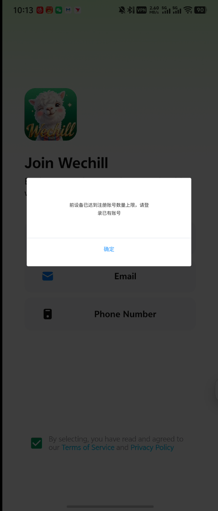
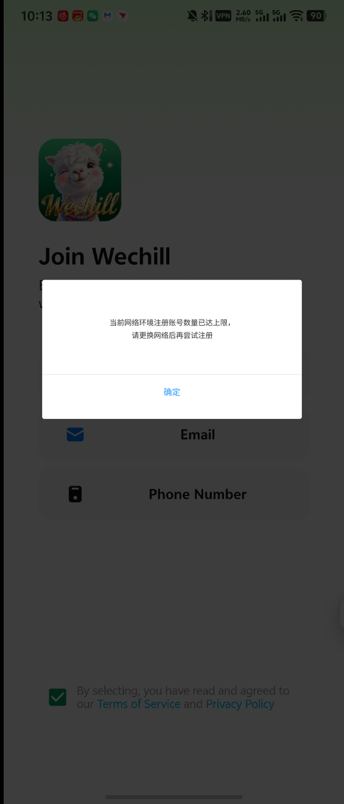
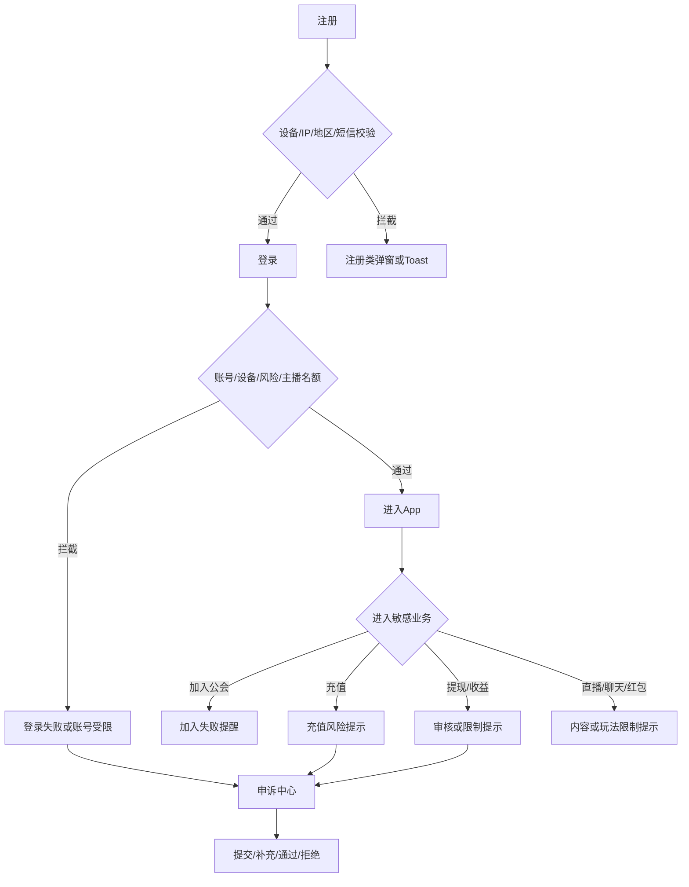

# WeChill 风控客户端弹窗与多语言文案汇总

版本：v1.0  
状态：评审版  
适用端：WeChill App、充值页、提现页、直播/派对、聊天与红包相关客户端场景  
语言：简体中文（zh-CN）、English（en）、العربية（ar）、Francais（fr-FR）、Turkce（tr-TR）

## 1. 文档目的

本文将现有风控文档中的客户端弹窗、Toast、封禁页、系统消息、页面拦截和身份校验提示统一整理为可落地的多语言文案表。文案 key、触发条件、展示形态和按钮动作均作为客户端与服务端联调依据。

本文不替代风控规则 PRD。规则阈值、风险等级、封禁对象和审批口径以终审版 PRD 为准；本文只规定用户能看到什么、何时看到、看到后能做什么。

## 2. 口径与来源优先级

| 优先级 | 来源 | 用途 |
|---:|---|---|
| 1 | [wechill风控体系PRD-v2.2-终审评审版.md](wechill风控体系PRD-v2.2-终审评审版.md) | 正式实现口径、最终文案、设备充值迁移规则 |
| 2 | [主播小号防控与平台风控优化PRD-v1.3-整合风控系统冲突决策版.md](主播小号防控与平台风控优化PRD-v1.3-整合风控系统冲突决策版.md) | 客户端历史场景、公会/主播限制与冲突决策 |
| 3 | [风控系统需求文档-v1.1-设备充值与设备账号封禁基础版.md](风控系统需求文档-v1.1-设备充值与设备账号封禁基础版.md) | 基础弹窗、黑金样式、加入公会提醒、三方充值校验 |
| 4 | [server现有风控逻辑梳理.md](server现有风控逻辑梳理.md) | 服务端已存在但 PRD 尚未统一客户端文案的补齐场景 |

同一场景出现不同文案时，按以上顺序处理。历史截图保留为视觉参考，正文正式文案优先于截图内旧文案。

## 3. 总体展示规则

### 3.1 展示形式

| 形式 | 使用场景 | 默认行为 |
|---|---|---|
| Dialog 弹窗 | 注册、登录、充值全面限制、账号封禁、申诉需要动作 | 半透明遮罩；高风险弹窗不可点击遮罩关闭 |
| Toast | 短时失败、低风险限制、操作结果、邀请失败 | 底部居中，默认 2.2 秒自动消失；需要用户留证的结果不得只用 Toast |
| 封禁页 | 账号无法登录、账号长期受限 | 保留申诉入口和客服入口；不提供换账号绕过入口 |
| 系统消息 | 收益审核、解封结果、申诉结果 | 可回看；支持跳转详情或申诉中心 |
| 页面拦截 | 三方充值身份校验、提现审核、红包/充值入口隐藏 | 保留返回路径，不能因空白页面让用户误以为客户端故障 |
| 内联提示 | 输入验证码、WeChill ID、申诉材料、提现表单 | 紧贴字段展示，错误不清空用户已填写内容 |

### 3.2 统一文案原则

- 不暴露具体设备指纹、IP、代理、规则阈值、关联账号、公会或风险分明细。
- 不把业务限制伪装成“网络错误”。服务异常可以说“服务繁忙”，业务限制要说明“暂不可用/已受限”。
- 注册/IP 场景不出现“请更换网络”或“请更换 IP”；统一使用“请稍后再试，如有疑问请联系客服”。
- 设备充值场景主语统一为“您当前的设备”，避免用户误以为换账号可以绕过设备累计限制。
- 账号解封、设备解封、充值解封、提现解除和收益解冻必须分别提示影响范围，不得使用“全部恢复”。
- 金额、时间、申诉单号、倒计时等均使用参数，不直接写死在翻译字符串中。
- 阿拉伯语必须使用 RTL；数字、金额和订单号使用隔离容器，避免方向混排。

### 3.3 历史弹窗样式留存

历史客户端样式继续作为注册、登录类强拦截的基础样式：全屏半透明遮罩、居中浅色卡片、标题/正文/按钮区分隔、单一确认按钮。多语言只替换文案，不另起一套视觉风格。






终审样式验收要求：弹窗居中、阿语 RTL 不错位、小屏不裁切、标题/正文/按钮可被读屏读取；强拦截弹窗不可通过点击遮罩绕过。

## 4. 客户端风控流程总览



## 5. 正式文案总表

以下场景来源于 v2.2 终审版和已确认的 v1.1/v1.3 规则，状态为“正式”。客户端应直接按 key 接入。

### 5.1 注册、登录、账号与主播/公会

| key | 场景 / 触发条件 | 形式 | 中文 | English | العربية | Francais | Turkce | 按钮 |
|---|---|---|---|---|---|---|---|---|
| `risk.register.device_limit` | 当前设备有效账号数达到上限 | Dialog | 注册失败<br>当前设备注册账号数量已达上限，请使用已有账号登录。 | Registration failed<br>This device has reached the account registration limit. Please log in with an existing account. | تعذر التسجيل<br>وصل هذا الجهاز إلى الحد الأقصى لتسجيل الحسابات. يرجى تسجيل الدخول بحساب موجود. | Echec de l'inscription<br>Cet appareil a atteint la limite de comptes enregistrables. Connectez-vous avec un compte existant. | Kayit basarisiz<br>Bu cihazdaki hesap kaydi limitine ulasildi. Lutfen mevcut bir hesapla giris yapin. | 确定 / OK |
| `risk.register.ip_frequent` | 24 小时内同一网络注册过于频繁 | Dialog | 注册失败<br>当前网络环境注册过于频繁，请稍后再试。如有疑问，请联系客服。 | Registration failed<br>There have been too many registrations from this network environment. Please try again later or contact support. | تعذر التسجيل<br>تم تسجيل عدد كبير من الحسابات من بيئة الشبكة الحالية. حاول مرة أخرى لاحقًا أو تواصل مع الدعم. | Echec de l'inscription<br>Trop d'inscriptions ont ete effectuees depuis cet environnement reseau. Reessayez plus tard ou contactez le support. | Kayit basarisiz<br>Bu ag ortamindan cok fazla kayit yapildi. Lutfen daha sonra tekrar deneyin veya destekle iletisime gecin. | 确定 / OK |
| `risk.register.country_blocked` | 当前地区不在可注册范围或命中制裁名单 | Dialog | 注册失败<br>当前地区暂不支持注册。 | Registration failed<br>Registration is not available in your current region. | تعذر التسجيل<br>التسجيل غير متاح في منطقتك الحالية. | Echec de l'inscription<br>L'inscription n'est pas disponible dans votre region actuelle. | Kayit basarisiz<br>Bulundugunuz bolgede kayit su anda kullanilamiyor. | 确定 / OK |
| `risk.register.device_banned` | 当前设备处于设备封禁状态 | Dialog | 注册失败<br>当前设备存在安全风险，暂不支持注册。 | Registration failed<br>Registration is temporarily unavailable on this device due to a security risk. | تعذر التسجيل<br>التسجيل غير متاح مؤقتًا على هذا الجهاز بسبب مخاطر أمنية. | Echec de l'inscription<br>L'inscription est temporairement indisponible sur cet appareil en raison d'un risque de securite. | Kayit basarisiz<br>Guvenlik riski nedeniyle bu cihazda kayit gecici olarak kullanilamiyor. | 确定 / OK |
| `risk.register.fingerprint_unavailable` | 设备指纹生成失败或服务不可用 | Dialog | 注册失败<br>当前设备安全校验暂时不可用，请稍后再试。 | Registration failed<br>Device security verification is temporarily unavailable. Please try again later. | تعذر التسجيل<br>التحقق الأمني من الجهاز غير متاح مؤقتًا. حاول مرة أخرى لاحقًا. | Echec de l'inscription<br>La verification de securite de l'appareil est temporairement indisponible. Reessayez plus tard. | Kayit basarisiz<br>Cihaz guvenlik dogrulamasi gecici olarak kullanilamiyor. Lutfen daha sonra tekrar deneyin. | 确定 / OK |
| `risk.sms.rate_limited` | 验证码发送频次超过限制 | Inline / Toast | 验证码发送过于频繁，请稍后再试。 | Verification codes have been requested too frequently. Please try again later. | تم طلب رموز التحقق بشكل متكرر جدًا. حاول مرة أخرى لاحقًا. | Trop de demandes de codes de verification. Reessayez plus tard. | Dogrulama kodu talepleri cok sik yapildi. Lutfen daha sonra tekrar deneyin. | 无 |
| `risk.network.abnormal` | VPN、代理、机房或网络环境命中高风险规则 | Dialog / Toast | 当前网络环境异常，请稍后再试。如有疑问，请联系客服。 | The current network environment is unusual. Please try again later or contact support. | بيئة الشبكة الحالية غير معتادة. حاول مرة أخرى لاحقًا أو تواصل مع الدعم. | L'environnement reseau actuel est inhabituel. Reessayez plus tard ou contactez le support. | Mevcut ag ortami olagandisi. Lutfen daha sonra tekrar deneyin veya destekle iletisime gecin. | 确定 / OK |
| `risk.login.high_risk_environment` | 危险分达到登录拦截阈值 | Dialog | 登录异常<br>当前登录环境异常，请稍后再试。如有疑问，请联系客服。 | Sign-in issue<br>The current sign-in environment is unusual. Please try again later or contact support. | مشكلة في تسجيل الدخول<br>بيئة تسجيل الدخول الحالية غير معتادة. حاول مرة أخرى لاحقًا أو تواصل مع الدعم. | Probleme de connexion<br>L'environnement de connexion actuel est inhabituel. Reessayez plus tard ou contactez le support. | Giris sorunu<br>Mevcut giris ortami olagandisi. Lutfen daha sonra tekrar deneyin veya destekle iletisime gecin. | 确定 / OK |
| `risk.login.account_banned` | 账号被账号封禁、严重违规或合规限制 | 封禁页 / Dialog | 账号受限<br>当前账号存在安全风险，已被限制使用。如有疑问，可提交申诉。 | Account restricted<br>This account has been restricted due to a security risk. You may submit an appeal if you have questions. | الحساب مقيد<br>تم تقييد هذا الحساب بسبب مخاطر أمنية. يمكنك تقديم طلب استئناف إذا كانت لديك أسئلة. | Compte restreint<br>Ce compte a ete restreint en raison d'un risque de securite. Vous pouvez envoyer un recours si necessaire. | Hesap kisitlandi<br>Guvenlik riski nedeniyle bu hesap kisitlandi. Sorulariniz varsa itiraz gonderebilirsiniz. | 提交申诉 / Submit an appeal |
| `risk.login.device_banned` | 账号未封但当前设备被封禁 | Dialog | 登录失败<br>当前设备存在安全风险，暂不支持登录。 | Sign-in failed<br>Sign-in is temporarily unavailable on this device due to a security risk. | تعذر تسجيل الدخول<br>تسجيل الدخول غير متاح مؤقتًا على هذا الجهاز بسبب مخاطر أمنية. | Echec de la connexion<br>La connexion est temporairement indisponible sur cet appareil en raison d'un risque de securite. | Giris basarisiz<br>Guvenlik riski nedeniyle bu cihazda giris gecici olarak kullanilamiyor. | 确定 / OK |
| `risk.host.device_occupied` | 当前设备已有其他主播/公会长占用主播名额 | Dialog | 登录失败<br>当前设备已存在主播账号，为保障平台安全，暂不支持登录其他主播账号。 | Sign-in failed<br>This device already has a host account. To protect platform security, another host account cannot sign in here. | تعذر تسجيل الدخول<br>يوجد حساب مضيف على هذا الجهاز. لحماية أمان المنصة، لا يمكن لحساب مضيف آخر تسجيل الدخول من هنا. | Echec de la connexion<br>Un compte hote est deja associe a cet appareil. Pour proteger la plateforme, un autre compte hote ne peut pas s'y connecter. | Giris basarisiz<br>Bu cihazda zaten bir yayin sunucusu hesabi var. Platform guvenligi icin baska bir yayin sunucusu hesabi bu cihazdan giris yapamaz. | 确定 / OK |
| `risk.guild.join_blocked` | 普通用户主动申请加入公会被设备主播占用、风险等级或公会规则拦截 | Dialog | 加入失败<br>当前设备已存在主播/公会长账号，一个设备仅支持一个账号加入公会。 | Join failed<br>This device already has a host or agency-owner account. Only one account per device may join an agency. | تعذر الانضمام<br>يوجد على هذا الجهاز حساب مضيف أو مالك وكالة. يسمح لحساب واحد فقط بالانضمام إلى الوكالة من الجهاز. | Echec de l'adhesion<br>Cet appareil contient deja un compte hote ou proprietaire d'agence. Un seul compte par appareil peut rejoindre une agence. | Katilim basarisiz<br>Bu cihazda zaten bir yayin sunucusu veya ajans sahibi hesabi var. Cihaz basina yalnizca bir hesap ajansa katilabilir. | 确定 / OK |
| `risk.guild.invite_accept_blocked` | 用户接受公会邀请时命中设备主播占用 | Dialog | 加入失败<br>当前设备已存在主播/公会长账号，暂无法接受该公会邀请。 | Join failed<br>This device already has a host or agency-owner account, so this agency invitation cannot be accepted now. | تعذر الانضمام<br>يوجد على هذا الجهاز حساب مضيف أو مالك وكالة، ولا يمكن قبول دعوة الوكالة حاليًا. | Echec de l'adhesion<br>Cet appareil contient deja un compte hote ou proprietaire d'agence. Cette invitation ne peut pas etre acceptee pour le moment. | Katilim basarisiz<br>Bu cihazda zaten bir yayin sunucusu veya ajans sahibi hesabi var. Bu ajans daveti su anda kabul edilemiyor. | 确定 / OK |
| `risk.guild.invite_send_blocked` | 公会长邀请对象不符合加入条件 | Toast | 邀请失败：该用户暂不符合加入公会条件，无法发送邀请。 | Invitation failed: This user is not currently eligible to join an agency. | تعذر إرسال الدعوة: هذا المستخدم غير مؤهل حاليًا للانضمام إلى الوكالة. | Echec de l'invitation : cet utilisateur ne peut pas rejoindre une agence pour le moment. | Davet basarisiz: Bu kullanici su anda bir ajansa katilmaya uygun degil. | 无 |

### 5.2 充值、支付与设备风险

| key | 场景 / 触发条件 | 形式 | 中文 | English | العربية | Francais | Turkce | 按钮 |
|---|---|---|---|---|---|---|---|---|
| `risk.recharge.account_restricted` | 账号状态不允许充值，例如账号封禁或未成年人限制 | Dialog / Toast | 充值受限<br>当前账号无法完成充值。如有疑问，请联系客服核实。 | Recharge restricted<br>This account cannot complete a recharge. Please contact support if you need help. | إعادة الشحن مقيدة<br>لا يمكن لهذا الحساب إكمال إعادة الشحن. تواصل مع الدعم إذا احتجت إلى المساعدة. | Recharge restreint<br>Ce compte ne peut pas effectuer de recharge. Contactez le support si necessaire. | Yukleme kisitlandi<br>Bu hesap yukleme islemini tamamlayamiyor. Yardima ihtiyaciniz varsa destekle iletisime gecin. | 联系客服 / Contact support |
| `risk.recharge.device_limit_200` | 设备累计充值达到 200 美金档 | Toast / Dialog | 充值暂不可用<br>为保障账号安全，您当前的设备暂时无法进行充值，请稍后再试，如有疑问请联系客服。 | Recharge temporarily unavailable<br>For account security, recharges are temporarily unavailable on this device. Please try again later or contact support. | إعادة الشحن غير متاحة مؤقتًا<br>لحماية أمان الحساب، إعادة الشحن غير متاحة مؤقتًا على هذا الجهاز. حاول لاحقًا أو تواصل مع الدعم. | Recharge temporairement indisponible<br>Pour proteger votre compte, les recharges sont temporairement indisponibles sur cet appareil. Reessayez plus tard ou contactez le support. | Yukleme gecici olarak kullanilamiyor<br>Hesap guvenligi icin bu cihazda yukleme gecici olarak kullanilamiyor. Daha sonra tekrar deneyin veya destekle iletisime gecin. | 联系客服 / Contact support |
| `risk.recharge.device_limit_1000` | 设备累计充值达到 1000 美金档 | Dialog | 充值暂不可用<br>为保障账号安全，您当前的设备暂时无法进行充值，请稍后再试，如有疑问请联系客服。 | Recharge temporarily unavailable<br>For account security, recharges are temporarily unavailable on this device. Please try again later or contact support. | إعادة الشحن غير متاحة مؤقتًا<br>لحماية أمان الحساب، إعادة الشحن غير متاحة مؤقتًا على هذا الجهاز. حاول لاحقًا أو تواصل مع الدعم. | Recharge temporairement indisponible<br>Pour proteger votre compte, les recharges sont temporairement indisponibles sur cet appareil. Reessayez plus tard ou contactez le support. | Yukleme gecici olarak kullanilamiyor<br>Hesap guvenligi icin bu cihazda yukleme gecici olarak kullanilamiyor. Daha sonra tekrar deneyin veya destekle iletisime gecin. | 联系客服 / Contact support |
| `risk.recharge.device_blocked` | 设备被设置全面限制充值 | Dialog | 充值受限<br>您当前的设备已被限制充值。请通过 App 内“设置 → 申诉中心”提交申诉。 | Recharge restricted<br>Recharges have been restricted on your current device. Submit an appeal through App Settings > Appeal Center. | إعادة الشحن مقيدة<br>تم تقييد إعادة الشحن على جهازك الحالي. قدم طلب استئناف من خلال الإعدادات > مركز الاستئناف داخل التطبيق. | Recharge restreint<br>Les recharges sont restreintes sur votre appareil actuel. Envoyez un recours depuis Reglages > Centre des recours dans l'application. | Yukleme kisitlandi<br>Mevcut cihazinizda yukleme kisitlandi. Uygulama Ayarlar > Itiraz Merkezi bolumunden itiraz gonderin. | 提交申诉 / Submit an appeal |
| `risk.recharge.observe_retriggered` | 设备解封观察期内再次命中充值风险 | Dialog / Toast | 充值限制已恢复<br>检测到您当前设备充值风险升高，已恢复原限制档位。如有疑问请联系客服。 | Recharge restriction restored<br>Recharge risk on your current device has increased, so the previous restriction level has been restored. Contact support if you need help. | تمت استعادة قيد إعادة الشحن<br>ارتفعت مخاطر إعادة الشحن على جهازك الحالي، لذلك تمت استعادة مستوى القيد السابق. تواصل مع الدعم عند الحاجة. | Restriction de recharge retablie<br>Le risque de recharge sur votre appareil actuel a augmente. Le niveau de restriction precedent a ete retabli. Contactez le support si necessaire. | Yukleme kisitlamasi geri getirildi<br>Mevcut cihazinizdaki yukleme riski artti ve onceki kisitlama seviyesi geri getirildi. Yardim icin destekle iletisime gecin. | 联系客服 / Contact support |
| `risk.recharge.untrusted_environment` | 模拟器、Root、越狱或云手机环境发起充值 | Dialog | 充值失败<br>检测到当前运行环境异常，请使用正式设备发起充值。 | Recharge failed<br>An unusual runtime environment was detected. Please start the recharge from a supported physical device. | تعذر إعادة الشحن<br>تم اكتشاف بيئة تشغيل غير معتادة. يرجى بدء إعادة الشحن من جهاز فعلي مدعوم. | Echec de la recharge<br>Un environnement d'execution inhabituel a ete detecte. Lancez la recharge depuis un appareil physique compatible. | Yukleme basarisiz<br>Olagandisi bir calisma ortami algilandi. Lutfen yuklemeyi desteklenen fiziksel bir cihazdan baslatin. | 确定 / OK |
| `risk.recharge.fingerprint_unavailable` | 充值前设备指纹缺失或风控服务不可用 | Toast / Dialog | 充值校验暂不可用<br>当前设备安全校验暂时不可用，请稍后再试。 | Recharge verification unavailable<br>Device security verification is temporarily unavailable. Please try again later. | التحقق من إعادة الشحن غير متاح<br>التحقق الأمني من الجهاز غير متاح مؤقتًا. حاول مرة أخرى لاحقًا. | Verification de recharge indisponible<br>La verification de securite de l'appareil est temporairement indisponible. Reessayez plus tard. | Yukleme dogrulamasi kullanilamiyor<br>Cihaz guvenlik dogrulamasi gecici olarak kullanilamiyor. Lutfen daha sonra tekrar deneyin. | 无 |
| `risk.recharge.region_unavailable` | 台湾/越南等地区命中渠道或金额风险，价格列表为空 | Page / Toast | 当前地区暂不支持该充值方式，请稍后再试或联系客服。 | This recharge method is temporarily unavailable in your region. Please try again later or contact support. | طريقة إعادة الشحن هذه غير متاحة مؤقتًا في منطقتك. حاول لاحقًا أو تواصل مع الدعم. | Ce mode de recharge est temporairement indisponible dans votre region. Reessayez plus tard ou contactez le support. | Bu yukleme yontemi bolgenizde gecici olarak kullanilamiyor. Daha sonra tekrar deneyin veya destekle iletisime gecin. | 联系客服 / Contact support |
| `risk.recharge.third_party_id_required` | 三方充值身份校验页未填写 WeChill ID | Inline | 请输入 WeChill ID 后继续。 | Enter your WeChill ID to continue. | أدخل معرّف WeChill الخاص بك للمتابعة. | Saisissez votre identifiant WeChill pour continuer. | Devam etmek icin WeChill ID'nizi girin. | 无 |
| `risk.recharge.third_party_code_invalid` | 验证码错误、过期、已使用或与 WeChill ID 不匹配 | Inline / Dialog | 验证码无效或已过期，请重新获取后再试。 | The verification code is invalid or expired. Please request a new code and try again. | رمز التحقق غير صالح أو منتهي الصلاحية. اطلب رمزًا جديدًا وحاول مرة أخرى. | Le code de verification est invalide ou expire. Demandez un nouveau code et reessayez. | Dogrulama kodu gecersiz veya suresi dolmus. Yeni bir kod isteyip tekrar deneyin. | 重新获取 / Get a new code |
| `risk.recharge.validation_failed` | 风控前置校验超时或充值订单不能创建 | Toast | 当前充值校验失败，请稍后重试。 | Recharge verification failed. Please try again later. | فشل التحقق من إعادة الشحن. حاول مرة أخرى لاحقًا. | Echec de la verification de recharge. Reessayez plus tard. | Yukleme dogrulamasi basarisiz. Lutfen daha sonra tekrar deneyin. | 无 |
| `risk.recharge.underage` | 疑似未成年人充值或监护退款链路 | Dialog | 充值限制<br>当前账号无法完成充值。如非未成年人使用，请联系客服核实。 | Recharge restricted<br>This account cannot complete a recharge. If the account holder is not a minor, contact support for verification. | إعادة الشحن مقيدة<br>لا يمكن لهذا الحساب إكمال إعادة الشحن. إذا لم يكن المستخدم قاصرًا، تواصل مع الدعم للتحقق. | Recharge restreint<br>Ce compte ne peut pas effectuer de recharge. Si l'utilisateur n'est pas mineur, contactez le support pour verification. | Yukleme kisitlandi<br>Bu hesap yukleme islemini tamamlayamiyor. Kullanici reşit degilse, dogrulama icin destekle iletisime gecin. | 联系客服 / Contact support |

### 5.3 提现、收益、封禁解除与申诉

| key | 场景 / 触发条件 | 形式 | 中文 | English | العربية | Francais | Turkce | 按钮 |
|---|---|---|---|---|---|---|---|---|
| `risk.withdrawal.reviewing` | 提现命中风控，进入人工审核 | Page / System message | 提现审核中<br>当前提现正在安全审核中，请耐心等待审核结果。 | Withdrawal under review<br>Your withdrawal is under security review. Please wait for the result. | السحب قيد المراجعة<br>تتم مراجعة عملية السحب لأسباب أمنية. يرجى انتظار النتيجة. | Retrait en cours d'examen<br>Votre retrait fait l'objet d'une verification de securite. Attendez le resultat. | Para cekme inceleniyor<br>Para cekme isleminiz guvenlik incelemesinde. Lutfen sonucu bekleyin. | 查看详情 / View details |
| `risk.withdrawal.restricted` | 提现能力被限制或设备处于观察期 | Page / Dialog | 提现受限<br>当前提现暂不可用，请完成安全审核或提交申诉。 | Withdrawal restricted<br>Withdrawals are temporarily unavailable. Complete the security review or submit an appeal. | السحب مقيد<br>السحب غير متاح مؤقتًا. أكمل المراجعة الأمنية أو قدم طلب استئناف. | Retrait restreint<br>Les retraits sont temporairement indisponibles. Terminez la verification ou envoyez un recours. | Para cekme kisitlandi<br>Para cekme gecici olarak kullanilamiyor. Guvenlik incelemesini tamamlayin veya itiraz gonderin. | 提交申诉 / Submit an appeal |
| `risk.salary.freeze` | 风险链路收益进入审核或冻结 | System message | 安全审核中<br>当前收益正在安全审核中，审核完成后将更新结算状态。 | Under security review<br>Your earnings are under security review. The settlement status will be updated when the review is complete. | قيد المراجعة الأمنية<br>تخضع أرباحك للمراجعة الأمنية. سيتم تحديث حالة التسوية بعد اكتمال المراجعة. | Verification de securite en cours<br>Vos revenus font l'objet d'une verification. Le statut du reglement sera mis a jour a la fin de l'examen. | Guvenlik incelemesi suruyor<br>Kazanclariniz guvenlik incelemesinde. Inceleme tamamlandiginda odeme durumu guncellenecek. | 查看详情 / View details |
| `risk.appeal.submitted` | 申诉提交成功 | System message / Toast | 申诉已提交，我们会尽快处理，请勿重复提交。 | Appeal submitted. We will review it as soon as possible. Please do not submit again. | تم إرسال طلب الاستئناف. سنراجعه في أقرب وقت ممكن. يرجى عدم التقديم مرة أخرى. | Recours envoye. Nous l'examinerons dans les meilleurs delais. Ne l'envoyez pas a nouveau. | Itiraz gonderildi. En kisa surede inceleyecegiz. Lutfen tekrar gondermeyin. | 查看申诉 / View appeal |
| `risk.appeal.duplicate` | 已存在处理中或重复申诉 | Toast | 你已有申诉正在处理中，请等待审核结果。 | You already have an appeal in progress. Please wait for the review result. | لديك طلب استئناف قيد المعالجة بالفعل. يرجى انتظار نتيجة المراجعة. | Vous avez deja un recours en cours. Attendez le resultat de l'examen. | Devam eden bir itiraziniz zaten var. Lutfen inceleme sonucunu bekleyin. | 查看申诉 / View appeal |
| `risk.appeal.need_more_info` | 审核人员要求补充材料 | Dialog / System message | 需要补充材料<br>当前申诉信息不足，请补充相关证明后再次提交。 | More information required<br>Your appeal is missing information. Add the requested evidence and submit again. | معلومات إضافية مطلوبة<br>تنقص طلب الاستئناف معلومات. أضف المستندات المطلوبة ثم أرسله مرة أخرى. | Informations complementaires requises<br>Votre recours est incomplet. Ajoutez les justificatifs demandes puis envoyez-le a nouveau. | Ek bilgi gerekli<br>Itiraziniz eksik bilgiler iceriyor. Istenen kanitlari ekleyip tekrar gonderin. | 补充材料 / Add documents |
| `risk.appeal.approved` | 申诉审核通过 | System message | 申诉通过<br>相关限制已解除，部分收益或提现能力可能仍需审核。 | Appeal approved<br>The related restriction has been removed. Some earnings or withdrawal access may still require review. | تمت الموافقة على الاستئناف<br>تمت إزالة القيد ذي الصلة. قد تظل بعض الأرباح أو صلاحيات السحب بحاجة إلى مراجعة. | Recours accepte<br>La restriction concernee a ete levee. Certains revenus ou acces au retrait peuvent encore etre soumis a verification. | Itiraz onaylandi<br>Ilgili kisitlama kaldirildi. Bazi kazanc veya para cekme yetkileri inceleme gerektirebilir. | 查看详情 / View details |
| `risk.appeal.rejected` | 申诉审核拒绝 | System message | 申诉拒绝<br>经核实，当前限制暂不解除。如有新证明，可重新提交。 | Appeal rejected<br>The current restriction will remain in place after review. You may submit again with new evidence. | تم رفض الاستئناف<br>سيستمر القيد الحالي بعد المراجعة. يمكنك التقديم مرة أخرى بأدلة جديدة. | Recours refuse<br>La restriction actuelle est maintenue apres examen. Vous pouvez envoyer un nouveau recours avec de nouveaux justificatifs. | Itiraz reddedildi<br>Inceleme sonucunda mevcut kisitlama devam edecek. Yeni kanitlariniz varsa tekrar gonderebilirsiniz. | 查看原因 / View reason |
| `risk.appeal.observe_period` | 解封或限制解除后进入观察期 | System message | 限制已解除<br>账号已恢复使用，观察期内再次触发风险将重新限制。 | Restriction removed<br>Your account is available again. The restriction may be reapplied if risk is detected during the observation period. | تمت إزالة القيد<br>أصبح حسابك متاحًا مرة أخرى. قد تتم إعادة تفعيل القيد إذا تم اكتشاف مخاطر خلال فترة المراقبة. | Restriction levee<br>Votre compte est de nouveau disponible. La restriction peut etre appliquee a nouveau si un risque est detecte pendant la periode d'observation. | Kisitlama kaldirildi<br>Hesabiniz yeniden kullanilabilir. Gozlem suresinde risk algilanirsa kisitlama tekrar uygulanabilir. | 我知道了 / Got it |
| `risk.unban.account_success` | 账号解封成功 | System message | 限制已解除<br>你的账号限制已解除，请遵守平台规则，避免再次触发安全限制。 | Restriction removed<br>Your account restriction has been removed. Please follow the platform rules to avoid further restrictions. | تمت إزالة القيد<br>تمت إزالة القيود عن حسابك. يرجى الالتزام بقواعد المنصة لتجنب قيود أخرى. | Restriction levee<br>La restriction de votre compte a ete levee. Respectez les regles de la plateforme pour eviter de nouvelles restrictions. | Kisitlama kaldirildi<br>Hesap kisitlamaniz kaldirildi. Yeni kisitlamalari onlemek icin platform kurallarina uyun. | 我知道了 / Got it |
| `risk.unban.partial_restore` | 仅恢复某一类能力，例如设备充值解封 | Dialog / System message | 部分功能已恢复<br>本次仅恢复设备充值能力，账号封禁、提现限制和收益审核不会自动解除。 | Partial access restored<br>Only recharge access has been restored. Account bans, withdrawal restrictions and earnings reviews are not removed automatically. | تمت استعادة جزء من الصلاحيات<br>تمت استعادة صلاحية إعادة الشحن فقط. لا تتم إزالة حظر الحساب أو قيود السحب أو مراجعة الأرباح تلقائيًا. | Acces partiellement retabli<br>Seul l'acces aux recharges a ete retabli. Les restrictions de compte, de retrait et la verification des revenus ne sont pas levees automatiquement. | Kismen erisim geri yuklendi<br>Yalnizca yukleme erisimi geri getirildi. Hesap yasagi, para cekme kisitlamasi ve kazanc incelemesi otomatik olarak kaldirilmaz. | 查看详情 / View details |

### 5.4 通用异常与服务降级

| key | 场景 / 触发条件 | 形式 | 中文 | English | العربية | Francais | Turkce | 按钮 |
|---|---|---|---|---|---|---|---|---|
| `risk.common.service_busy` | 普通风控服务繁忙，低风险动作可重试 | Toast | 当前服务繁忙，请稍后再试。 | The service is busy. Please try again later. | الخدمة مشغولة حاليًا. حاول مرة أخرى لاحقًا. | Le service est momentanement surcharge. Reessayez plus tard. | Hizmet su anda yogun. Lutfen daha sonra tekrar deneyin. | 无 |
| `risk.common.action_failed` | 操作失败兜底 | Toast | 操作失败，请稍后重试或联系技术支持。 | The operation failed. Please try again later or contact technical support. | تعذر تنفيذ العملية. حاول مرة أخرى لاحقًا أو تواصل مع الدعم الفني. | L'operation a echoue. Reessayez plus tard ou contactez le support technique. | Islem basarisiz. Lutfen daha sonra tekrar deneyin veya teknik destekle iletisime gecin. | 无 |
| `risk.common.pending` | 风控/提现/结算异步处理未完成 | Toast / System message | 正在处理中，请稍候查看结果。 | Processing. Please check the result later. | جارٍ المعالجة. يرجى التحقق من النتيجة لاحقًا. | Traitement en cours. Consultez le resultat plus tard. | Isleniyor. Lutfen sonucu daha sonra kontrol edin. | 查看详情 / View details |
| `risk.common.request_timeout` | 请求超时但未确认最终状态 | Toast | 请求超时，结果可能仍在处理中，请稍后查看。 | The request timed out. It may still be processing. Please check again later. | انتهت مهلة الطلب. قد تكون العملية قيد المعالجة. تحقق مرة أخرى لاحقًا. | La demande a expire. Elle peut toujours etre en cours de traitement. Verifiez plus tard. | Istek zaman asimina ugradi. Islem hala devam ediyor olabilir. Daha sonra tekrar kontrol edin. | 查看详情 / View details |
| `risk.common.login_restricted` | 账号或设备限制但不向用户暴露细分因子 |封禁页 / Dialog | 当前登录受限，请通过申诉中心提交申请。 | Sign-in is restricted. Please submit an appeal through the Appeal Center. | تسجيل الدخول مقيد. قدم طلبًا من خلال مركز الاستئناف. | La connexion est restreinte. Envoyez un recours depuis le Centre des recours. | Giris kisitlandi. Itiraz Merkezi uzerinden basvuru gonderin. | 提交申诉 / Submit an appeal |

## 6. 服务端已有、原 PRD 未统一的客户端场景

以下场景已在服务端逻辑中出现，但现有风控 PRD 没有给出统一的客户端固定文案。本文给出建议初稿，状态为“需产品/法务确认”，确认后应把 `PROPOSED` 改为正式 key。

来源：[server现有风控逻辑梳理.md](server现有风控逻辑梳理.md)。

### 6.1 聊天与内容安全

| key | 触发条件 | 形式 | 中文 | English | العربية | Francais | Turkce | 按钮 | 状态 |
|---|---|---|---|---|---|---|---|---|---|
| `risk.chat.text_blocked` | 文本命中广告、违规或审核 BLOCK | Toast | 该内容暂不支持发送，请修改后重试。 | This content cannot be sent. Please edit it and try again. | لا يمكن إرسال هذا المحتوى. عدّل المحتوى ثم حاول مرة أخرى. | Ce contenu ne peut pas etre envoye. Modifiez-le puis reessayez. | Bu icerik gonderilemiyor. Duzenleyip tekrar deneyin. | 无 | PROPOSED |
| `risk.chat.image_blocked` | 图片命中违规或广告图片拦截 | Toast | 图片内容不符合平台规范，无法发送。 | This image does not meet platform guidelines and cannot be sent. | لا تتوافق هذه الصورة مع إرشادات المنصة ولا يمكن إرسالها. | Cette image ne respecte pas les regles de la plateforme et ne peut pas etre envoyee. | Bu gorsel platform kurallarina uygun olmadigi icin gonderilemiyor. | 无 | PROPOSED |
| `risk.chat.message_muted` | 用户在房间内被禁言 | Toast / Room banner | 你已被暂时禁言，请在 {duration} 后再试。 | You are temporarily muted. Please try again after {duration}. | تم كتمك مؤقتًا. حاول مرة أخرى بعد {duration}. | Vous etes temporairement reduit au silence. Reessayez dans {duration}. | Gecici olarak susturuldunuz. {duration} sonra tekrar deneyin. | 无 | PROPOSED |
| `risk.live.screenshot_review` | 直播/派对截图命中 REVIEW 或首次 BLOCK | Room banner / Dialog | 直播内容需要进一步审核，请及时调整直播内容。 | Your live content requires further review. Please adjust it promptly. | يحتاج محتوى البث المباشر إلى مراجعة إضافية. يرجى تعديل المحتوى فورًا. | Votre contenu en direct doit faire l'objet d'un examen complementaire. Modifiez-le rapidement. | Canli yayin iceriginiz ek inceleme gerektiriyor. Lutfen icerigi hemen duzenleyin. | 我知道了 / Got it | PROPOSED |
| `risk.live.ended_for_safety` | 多次命中直播截图 BLOCK，直播/通话被结束 | Dialog | 直播已结束<br>因直播内容存在安全风险，当前直播已结束。如有疑问请联系客服。 | Live ended<br>Your live session ended because the content presented a security risk. Contact support if you need help. | انتهى البث<br>انتهت جلستك بسبب مخاطر أمنية في المحتوى. تواصل مع الدعم عند الحاجة. | Direct termine<br>Votre session a ete arretee en raison d'un risque de securite dans le contenu. Contactez le support si necessaire. | Canli yayin sona erdi<br>Icerikteki guvenlik riski nedeniyle canli yayininiz sona erdirildi. Yardim icin destekle iletisime gecin. | 联系客服 / Contact support | PROPOSED |
| `risk.live.mic_disabled` | 房间禁麦 | Toast / Room banner | 当前已暂时关闭你的麦克风权限。 | Your microphone access is temporarily disabled. | تم تعطيل صلاحية الميكروفون مؤقتًا. | L'acces a votre microphone est temporairement desactive. | Mikrofon erisiminiz gecici olarak devre disi. | 无 | PROPOSED |
| `risk.live.video_disabled` | 房间禁视频 | Toast / Room banner | 当前已暂时关闭你的视频权限。 | Your video access is temporarily disabled. | تم تعطيل صلاحية الفيديو مؤقتًا. | L'acces a votre camera est temporairement desactive. | Video erisiminiz gecici olarak devre disi. | 无 | PROPOSED |

### 6.2 红包、兑换与派对玩法

| key | 触发条件 | 形式 | 中文 | English | العربية | Francais | Turkce | 按钮 | 状态 |
|---|---|---|---|---|---|---|---|---|---|
| `risk.red_packet.restricted` | 红包限制级：可发可领，但发放者不享受返奖 | Inline / Toast | 红包返奖资格受限，本次发红包不参与返奖。 | Your red-packet rebate eligibility is restricted. This red packet will not qualify for a rebate. | أهلية استرداد مكافأة الظرف مقيدة. لن يتأهل هذا الظرف لاسترداد المكافأة. | Votre eligibilite au remboursement du paquet est restreinte. Ce paquet ne donnera pas droit a un remboursement. | Kirmizi zarf iade uygunlugunuz kisitlandi. Bu zarf iade kapsaminda olmayacak. | 查看详情 / View details | PROPOSED |
| `risk.red_packet.dangerous` | 红包危险级：红包入口隐藏，禁止发放和领取 | Empty / Dialog | 红包功能暂不可用，如有疑问请联系客服。 | Red packets are temporarily unavailable. Please contact support if you need help. | ميزة الأظرف غير متاحة مؤقتًا. تواصل مع الدعم إذا احتجت إلى المساعدة. | Les paquets sont temporairement indisponibles. Contactez le support si necessaire. | Kirmizi zarf ozelligi gecici olarak kullanilamiyor. Yardim icin destekle iletisime gecin. | 联系客服 / Contact support | PROPOSED |
| `risk.diamond.exchange_blocked` | 命中钻石兑换金币黑名单 | Dialog / Toast | 当前兑换暂不可用，请联系客服。 | This exchange is temporarily unavailable. Please contact support. | هذا الاستبدال غير متاح مؤقتًا. تواصل مع الدعم. | Cet echange est temporairement indisponible. Contactez le support. | Bu donusum gecici olarak kullanilamiyor. Lutfen destekle iletisime gecin. | 联系客服 / Contact support | PROPOSED |
| `risk.party.short_round_restricted` | 短局高频风险，暂不允许继续创建指定游戏房 | Toast / Dialog | 当前暂不支持继续创建该类型游戏房，请稍后再试。 | You cannot create more rooms of this game type right now. Please try again later. | لا يمكنك إنشاء المزيد من غرف هذا النوع من الألعاب حاليًا. حاول مرة أخرى لاحقًا. | Vous ne pouvez pas creer d'autres salles de ce type pour le moment. Reessayez plus tard. | Su anda bu oyun turunde daha fazla oda olusturamazsiniz. Lutfen daha sonra tekrar deneyin. | 无 | PROPOSED |

## 7. 风控状态与提示优先级

同一次操作命中多个规则时，客户端只展示一个主提示，按以下优先级选取；后台仍需完整记录所有命中原因。

```text
合规/制裁/严重欺诈
> 账号封禁
> 设备封禁
> 主播设备登录限制
> 设备充值全面限制
> 设备充值 1000 美金档
> 设备充值 200 美金档
> 提现限制/收益冻结
> IP/短信/网络环境限制
> 普通服务异常
```

### 7.1 解封影响范围必须明确

| 操作 | 自动恢复 | 不自动恢复 |
|---|---|---|
| 账号解封 | 登录和账号普通使用 | 主播身份、设备封禁、设备充值、提现、收益冻结 |
| 设备解封 | 当前设备注册/登录能力，视审批结果 | 账号封禁、充值封禁、收益冻结、提现限制 |
| 设备充值解封 | 当前设备充值能力，进入观察期 | 账号封禁、设备登录封禁、提现限制、收益冻结 |
| 收益解冻 | 指定冻结收益 | 账号风险等级、设备风险等级、其他提现限制 |
| 红包限制解除 | 红包发/领能力或返奖资格，按解除对象执行 | 账号、设备、提现及其他风险状态 |

### 7.2 不允许的客户端行为

- 不得在客户端提示“换账号即可继续充值/登录”。
- 不得在 IP 注册限制中提示“更换网络”“更换 IP”。
- 不得把“账号解封”展示成“全部功能已恢复”。
- 不得展示完整设备指纹、手机号、IP、支付凭证号、关联账号列表或风险分明细。
- 不得让客户端本地状态替代服务端校验；注册、主播、公会、充值、提现必须以服务端结果为准。

## 8. 多语言工程规范

### 8.1 Key 与响应字段

客户端建议统一使用以下结构：

```json
{
  "code": "RISK_DEVICE_RECHARGE_LIMITED",
  "message_key": "risk.recharge.device_limit_200",
  "display_type": "dialog",
  "risk_scope": "device",
  "appeal_available": true,
  "cta": "support",
  "params": {
    "amount": "200",
    "currency": "USD",
    "duration": "7 days"
  }
}
```

服务端只返回 key、展示类型、作用域和参数，不直接返回某一种语言的长文案。客户端根据用户语言加载翻译；key 不存在时回退 `zh-CN`，不得展示空白或原始错误码。

### 8.2 参数规则

| 参数 | 示例 | 规则 |
|---|---|---|
| `{amount}` | `200` | 根据语言格式化；不在翻译文本中重复拼接币种 |
| `{currency}` | `USD` | 金额旁展示，阿语使用独立数字容器 |
| `{duration}` | `7 days` | 由客户端按当前语言本地化，不直接把中文单位传入翻译 |
| `{appeal_id}` | `AP-20260724-001` | 脱敏展示，可复制但不参与翻译 |
| `{support_url}` | App 内客服链接 | 通过 CTA 配置，不写死在长文案里 |

### 8.3 阿语 RTL 验收

- 标题、正文、字段标签和按钮文案使用 RTL；弹窗仍保持视觉居中。
- 按钮语义顺序不因 RTL 被错误反转；主按钮始终保持主视觉位置。
- `$200`、订单号、申诉单号、版本号采用 `dir="ltr"` 隔离。
- 阿语长文案允许 3 行，卡片高度自适应，不裁切 CTA。
- 英文、法语、土耳其语不得出现中文标点或中文 fallback。

## 9. 客户端验收清单

### 9.1 文案与触发

- 设备第 4 个账号注册被拦截，展示 `risk.register.device_limit`。
- IP 过频拦截不出现“更换网络/IP”。
- 危险分登录拦截展示“当前登录环境异常”，不暴露危险分。
- 同设备第二个主播登录、加入公会、接受邀请、公会长发邀请分别命中对应文案，公会长侧不暴露他人风险细节。
- 设备充值 200、1000、全面限制均以设备为主语；同设备切换账号仍展示相同设备范围提示。
- 设备充值解封后再次命中风险，展示观察期复触发文案。
- 模拟器/Root/越狱充值被拦截；普通浏览不误用充值文案。
- 充值风控超时不创建订单，展示“充值校验失败”，不展示支付成功或失败的歧义状态。
- 收益冻结、提现审核、账号解封和部分功能恢复均能从系统消息回看。
- 申诉支持提交、重复、补充、通过、拒绝和观察期六种状态。

### 9.2 样式与多语言

- 历史白色居中弹窗样式继续使用；黑金设备充值弹窗保持同一套弹窗层级。
- 中文、英文、阿语、法语、土耳其语全部有翻译；缺失 key 回退中文并记录埋点。
- 阿语 RTL 不出现按钮错位、数字倒序、订单号反向或正文裁切。
- Toast 默认 2.2 秒；需要用户后续处理的限制不得只用 Toast。
- 弹窗遮罩不可绕过高风险限制；关闭后返回原页面且不丢失用户已填写内容。

### 9.3 服务端补齐场景

- 聊天文本/图片被拦截时不发送消息，客户端提示与重试状态一致。
- 直播截图首次风险、直播结束、禁言、禁麦、禁视频均有独立展示状态。
- 红包限制级只限制返奖，不误提示为“不能发/不能领”；危险级才隐藏入口并禁止发领。
- 派对短局限制、钻石兑换黑名单、地区充值风险均有可回看的错误状态和埋点。

## 10. 待确认事项

| 优先级 | 事项 | 当前建议 |
|---:|---|---|
| P0 | `risk.recharge.fingerprint_unavailable` 与旧文档“网络环境异常”不一致 | 采用“当前设备安全校验暂时不可用”，避免把安全校验伪装成网络故障 |
| P0 | 账号封禁、设备封禁、提现限制是否共用申诉入口 | 统一进入申诉中心，但申诉类型必须区分对象和影响范围 |
| P0 | 红包危险级是否展示联系客服 CTA | 建议展示；不展示具体命中规则 |
| P1 | 直播截图风险提示的警告次数是否告知用户 | 不告知次数，只提示调整内容 |
| P1 | 充值 200 美金档使用 Toast 还是 Dialog | 默认 Toast；需要客服入口或申诉入口时升级为 Dialog |
| P1 | 新增文案是否首批支持五种语言 | 建议随本版本一起上线，缺失翻译不允许进入生产 |
| P2 | 服务端 `SIMULATION` 风控返回是否允许客户端展示正式文案 | 允许复用正式 key，但测试环境必须标记，不能写入真实用户申诉统计 |
