# 风控系统需求文档 v1.7 - 设备充值与设备账号封禁基础版

> 基于《风控系统需求文档 v1.0》补充。  
> 本版整理基础改造范围：充值封禁从账号维度改为设备维度、三方充值链接与两个问号指引、设备/IP 注册限制、主播设备登录限制、后台设备/IP 三个核心页面，以及关联账号、登陆 IP、封禁/解封、白名单、历史记录和删除账号等完整弹窗链路。

---

## 1. 变更总览

| 模块 | v1.0 现状 | 本次调整 |
|---|---|---|
| 设备注册限制 | 一个设备最多注册 3 个账号 | 改为一个设备最多注册 2 个账号 |
| IP 注册限制 | 一个 IP 最多注册 5 个账号 | 保持 5 个，不按身份筛选，仅统计注册数量 |
| 主播设备登录限制 | 一个设备只能登录一个主播账号 | 保持限制，补充公会长也按主播身份处理 |
| 主播身份定义 | 加入公会的账号 | 保持不变：加入公会才算主播；公会长也纳入主播类身份 |
| 充值封禁 | 按账号统计充值金额 | 改为按同设备聚合充值总金额 |
| 充值统计口径 | Google、Apple | 保持不变：仅 Google、Apple 计入设备充值封禁金额 |
| 三方充值链接 | 无额外身份校验页面要求 | 增加 Wechill ID + 验证码校验页面，样式见本文图片 |
| 后台能力 | 查看设备关联账号、删除账号 | 强化为可查看设备关联账号、登陆 IP 记录，并可操作删除关联账号 |
| IP 白名单 | v1.0 未明确 | 新增 IP 白名单，不限制该 IP 下注册数量；白名单 IP 登录总数默认 8 个，可配置 |
| IP 封禁列表 | v1.0 未明确 | 新增 IP 封禁列表，独立展示 IP 封禁、解封、证据和历史封禁次数 |
| 存量数据兼容 | v1.0 未明确 | 新规则上线后对存量设备/IP 生效；历史超限不自动删除，但后续注册/登录/充值按新规则拦截 |

---

## 2. 充值封禁改造

### 2.1 现有规则参考

现有充值限额/封禁规则如下图，原逻辑按 `user_id` 查询用户充值封禁配置与官方充值总额。

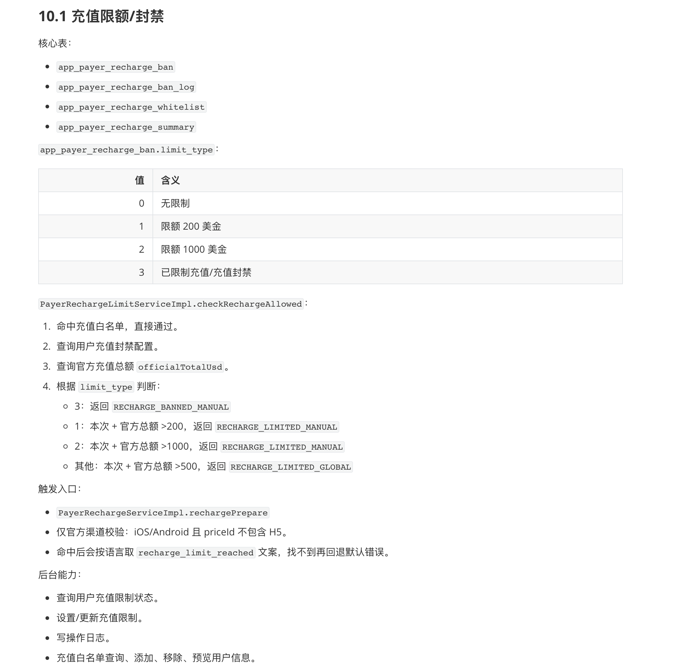

### 2.2 新规则目标

原逻辑按账号累计充值金额，用户可通过同一设备切换多个账号继续充值。本次改为按设备统计：

```text
同一设备下账号 A / B / C
    ↓
Google + Apple 成功充值金额合并累计
    ↓
按设备总金额判断充值限制档位
    ↓
命中后，该设备下所有账号继续充值均受限
```

### 2.3 统计口径

| 项目 | 规则 |
|---|---|
| 统计对象 | 设备，建议使用服务端稳定设备标识，如 `risk_device_hash` / `device_id` |
| 计入渠道 | Google、Apple |
| 不计入渠道 | 三方充值/H5 充值暂不计入本次设备充值封禁金额，仅做链接身份校验 |
| 金额单位 | 沿用现有美元口径 |
| 计入订单 | 首次支付成功的 Google/Apple 官方充值订单 |
| 退款/拒付/补单 | 不调整设备充值封禁金额：退款或拒付不扣减，补单不新增或回补统计金额 |
| 查询时机 | 用户发起充值准备/下单前 |

### 2.4 档位规则

沿用现有 `limit_type` 含义，但判断金额从账号总额改为设备总额。

| `limit_type` | 含义 | 设备维度判断 |
|---:|---|---|
| 0 | 无限制 | 正常放行 |
| 1 | 限额 200 美金 | 本次充值金额 + 当前设备官方累计充值金额 > 200 时拦截 |
| 2 | 限额 1000 美金 | 本次充值金额 + 当前设备官方累计充值金额 > 1000 时拦截 |
| 3 | 已限制充值/充值封禁 | 当前设备下所有账号充值直接拦截 |
| 其他/无配置 | 全局默认限制 | 沿用现有全局 500 美金判断，改按设备总额计算 |

### 2.5 白名单与优先级

| 白名单类型 | 是否影响本规则 | 说明 |
|---|---|---|
| 充值账号白名单 | 是 | 指定账号可跳过充值封禁，但仍建议记录设备累计金额 |
| 充值设备白名单 | 是 | 指定设备下账号可跳过设备充值封禁 |
| IP 白名单 | 否 | 只影响 IP 注册/登录数量限制，不影响充值封禁 |
| 设备注册白名单 | 否 | 只影响注册限制，不默认影响充值封禁 |

白名单必须记录操作人、原因、有效期和操作日志。基础版建议先不做全局免风控白名单，避免误把注册、登录、充值、收益等规则一起绕过。

### 2.6 后台能力

| 能力 | 要求 |
|---|---|
| 查询设备充值状态 | 支持按设备 ID、用户 ID 查询当前设备累计充值金额与限制状态 |
| 调整设备充值封禁 | 可设置未限制、200 美金、1000 美金、全面限制充值 |
| 设备充值解封 | 只恢复充值能力，不自动解除账号封禁、设备登录封禁、收益/提现限制 |
| 设备充值日志 | 记录自动触发、人工调整、解封、白名单变更 |
| 设备关联账号 | 可查看该设备下所有账号、主播身份、充值金额、账号状态、最近登陆时间 |
| 登陆 IP 记录 | 可查看账号历史登陆 IP、最近登陆时间、登陆状态和 IP 所在国家 |

---

## 3. 三方充值链接身份校验

### 3.1 需求说明

三方充值链接访问前增加身份校验页面，页面样式参考附件中的 LAMA 快充登录页，但品牌全部替换为 Wechill：

- 平台名称从 `lama` / `Lama` 改为 `Wechill`。
- 页面 logo 使用附件中的 Wechill 狮子图。
- 输入项从 `Lama ID` 改为 `Wechill ID`。
- 验证码发送文案改为在 Wechill App 内发送。
- 页面需要在 PRD 中以图片形式直接展示，客户端按图还原。

### 3.2 身份校验主页面


页面字段说明：

| 字段/控件 | 展示与含义 | 交互要求 |
|---|---|---|
| 浏览器地址栏 | 展示 Wechill 官方充值域名 | 必须使用 HTTPS；域名需由客户端、运营和安全侧共同确认 |
| Wechill logo/名称 | 使用附件狮子 logo 与 `Wechill` 名称 | 全页面不得残留 `Lama`/`lama` 品牌信息 |
| 页面标题 | `快充登录` | 表明当前页面是充值前身份校验，不是支付结果页 |
| 安全说明 | 说明充值前需要验证身份 | 文案需要接入多语言配置 |
| Wechill ID | 用户输入端内账号 ID；输入框仅保留文字输入能力 | 必填；提交前去除首尾空格并校验账号存在；不展示位置、国家、区域图标或下拉选择 |
| ID 问号 | 打开“如何找到 Wechill ID”指引 | 不离开当前校验页；关闭后保留已输入内容 |
| 验证码 | 输入 App 内收到的一次性验证码 | 必填；目前按 4 位数字校验，最终规则仍需确认 |
| 验证码问号 | 打开“如何接收验证码”指引 | 不离开当前校验页；关闭后保留已输入内容 |
| 发送 | 请求向对应 Wechill App 账号发送验证码 | ID 未填写或账号无效时不得发送；发送后进入倒计时 |
| OK | 提交 ID 与验证码校验 | 通过后进入三方充值支付页；失败时停留当前页 |
| 服务条款/隐私政策 | 跳转对应协议 | 使用 Wechill 正式协议链接，新窗口打开时保留当前输入状态 |

### 3.3 Wechill ID 问号指引

触发入口：点击 `Wechill ID` 标签后的问号。

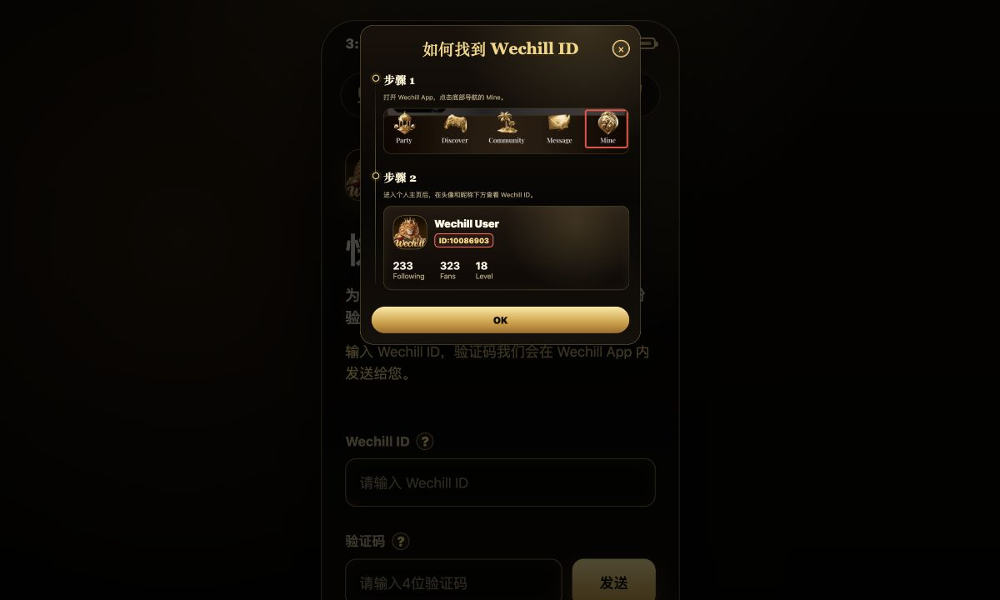

| 区域 | 内容 | 规则 |
|---|---|---|
| 标题 | 如何找到 Wechill ID | 使用当前页面语言展示 |
| 步骤 1 | 打开 Wechill App，点击底部导航 `Mine` | 导航图片使用当前黑金 App 样式和狮子 Mine 图标 |
| 步骤 2 | 进入个人主页，在头像和昵称下方查看 ID | 示例统一展示 `Wechill ID`，不得出现 Lama ID |
| 关闭按钮 | 右上角 `×` | 关闭指引并返回校验页，不清空输入 |
| OK 按钮 | 底部确认按钮 | 与关闭按钮作用一致 |
| 遮罩/Esc | 点击遮罩或按 Esc | Web 端关闭指引；移动端返回键按同等逻辑处理 |

### 3.4 验证码问号指引

触发入口：点击 `验证码` 标签后的问号。

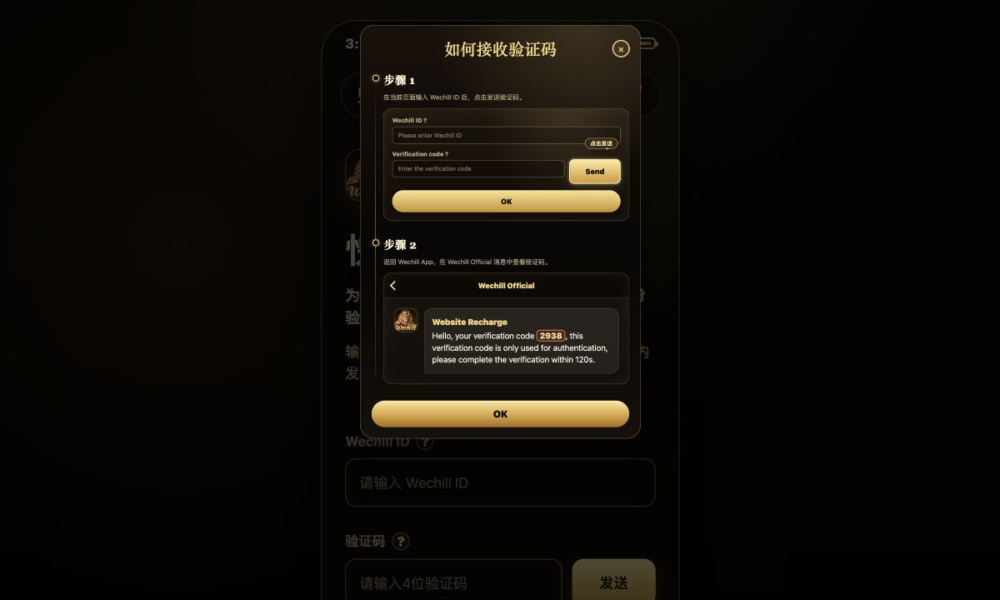

| 区域 | 内容 | 规则 |
|---|---|---|
| 标题 | 如何接收验证码 | 使用当前页面语言展示 |
| 步骤 1 | 输入 Wechill ID 后点击发送 | 只有账号校验通过后才可触发发送请求 |
| 步骤 2 | 返回 Wechill App，在 `Wechill Official` 消息中查看验证码 | 官方消息头像使用狮子 logo，发送方固定为官方账号 |
| 验证码示例 | 示例为 4 位数字 | 示例仅用于指引；真实验证码不得写入前端日志或埋点 |
| 有效期 | 官方消息提示 120 秒内完成验证 | 过期后需重新发送；有效期以服务端为准 |
| 关闭/OK | 关闭指引返回校验页 | 保留 ID 与验证码输入状态 |

### 3.5 完整交互与异常场景

| 场景 | 页面处理 | 服务端/安全要求 |
|---|---|---|
| 首次打开链接 | 先展示身份校验页，不直接进入支付页 | 每次充值会话生成短期、不可猜测的会话标识 |
| ID 为空点击发送 | 提示“请先输入 Wechill ID” | 不发送验证码请求 |
| ID 不存在 | 提示账号不存在或信息有误 | 不暴露该 ID 的其他账号信息 |
| 账号封禁/注销/不可用 | 禁止发送或禁止进入支付页 | 返回统一账号异常错误码并记录风控日志 |
| 验证码发送成功 | 提示已发送到 Wechill App，发送按钮倒计时 | 限制单 ID、单设备、单 IP 的发送频率 |
| 发送失败 | 提示稍后重试 | 区分系统异常与频率限制，前端不展示内部错误 |
| 验证码为空 | 提示请输入验证码 | 不提交支付跳转 |
| 验证码错误 | 提示验证码错误 | 连续错误达到阈值后短时锁定并记录风险事件 |
| 验证码过期/已使用 | 提示验证码已失效，请重新发送 | 验证码一次性使用，成功后立即失效 |
| ID 与验证码不匹配 | 校验失败，不进入支付页 | 验证码必须绑定 ID、充值会话和有效期 |
| 校验通过 | 跳转三方充值支付页 | 生成一次性支付授权，禁止仅靠前端参数绕过 |
| 重复点击 OK | 仅受理一次 | 服务端接口需幂等，避免重复创建支付会话 |
| 网络中断/页面刷新 | 提示重试或恢复未过期会话 | 不在 URL、日志或本地明文存储验证码 |

### 3.6 品牌、客户端与多语言要求

- 主页面、两个问号指引、Toast 和错误提示均需接入多语言，顺序为中文、英语、阿语、土语、印地语。
- 阿语页面需要支持 RTL；数字验证码、Wechill ID、域名保持从左到右显示。
- 页面是三方充值链接的身份校验，不改变 Google/Apple 充值封禁统计口径。
- 验证码必须通过 App 内消息或既有安全验证码链路发送，不在网页上暴露账号敏感信息。

---

## 4. 设备账号封禁与注册限制

### 4.1 单设备注册上限

**规则：一个设备最多注册 2 个账号。**

| 场景 | 处理 |
|---|---|
| 当前设备有效注册账号数 < 2 | 允许注册 |
| 当前设备有效注册账号数 >= 2 | 禁止注册 |
| 后台删除同设备账号后 | 有效账号数同步减少，可释放注册名额 |
| 设备标识缺失/异常 | 建议禁止注册或进入人工校验，避免绕过 |

计数口径：

- 统计同一设备下成功注册的有效账号。
- 后台删除账号后，设备注册计数和 IP 注册计数同步减少。
- 被封禁但未删除的账号仍建议保留在关联账号列表中，用于风控证据追溯。
- 设备注册计数与服务端稳定设备标识绑定，卸载重装或清理客户端缓存不得重置计数。

客户端提示：

| 触发 | 标题 | 文案 |
|---|---|---|
| 设备已注册 2 个账号后再次注册 | 注册失败 | 当前设备注册账号数量已达上限，请使用已有账号登录 |

### 4.2 单设备主播登录限制

**规则：一个设备只能登录 1 个主播账号，包括公会长。**

主播身份界定：

- 加入公会后才算主播。
- 公会长按主播类身份处理。
- 普通用户不触发主播设备登录限制，但仍受设备注册账号数限制。

登录判断：

| 场景 | 处理 |
|---|---|
| 当前账号不是主播/公会长 | 允许登录 |
| 当前账号是该设备已占用的同一主播账号 | 允许登录 |
| 当前设备未存在主播/公会长账号占用 | 允许登录并记录设备主播占用 |
| 当前设备已有其他主播/公会长账号占用 | 禁止登录主播账号 |

退出公会后是否立即释放设备主播占用尚未确定，需要评审确认采用“立即释放”还是“冷却期后释放”，并明确冷却时长。确认前不得由客户端自行清除占用记录。

客户端提示：

| 触发 | 标题 | 文案 |
|---|---|---|
| 当前设备已有其他主播/公会长账号 | 登录失败 | 当前设备已存在主播账号，一个设备仅支持登录一个主播账号 |

### 4.3 加入公会阶段校验

为防止普通小号登录后再加入公会绕过主播限制，加入公会时也需要校验同设备主播占用：

- 普通账号申请加入公会前，查询当前设备是否已有主播/公会长账号。
- 若已有其他主播/公会长占用，禁止加入公会或进入人工审核。
- 公会长邀请账号加入公会时，也需要校验被邀请账号当前设备是否已存在主播占用。

客户端提醒按操作角色区分：用户侧可以明确展示当前设备的主播占用原因；公会长侧不得暴露被邀请用户的设备关联、其他账号或主播身份信息，只提示该用户暂不符合加入条件。

| 操作角色与场景 | 展示方式 | 标题 | 文案 | 操作 |
|---|---|---|---|---|
| 普通用户主动申请加入公会 | 阻断弹窗 | 加入失败 | 当前设备已存在主播/公会长账号，一个设备仅支持一个账号加入公会 | 点击“确定”关闭，保留当前公会页面 |
| 普通用户接受公会邀请 | 阻断弹窗 | 加入失败 | 当前设备已存在主播/公会长账号，暂无法接受该公会邀请 | 点击“确定”关闭，邀请状态不变 |
| 公会长邀请受限用户 | Toast | 邀请失败 | 该用户暂不符合加入公会条件，无法发送邀请 | 展示约 2.5 秒后自动消失，不创建邀请记录 |

**普通用户主动申请加入公会**


**普通用户接受公会邀请**


**公会长邀请用户**


交互边界：

- 三个入口均以服务端校验结果为准，客户端不得只依赖本地设备状态判断。
- 用户主动申请或接受邀请失败时，不写入公会关系，不占用主播名额。
- 公会长侧 Toast 使用通用资格提示，不展示“同设备已有主播/公会长账号”等风险详情。
- 本组提醒用于“直接禁止加入”分支；若规则配置为进入人工审核，应改为“申请已提交审核/邀请对象待审核”，不得展示“加入失败”。

### 4.4 存量设备账号兼容

新规则上线后，对历史已经存在的设备账号关系立即按新规则判断，但不做自动删除、不批量清退历史账号：

| 场景 | 兼容处理 |
|---|---|
| 历史同设备已注册/登录超过 2 个账号 | 历史关联关系保留用于审计；后续该设备再次注册账号时按“最多 2 个账号”拦截 |
| 历史同设备已登录 5、6 个账号 | 上线后按新逻辑生效；以功能上线后首次成功登录的账号作为第一个正常登录账号，后续触发设备登录限制的账号展示客户端登录限制弹窗 |
| 历史同设备存在多个主播/公会长账号 | 以功能上线后首次成功登录的主播/公会长账号作为设备主播占用；其他主播/公会长账号在该设备登录时触发主播登录限制 |
| 受限用户处理 | 客户端展示登录限制弹窗，用户可主动联系官方；后台通过设备关联账号、封禁/解封、删除账号等能力处理 |
| 历史充值数据 | 同设备 Google + Apple 累计充值按设备重新聚合，不因历史账号数量超限而清空 |
| 卸载重装/清理缓存 | 继续使用服务端设备关联关系，设备注册账号数和设备充值累计均不清零 |

客户端样式要求：登录受限时复用本文 7.1 中黑金 App 弹窗样式，按钮、遮罩、底色保持一致；文案按触发原因区分设备账号限制或主播登录限制。

---

## 5. IP 注册限制与 IP 白名单

### 5.1 单 IP 注册上限

**规则：一个 IP 最多注册 5 个账号，不按身份筛选，仅统计数量。**

| 场景 | 处理 |
|---|---|
| 当前 IP 注册账号数 < 5 | 允许注册 |
| 当前 IP 注册账号数 >= 5 | 禁止注册 |
| 当前 IP 命中 IP 白名单 | 不限制该 IP 下注册数量 |

公共 Wi-Fi、运营商 NAT 等共享出口 IP 容易造成误伤。IP 注册规则作为辅助判断，处置时应优先结合设备规则；确认属于可信共享网络后，可通过 IP 白名单兜底。

客户端提示：

| 触发 | 标题 | 文案 |
|---|---|---|
| IP 已注册 5 个账号后再次注册 | 注册失败 | 当前网络环境注册账号数量已达上限，请更换网络后再尝试注册 |

### 5.2 IP 白名单

IP 白名单用于处理公会办公网络、官方测试网络、客服/运营网络等多人共用 IP 的场景。

| 配置项 | 默认值 | 说明 |
|---|---:|---|
| IP 地址 | - | 支持单 IP，是否支持 IP 段/CIDR 需研发确认 |
| 是否豁免注册上限 | 是 | 命中后不限制该 IP 下注册数量 |
| 白名单 IP 历史登录账号总数上限 | 8 | 按该 IP 历史成功登录过的去重用户 ID 统计，默认 8 个，可后台配置 |
| 生效时间 | 必填 | 建议设置有效期，避免长期无限放行 |
| 添加原因 | 必填 | 记录公会/测试/客服等用途 |
| 操作日志 | 必填 | 记录添加、修改、删除、过期 |

边界规则：

- IP 白名单只豁免 IP 注册数量限制，不豁免设备注册限制。
- IP 白名单不豁免同设备主播登录限制。
- IP 白名单不豁免设备充值封禁。
- 白名单 IP 下注册数、登录数、同设备数异常增长时，需要进入风控复核。
- 同一账号重复登录只计 1 个；历史登录账号总数不按自然日重置。
- 达到配置上限后，已计入的历史账号仍可登录，新账号首次通过该 IP 登录时触发限制。

口径说明：

- “白名单内 IP 限制的登录总数”统一按历史成功登录账号总数计算，即该 IP 下曾成功登录过的去重用户 ID 数量；默认上限为 8，可后台配置。

### 5.3 IP 封禁

IP 封禁用于处理 IP 注册账号超限、异常跨国登录、批量设备攻击等风险。

| 封禁类型 | 触发入口 | 处理逻辑 |
|---|---|---|
| 封 IP | IP 入口/登陆 IP 记录/IP 封禁列表 | 仅封禁对应 IP，不自动封禁账号或设备 |
| 封号封设备封 IP-慎用 | 设备列表/封禁弹窗 | 封禁该设备所有账号与当前设备，同时封禁目标账号最后一次登陆 IP |

封禁时间选项：`1h`、`6h`、`12h`、`1天`、`2天`、`3天`、`7天`、`永久`。

封禁证据为必填项，封禁理由下方需要提供“点击上传证据”。支持的文件类型、大小、数量、视频时长、存储和预览方式均需与研发确认；确认前不在产品文档中预设具体格式。

IP 解封时需要二次确认，可填写解封理由（非必填）；解封后写入操作日志。列表中的“解禁时间”只展示具体时间点，永久封禁未解封前展示 `-`，不展示“永久”。

---

## 6. 后台页面与字段说明

后台原型保持简洁结构：每个独立页面仅保留筛选区和主列表区，详情与处理动作通过弹窗承载，已有交互逻辑保留。

### 6.1 设备列表页

页面入口：风控管理 / 设备账号风控。

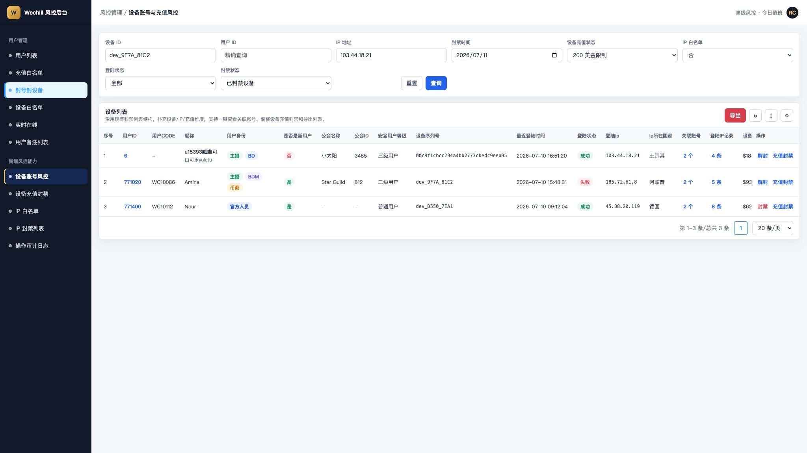

筛选字段：

| 字段 | 含义 | 逻辑 |
|---|---|---|
| 设备 ID | 精确查询设备序列号 | 查询同设备账号、充值、封禁记录 |
| 用户 ID | 精确查询账号 | 可定位该账号最近登录设备与关联设备 |
| IP 地址 | 查询最近登录 IP | 与注册 IP 分开，取登录日志 |
| 封禁时间 | 查询封禁记录创建日期 | 默认展示当天已封禁设备数据 |
| 设备充值状态 | 筛选设备充值限制状态 | 未限制/200 美金限制/1000 美金限制/全面限制充值 |
| IP 白名单 | 筛选最近登录 IP 是否命中白名单 | 是时展示历史登录账号总数上限 |
| 登陆状态 | 筛选最近一次登录结果 | 成功/失败 |
| 封禁状态 | 筛选当前账号或设备封禁状态 | 已封禁设备/未封禁/待处理/封号/封号封设备 |

列表字段：

| 字段 | 展示内容 | 取数/判断逻辑 |
|---|---|---|
| 序号 | 当前列表序号 | 按查询结果分页顺序生成 |
| 用户ID | 账号唯一 ID | 取用户主表 `user_id`，可点击进入用户详情 |
| 用户CODE | 用户展示编码 | 无 CODE 时展示 `-` |
| 昵称 | 用户昵称 | 取用户资料昵称，支持换行展示 |
| 用户身份 | 端内全部身份标签 | 可多重展示，如主播/公会长、BD/BDM、币商、官方人员等 |
| 是否是新用户 | 是/否 | 注册时间距当前时间小于等于 3 天（72 小时）展示“是”，否则展示“否” |
| 公会名称 | 当前公会名称 | 未加入公会展示 `-`；加入公会才算主播 |
| 公会ID | 当前公会 ID | 未加入公会展示 `-`；公会长纳入主播类身份 |
| 安全用户等级 | 安全用户等级名称 | 沿用现有后台安全等级字段 |
| 设备序列号 | 稳定设备标识 | 作为设备注册、设备充值封禁主键 |
| 最近登陆时间 | 最近一次登录时间 | 取该账号最近一条登录日志时间 |
| 登陆状态 | 成功/失败 | 取该账号最近一次登录日志状态 |
| 登陆ip | 最近一次登录 IP | 取登录日志公网 IP，不取注册 IP |
| ip所在国家 | 最近登录 IP 国家 | 根据 IP 地理库解析；失败展示 `-` |
| 关联账号 | 同设备关联账号数 | 点击打开设备关联账号详情；新规则下同设备有效账号最多 2 个 |
| 登陆IP记录 | 该账号历史登录 IP 记录数 | 点击打开登录 IP 记录详情；不同 IP 可对应同一登录设备 |
| 设备充值总额 | 同设备充值金额 | Google + Apple 首次支付成功金额按设备累计；退款、拒付和补单不调整统计金额 |
| 充值限制 | 当前设备充值限制状态 | 未限制/200 美金限制/1000 美金限制/全面限制充值 |
| 封禁状态 | 当前账号/设备封禁状态 | 取最新有效封禁记录 |
| 封禁次数 | 历史封禁次数 | 点击打开历史封禁记录，展示封禁时间、时长、类型、理由、证据、解封信息和操作人 |
| 封禁时间 | 最近一次封禁时间 | 取封禁记录创建时间 |
| 封禁时长 | 本次封禁时长 | 1h/6h/12h/1天/2天/3天/7天/永久 |
| 封禁理由 | 封禁原因 | 取人工选择原因或系统命中原因 |
| 封禁证据 | 证据数量与类型 | 图片/视频；点击预览，上传格式需与研发确认 |
| 解封理由 | 解封原因 | 人工解封时填写，可为空；自动到期展示“到期自动解封” |
| 解禁时间 | 计划或实际解封时间点 | 只展示具体时间点；永久封禁未解封前展示 `-` |
| IP白名单 | 是/否及上限 | 判断最近登录 IP 是否在白名单内；展示历史登录账号总数上限，默认 8，可配置 |
| 操作人 | 最近一次操作人 | 操作人展示在操作列前；系统自动操作展示 `system` |
| 操作 | 可执行动作 | 解封、封禁、充值封禁等；所有操作写审计日志 |

### 6.2 IP 白名单列表页

页面入口：风控管理 / IP 白名单。

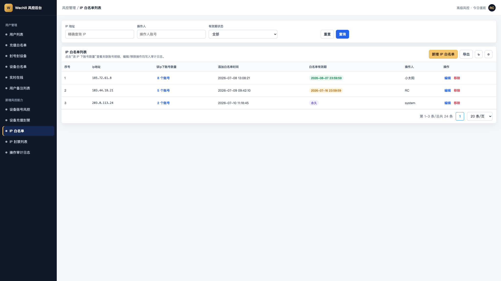

筛选字段：

| 字段 | 含义 | 逻辑 |
|---|---|---|
| IP 地址 | 精确查询白名单 IP | 支持单 IP；IP 段/CIDR 是否支持需研发确认 |
| 操作人 | 查询添加/编辑/移除操作人 | 用于审计追踪 |
| 有效期状态 | 筛选有效期 | 全部/有效中/7 日内到期/已过期/永久 |

列表字段：

| 字段 | 展示内容 | 取数/判断逻辑 |
|---|---|---|
| 序号 | 当前列表序号 | 按分页顺序生成 |
| ip地址 | 白名单 IP | 命中后豁免该 IP 注册数量限制 |
| 该ip下账号数量 | 当前 IP 下关联账号数 | 点击查看账号详情列表；详情展示账号、身份、设备、最近登录时间和账号状态 |
| 添加白名单时间 | 添加时间 | 取白名单记录创建时间 |
| 白名单有效期 | 到期时间或永久 | 到期后恢复 IP 注册数量限制 |
| 操作人 | 添加或最近编辑操作人 | 系统自动迁移展示 `system` |
| 操作 | 编辑/移除 | 移除需二次确认，移除后恢复 IP 注册数量限制 |

边界：IP 白名单只豁免 IP 注册数量限制，不豁免设备注册、主播设备登录、设备充值封禁、收益/提现和 IP 封禁。

### 6.3 IP 封禁列表页

页面入口：风控管理 / IP 封禁列表。

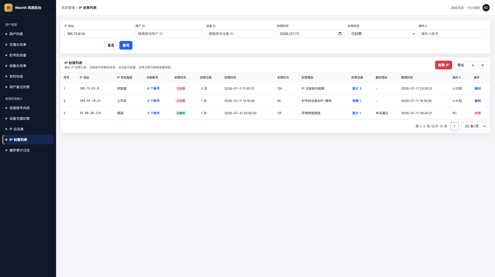

筛选字段：

| 字段 | 含义 | 逻辑 |
|---|---|---|
| IP 地址 | 精确查询封禁 IP | 查询 IP 封禁记录 |
| 用户 ID | 查询关联用户 | 用于定位由账号触发的 IP 封禁 |
| 设备 ID | 查询关联设备 | 用于定位“封号封设备封 IP-慎用”来源 |
| 封禁时间 | 查询封禁记录创建日期 | 默认可展示当天数据 |
| 封禁状态 | 查询封禁状态 | 全部/已封禁/已解封/待复核 |
| 操作人 | 查询封禁或解封操作人 | 用于审计追踪 |

列表字段：

| 字段 | 展示内容 | 取数/判断逻辑 |
|---|---|---|
| 序号 | 当前列表序号 | 按分页顺序生成 |
| IP 地址 | 被封禁或已解封 IP | 取 IP 封禁记录主键 |
| IP 所在国家 | IP 解析国家/地区 | 根据 IP 地理库解析 |
| 关联账号 | 该 IP 下关联账号数量 | 点击打开账号详情；仅用于查看账号分布，不替代设备处理 |
| 封禁状态 | 已封禁/已解封/待复核 | 取最新有效 IP 封禁记录 |
| 封禁次数 | 历史 IP 封禁次数 | 点击打开历史封禁记录 |
| 封禁时间 | 最近一次封禁时间 | 取封禁记录创建时间 |
| 封禁时长 | 本次封禁时长 | 1h/6h/12h/1天/2天/3天/7天/永久 |
| 封禁理由 | IP 封禁原因 | 如 IP 注册账号超限、异常跨国登录、封号封设备封 IP-慎用 |
| 封禁证据 | 证据数量与类型 | 图片/视频；点击预览 |
| 解封理由 | 解封原因 | 人工解封可填，非必填；自动到期展示到期原因 |
| 解禁时间 | 计划或实际解封时间点 | 永久封禁未解封前展示 `-`，不展示“永久” |
| 操作人 | 最近一次操作人 | 系统自动操作展示 `system` |
| 操作 | 封禁/解封 | 已封禁展示解封；已解封可再次封禁 |

说明：IP 封禁列表不展示“登陆IP记录”字段。该字段只保留在设备列表/用户登录 IP 详情中，用于查看单个账号在不同 IP 下的登录记录。

### 6.4 弹窗触发关系

现有逻辑参考 `风控管理后台-设备充值封禁原型.html`，本版截图与字段以最新设备/IP 操作原型为准。列表保持简洁，详情和处置动作通过弹窗完成。

| 页面/入口 | 打开弹窗 | 关闭或提交后的处理 |
|---|---|---|
| 设备列表 -> 关联账号 | 查看设备关联账号 | 关闭返回原列表与横向滚动位置 |
| 设备列表 -> 登陆IP记录 | 登陆 IP 记录 | 可继续进入 IP 白名单或 IP 封禁 |
| 设备列表 -> 充值封禁 | 调整设备充值封禁 | 提交后刷新设备充值状态和操作人 |
| 设备列表/IP 详情 -> 封禁 | 封禁 | 根据入口默认带入账号、设备或 IP 上下文 |
| 设备列表/IP 账号详情 -> 解封 | 账号解封确认 | 提交后刷新封禁状态、解封理由和解禁时间 |
| 设备列表/IP 封禁列表 -> 封禁次数 | 历史封禁记录 | 只读查看，可继续预览证据 |
| 设备关联账号 -> 删除账号 | 删除账号确认 | 成功后刷新关联账号数和设备/IP 注册计数 |
| IP 白名单 -> 账号数量 | 该 IP 下账号详情 | 只查看分布；账号处置仍走封禁/解封链路 |
| IP 白名单 -> 新增/编辑 | 配置 IP 白名单 | 提交后刷新有效期、上限和操作人 |
| IP 白名单 -> 移除 | 确认移除 IP 白名单 | 提交后恢复 IP 注册数量限制 |
| IP 封禁列表 -> 解封 | 确认解封 IP | 提交后刷新解封信息并写入审计日志 |

嵌套弹窗切换时，应先关闭当前弹窗再打开目标弹窗，避免多层遮罩；返回时保持原筛选条件和分页位置。

### 6.5 查看设备关联账号弹窗

入口：点击设备列表中的“关联账号”。

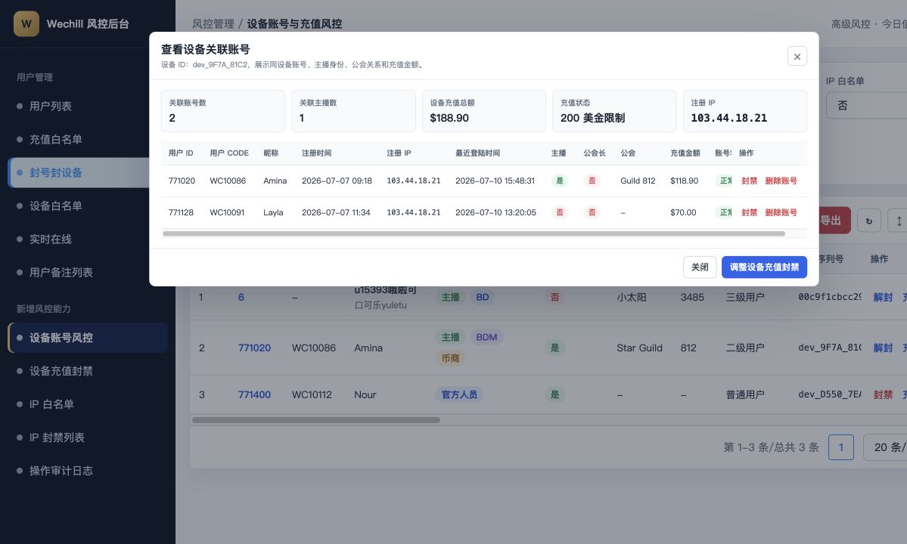

顶部汇总字段：

| 字段 | 说明 |
|---|---|
| 设备 ID | 当前设备稳定标识 |
| 关联账号数 | 同设备有效账号数；新规则下最多 2 个，存量超限仅保留审计关系 |
| 关联主播数 | 同设备主播/公会长数量，正常状态最多 1 个 |
| 设备充值总额 | 同设备 Google + Apple 首次支付成功金额累计；退款、拒付和补单不调整统计金额，示例金额必须小于当前限制金额 |
| 充值状态 | 未限制/200 美金限制/1000 美金限制/全面限制充值 |
| 注册 IP | 当前设备主要注册 IP 或当前查看账号注册 IP |

列表字段：

| 字段 | 说明 |
|---|---|
| 用户 ID/用户 CODE/昵称 | 账号基础信息 |
| 注册时间/注册 IP | 账号首次注册信息 |
| 最近登陆时间 | 取该账号最近一次登录日志时间 |
| 主播/公会长 | 加入公会后为主播；公会长同时纳入主播设备占用规则 |
| 公会 | 当前所属公会，未加入展示 `-` |
| 充值金额 | 账号在该设备下首次支付成功的 Google/Apple 充值贡献；退款、拒付和补单不调整 |
| 账号状态 | 正常/封禁/已删除 |
| 操作 | 封禁、删除账号；删除必须二次确认 |

底部“调整设备充值封禁”带入当前设备 ID、设备总额和充值状态。

### 6.6 登陆 IP 记录弹窗

入口：点击设备列表中的“登陆IP记录”。

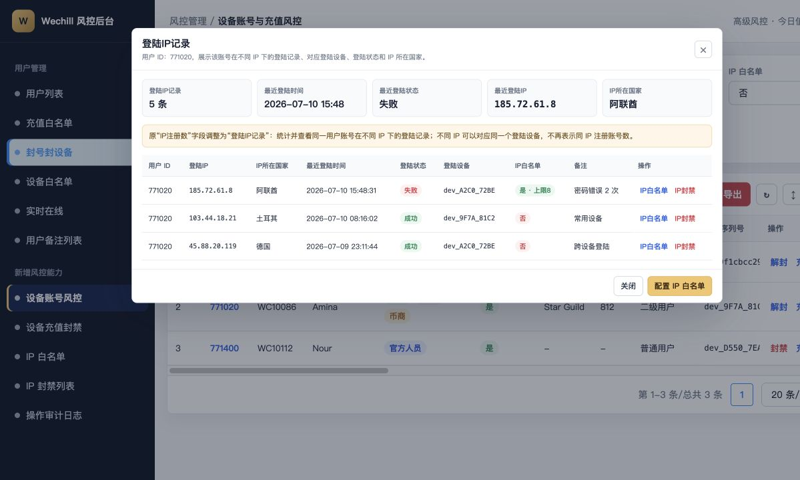

| 字段 | 说明 |
|---|---|
| 用户 ID | 当前查看账号 |
| 登陆IP记录 | 该账号历史登录 IP 记录条数，不再表示 IP 注册账号数 |
| 最近登陆时间/状态/IP | 取该账号最近一条登录日志 |
| IP 所在国家 | 根据最近登录 IP 解析，失败展示 `-` |
| 登陆 IP | 该条登录记录使用的公网 IP |
| 登陆设备 | 该次登录使用的设备 ID；不同 IP 可以对应同一个设备 |
| IP 白名单 | 是否命中白名单及历史登录账号总数上限 |
| 备注 | 密码错误、常用设备、跨设备登录等辅助信息 |
| 操作 | IP 白名单、IP 封禁 |

点击“IP白名单”打开配置弹窗；点击“IP封禁”打开同一封禁弹窗并默认选择 `封IP`。关闭后返回当前账号的 IP 记录，不跳回列表顶部。

### 6.7 调整设备充值封禁弹窗

入口：设备列表“充值封禁”，或设备关联账号弹窗底部“调整设备充值封禁”。

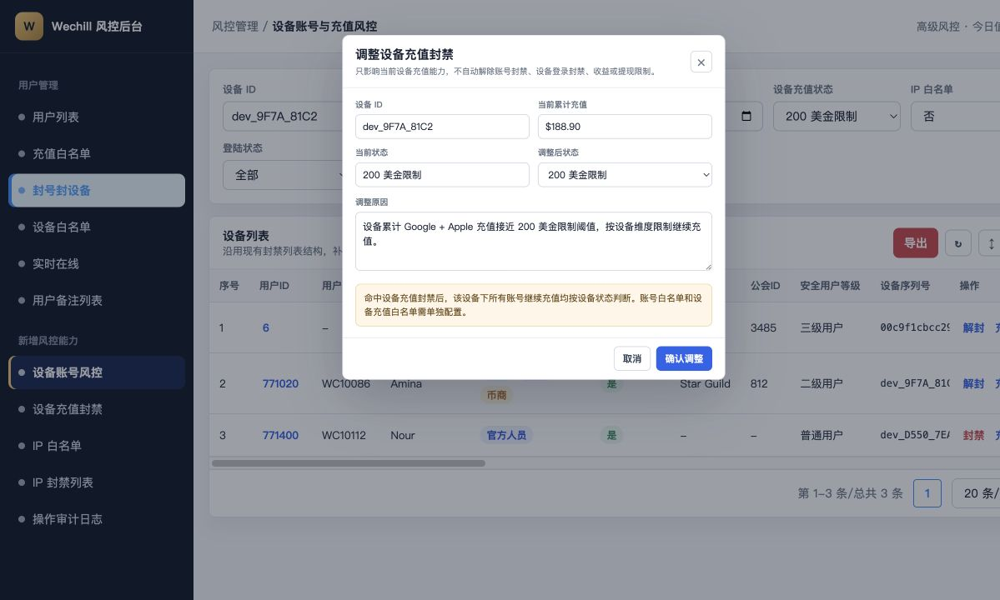

| 字段 | 是否可编辑 | 说明 |
|---|---|---|
| 设备 ID | 否 | 当前处置设备，避免误操作其他设备 |
| 当前累计充值 | 否 | Google + Apple 首次支付成功的设备累计金额；退款、拒付和补单不调整 |
| 当前状态 | 否 | 当前设备充值限制档位 |
| 调整后状态 | 是 | 未限制/200 美金限制/1000 美金限制/全面限制充值 |
| 调整原因 | 是，必填 | 说明人工调整或误封恢复原因 |
| 边界提示 | 否 | 强调只影响设备充值，不自动解除账号、设备登录、收益或提现限制 |
| 取消/确认调整 | 操作 | 取消不保存；确认后写入设备充值封禁日志 |

若调整后限制金额小于或等于当前设备累计金额，需要二次提示“提交后将立即拦截该设备下所有账号继续充值”。

### 6.8 封禁弹窗

入口：设备列表、设备关联账号、登陆 IP 记录、IP 下账号详情、IP 封禁列表。

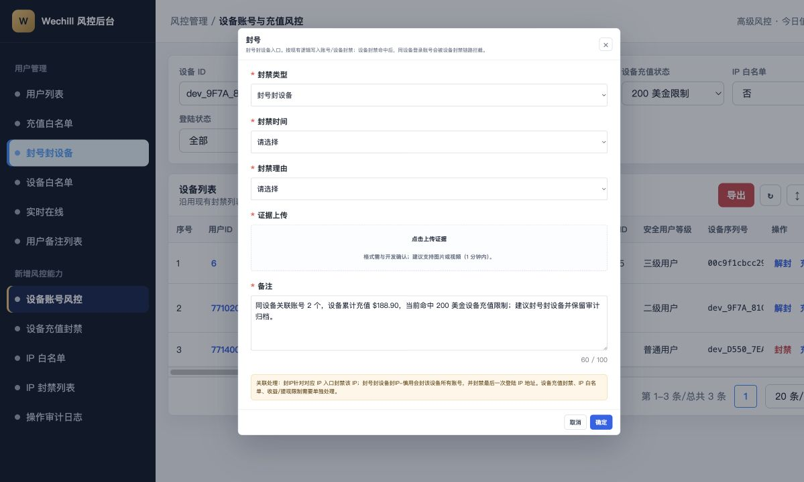

| 字段 | 必填 | 说明 |
|---|---:|---|
| 封禁类型 | 是 | 封号封设备、仅封号、仅封设备、封IP、封号封设备封IP-慎用 |
| 封禁时间 | 是 | 1h、6h、12h、1天、2天、3天、7天、永久 |
| 封禁理由 | 是 | 设备注册超限、IP 注册超限、同设备多主播/公会长、充值封禁绕过、小号套利、其他 |
| 证据上传 | 是 | 点击上传图片或视频；格式、大小、数量和视频时长需与研发确认 |
| 备注 | 是 | 最多 100 字，说明账号/设备/IP、命中规则和人工判断 |
| 关联处理提示 | - | 说明组合封禁的影响范围，以及充值封禁、白名单、收益/提现需单独处理 |
| 取消/确定 | - | 确定前校验全部必填项；成功后写入封禁记录和审计日志 |

入口默认值为基础版原型暂定方案：从登陆 IP/IP 封禁列表进入默认 `封IP`，从设备入口进入默认 `封号封设备`；选择 `封号封设备封IP-慎用` 时，提交前再次确认将封禁设备全部账号和目标账号最后一次登陆 IP。账号、设备、IP 各入口最终默认类型、对象 ID 和影响范围仍需评审确认。

### 6.9 账号解封确认弹窗

入口：设备列表或 IP 下账号详情中的“解封”。

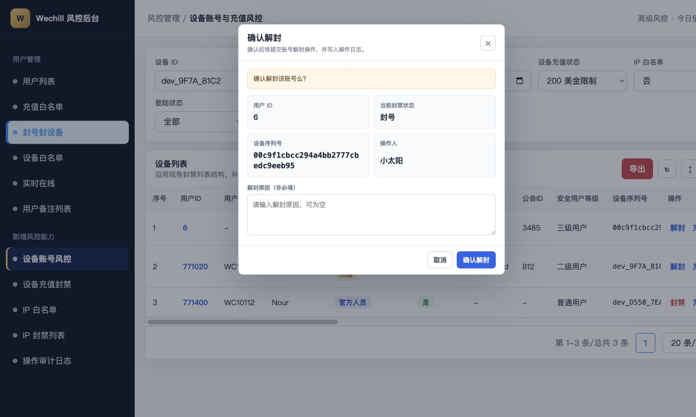

| 字段 | 说明 |
|---|---|
| 确认提示 | 固定提示“确认解封该账号么？” |
| 用户 ID | 被解封账号 ID |
| 当前封禁状态 | 取最新有效账号封禁记录 |
| 设备序列号 | 账号最近或当前关联设备，供操作人复核 |
| 操作人 | 当前登录后台人员，提交时由服务端写入，不信任前端传值 |
| 解封原因 | 非必填；填写后进入列表“解封理由”和历史记录 |
| 取消/确认解封 | 取消不变更；确认后仅解除本次账号封禁 |

账号解封不自动解除设备封禁、IP 封禁、设备充值封禁、收益或提现限制。

### 6.10 历史封禁记录弹窗

入口：点击设备列表或 IP 封禁列表中的“封禁次数”。

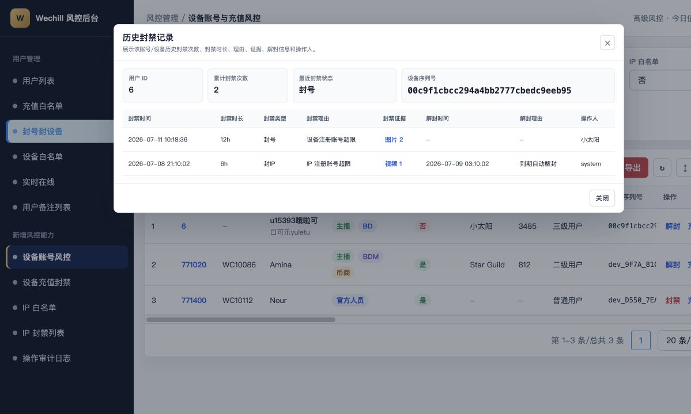

| 字段 | 说明 |
|---|---|
| 用户 ID/设备序列号 | 当前查看对象；IP 历史记录场景改为展示 IP 地址 |
| 累计封禁次数 | 该对象历史封禁记录总数 |
| 最近封禁状态 | 取最新有效封禁记录 |
| 封禁时间 | 封禁记录创建时间 |
| 封禁时长 | 本次选择的时长，永久封禁展示“永久” |
| 封禁类型/理由 | 本次处置类型和原因 |
| 封禁证据 | 图片/视频数量，可点击预览；无权限时不可下载 |
| 解封时间 | 自动到期或人工解封的具体时间点；未解封展示 `-` |
| 解封理由 | 人工填写或“到期自动解封” |
| 操作人 | 人工账号或 `system` |

历史记录只追加不覆盖；重新封禁产生新记录，累计次数加 1。

### 6.11 删除账号确认弹窗

入口：设备关联账号详情中的“删除账号”。

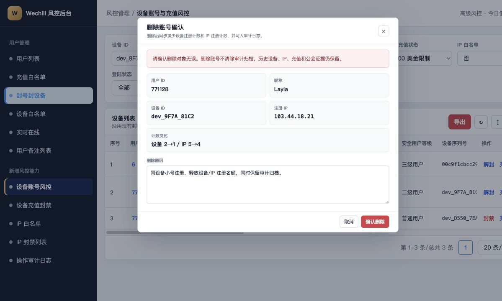

| 字段 | 说明 |
|---|---|
| 风险提示 | 明确删除不清除设备、IP、充值、公会和审计证据 |
| 用户 ID/昵称 | 被删除账号基础信息 |
| 设备 ID/注册 IP | 用于确认释放哪个设备/IP 的有效注册计数 |
| 计数变化 | 展示提交后的设备计数与 IP 计数变化，如 `设备 2→1 / IP 5→4` |
| 删除原因 | 必填，写入审计日志 |
| 取消/确认删除 | 确认后软删除账号并同步刷新计数与关联列表 |

删除为高风险操作，服务端必须再次校验账号没有未结算收益、未完成提现或进行中的申诉；审计归档永久保留。

### 6.12 该 IP 下账号详情弹窗

入口：点击 IP 白名单或 IP 封禁列表中的“关联账号/账号数量”。

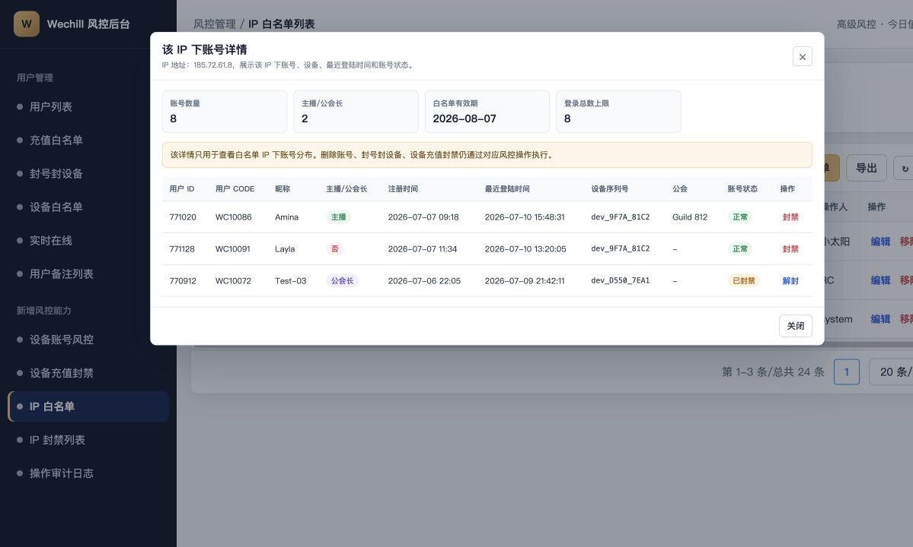

| 字段 | 说明 |
|---|---|
| IP 地址 | 当前查看 IP |
| 账号数量 | 该 IP 下关联账号数，不受单设备 2 个账号示例限制 |
| 主播/公会长 | 该 IP 下主播类账号数量 |
| 白名单有效期/历史登录账号总数上限 | 仅白名单场景展示；非白名单展示 `-` |
| 用户 ID/CODE/昵称 | 账号基础信息 |
| 主播/公会长 | 展示主播、公会长或否 |
| 注册时间/最近登陆时间 | 分别取注册日志和最近登录日志 |
| 设备序列号 | 该账号对应登录/注册设备 |
| 公会/账号状态 | 当前公会与正常、已封禁等状态 |
| 操作 | 正常账号展示封禁，已封禁账号展示解封 |

该弹窗只用于查看 IP 下账号分布，不提供“编辑白名单”按钮；账号操作仍进入统一封禁/解封弹窗。

### 6.13 配置 IP 白名单弹窗

入口：IP 白名单列表“新增 IP 白名单”，或登陆 IP 记录中的“IP白名单”。

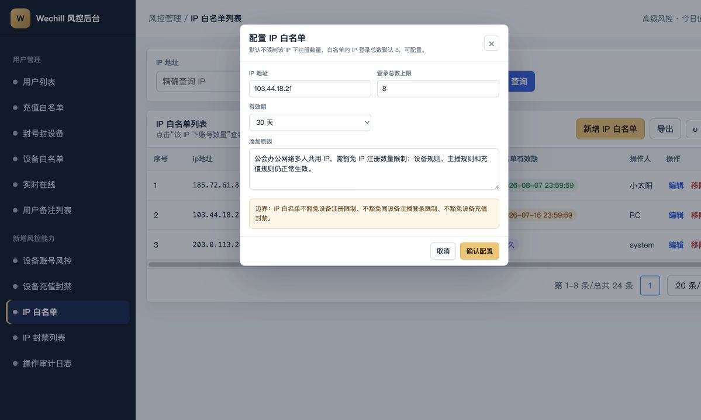

| 字段 | 必填 | 说明 |
|---|---:|---|
| IP 地址 | 是 | 单 IP；是否支持 CIDR 需研发确认 |
| 历史登录账号总数上限 | 是 | 默认 8，可配置为正整数；按该 IP 历史成功登录过的去重用户 ID 统计 |
| 有效期 | 是 | 7 天、30 天、永久；永久需二次审批 |
| 添加原因 | 是 | 说明公会办公网、官方测试等用途 |
| 边界提示 | - | 白名单不豁免设备注册、主播设备登录、充值和 IP 封禁 |
| 取消/确认配置 | - | 确认后写入白名单记录、有效期和操作日志 |

弹窗不展示“适用场景”选项；编辑时复用同一弹窗并回填现有值。

### 6.14 移除 IP 白名单确认弹窗

入口：IP 白名单列表“移除”。

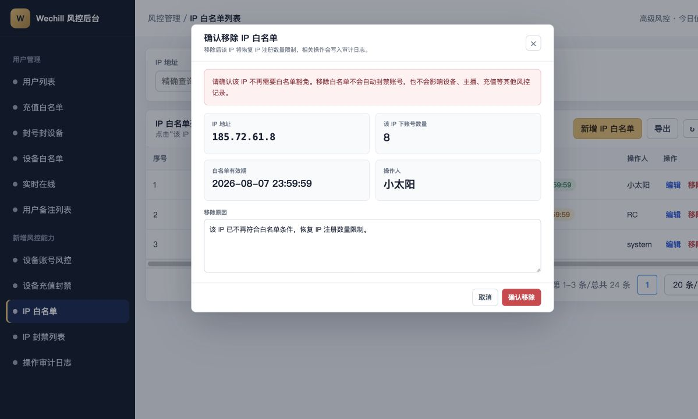

| 字段 | 说明 |
|---|---|
| 风险提示 | 移除后恢复 IP 注册数量限制，但不自动封禁账号 |
| IP 地址 | 被移除的白名单 IP |
| 该 IP 下账号数量 | 当前关联账号数量，供操作人判断影响范围 |
| 白名单有效期 | 当前到期时间或永久 |
| 操作人 | 当前后台操作人 |
| 移除原因 | 必填，写入审计日志 |
| 取消/确认移除 | 确认后白名单立即失效并刷新列表 |

### 6.15 IP 解封确认弹窗

入口：IP 封禁列表“解封”。

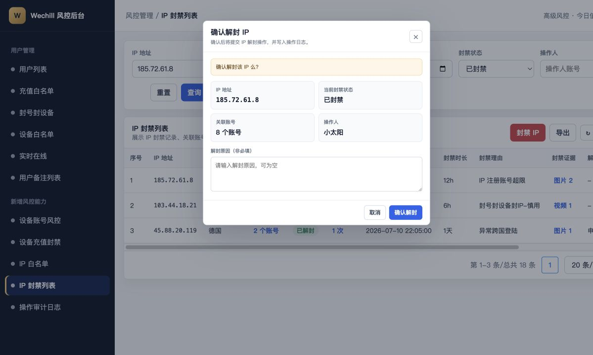

| 字段 | 说明 |
|---|---|
| 确认提示 | 固定提示“确认解封该 IP 么？” |
| IP 地址 | 被解封 IP |
| 当前封禁状态 | 最新有效 IP 封禁状态 |
| 关联账号 | 当前 IP 下关联账号数量，供风险复核 |
| 操作人 | 当前后台操作人 |
| 解封原因 | 非必填；填写后进入列表和历史封禁记录 |
| 取消/确认解封 | 确认后解除 IP 封禁并写入操作日志 |

IP 解封不自动移除账号/设备封禁，也不自动加入 IP 白名单。永久封禁未解封前，列表“解禁时间”展示 `-`；解封成功后写入实际时间点。

---

## 7. 客户端提醒与文案

| 场景 | 展示方式 | 文案要求 |
|---|---|---|
| 设备注册超限 | 弹窗 | 当前设备注册账号数量已达上限，请使用已有账号登录 |
| 存量设备账号登录限制 | 弹窗 | 当前设备登录账号数量已达上限，如有疑问请联系官方 |
| IP 注册超限 | 弹窗 | 当前网络环境注册账号数量已达上限，请更换网络后再尝试注册 |
| 同设备主播登录限制 | 弹窗 | 当前设备已存在主播账号，一个设备仅支持登录一个主播账号 |
| 用户主动申请加入公会受限 | 弹窗 | 加入失败：当前设备已存在主播/公会长账号，一个设备仅支持一个账号加入公会 |
| 用户接受公会邀请受限 | 弹窗 | 加入失败：当前设备已存在主播/公会长账号，暂无法接受该公会邀请 |
| 公会长邀请受限用户 | Toast | 邀请失败：该用户暂不符合加入公会条件，无法发送邀请 |
| 设备充值 200 美金限制 | Toast/弹窗 | 当前设备充值金额已达安全限制，暂不支持继续充值 |
| 设备充值 1000 美金限制 | Toast/弹窗 | 当前设备充值金额已达高风险限制，暂不支持继续充值 |
| 设备全面充值封禁 | Toast/弹窗 | 当前设备已被限制充值，如有疑问请联系客服 |
| 三方充值链接校验 | 页面 | 按本文示意图展示 Wechill ID、验证码、Wechill logo |

设备充值拦截文案主语统一使用“当前设备”，不要写成“当前账号”，避免用户误以为换账号即可绕过。

### 7.1 客户端拦截样式图

以下样式图参考原始文档的 App 遮罩弹窗结构，底色、按钮和强调色调整为当前 Wechill 黑金 App 风格。客户端实现时，弹窗层级、遮罩和按钮样式按图还原，具体文案按上表和多语言文案表配置。

**设备注册超限**


**IP 注册超限**

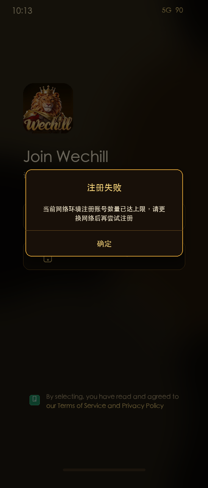

**同设备主播登录限制**


存量设备账号登录限制复用同类黑金弹窗样式：遮罩、圆角、按钮、底色和强调色保持一致，仅替换标题与文案。触发后不在客户端提供绕过入口，用户可主动联系官方处理。

**设备充值限制**

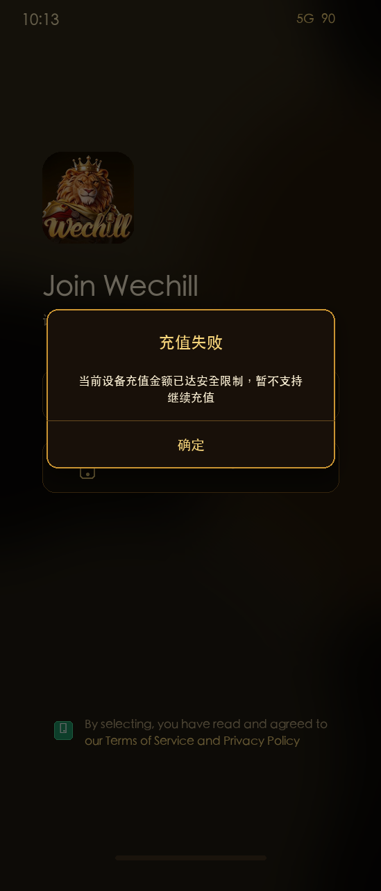

---

## 8. 基础验收用例

| 编号 | 场景 | 预期 |
|---|---|---|
| AC-001 | 同设备注册第 1 个账号 | 注册成功 |
| AC-002 | 同设备注册第 2 个账号 | 注册成功 |
| AC-003 | 同设备注册第 3 个账号 | 注册失败，提示设备注册超限 |
| AC-004 | 后台删除该设备 1 个账号后再次注册 | 注册成功，设备计数同步减少 |
| AC-005 | 同 IP 注册第 5 个账号 | 注册成功 |
| AC-006 | 同 IP 注册第 6 个账号 | 注册失败，提示 IP 注册超限 |
| AC-007 | IP 命中白名单后注册第 6 个账号 | 注册成功，但仍受设备注册上限约束 |
| AC-008 | 同设备已有主播账号，普通用户登录 | 登录成功 |
| AC-009 | 同设备已有主播账号，另一个主播账号登录 | 登录失败 |
| AC-010 | 同设备已有主播账号，普通账号申请加入公会 | 禁止加入或进入人工审核 |
| AC-011 | 设备 A 上账号 X 已充 190 美金，账号 Y 再充 20 美金 | 设备累计 210 美金，按设备触发 200 美金限制 |
| AC-012 | 设备 A 被设置全面限制充值，账号 Z 在同设备发起充值 | 充值被拦截 |
| AC-013 | 账号换到新设备 B 充值 | 计入设备 B 累计金额，不沿用设备 A 的设备限制 |
| AC-014 | 打开三方充值链接 | 先展示 Wechill 身份校验页 |
| AC-015 | 三方充值链接验证码校验通过 | 进入三方充值支付页 |
| AC-016 | 存量设备历史已登录 5、6 个账号 | 新规则上线后保留历史关联；功能上线后首次成功登录的账号作为第一个正常登录账号，后续触发限制的账号展示客户端登录限制弹窗 |
| AC-017 | 存量设备历史注册账号数 > 2 后再次注册 | 注册失败，提示设备注册超限，不自动删除历史账号 |
| AC-018 | 同设备历史存在多个主播/公会长账号 | 功能上线后首次成功登录的主播/公会长账号占用设备；其他主播/公会长账号登录失败 |
| AC-019 | 在 IP 封禁列表点击解封 | 弹出确认解封 IP 弹窗，可填写非必填解封理由，提交后写入操作日志 |
| AC-020 | IP 封禁列表查看字段 | 不展示“登陆IP记录”字段，仅展示关联账号、封禁状态、封禁次数、封禁/解封信息 |
| AC-021 | 点击 Wechill ID 后问号 | 打开“如何找到 Wechill ID”指引，关闭后保留主页面输入 |
| AC-022 | 点击验证码后问号 | 打开“如何接收验证码”指引，展示发送步骤和 Wechill Official 消息 |
| AC-023 | Wechill ID 为空点击发送 | 不发送验证码，提示先输入 Wechill ID |
| AC-024 | 验证码错误、过期、已使用或与 ID 不匹配 | 停留身份校验页，不创建支付会话 |
| AC-025 | 验证码校验成功后重复点击 OK | 服务端幂等，仅生成一个有效支付会话 |
| AC-026 | 点击设备列表关联账号 | 打开设备关联账号弹窗，示例设备最多展示 2 个有效账号、1 个主播类账号 |
| AC-027 | 点击登陆IP记录 | 同一账号不同 IP 可展示相同登陆设备，操作仅保留 IP 白名单和 IP 封禁 |
| AC-028 | 封禁弹窗未上传证据点击确定 | 阻止提交并提示上传证据 |
| AC-029 | 点击移除 IP 白名单 | 先展示确认弹窗，确认后恢复 IP 注册数量限制并写审计日志 |
| AC-030 | 从 IP 入口点击封禁 | 打开统一封禁弹窗并默认选择“封IP” |
| AC-031 | 同设备已有其他主播/公会长账号，普通用户主动申请加入公会 | 阻止加入，展示“加入失败”弹窗，不新增公会关系或主播占用 |
| AC-032 | 同设备已有其他主播/公会长账号，普通用户接受公会邀请 | 阻止接受，展示“加入失败”弹窗，邀请状态不变 |
| AC-033 | 公会长邀请设备主播占用冲突的用户 | 不创建邀请记录，展示约 2.5 秒 Toast，且不暴露该用户设备或关联账号信息 |
| AC-034 | 设备卸载重装或清理缓存后再次注册账号 | 服务端设备注册账号数不重置，达到 2 个时继续拦截 |
| AC-035 | 设备卸载重装或清理缓存后发起充值 | 设备充值累计不清零，继续按原设备总额判断充值限制 |
| AC-036 | 白名单 IP 已有 8 个历史成功登录账号，第 9 个账号首次登录 | 第 9 个账号触发登录总数限制；已计入的 8 个账号仍可继续登录 |
| AC-037 | 已计入设备充值金额的订单发生退款或拒付，或进行补单 | 设备充值封禁统计金额保持不变，不扣减、不新增或回补 |
| AC-038 | 三方充值页输入非 4 位数字验证码 | 阻止提交并提示输入 4 位数字验证码 |

---

## 9. 建议补充确认的遗漏场景

基础版建议在评审时确认以下边界，避免研发实现时口径不一致：

| 场景 | 建议处理 |
|---|---|
| 卸载重装/清缓存 | 不应重置设备注册账号数和设备充值累计 |
| 退出公会后是否释放主播设备占用 | 立刻释放，还是增加冷却期，冷却时长？ |
| 删除账号是否永久释放名额 | 基础版按“删除后释放”实现，但审计归档必须保留，防止反复删除重新注册 |
| IP 白名单登录总数口径 | 历史登录账号总数 |
| 三方充值是否未来计入充值封禁 | 本版不计入，仅做身份校验；如后续计入，需要补充订单回传和金额换算口径 |
| 退款/拒付/补单 | 不影响充值封禁金额的统计 |
| 公共 Wi-Fi/运营商 NAT | IP 规则容易误伤，应优先依赖设备规则和 IP 白名单兜底 |
| 存量超限设备 | 需确认“第一个正常登录账号”的取数口径：功能上线后首次成功登录 |
| 封禁证据格式 | 封禁弹窗要求必填证据，需确认支持文件类型、大小、视频时长、存储与预览方式 |
| 验证码规则 | 需确认验证码位数（目前 4 位）、120 秒有效期、发送冷却时间、单 ID/设备/IP 频率限制和连续错误锁定阈值 |
| 三方充值会话 | 需确认验证码通过后的支付授权有效期、幂等键、刷新恢复和重复提交处理 |
| 弹窗上下文带入 | 需确认从账号、设备、IP 不同入口进入统一封禁弹窗时的默认类型、对象 ID 和影响范围 |

---

## 10. 修订记录

| 版本 | 日期 | 修订内容 |
|---|---|---|
| v1.1 | 2026-07-08 | 基于 v1.0 补充设备充值封禁、三方充值链接校验、设备账号封禁、IP 白名单和后台删除能力 |
| v1.2 | 2026-07-11 | 补充后台设备列表、IP 白名单列表、IP 封禁列表页面截图和字段说明；补充 IP 封禁、证据上传、解封确认与存量设备兼容逻辑 |
| v1.3 | 2026-07-11 | 补齐后台全部业务弹窗截图、触发关系和字段说明；补充三方充值主页面、Wechill ID/验证码问号指引截图，以及验证码异常、安全、多语言和验收场景 |
| v1.4 | 2026-07-12 | 补充加入公会阶段的角色化客户端提醒：用户主动加入、用户接受邀请的阻断弹窗，以及公会长邀请失败 Toast；补充隐私边界和验收场景 |
| v1.5 | 2026-07-13 | 三方充值页移除 Wechill ID 输入框右侧位置/国家选择控件；优化验证码发送指引的选中样式，并同步更新主页面与两个问号指引截图 |
| v1.6 | 2026-07-13 | 按评审结论重整第 9 部分待确认场景，明确 IP 白名单登录总数、退款/拒付/补单、存量超限设备及当前验证码位数等口径 |
| v1.7 | 2026-07-13 | 全文同步第 9 部分已明确口径：4 位验证码、历史登录账号总数、存量首次登录、卸载重装、退款/拒付/补单、公共网络、证据格式与统一封禁弹窗上下文 |
