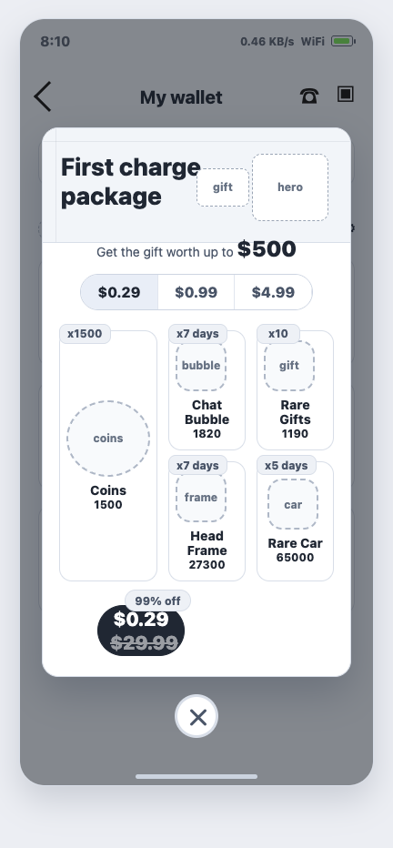
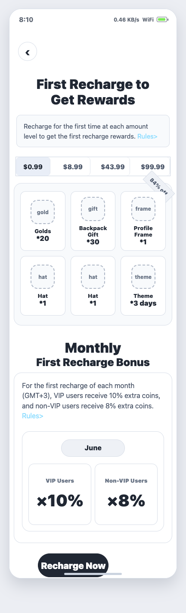

# WeChill 首充礼包弹窗与首充 H5 活动 PRD

> 版本：v1.0 可评审版  
> 日期：2026-06-05  
> 原型源文件：[wechill-first-recharge-prototype.html](wechill-first-recharge-prototype.html)  
> 截图资产：`assets/first_recharge_popup.png`、`assets/first_recharge_h5.png`

## 1. 项目概述

### 1.1 背景

WeChill 当前付费入口集中在 Wallet、房间礼物、金币不足补购、VIP 等链路。新用户或未付费用户进入钱包时，若只看到常规金币包，首笔付费转化刺激不足。

本期新增“首充礼包”活动，通过首充弹窗和首充 H5 活动页展示低门槛充值档位、额外金币、装扮、礼物、月度首充加成，引导用户完成首次充值，并继续探索更高档位充值。

### 1.2 一句话定位

用高价值礼包和清晰档位奖励，把未充值用户从 Wallet 引导到首笔充值，并让已充值用户继续领取未购买档位的首充奖励和月度首充加成。

### 1.3 页面关系

| 页面 | 作用 | 说明 |
|---|---|---|
| 首充弹窗 | 快速转化 | 在钱包页/充值页展示精选档位，直接调起充值 |
| 首充 H5 页面 | 完整说明与档位承接 | 展示所有首充档位、奖励、月度首充加成、规则和奖励状态 |

弹窗和 H5 属于同一个首充活动，不重复发奖。用户在弹窗购买某个档位，等同于在 H5 购买该档位。

## 2. 产品目标

| 目标 | 指标口径 | V1 参考目标 |
|---|---|---:|
| 提升首充转化 | 未充值用户进入钱包后的首充转化率 | >= 8% |
| 提升低价档购买 | $0.29 / $0.99 档位支付成功率 | >= 70% |
| 承接高档充值 | H5 高档位点击率、下单率 | 按灰度数据校准 |
| 提升月度复充 | 月度首充加成领取用户数 | 环比提升 10% |

## 3. 产品范围

### 3.1 V1 必做

| 模块 | 说明 |
|---|---|
| 首充弹窗 | 钱包/充值页展示首充礼包弹窗，支持档位切换和直接购买 |
| 首充 H5 页面 | 展示首充档位、奖励清单、月度首充 Bonus、规则入口、充值按钮 |
| 档位首充奖励 | 每个配置档位首购一次可获得对应奖励 |
| 月度首充加成 | 每月首次充值按 VIP/非 VIP 发放额外金币 |
| 支付与发奖 | 支付成功后服务端幂等发放首充奖励和月度加成 |
| 后台配置 | 活动开关、地区/版本、人群、档位、奖励、文案、弹窗频次 |
| 埋点 | 覆盖弹窗曝光、H5 曝光、档位切换、下单、支付结果、发奖结果 |

### 3.2 V1 不做

| 不做项 | 说明 |
|---|---|
| 补领历史首充奖励 | 活动上线前的历史充值不补发 |
| 自定义皮肤多套切换 | V1 原型仅表达结构，不定义最终视觉皮肤 |
| 礼包赠送 | 首充礼包仅本人购买本人领取 |
| 复杂任务联动 | V1 不绑定任务中心，只保留规则说明和充值链路 |

## 4. 客户端原型截图

### 4.1 首充礼包弹窗

结合竞品弹窗的“钱包页遮罩 + 头图区 + 档位切换 + 奖励卡片 + 大按钮”结构，但不沿用竞品视觉。原型为低保真线框占位图，重点表达模块布局。

### 4.2 首充 H5 活动页

结合竞品 H5 的信息结构：顶部标题、规则说明、金额档位、奖励宫格、月度首充 Bonus、底部充值按钮。原型为低保真线框占位图，最终视觉由设计稿承接。

## 5. 用户路径

### 5.1 弹窗路径

1. 用户进入 `My wallet` 或充值页。
2. 客户端请求首充活动状态。
3. 若用户符合弹窗展示条件，则展示首充礼包弹窗。
4. 用户切换金额档位，弹窗刷新该档位奖励。
5. 用户点击购买按钮，客户端创建充值订单。
6. 支付成功后，服务端发放金币、装扮、礼物等奖励。
7. 客户端刷新钱包余额、背包和首充活动状态。

### 5.2 H5 路径

1. 用户从弹窗、钱包 Banner、活动中心或充值页入口进入首充 H5。
2. H5 展示所有可配置档位及奖励状态。
3. 用户选择未购买档位并点击 `Recharge Now`。
4. 调起对应充值 SKU。
5. 支付成功后刷新档位状态，已购买档位展示已领取/已完成。

## 6. 展示与触发规则

### 6.1 首充弹窗展示条件

| 条件 | 规则 |
|---|---|
| 登录态 | 进入钱包/充值页后完成登录态校验，再请求活动状态 |
| 活动状态 | 后台活动开关开启，且当前时间在活动周期内 |
| 地区/版本 | 按后台配置的国家、语言、端版本、人群生效 |
| 用户状态 | 默认仅对“历史从未成功充值”的用户自动弹 |
| 频次控制 | 每个用户每天最多自动弹 1 次；关闭后当天不再自动弹 |
| 场景控制 | 钱包页、充值页可自动弹；房间内、私聊、游戏中不自动打断 |
| 弹窗互斥 | 低于强制更新、风控、支付结果弹窗；高优弹窗关闭后再判断是否展示 |

### 6.2 首充 H5 入口展示

| 入口 | 展示规则 |
|---|---|
| 弹窗按钮 | 弹窗可配置 `More rewards` 或点击头图进入 H5 |
| 钱包 Banner | 活动期间展示，已完成全部档位后可隐藏 |
| 活动中心 | 按运营配置展示 |
| 支付失败页 | 可展示“返回首充活动”入口 |
| 活动不可用 | 入口隐藏；旧链接进入展示活动结束态 |

## 7. 首充资格与奖励规则

### 7.1 首充定义

| 概念 | 规则 |
|---|---|
| 首笔充值 | 用户历史第一笔支付成功的充值订单 |
| 档位首充 | 用户首次购买某个配置 SKU/金额档位 |
| 弹窗首充 | 弹窗中的档位购买等同于 H5 的同档位购买 |
| 月度首充 | 用户在活动重置时区内，每个自然月第一笔支付成功的充值订单 |

### 7.2 档位规则

| 场景 | 规则 |
|---|---|
| 首次购买某档位 | 发放该档位首充奖励 |
| 重复购买同档位 | 只发常规充值金币，不再发首充奖励 |
| 购买更高档位 | 只解锁实际购买档位，不自动补低档位奖励 |
| 先买高档再买低档 | 后续首次购买低档时，仍可获得低档位首充奖励 |
| 支付失败/取消 | 不消耗首充资格，不发奖励 |
| 支付处理中 | 暂不发奖励；支付成功回调后发放 |
| 退款/拒付 | 按现有支付风控处理，可追回活动奖励或冻结资产 |

### 7.3 默认档位与奖励示例

| 档位 | 奖励内容 | 说明 |
|---|---|---|
| $0.29 | 金币、聊天气泡、稀有礼物、头像框、座驾 | 弹窗默认选中，用于低门槛转化 |
| $0.99 | 金币、背包礼物、资料框、帽子、主题 | H5 首屏主推档 |
| $8.99 | 更多金币、稀有礼物、头像框、入场特效 | 中档承接 |
| $43.99 | 高价值金币、座驾、装扮、主题 | 高价值用户承接 |
| $99.99 | 顶级装扮、稀有礼物包、座驾 | 可灰度配置 |

所有档位、奖励、价值展示、折扣文案均由后台配置。前端只展示服务端返回的当前生效配置。

## 8. 月度首充 Bonus

| 项 | 规则 |
|---|---|
| 重置时区 | 默认 GMT+3，每月 1 日 00:00 重置 |
| 触发条件 | 用户当月第一笔支付成功的充值订单 |
| VIP 用户 | 额外发放充值金币的 10% |
| 非 VIP 用户 | 额外发放充值金币的 8% |
| 本单升级 VIP | 若本次充值后用户升级为 VIP，按 VIP 10% 发放或补差 |
| 重复充值 | 当月第二笔及以后不再享受月度首充 Bonus |
| 档位首充叠加 | 月度首充 Bonus 可与档位首充奖励同时发放 |

## 9. 支付与发奖规则

| 场景 | 处理 |
|---|---|
| 创建订单 | 客户端传 `activity_id`、`tier_id`、`source`，服务端校验档位和资格 |
| 支付成功 | 以支付服务回调为准，服务端幂等发放首充奖励 |
| 重复回调 | 同一订单只发放一次奖励 |
| 订单超时 | 不发奖励；用户可重新下单 |
| SKU 不匹配 | 若支付 SKU 与活动档位不匹配，不发活动奖励 |
| 奖励发放失败 | 进入补发队列；前端展示稍后到账 |
| 活动结束后支付成功 | 若订单创建时活动有效，且支付在订单有效期内成功，可继续发放；超出订单有效期不发活动奖励 |

## 10. 后台配置需求

| 配置项 | 字段说明 |
|---|---|
| 活动开关 | 全局开关、国家/语言/端版本、人群开关 |
| 活动时间 | 开始时间、结束时间、重置时区 |
| 弹窗配置 | 是否自动弹、每日频次、默认档位、关闭后策略 |
| H5 配置 | 页面标题、规则文案、Banner、按钮文案、入口开关 |
| 档位配置 | SKU、金额、折扣、原价、排序、是否上架 |
| 奖励配置 | 奖励类型、数量、有效期、价值展示、兜底奖励 |
| 月度 Bonus | VIP/非 VIP 加成比例、是否与档位奖励叠加 |
| 风控配置 | 黑名单、地区限制、支付风险用户、退款追回策略 |
| 多语言 | 英文、阿语、法语等文案配置 |
| 操作日志 | 配置人、配置时间、变更内容、发布状态 |

## 11. 接口建议

### 11.1 查询活动状态

`GET /activity/first-recharge/status`

| 字段 | 类型 | 说明 |
|---|---|---|
| activity_id | string | 活动 ID |
| is_active | boolean | 活动是否有效 |
| popup_auto_show | boolean | 本次是否需要自动弹 |
| user_first_paid | boolean | 用户是否已有历史首笔充值 |
| monthly_bonus_available | boolean | 当月是否还可享受月度首充 Bonus |
| tiers | array | 档位列表及奖励状态 |
| selected_tier_id | string | 默认选中的档位 |
| server_time | number | 服务端时间戳 |

### 11.2 创建充值订单

`POST /wallet/recharge/order`

| 字段 | 类型 | 说明 |
|---|---|---|
| sku_id | string | 充值 SKU |
| activity_id | string | 首充活动 ID |
| tier_id | string | 档位 ID |
| source | string | `popup` / `h5` / `wallet_banner` / `activity_center` |

返回字段建议：

| 字段 | 类型 | 说明 |
|---|---|---|
| order_id | string | 订单 ID |
| pay_params | object | 支付参数 |
| tier_reward_preview | array | 本单预计可获得的档位奖励 |
| monthly_bonus_preview | object | 本单预计可获得的月度加成 |

### 11.3 支付成功后状态刷新

`GET /activity/first-recharge/order-result`

| 字段 | 类型 | 说明 |
|---|---|---|
| order_id | string | 订单 ID |
| pay_status | string | `success` / `pending` / `failed` |
| reward_status | string | `delivered` / `pending` / `failed` |
| delivered_rewards | array | 已发放奖励 |
| balance | object | 最新金币余额 |
| tier_completed | boolean | 当前档位是否已完成 |

## 12. 错误码与前端处理

| error_code | 场景 | 前端处理 |
|---|---|---|
| ACTIVITY_NOT_STARTED | 活动未开始 | 不展示入口或展示未开始态 |
| ACTIVITY_ENDED | 活动已结束 | 隐藏入口；旧链接展示结束态 |
| NOT_ELIGIBLE | 用户不符合地区/版本/人群 | 隐藏入口，不自动弹 |
| TIER_ALREADY_CLAIMED | 该档位已购买过 | 刷新档位为已完成，引导选择其他档位 |
| SKU_NOT_MATCH | SKU 与档位不匹配 | 不创建订单或提示配置异常 |
| ORDER_PENDING | 订单处理中 | 展示支付处理中，轮询订单结果 |
| PAYMENT_FAILED | 支付失败/取消 | 不发奖励，不消耗首充资格 |
| REWARD_PENDING | 奖励补发中 | 展示领取成功但稍后到账 |
| RISK_BLOCKED | 命中支付/活动风控 | 不发奖励，提示不可参与 |

## 13. 埋点需求

| 事件名 | 触发时机 | 关键属性 |
|---|---|---|
| first_recharge_popup_show | 弹窗曝光 | user_id、activity_id、default_tier、source |
| first_recharge_popup_close | 弹窗关闭 | user_id、activity_id、selected_tier、duration_ms |
| first_recharge_popup_tier_click | 弹窗切换档位 | tier_id、price、claimed_status |
| first_recharge_popup_buy_click | 弹窗点击购买 | tier_id、price、discount |
| first_recharge_h5_show | H5 页面曝光 | source、activity_id、user_first_paid |
| first_recharge_h5_tier_click | H5 点击档位 | tier_id、price、claimed_status |
| first_recharge_order_create | 创建订单 | source、tier_id、sku_id、price |
| first_recharge_pay_result | 支付结果 | order_id、pay_status、tier_id、price |
| first_recharge_reward_result | 发奖结果 | reward_status、tier_id、reward_type、error_code |
| monthly_first_bonus_result | 月度加成结果 | vip_status、bonus_rate、bonus_amount |

## 14. 异常与边界

| 场景 | 处理 |
|---|---|
| 用户已首充 | 不自动弹首充弹窗；H5 仍可展示未购买档位 |
| 已完成全部档位 | H5 展示全部已完成；钱包 Banner 可隐藏 |
| 弹窗关闭未购买 | 当天不再自动弹；入口仍可手动打开 H5 |
| 支付成功但客户端未收到回调 | 下次进入钱包/H5 时通过订单结果接口补刷新 |
| 活动配置中途变更 | 已完成档位不受影响；未完成档位按当前生效配置展示 |
| 奖励下架/库存不足 | 发放兜底奖励或进入补发队列 |
| 月初跨天 | GMT+3 月初重置月度 Bonus，不依赖客户端本地时间 |
| 用户升级 VIP | 以订单支付成功后的 VIP 状态判断月度加成；本单升级则按 VIP 处理 |
| 退款/拒付 | 按现有风控策略追回奖励、扣减金币或冻结账号 |
| 多端同时购买 | 以服务端订单和档位状态为准，同一档位奖励只发一次 |

## 15. 验收标准

| 模块 | 验收点 |
|---|---|
| 弹窗展示 | 未充值用户进入钱包/充值页满足条件时自动弹，关闭后当天不再自动弹 |
| 弹窗购买 | 切换档位后奖励和价格刷新，点击购买创建正确 SKU 订单 |
| H5 页面 | 展示全部档位、奖励、月度 Bonus、规则文案和充值按钮 |
| 档位奖励 | 每个档位首次购买发奖励，重复购买不再发档位奖励 |
| 首笔用户 | 弹窗购买成功后不再自动弹首充弹窗 |
| 高低档关系 | 购买高档不自动补低档，后续首次购买低档仍可领低档奖励 |
| 月度 Bonus | 每月第一笔支付成功订单按 VIP/非 VIP 比例发放额外金币 |
| 支付异常 | 支付失败、取消、处理中不消耗首充资格 |
| 发奖异常 | 补发、库存不足、奖励下架均有明确提示或兜底奖励 |
| 活动边界 | 未开始不展示，结束后不发新活动奖励，旧链接进入展示结束态 |
| 数据埋点 | 弹窗、H5、档位、下单、支付、发奖、月度加成事件均可查询 |
